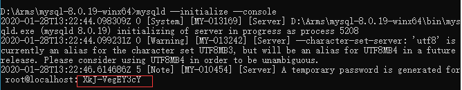

# MySQL介绍

## 目录

1. 安装与配置
   - [windows环境](#windows环境)
   - [linux环境](#linux环境)

一款开源、免费的数据库软件。

MySql官网: [https://www.mysql.com/](https://www.mysql.com/)

MySQL不足：

- MyISAM格式的数据表只有数据表锁定，没有数据行锁定，可以使用InnoDB格式数据表绕过这个问题
- MyISAM数据表不能热备份，即无需锁定数据表就可以在对数据表进行处理时同时对其进行备份。InnoDB可以，但是收费
- 不支持自定义类型
- 不能直接处理XML数据
- 没有OLAP功能。支持OLAP的数据库系统通常称为数据仓库(data warehouse)
- 从5.0版本开始支持的存储过程和触发器并不成熟
- 从4.1版本开始支持的GIS也不成熟

MySQL版本：

- Alpha：开发
- Beta：基本完成
- Gamma：更加稳定
- Production 或 Generally Available(GA)：足够成熟和稳定

MySQL许可证：GPL(GNU Public License)

SQL兼容性：MySQL 支持 SQL，SQL 有许多种“方言”，可以通过调整 MySQL 服务器的配置开关 sql-mode 使它在行为上与 IBM DB2 和 Oracle 等多种数据库系统保持最大限度的兼容

MySQL数据文件：

- Linux: /var/lib/mysql
- Windows: %MySQL%/data

```txt
data/dbname/tablename.frm: 数据表结构定义
data/dbname/db.opt: 整个数据库的结构定义和设置
data/dbname/tablename.MYD: MyISAM数据表数据
data/dbname/tablename.MYI: MyISAM数据表索引
innodb_file_per_table: InnoDB存储方式（各自一个文件，统一的表空间）
data/dbname/tablename.idb: InnoDB数据表数据、索引默认存储
data/ibdata1,-2,-3:  表空间和撤销日志
data/ib_logfile0,-1,-2: InnoDB日志数据
data/dbname/tablename.TRG: 触发器
```

## 安装与配置

### windows环境

#### 压缩包版

1. 设置环境变量  

   配置 `MYSQL_HOME` 为MySQL的解压路径，并设置path： `;%MYSQL_HOME%\bin`

2. 在MySQL解压路径下，新建 `my.ini` 配置初始化参数：

   ```ini
   [mysql]
   # 设置mysql客户端默认字符集
   default-character-set=utf8
   [mysqld]
   #设置3306端口
   port = 3306
   # 设置mysql的安装目录
   basedir=D:\Arms\mysql-8.0.19-winx64
   # 设置mysql数据库的数据的存放目录
   datadir=D:\Arms\mysql-8.0.19-winx64\data
   # 允许最大连接数
   max_connections=2000
   # 允许连接失败的次数。这是为了防止有人从该主机试图攻击数据库系统
   max_connect_errors=10
   # 服务端使用的字符集默认为8比特编码的latin1字符集
   character-set-server=utf8
   # 创建新表时将使用的默认存储引擎
   default-storage-engine=INNODB
   # 默认使用 "mysql_native_password" 插件认证
   default_authentication_plugin=mysql_native_password
   [client]
   # 设置mysql客户端连接服务端时默认使用的端口
   port=3306
   default-character-set=utf8
   ```

   >my.ini文件格式要是 `ANSI` 格式，否则会报这种错误：`Found option without preceding group in config file`

3. 初始化数据库

   以**管理员**的身份打开cmd命令窗口，输入 `mysqld --initialize --console` 命令初始化 mysql 的 data 数据目录，初始化完毕后，会在解压目录下生成一个data文件夹，cmd窗口中会有随机生成的密码：

   

   生成密码：XkJ-VegEY3cY

4. 安装服务  
   - 注册服务：`mysqld --install mysql-master --defaults-file="D:\Arms\mysql-8.0.19-winx64\my.ini"`
   - 启动服务：`net start mysql-master`
   - 登录：`mysql -u root -p`

5. 更改密码

   ```sql
   set password for root@localhost='123456';
   -- 或者
   ALTER USER USER() IDENTIFIED BY '新密码';
   ```

**问题解决：**

1. 服务名无效  

   原因：没有注册 mysql 到服务中。  

   解决：在命令行中输入`mysqld --install`，出现 Service successfully install 代表安装成功

2. cmd中能登录，Navicat中不能登录  

   错误提示：

   ```sh
   1251 - Client does not support authentication protocol requested by server; consider upgrading MySQL client
   # 或者
   Authentication plugin 'caching_sha2_password' cannot be loaded
   # 或者
   Access denied for user 'root'@'localhost'
   ```

   原因：

   1. 没有开启远程登录
   2. mysql8 之前的版本中加密规则是 `mysql_native_password`，而在 mysql8 之后，加密规则是 `caching_sha2_password`。

   解决：

   1. 开启远程登录
   2. 把 mysql 用户登录密码加密规则还原成 `mysql_native_password`，或者升级 Navicat 驱动。  

   ```sh
   # 登录系统
   mysql -u root -p 密码
   # 切换数据库
   mysql> use mysql;
   # 更新，任意客户端可以使用root登录
   mysql> update user set host = '%' where user = 'root';

   # 修改加密规则
   mysql> ALTER USER 'root'@'%' IDENTIFIED BY 'password' PASSWORD EXPIRE NEVER;
   # 更新用户密码
   mysql> ALTER USER 'root'@'%' IDENTIFIED WITH mysql_native_password BY 'password';

   # 刷新权限
   mysql> flush privileges;

   # 上面的命令不行，可以试试下面的
   mysql> grant all privileges on *.* to root@'%' identified by '密码';
   # 如果是固定ip就这么写  
   mysql> grant all privileges on *.* to 'root'@'192.168.0.49' identified by '密码' with grant option;

   mysql> flush privileges;

   # 退出命令行
   mysql> exit;
   ```

#### 安装包版

根据向导安装即可！

### linux环境
