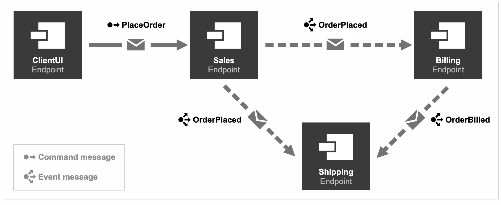

# 分布式框架

## 目录

1. NServiceBus

## NServiceBus

NServiceBus是.Net平台下的开源的消息服务框架，已经支持.Net Core。目前稳定版本7.1。企业开发需要购买License，开发者可在线下载开发者License。

官方网站：[https://particular.net/](https://particular.net/)  
官方示例：[https://docs.particular.net/get-started/](https://docs.particular.net/get-started/)

如图所示，项目一共包括4个端点(Endpoint)，也就是四个单独的项目，端点是NServiceBus中的核心概念，发送消息和事件发布订阅的基础都是Endpoint。这个项目中包括发送消息和事件的发布订阅。

NServiceBus的核心是在端点之间通信，通信的实体需要实现ICommand接口，通信的事件需要实现IEvent事件，NServiceBus会扫描实现这两个接口的类。每个端点之间的关键配置就是EndpointConfiguration。

当你在处理异步消息时，每个单独的消息处理程序都是一个单独的handler，每个handler之间互不影响。这时如果一个消息依赖另一个消息的状态呢？ 这时业务逻辑怎么处理？

借用我们上篇的业务场景，如果在Ship项目里需要发送一个ShipOrder Command。这个ShipOrder需要依赖Sales.OrderPlaced和Bill.OrderBilled Command的状态，目前我们的两个单独的Message Handler都没有保持任何的状态字段，所以这时如果我们需要完成这个业务模型，就需要跟踪他们的状态。
