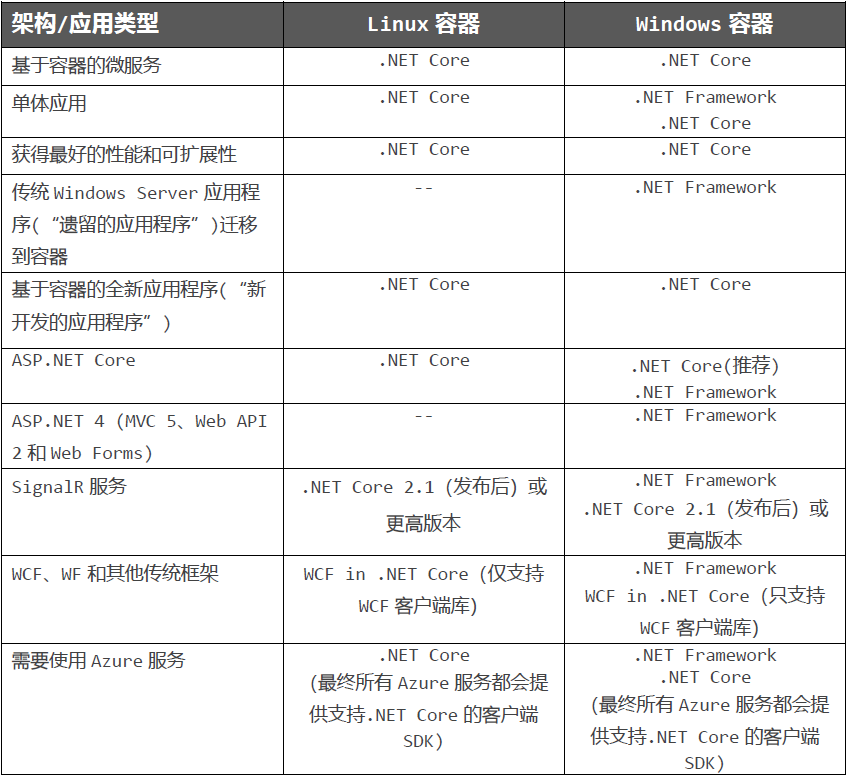
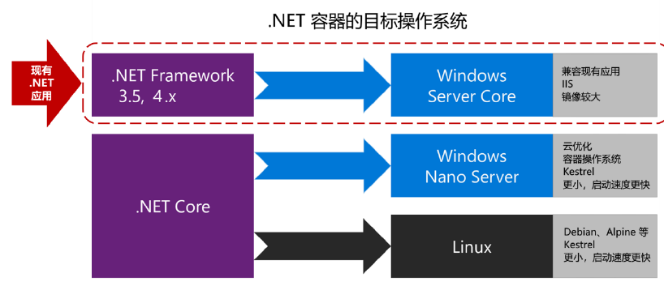
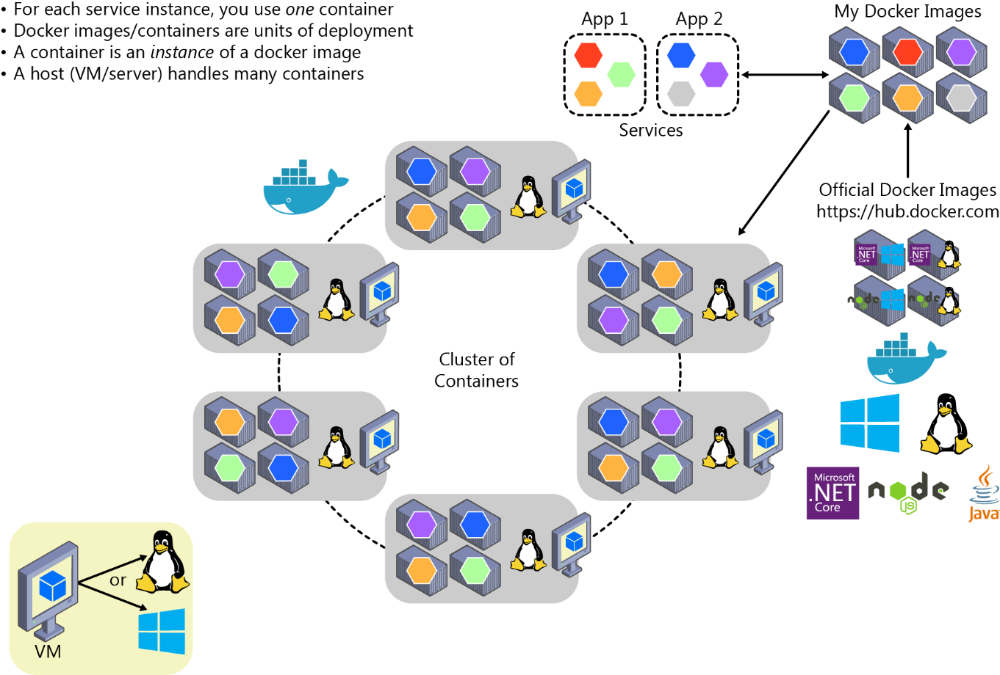

# 微服务架构

## 目录

1. 容器
   - [Docker容器、映像和注册表](#Docker容器、映像和注册表)
   - [为Docker容器选择.NETCore或.NETFramework](#为Docker容器选择.NETCore或.NETFramework)
   - [.NET容器应该选择哪种操作系统](#.NET容器应该选择哪种操作系统)
   - [官方.NETDocker镜像](#官方.NETDocker镜像)

## Docker容器、映像和注册表

使用 Docker 时，你会创建一个应用或服务，并将它及其依赖项打包到一个容器映像中。 映像是应用或服务及其配置和依赖项的静态表示形式。

若要运行应用或服务，应用的映像会实例化，以创建一个在 Docker 主机上运行的容器。 最初，会在开发环境或 PC 中测试容器。

将映像存储在注册表中，该注册表充当映像库。 部署到生产业务流程协调程序时需要一个注册表。 Docker 通过 [Docker Hub](https://hub.docker.com/)维护一个公共注册表；其他供应商为不同映像集合提供注册表，包括 [Azure 容器注册表](https://azure.microsoft.com/services/container-registry/)。 或者，企业可本地拥有一个专用注册表，用于其 Docker 映像。

下图显示了 Docker 中的映像和注册表与其他组件相关联的方式。还显示了供应商推出的多种注册表产品/服务。

通过将映射放在注册表中，可在框架级别存储静态和不可变的应用程序，包括其所有依赖项。 然后，可以在多个环境中对映像进行版本和部署，从而提供一致的部署单元。

## 为Docker容器选择.NETCore或.NETFramework

什么情况下选择`.NET Core`开发基于Docker容器的应用程序？

- 跨平台开发和部署
- 基于容器从头开发一个新项目
- 在容器上创建和部署微服务
- 在可扩展的系统中进行高密度部署

什么情况下选择`.NET Framework`开发容器化的应用程序？

- 将现有应用程序直接迁移到Windows容器中
- 需要使用.NET Core不支持的第三方库和NuGet包
- 需要使用.NET Core不支持的.NET技术
- 需要使用不支持.NET Core的平台或API

决策表：什么情况下，在Docker中使用怎样的.NET框架？

## .NET容器应该选择哪种操作系统

当我们把镜像名称添加到Dockerfile文件时，可以通过标签来指定操作系统和运行时的具体版本，下面是一些具体的实例：

镜像|说明
-|-
microsoft/dotnet:2.0.0-runtime-jessie|Linux上的`.NET Core 2.0`运行时
microsoft/dotnet:2.0.0-runtime-nanoserver-1709|Windows Nano Server上的`.NET Core 2.0`运行时（Windows Server 2016秋季创意者更新版本1709）
microsoft/aspnetcore:2.0|.NET Core 2.0多架构：支持依赖于具体主机的Linux和Windows Nano Server。aspnetcore镜像针对`ASP.NET Core`做了一些优化

## 官方.NETDocker镜像

对于.NET仓库来说，微软的愿景是尽量构建小而专的仓库。一个仓库代表一种具体场景，或者一个需要完成的具体工作。例如，[microsoft/aspnetcore](https://hub.docker.com/r/microsoft/dotnet/)镜像应该在Docker上使用`ASP.NET Core`的场景下使用，因为这些镜像做了额外优化，可以让容器更快地启动。

而.NET Core镜像（[microsoft/dotnet](https://hub.docker.com/r/microsoft/dotnet/)）是为基于`.NET Core`的控制台应用程序设计的。例如：批处理、Azure WebJobs和其他应该使用`.NET Core`的控制台场景。这些镜像并不包含`ASP.NET Core`栈，所以容器镜像的体积会更小一些。

大多数镜像仓库都提供了很多标签，帮助我们选择特定的框架版本和操作系统（Linux发行版或不同版本的Windows）。

关于微软提供的官方`.NET Docker`镜像的详细信息，可参考[`.NET Docker`镜像摘要](https://aka.ms/dotnetdockerimages)。

### `.NET Core`和Docker镜像为开发与生产提供的优化措施

为开发人员构建Docker镜像的时候，微软主要把精力放到了以下场景：

- 用于开发和构建`.NET Core`应用程序的镜像。
- 用于运行`.NET Core`应用程序的镜像。

为什么需要多个镜像？当开发、构建和运行容器化应用程序时，我们通常会有不同优先级。通过为这些独立的任务提供不同镜像，微软可以帮助大家分别优化开发，构建和部署应用的流程。

#### 开发和构建阶段

开发阶段最重要的事情是：迭代新功能的速度和调试新功能的能力。镜像体积并不像代码变更以及快速查看这些变更的能力那么重要。一些工具和“生成代理容器”，会在开发和生成时使用开发版的`ASP.NET Core`镜像（[microsoft/aspnetcore-build](https://hub.docker.com/r/microsoft/aspnetcore-build/)）。在容器内部构建时，重要的事情是编译应用程序所需的组件，这其中包括编译器、其他.NET依赖，以及类似npm、Gulp和Bower这样的网页开发所需的依赖。

这种构建镜像为什么重要？实际上我们并不会把这种镜像部署到生产环境中，这种镜像只是用来构建一些需要放到生产镜像中的内容，用于持续集成（CI）环境和构建环境。举例来说，与其直接在构建代理主机（例如虚拟机）上手动安装所有应用程序依赖，不如让构建代理直接实例化一个带有构建应用程序所需所有依赖的`.NET Core`构建镜像。构建代理只需要知道怎样运行这个Docker镜像就可以了。借此可简化CI环境，使其变得更加可预测。

#### 生产环境

在生产环境中，最重要的事情是我们可以快速部署并启动基于产品化`.NET Core`镜像的容器。所以，基于[microsoft/aspnetcore](https://hub.docker.com/r/microsoft/aspnetcore/)的运行时镜像通常比较小，借此可以更快速地从Docker注册表传输到Docker主机。提前准备好需要运行的内容，可以让启动容器后在最短时间内产生处理结果。在Docker模型中，无需从C#代码的编译开始，而是在构建容器过程中，运行dotnet build或dotnet publish命令完成的。

在这个优化过的镜像中，我们只需要把二进制文件和运行应用程序所需的其他内容放进去即可。例如，通过dotnet publish命令创建的部署包只包含编译过的.NET二进制文件、图片、.js和.css文件。运行之后，我们会看到一些包含JIT预编译包的镜像。

虽然.NET Core和ASP.NET Core镜像有多个版本，但它们之间共享了一个或多个镜像层，其中包括基础镜像层。所以，存储一个镜像所需的磁盘空间很小。它只包含自定义镜像相对于基础镜像的增量内容，因此从注册表拉取镜像的过程也可以更快。

在Docker Hub上浏览.NET镜像仓库的时候，我们会发现用标签分类或标记的多个版本。下表可以帮助我们选择应该使用的版本：

镜像|说明
-|-
microsoft/aspnetcore:2.0|基于Linux和Windows（多架构），只包含`ASP.NET Core`运行时和`ASP.NET Core`的一些优化
microsoft/aspnetcore-build:2.0|基于Linux和Windows（多架构），包含`ASP.NET Core`的SDK

下图介绍如何部署到由多个微服务（容器）组成的应用程序群集。

它看上去类似于逻辑方法。 但是如何处理负载均衡、路由以及如何协调安排这些组合式应用程序呢？

Docker 命令行接口 (CLI) 满足在一台主机上管理一个容器的需求，但若要管理针对更复杂的分布式应用程序在多台主机上部署的多个容器，则无法满足需求。 大多数情况下，需要一个管理平台，该平台能自动启动容器、横向扩展容器（每个映像具有多个实例）、必要时暂停或关闭容器，并且在理想情况下还能控制资源（如网络和数据存储）访问方式。

如果不仅要管理个别容器或简单的组合式应用，还要进一步管理使用微服务的较大型企业应用程序，则必须转向业务流程和群集平台。

从体系结构和开发的角度来看，如果要生成基于微服务的大型企业应用程序，请务必了解清楚下面列出的支持高级方案的平台和产品：

- 群集和业务流程协调程序。 如果需要跨多个 Docker 主机横向扩展应用程序，如使用基于微服务的大型应用程序，至关重要的是，能够通过抽象化基础平台的复杂性，将所有主机作为单个群集进行管理。 这就是容器群集和业务流程协调程序所提供的功能。 业务流程协调程序的示例包括 Azure Service Fabric 和 Kubernetes。 Kubernetes 通过 Azure Kubernetes 服务在 Azure 中提供。
- 计划程序。 计划意味着管理员能够在群集中启动容器，因此计划程序也可提供用户界面来执行此操作。 群集计划程序具有多个职责：高效使用群集资源、设置用户提供的约束、有效负载均衡节点或主机间的容器，以及在提供高可用性的同时强力解决错误。

群集和计划程序的概念密切相关，因此不同供应商提供的产品通常具有这两套功能。 以下部分显示群集和计划程序最重要的平台和软件选项。 公有云（如 Azure）中普遍提供这些业务流程协调程序。
