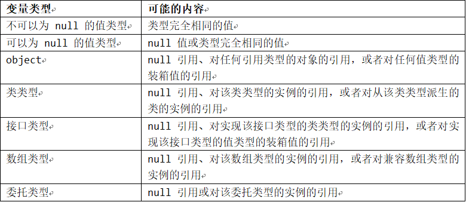
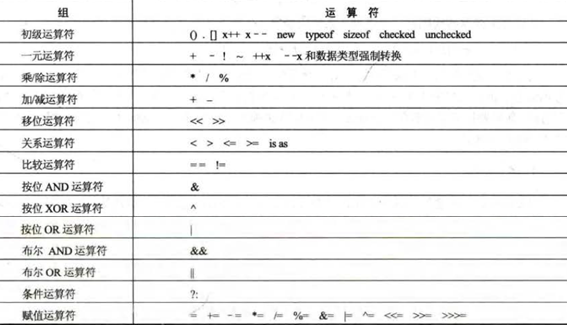

# CSharp

## 网络通信

***基础理论***

OSI(Open System Interconnection)，意为开放式系统互联。国际标准化组织(ISO)制定了OSI模型，该模型定义了不同计算机互联的标准，是设计和描述计算机网络通信的基本框架。OSI模型把网络通信的工作分为7层，从低到高分别是物理层、数据链路层、网络层、传输层、会话层、表示层和应用层。

这是一种事实上被TCP/IP 4层模型淘汰的协议。在当今世界上没有大规模使用。


***传输层协议概览***


传输控制协议 TCP 是一个面向联接的协议，允许从一台机器发出的字节流无差错地发往到互联网上的其他机器。

用户数据报协议 UDP 是一个不可靠的无联接的协议，用于不需要排序和流量控制的应用程序。

***网络层协议概览***


网络层的 IP 协议，实现了 IP 包的封装和寻径发送，它的功能是主机可以把分组发往任何网络并使分组独立地传向目标。这些分组到达的顺序和发送的顺序可能不同。

另外，网络层还包括了互联网络控制消息协议 ICMP、地址解析协议 ARP、反向地址解析协议 RARP。

TCP/IP：Transmission Control Protocol/Internet Protocol，传输控制协议/因特网互联协议，又名网络通讯协议。

简单来说：TCP控制传输数据，负责发现传输的问题，一旦有问题就发出信号，要求重新传输，直到所有数据安全正确地传输到目的地，而IP是负责给因特网中的每一台电脑定义一个地址，以便传输。

从协议分层模型方面来讲：TCP/IP由：网络接口层（链路层）、网络层、传输层、应用层。它和OSI的七层结构以及对应协议族不同，下图简单表示：

TCP/IP|OSI
-|-
应用层<br>表示层<br>会话层|应用层
主机到主机层(TCP)，又称传输层|传输层
网络层(IP)，又称互联层|网络层
网络接口层，又称链路层|数据链路层
物理层|

---

OSI中的层|功能|TCP/IP协议族
-|-|-
应用层|文件传输，电子邮件，文件服务，虚拟终端|TFTP,HTTP,SNMP,FTP,SMTP,DNS,Telnet...
表示层|翻译、加密、压缩|无
会话层|对话控制、建立同步点（续传）|无
传输层|端口寻址、分段重组、流量、差错控制|TCP,UDP
网络层|逻辑寻址、路由选择|IP,ICMP,OSPF,EIGRP,IGMP
数据链路层|成帧、物理寻址、流量、差错、接入控制|SLIP,CSLIP,PPP,MTU
物理层|设置网络拓扑结构、比特传输、位同步|ISO2110,IEEE802,IEEE802.2


### Socket编程

现阶段socket通信使用TCP、UDP协议，首先讲述TCP/IP的三次握手

1. 客户端发送syn报文到服务器端，并置发送序号为x。
2. 服务器端接收到客户端发送的请求报文，然后向客户端发送syn报文，并且发送确认序号x+1，并置发送序号为y。
3. 客户端受到服务器发送确认报文后，发送确认信号y+1，并置发送序号为z。至此客户端和服务器端建立连接。


在此基础上，socket连接过程：

1. 服务器监听：服务器端socket并不定位具体的客户端socket，而是处于等待监听状态，实时监控网络状态。
2. 客户端请求：客户端clientSocket发送连接请求，目标是服务器的serverSocket。为此，clientSocket必须知道serverSocket的地址和端口号，进行扫描发出连接请求。
3. 连接确认：当服务器socket监听到或者是受到客户端socket的连接请求时，服务器就响应客户端的请求，建立一个新的socket，把服务器socket发送给客户端，一旦客户端确认连接，则连接建立。

注：在连接确认阶段，服务器socket即使在和一个客户端socket建立连接后，还在处于监听状态，仍然可以接收到其他客户端的连接请求，这也是一对多产生的原因。

下图简单说明连接过程：


socket连接原理知道了，此处编写最基本最简单的socket通信：

**服务器端：**

```C#
static void Main(string[] args)
{
    Console.WriteLine("Starting: Creating Socket object");
    Socket listener = new Socket(AddressFamily.InterNetwork, SocketType.Stream, ProtocolType.Tcp);
    listener.Bind(new IPEndPoint(IPAddress.Any, 2112));
    listener.Listen(10);

    while (true)
    {
        Console.WriteLine("Waiting for connection on port 2112");
        Socket socket = listener.Accept();
        string receivedValue = string.Empty;

        while (true)
        {
            byte[] receivedBytes = new byte[1024];
            int numBytes = socket.Receive(receivedBytes);
            Console.WriteLine("Receiving .");
            receivedValue += Encoding.ASCII.GetString(receivedBytes, 0, numBytes);
            if (receivedValue.IndexOf("[FINAL]") > -1)
            {
                break;
            }
        }

        Console.WriteLine("Received value: {0}", receivedValue);
        string replyValue = "Message successfully received.";
        byte[] replyMessage = Encoding.ASCII.GetBytes(replyValue);
        socket.Send(replyMessage);
        socket.Shutdown(SocketShutdown.Both);
        socket.Close();
    }
}
```

**客户端：**

```C#
static void Main(string[] args)
{
    byte[] receivedBytes = new byte[1024];
    IPHostEntry ipHost = Dns.GetHostEntry("127.0.0.1");
    IPAddress ipAddress = ipHost.AddressList[0];
    IPEndPoint ipEndPoint = new IPEndPoint(ipAddress, 2112);
    Console.WriteLine("Starting: Creating Socket object");
    Socket sender = new Socket(AddressFamily.InterNetwork, SocketType.Stream, ProtocolType.Tcp);
    sender.Connect(ipEndPoint);
    Console.WriteLine("Successfully connected to {0}", sender.RemoteEndPoint);
    string sendingMessage = "Hello World Socket Test";
    Console.WriteLine("Creating message: Hello World Socket Test");
    byte[] forwardMessage = Encoding.ASCII.GetBytes(sendingMessage + "[FINAL]");
    sender.Send(forwardMessage);
    int totalBytesReceived = sender.Receive(receivedBytes);
    Console.WriteLine("Message provided from server: {0}",
        Encoding.ASCII.GetString(receivedBytes, 0, totalBytesReceived));
    sender.Shutdown(SocketShutdown.Both);
    sender.Close();
    Console.ReadLine();
}
```

基础
开发工具
集成开发环境软件：Visual Studio、SharpDevelop
轻量级开发工具：Snippet Compiler
通用编辑器：UltraEdit、NotePad++、EditPlus等
反编译软件：.Net Reflector、ILSpy
	使用混淆器可以防止反编译
单元测试工具：NUnit
	极限编程(eXtreme Programing, XP)
	测试驱动开发(Test Driven Develop, TDD)	
代码生成工具：CodeSmith
代码标准检测工具：FxCop
变量类型
    基本类型
    (1)整型：sbyte、short、int、long、byte、ushort、uint、ulong
    (2)浮点类型：float、double、decimal
    (3)bool类型
    (4)字符类型：char
通用类型系统 (common type system)：一种确定公共语言运行库如何定义、使用和管理类型的规范。CLR通过CTS(通用类型系统)，实现严格的类型和代码验证，来增强代码鲁棒性(鲁棒是Robust的音译，也就是健壮和强壮的意思)。CTS 确保所有托管代码是自我描述的。各种Microsoft编译器和第三方语言编译器都可生成符合CTS的托管代码。这意味着，托管代码可在严格实施类型保真和类型安全的同时，使用其他托管类型和实例。




运算符


下表按照从最高到最低的优先级顺序概括了所有的运算符：


当操作数出现在具有相同优先级的两个运算符之间时，运算符的顺序关联性控制运算的执行顺序：除赋值运算符外，所有的二元运算符都向左关联 (left-associative)，这表示从左向右执行运算。赋值运算符和条件运算符 (?:) 向右顺序关联 (right-associative)，意思是从右向左执行运算。优先级和顺序关联性都可以用括号控制。
运算符重载
所有一元和二元运算符都具有可自动用于任何表达式的预定义实现。除了预定义实现外，还可通过在类或结构中包括 operator 声明来引入用户定义的实现。用户定义的运算符实现的优先级始终高于预定义运算符实现的优先级：仅当不存在适用的用户定义运算符实现时才考虑预定义的运算符实现。
一元运算符 (overloadable unary operator): +,-,!,~,++,--,true,false
虽然不在表达式中显式使用true和false，但仍将它们视为运算符，原因是它们在多种表达式上下文中被调用：布尔表达式以及涉及条件运算符和条件逻辑运算符的表达式。
二元运算符 (overloadable binary operator): +,-,*,/,%,&,|,^,<<,>>,==,!=,>,<,>=,<=
只有以上所列的运算符可以重载。具体而言，不可能重载成员访问、方法调用或 =、&&、||、??、?:、=>、checked、unchecked、new、typeof、default、as 和 is 运算符。
当重载一个二元运算符时，也会隐式重载相应的赋值运算符（若有）。例如，运算符 * 的重载也是运算符 *= 的重载。请注意，赋值运算符本身 (=) 不能重载。赋值总是简单地将值按位复制到变量中。
强制转换运算（如 (T)x）通过提供用户定义的转换来重载。
元素访问（如 a[x]）不被视为可重载的运算符。但是，可通过索引器支持用户定义的索引。
在表达式中，使用运算符表示法来引用运算符，而在声明中，使用函数表示法来引用运算符。下表显示了一元运算符和二元运算符的运算符表示法和函数表示法之间的关系。在第一项中，op 表示任何可重载的一元前缀运算符。在第二项中，op 表示 ++ 和 -- 一元后缀运算符。在第三项中，op 表示任何可重载的二元运算符。
运算符表示法	函数表示法
op x	operator op(x)
x op	operator op(x)
x op y	operator op(x, y)
用户定义的运算符声明总是要求至少一个参数为包含运算符声明的类或结构类型。因此，用户定义的运算符不可能具有与预定义运算符相同的签名。
用户定义的运算符声明不能修改运算符的语法、优先级或顺序关联性。例如，/ 运算符始终为二元运算符，始终具有指定的优先级，并且始终左结合。
虽然用户定义的运算符可以执行它想执行的任何计算，但是强烈建议不要采用产生的结果与直觉预期不同的实现。例如，operator == 的实现应比较两个操作数是否相等，然后返回一个适当的 bool 结果。

关键字
关键字(keyword)是类似标识符的保留的字符序列，不能用作标识符(以"@"字符开头时除外)。
abstract		as				base			bool			break
byte			case			catch			char			checked
class			const			continue		decimal		    default
delegate		do				double		    else			enum
event			explicit		extern		    false			finally
fixed			float			for			    foreach		    goto
if			implicit		in				int			    interface
internal		is				lock			long			namespace
new			null			object		    operator		out
override		params		    private		    protected	    public
readonly		ref			    return		    sbyte			sealed
short			sizeof		    stackalloc	    static		    string
struct		switch		    this			throw			true
try			typeof		    uint			ulong			unchecked
unsafe		ushort		    using			virtual		    void
volatile		while

预处理器指令
    #defined 和 #undef ： 告诉编译器存在给定名称的符号和删除符号，必须放在源文件的开头位置。
   	#if、#elif、#else、#endif ：条件编译指令
    #warning和#error：产生警告或错误
    #region和#endregion：把一段代码标记为一块，可折叠
    #line：改变编译器在警告和错误信息中显示的文件名和行号信息
#pragma：抑制或还原指定警告
标识符
使用前缀"@"可以将关键字用作标识符，这在与其他编程语言建立接口时很有用。字符"@"并不是标识符的实际组成部分，因此在其他语言中可能将此标识符视为不带前缀的正常标识符。带"@"前缀的标识符称作逐字标识符(verbatim identifier)。允许将"@"前缀用于非关键字的标识符，但是强烈建议不要这样做。
转义序列

转义序列	字符名称	Unicode 编码
\'	单引号	0x0027
\"	双引号	0x0022
\\	反斜杠	0x005C
\0	Null	0x0000
\a	警报	0x0007
\b	Backspace	0x0008
\f	换页符	0x000C
\n	换行符	0x000A
\r	回车	0x000D
\t	水平制表符	0x0009
\v	垂直制表符	0x000B


自动内存管理
C# 使用自动内存管理，它使开发人员不再需要以手动方式分配和释放对象占用的内存。自动内存管理策略由垃圾回收器 (garbage collector) 实现。一个对象的内存管理生存周期如下所示：
1.	当创建对象时，为其分配内存，运行构造函数，将该对象被视为活对象。
2.	在后续执行过程中，如果不会再访问该对象或它的任何部分（除了运行它的析构函数），则将该对象视为不再使用，可以销毁。
3.	一旦对象符合销毁条件，在稍后某个时间将运行该对象的析构函数（如果有）。除非被显式调用所重写，否则对象的析构函数只运行一次。
4.	一旦运行对象的析构函数，如果该对象或它的任何部分无法由任何可能的执行继续（包括运行析构函数）访问，则该对象被视为不可访问，可以回收。
5.	最后，在对象变得符合回收条件后，垃圾回收器将释放与该对象关联的内存。
与其他假定存在垃圾回收器的语言一样，C# 也旨在使垃圾回收器可以实现广泛的内存管理策略。例如，C# 并不要求一定要运行析构函数，不要求对象一符合条件就被回收，也不要求析构函数以任何特定的顺序或在任何特定的线程上运行。
垃圾回收器的行为在某种程度上可通过类 System.GC 的静态方法来控制。该类可用于请求执行一次回收操作、运行（或不运行）析构函数，等等。
由于垃圾回收器在决定何时回收对象和运行析构函数方面可以有很大的选择范围，“符合销毁条件”和“符合回收条件”之间的区别虽然微小，但也许非常重要。例如：
using System;
class A
{
	~A() {
		Console.WriteLine("Destruct instance of A");
	}
	public void F() {
		Console.WriteLine("A.F");
		Test.RefA = this;
	}
}
class B
{
	public A Ref;
	~B() {
		Console.WriteLine("Destruct instance of B");
		Ref.F();
	}
}
class Test
{
	public static A RefA;
	public static B RefB;
	static void Main() {
		RefB = new B();
		RefA = new A();
		RefB.Ref = RefA;
		RefB = null;
		RefA = null;
		// A and B now eligible for destruction
		GC.Collect();
		GC.WaitForPendingFinalizers();
		// B now eligible for collection, but A is not
		if (RefA != null)
			Console.WriteLine("RefA is not null");
	}
}
在上面的程序中，如果垃圾回收器选择在 B 的析构函数之前运行 A 的析构函数，则该程序的输出可能是：
Destruct instance of A
Destruct instance of B
A.F
RefA is not null
虽然A的实例没有使用，并且A的析构函数已被运行过了，但仍可能从其他析构函数调用A的方法(此例中是指 F)。还请注意，运行析构函数可能导致对象再次从主干程序中变得可用。在此例中，运行B的析构函数导致了先前没有被使用的A的实例变得可从当前有效的引用Test.RefA访问。调用WaitForPendingFinalizers后，B的实例符合回收条件，但由于引用Test.RefA的缘故，A的实例不符合回收条件。
为了避免混淆和意外的行为，好的做法通常是让析构函数只对存储在它们对象本身字段中的数据执行清理，而不对它所引用的其他对象或静态字段执行任何操作。
另一种使用析构函数的方法是允许类实现System.IDisposable接口。这样的话，对象的客户端就可以确定何时释放该对象的资源，通常是通过在using语句中以资源形式访问该对象。

特性
C#程序中的类型、成员和其他实体都支持修饰符，这些修饰符控制它们的行为的某些方面。例如，方法的可访问性使用public、protected、internal和private修饰符控制。C#使此功能一般化，以便能够将用户定义类型的声明信息附加到程序实体，并在运行时检索。这种附加的声明信息是程序通过定义和使用特性(attribute)来指定的。
下面的示例声明一个HelpAttribute特性，该特性可放置在程序实体上，以便提供指向其关联文档的链接。
using System;
public class HelpAttribute : Attribute
{
    string url;
    string topic;
    public HelpAttribute(string url)
    {
        this.url = url;
    }
    public string Url
    {
        get { return url; }
    }
    public string Topic
    {
        get { return topic; }
        set { topic = value; }
    }
}
所有特性类都从.NET Framework提供的System.Attribute基类派生而来。可以通过在相关声明之前紧邻的方括号内提供特性名和任何实参来应用特性。如果特性的名称以Attribute结尾，在引用该特性时可以省略此名称后缀。例如，HelpAttribute特性可以按如下方式使用：
[Help("http://msdn.microsoft.com/.../MyClass.htm")]
public class Widget
{
    [Help("http://msdn.microsoft.com/.../MyClass.htm", Topic = "Display")]
    public void Display(string text) { }
}
\	此示例将一个HelpAttribute附加到Widget类，并且将另一个HelpAttribute附加到该类中的Display方法。下面的示例演示如何使用反射在运行时检索给定程序实体的特性信息：
static void ShowHelp(MemberInfo member)
{
    HelpAttribute a = Attribute.GetCustomAttribute(member, typeof(HelpAttribute)) as HelpAttribute;
    if (a == null)
    {
        Console.WriteLine("No help for {0}", member);
    }
    else {
        Console.WriteLine("Help for {0}:", member);
        Console.WriteLine("Url = {0}, Topic = {1}", a.Url, a.Topic);
    }
}
ShowHelp(typeof(Widget));
ShowHelp(typeof(Widget).GetMethod("Display"));
当通过反射请求特定特性时，将使用程序源中提供的信息调用特性类的构造函数，并返回生成的特性实例。如果通过属性提供了附加信息，那些属性将在返回特性实例之前被设置为给定的值。

语句
yield
static IEnumerable<int> Range(int from, int to) {
  	for (int i = from; i < to; i++) {
  		yield return i;
  	}
  	yield break;
}
static void Main() {
  	foreach (int x in Range(-10,10)) {
  		Console.WriteLine(x);
  	}
}
checked
static void Main() {
  	int i = int.MaxValue;
  	checked {
  		Console.WriteLine(i + 1);		// Exception
  	}
  	unchecked {
  		Console.WriteLine(i + 1);		// Overflow
  	}
}
lock
class Account
{
  	decimal balance;
	public void Withdraw(decimal amount) {
  		lock (this) {
  			if (amount > balance) {
  				throw new Exception("Insufficient funds");
  			}
  			balance -= amount;
  		}
  	}
}
lock 语句用于获取某个给定对象的互斥锁，执行一个语句，然后释放该锁。当一个互斥锁已被占用时，在同一线程中执行的代码仍可以获取和释放该锁。但是，在其他线程中执行的代码在该锁被释放前是无法获得它的。建议不要使用锁定System.Type对象的方法来同步对静态数据的访问。其他代码可能会在同一类型上进行锁定，这会导致死锁。更好的方法是通过锁定私有静态对象来同步对静态数据的访问。例如：
class Cache
{
    private static readonly object synchronizationObject = new object();
    public static void Add(object x)
    {
        lock (Cache.synchronizationObject)
        {
			...		
}
    }
    public static void Remove(object x)
    {
        lock (Cache.synchronizationObject)
        {
			...		
}
    }
}

using

表达式
表达式是一个运算符和操作数的序列。
根据构成表达式（参数、操作数、接收器）的类型或值确定操作含义的过程通常称为绑定。
在C#中，操作的含义通常在编译时根据其构成表达式的编译时类型确定。同样，如果表达式包含错误，编译器将检测并报告该错误。此方法称为静态绑定。
但是，如果表达式为动态表达式（即类型为dynamic），则这指示它所参与的任何绑定都应基于其运行时类型（即它在运行时所表示的对象的实际类型），而不是它在编译时的类型。因此，此类操作的绑定推迟到要在程序运行过程中执行此操作的时间。这称为动态绑定(dynamic binding)。当操作是动态绑定时，编译器只执行很少检查或根本不执行检查。而当运行时绑定失败时，错误将在运行时报告为异常。
静态绑定在编译时进行，而动态绑定在运行时进行。术语绑定时间 (binding-time) 指编译时或运行时，具体取决于进行绑定的时间。
动态绑定的用途是允许C#程序与动态对象（dynamic object，即不遵循C#类型系统的一般规则的对象）进行交互。动态对象可以是来自具有不同类型系统的其他编程语言的对象，也可以是以编程方式设置为针对不同操作实现其自己的绑定语义的对象。
动态对象用于实现其自己语义的机制由实现定义。动态对象实现给定接口（再次定义的实现），以便向C#运行时发送信号，指示这些对象具有特殊语义。因此，只要对动态对象的操作是动态绑定的，就将采用其自己的绑定语义，而不是本文档中指定的C#绑定语义。
尽管动态绑定的用途是允许与动态对象进行互操作，然而C#允许对所有对象（无论是否为动态对象）进行动态绑定。这允许更加顺畅地集成动态对象，因为虽然对这些对象进行的操作的结果本身可能不是动态对象，但仍是程序员在编译时未知的类型。即使所涉及的对象都不是动态对象，动态绑定也有助于消除易于出错的基于反射的代码。
当操作静态绑定时，构成表达式的类型（例如，接收器、实参、索引或操作数）通常视为该表达式的编译时类型。
当操作动态绑定时，构成表达式的类型由不同的方式确定，具体取决于构成表达式的编译时类型：
	编译时类型为dynamic的构成表达式视为具有该表达式在运行时计算的实际值的类型
	编译时类型为类型形参的构成表达式视为有类型形参在运行时绑定到的类型
	否则，构成表达式视为具有其编译时类型 

编程规则
    标识符(用于给类型、变量等指定名称)区分大小写，可以包含数字，但是必须以字母或下划线开始。C#关键字不能用作标识符。
    一般情况下，名称空间和类，以及基类中的成员都应该使用Pascal大小写形式，也就是单词的首字母大写。类中所有私有成员字段、传递给方法的所有参数名称一般都用camel大小写形式，即首字母小写，其它类似于Pascal形式。成员字段的前缀名常常用一条下划线开头。
    C#区分大小写，所以类中常用属性封装字段(字段一般设为私有，用camel形式，供类本身使用；属性一般对外开放，用Pascal形式，供外部调用)。
字段一般来说应该设置为私有，根据需要，可以将常量和只读字段设为公有。

面向对象
类和结构都是创建对象的模板。类是存储在堆上的引用类型，结构是存储在栈上的值类型。类中的数据和函数称为类成员。数据成员包含字段、常量和事件。函数成员包括方法、属性、构造函数、终结器、运算符以及索引器。
方法
方法中的参数可以是值传递也可以是引用传递。值类型数据是值传递，引用类型数据是引用传递。传递引用的效率更高，但是方法内操作的就是本体对象，而值类型数据在方法内只是一个副本，因此方法内的操作不会影响值类型数据。ref关键字强制参数将引用传递给方法，out关键字功能几乎和ref相同，除了在传递给方法前可以不用初始化。
参数一般需要按照顺序传送给方法，命名参数允许按任意顺序传递。
可选参数是一种很方便实用的功能，但是它必须放在参数列表的最后，并且必须提供默认值
方法可以进行重载，也就是方法名相同，方法签名不同(参数个数或类型不同)。
属性
属性是一个方法或一对方法，在客户端代码看来，它是一个字段。在属性定义中一般包含一个get方法和set方法，没有get就是只写属性，没有set就是只读属性。get和set必须有一个具有属性的访问级别。
构造方法
声明基本构造函数的语法就是声明一个与包含的类同名的方法，但该方法没有返回类型。如果没有添加自定义的构造函数，类会自动添加一个无参数的构造函数，如果添加了自定义构造函数，类就不会在自动添加了。
静态构造函数不依赖于对象的创建，它会在创建类后的某个时刻调用(一般在代码引用类的成员之前)，但是不确定，因此不应该把某个特定时刻(比如加载程序集)需要执行的代码放在静态构造函数中，也不能预计不同类的静态构造函数按什么顺序执行(静态构造函数中的代码不应依赖于其它类中静态构造函数执行情况)，但是可以确保静态构造函数只执行一次。静态构造函数中只能处理类的静态字段或属性。因为只由自己本身调用，所以访问修饰符没有意义，参数列表也没有意义，一个类也只能有一个静态构造函数。
匿名类型
	var captain = new {FirstName = "James" , MiddleName = "T", LastName = "Kirk"};
	var doctor = new {FirstName = "Leonard", MiddleName = "", LastName = "McCoy"};
这两个对象被认为类型相同
结构
	结构和类及其类似：结构不支持继承；对于结构构造函数的工作方式有一些区别，尤其是编译器总是提供一个无参数的默认构造函数，它是不允许替换的；使用结构，可以指定字段如何在内存中布局。
结构的继承链是:每个结构派生自System.ValueType类，System.ValueType 类又派生自System.Object.
默认构造函数把数值字段都初始化为0，把引用类型字段初始化为null。且总是隐式地给出，即使提供了其他带参数的构造函数，也是如此。提供字段的初始值也不能绕过默认构造函数。因此，在结构中给字段直接初始化是不允许的。
弱引用
WeakReference mathReference = new WeakReference(new MathTest());
会被垃圾回收器回收，因此使用时需要判断是否存在：
MathTest math = mathReference.Target as MathTest;
GC.Collect();
if(mathReference.IsAlive)
{
		math = mathReference.Target as MathTest;
}
部分类
partial关键字允许把类、结构、方法或接口放在多个文件中。
静态类
类只包含静态方法和属性，它就是静态的。
Object 类
ToString()：转换为字符串，一般都重写
GetHashCode()：散列表中确定把对象放在什么位置，如果把类用作键，需要重载这个方法
Equals()和ReferenceEquals()：判断相等
Finalize()：什么都没做，需重写
GetType()：返回Type实例
MemberwiseClone()：浅表复制
扩展方法
namespace Wrox
{
public static class MoneyExtension
{
public static void AddToAmount(this Money money, decimal amountToAdd)
{
money. Amount += amountToAdd;
}
	}
}
扩展类的方式之一，没有类的源代码时常用。主程序中，AddToAmount()方法看起来像是另一个方法。它没有显示第一个参数，也不能对它进行任何处理。即使扩展方法是静态的，也要使用标准的实例方法语法。如果扩展方法与类中的某个方法同名，就从来不会调用扩展方法。
继承
	实现继承和接口继承
多重继承：不支持多重实现继承，支持多重接口继承
virtual关键字可以定义一个虚属性或虚方法，可以在派生类中重写。成员字段和静态函数不能声明为virtual，因为没有意义。
	派生类中重写基类函数时，需要用override显式声明
	隐藏一个方法用new关键字声明。
	base用于在派生类中调用基类的方法。
	abstract代表类或者函数是抽象的。包含抽象函数的类一定也是抽象的，必须加上abstract修饰符。
	sealed代表类或者函数是密封的，不能再被继承或重写。
构造函数的执行顺序：最先调用的总是基类的构造函数。
	修饰符：


其它修饰符：


接口只能包含方法、属性、索引器和事件的声明。接口只能包含其成员的签名，不能有构造函数和字段，不能实例化。接口成员总是公有，不能声明为虚拟或静态。
泛型
泛型类使用泛型类型，并可以根据需要用特定的类型替换泛型类型。这就保证了类型安全性
泛型性能好：
装箱和拆箱操作很容易使用，但性能损失比较大，遍历许多项时尤其如此(例如：ArrayList)。
System.Collections.Generic的List<T>，类不使用对象，而是在使用时定义类型，免去装箱拆箱操作。
	泛型类型安全：
ArrayList中的对象没有类型限制，取数据时需要额外的判断。List<T>不需要。
泛型允许更好地重用二进制代码：泛型类可以定义一次，并且可以用许多不同的类型实例化。
因为泛型类的定义会放在程序集中，所以用特定类型实例化泛型类不会在IL代码中复制这些类。但是，在JIT编译器把泛型类编译为本地代码时，会给每个值类型创建一个新类。引用类型共享同一个本地类的所有相同的实现代码。这是因为引用类型在实例化的泛型类中只需要4个字节的内存地址。（32位系统)，就可以引用一个引用类型。值类型包含在实例化的泛型类的内存中，同时因为每个值类型对内存的要求都不同，所以要为每个值类型实例化一个新类。
泛型类型名称用字母T作为前缀。如果没有特殊的要求，泛型类型允许用任意类替代，且只使用了一个泛型类型，就可以用字符T作为泛型类型的名称。如果泛型类型有特定的要求(例如，它必须实现一个接口或派生自基类)，或者使用了两个或多个泛型类型，就应给泛型类型使用描述性的名称。
不能把null 赋予泛型类型。原因是泛型类型也可以实例化为值类型，而null只能用于引用类型。为了解决这个问题，可以使用default关键字。通过default关键字，将null赋予引用类型，将0赋予值类型。
如果泛型类需要调用泛型类型中的方法，就必须添加约束，泛型支持如下约束类型：


只能为默认构造函数定义构造函数约束
约束可以合并。
泛型类型可以实现泛型接口，也可以派生自一个类，其要求是必须重复接口的泛型类型，或者必须指定基类的类型。
	泛型类的静态成员只能在类的一个实例中共享。所以根据具体类类型，会有多组静态成员。
	.NET 4提供协变和抗变，对参数和返回值的类型进行转换。
	方法的参数类型是协变的，返回值是抗变的。
	如果泛型类型用out关键字标注，泛型接口就是协变的，这也意味着返回类型只能是T。如果泛型类型用in关键字标注，泛型接口就是抗变的，这样接口只能把泛型类型T用作其方法的输入。
	泛型结构类似于泛型类，只是没有继承特性。
因为可空类型使用得非常频繁，所以C# 有一种特殊的语法，它用于定义可空类型的变量。定义这类变量时，不使用泛型结构的语法，而使用"?"运算符。
	如果不进行显式类型转换，还可以使用合并运算符从可空类型转换为非可空类型，"??"
使用泛型方法时，因为C# 编译器会通过调用方法来获取参数的类型，所以不需要把泛型类型赋予方法调用。
数组
数组 (array) 是一种包含若干变量的数据结构，这些变量都可以通过计算索引进行访问。数组中包含的变量(又称数组的元素 (element))具有相同的类型，该类型称为数组的元素类型 (element type)。
数组类型为引用类型，因此数组变量的声明只是为数组实例的引用留出空间。实际的数组实例在运行时使用new运算符动态创建。new运算符指定新数组实例的长度 (length)，它在该实例的生存期内是固定不变的。数组元素的索引范围从 0 到 Length - 1。new运算符自动将数组的元素初始化为它们的默认值，例如将所有数值类型初始化为零，将所有引用类型初始化为null。
C# 还支持多维数组 (multi-dimensional array)。数组类型的维数也称为数组类型的秩 (rank)，它是数组类型的方括号之间的逗号个数加 1。
new运算符允许使用数组初始值设定项 (array initializer) 指定数组元素的初始值，数组初始值设定项是在一个位于定界符 { 和 } 之间的表达式列表。
锯齿数组是指数组元素（也是数组）的长度不等的数组。
	抽象基类Array为每个数组([])定义了方法和属性。
	Array类使用QuickSort算法对数组中的元素进行排序。Sort方法需要数组中的元素实现IComparable
接口。因为简单类型(如System.String和System.Int32)实现IComparable 接口，所以可以对包含这些类型
的元素排序。如果对数组使用自定义类，就必须实现IComparable接口。如果不能修改在数组中用作元素的类， 就可以实现IComparer接口或IComparer<T>接口
	IEqualityComparer 接口，可以实现集合的自定义相等比较。
	EqualityComparer<T> 类为 IEqualityComparer<T> 泛型接口的实现提供基类。
	IEquatable<T> 接口定义一个通用的方法，由值类型或类实现以创建类型特定的方法，用于确定实例间的相等性。
	IStructuralEquatable 接口定义方法以支持对象的结构相等性比较。结构相等意味着两个对象由于具有相等的值而相等。它不同于表示两个对象引用相等的引用相等，因为它们引用同一个物理对象。进过单元测试发现，它先判断对象的长度，再判断对象的各个元素，如果在某个位置是同一个元素就跳过。
	结构ArraySegment<T>表示数组的一段。如果需要使用不同的方法处理某个大型方法的不同部分，那么可以把相应的数组部分复制到各个方法中。如果数组段中的元素改变了，这些变化会反映到原数组中。
	枚举：


C#编译器会把foreach语句转换为IEnumerable接口的方法和属性。
	C# 2.0 添加了yield 语句，以便于创建枚举器。yield return 语句返回集合的一个元素，并移动到下一个元素上。yield break 可停止迭代。包含yield 语句的方法或属性也称为迭代块。
数组合并了相同类型的对象，而元组合并了不同类型的对象。.NET Framework 定义了8 个泛型Tuple类(自.NET 4.0 以来)和一个静态Tuple类，它们用作元组的工厂。
	数组和元组都实现接口IStructuralEquatable和IStructuralComparable。这两个接口都是NET 4 新增的，不仅可以比较引用，还可以比较内容。这些接口都是显式实现的，所以在使用时需要把数组和元组强制转换为这个接口。
运算符和类型转换
用/checked 编译器选项进行编译，就可以检查程序中所有未标记代码中的溢出。
	如果把一个代码块标记为checked。CLR就会执行溢出检查，如果发生溢出，就抛出OverflowException异常。如果要禁止溢出检查，则可以把代码标记为unchecked，不会抛出异常，但会丢失数据。unchecked是默认行为。只有在需要把几行未检查的代码放在一个显式地标记为checked的大代码块中，才需要显式地使用unchecked关键字。
	is运算符可以检查对象是否与特定的类型兼容。
	as运算符用于执行引用类型的显式类型转换。如果要转换的类型与指定的类型兼容，转换就会成功进行：如果类型不兼容，as运算符就会返回null值。
	使用sizeof 运算符可以确定栈中值类型需要的长度(单位是字节)
	typeof运算符返回一个表示特定类型的System.Type对象。
	使用可空类型可以给应用程序提供一个独特的值。但是在比较可空类型时，只要有一个操作数是null，比较的结果就是false。即不能因为一个条件是false就认为该条件的对立面是true，这在使用非可空类型的程序中很常见，例如：
	int? a = null;
int? b = - 5;
if (a > = b)
Console.WriteLine("a > = b " );
else
Console .WriteLine( "a < b " ) ;
	空合并运算符(??)提供了一种快捷方式，可以在处理可空类型和引用类型时表示null可能的值。
	int? a = null;
int b;
b = a ?? 10; // b has the value 10
a = 3;
b = a ?? 10; // b has the value 3
如果第二个操作数不能隐含地转换为第一个操作数的类型，就生成一个编译错误。
	运算符优先级：



	中间语言(IL)可以对其代码强制实现强类型安全性。强类型化支持.NET提供的许多服务，包括安全性和语言的交互性。
	隐式转换类型：


只能从较小的整数类型隐式地转换为较大的整数类型
	所有的显式类型强制转换都可能不安全，在应用程序中应包含代码来处理可能失败的类型强制转换。
	判断相等：
ReferenceEquals()是一个静态方法，测试两个引用是否引用类的同一个实例。在应用于值类型时，它总是返回false，因为在转换每个参数时，都会被单独装箱，引用就不同。
	虚拟的Equals()方法依赖于重写。特别是如果希望类的实例用作字典中的键，就需要重写这个方法，以比较相关值。否则，根据重写Object.GetHashCode()的方式，包含对象的字典类要么不工作，要么工作的效率非常低。在重写Equals()方法时要注意，重写的代码不会抛出异常。同理，这是因为如果抛出异常，字典类就会出问题，一些在内部调用这个方法的.NET基类也可能出问题。
	Equals()的静态版本与其虚拟实例版本的作用相同，其区别是静态版本带有两个参数，并对它们进行相等性比较。这个方法可以处理两个对象中有一个是null 的情况，因此，如果一个对象可能是null，这个方法就可以抛出异常，提供额外的保护。
	最好将比较运算符(==)看作严格的值比较和严格的引用比较之间的中间选项。
	operator关键字用来给运算符重载，其后跟相关运算符的实际符号。C#中的比较运算符必须成对重载。重载“==”和“!=”时还必须重载Equals()和GetHashCode()
	可以进行重载的运算符：


implicit 关键字用于声明隐式的用户定义类型转换运算符。 如果可以确保转换过程不会造成数据丢失，则可使用该关键字在用户定义类型和其他类型之间进行隐式转换。
	explicit 关键字用于声明必须使用强制转换来调用的用户定义的类型转换运算符。
	// Currency可以隐式转换为float
	public static implicit operator float(Currency value)
   	{
    	return value.Dollars + (value.Cents / 100.0f);
    }
	// float必须强制转换为Currency
   	public static explicit operator Currency(float value)
   	{
    	uint dollars = (uint)value;
        ushort cents = (ushort)((value - dollars) * 100);
        return new Currency(dollars, cents);
   	}
委托
	delegate 是一种可用于封装命名或匿名方法的引用类型。委托类似于 C++ 中的函数指针，但是委托是类型安全的类。
当要把方法传送给其他方法时，需要使用委托。如果要传递方法，就必须把方法的细节封装在一种新类型的对象中，即委托。委托只是一种特殊类型的对象，其特殊之处在于，我们以前定义的所有对象都包含数据，而委托包含的只是一个或多个方法的地址。
	给定委托的实例可以引用任何类型的任何对象上的实例方法或静态方法一一只要方法的签名匹配子委托的签名即可。
	除了为每个参数和返回类型定义一个新委托类型之外，还可以使用Action<T>和Func<T>委托。泛型Action<T>委托表示引用一个void 返回类型的方法。这个委托类存在不同的变体，可以传递至多16 种不同的参数类型。Func<T>委托可以以类似的方式使用。Func<T>允许调用带返回类型的方法。与Action<T>类似，Func<T>也定义了不同的变体，至多也可以传递16个参数类型和一个返回类型。
	委托也可以包含多个方法。这种委托称为多播委托。如果调用多播委托，就可以按顺序连续调用多个方法。为此，委托的签名就必须返回void；否则，就只能得到委托调用的最后一个方法的结果。
	通过匿名方法使用委托减少了要编写的代码，但是执行速度是一样的。匿名方法内部不能访问不安全的代码。另外，也不能访问在匿名方法外部使用的ref和out参数。但可以使用在匿名方法外部定义的其他变量。
	从C#3.0 开始，可以使用Lambda 表达式替代匿名方法。
	通过Lambda 表达式可以访问Lambda 表达式块外部的变量。这称为闭包。
	事件基于委托，为委托提供了一种发布/订阅机制。
	WeakEventManager：为在弱事件模式中使用的事件管理器提供基类。管理器为也使用该模式的事件（或回调）添加和移除侦听器。
	通过事件，直接连接到发布程序和侦听器。但垃圾回收有一个问题。例如，如果侦听器不再直接引用，发布程序就仍有一个引用。垃圾回收器不能清空侦听器占用的内存，因为发布程序仍保有一个引用，会针对侦听器触发事件。这种强连接可以通过弱事件模式来解决，即使用WeakEventManager作为发布程序和侦听器之间的中介。
	System.Windows.WindowsBase.WeekEventManager类是弱事件管理器类。实现了弱事件模式后，发布程序和侦听器就不再强连接了。当不再引用侦听器时，它就会被垃圾回收。
字符串
格式说明符：


正则表达式
System.Text.RegularExpressions名称空间，RegEx类
转义字符列表：


集合
System.Collections 和System.Collections.Generic名称空间
列表List<T>
队列Queue<T> 先进先出
栈Statck<T> 后进先出
双向链表LinkedList<T>
有序列表 SortedList<TKey,TValue>
字典 Dictionary<TKey,TValue>
有序字典 SortedDictionary<TKey,TValue>
Lookup<TKey, TElement>
无序集 HashSet<T>
有序集 SortedSet<T>
可观察集合 ObservableCollection<T>
位数组 BitArray 可重设大小，引用类型  BitVector32 仅包含32位，值类型，效率高
为了对集合进行线程安全的访问，定义了IProducerConsumerCollection<T>接口。
将并发集合类用于管道是一种很好的应用。一个任务向一个集合类写入一些内容，同时另一个任务从该集合中读取内容。


BlockingCollection<T> 类为实现 IProducerConsumerCollection<T> 的线程安全集合提供阻塞和限制功能。
ConcurrentDictionary<TKey, TValue> 类表示可由多个线程同时访问的键/值对的线程安全集合。
	ManualResetEventSlim 类提供 ManualResetEvent 的简化版本。
	ManualResetEvent 类通知一个或多个正在等待的线程已发生事件。此类不能被继承。
	WaitHandle 类封装等待对共享资源的独占访问的操作系统特定的对象。
　C# .net 3.5 以上的版本引入 Linq 后，字典Dictionary排序变得十分简单，用一句类似 sql 数据库查询语句即可搞定；不过，.net 2.0 排序要稍微麻烦一点，为便于使用，将总结 .net 3.5 和 2.0 的排序方法。

 

　　一、创建字典Dictionary 对象

　　假如 Dictionary 中保存的是一个网站页面流量，key 是网页名称，值value对应的是网页被访问的次数，由于网页的访问次要不断的统计，所以不能用 int 作为 key，只能用网页名称，创建 Dictionary 对象及添加数据代码如下：

　　Dictionary<string, int> dic = new Dictionary<string, int>();
　　dic.Add("index.html", 50);
　　dic.Add("product.html", 13);
　　dic.Add("aboutus.html", 4);
　　dic.Add("online.aspx", 22);
　　dic.Add("news.aspx", 18);

 

　　二、.net 3.5 以上版本 Dictionary排序（即 linq dictionary 排序）

　　1、dictionary按值value排序

　　private void DictonarySort(Dictionary<string, int> dic)
　　{
　　　　var dicSort = from objDic in dic orderby objDic.Value descending select objDic;
　　　　foreach(KeyValuePair<string, int> kvp in dicSort)
　　　　　　Response.Write(kvp.Key + "：" + kvp.Value + "<br />");
　　}

　　排序结果：

　　index.html：50
　　online.aspx：22
　　news.aspx：18
　　product.html：13
　　aboutus.html：4

　　上述代码是按降序（倒序）排列，如果想按升序（顺序）排列，只需要把变量 dicSort 右边的 descending 去掉即可。

 

　　2、C# dictionary key 排序

　　如果要按 Key 排序，只需要把变量 dicSort 右边的 objDic.Value 改为 objDic.Key 即可。

 

 

　　三、.net 2.0 版本 Dictionary排序

　　1、dictionary按值value排序（倒序）

　　private void DictionarySort(Dictionary<string, int> dic)
　　{
　　　　if (dic.Count > 0)
　　　　{
　　　　　　List<KeyValuePair<string, int>> lst = new List<KeyValuePair<string, int>>(dic);
　　　　　　lst.Sort(delegate(KeyValuePair<string, int> s1, KeyValuePair<string, int> s2)
　　　　　　{
　　　　　　　　return s2.Value.CompareTo(s1.Value);
　　　　　　});
　　　　　　dic.Clear();

　　　　　　foreach (KeyValuePair<string, int> kvp in lst)
　　　　　　　　Response.Write(kvp.Key + "：" + kvp.Value + "<br />");
　　　　}
　　}

　　排序结果：

　　index.html：50
　　online.aspx：22
　　news.aspx：18
　　product.html：13
　　aboutus.html：4

　　顺序排列：只需要把变量 return s2.Value.CompareTo(s1.Value); 改为 return s1.Value.CompareTo(s2.Value); 即可。

 

　　2、C# dictionary key 排序（倒序、顺序）

　　如果要按 Key 排序，倒序只需把 return s2.Value.CompareTo(s1.Value); 改为 return s2.Key.CompareTo(s1.Key);；顺序只需把return s2.Key.CompareTo(s1.Key); 改为 return s1.Key.CompareTo(s2.Key); 即可。
Queue
先进先出的集合类，一般叫做“队列”。有3种主要操作
Enqueue(): 把元素加到集合末尾
Peek(): 获取第一个元素 
Dequeue(): 获取第一个元素，并在队列中删除(后续元素默认往前挪一位)
using System;
using System.Collections;

/// <summary>
/// 队列示例
/// </summary>
namespace com.starchen.demo
{
    class Program
    {
        static void Main(string[] args)
        {
            //创建一个Queue的变量，并实例化
            Queue myQueue = new Queue(5);
            Console.WriteLine("myQueue的容量大小为：{0}", myQueue.Count);
            //依次向myQueue中添加元素
            myQueue.Enqueue(1);
            myQueue.Enqueue(2);
            myQueue.Enqueue(3);
            myQueue.Enqueue(4);
            myQueue.Enqueue(5);
            Console.WriteLine("取出的元素为：{0}", myQueue.Peek().ToString());
            Console.WriteLine("myQueue的容量大小为：{0}", myQueue.Count);
            Console.WriteLine("取出的元素为：{0}", myQueue.Dequeue().ToString());
            Console.WriteLine("myQueue的容量大小为：{0}", myQueue.Count);

            Console.ReadLine();
        }
    }

}

/*
 * 输出结果：
 *     myQueue的容量大小为：0
 *     取出的元素为：1
 *     myQueue的容量大小为：5
 *     取出的元素为：1
 *     myQueue的容量大小为：4
 */
Stack
后进先出的集合类。一般叫做“堆栈，有3种主要操作：
Push: 在顶部插入一个元素
Pop: 在顶部移出一个元素
Peek: 返回顶部元素
using System;
using System.Collections;

/// <summary>
/// 堆栈示例
/// </summary>
namespace com.starchen.demo
{
    class Program
    {
        static void Main(string[] args)
        {
            //创建一个Stack的变量，并实例化
            Stack myStack = new Stack(5);
            Console.WriteLine("myStack的容量大小为：{0}", myStack.Count);
            //依次向myStack中添加元素
            myStack.Push(1);
            myStack.Push(2);
            myStack.Push(3);
            myStack.Push(4);
            myStack.Push(5);
            Console.WriteLine("取出的元素为：{0}", myStack.Peek().ToString());
            Console.WriteLine("myStack的容量大小为：{0}", myStack.Count);
            Console.WriteLine("取出的元素为：{0}", myStack.Pop().ToString());
            Console.WriteLine("myStack的容量大小为：{0}", myStack.Count);

            Console.ReadLine();
        }
    }

}

/*
 * 输出结果：
 *     myStack的容量大小为：0
 *     取出的元素为：5
 *     myStack的容量大小为：5
 *     取出的元素为：5
 *     myStack的容量大小为：4
 */
SortedList
	一种复杂的集合类型，元素是键/值对，并且提供索引。因此，不可避免地带来性能下降，只有确实需要两种功能的情况下，才考虑使用。
Dictionary
字典类。作为一个哈希表实现，不过是一个泛型类。
集合初始化器
一种便利的初始化方法，例如：
Hashtable t = new Hashtable(){ {"A", 90}, {"B", 80} };
Lambda
day1
Lambda表达式是一种高效的类似于函数式编程的表达式，简化了开发中需要编写的代码量。
匿名方法
匿名方法简单的说就是没有名字的方法，示例代码如下所示：
public int sum(int a, int b) //创建方法
{
    return a + b; //返回值
}
上面这个方法就是一个常规方法，这个方法需要方法修饰符(public)、返回类型(int)、方法名称(sum)和参数列表。而匿名方法可以看作是一个委托的扩展，是一个没有命名的方法，示例代码如下所示：
delegate int Sum(int a, int b); //声明匿名方法
Sum s = delegate(int a, int b) //使用匿名方法
{
    return a + b; //返回值
};
上述代码声明了一个匿名方法Sum，但是没有实现匿名方法。在声明匿名方法对象时，可以通过参数格式创建一个匿名方法。
匿名方法能够通过传递的参数进行一系列操作，示例代码如下所示：
Console.WriteLine(s(5, 6).ToString());
上述代码使用了s(5,6)方法进行两个数的加减，匿名方法虽然没有名称，但是同样可以使用"()"号进行方法的使用。
注意：虽然匿名方法没有名称，但是编译器在编译过程中，还是会为该方法定义一个名称，只是在开发过程中这个名称是不被开发人员所看见的。
除此之外，匿名方法还能够使用一个现有的方法作为其方法的委托。
匿名方法最明显的好处就是可以降低常规方法编写时的工作量，另外一个好处就是可以访问调用者的变量，降低传参数的复杂度。
Lambda表达式
Lambda表达式在一定程度上就是匿名方法的另一种表现形式。示例代码如下所示：
public class People
{
public int age { get; set; } //设置属性
public string name { get; set; } //设置属性
public People(int age, string name) //设置属性（构造函数构造）
    {
this.age = age; //初始化属性值age
this.name = name; //初始化属性值name
    }
}
创建对象的集合有利于对对象进行操作和排序等操作，以便在集合中筛选相应的对象。使用List进行泛型编程，可以创建一个对象的集合，示例代码如下所示：
List<People> people = new List<People>(); //创建泛型对象
People p1 = new People(21, "guojing"); //创建一个对象
People p2 = new People(21, "wujunmin"); //创建一个对象
People p3 = new People(20, "muqing"); //创建一个对象
People p4 = new People(23, "lupan"); //创建一个对象
people.Add(p1); //添加一个对象
people.Add(p2); //添加一个对象
people.Add(p3); //添加一个对象
people.Add(p4); //添加一个对象
当应用程序需要对列表中的对象进行筛选时，例如需要筛选年龄大于20岁的人时，就需要从列表中筛选，示例代码如下所示：
//匿名方法
IEnumerable<People> result = people.Where(delegate(People p) { return p.age > 20; });
虽然上述代码中执行了筛选操作，但是使用匿名方法往往不太容易理解和阅读，而Lambda表达式相比于匿名方法而言更加容易理解和阅读，示例代码如下所示：
//Lambda
IEnumerable<People> result = people.Where(People => People.age > 20); 
其实当编译器开始编译并运行，Lambda表达式最终也表现为匿名方法。
Lambda表达式可以有多个参数，一个参数，或者无参数。其参数类型可以隐式或者显式。示例代码如下所示：
(x, y) => x * y //多参数，隐式类型=>表达式
x => x * 5 //单参数，隐式类型=>表达式
x => { return x * 5; } //单参数，隐式类型=>语句块
(int x) => x * 5 //单参数，显式类型=>表达式
(int x) => { return x * 5; } //单参数，显式类型=>语句块
() => Console.WriteLine() //无参数
上述格式都是Lambda表达式的合法格式，在编写Lambda表达式时，可以忽略参数的类型，因为编译器能够根据上下文直接推断参数的类型。
注意：Lambda表达式与匿名方法的另一个不同是，Lambda表达式的主体可以是表达式也可以是语句块，而匿名方法中主体不能是表达式。
Lambda表达式中的表达式和表达式体都能够被转换成表达式树，这在表达式树的构造上会起到很好的作用，表达式树也是LINQ中最基本最重要的概念。
Lambda表达式树就是将Lambda表达式转换成树状结构，在使用Lambda表达式树之前还需要使用System.Linq.Expressions命名空间，示例代码如下所示：
using System.Linq.Expressions; //使用命名空间
Lambda表达式树的基本形式有两种，这两种形式代码如下所示：
Func<int, int> func = pra => pra * pra; //创建表达式树
Expression<Func<int, int>> expression = pra => pra * pra; //创建表达式树
Lambda表达式树就是将Lambda表达式转换成树状结构，示例代码如下所示：
Func<int, int> func1 = (pra => pra * pra); //创建表达式
Console.WriteLine(func1(8).ToString()); //执行表达式
上述代码直接用Lambda表达式初始化Func委托，运行后返回的结果为64，同样使用Expression类也可以实现相同的效果，示例代码如下所示：
Expression<Func<int, int>> expression = pra => pra * pra; //创建表达式树
Func<int, int> func1 = expression.Compile(); //编译表达式树
Console.WriteLine(func1(8).ToString());//执行表达式
上述代码运行后同样返回64。使用Func类和Expression类创建Lambda表达式运行结果基本相同，但是Func方法和Expression方法是有区别的，如：Lambda表达式 pra => pra *pra，Expression首先会分析该表达式并将表达式转换成树状结构。当编译器编译Lambda表达式时，如果Lambda表达式使用的是Func方法，则编译器会将Lambda表达式直接编译成匿名方法，而如果Lambda表达式使用的是Expression方法，则编译器会将Lambda表达式进行分析处理后得到一种数据结构。
既然在LINQ应用开发中常常需要解析Lambda表达式，则就不能避免的对Lambda表达式树进行访问，访问Lambda表达式的方法非常简单，直接将表达式输出即可，示例代码如下所示：
Console.WriteLine(expression.ToString());//访问Lambda表达式
上述代码直接使用Expression类的对象进行表达式输出，这时候读者可能会想到，是否能够像Expression类的对象一样直接将Func对象进行输出，答案是否定的，而如果直接使用Func对象是不能够输出表达式的。
表达式目录树
	表达式目录树中的代码用lambda表达式填充。作为数据，可以在运行时修改甚至编辑该代码。在LINQ中，表达式目录树用来解析、编译和延迟查询表达式的执行。
/// <summary>
/// lambda表达式目录树
/// </summary>
public static void expressionCatalogTree()
{
     //Func最后一个泛型参数代表输出
     Expression<Func<int, int, int>> product = (x, y) => x * y;
     BinaryExpression body = (BinaryExpression)product.Body;
     ParameterExpression left = (ParameterExpression)body.Left;
     ParameterExpression right = (ParameterExpression)body.Right;
     Console.WriteLine("{0}\nLeft:{1} Right:{2}", body, left, right);
     var lambda = product.Compile();
     Console.WriteLine(lambda(2, 3));
}


LINQ
day1
参考网址：https://msdn.microsoft.com/zh-cn/library/bb397676.aspx
LINQ的基本构架如图所示：


动态语言扩展
C# 4 的动态功能是Dynamic Language Runtime(动态语言运行时，DLR)的一部分。DLR 是添加到CLR 的一系列服务，它允许添加动态语言，如Ruby和Python，并使C#具备和这些动态语言相同的某些动态功能。
	在.NET Framework 中， DLR 位于System.Dynamic 名称空间和System.Runtime.ComplierServices名称空间的几个类中。
IronRuby 和IronPython 是Ruby 和Python语言的开源版本，它们使用DLR。Silverlight也使用DLR。通过包含DLR，可以给应用程序添加脚本编辑功能。脚本运行库允许给脚本传入变量和从脚本传出变量。
	动态对象的类型可以改变，而且可以改变多次，这不同于把对象的类型强制转换为另一种类型。
	对于dynamic类型有两个限制。动态对象不支持扩展方法，匿名函数(Lambda表达式)也不能用作动态方法调用的参数。
文件和注册表
day1
目录
	管理文件系统
	流
	文件安全
管理文件系统
	文件系统相关的类几乎都在System.IO名称空间中。
	System.MarshalByRefObject：.Net类中用于远程操作的基对象类，它允许在应用程序域之间编组数据。
	FileSystemInfo：表示任何文件系统对象的基类
	FileInfo和File：表示文件系统上的文件
	DirectoryInfo和Directory：表示文件系统上的文件夹
	Path：这个类包含的静态成员可以用于处理路径名
	DriveInfo：它的属性和方法提供了指定驱动器的信息


流
	流是一个用于传输数据的对象，数据可以向两个方向传输：
	如果数据从外部源传输到程序中，这就是读取流。
	如果数据从程序传输到外部源中，这就是写入流。
外部源常常是一个文件，还可能是：
	使用一些网络协议读写网络上的数据，其目的是选择数据，或从另一个计算机上发送数据
	读写到命名管道上
	把数据读写到一个内存区域上
System.IO.MemoryStream：读写内存
System.Net.Sockets.NetworkStream：处理网络数据
读写管道没有基本流类。但有一个泛型流类System.IO.Stream
对于文件的读写，最常用的类如下：
	FileStream(文件流)：这个类主要用于在二进制文件中读写二进制数据，也可以使用它读写任何文件。
	StreamReader(流读取器)和StreamWriter(流写入器)：用于读写文本文件
BinaryReader和BinaryWriter本身不实现流，但它们能够提供其它流对象的包装器，还可以对二进制数据进行额外的格式化。


BufferedStream实现一个缓冲区，不适用于应用程序频繁切换读数据和写数据的情形。
	FileStream通常用于读写二进制文件中数据
	System.IO.MemoryMappedFiles：应用程序需要频繁地或随机地访问文件时使用。使用这种方式允许把文件的一部分或者全部加载到一段虚拟内存上，文件内容会显示给应用程序，就好像这个文件包含在主内存中一样。
文件安全
	ACL：文件、目录和注册表键的访问控制列表
	System.Security.AccessControl：使用ACL
	FileSecurity：存放文件的ACL信息，这个类有对引用项的访问权限。每个访问权限都用一个FileSystemAccessRule表示。
	FileSystemAccessRule类是一个抽象的访问控制项(ACE)实例

day2
目录
	注册表简介
	注册表操作
	读写独立存储器
注册表简介
我们把在注册表编辑器中左边出现的称为主键，主键之间形成层次结构，主键的下一级主键称为该主键的子键，主键可以对它赋一个或多个值，值的名称称为键值
键值的值的类型分为三种即字符串REG_SZ ，二进制REG_BINARY，还有双字REG_DWORD ，WindowsNT 的注册表中还包括扩展字符串值REG_EXPAND_SZ 和多字符串值REG_MULTI_SZ
Windows 操作系统注册的表是按类似于目录的树状结构来组织的其中第二级子目录包含了六个预定义主键把注册表分为六大部分：
HKEY_CLASSES_ROOT 该主键中包含了文件的扩展名和应用程序的关联信息以及Windows Shell 和OLE 用于存储注册类表的信息该主
HKEY_CURRENT_USER 该主键包含了指向主键中当前用户的信息如当前用户窗口信息桌面设置信息远程网络地址信息等
HKEY_LOCAL_MACHINE 该主键包含了本地计算机关于软件和硬件的安装和配置信息其中的信息与特定的用户无关可供所有用户在登录系统时使用
HKEY_USERS 该主键记录了当前Windows 登录用户的设置信息
HKEY_CURRENT_CONFIG 该主键机器当前的硬件配置信息它实际上也不是独立存在的而是指向HKEY_LOCAL_MACHINE\CONFIG 结构中的某个子键信息
HKEY_DYN_DATA 该主键保存一些实时动态的数据信息
注册表操作
注册表操作由System.Win32名称空间中的类来处理。
.Net框架结构在Microsoft.Win32名字空间内提供了两个类用于注册表操作：Registry和RegistryKey这两个类都是密封类不允许被其它类继承
	Registry.ClassesRoot 对应于HKEY_CLASSES_ROOT 主键
	Registry.CurrentUser 对应于HKEY_CURRENT_USER 主键
	Registry.LocalMachine 对应于HKEY_ LOCAL_MACHINE 主键
	Registry.Users 对应于HKEY_USERS 主键
	Registry.CurrentConfig 对应于HKEY__CURRENT_CONFIG 主键
	Registry.DynDta 对应于HKEY_DYN_DATA 主键
	Registry.PerformanceData 对应于HKEY_ PERFORMANCE_DATA 主键
RegistryKey类中封装了对Windows注册表的基本操作，对注册表的操作必须符合系统提供的权限否则不能完成指定的操作程序将抛出一个异常
创建子键
创建子键的成员方法的原型为
public RegistryKey CreateSubKey(string subkey);
其中参数subkey 表示要创建的子键的名字或子键的全路径名如果创建成功，返回值就是被创建的子键否则为null
打开子键
打开子键的成员方法原型为
public RegistryKey OpenSubKey(string name);
public RegistryKey OpenSubKey(string name, bool writable);
name 参数表示要打开的子键名称或全路径名writable 参数表示被打开的主键是否可以被修改
第一个方法对打开的子键默认是只读的如果希望对打开的主键进行写操作使用第二个方法并把writable 参数值设为true
名字空间Microsoft.Win32 中还为我们提供了另一个方法用于打开远程机器上的注册表进行操作，方法原型为
public static RegistryKey OpenRemoteBaseKey(RegistryHive hKey, string machineName);
删除子键
DeleteSubKey 方法用于删除指定的子键方法原型为
public void DeleteSubKey (string subkey);
使用DeleteSubKey 方法时如果子键之中还包含子键则删除失败并返回一个异常
如果要彻底删除子键目录即删除子键以及子键以下的全部子键可以使用DeleteSubKeyTree 方法，该方法原型为
public void DeleteSubKeyTree(string subkey);
读取键值
读键的方法原型为
public object GetValue(string name);
public object GetValue(string name, object defaultValue);
name 参数表示键的名称返回类型是一个object 类型如果方法中指定的键不存在则方法返回一个null 
我们在使用GetValue 方法时可以不必关心该键的值类型究竟是字符串二进制还是DWORD 类型只要使用正确的返回类型就可以了
比如我们希望读取一个字符串类型的键值代码就可以这样写
string s_value = key.GetValue(“Type”);
其中key 表示一个主键
如果不确定键值是否存在而又不希望得到一个null 返回值那就使用第二个方法GetValue(string name, object defaultValue)，其中的参数defaultValue 表示默认的返回值，如果读取失败返回值就是传递给参数defaultValue 的值
设置键值
设置键值的方法原型为
public void SetValue(string name, object value);
同样我们在使用该方法修改键值时不用费心去分辨究竟该传递哪种值类型，方法将会识别是哪种类型并把相应类型的值赋予指定的键。

读写独立存储器
	一般在写入注册表或磁盘时有问题，就可以使用独立存储器。
	独立存储器可以看做一个虚拟磁盘，在其中可以保存只能由创建它们的应用程序或其它应用程序共享的数据项。
注册表示例
示例一：修改开始菜单
我们知道Windows文件存储采用的是树型目录结构。在这个结构中Windows桌面代表的是最上面一层。Windows注册表中对于桌面的设置都放在HKEY_USERS和HKEY_CURRENT_USER中。其中开始菜单中的运行菜单、查找菜单、设置菜单中的控制面板和打印机都可以通过在HKEY_CURRENT_USER\\Software\\Microsoft\\Windows\\CurrentVersion\\Policies\\Explorer主键下新建DWORD键值来屏蔽
	NoClose=1屏蔽关闭系统
	NoRun=1屏蔽运行
	NoFind=1屏蔽查找
	NoSetFolders=1屏蔽设置菜单中的控制面板和打印机
	NoSetTaskBar=1屏蔽设置菜单中的任务栏和开始菜单
	NoLogOff=1屏蔽注销
	NoRecentDocsMenu=1屏蔽文档
示例二：在新建中添加自己的文件类型
下面的例子在桌面的右键快捷菜单中或在Windows资源管理器的新建中添加自己的文件类型。
假设添加的是扩展名为.cs的文件，说明文件为csfiles，默认文件的打开方式采用Windows中的写字板notepad.exe打开
上面两个示例的程序源码：
using Microsoft.Win32;

namespace Demo
{
    public class 注册表编程
    {
        public static void hideMenu()
        {
            RegistryKey key = Registry.CurrentUser;
            RegistryKey key1 = key.CreateSubKey("\\Software\\Microsoft\\Windows\\CurrentVersion\\Policies\\Explorer");
            key1.SetValue("NoFind", 1);
            key1.SetValue("NoRun", 1);
            key1.SetValue("NoSetFolders", 1);
            key1.Close();
        }

        public static void createNew()
        {
            RegistryKey key1 = Registry.ClassesRoot.CreateSubKey(".cs");
            key1.SetValue("", "cs");
            RegistryKey key2 = key1.CreateSubKey("ShellNew");
            key2.SetValue("NullFile", "");
            key1.Close();
            key2.Close();

            key1 = Registry.ClassesRoot.CreateSubKey("cs");
            key1.SetValue("", "csharpfile");
            key2 = key1.CreateSubKey("DefaultIcon");
            key2.SetValue("", "c:\\windows\\notepad.exe,1");
            key2.Close();
            key2 = key1.CreateSubKey("shell\\open\\command");
            key2.SetValue("", "c:\\windows\\notepad.exe");
        }
    }
}


网络
System.Net：通常与较高层的操作有关，例如下载和上传文件，使用HTTP和其它协议进行Web请求
	System.Net.Sockets：通常与较低层的操作有关。例如要直接使用套接字或TCP/IP之类的协议。
day1
目录
	WebClient
	WebRequest、WebResponse
	输出HTML
	实用工具类
	较低层协议
WebClient
	System.Net.WebClient：非常高层的类，从特定的URI(http:、https:、file:)请求文件。使用简单，但功能有限，特别是不能使用身份验证证书。
WebClient does not support concurrent I/O operations
How can I get this error from with in the DownloadStringCompleted Event? Doesn't that mean, it's finished? Is there another event I can fire this from?
I get this error extremely rarely, but once in a while it will happen on my WP7 phone. I have a web client that I fire over and over, and I fire it again from the completed event. Is this happening because there is still some stale connection open? Is there a way to prevent this 100%?
I have checked to see if there is a chance for the thread to walk over itself, but it is only fired from within the completed event.
How can I be sure, when the complete event is fired, the client is no longer isBusy? One suggestion was to add a while with a thread sleep while the client is busy.
Some pseudo code.
var client = new WebClient("URL 1");
client.CompletedEvent += CompletedEvent;
client.downloadasync();

void CompletedEvent(){
    Dosomestuff;
    client.downloadasync(); //This is where we break.
}
	这个错误一般是由并发引起的。


WebRequest、WebResponse
	WebRequest：给某个特定URI发送信息的请求。URI作为参数传递给Create()方法。
	WebResponse：从服务器检索的数据。通过调用WebRequest.GetResponse()方法。WebResponse.GetResponseStream()获得数据流。
	HTTP协议的一个重要方面就是能够利用请求数据流和响应数据流发送扩展的标题信息(cookie、特定浏览器(用户代理)的详细信息)。
	Credentials属性：身份验证。System.Net.NetworkCredential
	Proxy属性：使用代理。WebProxy
	异步页面请求：BeginGetResponse()、EndGetResponse()，示例：
	WebRequest wrq = WebRequest.Create(URI);
	wrq.BeginGetResponse(new AsyncCallback(OnResponse), wrq);
	protected static void OnResponse(IAsyncResult ar)
	{
		WebRequest wrq = (WebRequest)ar.AsyncState;
		WebResponse wrs = wrq.EndGetResponse(ar);
		...
}


输出HTML
	Process myProcess = new Process();
	myProcess.StartInfo.FileName = "iexplore.exe";
	myProcess.StartInfo.Arguments = "http://www/baidu.com";
	myProcess.Start();
	也可以使用WebBrowser控件
实用工具类
	System.Uri
	System.UriBuilder
	在Internet上服务器和客户端都由IP地址或主机名(也称作DNS名称)标识。
	IPAddress：代表IP地址
	IPHostEntry：用于封装与某台特定的主机相关的信息
	DNS：与默认的DNS服务器通信
较低层协议
类	用途
Socket	这个低层的类用于管理连接。WebRequest、TcpClient和UdpClient在内部使用这个类
NetworkStream	这个类从Stream派生，表示来自网络的数据流
SmtpClient	允许通过SMTP发送信息(邮件)
TcpClient	允许创建和使用TCP连接
TcpListener	允许侦听引入的TCP连接请求
UdpClient	用于为UDP客户创建连接


异步
使用异步编程，方法调用是在后台运行(通常在线程或任务的帮助下)，并且不会阻塞调用线程。
如果一个API调用时间超过40ms，就最好使用异步模式。
	3种不同模式的异步编程：异步模式、基于事件的异步模式、基于任务的异步模式(TAP，利用async和await关键字实现)。
Day1
目录
异步编程
	异步模式
	基于事件的异步模式
	基于任务的异步模式
异步模式
使用异步模式是进行异步调用的方式之一。实现异步模式定义BeginXXX方法和EndXXX方法。例如，如果有	假设有一个同步方法DownloadString，异步方法将转化成两个方法BeginDownloadString和EndDownloadString。Beginxxx异步方法(这个方法是使用线程池中的一个线程来进行异步调用的)接受同步方法的所有输入参数，EndXXX异步方法使用同步方法的所有输出参数，并按照同步方法的返回类型来返回结果。使用异步模式时，BeginXXX方法还定义一个AsyncCallback 参数，用于接受在异步方法执行完成之后被调用的委托。BeginXXX方法返回 IAsyncResult，用于验证调用是否已经完成，并且一直等待，直到方法的执行结束。
异步模式的优势是使用委托功能就能实现异步编程。不用改变程序的行为，也不会阻塞界面的操作。但是，使用异步模式的过程是非常复杂的。幸运的是，.NET 2.0推出了基于事件的异步模式。
using System;
using System.Threading;

namespace Test
{
    /// <summary>
    /// 异步编程示例
    /// </summary>
    class 异步编程
    {
        /// <summary>
        /// 同步方法
        /// </summary>
        /// <param name="start"></param>
        /// <param name="num"></param>
        /// <returns></returns>
        public void SumSync(int start, int num)
        {
            int result = start;
            for (int i = 0; i < 9; i++)
            {
                Thread.Sleep(1000);
                result += num;
            }
            Console.WriteLine(result);
        }

        #region 异步模式(BeginXXX, EndXXX)
        /// <summary>
        /// 异步模式
        /// </summary>
        /// <param name="start"></param>
        /// <param name="num"></param>
        /// <returns></returns>
        public void SumAsyncPattern(int start, int num)
        {
            Func<int, int, int> getSum = (start1, num1) =>
            {
                int result = start1;
                // 耗时操作
                for (int i = 0; i < 9; i++)
                {
                    Thread.Sleep(1000);
                    result += num1;
                }
                return result;
            };
            Action<int> showResult = result => Console.WriteLine(result);
            getSum.BeginInvoke(start, num, ar =>
                {
                    int result = getSum.EndInvoke(ar);
                    showResult.Invoke(result);
                }, null);
        }
        #endregion
    }
}
winform中转换回主线程：this.Invoke(); WPF中转换回主线程：this.Dispatcher.Invoke();
基于事件的异步模式
基于事件的异步模式定义一个带有 "Async" 后缀的方法作为同步方法的异步变体方法。异步方法完成时，不是定义被调用的委托，而是定义事件。当异步方法完成后，会直接调用事件。赋值给事件处理程序的方法，在Lambda表达式中实现。在表达式中可以直接访问UI元素了，因为是从线程调用事件处理程序，而线程拥有同步上下文。
基于事件的异步模式的优势在于易于使用。但是，如果在自定义类中实现这个模式，就没有那么简单了。可以使用BackgroundWorker类来实现异步调用同步方法，它实现了基于事件的异步模式。
与同步方法调用相比，顺序颠倒了。调用异步方法之前，需要定义这个方法完成时发生什么。
/// <summary>
/// 基于事件的异步模式
/// </summary>
/// <param name="start"></param>
/// <param name="num"></param>
public void SumAsyncEventPattern(int start, int num)
{
    BackgroundWorker bgWorker = new BackgroundWorker();
    bgWorker.RunWorkerCompleted += (sender, e) =>
    {
        Console.WriteLine(e.Result);
    };
    bgWorker.DoWork += (sender, e) =>
    {
        int result = start;
        // 耗时操作
        for (int i = 0; i < 9; i++)
        {
            Thread.Sleep(1000);
            result += num;
        }
        e.Result = result;
    };
    bgWorker.RunWorkerAsync();
}
基于任务的异步模式
.NET 4.5中，提供了基于任务的异步模式(TAP)。该模式定义一个带有"TaskAsync"后缀的方法，并返回一个Task(泛型类)类型，但是，方法返回的结果不需要声明为Task<>，只需要声明为泛型类型的变量，并使用await关键字。await关键字不会阻塞完成其它任务的线程。使用await关键字需要有用async修饰符声明的方法。
async修饰符只能用于返回Task或void的方法，不能用于Main方法。await只能用于返回Task方法。
Task类的ContinueWith方法定义了任务完成后将要调用的代码。编译器通过把await关键字后所有代码放进这个方法中来转换此关键字。
/// <summary>
/// 基于任务的异步模式
/// </summary>
/// <param name="start"></param>
/// <param name="num"></param>
public async void SumTaskBasedAsyncPattern(int start, int num)
{
    int result = start;
    await Task.Run(() =>
    {
        for (int i = 0; i < 9; i++)
        {
            Thread.Sleep(1000);
            result += num;
        }
    });
    Console.WriteLine(result);
}
如果需要异步调用的部分是单行代码，就不需要加Task.Run();
因为Task.Run()在后台执行，如果是在WPF应用中，和以前引用UI代码会遇到同样的问题（不在同一个线程中）。以前的解决方案和上面相似，将引用UI代码写在await后面。现在在.NET 4.5中. WPF 提供了更好的解决方案。在后台，线程就可以把结果填充到已绑定界面的集合中。
public partial class MainWindow : Window
{
    private SearchInfo searchInfo;
    private object lockList = new object();

    public MainWindow()
    {
        InitializeComponent();
        searchInfo = new SearchInfo();
        this.DataContext = searchInfo;

        BindingOperations.EnableCollectionSynchronization(searchInfo.List, lockList);
}

…
}
searchInfo.List 和 lockList绑定在了一起。在后台线程操作了searchInfo.List，lockList会同步过来。
Day2
目录
异步编程的基础
	创建任务
	调用异步方法
	延续任务
	同步上下文
	使用多个异步方法
	转换异步模式
错误处理
取消

异步编程的基础
async 和await 关键字只是编译器功能。编译器会用Task类创建代码。如果不使用这两个关键
字，也可以用C# 4.0 和Task 类的方法来实现同样的功能，只是没有那么方便。
创建任务
从同步方法Greeting 开始
static string Greeting(string name)
{
    Console.WriteLine("running greeting in thread {0} and task {1}", Thread.CurrentThread.ManagedThreadId, Task.CurrentId);

    Thread.Sleep(3000);
    return string.Format("Hello, {0}", name);
}
基于任务的异步模式指定在异步方法名后加上Async 作为后缀，并返回一个任务。
static Task<string> GreetingAsync(string name)
{
    return Task.Run<string>(() =>
    {
        Console.WriteLine("running greetingasync in thread {0} and task {1}", Thread.CurrentThread.ManagedThreadId, Task.CurrentId);
        return Greeting(name);
    });
}
调用异步方法
可以使用await 关键字来调用返回任务的异步方法GreetingAsync。使用await 关键字需要有用async修饰符声明的方法。如果异步方法的结果不传递给变量，也可以直接在参数中使用await 关键字。
private async static void CallerWithAsync2()
{
    Console.WriteLine("started CallerWithAsync in thread {0} and task {1}", Thread.CurrentThread.ManagedThreadId, Task.CurrentId);
    Console.WriteLine(await GreetingAsync("Stephanie"));
    Console.WriteLine("finished GreetingAsync in thread {0} and task {1}", Thread.CurrentThread.ManagedThreadId, Task.CurrentId);
}
在GreetingAsync方法完成前，该方法内的其他代码不会继续执行。但是，启动CallerWithAsync2方法的线程可以被重用，该线程被阻塞。
延续任务
GreetingAsync方法返回一个Task<string>对象。该Task<string>对象包含任务创建的信息，并保存到任务完成。Task 类的ContinueWith 方法定义了任务完成后将要调用的代码。
private static void CallerWithContinuationTask()
{
    Console.WriteLine("started CallerWithContinuationTask in thread {0} and task {1}", Thread.CurrentThread.ManagedThreadId, Task.CurrentId);
    var t1 = GreetingAsync("Stephanie");
    t1.ContinueWith(t =>
    {
        string result = t.Result;
        Console.WriteLine(result);
        Console.WriteLine("finished CallerWithContinuationTask in thread {0} and task {1}", Thread.CurrentThread.ManagedThreadId, Task.CurrentId);
    });
}
编译器通过把await 关键字后的所有代码放进ContinueWith 方法的代码块中来转换await 关键字。
同步上下文
必须保证在所有应该完成的后台任务完成之前，至少有一个前台线程仍然在运行。
为执行某些行动，有些应用程序会被绑定到一个指定线程（例如，在WPF 应用程序中，只有UI线程才能访问UI元素），这将会是一个问题。
如果使用async 和await 关键字，当await 完成之后，不需要做任何特别处理就能访问界面线程。
默认情况下，生成的代码会把线程转换到拥有同步上下文的线程中。
WPF 应用程序设置了DispatcherSynchronizationContext属性，WindowsForm 应用程序设置了WindowsFormsSynchronizationContext属性。
如果不想使用相同的同步上下文，必须调用Task 类的ConfigureAwait(continueOnCapturedContext: false)。例如，一个WPF 应用程序，其await后面的代码没有用到任何的UI元素。在这种情况下，避免切换到同步上下文会执行的更快。
使用多个异步方法
1 . 按顺序调用异步方法
private async static void MultipleAsyncMethods()
{
    string s1 = await GreetingAsync("Stephanie");
    string s2 = await GreetingAsync("Matthias");
    Console.WriteLine("Finished both methods.\n Result 1: {0}\n Result 2: {1}", s1, s2);
}
2. 使用组合器
组合器可以帮助实现每个异步方法的并行运行，使程序运行得更快。一个组合器可以接受多个同一类型的参数，并返回同一类型的值。
private async static void MultipleAsyncMethodsWithCombinators1()
{
    Task<string> t1 = GreetingAsync("Stephanie");
    Task<string> t2 = GreetingAsync("Matthias");
    await Task.WhenAll(t1, t2);
    Console.WriteLine("Finished both methods.\n Result 1: {0}\n Result 2: {1}", t1.Result, t2.Result);
}
GreetingAsync方法返回一个Task<string>，等待返回的结果是一个字符串(string)形式。因此，两个任务合并后Task.WhenAll返回一个字符串数组
private async static void MultipleAsyncMethodsWithCombinators2()
{
    Task<string> t1 = GreetingAsync("Stephanie");
    Task<string> t2 = GreetingAsync("Matthias");
    string[] result = await Task.WhenAll(t1, t2);
    Console.WriteLine("Finished both methods.\n Result 1: {0}\n Result 2: {1}", result[0], result[1]);
}
转换异步模式
首先模拟异步模式，需要借助于委托
private static Func<string, string> greetingInvoker = Greeting;

static IAsyncResult BeginGreeting(string name, AsyncCallback callback, object state)
{
    return greetingInvoker.BeginInvoke(name, callback, state);
}

static string EndGreeting(IAsyncResult ar)
{
    return greetingInvoker.EndInvoke(ar);
}
TaskFactory类定义了FromAsync方法，它可以把使用异步模式的方法转换为基于任务的异步模式的方法(TAP)。
private static async void ConvertingAsyncPattern()
{
    string r = await Task<string>.Factory.FromAsync<string>(BeginGreeting, EndGreeting, "Angela", null);
    Console.WriteLine(r);
}
错误处理


线程
线程是程序执行时的一个单独路径，用来执行单一任务。在.NET4 之前，必须直接使用Thread 类和ThreadPool 类编写线程。现在.NET 对这两个类做了抽象，允许使用ParaUel类和Task类。
作为一种好的习惯. 应该使用最易用的类，而只在确实需要高级功能的时候使用更复杂的类。大多数程序都没有使用手写IL正代码。但是，在有些情况下甚至也需要手写的IL代码。
并行性需要区分两种主要的场景：任务并行性和数据并行性。
Parallel类
Parallel类是对线程的一个很好的抽象，位于System.Threading.Tasks名称空间中，提供了数据和任务并行性。
/// <summary>
/// 简单线程示例
/// </summary>
public static void simpleThread()
{
     Console.WriteLine("***********线程简单示例！***********");
     A a = new A();
     Thread s1 = new Thread(new ThreadStart(a.ff));
     s1.Start();
     Console.WriteLine("启动新线程ff()方法后，被Main()线程调用！！");
     Thread s2 = new Thread(new ThreadStart(A.gg));
     s2.Start();
     Console.WriteLine("启动新线程gg()方法后，被Main()线程调用！！");
     Console.ReadLine();
}
	多线程可以同时运行，但如果访问相同的数据就很容易出问题。使用lock关键字来实现线程同步。
	线程生命周期：start、sleep、join、abort
Thread类
前台线程不受主线程影响，后台线程随着主线程结束而结束。


内存管理和指针
建立引用变量的过程要比建立值变量的过程更复杂，且不能避免性能的系统开销。实际上，我们对这个过程进行了过分的简化，因为.NET 运行库需要保存堆的状态信息，在堆中添加新数据时，这些信息也需要更新。尽管有这些性能开销，但仍有一种机制，在给变量分配内存时，不会受到栈的限制。把一个引用变量的值赋予另一个相同类型的变量，就有两个引用内存中同一对象的变量了。当一个引用变量超出作用域时，它会从栈中删除，但引用对象的数据仍保留在堆中，一直到程序终止，或垃圾回收器删除它为止，而只有在该数据不再被任何变量引用时，它才会被删除。
垃圾回收器的出现意味着，通常不需要担心不再需要的对象，只要让这些对象的所有引用都超出作用域，并允许垃坡回收器随需要时释放内存即可。但是，垃圾回收器不知道如何释放非托管的资源(例如文件句柄、网络连接和数据库连接)。托管类在封装对非托管资源的直接或间接引用时，需要制定专门的规则，确保非托管的资源在回收类的一个实例时释放。
	在定义一个类时，可以使用两种机制来自动释放非托管的资源。这些机制常常放在一起实现，因为每种机制都为问题提供了略为不同的解决方法。这两种机制是：
	声明一个析构函数(或终结器)，作为类的一个成员
	在类中实现System.IDisposable 接口
在讨论C#中的析构函数时，在底层的.NET体系结构中，这些函数称为终结器(finalizer)。在C#中定义析构函数时，编译器发送给程序集的实际上是Finalize()方法。
	没有析构函数的对象会在垃圾回收器的一次处理中从内存中删除，但有析构函数的对象需要两次处理才能销毁：第一次调用析构函数时，没有删除对象，第二次调用才真正删除对象。另外，运行库使用一个线程来执行所有对象的Finalize()方法。如果频繁使用析构函数，而且使用它们执行长时间的清理任务，对性能的影响就会非常显著。
	在C#中，推荐使用System.IDisposable 接口替代析构函数。
	一般情况下，最好的方法是实现这两种机制，获得这两种机制的优点，克服其缺点。
使用指针的两个主要原因：
向后兼容性一一尽管.NET 运行库提供了许多工具，但仍可以调用本地的Windows API 函数。但在许多情况下，还可以使用DllImport声明，以避免使用指针，例如，使用System.IntPtr类。
性能一一在一些情况下，速度是最重要的，而指针可以提供最优性能。
因为使用指针会带来相关的风险，所以C#只允许在特别标记的代码块中使用指针。标记代码所用的关键字是unsafe。
dll文件的加载顺序：
程序的运行要去加载所需要的dll文件，在程序运行的时候往往会遇到dll找不到的问题，或者不能确定所加载的dll文件是否是自己所需要的dll，遇到dll出问题的时候往往会不知所措，但是一旦知道了dll的加载顺序，按这个去查找解决就会方便和得心应手了。（声明下面的东西是本人从网上整理下来的，供参考学习）。
(1)先搜索可执行文件所在路径，再搜索系统路径：%PATH%（环境变量所配置的路径）
一般Path中的值为：%SystemRoot%\system32;%SystemRoot%;
(2)然后按下列顺序搜索 DLL： 
1、当前进程的可执行模块所在的目录。
2、当前目录。
3、Windows 系统目录。GetSystemDirectory 函数检索此目录的路径。
4、Windows 目录。GetWindowsDirectory 函数检索此目录的路径。
5、PATH 环境变量中列出的目录。
有时候确定了加载的dll文件确实是自己所想加载的dll文件，但是还会发生错误的可能原因，就是dll文件被损坏，此时需要重新替换现有的dll文件；或者dll文件和所用的头文件（.h文件）不匹配，即是头文件中的函数，在dll文件中没有实现，这样的话，找到对应的dll文件就ok了。
反射
自定义特性允许把自定义元数据与程序元素关联起来。这些元数据是在编译过程中创建的，并嵌入到程序集中。反射是一个普通术语，它描述了在运行过程中检查和处理程序元素的功能。
ADO.NET
ADO.NET 比现有API 在技术上高出很多。它与ADO 仅仅是名称类似，类和访问数据的方法则完全不同。ADO(ActiveX Data Object)是一个COM 组件库	
ADO.NET 附带了3 个数据库客户端名称空间，第1 个用于SQL Server. 第2 个用于ODBC 数据源，第3 个用于通过OLE DB 实现的数据库。如果数据库不是SQL Server. 就应在线搜索一个专门的.NET 提供程序，如果找不到这样的.NET 提供程序，就应使用OLE DB 路由，除非还能使用ODBC。如果使用oracle 作为数据库，就可以访问oracle .NET Developer 站点，从www.oracle.com/technology/tecb/windows/odpnet/index.html 上获取其.NET 提供程序ODP.NET .
	在.NET 数据访问中使用的类和接口


	System.Data名称空间中的类：SQLServer 类，OLEDB 类都能使用的共享类


	数据库专用类：


	ADO.NET 类最重要的功能是：它们是以断开连接的方式工作。我们常常把服务(例如在线书店)构建为连接到一个服务器，检索一些数据，再在客户端上处理这些数据，之后重新连接服务器，并把数据传递回去，进行处理。ADO.NET 的断开连接的本质就可以启用这种操作。
	两个连接类以及它们的层次结构：


	数据库连接字符串的格式可以在www.connectionstrings.com查找。
	根据配置文件读取DB连接信息创建DB连接的过程可以参考OA代码DAL模块
	一般情况下，当在.NET中使用"稀缺"的资源时，如数据库连接、窗口或图形对象，最好确保每个资源在使用完后立即关闭。因此，为了高效地使用连接，数据库使用完毕后要立刻强制关闭连接。主要有两种方式实现“稀有”资源的立即释放。
1.	使用try…catch…finally…语句块
2.	使用using语句块(using语句执行完毕后会自动释放资源，但是需要()中的变量类型实现IDisposable接口，一般系统提供的涉及“资源”的类都实现了这个接口，主要是别忘了自定义接口)
一般组合使用：
try
{
	using(…)
{
	…
}
}
catch(SqlException) //捕获Sql异常，其它异常放在执行栈中
{
	…
}
浏览.NET 程序集的一个强大工具是Reflector
	通常对数据库进行多次更新，并且这些更新要么一起成功，要么一起失败时，就需要使用事务。.NET2.0及更高版本提供的事务流极大地简化了事务代码的编写。代码片段：
using(TransactionScope scope = new TransactionScope(TransactionScopeOption.Required))
{
	using(SqlConnection conn = new SqlConnection(connString))
	{
		// do something in sql
		// then mark complete
		scope.Complete();
}
}
	scope.Complete();提交事务，没有显式地调用这个方法，事务就会回滚。
	事务中执行命令的独立级别如下，默认是ReadCommitted


	并不是所有数据库引擎都支持这4个级别。
命令
Command类的CommandType属性是一个枚举值：Text(默认)、StoredProcedure、TableDirect
	ExecuteNonQuery(): 不返回结果
	ExecuteReader(): 返回一个类型化的IDataReader
	ExecuteScalar(): 返回结果集中第一行第一列的值
	ExecuteXmlReader(): 返回一个XmlReader对象
SQLServer允许使用FOR XML子句来扩展SQL 的SELECT 子句。这个子句可以带有下述3个选项中的一个:
FOR XML AUTO 一一 根据FROM 子句中的表构建一棵树
FOR XML RAW —— 把结果集中的行映射到元素，其中的列映射到属性
FOR XML EXPLICIT一一 必须指定要返回的XML树的形状
static void ExecuteXmlReader()
{
string select  = " SELECT ContactName, CompanyName " +
"FROM Customers FOR XML AUTO";
SqlConnection conn = new SqlConnection(GetDatabaseConnection());
conn.Open();
SqlCommand cmd = new SqlCommand(select, conn);
XmlReader xr = cmd.ExecuteXmlReader();
xr.Read();
string data;
do
{
data = xr.ReadOuterXml();
if (!string.IsNullOrEmpty(data))
Console.WriteLine(data);
} while (!string.IsNullOrEmpty(data));
conn.Close();
}
数据读取器
	OleDbDataReader会使数据库连接一直处于打开状态，直到显式地关闭它为止。它不能直接实例化，总是通过调用OleDbCommand类的ExecuteReader()方法来返回。
	在使用SqlDataReader时，应使用类型安全的GetXXX方法(最快)，而使用OleDbDataReader时，应使用数字索引器(最快)。


异步数据访问
	异步请求数据的主要方式是使用SqlCommand(或OleDbCommand)类，这些类包含了使用APM(Asynchronous Programming Model)的方法，APM提供了BeginExecuteReader和EndExecuteReader方法，并使用IAsyncResult接口。.NET 4.0中添加了Task类，异步访问数据变得容易得多。
	Task类访问数据的示例函数：
	public static Task<int> GetEmployeeCount()
{
	using(SqlConnection conn = new SqlConnection(GetDatabaseConnection()))
	{
		SqlCommand cmd = new SqlCommand("WAITFOR DELAY '0:0:02';select count(*) from employees", conn);
		conn.Open();
		return cmd.ExecuteScalarAsync().ContinueWith(t => Convert.ToInt32(t.Result));
}
}
	创建运行很慢的SqlCommand后(通过SQL延迟2s模拟效果)，使用ExecuteScalarAsync调用这个命令，把第一个任务的返回值转换为整数。
	异步任务的常见用法是分叉和连接：即先把流分叉为一组异步任务，再在所有任务的末尾把它们连接起来。
	var t1 = GetEmployeeCount();
	var t2 = GetOrderCount();
	Task.WaitAll(t1, t2);
	.NET 4.5版本的C#中添加了async和await关键字，用于简化任务的异步执行。示例代码：
	public async static Task<int> GetEmployeeCount()
{
	using(SqlConnection conn = new SqlConnection(GetDatabaseConnection()))
	{
		SqlCommand cmd = new SqlCommand("WAITFOR DELAY '0:0:02';select count(*) from employees", conn);
		conn.Open();
		return await cmd.ExecuteScalarAsync().ContinueWith(t => Convert.ToInt32(t.Result));
}
}
	调用代码：
	public async static Task GetEmployeesAndOrders()
	{
		int employees = await GetEmployeeCount();
		int orders = await GetOrderCount();
		Console.WriteLine("Number of employees: {0}, Number of orders: {1}", employees, orders);
}
	两个await调用会有效地交替运行两个任务，所以如果希望真正异步调用这些方法，就需要降低一级，直接使用Task类。
DataSet类
	DataSet基本上是内存中的数据库，其中包含了所有表、关系和约束。DataSet和相关类基本上被Entity Framework代替。
	DataTable非常类似于物理数据库表，可以附带任意多个扩展属性。


	DataColumn对象定义了DataTable中某列的属性。一旦把数据加载到数据表中，就不能再修改列的数据类型。


	DataColumn的属性


SqlDataAdapter类用于把数据置入DataSet中。
SqlDataAdapter da = new SqlDataAdapter(select, conn);
DataSet ds = new DataSet();
da.Fill(ds, "Customers");
DataRow类最吸引人的一个方面是它的版本功能。


示例代码：
foreach(DataRow row in ds.Tables["Customers"].Rows)
{
	foreach(DataColumn dc in ds.Tables["Customers"].Columns)
{
	Console.WriteLine("{0} Current = {1}", dc.ColumnName, row[dc,DataRowVersion.Current]);
	Console.WriteLine("Default = {0}", row[dc,DataRowVersion.Default]);
	Console.WriteLine("Original = {0}", row[dc,DataRowVersion.Original]);
}
}
状态标识RowState用于确定在持久化到数据库时需要对该行进行什么操作


一般在成功更新数据源之后调用AcceptChanges()方法。
修改DataRow中的数据最常见的方式是使用索引器，但如果对数据进行了许多修改，就需要考虑使用BeginEdit()和EndEdit()方法。
DataRow中的列进行修改后会触发ColumnChanging事件，该事件可以重写DataColumnChangeArgs类的ProposedValue属性，在列值上进行数据有效性验证。如果修改前调用BeginEdit()就不会引发ColumnChanging事件，于是可以进行多次修改，再调用EndEdit()方法，持久化这些修改。如果要回到初值，应调用CancelEdit()方法。
	DataRow的GetChildRows()方法可以从同一个DataSet的另一个表中把一组相关行返回为当前行。
	为DataTable创建架构有3种方式：
	让运行库来完成
	编写代码来创建表
	使用XML架构生成器
数据关系示例：
DataSet ds = new DataSet("Relationships");
ds.Tables.Add(CreateBuildingTable());
ds.Tables.Add(CreateRoomTable());
ds.Relations.Add("Rooms", ds.Tables["Building"].Columns["BuildingID"],
ds.Tables["Room"].Columns["BuildingID"]);


	下面代码说明如何迭代Buildings表中的行，并遍历对应关系，以列出Rooms表中所有子行
	foreach(DataRow theBuilding in ds.Tables["Building"].Rows)
	{
		DataRow[] children = theBuilding.GetChildRows("Rooms");
		int roomCount = children.Length;
		Console.WriteLine("Building {0} contains {1} room{2}", 
theBuilding["Name"],
roomCount,
roomCount > 1 ? "S" : "");
		// Loop through the rooms
		foreach(DataRow theRoom in children)
		{
			Console.WriteLine("Room: {0}", theRoom["Name"]);
}
}
	上面的示例使用关系的名称在父子行之间来回遍历，它返回一个行数组，使用索引器就可以更新这些行。数据关系更有趣的地方是可以用两种方式遍历这些数据。在DataTable类上使用ParentRelations属性，不仅可以从数据行找到子数据行，还可以从记录中找到父数据行。
	foreach(DataRow theRoom in ds.Tables["Room"].Rows)
	{
		DataRow[] parents = theRoom.GetParentRows("Rooms");
		foreach(DataRow theBuilding in parents)
		{
			Console.WriteLine("Room {0} is contained in building {1}",
theRoom["Name"],
theBuilding["Name"]);
}
}
	DataTable类允许在列上创建一组约束。


	唯一约束：
DataColumn[] pk = new DataColumn[1];
	pk[0] = dt.Columns["ProductID"];
	dt.Constraints.Add(new UniqueConstraint("PK_Products", pk[0]));
	dt.PrimaryKey = pk;
	外键约束：
	DataColumn parent = ds.Tables["Categories"].Columns["CategoryID"];
	DataColumn child = ds.Tables["Products"].Columns["CategoryID"];
	ForeignKeyConstraint fk = 
new ForeignKeyConstraint("FK_Product_CategoryID", parent, child);
	fk.UpdateRule = Rule.Cascade;
	fk.DaleteRule = Rule.SetNull;
	ds.Tables["Products"].Constraints.Add(fk);
	约束可以应用4种不同规则：
	Cascade(默认)：若更新父键，就把新的键值复制到所有子记录中。如果删除了父记录，则也删除子记录
	None：不执行任何操作
	SetDefault：如果定义了一个子记录，那么每个受影响的子记录都把外键列设置为其默认值
	SetNull：所有子行都把键列设置为DBNull
XML架构: 用XSD生成代码
	在命令提示符上输入 xsd Product.xsd /d 把文件转换为代码


填充DataSet类
1.	使用数据适配器
2.	把XML读入DataSet类
持久化DataSet类的修改
1.	通过数据适配器更新
2.	写入Xml输出结果
Entity Framework
Entity Framework让我们从复杂的关系数据模型中解脱出来，使用更加符合面向对象的实体数据模型(Entity Data Model)来完成业务设计和开发。


EF6项目库：https://github.com/aspnet/EntityFramework6
ADO.NET Entity Framework是一个对象-关系的映射架构，可以使用不同的编程模型。
Model First 和DatabaseFirst 都是通过一个映射文件来提供映射信息，而使用Code First，则映射信息全部通过C#代码来处理。
CSDL(Conceptual Schema Definition Language)：概念架构定义语言
SSDL(Storage Schema Definition Language)：存储架构定义语言
	MSL(Mapping Schema Language)：映射架构语言
Day1
目录
Database-First
Model-First
Code-First
映射
实体
对象上下文
关系
查询数据
把数据写入数据库

Database-First
首先新建数据库，然后创建表。
打开VS，新建应用程序
右键工程目录，在弹出菜单点击添加新项，添加ADO.Net Entity Data Model，在弹出的新窗口，选择Generate from database，下一步，选择数据连接，并将数据库连接字符串保存在程序中，继续下一步，选择要添加的表，完成，这时就添加好了xxx.edmx，这个文件是从数据库自动生成的模型文件，基于xml格式，包含概念模型、存储模型以及这两个模型之间的映射。
最后，编写客户端调用代码。

Model-First
首先新建数据库
打开VS，新建应用程序
右键工程目录，在弹出菜单点击添加新项，添加ADO.Net Entity Data Model，在弹出的新窗口，选择Empty Model，下一步，选择数据连接，并将数据库连接字符串保存在程序中，完成，这时就添加好了xxx.edmx。
在xxx.edmx空白处右键，添加新实体
在实体上右键，选择Add—Scalar Property,为这个类添加属性
在左侧工具箱窗口，选择Association，为多个实体添加关联。（根据具体情况）
在xxx.edmx空白处右键，选择Generate Database from Model... ,生成更新数据库的Sql语句，默认的文件名是xxx.edmx.sql。当然，这个文件里包含了原有的一些表的结构生成代码，各位可以选择，数据库中目前不存在的表及相关约束等语句来执行。执行完成后，打开服务浏览器窗口，刷新，即可看到新增加的表，注意外键的关联。
最后，编写客户端调用代码。

Code-First
利用Nuget为项目添加引用Entity Framework的引用


和MVC一样，使用基于约定的编程方式。示例：


Menu类型
using System;
using System.ComponentModel.DataAnnotations;

namespace CodeFirstDemo
{
    public class Menu
    {
        public int Id { get; set; }
        [StringLength(50)]
        public string Text { get; set; }
        public decimal Price { get; set; }
        public DateTime? Day { get; set; }
        public MenuCard MenuCard { get; set; }
        public int MenuCardId { get; set; }
    }
}
MenuCard类型
using System.Collections.Generic;

namespace CodeFirstDemo
{
    public class MenuCard
{
    /// <summary>
        /// 默认情况下属性被命名为ID、id或者[ClassName]Id，将映射为数据表中的主键
        /// 如果没有类似的命名，并且也未显示指明主键（通过[key]），则生成失败，引发异常
        /// </summary>
        public int Id { get; set; }
        public string Text { get; set; }
        /// <summary>
        /// virtual表示该列表为延迟加载
        /// </summary>
        public virtual ICollection<Menu> Menus { get; set; }
    }
}
创建数据上下文
using System.Data.Entity;

namespace CodeFirstDemo
{
    public class MenuContext : DbContext
    {
        private const string connectionString = @"server=(local)\sqlexpress;database=WroxMenus;trusted_connection=true";
        public MenuContext() : base(connectionString)
        {
        }

        protected override void OnModelCreating(DbModelBuilder modelBuilder)
        {
            modelBuilder.Entity<Menu>().Property(m => m.Price).HasColumnType("money");
            modelBuilder.Entity<Menu>().Property(m => m.Day).HasColumnType("date");
            modelBuilder.Entity<Menu>().Property(m => m.Text).HasMaxLength(40).IsRequired();
            modelBuilder.Entity<Menu>().HasRequired(m => m.MenuCard).WithMany(c => c.Menus).HasForeignKey(m => m.MenuCardId);
            modelBuilder.Entity<MenuCard>().Property(c => c.Text).HasMaxLength(30).IsRequired();
            modelBuilder.Entity<MenuCard>().HasMany(c => c.Menus).WithRequired().WillCascadeOnDelete();
        }
        
        /// <summary>
        /// 简单测试的话，上面代码都可以省略
        /// </summary>
        public DbSet<Menu> Menus { get; set; }
        public DbSet<MenuCard> MenuCards { get; set; }
    }
}
创建数据库，存入实体
using System;

namespace CodeFirstDemo
{
    class Program
    {
        static void Main(string[] args)
        {
            CreateObjects();
            // QueryData();
        }

        private static void QueryData()
        {
            using (var data = new MenuContext())
            {
                data.Configuration.LazyLoadingEnabled = false;
                foreach (var card in data.MenuCards.Include("Menus"))
                {
                    Console.WriteLine("{0}", card.Text);
                    foreach (var menu in card.Menus)
                    {
                        Console.WriteLine("\t{0} {1:d}", menu.Text, menu.Day);
                    }
                }
            }
        }

        private static void CreateObjects()
        {
            using (var data = new MenuContext())
            {
                MenuCard card = data.MenuCards.Create();
                card.Text = "Soups";
                data.MenuCards.Add(card);

                Menu m = data.Menus.Create();
                m.Text = "Baked Potato Soup";
                m.Price = 4.80M;
                m.Day = new DateTime(2012, 9, 20);
                m.MenuCard = card;
                data.Menus.Add(m);

                Menu m2 = data.Menus.Create();
                m2.Text = "Cheddar Broccoli Soup";
                m2.Price = 4.50M;
                m2.Day = new DateTime(2012, 9, 21);
                m2.MenuCard = card;
                data.Menus.Add(m2);

                try
                {
                    data.SaveChanges();
                }
                catch (Exception ex)
                {
                    Console.WriteLine(ex.Message);
                }
            }
        }
    }
}

映射
	ADO.NET Entity Framework 通过Model First 和Database First 提供了几个把数据库表映射到对象上的层：
	逻辑层一一该层定义关系数据
	概念层一一该层定义.NET 类
	映射层一一该层定义从.NET 类到关系表和关联的映射。
	逻辑层由SSDL(Store Schema Definition Language 存储架构定义语言)定义，描述了数据库表及其关系的结构。
	概念层定义了.NET 类。该层用CSDL(Conceptual Schema Definition Language，概念架构定义语言)定义。
	映射层使用MSL(Mapping Specification Language，映射规范语言)把CSDL中的实体类型定义映射到SSDL 上。


<?xml version="1.0" encoding="utf-8"?>
<edmx:Edmx Version="3.0" xmlns:edmx="http://schemas.microsoft.com/ado/2009/11/edmx">
  <!-- EF Runtime content -->
  <edmx:Runtime>
    <!-- SSDL content -->
    <edmx:StorageModels>
      <Schema Namespace="BooksModel.Store" Alias="Self" Provider="System.Data.SqlClient" ProviderManifestToken="2008" xmlns="http://schemas.microsoft.com/ado/2009/11/edm/ssdl">
        <EntityContainer Name="BooksModelStoreContainer">
          <EntitySet Name="Authors" EntityType="BooksModel.Store.Authors" store:Type="Tables" Schema="dbo" xmlns:store="http://schemas.microsoft.com/ado/2007/12/edm/EntityStoreSchemaGenerator" />
          <EntitySet Name="Books" EntityType="BooksModel.Store.Books" store:Type="Tables" Schema="dbo" xmlns:store="http://schemas.microsoft.com/ado/2007/12/edm/EntityStoreSchemaGenerator" />
          <EntitySet Name="BooksAuthors" EntityType="BooksModel.Store.BooksAuthors" store:Type="Tables" Schema="dbo" xmlns:store="http://schemas.microsoft.com/ado/2007/12/edm/EntityStoreSchemaGenerator" />
          <AssociationSet Name="FK_BooksAuthors_Authors" Association="BooksModel.Store.FK_BooksAuthors_Authors">
            <End Role="Authors" EntitySet="Authors" />
            <End Role="BooksAuthors" EntitySet="BooksAuthors" />
          </AssociationSet>
          <AssociationSet Name="FK_BooksAuthors_Books" Association="BooksModel.Store.FK_BooksAuthors_Books">
            <End Role="Books" EntitySet="Books" />
            <End Role="BooksAuthors" EntitySet="BooksAuthors" />
          </AssociationSet>
        </EntityContainer>
        <EntityType Name="Authors">
          <Key>
            <PropertyRef Name="Id" />
          </Key>
          <Property Name="Id" Type="int" Nullable="false" StoreGeneratedPattern="Identity" />
          <Property Name="FirstName" Type="nvarchar" Nullable="false" MaxLength="50" />
          <Property Name="LastName" Type="nvarchar" Nullable="false" MaxLength="50" />
        </EntityType>
        <EntityType Name="Books">
          <Key>
            <PropertyRef Name="Id" />
          </Key>
          <Property Name="Id" Type="int" Nullable="false" StoreGeneratedPattern="Identity" />
          <Property Name="Title" Type="nvarchar" Nullable="false" MaxLength="50" />
          <Property Name="Publisher" Type="nvarchar" Nullable="false" MaxLength="50" />
          <Property Name="Isbn" Type="nchar" MaxLength="18" />
        </EntityType>
        <EntityType Name="BooksAuthors">
          <Key>
            <PropertyRef Name="Authors_Id" />
            <PropertyRef Name="Books_Id" />
          </Key>
          <Property Name="Authors_Id" Type="int" Nullable="false" />
          <Property Name="Books_Id" Type="int" Nullable="false" />
        </EntityType>
        <Association Name="FK_BooksAuthors_Authors">
          <End Role="Authors" Type="BooksModel.Store.Authors" Multiplicity="1" />
          <End Role="BooksAuthors" Type="BooksModel.Store.BooksAuthors" Multiplicity="*" />
          <ReferentialConstraint>
            <Principal Role="Authors">
              <PropertyRef Name="Id" />
            </Principal>
            <Dependent Role="BooksAuthors">
              <PropertyRef Name="Authors_Id" />
            </Dependent>
          </ReferentialConstraint>
        </Association>
        <Association Name="FK_BooksAuthors_Books">
          <End Role="Books" Type="BooksModel.Store.Books" Multiplicity="1" />
          <End Role="BooksAuthors" Type="BooksModel.Store.BooksAuthors" Multiplicity="*" />
          <ReferentialConstraint>
            <Principal Role="Books">
              <PropertyRef Name="Id" />
            </Principal>
            <Dependent Role="BooksAuthors">
              <PropertyRef Name="Books_Id" />
            </Dependent>
          </ReferentialConstraint>
        </Association>
      </Schema>
    </edmx:StorageModels>
    <!-- CSDL content -->
    <edmx:ConceptualModels>
      <Schema Namespace="BooksModel" Alias="Self" xmlns="http://schemas.microsoft.com/ado/2009/11/edm">
        <EntityContainer Name="BooksEntities" annotation:LazyLoadingEnabled="true" xmlns:annotation="http://schemas.microsoft.com/ado/2009/02/edm/annotation">
          <EntitySet Name="Authors" EntityType="BooksModel.Author" />
          <EntitySet Name="Books" EntityType="BooksModel.Book" />
          <AssociationSet Name="BooksAuthors" Association="BooksModel.BooksAuthors">
            <End Role="Authors" EntitySet="Authors" />
            <End Role="Books" EntitySet="Books" />
          </AssociationSet>
        </EntityContainer>
        <EntityType Name="Author">
          <Key>
            <PropertyRef Name="Id" />
          </Key>
          <Property Name="Id" Type="Int32" Nullable="false" annotation:StoreGeneratedPattern="Identity" xmlns:annotation="http://schemas.microsoft.com/ado/2009/02/edm/annotation" />
          <Property Name="FirstName" Type="String" Nullable="false" MaxLength="50" Unicode="true" FixedLength="false" />
          <Property Name="LastName" Type="String" Nullable="false" MaxLength="50" Unicode="true" FixedLength="false" />
          <NavigationProperty Name="Books" Relationship="BooksModel.BooksAuthors" FromRole="Authors" ToRole="Books" />
        </EntityType>
        <EntityType Name="Book">
          <Key>
            <PropertyRef Name="Id" />
          </Key>
          <Property Name="Id" Type="Int32" Nullable="false" annotation:StoreGeneratedPattern="Identity" xmlns:annotation="http://schemas.microsoft.com/ado/2009/02/edm/annotation" />
          <Property Name="Title" Type="String" Nullable="false" MaxLength="50" Unicode="true" FixedLength="false" />
          <Property Name="Publisher" Type="String" Nullable="false" MaxLength="50" Unicode="true" FixedLength="false" />
          <Property Name="Isbn" Type="String" MaxLength="18" Unicode="true" FixedLength="true" />
          <NavigationProperty Name="Authors" Relationship="BooksModel.BooksAuthors" FromRole="Books" ToRole="Authors" />
        </EntityType>
        <Association Name="BooksAuthors">
          <End Role="Authors" Type="BooksModel.Author" Multiplicity="*" />
          <End Role="Books" Type="BooksModel.Book" Multiplicity="*" />
        </Association>
      </Schema>
    </edmx:ConceptualModels>
    <!-- C-S mapping content -->
    <edmx:Mappings>
      <Mapping Space="C-S" xmlns="http://schemas.microsoft.com/ado/2009/11/mapping/cs">
        <EntityContainerMapping StorageEntityContainer="BooksModelStoreContainer" CdmEntityContainer="BooksEntities">
          <EntitySetMapping Name="Authors">
            <EntityTypeMapping TypeName="BooksModel.Author">
              <MappingFragment StoreEntitySet="Authors">
                <ScalarProperty Name="Id" ColumnName="Id" />
                <ScalarProperty Name="FirstName" ColumnName="FirstName" />
                <ScalarProperty Name="LastName" ColumnName="LastName" />
              </MappingFragment>
            </EntityTypeMapping>
          </EntitySetMapping>
          <EntitySetMapping Name="Books">
            <EntityTypeMapping TypeName="BooksModel.Book">
              <MappingFragment StoreEntitySet="Books">
                <ScalarProperty Name="Id" ColumnName="Id" />
                <ScalarProperty Name="Title" ColumnName="Title" />
                <ScalarProperty Name="Publisher" ColumnName="Publisher" />
                <ScalarProperty Name="Isbn" ColumnName="Isbn" />
              </MappingFragment>
            </EntityTypeMapping>
          </EntitySetMapping>
          <AssociationSetMapping Name="BooksAuthors" TypeName="BooksModel.BooksAuthors" StoreEntitySet="BooksAuthors">
            <EndProperty Name="Authors">
              <ScalarProperty Name="Id" ColumnName="Authors_Id" />
            </EndProperty>
            <EndProperty Name="Books">
              <ScalarProperty Name="Id" ColumnName="Books_Id" />
            </EndProperty>
          </AssociationSetMapping>
        </EntityContainerMapping>
      </Mapping>
    </edmx:Mappings>
  </edmx:Runtime>
  <!-- EF Designer content (DO NOT EDIT MANUALLY BELOW HERE) -->
  <Designer xmlns="http://schemas.microsoft.com/ado/2009/11/edmx">
    <Connection>
      <DesignerInfoPropertySet>
        <DesignerProperty Name="MetadataArtifactProcessing" Value="EmbedInOutputAssembly" />
      </DesignerInfoPropertySet>
    </Connection>
    <Options>
      <DesignerInfoPropertySet>
        <DesignerProperty Name="ValidateOnBuild" Value="true" />
        <DesignerProperty Name="EnablePluralization" Value="True" />
        <DesignerProperty Name="IncludeForeignKeysInModel" Value="True" />
      </DesignerInfoPropertySet>
    </Options>
    <!-- Diagram content (shape and connector positions) -->
    <Diagrams />
  </Designer>
</edmx:Edmx>
在设计器中，连接字符串存储在配置文件中。EDM需要连接字符串，它不同于一般的ADO.NET连接字符串，因为需要映射信息。映射使用关键字metadata来定义，metadata需要3个对象:
	metadata 关键字，带分隔符的映射文件列表
	不变的提供程序名Provider(该提供程序用于访问数据源)
	Provider connection string(用于指定依赖于提供程序的连接字符串)
利用连接字符串还可以指定没有在程序集中包含为资源的CSDL SSDL 和MSL文件。如果希望在部署项目后改变这些文件的内容，采用这种方式就很有用。
<connectionStrings>
    <add name="BooksEntities" connectionString="metadata=res://*/BooksModel.csdl|res://*/BooksModel.ssdl|res://*/BooksModel.msl;provider=System.Data.SqlClient;provider connection string=&quot;data source=(local)\sqlexpress;initial catalog=MappingDemo;integrated security=True;multipleactiveresultsets=True;application name=EntityFramework&quot;" providerName="System.Data.EntityClient"/>
</connectionStrings>
实体
	用设计器和CSDL创建的实体类一般派生自基类EntityObject。代码示例：
/// <summary>
/// No Metadata Documentation available.
/// </summary>
[EdmEntityTypeAttribute(NamespaceName="BooksModel", Name="Book")]
[Serializable()]
[DataContractAttribute(IsReference=true)]
public partial class Book : EntityObject
{
    #region Factory Method
    
    /// <summary>
    /// Create a new Book object.
    /// </summary>
    /// <param name="id">Initial value of the Id property.</param>
    /// <param name="title">Initial value of the Title property.</param>
    /// <param name="publisher">Initial value of the Publisher property.</param>
    public static Book CreateBook(global::System.Int32 id, global::System.String title, global::System.String publisher)
    {
        Book book = new Book();
        book.Id = id;
        book.Title = title;
        book.Publisher = publisher;
        return book;
    }

    #endregion

    #region Simple Properties
    
    /// <summary>
    /// No Metadata Documentation available.
    /// </summary>
    [EdmScalarPropertyAttribute(EntityKeyProperty=true, IsNullable=false)]
    [DataMemberAttribute()]
    public global::System.Int32 Id
    {
        get
        {
            return _Id;
        }
        set
        {
            if (_Id != value)
            {
                OnIdChanging(value);
                ReportPropertyChanging("Id");
                _Id = StructuralObject.SetValidValue(value, "Id");
                ReportPropertyChanged("Id");
                OnIdChanged();
            }
        }
    }
    private global::System.Int32 _Id;
    partial void OnIdChanging(global::System.Int32 value);
    partial void OnIdChanged();
    
        /// <summary>
        /// No Metadata Documentation available.
        /// </summary>
        [EdmScalarPropertyAttribute(EntityKeyProperty=false, IsNullable=false)]
        [DataMemberAttribute()]
        public global::System.String Title
        {
            get
            {
                return _Title;
            }
            set
            {
                OnTitleChanging(value);
                ReportPropertyChanging("Title");
                _Title = StructuralObject.SetValidValue(value, false, "Title");
                ReportPropertyChanged("Title");
                OnTitleChanged();
            }
        }
        private global::System.String _Title;
        partial void OnTitleChanging(global::System.String value);
        partial void OnTitleChanged();
    
        /// <summary>
        /// No Metadata Documentation available.
        /// </summary>
        [EdmScalarPropertyAttribute(EntityKeyProperty=false, IsNullable=false)]
        [DataMemberAttribute()]
        public global::System.String Publisher
        {
            get
            {
                return _Publisher;
            }
            set
            {
                OnPublisherChanging(value);
                ReportPropertyChanging("Publisher");
                _Publisher = StructuralObject.SetValidValue(value, false, "Publisher");
                ReportPropertyChanged("Publisher");
                OnPublisherChanged();
            }
        }
        private global::System.String _Publisher;
        partial void OnPublisherChanging(global::System.String value);
        partial void OnPublisherChanged();
    
        /// <summary>
        /// No Metadata Documentation available.
        /// </summary>
        [EdmScalarPropertyAttribute(EntityKeyProperty=false, IsNullable=true)]
        [DataMemberAttribute()]
        public global::System.String Isbn
        {
            get
            {
                return _Isbn;
            }
            set
            {
                OnIsbnChanging(value);
                ReportPropertyChanging("Isbn");
                _Isbn = StructuralObject.SetValidValue(value, true, "Isbn");
                ReportPropertyChanged("Isbn");
                OnIsbnChanged();
            }
        }
        private global::System.String _Isbn;
        partial void OnIsbnChanging(global::System.String value);
        partial void OnIsbnChanged();

        #endregion

        #region Navigation Properties
    
        /// <summary>
        /// No Metadata Documentation available.
        /// </summary>
        [XmlIgnoreAttribute()]
        [SoapIgnoreAttribute()]
        [DataMemberAttribute()]
        [EdmRelationshipNavigationPropertyAttribute("BooksModel", "BooksAuthors", "Authors")]
        public EntityCollection<Author> Authors
        {
            get
            {
                return ((IEntityWithRelationships)this).RelationshipManager.GetRelatedCollection<Author>("BooksModel.BooksAuthors", "Authors");
            }
            set
            {
                if ((value != null))
                {
                    ((IEntityWithRelationships)this).RelationshipManager.InitializeRelatedCollection<Author>("BooksModel.BooksAuthors", "Authors", value);
                }
            }
        }

        #endregion

    }
这个Book类派生自基类EntityObject，并为其数据定义属性Title。属性的set访问器以两种不同的方式触发信息的改变:
	一种方式是调用EntityObject基类的ReportPropertyChanging()和ReportPropertyChanged()方法。调用这些方法会使用INotifyProperty Changing 和INotifyProperty Changed接口，以通知每个客户端用这些接口的事件来注册。
	另一种方式是使用部分方法，如OnTitleChanging()和OnTitleChanged()。它们默认没有实现方式，但可以在这个类的自定义扩展中实现它们。
	实体类不一定派生自基类EntityObject或ComplexObject，它可以实现需要的接口，还支持POCO对象。实体类很容易使用对象上下文类来访问。
using System;

namespace BooksDemo
{
    class Program
    {
        static void Main(string[] args)
        {
            using (var data = new BooksEntities())
            {
                foreach (var book in data.Books)
                {
                    Console.WriteLine("{0}, {1}", book.Title, book.Publisher);
                }
            }

        }
    }
}
对象上下文
要从数据库中检索数据，需要使用ObjectContext类。这个类定义了从实体对象到数据库的映射。设计器创建的BookEntities类派生自基类ObjectContext。
    /// <summary>
    /// No Metadata Documentation available.
    /// </summary>
    public partial class BooksEntities : ObjectContext
    {
        #region Constructors
    
        /// <summary>
        /// Initializes a new BooksEntities object using the connection string found in the 'BooksEntities' section of the application configuration file.
        /// </summary>
        public BooksEntities() : base("name=BooksEntities", "BooksEntities")
        {
            this.ContextOptions.LazyLoadingEnabled = true;
            OnContextCreated();
        }
    
        /// <summary>
        /// Initialize a new BooksEntities object.
        /// </summary>
        public BooksEntities(string connectionString) : base(connectionString, "BooksEntities")
        {
            this.ContextOptions.LazyLoadingEnabled = true;
            OnContextCreated();
        }
    
        /// <summary>
        /// Initialize a new BooksEntities object.
        /// </summary>
        public BooksEntities(EntityConnection connection) : base(connection, "BooksEntities")
        {
            this.ContextOptions.LazyLoadingEnabled = true;
            OnContextCreated();
        }
    
        #endregion
    
        #region Partial Methods
    
        partial void OnContextCreated();
    
        #endregion
    
        #region ObjectSet Properties
    
        /// <summary>
        /// No Metadata Documentation available.
        /// </summary>
        public ObjectSet<Author> Authors
        {
            get
            {
                if ((_Authors == null))
                {
                    _Authors = base.CreateObjectSet<Author>("Authors");
                }
                return _Authors;
            }
        }
        private ObjectSet<Author> _Authors;
    
        /// <summary>
        /// No Metadata Documentation available.
        /// </summary>
        public ObjectSet<Book> Books
        {
            get
            {
                if ((_Books == null))
                {
                    _Books = base.CreateObjectSet<Book>("Books");
                }
                return _Books;
            }
        }
        private ObjectSet<Book> _Books;

        #endregion

        #region AddTo Methods
    
        /// <summary>
        /// Deprecated Method for adding a new object to the Authors EntitySet. Consider using the .Add method of the associated ObjectSet&lt;T&gt; property instead.
        /// </summary>
        public void AddToAuthors(Author author)
        {
            base.AddObject("Authors", author);
        }
    
        /// <summary>
        /// Deprecated Method for adding a new object to the Books EntitySet. Consider using the .Add method of the associated ObjectSet&lt;T&gt; property instead.
        /// </summary>
        public void AddToBooks(Book book)
        {
            base.AddObject("Books", book);
        }

        #endregion

    }
ObjectContext类给调用者提供了几个服务:
	跟踪已经检索到的实体对象。如果再次查询该对象，就从对象上下文中提取它。
	保存实体的状态信息。可以获得已添加、修改和删除对象的信息。
	更新对象上下文中的实体，把改变的内容写入底层存储器中。
reference: https://msdn.microsoft.com/zh-cn/library/system.data.objects.objectcontext(v=vs.110).aspx
关系
	ADO.NET Entity Framework支持几种对应关系，包括TPT(Table per Type, 一种类型一个表)和TPH(Table per Hierarchy, 一个层次结构一个表)。
	TPH: 数据库表包含的列对应于实体类型的一个层次结构，一些列在该层次结构中由所有实体共享。例如：id、Amount。
	全部映射到同一个Payments表的实体类，如下图所示：


使用设计器来定义映射。具体类的类型选择基于一个Condition元素，Condition元素用Maps to Payments Wben Type = CREDITCARD定义。基于Type列的值选择对应的类型。还可以使用其他用于选择类型的选项
	现在，可以迭代Payments表中的数据
// 会根据映射条件返回不同的类型，注意看 p.GetType().Name
using (var data = new PaymentsEntities())
{
     foreach (var p in data.Payments)
     {
          Console.WriteLine("{0}, {1} - {2:C}", p.GetType().Name, p.Name, p.Amount);
     }
}

using (var data = new PaymentsEntities())
{
     var q = data.Payments.OfType<CreditcardPayment>();
     Console.WriteLine(q.ToTraceString());
     Console.WriteLine();
     // 使用OfType方法，可以很容易地从指定的类型中获取结果
     foreach (var p in data.Payments.OfType<CreditcardPayment>())
     {
          Console.WriteLine("{0} {1} {2}", p.Name, p.Amount, p.CreditCard);
     }
}
	TPT: 一个表仅映射一个类型。示例：


	每个类型都对应一张表，其中有几个一对多关系：
	Circuit id -> Race CircuitId
	Race id -> RaceResult RaceId
	Racer id -> RaceResult RacerId
// 用两个迭代访问赛手及其比赛结果
using (var data = new Formula1Entities())
{
foreach (var racer in data.Racers.Include("RaceResults.Race.Circuit"))
     {
          Console.WriteLine("{0} {1}", racer.FirstName, racer.LastName);
          foreach (var raceResult in racer.RaceResults)
          {
               Console.WriteLine("\t{0} {1:d} {2}", raceResult.Race.Circuit.Name, raceResult.Race.Date, raceResult.Position);
          }
     }
}
	在后台，使用RelationshipManager类访问对应关系。把实体对象的类型强制转换为IEntityWithRelationShips接口，就可以访问RelationshipManager实例。
[XmlIgnoreAttribute()]
[SoapIgnoreAttribute()]
[DataMemberAttribute()]
[EdmRelationshipNavigationPropertyAttribute("Formula1Model", "FK_RaceResults_Racers", "RaceResults")]
public EntityCollection<RaceResult> RaceResults
{
     get
     {
          return ((IEntityWithRelationships)this).RelationshipManager.GetRelatedCollection<RaceResult>("Formula1Model.FK_RaceResults_Racers", "RaceResults");
     }
     set
     {
          if ((value != null))
          {
                    ((IEntityWithRelationships)this).RelationshipManager.InitializeRelatedCollection<RaceResult>("Formula1Model.FK_RaceResults_Racers", "RaceResults", value);
          }
     }
}
	预先加载是指，在加载父对象的同时加载关系。在添加对Include()方法的调用后，立即加载比赛结果、与比赛结果相关的比赛以及与比赛相关的赛道。预先加载的优点是如果需要所有相关的对象，则对数据库的请求会比较少。当然，如果并不需要所有相关的对象，懒惰加载或延迟加载会比较适合。
	延迟加载需要对EntityCollection<T>类的Load()方法的显式调用。
查询数据
Entity Framework 提供了几种查询数据的方式。
LINQ to Entities	直接通过LINQ存取，可完全将程序与数据库分离，由LINQ在内部自动使用Object Service进行数据库操作
Object Service	可以透过Entity SQL(eSQL)来存取Entity，并且直接以对象的方式来存取结果集（因为结果集本身就是对象的集合）。
EntityClient	通过过类似ADO.NET 的方法，以及 Entity SQL 存取 Entity。

1.	Entity SQL
Entity SQL(是T-SQL的扩展)：使用辅助方法创建Entity SQL 以及LINQ。
private static async void EntitySqlDemo()
{
     string connectionString = ConfigurationManager.ConnectionStrings["Formula1Entities"].ConnectionString;
     var connection = new EntityConnection(connectionString);
     await connection.OpenAsync();
     EntityCommand command = connection.CreateCommand();
     command.CommandText = "[Formula1Entities].[Racers]";
     DbDataReader reader = await command.ExecuteReaderAsync(CommandBehavior.SequentialAccess | CommandBehavior.CloseConnection);
     while (await reader.ReadAsync())
     {
          Console.WriteLine("{0} {1}", reader["FirstName"], reader["LastName"]);
     }
     reader.Close();
}
前面的示例说明了Entity SQL 如何在EntityContainer 和EntitySet 中使用CSDL 中的定义，例如，使用Formula1 Entities.Racers 可以从Racers 表中获取所有赛手。
	除了检索所有列之外，还可以使用EntityType的Property元素。这看起来非常类似于T-SQL查询。
private static async void EntitySqlDemo2()
{
     string connectionString = ConfigurationManager.ConnectionStrings["Formula1Entities"].ConnectionString;
     var connection = new EntityConnection(connectionString);
     await connection.OpenAsync();
     EntityCommand command = connection.CreateCommand();
     command.CommandText = "SELECT Racers.FirstName, Racers.LastName FROM Formula1Entities.Racers";
     DbDataReader reader = await command.ExecuteReaderAsync(CommandBehavior.SequentialAccess | CommandBehavior.CloseConnection);
     while (await reader.ReadAsync())
     {
          Console.WriteLine("{0} {1}", reader.GetString(0), reader.GetString(1));
     }
     reader.Close();
}
Entity SQL 中没有SELECT *，可以使用select value来获得所有列(前面是通过请求EntitySet来检索所有列)。
private static async void EntitySqlWithParameters()
{
     string connectionString = ConfigurationManager.ConnectionStrings["Formula1Entities"].ConnectionString;
     var connection = new EntityConnection(connectionString);
     await connection.OpenAsync();
     EntityCommand command = connection.CreateCommand();
     command.CommandText = "SELECT VALUE it FROM [Formula1Entities].[Racers] AS it " +
              "WHERE it.Nationality = @Country";
     command.Parameters.AddWithValue("Country", "Austria");
     DbDataReader reader = await command.ExecuteReaderAsync(CommandBehavior.SequentialAccess | CommandBehavior.CloseConnection);
     while (await reader.ReadAsync())
     {
          Console.WriteLine("{0} {1}", reader["FirstName"], reader["LastName"]);
     }
     reader.Close();
}
2.	对象查询
查询可以用ObjectQuery<T>类或其派生类ObjectSet<T>定义
private static void EagerLoadingDemo()
{
     using (var data = new Formula1Entities())
     {
          foreach (var racer in data.Racers.Include("RaceResults.Race.Circuit"))
          {
               Console.WriteLine("{0} {1}", racer.FirstName, racer.LastName);
               foreach (var raceResult in racer.RaceResults)
               {
                    Console.WriteLine("\t{0} {1:d} {2}", raceResult.Race.Circuit.Name, raceResult.Race.Date, raceResult.Position);
               }
          }
     }
}
除了从对象上下文中访问Racers属性之外，还可以用CreateQuery()方法创建一个查询:
ObjectQuery<Racer> racers = data.CreateQuery<Racer>("[FormulalEntities].[Racers]");
下面根据条件——国籍为巴西来筛选赛手
string country = "Brazil";
ObjectQuery<Racer> racers = data.Racers.Where("it.Country = @Country",
new ObjectParameter("Country", country));
	it的作用可以通过访问查询的CommandText属性来了解。在Entity SQL中，SELECT VALUE it声明it来访问列。
SELECT VALUE it
FROM (
[FormulalEntities].[Racers]
) AS it
WHERE
it.Nationality = @Country
也可以指定完整的Entity SQL:
string country = "Brazil";
ObjectQuery<Racer> racers = data.CreateQuery<Racer>(
"SELECT VALUE it FROM ([FormulalEntities].[Racers]) AS it " +
"WHERE it.Nationality = @Country",
new ObjectParameter("Country", country));
ObjectQuery<T>类提供了几个Query Builder方法。其中的许多方法非常类似于LINQ 扩展方法。一个重要的区别是，ObjectQuery <T>的参数类型不是委托或Expression<T>，而通常是string 类型。示例：
private static void QueryBuilderDemo()
{
     using (var data = new Formula1Entities())
     {
          string country = "USA";
          ObjectQuery<Racer> racers = data.Racers.Where("it.Nationality = @Country",
                    new ObjectParameter("Country", country))
                    .OrderBy("it.wins DESC, it.Starts DESC")
                    .Top("3");
          foreach (var racer in racers)
          {
               Console.WriteLine("{O} {l} , wins: (2) , starts : (3) ", racer.FirstName, racer.LastName, racer.Wins, racer.Starts);
          }
     }
}
3.	LINQ to Entities
LINQ可以查询Query对象、数据库和XML。当然，LINQ也能用于查询实体。在LINQ to Entities中，LINQ 查询的数据源是ObjectQuery<T>类。因为，ObjectQuery<T>类实现了Iqueryable接口，所以用于查询的扩展方法用System.Linq 名称空间中的Queryable类定义。用这个类定义的扩展方法有一个参数Expression<T>， 这就是编译器把表达式树写入程序集的原因。
示例代码：查询返回赢得超过40场比赛的赛手
private static void LinqToEntities()
{
     using (var data = new Formula1Entities())
     {
          var racers = from r in data.Racers
                             where r.Wins > 40
                             orderby r.Wins descending
                             select r;
          foreach (Racer r in racers)
          {
               Console.WriteLine("{0} {1}", r.FirstName, r.LastName);
          }
     }
}
访问关系的LINQ查询示例
private static void LinqToEntities2()
{
     using (var data = new Formula1Entities())
     {
          var query = from r in data.Racers // r表示赛车手
                       from rr in r.RaceResults // rr表示所有比赛结果
                       where rr.Position <= 3 && rr.Position >= 1 &&
                             r.Nationality == "Switzerland" // 查询榜上有名的瑞士选手
                       group r by r.Id into g
                       let podium = g.Count()
                       orderby podium descending
                       select new
                       {
                            Racer = g.FirstOrDefault(),
                            Podiums = podium
                       };
          foreach (var r in query)
          {
               Console.WriteLine("{0} {1} {2}", r.Racer.FirstName, r.Racer.LastName, r.Podiums);
          }
     }
}

把数据写入数据库
EF，有一个容器管理着里面所有附着在其上的对象。它们通过一种叫Object Tracking的机制来跟踪对象的变化，以便于在用户需要的时候把这些变化持久化到数据库中去。有时候，我们可能并不需要改动数据（比如我们只是简单地取出一个Entity然后把它绑定到UI上面去），那么在这个时候，Tracking机制就比较多余了。在EF中，我们可以以MergeOption.NoTracking=false来取得同样的效果。
在EF中，有个Query Plan Caching的功能，它可以Cache编译后的ESQL。如果使用Objective Service，可以用System.Data.EntityClient.EntityCommand.EnablePlanCaching将它设置为打开。如果使用EntityClient，可以用System.Data.Objects.ObjectQuery.EnablePlanCaching将它设置为打开。默认情况下，这两个设置都是为True的，不需要我们过多操心。不过要注意的是只有要执行的语句与已缓存的语句完全精确匹配的时候才能使用缓存（但是查询参数可变，其实这个原理跟SQL Server的执行计划缓存原理差不多）。另外，缓存的ESQL是基于App-Domain的,而且即使是ObjectQuery<T>的实例被销毁了，其余的ObjectQuery<T>实例照样可以使用缓存计划。
最后一个是CompiledQuery会在第一次运行时进行编译，所以在第一次运行时，它比正常的LINQ语句还要慢。CompiledQuery的一般用法是声明一个static的变量来存储它。
还有就是第一次创建ObjectContext并查询数据时耗费了大量的时间。仅仅View Generation一个操作就占用了56%的时间，不过令人欣慰的是，这个操作只出现在第一次查询的时候，之后生成好的View会被缓存起来供以后使用。
我们可以使用EDMGen2.exe来自己生成View.cs，然后把它加入到工程中编译，这样会大大缩减View Generation操作所占的时间比。根据ADO.NET TEAM 的测试，自己编译View大概会节省28%的时间。
1.	对象跟踪
为了修改和保存从存储器中读取的数据，必须在加载实体后跟踪它们。这也要求对象上下文注意实体是否已从存储器中加载了。如果多个查询同时访问同一个记录，对象上下文就需要返回己经加载的实体。对象上下文用ObjectStateManager来跟踪加载到上下文中的实体。代码示例：
/// <summary>
/// 如果两个不同的查询从数据库中返回相同的记录，状态管理器就会注意到这一点，因此它不新建实体，而是返回相同的实体。
/// 与对象上下文关联的 ObjectStateManager 实例可以用 ObjectStateManager 属性访问。
/// ObjectStateManager 类定义 ObjectStateManagerChanged 事件，每次从对象上下文中添加或删除对象时，就调用这个事件。
/// 这里，把ObjectStateManager_ObjectStateManagerChanged 方法赋予该事件，以获得改变的信息。
/// 两个不同的查询用于返回一个实体对象。第一个查询获得来自奥地利、姓氏为 Lauda 的第一个赛手。
/// 第二个查询请求来自奥地利的赛手，按照赢得比赛的次数排列赛手，并获取第一个结果。
/// 事实上，这是同一个赛手。为了验证返回了同一个实体对象，使用Object.ReferenceEquals()方法验证两个对象引用是否确实引用同一个实例
/// </summary>
private static void TrackingDemo()
{
    using (var data = new Formula1Entities())
    {
        data.ObjectStateManager.ObjectStateManagerChanged += ObjectStateManager_ObjectStateManagerChanged;
        Racer niki1 = (from r in data.Racers
                               where r.Nationality == "Austria" && r.LastName == "Lauda"
                               select r).First();
        Racer niki2 = (from r in data.Racers
                               where r.Nationality == "Austria"
                               orderby r.Wins descending
                               select r).First();
        if (ReferenceEquals(niki1, niki2))
        {
            Console.WriteLine("the same object");
        }
    }
}

private static void ObjectStateManager_ObjectStateManagerChanged(object sender, CollectionChangeEventArgs e)
{
    Console.WriteLine("Object State change — action: {0}", e.Action);
    Racer r = e.Element as Racer;
    if (r != null)
        Console.WriteLine("Racer {0}", r.LastName);
}
2.	改变信息
/// <summary>
/// 对象上下文也会注意到实体的改变。
/// 下面的示例添加并修改对象上下文中的一个赛手，并获得修改的信息。
/// 首先，使用ObjectSet<T> 类的AddObject()方法添加一个新赛手，这个方法用 EntityStateAdded 信息添加一个新实体。
/// 接着查询 Lastname 为 Alonso 的赛手。在这个实体类中，递增 Starts 属性，从而用 EntityState.Modified 信息标记实体。
/// 在后台，通知 ObjectStateManager: 基于 INotifyPropertyChanged 接口实现方式的对象有状态改变。
/// 这个接口在实体基类 StructuralObject 中实现。把 ObjectStateManager 附加到 PropertyChanged 事件中，这个事件会因每个属性改变而触发。
/// 为了获得所有添加或修改的实体对象，可以调用 ObjectStateManager 的 GetObjectStateEntries()方法，并传递一个 EntityState 枚举值。
/// 这个方法返回一个 ObjectStateEntry 对象集合，其中保存了实体的信息。
/// 帮助方法 DisplayState() 迭代这个集合，以获得详细信息。
/// 也可以把 EntityKey 传递给 GetObjectStateEntry() 方法，获得单个实体的状态信息。
/// EntityKey 属性可以用实现了 IEntityWithKey 接口的实体对象来获得，即派生自基类 EntityObject 的实体对象。
/// 返回的 ObjectStateEntry 对象提供了 GetModifiedProperties() 方法，在该方法中，可以读取己改变的所有属性值，也可以用 OriginalValues 和 CurrentValues 索引器访问属性的原始信息和当前信息
/// </summary>
private static void ChangeInformation()
{
    using (var data = new Formula1Entities())
    {
        var jean = new Racer
        {
            FirstName = "Jean-Eric",
            LastName = "Vergne",
            Nationality = "France",
            Starts = 0
        };
        data.Racers.AddObject(jean);
        Racer fernando = data.Racers.Where("it.Lastname='Alonso'").First();
        fernando.Starts++;
        DisplayState(EntityState.Added.ToString(),
                    data.ObjectStateManager.GetObjectStateEntries(EntityState.Added));
        DisplayState(EntityState.Modified.ToString(),
                    data.ObjectStateManager.GetObjectStateEntries(EntityState.Modified));
        ObjectStateEntry stateOfFernando =
                    data.ObjectStateManager.GetObjectStateEntry(fernando.EntityKey);
        Console.WriteLine("state of Fernando: {0}",
                              stateOfFernando.State.ToString());
        foreach (string modifiedProp in stateOfFernando.GetModifiedProperties())
        {
            Console.WriteLine("modified: {0}", modifiedProp);
            Console.WriteLine("original: {0}",
                                      stateOfFernando.OriginalValues[modifiedProp]);
            Console.WriteLine("current: {0}",
                                      stateOfFernando.CurrentValues[modifiedProp]);
        }
    }
}

static void DisplayState(string state, IEnumerable<ObjectStateEntry> entries)
{
    foreach (var entry in entries)
    {
        var r = entry.Entity as Racer;
        if (r != null)
        {
            Console.WriteLine("{0}: {1}", state, r.LastName);
        }
    }
}
3.	附加和分离实体
/// <summary>
/// 把实体数据返回给调用者，对于从对象上下文中分离对象很重要。例如，如果实体对象从Web服务中返回，这就是必须的。
/// 这里，如果在客户端上改变实体对象，对象上下文并不知道对应的改变。
/// 在示例代码中，ObjectContext类的Detach()方法分离实体femando，因此对象上下文不知道对这个实体进行了什么修改。
/// 如果把改变的实体对象从客户端应用程序传递给服务，就可以再次附加它。
/// 把它附加到对象上下文中还不够，因为这并没有给出信息，说明这个对象已经修改了。而原始对象必须在对象上下文中可用。
/// 原始对象可以使用GetObjectByKey()或TryGetObjectByKey()方法和键从存储器中访问。
/// 如果实体对象己经在对象上下文中，就使用己有的实体；否则就从数据库中提取新实体。
/// 调用ApplyCurrentValues 方法，把修改过的实体对象传递给对象上下文，如果实体对象有变化，就在已有的实体中用对象上下文中的同一个键进行修改，再把EntìtyState 设置为EntityState.Modified。
/// ApplyCurrentValues 方法需要对象存在于对象上下文中，否则就用EntityState.Added 添加新实体对象
/// </summary>
private static void DetachDemo()
{
    using (var data = new Formula1Entities())
    {
        data.ObjectStateManager.ObjectStateManagerChanged +=
                    ObjectStateManager_ObjectStateManagerChanged;
        ObjectQuery<Racer> racers = data.Racers.Where("it.Lastname='Alonso'");
        Racer fernando = racers.First();
        EntityKey key = fernando.EntityKey;
        data.Racers.Detach(fernando);
        // Racer is now detached and can be changed independent of the object context
        fernando.Starts++;
        Racer originalObject = data.GetObjectByKey(key) as Racer;
        data.Racers.ApplyCurrentValues(fernando);
    }
}
4.	存储实体的变化
int changes = 0;
try
{
     // ObjectContext类的SaveChanges()方法把添加、删除和修改的实体对象写到存储器中
     changes += data.SaveChanges();
}
catch(OptimisticConcurrencyException ex)
{
     data.Refresh(RefreshMode.ClientWins, ex.StateEntries);
     changes += data.SaveChanges();
}
Console.WriteLine("{0} entities changed", changes);

Day2
目录
使用POCO对象
Code First
日志
在Entity Framework 中执行T-sql语句
问题
扩展库
使用POCO对象
如果不希望从基类EntityObject中派生实体类，或者希望直接把对象发送给WCF服务时使用。示例：Book类
using System.Collections.Generic;

namespace POCODemo
{
    public class Book
    {
        public Book()
        {
            this.Authors = new HashSet<Author>();
        }

        public int Id { get; set; }
        public string Title { get; set; }
        public string Publisher { get; set; }
        public string Isbn { get; set; }

        public virtual ICollection<Author> Authors { get; set; }
    }
}
Author类
using System.Collections.Generic;

namespace POCODemo
{
    public class Author
    {
        public Author()
        {
            this.Books = new HashSet<Book>();
        }

        public int Id { get; set; }
        public string FirstName { get; set; }
        public string LastName { get; set; }

        public virtual ICollection<Book> Books { get; set; }
    }
}
创建数据上下文
using System.Data.Entity;

namespace POCODemo
{
    public class BooksEntities : DbContext
    {
        public BooksEntities() : base("name=BooksEntities")
        {
        }

        public DbSet<Author> Authors { get; set; }
        public DbSet<Book> Books { get; set; }
    }
}

查询和更新
using System;

namespace POCODemo
{
    class Program
    {
        static void Main(string[] args)
        {
            using (BooksEntities data = new BooksEntities())
            {
                data.Configuration.LazyLoadingEnabled = true;
                var books = data.Books; // .Include("Authors");
                foreach (var b in books)
                {
                    Console.WriteLine("{0} {1}", b.Title, b.Publisher);
                    foreach (var a in b.Authors)
                    {
                        Console.WriteLine("\t{0} {1}", a.FirstName, a.LastName);
                    }
                }
            }
        }
    }
}
日志
ADO.NET Entity Framework CodeFirst 如何输出日志(EF4.3) 用的EFProviderWrappers，这个组件好久没有更新了，对于SQL执行日志的解决方案的需求是杠杠的，今天给大家介绍一个更好的组件（EF5.0）Clutch.Diagnostics.EntityFramework，可以通过Nuget 获取。
这个框架定义了一个接口 IDbTracingListener：
namespace Clutch.Diagnostics.EntityFramework
{
	public interface IDbTracingListener
	{
		void CommandExecuting(DbTracingContext context);
		void CommandFinished(DbTracingContext context);
		void ReaderFinished(DbTracingContext context);
		void CommandFailed(DbTracingContext context);
		void CommandExecuted(DbTracingContext context);
	}
}
实现这个接口，添加一个类，里面实现自己的SQL 日志记录：
using System;
using System.Data.Common;
using System.Diagnostics;
using Clutch.Diagnostics.EntityFramework;

/// <summary>
/// Implementation of IDbTracingListener Class is used for tracing all SQL Queries to the entity framework database
/// </summary>
public class DbTracingListener : IDbTracingListener
{
    public void CommandExecuted(DbConnection connection, DbCommand command, object result, TimeSpan duration)
    {
        Debug.WriteLine(command.CommandText);
        Debug.WriteLine(string.Format("Executed in: {0}", duration));
    }

    public void CommandExecuting(DbConnection connection, DbCommand command)
    {

    }

    public void CommandFailed(DbConnection connection, DbCommand command, Exception exception, TimeSpan duration)
    {

    }

    public void CommandFinished(DbConnection connection, DbCommand command, object result, TimeSpan duration)
    {

    }
}
在方法内部通过 context.Command.CommandText 可以获得你的ef的sql命令的内容。
然后在程序的入口启用SQL日志输出实现：
// Enable Tracing queries
DbTracing.Enable();
// Adding the listener (implementation of IDbTracingListener)
DbTracing.AddListener(new DbTracingListener());


在Entity Framework 中执行T-sql语句
从Entity Framework 4开始在ObjectContext对象上提供了2个方法可以直接执行SQL语句：ExecuteStoreQuery<T> 和 ExecuteStoreCommand。
1、使用ExecuteStoreQuery<T> ：通过sql查询返回object实体
有有许多需要注意：
1.sql = "select * from Payment where Vendor= @vendor";之所以能写成select *是因为Payment对象的属性和表的字段命名完全一致，如果不一致的话，需要将表字段取别名，别名需是对象映射的属性名称。
2.如果sql语句返回的列少于(具体化)实体的属性的个数，那么EF在具体化的时候将抛出一个异常如下图，因此将需要缺少的列补上一些没有意义的值，以保证在具体乎的时候不会报错：eg 如图1，如果sql=”select PaymentId ,Amount from Payment ” 这样使用context.ExecuteStoreQuery<Payment >(sql, args);那么会报异常，因此需要将Vendor 列补上 。正确的sql=”select PaymentId, Amount, null as Vendor from Payment”。
3.如果sql 返回的列 多余具体化的实体属性的个数，那么EF将会忽视多出的列。
4.如果是你返回的表是映射到几个继承关系的实体类上，那么返回的行需要具体化到几个实体上,EF是无法根据识别列来将返回的行具体化到相应的继承类型上去，这是EF会抛出一个运行时的exception
5.如果实体有complex Type属性，那么实体对象的实例是无法用ExecuteStoreQuery()来返回的，因为ExcuteStoreQuery()是无法返回一个complex Type的集合的.返回单个complex type是支持的，但是返回的实体对象里包含complex type就不支持。
6.可以返回实体对象属性的子集，就是说如果对于Payment表，我们查询返回PaymentId和Amount字段，然后我们定义一个subPayment 实体包含PaymentId和Amount属性，然后使用ExcuteStoreQuery<subPayment>()
2、使用ExecuteStoreCommand：这个更加灵活，你可以执行Update，Insert，Delete语句。
using (SzmbEntities entity = new SzmbEntities()) 
{ 
    var item = entity.Weatherwarnings.OrderByDescending(x=>x.Id) 
                     .Where(x => x.PublishTime < now.AddDays(-14)) 
                     .FirstOrDefault(); 
    if (item != null) 
    { 
        string sql = "Delete FROM  [Weatherwarning] where Id < @ID"; 
        var args = new DbParameter[] { 
            new SqlParameter { ParameterName = "ID", Value = item.Id} 
        }; 
        entity.ExecuteStoreCommand(sql,args); 
    } 
}
ExecuteStoreCommand() 返回一个int值，影响的行数。

相关文章：
Entity Framework 和 AppFabric 中的二级缓存
对Entity Framework应用二级缓存
Performance Considerations for Entity Framework 5
https://github.com/ChrisNanda/EntityFramework.Cache
Entity Framework - Second Level Caching with DbContext
Application using Entity Framework's Code First to dynamically connect to two different databases

Entity Framework文章汇集
EF框架step by step(3)—Code-First
EF框架step by step(7)—Code First DataAnnotations(1)
EF框架step by step(8)—Code First DataAnnotations(2)
EF框架step by step(9)—Code First Fluent API
Entity Framework 4.1 Code First (1)
Entity Framework 4.1 Code First (2)
Entity Framework 4.1 Code First (3)
Entity Framework 4.1 Code First (4)
Entity Framework 4.1 Code First (5) 
精进不休 .NET 4.0 (9) - ADO.NET Entity Framework 4.1 之 Code First
EF Code-First 自定义表映射
Entity Framework Code First使用者的福音 --- EF Power Tool使用记之一
EFMVC - ASP.NET MVC 3 and Entity Framework 4.1 Code First 项目介绍
用EF Code First和ASP.Net MVC3进行类级别模型验证
自己来控制EntityFramework4.1 Code-First，逐步消除EF之怪异现象
自己来控制EntityFramework4.1 Code-First，强大的EF多种加载方式 
Entity Framework之犹豫不决
Entity Framework之问题收集
Entity Framework之查询总结
Entity Framework之深入分析
MVC3+EF4.1学习系列
英文文章：
The Repository Pattern with EF code first & Dependeny Injection in ASP.NET MVC3
Entity Framework Code-First, oData & Windows Phone Client
An open source ASP.NET MVC 3 blog engine
http://weblog.codeplex.com/


问题
ADO.NET实体框架连接串引发的异常：Unable to load the specified metadata resource
问题基本上出现在App.config 配置文件（该配置文件在使用ADO.NET Entity Data Model向导时自动添加），移动EDM文件的位置的时候会去修改app.config中的连接串信息。所以在移动EDM文件的时候要记得更新数据库连接串信息。
扩展库
Entity Framework Extended Library 
项目地址：https://github.com/loresoft/EntityFramework.Extended
EF扩展类库，支持批量更新、删除、合并多个查询等
批量删除
//EF原生的删除需要先取出 entity 然后 remove
context.Remove(context.Users.First(u=>u.Key==xxx));
//如果要删除更多
foreach(var user in context.Users.Where(u => u.FirstName == "firstname").ToList())
{
	context.Remove(user);
}
使用ORM是为了跟sql尽量的解耦，并且能在编译时检查出更多的错误，但是上面的写法让人堵的慌，如果你也有这种感觉下面的写法是不是就是你脑子里想要的东西呢。
//delete all users where FirstName matches
context.Users.Delete(u => u.FirstName == "firstname");
//当然如果我这样写也可以
context.Users.Where(...).Delete();
----引用EF Extend Libary后删除只需要一次就完成了，效率高了很多，也不需要太多的连接资源，使用更方便了。
批量更新
//批量更新用户名中包含大写 J 的用户，设置工资为999
context.Users.Update(
    u => u.Name.Contans("J"), 
    u2 => new User {Salary = 999});
 
//第一个参数也可以传入已经有的IQuaryable的参数如下
var users = context.Users.Where(u => u.FirstName == "firstname");
context.Users.Update(users, u => new User {FirstName = "newfirstname"});
//当然了我最喜欢的还是这样的写法 context.Users.Where(u => u.FirstName == "firstname").Update(u=>new User{FirstName = "newfirstname"})
批量查询
其实现在的查询已经很棒了，默认的延迟查询都能满足基本需求，但是有时候总希望更极致一点，比如现有的查询无法满足分页这个顽固的需求。
// 看看EF EL怎么解决
// 复用的查询
var q = db.Tasks.Where(t => t.Priority == 2);
// 获取总数
var q1 = q.FutureCount();
// 获取分页的数据
var q2 = q.Skip(pageIndex).Take(pageSize).Future();
 
// 这里会触发上面所有Future函数中的查询包装到一个连接中执行
int total = q1.Value;
// 因为已经得到结果了，这里不会再次查询
var tasks = q2.ToList();
1.	efel不支持mysql；
2.	不建议吞吐大的用ef；


Nido Framework
Nido Framework 是一个基于.NET 4和 Entity Framework 6的框架，它的开源协议是GPL2，项目地址是https://nidoframework.codeplex.com/。作者在开发这个框架之前在codeproject上写了一篇文章Architecture Guide: ASP.NET MVC Framework + N-tier + Entity Framework and Many More，最近作者又写了另外一篇介绍文章Introduction to Nido (FREE) Framework .NET/ C#。
Upgrading to EF6
Entity Framework 6 中 Code First 的好处
ASP.NET/C# Development with Nido Framework for Dummies

Web Forms
对于小网站，ASP.NET Web Forms 非常容易使用，能很快得到结果。对于大型复杂的网站，就一定要注意从客户端发送给服务器的回发，以及通过网络发送的视图状态，否则应用程序很可能变慢。ASP.NET Web Forms 提供了很多选项来改造它，使之快速流畅， 但这抵消了使用Web Forms的优点， 此时使用其他架构可能会得到更好的结果。使Web Forms 快速流畅，意味着不使用一些可用的控件，而是编写自定义代码。所以使用WebForms不编写自定义代码的优点就丧失了。
Day1
目录
HttpContext
HttpContext
由于ASP.NET提供了静态属性HttpContext.Current，因此获取HttpContext对象非常方便。
在一个ASP.NET程序中，几乎任何时候，我们都可以访问HttpContext.Current得到一个HttpContext对象， 然而，您有没有想过它是如何实现的呢？
HttpContext其实是保存在CallContext.HostContext这个属性中，MSDN是如何解释CallContext.HostContext的：获取或设置与当前线程相关联的主机上下文。
我们在一个ASP.NET程序中，为什么可以到处访问HttpContext.Current呢？
因为ASP.NET会为每个请求分配一个线程，这个线程会执行我们的代码来生成响应结果， 即使我们的代码散落在不同的地方（类库），线程仍然会执行它们， 所以，我们可以在任何地方访问HttpContext.Current获取到与【当前请求】相关的HttpContext对象， 毕竟这些代码是由同一个线程来执行的嘛，所以得到的HttpContext引用也就是我们期待的那个与请求相关的对象。
因此，将HttpContext.Current设计成与【当前线程】相关联是合适的。
虽然在ASP.NET程序中，几乎所有的线程都应该是为响应请求而运行的，
但是，还有一些线程却不是为了响应请求而运行，例如：
1. 定时器的回调。
2. Cache的移除通知。
3. APM模式下异步完成回调。
4. 主动创建线程或者将任务交给线程池来执行。
在以上这些情况中，如果线程执行到HttpContext.Current，您认为会返回什么？
还是一个HttpContext的实例引用吗？
如何是，那它与哪个请求关联？
显然，在1，2二种情况中，访问HttpContext.Current将会返回 null 。
因为很有可能任务在运行时根本没有任何请求发生。
了解异步的人应该能很容易理解第3种情况（就当是个结论吧）
第4种情况就更不需要解释了，因为确实不是当前线程。
可能您会想：为什么我在其它任何地方又可以访问HttpContext.Current得到HttpContext引用呢？
答：那是因为ASP.NET在调用您的代码前，已经将HttpContext设置到前面所说的CallContext.HostContext属性中。
HttpApplication有个内部方法OnThreadEnter()，ASP.NET在调用外部代码前会调用这个方法来切换HttpContext， 例如：每当执行管线的事件处理器之前，或者同步上下文（AspNetSynchronizationContext）执行回调时。 切换线程的CallContext.HostContext属性之后，我们的代码就可以访问到HttpContext引用。 注意：HttpContext的引用其实是保存在HttpApplication对象中。
有时候我们会见到【ASP.NET线程】这个词，今天正好来说说我对这个词的理解： 当前线程是与一个HttpContext相关的线程，由于线程与HttpContext相关联，也就意味着它正在处理发送给ASP.NET的请求。 注意：这个线程仍然是线程池的线程。
在定时器回调或者Cache的移除通知中，有时确实需要访问文件，然而对于开发人员来说， 他们并不知道网站会被部署在哪个目录下，因此不可能写出绝对路径， 他们只知道相对于网站根目录的相对路径，为了定位文件路径，只能调用HttpContext.Current.Request.MapPath或者 HttpContext.Current.Server.MapPath来获取文件的绝对路径。 如果HttpContext.Current返回了null，那该如何如何访问文件？
其实方法并非MapPath一种，我们可以访问HttpRuntime.AppDomainAppPath获取网站的路径，然后再拼接文件的相对路径即可：
在此奉劝一句：尽量不要用MapPath，HttpRuntime.AppDomainAppPath才是更安全的选择。
前面我还提到在APM模式下的异步完成回调时，访问HttpContext.Current也会返回null，那么此时该怎么办呢？
答案有二种：
1. 在类型中添加一个字段来保存HttpContext的引用（异步开始前）。
2. 将HttpContext赋值给BeginXXX方法的最后一个参数（object state）
建议优先选择第二种方法，因为可以防止以后他人维护时数据成员被意外使用。
有时我们会写些通用类库给ASP.NET或者WindowsService程序来使用，例如异常记录的工具方法。 对于ASP.NET程序来说，我们肯定希望在异常发生时，能记录URL，表单值，Cookie等等数据，便于事后分析。 然而对于WindowsService这类程序来说，您肯定没想过要记录Cookie吧？ 那么如何实现一个通用的功能呢？

方法其实也简单，就是要判断HttpContext.Current是否返回null，例如下面的示例代码：
public static void LogException(Exception ex)
{
    StringBuilder sb = new StringBuilder();
    sb.Append("异常发生时间：").AppendLine(DateTime.Now.ToString());
    sb.AppendLine(ex.ToString());

    // 如果是ASP.NET程序，还需要记录URL，FORM, COOKIE之类的数据
    HttpContext context = HttpContext.Current;
    if( context != null ) {
        // 能运行到这里，就肯定是在处理ASP.NET请求，我们可以放心地访问Request的所有数据
        sb.AppendLine("Url:" + context.Request.RawUrl);

        // 还有记录什么数据，您自己来实现吧。
    }

    System.IO.File.AppendAllText("日志文件路径", sb.ToString());
}
就是一个判断，解决了所有问题。


托管和配置
所有.NET应用程序使用的第一个配置文件是machine.config，它位于<windir>/Microsoft.NET/Framework/v4.0.30319/Config目录下，同一目录下的web.config文件用于ASP.NET特定配置。定义浏览器专用功能的其它文件在Browsers子目录下，Default.browser、ie.browser、opera.browser、iphone.browser和firefox.browser。
浏览器类型是通过浏览器标志字符串确定的，但是浏览器可能“撒谎”，因为标志字符串可以修改。一般web应用使用js验证某功能是否可用。Modernizr是检查浏览器功能的一个JavaScript 库，它可以使用NuGet软件包安装。
另一个配置文件位于inetpub/wwwroot目录下。
每个web应用程序甚至子目录中会创建其它web.config文件，覆盖其父目录设置。
处理程序和模块
客户端向Web服务器发送请求时，首先会尝试查找适合请求类型的处理程序。


调用每个处理程序时，应使用几个模块，他们分别处理安全性、验证用户身份、处理授权、创建会话状态等。


创建自定义处理程序：
using System.Web;

namespace CSCountry
{
    /// <summary>
    /// 自定义处理程序
    /// SampleHandler 的摘要说明
    /// </summary>
    public class SampleHandler : IHttpHandler //实现基本接口
    {

        public void ProcessRequest(HttpContext context)
        {
            HttpRequest request = context.Request;
            HttpResponse response = context.Response;
            response.ContentType = "text/html";
            response.Write("Hello World");
        }
        /// <summary>
        /// 如果处理程序实例可以在不同的请求中重用就返回true
        /// </summary>
        public bool IsReusable
        {
            get
            {
                return false;
            }
        }
    }
}
在Web应用程序中，引用了处理程序中的程序集，并把处理程序添加Web.config文件的handlers部分。定义处理程序的方法是，指定一个可通过编程引用它的name、指定HTTP方法(GET、POST、HEAD等)的verb，指定用户所用链接的path，以及标识实现了IHttpHandler的类的type。路径也允许指定文件扩展名，例如*.aspx，对aspx文件的每个请求都调用该处理程序。
<system.webServer>
    <handlers>
      <add name="SampleHandler" verb="*" path="CallSampleHandler" 
           type="CSCountry.SampleHandler, HandlerSample"/>
    </handlers>
</system.webServer>
请求CallSampleHandler，就调用该处理程序。
创建自定义模块：
using System;
using System.Collections.Generic;
using System.IO;
using System.Linq;
using System.Web;

namespace CSCountry.App_Code
{
    public class SampleModule : IHttpModule
    {
        private const string allowedAddressesFile = "AllowedAddresses.txt";
        private List<string> allowedAddresses;

        /// <summary>
        /// 您将需要在网站的 Web.config 文件中配置此模块
        /// 并向 IIS 注册它，然后才能使用它。有关详细信息，
        /// 请参见下面的链接: http://go.microsoft.com/?linkid=8101007
        /// </summary>
        #region IHttpModule Members

        public void Dispose()
        {
            //此处放置清除代码。
        }

        public void Init(HttpApplication context)
        {
            // 下面是如何处理 LogRequest 事件并为其 
            // 提供自定义日志记录实现的示例
            context.LogRequest += new EventHandler(OnLogRequest);
            context.BeginRequest += BeginRequest;
            context.PreRequestHandlerExecute += PreRequestHandlerExecute;
        }

        #endregion

        public void OnLogRequest(object source, EventArgs e)
        {
            //可以在此处放置自定义日志记录逻辑
        }
        private void BeginRequest(object sender, EventArgs e)
        {
            LoadAddresses((sender as HttpApplication).Context);
        }
        private void LoadAddresses(HttpContext context)
        {
            if(allowedAddresses == null)
            {
                string path = context.Server.MapPath(allowedAddressesFile);
                allowedAddresses = File.ReadAllLines(path).ToList();
            }
        }
        private void PreRequestHandlerExecute(object sender, EventArgs e)
        {
            HttpApplication app = sender as HttpApplication;
            HttpRequest req = app.Context.Request;
            if(!allowedAddresses.Contains(req.UserHostAddress))
            {
                throw new HttpException(403, "IP address denied");
            }
        }
    }
}

模块在Web.config文件的system.webServer部分配置
<system.webServer>
    <modules>
      <add name="SampleModule" type="CSCountry.App_Code.SampleModule, ModuleSample"/>
    </modules>
 </system.webServer>
除了使用处理程序和模块全局地处理通用功能之外，另一种方法是使用全局的应用程序类。
状态管理
客户端
使用客户端状态的缺点是增加数据在网络之间的传送。
ViewState
关闭页面中所有控件的ViewState，只要在Page指令中添加EnableViewState="false"。每个服务器控件也有这个属性。当然，离控件近的属性起效。ViewState只保存在单页面中，使用方法：
ViewState["mydata"] = "my data";
string mydate = ViewState["mydata"] as string;
整个页面的ViewState存储在一个隐藏字段中，优点是用户无法关闭。
Cookie
Cookie在HTTP头中定义。保存Cookie：
string myval = "myval";
HttpCookie cookie = new HttpCookie("mycookie");
cookie.Values.Add("mystate", myval);
cookie.Expires = DateTime.Now.AddMonths(3); //设置Cookie保存时间
Response.Cookies.Add(cookie);
获取Cookie：
HttpCookie cookie = Request.Cookies["mycookie"];
string myval = cookie.Values["mystate"];
浏览器只能存储一个域的50个Cookie，以及所有3000个Cookie。Cookie不能存储多于4K的数据。
服务端
使用服务器端状态的缺点是服务器必须给其客户端分配资源。
Application
如果数据在多个客户端共享，则可以使用应用程序状态。应用程序状态的使用和会话状态很像。应用程序状态不应该存储过多数据，因为会占用服务器资源，直到服务器停止或重启后，才会释放这些资源。
Cache（高速缓存）
Cache.Add("mycache",myobj,null,DateTime.MaxValue,TimeSpan.FromMinutes(10),CacheItemPriority.Normal,null);
参数意义：
1.	高速缓存项名称
2.	被高速缓存的对象
3.	依赖关系
4.	高速缓存项失效的绝对时间
5.	高速缓存项失效的相对时间
6.	高速缓存项优先级
7.	删除高速缓存项时调用的方法
3和7可以同时使用，举个例子：Cache依赖于一个文件，当文件改变时，Cache失效，调用7中的方法，可以重新读取文件加载Cache。
Session
客户在服务器上第一次打开ASP.NET页面时，会话开始；20分钟之内没有访问服务器，会话结束。
Session["mystate"] = 0;
int val = (int)Session["mystate"];
	服务器上有了会话状态，客户端就需要用某种方式来标识，以便把会话映射到客户端。这默认使用名为ASP.NET_SessionId的临时cookie来实现，也可以使用URL标识会话，设置如下：
	<sessionState cookieless="UseUri"/>
配置文件
Profile API基于一个提供程序模型。默认提供程序用machine.config配置，使用通过连接字符串LocalSqlServer定义的SQL Server数据库。
<profile>
     <providers>
          <add name="AspNetSqlProfileProvider" connectionStringName="LocalSqlServer" applicationName="/" type="System.Web.Profile.SqlProfileProvider, System.Web, Version=4.0.0.0, Culture=neutral, PublicKeyToken=b03f5f7f11d50a3a"/>
     </providers>
</profile>
	第一次使用Profile API(或后面讨论的成员API)时，会创建一个新的数据库。

区别


身份验证和授权
ASP.Net提供了Windows和Forms身份验证。Forms身份验证比较常用。
客户端验证不能代替服务器端验证，客户端数据“不可信”
ASPX页面模型
<%@ Page Language="C#" AutoEventWireup="true" CodeFile="PreSaleState.aspx.cs" Inherits="PreSale_PreSaleState" %>
属性AutoEventWireup="true"表示页面的事件处理程序自动链接到特定方法名上。Inherits="PreSale_PreSaleState"表示在ASPX文件中动态生成的类派生于基类PreSale_PreSaleState，这个基类位于用CodeFile属性定义的后台文件PreSaleState.aspx.cs中。
服务器控件，只有进行回送时，才在服务器上触发事件。如果希望把服务器控件上的事件立即发送给服务器，可以使用AutoPostback="true";
用控件的新值验证其旧值是由ViewState完成的，它是一个隐藏字段。当把页面发送给客户端时ViewState会包含与窗体中控件相同的值；向服务器回送时，ViewState中的旧值也会同控件的新值一起发送给服务器。这样它就能验证值是否改变，并调用事件处理程序。
完成回送后需要把不同的页面返回给客户端，有几种不同的方法。调用Response.Redirect方法，客户端会接收HTTP重定向请求，这个方法需要多请求一次服务器。调用Server.Transfer方法在服务器端调用另一个页面，这不会再次经过服务器，但是客户端看到的URL是原始页面的URL。ASPX还支持跨页面回送。
<asp:Button>的一个属性 PostBackUrl = "..." 会将表单回送到新页面。在新页面中 PreviousPage 属性包含前一个页面的信息。为了处理这种行为，前一个页面的 IsCrossPagePostback 属性设置为 true。在新页面中使用页面的 FindControl 方法，并传递控件的名称，可以访问该控件。
ASPX允许对前一个页面进行强类型化访问。在新页面中设置
<%@ PreviousPageType VirtualPath="..." %> 点号表示旧页面路径
在旧页面添加需要访问的只读属性
然后在新页面中就可以直接使用："this.PreviousPage.旧页面只读属性"访问旧页面控件的值
当需要把一个以上的页面作为前页面时，创建一个派生自Page的类，这个类是所有前页面的父类，然后在PreviousPageType指令中指定 TypeName 特性(不指定VirtualPath特性)
页面加载生命周期：
PreInit、Init、InitComplete、PreLoad、Load、LoadComplete、PreRender、Render和RenderComplete。
页面生命周期的第一步是初始化Page。初始化之前触发PreInit事件，此时可以修改母版页和主题，该事件之后不能再次设置这些属性。
页面所有控件被初始化后触发Init事件。
页面及其控件完成初始化后，触发InitComplete事件。
初始化阶段之后是加载阶段。当加载了页面及其控件的视图状态，并把表单的回送数据赋值给页面控件时，触发Preload事件。
触发Load事件时，页面已被恢复，所有控件被设置为之前的状态(基于视图状态)。可以在这里完成验证，以及动态创建新控件，这些控件不基于回送的视图状态初始化。变化和动作事件在这个状态触发。变化事件在动作事件之前触发。
LoadComplete事件标志加载阶段完成。
加载阶段后是呈现阶段。在PreRender事件中，可以完成对页面及其控件的最终修改。
保存视图状态的时候会触发SaveStateComplete事件。
然后就可以准备为客户端呈现内容，Render方法就在这里调用。
完成呈现后，页面就被卸载，UnLoad事件触发，这里可以完成清理，以释放构建页面所需要的所有资源。
为了分析页面事件，打开ASP.NET Web跟踪是一个好主意。
<trace enabled="true" pageOutput="false" mostRecent="true" requestLimit="10" localOnly="true" traceMode="SortByTime" />
	ASPX代码：
	<% %>语法在ASPX页面内定义代码块。Response.Write() 将结果写入响应。
	<%=%>语法将结果直接写入响应流中，但是存在潜在的风险，这是一种脚本攻击。为了避免，应该对输出进行编码。Server.HtmlEncode 编码输入字符串，并返回一个HTML编码的字符串，使浏览器能够把脚本显示为文本。因为编码用途很广，所以存在一种简写表示法：<%: %>
	<%#%>用于绑定方法或属性的结果。简单的定义绑定并不会发生什么，必须调用DataBind()方法。
	<%$%>是使用表达式生成器的语法。例如：<%$ Resources:SampleResources, Message1 %>使用资源表达式访问来自资源SampleResources的结果，其中使用了键Message1。为编辑各种类型的表达式，在设计编辑器中选择Properties，然后打开Expressions编辑器。
	通过应用 runat="server"特性，可以在服务器端代码中使用HTML控件，这些控件类型定义在System.Web.UI.HtmlControls空间中，与Web服务器控件(System.Web.UI.WebControls)不同，这些控件的服务器端属性和名称与访问HTML DOM的客户端脚本代码中的函数对应。
母版页
在Web应用开发过程中，经常会遇到Web应用程序中的很多页面的布局都相同这种情况。在ASP.NET中，可以使用CSS和主题减少多页面的布局问题，但是CSS和主题在很多情况下还无法胜任多页面的开发，这时就需要使用母版页。
母版页的结构基本同Web窗体，但是母版页通常情况下是用来进行页面布局。声明方法：
<%@ Master Language="C#" AutoEventWireup="true" CodeFile="main.master.cs" Inherits="Templates_main" %>
其它与Web窗体基本一致。在使用母版页之后，内容窗体不能够修改母版页中的内容，也无法向母版页中新增HTML标签，因此在编写母版页时，必须使用容器让相应的位置能够在内容页中被填充。
<asp:ContentPlaceHolder ID="ContentPlaceHolder1" runat="server">
</asp:ContentPlaceHolder>
内容窗体中声明母版页：
<%@ Page Language="C#" MasterPageFile="~/Templates/main.master" AutoEventWireup="true" CodeFile="PreSaleState.aspx.cs" Inherits="PreSale_PreSaleState" %>

用户控件
<%@ Control Language="C#" AutoEventWireup="true" CodeBehind="LoginForm.ascx.cs" Inherits="com.angel.webform.UserControl.LoginForm" %>
静态声明：
<%@ Register TagPrefix="Sample" TagName="Login" Src="Control/LoginForm.ascx" %>
动态加载：
Control c1 = LoadControl("Control/LoginForm.ascx");
PlaceHolder1.Controls.Add(c1);
文档编辑
FCKeditorV2
<%@ Register Assembly="FredCK.FCKeditorV2" Namespace="FredCK.FCKeditorV2" TagPrefix="FCKeditorV2" %>
<FCKeditorV2:FCKeditor ID="FCKeditor1" runat="server" Height="300px" Width="100%" ToolbarSet="Apply1" ToolbarStartExpanded="false">
</FCKeditorV2:FCKeditor>


项目经验
C#获取当前页面的URL示例代码
本实例的测试URL：http://www.mystudy.cn/web/index.aspx 
1、通过C#获取当前页面的URL 
代码如下:

string url = Request.Url.AbsoluteUri; //结果: http://www.mystudy.cn/web/index.aspx 
string host = Request.Url.Host; //结果：www.mystudy.cn 
string rawUrl = Request.RawUrl; //结果：/web/index.aspx 
string localPath = Request.Url.LocalPath; //结果：/web/index.aspx 
2、通过Javascript获取当前页面的URL 
代码如下:

var url = document.URL; //结果：http://www.mystudy.cn/web/index.aspx 
var href = document.location.href; //结果：http://www.mystudy.cn/web/index.aspx 
var host = location.hostname; //结果：www.mystudy.cn 

调用的JS函数必须在<head>标签内才能读到
ClientScript.RegisterStartupScript()


