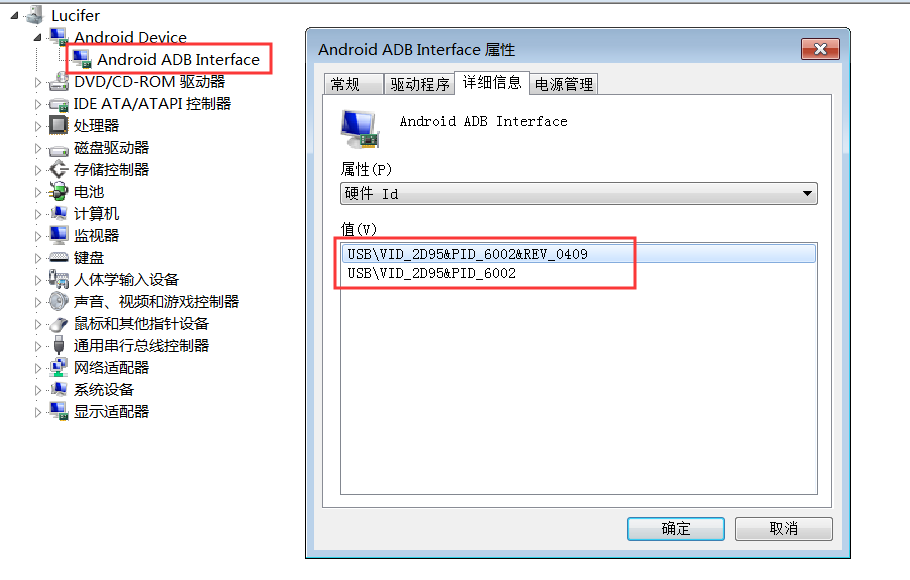

# 入市系统

## 目录

1. Xamarin
   - 快速入门
     - 创建单页
     - 创建多页
   - [布局](#布局)
     - [StackLayout](#StackLayout)
     - [Grid](#Grid)
   - [视图](#视图)
     - [Label](#Label)
     - [Button](#Button)
     - [Entry](#Entry)
     - [Editor](#Editor)
     - [Image](#Image)
     - [ListView](#ListView)
   - [应用基础](#应用基础)
     - [DisplayAlert](#DisplayAlert)
     - [生命周期](#生命周期)
   - [本地数据存储](#本地数据存储)
2. [设置](#设置)
3. [参考](#参考)

[Windows10家庭版添加Hyper-V的方法](https://jingyan.baidu.com/article/d7130635e5678113fcf4757f.html)

Xamarin.Forms中每一个屏幕画面都有对应概念叫：Page，Xamarin.Forms.Page 在安卓中与 Activity对应，在 iOS 中与 ViewController对应，在Windows Phone中与Page对应。

Xamarin.Forms使用控件来进行布局，在运行时每一个控件都会对应一个原生控件，我们经常会使用下面的类型来构建UI。

- View - 通常指的是Label，Button以及输入框等等
- Page - 一个单独的screen，对应的概念是 Android Activity，Windows Phone Page 以及 iOS View Controller.
- Layout - 布局或者容器控件
- Cell - 表格或者列表控件的子项目

Xamarin.Forms有两种不同类型的容器控件：

- Managed Layout - 与CSS的盒模型类似，通过设定子控件的位置和大小来进行布局，应用程序不再直接设定子控件的位置，最常见的例子就是 StackLayout。
- Unmanaged Layouts - 与Managed Layout不同，开发人员需要直接设定子控件的位置和大小，常见的例子就是 AbsoluteLayout。

## 布局

### StackLayout

堆栈式布局是一种非常常用的布局方式，可以极大地的简化跨平台用户界面的搭建。堆栈式布局的子元素会按照添加到容器中的顺序一个接一个被摆放，堆栈式布局有两个方向：竖直与水平方向。

在StackLayout中我们可以通过 HeightRequest 和 WidthRequest 指定子元素的高度和宽度。

### Grid

绝对布局类似于Windows Forms布局，需要指定每一个子元素的位置。

子元素添加到容器中的顺序会影响子元素的Z-Order。先添加的元素可能会被后面添加的元素遮住。

## 视图

### Label

只读的文本展示控件

### Button

按钮

### Entry

单行的文本输入框

### Editor

多行的文本输入框

### Image

图片

### ListView

ListView是一个非常常见的控件，用于展现一组数据，每一个条目都会被包含在一个单元格内部。默认情况下ListView使用了一个 TextCell 作为模板来展现每一个条目数据。

## 应用基础

### DisplayAlert

弹出窗口

### 生命周期

- 应用程序启动时调用 OnStart 方法。
- 应用程序转到后台时调用 OnSleep 方法。
- 应用程序从后台恢复时调用 OnResume 方法。

### 本地数据存储

- 创建sqlite数据库：`sqlite3 xxx.db` 或 `sqlite3 xxx.db3`
- 查看已创建数据库：`.database`
- 安装 `sqlite-net-pcl` NuGet 包
- [数据库处理类](./Bow.Enter/Models/Database.cs)

## 设置

### 真机调试

- 手机开启开发者调试，usb调试
- 在 SDK 管理器中安装 google Android 驱动
- 连上手机更新驱动，如果更新不了，添加手机硬件ID

  

  ```inf
  [Google.NTamd64]
  ;Vivo Y93
  %SingleAdbInterface%        = USB_Install, USB\VID_2D95&PID_6002  
  %CompositeAdbInterface%     = USB_Install, USB\VID_2D95&PID_6002&REV_0409
  ```

- 更新成功后，运行

  ```sh
  adb kill-server
  adb start-server
  ```

- 查看连接设备：`adb devices`
- 如果不行，把 ADB 包 android-sdk\platform-tools 里面的4个文件 adb.exe、fastboot.exe、AdbWinApi.dll、AdbWinUsbApi.dll 复制到 C:Windows\SysWOW64 目录下

## 参考

- [葡萄城技术团队](https://www.cnblogs.com/powertoolsteam/)
