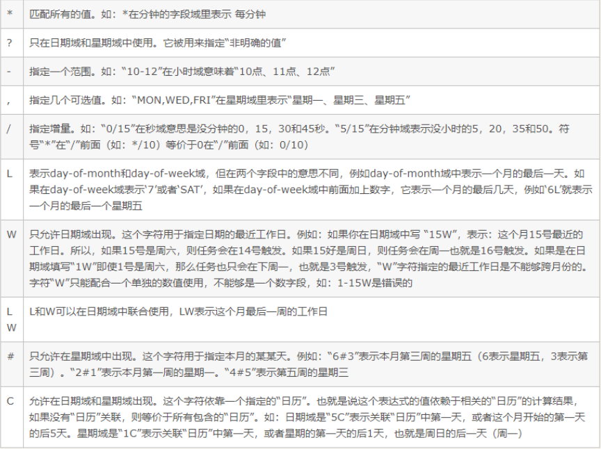
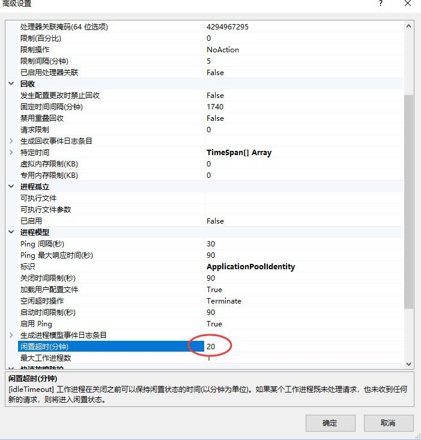

# 说明

## 定时任务

- Quart.net：支持复杂灵活的Scheduling、支持ADO/RAM Job任务存储、支持集群、支持监听、支持插件。

  job中使用依赖注入，请看代码示例！（.NET Core默认DI容器注册的EFCore数据库上下文组件，在并发时容易出问题，一个Operaion不允许在另一个Operaion执行完毕前执行，所以job中最好创建Context的新实例）

- AspNetCore自带的HostService：一个轻量级的后台服务，需要搭配timer完成定时任务
- [TimeJob](https://github.com/PomeloFoundation/dotNETCore-Extensions/tree/master/src/Pomelo.AspNetCore.TimedJob)
- hangfire

cron表达式：从左到右分别为：秒 分 小时 月份中的日期 月份 星期中的日期 年份 （中间用空格隔开）。其中年份可空。

字段|允许值|允许的特殊字符
-|-|-
秒|0-59|, - * / 
分|0-59|, - * / 
小时|0-23|, - * / 
日期|1-31|, - * ? / L W C
月份|1-12 或者 JAN-DEC|, - * / 
星期|1-7 或者 SUN-SAT|, - * ? / L C # 
年（可选）留空|1970-2099|, - * / 

特殊字符：

- "0 0 0 1 1 ?"  每年元旦1月1日0点触发
- "0 15 10 * * ? *"  每天上午10:15触发  
- "0 0-5 14 * * ?"   每天下午2点到下午2:05期间的每1分钟触发  

参考：[自动转换](http://cron.qqe2.com/)

**附：IIS 网站低频访问导致工作进程进入闲置状态的 解决办法**

IIS为网站默认设定了20min闲置超时时间：20分钟内没有处理请求、也没有收到新的请求，工作进程就进入闲置状态。

IIS上低频web访问会造成工作进程关闭，此时应用程序池回收，Timer等线程资源会被销毁；当工作进程重新运作，Timer可能会重新生成起效， 但我们的设定的定时Job可能没有按需正确执行。

故为在IIS网站实现低频web访问下的定时任务：

设置Idle TimeOut =0；同时将【应用程序池】->【正在回收】->不勾选【回收条件】 
