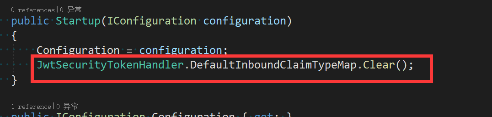

# JWT

## 为什么要使用JWT？

在 .NET Core 之前对 Web 应用程序跟踪用户登录状态最普遍的方式是使用 Cookie，当用户点击登录后将对其信息进行加密并响应写入到用户浏览器的 Cookie 里，当用户进行请求时，服务端将对 Cookie 进行解密，然后创建用户身份，整个过程都是那么顺其自然，但是这是客户端是基于浏览器的情况，如果客户端是移动app或者桌面应用程序呢？

关于JWT原理可以参考系列文章https://www.cnblogs.com/RainingNight/p/jwtbearer-authentication-in-asp-net-core.html，当然这只是其中一种限制还有其他。

如果我们使用 Json Web Token （简称为JWT）而不是使用 Cookie，此时 Token 将代表用户，同时我们不再依赖浏览器的内置机制来处理 Cookie，我们仅仅只需要请求一个 Token 就好。

这个时候就涉及到 Token 认证，那么什么是 Token 认证呢？一言以蔽之：将令牌（我们有时称为 AccessToken 或者是 Bearer Token）附加到 HTTP 请求中并对其进行身份认证的过程。Token 认证被广泛应用于移动端或 SPA。

## JWT简介

根据维基百科定义，JWT（读作 [/dʒɒt/]），即JSON Web Tokens，是一种基于JSON的、用于在网络上声明某种主张的令牌（token）。

JWT通常由三部分组成: 头信息（header），消息体（payload）和签名（signature）。它是一种用于双方之间传递安全信息的表述性声明规范。

JWT作为一个开放的标准（RFC 7519），定义了一种简洁的、自包含的方法，从而使通信双方实现以JSON对象的形式安全的传递信息。

以上是JWT的官方解释，可以看出JWT并不是一种只能权限验证的工具，而是一种标准化的数据传输规范。所以，只要是在系统之间需要传输简短但却需要一定安全等级的数据时，都可以使用JWT规范来传输。规范是不因平台而受限制的，这也是JWT做为授权验证可以跨平台的原因。

如果理解还是有困难的话，我们可以拿JWT和JSON类比：

JSON是一种轻量级的数据交换格式，是一种数据层次结构规范。它并不是只用来给接口传递数据的工具，只要有层级结构的数据都可以使用JSON来存储和表示。当然，JSON也是跨平台的，不管是Win还是Linux，.NET还是Java，都可以使用它作为数据传输形式。

1）客户端向授权服务系统发起请求，申请获取“令牌”。

2）授权服务根据用户身份，生成一张专属“令牌”，并将该“令牌”以JWT规范返回给客户端

3）客户端将获取到的“令牌”放到http请求的headers中后，向主服务系统发起请求。主服务系统收到请求后会从headers中获取“令牌”，并从“令牌”中解析出该用户的身份权限，然后做出相应的处理（同意或拒绝返回资源）


## 生成 Token 令牌

关于JWT授权，其实过程是很简单的，大家其实这个时候静下心想一想就能明白，这个就是四步走：

1. 首先我们需要一个具有一定规则的 Token 令牌，也就是 JWT 令牌（比如我们的公司门禁卡），--<b style="color:green">登录</b>
2. 然后呢，我们再定义哪些地方需要什么样的角色（比如领导办公室我们是没办法进去的），--<b style="color:green">授权机制</b>
3. 接下来，整个公司需要定一个规则，就是如何对这个 Token 进行验证，不能随便写个字条，这样容易被造假（比如我们公司门上的每一道刷卡机），--<b style="color:green">认证方案</b>
4. 最后，就是安全部门，开启认证中间件服务（那这个服务可以关闭的，比如我们电影里看到的黑客会把这个服务给关掉，这样整个公司安保就形同虚设了）。--<b style="color:green">开启中间件</b>

那现在我们就是需要一个具有一定规则的 Token 令牌，大家可以参考代码：

```C#
public class JwtHelper
{
    /// <summary>
    /// 颁发JWT字符串
    /// </summary>
    /// <param name="tokenModel"></param>
    /// <returns></returns>
    public static string IssueJwt(TokenModelJwt tokenModel)
    {
        string iss = Appsettings.app(new string[] { "JWT", "Issuer" });
        string aud = Appsettings.app(new string[] { "JWT", "Audience" });
        string secret = Appsettings.app(new string[] { "JWT", "Key" });
        // var claims = new Claim[] //old
        var claims = new List<Claim>
        {
            /*
             * 特别重要：
             *   1、这里将用户的部分信息，比如 uid 存到了Claim 中，如果你想知道如何在其他地方将这个 uid从 Token 中取出来，请看下边的SerializeJwt() 方法，或者在整个解决方案，搜索这个方法，看哪里使用了！
             *   2、你也可以研究下 HttpContext.User.Claims，具体的你可以看看 Policys/PermissionHandler.cs 类中是如何使用的。
             */
            new Claim(JwtRegisteredClaimNames.Jti, tokenModel.Uid.ToString()),
            new Claim(JwtRegisteredClaimNames.Iat, $"{new DateTimeOffset(DateTime.Now).ToUnixTimeSeconds()}"),
            new Claim(JwtRegisteredClaimNames.Nbf, $"{new DateTimeOffset(DateTime.Now).ToUnixTimeSeconds()}") ,
            // 这个就是过期时间，目前是过期10秒，可自定义，注意JWT有自己的缓冲过期时间
            new Claim (JwtRegisteredClaimNames.Exp, $"{new DateTimeOffset(DateTime.Now.AddSeconds(10)).ToUnixTimeSeconds()}"),
            new Claim(JwtRegisteredClaimNames.Iss, iss),
            new Claim(JwtRegisteredClaimNames.Aud, aud),
            // 这个 Role 是官方 UseAuthentication 要要验证的 Role，我们就不用手动设置 Role 这个属性了
            new Claim(ClaimTypes.Role, tokenModel.Role), // 为了解决一个用户多个角色（比如：Admin,System），用下边的方法
        };

        // 可以将一个用户的多个角色全部赋予；
        // 作者：DX 提供技术支持；
        // claims.AddRange(tokenModel.Role.Split(',').Select(s => new Claim(ClaimTypes.Role, s)));

        // 秘钥（SymmetricSecurityKey 对安全性的要求，密钥的长度太短会报出异常）
         var key = new SymmetricSecurityKey(Encoding.UTF8.GetBytes(secret));
        var creds = new SigningCredentials(key, SecurityAlgorithms.HmacSha256);

        var jwt = new JwtSecurityToken(
            issuer: iss,
            claims: claims,
            signingCredentials: creds
        );

        var jwtHandler = new JwtSecurityTokenHandler();
        var encodedJwt = jwtHandler.WriteToken(jwt);

        return encodedJwt;
    }

    /// <summary>
    /// 解析
    /// </summary>
    /// <param name="jwtStr"></param>
    /// <returns></returns>
    public static TokenModelJwt SerializeJwt(string jwtStr)
    {
        var jwtHandler = new JwtSecurityTokenHandler();
        JwtSecurityToken jwtToken = jwtHandler.ReadJwtToken(jwtStr);
        object role;
        try
        {
            jwtToken.Payload.TryGetValue(ClaimTypes.Role, out role);
        }
        catch (Exception e)
        {
            Console.WriteLine(e);
            throw;
        }
        var tm = new TokenModelJwt
        {
            Uid = (jwtToken.Id).ObjToInt(),
            Role = role != null ? role.ObjToString() : "",
        };
        return tm;
    }
}

/// <summary>
/// 令牌
/// </summary>
public class TokenModelJwt
{
    /// <summary>
    /// Id
    /// </summary>
    public long Uid { get; set; }

    /// <summary>
    /// 角色
    /// </summary>
    public string Role { get; set; }
}
```

Appsettings —— appsetting.json 操作类

```C#
public class Appsettings
{
    static IConfiguration Configuration { get; set; }

    //static Appsettings()
    //{
    //    //ReloadOnChange = true 当appsettings.json被修改时重新加载
    //    Configuration = new ConfigurationBuilder()
    //    .Add(new JsonConfigurationSource { Path = "appsettings.json", ReloadOnChange = true })//请注意要把当前appsetting.json 文件->右键->属性->复制到输出目录->始终复制
    //    .Build();
    //}

    static Appsettings()
    {
        string Path = "appsettings.json";
        {
            //如果你把配置文件 是 根据环境变量来分开了，可以这样写
            //Path = $"appsettings.{Environment.GetEnvironmentVariable("ASPNETCORE_ENVIRONMENT")}.json";
        }

        //Configuration = new ConfigurationBuilder()
        //.Add(new JsonConfigurationSource { Path = Path, ReloadOnChange = true })//请注意要把当前appsetting.json 文件->右键->属性->复制到输出目录->始终复制
        //.Build();

        Configuration = new ConfigurationBuilder()
           .SetBasePath(Directory.GetCurrentDirectory())
           .Add(new JsonConfigurationSource { Path = Path, Optional = false, ReloadOnChange = true })//这样的话，可以直接读目录里的json文件，而不是 bin 文件夹下的，所以不用修改复制属性
           .Build();
    }

    /// <summary>
    /// 封装要操作的字符
    /// </summary>
    /// <param name="sections"></param>
    /// <returns></returns>
    public static string app(params string[] sections)
    {
        try
        {
            var val = string.Empty;
            for (int i = 0; i < sections.Length; i++)
            {
                val += sections[i] + ":";
            }

            return Configuration[val.TrimEnd(':')];
        }
        catch (Exception)
        {
            return "";
        }
    }
}
```

这个接口如何调用呢，很简单，就是我们的登录api：

```C#
public async Task<object> GetJwtStr(string name, string pass)
{
    string jwtStr = string.Empty;
    bool suc = false;

    // 获取用户的角色名，请暂时忽略其内部是如何获取的，可以直接用 var userRole="Admin"; 来代替更好理解。
    var userRole = await _sysUserInfoServices.GetUserRoleNameStr(name, pass);
    if (userRole != null)
    {
        // 将用户id和角色名，作为单独的自定义变量封装进 token 字符串中。
        TokenModelJwt tokenModel = new TokenModelJwt { Uid = 1, Role = userRole };
        jwtStr = JwtHelper.IssueJwt(tokenModel);//登录，获取到一定规则的 Token 令牌
        suc = true;
    }
    else
    {
        jwtStr = "login fail!!!";
    }

    return Ok(new
    {
        success = suc,
        token = jwtStr
    });
}

/// <summary>
/// 令牌
/// </summary>
public class TokenModelJwt
{
    /// <summary>
    /// Id
    /// </summary>
    public long Uid { get; set; }
    /// <summary>
    /// 角色
    /// </summary>
    public string Role { get; set; }
    /// <summary>
    /// 职能
    /// </summary>
    public string Work { get; set; }

}
```

现在我们获取到Token了，那如何进行授权认证呢，别着急，重头戏马上到来！

## Json Web Token基础

JWT由三部分构成，Base64编码的Header，Base64编码的Payload，签名，三部分通过点隔开。

第一部分以Base64编码的Header主要包括Token的类型和所使用的算法，例如：

```json
{
    "alg": "HS265",
    "typ": "JWT"
}
```

标识加密方式为HS256，Token类型为JWT, 这段JSON通过Base64Url编码形成下例的第一个字符串

第二部分以Base64编码的Payload主要包含的是声明(Claims)，例如，如下：

```json
{
    "sub": "765032130654732",
    "name": "jeffcky"
}
```

Payload是JWT用于信息存储部分，其中包含了许多种的声明（claims）。可以自定义多个声明添加到Payload中，系统也提供了一些默认的类型

- iss (issuer)：签发人
- exp (expiration time)：过期时间
- sub (subject)：主题
- aud (audience)：受众
- nbf (Not Before)：生效时间
- iat (Issued At)：签发时间
- jti (JWT ID)：编号

这部分通过Base64Url编码生成第二个字符串。

第三部分则是将Key通过对应的加密算法生成签名。

它的值类似这样的表达式：

```C#
Signature = HMACSHA256(base64UrlEncode(header) + "." + base64UrlEncode(payload), secret)
```

也就是说，它是通过将前两个字符串加密后生成的一个新字符串。

所以只有拥有同样加密密钥的人，才能通过前两个字符串获得同样的字符串，通过这种方式保证了Token的真实性。

最终三部分以点隔开，比如如下形式：

```sh
1 eyJhbGciOiJIUzI1NiIsInR5cCI6IkpXVCJ9.
2 eyJodHRwOi8vc2NoZW1hcy54bWxzb2FwLm9yZy93cy8yMDA1LzA1L2lkZW50aXR5L2NsYWltcy9uYW1lIjoiSmVmZmNreSIsImVtYWlsIjoiMjc1MjE1NDg0NEBxcS5jb20iLCJleHAiOjE1NjU2MTUzOTgsIm5iZiI6MTU2MzE5NjE5OCwiaXNzIjoiaHR0cDovL2xvY2FsaG9zdDo1MDAwIiwiYXVkIjoiaHR0cDovL2xvY2FsaG9zdDo1MDAxIn0.
3 OJjlGJOnCCbpok05gOIgu5bwY8QYKfE2pOArtaZJbyI
```

到这里此时我们应该知道：JWT包含的信息并没有加密，比如为了获取Payload，我们大可通过比如谷歌控制台中的APi(atob)对其进行解码，如下：


那如我所说既然JWT包含的信息并没有加密，只是进行了Base64编码，岂不是非常不安全呢？

当然不是这样，还没说完，第三部分就是签名，虽然我们对Payload（姑且翻译为有效负载），未进行加密，但是若有蓄意更换Payload，此时签名将能充分保证Token无效，除非将签名的Key不小心暴露在光天化日之下，否则必须是安全的。

好了，到了这里，我们稍稍讲解了下JWT构成，接下来我们进入如何在 .NET Core 中使用JWT。

## 认证流程


1. 认证服务器：用于用户的登录验证和Token的发放。
2. 应用服务器：业务数据接口。被保护的API。
3. 客户端：一般为APP、小程序等。

认证流程：

1. 用户首先通过登录，到认证服务器获取一个Token。
2. 在访问应用服务器的API的时候，将获取到的Token放置在请求的Header中。
3. 应用服务器验证该Token，通过后返回对应的结果。

>说明：这只是示例方案，实际项目中可能有所不同。

- 对于小型项目，可能认证服务和应用服务在一起。本例通过分开的方式来实现，使我们能更好的了解二者之间的认证流程。
- 对于复杂一些的项目，可能存在多个应用服务，用户获取到的Token可以在多个分布式服务中被认证，这也是JWT的优势之一。

## JWT授权认证流程——自定义中间件

在 .NET Core 中如何使用JWT，那么我们必须得知晓如何创建JWT，接下来我们首先创建一个端口号为5000的APi，创建JWT，然后我们需要安装 System.IdentityModel.Tokens.Jwt 包。

我们直接给出代码来创建Token，然后一一对其进行详细解释，代码如下：

```C#
var claims = new Claim[] {
    new Claim (ClaimTypes.Name, "Jeffcky"),
    new Claim (JwtRegisteredClaimNames.Email, "2752154844@qq.com"),
    new Claim (JwtRegisteredClaimNames.Sub, "D21D099B-B49B-4604-A247-71B0518A0B1C"),
};

var key = new SymmetricSecurityKey (Encoding.UTF8.GetBytes ("1234567890123456"));

var token = new JwtSecurityToken (
    issuer: "http://localhost:5000",
    audience: "http://localhost:5001",
    claims : claims,
    notBefore : DateTime.Now,
    expires : DateTime.Now.AddHours (1),
    signingCredentials : new SigningCredentials (key, SecurityAlgorithms.HmacSha256)
);

var jwtToken = new JwtSecurityTokenHandler ().WriteToken (token);
```

如上我们在声明集合中初始化声明时，我们使用了两种方式，一个是使用 ClaimTypes ，一个是 JwtRegisteredClaimNames ，那么这二者有什么区别？以及我们到底应该使用哪种方式更好？或者说两种方式都使用是否有问题呢？

ClaimTypes来自命名空间 System.Security.Claims ，而JwtRegisteredClaimNames来自命名空间 System.IdentityModel.Tokens.Jwt ，二者在获取声明方式上是不同的，ClaimTypes是沿袭微软提供获取声明的方式，比如我们要在控制器Action方法上获取上述ClaimTypes.Name的值，此时我们需要F12查看Name的常量定义值是多少，如下：


接下来则是获取声明Name的值，如下：

```C#
var sub = User.FindFirst(d => d.Type == "http://schemas.xmlsoap.org/ws/2005/05/identity/claims/name")?.Value;
```


那么如果我们想要获取声明JwtRegisterClaimNames.Sub的值，我们是不是应该如上同样去获取呢？我们来试试。

```C#
var sub = User.FindFirst(d => d.Type == JwtRegisteredClaimNames.Sub)?.Value;
```


此时我们发现为空没有获取到，这是为何呢？这是因为获取声明的方式默认是走微软定义的一套映射方式，如果我们想要走JWT映射声明，那么我们需要将默认映射方式给移除掉，在对应客户端Startup构造函数中，添加如下代码：

```C#
JwtSecurityTokenHandler.DefaultInboundClaimTypeMap.Clear();
```



如果用过并熟悉IdentityServer4的童鞋关于这点早已明了，因为在IdentityServer4中映射声明比如用户Id即（sub）是使用的JWT，也就是说使用的JwtRegisteredClaimNames，此时我们再来获取Sub看看。


所以以上对于初始化声明两种方式的探讨并没有用哪个更好，因为对于使用ClaimTypes是沿袭以往声明映射的方式，如果要出于兼容性考虑，可以结合两种声明映射方式来使用。接下来我们来看生成签名代码，生成签名是如下代码：

```C#
var key = new SymmetricSecurityKey(Encoding.UTF8.GetBytes("1234567890123456"));
```

如上我们给出签名的Key是1234567890123456，是不是给定Key的任意长度皆可呢，显然不是，关于Key的长度至少是16，否则会抛出如下错误


接下来我们再来看实例化Token的参数，即如下代码：

```C#
var token = new JwtSecurityToken (
    issuer: "http://localhost:5000",
    audience: "http://localhost:5001",
    claims : claims,
    notBefore : DateTime.Now,
    expires : DateTime.Now.AddHours (1),
    signingCredentials : new SigningCredentials (key, SecurityAlgorithms.HmacSha256)
);
```

issuer代表颁发Token的Web应用程序，audience是Token的受理者，如果是依赖第三方来创建Token，这两个参数肯定必须要指定，因为第三方本就不受信任，如此设置这两个参数后，我们可验证这两个参数。要是我们完全不关心这两个参数，可直接使用JwtSecurityToken的构造函数来创建Token，如下：

```C#
var claims = new Claim[] {
    new Claim (ClaimTypes.Name, "Jeffcky"),
    new Claim (JwtRegisteredClaimNames.Email, "2752154844@qq.com"),
    new Claim (JwtRegisteredClaimNames.Sub, "D21D099B-B49B-4604-A247-71B0518A0B1C"),
    new Claim (JwtRegisteredClaimNames.Exp, $"{new DateTimeOffset(DateTime.Now.AddMilliseconds(1)).ToUnixTimeSeconds()}"),
    new Claim (JwtRegisteredClaimNames.Nbf, $"{new DateTimeOffset(DateTime.Now).ToUnixTimeSeconds()}")
};

var key = new SymmetricSecurityKey (Encoding.UTF8.GetBytes ("1234567890123456"));

var jwtToken = new JwtSecurityToken (new JwtHeader (new SigningCredentials (key, SecurityAlgorithms.HmacSha256)), new JwtPayload (claims));
```

这里需要注意的是Exp和Nbf是基于Unix时间的字符串，所以上述通过实例化DateTimeOffset来创建基于Unix的时间。到了这里，我们已经清楚的知道如何创建Token，接下来我们来使用Token获取数据。我们新建一个端口号为5001的Web应用程序，同时安装包 `Microsoft.AspNetCore.Authentication.JwtBearer` 接下来在Startup中ConfigureServices添加如下代码：

```C#
services.AddAuthentication (JwtBearerDefaults.AuthenticationScheme)
    .AddJwtBearer (options => {
        options.TokenValidationParameters = new TokenValidationParameters {
            ValidateIssuerSigningKey = true,
            IssuerSigningKey = new SymmetricSecurityKey (Encoding.UTF8.GetBytes ("1234567890123456")),

            ValidateIssuer = true,
            ValidIssuer = "http://localhost:5000",

            ValidateAudience = true,
            ValidAudience = "http://localhost:5001",

            ValidateLifetime = true,

            ClockSkew = TimeSpan.FromMinutes (5)
        };
    });
```

如上述若Token依赖于第三方而创建，此时必然会配置issuer和audience，同时在我方也如上必须验证issuer和audience，上述我们也验证了签名，我们通过设置 ValidateLifetime  为true，说明验证过期时间而并非Token中的值，最后设置 ClockSkew  有效期为5分钟。对于设置 ClockSkew  除了如上方式外，还可如下设置默认也是5分钟。

```C#
ClockSkew = TimeSpan.Zero
```

如上对于认证方案我们使用的是 JwtBearerDefaults.AuthenticationScheme 即Bearer，除此之外我们也可以自定义认证方案名称，如下：


最后别忘记添加认证中间件在Configure方法中，认证中间件必须放在使用MVC中间件之前，如下：

```C#
app.UseAuthentication ();

app.UseMvc (routes => {
    routes.MapRoute (
        name: "default",
        template: "{controller=Home}/{action=Index}/{id?}");
});
```

到了这里，我们通过端口为5000的Web Api创建了Token，并配置了端口号为5001的Web应用程序使用JWT认证，接下来最后一步则是调用端口号为5000的APi获取Token，并将Token设置到请求头中Authorization键的值，格式如下（注意Bearer后面有一个空格）：

```C#
('Authorization', 'Bearer ' + token);
```

我们在页面上放置一个按钮点击获取端口号为5000的Token后，接下来请求端口号为5001的应用程序，如下：

```js
$(function () {
    $('#btn').click(function () {
        $.get("http://localhost:5000/api/token").done(function (token) {
            $.ajax({
                type: 'get',
                contentType: 'application/json',
                url: 'http://localhost:5001/api/home',
                beforeSend: function (xhr) {
                    if (token !== null) {
                        xhr.setRequestHeader('Authorization', 'Bearer ' + token);
                    }
                },
                success: function (data) {
                    alert(data);
                },
                error: function (xhr) {
                    alert(xhr.status);
                }
            });
        });
    });
});
```


## 参考

1. 一篇不错的[教程](https://www.cnblogs.com/wyt007/p/11459547.html)和[示例代码](https://github.com/FlyLolo)
2. [JWT Token刷新方案](https://blog.csdn.net/m0_37809141/article/details/86572697)
3. [解决使用jwt刷新token带来的问题](https://segmentfault.com/a/1190000013151506)
4. [ASP.NET Core Web Api之JWT](https://www.cnblogs.com/CreateMyself/p/11123023.html)
5. [ASP.NET MVC使用Oauth2.0实现身份验证](https://blog.csdn.net/sD7O95O/article/details/78852449)
