# WebForm

AjaxPro.Utility.RegisterTypeForAjax (typeof(ajax));
注册一个ajax方法类型,这样在其对应的.aspx文件中就可以直接调用其方法了
OnClientClick用于执行客户端脚本.当我们单击一个按钮时,最先执行的是OnClientClick 事件,根据OnClientClick 事件的返回值来决定是否执行OnClick事件来postback页面.其返回值为true 和 false,默认情况下OnClientClick 返回值为真.

发布网站方法:
1.	直接将建立的网站文件内容复制到网站根目录下,在IE中输入http://localhost 回车即可看见网站.这种方法不太安全,别人能看见文件中的内容.
2.	在ASP.NET中点击”生成”---“发布网站”,在弹出的对话框里点击确定,选择默认设置即可.这样会生一个BIN文件,这样再将文件复制到网站根目录下,再到IE中输入http://localhost也能看见,这样做安全性能高点,这样别人看不见你建立的文件内容,只能看见编译过的文件内容.
3.	在IIS中建立虚拟目录.安装了IIS后,点网站文件夹右击属性选择”WEB共享”,选择”共享文件夹”单选按钮,在弹出的对话框中选择”读取””脚本资源访问”两个复选框,单击确定.再到IE中输入http://localhost/myweb(注意加上myweb)也能看见.
4.	如果想要让别人看见自己发布的网站,在IIS中网站的属性中选择目录安全性,单击编辑,在弹出的对话框中选择”匿名访问”即可.

网站发布不成功
	很多时候是因为开发时的.Net版本和IIS服务器的.Net版本不匹配。Windows的IIS服务器功能在下面的地方添加。

IIS web.config拒绝访问 未能开始监视对 XX 文件的更改 
报错：加载配置文件时出错: 由于访问被拒绝,未能开始监视对“c:\inetpub\wwwroot\employ”等类似的烦人东西。

分析：这个项目是放在根目录下的，IIS配置没有问题，别的文件都可以浏览，就这个文件夹下的页面不能浏览，奇怪。回想这个原来是自己copy的一个文件，然后添加到项目中的。网上找到原因，是由于权限设置的问题，没有把Users的权限设置到文件夹和文件上去。

还有就是IIS设置问题，在IIS中看一下是不是子目录里创建了应用程序(或者做成了虚拟目录),这种情况下是会在子目录里查找web.config的.

补充：(转)

错误描述：对路径“****************.***”的访问被拒绝。
说明: 执行当前 Web 请求期间，出现未处理的异常。请检查堆栈跟踪信息，以了解有关该错误以及代码中导致错误的出处的详细信息。

解决方案一

在需要进行读写操作的目录下添加Network Service这个帐号（这个角色权限需要控制整个网站的目录），
由于在iis 6.0中，默认的应用程序池中的标示用的是Network Service，
所以在进程中是使用Network Service这个帐号运行来运行w3wp.exe进程，
而当我们在运行VS 2003的时候需要对某一个目录下进行读写操作，
看了一下该文件夹，发现没有Network Service，添加上该账号，同时选上FULL CONTROL，问题解决，
另：log4net写日志，文件夹的权限必须要有IIS_WPG账号的写权限。否则，不会记录日志。
******************************************************************************************

解决方案二
在IIS6.0中的默认应用程序池-->属性-->标示中把Net Service改成Local System该问题也可以解决。

*******************************************************************************************

什么是应用程序池呢？这是微软的一个全新概念：应用程序池是将一个或多个应用程序链接到一个或多个工作进程集合的配置。因为应用程序池中的应用程序与其他应用程序被工作进程边界分隔，所以某个应用程序池中的应用程序不会受到其他应用程序池中应用程序所产生的问题的影响。

Windows 2003同时支持两种工作模式，默认为ISS 6.0工作进程隔离模式。工作进程隔离模式防止一个应用程序或站点停止了而影响另一个应用程序或站点，大大增强了IIS的可靠性。那么如何设置两种工作模式呢？

　　在IIS管理器中，打开本地计算机，右键单击“应用程序池”，选择新建“应用程序池” （必须在工作进程隔离模式下才能建立应用程序池）。“应用程序池名称”框中，输入新的应用程序池名称。如果在“应用程序池 ID”框中出现的 ID （如：AppPool #1）不是您想要的，可进行重命名。如果您单击了“将现有应用程序池作为模板”，请在“应用程序池名称”框中右键单击想要用来作为模板的应用程序池。最后单击[确定]。

指派应用程序池

　　在 IIS 管理器中，右键单击您要为其指派应用程序池的应用程序，然后单击“属性”。单击“主目录”选项卡，确认您正在指派的目录或虚拟目录的“应用程序名”是否已被填写。如果“应用程序名”框尚未被填写，请单击“创建”，然后输入名称。

　　在“应用程序池”列表框中，选择您想要为其指派的应用程序池的名称。最后单击[确定]。

本文描述以下问题的解决方案
IIS7.0/8.0的错误HTTP Error 500.19 - Internal Server Error ，错误代码为0x80070021。
 
方法/步骤 
1.	1
写在前面
此错误可能有多种原因导致，本文介绍其中两种原因及其解决方案。如果本文不能解决你的问题，那么请另寻其他的解决方案。
2.	2
解决方案一
如果IIS7.0是在VS安装之后安装的话，那么需要添加IIS7.0对ASP.NET文件的支持，否则会出现aspx文件无法识别的MIME 错误,或者以上问题。
方法：打开和关闭系统功能---》Internet信息服务--》万维网服务---》应用程序开发功能—》勾选asp.net。
3.	3
解决方案二
IIS7.0的安全设置文件在%windir%\system32\inetsrv \config\applicationHost.config，这里定义服务器全局的安全设置，但是Web程序的web.config可以实现它的某些配置。默认情况下是不容许覆盖的。
所以首先修改applicationHost.config文件，使web程序可以覆盖服务器的全局安全配置，打开handlers和modules的权限，即由Deny改为Allow，如下：
<section name="handlers" overrideModeDefault="Allow" />
<section name="modules" allowDefinition="MachineToApplication" overrideModeDefault="Allow" />

反编译
我们平时在工作中经常会遇到一些已经被编译后的DLL，而且更加麻烦是没有源代码可以进行修改，只能针对这个DLL的文件进行修改才能得到我们想要的结果；本文将通过一个实例来演示如果完成一个简单的修改;我们将会用到以下几种工具；
1：反编译工具ILSpy.exe：是个很不错的反编译软件，而且是免费了；
2：微软的工具ildasm.exe:这个是把DLL生成IL文件的一个软件，是微软自带了；可以在C:\Program Files\Microsoft SDKs\Windows\v7.0A\bin找到该软件；
3：微机的工具ilasm.exe:这个是把IL文件重新生成DLL的功能，可以在C:\Windows\Microsoft.NET\Framework\v4.0.30319找到该软件；
我们新建一个WEB项目，模拟它要插入加密狗才能运行，当然这边的加密狗是我们的一个比喻，实例很简单七个步骤就可以完在；
步骤一：使用ILSpy.exe打开Web.dll文件；查看其源代码的情况：
 
从上面反编译出来的源代码不难发现重点是在GetLicense()方法，这个也是我们要修改的内容，从上面可以看出在没有修改前这个都是会提示要插入加密狗的；
步骤二：接下来就是要使用ildasm.exe把DLL这个文件转化成IL文件；
 
把dll文件转储为*.il文件存到某个指定文件夹里，得到Web.il和Web.res两个文件，有时也会有*.resource文件
 
步骤三：我们可以打开Web.il文件，里面有DLL生成的IL内容，我们很容易就可以定位到想要的这个方法，只要让它固定返回true就可以达到修改成功，方法内的IL代码就是我们要修改的内容；
 
步骤四：修改GetLicense()方法内的IL代码，让它固定返回true；下面这个IL就是让它返回为true;修改完接着保存IL文件；
 
步骤五：当修改完IL文件后要把它转化成DLL文件，打开DOC命令输入进入到*.il的文件夹，然后输入命令：c:\windows\microsoft.net\framework\v4.0.30319\ilasm.exe /dll/resource=Web.res Web.il
 
*1：要进入IL文件的文件夹 2：其中"/dll/"这个前面要有一个空格 3:.res文件要在.il文件前面，中间要有个空格
步骤六：运行完上面的命令后会生成一个新DLL文件，然后把它复制到我们的站点下面：
 
步骤七：运行的结果：
 
完成上面的七个步骤就可以成功修改DLL文件，当然本实例只是一个简单的修改，若要进行比较复杂修改IL代码则要对IL知识有个相当的了解；下面是一个可能会经常要用到的IL返回true跟false的代码；
    .maxstack 1
    .locals init (
        [0] bool CS$1$0000)
    L_0000: nop 
    L_0001: ldc.i4.1 
    L_0002: stloc.0 
    L_0003: br.s L_0005
    L_0005: ldloc.0 
    L_0006: ret

return true;

    // 代码大小       7 (0x7)
    .maxstack  1
    .locals init ([0] bool CS$1$0000)
    IL_0000:  nop
    IL_0001:  ldc.i4.0
    IL_0002:  stloc.0
    IL_0003:  br.s       IL_0005

    IL_0005:  ldloc.0
    IL_0006:  ret

return false;

插件式程序开发
插件的本质在于不修改程序主体（平台）的情况下对软件功能进行扩展与加强，当插件的接口公开后，任何公司或个人都可以制作自己的插件来解决一些操作上的不便或增加新的功能，也就是实现真正意义上的“即插即用”软件开发。
插件式程序开发是对面向对象设计原则之“开闭原则”的最好体现，在扩展功能的同时尽可能的少修改主程序代码。     
插件是对主程序的功能的扩展。是主程序生命的延续。而且对一个项目的开发进度也起到了一个积极的作用。试想一下：一个项目，有许多功能要进行实现。但是你没有办法一次性的完成。而用插件，你就可以一个功能一个功能的开发。开发好一个插件，你就能用一个功能。插件已经在firebox浏览器及PS上得到了广泛的应用。
其实，我们说大一点，把一个系统比作一个主程序，而系统上安装的每个应用程序就是插件程序。所以学习插件式程序的开发，对计算机的学习也大有好处。
假设你设计的程序已经部署到用户的计算机上，并且能够正常运行了。但是有一天，用户打来了电话——他们要求增加新的功能。确定了用户的需求后，你竟然发现原有的软件架构已经无法胜任新增任务的需求——你需要重新设计这个应用了！但问题是，就算你又用了一个开发周期完成了用户需要的应用，却不能保证用户的需求不会再次变更。也就是说，需求蔓延的可能性依然存在。因此，这种情况下插件构架更能显示出它的优越性。
可以这么说，用它可以带来方便的地方。而且开发它，也很简单。而且这样做主程序根本就不需要改动。需要插件时，拿来就能用。插件更新，也只要更新这个插件就行。
从程序开发角度来说，一般都是先要开发主程序，决定那些功能由主程序来完成，然后再建立接口，声明接口的内容，这些内容决定着插件的扩展的功能，及方向的。这些都是由主程序开发者预先准备好的。插件开发者，从主程序开发者那里得到接口的内容，并书写继承这些接口的类，来完成具体的功能。一个程序能实现的功能，基本上插件都能实现。
怎样开发插件式程序？
1.定义主程序，即平台，所有的插件都是基于这个平台，所以这个平台很重要，必须考虑可能的功能扩展。
2.定义接口。这个接口是所有开发的插件都必须实现的，接口中定义了插件开发者可以使用的主程序资源，而主程序亦可以通过该接口访问插件，接口即是主程序和插件联接的“纽带”，关于定义接口的诀窍我在下篇将会提到，不同的插件可能会需要不同的接口，同类型的插件也可能使用相同的接口。
3.对于主程序所提供的资源如果允许插件程序调用，比如窗体、按钮等组件，如果需要告知插件开发者相应的信息还需要定义配置文件，文件中声明了资源的名称和访问方式。
4.主程序中需要有装载插件和解析插件的功能函数，以便插件能够顺利”对接“。
5.建立接口和各个插件的DLL文件
1.	在编写窗体应用的插件程序开发时，如果主程序是窗体程序，如何在插件中调用主程序的窗体中的各种资源了，这是我采用的方法，请各位码农指点：  
2.	   首先定义插件接口      
3.	   public interface IAdvancedPlugin  
4.	   {  
5.	        Form MainForm //这是关键，通过在主程序的装载插件方法给该窗体的引用赋值，即将主程序窗体的引用赋给插件程序中对应的字段  
6.	        {  
7.	            get;  
8.	            set;  
9.	        }  
10.	        void FuncPluginLoad(Form mainForm); //每个插件都会实现这个插件初始化的方法  
11.	    }  
12.	  
13.	在插件程序中这样获取主程序的组件：  
14.	public class AdvancedPlugin : IAdvancedPlugin   
15.	{  
16.	 private Form mainForm = null;  
17.	 private Panel[] panels = new Panel[2];  
18.	 TextBox tb = new TextBox(); //输入框，用于引用主程序窗体中的输入框  
19.	 Label lbResult = new Label();//显示结果的标签，用于引用主程序窗体中的标签  
20.	 public Form MainForm //实现接口中的字段  
21.	 {   
22.	   get { return mainForm; }  
23.	   set { mainForm = value; }   
24.	 }   
25.	 //插件初始化  
26.	 public void FuncPluginLoad(Form mainForm) //插件初始化的方法由主程序同意调用，调用的时候会将主程序窗体传递进来  
27.	 {  
28.	 this.MainForm = mainForm; IEnumerator ie = mainForm.Controls.GetEnumerator();//获取包含在主程序窗体中的控件集合，这是关键，这样就获得了主窗体所有控件  
29.	 while (ie.MoveNext()) //遍历集合，查找需要使用的控件  
30.	 {  
31.	 Control c = ie.Current as Control;  
32.	 //if (c.GetType() == typeof(System.Windows.Forms.TextBox)) //如果某种类型的组建只有一个就可以通过类型获取  
33.	 if (c.Name == "textBox1") //这种方法获取控件需要预先知道控件的名称，这可以在主程序提供的配置文件中找到  
34.	 {   
35.	   tb = c as TextBox;  
36.	 }   
37.	 if (c.Name == "lbResult") //同上    
38.	 {   
39.	    lbResult = c as Label;  
40.	 }  
41.	 }   
42.	}  

Server.MapPath()
 ./当前目录
/网站主目录
../上层目录
~/网站虚拟目录

如果当前的网站目录为E:\wwwroot   应用程序虚拟目录为E:\wwwroot\company 浏览的页面路径为E:\wwwroot\company\news\show.asp
在show.asp页面中使用
Server.MapPath("./")   返回路径为：E:\wwwroot\company\news
Server.MapPath("/")    返回路径为：E:\wwwroot
Server.MapPath("../")   返回路径为：E:\wwwroot\company
Server.MapPath("~/")   返回路径为：E:\wwwroot\company
server.MapPath(request.ServerVariables("Path_Info")) 
Request.ServerVariables("Path_Translated")  
上面两种方式返回路径为 D:\wwwroot\company\news\show.asp

ASP.NET网页中的@指令

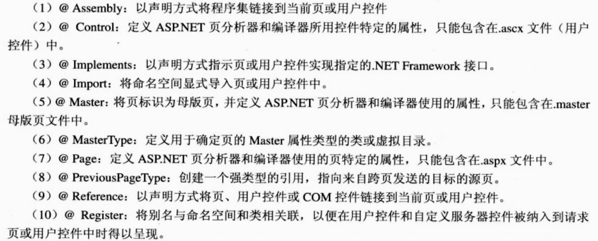

Web窗体中form元素只能有一个，必须包含runat="server"，不能包含action，可执行回发的服务器控件必须包含在form内。
对于小网站. ASP.NET Web Forms 非常容易使用，能很快得到结果。对于大型复杂的网站，就一定要注意从客户端发送给服务器的回发，以及通过网络发送的视图状态: 否则应用程序很可能变慢。ASP.NET Web Forms 提供了很多选项来改造它，使之快速流畅， 但这抵消了使用Web Forms的优点， 此时使用其他架构可能会得到更好的结果。使Web Forms 快速流畅，意味着不使用一些可用的控件， 而是编写自定义代码。所以使用WebForms不编写自定义代码的优点就丧失了。

Aspose.Words组件介绍及使用—基本介绍与DOM概述
阅读目录
•	1.基本介绍
•	2.文档对象模型概述
       本博客所有文章分类的总目录：http://www.cnblogs.com/asxinyu/p/4288836.html
本博客其他.NET开源项目文章目录：http://www.cnblogs.com/asxinyu/p/4329755.html
　　我之前博客有一篇开源的Word读写组件的介绍:http://www.cnblogs.com/asxinyu/archive/2013/02/22/2921861.html ,引起了不少人的关注，机缘巧合，也使得我结识了一些朋友，由于DocX的一些原因(不稳定，更新很慢)，我了解到了Aspose.Words这个组件，非常好，文档齐全，案例丰富，功能也很多，支持非常完善。所以我业余时间就把官方的文档和例子翻译和总结了一下，希望对大家有点帮助，同时也对自己是一个提高。我决定把这个组件的使用作为一个系列，目前已经有2篇的内容，后面的要根据时间慢慢写。
如对您有帮助，不要吝啬你的鼠标，支持一下哦，如翻译的不好，或者有错误漏洞，还请广大网友指出，一个人的能力毕竟有限，而且我只是一个业余打酱油的。
回到目录
1.基本介绍
Aspose.Words是一个商业.NET类库，可以使得应用程序处理大量的文件任务。Aspose.Words支持Doc，Docx，RTF，HTML，OpenDocument，PDF，XPS，EPUB和其他格式。使用Aspose.Words可以在不使用Microsoft.Word的情况下生成、修改、转换和打印文档。在项目中使用Aspose.Words可以有以下好处。
1.1丰富的功能集
其丰富的功能特性主要有以下4个方面：
1)格式转换。Aspose.Words具有高质量的文件格式转换功能，可以和Doc，OOXL，RTF，TXT等格式互相转换。
2)文档对象模型。通过丰富的API以编程方式访问所有的文档元素和格式，允许创建，修改，提取，复制，分割，加入，和替换文件内容。
3)文件渲染。可以在服务器端转换整个文档或者页面为PDF，XPS，SWF格式，同样可以转换文档页面为图像格式，或者.NET Graphics对象，这些功能和Microsoft.Word是一样的。
4)报表。可以从对象或者数据源填充模版生成文件。
1.2不需要Microsoft.Word
Aspose.Words可以在没有安装Microsoft Office的机器上工作。所有的Aspose组件都是独立，不需要微软公司的授权。总之， Aspose.Words在安全性、稳定性、可扩展性、速度、价格和自动化功能方面，是一个很不错的选择。
1.3独立的平台
Aspose.Words可以运行在Windows，Linux和Mac OS操作系统上面。可以使用Aspose.Words去创建32位或者64位的.NET应用程序，包括Asp.NET、WCF、WinForm等等，还可以使用Com组件在Asp、Perl、PHP和Python语言中使用，同样可以在Mono平台上使用Aspose.Words建立.NET应用程序。
1.4性能和可伸缩性
Aspose.Words可以运行在服务器和客户端，它是一个独立的.NET程序集，可以被任何.NET应用程序复制和部署。使用Aspose.Words可以在短时间内产生成千上万的文档，可以打开文档，并修改格式和内容，填充数据并保存。Aspose.Words是多线程安全的，不同的线程在同一时间处理不同的文档。
1.5最小的学习曲线
虽然Aspose.Words拥有150多个公共类和枚举类型，但是Aspose.Words的学习曲线很小因为Aspose.Words的API是围绕下列目标精心设计的：
1) 借鉴一些著名的API设计经验，如Microsoft Word。
2) 借鉴.NET框架设计指南的经验。
3) 提供易于使用的详细的文档元素操作文档。
以前在项目中使用Microsoft Word的开发者，可以在Aspose.Words中找到很多熟悉的类、方法和属性。
回到目录
2.文档对象模型概述
2.1 DOM介绍
Aspose.Words的文档对象模型(以下简称DOM)是一个Word文档在内存中的映射，Aspose.Words的DOM可以编程读取、操作和修改Word文档的内容和格式。理解DOM的结构和相应的类型，是使用Aspose.Words灵活编程的基础，这一点非常重要。下面的一个Word文档例子和其结构如下图所示:

当上述文档被Aspose.Words的DOM读取时，会创建如下结构的树形对象：

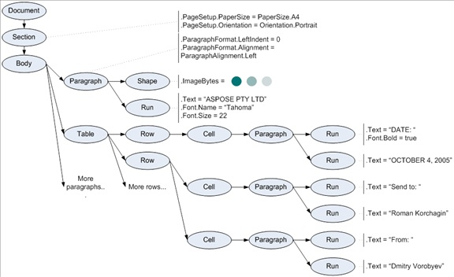

从上图的结构和对应的Word文档，我们可以看到大概的DOM中相关对象的结构，有了这些基本概念，就可以很流程的操作Word文档了。Document, Section, Paragraph, Table, Shape, Run 以及图中的其他椭圆形的都是Aspose.Words对象，这些对象具有树形的层级结构，图中的注释同样说明这些文档对象树中的对象具有多个属性。
Aspose.Words中的DOM有以下特点：
1.所有的节点(node)类最终都继承于Node类，它是Aspose.Words DOM的基本类型。
2.节点可以包含(嵌套)其他节点，例如Section和Paragraph都继承自CompositeNode类，而CompositeNode类来源与Node类。
2.2 Node类型
当Aspose.Words读取Word文档到内存中时，不同类型的文档元素被不同的类型对象来替代，每一个文本框的text, paragraph, table, section都是Node对象,甚至文档本身都是一个Node。Aspose.Words为每一种文档节点类型都定义了一个类。
下面是一个UML类图，表示DOM中不同node类型之间的关系。抽象类的名字用斜体表示。注意，Aspose.Words DOM中同样包括了一些非节点类型的类，例如Style, PageSetup, Font等等，它们没有在这幅图里面显示。

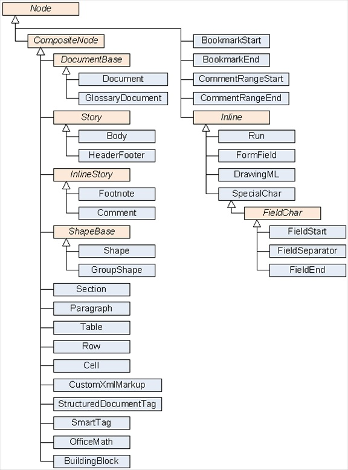

 看看这些主要的类及作用
Aspose.Words类	类别	描述
Document	Document	Document对象是文档树的根节点，提供访问整个文档的入口
Section	Document	Section对象对应一个文档中的一节
Body	Document	是一节中的主要文本容器
HeaderFooter	Document	一节中的特殊页眉或者页脚容器
GlossaryDocument	Document	代表一个Word文档中词汇表的根条目
BuildingBlock	Document	代表一个词汇表文档，如构件，自动图文集或一个自动更正条目
Paragraph
Text	一个文本段落，保护内联的节点
Run
Text	一个格式一致的文本块
BookmarkStart
Text	一个书签的起点标记
BookmarkEnd
Text	一个书签的结束标记
FieldStart
Text	一个特殊的字符指定一个单词字段的开始
FieldSeparator
Text	单词字段的分隔符
FieldEnd
Text	一个特殊的字符指定一个单词字段的结束
FormField
Text	一个表单字段
SpecialChar
Text	特殊字符类型，没有具体的
Table
Tables	 Word文档中的表格
Row
Tables	一个表格对象的行
Cell
Tables	表格行的单元格
Shape
Shapes	Word文档中的图像，形状，文本框或者OLE对象
GroupShape
Shapes	一组Shapes对象
DrawingML
Shapes	一个文档中的Sharp或者图像，图表
Footnote
Annotations	文档中包括文本的脚注或者尾注
Comment
Annotations	文档中包含文本的注释
CommentRangeStart
Annotations	一个相关的注释区域的开始
CommentRangeEnd
Annotations	一个相关的注释区域的结束
SmartTag
Markup	在一个段落内围绕一个或多个内嵌结构的智能标记
CustomXmlMarkup
Markup	文档中的某些结构的自定义XML标记
StructuredDocumentTag
Markup	文档中的一种结构化的文档标签（内容控制）
OfficeMath
Math	代表Office的数学对象，如函数，方程或者矩阵
 
2.3组成模式
Aspose.Words文档的结构树非常重要，下面的设计吐可以更清晰的理解各个节点之间的包含关系。
2.3.1 Document and Section
文档和节：
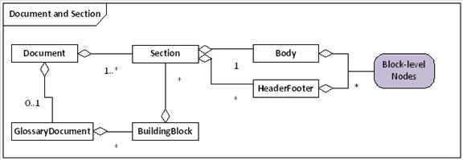

从上图可以看出：
1.一个Document有1个或者多个Section(节)节点；
2.Section有1个Body(正文)，没有或者有多个HeaderFooter节点；
3.Body和HeaderFooter可以包含多个块级节点；
4.1个Document能够有一个GlossaryDocument.
1个Word文档包含1个或多个节，一个节可以定义自己的页码，边距，方向，以及页眉页脚的文字；一个节保护主要的问题，如页眉，页脚(首页，奇数页，偶数页)。
2.3.2 Block-level节点
Block-level节点的关系图如下所示：

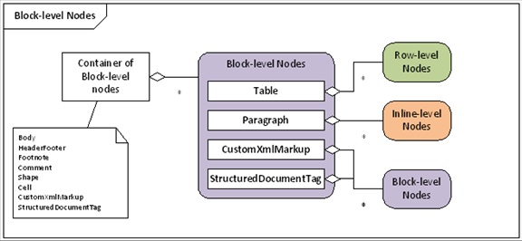

从上图中可以看到：
1.Block-level元素可以出现在文档中的很多地方，如Body的子节点，脚注，评论，单元格其他元素。
2.最重要的Block-level节点是表格和段落；
3.1个表格有0行或者多行；
CustomXmlMarkup 和StructuredDocumentTag可以包含其他Block-level节点；

2.3.3 Inline-level节点

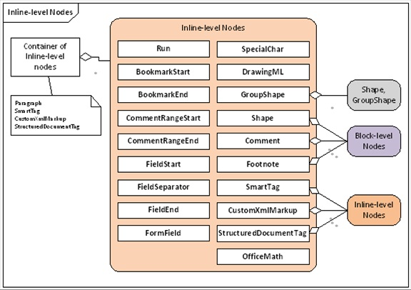

从上面的图表可以看到下列关系：
1.Paragraph是最经常出现的Inline-level节点；
2.Paragraph可以包含不同的Run格式节点；也可以包含书签(bookmarks)和注释(annotations)
3.Paragraph还可以包含形状，图像，绘图对象等，以及智能标签；
2.3.4 表格行单元格

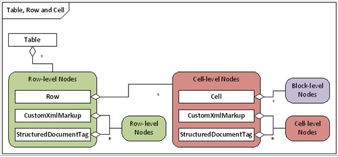

Table可以包含很多行，行可以包含单元格，单元格可以包括block-level节点。
 2.4 设计模式与导航
Aspose.Words将文档表示为一个有节点组成的树，因此就可以在节点之间互相切换。Aspose.Words提供了一个“文档浏览器”(DocumentExplorer)，这是一个项目例子Demo。如下图所示：

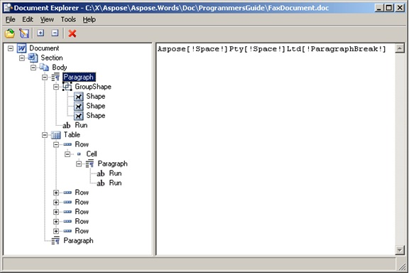

可以通过Node类的ParentNode属性来访问上级节点，因此很方便获取父节点。文档对象模型是有大量的对象组合而成，他们的关系如下：
1.Node类是所有节点类的基类；
2.CompositeNode类是组合节点的基类；
3.Node类的中，没有子节点管理的接口，子节点管理的方法只出现在CompositeNode；
4.从Node类中移除子节点管理的方法，更干净，可以减少很多额外的转换；
 
第一篇基本介绍就介绍到这里，我们可以看到这个组件的功能是非常强大的，特别是文档的转换保存，操作也很灵活，相比DocX当然要强大。只不过唯一不足它是商业的，自己业余玩玩倒是没问题，源代码等下一篇写例子了，再发上来吧，至于官方的资料，是商业的，大家都懂的。至于途径吗，官方网站在这里：http://www.aspose.com/，国内的途径吧，CSDN比较多，呵呵。

________________________________________
.NET数据挖掘与机器学习，作者博客: http://www.cnblogs.com/asxinyu
E-mail:1287263703@qq.com

 

匿名类型

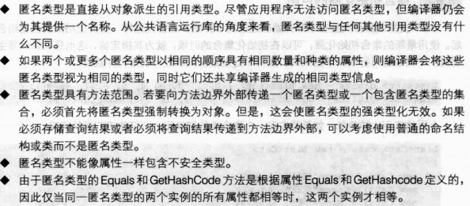

	创建匿名类型对象示例：
var v = new { Amount = 108, Message = "Hello" };

面向对象
命名空间
	使用别名：using MyAlias = MyNamespace1.MyNamespace2.MyNamespace3
类
成员种类
成员	说明
常量	与类关联的常量值
字段	类的变量
方法	类可执行的计算和操作
属性	与读写类的命名属性相关联的操作
索引器	与以数组方式索引类的实例相关联的操作
事件	可由类生成的通知
运算符	类所支持的转换和表达式运算符
构造函数	初始化类的实例或类本身所需的操作
析构函数	在永久丢弃类的实例之前执行的操作
类型	类所声明的嵌套类型
可访问性
可访问性	含义
public	访问不受限制
protected	访问仅限于此类或从此类派生的类
internal	访问仅限于此程序
protected internal	访问仅限于此程序或从此类派生的类
private	访问仅限于此类
类型参数
类定义可以通过在类名后添加用尖括号括起来的类型参数名称列表来指定一组类型参数。类型参数可用于在类声明体中定义类的成员。采用类型参数的类称为泛型类。结构类型、接口类型和委托类型也可以是泛型。当使用泛型类时，必须为每个类型参数提供类型实参，提供了类型实参的泛型类型称为构造的类型。
基类
类声明可通过在类名和类型参数后面添加一个冒号和基类的名称来指定一个基类。省略基类的指定等同于从类型object派生。
类继承其基类的成员。继承意味着一个类隐式地将它的基类的所有成员当作自已的成员，但基类的实例构造函数、静态构造函数和析构函数除外。派生类能够在继承基类的基础上添加新的成员，但是它不能移除继承成员的定义。
从某个类到它的任何基类存在隐式转换。因此，类的变量可以引用该类的实例或任何派生类的实例。
字段
字段是与类或类的实例关联的变量。
使用static修饰符声明的字段定义了一个静态字段 (static field)。一个静态字段只标识一个存储位置。无论对一个类创建多少个实例，它的静态字段永远都只有一个副本。
不使用static修饰符声明的字段定义了一个实例字段 (instance field)。类的每个实例都为该类的所有实例字段包含一个单独副本。
可以使用readonly修饰符声明只读字段(read-only field)。给readonly字段的赋值只能作为字段声明的组成部分出现，或在同一个类中的构造函数中出现。
方法
方法(method)是一种成员，用于实现可以由对象或类执行的计算或操作。静态方法(static method)通过类来访问。实例方法 (instance method)通过类的实例来访问。
方法具有一个参数(parameter)列表(可以为空)，表示传递给该方法的值或变量引用；方法还具有一个返回类型(return type)，指定该方法计算和返回的值的类型。如果方法不返回值，则其返回类型为void。
与类型一样，方法也可以有一组类型参数，当调用方法时必须为类型参数指定类型实参。与类型不同的是，类型实参经常可以从方法调用的实参推断出，而无需显式指定。
方法的签名(signature)在声明该方法的类中必须唯一。方法的签名由方法的名称、类型参数的数目以及该方法的参数的数目、修饰符和类型组成，方法的签名不包含返回类型。
扩展方法
using System;
using System.Collections.Generic;
using System.Linq;
using System.Text;

/*
 * 扩展方法：
 *     可以使用实例方法的语法来调用静态方法，
 *     扩展方法已经绑定到参数指定的类型上面
 * 定义扩展方法注意事项：
 *     静态类：类必须用static关键字定义
 *     静态方法：扩展方法必须用static关键字定义
 *     this关键字：扩展方法的第一个参数前，必须有this关键字
 */
namespace com.starchen.demo
{
  class Program
  {
    static void Main(string[] args)
    {
      //定义参数
      int i = 10;
      int m = 20;
      //调用扩展方法
      string str1 = i.toStr1();
      //调用静态方法
      string str2 = Test.toStr2(m);
      //输出结果
      Console.WriteLine(str1);
      Console.WriteLine(str2);  
    } 
  }
  //定义一个测试类
  public static class Test
  {
    //定义扩展方法
    public static string toStr1(this int x)
    {
      return x.ToString();  
    } 
    //定义普通静态方法
    public static string toStr2(int x)
    {
      return x.ToString();  
    }
  }
}

参数
参数用于向方法传递值或变量引用。方法的参数从调用该方法时指定的实参(argument)获取它们的实际值。有四类参数：值参数、引用参数、输出参数和参数数组。
值参数(value parameter)用于传递输入参数。一个值参数相当于一个局部变量，只是它的初始值来自于该形参传递的实参。对值参数的修改不影响为该形参传递的实参。
值参数可以是可选的，通过指定默认值可以省略对应的实参。
引用参数(reference parameter)用于传递输入和输出参数。为引用参数传递的实参必须是变量，并且在方法执行期间，引用参数与实参变量表示同一存储位置。引用参数使用ref修饰符声明。
输出参数(output parameter)用于传递输出参数。对于输出参数来说，调用方提供的实参的初始值并不重要。除此之外，输出参数与引用参数类似。输出参数是用out修饰符声明的。
参数数组(parameter array)允许向方法传递可变数量的实参。参数数组使用params修饰符声明。只有方法的最后一个参数才可以是参数数组，并且参数数组的类型必须是一维数组类型。System.Console类的Write和WriteLine方法就是参数数组用法的很好示例。
方法体和局部变量
方法体指定了在调用该方法时将执行的语句。方法体可以声明仅用在该方法调用中的变量。这样的变量称为局部变量(local variable)。局部变量声明指定了类型名称、变量名称，还可指定初始值。C#要求在对局部变量明确赋值(definitely assigned)之后才能获取其值。
方法可以使用return语句将控制返回到它的调用方。在返回void的方法中，return语句不能指定表达式。在返回非void的方法中，return语句必须含有一个计算返回值的表达式。
静态方法和实例方法
使用static修饰符声明的方法为静态方法(static method)。静态方法不对特定实例进行操作，并且只能直接访问静态成员。
不使用static修饰符声明的方法为实例方法(instance method)。实例方法对特定实例进行操作，并且能够访问静态成员和实例成员。在调用实例方法的实例上，可以通过this显式地访问该实例。而在静态方法中引用this是错误的。
虚方法、重写方法和抽象方法
若一个实例方法的声明中含有virtual修饰符，则称该方法为虚方法(virtual method)。若其中没有 virtual修饰符，则称该方法为非虚方法(non-virtual method)。
在调用一个虚方法时，该调用所涉及的实例的运行时类型(runtime type)确定了要实际调用的方法实现。在非虚方法调用中，实例的编译时类型(compile-time type)负责做出此决定。
虚方法可以在派生类中重写(override)。当某个实例方法声明包括override修饰符时，该方法将重写所继承的具有相同签名的虚方法。虚方法声明用于引入新方法，而重写方法声明则用于使现有的继承虚方法专用化（通过提供该方法的新实现）。
抽象(abstract)方法是没有实现的虚方法。抽象方法使用abstract修饰符进行声明，并且只允许出现在同样被声明为abstract的类中。抽象方法必须在每个非抽象派生类中重写。
方法重载
方法重载(overloading)允许同一类中的多个方法具有相同名称，条件是这些方法具有唯一的签名。在编译一个重载方法的调用时，编译器使用重载决策(overload resolution)确定要调用的特定方法。重载决策将查找与参数最佳匹配的方法，如果没有找到任何最佳匹配的方法则报告错误信息。
其他函数成员
包含可执行代码的成员统称为类的函数成员(function member)。
下表演示一个名为List<T>的泛型类，它实现一个可增长的对象列表。该类包含了几种最常见的函数成员的示例。
using System;

public class List<T>
{
    //常量
    const int defaultCapacity = 4;

    //字段
    T[] items;
    int count;

    //构造函数
    public List(int capacity = defaultCapacity)
    {
        items = new T[capacity];
    }

    //属性
    public int Count
    {
        get { return count; }
    }
    public int Capacity
    {
        get
        {
            return items.Length;
        }
        set
        {
            if (value < count) value = count;
            if (value != items.Length)
            {
                T[] newItems = new T[value];
                Array.Copy(items, 0, newItems, 0, count);
                items = newItems;
            }
        }
    }

    //索引器
    public T this[int index]
    {
        get
        {
            return items[index];
        }
        set
        {
            items[index] = value;
            OnChanged();
        }
    }

    //方法
    public void Add(T item)
    {
        if (count == Capacity) Capacity = count * 2;
        items[count] = item;
        count++;
        OnChanged();
    }
    protected virtual void OnChanged()
    {
        if (Changed != null) Changed(this, EventArgs.Empty);
    }
    public override bool Equals(object other)
    {
        return Equals(this, other as List<T>);
    }
    static bool Equals(List<T> a, List<T> b)
    {
        if (a == null) return b == null;
        if (b == null || a.count != b.count) return false;
        for (int i = 0; i < a.count; i++)
        {
            if (!Equals(a.items[i], b.items[i]))
            {
                return false;
            }
        }
        return true;
    }
    public override int GetHashCode()
    {
        return base.GetHashCode();
    }

    //事件
    public event EventHandler Changed;

    //运算符
    public static bool operator ==(List<T> a, List<T> b)
    {
        return Equals(a, b);
    }
    public static bool operator !=(List<T> a, List<T> b)
    {
        return !Equals(a, b);
    }
}

构造函数
C#支持两种构造函数：实例构造函数和静态构造函数。实例构造函数(instance constructor)是实现初始化类实例所需操作的成员。静态构造函数(static constructor)是一种用于在第一次加载类本身时实现其初始化所需操作的成员。
实例构造函数可以被重载。
实例构造函数不同于其他成员，它是不能被继承的。一个类除了其中实际声明的实例构造函数外，没有其他的实例构造函数。如果没有为某个类提供任何实例构造函数，则将自动提供一个不带参数的空的实例构造函数。
属性
属性(property)是字段的自然扩展。属性和字段都是命名的成员，都具有相关的类型，且用于访问字段和属性的语法也相同。然而，与字段不同，属性不表示存储位置。相反，属性有访问器(accessor)，这些访问器指定在读取或写入它们的值时需执行的语句。
属性的声明与字段类似，不同的是属性声明以位于定界符 { 和 } 之间的一个get访问器和/或一个set访问器结束，而不是以分号结束。同时具有get访问器和set访问器的属性是读写属性(read-write property)，只有get访问器的属性是只读属性(read-only property)，只有set访问器的属性是只写属性(write-only property)。
与字段和方法相似，C# 同时支持实例属性和静态属性。静态属性使用 static 修饰符声明，而实例属性的声明不带该修饰符。
属性的访问器可以是虚的。当属性声明包括 virtual、abstract 或 override 修饰符时，修饰符应用于该属性的访问器。
索引器
索引器(indexer)是这样一个成员：它支持按照索引数组的方法来索引对象。索引器的声明与属性类似，不同的是该成员的名称是 this，后跟一个位于定界符 [ 和 ] 之间的参数列表。在索引器的访问器中可以使用这些参数。与属性类似，索引器可以是读写、只读和只写的，并且索引器的访问器可以是虚的。
索引器可以被重载，这意味着一个类可以声明多个索引器，只要其参数的数量和类型不同即可。

using System;

namespace com.starchen.core
{
    public class 索引器示例
    {
        public void 测试索引器()
        {
            IMyInterface test = new MyClass();
            for (int i = 0; i < 10; i++)
            {
                int num = test[i];
                Console.WriteLine(num);
            }
        }
    }

    public interface IMyInterface
    {
        int this[int index]
        {
            get;
            set;
        }
    }

    public class MyClass : IMyInterface
    {
        private int[] nums = new int[10];

        public MyClass()
        {
            for(int i =0;i<10;i++)
            {
                nums[i] = i + 1;
            }
        }

        /// 

        /// 索引器，用于访问nums
        /// 

        /// <param name="index"></param>
        /// <returns></returns>
        public int this[int index]
        {
            get
            {
                return nums[index];
            }

            set
            {
                nums[index] = value;
            }
        }
    }
}

运算符
运算符 (operator) 是一种类成员，它定义了可应用于类实例的特定表达式运算符的含义。可以定义三类运算符：一元运算符、二元运算符和转换运算符。所有运算符都必须声明为 public 和 static。
List<T> 类声明了两个运算符 operator == 和 operator !=，从而为将那些运算符应用于 List<T> 实例的表达式赋予了新的含义。具体而言，上述运算符将两个 List<T> 实例的相等关系定义为逐一比较其中所包含的对象（使用所包含对象的 Equals 方法）。
可重载运算符列表

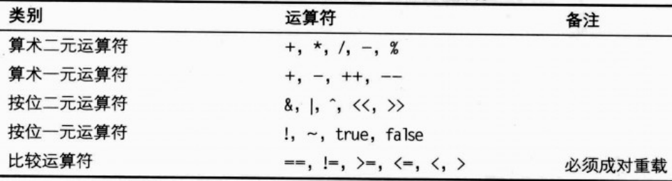

像"+="，"-="这些运算符很明显可以由"+"，"-"实现，所以无需显示重载。
析构函数
析构函数 (destructor) 是一种用于实现销毁类实例所需操作的成员。析构函数不能带参数，不能具有可访问性修饰符，也不能被显式调用。垃圾回收期间会自动调用实例的析构函数。
垃圾回收器在决定何时回收对象和运行析构函数方面允许有广泛的自由度。具体而言，析构函数调用的时机并不是确定的，析构函数可以在任何线程上执行。由于这些以及其他原因，仅当没有其他可行的解决方案时，才应在类中实现析构函数。using语句提供了更好的对象析构方法。
类型
C# 语言的类型划分为两大类：值类型 (Value type) 和引用类型 (reference type)。值类型和引用类型都可以为泛型类型 (generic type)，泛型类型采用一个或多个类型参数。类型参数可以指定值类型和引用类型。第三种类型是指针，只能用在不安全代码中。
值类型与引用类型的不同之处在于：值类型的变量直接包含其数据，而引用类型的变量存储对其数据的引用 (reference)，后者称为对象 (object)。对于引用类型，两个变量可能引用同一个对象，因此对一个变量的操作可能影响另一个变量所引用的对象。对于值类型，每个变量都有自己的数据副本，对一个变量的操作不可能影响另一个变量。
C#的类型系统是统一的，因此任何类型的值都可以按对象处理。C#中的每个类型直接或间接地从object类类型派生，而object是所有类型的最终基类。引用类型的值都被视为object类型，被简单地当作对象来处理。值类型的值则通过对其执行装箱和拆箱操作按对象处理。
值类型
一个值类型或是结构类型，或是枚举类型。C#提供称为简单类型(simple type)的预定义结构类型集。
与引用类型的变量不同的是，仅当该值类型是可以为null的类型时，值类型的变量才可包含null值。 对于每个不可以为null的值类型，都存在一个对应的可以为null的值类型，该类型表示相同的值集加上null值。
对值类型变量赋值时，会创建所赋的值的一个副本。这不同于引用类型的变量赋值，引用类型的变量赋值复制的是引用而不是由引用标识的对象。
所有值类型从类System.ValueType隐式继承，后者又从类object继承。任何类型都不可能从值类型派生，因此，所有值类型都是隐式密封的。
注意，System.ValueType本身不是 value-type，而是class-type，所有value-type都从它自动派生。
所有值类型都隐式声明一个称为默认构造函数(default constructor)的公共无参数实例构造函数。默认构造函数返回一个零初始化实例，它就是该值类型的默认值(default value)：
对于所有simple-types，默认值是由所有位都置零的位模式产生的值：
	对于sbyte、byte、byte、ushort、int、uint、long和ulong，默认值为0。
	对于char，默认值为'\x0000'。
	对于float，默认值为0.0f。
	对于double，默认值为0.0d。
	对于decimal，默认值为0.0m。
	对于bool，默认值为false。
对于enum-type E，默认值为0，该值被转换为类型E。
对于struct-type，默认值是通过将所有值类型字段设置为它们的默认值并将所有引用类型字段设置为null而产生的值。
对于nullable-type，默认值是一个其HasValue属性为 false且Value属性未定义的实例。默认值也称为可以为null的类型的null值(null value)。
与任何其他实例构造函数一样，值类型的默认构造函数也是用new运算符调用的。出于效率原因，实际上，不必故意调用它的构造函数。由于每个值类型都隐式地具有一个公共无形参实例构造函数，因此，一个结构类型中不可能包含一个关于无形参构造函数的显式声明。但允许结构类型声明参数化实例构造函数。
结构类型
结构类型是一种值类型，它可以声明常量、字段、方法、属性、索引器、运算符、实例构造函数、静态构造函数和嵌套类型。
简单类型
C#提供称为简单类型(simple type)的预定义结构类型集。简单类型通过保留字标识，而这些保留字只是System命名空间中预定义结构类型的别名，详见下表。
保留字	化名的类型
sbyte	System.SByte
byte	System.Byte
short	System.Int16
ushort	System.UInt16
int	System.Int32
uint	System.UInt32
long	System.Int64
ulong	System.UInt64
char	System.Char
float	System.Single
double	System.Double
bool	System.Boolean
decimal	System.Decimal

整型
C#支持9种整型：sbyte、byte、short、ushort、int、uint、long、ulong和char。
整型具有以下所列的大小和取值范围：
sbyte类型表示有符号8位整数，其值介于-128和127之间。
byte类型表示无符号8位整数，其值介于0和255之间。
short 类型表示有符号16位整数，其值介于-32768和32767之间。
ushort类型表示无符号16位整数，其值介于0和65535之间。
int类型表示有符号32位整数，其值介于-2147483648和2147483647之间。
uint类型表示无符号32位整数，其值介于0和4294967295之间。
long类型表示有符号64位整数，其值介于-9223372036854775808和9223372036854775807之间。
ulong类型表示无符号64位整数，其值介于0和18446744073709551615之间。
char类型表示无符号16位整数，其值介于0和65535之间。char类型的可能值集与Unicode字符集相对应。虽然char的表示形式与ushort相同，但是可以对一种类型进行的所有计算并非都可以对另一种类型执行。
浮点型
C#支持两种浮点型：float和double。float和double类型用32位单精度和64位双精度格式来表示，这些格式提供以下几组值：
正零和负零。大多数情况下，正零和负零的行为与简单的值零相同，但某些运算会区别对待此两种零。
正无穷大和负无穷大。无穷大是由非零数字被零除这样的运算产生的。例如，1.0 / 0.0 产生正无穷大，而 –1.0 / 0.0 产生负无穷大。
非数字(Not-a-Number)值，常缩写为NaN。NaN是由无效的浮点运算(如零被零除)产生的。
如果浮点运算无效，则运算的结果变成 NaN。
如果浮点运算的一个或两个操作数为 NaN，则运算的结果变成 NaN。
decimal类型
decimal类型是128位的数据类型，适合用于财务计算和货币计算。decimal类型可以表示具有28或29个有效数字、从1.0 × 10−28 到大约 7.9 × 1028 范围内的值。
与浮点型相比，decimal类型具有较高的精度，但取值范围较小。因此，从浮点型到decimal的转换可能会产生溢出异常，而从decimal到浮点型的转换则可能导致精度损失。由于这些原因，在浮点型和decimal之间不存在隐式转换，如果没有显式地标出强制转换，就不可能在同一表达式中同时使用浮点操作数和 decimal操作数。
bool类型
bool类型表示布尔逻辑量。bool类型的可能值为true和false。
在bool和其他类型之间不存在标准转换。具体而言，bool类型与整型截然不同，不能用bool值代替整数值，反之亦然。
在C和C++语言中，零整数或浮点值或null指针可以转换为布尔值false，非零整数或浮点值或非null指针可以转换为布尔值true。在C#中，这种转换是通过显式地将整数或浮点值与零进行比较，或者显式地将对象引用与null进行比较来完成的。
枚举类型
枚举类型是具有命名常量的独特的类型。每个枚举类型都有一个基础类型，该基础类型必须为 byte、sbyte、short、ushort、int、uint、long 或 ulong。枚举类型的值集和它的基础类型的值集相同。枚举类型的值并不只限于那些命名常量的值。枚举类型是通过枚举声明定义的。
可以为null的类型
可以为null的类型可以表示其基础类型 (underlying type) 的所有值和一个额外的 null 值。可以为 null 的类型写作 T ?，其中 T 是基础类型。此语法是 System.Nullable<T> 的简写形式，这两种形式可以互换使用。
相反，不可以为 null 的值类型 (non-nullable value type) 可以是除 System.Nullable<T> 及其简写形式T ?(对于任何类型的T)之外的任何值类型，加上约束为不可以为 null 的值类型的任何类型参数(即具有 struct 约束的任何类型参数)。
可以为 null 的类型 T ? 的实例有两个公共只读属性：
•	类型为 bool 的 HasValue 属性
•	类型为 T 的 Value 属性
HasValue 为 true 的实例称为非 null。非 null 实例包含一个已知值，可通过 Value 返回该值。
HasValue 为 false 的实例称为 null。null 实例有一个不确定的值。尝试读取 null 实例的 Value 将导致引发 System.InvalidOperationException。访问可以为 null 的实例的 Value 属性的过程称作解包 (unwrapping)。
除了默认构造函数之外，每个可以为 null 的类型 T ? 都有一个具有类型为 T 的单个实参的公共构造函数。例如，给定一个类型为 T 的值 x，调用形如new T?(x) 的构造函数将创建 T? 的非 null 实例，其 Value 属性为 x。为一个给定值创建可以为 null 的类型的非 null 实例的过程称作包装 (wrapping)。从 null 文本转换为 T?以及从 T 转换为 T?可使用隐式转换。
引用类型
引用类型是类类型、接口类型、数组类型或委托类型。
引用类型值是对该类型的某个实例 (instance) 的一个引用，后者称为对象 (object)。null 值比较特别，它兼容于所有引用类型，用来表示“没有被引用的实例”。
开放和封闭类型
所有类型都可归类为开放类型 (open type) 或封闭类型 (closed type)。开放类型是包含类型形参的类型。更明确地说：
•	类型形参定义开放类型。
•	当且仅当数组元素类型是开放类型时，该数组类型才是开放类型。
•	当且仅当构造类型的一个或多个类型实参为开放类型时，该构造类型才是开放类型。当且仅当构造的嵌套类型的一个或多个类型实参或其包含类型的类型实参为开放类型时，该构造的嵌套类型才是开放类型。
封闭类型是不属于开放类型的类型。
在运行时，泛型类型声明中的所有代码都在一个封闭构造类型的上下文中执行，这个封闭构造类型是通过将类型实参应用该泛型声明来创建的。泛型类型中的每个类型形参都绑定到特定的运行时类型。所有语句和表达式的运行时处理都始终使用封闭类型，开放类型仅出现在编译时处理过程中。
每个封闭构造类型都有自己的静态变量集，任何其他封闭构造类型都不会共享这些变量。由于开放类型在运行时并不存在，因此不存在与开放类型关联的静态变量。如果两个封闭构造类型是从相同的未绑定泛型类型构造的，并且它们的对应类型实参属于相同类型，则这两个封闭构造类型是相同类型。
绑定和未绑定类型
术语未绑定类型 (unbound type) 是指非泛型类型或未绑定的泛型类型。术语绑定类型 (bound type) 是指非泛型类型或构造类型。
未绑定类型是指类型声明所声明的实体。未绑定泛型类型本身不是一种类型，不能用作变量、参数或返回值的类型，也不能用作基类型。可以引用未绑定泛型类型的唯一构造是typeof表达式。
类型形参
类型形参是指定形参在运行时要绑定到的值类型或引用类型的标识符。
由于类型形参可使用许多不同的实际类型实参进行实例化，因此类型形参具有与其他类型稍微不同的操作和限制。这包括：
•	不能直接使用类型形参声明基类或接口。
•	类型形参上的成员查找规则取决于应用到该类型形参的约束。
•	类型形参的可用转换取决于应用到该类型形参的约束。
•	如果事先不知道由类型形参给出的类型是引用类型，不能将标识 null 转换为该类型。不过，可以改为使用 default 表达式。此外，具有由类型形参给出的类型的值可以 使用 == 和 != 与 null 进行比较，除非该类型形参具有值类型约束。
•	仅当类型形参受 constructor-constraint 或值类型约束的约束时，才能将 new 表达式与类型形参联合使用。
•	不能在特性中的任何位置上使用类型形参。
•	不能在成员访问或类型名称中使用类型形参标识静态成员或嵌套类型。
•	在不安全代码中，类型形参不能用作 unmanaged-type。
作为类型，类型形参纯粹是一个编译时构造。在运行时，每个类型形参都绑定到一个运行时类型，运行时类型是通过向泛型类型声明提供类型实参来指定的。因此，使用类型形参声明的变量的类型在运行时将是封闭构造类型。涉及类型形参的所有语句和表达式的运行时执行都使用作为该形参的类型实参提供的实际类型。
表达式树类型
表达式树 (Expression tree) 允许匿名函数表示为数据结构而不是可执行代码。表达式树是 System.Linq.Expressions.Expression<D> 形式的表达式树类型 (expression tree type) 的值，其中 D 是任何委托类型。对于本规范的其余部分，我们将使用简写形式 Expression<D> 引用这些类型。
如果存在从匿名函数到委托类型 D 的转换，则也存在到表达式树类型 Expression<D> 的转换。不过，匿名函数到委托类型的转换会生成一个引用该匿名函数的可执行代码的委托，而到表达式树类型的转换则会创建该匿名函数的表达式树表示形式。
表达式树是匿名函数有效的内存数据表示形式，它使匿名函数的结构变得透明和明晰。与委托类型 D 一样，Expression<D> 具有与 D 相同的参数和返回类型。
下面的示例将匿名函数表示为可执行代码和表达式树。因为存在到 Func<int,int> 的转换，所以也存在到 Expression<Func<int,int>> 的转换：
Func<int,int> del = x => x + 1;					// Code
Expression<Func<int,int>> exp = x => x + 1;		// Data
进行上面的赋值之后，委托 del 引用返回 x + 1 的方法，表达式目录树 exp 引用描述表达式 x => x + 1 的数据结构。
泛型类型 Expression<D> 的准确定义以及当将匿名函数转换为表达式树类型时用于构造表达式树的确切规则不在本规范的范围之内，将另作说明。
有两个要点需要明确指出：
•	并非所有匿名函数都能表示为表达式树。例如，具有语句体的匿名函数和包含赋值表达式的匿名函数就不能表示为表达式树。在这些情况下，转换仍存在，但在编译时将失败。
•	Expression<D> 提供一个实例方法 Compile，该方法产生一个类型为 D 的委托： 
Func<int,int> del2 = exp.Compile();
调用此委托将导致执行表达式树所表示的代码。因此，根据上面的定义，del 和 del2 等效，而且下面的两个语句也将等效：
int i1 = del(1);
int i2 = del2(1);
执行此代码后，i1 和 i2 的值都为 2。
dynamic类型
dynamic 类型在 C# 中具有特殊含义。其用途在于允许进行动态绑定。dynamic 被视为与 object 相同，除了以下这些方面：
	对 dynamic 类型的表达式进行的运算可以动态绑定。
	类型推断在 dynamic 和 object 都是候选项时，会优先考虑前者。
由于此等效性，因此存在以下情况：
object 与 dynamic 之间，以及对于在将 dynamic 替换为 object 时相同的构造类型之间，存在隐式标识转换
与 object 之间的隐式和显式转换也适用于 dynamic。
在将 dynamic 替换为 object 时相同的方法签名视为是相同的签名
dynamic 类型在运行时与 object 没有区别。
dynamic 类型的表达式称为动态表达式 (dynamic expression)。
枚举
枚举类型 (enum type)是具有一组命名常量的独特的值类型，由System.Enum继承而来。
每个枚举类型都有一个相应的整型(除char外)类型，称为该枚举类型的基础类型 (underlying type)。没有显式声明基础类型的枚举类型所对应的基础类型是 int。枚举类型的存储格式和取值范围由其基础类型确定。一个枚举类型的值域不受它的枚举成员限制。具体而言，一个枚举的基础类型的任何一个值都可以被强制转换为该枚举类型，成为该枚举类型的一个独特的有效值。
任何枚举类型的默认值都是转换为该枚举类型的整型值零。在变量被自动初始化为默认值的情况下，该默认值就是赋予枚举类型的变量的值。为了便于获得枚举类型的默认值，文本 0 隐式地转换为任何枚举类型。
using System;
using System.Collections.Generic;
using System.Text;

/// 

/// 枚举示例
/// 

namespace com.starchen.demo
{
    class Program
    {
        static void Main(string[] args)
        {
            //分别输出四个方向和对应的整数值
            Console.WriteLine(MyDirection.East);
            Console.WriteLine(MyDirection.South);
            Console.WriteLine(MyDirection.West);
            Console.WriteLine(MyDirection.North);
            Console.WriteLine(Convert.ToInt32(MyDirection.East));
            Console.WriteLine(Convert.ToInt32(MyDirection.South));
            Console.WriteLine(Convert.ToInt32(MyDirection.West));
            Console.WriteLine(Convert.ToInt32(MyDirection.North));
        }
    }
    /// 

    /// 表示星期
    /// 

    enum DaysInWeek
    {
        Sunday, Monday, Tuesday, Wednesday, Thursday, Friday, Saturday
    }
    /// 

    /// 表示方向
    /// 默认情况下枚举中定义的值是根据定义的顺序从0开始顺序递增的
    /// 但是可以根据自定义改变
    /// 

    enum MyDirection
    {
        East = 1,
        South = 2,
        West = 3,
        North = 4
    }
}

结构
结构 (struct) 是能够包含数据成员和函数成员的数据结构。但是结构是值类型，不需要堆分配。结构类型的变量直接存储该结构的数据。结构类型不支持用户指定的继承，并且所有结构类型都隐式地从类型object继承。
结构对于具有值语义的小型数据结构尤为有用。复数、坐标系中的点或字典中的“键-值”对都是结构的典型示例。对小型数据结构而言，使用结构而不使用类会大大节省需要为应用程序分配的内存数量。
结构构造函数也是使用 new 运算符调用，但是这并不意味着会分配内存。结构构造函数并不动态分配对象并返回对它的引用，而是直接返回结构值本身(通常是堆栈上的一个临时位置)，然后根据需要复制该结构值。
对于类，两个变量可能引用同一对象，因此对一个变量进行的操作可能影响另一个变量所引用的对象。对于结构，每个变量都有自己的数据副本，对一个变量的操作不会影响另一个变量。
复制整个结构通常不如复制对象引用的效率高，因此结构的赋值和值参数传递可能比引用类型的开销更大。其次，除了ref和out参数，不可能创建对结构的引用，这样限制了结构的应用范围。
所有的基本类型都是结构类型。
堆栈的执行效率比堆高，但是资源有限，因此实际运用中对于需要构造函数、常量、字段、方法、属性、索引器、运算符、事件和嵌套类型的复杂类型的处理建议使用class；简单并且不涉及复制的类型可以使用结构。
结构是隐式的sealed，不能从另外的结构或类继承，但是可以继承接口。
using System;

/// 

/// 结构示例
/// 

namespace com.starchen.demo
{
    interface IShape
    {
        /// 

        /// Paint方法
        /// 

        void Paint();
    }
    struct Round : IShape
    {
        /// 

        /// 园的半径
        /// 

        public double r;
        /// 

        /// 构造函数，负责初始化圆的半径
        /// 

        /// <param name="x">圆的半径</param>
        public Round(double x)
        {
            r = x;
        }
        /// 

        /// 求圆的面积
        /// 

        /// <returns></returns>
        public double Area()
        {
            return Math.PI * r * r;
        }
        /// 

        /// Paint方法
        /// 

        public override void Paint()
        {
            //具体代码
        }
    }
    public class Program
    {
        static void Main(string[] args)
        {
            Round myRound1;
            myRound1.r = 2;
            Console.WriteLine("一号圆的面积为：{0}", myRound1.Area());
            Round myRound2 = new Round(2);
            Console.WriteLine("二号圆的面积为：{0}", myRound2.Area());
            Console.ReadLine();
        }
    }
}

接口
接口 (interface) 定义了一个可由类和结构实现的协定。接口可以包含方法、属性、事件和索引器。接口不提供它所定义的成员的实现——它仅指定实现该接口的类或结构必须提供的成员。接口可支持多重继承。
在无法静态知道某个实例是否实现某个特定接口的情况下，可以使用动态类型强制转换。
C# 还支持显式接口成员实现，类或结构可以使用它来避免将成员声明为public。显式接口成员实现使用完全限定的接口成员名。显式接口成员只能通过接口类型来访问。

委托
委托类型 (delegate type) 表示对具有特定参数列表和返回类型的方法的引用。通过委托，我们能够将方法作为实体赋值给变量和作为参数传递。委托类似于在其他某些语言中的函数指针的概念，但是与函数指针不同，委托是面向对象的，并且是类型安全的。
委托既可以引用静态方法，也可以引用实例方法。引用了实例方法的委托也就引用了一个特定的对象，当通过该委托调用这个实例方法时，该对象在调用中成为this。
也可以使用匿名函数创建委托，这是即时创建的“内联方法”。
委托的一个有趣且有用的属性在于，它不知道也不关心它所引用的方法的类；它仅关心所引用的方法是否与委托具有相同的参数和返回类型。
委托的特点：

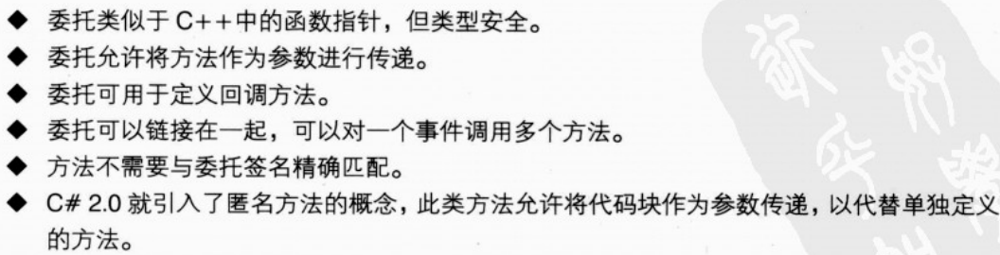

在以下情况下使用委托：

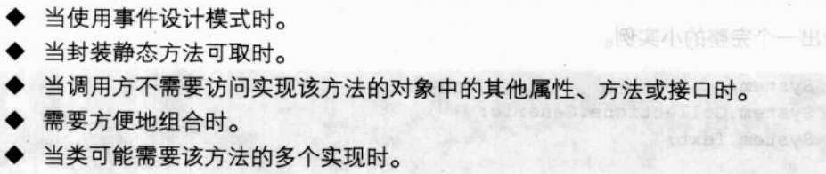

在以下情况下使用接口：

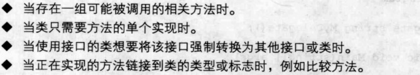

事件
事件(event)是一种使类或对象能够提供通知的成员。事件的声明与字段类似，不同的是事件的声明包含event关键字，并且类型必须是委托类型。在声明事件成员的类中，事件的行为就像委托类型的字段(前提是该事件不是抽象的并且未声明访问器)。该字段存储对一个委托的引用，该委托表示已添加到该事件的事件处理程序。如果尚未添加事件处理程序，则该字段为 null。
客户端通过事件处理程序 (event handler) 来响应事件。事件处理程序使用 += 运算符附加，使用 -= 运算符移除。下面的示例向 List<string> 类的 Changed 事件附加一个事件处理程序。
对于要求控制事件的底层存储的高级情形，事件声明可以显式提供add和remove访问器，它们在某种程度上类似于属性的set访问器。

变量
变量表示存储位置。每个变量都具有一个类型，用于确定哪些值可以存储在该变量中。C# 是一种类型安全的语言，C# 编译器保证存储在变量中的值总是具有合适的类型。通过赋值或使用 ++ 和 -- 运算符可以更改变量的值。
在可以获取变量的值之前，变量必须已明确赋值 (definitely assigned)。
C# 定义了 7 类变量：静态变量、实例变量、数组元素、值参数、引用参数、输出参数和局部变量。
静态变量
用 static 修饰符声明的字段称为静态变量。静态变量在包含了它的那个类型的静态构造函数执行之前就存在了，在退出关联的应用程序域时不复存在。
静态变量的初始值是该变量的类型的默认值。出于明确赋值检查的目的，静态变量被视为初始已赋值。
实例变量
未用 static 修饰符声明的字段称为实例变量。
类的实例变量在创建该类的新实例时开始存在，在所有对该实例的引用都已终止，并且已执行了该实例的析构函数时终止。类实例变量的初始值是该变量的类型的默认值。出于明确赋值检查的目的，类的实例变量被视为初始已赋值。
结构的实例变量与它所属的结构变量具有完全相同的生存期。换言之，当结构类型的变量开始存在或停止存在时，该结构的实例变量也随之存在或消失。结构的实例变量与包含它的结构变量具有相同的初始赋值状态。换言之，当结构变量本身被视为初始已赋值时，它的实例变量也被视为初始已赋值。而当结构变量被视为初始未赋值时，它的实例变量同样被视为未赋值。
数组元素
数组的元素在创建数组实例时开始存在，在没有对该数组实例的引用时停止存在。每个数组元素的初始值都是其数组元素类型的默认值。出于明确赋值检查的目的，数组元素被视为初始已赋值。
值参数
未用 ref 或 out 修饰符声明的参数为值参数。
值形参在调用该形参所属的函数成员（方法、实例构造函数、访问器或运算符）或匿名函数时开始存在，并用调用中给定的实参的值初始化。当返回该函数成员或匿名函数时值形参通常停止存在。但是，如果值形参被匿名函数捕获，则其生存期将至少延长到从该匿名函数创建的委托或表达式树可以被垃圾回收为止。
出于明确赋值检查的目的，值形参被视为初始已赋值。
引用形参
用 ref 修饰符声明的形参是引用形参。
引用形参不创建新的存储位置。它表示在对该函数成员或匿名函数调用中以实参形式给出的变量所在的存储位置。因此，引用形参的值总是与基础变量相同。
下面的明确赋值规则适用于引用形参。
变量在可以作为引用形参在函数成员或委托调用中传递之前，必须已明确赋值。
在函数成员或匿名函数内部，引用形参被视为初始已赋值。
在结构类型的实例方法或实例访问器内部，this 关键字的行为与该结构类型的引用形参完全相同。
输出形参
用 out 修饰符声明的形参是输出形参。
输出形参不创建新的存储位置。而输出形参表示在对该函数成员或委托调用中以实参形式给出的变量所在的存储位置。因此，输出形参的值总是与基础变量相同。
下面的明确赋值规则应用于输出形参。
变量在可以作为输出形参在函数成员或委托调用中传递之前无需明确赋值。
在正常完成函数成员或委托调用之后，每个作为输出形参传递的变量都被认为在该执行路径中已赋值。
在函数成员或匿名函数内部，输出形参被视为初始未赋值。
函数成员或匿名函数的每个输出形参在该函数成员或匿名函数正常返回前都必须已明确赋值。
在结构类型的实例构造函数内部，this 关键字的行为与结构类型的输出形参完全相同。
局部变量
	隐形局部变量通过 var 来声明，不过只能用于局部变量，并且一旦赋值后，变量类型即被确定，不能改变。
variable-reference 是一个 expression，它被归类为一个变量。variable-reference 表示一个存储位置，访问它可以获取当前值以及存储新值。
在 C 和 C++ 中，variable-reference 称为 lvalue。
下列数据类型的读写是原子形式的：bool、char、byte、sbyte、short、ushort、uint、int、float 和引用类型。除此之外，当枚举类型的基础类型的属于上述类型之一时，对它的读写也是原子的。其他类型的读写，包括 long、ulong、double 和 decimal 以及用户定义类型，都不一定是原子的。除专为该目的设计的库函数以外，对于增量或减量这类操作也不能保证进行原子的读取、修改和写入。
 
转换
转换(conversion) 使表达式可以被视为一种特定类型。转换可导致将给定类型的表达式视为具有不同的类型，或其可导致没有类型的表达式获得一种类型。转换可以是隐式的 (implicit) 或显式的 (explicit)，这将确定是否需要显式地强制转换。
匿名函数转换
从其他 C# 构造的角度描述可能的匿名函数转换实现方法。此处所描述的实现基于 Microsoft C# 编译器所使用的相同原理，但决非强制性的实现方式，也不是唯一可能的实现方式。
public delegate void D();
//匿名函数的最简单形式是不捕获外层变量的形式：
class Test1
{
    static void F()
    {
        D d = () => { Console.WriteLine("test"); };
    }
}
//这可转换为引用编译器生成的静态方法的委托实例化，匿名函数的代码就位于该静态方法中：
class Test2
{
    static void F()
    {
        D d = new D(__Method1);
    }
    static void __Method1()
    {
        Console.WriteLine("test");
    }
}
//在下面的示例中，匿名函数引用 this 的实例成员：
class Test3
{
    int x;
    void F()
    {
        D d = () => { Console.WriteLine(x); };
    }
}
//这可转换为包含该匿名函数代码的、编译器生成的实例方法：
class Test4
{
    int x;
    void F()
    {
        D d = new D(__Method1);
    }
    void __Method1()
    {
        Console.WriteLine(x);
    }
}
//在此示例中，匿名函数捕获一个局部变量：
class Test5
{
    void F()
    {
        int y = 123;
        D d = () => { Console.WriteLine(y); };
    }
}
局部变量的生存期现在必须至少延长为匿名函数委托的生存期。这可以通过将局部变量“提升”到编译器生成的类的字段来实现。之后，局部变量的实例化对应于为编译器生成的类创建实例，而访问局部变量则对应于访问编译器生成的类的实例中的字段。而且，匿名函数将会成为编译器生成类的实例方法。
方法组转换
delegate string D1(object o);
delegate object D2(string s);
delegate object D3();
delegate string D4(object o, params object[] a);
delegate string D5(int i);
class Test
{
    static string F(object o) {...}
    static void G()
    {
        D1 d1 = F;          // Ok
        D2 d2 = F;          // Ok
        D3 d3 = F;          // Error – not applicable
        D4 d4 = F;          // Error – not applicable in normal form
        D5 d5 = F;          // Error – applicable but not compatible
    }
}

C#核心
	下面讲解C#语言的核心内容
Object

迭代器
	迭代器特点：

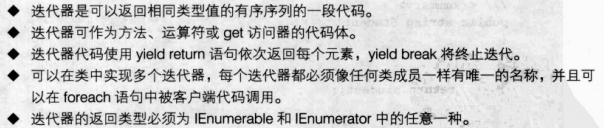

using System;

namespace com.starchen.core
{
    class Program
    {
        static void Main(string[] args)
        {
            //创建一个 StudentList 型的变量 
            StudentList myStudentList = new StudentList();
            //使用迭代器获得 myStudentList 的字段值
            foreach(var student in myStudentList)
            {
                //输出当前遍历的变量值
                Console.WriteLine(student.ToString());
            }
            Console.ReadLine();
        }
    }
    /// 

    /// StudentList类
    /// 

    class StudentList
    {
        string student1 = "甲";
        string student2 = "乙";
        string student3 = "丙";
        string student4 = "丁";
        string student5 = "戊";

        public string Student1
        {
            get
            {
                return student1;
            }

            set
            {
                student1 = value;
            }
        }

        public string Student2
        {
            get
            {
                return student2;
            }

            set
            {
                student2 = value;
            }
        }

        public string Student3
        {
            get
            {
                return student3;
            }

            set
            {
                student3 = value;
            }
        }

        public string Student4
        {
            get
            {
                return student4;
            }

            set
            {
                student4 = value;
            }
        }

        public string Student5
        {
            get
            {
                return student5;
            }

            set
            {
                student5 = value;
            }
        }

        /// 

        /// 类 StudentList 的迭代器
        /// 

        /// <returns></returns>
        public System.Collections.IEnumerator GetEnumerator()
        {
            //通过 for 循环对 StudentList 类中的 5 个 string 类型的变量进行处理
            for (int i = 0; i < 5; i++)
            {
                //通过switch对for循环中的i进行判断，返回相应的变量
                switch (i)
                {
                    case 0: yield return student1; break;
                    case 1: yield return student2; break;
                    case 2: yield return student3; break;
                    case 3: yield return student4; break;
                    case 4: yield return student5; break;
                }
            }
        }
    }
}
foreach语句用于访问数组或对象集合中的每个元素，同样也可以用于实现了迭代器的类，但不应用于更改集合内容，以避免产生不可预知的错误。
yield
yield 语句用在迭代器块中，作用是向迭代器的枚举器对象或可枚举对象产生一个值，或者通知迭代结束。yield 不是保留字；它仅在紧靠 return 或 break 关键字之前使用时才具有特殊意义。在其他上下文中，yield 可用作标识符。
下面的示例演示 yield 语句的有效用法和无效用法。
delegate IEnumerable<int> D();

IEnumerator<int> GetEnumerator()
{
    try
    {
        yield return 1;     // Ok
        yield break;        // Ok
    }
    finally
    {
        yield return 2;     // Error, yield in finally
        yield break;        // Error, yield in finally
    }
    try
    {
        yield return 3;     // Error, yield return in try...catch
        yield break;        // Ok
    }
    catch
    {
        yield return 4;     // Error, yield return in try...catch
        yield break;        // Ok
    }
    D d = delegate {
        yield return 5;     // Error, yield in an anonymous function
    };
}
int MyMethod()
{
    yield return 1;		 // Error, wrong return type for an iterator block
}
yield return 语句中的表达式的类型必须能够隐式转换为迭代器的产生类型。yield return 语句的执行方式如下：
•	计算该语句中给出的表达式，隐式转换为产生类型，并赋给枚举器对象的Current属性。
•	迭代器块的执行被挂起。如果 yield return 语句在一个或多个 try 块内，则与之关联的 finally 块此时不会执行。
•	枚举器对象的 MoveNext 方法向其调用方返回 true，指示枚举器对象成功前进到下一项。下次调用枚举器对象的 MoveNext 方法时将从上次挂起的地方恢复迭代器块的执行。
分部类
	.Net2.0中出现的概念。将类、结构或接口的定义拆分到两个或多个源文件中，每个源文件包含类定义的一部分，编译时会把所有部分组合起来。分部类使用partial关键字定义。需要注意的是，分部类的各个部分都需要使用partial关键字，并且需要有相同的访问级别，不过可以实现不同的接口或继承不同的父类，编译时会整合。

泛型

特性
C# 语言的一个重要特征是使程序员能够为程序中定义的实体指定声明性信息。
C# 使程序员可以创造新的声明性信息的种类，称为特性 (attributes)。然后，程序员可以将这种特性附加到各种程序实体，而且在运行时环境中还可以检索这些特性信息。
特性类
从抽象类 System.Attribute 派生的类（不论是直接的还是间接的）都称为特性类 (attribute class)。一个关于特性类的声明定义一种新特性 (attributes)，它可以放置在其他声明上。按照约定，特性类的名称均带有 Attribute 后缀。使用特性时可以包含或省略此后缀。
特性 AttributeUsage用于描述使用特性类的方式。AttributeUsage 具有一个定位参数，该参数使特性类能够指定自己可以用在哪种声明上。下面的示例
using System;
[AttributeUsage(AttributeTargets.Class | AttributeTargets.Interface)]
public class SimpleAttribute: Attribute 
{
	...
}
定义了一个名为SimpleAttribute的特性类，此特性类只能放在class-declaration和interface-declaration上。下面的示例 
[Simple] 
class Class1 {...}
[Simple] 
interface Interface1 {...}
演示了 Simple 特性的几种用法。虽然此特性是用名称 SimpleAttribute 定义的，但在使用时可以省略 Attribute 后缀，从而得到简称 Simple。
AttributeUsage 还具有一个名为 AllowMultiple 的命名参数，此参数用于说明对于某个给定实体，是否可以多次指定该特性。如果特性类的 AllowMultiple 为 true，则此特性类是多次性特性类 (multi-use attribute class)，可以在一个实体上多次被指定。如果特性类的 AllowMultiple 为 false 或未指定，则此特性类是一次性特性类 (single-use attribute class)，在一个实体上最多只能指定一次。下面的示例
using System;
[AttributeUsage(AttributeTargets.Class, AllowMultiple = true)]
public class AuthorAttribute: Attribute
{
	private string name;
	public AuthorAttribute(string name) {
		this.name = name;
	}
	public string Name {
		get { return name; }
	}
}
定义一个多次使用的特性类，名为 AuthorAttribute。下面的示例 
[Author("Brian Kernighan"), Author("Dennis Ritchie")] 
class Class1
{
	...
}
演示了一个两次使用 Author 特性的类声明。
AttributeUsage 具有另一个名为 Inherited 的命名参数，此参数指示在基类上指定该特性时，该特性是否也会被从此基类派生的类所继承。如果特性类的 Inherited 为 true，则该特性会被继承。如果特性类的 Inherited 为 false，则该特性不会被继承。如果该值未指定，则其默认值为true。
特性类可以具有定位参数 (positional parameter) 和命名参数 (named parameter)。特性类的每个公共实例构造函数为该特性类定义一个有效的定位参数序列。特性类的每个非静态公共读写字段和属性为该特性类定义一个命名参数。下面的示例:
using System;
[AttributeUsage(AttributeTargets.Class)]
public class HelpAttribute: Attribute
{
	public HelpAttribute(string url) {		// Positional parameter
		...
	}
	public string Topic {						// Named parameter
		get {...}
		set {...}
	}
	public string Url {
		get {...}
	}
}
定义了一个名为 HelpAttribute 的特性类，它具有一个定位参数 (url) 和一个命名参数 (Topic)。虽然 Url 属性是非静态的和公共的，但由于它不是读写的，因此它并不定义命名参数。此特性类可以如下方式使用：
[Help("http://www.mycompany.com/.../Class1.htm")]
class Class1
{
	...
}
[Help("http://www.mycompany.com/.../Misc.htm", Topic = "Class2")]
class Class2
{
	...
}
特性类的定位参数和命名参数的类型仅限于特性参数类型 (attribute parameter type)，它们是以下类型之一：bool、byte、char、double、float、int、long、sbyte、short、string、uint、ulong、ushort、object类型、System.Type 类型、枚举类型(前提是该枚举类型具有public可访问性，而且所有嵌套着它的类型(如果有)也必须具有public可访问性)以及以上类型的一维数组。不是这些类型的构造函数实参或公共字段不能用作特性规范中的位置或命名形参。
特性说明
特性规范 (Attribute specification) 就是将以前定义的特性应用到某个声明上。特性本身是一段附加说明性信息，可以把它指定给某个声明。可以在全局范围指定特性（即，在包含程序集或模块上指定特性），也可以为下列各项指定特性：type-declarations、class-member-declarations、interface-member-declaration、struct-member-declarations、enum-member-declarations、accessor-declaration、event-accessor-declarations和formal-parameter-lists。
特性是在特性节 (attribute section) 中指定的。特性节由一对方括号组成，此方括号括着一个用逗号分隔的、含有一个或多个特性的列表。在这类列表中以何种顺序指定特性，以及附加到同一程序实体的特性节以何种顺序排列等细节并不重要。例如，特性说明 [A][B]、[B][A]、[A, B] 和 [B, A] 是等效的。
如上所述，特性由一个 attribute-name 和一个可选的定位和命名参数列表组成。定位参数（如果有）列在命名参数前面。定位参数包含一个 attribute-argument-expression；命名参数包含一个名称，名称后接一个等号和一个 attribute-argument-expression，这两种参数都受简单赋值规则约束。命名参数的排列顺序无关紧要。
attribute-name 用于标识特性类。如果 attribute-name 的形式等同于一个 type-name，则此名称必须引用一个特性类。否则将发生编译时错误。下面的示例
某些上下文允许将一个特性指定给多个目标。程序中可以利用 attribute-target-specifier 来显式地指定目标。特性放置在全局级别中时，则需要 global-attribute-target-specifier。对于所有其他位置上的特性，则采用系统提供的合理的默认值，但是在某些目标不明确的情况下可以使用 attribute-target-specifier 来确认或重写默认值，也可以在目标明确的情况下使用特性目标说明符来确认默认值。因此，除在全局级别之外，通常可以省略 attribute-target-specifiers。
类声明既可以包括也可以省略说明符 type：
[type: Author("Brian Kernighan")]
class Class1 {}
[Author("Dennis Ritchie")]
class Class2 {}
如果指定了无效的 attribute-target-specifier，则会发生错误。例如，不能将说明符 param 用在类声明中：
[param: Author("Brian Kernighan")]		// Error
class Class1 {}
按照约定，特性类的名称均带有 Attribute 后缀。type-name 形式的 attribute-name 既可以包含也可以省略此后缀。如果发现特性类中同时出现带和不带此后缀的名称，则引用时就可能出现多义性，从而导致运行时错误。如果在拼写 attribute-name 时，明确说明其最右边的 identifier 为逐字标识符，则它仅匹配没有后缀的特性，从而能够解决这类多义性。下面的示例
using System;

[AttributeUsage(AttributeTargets.All)]
public class X: Attribute { }

[AttributeUsage(AttributeTargets.All)]
public class XAttribute: Attribute { }

[X]						// Error: ambiguity
class Class1 {}

[XAttribute]			// Refers to XAttribute
class Class2 {}

[@X]						// Refers to X
class Class3 {}

[@XAttribute]			// Refers to XAttribute
class Class4 {}

演示两个分别名为 X 和 XAttribute 的特性类。特性 [X] 含义不明确，因为该特性即可引用 X 也可引用 XAttribute。使用逐字标识符能够在这种极少见的情况下表明确切的意图。特性 [XAttribute] 是明确的（尽管当存在名为 XAttributeAttribute 的特性类时，该特性将是不明确的！）。如果移除了类 X 的声明，那么上述两个特性都将引用名为 XAttribute 的特性类。
在同一个实体中多次使用单次使用的特性类属于编译时错误。下面的示例
using System;

[AttributeUsage(AttributeTargets.Class)]
public class HelpStringAttribute: Attribute
{
	string value;
	public HelpStringAttribute(string value) {
		this.value = value;
	}
	public string Value {
		get {...}
	}
}

[HelpString("Description of Class1")]
[HelpString("Another description of Class1")]
public class Class1 {}

产生编译时错误，因为它尝试在 Class1 的声明中多次使用单次使用的特性类 HelpString。
如果表达式 E 满足下列所有条件，则该表达式为 attribute-argument-expression ：
	E 的类型是特性参数类型。
	在编译时，E 的值可以解析为下列之一：常量值，System.Type对象，attribute-argument-expression的一维数组。
例如：
using System;

[AttributeUsage(AttributeTargets.Class)]
public class TestAttribute: Attribute
{
	public int P1 {
		get {...}
		set {...}
	}
	public Type P2 {
		get {...}
		set {...}
	}
	public object P3 {
		get {...}
		set {...}
	}
}
[Test(P1 = 1234, P3 = new int[] {1, 3, 5}, P2 = typeof(float))]
class MyClass {}

用作特性实参表达式的 typeof-expression可引用非泛型类型、封闭构造类型或未绑定的泛型类型，但是不能引用开放类型。这用于确保在编译时可以解析表达式。
class A: Attribute
{
	public A(Type t) {...}
}
class G<T>
{
	[A(typeof(T))] T t;					// Error, open type in attribute
}
class X
{
	[A(typeof(List<int>))] int x;		// Ok, closed constructed type
	[A(typeof(List<>))] int y;			// Ok, unbound generic type
}

特性实例
特性实例 (attribute instance) 是一个实例，用于在运行时表示特性。特性是用特性类、定位参数和命名参数定义的。特性实例是一个特性类的实例，它是用定位参数和命名参数初始化后得到的。
特性实例的检索涉及编译时和运行时处理，详见后面几节中的介绍。
1.1.1 特性的编译
对于一个具有特性类 T、positional-argument-list P和 named-argument-list N 的 attribute 的编译过程由下列步骤组成:
•	遵循形式为 new T(P) 的 object-creation-expression 的编译规则所规定的步骤进行编译时处理。这些步骤或者导致编译时错误，或者确定 T 上的可以在运行时调用的实例构造函数 C。
•	如果 C 不具有公共可访问性，则发生编译时错误。
•	对于 N 中的每个 named-argument Arg：
	将 Name 设为 named-argument Arg 的 identifier。
	Name 必须标识 T 中的一个非静态读写 public 字段或属性。如果 T 没有这样的字段或属性，则发生编译时错误。
•	保留以下信息用于特性的运行时实例化：特性类 T、T 上的实例构造函数 C、positional-argument-list P 和 named-argument-list N。
1.1.2 特性实例的运行时检索
对一个 attribute 进行编译后，会产生一个特性类 T、一个 T 上的实例构造函数 C、一个 positional-argument-list P 和一个 named-argument-list N。给定了上述信息后，就可以在运行时使用下列步骤进行检索来生成一个特性实例：
•	遵循执行 new T(P) 形式的 object-creation-expression（使用在编译时确定的实例构造函数 C）的运行时处理步骤。这些步骤或者导致异常，或者产生 T 的一个实例 O。
•	对于 N 中的每个 named-argument Arg，按以下顺序进行处理:
	将 Name 设为 named-argument Arg 的 identifier。如果 Name 未在 O 上标识一个非静态公共读写字段或属性，则将引发异常。
	将 Value 设为 Arg 的 attribute-argument-expression 的计算结果。
	如果 Name 标识 O 上的一个字段，则将此字段设置为 Value。
	否则，Name 就标识 O 上的一个属性。将此属性设置为 Value。
	结果为 O，它是已经用 positional-argument-list P 和 positional-argument-list P 初始化了的特性类 T 的一个实例。
1.2 保留特性
少数特性以某种方式影响语言。这些特性包括：
•	System.AttributeUsageAttribute（第 17.4.1 节），它用于描述可以以哪些方式使用特性类。
•	System.Diagnostics.ConditionalAttribute（第 17.4.2 节），它用于定义条件方法。
•	System.ObsoleteAttribute（第 17.4.3 节），它用于将某个成员标记为已过时。
1.2.1 AttributeUsage 特性
AttributeUsage 特性用于描述使用特性类的方式。
用 AttributeUsage 特性修饰的类必须直接或间接从 System.Attribute 派生。否则将发生编译时错误。
namespace System
{
	[AttributeUsage(AttributeTargets.Class)]
	public class AttributeUsageAttribute: Attribute
	{
		public AttributeUsageAttribute(AttributeTargets validOn) {...}
		public virtual bool AllowMultiple { get {...} set {...} }
		public virtual bool Inherited { get {...} set {...} }
		public virtual AttributeTargets ValidOn { get {...} }
	}
	public enum AttributeTargets
	{
		Assembly 	= 0x0001,
		Module 		= 0x0002,
		Class 		= 0x0004,
		Struct 		= 0x0008,
		Enum 			= 0x0010,
		Constructor = 0x0020,
		Method 		= 0x0040,
		Property 	= 0x0080,
		Field 		= 0x0100,
		Event 		= 0x0200,
		Interface 	= 0x0400,
		Parameter 	= 0x0800,
		Delegate 	= 0x1000,
		ReturnValue = 0x2000,
		All = Assembly | Module | Class | Struct | Enum | Constructor | 
			Method | Property | Field | Event | Interface | Parameter | 
			Delegate | ReturnValue
	}
}
1.2.2 Conditional 特性
通过特性 Conditional 可实现条件方法 (conditional method) 和条件特性类 (conditional attribute class) 的定义。
namespace System.Diagnostics
{
	[AttributeUsage(AttributeTargets.Method | AttributeTargets.Class,
                   AllowMultiple = true)]
	public class ConditionalAttribute: Attribute
	{
		public ConditionalAttribute(string conditionString) {...}
		public string ConditionString { get {...} }
	}
}
1.2.2.1 条件方法
用 Conditional 特性修饰的方法是条件方法。Conditional 特性通过测试条件编译符号来指示条件。当运行到一个条件方法调用时，是否执行该调用，要根据出现该调用时是否已定义了此符号来确定。如果定义了此符号，则执行该调用；否则省略该调用（包括对调用的接收器和形参的计算）。
条件方法要受到以下限制：
•	条件方法必须是 class-declaration 或 struct-declaration 中的方法。如果在接口声明中的方法上指定 Conditional 特性，将出现编译时错误。
•	条件方法必须具有 void 返回类型。
•	不能用 override 修饰符标记条件方法。但是，可以用 virtual 修饰符标记条件方法。此类方法的重写方法隐含为有条件的方法，而且不能用 Conditional 特性显式标记。
•	条件方法不能是接口方法的实现。否则将发生编译时错误。
此外，如果条件方法用在 delegate-creation-expression 中，也会发生编译时错误。下面的示例
#define DEBUG
using System;
using System.Diagnostics;
class Class1 
{
	[Conditional("DEBUG")]
	public static void M() {
		Console.WriteLine("Executed Class1.M");
	}
}
class Class2
{
	public static void Test() {
		Class1.M();
	}
}
将 Class1.M 声明为条件方法。Class2 的 Test 方法调用此方法。由于定义了条件编译符号 DEBUG，因此如果调用 Class2.Test，则它会调用 M。如果尚未定义符号 DEBUG，那么 Class2.Test 将不会调用 Class1.M。
一定要注意包含或排除对条件方法的调用是由该调用所在处的条件编译符号控制的。在下面的示例中
文件 class1.cs：
using System.Diagnostics;
class Class1 
{
	[Conditional("DEBUG")]
	public static void F() {
		Console.WriteLine("Executed Class1.F");
	}
}
文件 class2.cs：
#define DEBUG
class Class2
{
	public static void G() {
		Class1.F();				// F is called
	}
}
文件 class3.cs：
#undef DEBUG
class Class3
{
	public static void H() {
		Class1.F();				// F is not called
	}
}
类 Class2 和 Class3 分别包含对条件方法 Class1.F 的调用，根据是否定义了 DEBUG，此调用是有条件的。由于在 Class2的上下文中定义了此符号而在 Class3 的上下文中没有定义，因此在 Class3 中包含了对 F 的调用，而在 Class3 中省略了对 F 的调用。
在继承链中使用条件方法可能引起混乱。通过 base.M 形式的 base 对条件方法进行的调用受正常条件方法调用规则的限制。在下面的示例中
文件 class1.cs：
using System;
using System.Diagnostics;
class Class1 
{
	[Conditional("DEBUG")]
	public virtual void M() {
		Console.WriteLine("Class1.M executed");
	}
}
文件 class2.cs：
using System;
class Class2: Class1
{
	public override void M() {
		Console.WriteLine("Class2.M executed");
		base.M();						// base.M is not called!
	}
}
文件 class3.cs：
#define DEBUG
using System;
class Class3
{
	public static void Test() {
		Class2 c = new Class2();
		c.M();							// M is called
	}
}
Class2 包括一个对在其基类中定义的 M 的调用。此调用被省略，因为基方法是条件性的，依赖于符号 DEBUG 是否存在，而该符号在此处没有定义。因此，该方法仅向控制台写入“Class2.M executed”。审慎使用 pp-declaration 可以消除这类问题。
1.2.2.2 条件特性类
使用一个或多个 Conditional 特性修饰的特性类（第 17.1 节）就是条件特性类 (conditional attribute class)。条件特性类因此与在其 Conditional 特性中声明的条件编译符号关联。本示例：
using System;
using System.Diagnostics;
[Conditional("ALPHA")]
[Conditional("BETA")]
public class TestAttribute : Attribute {}
将 TestAttribute 声明为与条件编译符号 ALPHA 和 BETA 关联的条件特性类。
如果在特性说明处定义了一个或多个关联的条件编译符号，则条件特性的特性说明（第 17.2 节）也会包括在内；否则会忽略特性说明。
注意包含或排除条件特性类的特性规范是由该指定所在位置的条件编译符号控制的，这一点很重要。在下面的示例中
文件 test.cs：
using System;
using System.Diagnostics;
[Conditional(“DEBUG”)]
public class TestAttribute : Attribute {}
文件 class1.cs：
#define DEBUG
[Test]				// TestAttribute is specified
class Class1 {}
文件 class2.cs：
#undef DEBUG
[Test] 				// TestAttribute is not specified
class Class2 {}
类 Class1 和 Class2 各自使用特性 Test 进行修饰，该特性基于是否定义 DEBUG 构成条件。因为此符号是在 Class1 而不是 Class2 的上下文中定义，所以包含 Class1 上 Test 特性的规范，而省略 Class2 上 Test 特性的规范。

1.2.3 Obsolete 特性
Obsolete 特性用于标记不应该再使用的类型和类型成员。
namespace System
{
	[AttributeUsage(
		AttributeTargets.Class | 
		AttributeTargets.Struct |
	 	AttributeTargets.Enum | 
		AttributeTargets.Interface | 
		AttributeTargets.Delegate |
		AttributeTargets.Method | 
		AttributeTargets.Constructor |
		AttributeTargets.Property | 
		AttributeTargets.Field |
		AttributeTargets.Event,
		Inherited = false)
	]
	public class ObsoleteAttribute: Attribute
	{
		public ObsoleteAttribute() {...}
		public ObsoleteAttribute(string message) {...}
		public ObsoleteAttribute(string message, bool error) {...}
		public string Message { get {...} }
		public bool IsError { get {...} }
	}
}
如果程序使用了由 Obsolete 特性修饰的类型或成员，则编译器将发出警告或错误信息。具体而言，如果没有提供错误参数，或者如果提供了错误参数但该错误参数的值为 false，则编译器将发出警告。如果指定了错误参数并且该错误参数的值为 true，则会引发一个编译时错误。
在下面的示例中
[Obsolete("This class is obsolete; use class B instead")]
class A
{
	public void F() {}
}
class B
{
	public void F() {}
}
class Test
{
	static void Main() {
		A a = new A(); 		// Warning
		a.F();
	}
}
类 A 是用 Obsolete 特性修饰的。Main 的代码中，每次使用 A 时均会导致一个包含指定消息“This class is obsolete; use class B instead”(此类已过时；请改用类 B)的警告。
1.3 互操作的特性
注意：本节仅适用于 C# 的 Microsoft .NET 实现。
1.3.1 与 COM 和 Win32 组件的互操作
.NET 运行时提供大量特性，通过这些特性，C# 程序可以与使用 COM 和 Win32 DLL 编写的组件进行交互操作。例如，可以在 static extern 方法上使用 DllImport 特性来表示该方法的实现应该到 Win32 DLL 中去查找。这些特性可在 System.Runtime.InteropServices 命名空间中找到，关于这些特性的详细文档在 .NET 运行库文档中。
1.3.2 与其他 .NET 语言的互操作
1.3.2.1 IndexerName 特性
索引器是利用索引属性在 .NET 中实现的，并且具有一个属于 .NET 元数据的名称。如果索引器没有被指定 IndexerName 特性，则默认情况下将使用名称 Item。IndexerName 特性使开发人员可以重写此默认名称并指定不同的名称。
namespace System.Runtime.CompilerServices.CSharp
{
	[AttributeUsage(AttributeTargets.Property)]
	public class IndexerNameAttribute: Attribute
	{
		public IndexerNameAttribute(string indexerName) {...}
		public string Value { get {...} } 
	}
} 
不安全代码
如前面几章所定义，核心 C# 语言没有将指针列入它所支持的数据类型，从而与 C 和 C++ 有着显著的区别。作为替代，C# 提供了各种引用类型，并能够创建可由垃圾回收器管理的对象。这种设计结合其他功能，使 C# 成为比 C 或 C++ 安全得多的语言。在核心 C# 语言中，不可能有未初始化的变量、“虚”指针或者超过数组的界限对其进行索引的表达式。这样，以往总是不断地烦扰 C 和 C++ 程序的一系列错误就不会再出现了。
尽管实际上对 C 或 C++ 中的每种指针类型构造，C# 都设置了与之对应的引用类型，但仍然会有一些场合需要访问指针类型。例如，当需要与基础操作系统进行交互、访问内存映射设备，或实现一些以时间为关键的算法时，若没有访问指针的手段，就不可能或者至少很难完成。为了满足这样的需求，C# 提供了编写不安全代码 (unsafe code) 的能力。
在不安全代码中，可以声明和操作指针，可以在指针和整型之间执行转换，还可以获取变量的地址，等等。在某种意义上，编写不安全代码很像在 C# 程序中编写 C 代码。
无论从开发人员还是从用户角度来看，不安全代码事实上都是一种“安全”功能。不安全代码必须用修饰符 unsafe 明确地标记，这样开发人员就不会误用不安全功能，而执行引擎将确保不会在不受信任的环境中执行不安全代码。
18.1不安全上下文
C# 的不安全功能仅用于不安全上下文中。不安全上下文是通过在类型或成员的声明中包含一个 unsafe 修饰符或者通过使用 unsafe-statement 引入的：
•	类、结构、接口或委托的声明可以包含一个 unsafe 修饰符，在这种情况下，该类型声明的整个文本范围（包括类、结构或接口的体）被认为是不安全上下文。
•	在字段、方法、属性、事件、索引器、运算符、实例构造函数、析构函数或静态构造函数的声明中，也可以包含一个 unsafe 修饰符，在这种情况下，该成员声明的整个文本范围被认为是不安全上下文。
•	unsafe-statement 使得可以在 block 内使用不安全上下文。该语句关联的 block 的整个文本范围被认为是不安全上下文。
下面显示了关联的语法扩展。为简单起见，我们使用省略号（...）表示前面章节中出现的产生式。
class-modifier:
...
unsafe
struct-modifier:
...
unsafe
interface-modifier:
...
unsafe
delegate-modifier:
...
unsafe
field-modifier:
...
unsafe
method-modifier:
...
unsafe
property-modifier:
...
unsafe
event-modifier:
...
unsafe
indexer-modifier:
...
unsafe
operator-modifier:
...
unsafe
constructor-modifier:
...
unsafe
destructor-declaration:
attributesopt   externopt   unsafeopt   ~   identifier   (   )    destructor-body
attributesopt   unsafeopt   externopt   ~   identifier   (   )    destructor-body
static-constructor-modifiers:
externopt   unsafeopt   static
unsafeopt   externopt   static
externopt   static   unsafeopt 
unsafeopt   static   externopt
static   externopt   unsafeopt
static   unsafeopt   externopt
embedded-statement:
...
unsafe-statement
unsafe-statement:
unsafe   block
在下面的示例中
public unsafe struct Node
{
	public int Value;
	public Node* Left;
	public Node* Right;
}
在结构声明中指定的 unsafe 修饰符导致该结构声明的整个文本范围成为不安全上下文。因此，可以将 Left 和 Right 字段声明为指针类型。上面的示例还可以编写为
public struct Node
{
	public int Value;
	public unsafe Node* Left;
	public unsafe Node* Right;
}
此处，字段声明中的 unsafe 修饰符导致这些声明被认为是不安全上下文。
除了建立不安全上下文从而允许使用指针类型外，unsafe 修饰符对类型或成员没有影响。在下面的示例中
public class A
{
	public unsafe virtual void F() {
		char* p;
		...
	}
}
public class B: A
{
	public override void F() {
		base.F();
		...
	}
}
A 中 F 方法上的 unsafe 修饰符直接导致 F 的文本范围成为不安全上下文并可以在其中使用语言的不安全功能。在 B 中对 F 的重写中，不需要重新指定 unsafe 修饰符，除非 B 中的 F 方法本身需要访问不安全功能。
当指针类型是方法签名的一部分时，情况略有不同
public unsafe class A
{
	public virtual void F(char* p) {...}
}
public class B: A
{
	public unsafe override void F(char* p) {...}
}
此处，由于 F 的签名包括指针类型，因此它只能写入不安全上下文中。然而，为设置此不安全上下文，既可以将整个类设置为不安全的（如 A 中的情况），也可以仅在方法声明中包含一个 unsafe 修饰符（如 B 中的情况）。
2.2 指针类型
在不安全上下文中，type（第 4 章）可以是 pointer-type，也可以是 value-type 或 reference-type。但是，pointer-type 也可以在不安全上下文外部的 typeof 表达式（第 7.6.10.6 节）中使用，因为此类使用不是不安全的。
type:
...
pointer-type
pointer-type 可表示为 unmanaged-type 后接一个 * 标记，或者关键字 void 后接一个 * 标记：
pointer-type:
unmanaged-type   *
void   *
unmanaged-type:
type
指针类型中，在 * 前面指定的类型称为该指针类型的目标类型 (referent type)。它表示该指针类型的值所指向的变量的类型。
与引用（引用类型的值）不同，指针不受垃圾回收器跟踪（垃圾回收器并不知晓指针和它们指向的数据）。出于此原因，不允许指针指向引用或者包含引用的结构，并且指针的目标类型必须是 unmanaged-type。
unmanaged-type 为不是 reference-type 或构造类型的任何类型，不在任何嵌套级别上包含 reference-type 或构造类型字段。换句话说，unmanaged-type 是下列类型之一：
•	sbyte、byte、short、ushort、int、uint、long、ulong、char、float、double、decimal 或 bool。
•	任何 enum-type。
•	任何 pointer-type。
•	非构造类型且仅包含 unmanaged-type 的字段的任何用户定义 struct-type。
将指针和引用进行混合使用时的基本规则是；引用（对象）的目标可以包含指针，但指针的目标不能包含引用。
下表给出了一些指针类型的示例：

示例	说明
byte*	指向 byte 的指针
char*	指向 char 的指针
int**	指向 int 的指针的指针
int*[]	一维数组，它的元素是指向 int 的指针
void*	指向未知类型的指针

对于某个给定实现，所有的指针类型都必须具有相同的大小和表示形式。
与 C 和 C++ 不同，在 C# 中，当在同一声明中声明多个指针时，* 只与基础类型写在一起，而不充当每个指针名称的前缀标点符号。例如
int* pi, pj;	// NOT as int *pi, *pj;
类型为 T* 的一个指针的值表示类型为 T 的一个变量的地址。指针间接寻址运算符 *（第 18.5.1 节）可用于访问此变量。例如，给定
 int* 类型的变量 P，则表达式 *P 表示 int 变量，该变量的地址就是 P 的值。
与对象引用类似，指针可以是 null。如果将间接寻址运算符应用于 null 指针，则其行为将由实现自己定义。值为 null 的指针表示为将该指针的所有位都置零。
void* 类型表示指向未知类型的指针。因为目标类型是未知的，所以间接寻址运算符不能应用于 void* 类型的指针，也不能对这样的指针执行任何算术运算。但是，void* 类型的指针可以强制转换为任何其他指针类型（反之亦然）。
指针类型是一个单独类别的类型。与引用类型和值类型不同，指针类型不从 object 继承，而且不存在指针类型和 object 之间的转换。具体而言，指针不支持装箱和取消装箱（第 4.3 节）操作。但是，允许在不同指针类型之间以及指针类型与整型之间进行转换。第 18.4 节中对此进行了介绍。
pointer-type 不能用作类型实参（第 4.4 节），且类型推断（第 7.5.2 节）在泛型方法调用期间失败，因为该调用会将类型实参推断为指针类型。
pointer-type 可用作易失字段的类型（第 10.5.3 节）。
虽然指针可以作为 ref 或 out 参数传递，但这样做可能会导致未定义的行为，例如，指针可能被设置为指向一个局部变量，而当调用方法返回时，该局部变量可能已不存在了；或者指针曾指向一个固定对象，但当调用方法返回时，该对象不再是固定的了。例如：
using System;
class Test
{
	static int value = 20;
	unsafe static void F(out int* pi1, ref int* pi2) {
		int i = 10;
		pi1 = &i;
		fixed (int* pj = &value) {
			// ...
			pi2 = pj;
		}
	}
	static void Main() {
		int i = 10;
		unsafe {
			int* px1;
			int* px2 = &i;
			F(out px1, ref px2);
			Console.WriteLine("*px1 = {0}, *px2 = {1}",
				*px1, *px2);	// undefined behavior
		}
	}
}
方法可以返回某一类型的值，而该类型可以是指针。例如，给定一个指向连续的 int 值序列的指针、该序列的元素个数，和另外一个 int 值 (value)，下面的方法将在该整数序列中查找与该 value 匹配的值，若找到匹配项，则返回该匹配项的地址；否则，它将返回 null：
unsafe static int* Find(int* pi, int size, int value) {
	for (int i = 0; i < size; ++i) {
		if (*pi == value) 
			return pi;
		++pi;
	}
	return null;
}
在不安全上下文中，可以使用下列几种构造操作指针：
•	* 运算符可用于执行指针间接寻址（第 18.5.1 节）。
•	-> 运算符可用于通过指针访问结构的成员（第 18.5.2 节）。
•	[] 运算符可用于索引指针（第 18.5.3 节）。
•	& 运算符可用于获取变量的地址（第 18.5.4 节）。
•	++ 和 -- 运算符可以用于递增和递减指针（第 18.5.5 节）。
•	+ 和 - 运算符可用于执行指针算术运算（第 18.5.6 节）。
•	==、!=、<、>、<= 和 => 运算符可以用于比较指针（第 18.5.7 节）。
•	stackalloc 运算符可用于从调用堆栈中分配内存（第 18.7 节）。
•	fixed 语句可用于临时固定一个变量，以便可以获取它的地址（第 18.6 节）。
2.3 固定和可移动变量
address-of 运算符（第 18.5.4 节）和 fixed 语句（第 18.6 节）将变量分为两种类别：固定变量  (Fixed variables)和可移动变量 (moveable variables)。
固定变量驻留在不受垃圾回收器的操作影响的存储位置中。（固定变量的示例包括局部变量、值参数和由取消指针引用而创建的变量。） 另一方面，可移动变量则驻留在会被垃圾回收器重定位或释放的存储位置中。（可移动变量的示例包括对象中的字段和数组的元素。）
& 运算符（第 18.5.4 节）允许不受限制地获取固定变量的地址。但是，由于可移动变量会受到垃圾回收器的重定位或释放，因此可移动变量的地址只能使用 fixed 语句（第 18.6 节）获取，而且该地址只在此 fixed 语句的生存期内有效。
准确地说，固定变量是下列之一：
•	用引用局部变量或值参数的 simple-name（第 7.6.2 节）表示的变量（如果该变量未由匿名函数捕获）。
•	用 V.I 形式的 member-access（第 7.6.4 节）表示的变量，其中 V 是 struct-type 的固定变量。
•	用 *P 形式的 pointer-element-access（第 18.5.1 节）、P->I 形式的 pointer-member-access（第 18.5.2 节）或 P[E] 形式的 pointer-element-access（第 18.5.3 节）表示的变量。
所有其他变量都属于可移动变量。
请注意静态字段属于可移动变量。还请注意即使赋予 ref 或 out 形参的实参是固定变量，它们仍属于可移动变量。最后请注意，由取消指针引用而产生的变量总是属于固定变量。
2.4 指针转换
在不安全上下文中，可供使用的隐式转换的集合（第 6.1 节）也扩展为包括以下隐式指针转换：
•	从任何 pointer-type 到 void* 类型。
•	从 null 文本到任何 pointer-type。
另外，在不安全上下文中，可供使用的显式转换的集合（第 6.2 节）也扩展为包括以下显式指针转换:
•	从任何 pointer-type 到任何其他 pointer-type。
•	从 sbyte、byte、short、ushort、int、uint、long 或 ulong 到任何 pointer-type。
•	从任何 pointer-type 到 sbyte、byte、short、ushort、int、uint、long 或 ulong。
最后，在不安全上下文中，标准隐式转换（第 6.3.1 节）的集合包括以下指针转换:
•	从任何 pointer-type 到 void* 类型。
两个指针类型之间的转换永远不会更改实际的指针值。换句话说，从一个指针类型到另一个指针类型的转换不会影响由指针给出的基础地址。
当一个指针类型被转换为另一个指针类型时，如果没有将得到的指针正确地对指向的类型对齐，则当结果被取消引用时，该行为将是未定义的。一般情况下，“正确对齐”的概念具有传递性：如果指向类型 A 的指针正确地与指向类型 B 的指针对齐，而此指向类型 B 的指针又正确地与指向类型 C 的指针对齐，则指向类型 A 的指针将正确地与指向类型 C 的指针对齐。
请考虑下列情况，其中具有一个类型的变量被通过指向一个不同类型的指针访问：
char c = 'A';
char* pc = &c;
void* pv = pc;
int* pi = (int*)pv;
int i = *pi;		// undefined
*pi = 123456;		// undefined
当一个指针类型被转换为指向字节的指针时，转换后的指针将指向原来所指变量的地址中的最低寻址字节。连续增加该变换后的指针（最大可达到该变量所占内存空间的大小），将产生指向该变量的其他字节的指针。例如，下列方法将 double 型变量中的八个字节的每一个显示为一个十六进制值：
using System;
class Test
{
	unsafe static void Main() {
      double d = 123.456e23;
		unsafe {
		   byte* pb = (byte*)&d;
			for (int i = 0; i < sizeof(double); ++i)
	   		Console.Write("{0:X2} ", *pb++);
			Console.WriteLine();
		}
	}
}
当然，产生的输出取决于字节存储顺序 (Endianness)。
指针和整数之间的映射由实现定义。但是，在具有线性地址空间的 32 位和 64 位 CPU 体系结构上，指针和整型之间的转换通常与 uint 或 ulong 类型的值与这些整型之间的对应方向上的转换具有完全相同的行为。
2.4.1 指针数组
可以在不安全上下文中构造指针数组。只有一部分适用于其他数组类型的转换适用于指针数组:
•	从任意 array-type 到 System.Array 及其实现的接口的隐式引用转换（第 6.1.6 节）也适用于指针数组。但是，由于指针类型不可转换为 object，因此只要尝试通过 System.Array 或其实现的接口访问数组元素，就会导致在运行时出现异常。
•	从一维数组类型 S[] 到 System.Collections.Generic.IList<T> 及其基接口的隐式和显式引用转换（第 6.1.6、6.2.4 节）在任何情况下均不适用于指针数组，因为指针类型不能用作类型实参，且不存在从指针类型到非指针类型的转换。
•	从 System.Array 及其实现的接口到任意 array-type 的显式引用转换（第 6.2.4 节）均适用于指针数组。
•	从 System.Collections.Generic.IList<S> 及其基接口到一维数组类型 T[] 的显式引用转换（第 6.2.4 节）在任何情况下均不适用于指针数组，因为指针类型无法用作类型实参，且不存在从指针类型到非指针类型的转换。
这些限制意味着通过第 8.8.4 节中中给出的数组对 foreach 语句进行的扩展不能用于指针数组。而下列形式的 foreach 语句
foreach (V v in x) embedded-statement
(其中 x 的类型为具有 T[,,…,] 形式的数组类型，n 为维度数减 1，T 或 V 为指针类型)使用嵌套 for 循环扩展，如下所示：
{
	T[,,…,] a = x;
	V v;
	for (int i0 = a.GetLowerBound(0); i0 <= a.GetUpperBound(0); i0++)
	for (int i1 = a.GetLowerBound(1); i1 <= a.GetUpperBound(1); i1++)
	…
	for (int in = a.GetLowerBound(n); in <= a.GetUpperBound(n); in++) {
		v  = (V)a.GetValue(i0,i1,…,in);
		embedded-statement
	}
}
变量 a、i0、i1、… in 对 x 或 embedded-statement 或该程序的任何其他源代码均不可见或不可访问。变量 v 在嵌入语句中是只读的。如果不存在从 T（元素类型）到 V 的显式转换（第 18.4 节），则会出错且不会执行下面的步骤。如果 x 具有值 null，则将在运行时引发 System.NullReferenceException。
2.5 表达式中的指针
在不安全上下文中，表达式可能产生指针类型的结果，但是在不安全上下文以外，表达式为指针类型属于编译时错误。准确地说，在不安全上下文以外，如果任何 simple-name（第 7.6.2 节）、member-access（第 7.6.4 节）、invocation-expression（第 7.6.5 节）或 element-access（第 7.6.6 节）属于指针类型，则将发生编译时错误。
在不安全上下文中，primary-no-array-creation-expression（第 7.6 节）和 unary-expression（第 7.7 节）产生式允许使用下列附加构造：
primary-no-array-creation-expression:
...
pointer-member-access
pointer-element-access
sizeof-expression
unary-expression:
...
pointer-indirection-expression
addressof-expression
以下几节对这些构造进行了描述。相关的语法暗示了不安全运算符的优先级和结合性。
2.5.1 指针间接寻址
pointer-indirection-expression包含一个星号 (*)，后接一个 unary-expression。
pointer-indirection-expression:
*   unary-expression
一元 * 运算符表示指针间接寻址并且用于获取指针所指向的变量。计算 *P 得到的结果（其中 P 为指针类型 T* 的表达式）是类型为 T 的一个变量。将一元 * 运算符应用于 void* 类型的表达式或者应用于不是指针类型的表达式属于编译时错误。
将一元 * 运算符应用于 null 指针的效果是由实现定义的。具体而言，不能保证此操作会引发 System.NullReferenceException。
如果已经将无效值赋给指针，则一元 * 运算符的行为是未定义的。通过一元 * 运算符取消指针引用有时会产生无效值，这些无效值包括：没能按所指向的类型正确对齐的地址（请参见第 18.4 节中的示例）和超过生存期的变量的地址。
出于明确赋值分析的目的，通过计算 *P 形式的表达式产生的变量被认为是初始化赋过值的（第 5.3.1 节）。
2.5.2 指针成员访问
pointer-member-access 包含一个 primary-expression，后接一个“->”标记，最后是一个 identifier。
pointer-member-access:
primary-expression   ->   identifier
在 P->I 形式的指针成员访问中，P 必须是除 void* 以外的某个指针类型的表达式，而 I 必须表示 P 所指向的类型的可访问成员。
P->I 形式的指针成员访问的计算方式与 (*P).I 完全相同。有关指针间接寻址运算符 (*) 的说明，请参见第 18.5.1 节。有关成员访问运算符 (.) 的说明，请参见第 7.6.4 节。
在下面的示例中
using System;
struct Point
{
	public int x;
	public int y;
	public override string ToString() {
		return "(" + x + "," + y + ")";
	}
}
class Test
{
	static void Main() {
		Point point;
		unsafe {
			Point* p = &point;
			p->x = 10;
			p->y = 20;
			Console.WriteLine(p->ToString());
		}
	}
}
-> 运算符用于通过指针访问结构中的字段和调用结构中的方法。由于 P->I 操作完全等效于 (*P).I，因此 Main 方法可以等效地编写为：
class Test
{
	static void Main() {
		Point point;
		unsafe {
			Point* p = &point;
			(*p).x = 10;
			(*p).y = 20;
			Console.WriteLine((*p).ToString());
		}
	}
}
2.5.3 指针元素访问
pointer-element-access 包括一个 primary-no-array-creation-expression，后接一个用“[”和“]”括起来的表达式。
pointer-element-access:
primary-no-array-creation-expression   [   expression   ]
在形式为 P[E] 的指针元素访问中，P 必须为除 void* 之外的指针类型表达式，E 必须为可以隐式转换为 int、uint、long 或 ulong 的表达式。
P[E] 形式的指针元素访问的计算方式与 *(P + E) 完全相同。有关指针间接寻址运算符 (*) 的说明，请参见第 18.5.1 节。有关指针加法运算符 (+) 的说明，请参见第 18.5.6 节。
在下面的示例中
class Test
{
	static void Main() {
		unsafe {
			char* p = stackalloc char[256];
			for (int i = 0; i < 256; i++) p[i] = (char)i;
		}
	}
}
指针元素访问用于在 for 循环中初始化字符缓冲区。由于 P[E] 操作完全等效于 *(P + E)，因此示例可以等效地编写为：
class Test
{
	static void Main() {
		unsafe {
			char* p = stackalloc char[256];
			for (int i = 0; i < 256; i++) *(p + i) = (char)i;
		}
	}
}
指针元素访问运算符不能检验是否发生访问越界错误，而且当访问超出界限的元素时行为是未定义的。这与 C 和 C++ 相同。
2.5.4 address-of 运算符
addressof-expression 包含一个“and”符 (&)，后接一个 unary-expression。
addressof-expression:
&   unary-expression
如果给定类型为 T 且属于固定变量（第 18.3 节）的表达式 E，构造 &E 将计算由 E 给出的变量的地址。计算的结果是一个类型为 T* 的值。如果 E 不属于变量，如果 E 属于只读局部变量，或如果 E 表示可移的变量，则将发生编译时错误。在最后一种情况中，可以先利用固定语句（第 18.6 节）临时“固定”该变量，再获取它的地址。如第 7.6.4 节中所述，如果在实例构造函数或静态构造函数之外，在结构或类中定义了 readonly 字段，则该字段被认为是一个值，而不是变量。因此，无法获取它的地址。与此类似，无法获取常量的地址。
& 运算符不要求它的参数先被明确赋值，但是在执行了 & 操作后，该运算符所应用于的那个变量在此操作发生的执行路径中被“认为是”已经明确赋值的。这意味着，由程序员负责确保在相关的上下文中对该变量实际进行合适的初始化。
在下面的示例中
using System;
class Test
{
	static void Main() {
		int i;
		unsafe {
			int* p = &i;
			*p = 123;
		}
		Console.WriteLine(i);
	}
}
初始化 p 的代码执行了 &i 操作，此后 i 被认为是明确赋值的。对 *p 的赋值实际上是初始化了 i，但设置此初始化是程序员的责任，而且如果移除此赋值语句，也不会发生编译时错误。
上述 & 运算符的明确赋值规则可以避免局部变量的冗余初始化。例如，许多外部 API 要求获取指向结构的指针，而由此 API 来填充该结构。对此类 API 进行的调用通常会传递局部结构变量的地址，而如果没有上述规则，则将需要对此结构变量进行冗余初始化。
2.5.5 指针递增和递减
在不安全上下文中，++ 和 -- 运算符（第 7.6.9 节和第 7.7.5 节）可以应用于除 void* 以外的所有类型的指针变量。因此，为每个指针类型 T* 都隐式定义了下列运算符：
T* operator ++(T* x);
T* operator --(T* x);
这些运算符分别产生与 x + 1 和 x – 1（第 18.5.6 节）相同的结果。换句话说，对于 T* 类型的指针变量，++ 运算符将该变量的地址加上 sizeof(T)，而 -- 运算符则将该变量的地址减去 sizeof(T)。
如果指针递增或递减运算的结果超过指针类型的域，则结果是由实现定义的，但不会产生异常。
2.5.6 指针算术运算
在不安全上下文中，+ 和 - 运算符（第 7.8.4 节和第 7.8.5 节）可以应用于除 void* 以外的所有指针类型的值。因此，为每个指针类型 T* 都隐式定义了下列运算符：
T* operator +(T* x, int y);
T* operator +(T* x, uint y);
T* operator +(T* x, long y);
T* operator +(T* x, ulong y);
T* operator +(int x, T* y);
T* operator +(uint x, T* y);
T* operator +(long x, T* y);
T* operator +(ulong x, T* y);
T* operator –(T* x, int y);
T* operator –(T* x, uint y);
T* operator –(T* x, long y);
T* operator –(T* x, ulong y);
long operator –(T* x, T* y);
给定指针类型 T* 的表达式 P 和类型 int、uint、long 或 ulong 的表达式 N，表达式 P + N 和 N + P 的计算结果是一个属于类型 T* 的指针值，该值等于由 P 给出的地址加上 N * sizeof(T)。与此类似，表达式 P - N 的计算结果也是一个属于类型 T* 的指针值，该值等于由 P 给出的地址减去 N * sizeof(T)。
给定指针类型 T* 的两个表达式 P 和 Q，表达式 P – Q 将先计算 P 和 Q 给出的地址之间的差，然后用 sizeof(T) 去除该差值。计算结果的类型始终为 long。实际上，P - Q 的计算过程是：((long)(P) - (long)(Q)) / sizeof(T)。
例如：
using System;
class Test
{
	static void Main() {
		unsafe {
			int* values = stackalloc int[20];
			int* p = &values[1];
			int* q = &values[15];
			Console.WriteLine("p - q = {0}", p - q);
			Console.WriteLine("q - p = {0}", q - p);
		}
	}
}
生成以下输出：
p - q = -14
q - p = 14
如果在执行上述指针算法时，计算结果超越该指针类型的域，则将以实现所定义的方式截断结果，但是不会产生异常。
2.5.7 指针比较
在不安全上下文中，==、!=、<、>、<= 和 => 运算符（第 7.10 节）可以应用于所有指针类型的值。指针比较运算符有：
bool operator ==(void* x, void* y);
bool operator !=(void* x, void* y);
bool operator <(void* x, void* y);
bool operator >(void* x, void* y);
bool operator <=(void* x, void* y);
bool operator >=(void* x, void* y);
由于存在从任何指针类型到 void* 类型的隐式转换，因此可以使用这些运算符来比较任何指针类型的操作数。比较运算符像比较无符号整数一样比较两个操作数给出的地址。
2.5.8 sizeof 运算符
sizeof 运算符返回由给定类型的变量占用的字节数。被指定为 sizeof 的操作数的类型必须为 unmanaged-type（第 18.2 节）。
sizeof-expression:
sizeof   (   unmanaged-type   )
sizeof 运算符的结果是 int 类型的值。对于某些预定义类型，sizeof 运算符将产生如下表所示的常量值。

表达式	结果
sizeof(sbyte)	1
sizeof(byte)	1
sizeof(short)	2
sizeof(ushort)	2
sizeof(int)	4
sizeof(uint)	4
sizeof(long)	8
sizeof(ulong)	8
sizeof(char)	2
sizeof(float)	4
sizeof(double)	8
sizeof(bool)	1

对于所有其他类型，sizeof 运算符的结果是由实现定义的，并且属于值而不是常量。
一个结构所属的各个成员以什么顺序被装入该结构中，没有明确规定。
出于对齐的目的，在结构的开头、结构内以及结构的结尾处可以插入一些未命名的填充位。这些填充位的内容是不确定的。
当 sizeof 应用于具有结构类型的操作数时，结果是该类型变量所占的字节总数（包括所有填充位在内）。
2.6 fixed 语句
在不安全上下文中，embedded-statement （第 8 章）产生式允许使用一个附加结构即 fixed 语句，该语句用于“固定”可移动变量，从而使该变量的地址在语句的持续时间内保持不变。
embedded-statement:
...
fixed-statement
fixed-statement:
fixed   (   pointer-type   fixed-pointer-declarators   )   embedded-statement
fixed-pointer-declarators:
fixed-pointer-declarator
fixed-pointer-declarators   ,   fixed-pointer-declarator
fixed-pointer-declarator:
identifier   =   fixed-pointer-initializer
fixed-pointer-initializer:
&   variable-reference
expression
如上述产生式所述，每个 fixed-pointer-declarator 声明一个给定 pointer-type 的局部变量，并使用由相应的 fixed-pointer-initializer 计算的地址初始化该局部变量。在 fixed 语句中声明的局部变量的可访问范围仅限于：在该变量声明右边的所有 fixed-pointer-initializer 中，以及在该 fixed 语句的 embedded-statement 中。由 fixed 语句声明的局部变量被视为只读。如果嵌入语句试图修改此局部变量（通过赋值或 ++ 和 -- 运算符）或者将它作为 ref 或 out 参数传递，则将出现编译时错误。
fixed-pointer-initializer 可以是下列之一: 
•	“&”标记，后接一个 variable-reference（第 5.3.3 节），它引用非托管类型 T 的可移动变量（第 18.3 节），前提是类型 T* 可以隐式转换为 fixed 语句中给出的指针类型。在这种情况下，初始值设定项将计算给定变量的地址，而 fixed 语句在生存期内将保证该变量的地址不变。
•	元素类型为非托管类型 T 的 array-type 的表达式，前提是类型 T* 可隐式转换为 fixed 语句中给出的指针类型。在这种情况下，初始值设定项将计算数组中第一个元素的地址，而 fixed 语句在生存期内将保证整个数组的地址保持不变。如果数组表达式为 null 或者数组具有零个元素，则 fixed 语句的行为由实现定义。
•	string 类型的表达式，前提是类型 char* 可以隐式转换为 fixed 语句中给出的指针类型。在这种情况下，初始值设定项将计算字符串中第一个字符的地址，而 fixed 语句在生存期内将保证整个字符串的地址不变。如果字符串表达式为 null，则 fixed 语句的行为由实现定义。
•	引用可移动变量的固定大小缓冲区成员的 simple-name 或 member-access，前提是固定大小缓冲区成员的类型可以隐式转换为 fixed 语句中给出的指针类型。这种情况下，初始值设定项计算出指向固定大小缓冲区（第 18.7.2 节）第一个元素的指针，并且该固定大小缓冲区保证在 fixed 语句的持续时间内保留在某个固定地址。
对于每个由 fixed-pointer-initializer 计算的地址，fixed 语句确保由该地址引用的变量在 fixed 语句的生存期内不会被垃圾回收器重定位或者释放。例如，如果由 fixed-pointer-initializer 计算的地址引用对象的字段或数组实例的元素，fixed 语句将保证包含该字段或元素的对象实例本身也不会在该语句的生存期内被重定位或者释放。
确保由 fixed 语句创建的指针在执行这些语句之后不再存在是程序员的责任。例如，当 fixed 语句创建的指针被传递到外部 API 时，确保 API 不会在内存中保留这些指针是程序员的责任。
固定对象可能导致堆中产生存储碎片（因为它们无法移动）。出于该原因，只有在绝对必要时才应当固定对象，而且固定对象的时间越短越好。
下面的示例
class Test
{
	static int x;
	int y;
	unsafe static void F(int* p) {
		*p = 1;
	}
	static void Main() {
		Test t = new Test();
		int[] a = new int[10];
		unsafe {
			fixed (int* p = &x) F(p);
			fixed (int* p = &t.y) F(p);
			fixed (int* p = &a[0]) F(p);
			fixed (int* p = a) F(p);
		}
	}
}
演示了 fixed 语句的几种用法。第一条语句固定并获取一个静态字段的地址，第二条语句固定并获取一个实例字段的地址，第三条语句固定并获取一个数组元素的地址。在这几种情况下，直接使用常规 & 运算符都是错误的，这是因为这些变量都属于可移动变量。
上面示例中的第四个 fixed 语句生成与第三个语句类似的结果。
此 fixed 语句示例使用 string：
class Test
{
	static string name = "xx";
	unsafe static void F(char* p) {
		for (int i = 0; p[i] != '\0'; ++i)
			Console.WriteLine(p[i]);
	}
	static void Main() {
		unsafe {
			fixed (char* p = name) F(p);
			fixed (char* p = "xx") F(p);
		}
	}
}
在不安全上下文中，一维数组的数组元素按递增索引顺序存储，从索引 0 开始，到索引 Length – 1 结束。对于多维数组，数组元素按这样的方式存储：首先增加最右边维度的索引，然后是左边紧邻的维度，依此类推直到最左边。在获取指向数组实例 a 的指针 p 的 fixed 语句内，从 p 到 p + a.Length – 1 范围内的每个指针值均表示数组中的一个元素的地址。与此类似，从 p[0] 到 p[a.Length - 1] 范围内的变量表示实际的数组元素。已知数组的存储方式，可以将任意维度的数组都视为线性的。
例如：
using System;
class Test
{
	static void Main() {
		int[,,] a = new int[2,3,4];
		unsafe {
			fixed (int* p = a) {
				for (int i = 0; i < a.Length; ++i)	// treat as linear
					p[i] = i;
			}
		}
		for (int i = 0; i < 2; ++i)
			for (int j = 0; j < 3; ++j) {
				for (int k = 0; k < 4; ++k)
					Console.Write("[{0},{1},{2}] = {3,2} ", i, j, k, a[i,j,k]);
				Console.WriteLine();
			}
	}
}
生成以下输出：
[0,0,0] =  0 [0,0,1] =  1 [0,0,2] =  2 [0,0,3] =  3
[0,1,0] =  4 [0,1,1] =  5 [0,1,2] =  6 [0,1,3] =  7
[0,2,0] =  8 [0,2,1] =  9 [0,2,2] = 10 [0,2,3] = 11
[1,0,0] = 12 [1,0,1] = 13 [1,0,2] = 14 [1,0,3] = 15
[1,1,0] = 16 [1,1,1] = 17 [1,1,2] = 18 [1,1,3] = 19
[1,2,0] = 20 [1,2,1] = 21 [1,2,2] = 22 [1,2,3] = 23
在下面的示例中
class Test
{
	unsafe static void Fill(int* p, int count, int value) {
		for (; count != 0; count--) *p++ = value;
	}
	static void Main() {
		int[] a = new int[100];
		unsafe {
			fixed (int* p = a) Fill(p, 100, -1);
		}
	}
}
使用一条 fixed 语句固定一个数组，以便可以将该数组的地址传递给一个采用指针作为参数的方法。
在下面的示例中：
unsafe struct Font
{
	public int size;
	public fixed char name[32];
}
class Test
{
	unsafe static void PutString(string s, char* buffer, int bufSize) {
		int len = s.Length;
		if (len > bufSize) len = bufSize;
		for (int i = 0; i < len; i++) buffer[i] = s[i];
		for (int i = len; i < bufSize; i++) buffer[i] = (char)0;
	}
	Font f;
	unsafe static void Main()
	{
		Test test = new Test();
		test.f.size = 10;
		fixed (char* p = test.f.name) {
			PutString("Times New Roman", p, 32);
		}
	}
}
一个固定语句用于固定一个结构的固定大小缓冲区，因此可以将该缓冲区的地址用作指针。
通过固定字符串实例产生的 char* 类型的值始终指向以 null 结尾的字符串。在获取指向字符串实例 s 的指针 p 的 fixed 语句内，从 p 到 p + s.Length - 1 范围内的指针值表示字符串中字符的地址，而指针值 p + s.Length 则始终指向一个 null 字符(值为 '\0' 的字符)。
通过固定指针修改托管类型的对象可能导致未定义的行为。例如，由于字符串是不可变的，因此程序员应确保指向固定字符串的指针所引用的字符不被修改。
这种字符串的自动空字符终止功能，大大方便了调用需要“C 风格”字符串的外部 API。但请注意，核心 C# 允许字符串实例包含空字符。如果字符串中存在此类空字符，则在将字符串视为空终止的 char* 时将出现截断。
2.7 固定大小缓冲区
固定大小缓冲区用于将“C 风格”的内联数组声明为结构的成员，且主要用于与非托管 API 交互。
2.7.1 固定大小缓冲区的声明
固定大小缓冲区 (fixed size buffer) 是一个成员，表示给定类型的变量的固定长度缓冲区的存储区。固定大小缓冲区声明引入了给定元素类型的一个或多个固定大小缓冲区。仅允许在结构声明中使用固定大小缓冲区，且只能出现在不安全上下文（第 18.1 节）中。
struct-member-declaration:
…
fixed-size-buffer-declaration
fixed-size-buffer-declaration:
attributesopt   fixed-size-buffer-modifiersopt   fixed   buffer-element-type
		fixed-size-buffer-declarators   ;
fixed-size-buffer-modifiers:
fixed-size-buffer-modifier
fixed-size-buffer-modifier   fixed-size-buffer-modifiers
fixed-size-buffer-modifier:
new
public
protected
internal
private
unsafe
buffer-element-type:
type
fixed-size-buffer-declarators:
fixed-size-buffer-declarator
fixed-size-buffer-declarator   ,   fixed-size-buffer-declarators
fixed-size-buffer-declarator:
identifier   [   constant-expression   ]
固定大小缓冲区声明可包括一组特性（第 17 章）、一个 new 修饰符（第 10.2.2 节）、四个访问修饰符（第 10.2.3 节）的一个有效组合和一个 unsafe 修饰符（第 18.1 节）。这些特性和修饰符适用于由固定大小缓冲区声明所声明的所有成员。同一个修饰符在一个固定大小缓冲区声明中出现多次是一个错误。
固定大小缓冲区声明不允许包含 static 修饰符。
固定大小缓冲区声明的缓冲区元素类型指定了由该声明引入的缓冲区的元素类型。缓冲区元素类型必须为下列预定义类型之一：sbyte、byte、short、ushort、int、uint、long、ulong、char、float、double 或 bool。
缓冲区元素类型后接一个固定大小缓冲区声明符的列表，该列表中的每个声明符引入一个新成员。固定大小缓冲区声明符由一个用于命名成员的标识符以及标识符后面由 [ 和 ] 标记括起来的常量表达式所组成。该常量表达式表示在由该固定大小缓冲区声明符引入的成员中的元素数量。该常量表达式的类型必须可隐式转换为类型 int，并且该值必须是非零的正整数。
固定大小缓冲区的元素保证在内存中按顺序放置。
声明多个固定大小缓冲区的固定大小缓冲区声明相当于单个固定大小缓冲区的带有相同特性和元素类型的多个声明。例如
unsafe struct A
{
   public fixed int x[5], y[10], z[100];
}
相当于
unsafe struct A
{
   public fixed int x[5];
   public fixed int y[10];
   public fixed int z[100];
}
2.7.2 表达式中的固定大小缓冲区
固定大小缓冲区成员的成员查找（第 7.3 节）过程与字段的成员查找完全相同。
可使用 simple-name（第 7.5.2 节）或 member-access（第 7.5.4 节）在表达式中引用固定大小缓冲区。
当固定大小缓冲区成员作为简单名称被引用时，其效果与 this.I 形式的成员访问相同，其中 I 为固定大小缓冲区成员。
在 E.I 形式的成员访问中，如果 E 为结构类型，并且在该结构类型中通过 I 的成员查找标识了一个固定大小成员，则如下计算并归类 E.I：
•	如果表达式 E.I 不属于不安全上下文，则发生编译时错误。
•	如果 E 归类为值类别，则发生编译时错误。
•	否则，如果 E 为可移动变量(第 18.3 节)并且表达式 E.I 不是 fixed-pointer-initializer(第 18.6 节)，则发生编译时错误。
•	否则，E 引用固定变量，并且该表达式的结果为指向 E 中的固定大小缓冲区成员 I 的第一个元素的指针。结果为类型 S*，其中 S 为 I 的元素类型，并且归类为值。
可使用指针操作从第一个元素开始访问固定大小缓冲区的后续元素。与访问数组不同，访问固定大小缓冲区的元素是不安全操作，并且不进行范围检查。
	下面的示例声明并使用了一个包含固定大小缓冲区成员的结构。
unsafe struct Font
{
	public int size;
	public fixed char name[32];
}
class Test
{
	unsafe static void PutString(string s, char* buffer, int bufSize) {
		int len = s.Length;
		if (len > bufSize) len = bufSize;
		for (int i = 0; i < len; i++) buffer[i] = s[i];
		for (int i = len; i < bufSize; i++) buffer[i] = (char)0;
	}
	unsafe static void Main()
	{
		Font f;
		f.size = 10;
		PutString("Times New Roman", f.name, 32);
	}
}
2.7.3 明确赋值检查
固定大小缓冲区不接受明确赋值检查（第 5.3 节），并且为了对结构类型变量进行明确赋值检查，忽略固定大小缓冲区成员。
当包含固定大小缓冲区成员的最外层结构变量为静态变量、类实例的实例变量或数组元素时，该固定大小缓冲区的元素自动初始化为其默认值（第 5.2 节）。而在所有其他情况下，固定大小缓冲区的初始内容未定义。
2.8 堆栈分配
在不安全上下文中，局部变量声明（第 8.5.1 节）可以包含一个从调用堆栈中分配内存的堆栈分配初始值设定项。
local-variable-initializer:
…
stackalloc-initializer
stackalloc-initializer:
stackalloc   unmanaged-type   [   expression   ]
上述产生式中，unmanaged-type 表示将在新分配的位置中存储的项的类型，而 expression 则指示这些项的数目。合在一起，它们指定所需的分配大小。由于堆栈分配的大小不能为负值，因此将项的数目指定为计算结果为负值的 constant-expression 属于编译时错误。
stackalloc T[E] 形式的堆栈分配初始值设定项要求 T 必须为非托管类型（第 18.2 节），E 必须为 int 类型的表达式。该构造从调用堆栈中分配 E * sizeof(T) 个字节，并返回一个指向新分配的块的、类型 T* 的指针。如果 E 为负值，则其行为是未定义的。如果 E 为零，则不进行任何分配，并且返回的指针由实现定义。如果没有足够的内存以分配给定大小的块，则引发 System.StackOverflowException。
新分配的内存的内容是未定义的。
在 catch 或 finally 块（第 8.10 节）中不允许使用堆栈分配初始值设定项。
无法显式释放利用 stackalloc 分配的内存。在函数成员的执行期间创建的所有堆栈分配内存块都将在该函数成员返回时自动丢弃。这对应于 alloca 函数，它是通常存在于 C 和 C++ 实现中的一个扩展。
在下面的示例中
using System;
class Test
{
	static string IntToString(int value) {
		int n = value >= 0? value: -value;
		unsafe {
			char* buffer = stackalloc char[16];
			char* p = buffer + 16;
			do {
				*--p = (char)(n % 10 + '0');
				n /= 10;
			} while (n != 0);
			if (value < 0) *--p = '-';
			return new string(p, 0, (int)(buffer + 16 - p));
		}
	}
	static void Main() {
		Console.WriteLine(IntToString(12345));
		Console.WriteLine(IntToString(-999));
	}
}
在 IntToString 方法中使用了 stackalloc 初始值设定项，以在堆栈上分配一个 16 个字符的缓冲区。此缓冲区在该方法返回时自动丢弃。
2.9 动态内存分配
除 stackalloc 运算符外，C# 不提供其他预定义构造来管理那些不受垃圾回收控制的内存。这些服务通常是由支持类库提供或者直接从基础操作系统导入的。例如，下面的 Memory 类阐释了可以如何从 C# 访问基础操作系统的有关堆处理的各种函数：
using System;
using System.Runtime.InteropServices;
public unsafe class Memory
{
	// Handle for the process heap. This handle is used in all calls to the
	// HeapXXX APIs in the methods below.
	static int ph = GetProcessHeap();
	// Private instance constructor to prevent instantiation.
	private Memory() {}
	// Allocates a memory block of the given size. The allocated memory is
	// automatically initialized to zero.
	public static void* Alloc(int size) {
		void* result = HeapAlloc(ph, HEAP_ZERO_MEMORY, size);
		if (result == null) throw new OutOfMemoryException();
		return result;
	}
	// Copies count bytes from src to dst. The source and destination
	// blocks are permitted to overlap.
	public static void Copy(void* src, void* dst, int count) {
		byte* ps = (byte*)src;
		byte* pd = (byte*)dst;
		if (ps > pd) {
			for (; count != 0; count--) *pd++ = *ps++;
		}
		else if (ps < pd) {
			for (ps += count, pd += count; count != 0; count--) *--pd = *--ps;
		}
	}
	// Frees a memory block.
	public static void Free(void* block) {
		if (!HeapFree(ph, 0, block)) throw new InvalidOperationException();
	}
	// Re-allocates a memory block. If the reallocation request is for a
	// larger size, the additional region of memory is automatically
	// initialized to zero.
	public static void* ReAlloc(void* block, int size) {
		void* result = HeapReAlloc(ph, HEAP_ZERO_MEMORY, block, size);
		if (result == null) throw new OutOfMemoryException();
		return result;
	}
	// Returns the size of a memory block.
	public static int SizeOf(void* block) {
		int result = HeapSize(ph, 0, block);
		if (result == -1) throw new InvalidOperationException();
		return result;
	}
	// Heap API flags
	const int HEAP_ZERO_MEMORY = 0x00000008;
	// Heap API functions
	[DllImport("kernel32")]
	static extern int GetProcessHeap();
	[DllImport("kernel32")]
	static extern void* HeapAlloc(int hHeap, int flags, int size);
	[DllImport("kernel32")]
	static extern bool HeapFree(int hHeap, int flags, void* block);
	[DllImport("kernel32")]
	static extern void* HeapReAlloc(int hHeap, int flags,
		void* block, int size);
	[DllImport("kernel32")]
	static extern int HeapSize(int hHeap, int flags, void* block);
}
以下给出一个使用 Memory 类的示例：
class Test
{
	static void Main() {
		unsafe {
			byte* buffer = (byte*)Memory.Alloc(256);
			try {
				for (int i = 0; i < 256; i++) buffer[i] = (byte)i;
				byte[] array = new byte[256];
				fixed (byte* p = array) Memory.Copy(buffer, p, 256); 
			}
			finally {
				Memory.Free(buffer);
			}
			for (int i = 0; i < 256; i++) Console.WriteLine(array[i]);
		}
	}
}
此示例通过 Memory.Alloc 分配了 256 字节的内存，并且使用从 0 增加到 255 的值初始化该内存块。它然后分配一个具有 256 个元素的字节数组并使用 Memory.Copy 将内存块的内容复制到此字节数组中。最后，使用 Memory.Free 释放内存块并将字节数组的内容输出到控制台上。

组织应用程序
	静态链接：使用普通函数库，在程序链接时将库中的代码拷贝到可执行文件中
	动态链接：只有程序在执行时才将库代码装入内存。同一个动态链接库，无论多少个应用程序在同时使用它，内存中都只有一个副本；不再被使用时，系统就将它调出内存。
动态链接库技术常用于开发大型软件系统和软件产品国际化。
	编译单元：能被编译器进行编译的最小单位。每一个编译单元包含在一个独立的源文件中
using-directives attributes namespace-member-declarations
	名字空间提供逻辑上的层次结构关系；装配用于应用程序的打包(packaging)和部署(deployment)，装配有两种类型，应用程序(exe)和库(dll)
	使用指示符的目的是为了方便使用其它的名字空间中定义的名字空间和类型
别名使用指示符(类型)：using identifier = namespace-or-type-name
名字空间使用指示符(名字空间)：using namespace-name

C#连接SQL Server
连接字符串：
initial catalog=Mydb;Server=(local);user id=sa;password=123;Connect Timeout=30
Driver={SQL Server};Data Source=(local);Database=Mydb;uid=sa;pwd=123 //帐号密码登录
Driver={SQL Server};Address=(local);Database=Mydb;Integrated Security=SSPI//windows登录
Driver={SQL Server};Addr=(local);Database=Mydb;Trusted_Connection=yes
连接SQLExpress版数据库写法(使用Asp.net自身建立的数据库必须在连接的时候加上Data Source=.\\SQLExpress,否则连接不上)
Data Source=.\\SQLExpress;Integrated Security=true;AttachDbFilename=|DataDirectory|\\database.mdf;User Instance=true;
integrated security集成安全;Trusted_Connection=yes与Integrated Security=SSPI相等,意思是连接SQL的Windows身份登录;AttachDbFilename连接数据库名称;|DataDirectory|数据目录(此目录是App_Data,在此不需要写,这样写|DataDirectory|即可);User Instance 用户实例
C#连接Access
连接字符串：
Provider=Microsoft.Jet.OleDb.4.0;Data Source=E:\DB\MyStudy.mdb
Provider=Microsoft.Jet.OleDb.4.0;Password=;User ID=Admin;Data Source= MyStudy.mdb
解释:Provider=Microsoft.Jet.OleDb.4.0;是数据提供者，这里使用的是Microsoft Jet引擎，也就是Access中的数据引擎，Asp.net就是靠这个和Access的数据库连接的。Data Source=E:\DB\MyStudy.mdb是数据源的位置。如果要连接的数据库文件和当前文件在同一个目录下，还可以使用如下的方法连接：
Provider=Microsoft.Jet.OleDb.4.0;Data Source= MapPath("MyStudy.mdb")
C#连接Oracle
 
Data Source=wind;user=plm100;password=plm100;Integrated Security=yes
程序代码：
/// 

/// oracle连接字符串
/// 

private string oracleConnString = @"Data Source=wind;user=plm100;password=plm100";
/// 

/// 获取Oracle连接
/// 

/// <returns></returns>
public OracleConnection getOracleConn()
{
     //创建一个新连接
     OracleConnection oracleConn = new OracleConnection(oracleConnString);
     oracleConn.Open();
     return oracleConn;
}
C#连接MySQL
  
Provider=MySQLProv;Data Source=mydb;User Id=UserName;Password=asdasd;
Data Source=server;Database=mydb;User Id=UserName;Password=pwd;Command Logging=false
程序代码：
/// 

/// 获取MySql连接
/// 

/// <returns></returns>
public MySQLConnection getMySqlConn()
{
     MySQLConnectionString mysqlConnString = new MySQLConnectionString(
          MySqlServer, MySqlDataBase, MySqlDBUser, MySqlDBPwd);
     MySQLConnection mysqlConn = new MySQLConnection(mysqlConnString.AsString);
     mysqlConn.Open();
     return mysqlConn;
}
C#连接IBM的DB2

C#连接SyBase

C#连接Excel
ASP.NET访问Excel通常有两种方法:
一种是使用ODBC .NET Data Provider进行访问;
另一种则是使用OLEDB .NET Data Provider进行访问。
/// 

/// 连接Excel的ODBC字符串
/// 

private string excelOdbcConnStr = @"DSN=myexcel";
/// 

/// 连接Excel的OleDB字符串
/// 

private string excelOledbConnStr = @"Provider=Microsoft.Jet.OleDb 4.0;"
     +"Data Source= data.xls;Extended Properties= Excel 8.0;";
C#连接TXT
txt文件的数据连接字串中，数据库结构的中“数据库”的概念对于txt文件而言应该是文件所在的目录，而不是具体的某个文件。而具体的某个文件，相当于是数据库中“表”的概念。使用System.IO命名空间。
想使用ODBC或者OLE DB处理TXT，其实最重要的是把TXT文件“转换”成数据源。
“开始菜单”“管理工具”“数据源(ODBC)”
 
/// 

/// ODBC方式的txt连接字符串
/// 

private string txtOdbcConnStr = @"DSN=txtexample";
/// 

/// OLEDB方式的txt连接字符串
/// 

private string txtOledbConnStr = @"Provider=Microsoft.Jet.OLEDB 4.0;
     Data Source=c:\sample\;Extended Properties=text;HDR=yes;FMT=Delimited";
C#连接SQLite
SQLite是一款轻量级数据库，其类型在文件形式上很像Access数据库，但是相比之下SQLite 操作更快。SQLite也是一种文件型数据库，但是SQLite却支持多种Access数据库不支持的复杂的SQL语句，并且还支持事务处理。
 
/// 

/// 连接SQLite的字符串
/// 

private string SQLiteConnStr = @"Data Source=sqlite.db";
/// 

/// 获取打开的SQLite数据库连接
/// 

/// <returns></returns>
public SQLiteConnection getSQLiteConnection()
{
     //SQLiteConnection.CreateFile("sqlite.db"); //创建数据库
     //SQLiteConnection.CreateFile("sqlite"); //创建无后缀名的数据库
     SQLiteConnection SQLiteConn = new SQLiteConnection(SQLiteConnStr);
     SQLiteConn.Open();
     return SQLiteConn;
}
.NET三种事务处理详解
体系结构：SQL事务处理、ADO.NET事务处理、COM+事务处理
数据库事务处理：T-SQL语句中完成， Begin Transaction Commit/Roll Back
BEGIN TRANSACTION：
BEGIN TRANSACTION { tran_name}
{trans_name1| @tran_name-veriable1}事务名不得超过32个字符，否则自截断。此处变量的类型仅可以是char、varchar、nchar、nvarchar
WITH MARK ['DESCRIPTION'] 指定在日志中标记事务
EXPRESSION2
BEGIN TRANS启动一个本地事务，但是在应用程序执行一个必须的记录操作之前，他不被记录在事务日志中。
With Mark选项使得事务名被置于事务日志中，将数据还原到早期状态时，可使用标记事务代替日期和时间。
在未标记的数据库事务中可以嵌套标记的事务。如
BEGIN TRAN T1
UPDATE table1 ...
BEGIN TRAN M2 WITH MARK
UPDATE table2 ...
SELECT * from table1
COMMIT TRAN M2
UPDATE table3 ...
COMMIT TRAN T1
命名事务示例：
DECLARE @TranName VARCHAR(20)
SELECT @TranName = 'MyTransaction'
BEGIN TRANSACTION @TranName
USE AdventureWorks
DELETE FROM AdventureWorks.HumanResources.JobCandidate
WHERE JobCandidateID = 13
COMMIT TRANSACTION @TranName
标记事务示例：
BEGIN TRANSACTION CandidateDelete
WITH MARK N'Deleting a Job Candidate'
USE AdventureWorks
DELETE FROM AdventureWorks.HumanResources.JobCandidate
WHERE JobCandidateID = 13
COMMIT TRANSACTION CandidateDelete
COMMIT TRANSACTION：
COMMIT {TRAN|TRANSACTION}
[transaction_name | [@tran_name_variable ] ]同BEGIN部分的规则
[ ; ]
提交一般事务示例：
USE AdventureWorks
BEGIN TRANSACTION
DELETE FROM HumanResources.JobCandidate
WHERE JobCandidateID = 13
COMMIT TRANSACTION
提交嵌套事务示例：
BEGIN TRANSACTION OuterTran
    INSERT INTO TestTran VALUES (1, 'aaa')
    BEGIN TRANSACTION Inner1
        INSERT INTO TestTran VALUES (2, 'bbb')
        BEGIN TRANSACTION Inner2
            INSERT INTO TestTran VALUES (3, 'ccc')
        COMMIT TRANSACTION Inner2
    COMMIT TRANSACTION Inner1
COMMIT TRANSACTION OuterTran
ROLLBACK TRANSACTION
ROLLBACK { TRAN | TRANSACTION }
--transaction_name同上，此处savepoint_name规则同transaction_name，为SAVE TRANSACTION 语句中的savepoint_name，用于条件回滚之影响事务的一部分
[ transaction_name | @tran_name_variable | savepoint_name | @savepoint_variable ]
[ ; ]
示例：
USE TempDB
CREATE TABLE ValueTable ([value] int)
BEGIN TRAN Transaction1
INSERT INTO ValueTable VALUES(1)
INSERT INTO ValueTable VALUES(2)
SELECT * FROM ValueTable
ROLLBACK TRAN Transaction1
SELECT * FROM ValueTable
INSERT INTO ValueTable VALUES(3)
INSERT INTO ValueTable VALUES(4)
SELECT * FROM ValueTable
DROP TABLE ValueTable
结果：
综合示例：
begin TRAN
    declare @orderDetailsError int,@procuntError int
　　delete from [order details] where productid=42
　　select @orderDetailsError =@@error
　　delete from products where productid=42
　　select @procuntError=@@error
　　if(@orderDetailsError =0 and @procuntError=0)
　　     COMMIT TRAN
　　else
　　     ROLLBACK TRAN
ADO.NET事务处理：
示例：
public void ExecuteNoneSql(string p_sqlstr, params string[] p_cmdStr)
{
using (SqlConnection conn = new SqlConnection(p_sqlstr))
{
Conn.Open();
SqlCommand cmd = new SqlCommand();
cmd.Connection = conn;
SqlTransaction trans = null;
trans = conn.BeginTransaction(); //初始化事务
cmd.Transaction = trans; //绑定事务
try
{
for (int i = 0; i < p_cmdStr.Length; i++)
{
cmd.CommandText = p_cmdStr[i];
cmd.CommandType = CommandType.Text;
cmd.ExecuteNonQuery();
}
trans.Commit(); //提交
}
catch (SqlException e)
{
if (trans != null) trans.Rollback(); //回滚
else
{//写日志}
}
}
}
带保存点回滚示例：
using (SqlConnection conn = new SqlConnection(p_sqlstr))
{
conn.Open();
SqlCommand cmd = new SqlCommand();
cmd.Connection = conn;
SqlTransaction trans = conn.BeginTransaction("table");
cmd.Transaction = trans;
try
{
cmd.CommandText = "Insert into table_name1 values(values1,values2,....)";
cmd.CommandType = CommandType.Text;
cmd.ExecuteNonQuery();
cmd.CommandText = "Insert into table_name2 values(values1,values2,....)";
cmd.CommandType = CommandType.Text;
cmd.ExecuteNonQuery();
trans.Save("table1");
cmd.CommandText = "Insert into table_name2 values(values1,values2,....)";
cmd.CommandType = CommandType.Text;
cmd.ExecuteNonQuery();
trans.Save("table2");
trans.Commit();
}
catch
{
try
{ trans.Rollback("table2") ; }
catch
{
try{ trans.Rollback("table1") ; }
catch{ trans.Rollback("table") ; }
}
}
}
COM+事务处理：
COM+事务必须继承自System.EnterpriseServices.ServicedComponent。其实WEB也是继承自该类，所以WEB支持COM+事务处理。
第一步、新建一个COM+事务处理的类。
[Transaction(TransactionOption.Required)]
public class MyCOMPlus : System.EnterpriseServices.ServicedComponent
{
..............
}
TransactionOption为枚举类型，具有五个选项。
DISABLED忽略当前上下文中的任何事务
NOTSUPPORTED使用非受控事件创建组件
REQUIRED如有事务存在则共享事务，如有必要则创建事务（事务池，事务处理中所选择项）REQUIRESNEW是有新建的事务，与上下文无关
SUPPORTED如果事务存在则共享事务。
一般来说COM+中的组件需要REQUIRED或SUPPORTED。当组件需要同活动中其他事务处理的提交或回滚隔离开来的时候建议使用REQUIRESNEW。COM+事务有手动处理和自动处理，自动处理就是在所需要自动处理的方法前加上[AutoComplete]，根据方法的正常或抛出异常决定提交或回滚。手动处理其实就是调用EnableCommit()、SetComplete()、SetAbort()方法。
手动处理示例：
public void TestTransaction()
{
try
{
ContextUtil.EnableCommit(); //对应BEGIN TRANSACTION
InsertRecord();
DeleteRecord();
UpdateRecord2();
ContextUtil.SetComplete(); //对应TRANSACTION.COMMIT
}
catch (Exception ex)
{
ContextUtil.SetAbort(); //对应TRANSACTION.ROLLBACK
}
}
自动事务处理示例（只需要在方法前面加上AutoComplete的attribute声明即可）：
[AutoComplete]
public void TestTransaction()
{
InsertRecord();
DeleteRecord();
UpdateRecord2();
}
 
三者性能比较：
性能排名： SQL事务处理>ADO.NET事务处理>COM+事务处理
SQL事务处理只需要进行一次数据库交互，优点就是速度很快，而且所有逻辑包含在一个单独的调用中，与应用程序独立，缺点就是与数据库绑定。
ADO.NET需要2n次数据库往返，但相对而言，ADO.NET事务处理性能比SQL事务处理低很少，在一般应用程序中可以忽略。而且ADO.NET事务处理将事务处理与数据库独立，增加了程序的移植性。而且他也可以横跨多个数据库，不过他对于数据库的类型要求一致。
COM+事务处理性能最低，主要因为COM+本身的一些组件需要内存开销。但COM+可以横跨各种数据存储文件，这一点功能是前两者所无法媲美的。
如何使用 Transact-SQL 执行事务处理
以下存储过程阐明了如何在 Transact-SQL存储过程内部执行事务性资金转帐操作。
CREATE PROCEDURE MoneyTransfer
	@FromAccount char(20),
	@ToAccount char(20),
	@Amount money
AS
BEGIN TRANSACTION
	-- PERFORM DEBIT OPERATION
	UPDATE Accounts SET Balance = Balance - @Amount WHERE AccountNumber = @FromAccount
	IF @@RowCount = 0
	BEGIN
		RAISERROR('Invalid From Account Number', 11, 1)
		GOTO ABORT
	END
	DECLARE @Balance money
	SELECT @Balance = Balance FROM ACCOUNTS WHERE AccountNumber = @FromAccount 
	IF @BALANCE < 0
	BEGIN
		RAISERROR('Insufficient funds', 11, 1)
		GOTO ABORT
	END
	-- PERFORM CREDIT OPERATION
	UPDATE Accounts SET Balance = Balance + @Amount WHERE AccountNumber = @ToAccount
	IF @@RowCount = 0
	BEGIN
		RAISERROR('Invalid To Account Number', 11, 1)
		GOTO ABORT
	END
COMMIT TRANSACTION
	RETURN 0
ABORT:
	ROLLBACK TRANSACTION
GO
该存储过程使用 BEGIN TRANSACTION、COMMIT TRANSACTION 和 ROLLBACK TRANSACTION 语句来手动控制该事务。
如何编写事务性 .NET 类
以下示例代码显示了三个服务性.NET托管类，这些类经过配置以执行自动事务处理。每个类都使用Transaction属性进行了批注，该属性的值确定是否应该启动新的事务流，或者该对象是否应该共享其直接调用方的事务流。这些组件协同工作来执行银行资金转帐任务。Transfer类被使用RequiresNew事务属性进行了配置，而Debit和Credit 被使用Required进行了配置。结果，所有这三个对象在运行时都将共享同一事务。
using System;
using System.EnterpriseServices;

[Transaction(TransactionOption.RequiresNew)]
public class Transfer : ServicedComponent
{
[AutoComplete]
	public void Transfer(string toAccount, string fromAccount, 
		decimal amount)
	{
	try
	{
		// Perform the debit operation
		Debit debit = new Debit();
		debit.DebitAccount( fromAccount, amount );
		// Perform the credit operation
		Credit credit = new	Credit();
		credit.CreditAccount( toAccount, amount );
	}
	catch( SqlException sqlex )
	{
		// Handle and log exception details
		// Wrap and propagate the exception
		throw new TransferException( "Transfer Failure", sqlex );    
		}
	}
}

[Transaction(TransactionOption.Required)]
public class Credit : ServicedComponent
{
	[AutoComplete]
	public void CreditAccount( string account, decimal amount )
	{
	try
		{
		using(SqlConnection conn = new SqlConnection("Server=(local); Integrated Security=SSPI; database=SimpleBank"))
		{
			SqlCommand cmd = new SqlCommand("Credit", conn );
			cmd.CommandType = CommandType.StoredProcedure;
			cmd.Parameters.Add( new SqlParameter("@AccountNo", account) );
			cmd.Parameters.Add( new SqlParameter("@Amount", amount ));
			conn.Open();
			cmd.ExecuteNonQuery();
		}
		}catch( SqlException sqlex ){
		// Log exception details here
		throw; // Propagate exception
		}
	}
}

[Transaction(TransactionOption.Required)]
public class Debit : ServicedComponent
{
	public void DebitAccount( string account, decimal amount )
	{
		try
		{
		using(SqlConnection conn = new SqlConnection("Server=(local); Integrated Security=SSPI; database=SimpleBank"))
		{
		SqlCommand cmd = new SqlCommand("Debit", conn );
		cmd.CommandType = CommandType.StoredProcedure;
		cmd.Parameters.Add( new SqlParameter("@AccountNo", account) );
		cmd.Parameters.Add( new SqlParameter("@Amount", amount ));
		conn.Open();
		cmd.ExecuteNonQuery();
		} 
		}
		catch (SqlException sqlex)
		{
		// Log exception details here
		throw; // Propagate exception back to caller
		}
	}
}

使用GDI+
	(Graphics Device Interface)在.Net Framework中用于提供二维图形图像处理功能。
Graphics类
	封装一个GDI+绘图图面，似画布。
	绘制图形包括两步：
	创建Graphics对象
	使用Graphics对象绘制线条和形状、呈现文本或显示与操作图像
Pen类
	画笔类，主要用于绘制线条，或者用线条组合成其它几何形状。

font类
	字体类，用于描绘文本。
Bitmap类
	位图类，加载和显示已有的光栅图像。

MetaFile类
	加载和显示矢量图像。

