# MVC

- View: Razor
- MVC: Route, Filter, Bundle
- IOC: Unity
- ORM: Ibatis

在VS工具在打开 程序包管理器控制台

执行命令：`Update-Package -reinstall`  更新所有项目的 Package.config 文件中引用的dll

执行命令：`Update-Package -reinstall -Project YourProjectName` 更新指定的项目的Package.config配置文件中引用的dll

MVC项目请求流程：

HTTP Request -> Routing -> Controller -> ViewResult -> ViewEngine -> View -> Response

## 路由

- 指定语言：
  
  ```C#
  routes.MapRoute(
      name: "Language",
      url: "{language}/{controller}/{action}/{id}",
      defaults: new { controller = "Home", action = "Index", id = UrlParameter.Optional }
  );
  ```

- 正则约束：

  ```C#
  routes.MapRoute(
      name: "Language",
      url: "{language}/{controller}/{action}/{id}",
      defaults: new { controller = "Home", action = "Index", id = UrlParameter.Optional },
      constraints: new { language = @"(en)|(de)" }
  );
  routes.MapRoute(
      name: "Products",
      url: "{controller}/{action}/{productId}",
      defaults: new { controller = "Home", action = "Index", productId = UrlParameter.Optional },
      constraints: new { productId = @"\d+" }
  );
  ```

## 控制器

在ASP.NET MVC的体系结构中，优先使用约定而不是配置。

控制器位于目录Controllers中，并且控制器类的名称必须带有Controller后缀。

控制器中包含动作方法。动作可以返回任何东西，例如图像的字节、视频、XML或JSON数据，当然也可以返回HTML。控制器动作方法通常会返回ActionResult或者派生自ActionResult的类。

## 视图

控制器和视图运行在同一进程中。视图直接在控制器内创建，所以从控制器向视图传递数据变得很容易。

为传递数据，可以使用ViewDataDictionary，它可以与Controller类的ViewData属性一起使用；更简单的语法是使用ViewBag属性。ViewBag是动态类型，允许指定任何属性名称，以向视图传递数据。使用动态类型的优势在于视图不会直接依赖于控制器。

使用Razor语法时，引擎在找到HTML元素时，会自动认为代码结束。在有些情况中，这是无法自动看出来的。此时，可以使用圆括号来标记变量。其后是正常的代码。

通常，使用Razor可自动检测到文本内容，例如它们以角括号开头，或者使用圆括号包围变量。但在有些情况下是无法自动检测的，此时需要使用@:来显式定义文本的开始位置。

使用ViewBag向视图传递数据只是一种方式。另一种方式是向视图传递模型，这样可以创建强类型视图。在视图内可用model关键字定义模型。根据视图需要，可以传递任意对象作为模型。

ViewData|ViewBag
-|-
它是Key/Value字典集合|它是dynamic类型对像
从`Asp.net MVC 1` 就有了|`ASP.NET MVC3` 才有
基于`Asp.net 3.5 framework`|基于`Asp.net 4.0`与`.net framework`
ViewData比ViewBag快|ViewBag比ViewData慢
在ViewPage中查询数据时需要转换合适的类型|在ViewPage中查询数据时不需要类型转换
有一些类型转换代码|可读性更好

通常，Web应用程序的许多页面会显示部分相同的内容，如版权信息、logo和主导航结构。这就要用到布局页。ASP.NET Web Forms中，母版页完成的功能与Razor语法中的布局页相同。如果不使用布局页，需要将Layout属性设置为null来明确指定。

除了呈现页面主体以及使用ViewBag在布局和视图之间交换数据，还可以使用分区定义把视图内定义的内容放在什么位置。默认情况下，必须有这类分区，如果没有，加载视图的操作会失败。如果把required参数设为false，该分区就变为可选。在视图内分区由关键字section定义。分区的位置与其他内容完全独立。

## 过滤器

Filter（筛选器）是基于AOP（面向方面编程）的设计，它的作用是对MVC框架处理客户端请求注入额外的逻辑，以非常简单优美的方式实现横切关注点(Cross-cutting Concerns)。横切关注点是指横越应该程序的多个甚至所有模块的功能，经典的横切关注点有日志记录、缓存处理、异常处理和权限验证等。

MVC框架支持的Filter可以归为四类，每一类都可以对处理请求的不同时间点引入额外的逻辑处理。这四类Filter如下表：

Filter Type|实现接口|执行时间|Default Implementation
-|-|-|-
Authorization filter|IAuthorizationFilter|在所有Filter和Action执行之前执行|AuthorizeAttribute
Action filter|IActionFilter|分别在Action执行之前和之后执行。|ActionFilterAttribute
Result filter|IResultFilter|分别在Action Result执行之后和之前|ResultFilterAttribute
Exception filter|IExceptionFilter|只有在filter,或者 action method, 或者 action result 抛出一个异常时候执行|HandleErrorAttribute

在ASP.NET MVC中还有哪些场合会用到过滤器呢？

1. 判断登录与否或用户权限
2. 决策输出缓存
3. 防盗链
4. 防蜘蛛
5. 本地化与国际化设置
6. 实现动态Action

### AuthorizationFilter

Authorization Filter是在action方法和其他种类的Filter之前运行的。它的作用是强制实施权限策略，保证action方法只能被授权的用户调用。

### ExceptionFilter

Exception Filter，在下面三种来源抛出未处理的异常时运行：

- 另外一种Filter（如Authorization、Action或Result等Filter）。
- Action方法本身。
- Action方法执行完成（即处理ActionResult的时候）。

我们可以通过配置Web.config让应用程序不管在何时何地引发了异常都可以显示统一的友好错误信息。在Web.config文件中的`<system.web>`节点下添加如下子节点：

```xml
<system.web>
  ...
  <customErrors mode="On" defaultRedirect="/Content/RangeErrorPage.html"/>
</system.web>
```

这个配置只对远程访问有效，本地运行站点依然会显示跟踪信息。

### ActionFilter

顾名思义，Action Filter是对action方法的执行进行“筛选”的，包括执行前和执行后。其中，OnActionExecuting方法在action方法执行之前被调用，OnActionExecuted方法在action方法执行之后被调用。

### ResultFilter

Result Filter用来处理action方法返回的结果。IResultFilter 接口和之前的 IActionFilter 接口类似，要注意的是Result Filter是在Action Filter之后执行的。

### 其它常用 Filter

MVC框架内置了很多Filter，常见的有RequireHttps、OutputCache、AsyncTimeout等等。下面例举几个常用的。

- RequireHttps，强制使用HTTPS协议访问。它将浏览器的请求重定向到相同的controller和action，并加上 `https://` 前缀。
- OutputCache，将action方法的输出内容进行缓存。
- AsyncTimeout/NoAsyncTimeout，用于异步Controller的超时设置。
- ChildActionOnlyAttribute，使用action方法仅能被Html.Action和Html.RenderAction方法访问。

这里我们选择 OutputCache 这个Filter来做个示例。新建一个 SelectiveCache controller，代码如下：

```C#
public class SelectiveCacheController : Controller {
    public ActionResult Index() {
        Response.Write("Action method is running: " + DateTime.Now);
        return View();
    }

    [OutputCache(Duration = 30)]
    public ActionResult ChildAction() {
        Response.Write("Child action method is running: " + DateTime.Now);
        return View();
    }
}
```

这里的 ChildAction 应用了 OutputCache filter，这个action将在view内被调用，它的父action是Index。

现在我们分别创建两个View，一个是ChildAction.cshtml，代码如下：

```cs
@{
    Layout = null;
}
<h4>This is the child action view</h4>
```

另一个是它的Index.cshtml，代码如下：

```cs
@{
    ViewBag.Title = "Index";
}
<h2>This is the main action view</h2>
@Html.Action("ChildAction")

```

运行程序，将URL定位到/SelectiveCache，过几秒刷新一下，可看到如下结果：

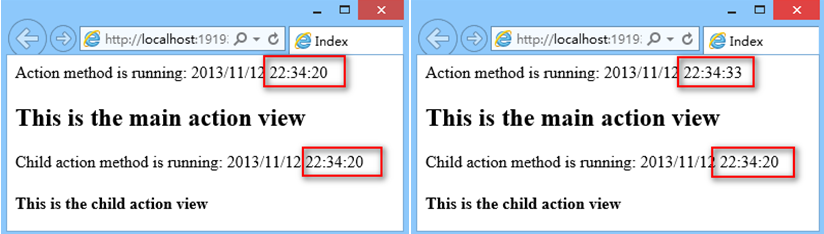

## 身份验证和授权

为指定Login动作以及要使用的视图，在web.config文件中，将loginUrl设为Account控制器的Login 方法

```xml
<authentication mode="Forms">
  <forms loginUrl="~/Account/Login" timeout="2880" />
</authentication>
```

Authorize特性指示是否拥有权

### 数据验证

1. 创建自定义验证

  ```C#
  public class FirstNameValidation:ValidationAttribute
  {
      protected override ValidationResult IsValid(object value, ValidationContext validationContext)
      {
          if (value == null) // Checking for Empty Value
          {
              return new ValidationResult("Please Provide First Name");
          }
          else
          {
              if (value.ToString().Contains("@"))
              {
                  return new ValidationResult("First Name should Not contain @");
              }
          }
          return ValidationResult.Success;
      }
  }
  ```

  Note: Creating multiple classes inside single file is never consider as good practice. So in your sample I recommend you to create a new folder called "Validations" in root location and create a new class inside it.

2. 绑定到模型字段上

  ```C#
  [FirstNameValidation]
  public string FirstName { get; set; }
  ```

**有关错误验证的保留值**

```C#
public class CreateEmployeeViewModel
{
    public string FirstName { get; set; }
    public string LastName { get; set; }
    public string Salary { get; set; }
}

public ActionResult SaveEmployee(Employee e, string BtnSubmit)
{
    switch (BtnSubmit)
    {
        case "Save Employee":
            if (ModelState.IsValid)
            {
                EmployeeBusinessLayer empBal = new EmployeeBusinessLayer();
                empBal.SaveEmployee(e);
                return RedirectToAction("Index");
            }
            else
            {
                CreateEmployeeViewModel vm = new CreateEmployeeViewModel();
                vm.FirstName = e.FirstName;
                vm.LastName = e.LastName;
                if (e.Salary.HasValue)
                {
                    vm.Salary = e.Salary.ToString();                        
                }
                else
                {
                    vm.Salary = ModelState["Salary"].Value.AttemptedValue;                       
                }
                return View("CreateEmployee", vm); 
            }
        case "Cancel":
            return RedirectToAction("Index");
    }
    return new EmptyResult();
}
```

视图中取值：

```html
@using WebApplication1.ViewModels
@model CreateEmployeeViewModel

<input type="text" id="TxtFName" name="FirstName" value="@Model.FirstName" />
<input type="text" id="TxtLName" name="LastName" value="@Model.LastName" />
<input type="text" id="TxtSalary" name="Salary" value="@Model.Salary" />
```

1. 是否是真的将值保留？

   不是，是从post数据中重新获取的。

2. 为什么需要在初始化请求时，在Add New 方法中传递 new CreateEmployeeViewModel()？

   因为在View中，试着将Model中的数据重新显示在文本框中。如：

   ```html
   <input id="TxtSalary" name="Salary" type="text" value="@Model.Salary" />
   ```

   如上所示，正在访问当前Model的"First Name"属性，如果Model 为空，会抛出类无法实例化的异常"Object reference not set to an instance of the class"。

3. 上述的这些功能，有什么方法可以自动生成？

   使用HTML帮助类就可以实现。

### 模块化开发

***AraeRegistration***

简单的解释，AreaRegistration是用来在ASP.NET MVC里面注册多个区域的方式；就是可以将一个大型的MVC站点划分成多个Area区域，然后各自的Area有着自己的Controller、Action、View等元素；

但是一般情况我们并不会那么做，因为将站点的所有UI层中的元素切开放会给维护工作带来很大的工作量，而且我们约定俗成的是UI层的东西放在一个主的WebApplication中，然后是业务功能的划分，但是大型站点也许需要这么做；

AreaRegistration对象结构（典型的模板方法模式）

### 捆绑(Bundle)

MVC 4 提供的一个新特性：捆绑（Bundle），一个在  View 和 Layout 中用于组织优化浏览器请求的 CSS 和 JavaScript 文件的技术。

_references.js 文件的作用是通过下面方式放入该文件中的JS文件可以被VS智能感知：

```js
/// <reference path="jquery-1.8.2.js" />
/// <reference path="jquery-ui-1.8.24.js" />
```

以前我们引入脚本和样式文件的时候，都是一个个的引用，看起来一大坨，不小心还会弄错先后次序，管理很是不便。而且很多脚本库有普通和 min 两个版本，开发的时候我们引入普通版本以方便调试，发布的时候又换成min版本以减少网络带宽，很是麻烦。

为此，MVC 4 增加了一个新功能：“捆绑”，它的作用是把一类脚本或样式文件捆绑在一起，在需要用的时候调用一句代码就行，极大地方便了脚本和样式文件的管理；而且可以把脚本的普通和 min 两个版本都捆绑起来，MVC也会根据是否为Debug模式智能地选择脚本文件的版本。下面我们来看看这个捆绑功能的使用。

调用：

```C#
@Styles.Render("~/Content/css")
@Scripts.Render("~/bundles/clientfeaturesscripts")
```

这里通过 `@Scripts.Render` 和 `@Styles.Render` 两个Helper方法添加捆绑。

捆绑除了可以方便地管理脚本和样式文件，还可以给网络减少带宽（减少请求，压缩文件）。

`Install-Package Microsoft.AspNet.Web.Optimization`

## 总结

1. 可以传递ViewData，接收时获取ViewBag吗？

   答案是肯定的，反之亦然。如之前所说的，ViewBag只是ViewData的一块语法糖。

2. ViewData与ViewBag的问题

   ViewData和ViewBag 是Contoller与View之间传递值的一个好选择。但是在实际使用的过程中，它们并不是最佳选择，接下来我们来看看使用它们的缺点：
  
   - 性能问题：ViewData中的值都是object类型，使用之前必须强制转换为合适的类型。会添加额外的性能负担。
   - 没有类型安全就没有编译时错误：如果尝试将其转换为错误的类型，运行时会报错。良好的编程经验告诉我们，错误必须在编译时捕获。
   - 数据发送和数据接收之间没有正确的连接；MVC中，Controller和View是松散连接的。Controller无法捕获View变化，View也无法捕获到Controller内部发生的变化。从Controller传递一个ViewData或ViewBag的值，当开发人员正在View中写入，就必须记录从Controller中将获得什么值。如果Controller与View由不同的开发人员开发，开发工作会变得非常困难，会导致许多运行时问题，降低了开发效率。

3. 为什么可以将保存和取消按钮设置为同名？

   在日常使用中，点击提交按钮之后，请求会被发送到服务器端，所有输入控件的值都将被发送。提交按钮也是输入按钮的一种。因此提交按钮的值也会被发送。

   当保存按钮被点击时，保存按钮的值也会随着请求被发送到服务器端；当点击取消按钮时，取消按钮的值也会随着请求发送。

   在Action 方法中，Model Binder 将维护这些工作，会根据接收到的值更新参数值。

4. 为什么在实现重置功能时，不使用 input type=reset ？

   因为输入类型type=reset 不会清空控件的值，只会将控件设置回默认值。如：

   ```html
   <input type="text" name="FName" value="Sukesh">
   ```

   在该实例中控件值为：Sukesh，如果使用type=reset来实现重置功能，当重置按钮被点击时，textbox的值会被设置为"Sukesh"。

5. 如果控件名称与类属性名称不匹配会发生什么情况？

   默认的model binder不会工作。在这种情况下，我们有如下3种解决方法：

   - 在action方法中，用Request.Form接收post提交过来的数据并构造Model类
   - 使用对应的参数名，并构造Model类
   - 创建自定义model binder替换默认的

     首先创建自定义的model binder

     ```C#
     public class MyEmployeeModelBinder : DefaultModelBinder
     {
          protected override object CreateModel(ControllerContext controllerContext, ModelBindingContext bindingContext, Type modelType)
          {
              Employee e = new Employee();
              e.FirstName = controllerContext.RequestContext.HttpContext.Request.Form["FName"];
              e.LastName = controllerContext.RequestContext.HttpContext.Request.Form["LName"];
              e.Salary = int.Parse(controllerContext.RequestContext.HttpContext.Request.Form["Salary"]);
              return e;
          }
     }
     ```

     替换默认的model binder

     ```C#
      public ActionResult SaveEmployee([ModelBinder(typeof(MyEmployeeModelBinder))]Employee e, string BtnSubmit)
      {
      ......
      }
      ```

6. 怎么添加服务器端验证

   Model Binder使用 post数据更新 Employee对象，但是不仅仅如此。Model Binder也会更新Model State。Model State封装了 Model状态。

   ModelState包含属性IsValid，该属性表示 Model 是否成功更新。如果任何服务器端验证失败，Model将不更新。

   ModelState保存验证错误的详情。如：`ModelState["FirstName"]`，表示将包含所有与FirstName相关的错误。

   保存接收的值（Post数据或queryString数据）

   在`Asp.net MVC`中，将使用 DataAnnotations来执行服务器端的验证。在我们了解Data Annotation之前先来了解一些Model Binder知识：

   1. 使用元数据类型时，Model Binder 是如何工作的？

      当Action方法包含元类型参数，Model Binder会比较参数名和传入数据(Post和QueryString)的key。当匹配成功时，响应接收的数据会被分配给参数；匹配不成功时，参数会设置为缺省值，例如，如果是字符串类型则被设置为null，如果是整型则设置为0。由于数据类型异常而未匹配的话，会抛出异常。

   2. 当参数是类时，Model Binder 是如何工作的？

      当参数为类，Model Binder将通过检索所有类所有的属性，将接收的数据与类属性名称比较。

      当匹配成功时：

      如果接收的值是空：会将空值分配给属性，如果无法执行空值分配，会设置缺省值，ModelState.IsValid将设置为false。如果null值可以但是被属性验证认为是无效的那么还是会分配null，ModelState.IsValid将设置为fasle。

      如果接收的值不是空：数据类型错误和服务端验证失败的情形下，会分配null值，并将ModelState.IsValid设置为fasle。如果null值不行，会分配默认值。

      如果匹配不成功，参数会被设置为缺省值。在这种情况下，ModelState.IsValid是unaffected。

   - @Html.ValidationMessage是什么意思？

     @符号表示是Razor代码；Html是HtmlHelper类的实例；ValidationMessage是HtmlHelper类的函数，用来表示错误信息。

   - ValidationMessage 函数是如何工作的？

     ValidationMessage 是运行时执行的函数。如之前讨论的，ModelBinder更新ModelState。ValidationMessage根据Key显示ModelState表示的错误信息。

     例如：ValidationMessage("FirstName")显示关联FirstName的错误信息

   - 我们有更多的类似 required 和 StringLength的属性吗？

     当然有。

     - DataType – 确保数据是某些特殊的类型，例如：email, credit card number, URL等。
     - EnumDataTypeAttribute – 确定数据在枚举类型中
     - Range Attribute – 数据满足一定的范围
     - Regular expression- 数据满足正则表达式
     - Required – 确定数据是必须的
     - StringthLength – 确定字符串满足的长度

   - 我们能强制Model Binder执行吗？

     可以。删除action方法的全部参数（阻止默认的model binder执行，参数可以从Request获取），示例：

     ```C#
     Employee e = new Employee();
     UpdateModel<employee>(e);
     ```

     Note: UpdateModel只能更新对象（引用类型），原类型不适用

   - UpdateModel 和 TryUpdateModel 方法之间的区别是什么？

     TryUpdateModel 与 UpdateModel 几乎是相同的，有点略微差别。如果Model调整失败，UpdateModel会抛出异常。UpdateModel的 ModelState.IsValid 属性就没有任何用处。TryUpdateModel如果更新失败，ModelState.IsValid会设置为False值。

   - 客户端验证是什么？

     客户端验证是手动执行的（通过JS代码），除非使用HTML帮助类。

7. 使用EF代码优先时，如果数据库已存在时，遇到的问题

   ```sh
   Note: 你可能碰到以下错误：
   "The model backing the 'SalesERPDAL' context has changed since the database was created. Consider using Code First Migrations to update the database."
   ```

   怎么解决：在Global.asax 的Application_Start方法中加入：

   ```C#
   Database.SetInitializer(new DropCreateDatabaseIfModelChanges<SalesERPDAL>());
   ```

   如果还是报相同的错误，打开数据库，删除"__MigrationHistory"表

添加客户端验证
	首先了解，需要验证什么？
1. FirstName 不能为空
2. LastName字符长度不能大于5
3. Salary不能为空，且应该为数字类型
4. FirstName 不能包含@字符
	接下来，实现客户端验证功能
1. 创建JavaScript 验证文件
在Script文件下，新建JavaScript文件，命名为"Validations.js"

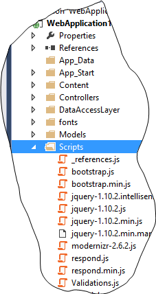


2. 创建验证函数
function IsFirstNameEmpty() {
    if (document.getElementById('TxtFName').value == "") {
        return 'First Name should not be empty';
    }
    else { return ""; }
}
function IsFirstNameInValid() {    
    if (document.getElementById('TxtFName').value.indexOf("@") != -1) {
        return 'First Name should not contain @';
    }
    else { return ""; }
}
function IsLastNameInValid() {
    if (document.getElementById('TxtLName').value.length>=5) {
        return 'Last Name should not contain more than 5 character';
    }
    else { return ""; }
}
function IsSalaryEmpty() {
    if (document.getElementById('TxtSalary').value=="") {
        return 'Salary should not be empty';
    }
    else { return ""; }
}
function IsSalaryInValid() {
    if (isNaN(document.getElementById('TxtSalary').value)) {
        return 'Enter valid salary';
    }
    else { return ""; }
}
function IsValid() {
    var FirstNameEmptyMessage = IsFirstNameEmpty();
    var FirstNameInValidMessage = IsFirstNameInValid();
    var LastNameInValidMessage = IsLastNameInValid();
    var SalaryEmptyMessage = IsSalaryEmpty();
    var SalaryInvalidMessage = IsSalaryInValid();

    var FinalErrorMessage = "Errors:";
    if (FirstNameEmptyMessage != "")
        FinalErrorMessage += "\n" + FirstNameEmptyMessage;
    if (FirstNameInValidMessage != "")
        FinalErrorMessage += "\n" + FirstNameInValidMessage;
    if (LastNameInValidMessage != "")
        FinalErrorMessage += "\n" + LastNameInValidMessage;
    if (SalaryEmptyMessage != "")
        FinalErrorMessage += "\n" + SalaryEmptyMessage;
    if (SalaryInvalidMessage != "")
        FinalErrorMessage += "\n" + SalaryInvalidMessage;

    if (FinalErrorMessage != "Errors:") {
        alert(FinalErrorMessage);
        return false;
    }
    else {
        return true;
    }
}
3. 在 "CreateEmployee" View 中添加 Validations.js文件引用：
<script src="~/Scripts/Validations.js"></script>
4. 在点击 SaveEmployee按钮时，调用验证函数，如下：
<input type="submit" name="BtnSubmit" value="Save Employee" onclick="return IsValid();" />
5. 运行测试

Talk
1.	为什么在点击 "SaveEmployee" 按钮时，需要返回关键字？
如之前实验讨论的，当点击提交按钮时，是给服务器发送请求，客户端验证失败对服务器请求没有意义。通过在提交按钮的onclick事件中添加 "return false" 代码，可以取消默认的服务器请求。此时IsValid函数将返回false，表示验证失败来实现预期的功能。
2.	除了提示用户，是否可以在当前页面显示错误信息？
可以，只需要为每个错误创建span 标签，默认设置为不可见，当提交按钮点击时，如果验证失败，使用JavaScript修改错误的可见性。
3.	自动获取客户端验证还有什么方法？
是，当使用Html 帮助类，可根据服务端验证来获取自动客户端验证，在以后会详细讨论。
4.	服务器端验证必须使用吗？
当某些人禁用JavaScript脚本时，服务器端验证能确保任何数据有效。
实验18: 在View中显示UserName
在本实验中，我们会在View中显示已登录的用户名
1. 在ViewModel中添加 UserName
打开 EmployeeListViewModel，添加属性：UserName。
public class EmployeeListViewModel
{
    public List<EmployeeViewModel><employeeviewmodel> Employees { get; set; }
    public string UserName { get; set; }
}
2. 给 ViewModel UserName 设置值
修改 EmployeeController，修改 Index 方法。
public ActionResult Index()
{
    EmployeeListViewModel employeeListViewModel = new EmployeeListViewModel();
    employeeListViewModel.UserName = User.Identity.Name; //New Line
    ......
}
3.  显示 View UserName
Open Index.cshtml view and display UserName as follows.
<body>
  <div style="text-align:right"> Hello, @Model.UserName </div>
  <hr />
  <a href="/Employee/AddNew">Add New</a>
  <div>
      <table border="1"><span style="font-size: 9pt;"> </span>
4. 运行

实验19: 实现注销功能
1. 创建注销链接，打开Index.cshtml 创建 Logout 链接如下：
<body>
    <div style="text-align:right">Hello, @Model.UserName
    <a href="/Authentication/Logout">Logout</a></div>
    <hr />
    <a href="/Employee/AddNew">Add New</a>
    <div>
        <table border="1">
2. 创建Logout Action方法
打开 AuthenticationController添加新的Logout action方法：
public ActionResult Logout()
{
    FormsAuthentication.SignOut();
    return RedirectToAction("Login");
}
3.  运行

实现登录页面验证
1. 添加 data annotation
打开  UserDetails.cs，添加Data Annotation：
public class UserDetails
{
    [StringLength(7, MinimumLength=2, ErrorMessage = "UserName length should be between 2 and 7")]
    public string UserName { get; set; }
    public string Password { get; set; }
}
2. 在View 中显示错误信息
修改 Login.cshtml能够提示错误信息。
@using (Html.BeginForm("DoLogin", "Authentication", FormMethod.Post))
{
    @Html.LabelFor(c=>c.UserName)
    @Html.TextBoxFor(x=>x.UserName)
    @Html.ValidationMessageFor(x=>x.UserName)
    ......
Note: This time instead of Html.ValidationMessage we have used Html.ValidationMessageFor. Both will do same thing. Html.ValidationMessageFor can be used only when the view is strongly typed view.
3. 修改 DoLogin
修改 DoLogin action 方法：
[HttpPost]
public ActionResult DoLogin(UserDetails u)
{
    if (ModelState.IsValid)
    {
        EmployeeBusinessLayer bal = new EmployeeBusinessLayer();
        if (bal.IsValidUser(u))
        {
            FormsAuthentication.SetAuthCookie(u.UserName, false);
            return RedirectToAction("Index", "Employee");
        }
        else
        {
            ModelState.AddModelError("CredentialError", "Invalid Username or Password");
            return View("Login");
        }
    }
    else
    {
        return View("Login");
    }
}
4.  运行
	Press F5 and execute the application.

登录页面实现客户端验证
在本实验中介绍另一种方法实现客户端验证
1. 下载 jQuery unobtrusive Validation文件
右击项目，选择"Manage Nuget packages"，点击在线查找"jQuery Unobtrusive"，安装"Microsoft jQuery Unobtrusive Valiadtion"

2. 在View中添加 jQuery Validation引用
在Scripts文件中，添加以下 JavaScript文件
jQuery-Someversion.js
jQuery.valiadte.js
jquery.validate.unobtrusive
打开 Login.cshtml，在文件顶部包含这三个js文件：
<script src="~/Scripts/jquery-1.8.0.js"></script>
<script src="~/Scripts/jquery.validate.js"></script>
<script src="~/Scripts/jquery.validate.unobtrusive.js"></script>
3. 运行

Talk
1. 客户端验证是如何实现的？
如上所述，客户端验证并不是很麻烦，在Login View中，HTML元素能够使用帮助类来生成，Helper 函数能够根据Data Annotation属性的使用生成带有属性的HTML标记元素。例如：
@Html.TextBoxFor(x=>x.UserName)
@Html.ValidationMessageFor(x=>x.UserName)
根据以上代码生成的HTML 代码如下：
<input data-val="true" data-val-length="UserName length should be between 2 and 7" data-val-length-max="7" data-val-length-min="2" id="UserName" name="UserName" type="text" value="" />
<span class="field-validation-error" data-valmsg-for="UserName" data-valmsg-replace="true"> </span>
jQuery Unobtrusive验证文件会使用这些自定义的HTML 属性，验证会在客户端自动生成。自动进行客户端验证是使用HTML 帮助类的又一大好处。
1.	What is unobtrusive JavaScript means?
	This is what Wikipedia says about it.
Unobtrusive JavaScript is a general approach to the use of JavaScript in web pages. Though the term is not formally defined, its basic principles are generally understood to include:
•	Separation of functionality (the "behaviour layer") from a Web page's structure/content and presentation
•	Best practices to avoid the problems of traditional JavaScript programming (such as browser inconsistencies and lack of scalability)
•	Progressive enhancement to support user agents that may not support advanced JavaScript functionality
	Let me define it in layman terms.
	"Write your JavaScript in such way that, JavaScript won't be tightly connected to HTML. JavaScript may access DOM elements, JavaScript may manipulate DOM elements but won't directly connected to it."
	In the above example, jQuery Unobtrusive JavaScript simply used some input element attributes and implemented client side validation.
2.	是否可以使用不带HTML帮助类的JavaScript验证？
是，可手动添加属性。
3.	What is more preferred, Html helper functions or pure HTML?
I personally prefer pure HTML because Html helper functions once again take "full control over HTML" away from us and we already discussed the problems with that.
Secondly let's talk about a project where instead of jQuery some other JavaScript frameworks/librariesare used. Some other framework like angular. In that case mostly we think about angular validation and in that case these custom HTML validation attributes will go invain.
实验22: 添加页脚
在本实验中，我们会在Employee 页面添加页脚，通过本实验理解分部视图。什么是"分部视图"？
从逻辑上看，分部视图是一种可重用的视图，不会直接显示，包含于其他视图中，作为其视图的一部分来显示。用法与用户控件类似，但不需要编写后台代码。
1. 创建分部视图的 ViewModel
右击 ViewModel 文件夹，新建 FooterViewModel 类，如下：
public class FooterViewModel
{
   public string CompanyName { get; set; }
   public string Year { get; set; }
}
2. 创建分部视图
右击 "~/Views/Shared" 文件夹，选择添加->视图。
输入View名称"Footer"，选择复选框"Create as a partial view"，点击添加按钮。
注意：View中的Shared共享文件夹是每个控制器都可用的文件夹，不是某个特定的控制器所属。
3. 在分部View中显示数据
打开Footer.cshtml，输入以下HTML代码。
@using WebApplication1.ViewModels
@model FooterViewModel
<div style="text-align:right;background-color: silver;color: darkcyan;border: 1px solid gray;margin-top:2px;padding-right:10px;">
   @Model.CompanyName &copy; @Model.Year
</div>
4.  在Main ViewModel中包含Footer数据
打开 EmployeeListViewModel 类，添加新属性，保存 Footer数据，如下：
public class EmployeeListViewModel
{
    public List<EmployeeViewModel> Employees { get; set; }
    public string UserName { get; set; }
    public FooterViewModel FooterData { get; set; }//New Property
}
在本实验中Footer会作为Index View的一部分显示，因此需要将Footer的数据传到Index View页面中。Index View 是EmployeeListViewModel的强类型View，因此Footer需要的所有数据都应该封装在EmployeeListViewModel中。
5. 设置Footer数据
打开 EmployeeController，在Index action方法中设置FooterData属性值，如下：
public ActionResult Index()
{
    ...
    ...
    employeeListViewModel.FooterData = new FooterViewModel();
    employeeListViewModel.FooterData.CompanyName = "StepByStepSchools";//Can be set to dynamic value
    employeeListViewModel.FooterData.Year = DateTime.Now.Year.ToString();
    return View("Index", employeeListViewModel);
} 
6. 显示Footer
打开Index.cshtml文件，在Table标签后显示Footer分部View，如下：
       </table>
        @{
            Html.RenderPartial("Footer", Model.FooterData);
        }
    </div>
</body>
</html>
7. 运行，打开Index View
Talk on lab 22
1.	Html.Partial的作用是什么？与Html.RenderPartial区别是什么？
与Html.RenderPartial作用相同，Html.Partial会在View中用来显示分部View。
This is the syntax
@Html.Partial("Footer", Model.FooterData);
Syntax is much simpler than earlier one.
Html.RenderPartial会将分部View的结果直接写入HTTP响应流中，而 Html.Partial会返回 MvcHtmlString值。
2.	什么是MvcHtmlString，为什么 Html.Partial返回的是MvcHtmlString 而不是String？
根据MSDN规定，"MvcHtmlString"代表了一个不应该再被二次编码的HTML编码的字符串。举个例子：
@{
   string MyString = "My Simple String";
}
@MyString
以上代码会转换为：<b>My Simple String</b>
Razor显示了全部的内容，许多人会认为已经看到加粗的字符串，是Razor Html在显示内容之前将内容编码，这就是为什么使用纯内容来代替粗体。
当不使用razor编码时，使用 MvcHtmlString，MvcHtmlString是razor的一种表示，即“字符串已经编码完毕，不需要其他编码”。如：
@{
   string MyString = "My Simple String";
}
@MvcHtmlString.Create(MyString)
输出：My Simple String
Why does Html.Partial return MvcHtmlString instead of string?
We already understood a fact that "razor will always encode strings but it never encodes MvcHtmlString". It doesn't make sense if Partial View contents are considered as pure string gets displayed as it is. We want it to be considered as a HTML content and for that we have to stop razor from encoding thus Partial method is designed to return MvcHtmlString.
3.	What is recommended Html.RenderPartial or Html.Partial?
Html.RenderPartial is recommended because it is faster.
4.	When Html.Partial will be preferred?
It is recommended when we want to change the result returned by Partial View before displaying.
Open Index.cshtml and open Footer code to below code and test.
@{
    MvcHtmlString result = Html.Partial ("Footer", Model.FooterData);
    string finalResult = result.ToHtmlString().Replace("2015", "20000");            
}
@MvcHtmlString.Create(finalResult)
Now footer will look like below.
 
5.	Why Partial View is placed inside Shared Folder?
Partial Views are meant for reusability hence the best place for them is Shared folder.
6.	Can't we place Partial Views inside a specific controller folder, like Employee or Authentication?
We can do that but in that case it won't be available to only specific controller.
Example: When we keep Partial View inside Employee folder it won't be available for AuthenticationController or to Views related to AuthenticationController.
7.	Why definition of Partial View contains word "Logically" ?
In definition we have said that Partial View is a reusable view but it won't get executed by its own. It has to be placed in some other view and then displayed as a part of the view.
What we said about reusability is completely true but what we said about execution is only true logically. Technically it's not a correct statement. We can create an action method which will return a ViewResult as bellow.
public ActionResult MyFooter()
{
    FooterViewModel FooterData = new FooterViewModel();
    FooterData.CompanyName = "StepByStepSchools";//Can be set to dynamic value
    FooterData.Year = DateTime.Now.Year.ToString();
    return View("Footer", FooterData);
}
It will display following output
 
Although logically it doesn't make sense, technically it's possible. Footer.cshtml won't contain properly structured HTML. It meant to be displayed as a part of some other view. Hence I said "Logically it doesn't make sense".
8.	Why Partial View is created instead of putting footer contents directly in the view ?
Two advantages
1.	Reusability – we can reuse the same Partial View in some other View.
2.	Code Maintenance – Putting it in a separate file makes it easy to manage and manipulate.
9.	Why Header is not created as Partial View?
As a best practice we must create Partial View for header also but to keep Initial labs simpler we had kept it inline.

实验23: 实现用户角色管理
在实验23中我们将实现管理员和非管理员登录的功能。需求很简单：非管理员用户没有创建新Employee的权限。实验23会帮助大家理解MVC提供的Session 和Action过滤器。
因此我们将实验23分为两部分：
第一部分：非管理员用户登录时，隐藏 Add New 链接
创建标识用户身份的枚举类型
右击Model 文件夹，选择添加新项目。选择"Code File"选项。
输入"UserStatus"名，点击添加。"Code File"选项会创建一个".cs"文件．创建UserStatus枚举类型，如下：
namespace WebApplication1.Models
{
    public enum UserStatus
    {
        AuthenticatedAdmin,
        AuthentucatedUser,
        NonAuthenticatedUser
    }
}
修改业务层功能
删除IsValidUser函数，创建新函数"GetUserValidity"，如下：
public UserStatus GetUserValidity(UserDetails u)
{
    if (u.UserName == "Admin" && u.Password == "Admin")
    {
        return UserStatus.AuthenticatedAdmin;
    }
    else if (u.UserName == "Sukesh" && u.Password == "Sukesh")
    {
        return UserStatus.AuthentucatedUser;
    }
    else
    {
        return UserStatus.NonAuthenticatedUser;
    }
}
修改DoLogin action方法
打开 AuthenticationController，修改DoLogin action:
[HttpPost]
public ActionResult DoLogin(UserDetails u)
{
    if (ModelState.IsValid)
    {
        EmployeeBusinessLayer bal = new EmployeeBusinessLayer();
        //New Code Start
        UserStatus status = bal.GetUserValidity(u);
        bool IsAdmin = false;
        if (status==UserStatus.AuthenticatedAdmin)
        {
            IsAdmin = true;
        }
        else if (status == UserStatus.AuthentucatedUser)
        {
            IsAdmin = false;
        }
        else
        {
            ModelState.AddModelError("CredentialError", "Invalid Username or Password");
            return View("Login");
        }
        FormsAuthentication.SetAuthCookie(u.UserName, false);
        Session["IsAdmin"] = IsAdmin;
        return RedirectToAction("Index", "Employee");
        //New Code End
    }
    else
    {
        return View("Login");
    }
}
在上述代码中，已经出现Session 变量来识别用户身份。
什么是Session？
Session是Asp.Net的特性之一，可以在MVC中重用，可用于暂存用户相关数据，session变量周期是穿插于整个用户生命周期的。
移除存在的 AddNew 链接
打开"~/Views/Employee"文件夹下 Index.cshtml View，移除"Add New"超链接。
<!-- Remove following line from Index.cshtml -->
<a href="/Employee/AddNew">Add New</a>
创建分部View
右击"~/Views/Employee"文件夹，选择添加View，设置View名称"AddNewLink"，选中"Create a partial View"复选框。

输入分部View的内容
在新创建的分部视图中输入以下内容：
<a href="/Employee/AddNew">Add New</a>
新建 Action 方法
打开 EmployeeController，新建Action方法"GetAddNewLink"，如下：
public ActionResult GetAddNewLink()
{
    if (Convert.ToBoolean(Session["IsAdmin"]))
    {
        return Partial View("AddNewLink");
    }
    else
    {
        return new EmptyResult();
    }
}
显示  AddNew 链接
打开 Index.html，输入以下代码：
<a href="/Authentication/Logout">Logout</a>
</div>
<hr />
@{
  Html.RenderAction("GetAddNewLink");
}
<div>
<table border="1">
<tr>
Html.RenderAction 执行Action 方法，并将结果直接写入响应流中。
运行

第二部分： 直接URL 安全
以上实验实现了非管理员用户无法导航到AddNew链接。这样还不够，如果非管理员用户直接输入AddNew URL，则会直接跳转到此页面。

非管理员用户还是可以直接访问AddNew方法，为了解决这个问题，我们会引入MVC action 过滤器。Action 过滤器使得在action方法中添加一些预处理和后处理的逻辑判断问题。在整个实验中，会注重ActionFilters预处理的支持和后处理的功能。
安装过滤器
新建文件夹Filters，新建类"AdminFilter"。

创建过滤器
通过继承 ActionFilterAttribute，将 AdminFilter类升级为"ActionFilter"，如下：
public class AdminFilter:ActionFilterAttribute
{

}
注意：使用"ActionFilterAttribute"需要在文件顶部输入"System.Web.Mvc"。
添加安全验证逻辑
在ActionFliter中重写 OnActionExecuting方法：
public override void OnActionExecuting(ActionExecutingContext filterContext)
{
    if (!Convert.ToBoolean(filterContext.HttpContext.Session["IsAdmin"]))
    {
        filterContext.Result = new ContentResult()
        {
            Content="Unauthorized to access specified resource."
        };
    }
}
绑定过滤器
在AddNew和 SaveEmployee方法中绑定过滤器，如下：
[AdminFilter]
public ActionResult AddNew()
{
    return View("CreateEmployee",new Employee());
}
...
...
[AdminFilter]
public ActionResult SaveEmployee(Employee e, string BtnSubmit)
{
    switch (BtnSubmit)
    {
        case "Save Employee":
            if (ModelState.IsValid)
            {
                EmployeeBusinessLayer empBal = new EmployeeBusinessLayer();
	....
	....
运行

Note: Whatever strategy and logic we have used in this lab for implementing Role based security may not be the best solution. You may have some better logic to implement such behaviour. It’s just one of the way to achieve it.
Talk on Lab 23
1.	可以通过浏览器直接调用GetAddNewLink方法吗？
可以直接调用，也可以禁止直接运行"GetAddNewLink"。
For that decorate GetAddNewLink with ChildActionOnly attribute.
[ChildActionOnly]
public ActionResult GetAddNewLink()
{
    if (Convert.ToBoolean(Session["IsAdmin"]))
    {
2.	Html.Action有什么作用？
与Html.RenderAction作用相同，Html.Action会执行action 方法，并在View中显示结果。语法：
@Html.Action("GetAddNewLink");
Syntax is much simpler than earlier one.
3.	Html.RenderAction 和 Html.Action两者之间有什么不同？更推荐使用哪种方法？
Html.RenderAction会将Action 方法的执行结果直接写入HTTP 响应请求流中，而 Html.Action会返回MVCHTMLString。更推荐使用Html.RenderAction，因为它更快。当我们想在显示前修改action执行的结果时，推荐使用Html.Action。
4.	什么是 ActionFilter?
与AuthorizationFilter类似，ActionFilter是ASP.NET MVC过滤器中的一种，允许在action 方法中添加预处理和后处理逻辑。
实验24: Assignment Lab – Handle CSRF attack
From safety point of view we must also handle CSRF attacks to the project. This one I will leave to you guys.
I recommend you to read this article and implement same to our SaveEmployee action method.
http://www.codeproject.com/Articles/994759/What-is-CSRF-attack-and-how-can-we-prevent-the-sam
实验25: 实现项目外观的一致性
在ASP.NET能够保证外观一致性的是母版页的使用。MVC却不同于ASP.NET，在RAZOR中，母版页称为布局页面。
在开始实验之前，首先来了解布局页面
1. 带有欢迎消息的页眉
2. 带有数据的页脚
最大的问题是什么？
带有数据的页脚和页眉作为ViewModel的一部分传从Controller传给View。
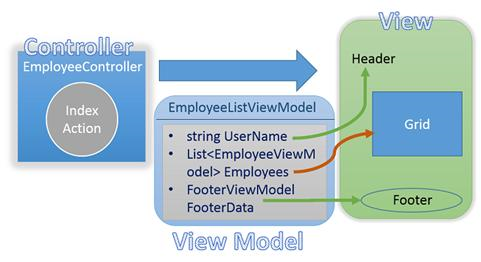


现在最大的问题是在页眉和页脚移动到布局页面后，如何将数据从View传给Layout页面。
解决方案——继承
可使用继承原则，通过实验来深入理解。
1. 创建ViewModel基类
在ViewModel 文件夹下新建ViewModel 类 "BaseViewModel"，如下：
public class BaseViewModel
{
    public string UserName { get; set; }
    public FooterViewModel FooterData { get; set; }//New Property
} 
BaseViewModel封装了布局页所需要的所有值。
2. 准备 EmployeeListViewModel
删除EmployeeListViewModel类的 UserName和 FooterData属性，并继承 BaseViewModel：
public class EmployeeListViewModel:BaseViewModel
{
    public List<EmployeeViewModel> Employees { get; set; }
}
3.  创建布局页面
右击shared文件夹，选择添加>>MVC5 Layout Page。输入名称"MyLayout"，点击确认
<!DOCTYPE html>
<html>
<head>
    <meta name="viewport" content="width=device-width" />
    <title>@ViewBag.Title</title>
</head>
<body>
    <div>
        @RenderBody()
    </div>
</body>
</html>
4. 将布局转换为强类型布局
@using WebApplication1.ViewModels
@model BaseViewModel
5. 设计布局页面
在布局页面添加页眉，页脚和内容三部分，如下：
<html>
<head>
    <meta name="viewport" content="width=device-width" />
    <title>@RenderSection("TitleSection")</title>
    @RenderSection("HeaderSection",false)
</head>
<body>
    <div style="text-align:right">
        Hello, @Model.UserName
        <a href="/Authentication/Logout">Logout</a>
    </div>
    <hr />
    <div>
    @RenderSection("ContentBody")
    </div>
    @Html.Partial("Footer",Model.FooterData)
</body>
</html>
如上所示，布局页面包含三部分，TitleSection，HeaderSection 和 ContentBody，内容页面将使用这些部分来定义合适的内容。
Note: While defining HeaderSection second parameter is passed. This parameter decides whether it's the optional section or compulsory section. False indicates it's an optional section.
6. 在 Index View中绑定布局页面
打开Index.cshtml,在文件顶部会发现以下代码：
@{
    Layout = null;
}
修改：
@{
    Layout = "~/Views/Shared/MyLayout.cshtml";
}
7.设计Index View
•	从Index View中去除页眉和页脚
•	在Body标签中复制保留的内容，并存放在某个地方。
•	复制Title标签中的内容
•	移除View中所有的HTML 内容，确保只删除了HTML，@model 和layout语句不要动
•	用刚才复制的内容定义TitleSection和 Contentbody
完整的View代码如下：
@using WebApplication1.ViewModels
@model EmployeeListViewModel
@{
    Layout = "~/Views/Shared/MyLayout.cshtml";
}

@section TitleSection{
    MyView
}
@section ContentBody{       
    <div>        
        @{
            Html.RenderAction("GetAddNewLink");
        }
        <table border="1">
            <tr>
                <th>Employee Name</th>
                <th>Salary</th>
            </tr>
            @foreach (EmployeeViewModel item in Model.Employees)
            {
                <tr>
                    <td>@item.EmployeeName</td>
                    <td style="background-color:@item.SalaryColor">@item.Salary</td>
                </tr>
            }
        </table>
    </div>
}
8. 运行

9. 在 CreateEmployee 中绑定布局页面
打开 Index.cshtml，修改顶部代码：
@{
    Layout = "~/Views/Shared/MyLayout.cshtml";
}
10. 设计 CreateEmployee View
与第7步中的程序类似，定义 CreateEmployee View中的Section，在本次定义中只添加一项，如下：
@using WebApplication1.Models
@model Employee
@{
    Layout = "~/Views/Shared/MyLayout.cshtml";
}

@section TitleSection{
    CreateEmployee
}

@section HeaderSection{
<script src="~/Scripts/Validations.js"></script>
<script>
    function ResetForm() {
        document.getElementById('TxtFName').value = "";
        document.getElementById('TxtLName').value = "";
        document.getElementById('TxtSalary').value = "";
    }
</script>
}
@section ContentBody{ 
    <div>
        <form action="/Employee/SaveEmployee" method="post" id="EmployeeForm">
            <table>
            <tr>
                <td>
                    First Name:
                </td>
                <td>
                    <input type="text" id="TxtFName" name="FirstName" value="@Model.FirstName" />
                </td>
            </tr>
            <tr>
                <td colspan="2" align="right">
                    @Html.ValidationMessage("FirstName")
                </td>
            </tr>
            <tr>
                <td>
                    Last Name:
                </td>
                <td>
                    <input type="text" id="TxtLName" name="LastName" value="@Model.LastName" />
                </td>
            </tr>
            <tr>
                <td colspan="2" align="right">
                    @Html.ValidationMessage("LastName")
                </td>
            </tr>

            <tr>
                <td>
                    Salary:
                </td>
                <td>
                    <input type="text" id="TxtSalary" name="Salary" value="@Model.Salary" />
                </td>
            </tr>
            <tr>
                <td colspan="2" align="right">
                    @Html.ValidationMessage("Salary")
                </td>
            </tr>

            <tr>
                <td colspan="2">

                    <input type="submit" name="BtnSubmit" value="Save Employee" onclick="return IsValid();" />
                    <input type="submit" name="BtnSubmit" value="Cancel" />
                    <input type="button" name="BtnReset" value="Reset" onclick="ResetForm();" />
                </td>
            </tr>
            </table>
    </div>
}
11. 运行

Index View是EmployeeListViewModel类型的强View类型，是 BaseViewModel的子类，这就是为什么Index View可一直发挥作用。CreateEmployee View 是CreateEmployeeViewModel的强类型，并不是BaseViewModel的子类，因此会出现以上错误。
12. 准备 CreateEmployeeViewModel
使CreateEmployeeViewModel 继承 BaseViewModel，如下：
public class CreateEmployeeViewModel:BaseViewModel
{
...
13. 运行
报错，该错误好像与步骤11中的错误完全不同，出现这些错误的根本原因是未初始化AddNew action方法中的Header和Footer数据。
14. 初始化Header和Footer 数据
修改AddNew方法：
public ActionResult AddNew()
{
    CreateEmployeeViewModel employeeListViewModel = new CreateEmployeeViewModel();
    employeeListViewModel.FooterData = new FooterViewModel();
    employeeListViewModel.FooterData.CompanyName = "StepByStepSchools";//Can be set to dynamic value
    employeeListViewModel.FooterData.Year = DateTime.Now.Year.ToString();
    employeeListViewModel.UserName = User.Identity.Name; //New Line
    return View("CreateEmployee", employeeListViewModel);
}
15. 初始化 SaveEmployee中的Header和 FooterData
public ActionResult SaveEmployee(Employee e, string BtnSubmit)
{
    switch (BtnSubmit)
    {
        case "Save Employee":
            if (ModelState.IsValid)
            {
                ...
            }
            else
            {
                CreateEmployeeViewModel vm = new CreateEmployeeViewModel();
                ...
                vm.FooterData = new FooterViewModel();
                vm.FooterData.CompanyName = "StepByStepSchools";//Can be set to dynamic value
                vm.FooterData.Year = DateTime.Now.Year.ToString();
                vm.UserName = User.Identity.Name; //New Line
                return View("CreateEmployee", vm); // Day 4 Change - Passing e here
            }
        case "Cancel":
            return RedirectToAction("Index");
    }
    return new EmptyResult();
}
16. 运行

Talk on Lab 25
1. RenderBody 有什么作用？
之前创建了Layout 页面，包含一个Razor语句如：
   @Html.RenderBody()
首先我们先来了解RenderBody是用来做什么的？
在内容页面，通常会定义Section(部分)(在Layout(布局)页面声明)。但是奇怪的是，Razor允许在Section外部定义一些内容。所有的非section内容会使用RenderBody函数来渲染，下图能够更好的理解：
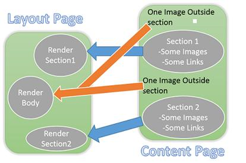

2. 布局是否可嵌套？
可以嵌套，创建Layout页面，可使用其他存在的Layout页面，语法相同。
3. 是否需要为每个View定义Layout页面？
可以在View文件夹下发现一个特殊的文件"__ViewStart.cshtml"，在其内部的设置会应用到所有的View。例如：在__ViewStart.cshtml中输入以下代码，会给所有View 设置 Layout页面。
@{
    Layout = "~/Views/Shared/_Layout.cshtml";
}
4. 是否在每个Action 方法中需要加入Header和Footer数据代码？
不需要，可在Action 过滤器的帮助下改进需要重复代码的部分。
5. 是否强制定义所有子View中的Section？
是的，如果Section被声明为必须的(下面示例的第二个参数，默认值为true)。如下
@RenderSection("HeaderSection",false) // Not required
@RenderSection("HeaderSection",true) // required
@RenderSection("HeaderSection") // required
实验26: 使用Action Fliter让Header和Footer数据更有效
在实验23中，我们已经知道了使用 ActionFilter的一个优点，现在来看看使用 ActionFilter的其他好处
1. 删除Action 方法中的冗余代码
删除Index，AddNew，SaveEmployee方法中的Header和Footer数据代码。
需要删除的Header代码会像这样子：
bvm.UserName = HttpContext.Current.User.Identity.Name;
Footer代码会像这样子
bvm.FooterData = new FooterViewModel();
bvm.FooterData.CompanyName = "StepByStepSchools";//Can be set to dynamic value
bvm.FooterData.Year = DateTime.Now.Year.ToString();         
2.创建HeaderFooter过滤器
在Filter文件夹下新建类 "HeaderFooterFilter"，并通过继承ActionFilterAttribute类升级为Action Filter
3. 升级ViewModel
重写 HeaderFooterFilter类的 OnActionExecuted方法，在该方法中获取当前View Model，并绑定Header和Footer数据。
public class HeaderFooterFilter : ActionFilterAttribute
{
    public override void OnActionExecuted(ActionExecutedContext filterContext)
    {
        ViewResult v = filterContext.Result as ViewResult;
        if(v!=null) // v will null when v is not a ViewResult
        {
            BaseViewModel bvm = v.Model as BaseViewModel;
            if(bvm!=null)//bvm will be null when we want a view without Header and footer
            {
                bvm.UserName = HttpContext.Current.User.Identity.Name;
                bvm.FooterData = new FooterViewModel();
                bvm.FooterData.CompanyName = "StepByStepSchools";//Can be set to dynamic value
                bvm.FooterData.Year = DateTime.Now.Year.ToString();            
            }
        }
    }
}
4. 绑定过滤器
在Index中，AddNew，SaveEmployee的action 方法中绑定 HeaderFooterFilter
[HeaderFooterFilter]
public ActionResult Index()
{
    EmployeeListViewModel employeeListViewModel = new EmployeeListViewModel();
    ...
}
...
[AdminFilter]
[HeaderFooterFilter]
public ActionResult AddNew()
{
    CreateEmployeeViewModel employeeListViewModel = new CreateEmployeeViewModel();
    //employeeListViewModel.FooterData = new FooterViewModel();
    //employeeListViewModel.FooterData.CompanyName = "StepByStepSchools";
    ...
}
...
[AdminFilter]
[HeaderFooterFilter]
public ActionResult SaveEmployee(Employee e, string BtnSubmit)
{
    switch (BtnSubmit)
    {
        ...
5. 运行


实验27: 添加批量上传选项
在实验27中，我们将提供一个选项，供用户选择上传Employee记录文件（CSV格式）。
我们会学习以下知识：
1. 如何使用文件上传控件
2. 异步控制器
1. 创建 FileUploadViewModel
在ViewModels文件夹下新建类"FileUploadViewModel"，如下：
public class FileUploadViewModel: BaseViewModel
{
    public HttpPostedFileBase fileUpload {get; set ;}
}
HttpPostedFileBase将通过客户端提供上传文件的访问入口。
2. 创建 BulkUploadController 和Index action 方法
新建 controller "BulkUploadController"，并实现Index Action 方法，如下：
public class BulkUploadController : Controller
{
    [HeaderFooterFilter]
    [AdminFilter]
    public ActionResult Index()
    {
        return View(new FileUploadViewModel());
    } 
}
Index方法与 HeaderFooterFilter 和 AdminFilter属性绑定。HeaderFooterFilter会确保页眉和页脚数据能够正确传递到ViewModel中，AdminFilter限制非管理员用户的访问。
3.创建上传View
创建以上Action方法的View。View名称应为 index.cshtml，且存放在"~/Views/BulkUpload"文件夹下。
4. 设计上传View
在View中输入以下内容：
@using WebApplication1.ViewModels
@model FileUploadViewModel
@{
    Layout = "~/Views/Shared/MyLayout.cshtml";
}

@section TitleSection{
    Bulk Upload
}
@section ContentBody{
    <div> 
    <a href="/Employee/Index">Back</a>
        <form action="/BulkUpload/Upload" method="post" enctype="multipart/form-data">
            Select File : <input type="file" name="fileUpload" value="" />
            <input type="submit" name="name" value="Upload" />
        </form>
    </div>
}
如上，FileUploadViewModel中属性名称与 input[type="file"]的名称类似，都称为"fileUpload"。我们在Model Binder中已经讲述了名称属性的重要性，注意：在表单标签中，有一个额外的属性是加密的，会在实验结尾处讲解。
5. 创建业务层上传方法
在EmployeeBusinessLayer中新建方法UploadEmployees，如下：
public void UploadEmployees(List<Employee> employees)
{
    SalesERPDAL salesDal = new SalesERPDAL();
    salesDal.Employees.AddRange(employees);
    salesDal.SaveChanges();
}
6. 创建Upload Action方法
创建Action方法，并命名为"BulkUploadController"，如下：
[AdminFilter]
public ActionResult Upload(FileUploadViewModel model)
{
    List<Employee> employees = GetEmployees(model);
    EmployeeBusinessLayer bal = new EmployeeBusinessLayer();
    bal.UploadEmployees(employees);
    return RedirectToAction("Index","Employee");
}

private List<Employee> GetEmployees(FileUploadViewModel model)
{
    List<Employee> employees = new List<Employee>();
    StreamReader csvreader = new StreamReader(model.fileUpload.InputStream);
    csvreader.ReadLine(); // Assuming first line is header
    while (!csvreader.EndOfStream)
    {
        var line = csvreader.ReadLine();
        var values = line.Split(',');//Values are comma separated
        Employee e = new Employee();
        e.FirstName = values[0];
        e.LastName = values[1];
        e.Salary = int.Parse(values[2]);
        employees.Add(e);
    }
    return employees;
}
AdminFilter会绑定到Upload action方法中，限制非管理员用户的访问。
7. 创建BulkUpload链接
打开 "Views/Employee"文件夹下的 AddNewLink.cshtml 文件，输入BulkUpload链接，如下：
<a href="/Employee/AddNew">Add New</a>
&nbsp;
&nbsp;
<a href="/BulkUpload/Index">BulkUpload</a>
8.运行

Note:
In above example we have not applied any client side or server side validation in the View. It may leads to following error.
"Validation failed for one or more entities. See 'EntityValidationErrors' property for more details."
To find the exact cause for the error, simply add a watch with following watch expression when exception occurs.
((System.Data.Entity.Validation.DbEntityValidationException)$exception).EntityValidationErrors
The watch expression ‘$exception’ displays any exception thrown in the current context, even if it has not been caught and assigned to a variable.
Talk on Lab 27
1. 为什么在实验27中不需要验证？
在该选项中添加客户端和服务器端验证需要读者自行添加的，以下是添加验证的提示：
•	For Server side validation use Data Annotations.
•	For client side either you can leverage data annotation and implement jQuery unobtrusive validation. Obviously this time you have to set custom data attributes manually because we don’t have readymade Htmlhelper method for file input.
Note: If you didn’t understood this point, I recommend you to go through “implanting client side validation in Login view” again.
•	For client side validation you can write custom JavaScript and invoke it on button click. This won’t be much difficult because file input is an input control at the end of the day and its value can be retrieved inside JavaScript and can be validated.
2. 什么是 HttpPostedFileBase？
HttpPostedFileBase will provide the access to the file uploaded by client. Model binder will update the value of all properties FileUploadViewModel class during post request. Right now we have only one property inside FileUploadViewModel and Model Binder will set it to file uploaded by client.
3. 是否会提供多文件的输入控件？
Yes, we can achieve it in two ways.
1.	Create multiple file input controls. Each control must have unique name. Now in FileUploadViewModel class create a property of type HttpPostedFileBase one for each control. Each property name should match with the name of one control. Remaining magic will be done by ModelBinder.
2.	Create multiple file input controls. Each control must have same name. Now instead of creating multiple properties of type HttpPostedFileBase, create one of type List.
Note: Above case is true for all controls. When you have multiple controls with same name ModelBinder update the property with the value of first control if property is simple parameter. ModelBinder will put values of each control in a list if property is a list property.
4. enctype="multipart/form-data"是用来做什么的？
Well this is not a very important thing to know but definitely good to know.This attribute specifies the encoding type to be used while posting data.The default value for this attribute is "application/x-www-form-urlencoded"
Example – Our login form will send following post request to the server
POST /Authentication/DoLogin HTTP/1.1
Host: localhost:8870
Connection: keep-alive
Content-Length: 44
Content-Type: application/x-www-form-urlencoded
...
...
UserName=Admin&Passsword=Admin&BtnSubmi=Login
All input values are sent as one part in the form of key/value pair connected via “&”.
When enctype="multipart/form-data" attribute is added to form tag, following post request will be sent to the server.
POST /Authentication/DoLogin HTTP/1.1
Host: localhost:8870
Connection: keep-alive
Content-Length: 452
Content-Type: multipart/form-data; boundary=----WebKitFormBoundarywHxplIF8cR8KNjeJ
...
...
------WebKitFormBoundary7hciuLuSNglCR8WC
Content-Disposition: form-data; name="UserName"

Admin
------WebKitFormBoundary7hciuLuSNglCR8WC
Content-Disposition: form-data; name="Password"

Admin
------WebKitFormBoundary7hciuLuSNglCR8WC
Content-Disposition: form-data; name="BtnSubmi"

Login
------WebKitFormBoundary7hciuLuSNglCR8WC--
As you can see, form is posted in multiple part. Each part is separated by a boundary defined by Content-Type and each part contain one value.
encType must be set to “multipart/form-data” if form tag contains file input control.
Note: boundary will be generated randomly every time request is made. You may see some different boundary.
1.	为什么有时候需要设置 encType 为 "multipart/form-data"，而有时候不需要设置？
When encType is set to “multipart/form-data”, it will do both the things–Post the data and upload the file. Then why don’t we always set it as “multipart/form-data”.
Answer is, it will also increase the overall size of the request. More size of the request means less performance. Hence as a best practice we should set it to default that is "application/x-www-form-urlencoded".
2.	为什么在实验27中创建ViewModel？
We had only one control in our View. We can achieve same result by directly adding a parameter of type HttpPostedFileBase with name fileUpload in Upload action method Instead of creating a separate ViewModel. Look at the following code.
public ActionResult Upload(HttpPostedFileBase fileUpload)
{
}
Then why we have created a separate class.
Creating ViewModel is a best practice. Controller should always send data to the view in the form of ViewModel and data sent from view should come to controller as ViewModel.
3.	以上解决方法的问题
Did you ever wondered how you get response when you send a request?
Now don't say, action method receive request and blah blah blah!!! 
Although it's the correct answer I was expecting a little different answer.My question is what happen in the beginning.
A simple programming rule – everything in a program is executed by a thread even a request.
In case of Asp.net on the webserver .net framework maintains a pool of threads.Each time a request is sent to the webserver a free thread from the pool is allocated to serve the request. This thread will be called as worker thread.
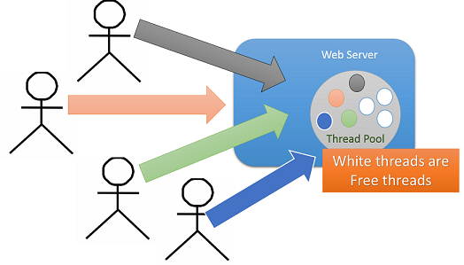

Worker thread will be blocked while the request is being processed and cannot serve another request.
Now let's say an application receives too many requests and each request will take long time to get completely processed. In this case we may end up at a point where new request will get into a state where there will be no worker thread available to serve that request. This is called as Thread Starvation(饥饿).
In our case sample file had 2 employee records but in real time it may contain thousands or may be lacks of records. It means request will take huge amount of time to complete the processing. It may leads to Thread Starvation.
线程饥饿的解决方法：
Now the request which we had discussed so far is of type synchronous request.
Instead of synchronous if client makes an asynchronous request, problem of thread starvation get solved.
•	In case of asynchronous request as usual worker thread from thread pool get allocated to serve the request.
•	Worker thread initiates the asynchronous operation and returned to thread pool to serve another request. Asynchronous operation now will be continued by CLR thread.
•	Now the problem is, CLR thread can’t return response so once it completes the asynchronous operation it notifies ASP.NET.
•	Webserver again gets a worker thread from thread pool and processes the remaining request and renders the response.
In this entire scenario two times worker thread is retrieved from thread pool. Now both of them may be same thread or they may not be.
Now in our example file reading is an I/O bound operation which is not required to be processed by worker thread. So it’s a best place to convert synchronous requests to asynchronous requests.
1.	异步请求的响应时间能提升吗？
不可以，响应时间是相同的，线程会被释放来服务其他请求。
实验28: 解决线程饥饿问题
在Asp.net MVC中会通过将同步Action方法转换为异步Action方法，将同步请求转换为异步请求。
１. 创建异步控制器
在控制器中将基类 UploadController修改为 AsynController。
public class BulkUploadController : AsyncController
{
２. 转换同步Action方法
该功能通过两个关键字就可实现："async"和 "await"
[AdminFilter]
public async Task<ActionResult> Upload(FileUploadViewModel model)
{
    int t1 = Thread.CurrentThread.ManagedThreadId;
    List<Employee> employees = await Task.Factory.StartNew<List<Employee>>(() => GetEmployees(model));
    int t2 = Thread.CurrentThread.ManagedThreadId;
    EmployeeBusinessLayer bal = new EmployeeBusinessLayer();
    bal.UploadEmployees(employees);
    return RedirectToAction("Index", "Employee");
}
在action方法的开始或结束处，使用变量存储线程ID。
理一下思路：
•	当上传按钮被点击时，新请求会被发送到服务器。
•	Webserver从线程池中产生Worker线程 ，并分配给服务器请求。
•	worker线程会使Action 方法执行
•	Worker方法在 Task.Factory.StartNew方法的辅助下，开启异步操作
•	使用async关键字将Action 方法标记为异步方法，由此会保证异步操作一旦开启，Worker 线程就会释放。
•	使用await关键字也可标记异步操作，能够保证异步操作完成时才能够继续执行下面的代码。
•	一旦异步操作在Action 方法中完成执行，必须执行worker线程。因此webserver将会新建一个空闲worker 线程，并用来服务剩下的请求，提供响应。
3. 测试运行	
运行应用程序，并跳转到BulkUpload页面。会在代码中显示断点，输入样本文件，点击上传。
如图所示，在项目启动或关闭时线程ID是不同的。
实验29: 异常处理——显示自定义错误页面
如果一个项目不考虑异常处理，那么可以说这个项目是不完整的。到目前为止，我们已经了解了MVC中的两个过滤器：Action filter和 Authorization filter。现在我们来学习第三个过滤器，异常过滤器（Exception Filters）。
什么是异常过滤器（Exception Filters）？
异常过滤器与其他过滤器的用法相同，可当作属性使用。使用异常过滤器的基本步骤:
1. 使它们可用
2. 将过滤器作为属性，应用到action 方法或控制器中。我们也可以在全局层次使用异常过滤器。
异常过滤器的作用是什么？，是否有自动执行的异常过滤器？
一旦action 方法中出现异常，异常过滤器就会控制程序的运行过程，开始内部自动写入运行的代码。MVC为我们提供了编写好的异常过滤器：HandeError。
当action方法中发生异常时，过滤器就会在 "~/Views/[current controller]" 或 "~/Views/Shared"目录下查找到名称为"Error"的View，然后创建该View的ViewResult，并作为响应返回。
接下来我们会讲解一个Demo，帮助我们更好的理解异常过滤器的使用。
已经实现的上传文件功能，很有可能会发生输入文件格式错误。因此我们需要处理异常。


1. 创建含错误信息的样本文件，包含一些非法值，如图，Salary就是非法值。

2. 运行，查找异常，点击上传按钮，选择已建立的样本数据，选择上传。

3. 激活异常过滤器
当自定义异常被捕获时，异常过滤器变为可用。为了能够获得自定义异常，打开Web.config文件，在System.Web.Section下方添加自定义错误信息。
<system.web>
   <customErrors mode="On"></customErrors>
4. 创建Error View
在"~/Views/Shared"文件夹下，会发现存在"Error.cshtml"文件，该文件是由MVC 模板提供的，如果没有自动创建，该文件也可以手动完成。
@{
    Layout = null;
}

<!DOCTYPE html>
<html>
<head>
    <meta name="viewport" content="width=device-width" />
    <title>Error</title>
</head>
<body>
    <hgroup>
        <h1>Error.</h1>
        <h2>An error occurred while processing your request.</h2>
    </hgroup>
</body>
</html>
5. 绑定异常过滤器
将过滤器绑定到action方法或controller上，不需要手动执行，打开 App_Start folder文件夹中的 FilterConfig.cs文件。在 RegisterGlobalFilters 方法中会看到 HandleError 过滤器已经以全局过滤器绑定成功。
public static void RegisterGlobalFilters(GlobalFilterCollection filters)
{
    filters.Add(new HandleErrorAttribute());//ExceptionFilter
    filters.Add(new AuthorizeAttribute());
}
如果需要删除全局过滤器，那么会将过滤器绑定到action 或controller层，但是不建议这么做，最好是在全局中应用。
[AdminFilter]
[HandleError]
public async Task<ActionResult> Upload(FileUploadViewModel model)
{
}
6. 运行

7. 在View中显示错误信息
将Error View转换为HandleErrorInfo类的强类型View，并在View中显示错误信息。
@model HandleErrorInfo
@{
    Layout = null;
}

<!DOCTYPE html>
<html>
<head>
    <meta name="viewport" content="width=device-width" />
    <title>Error</title>
</head>
<body>
    <hgroup>
        <h1>Error.</h1>
        <h2>An error occurred while processing your request.</h2>
    </hgroup>
        Error Message :@Model.Exception.Message<br />
        Controller: @Model.ControllerName<br />
        Action: @Model.ActionName
</body>
</html>
 8. 运行测试

Handle error属性能够确保无论是否出现异常，自定义View都能够显示，但是它的功能在controller和action 方法中是受限的。不会处理"Resource not found"这类型的错误。
运行应用程序，输一些奇怪的URL

9. 创建 ErrorController控制器，并创建Index方法，代码如下：
public class ErrorController : Controller
{
    // GET: Error
    public ActionResult Index()
    {
        Exception e=new Exception("Invalid Controller or/and Action Name");
        HandleErrorInfo eInfo = new HandleErrorInfo(e, "Unknown", "Unknown");
        return View("Error", eInfo);
    }
}
10. 在非法URL中显示自定义Error视图
可在 web.config中定义"Resource not found error"的设置，如下：
   <system.web>
    <customErrors mode="On">
      <error statusCode="404" redirect="~/Error/Index"/>
    </customErrors>
11. 使 ErrorController 全局可访问。
将AllowAnonymous属性应用到 ErrorController中，因为错误控制器和index方法不应该只绑定到认证用户，也很有可能用户在登录之前已经输入错误的URL。
[AllowAnonymous]
public class ErrorController : Controller
{
12. 运行

Talk on Lab 29
1. View的名称是否可以修改？
可以修改，不一定叫Error，也可以指定其他名字。如果Error View的名称改变了，当绑定HandleError过滤器时，必须指定View的名称。
[HandleError(View="MyError")]
Or
filters.Add(new HandleErrorAttribute()
    {
        View="MyError"
    });
2. 是否可以为不同的异常获取不同的Error View？
可以，在这种情况下，必须多次应用Handle error filter。
[HandleError(View="DivideError",ExceptionType=typeof(DivideByZeroException))]
[HandleError(View = "NotFiniteError", ExceptionType = typeof(NotFiniteNumberException))]
[HandleError]

OR

filters.Add(new HandleErrorAttribute()
    {
        ExceptionType = typeof(DivideByZeroException),
        View = "DivideError"
    });
filters.Add(new HandleErrorAttribute()
{
    ExceptionType = typeof(NotFiniteNumberException),
    View = "NotFiniteError"
});
filters.Add(new HandleErrorAttribute());
前两个Handle error filter都指定了异常，而最后一个更为常见更通用，会显示所有其他异常的Error View。
上述实验中并没有处理登录异常，我们会在实验30中讲解登录异常。
实验30: 异常处理——登录异常
1. 创建 Logger 类
在根目录下，新建文件夹，命名为Logger。在Logger 文件夹下新建类 FileLogger
namespace WebApplication1.Logger
{
    public class FileLogger
    {
        public void LogException(Exception e)
        {
            File.WriteAllLines("C://Error//" + DateTime.Now.ToString("dd-MM-yyyy mm hh ss")+".txt", 
                new string[] 
                {
                    "Message:"+e.Message,
                    "Stacktrace:"+e.StackTrace
                });
        }
    }
}
2.  创建 EmployeeExceptionFilter类
在 Filters文件夹下，新建 EmployeeExceptionFilter类
namespace WebApplication1.Filters
{
    public class EmployeeExceptionFilter
    {
    }
}
3. 扩展 Handle Error实现登录异常处理
让 EmployeeExceptionFilter 继承 HandleErrorAttribute类，重写 OnException方法：
public class EmployeeExceptionFilter: HandleErrorAttribute
{
    public override void OnException(ExceptionContext filterContext)
    {
        base.OnException(filterContext);
    }
}
Note: Make sure to put using System.Web.MVC in the top.HandleErrorAttribute class exists inside this namespace.
4. 定义 OnException 方法
在 OnException方法中包含异常登录代码。
public override void OnException(ExceptionContext filterContext)
{
    FileLogger logger = new FileLogger();
    logger.LogException(filterContext.Exception);
    base.OnException(filterContext);
}
5. 修改默认的异常过滤器
打开 FilterConfig.cs文件，删除 HandErrorAtrribute，添加上步中创建的。
public static void RegisterGlobalFilters(GlobalFilterCollection filters)
{
    //filters.Add(new HandleErrorAttribute());//ExceptionFilter
    filters.Add(new EmployeeExceptionFilter());
    filters.Add(new AuthorizeAttribute());
}
6. 运行
会在C盘中创建"Error"文件夹，存放一些error文件。
Talk on Lab 30
1.当异常出现后，Error View 是如何返回响应的？
查看OnException方法的最后一行代码：
base.OnException(filterContext);
即基类的OnException方法执行并返回Error View的ViewResult。
2.在OnException中，是否可以返回其他结果？
可以，代码如下：
public override void OnException(ExceptionContext filterContext)
{
    FileLogger logger = new FileLogger();
    logger.LogException(filterContext.Exception);
    //base.OnException(filterContext);
    filterContext.ExceptionHandled = true;
    filterContext.Result = new ContentResult()
    {
        Content="Sorry for the Error"
    };
}
当返回自定义响应时，需要做的第一件事就是通知MVC引擎，手动处理异常，因此不需要执行默认的操作，不要显示默认的错误页面。使用以下语句可完成：
  filterContext.ExceptionHandled = true;
Routing
到目前为止，我们已经解决了MVC的很多问题，但忽略了最基本最重要的一个问题：当用户发送请求时，会发生什么？
最好的答案是“执行Action方法”，但仍存在疑问：对于一个特定的URL请求，如何确定控制器和action方法。在开始实验之前，我们首先来解答上述问题，你可能会困惑为什么这个问题会放在最后来讲，因为了解内部结构之前，需要更好的了解MVC。
理解RouteTable
在Asp.net mvc中有RouteTable这个概念，是用来存储URL路径的。简而言之，是保存已定义的应用程序的可能的URL pattern的集合。
默认情况下，路径是项目模板组成的一部分。可在 Global.asax 文件中检查到，在 Application_Start中会发现以下语句：
RouteConfig.RegisterRoutes(RouteTable.Routes);
App_Start文件夹下的 RouteConfig.cs文件，包含以下代码块：
using System.Web.Mvc;
using System.Web.Routing;

namespace WebApplication1
{
    public class RouteConfig
    {
        public static void RegisterRoutes(RouteCollection routes)
        {
            routes.IgnoreRoute("{resource}.axd/{*pathInfo}");

            routes.MapRoute(
                name: "Default",
                url: "{controller}/{action}/{id}",
                defaults: new { controller = "Home", action = "Index", id = UrlParameter.Optional }
            );
        }
    }
}
RegisterRoutes方法已经包含了由routes.MapRoute方法定义的默认的路径。已定义的路径会在请求周期中确定执行的是正确的控制器和action方法。如果使用route.MapRoute创建了多个路径，那么内部路径的定义就意味着创建Route对象。
MapRoute 方法也可与 RouteHandler 关联。
URL Routing 的定义方式
让我们从下面这样一个简单的URL开始：
http://mysite.com/Admin/Index
在域名的后面，默认使用“/”来对URL进行分段。路由系统通过类似于 {controller}/{action} 格式的字符串可以知道这个URL的 Admin 和 Index 两个片段分别对应Controller和Action的名称。
默认情况下，路由格式中用“/”分隔的段数是和URL域名的后面的段数是一致的，比如，对于{controller}/{action} 格式只会匹配两个片段。如下表所示：

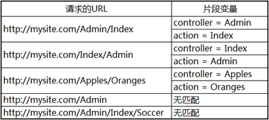


URL路由是在MVC工程中的App_Start文件夹下的RouteConfig.cs文件中的RegisterRoutes方法中定义的，下面是创建一个空MVC项目时系统生成的一个简单URL路由定义：
public static void RegisterRoutes(RouteCollection routes) {
    routes.IgnoreRoute("{resource}.axd/{*pathInfo}"); 

    routes.MapRoute( 
        name: "Default", 
        url: "{controller}/{action}/{id}", 
        defaults: new { controller = "Home", action = "Index",  id = UrlParameter.Optional } 
    );
}
静态方法RegisterRoutes是在Global.asax.cs文件中的Application_Start方法中被调用的，除了URL路由的定义外，还包含其他的一些MVC核心特性的定义：
protected void Application_Start() { 
    AreaRegistration.RegisterAllAreas();

    WebApiConfig.Register(GlobalConfiguration.Configuration); 
    FilterConfig.RegisterGlobalFilters(GlobalFilters.Filters); 
    RouteConfig.RegisterRoutes(RouteTable.Routes); 
    BundleConfig.RegisterBundles(BundleTable.Bundles); 
}
RouteConfig.RegisterRoutes方法中传递的是 RouteTable 类的静态 Routes 属性，返回一个RouteCollection的实例。其实，“原始”的定义路由的方法可以这样写：
public static void RegisterRoutes(RouteCollection routes) { 

    Route myRoute = new Route("{controller}/{action}", new MvcRouteHandler()); 
    routes.Add("MyRoute", myRoute); 
}
创建Route对象时用了一个URL格式字符串和一个MvcRouteHandler对象作为构造函数的参数。不同的ASP.NET技术有不同的RouteHandler，MVC用的是MvcRouteHandler。
这种写法有点繁琐，一种更简单的定义方法是：
public static void RegisterRoutes(RouteCollection routes) { 

    routes.MapRoute("MyRoute", "{controller}/{action}"); 
}
这种方法简洁易读，一般我们都会用这种方法定义路由。 
示例准备
作为演示，我们先来准备一个Demo。创建一个标准的MVC应用程序，然后添加三个简单的Controller，分别是HomeController、CustomerController和AdminController，代码如下：
public class HomeController : Controller {
            
    public ActionResult Index() {
        ViewBag.Controller = "Home";
        ViewBag.Action = "Index";
        return View("ActionName");
    }
}

public class CustomerController : Controller {
        
    public ActionResult Index() {
        ViewBag.Controller = "Customer";
        ViewBag.Action = "Index";
        return View("ActionName");
    }

    public ActionResult List() {
        ViewBag.Controller = "Customer";
        ViewBag.Action = "List";
        return View("ActionName");
    }
}

public class AdminController : Controller {
        
    public ActionResult Index() {
        ViewBag.Controller = "Admin";
        ViewBag.Action = "Index";
        return View("ActionName");
    }
}
在 /Views/Shared 文件夹下再给这三个Controller添加一个共享的名为 ActionName.cshtml 的 View，代码如下：
@{ 
    Layout = null; 
}

<!DOCTYPE html>
<html>
<head>
    <meta name="viewport" content="width=device-width" />
    <title>ActionName</title>
</head>
<body>
    <div>The controller is: @ViewBag.Controller</div>
    <div>The action is: @ViewBag.Action</div>
</body>
</html>
我们把RouteConfig.cs文件中项目自动生成的URL Rounting的定义删了，然后根据前面讲的路由定义知识，我们自己写一个最简单的：
public static void RegisterRoutes(RouteCollection routes) { 

    routes.MapRoute("MyRoute", "{controller}/{action}"); 
}
程序运行，URL定位到 Admin/Index 看看运行结果：
这个Demo输出的是被调用的Controller和Action名称。
给片段变量定义默认值
在上面我们必须把URL定位到特定Controller和Action，否则程序会报错，因为MVC不知道去执行哪个Action。 我们可以通过指定默认值来告诉MVC当URL没有给出对应的片段时使用某个默认的值。如下给controller和action指定默认值：
routes.MapRoute("MyRoute", "{controller}/{action}",  new { controller = "Home", action = "Index" });
这时候如果在URL中不提供action片段的值或不提供controller和action两个片段的值，MVC将使用路由定义中提供的默认值：

它的各种匹配情况如下表所示：

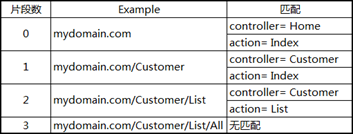


注意，对于上面的URL路由的定义，我们可以只给action一个片段指定默认值，但是不能只给controller一个片段指定默认值，即如果我们给Controller指定了默认值，就一定也要给action指定默认值，否则URL只有一个片段时，这个片段匹配给了controller，action将找不到匹配。
定义静态片段
并不是所有的片段都是用来作为匹配变量的，比如，我们想要URL加上一个名为Public的固定前缀，那么我们可以这样定义：
routes.MapRoute("", "Public/{controller}/{action}",  new { controller = "Home", action = "Index" });
这样，请求的URL也需要一个Public前缀与之匹配。我们也可以把静态的字符串放在大括号以外的任何位置，如：
routes.MapRoute("", "X{controller}/{action}",  new { controller = "Home", action = "Index" });
在一些情况下这种定义非常有用。比如当你的网站某个链接已经被用户普遍记住了，但这一块功能已经有了一个新的版本，但调用的是不同名称的controller，那么你把原来的controller名称作为现在controller的别名。这样，用户依然使用他们记住的URL，而导向的却是新的controller。如下使用Shop作为Home的一个别名：
routes.MapRoute("ShopSchema", "Shop/{action}",  new { controller = "Home" }); 
这样，用户使用原来的URL可以访问新的controller：

自定义片段变量
自定义片段变量的定义和取值
controller和action片段变量对MVC来说有着特殊的意义，在定义一个路由时，我们必须有这样一个概念：controller和action的变量值要么能从URL中匹配得到，要么由默认值提供，总之一个URL请求经过路由系统交给MVC处理时必须保证controller和action两个变量的值都有。当然，除了这两个重要的片段变量，我们也可从通过自定义片段变量来从URL中得到我们想要的其它信息。如下自定义了一个名为Id的片段变量，而且给它定义了默认值：
routes.MapRoute("MyRoute", "{controller}/{action}/{id}",
    new {
        controller = "Home",
        action = "Index",
        id = "DefaultId"
});
我们在HomeController中增加一个名为CustomVariable的ACtion来演示一下如何取自定义的片段变量：
public ActionResult CustomVariable() {
    ViewBag.Controller = "Home";
    ViewBag.Action = "CustomVariable";
    ViewBag.CustomVariable = RouteData.Values["id"];
    return View("ActionName");
}
可以通过 RouteData.Values[segment] 来取得任意一个片段的变量值。
再稍稍改一下ActionName.cshtml 来看一下我们取到的自定义片段变量的值：
...
<div>The controller is: @ViewBag.Controller</div> 
<div>The action is: @ViewBag.Action</div> 
<div>The custom variable is: @ViewBag.CustomVariable</div>
...
将URL定位到 /Home/CustomVariable/Hello 将得到如下结果：

自定义的片段变量用处很大，也很灵活，下面介绍一些常见的用法。
将自定义片段变量作为Action方法的参数
我们可以将自定义的片段变量当作参数传递给Action方法，如下所示：
public ActionResult CustomVariable(string id) { 
    ViewBag.Controller = "Home"; 
    ViewBag.Action = "CustomVariable"; 
    ViewBag.CustomVariable = id; 
    return View("ActionName"); 
}
效果和上面是一样的，只不过这样省去了用 RouteData.Values[segment] 的方式取自定义片段变量的麻烦。这个操作背后是由模型绑定来做的，模型绑定的知识我将在后续博文中进行讲解。
指定自定义片段变量为可选
指定自定片段变量为可选，即在URL中可以不用指定片段的值。如下面的定义将Id定义为可选：
routes.MapRoute("MyRoute", "{controller}/{action}/{id}", new {
        controller = "Home",
        action = "Index",
        id = UrlParameter.Optional
});
定义为可选以后，需要对URL中没有Id这个片段值的情况进行处理，如下：
public ActionResult CustomVariable(string id) { 
    ViewBag.Controller = "Home"; 
    ViewBag.Action = "CustomVariable"; 
    ViewBag.CustomVariable = id == null ? "<no value>" : id; 
    return View("ActionName"); 
} 
当Id是整型的时候，参数的类型需要改成可空的整型(即int? id)。
为了省去判断参数是否为空，我们也可以把Action方法的id参数也定义为可选，当没有提供Id参数时，Id使用默认值，如下所示：
public ActionResult CustomVariable(string id = "DefaultId") { 
    ViewBag.Controller = "Home"; 
    ViewBag.Action = "CustomVariable"; 
    ViewBag.CustomVariable = id; 
    return View("ActionName"); 
}
这样其实就是和使用下面这样的方式定义路由是一样的：
routes.MapRoute("MyRoute", "{controller}/{action}/{id}", new { controller = "Home", action = "Index", id = "DefaultId" });
定义可变数量的自定义片段变量
我们可以通过 catchall 片段变量加 * 号前缀来定义匹配任意数量片段的路由。如下所示：
routes.MapRoute("MyRoute", "{controller}/{action}/{id}/{*catchall}", 
    new { controller = "Home", action = "Index",  id = UrlParameter.Optional });
这个路由定义的匹配情况如下所示：

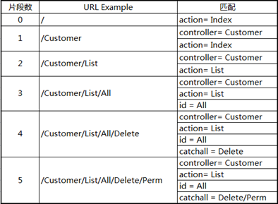

使用*catchall，将匹配的任意数量的片段，但我们需要自己通过“/”分隔catchall变量的值来取得独立的片段值。
路由约束
正则表达式约束
通过正则表达式，我们可以制定限制URL的路由规则，下面的路由定义限制了controller片段的变量值必须以 H 打头：
routes.MapRoute("MyRoute", "{controller}/{action}/{id}", 
    new { controller = "Home", action = "Index", id = UrlParameter.Optional },
    new { controller = "^H.*" }
);
定义路由约束是在MapRoute方法的第四个参数。和定义默认值一样，也是用匿名类型。
我们可以用正则表达式约束来定义只有指定的几个特定的片段值才能进行匹配，如下所示：
routes.MapRoute("MyRoute", "{controller}/{action}/{id}", 
    new { controller = "Home", action = "Index", id = UrlParameter.Optional },
    new { controller = "^H.*", action = "^Index$|^About$" }
);
这个定义，限制了action片段值只能是Index或About，不区分大小写。
Http请求方式约束
我们还可以限制路由只有当以某个特定的Http请求方式才能匹配。如下限制了只能是Get请求才能进行匹配：
routes.MapRoute("MyRoute", "{controller}/{action}/{id}", 
    new { controller = "Home", action = "Index", id = UrlParameter.Optional },
    new { controller = "^H.*", httpMethod = new HttpMethodConstraint("GET") }
);
通过创建一个 HttpMethodConstraint 类的实例来定义一个Http请求方式约束，构造函数传递是允许匹配的Http方法名。这里的httpMethod属性名不是规定的，只是为了区分。
这种约束也可以通过HttpGet或HttpPost过滤器来实现，后续博文再讲到滤器的内容。
自定义路由约束
如果标准的路由约束满足不了你的需求，那么可以通过实现 IRouteConstraint 接口来定义自己的路由约束规则。
我们来做一个限制浏览器版本访问的路由约束。在MVC工程中添加一个文件夹，取名Infrastructure，然后添加一个 UserAgentConstraint 类文件，代码如下：
public class UserAgentConstraint : IRouteConstraint {
        
    private string requiredUserAgent;

    public UserAgentConstraint(string agentParam) {
        requiredUserAgent = agentParam;
    }

    public bool Match(HttpContextBase httpContext, Route route, string parameterName,
        RouteValueDictionary values, RouteDirection routeDirection) {
            
        return httpContext.Request.UserAgent != null 
            && httpContext.Request.UserAgent.Contains(requiredUserAgent);
    }
}
这里实现IRouteConstraint的Match方法，返回的bool值告诉路由系统请求是否满足自定义的约束规则。我们的UserAgentConstraint类的构造函数接收一个浏览器名称的关键字作为参数，如果用户的浏览器包含注册的关键字才可以访问。接一来，我们需要注册自定的路由约束：
public static void RegisterRoutes(RouteCollection routes) {

    routes.MapRoute("ChromeRoute", "{*catchall}",
        new { controller = "Home", action = "Index" },
        new { customConstraint = new UserAgentConstraint("Chrome") }
    );
}
下面分别是IE10和Chrome浏览器请求的结果：
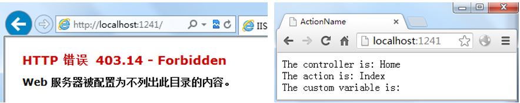


定义请求磁盘文件路由
并不是所有的URL都是请求controller和action的。有时我们还需要请求一些资源文件，如图片、html文件和JS库等。
我们先来看看能不能直接请求一个静态Html文件。在项目的Content文件夹下，添加一个html文件，内容随意。然后把URL定位到该文件，如下图：

我们看到，是可以直接访问一静态资源文件的。
默认情况下，路由系统先检查URL是不是请求静态文件的，如果是，服务器直接返回文件内容并结束对URL的路由解析。我们可以通过设置 RouteCollection的 RouteExistingFiles 属性值为true 让路由系统对静态文件也进行路由匹配，如下所示：
public static void RegisterRoutes(RouteCollection routes) {
    
    routes.RouteExistingFiles = true;

    routes.MapRoute("MyRoute", "{controller}/{action}/{id}/{*catchall}",
        new { controller = "Home", action = "Index", id = UrlParameter.Optional
    });
}
设置了routes.RouteExistingFiles = true后，还需要对IIS进行设置，这里我们以IIS Express为例，右键IIS Express小图标，选择“显示所有应用程序”，弹出如下窗口：
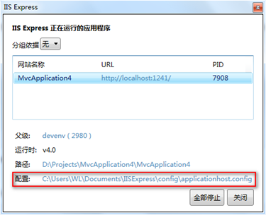
点击并打开配置文件，Control+F找到UrlRoutingModule-4.0，将这个节点的preCondition属性改为空，如下所示：
<add name="UrlRoutingModule-4.0" type="System.Web.Routing.UrlRoutingModule" preCondition=""/>
然后我们运行程序，再把URL定位到之前的静态文件：
这样，路由系统通过定义的路由去匹配RUL，如果路由中没有定义该静态文件的匹配，则会报上面的错误。
一旦定义了routes.RouteExistingFiles = true，我们就要为静态文件定义路由，如下所示：
public static void RegisterRoutes(RouteCollection routes) {
    
    routes.RouteExistingFiles = true;

    routes.MapRoute("DiskFile", "Content/StaticContent.html",
        new { controller = "Customer", action = "List", });

    routes.MapRoute("MyRoute", "{controller}/{action}/{id}/{*catchall}",
        new { controller = "Home", action = "Index", id = UrlParameter.Optional });
}
这个路由匹配Content/StaticContent.html的URL请求为controller = Customer, action = List。我们来看看运行结果：
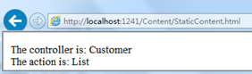


这样做的目的是为了可以在Controller的Action中控制对静态资源的请求，并且可以阻止对一些特殊资源文件的访问。
设置了RouteExistingFiles属性为true后，我们要为允许用户请求的资源文件进行路由定义，如果每种资源文件都去定义相应的路由，就会显得很繁琐。
我们可以通过RouteCollection类的IgnoreRoute方法绕过路由定义，使得某些特定的静态文件可以由服务器直接返回给浏览器，如下所示：
public static void RegisterRoutes(RouteCollection routes) {
    
    routes.RouteExistingFiles = true;

    routes.IgnoreRoute("Content/{filename}.html");

    routes.MapRoute("DiskFile", "Content/StaticContent.html",
        new { controller = "Customer", action = "List", });

    routes.MapRoute("MyRoute", "{controller}/{action}/{id}/{*catchall}",
        new { controller = "Home", action = "Index", id = UrlParameter.Optional });
}
这样，只要是请求Content目录下的任何html文件都能被直接返回。这里的IgnoreRoute方法将创建一个RouteCollection的实例，这个实例的Route Handler 为 StopRoutingHandler，而不是 MvcRouteHandler。运行程序定位到Content/StaticContent.html，我们又看到了之前的静态面面了。
生成URL(链接)
前面讲的都是解析URL的部分，现在我们来看看如何通过路由系统在View中生成URL。
生成指向当前controller的action链接
在View中生成URL的最简单方法就是调用Html.ActionLink方法，如下面在 Views/Shared/ActionName.cshtml 中的代码所示：
...
<div>The controller is: @ViewBag.Controller</div>
<div>The action is: @ViewBag.Action</div>
<div>
    @Html.ActionLink("This is an outgoing URL", "CustomVariable")
</div>
...
这里的Html.ActionLink方法将会生成指向View对应的Controller和第二个参数指定的Action，我们可以看看运行后页面是如何显示的：

经过查看Html源码，我们发现它生成了下面这样的一个html链接：
<a href="/Home/CustomVariable">This is an outgoing URL</a> 
这样看起来，通过Html.ActionLink生成URL似乎并没有直接在View中自己写一个<a>标签更直接明了。 但它的好处是，它会自动根据路由配置来生成URL，比如我们要生成一个指向HomeContrller中的CustomVariable Action的连接，通过Html.ActionLink方法，只需要给出对应的Controller和Action名称就行，我们不需要关心实际的URL是如何组织的。举个例子，我们定义了下面的路由：
public static void RegisterRoutes(RouteCollection routes) {
            
    routes.MapRoute("NewRoute", "App/Do{action}", new { controller = "Home" });
            
    routes.MapRoute("MyRoute", "{controller}/{action}/{id}",
        new { controller = "Home", action = "Index", id = UrlParameter.Optional });
}
运行程序，我们发现它会自动生成下面这样的连接：
<a href="/App/DoCustomVariable">This is an outgoing URL</a>
所以我们要生成指向某个Action的链接时，最好使用Html.ActionLink方法，否则你很难保证你手写的连接就能定位到你想要的Action。
生成其他controller的action链接
上面我们给Html.ActionLink方法传递的第二个参数只告诉了路由系统要定位到当前View对应的Controller下的Action。Html.ActionLink方法可以使用第三个参数来指定其他的Controller，如下所示：
<div> 
    @Html.ActionLink("This targets another controller", "Index", "Admin") 
</div> 
它会自动生成如下链接：
<a href="/Admin">This targets another controller</a> 
生成带有URL参数的链接
有时候我们想在连接后面加上参数以传递数据，如 ?id=xxx 。那么我们可以给Html.ActionLink方法指定一个匿名类型的参数，如下所示：
<div>
    @Html.ActionLink("This is an outgoing URL", "CustomVariable", new { id = "Hello" })
</div>
它生成的Html如下：
<a href="/Home/CustomVariable/Hello">This is an outgoing URL</a>
指定链接的Html属性
通过Html.ActionLink方法生成的链接是一个a标签，我们可以在方法的参数中给标签指定Html属性，如下所示：
<div> 
    @Html.ActionLink("This is an outgoing URL",  "Index", "Home", null, 
        new {id = "myAnchorID", @class = "myCSSClass"})
</div>
这里的class加了@符号，是因为class是C#关键字，@符号起到转义的作用。它生成 的Html代码如下：
<a class="myCSSClass" href="/" id="myAnchorID">This is an outgoing URL</a>
生成完整的标准链接
前面的都是生成相对路径的URL链接，我们也可以通过Html.ActionLink方法生成完整的标准链接，方法如下：
<div> 
    @Html.ActionLink("This is an outgoing URL", "Index", "Home", 
        "https", "myserver.mydomain.com", " myFragmentName",
        new { id = "MyId"},
        new { id = "myAnchorID", @class = "myCSSClass"})
</div>
这是Html.ActionLink方法中最多参数的重载方法，它允许我们提供请求的协议(https)和目标服务器地址(myserver.mydomain.com)等。它生成的链接如下：
<a class="myCSSClass" id="myAnchorID"
    href="https://myserver.mydomain.com/Home/Index/MyId#myFragmentName" >
    This is an outgoing URL</a>
生成URL字符串
用Html.ActionLink方法生成一个html链接是非常有用而常见的，如果要生成URL字符串（而不是一个Html链接），我们可以用 Url.Action 方法，使用方法如下：
<div>This is a URL: 
    @Url.Action("Index", "Home", new { id = "MyId" }) 
</div> 
它显示到页面是这样的：


根据指定的路由名称生成URL
我们可以根据某个特定的路由来生成我们想要的URL，为了更好说明这一点，下面给出两个URL的定义：
public static void RegisterRoutes(RouteCollection routes) { 
    routes.MapRoute("MyRoute", "{controller}/{action}"); 
    routes.MapRoute("MyOtherRoute", "App/{action}", new { controller = "Home" }); 
} 
对于这样的两个路由，对于类似下面这样的写法：
@Html.ActionLink("Click me", "Index", "Customer")
始终会生成这样的链接：
<a href="/Customer/Index">Click me</a>
也就是说，永远无法使用第二个路由来生成App前缀的链接。这时候我们需要通过另一个方法Html.RouteLink来生成URL了，方法如下：
@Html.RouteLink("Click me", "MyOtherRoute","Index", "Customer")
它会生成如下链接：
<a Length="8" href="/App/Index?Length=5">Click me</a>
这个链接指向的是HomeController下的Index Action。但需要注意，通过这种方式来生成URL是不推荐的，因为它不能让我们从直观上看到它生成的URL指向的controller和action。所以，非到万不得已的情况才会这样用。
在Action方法中生成URL
通常我们一般在View中才会去生成URL，但也有时候我们需要在Action中生成URL，方法如下：
public ViewResult MyActionMethod() { 
    
    string myActionUrl = Url.Action("Index", new { id = "MyID" }); 
    string myRouteUrl = Url.RouteUrl(new { controller = "Home", action = "Index" }); 
    
    //... do something with URLs... 
    return View(); 
}
其中 myActionUrl 和 myRouteUrl 将会被分别赋值 /Home/Index/MyID 和 / 。
更多时候我们会在Action方法中将客户端浏览器重定向到别的URL，这时候我们使用RedirectToAction方法，如下：
public RedirectToRouteResultMyActionMethod() { 
    return RedirectToAction("Index");
}
RedirectToAction的返回结果是一个RedirectToRouteResult类型，它使MVC触发一个重定向行为，并调用指定的Action方法。RedirectToAction也有一些重载方法，可以传入controller等信息。也可以使用RedirectToRoute方法，该方法传入的是object匿名类型，易读性强，如：
public RedirectToRouteResult MyActionMethod() {
    return RedirectToRoute(new { controller = "Home", action = "Index", id = "MyID" });
}
URL方案最佳实践
下面是一些使用URL的建议：
1.	最好能直观的看出URL的意义，不要用应用程序的具体信息来定义URL。比如使用 /Articles/Report 比使用 /Website_v2/CachedContentServer/FromCache/Report 好。
2.	使用内容标题比使用ID好。比如使用 /Articles/AnnualReport 比使用 /Articles/2392 好。如果一定要使用使用ID（比如有时候可能需要区分相同的标题），那么就两者都用，如 /Articles/2392/AnnualReport ，它看起来很长，但对用户更友好，而且更利于SEO。
3.	对于Web页面不要使用文件扩展名（如 .aspx 或 .mvc）。但对于特殊的文件使用扩展名（如 .jpg、.pdf 和 .zip等）。
4.	尽可能使用层级关系的URL，如 /Products/Menswear/Shirts/Red，这样用户就能猜到父级URL。
5.	不区分大小写，这样方便用户输入。
6.	正确使用Get和Post。Get一般用来从服务器获取只读的信息，当需要操作更改状态时使用Post。
7.	尽可能避免使用标记符号、代码、字符序列等。如果你想要用标记进行分隔，就使用中划线(如 /my-great-article)，下划线是不友好的，另外空格和+号都会被URL编码。
8.	不要轻易改变URL，尤其对于互联网网站。如果一定要改，那也要尽可能长的时间保留原来的URL。
9.	尽量让URL使用统一的风格或习惯。


理解ASP.NET MVC 请求周期
在本节中我们只讲解请求周期中重要的知识点
1. UrlRoutingModule
当最终用户发送请求时，会通过UrlRoutingModule对象传递，UrlRoutingModule是HTTP模块。
2. Routing
UrlRoutingModule 会从route table集合中获取首次匹配的Route 对象，为了能够匹配成功，请求URL会与route中定义的URL pattern匹配。
当匹配的时候必须考虑以下规则：
	数字参数的匹配（请求URL和URL pattern中的数字）
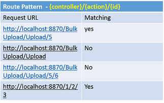

	URL pattern中的可选参数：

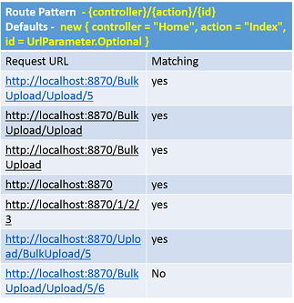
	参数中定义的静态参数

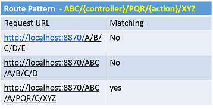

3. 创建MVC Route Handler
一旦Route对象被选中，UrlRoutingModule会获得 Route对象的 MvcRouteHandler对象。
4. 创建 RouteData 和 RequestContext
UrlRoutingModule使用Route对象创建RouteData，可用于创建RequestContext。RouteData封装了路径的信息如Controller名称，action名称以及route参数值。
Controller 名称
为了从URL 中获取Controller名称，需要按规则执行如在URL pattern中{Controller}是标识Controller名称的关键字。
Action Method 名称
为了获取action 方法名称，{action}是标识action 方法的关键字。
Route 参数
URL pattern能够获得以下值：
1.{controller}
2.{action}
3. 字符串，如 "MyCompany/{controller}/{action}"，"MyCompany"是字符串。
4. 其他，如"{controller}/{action}/{id}"，"id"是路径的参数。
例如：
Route pattern - > "{controller}/{action}/{id}"
请求 URL ->http://localhost:8870/BulkUpload/Upload/5
测试1
public class BulkUploadController : Controller
{
    public ActionResult Upload (string id)
    {
       //value of id will be 5 -> string 5
       ...
    }
}
测试2
public class BulkUploadController : Controller
{
    public ActionResult Upload (int id)
    {
       //value of id will be 5 -> int 5
       ...
    }
}
测试3
public class BulkUploadController : Controller
{
    public ActionResult Upload (string MyId)
    {
       //value of MyId will be null
       ...
    }
}
5. 创建MVC Handler
MvcRouteHandler 会创建 MVCHandler的实例传递 RequestContext对象
6. 创建Controller实例
MVCHandler会根据 ControllerFactory的帮助创建Controller实例
7. 执行方法
MVCHandler调用Controller的执行方法，执行方法是由Controller的基类定义的。
8. 调用Action 方法
每个控制器都有与之关联的 ControllerActionInvoker对象。在执行方法中ControllerActionInvoker对象调用正确的action 方法。
9. 运行结果
Action方法会接收到用户输入，并准备好响应数据，然后通过返回语句返回执行结果，返回类型可能是ViewResult或其他。
实现对用户友好的URL
1. 重新定义 RegisterRoutes 方法
在RegisterRoutes 方法中包含 additional route
public static void RegisterRoutes(RouteCollection routes)
{
    routes.IgnoreRoute("{resource}.axd/{*pathInfo}");

    routes.MapRoute(
    name: "Upload",
    url: "Employee/BulkUpload",
    defaults: new { controller = "BulkUpload", action = "Index" }
    );

    routes.MapRoute(
        name: "Default",
        url: "{controller}/{action}/{id}",
        defaults: new { controller = "Home", action = "Index", id = UrlParameter.Optional }
    );
}
2. 修改URL 引用
打开"~/Views/Employee"文件下的 AddNewLink.cshtml ，修改BulkUpload 链接，如下：
&nbsp;
<a href="/Employee/BulkUpload">BulkUpload</a>
3. 运行测试

关于实验
1. 之前的URL 现在是否起作用？
是，仍然有用。BulkUploadController中的Index 方法可通过两个URL 访问。
1. "http://localhost:8870/Employee/BulkUpload"
2. "http://localhost:8870/BulkUpload/Index"
2. Route 参数和Query 字符串有什么区别？
•	Query 字符串本身是有大小限制的，而无法定义Route 参数的个数。
•	无法在Query 字符串值中添加限制，但是可以在Route 参数中添加限制。
•	可能会设置Route参数的默认值，而Query String不可能有默认值。
•	Query 字符串可使URL 混乱，而Route参数可保持它有条理。
3. 如何在Route 参数中使用限制？
可使用正则表达式。如：
routes.MapRoute(
    "MyRoute",
    "Employee/{EmpId}",
    new {controller=" Employee ", action="GetEmployeeById"},
    new { EmpId = @"\d+" }
 );
Action 方法：
public ActionResult GetEmployeeById(int EmpId)
{
   ...
}
Now when someone make a request with URL "http://..../Employee/1" or "http://..../Employee/111", action method will get executed but when someone make a request with URL "http://..../Employee/Sukesh" he/she will get "Resource Not Found" Error.
4. 是否需要将action 方法中的参数名称与Route 参数名称保持一致？
Route Pattern 也许会包含一个或多个RouteParameter，为了区分每个参数，必须保证action 方法的参数名称与Route 参数名称相同。
5. 定义路径的顺序重要吗？
有影响，在上面的实验中，我们定义了两个路径，一个是自定义的，一个是默认的。默认的是最先定义的，自定义路径是在之后定义的。
当用户输入"http://.../Employee/BulkUpload"地址后发送请求，UrlRoutingModule会搜索与请求URL 匹配的默认的route pattern ，它会将 Employee作为控制器的名称，"BulkUpload"作为action 方法名称。因此定义的顺序是非常重要的，更常用的路径应放在最后。
6. 是否有什么简便的方法来定义Action 方法的URL pattern？
我们可使用基于 routing 的属性。
1.  基本的routing 属性可用
在 RegisterRoutes 方法中在 IgnoreRoute语句后输入代码如下：
routes.IgnoreRoute("{resource}.axd/{*pathInfo}");

routes.MapMvcAttributeRoutes();

routes.MapRoute(
...
2. 定义action 方法的 route pattern
[Route("Employee/List")]
public ActionResult Index()
{
3. 运行测试

routing 属性可定义route 参数，如下：
[Route("Employee/List/{id}")]
publicActionResult Index (string id) { ... }
IgnoreRoutes 的作用是什么？
当我们不想使用routing作为特别的扩展时，会使用IgnoreRoutes。作为MVC模板的一部分，在RegisterRoute 方法中下列语句是默认的：
routes.IgnoreRoute("{resource}.axd/{*pathInfo}");
这就是说如果用户发送以".axd"为结束的请求，将不会有任何路径加载的操作，请求将直接定位到物理资源。
整理项目组织结构
本实验不添加新功能，主要目的是整理项目结构，使项目条理清晰，便于其他人员理解。
1. 创建解决方案文件夹
右键单击，选择“新解决方案文件夹—>添加—>新解决方案”，命名为"View And Controller"

重复上述步骤 ，创建文件夹"Model"，"View Model"，"Data Access Layer"

2. 创建数据访问层工程
右击 "Data Access Layer" 文件夹，新建类库 "DataAccessLayer"。
3. 创建业务层和业务实体项
在Model文件夹下创建新类库 "BusinessLayer" 和 "BusinessEntities"
4. 创建ViewModel 项
在ViewModel 文件夹下新建类库项 "ViewModel"
5. 添加引用
为以上创建的项目添加引用，如下：
1. DataAccessLayer 添加 BusinessEntities项
2. BusinessLayer 添加DataAccessLayer和 BusinessEntities项
3. MVC WebApplication 选择 BusinessLayer、BusinessEntities、ViewModel
4. BusinessEntities 添加 System.ComponentModel.DataAnnotations
6. 设置
1.将DataAccessLayer文件夹下的 SalesERPDAL.cs文件，复制粘贴到新创建的 DataAccessLayer 类库中。

2. 删除MVC项目（WebApplication1）的DataAccessLayer文件夹 
3. 同上，将Model文件夹中的 Employee.cs, UserDetails.cs 及 UserStatus.cs文件复制到新建的 BusinessEntities文件夹中。
4. 将MVC项目中的Model文件夹的 EmployeeBusinessLayer.cs文件粘贴到新建的 BusinessLayer的文件夹中。
5. 删除MVC中的Model文件夹
6. 将MVC项目的ViewModels文件夹下所有的文件复制到新建的ViewModel 类库项中。
7. 删除ViewModels文件夹
8. 将整个MVC项目剪切到”View And Controller”解决方案文件夹中。
7. Build
选择Build->Build Solution from menu bar，会报错。
8. 改错
1. 给ViewModel项添加System.Web 引用
2. 在DataAccessLayer 和 BusinessLayer中使用Nuget 管理，并安装EF（Entity Framework）。
注意：在Business Layer中引用EF 是非常必要的，因为Business Layer与DataAccessLayer 直接关联的，而完善的体系架构它自身的业务层是不应该与DataAccessLayer直接关联，因此我们必须使用pattern库，协助完成。
3. 删除MVC 项目中的EF
•	右击MVC 项目，选择"Manage Nuget packages"选项
•	在弹出的对话框中选择"Installed Packages"
•	则会显示所有的已安装项，选择EF，点解卸载。
9. 编译会发现还是会报错
10. 修改错误
报错是由于在项目中既没有引用 SalesERPDAL，也没有引用EF，在项目中直接引用也并不是优质的解决方案。
1. 在DataAccessLayer项中 新建带有静态方法 "SetDatabase" 的类 "DatabaseSettings"
using System.Data.Entity;
using WebApplication1.DataAccessLayer;

namespace DataAccessLayer
{
    public class DatabaseSettings
    {
        public static void SetDatabase()
        {
            Database.SetInitializer(new DropCreateDatabaseIfModelChanges<SalesERPDAL>());
        }
    }	
}
2. 在 BusinessLayer项中新建带有 "SetBusiness" 静态方法的 "BusinessSettings" 类。
using DataAccessLayer;

namespace BusinessLayer
{
    public class BusinessSettings
    {
        public static void SetBusiness()
        {
            DatabaseSettings.SetDatabase();
        }
    }
}
3. 删除global.asax 中的报错的Using语句 和 Database.SetInitializer 语句。 调用 BusinessSettings.SetBusiness 函数：
using BusinessLayer;
...
BundleConfig.RegisterBundles(BundleTable.Bundles);
BusinessSettings.SetBusiness();
再次编译程序，会发现成功。
Talk
1. 什么是解决方案文件夹？
解决方案文件夹是逻辑性的文件夹，并不是在物理磁盘上实际创建，这里使用解决方案文件夹就是为了使项目更系统化更有结构。
创建单页应用
安装
这个实验中，不再使用已创建好的控制器和视图，会创建新的控制器及视图，创建新控制器和视图原因如下：
1. 保证现有的选项完整，也会用于旧版本与新版本对比 
    2. 学习理解ASP.NET MVC 新概念：Areas
接下来，我们需要从头开始新建controllers、views、ViewModels。
下面的文件可以被重用：
•	已创建的业务层
•	已创建的数据访问层
•	已创建的业务实体
•	授权和异常过滤器
•	FooterViewModel
•	Footer.cshtml
创建新Area
    右击项目，选择添加->Area，在弹出对话框中输入SPA，点击确认，生成新的文件夹，因为在该文件夹中不需要Model中Area的文件夹，删掉。
   

    接下来我们先了解一下Areas的概念
    Areas是实现Asp.net MVC 项目模块化管理的一种简单方法。
    每个项目由多个模块组成，如支付模块，客户关系模块等。在传统的项目中，采用“文件夹”来实现模块化管理的，你会发现在单个项目中会有多个同级文件夹，每个文件夹代表一个模块，并保存各模块相关的文件。
    然而，在Asp.net MVC 项目中使用自定义文件夹实现功能模块化会导致很多问题。
    下面是在Asp.Net MVC中使用文件夹来实现模块化功能需要注意的几点：
•	DataAccessLayer，BusinessLayer，BusinessEntities和ViewModels的使用不会导致其他问题，在任何情况下，可视作简单的类使用。
•	Controllers——只能保存在Controller文件夹，但是这不是大问题，从MVC4开始，控制器的路径不再受限。现在可以放在任何文件目录下。
•	所有的Views必须放在 "~/Views/ControllerName" or "~/Views/Shared"文件夹。
创建必要的ViewModels
	在ViewModel类库下新建文件夹并命名为SPA，创建ViewModel，命名为"MainViewModel"，如下：
using WebApplication1.ViewModels;
namespace WebApplication1.ViewModels.SPA
{
    public class MainViewModel
    {
        public string UserName { get; set; }
        public FooterViewModel FooterData { get; set; }//New Property
    }
}
创建Index action 方法
    在 MainController 中输入：
using WebApplication1.ViewModels.SPA;
using OldViewModel = WebApplication1.ViewModels;
    在MainController 中新建Action 方法，如下：
public ActionResult Index()
{
    MainViewModel v = new MainViewModel();
    v.UserName = User.Identity.Name;
    v.FooterData = new OldViewModel.FooterViewModel();
    v.FooterData.CompanyName = "StepByStepSchools";//Can be set to dynamic value
    v.FooterData.Year = DateTime.Now.Year.ToString();
    return View("Index", v);
}
using OldViewModel = WebApplication1.ViewModels 这行代码中，给WebApplication1.ViewModels 添加了别名OldViewModel，使用时可直接写成OldViewModel.ClassName这种形式。
如果不定义别名的话，会产生歧义，因为WebApplication1.ViewModels.SPA 和 WebApplication1.ViewModels下有名称相同的类。
创建Index View
创建与上述Index方法匹配的View
@using WebApplication1.ViewModels.SPA
@model MainViewModel
<!DOCTYPE html>

<html>
<head>
    <meta name="viewport" content="width=device-width" />
    <title>Employee Single Page Application</title>
运行测试

Talk
1. 为什么在控制器名前需要使用SPA关键字？
在ASP.NET MVC应用中添加area时，Visual Studio会自动创建并命名为"[AreaName]AreaRegistration.cs" 的文件，其中包含了AreaRegistration的派生类。该类定义了 AreaName属性和用来定义register路径信息的 RegisterArea 方法。
在本次实验中你会发现nameSpaArealRegistration.cs文件被存放在 "~/Areas/Spa" 文件夹下，SpaArealRegistration类的RegisterArea方法的代码如下：
context.MapRoute(
    "SPA_default",
    "SPA/{controller}/{action}/{id}",
    new { action = "Index", id = UrlParameter.Optional }
);
这就是为什么一提到Controllers，我们会在Controllers前面加SPA关键字。
2. SPAAreaRegistration的RegisterArea方法是怎样被调用的？
打开global.asax文件，首行代码如下：
AreaRegistration.RegisterAllAreas();
RegisterAllAreas方法会找到应用程序域中所有AreaRegistration的派生类，并主动调用RegisterArea方法
3. 是否可以不使用SPA关键字来调用MainController？
AreaRegistration类在不删除其他路径的同时会创建新路径。RouteConfig类中定义了新路径仍然会起作用。如之前所说的，Controller存放的路径是不受限制的，因此它可以工作但可能不会正常的显示，因为无法找到合适的View。
实验34——创建单页应用2—显示Employees
1.创建ViewModel，实现“显示Empoyee”功能
在SPA中新建两个ViewModel 类，命名为”EmployeeViewModel“及”EmployeeListViewModel“：
namespace WebApplication1.ViewModels.SPA
{
    public class EmployeeViewModel
    {
        public string EmployeeName { get; set; }
        public string Salary { get; set; }
        public string SalaryColor { get; set; }
    }
}
namespace WebApplication1.ViewModels.SPA
{
    public class EmployeeListViewModel
    {
        public List<employeeviewmodel> Employees { get; set; }
    }
}
注意：这两个ViewModel 都是由非SPA 应用创建的，唯一的区别就在于这次不需要使用BaseViewModel。
2. 创建EmployeeList Index
在MainController 中创建新的Action 方法”EmployeeList“action 方法
public ActionResult EmployeeList()
{
    EmployeeListViewModel employeeListViewModel = new EmployeeListViewModel();
    EmployeeBusinessLayer empBal = new EmployeeBusinessLayer();
    List<employee> employees = empBal.GetEmployees();

    List<employeeviewmodel> empViewModels = new List<employeeviewmodel>();

    foreach (Employee emp in employees)
    {
        EmployeeViewModel empViewModel = new EmployeeViewModel();
        empViewModel.EmployeeName = emp.FirstName + " " + emp.LastName;
        empViewModel.Salary = emp.Salary.Value.ToString("C");
        if (emp.Salary > 15000)
        {
            empViewModel.SalaryColor = "yellow";
        }
        else
        {
            empViewModel.SalaryColor = "green";
        }
        empViewModels.Add(empViewModel);
    }
    employeeListViewModel.Employees = empViewModels;
    return View("EmployeeList", employeeListViewModel);
}
注意： 不需要使用 HeaderFooterFilter
3. 创建AddNewLink 分部View
之前添加AddNewLink 分部View已经无法使用，因为Anchor标签会造成全局刷新，我们的目标是创建”单页应用“，因此不需要全局刷新。
在”~/Areas/Spa/Views/Main“ 文件夹新建分部View”AddNewLink.cshtml“。
<a href="#" onclick="OpenAddNew();">Add New</a>
4. 创建 AddNewLink Action 方法
在MainController中创建 ”GetAddNewLink“ action 方法。
public ActionResult GetAddNewLink()
{
    if (Convert.ToBoolean(Session["IsAdmin"]))
    {
        return PartialView("AddNewLink");
    }
    else
    {
        return new EmptyResult();
    }
}
5. 新建 EmployeeList View
在“~/Areas/Spa/Views/Main”中创建新分部View 命名为“EmployeeList”。
@using WebApplication1.ViewModels.SPA
@model EmployeeListViewModel
<div>
    @{
        Html.RenderAction("GetAddNewLink");
    }

    <table border="1" id="EmployeeTable">
        <tr>
            <th>Employee Name</th>
6. 设置EmployeeList 为初始页面
打开“~/Areas/Spa/Views/Main/Index.cshtml”文件，在Div标签内包含EmployeeList action结果。
...  
</div>
7. 运行

实验35——创建单页应用3—创建Employee
1. 创建AddNew ViewModels
在SPA中新建 ViewModel类库项的ViewModel，命名为“CreateEmployeeViewModel”。
namespace WebApplication1.ViewModels.SPA
{
    public class CreateEmployeeViewModel
    {
        public string FirstName { get; set; }
        public string LastName { get; set; }
        public string Salary { get; set; }
    }
}
2. 创建AddNew action 方法
在MainController中输入using 语句：
using WebApplication1.Filters;
在MainController 中创建AddNew action 方法：
[AdminFilter]
public ActionResult AddNew()
{
    CreateEmployeeViewModel v = new CreateEmployeeViewModel();
    return PartialView("CreateEmployee", v);
}
3. 创建 CreateEmployee 分部View
在“~/Areas/Spa/Views/Main”中创建新的分部View“CreateEmployee”
@using WebApplication1.ViewModels.SPA
@model CreateEmployeeViewModel
<div>
    <table>
        <tr>
            <td>
                First Name:
            </td>
4. 添加 jQuery UI
右击项目选择“Manage Nuget Manager”。找到“jQuery UI”并安装。

项目中会自动添加.js和.css文件

5. 在项目中添加jQuery UI
打开“~/Areas/Spa/Views/Main/Index.cshtml”，添加jQuery.js,jQueryUI.js 及所有的.css文件的引用。这些文件会通过Nuget Manager添加到jQuery UI 包中。
<head>
<meta name="viewport" content="width=device-width" />
<script src="~/Scripts/jquery-1.8.0.js"></script>
<script src="~/Scripts/jquery-ui-1.11.4.js"></script>
<title>Employee Single Page Application</title>
<link href="~/Content/themes/base/all.css" rel="stylesheet" />
...
6. 实现 OpenAddNew 方法
在“~/Areas/Spa/Views/Main/Index.cshtml”中新建JavaScript方法“OpenAddNew”。
<script>
    function OpenAddNew() {
        $.get("/SPA/Main/AddNew").then
            (
                function (r) {
                    $("<div id='DivCreateEmployee'></div>").html(r).
                        dialog({
                            width: 'auto', height: 'auto', modal: true, title: "Create New Employee",
                            close: function () {
                                $('#DivCreateEmployee').remove();
                            }
                        });
                }
            );
    }
</script>
7. 运行
完成登录步骤后导航到Index中，点击Add New 链接。

8. 创建 ResetForm 方法
在CreateEmployee.cshtml顶部，输入以下代码，创建ResetForm函数：
@model CreateEmployeeViewModel
<script>
    function ResetForm() {
        document.getElementById('TxtFName').value = "";
        document.getElementById('TxtLName').value = "";
        document.getElementById('TxtSalary').value = "";
    }
</script>
9. 创建 CancelSave 方法
在CreateEmployee.cshtml顶部，输入以下代码，创建CancelSave 函数：
document.getElementById('TxtSalary').value = "";
    }
    function CancelSave() {
        $('#DivCreateEmployee').dialog('close');
    }
在开始下一步骤之前，我们先来了解我们将实现的功能：
•	最终用户点击保存按钮
•	输入值必须在客户端完成验证
•	会将合法值传到服务器端
•	新Employee记录必须保存到数据库中
•	CreateEmployee对话框使用完成之后必须关闭
•	插入新值后，需要更新表格。
为了实现三大功能，先确定一些实现计划：
1.验证
验证功能可以使用之前项目的验证代码。
2.保存功能
我们会创建新的MVC action 方法实现保存Employee，并使用jQuery Ajax调用
3. 服务器端与客户端进行数据通信
在之前的实验中，使用Form标签和提交按钮来辅助完成的，现在由于使用这两种功能会导致全局刷新，因此我们将使用jQuery Ajax方法来替代Form标签和提交按钮。
寻求解决方案
1. 理解问题
大家会疑惑JavaScript和Asp.NET 是两种技术，如何进行数据交互？
解决方案： 通用数据类型
由于这两种技术都支持如int，float等等数据类型，尽管他们的存储方式，大小不同，但是在行业总有一种数据类型能够处理任何数据，称之为最兼容数据类型即字符串类型。
通用的解决方案就是将所有数据转换为字符串类型，因为无论哪种技术都支持且能理解字符串类型的数据。

问题：复杂数据该怎么传递？
.net中的复杂数据通常指的是类和对象，这一类数据，.net与其他技术传递复杂数据就意味着传类对象的数据，从JavaScript给其他技术传的复杂类型数据就是JavaScript对象。因此是不可能直接传递的，因此我们需要将对象类型的数据转换为标准的字符串类型，然后再发送。
解决方案—标准的通用数据格式
可以使用XML定义一种通用的数据格式，因为每种技术都需要将数据转换为XML格式的字符串，来与其他技术通信，跟字符串类型一样，XML是每种技术都会考虑的一种标准格式。
如下，用C#创建的Employee对象，可以用XML 表示为：
<employee></employee><Employee>
      <EmpName>Sukesh</EmpName>
      <Address>Mumbai</Address>
</Employee>
因此可选的解决方案就是，将技术1中的复杂数据转换为XML格式的字符串，然再发送给技术2.

然而使用XML格式可能会导致数据占用的字节数太多，不易发送。数据SiZE越大意味着性能越低效。还有就是XML的创建和解析比较困难。
为了处理XML创建和解析的问题，使用JSON格式，全称“JavaScript Object Notation”。
C#创建的Employee对象用JSON表示：
{
  EmpName: "Sukesh",
  Address: "Mumbai"
}
JSON数据是相对轻量级的数据类型，且JAVASCRIPT提供转换和解析JSON格式的功能函数。
var e={
EmpName= &ldquo;Sukesh&rdquo;,
Address= &ldquo;Mumbai&rdquo;
};
var EmployeeJsonString = JSON.stringify(e);//This EmployeeJsonString will be send to other technologies.
var EmployeeJsonString=GetFromOtherTechnology();
var e=JSON.parse(EmployeeJsonString);
alert(e.EmpName);
alert(e.Address);
数据传输的问题解决了，让我们继续进行实验。
10. 创建 SaveEmployee action
在MainController中创建action，如下：
[AdminFilter]
public ActionResult SaveEmployee(Employee emp)
{
    EmployeeBusinessLayer empBal = new EmployeeBusinessLayer();
    empBal.SaveEmployee(emp);

EmployeeViewModel empViewModel = new EmployeeViewModel();
empViewModel.EmployeeName = emp.FirstName + " " + emp.LastName;
empViewModel.Salary = emp.Salary.Value.ToString("C");
if (emp.Salary > 15000)
{
empViewModel.SalaryColor = "yellow";
}
else
{
empViewModel.SalaryColor = "green";
    }
return Json(empViewModel);
}
上述代码中，使用Json方法在MVC action方法到JavaScript之间传Json字符串。
11. 添加 Validation.js 引用
@using WebApplication1.ViewModels.SPA
@model CreateEmployeeViewModel
<script src="~/Scripts/Validations.js"></script>
12. 创建 SaveEmployee 方法
在CreateEmployee.cshtml View中，创建 SaveEmployee方法：
...
...

    function SaveEmployee() {
        if (IsValid()) {
            var e =
                {
                    FirstName: $('#TxtFName').val(),
                    LastName: $('#TxtLName').val(),
                    Salary: $('#TxtSalary').val()
                };
            $.post("/SPA/Main/SaveEmployee",e).then(
                function (r) {
                    var newTr = $('<tr></tr>');
                    var nameTD = $('<td></td>');
                    var salaryTD = $('<td></td>');

                    nameTD.text(r.EmployeeName);
                    salaryTD.text(r.Salary); 

                    salaryTD.css("background-color", r.SalaryColor);

                    newTr.append(nameTD);
                    newTr.append(salaryTD);

                    $('#EmployeeTable').append(newTr);
                    $('#DivCreateEmployee').dialog('close'); 
                }
                );
        }
    }
</script>
13. 运行

Talk on Lab 35
1. JSON 方法的作用是什么？
返回JSONResult,JSONResult 是ActionResult 的子类。在第六篇博客中讲过MVC的请求周期。

ExecuteResult是ActionResult中声明的抽象方法，ActionResult所有的子类都定义了该方法。在第一篇博客中我们已经讲过ViewResult 的ExecuteResult方法实现的功能，有什么不理解的可以翻看第一篇博客。
实验36——创建单页应用—4—批量上传
1. 创建SpaBulkUploadController
创建新的AsyncController“ SpaBulkUploadController”
namespace WebApplication1.Areas.SPA.Controllers
{
    public class SpaBulkUploadController : AsyncController
    {
    }
}
2. 创建Index Action
在步骤1中的Controller中创建新的Index Action 方法,如下：
[AdminFilter]
public ActionResult Index()
{
    return PartialView("Index");
}
3. 创建Index 分部View
在“~/Areas/Spa/Views/SpaBulkUpload”中创建 Index分部View
<div>
    Select File : <input type="file" name="fileUpload" id="MyFileUploader" value="" />
    <input type="submit" name="name" value="Upload" onclick="Upload();" />
</div>
4. 创建 OpenBulkUpload  方法
打开“~/Areas/Spa/Views/Main/Index.cshtml”文件，新建JavaScript 方法OpenBulkUpload
function OpenBulkUpload() {
            $.get("/SPA/SpaBulkUpload/Index").then
                (
                    function (r) {
                        $("<div id='DivBulkUpload'></div>").html(r).dialog({ width: 'auto', height: 'auto', modal: true, title: "Create New Employee",
                            close: function () {
                                $('#DivBulkUpload').remove();
                            } });
                    }
                );
        }
    </script>
</head>
<body>
    <div style="text-align:right">
5. 运行

6. 新建FileUploadViewModel
在ViewModel SPA文件夹中新建View Model”FileUploadViewModel”。
namespace WebApplication1.ViewModels.SPA
{
    public class FileUploadViewModel
    {
        public HttpPostedFileBase fileUpload { get; set; }
    }
}
7. 创建Upload Action
Create a new Action method called Upload in SpaBulkUploadController as follows.
[AdminFilter]
public async Task<actionresult> Upload(FileUploadViewModel model)
{
    int t1 = Thread.CurrentThread.ManagedThreadId;
    List<employee> employees = await Task.Factory.StartNew<list<employee>>
        (() => GetEmployees(model));
    int t2 = Thread.CurrentThread.ManagedThreadId;
    EmployeeBusinessLayer bal = new EmployeeBusinessLayer();
    bal.UploadEmployees(employees);
    EmployeeListViewModel vm = new EmployeeListViewModel();
    vm.Employees = new List<employeeviewmodel>();
    foreach (Employee item in employees)
    {
        EmployeeViewModel evm = new EmployeeViewModel();
        evm.EmployeeName = item.FirstName + " " + item.LastName;
        evm.Salary = item.Salary.Value.ToString("C");
        if (item.Salary > 15000)
        {
            evm.SalaryColor = "yellow";
        }
        else
        {
            evm.SalaryColor = "green";
        }
        vm.Employees.Add(evm);
    }
    return Json(vm);
}

private List<employee> GetEmployees(FileUploadViewModel model)
{
    List<employee> employees = new List<employee>();
    StreamReader csvreader = new StreamReader(model.fileUpload.InputStream);
    csvreader.ReadLine();// Assuming first line is header
    while (!csvreader.EndOfStream)
    {
        var line = csvreader.ReadLine();
        var values = line.Split(',');//Values are comma separated
        Employee e = new Employee();
        e.FirstName = values[0];
        e.LastName = values[1];
        e.Salary = int.Parse(values[2]);
        employees.Add(e);
    }
    return employees;
}
8. 创建Upload 函数
打开”~/Areas/Spa/Views/SpaBulkUpload”的Index View。创建JavaScript函数，命名为“Upload”
<script>
    function Upload() {
        debugger;
        var fd = new FormData();
        var file = $('#MyFileUploader')[0];
        fd.append("fileUpload", file.files[0]);
        $.ajax({
            url: "/Spa/SpaBulkUpload/Upload",
            type: 'POST',
            contentType: false,
            processData: false,
            data: fd
        }).then(function (e) {
            debugger;
            for (i = 0; i < e.Employees.length; i++)
            {
                var newTr = $('<tr></tr>');
                var nameTD = $('<td></td>');
                var salaryTD = $('<td></td>');

                nameTD.text(e.Employees[i].EmployeeName);
                salaryTD.text(e.Employees[i].Salary);

                salaryTD.css("background-color", e.Employees[i].SalaryColor);

                newTr.append(nameTD);
                newTr.append(salaryTD);

                $('#EmployeeTable').append(newTr);
            }
            $('#DivBulkUpload').dialog('close');
        });
    }
</script>
9. 运行


