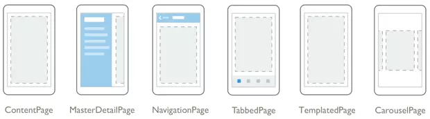

# Xamarin

## 目录

1. 简介
   - [系统需求](#系统需求)
   - [页面](#页面)
   - [布局](#布局)
     - [StackLayout](#StackLayout)
     - [Grid](#Grid)
     - [FlexLayout](#FlexLayout)
     - [RelativeLayout](#RelativeLayout)
   - 视图
     - [Label](#Label)
     - [Button](#Button)
     - [Entry](#Entry)
     - [Editor](#Editor)
     - [Image](#Image)
     - [ListView](#ListView)
   - [数据绑定](#数据绑定)
   - 应用基础
     - [DisplayAlert](#DisplayAlert)
     - [生命周期](#生命周期)
     - [行为](#行为)
     - [手势](#手势)
2. 示例
   - [行为示例](#行为示例)
   - [控制反转示例](#控制反转示例)
3. [参考](#参考)

Xamarin.Forms 是一个跨平台的、基于原生控件的 UI 工具包，开发人员可以轻松的创建适用于 Android，iOS 以及 Windows Phone 的用户界面。

Xamarin的代码共享方案：

Xamarin 的工作原理：

## 系统需求

**iOS:**由于Apple限制iOS应用程式编译都需要透过Xcode，因此需要1台MAC的机器作为Build Host.

- Windows 7 或更新的作业系统版本
- Visual Studio 2010 / 2012
- OS X Lion 或更新的作业系统版本
- Xcode IDE 以及 iOS SDK

**Android:** 对于Android开发，则可以完全在Windows上进行。其系统需求如下:

- Windows 7 或更新的作业系统版本
- Java SDK
- Android SDK
- Xamarin.Android for Visual Studio

## 页面

XF中主要有6种页面类型：

- ContentPage：内容页；
- MasterDetailPage：大纲-细节页；
- NavigationPage：导航页；
- TabbedPage：选项卡页；
- TemplatedPage：模板页；
- CarouselPage：旋转页；

## 布局

XF中主要有以下6种布局：

- StackLayout：栈布局；
- AbsoluteLayout：绝对布局；
- RelativeLayout：相对布局；
- Grid：网格布局；
- FlexLayout：弹性布局；
- ScrollView：滚动视图；

### StackLayout

堆栈式布局是一种非常常用的布局方式，可以极大地的简化跨平台用户界面的搭建。堆栈式布局的子元素会按照添加到容器中的顺序一个接一个被摆放，堆栈式布局有两个方向：竖直与水平方向。

在StackLayout中我们可以通过 HeightRequest 和 WidthRequest 指定子元素的高度和宽度。

### Grid

绝对布局类似于Windows Forms布局，需要指定每一个子元素的位置。

子元素添加到容器中的顺序会影响子元素的Z-Order。先添加的元素可能会被后面添加的元素遮住。

### FlexLayout

水平或垂直显示子元素。如果在单个行或列中容纳太多项，FlexLayout 还可以包装其子级，还可以更精细地控制其子元素的大小、方向和对齐方式。

### RelativeLayout

相对定位

### AbsoluteLayout

绝对定位

## 控件

控件(Control)是构建界面的基础元素，通常有以下几种类型：

1. 显示型控件：

   - Label：显示文本，可单行或多行显示；
   - Image：显示图像；
   - BoxView：显示矩形；
   - WebView：显示Web和Html内容；

2. 命令型控件

   - Button：可触发点击事件；
   - ImageButton：带图片的Button，可触发点击事件；
   - SearchBar：搜索条，可提供用户搜索功能；

3. 设置型控件

   - Slider：滑动条；
   - Stepper：步进器；
   - Switch：开关；
   - DatePicker：日期选择器；
   - TimePicker：时间选择器；

4. 编辑型控件

   - Entry：文本框，输入或编辑单行文本；
   - Editor：编辑器，输入或编辑多行文本；

5. 状态型控件

   - ActivityIndicator：活动指示器，一个转圈圈动画的控件；
   - ProgressBar：进度条；

6. 集合型控件

   - Picker：选取器，提供一个供选择的列表；
   - ListView：集合列表；
   - TableView：表控件，它允许每行显示不同模板的内容，而ListView所有行的模板相同。

## 数据绑定

1. 数据绑定是连接两个对象之间一对属性，修改某一个属性另一个属性会自动跟着更改。
2. 数据绑定的两个重要概念：

   - 源：数据绑定引用的对象或属性，即：数据的来源；
   - 目标：数据绑定设置的对象或属性。即：数据的去向。

## DisplayAlert

弹出窗口

## 生命周期

- 应用程序启动时调用 OnStart 方法。
- 应用程序转到后台时调用 OnSleep 方法。
- 应用程序从后台恢复时调用 OnResume 方法。

## 行为

通过行为可将功能添加到用户界面控件，且无需将其子类化。行为由代码编写，并以 XAML 或代码的形式添加到控件中。

### 行为简介

行为使开发人员可以实现那些通常必须以代码隐藏形式编写的代码，因为它直接与控件的 API 进行交互，这样便可简洁地将其附加到控件。

### 附加行为

附加行为是具有一个或多个附加属性的 `static` 类。

### Xamarin.Forms 行为

Xamarin.Forms 行为由 `Behavior` 或 `Behavior<T>` 类派生创建而成。

### 可重用行为

行为可在多个应用程序中重复使用。

## 手势

- 点击
  - TapGestureRecognizer类实例，让某个用户界面元素可以使用点击手势进行点击
  - NumberOfTapsRequired 属性可以设置（不可设置的固定时间段内）双击或多次点击
  - 使用模型-视图-视图模型 (MVVM) 模式的应用程序通常使用 ICommand，而不是直接绑定事件处理程序。
- 收缩
  - PinchGestureRecognizer 类实现
  - PinchUpdated 事件
- 平移
  - PanGestureRecognizer 类实现
  - PanUpdated 事件
- 滑动
  - SwipeGestureRecognizer 实现
  - 将 Direction 属性设置为 SwipeDirection 枚举值（Left、Right、Up 或 Down）
  - 或者根据需要设置 Threshold 属性、处理 Swiped 事件

## 行为示例

### EffectBehavior

label阴影

### AttachedNumericValidationBehavior

附加Entry数字验证

## 控制反转示例

### DIContainerDemo

依赖注入Demo
