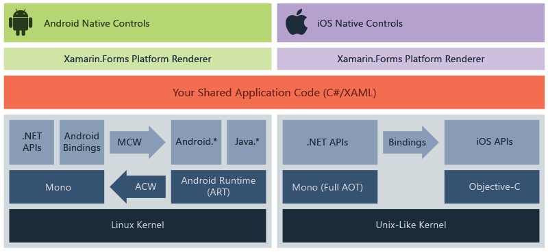

# Xamarin

## 目录

1. 简介
   - [系统需求](#系统需求)
   - 布局
     - [StackLayout](#StackLayout)
     - [Grid](#Grid)
     - [FlexLayout](#FlexLayout)
     - [RelativeLayout](#RelativeLayout)
   - 视图
     - [Label](#Label)
     - [Button](#Button)
     - [Entry](#Entry)
     - [Editor](#Editor)
     - [Image](#Image)
     - [ListView](#ListView)
   - 应用基础
     - [DisplayAlert](#DisplayAlert)
     - [生命周期](#生命周期)
2. [参考](#参考)

Xamarin.Forms 是一个跨平台的、基于原生控件的 UI 工具包，开发人员可以轻松的创建适用于 Android，iOS 以及 Windows Phone 的用户界面。

Xamarin的代码共享方案：

Xamarin 的工作原理：

## 系统需求

**iOS:**由于Apple限制iOS应用程式编译都需要透过Xcode，因此需要1台MAC的机器作为Build Host.

- Windows 7 或更新的作业系统版本
- Visual Studio 2010 / 2012
- OS X Lion 或更新的作业系统版本
- Xcode IDE 以及 iOS SDK

**Android:** 对于Android开发，则可以完全在Windows上进行。其系统需求如下:

- Windows 7 或更新的作业系统版本
- Java SDK
- Android SDK
- Xamarin.Android for Visual Studio

## StackLayout

堆栈式布局是一种非常常用的布局方式，可以极大地的简化跨平台用户界面的搭建。堆栈式布局的子元素会按照添加到容器中的顺序一个接一个被摆放，堆栈式布局有两个方向：竖直与水平方向。

在StackLayout中我们可以通过 HeightRequest 和 WidthRequest 指定子元素的高度和宽度。

## Grid

绝对布局类似于Windows Forms布局，需要指定每一个子元素的位置。

子元素添加到容器中的顺序会影响子元素的Z-Order。先添加的元素可能会被后面添加的元素遮住。

## FlexLayout

水平或垂直显示子元素。如果在单个行或列中容纳太多项，FlexLayout 还可以包装其子级，还可以更精细地控制其子元素的大小、方向和对齐方式。

## RelativeLayout

相对定位

## AbsoluteLayout

绝对定位

## Label

只读的文本展示控件

## Button

按钮

## Entry

单行的文本输入框

## Editor

多行的文本输入框

## Image

图片

## ListView

ListView是一个非常常见的控件，用于展现一组数据，每一个条目都会被包含在一个单元格内部。默认情况下ListView使用了一个 TextCell 作为模板来展现每一个条目数据。

## DisplayAlert

弹出窗口

## 生命周期

- 应用程序启动时调用 OnStart 方法。
- 应用程序转到后台时调用 OnSleep 方法。
- 应用程序从后台恢复时调用 OnResume 方法。
