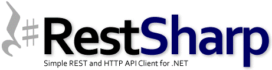
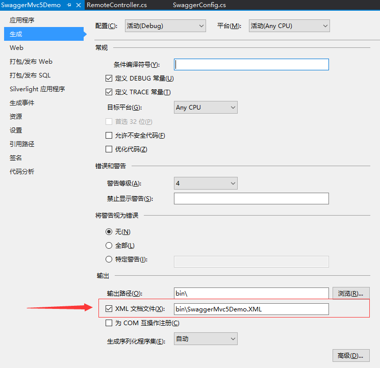

# WebApi

## 目录

1. [简介](#简介)
   - [第一个为示例](#第一个为示例)
2. [过滤器](#过滤器)
3. [WebClient&nbsp;vs&nbsp;HttpClient&nbsp;vs&nbsp;HttpWebRequest](#WebClient&nbsp;vs&nbsp;HttpClient&nbsp;vs&nbsp;HttpWebRequest)
4. [智能客户端](#智能客户端)
5. [Swagger](#Swagger)
   - [安装](#一、安装)
   - [配置](#二、配置)
   - [调用](#三、调用)

## 简介

- ASP.NET MVC 4定义了一种很出色的新功能，它独立于UI，但是能够方便地用来完成基于REST的通信。

  REST即表述性状态传递（英文：Representational State Transfer，简称REST）是Roy Fielding博士在2000年他的博士论文中提出来的一种软件架构风格。它是一种针对网络应用的设计和开发方式，可以降低开发的复杂性，提高系统的可伸缩性。

  目前在三种主流的Web服务实现方案中，因为REST模式的Web服务与复杂的SOAP和XML-RPC对比来讲明显的更加简洁，越来越多的web服务开始采用REST风格设计和实现。

  表述性状态转移是一组架构约束条件和原则。满足这些约束条件和原则的应用程序或设计就是RESTful。需要注意的是，REST是设计风格而不是标准。REST通常基于使用HTTP，URI和XML（标准通用标记语言下的一个子集）以及HTML（标准通用标记语言下的一个应用）这些现有的广泛流行的协议和标准。

  REST定义了一组体系架构原则，您可以根据这些原则设计以系统资源为中心的Web服务，包括使用不同语言编写的客户端如何通过HTTP处理和传输资源状态。如果考虑使用它的Web服务的数量，REST近年来已经成为最主要的Web服务设计模式。事实上，REST对Web的影响非常大，由于其使用相当方便，已经普遍地取代了基于SOAP和WSDL的接口设计。

  REST这个概念于2000年由Roy Fielding（HTTP规范的主要编写者之一）在就读加州大学欧文分校期间在学术论文"Architectural Styles and the Design of Network-based Software Architectures"首次提出。论文中对使用Web服务作为分布式计算平台的一系列软件体系结构原则进行了分析，其中提出的REST概念并没有获得太多关注。今天，REST的主要框架已经开始出现，但仍然在开发中。

  ASP.NET Web API是一种通信技术，可用在任何使用HTTP协议的客户端，但是它的基础仍是：路由和控制器，只是这里不需要视图。

### 第一个为示例
  
  Menu.cs

  ```C#
  using System.Runtime.Serialization;

  namespace WebApiSample.Models
  {
      [DataContract]
      public class Menu
      {
          [DataMember]
          public int Id { get; set; }
          [DataMember]
          public string Text { get; set; }
          [DataMember]
          public decimal Price { get; set; }
          [DataMember]
          public bool Active { get; set; }
          [DataMember]
          public int Order { get; set; }
          [DataMember]
          public MenuCard MenuCard { get; set; }
      }
  }
  ```

  MenuCard.cs

  ```C#
  using System.Collections.Generic;
  using System.Runtime.Serialization;

  namespace WebApiSample.Models
  {
      [DataContract]
      public class MenuCard
      {
          [DataMember]
          public int Id { get; set; }
          [DataMember]
          public string Name { get; set; }
          [DataMember]
          public bool Active { get; set; }
          [DataMember]
          public int Order { get; set; }
          [IgnoreDataMember]
          public ICollection<Menu> Menus { get; set; }
      }
  }
  ```

  示例使用了两个实体类型Menu和MenuCard。这两个类型都有简单的属性，并且彼此之间存在关联。Menu类型直接关联一个MenuCard。而MenuCard包含一个Menu对象的集合：

  上下文用MenuCardModel类型定义，使用Code-First时，只需要为上下文定义DbSet类型的属性：

  ```C#
  using System.Data.Entity;

  namespace WebApiSample.Models
  {
      public class MenuCardModel : DbContext
      {
          public DbSet<Menu> Menus { get; set; }
          public DbSet<MenuCard> MenuCards { get; set; }
      }
  }
  ```

  使用Entity Framework Code-First时，如果还不存在数据库，则会自动创建一个。这里，创建的数据库会用数据填充。通过创建一个派生自DropCreateDatabaseAlways的类可以实现这一点。从该基类派生时，每次启动应用程序都会创建数据库。这里还可以使用另外一个基类DropCreateDatabaseIfModelChanges。此时，只有模型发生变化（如属性改变）时，才会创建数据库。为填充数据，需要重写Seed方法。Seed方法接收MenuCardModel，新对象通过该参数添加到上下文中，然后调用SaveChanges把对象写入数据库。

  ```C#
  using System.Collections.Generic;
  using System.Data.Entity;

  namespace WebApiSample.Models
  {
      public class MenuContextInitializer : DropCreateDatabaseAlways<MenuCardModel> // : DropCreateDatabaseIfModelChanges<MenuCardModel>
      {
          protected override void Seed(MenuCardModel context)
          {
              var cards = new List<MenuCard>
              {
                  new MenuCard { Id = 1, Active = true, Name = "Soups", Order = 1 },
                  new MenuCard { Id=2, Active = true, Name = "Main", Order = 2 }
              };
              cards.ForEach(c => context.MenuCards.Add(c));
              new List<Menu>
              {
                  new Menu { Id=1, Active = true, Text = "Fritattensuppe", Order = 1, Price = 2.4M, MenuCard = cards[0] },
                  new Menu { Id=2, Active = true, Text = "Wiener Schnitzel", Order = 2, Price= 6.9M, MenuCard=cards[1] }
              }.ForEach(m => context.Menus.Add(m));
              base.Seed(context);
          }
      }
  }
  ```

  为使用上下文初始化器，必须调用Database类的SetInitializer方法来定义MenuContexInitializer。在全局应用程序类Global.asax.cs中编写下面代码用于在每次应用程序启动时设置上下文初始化器：

  ```C#
  protected void Application_Start()
  {
      Database.SetInitializer(new MenuContextInitializer());
      …
  }
  ```

  因为ASP.NET Web API基于ASP.NET MVC，所以对它来说路由也非常重要。不同于ASP.NET MVC中使用MapRoute方法定义路由，在ASP.NET Web API中，路由是使用MapHttpRoute方法定义的。路由以api开头，后跟控制器的名称，然后是可选参数id。这里没有动作名称，而在ASP.NET MVC路由中，动作名称是必须存在的。在这里，控制器中的方法被命名为Get、POST、Put和Delete，与HTTP请求方法一一对应。

  ```C#
  public static void RegisterRoutes(RouteCollection routes)
  {
      routes.IgnoreRoute("{resource}.axd/{*pathInfo}");
      routes.MapHttpRoute(
          name: "DefaultApi",
          routeTemplate: "api/{controller}/{id}",
          defaults: new { id = RouteParameter.Optional }
      );
      routes.MapRoute(
          name: "Default",
          url: "{controller}/{action}/{id}",
          defaults: new { controller = "Home", action = "Index", id = UrlParameter.Optional }
      );
  }
  ```

  Web API控制器派生自基类ApiController。与前面已经实现的控制器不同，API控制器的方法名是基于HTTP方法的。

  ```C#
  using System.Collections.Generic;
  using System.Data;
  using System.Linq;
  using System.Web.Http;
  using WebApiSample.Models;

  namespace WebApiSample.Controllers
  {
      public class MenusController : ApiController
      {
          private MenuCardModel data = new MenuCardModel();

          // GET /api/menus
          public IEnumerable<Menu> Get()
          {
              return data.Menus.Include("MenuCard").Where(m => m.Active).ToList();
          }

          // GET /api/menus/5
          public Menu Get(int id)
          {
              return data.Menus.Where(m => m.Id == id).Single();
          }

          // POST /api/menus
          public void Post(Menu m)
          {
              data.Menus.Add(m);
              data.SaveChanges();
          }

          // PUT /api/menus/5
          public void Put(int id, Menu m)
          {
              data.Menus.Attach(m);
              data.Entry(m).State = EntityState.Modified;
              data.SaveChanges();
          }

          // DELETE /api/menus/5
          public void Delete(int id)
          {
              var menu = data.Menus.Where(m => m.Id == id).Single();
              data.Menus.Remove(menu);
              data.SaveChanges();
          }

          protected override void Dispose(bool disposing)
          {
              if (disposing)
                  data.Dispose();

              base.Dispose(disposing);
          }
      }
  }
  ```

  使用jQuery的客户端应用程序示例：页面的HTML内容包含一个id为menu的空ul元素，在加载页面时由HTTP GET请求填充。最初，使用样式display:none隐藏了form元素，后面把它显示出来，以显示用户可以在哪里添加新菜单并用POST请求提交它们：

  ```html
  @{
      Layout = null;
  }
  <!DOCTYPE html>
  <html>
  <head>
    <meta name="viewport" content="width=device-width" />
    <title>Menus</title>
    <script src="@Url.Content("~/Scripts/jquery-1.6.2.js")" type="text/javascript"></script>
    <script src="@Url.Content("~/Scripts/jQuery.tmpl.js")" type="text/javascript"></script>
    <script>
        $(function () {
            $.getJSON(
              "http://localhost:15390/api/menus",
              function (data) {
                  $.each(data,
                    function (index, value) {
                        $("#menusTemplate").tmpl(value).appendTo("#menus");
                    }
                    );
                  $("#addMenu").show();
              });

            $("#addMenu").submit(function () {
                $.post(
                  "http://localhost:15390/api/menus",
                  $("#addMenu").serialize(),
                  function (value) {
                      $("#menusTemplate").tmpl(value).appendTo("#menus");
                  },
                  "json"
                  );
            });
        });
    </script>
    <script id="menusTemplate" type="text/html">
        <li>
            <h3> ${Text} </h3>
            <span>${Id}</span>
            <span>Price: ${Price}</span>
            <span>Menu card: ${MenuCard.Name}</span>
        </li>
    </script>
</head>
<body>
    <div>
        <ul id="menus"></ul>
        <form method="post" id="addMenu" style="display: none">
            <fieldset>
                <legend>Add New Menu</legend>
                <ol>
                    <li>
                        <label for="Text">Text</label>
                        <input type="text" name="Text" />
                    </li>
                    <li>
                        <label for="Price">Price</label>
                        <input type="text" name="Price" />
                    </li>
                </ol>
            </fieldset>
            <input type="submit" value="Add" />
        </form>
    </div>
  </body>
  </html>
  ```

## 过滤器

- 在默认的WebApi中，框架提供了三种Filter，他们的功能和运行条件如下表所示：

  Filter类型|实现的接口|描述
  -|-|-
  Authorization|IAuthorizationFilter|最先运行的Filter，被用作请求权限校验
  Action|IActionFilter|在Action运行的前、后运行
  Exception|IExceptionFilter|当异常发生的时候运行

  在使用MVC的时候，ActionFilter提供了一个Order属性，用户可以根据这个属性控制Filter的调用顺序，而Web API却不再支持该属性。Web API的Filter有自己的一套调用顺序规则。

  所有Filter根据注册位置的不同拥有三种作用域：Global、Controller、Action：

  1. 通过HttpConfiguration类实例下Filters.Add()方法注册的Filter（一般在App_Start\WebApiConfig.cs文件中的Register方法中设置）就属于Global作用域；
  2. 通过Controller上打的Attribute进行注册的Filter就属于Controller作用域；
  3. 通过Action上打的Attribute进行注册的Filter就属于Action作用域；

  他们遵循了以下规则：
  
  1. 在同一作用域下，AuthorizationFilter最先执行，之后执行ActionFilter
  2. 对于AuthorizationFilter和ActionFilter.OnActionExcuting来说，如果一个请求的生命周期中有多个Filter的话，执行顺序都是Global->Controller->Action；
  3. 对于ActionFilter，OnActionExecuting总是先于OnActionExecuted执行；
  4. 对于ExceptionFilter和ActionFilter.OnActionExcuted而言执行顺序为Action->Controller->Global；
  5. 对于所有Filter来说，如果阻止了请求：即对Response进行了赋值，则后续的Filter不再执行。

## WebClient&nbsp;vs&nbsp;HttpClient&nbsp;vs&nbsp;HttpWebRequest

- Just when I was starting to get used to call WebServices through WSDL – like I showed here and here – I had to call a RESTful API. If you don’t know what I’m talking about you’re like me a week ago. Let’s just say that:

  - a WSDL API uses SOAP to exchange XML-encoded data
  - a REST API uses HTTP to exchange JSON-encoded data

  That's a whole new paradigm. Instead of GetObject() and SetObject()methods you have a single url api/object that may receive either an HTTP GETrequest or an HTTP POST request.

  The .NET framework offers you three different classes to consume REST APIs: HttpWebRequest, WebClient, HttpClient. To worsen your analysis paralysisthe open-source community created yet another library called RestSharp. Fear not, I’ll ease your choice.

  In the beginning there was… HttpWebRequest

  This is the standard class that the .NET creators originally developed to consume HTTP requests. Using HttpWebRequest gives you control over every aspect of the request/response object, like timeouts, cookies, headers, protocols. Another great thing is that HttpWebRequest class does not block the user interface thread. For instance, while you’re downloading a big file from a sluggish API server, your application’s UI will remain responsive.

  However, with great power comes great complexity. In order to make a simple GET you need at least five lines of code; we’ll see WebClient does it in two.

  ```C#
  HttpWebRequest http = (HttpWebRequest)WebRequest.Create("http://example.com");
  WebResponse response = http.GetResponse();

  MemoryStream stream = response.GetResponseStream();
  StreamReader sr = new StreamReader(stream);
  string content = sr.ReadToEnd();
  ```

  The number of ways you can make a mistake with HttpWebRequest is truly astounding. Only use HttpWebRequest if you require the additional low-level control that it offers.

  WebClient. Simple.

  WebClient is a higher-level abstraction built on top of HttpWebRequest to simplify the most common tasks. Using WebClient is potentially slower (on the order of a few milliseconds) than using HttpWebRequest directly. But that “inefficiency” comes with huge benefits: it requires less code, is easier to use, and you’re less likely to make a mistake when using it. That same request example is now as simple as:

  ```C#
  var client = new WebClient();
  var text = client.DownloadString("http://example.com/page.html");
  ```

  Don’t worry, you can still specify timeouts, just make sure you follow this workaround.

  HttpClient, the best of both worlds

  

  HttpClient provides powerful functionality with better syntax support for newer threading features, e.g. it supports the await keyword. It also enables threaded downloads of files with better compiler checking and code validation. For a complete listing of the advantages and features of this class make sure you read this SO answer.

  The only downfall is that it requires .NET Framework 4.5, which many older or legacy machines might not have.

  Wait, a new contestant has appeared!

  

  Since HttpClient is only available for the .NET 4.5 platform the community developed an alternative. Today, RestSharp is one of the only options for a portable, multi-platform, unencumbered, fully open-source HTTP client that you can use in all of your applications.

  It combines the control of HttpWebRequest with the simplicity of WebClient.

  Conclusion

  - HttpWebRequest for control
  - WebClient for simplicity and brevity
  - RestSharp for both on non-.NET 4.5 environments
  - HttpClient for both + async features on .NET 4.5 environments

  [参考](http://www.diogonunes.com/blog/)

## 智能客户端

- 在客户端/服务器进化的最初，就只有主机和哑终端。这里把终端称为哑的，是因为这种终端的所有工作就是让用户输入数据，然后将数据提交给主机进行处理。在那时，这样的功能就足够了。

  后来PC(个人电脑)的诞生使模型发生了一些移位。因为如果将很多台个人电脑用网络连接起来，并在客户端运行称为"胖"客户端的软件，那么处理负载就可以分布在各台计算机上，从来节省了主机上宝贵的时间(在过去，主机上的处理器周期确实是很贵的头很明显模型也因此发生了移位。在使用这种具有丰富GUI(图形用户界面)的软件时，用户确实能获得很好的体验。

  在PC和胖客户端之后出现了基于浏览器的模型。其中，这种模型允许单点分发，和软件的自动更新。这种模型取代了富客户端，并使PC再次成为伪哑终端。哑终端这个词在这一节的第一句话中就已经出现了。是的，计算技术在进化中完成了一整套循环，又回到了主机和哑终端。区别是没有了IBM那些极其昂贵的设备，取而代之的是PC服务器和客户端设备。

  在计算进化的过程中，从最早的架构开始，渐渐演化到了另一种架构，然后慢慢又回到了起点，这时人们肯定会奇怪，为什么最初会发生变化呢？既然最初认为这种架构是不合适的，为什么进化一轮之后又会回到原点呢？接下来的内容将会介绍，下一次计算进化将如何提取富客户端模型和基于浏览器模型的精华，并将它们组合成一个模型：智能客户端。

  智能客户端这种应用程序充分利用了富客户端和Web客户端应用程序的一些最好的特性。正如Microsoft的定义一样，下面四个属性描绘了智能客户端的特征。

  

  1. 高保真的用户体验：智能客户端利用最新的图形技术为用户带来高保真的体验。另外，智能客户端能够根据表示上下文，针对每个用户进行个性化。
  2. 智能连接：智能客户端能够在线工作，也能够离线工作。这里利用了本地数据的缓存和处理。另外，智能客户端是分布式应用程序，能够利用Web服务。
  3. 信息中心：在智能客户端中，数据访问是松散藕合的，很容易进行检索、缓存和提交。
  4. 为操作而设计的：智能客户端能够动态使用本地CPU的处理能力，并且是安全的、可集中部署的以及可版本控制的。

  如何判断究竟建立哪一种类型的应用程序呢，是富客户端还是Web应用程序呢？这不应该是一个极端的决定。一个智能客户端应用程序应该能够巧妙地利用这两种编程模式的优点。在决定智能客户端应该具备哪些特性的时候，可以参考下面这个列表，这里列出了最常用的特性：
  
  - 用集中服务器部署并更新应用程序。
  - 利用Web服务提供丰富的功能。
  - 方便的时候，能够利用本地设备的处理能力。
  - 具有在线和离线功能。这样即使与服务器的连接不可用，也能保证用户仍然可以进行操作。

  当客户在使用应用程序遇到困难时，您经常会问的问题应该是“应用程序是什么版本的？”(当然“电源打开了么？”除外)。这个问题很有必要，能够判断客户是否拥有软件的最新版本。如果不是，那就不用浪费时间了，因为客户的问题很可能已经在应用程序的最新版本中解决了。
  
  要避免这个问题，可以将应用程序部署到一个集中服务器上，然后通知所有人都从这个服务器来更新应用程序。同事往往会把档案柜CD中三年前的软件发给别人，之前的方法就避免了这种情况。不过，这个方法只解决了一部分问题。因为客户知道软件有更新并不代表客户就愿意去更新软件。这一类客户通常只接受一种情况：强制更新。但首先如何才能知道用户在使用旧版本的软件呢？如何强制要求客户安装更新呢？办法是使用自更新的应用程序。有很多方法可以实现这个目标，接下来的内容将描述如何使用.NET来实现。
  
  从一个Web服务器部署应用程序是很简单的，同时又具有很多的优点，其中一些优点如下:
  
  - 确保了客户总是能够使用最新的版本:当客户不愿意手动更新应用程序时，这样做可以避免问题。因为客户没有选择。
  - 在需要程序集或引用程序集时才下载:这表示只有当客户引用程序集时，并且只有当本地版本过期时，才会下载该程序集。
  - 如果本地的程序集是最新的版本，那么就使用本地程序集:这样，就不会由于重复下载同一个程序集而造成不必要的网络负担。

  从Web服务器部署应用程序的方法有三种：使用基于URL的可执行文件、使用Assembly.LoadFrom方法或创建自定义的自更新应用程序。
  
  使用基于URL的可执行文件很简单。基本上，所有要做的就是在Web服务器上创建一个虚拟目录，并将所有的程序集放到目录中。然后就可以通过Web链接来部署应用程序，如`http://companysite/myapplication.exe`。当用户启动应用程序时，只要没有取消指令，.NET都会自动搜索每一个所引用的程序集的指定位置。
  
  在两种情况下，使用System.Reflection中的Assembly.LoadFrom方法会很有用。首先是在需要加载一个程序集时，如果该程序集所在的物理位置并非.NET程序集的解析路径。另一种情况是创建一个占位应用程序，该应用程序的惟一用途就是加载应用程序的实际功能。这种占位应用程序往往只包含很少的代码，用来加载并启动应用程序的主方法。下面的程序清单中显示了一个典型的占位应用程序。这类占位应用程序经常也称为引导程序(loader)或前端引导程序(front-end loader)。
  
  创建一个自更新的自定义应用程序则是满足要求的最佳方案，不过也有一定难度。在创建一个自定义解决方案时，首先要做到三个重点:在哪里检查更新，何时检查更新以及如何检查更新？这三个问题的答案将会极大地影响自定义解决方案的实现方式。
  
  判断在哪里检查更新，这个问题应该不难回答。代码需要判断是否应该检查网络的某个位置，或内部网以及互联网的某个位置。如果需要检查网络的某个位置，那么可以使用简单的文件操作来检查必要的更新。不过，如果需要检查的是内部网或互联网，那么就需要用到HTTP协议或Web服务一类的技术。
  
  判断何时检查更新，这个问题看起来很简单，但实际上需要替客户作出假设。举个例子，在杀毒软件中，可能会每五分钟检查一次更新，也可能是每个小时或者每天。对于其他的应用程序，则可能是每天、每周检查更新，或每次启动程序时检查。有些用户并不希望应用程序替他们作决定，对他们来说，检查更新应该是一个手动的过程。他们会在方便的时候通知应用程序检查更新。
  
  检查更新的任务可以用很多种方法来完成。最直接的方法是检查服务器，然后直接将服务器中的程序集版本与应用程序当前使用的版本相比较。
  
  除此之外，还可以使用清单的方法。在这种方法中，服务器上会有一个程序集清单，包含有版本号和下载位置。软件可以从这个地方下载清单，然后检查本地机器中的程序集是否是最新的。相比直接比较的方法，这个方法具有一个优点，即当要求更新一个新增的程序集时，该程序集也会被包含在更新中。例如：假设应用程序启动时加载两个程序集，并且检查服务器上的更新，可能会发现其中一个程序集已经过期，然后就会下载新的版本。但是，由于应用程序中并没有第三个程序集的信息，就无法检查版本，因而不会下载新增的文件。
  
  作为第三个选择，还可以使用Web服务。这种方法通过Web服务来获取一个清单。那么，这里所遵循的规则与之前的清单下载方法中是一样的。但是相比之前的两个方法，这种方法具有一个优点，即可以为每个用户定制一份清单。换句话说，如果现在有两类用户，而更新是针对其中一类用户的，那么新的清单可以只发送给那一类用户。而当另一类用户登录时，他们不会收到更新清单，因此也就不会更新应用程序。对于Beta版本的应用程序，这样做就比较好。例如，如果希望取消某个用户对应用程序进行测试，那么就可以拒绝向其发送更新清单，从而抑制了该用户参与这个应用程序的测试。
  
  在确定了需要更新的文件之后，需要思考如何才能更好地完成这项任务。在更新一个应用程序时，必须做到两点：必须进行更新文件的下载，而如果下载失败，应用程序不能滞留在无法使用的状态。下载文件可能会遇到一些困难：下载服务器可能会出现故障；互联网连接可能会中断；可能会断电了也可能是用户会终止下载进程。如果发生了这种情况，那么应用程序必须仍然是可用的，否则用户会很不满意。出于这个原因，下载不能妨碍应用程序的运行，一直到更新过程开始为止。
  
  之前讨论的意思是，只有当所有的文件都下载完成并验证可靠之后，才能开始更新过程。要实现这个目的，可以将组件下载设计为一个单独的服务，就像Windows XP更新服务(BITS)那样。在本例中，可以先下载清单，然后再下载每一个程序集。每下载完一个程序集，就核对这一项表示完成。一旦出现故障，例如服务器故障、停电或用户终止了服务，那么当服务重新启动的时候，可以从最后下载成功的那一项开始恢复。
  
  那么，将系统更新为新的版本就要求先下载所有必需的文件，费劲讨论完这个问题之后，又出现了另外一些问题。首先，如果正在运行应用程序(这里假定应用程序正在运行，否则就无法找到更新文件)，那么如何更新正在使用中的文件呢?而如果终止应用程序，那么这些文件是不在使用中了，但这时更新文件进程也被终止了。如果不终止应用程序，那就没办法更新文件。
  
  这里有两种解决方案。第一种办法是，开启一个单独的进程来更新应用程序，并终止现有的应用程序。不过，在这个方法中，如果应用程序需要更新，那么就要知道具体如何更新应用程序。另一种办法是创建一个占位应用程序，用来启动实际使用的应用程序。这样就可以下载新的文件并保存在某个可选的位置，例如占位文件夹。通过这个办法，不但可以建立应用程序的新版本，还能够保留原来的版本，用于应用程序损坏的情况。接着只需让占位应用程序指向新的可执行文件就行了。
  
  智能客户端的另一个要点是要求能够运行在分布式环境中。这样使智能客户端可以将一些处理过程转移给服务器。实现这个要求的其中一种方法就是使用Web服务。Web服务这种技术可以使用平台无关的协议来分布一个应用程序。
  
  在一般的Web应用程序中，所有的工作都是在服务器端进行的。这样做的优点是，只要创建一台拥有马力足够的怪兽级服务器(也可以是服务器农场)，就可以完成所有的任务。而这里的问题正是所有的工作都要在服务器中完成。在服务器上完成所有的处理有优点也有缺点，要根据情况分析。最好能够决定什么时候进行工作，在哪里进行工作，这样应用程序就具有很大的灵活性。
  
  例如，假设现在要对一个字符串作一些特殊处理。那么就要先获得文本，发送给服务器，等待服务器返回修改后的文本。从用户的角度来说，这项任务原本很快就应该完成的，但现在却要等待服务器的响应。从响应速度的角度来说，把这类简单的任务放在本地执行能够让用户具有更好的体验。而且在本地执行这些任务还能利用本地API 和应用程序。例如，如果想使用服务器上的GDI+库，然后在本地呈现，对不起，不能这样做。
  
  虽然基于Web的应用程序可以使用客户端脚本和ActiveX控件在本地进行一些任务，但这些都是有限制的。例如，脚本应用程序无法读写用户的本地磁盘。另外，客户端脚本也无法与本地安装的应用程序交互，如Microsoft Word 或Excel。还有，用户出于安全防范，能够禁止客户端脚本，这样就彻底断开了应用程序。
  
  智能客户端还有另外一个优点：可以离线工作。有没有试过离线操作Web应用程序呢？除非在本地安装了Web服务程序及其所有的功能，否则Web应用程序是很难离线工作的。
  
  对很多专业来说，都要求系统能够离线工作。例如在家庭护理社工作的护士，这些护士的工作是到病人的家中进行护理。在到了病人的家里后，总不至于要先问病人借电话线，然后才能访问病人的病历吧。要不就是在房间里，把手提电话接到电脑上然后试着连接互联网，那么如果手提电话没有信号呢？完成这项任务的可靠方法是创建一个应用程序，能够连接到服务器，下载信息，然后存储在本地。这样稍后没有连接到服务器时，也能打开应用程序访问这些信息。

## Swagger

[开源地址](https://github.com/domaindrivendev/Swashbuckle)

Swagger 是一个规范和完整的框架，用于生成、描述、调用和可视化 RESTful 风格的 Web 服务。总体目标是使客户端和文件系统作为服务器以同样的速度来更新。文件的方法，参数和模型紧密集成到服务器端的代码，允许API来始终保持同步。Swagger 让部署管理和使用功能强大的API从未如此简单。

Swagger 可以干什么？

1. 接口，服务可视化，非常清晰，好用
2. 做接口测试，方便测试人员使用

### 一、安装

使用以下方法来添加 Swashbuckle：

- 从“程序包管理器控制台”窗口：`Install-Package Swashbuckle -Version 5.6.0`
- 从“管理 NuGet 程序包”对话框中：右键单击“解决方案资源管理器” > “管理 NuGet 包”中的项目，将“包源”设置为 "nuget.org"。在搜索框中输入 "Swashbuckle"，从“浏览”选项卡中选择 "Swashbuckle" 包，然后单击“安装”

### 二、配置

1. 项目属性->勾选生成xml文档文件
   
2. 添加导航链接
   在_Layout.cshtml文件中添加代码
   `<li>@Html.ActionLink("Swagger Help", "", "Swagger", new { area = "" }, null)</li>`
3. 修改SwaggerConfig.cs文件  
   安装完成后，在文件夹App_Start自动生成一个配置文件 SwaggerConfig。这里可以做多版本控制，定义扩展功能，自定义显示 ui 的样式脚本，可以配置过滤、权限等。  
   例如：  
   （1）为接口添加xml注释

   ```C#
   public class SwaggerConfig
   {
      public static void Register()
      {
          var thisAssembly = typeof(SwaggerConfig).Assembly;

          GlobalConfiguration.Configuration.EnableSwagger(c =>
          {
             // ...
             c.IncludeXmlComments(GetXmlCommentsPath());
             // ...
          });
      }

      private static string GetXmlCommentsPath()
      {
          return string.Format("{0}/bin/SwaggerMvc5Demo.XML", System.AppDomain.CurrentDomain.BaseDirectory);
      }
   }
   ```

   （2）使用特性 [Obsolete]  
   在config中 开启 `c.IgnoreObsoleteProperties();`

### 三、调用

1. 直接调用
2. AutoRest  
   [AutoRest](https://github.com/Azure/AutoRest), 简单来说，就是一个EXE工具，可以根据Swagger的结构生成服务的客户端，这个客户端可以让你像调用本地方法一样调用服务，方法内部包装了Http请求。
   [详细教程](https://www.cnblogs.com/Leo_wl/p/5982882.html)
3. 下载[NSwagStudio](https://github.com/RSuter/NSwag)  
   可自动生成ts、c# client 、c# web api controler三种类型的调用客户端

扩展：[ABP集成swagger](http://www.cnblogs.com/wer-ltm/p/5776024.html)
