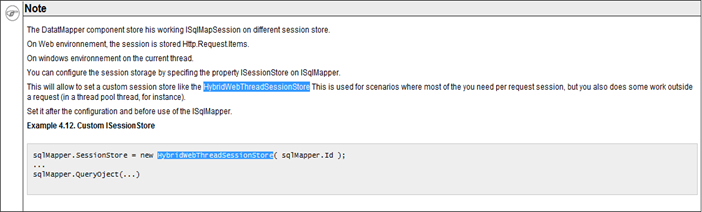

# ORM框架

## 目录

1. 简介
   - [什么是ORM](#什么是ORM)
   - [为什么用ORM](#为什么用ORM)
   - [三个核心原则](#三个核心原则)
   - [优/缺点](#优/缺点)
2. 主流ORM框架
   - [SqlSugar](#SqlSugar)
   - [Dos.ORM](#Dos.ORM)
   - [Chloe](#Chloe)
   - [StackExchange/Dapper](#StackExchange/Dapper)
   - [EntityFramework](#EntityFramework)
   - [NHibernate](#NHibernate)
   - [ServiceStack/ServiceStack.OrmLite](#ServiceStack/ServiceStack.OrmLite)
   - [linq2db](#linq2db)
   - [Massive](#Massive)
   - [PetaPoco](#PetaPoco)
   - [ibatis.net](#ibatis.net)

## 什么是ORM

ORM(Object-relational mapping)，中文翻译为对象关系映射，是一种为了解决面向对象与关系数据库存在的互不匹配的现象的技术。简单的说，ORM是通过使用描述对象和数据库之间映射的元数据，将程序中的对象自动持久化到关系数据库中。

## 为什么用ORM

在程序开发中，数据库保存的表，字段与程序中的实体类之间是没有关联的，在实现持久化时就比较不方便。那么，到底如何实现持久化呢？一种简单的方案是采用硬编码方式，为每一种可能的数据库访问操作提供单独的方法。这种方案存在以下不足：

1. 持久化层缺乏弹性。一旦出现业务需求的变更，就必须修改持久化层的接口
2. 持久化层同时与域模型与关系数据库模型绑定，不管域模型还是关系数据库模型发生变化，毒药修改持久化曾的相关程序代码，增加了软件的维护难度

ORM提供了实现持久化层的另一种模式，它采用映射元数据来描述对象关系的映射，使得ORM中间件能在任何一个应用的业务逻辑层和数据库层之间充当桥梁

## 三个核心原则

1. 简单：以最基本的形式建模数据
2. 传达性：数据库结构被任何人都能理解的语言文档化
3. 精确性：基于数据模型创建正确标准化了的结构

以C#编程语言为例，在传统的数据读取操作中，我们以Ado.net的方式对数据库进行CRUD操作，使用的基本都是SQL硬编码，比如有以下数据库查询操作：

```C#
String sql = "SELECT ... FROM persons WHERE id = 10";
DbCommand cmd = new DbCommand(connection, sql);
Result res = cmd.Execute();
String name = res[0]["FIRST_NAME"];
```

使用了ORM映射的C#实现的伪代码：

```C#
Person p = repository.GetPerson(10);
String name = p.getFirstName();
```

上面的示例代码表示我们可以从数据仓库repository中获取到一个实体对象，当然数据仓库中可能包含其他的方法，你也可以定义自己的ORM实现，比如：

```C#
Person p = Person.Get(10);
```

通常，在处理ORM映射和数据仓库时会暴露一些过滤或者查询方法，允许客户端对数据集进行进一步的筛选等操作，比如代码演示从数据库中查询ID=10的用户：

```C#
Person p = Person.Get(Person.Properties.Id == 10);
```

## 优/缺点

优点：

- 与传统的数据库访问技术相比，ORM有以下优点：
- 开发效率更高
- 数据访问更抽象、轻便
- 支持面向对象封装

缺点：

- 降低程序的执行效率
- 思维固定化
- 从系统结构上来看，采用ORM的系统一般都是多层系统，系统的层次多了，效率就会降低。ORM是一种完全的面向对象的做法，而面向对象的做法也会对性能产生一定的影响。

在我们开发系统时，一般都有性能问题。性能问题主要产生在算法不正确和与数据库不正确的使用上。ORM所生成的代码一般不太可能写出很高效的算法，在数据库应用上更有可能会被误用，主要体现在对持久对象的提取和和数据的加工处理上，如果用上了ORM，程序员很有可能将全部的数据提取到内存对象中，然后再进行过滤和加工处理，这样就容易产生性能问题。

**总结：**

作为一名编程人员，在ORM使用的观念上会有不同，具体取舍需根据具体的项目和场景

## SqlSugar
  
国内。可以运行在 `.NET 4.+` & `.NET CORE` 的高性能、轻量级 ORM 框架。开源、免费

## Dos.ORM

国内。Dos.ORM（原Hxj.Data）于2009年发布，2015年正式开源。在开发过程中参考了NBear与MySoft，吸取了他们的一些精华，加入新思想，同时参考EF的Lambda语法进行大量扩展。该组件已在数百个成熟项目中应用。开源、免费，使用方便，按照sql书写习惯编写C#.NET代码。功能强大。高性能，接近手写Sql。体积小（不到150kb，仅一个dll）。完美支持Sql Server(2000至最新版),MySql,Oracle,Access,Sqlite等数据库。支持大量Lambda表达式写法，国产ORM支持度最高，开源中国ORM排行前三。不需要像NHibernate的XML配置，不需要像EF的各种数据库连接驱动。遵循MIT开源协议，除不允许改名，其它随意定制修改

## Chloe

国内

## StackExchange/Dapper

国外

## EntityFramework

国外。微软以 `ADO.NET` 为基础所发展出来的对象关系对应 (O/R Mapping) 解决方案。

## NHibernate

国外。一个面向.NET环境的对象/关系数据库映射工具。开源、免费。批量写入，批量读/多重查询特性（我理解是在说Future？），批量的集合加载。带有lazy="extra"的集合，集合过滤器和分页集合。二级缓存（实际上NH的二级缓存貌似也很简单？）。集成和扩展性。代码自动生成，减少代码和sql的开发量，使开发人员摆脱开sql，ado.net和事务，缓存等底层

## ServiceStack/ServiceStack.OrmLite

国外。ServiceStack.OrmLite的目标是提供一种方便，无干扰，无配置的RDBMS无关类型的封装，与SQL保持高度的契合，展现直观的API，可以生成可预测的SQL。ServiceStack.OrmLite的宗旨：Fast, Simple, Typed ORM for .NET。开源、收费（免费版只支持单个库10张表）

## linq2db

国外。一款快速、轻量、类型安全的POCO对象和数据库映射的ORM框架。从架构上来说，linq2db像是对Dapper、PetaPoco这些微ORM的进一步封装，但它不像Entity Framework那样笨重。它没有实现状态跟踪，需要自己处理实体的状态更改等。

## Massive

国外。小巧，动态的微ORM框架。

## PetaPoco

国外。轻量的POCO对象和数据库映射的ORM框架。开源、免费

## ibatis.net

官方文档：`http://ibatis.apache.org/docs/`。总结：

1. parameterClass="hashtable" resultClass="hashtable" 可以灵活地应对不确定属性的情况。

   parameterClass中hashtable的key对应于占位符中的名称；  
   resultClass中hashtable的key对应于搜索出的列名，不过不能映射日期类型。
   <b style="color:green">解决方法</b>：使用数据库函数将日期类型转换为字符串

2. 占位符##会自动为字符串补上引号，$$不会。

   ##会自动转义特殊字符（如单引号'）；`$$`功能强大，可以替换掉整条SQL语句，为灵活拼接SQL语句提供了很大便利。

3. ibatis的对象关系映射文件可以有多个，但是不可以有相同的id，因为映射文件最终会统一处理。

4. ibatis中多线程问题

   

   [按实体insert数据，批量insert，同时解决ON DUPLICATE KEY](http://blog.csdn.net/hddd2009/article/details/50152081)

5. insert 单条model（entity）动态xml如下：

   ```xml
   <!-- insert数据SQL -->  
   <insert id="cartype-insert"parameterClass="cartype">  
     insert into cartype (CarTypeId, CarTypeName) values (#CarTypeId#, #CarTypeName#);  
   </insert>  
   ```

   需要注意的是

   1. `<insert id="cartype-insert" parameterClass="cartype">`中cartype为实体对象名称
   2. values(#CarTypeId#,#CarTypeName#); 中的"#"之间的Key需要与实体（本例为cartype）的属性名称一致（大小写一致），也就是说如果insert时是全字段insert，那values中就是cartype类的所有属性名

   cartype类的定义如下：

   ```C#
   public partial class cartype  
   {  
       public int? CarTypeId { get; set; }  
       public string CarTypeName { get; set; }
   }
   ```

6. insert 多条即`List<cartype>`

   ```xml
   <!-- insertList<cartype>-->
   <insert id="cartype-insert_list" parameterClass="ArrayList">  
     insert into cartype(CarTypeId,CarTypeName) values  
     <iterate conjunction=",">  
       ( #[].CarTypeId#, #[].CarTypeName# )  
     </iterate>  
   </insert>  
   ```

   需要注意以下几点：

   1. `<insert id="cartype-insert_list" parameterClass="ArrayList">`这一行中的parameterClass为ArrayList
   2. `#[].CarTypeId#中"[]"`表示的是批量插入时每次循环时的对象，就像foreach(var item in listCartype)中的item，CarTypeId是cartype对象的一个属性名称

7. 批量插入数据时ON DUPLICATE KEY问题解决

   cartype表中 synid为主键，如果有主键冲突则更新Update_time的值

   ```xml
   <insert id="cartype-insert_upload_list" parameterClass="ArrayList">  
     insert intocartype(CarTypeId, CarTypeName, Update_time,) values  
     <iterate conjunction=",">  
       (#[].CarTypeId#, #[].CarTypeName#, #[].Update_time# )  
     </iterate>  
     ON DUPLICATE KEY UPDATE update_time=values(Update_time)  
   </insert>  
   ```

   注意：执行批量insert时 要使用values函数，才可以解决主键冲突问题

   例如：cartype表中有两条数据

   ```sql
   synid=1,updatetime='2015-12-02 01:00:00'
   synid=2,updatetime='2015-12-02 02:00:00'
   ```

   执行如下sql时：

   ```sql
   insert into cartype(SynID,Update_time) values
     (3,'2015-12-02 03:00:00'),
     (2,'2015-12-02 22:22:22')
   ON DUPLICATEKEY UPDATE
   update_time=values(Update_time)
   ```

   执行结束后数据库里有三条数据

   ```sql
   synid=1,updatetime='2015-12-02 01:00:00'
   synid=2,updatetime='2015-12-02 22:22:22'
   synid=3,updatetime='2015-12-02 03:00:00'
   ```

   synid=3的数据直接insert了，而synid=2的数据因为数据库中已经有synid=2的数据，所有没有执行insert而是更新为：updatetime='2015-12-02 22:22:22'

8. C#后台代码调用方法主要代码如下：

   ```C#
   MySqlDao<List<cartype>> md =new MySqlDao<List<cartype>>();  
   md.ExecuteInsert(cartype, "cartype-insert_list");  

   public void ExecuteInsert(T obj, string stmtId)  
   {
       if (obj == null)  
       {  
           throw new ArgumentNullException("obj");  
       }  
       Instance().Insert(stmtId, obj);  
   }
   ```
