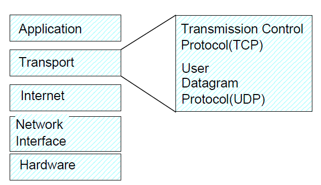
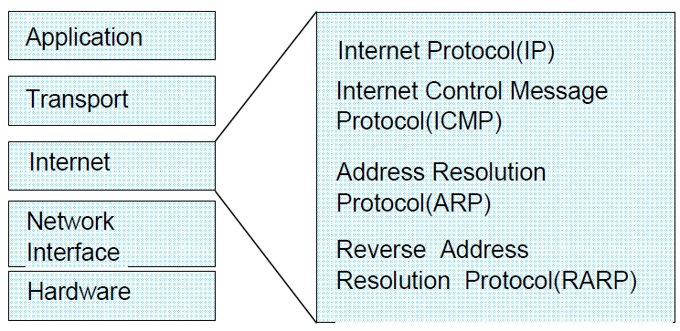
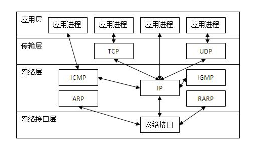
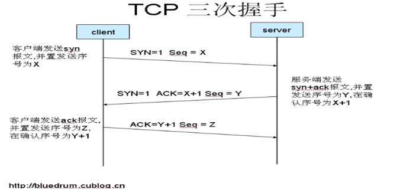

# CSharp

## GDI+

(Graphics Device Interface)在`.Net Framework`中用于提供二维图形图像处理功能。

### Graphics类

- 封装一个GDI+绘图图面，似画布。
- 绘制图形包括两步：

  - 创建Graphics对象
  - 使用Graphics对象绘制线条和形状、呈现文本或显示与操作图像

### Pen类

- 画笔类，主要用于绘制线条，或者用线条组合成其它几何形状。

### font类

- 字体类，用于描绘文本。

### Bitmap类

- 位图类，加载和显示已有的光栅图像。

### MetaFile类

- 加载和显示矢量图像。

## 数据结构

### 集合

#### IEqualityComparer使用

```C#
/// <summary>
/// 示例
/// </summary>
public class AssetComparer : IEqualityComparer<Asset>
{
    public bool Equals(Asset x, Asset y)
    {
        if (x != null && y != null)
        {
            return x.Id == y.Id;
        }
        return false;
    }

    public int GetHashCode(Asset obj)
    {
        return base.GetHashCode();
    }
}
```

<b style="color:red">注意:</b> 这里的方法中会先执行GetHashCode方法，如果GetHashCode方法返回的是不相同的值，那就直接忽略Equals方法。

## 并发编程

### 实现异步3种方式

#### 异步模式

实现步骤：

1. 实现异步模式定义BeginXXX方法和EndXXX方法。
2. Beginxxx异步方法（这个方法是使用线程池中的一个线程来进行异步调用的）接受同步方法的所有输入参数，EndXXX异步方法使用同步方法的所有输出参数，并按照同步方法的返回类型来返回结果。
3. BeginXXX方法还定义一个AsyncCallback参数，用于接受在异步方法执行完成之后被调用的委托。
BeginXXX方法返回IAsyncResult，用于验证调用是否已经完成，并且一直等待，直到方法的执行结束。

总结：

异步模式的优势是使用委托功能就能实现异步编程。不用改变程序的行为，也不会阻塞界面的操作。但是，使用异步模式的过程是非常复杂的。幸运的是，.NET 2.0推出了基于事件的异步模式。

另外，winform中转换回主线程：this.Invoke(); WPF中转换回主线程：this.Dispatcher.Invoke();

示例：

```C#
/// <summary>
/// 异步模式
/// </summary>
/// <param name="start"></param>
/// <param name="num"></param>
/// <returns></returns>
public void SumAsyncPattern(int start, int num)
{
    Func<int> BeginGetNum = () =>
    {
        int result = start;
        // 耗时操作
        for (int i = 0; i < 9; i++)
        {
            Thread.Sleep(1000);
            result += num;
        }
        return result;
    };

    Action<int> EndGetNum = result => Console.WriteLine(result);

    /**
     * <summary>
     * BeginInvoke的参数说明：
     * </summary>
     * <param name="">AsyncCallback类型的委托，需要IAsyncResult作为参数，当异步方法执行完成后，将调用这个委托引用的方法</param>
     * <see cref="AsyncCallback"/>
     * <see cref="IAsyncResult"/>
     */
    BeginGetNum.BeginInvoke(_ =>
    {
        int result = BeginGetNum.EndInvoke(_);
        EndGetNum.Invoke(result);
    }, null);
}
```

#### 基于事件的异步模式

实现：

定义一个带有"Async"后缀的方法作为同步方法的异步变体方法

优势在于易于使用。但是，如果在自定义类中实现这个模式，就没有那么简单了。

使用 BackgroundWorker 类来实现在自定义类中异步调用同步方法，它实现了基于事件的异步模式。

步骤：

异步方法完成时，不是定义被调用的委托，而是定义事件。当异步方法完成后，会直接调用事件。

赋值给事件处理程序的方法，在Lambda表达式中实现（在表达式中可以直接访问UI元素，因为是从线程调用事件处理程序，而线程拥有同步上下文。）

示例：

```C#
public void SumAsyncEventPattern(int start, int num)
{
    BackgroundWorker bgWorker = new BackgroundWorker();

    bgWorker.RunWorkerCompleted += (sender, e) =>
    {
         Console.WriteLine(e.Result);
    };

    bgWorker.DoWork += (sender, e) =>
    {
        int result = start;
        // 耗时操作
        for (int i = 0; i < 9; i++)
        {
            Thread.Sleep(1000);
            result += num;
        }
        e.Result = result;
    };

    bgWorker.RunWorkerAsync();
}
```

#### 基于任务的异步模式

实现：

.NET 4.5中，提供了基于任务的异步模式(TAP)，该模式定义一个带有"TaskAsync"后缀的方法，并返回一个Task（泛型类）类型。

但是，方法返回的结果不需要声明为Task<>，只需要声明为泛型类型的变量，并使用await关键字。

await关键字不会阻塞完成其它任务的线程。使用await关键字需要有用async修饰符声明的方法。

async修饰符只能用于返回Task或void的方法，不能用于Main方法。await只能用于返回Task方法。

自定义的程序块可以使用Task.Run方法创建后台任务执行。

Task类的ContinueWith方法定义了任务完成后将要调用的代码。

编译器通过把await关键字后所有代码放进这个方法中来转换此关键字。

如果需要异步调用的部分是单行代码，就不需要加Task.Run();

示例：

```C#
public async void SumTaskBasedAsyncPattern(int start, int num)
{
    int result = start;
    await Task.Run(() =>
    {
        for (int i = 0; i < 9; i++)
        {
            Thread.Sleep(1000);
            result += num;
        }
    });
    Console.WriteLine(result);
}
```

### 线程

在 .NET4 之前，必须直接使用 Thread 类和 ThreadPool 类编写线程。

现在 .NET 对这两个类做了抽象，允许使用 Parallel 类和 Task 类。

#### Thread

实现步骤：

可以使用 Thread 对象来创建线程的一个新实例，然后利用这个实例运行进程的部分代码。不过在运行一个线程之前，需要先得到 Thread 的实例。

获得线程实例的方法有两种。一种是创建线程类的新实例，并传入 ThreadStart 委托。

```C#
Thread workerThread = new Thread(workerThreadStart)
```

另一种方法是使用线程类的静态属性 CurrentThread。

```C#
Thread workerThread = Thread.CurrentThread;
```

可以在 Thread 对象的实例中调用 Start 方法来运行线程。

终止线程的方法有两种。一种是针对由 ThreadStart 委托包装的方法，正常执行完毕；

另一种情况是当线程接收到 ThreadAbortException 异常的时候，这种情况下线程总是会终止执行。

Thread 属性说明

- ApartmentState：这个属性指示线程是运行在单线程单元(STA)中，或者多线程单元(MTA)中
- CurrentThread：这是一个静态只读属性，返回当前活动的线程，或运行中的线程
- IsAlive：如果线程没有终止或退出，该属性返回真，否则返回假
- IsBackground：如果线程是一个后台线程，该属性返回真，否则返回假
- IsThreadPoolThread：如果线程是托管线程池的成员，该属性返回真，否则返回假
- Name：用户可以通过该属性获取线程名称，或设置线程名称。这是一个单次写入的字段
- Priority：用户可以通过该属性设置线程的优先权。优先权分为以下5种：Highest、AboveNormal、Normal、BelowNormal、Lowest
- ThreadState：用户可以通过该属性获取线程状态

  由于 ThreadState 属性具有一个 Flags 属性，因此其中可以包含多个值。只要进行按位比较，就可以得到字段中的指定值。状态说明：
  
  - Aborted：线程已经退出，当前处于停止状态
  - AbortRequested：已经对线程发出退出请求，但请求尚未处理
  - Background：线程已经标记为后台线程
  - Running：线程处于启动状态
  - Stopeed：线程已停止
  - StopRequested：仅限内部使用。已经对线程发出停止请求
  - Suspended：线程已挂起
  - SuspendRequested：已经对线程发出挂起请求
  - Unstarted：线程尚未启动，因此处理器没有收到安排线程执行的请求
  - WaitSleepJoin：由于调用Wait、Sleep或Join方法，导致线程阻塞
  - Abort: 这个方法会引发ThreadAbortException异常，使得线程终止。虽然可以捕捉到ThreadAbortException异常，并进行记录或执行其他函数，但这样并不会抑制异常。因为系统会在每次捕捉的最后重新引发异常。只有使用Thread.ResetAbort方法才会取消这种异常。
- Interrupt: 这个方法使WaitSleepJoin状态的线程中断，否则Interrupt方法等待线程进入该状态，然后再中断线程。
- Join: 这个方法将阻塞所调用的线程，进入WaitSleepJoin状态，直到被另一个线程终止为止。对ThreadState.Unstarted状态下的线程不能使用该方法。
- ResetAbort: 这个方法能够取消当前线程中未决的Thread.Abort命令。
- Resume: 这个方法使挂起的线程继续执行。
- Sleep: 这个方法使线程阻塞一定时间，同时线程处于WaitSleepJoin状态。如果参数值为0，则线程将挂起，先让其他线程进行处理。如果值为Infinite，线程将无限时挂起。
- SpinWait: 这个方法使线程等待若干个周期时间，然后继续执行。
- Start: 这个方法使线程进入ThreadState.Running状态，并由处理器安排线程的执行。如果线程已经终止，这个方法无法重新启动线程。
- Suspend: 这个方法使线程挂起，不继续执行。如果线程已经挂起，则该方法无效。
- VolatileRead: 这个方法能够读取某个字段的最新值，并且忽略所使用的处理器数量。该方法只能影响单次内存访问。
- VolatileWrite: 这个方法会立即向字段写入一个值，并且保证数据不被缓存，使该数据对所有处理器都可见。

#### ThreadPool

示例：

```C#
static void Demo()
{
    int nWorkerThreads;
    int nCompletionPortThreads;
    //读取工作线程和I/O线程的最大线程数
    ThreadPool.GetMaxThreads(out nWorkerThreads, out nCompletionPortThreads);
    Console.WriteLine("Max worker threads: {0}, I/O completion threads: {1}", nWorkerThreads, nCompletionPortThreads);

    for (int i = 0; i < 5; i++)
    {
        //传递一个WaitCallback类型的委托，线程池收到这个请求后，就会从池中选择一个线程，来调用该方法
        //如果线程池还没有运行，就会创建一个线程池，并启动第一个线程
        //如果线程池已经在运行，且有一个空闲线程来完成该任务，就把该任务传递给这个线程
        ThreadPool.QueueUserWorkItem(JobForAThread);
    }

    Thread.Sleep(3000);
}
```

#### Parallel

说明：

Parallel类是对线程的一个很好的抽象，位于System.Threading.Tasks名称空间中，提供了数据和任务并行性。
并行性需要区分两种主要的场景：任务并行性和数据并行性。

1. 对于任务并行性，使用 CPU 的代码被并行化。CPU 的多个核心会被利用起来，更快速地完成包含多个任务的活动，而不是在个核心中按顺序一个一个地执行任务。

2. 对于数据并行性，则使用了数据集合。在集合上执行的工作被划分为多个任务。

示例：

```C#
//数据并行：
public void ParallelForDemo()
{
    ParallelLoopResult result = Parallel.For(10, 40, async (int i, ParallelLoopState pls) =>
    {
        Console.WriteLine("{0} task {1}", i, Task.CurrentId);
        await Task.Delay(10);
        if (i > 15)
            pls.Break();
    });
    Console.WriteLine("Is completed: {0}", result.IsCompleted);
    Console.WriteLine("lowest break iteration: {0}", result.LowestBreakIteration);
}

public void ParallelForEachDemo()
{
    string[] data = { "zero", "one", "two", "three", "four", "five",
        "six", "seven", "eight", "nine", "ten", "eleven", "twelve" };
    ParallelLoopResult result = Parallel.ForEach(data, (string s, ParallelLoopState pls, long l) =>
    {
        Console.WriteLine("{0} {1}", s, l);
    });
}

//任务并行：
public static void ParallelInvokeDemo()
{
    Parallel.Invoke(Foo, Bar);
}

private static void Foo()
{
    Console.WriteLine("foo");
}

private static void Bar()
{
    Console.WriteLine("bar");
}
```

#### Task

1、使用线程池

```C#
// 1.使用实例化的 TaskFactory 类
var tf = new TaskFactory();
Task t1 = tf.StartNew(TaskMethod, "using a task factory");
// 2.使用 Task 类的静态属性 Factory，与 1 类似，但是对工厂创建的控制没有那么全面
Task t2 = Task.Factory.StartNew(TaskMethod, "factory via a task");
// 3.使用 Task 的构造函数，实例化时指定状态为 Created，不会马上启动
var t3 = new Task(TaskMethod, "uainq a task constructor and Start");
// 启动任务
t3.Start();
// 4.Task类的Run方法，立即启动任务
Task t4 = Task.Run(() => TaskMethod("using the run method"));
```

2、同步执行

```C#
var t1 = new Task(TaskMethod, "run sync");
t1.RunSynchronously();
```

3、使用单独线程（不在线程池中获取）

```C#
var t1 = new Task(TaskMethod, "long running", TaskCreationOptions.LongRunning);
t1.Start();
```

4、返回执行结果

```C#
var t1 = new Task<Tuple<int, int>>(TaskWithResult, Tuple.Create(8, 3));
t1.Start();
Console.WriteLine(t1.Result);
t1.Wait();
Console.WriteLine("result from task: {O} {1}", t1.Result.Item1, t1.Result.Item2);
```

5、创建连续任务

```C#
Task t1 = new Task(DoOnFirst);
Task t2 = t1.ContinueWith(DoOnSecond);
Task t3 = t1.ContinueWith(DoOnSecond, TaskContinuationOptions.OnlyOnFaulted);
Task t4 = t2.ContinueWith(DoOnSecond);
```

6、创建任务结构

以下示例创建子任务的代码与创建父任务的代码相同，唯一的区别是这个任务从另一个任务内部创建。

如果父任务在子任务之前结束，父任务的状态就显示为 WaitingForChildrenToComplete。

所有的子任务也结束时，父任务的状态就变成 RanToCompletion。

当然，如果父任务用 TaskCreationOptions 枚举中的 DetachedFromParent 创建子任务时，这就无效。取消父任务，也会取消子任务。

```C#
public static void ParentAndChild()
{
    var parent = new Task(ParentTask);
    parent.Start();
    Thread.Sleep(2000);
    Console.WriteLine(parent.Status);
    Thread.Sleep(4000);
    Console.WriteLine(parent.Status);
}
static void ParentTask()
{
    Console.WriteLine("task id {0}", Task.CurrentId);
    var child = new Task(ChildTask);
    child.Start();
    Thread.Sleep(1000);
    Console.WriteLine("parent started child");
}
static void ChildTask()
{
    Console.WriteLine("child");
    Thread.Sleep(5000);
    Console.WriteLine("child finished");
}
```

### 问题

在启动访问相同数据的多个线程时，会间歇性地遇到难以发现的问题。

#### 争用条件

如果两个或多个线程访问相同的对象，并且对共享状态的访问没有同步，就会出现争用条件。

解决方法：

1、要避免争用条件，可以锁定共享的对象。这可以在线程中完成。

2、将共享对象设置为线程安全的对象。

#### 死锁

至少有两个线程被挂起，并等待对方解除锁定。由于两个线程都在等待对方，就出现了死锁，线程将无限等待下去。

解决方法：

死锁问题并不总是这么明显。

一个线程锁定了s1，接着锁定s2；另一个线程锁定了s2，接着锁定s1。

在上例中只需要改变锁定顺序，这两个线程就会以相同的顺序进行锁定。但是，锁定可能隐藏在方法的深处。

为了避免这个问题，可以在应用程序的体系架构中，从一开始就设计好锁定顺序，也可以为锁定定义超时时间。

### 同步

如果需要共享数据，就必须使用同步技术，确保一次只有一个线程访问和改变共享状态。

1、lock

设置锁定和解除锁定的一种简单方式

2、Interlocked

与其他同步技术相比，使用Interlocked类会快得多。但是，它只能用于简单的同步问题。
Interlocked类用于使变量的简单语句原子化，它的操作包括从内存中获取一个值，给该值递增1，再将它存储回内存。

3、Monitor

与使用 lock 关键字基本上是一样的，lock 语句由 C# 编译器解析为使用 Monitor 类。

不过与 lock 关键字不同的是，Monitor 类还具有 TryEnter、Wait、Pulse 以及 PulseAll 方法。

TryEnter 方法与 Enter 方法的区别很简单，就是 Enter 方法在返回之前，会无限时等待受保护部分的锁定释放，可以添加一个等待被锁定的超时值，这样就不会无限期地等待被锁定。

4、SpinLock

.NET 4 引入。如果有大量的锁定（例如，列表中的每个节点都有一个锁定），且锁定的时间总是非常短，SpinLock结构就很有用。但是应避免使用多个 SpinLock 结构，也不要调用任何可能阻塞的内容。

除了体系结构上的区别之外，SpinLock 结构的用法非常类似于 Monitor 类

5、WaitHandle

一个抽象基类，用于等待一个信号的设置，可以等待不同的信号。

使用 WaitHandle 基类可以等待一个信号的出现（WaitOne()方法）、等待必须发出信号的多个对象（WaitAll()方法）、或者等待多个对象中的一个（WaitAny()方法）。

Mutex、EventWaitHandle 和 Semapbore 类派生自 WaitHandle 基类

6、Mutex

Mutex（mutual exclusion，互斥）是.NET Framework 中提供跨多个进程同步访问的一个类。

类似于Monitor类，都只有一个线程能拥有锁定，只有一个线程能获得互斥锁定，访问受互斥保护的同步代码区域。避免多个线程在同一时刻访问同一共享资源

7、Semaphore

信号量同步限制了访问同一共享资源的线程数量。

类似于互斥，其区别是，信号量可以同时由多个线程使用。信号量是一种计数的互斥锁定。

例如，如果系统有 3 个物理端口可用，就允许 3 个线程同时访问 I/O 端口，但第 4 个线程需要等待前 3 个线程中的一个释放资源。

.NET4.5 为信号量功能提供了两个类 Semaphore 和 SemaphoreSlim。

1) Semaphore 类可以命名，使用系统范围内的资源，允许在不同进程之间同步。
2) SemaphoreSlim 类是对较短等待时间进行了优化的轻型版本。

8、Event

Critical Section 临界区同步的作用与 mutex 是一样的，但临界区同步不能跨进程（lock、Monitor、Interlocked、ReaderWriterLock）

Event 事件同步能够通知其他线程执行指定操作（AutoResetEvent、ManualResetEvent、WaitHandle）

和基于委托的event关键字没有关系

9、Barrier

总结：

lock、Interlocked、Monitor可用于进程内部的同步；

Mutex、Event、Semaphore、ReadWriterLockSlim提供了多个进程之间的线程同步。

### 错误处理

异步方法异常的一个较好的处理方式，就是使用 await 关键字，将其放在 try/catch 语句中。

为了得到所有失败任务的异常信息，可以将 用Task.WhenAll 等待所有任务结束并将返回的结果写到一个Task 变量中。

```C#
Task taskResult = null;
try
{
    Task t1 = ThrowAfter(2000, "first");
    Task t2 = ThrowAfter(1000, "second");
    await (taskResult = Task.WhenAll(t1, t2));
}
catch
{
    foreach (var ex1 in taskResult.Exception.InnerExceptions)
    {
        Console.WriteLine("inner exception {0} from task {1}", ex1.Message, ex1.Source);
    }
}
```

### 任务取消

取消框架基于协助行为，不是强制性的。一个运行时间很长的任务需要检查自己是否被取消，在这种情况下，它的工作就是清理所有己打开的资源，并结束相关工作。

取消基于CancellationTokenSource 类，该类可用于发送取消请求。

## 网络通信

***基础理论***

OSI(Open System Interconnection)，意为开放式系统互联。国际标准化组织(ISO)制定了OSI模型，该模型定义了不同计算机互联的标准，是设计和描述计算机网络通信的基本框架。OSI模型把网络通信的工作分为7层，从低到高分别是物理层、数据链路层、网络层、传输层、会话层、表示层和应用层。

这是一种事实上被TCP/IP 4层模型淘汰的协议。在当今世界上没有大规模使用。


***传输层协议概览***



传输控制协议 TCP 是一个面向联接的协议，允许从一台机器发出的字节流无差错地发往到互联网上的其他机器。

用户数据报协议 UDP 是一个不可靠的无联接的协议，用于不需要排序和流量控制的应用程序。

***网络层协议概览***



网络层的 IP 协议，实现了 IP 包的封装和寻径发送，它的功能是主机可以把分组发往任何网络并使分组独立地传向目标。这些分组到达的顺序和发送的顺序可能不同。

另外，网络层还包括了互联网络控制消息协议 ICMP、地址解析协议 ARP、反向地址解析协议 RARP。

TCP/IP：Transmission Control Protocol/Internet Protocol，传输控制协议/因特网互联协议，又名网络通讯协议。

简单来说：TCP控制传输数据，负责发现传输的问题，一旦有问题就发出信号，要求重新传输，直到所有数据安全正确地传输到目的地，而IP是负责给因特网中的每一台电脑定义一个地址，以便传输。

从协议分层模型方面来讲：TCP/IP由：网络接口层（链路层）、网络层、传输层、应用层。它和OSI的七层结构以及对应协议族不同，下图简单表示：

TCP/IP|OSI
-|-
应用层<br>表示层<br>会话层|应用层
主机到主机层(TCP)，又称传输层|传输层
网络层(IP)，又称互联层|网络层
网络接口层，又称链路层|数据链路层
物理层|

---

OSI中的层|功能|TCP/IP协议族
-|-|-
应用层|文件传输，电子邮件，文件服务，虚拟终端|TFTP,HTTP,SNMP,FTP,SMTP,DNS,Telnet...
表示层|翻译、加密、压缩|无
会话层|对话控制、建立同步点（续传）|无
传输层|端口寻址、分段重组、流量、差错控制|TCP,UDP
网络层|逻辑寻址、路由选择|IP,ICMP,OSPF,EIGRP,IGMP
数据链路层|成帧、物理寻址、流量、差错、接入控制|SLIP,CSLIP,PPP,MTU
物理层|设置网络拓扑结构、比特传输、位同步|ISO2110,IEEE802,IEEE802.2



### Socket编程

现阶段socket通信使用TCP、UDP协议，首先讲述TCP/IP的三次握手

1. 客户端发送syn报文到服务器端，并置发送序号为x。
2. 服务器端接收到客户端发送的请求报文，然后向客户端发送syn报文，并且发送确认序号x+1，并置发送序号为y。
3. 客户端受到服务器发送确认报文后，发送确认信号y+1，并置发送序号为z。至此客户端和服务器端建立连接。



在此基础上，socket连接过程：

1. 服务器监听：服务器端socket并不定位具体的客户端socket，而是处于等待监听状态，实时监控网络状态。
2. 客户端请求：客户端clientSocket发送连接请求，目标是服务器的serverSocket。为此，clientSocket必须知道serverSocket的地址和端口号，进行扫描发出连接请求。
3. 连接确认：当服务器socket监听到或者是受到客户端socket的连接请求时，服务器就响应客户端的请求，建立一个新的socket，把服务器socket发送给客户端，一旦客户端确认连接，则连接建立。

注：在连接确认阶段，服务器socket即使在和一个客户端socket建立连接后，还在处于监听状态，仍然可以接收到其他客户端的连接请求，这也是一对多产生的原因。

下图简单说明连接过程：


socket连接原理知道了，此处编写最基本最简单的socket通信：

**服务器端：**

```C#
static void Main(string[] args)
{
    Console.WriteLine("Starting: Creating Socket object");
    Socket listener = new Socket(AddressFamily.InterNetwork, SocketType.Stream, ProtocolType.Tcp);
    listener.Bind(new IPEndPoint(IPAddress.Any, 2112));
    listener.Listen(10);

    while (true)
    {
        Console.WriteLine("Waiting for connection on port 2112");
        Socket socket = listener.Accept();
        string receivedValue = string.Empty;

        while (true)
        {
            byte[] receivedBytes = new byte[1024];
            int numBytes = socket.Receive(receivedBytes);
            Console.WriteLine("Receiving .");
            receivedValue += Encoding.ASCII.GetString(receivedBytes, 0, numBytes);
            if (receivedValue.IndexOf("[FINAL]") > -1)
            {
                break;
            }
        }

        Console.WriteLine("Received value: {0}", receivedValue);
        string replyValue = "Message successfully received.";
        byte[] replyMessage = Encoding.ASCII.GetBytes(replyValue);
        socket.Send(replyMessage);
        socket.Shutdown(SocketShutdown.Both);
        socket.Close();
    }
}
```

**客户端：**

```C#
static void Main(string[] args)
{
    byte[] receivedBytes = new byte[1024];
    IPHostEntry ipHost = Dns.GetHostEntry("127.0.0.1");
    IPAddress ipAddress = ipHost.AddressList[0];
    IPEndPoint ipEndPoint = new IPEndPoint(ipAddress, 2112);
    Console.WriteLine("Starting: Creating Socket object");
    Socket sender = new Socket(AddressFamily.InterNetwork, SocketType.Stream, ProtocolType.Tcp);
    sender.Connect(ipEndPoint);
    Console.WriteLine("Successfully connected to {0}", sender.RemoteEndPoint);
    string sendingMessage = "Hello World Socket Test";
    Console.WriteLine("Creating message: Hello World Socket Test");
    byte[] forwardMessage = Encoding.ASCII.GetBytes(sendingMessage + "[FINAL]");
    sender.Send(forwardMessage);
    int totalBytesReceived = sender.Receive(receivedBytes);
    Console.WriteLine("Message provided from server: {0}",
        Encoding.ASCII.GetString(receivedBytes, 0, totalBytesReceived));
    sender.Shutdown(SocketShutdown.Both);
    sender.Close();
    Console.ReadLine();
}
```
