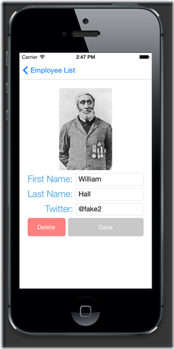

# Xamarin

## 目录

1. [简介](简介)
   - [系统需求](#系统需求)
   - [使用Xamarin开始编程](#使用Xamarin开始编程)
     - [Xamarin.Froms应用程序](#Xamarin.Froms应用程序)
     - [使用 Xamarin.Forms Page](#使用Xamarin.Forms&nbsp;Page)
     - [视图与布局](#视图与布局)
     - [数据绑定](#数据绑定)
     - [页面导航](#页面导航)
2. [参考](#参考)

## 简介

Xamarin.Forms 是一个跨平台的、基于原生控件的 UI 工具包，开发人员可以轻松的创建适用于 Android，iOS 以及 Windows Phone 的用户界面。

Xamarin.Forms 通过使用平台的原生控件来渲染用户界面，使用 Xamarin.Forms 的 App 在外观上与平台完全一致。

通过本文您可以快速了解如何使用 Xamarin.Form 来进行应用程序的开发。

Xamarin.Forms 可以帮助开发人员快速的构建跨平台的UI，通过一次编码，生成多平台界面。如果你做的工作涉及到三个平台，那你会对重重复复的界面逻辑工作厌烦，Xamarin Forms 是一个好的解决方案。

Xamarin.Forms 允许开发人员使用C#语言来快速构建 UI 界面，由于基于 Xamarin.Forms 开发的应用程序完全是原生的，它的受限很少，例如浏览器沙盒、底层API限制还有性能，相反它完全可以使用底层操作系统提供的API，例如 iOS 上的 CoreMotion, PassKit, 和 StoreKit，安卓上的 NFC 和 Google Play Services。这意味着你可以使用 Xamarin.Forms 来构建应用程序的UI，使用原生的语言来构建其他部分。

基于 Xamarin.Forms 开发的应用程序在架构上采用了共享逻辑层的跨平台方案，通常的方式是使用 Portable Libraries 或者 Shared Projects 来共享逻辑层代码，平台相关的部分可以享有这部分代码。

Xamarin的代码共享方案：


开发人员可以通过C#代码来直接构建 Xamarin.Forms 的UI，另外还可以通过 XAML 来构建，运行时的行为需要写在你另外一个对应的文件中。

本文将会介绍整个 Xamarin.Forms 框架的核心和基础概念，包括：

- 如何安装 Xamarin.Forms
- 在 Visual Studio 和 Xamarin Studio 中建立 Xamarin.Forms 的项目
- 如何使用 Xamarin.Forms 的控件
- 如何在页面之间进行导航
- 如何进行数据绑定

### 系统需求

- iOS:
  
  - 由于Apple限制iOS应用程式编译都需要透过Xcode，因此需要1台MAC的机器作为Build Host.
  - Windows 7 或更新的作业系统版本
  - Visual Studio 2010 / 2012
  - OS X Lion 或更新的作业系统版本
  - Xcode IDE 以及 iOS SDK

- Android: 对于Android开发，则可以完全在Windows上进行。其系统需求如下:

  - Windows 7 或更新的作业系统版本
  - Java SDK
  - Android SDK
  - Xamarin.Android for Visual Studio

### 使用Xamarin开始编程

开发人员可以在Xamarin Studio和Visual Studio中创建 Xamarin.Forms的项目，有四种项目类型可以选择：

- Portable Library：用于代码共享的类库
- Xamarin.Android Application：安卓应用程序
- Xamarin.iOS Application：iOS应用程序
- Windows Phone Application：Windows Phone 应用程序

#### Xamarin.Froms应用程序

Xamarin.Forms中每一个屏幕画面都有对应概念叫：Page，Xamarin.Forms.Page 在安卓中与 Activity对应，在 iOS 中与 ViewController对应，在Windows Phone中与Page对应。

当前的工程正是使用了 Xamarin.Forms.ContentPage，在其上面添加了一个 Label 控件。App类型负责初始化应用程序的首页，如下面的例子：

```C#
public class App
{
  public static Page GetMainPage()
  {
    return new ContentPage
    {
      Content = new Label
      {
        Text = "Hello, Forms !",
        VerticalOptions = LayoutOptions.CenterAndExpand,
        HorizontalOptions = LayoutOptions.CenterAndExpand,
      },
    };
  }
}
```

上述的代码初始化了一个 ContentPage，并且放了一个竖直、水平都居中的Label在上面。

#### 使用Xamarin.Forms&nbsp;Page

***Android***

创建一个Activity类型，并且使用 MainLauncher 特性修饰，在 OnCreate 方法中，初始化Xamarin.Forms框架，然后设定初始界面，如下面的代码：

```C#
namespace HelloXamarinFormsWorld.Android
{
  [Activity(Label = "HelloXamarinFormsWorld", MainLauncher = true, ConfigurationChanges = ConfigChanges.ScreenSize | ConfigChanges.Orientation)]
  public class MainActivity : AndroidActivity
  {
    protected override void OnCreate(Bundle bundle)
    {
      base.OnCreate(bundle);
      Xamarin.Forms.Forms.Init(this, bundle);
      SetPage(App.GetMainPage());
    }
  }
}
```

***iOS***

对于 Xamarin.iOS 应用程序，在 AppDelegate 的 FinishedLaunching 方法中，首先初始化Xamarin.Forms框架，然后设定 RootViewController 为 Xamarin.Forms 的 Page 类型，如下面的代码：

```C#
[Register("AppDelegate")]
public partial class AppDelegate : UIApplicationDelegate
{
  UIWindow window;

  public override bool FinishedLaunching(UIApplication app, NSDictionary options)
  {
    Forms.Init();
    window = new UIWindow(UIScreen.MainScreen.Bounds);
    window.RootViewController = App.GetMainPage().CreateViewController();
    window.MakeKeyAndVisible();
    return true;
  }
}
```

***Windows Phone***

Windows Phone的做法与上面两种类似，不解释，直接上代码：

```C#
public partial class MainPage : PhoneApplicationPage
{
  public MainPage()
  {
    InitializeComponent();
    Forms.Init();
    Content = HelloXamarinFormsWorld.App.GetMainPage().ConvertPageToUIElement(this);
  }
}
```

现在我们对于Xamarin.Forms有了一定的了解，然我们继续了解其他的一些东西。

#### 视图与布局

Xamarin.Forms使用控件来进行布局，在运行时每一个控件都会对应一个原生控件，我们经常会使用下面的类型来构建UI。

- View - 通常指的是Label，Button以及输入框等等
- Page - 一个单独的screen，对应的概念是 Android Activity，Windows Phone Page 以及 iOS View Controller.
- Layout - 布局或者容器控件
- Cell - 表格或者列表控件的子项目

常用控件：

Xamarin.Forms 控件|描述
-|-
Label|只读的文本展示控件
Entry|单行的文本输入框
Button|按钮
Image|图片
ListView|列表控件

Xamarin.Forms有两种不同类型的容器控件：

- Managed Layout - 与CSS的盒模型类似，通过设定子控件的位置和大小来进行布局，应用程序不再直接设定子控件的位置，最常见的例子就是 StackLayout。
- Unmanaged Layouts - 与Managed Layout不同，开发人员需要直接设定子控件的位置和大小，常见的例子就是 AbsoluteLayout。

接下来我们再仔细讨论这两种布局方式：

***堆栈式布局***

堆栈式布局是一种非常常用的布局方式，可以极大地的简化跨平台用户界面的搭建。堆栈式布局的子元素会按照添加到容器中的顺序一个接一个被摆放，堆栈式布局有两个方向：竖直与水平方向。

下面的代码会把三个 Label 控件添加到 StackLayout 中去。

```C#
public class StackLayoutExample : ContentPage
{
  public StackLayoutExample()
  {
    Padding = new Thickness(20);
    var red = new Label
    {
      Text = "Stop",
      BackgroundColor = Color.Red,
      Font = Font.SystemFontOfSize(20)
    };

    var yellow = new Label
    {
      Text = "Slow down",
      BackgroundColor = Color.Yellow,
      Font = Font.SystemFontOfSize(20)
    };

    var green = new Label
    {
      Text = "Go",
      BackgroundColor = Color.Green,
      Font = Font.SystemFontOfSize(20)
    };

    Content = new StackLayout
    {
      Spacing = 10,
      Children = { red, yellow, green }
    };

  }
}
```

下面使用了XAML来构建界面：

```xml
<?xml version="1.0" encoding="utf-8" ?>
<ContentPage xmlns="http://xamarin.com/schemas/2014/forms"
             xmlns:x="http://schemas.microsoft.com/winfx/2006/xaml"
             x:Class="HelloXamarinFormsWorldXaml.StackLayoutExample1"
             Padding="20">
  <StackLayout Spacing="10">
    <Label Text="Stop" BackgroundColor="Red" Font="20" />
    <Label Text="Slow down" BackgroundColor="Yellow" Font="20" />
    <Label Text="Go" BackgroundColor="Green" Font="20" />
  </StackLayout>
</ContentPage>
```

StackLayout 默认是竖直方向。

将布局方向改为水平方向：

```C#
public class StackLayoutExample : ContentPage
{
  public StackLayoutExample()
  {
    // Code that creates labels removed for clarity
    Content = new StackLayout
    {
      Spacing = 10,
      VerticalOptions = LayoutOptions.End,
      Orientation = StackOrientation.Horizontal,
      HorizontalOptions = LayoutOptions.Start,
      Children = { red, yellow, green }
    };
  }
}
```

XAML：

```xml
<?xml version="1.0" encoding="utf-8" ?>
<ContentPage xmlns="http://xamarin.com/schemas/2014/forms"
             xmlns:x="http://schemas.microsoft.com/winfx/2006/xaml"
             x:Class="HelloXamarinFormsWorldXaml.StackLayoutExample2"
             Padding="20">
  <StackLayout Spacing="10" VerticalOptions="End" Orientation="Horizontal"
               HorizontalOptions="Start">
    <Label Text="Stop" BackgroundColor="Red" Font="20" />
    <Label Text="Slow down" BackgroundColor="Yellow" Font="20" />
    <Label Text="Go" BackgroundColor="Green" Font="20" />
  </StackLayout>
</ContentPage>
```

在StackLayout中我们可以通过 HeightRequest 和 WidthRequest 指定子元素的高度和宽度

```C#
var red = new Label
{
  Text = "Stop",
  BackgroundColor = Color.Red,
  Font = Font.SystemFontOfSize(20),
  WidthRequest = 100
};

var yellow = new Label
{
  Text = "Slow down",
  BackgroundColor = Color.Yellow,
  Font = Font.SystemFontOfSize(20),
  WidthRequest = 100
};

var green = new Label
{
  Text = "Go",
  BackgroundColor = Color.Green,
  Font = Font.SystemFontOfSize(20),
  WidthRequest = 200
};

Content = new StackLayout
{
  Spacing = 10,
  VerticalOptions = LayoutOptions.End,
  Orientation = StackOrientation.Horizontal,
  HorizontalOptions = LayoutOptions.Start,
  Children = { red, yellow, green }
};
```

XAML：

```xml
<?xml version="1.0" encoding="utf-8" ?>
<ContentPage xmlns="http://xamarin.com/schemas/2014/forms"
  xmlns:x="http://schemas.microsoft.com/winfx/2006/xaml" x:Class="HelloXamarinFormsWorldXaml.StackLayoutExample3" Padding="20">
  <StackLayout Spacing="10" VerticalOptions="End" Orientation="Horizontal" HorizontalOptions="Start">
    <Label Text="Stop" BackgroundColor="Red" Font="20" WidthRequest="100" />
    <Label Text="Slow down" BackgroundColor="Yellow" Font="20" WidthRequest="100" />
    <Label Text="Go" BackgroundColor="Green" Font="20" WidthRequest="200" />
  </StackLayout>
</ContentPage>
```

***绝对布局***

绝对布局类似于Windows Forms布局，需要指定每一个子元素的位置。

下面是一个例子：

```C#
public class MyAbsoluteLayoutPage : ContentPage
{
  public MyAbsoluteLayoutPage()
  {
    var red = new Label
    {
      Text = "Stop",
      BackgroundColor = Color.Red,
      Font = Font.SystemFontOfSize(20),
      WidthRequest = 200,
      HeightRequest = 30
    };

    var yellow = new Label
    {
      Text = "Slow down",
      BackgroundColor = Color.Yellow,
      Font = Font.SystemFontOfSize(20),
      WidthRequest = 160,
      HeightRequest = 160
    };

    var green = new Label
    {
      Text = "Go",
      BackgroundColor = Color.Green,
      Font = Font.SystemFontOfSize(20),
      WidthRequest = 50,
      HeightRequest = 50
    };

    var absLayout = new AbsoluteLayout();
    absLayout.Children.Add(red, new Point(20, 20));
    absLayout.Children.Add(yellow, new Point(40, 60));
    absLayout.Children.Add(green, new Point(80, 180));
    Content = absLayout;
  }
}
```

XAML：

```xml
<?xml version="1.0" encoding="utf-8" ?>
<ContentPage xmlns="http://xamarin.com/schemas/2014/forms"
  xmlns:x="http://schemas.microsoft.com/winfx/2006/xaml" x:Class="HelloXamarinFormsWorldXaml.AbsoluteLayoutExample" Padding="20">
  <AbsoluteLayout>
    <Label Text="Stop" BackgroundColor="Red" Font="20" AbsoluteLayout.LayoutBounds="20,20,200,30" />
    <Label Text="Slow down" BackgroundColor="Yellow" Font="20" AbsoluteLayout.LayoutBounds="40,60,160,160" />
    <Label Text="Go" BackgroundColor="Green" Font="20" AbsoluteLayout.LayoutBounds="80,180,50,50" />
  </AbsoluteLayout>
</ContentPage>
```

子元素添加到容器中的顺序会影响子元素的Z-Order。先添加的元素可能会被后面添加的元素遮住

***列表***

ListView是一个非常常见的控件，用于展现一组数据，每一个条目都会被包含在一个单元格内部。默认情况下ListView使用了一个 TextCell 作为模板来展现每一个条目数据。

参见下面的代码：

```C#
var listView = new ListView
{
  RowHeight = 40
};

listView.ItemsSource = new string[]
{
  "Buy pears",
  "Buy oranges",
  "Buy mangos",
  "Buy apples",
  "Buy bananas"
};

Content = new StackLayout
{
  VerticalOptions = LayoutOptions.FillAndExpand,
  Children = { listView }
};
```

***绑定数据***

ListView也可以绑定自定义数据类型，如下：

```C#
public class TodoItem
{
  public string Name { get; set; }
  public bool Done { get; set; }
}
```

绑定数据到ListView

```C#
listView.ItemsSource = new TodoItem [] {
  new TodoItem {Name = "Buy pears"},
  new TodoItem {Name = "Buy oranges", Done=true},
  new TodoItem {Name = "Buy mangos"},
  new TodoItem {Name = "Buy apples", Done=true},
  new TodoItem {Name = "Buy bananas", Done=true}
};
```

设定展现数据：

```C#
listView.ItemTemplate = new DataTemplate(typeof(TextCell));
listView.ItemTemplate.SetBinding(TextCell.TextProperty, "Name");
```

***选择条目***

通过ItemSelected事件我们可以知道当前选中的条目：

```C#
listView.ItemSelected += async(sender, e) => {
  await DisplayAlert("Tapped!", e.SelectedItem + " was tapped.", "OK");
};
```

在ItemSelected事件中我们已可以进行页面导航：

```C#
listView.ItemSelected += async(sender, e) => {
  var todoItem = (TodoItem)e.SelectedItem;
  var todoPage = new TodoItemPage(todoItem); // so the new page shows correct data
  await Navigation.PushAsync(todoPage);
};
```

***自定义单元格样式***

包含一个Image控件，两个 Label 控件的布局：

```C#
class EmployeeCell : ViewCell
{
  public EmployeeCell()
  {
    var image = new Image
    {
      HorizontalOptions = LayoutOptions.Start
    };

    image.SetBinding(Image.SourceProperty, new Binding("ImageUri"));
    image.WidthRequest = image.HeightRequest = 40;
    var nameLayout = CreateNameLayout();

    var viewLayout = new StackLayout()
    {
      Orientation = StackOrientation.Horizontal,
      Children = { image, nameLayout }
    };

    View = viewLayout;
  }

  static StackLayout CreateNameLayout()
  {
    var nameLabel = new Label
    {
      HorizontalOptions = LayoutOptions.FillAndExpand
    };

    nameLabel.SetBinding(Label.TextProperty, "DisplayName");

    var twitterLabel = new Label
    {
      HorizontalOptions = LayoutOptions.FillAndExpand,
      Font = Fonts.Twitter
    };

    twitterLabel.SetBinding(Label.TextProperty, "Twitter");

    var nameLayout = new StackLayout()
    {
      HorizontalOptions = LayoutOptions.StartAndExpand,
      Orientation = StackOrientation.Vertical,
      Children = { nameLabel, twitterLabel }
    };

    return nameLayout;
  }
}
```

自定义单元格创建完毕后，绑定数据源到ListView

```C#
List<Employee> myListOfEmployeeObjects = GetAListOfAllEmployees();
var listView = new ListView
{
  RowHeight = 40
};

listView.ItemsSource = myListOfEmployeeObjects;
listView.ItemTemplate = new DataTemplate(typeof(EmployeeCell));
```

使用XAML构建自定义单元格

```xml
<?xml version="1.0" encoding="utf-8" ?>
<ContentPage xmlns="http://xamarin.com/schemas/2014/forms"
  xmlns:x="http://schemas.microsoft.com/winfx/2006/xaml"
  xmlns:local="clr-namespace:XamarinFormsXamlSample;assembly=XamarinFormsXamlSample"
  xmlns:constants="clr-namespace:XamarinFormsSample;assembly=XamarinFormsXamlSample" x:Class="XamarinFormsXamlSample.Views.EmployeeListPage" Title="Employee List">
  <ListView x:Name="listView" IsVisible="false" ItemsSource="{x:Static local:App.Employees}" ItemSelected="EmployeeListOnItemSelected">
    <ListView.ItemTemplate>
      <DataTemplate>
        <ViewCell>
          <ViewCell.View>
            <StackLayout Orientation="Horizontal">
              <Image Source="{Binding ImageUri}" WidthRequest="40" HeightRequest="40" />
              <StackLayout Orientation="Vertical" HorizontalOptions="StartAndExpand">
                <Label Text="{Binding DisplayName}" HorizontalOptions="FillAndExpand" />
                <Label Text="{Binding Twitter}" Font="{x:Static constants:Fonts.Twitter}"/>
              </StackLayout>
            </StackLayout>
          </ViewCell.View>
        </ViewCell>
      </DataTemplate>
    </ListView.ItemTemplate>
  </ListView>
</ContentPage>
```

#### 数据绑定

通过数据绑定Xamarin.Forms的控件可以展示数据层的数据，还可以通过编辑控件将更改同步到数据层。

为了更好的理解数据绑定，看下面的画面：



该页面包含了下列的控件：

- Xamarin.Forms.Image
- Xamarin.Forms.Label
- Xamarin.Forms.Entry
- Xamarin.Forms.Button

在页面的构造函数中，将业务数据传入，并且设定数据绑定：

```C#
public EmployeeDetailPage(Employee employeeToDisplay)
{
  this.BindingContext = employeeToDisplay;
  var firstName = new Entry()
  {
    HorizontalOptions = LayoutOptions.FillAndExpand
  };
  firstName.SetBinding(Entry.TextProperty, "FirstName");
  // Rest of the code omitted…
}
```

#### 页面导航

现在我们已经了解了如何创建页面，以及如何添加控件，接下来我们会讨论如何进行页面导航。页面导航可以理解为一个后进先出的堆栈结构，展现一个页面相当于在堆栈中添加一个元素，如果需要回到前一个页面，就需要把当前的页面从堆栈中删除。

Xamarin.Forms 定义了 INavigation 接口来处理页面导航相关的逻辑：

```C#
public interface INavigation
{
  Task PushAsync(Page page);
  Task<Page> PopAsync();
  Task PopToRootAsync();
  Task PushModalAsync(Page page);
  Task<Page> PopModalAsync();
}
```

NavigationPage 类型实现了这个接口，并且在屏幕的顶部添加了导航条，除了显示当前页面的标题外，还有一个返回的按钮。下面的代码就是使用 NavigationPage 的例子：

```C#
public static Page GetMainPage()
{
  var mainNav = new NavigationPage(new EmployeeListPage());
  return mainNav;
}
```

如果希望显示 LoginPage，使用 PushAync 方法将 LoginPage 加入堆栈中：

```C#
await Navigation.PushAsync(new LoginPage());
```

如果希望返回原有页面，调用 PopAsync 方法：

```C#
await Navigation.PopAsync();
```

如果希望弹出模态对话框，方法是类似的：

```C#
await Navigation.PushModalAsync(new LoginPage());
```

返回原有页面：

```C#
await Navigation.PopModalAsync();
```

### 小结

本文讨论了 Xamarin.Forms 是什么，以及如何使用 Xamarin.Forms 来构建跨平台的应用，我们从如何安装 Xamarin.Forms，到如何创建一个 Xamarin.Forms 项目，如何构建用户界面，如何进行数据绑定以及如何切换页面。

目前已有部分产品支持 Xamarin.Forms，其中值得一提的是 `ComponentOne Studio for Xamarin`，它是 Xamarin 平台的原生移动控件集，为安卓、iOS、Windows Phone提供一致的体验，使用相同的API跨越所有平台。

## 参考

- [葡萄城技术团队](https://www.cnblogs.com/powertoolsteam/)
