# vue

## 目录

1. 简介
   - [安装](#安装)
2. 语法
   - [模板语法](#模板语法)
   - [指令](#指令)
     - [自定义指令](#自定义指令)
   - [过滤器](#过滤器)
   - [计算属性](#计算属性)
   - [监视](#监视)
   - [动态操作根级响应式属性](#动态操作根级响应式属性)
   - [条件语句](#条件语句)
   - [循环语句](#循环语句)
   - [样式绑定](#样式绑定)
   - [事件处理](#事件处理)
   - [周期事件](#周期事件)
   - [表单](#表单)
     - [修饰符](#修饰符)
   - [组件](#组件)
3. 插件
   - [axios](#axios)
   - [vue-resource](#vue-resource)
   - [vue-router](#vue-router)

## 安装

由于 npm 安装速度慢，建议使用淘宝定制的cnpm（gzip 压缩支持）命令行工具代替默认的 npm：

```sh
npm install -g cnpm --registry=https://registry.npm.taobao.org

# 最新稳定版
cnpm install vue
```

在用 Vue.js 构建大型应用时推荐使用 NPM 安装。Vue.js 提供一个官方命令行工具`vue-cli`，可用于快速搭建大型单页应用。

```sh
# 全局安装 vue-cli
cnpm install --global vue-cli
# 创建一个基于 webpack 模板的新项目
vue init webpack my-project
# 下面需要进行一些配置，默认回车即可
```

进入项目，安装并运行：

```sh
cd my-project
cnpm install
cnpm run dev
```

成功执行以上命令后访问 `http://localhost:xxxx/`

>注意：Vue.js 不支持 IE8 及其以下 IE 版本。

### 自定义指令

除了默认设置的核心指令(v-model 和 v-show)，Vue 也允许注册自定义指令。可以全局注册、局部注册。

下面我们注册一个全局指令 v-focus, 该指令的功能是在页面加载时，元素获得焦点：

```html
<div id="app">
  <p>页面载入时，input 元素自动获取焦点：</p>
  <input v-focus>
</div>
<script>
  // 注册一个全局自定义指令 v-focus
  Vue.directive('focus', {
    // 当绑定元素插入到 DOM 中。
    inserted: function (el) {
      // 聚焦元素
      el.focus()
    }
  })
  // 创建根实例
  new Vue({
    el: '#app'
  })
</script>
```

我们也可以在实例使用 directives 选项来注册局部指令，这样指令只能在这个实例中使用：

```html
<div id="app">
  <p>页面载入时，input 元素自动获取焦点：</p>
  <input v-focus>
</div>
<script>
// 创建根实例
new Vue({
  el: '#app',
  directives: {
    // 注册一个局部的自定义指令 v-focus
    focus: {
      // 指令的定义
      inserted: function (el) {
        // 聚焦元素
        el.focus()
      }
    }
  }
})
</script>
```

自定义指令的选项是由几个钩子函数组成的，每个都是可选的。

- bind: 只调用一次，指令第一次绑定到元素时调用，用这个钩子函数可以定义一个在绑定时执行一次的初始化动作。
- inserted: 被绑定元素插入父节点时调用（父节点存在即可调用，不必存在于 document 中）。
- update: 被绑定元素所在的模板更新时调用，而不论绑定值是否变化。通过比较更新前后的绑定值，可以忽略不必要的模板更新（详细的钩子函数参数见下）。
- componentUpdated: 被绑定元素所在模板完成一次更新周期时调用。
- unbind: 只调用一次， 指令与元素解绑时调用。

**钩子函数参数：**

- el: 指令所绑定的元素，可以用来直接操作 DOM。
- binding: 一个对象，包含以下属性：
  - name: 指令名，不包括 v- 前缀。
  - value: 指令的绑定值，例如：v-my-directive="1 + 1", value 的值是 2。
  - oldValue: 指令绑定的前一个值，仅在 update 和 componentUpdated 钩子中可用。无论值是否改变都可用。
  - expression: 绑定值的字符串形式。 例如 v-my-directive="1 + 1" ， expression 的值是 "1 + 1"。
  - arg: 传给指令的参数。例如 v-my-directive:foo，arg 的值是 "foo"。
  - modifiers: 一个包含修饰符的对象。例如：v-my-directive.foo.bar，修饰符对象modifiers的值是 { foo: true, bar: true }。
  - vnode: Vue 编译生成的虚拟节点，查阅 VNode API 了解更多详情。
  - oldVnode: 上一个虚拟节点，仅在 update 和 componentUpdated 钩子中可用。

以下实例演示了这些参数的使用：

```html
<div id="app" v-runoob:hello.a.b="message">
</div>
<script>
Vue.directive('runoob', {
  bind: function (el, binding, vnode) {
    var s = JSON.stringify(
      el.innerHTML =
        'name: ' + s(binding.name) + '<br>' +
        'value: ' + s(binding.value) + '<br>' +
        'expression: ' + s(binding.expression) + '<br>' +
        'argument: ' + s(binding.arg) + '<br>' +
        'modifiers: ' + s(binding.modifiers) + '<br>' +
        'vnode keys: ' + Object.keys(vnode).join(', '))
  }
})
new Vue({
  el: '#app',
  data: {
    message: '菜鸟教程!'
  }
})
</script>
```

运行结果：

```sh
name: "runoob"
value: "菜鸟教程!"
expression: "message"
argument: "hello"
modifiers: {"a":true,"b":true}
vnode keys: tag, data, children, text, elm, ns, context, functionalContext, key, componentOptions, componentInstance, parent, raw, isStatic, isRootInsert, isComment, isCloned, isOnce
```

有时候我们不需要其他钩子函数，我们可以简写函数，如下格式：

```js
Vue.directive('runoob', function (el, binding) {
  // 设置指令的背景颜色
  el.style.backgroundColor = binding.value.color
})
```

指令函数可接受所有合法的 JavaScript 表达式，以下实例传入了 JavaScript 对象：

```html
<div id="app">
  <div v-runoob="{ color: 'green', text: '菜鸟教程!' }"></div>
</div>
<script>
Vue.directive('runoob', function (el, binding) {
  // 简写方式设置文本及背景颜色
  el.innerHTML = binding.value.text
  el.style.backgroundColor = binding.value.color
})
new Vue({
  el: '#app'
})
</script>
```

## 过滤器

Vue允许你自定义过滤器，被用作一些常见的文本格式化。由“管道符”指示；过滤器函数接受表达式的值作为第一个参数。

```html
<div id="app">
  {{ message | capitalize }}
</div>
<script>
  new Vue({
    el: '#app',
    data: {
      message: 'runoob'
    },
    filters: {
      capitalize: function (value) {
        if (!value) return ''
        value = value.toString()
        return value.charAt(0).toUpperCase() + value.slice(1)
      }
    }
  })
</script>
```

过滤器可以串联：`{{ message | filterA | filterB }}`。过滤器是 JavaScript 函数，因此可以接受参数：`{{ message | filterA('arg1', arg2) }}`。这里，message 是第一个参数，字符串 'arg1' 将传给过滤器作为第二个参数，arg2 表达式的值将被求值然后传给过滤器作为第三个参数。

## 计算属性

模板内的表达式常用于简单的运算，当其过长或逻辑复杂时，会难以维护，计算属性就是用于解决该问题的。

计算属性关键词: `computed`。计算属性在处理一些复杂逻辑时是很有用的。

示例：反转字符串

```html
<div id="app">
  <p>原始字符串: {{ message }}</p>
  <p>计算后反转字符串: {{ reversedMessage }}</p>
  <p>使用方法后反转字符串: {{ reversedMessage2() }}</p>
</div>
<script>
var cnt=1;
var vm = new Vue({
  el: '#app',
  data: {
    message: 'Runoob!'
  },
  computed: {
    // 计算属性的 getter
    reversedMessage: function () {
      // `this` 指向 vm 实例
      cnt+=1;
      return cnt+this.message.split('').reverse().join('')
    }
  },
  methods: {
    reversedMessage2: function () {
      cnt+=1;
      return cnt+this.message.split('').reverse().join('')
    }
  }
})
</script>
```

声明一个计算属性reversedMessage。每一个计算属性都包含－个getter和setter，上面的示例是计算属性的默认用法，只是利用getter来读取。提供的函数将用作属性vm.reversedMessage的getter。vm.reversedMessage依赖于vm.message，在vm.message发生改变时，vm.reversedMessage也会更新。

**computed vs methods:**

我们可以使用 `methods` 来替代 `computed`，效果上两个都是一样的，但是 `computed` 是基于它的依赖缓存，只有相关依赖发生改变时才会重新取值。而使用 `methods`，在重新渲染的时候，函数总会重新调用执行。

可以说使用 `computed` 性能会更好，但是如果你不希望缓存，你可以使用 `methods` 属性。

上例中，cnt 是独立于 vm 对象的变量。在使用 reversedMessage 这个计算属性的时候，第一次会执行代码，得到一个值，以后再使用 reversedMessage 这个计算属性，因为 vm 对象没有发生改变，于是界面渲染就直接用这个值，不再重复执行代码。而 reversedMessage2 没有这个缓存，只要用一次，函数代码就执行一次，于是每次返回值都不一样。

**setter：**

```js
var vm = new Vue({
  el: '#app',
  data: {
    name: 'Google',
    url: 'http://www.google.com'
  },
  computed: {
    site: {
      // getter
      get: function () {
        return this.name + ' ' + this.url
      },
      // setter
      set: function (newValue) {
        var names = newValue.split(' ')
        this.name = names[0]
        this.url = names[names.length - 1]
      }
    }
  }
})
// 调用 setter， vm.name 和 vm.url 也会被对应更新
vm.site = '菜鸟教程 http://www.runoob.com';
document.write('name: ' + vm.name);
document.write('<br>');
document.write('url: ' + vm.url);
```

计算属性除了简单的文本插值外，还经常用于动态地设置元素的样式名称class和内联样式style。当使用组件时，计算属性也经常用来动态传递props。

计算属性还有两个很实用的小技巧容易被忽略：一是计算属性可以依赖其他计算属性；二是计算属性不仅可以依赖当前Vue实例的数据，还可以依赖其他实例的数据

## 监视

我们可以通过 `watch` 来响应数据的变化。以下实例通过使用 watch 实现计数器：

```html
<div id = "computed_props">
  千米 : <input type = "text" v-model = "kilometers">
  米 : <input type = "text" v-model = "meters">
</div>
<p id="info"></p>
<script type = "text/javascript">
  var vm = new Vue({
    el: '#computed_props',
    data: {
      kilometers : 0,
      meters:0
    },
    methods: {},
    computed: {},
    watch: {
      kilometers: function(val) {
        this.kilometers = val;
        this.meters = this.kilometers * 1000
      },
      meters: function (val) {
        this.kilometers = val/ 1000;
        this.meters = val;
      }
    }
  });
  // $watch 是一个实例方法
  vm.$watch('kilometers', function (newValue, oldValue) {
    // 这个回调将在 vm.kilometers 改变后调用
    document.getElementById ("info").innerHTML = "修改前值为: " + oldValue + "，修改后值为: " + newValue;
  })
</script>
```

watch 可以对（单个）变量进行监视，也可以深度监视；计算属性 computed 可以监视多个值，并且指定返回数据。

Vue 可以添加数据动态响应接口。例如以下实例，我们通过使用 $watch 属性来实现数据的监听，$watch 必须添加在 Vue 实例之外才能实现正确的响应。

实例中通过点击按钮计数器会加 1。setTimeout 设置 10 秒后计算器的值加上 20 。

```html
<div id = "app">
  <p style = "font-size:25px;">计数器: {{ counter }}</p>
  <button @click = "counter++" style = "font-size:25px;">点我</button>
</div>
<script type = "text/javascript">
var vm = new Vue({
  el: '#app',
  data: {
    counter: 1
  }
});
vm.$watch('counter', function(nval, oval) {
  alert('计数器值的变化 :' + oval + ' 变为 ' + nval + '!');
});
setTimeout(
  function(){
    vm.counter += 20;
  },10000
);
</script>
```

## 动态操作根级响应式属性

<b style="color:red">Vue 不允许在已经创建的实例上动态添加新的根级响应式属性。</b>

Vue 不能检测到对象属性的添加或删除，最好的方式就是在初始化实例前声明根级响应式属性，哪怕只是一个空值。

如果我们需要在运行过程中实现属性的添加或删除，则可以使用全局 Vue，`Vue.set` 和 `Vue.delete` 方法。

Vue.set 方法用于设置对象的属性，它可以解决 Vue 无法检测添加属性的限制，语法格式如下：

```js
Vue.set( target, key, value )
```

参数说明：

- target: 可以是对象或数组
- key: 可以是字符串或数字
- value: 可以是任何类型

```html
<div id = "app">
   <p style = "font-size:25px;">计数器: {{ products.id }}</p>
   <button @click = "products.id++" style = "font-size:25px;">点我</button>
</div>
<script type = "text/javascript">
var myproduct = {"id":1, name:"book", "price":"20.00"};
  var vm = new Vue({
  el: '#app',
  data: {
    counter: 1,
    products: myproduct
  }
});
vm.products.qty = "1";
console.log(vm);
vm.$watch('counter', function(nval, oval) {
  alert('计数器值的变化 :' + oval + ' 变为 ' + nval + '!');
});
</script>
```

在以上实例中，在开始时创建了一个变量 myproduct，该变量赋值给了 Vue 实例的 data 对象，如果我们想给 myproduct 数组添加一个或多个属性，我们可以在 Vue 实例创建后使用 `vm.products.qty = "1";` 代码。

查看控制台输出：

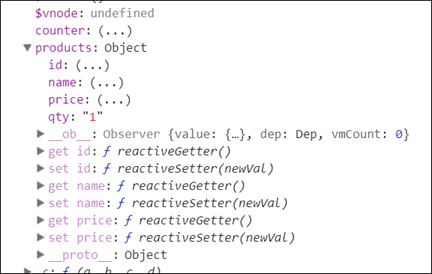

在产品中添加了数量属性 qty，但是 get/set 方法只可用于 id，name 和 price 属性，却不能在 qty 属性中使用。

我们不能通过添加 Vue 对象来实现响应。 Vue 主要在开始时创建所有属性。 如果我们要实现这个功能，可以通过 Vue.set 来实现：

```html
<div id = "app">
  <p style = "font-size:25px;">计数器: {{ products.id }}</p>
  <button @click = "products.id++" style = "font-size:25px;">点我</button>
</div>
<script type = "text/javascript">
var myproduct = {"id":1, name:"book", "price":"20.00"};
var vm = new Vue({
  el: '#app',
  data: {
    counter: 1,
    products: myproduct
  }
});
Vue.set(myproduct, 'qty', 1);
console.log(vm);
vm.$watch('counter', function(nval, oval) {
  alert('计数器值的变化 :' + oval + ' 变为 ' + nval + '!');
});
</script>
```

从控制台输出的结果可以看出 get/set 方法可用于qty 属性。

Vue.delete 用于删除动态添加的属性 语法格式：

```js
Vue.delete( target, key )
```

参数说明：

- target: 可以是对象或数组
- key: 可以是字符串或数字

```html
<div id = "app">
  <p style = "font-size:25px;">计数器: {{ products.id }}</p>
  <button @click = "products.id++" style = "font-size:25px;">点我</button>
</div>
<script type = "text/javascript">
var myproduct = {"id":1, name:"book", "price":"20.00"};
var vm = new Vue({
  el: '#app',
  data: {
    counter: 1,
    products: myproduct
  }
});
Vue.delete(myproduct, 'price');
console.log(vm);
vm.$watch('counter', function(nval, oval) {
  alert('计数器值的变化 :' + oval + ' 变为 ' + nval + '!');
});
</script>
```

以上实例中我们使用 Vue.delete 来删除 price 属性。

## 条件语句

### v-if

```html
<div id="app">
  <p v-if="seen">现在你看到我了</p>
  <template v-if="ok">
    <h1>菜鸟教程</h1>
    <p>学的不仅是技术，更是梦想！</p>
    <p>哈哈哈，打字辛苦啊！！！</p>
  </template>
</div>
<script>
new Vue({
  el: '#app',
  data: {
    seen: true,
    ok: true
  }
})
</script>
```

在字符串模板中，如 Handlebars ，我们得像这样写一个条件块：

```html
<!-- Handlebars 模板 -->
{{#if ok}}
  <h1>Yes</h1>
{{/if}}
```

### v-else-if & v-else

```html
<div id="app">
  <div v-if="type === 'A'">A</div>
  <div v-else-if="type === 'B'">B</div>
  <div v-else-if="type === 'C'">C</div>
  <div v-else>Not A/B/C</div>
</div>
```

### v-show

在切换 v-if 块时，Vue.js 有一个局部编译/卸载过程，因为 v-if 之中的模板也可能包括数据绑定或子组件。v-if是真实的条件渲染，因为它会确保条件块在切换当中合适地销毁与重建条件块内的事件监听器和子组件。

v-if 也是惰性的：如果在初始渲染时条件为假，则什么也不做——在条件第一次变为真时才开始局部编译（编译会被缓存起来）。

相比之下，v-show 简单得多——元素始终被编译并保留，只是简单地基于 CSS 切换。

v-if 是动态添加，当值为 false 时，是完全移除该元素，即 dom 树中不存在该元素。

v-show 仅是隐藏/显示，值为 false 时，该元素依旧存在于 dom 树中。若其原有样式设置了 display: none 则会导致其无法正常显示。

一般来说，v-if 有更高的切换消耗而 v-show 有更高的初始渲染消耗。因此，如果需要频繁切换 v-show 较好，如果在运行时条件不大可能改变 v-if 较好。

简单来说：

- v-if：判断是否加载，可以减轻服务器压力，在需要时加载
- v-show：调整css display属性，可以使客户端操作更加流畅

## 循环语句

### v-for

```html
<div id="app">
  <ol>
    <li v-for="site in sites">
      {{ site.name }}
    </li>
  </ol>
</div>
<script>
new Vue({
  el: '#app',
  data: {
    sites: [
      { name: 'Runoob' },
      { name: 'Google' },
      { name: 'Taobao' }
    ]
  }
})
</script>
```

模板中使用 v-for：

```html
<div id="app">
  <ul>
    <template v-for="site in sites">
      <li>{{ site.name }}</li>
      <li>--------------</li>
    </template>
  </ul>
</div>
```

v-for 可以通过一个对象的属性来迭代数据：

```html
<div id="app">
  <ul>
    <li v-for="value in object">{{ value }}</li>
  </ul>
</div>
<script>
new Vue({
  el: '#app',
  data: {
    object: {
      name: '菜鸟教程',
      url: 'http://www.runoob.com',
      slogan: '学的不仅是技术，更是梦想！'
    }
  }
})
</script>
```

也可以提供第二个的参数为键名：

```html
<div id="app">
  <ul>
    <li v-for="(value, key) in object">{{ key }} : {{ value }}</li>
  </ul>
</div>
```

第三个参数为索引：

```html
<div id="app">
  <ul>
    <li v-for="(value, key, index) in object">
      {{ index }}. {{ key }} : {{ value }}
    </li>
  </ul>
</div>
```

v-for 也可以循环整数

```html
<div id="app">
  <ul>
    <li v-for="n in 10">{{ n }}</li>
  </ul>
</div>
```

v-for 还可以循环数组：

```html
<div id="app">
  <ul>
    <li v-for="n in [1,3,5]">{{ n }}</li>
  </ul>
</div>
```

v-for 默认行为：尝试不改变整体，而是替换元素，所以你需要提供一个 key 的特殊属性：

```html
<div v-for="item in items" :key="item.id">{{ item.text }}</div>
```

不仅如此，在迭代属性输出之前，v-for会对属性进行升序排序输出：

```js
new Vue({
  el: '#app',
  data: {
    object: {
      2: '学的不仅是技术，更是梦想！',
      1: '菜鸟教程',
      0: 'http://www.runoob.com'
    }
  }
})
```

遍历对象的时候可以处理嵌套：

```html
<div id="app">
  <ul>
    <li v-for="(value,key,index) in object">
      <p v-if="typeof value !='object'">{{value}}....{{ index }}</p>
      <p v-else>{{key}}....{{index}}</p>
      <ul v-if="typeof value == 'object'">
        <li v-for="(value, key, index) in value">
          {{key}}:{{value}}....{{ index }}
        </li>
      </ul>
    </li>
  </ul>
</div>
```

九九乘法是程序员的最爱:

```html
<div id="app">
  <div v-for="n in 9">
    <b v-for="m in n">
      {{m}}*{{n}}={{m*n}}
    </b>
  </div>
</div>
```

## 样式绑定

v-bind的主要用法是动态更新HTML元素上的属性。在数据绑定中，最常见的两个需求就是元素的样式名称class和内联样式style的动态绑定，它们也是HTML的属性，因此可以使用v-bind指令。

我们只需要用v-bind计算出表达式最终的字符串就可以，不过有时候表达式的逻辑较复杂，使用字符串拼接方法较难阅读和维护，所以Vue.js增强了对class和style的绑定。

### class属性绑定

我们可以为 `v-bind:class` 设置一个对象，从而动态的切换 class；也可以直接绑定数据里的一个对象

```html
<style>
.base {
  width: 100px;
  height: 100px;
}
.active {
    background: green;
}
.text-danger {
    background: red;
}
</style>
<div id="app">
  <div class="static" v-bind:class="{ active: isActive, 'text-danger': hasError }"></div>
  <div v-bind:class="classObject"></div>
  <!-- 计算属性 -->
  <div v-bind:class="classCompObject"></div>
  <!-- 数组 -->
  <div v-bind:class="[activeClass, errorClass]"></div>
  <!-- 三元表达式 -->
  <div v-bind:class="[errorClass, isActive ? activeClass : '']"></div>
</div>
<script>
new Vue({
  el: '#app',
  data: {
    isActive: true,
    hasError: true,
    error: {
      value: true,
      type: 'fatal'
    }
    classObject: {
      active: true,
      'text-danger': true
    },
    activeClass: 'active',
    errorClass: 'text-danger'
  },
  computed: {
    classCompObject: function () {
      return {
        base: true,
        active: this.isActive && !this.error.value,
        'text-danger': this.error.value && this.error.type === 'fatal',
      }
    }
  }
})
</script>
```

如果直接在自定义组件上使用class 或 :class，样式规则会直接应用到这个组件的根元素上，这种用法仅适用于自定义组件的最外层是一个根元素，否则会无效，当不满足这种条件或需要给具体的子元素设置类名时，应当使用组件的props来传递。这些用法同样适用于绑定内联样式style的内容。

### style（内联样式）

css属性名称使用驼峰命名(camelCase)或短横分隔命名(kebab-case)。也可以直接绑定到一个样式对象，让模板更清晰

```html
<div id="app">
    <div v-bind:style="{ color: activeColor, fontSize: fontSize + 'px' }">菜鸟教程</div>
    <div v-bind:style="styleObject">菜鸟教程</div>
    <!-- 可以使用数组将多个样式对象应用到一个元素上 -->
    <div v-bind:style="[baseStyles, overridingStyles]">菜鸟教程</div>
</div>

<script>
new Vue({
  el: '#app',
  data: {
    activeColor: 'green',
    fontSize: 30,
    styleObject: {
      color: 'green',
      fontSize: '30px'
    },
    baseStyles: {
      color: 'green',
      fontSize: '30px'
    },
    overridingStyles: {
      'font-weight': 'bold'
    }
  }
})
</script>
```

注意：当 `v-bind:style` 使用需要特定前缀的CSS属性时，如transform，Vue.js会自动侦测并添加相应的前缀。

Mustache（双大括号写法）不能在HTML属性中使用，应使用v-bind指令，这对布尔值的属性也有效——如果条件被求值为false的话该属性会被移除。

默认情况下标签自带属性的值是固定的，在为了能够动态的给这些属性添加值，可以使用`v-bind:你要动态变化的值="表达式"`；v-bind用于绑定属性和数据，其缩写为":"，也就是 `v-bind:id === :id`。v-model用在表单控件上的，用于实现双向数据绑定，所以如果你用在除了表单控件以外的标签是没有任何效果的。

动态调节示例：

```html
<div id="dynamic">  
  <div v-bind:style="{color: 'red', fontSize: fontSize + 'px'}">可以动态调节</div>  
  <div v-bind:style="objectStyle"> 不可以动态调节</div>
  {{fontSize}}
  <button @click="++fontSize">+</button>
  <button @click="--fontSize">-</button>
</div>
<script>
var app = new Vue({
  el: '#dynamic',
  data: {
    fontSize: 20,
    objectStyle: {
      color: 'green',
      fontSize: this.fontSize + 'px'
    }
  }
})
</script>
```

## 事件处理

事件监听可以使用 v-on 指令

```html
<div id="app">
  <button v-on:click="counter += 1">增加 1</button>
  <p>这个按钮被点击了 {{ counter }} 次。</p>
</div>
```

Vue 提供了一个特殊变量$event，用于访问原生 DOM 事件。

Vue.js为v-on提供了事件修饰符来处理DOM事件细节，如：event.preventDefault()或event.stopPropagation()。

Vue.js通过由点(.)表示的指令后缀来调用修饰符。

- .stop：就是js中的event.stopPropagation()的缩写，它是用来阻止冒泡的
- .prevent：就是js中event.preventDefault()的缩写，它是用来阻止默认行为的；
- .capture：在传递的父子事件中，加了这个，无论先点哪个，都先执行这个。
  
  >捕获事件和冒泡事件（默认）是两种事件流，事件捕获是从document到触发事件的那个元素；冒泡事件是从下向上的触发事件；

- .self：就是防止父元素（设置了该修饰符）的子元素的事件冒泡到父元素上，只有本身触发时才会执行事件处理程序（函数）；
- .once：每次页面重载后只会执行一次。

```html
<!-- 阻止单击事件冒泡 -->
<a v-on:click.stop="doThis"></a>
<!-- 提交事件不再重载页面 -->
<form v-on:submit.prevent="onSubmit"></form>
<!-- 修饰符可以串联  -->
<a v-on:click.stop.prevent="doThat"></a>
<!-- 只有修饰符 -->
<form v-on:submit.prevent></form>
<!-- 添加事件侦听器时使用事件捕获模式 -->
<div v-on:click.capture="doThis">...</div>
<!-- 只当事件在该元素本身（而不是子元素）触发时触发回调 -->
<div v-on:click.self="doThat">...</div>
<!-- click 事件只能点击一次，2.1.4版本新增 -->
<a v-on:click.once="doThis"></a>
```

Vue允许为v-on在监听键盘事件时添加按键修饰符：

```html
<!-- 只有在 keyCode 是 13 时调用 vm.submit() -->
<input v-on:keyup.13="submit">
```

记住所有的 keyCode 比较困难，所以Vue为最常用的按键提供了别名：

```html
<!-- 同上 -->
<input v-on:keyup.enter="submit">
<!-- 缩写语法 -->
<input @keyup.enter="submit">
```

全部的按键别名：

- .enter
- .tab
- .delete （捕获“删除”和“退格”键）
- .esc
- .space
- .up
- .down
- .left
- .right
- .ctrl
- .alt
- .shift
- .meta

当绑定 v-on:click 事件时，想传入参数同时也传入当前元素：

```html
<button v-on:click="say('hi',$event)">say hi</button>
<script>
var app = new Vue({
  el: '###',
  methods:{
    say: function(message, e){
      alert(message);
      console.log(e.currentTarget);
    }
  }
}
</script>
```

## 生命周期事件

每个Vue 实例创建时，都会经历一系列的初始化过程，同时也会调用相应的生命周期钩子，我们可以利用这些钩子，在合适的时机执行我们的业务逻辑。比较常用的有：

- created：实例创建完成后调用，此阶段完成了数据的观测等，但尚未挂载，$el 还不可用。需要初始化处理一些数据时会比较有用
- mounted：el挂载到实例上后调用，一般我们的第一个业务逻辑会在这里开始。
- beforeDestroy：实例销毁之前调用。主要解绑一些使用addEventListener 监听的事件等。

## 表单

你可以用v-model指令在表单控件元素上创建双向数据绑定。

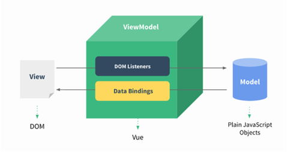

v-model会根据控件类型自动选取正确的方法来更新元素。

下面实例中演示了 input 和 textarea 元素中使用 v-model 实现双向数据绑定：

```html
<div id="app">
  <p>input 元素：</p>
  <input v-model="message" placeholder="编辑我……">
  <p>消息是: {{ message }}</p>
  <p>textarea 元素：</p>
  <p style="white-space: pre">{{ message2 }}</p>
  <textarea v-model="message2" placeholder="多行文本输入……"></textarea>
</div>
<script>
new Vue({
  el: '#app',
  data: {
    message: 'Runoob',
    message2: '菜鸟教程\r\nhttp://www.runoob.com'
  }
})
</script>
```

select 列表实例：

```html
<div id="app">
  <select v-model="selected" name="fruit">
    <option v-for="option in optionsList" :value='option.value'>
      {{option.key}}
    </option>
  </select>

  <div id="output">
    选择的网站是: {{selected}}
  </div>
</div>
<script>
new Vue({
  el: '#app',
  data: {
    optionsList:[{
      key:'选择',
      value:'Select'
    },{
      key:'淘宝',
      value:'taobao'
    },{
      key:'京东',
      value:'jingd'
    },{
      key:'阿里巴巴',
      value:'alibaba'
    },{
      key:'亚马逊',
      value:'amazon'
    },{
      key:'苏宁',
      value:'suning'
    },{
      key:'拼多多',
      value:'pinduoduo'
    }],
    selected: 'Select'
  }
})
</script>
```

单选框绑定到逻辑值；复选框单选时绑定到逻辑值，否则绑定到数组！

### 修饰符

***.lazy***

在默认情况下，v-model在input事件中同步输入框的值与数据，但你可以添加一个修饰符lazy，从而转变为在change事件中同步：

```html
<!-- 在 "change" 而不是 "input" 事件中更新 -->
<input v-model.lazy="msg" >
```

***.number***

如果想自动将用户的输入值转为 Number 类型（如果原值的转换结果为NaN则返回原值），可以添加一个修饰符number给v-model来处理输入值：

```html
<input v-model.number="age" type="number">
```

这通常很有用，因为在type="number"时HTML中输入的值也总是会返回字符串类型。

***.trim***

如果要自动过滤用户输入的首尾空格，可以添加trim修饰符到v-model上过滤输入：

```html
<input v-model.trim="msg">
```

## 组件

组件(Component)是 Vue.js 最强大的功能之一。组件可以扩展 HTML 元素，封装可重用的代码。组件系统让我们可以用独立可复用的小组件来构建大型应用，几乎任意类型的应用的界面都可以抽象为一个组件树：

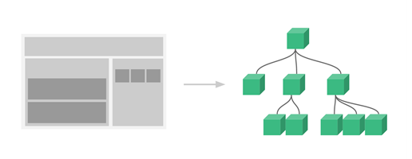

**为什么使用组件？**

为了应对频繁的需求变化！

>注意：Vue组件的模板在某些情况下会受到HTML的限制，比如`<table>`内规定只允许`<tr>`、`<td>`、`<th>`等这些表格元素，所以在`<table>`内直接使用组件是无效的。这种情况下，可以使用特殊的is属性来挂载组件。

注册一个全局组件语法格式如下：`Vue.component(tagName, options)`；tagName 为组件名，options 为配置选项。注册后，我们可以使用以下方式来调用组件：`<tagName></tagName>`

### 全局组件

所有实例都能用全局组件。

```html
<div id="app">
  <runoob></runoob>
</div>
<script>
  // 注册
  Vue.component('runoob', {
    template: '<h1>自定义组件!</h1>'
  })
  // 创建根实例
  new Vue({
    el: '#app'
  })
</script>
```

### 局部组件

全局组件（任何Vue实例都可以使用），局部组件（只有在注册该组件的实例作用域下有效，使用components选项注册，可以嵌套）：

```html
<div id="app">
  <runoob></runoob>
</div>
<script>
  var Child = {
    template: '<h1>自定义组件!</h1>'
  }
  // 创建根实例
  new Vue({
    el: '#app',
    components: {
      // <runoob> 将只在父模板可用
      'runoob': Child
    }
  })
</script>
```

除了template（template的DOM 结构必须被一个元素包含，否则无法渲染）选项外，组件中还可以像Vue实例那样使用其他的选项，比如data、computed、methods等。但是在使用data时，和实例稍有区别，data必须是函数，然后将数据return出去。

JavaScript对象是引用关系，所以如果return出的对象引用了外部的一个对象，那这个对象就是共享的，任何一方修改都会同步。

### 组件通信

组件不仅仅是要把模板的内容进行复用，更重要的是组件间要进行通信。

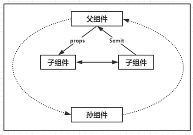

#### props

"prop"是父组件用来传递数据的一个自定义属性。

父组件的数据需要通过props把数据传给子组件，子组件需要显式地用props选项声明"prop"；props的值可以是两种，一种是字符串数组，一种是对象。

```html
<div id="app">
  <child message="hello!"></child>
</div>
<script>
  // 注册
  Vue.component('child', {
    // 声明 props
    props: ['message'],
    // 同样也可以在 vm 实例中像 “this.message” 这样使用
    template: '<span>{{ message }}</span>'
  })
  // 创建根实例
  new Vue({
    el: '#app'
  })
</script>
```

动态 Prop 类似于用 v-bind 绑定 HTML 特性到一个表达式，也可以用 v-bind 动态绑定 props 的值到父组件的数据中。每当父组件的数据变化时，该变化也会传导给子组件：

以下实例中将 v-bind 指令将 todo 传到每一个重复的组件中：

```html
<div id="app">
  <ol>
    <todo-item v-for="item in sites" v-bind:todo="item"></todo-item>
  </ol>
</div>
<script>
Vue.component('todo-item', {
  props: ['todo'],
  template: '<li>{{ todo.text }}</li>'
})
new Vue({
  el: '#app',
  data: {
    sites: [
      { text: 'Runoob' },
      { text: 'Google' },
      { text: 'Taobao' }
    ]
  }
})
</script>
```

props中声明的数据与组件data函数return的数据主要区别就是props的来自父级，而data中的是组件自己的数据，作用域是组件本身，这两种数据都可以在模板template及计算属性computed和方法methods中使用。如果要传递多个数据，在props数组中添加项即可。

由于HTML特性不区分大小写，当使用DOM 模板时，驼峰命名(CamelCase)的props名称要转为短横分隔命名(kebab-case)。如果你要直接传递数字、布尔值、数组、对象，而且不使用v-bind，传递的仅仅是字符串。

Vue2.x通过props传递数据是单向的，也就是父组件数据变化时会传递给子组件，但是反过来不行。

业务中会经常遇到两种需要改变prop的情况，一种是父组件传递初始值进来，子组件将它作为初始值保存起来，在自己的作用域下可以随意使用和修改。这种情况可以在组件data内再声明一个数据，引用父组件的prop。另一种情况就是prop作为需要被转变的原始值传入。这种情况用计算属性就可以了。注意，在js中对象和数组是引用类型，指向同一个内存空间，所以props是对象和数组时，在子组件内改变是会影响父组件的。

Prop验证：组件可以为 props 指定验证要求。prop 是一个对象而不是字符串数组时，它包含验证要求。

```js
Vue.component('my-component', {
  props: {
    // 基础的类型检查 (`null` 和 `undefined` 会通过任何类型验证)
    propA: Number,
    // 多个可能的类型
    propB: [String, Number],
    // 必填的字符串
    propC: {
      type: String,
      required: true
    },
    // 带有默认值的数字
    propD: {
      type: Number,
      default: 100
    },
    // 带有默认值的对象
    propE: {
      type: Object,
      // 对象或数组默认值必须从一个工厂函数获取
      default: function () {
        return { message: 'hello' }
      }
    },
    // 自定义验证函数
    propF: {
      validator: function (value) {
        // 这个值必须匹配下列字符串中的一个
        return ['success', 'warning', 'danger'].indexOf(value) !== -1
      }
    }
  }
})
```

当 prop 验证失败的时候，（开发环境构建版本的）Vue 将会产生一个控制台的警告。type 可以是下面原生构造器：

- String
- Number
- Boolean
- Array
- Object
- Date
- Function
- Symbol

type 也可以是一个自定义构造器，使用 instanceof 检测。

#### 自定义事件

父组件是使用props传递数据给子组件，但如果子组件要把数据传递回去，就需要使用自定义事件！（观察者模式）。我们可以使用v-on绑定自定义事件，每个Vue实例都实现了事件接口(Events interface)，即：

- 父组件使用$on(eventName)监听事件
- 子组件使用$emit(eventName)触发事件

另外，父组件可以在使用子组件的地方直接用v-on来监听子组件触发的事件。

以下实例中子组件已经和它外部完全解耦了。它所做的只是触发一个父组件关心的内部事件。

```html
<div id="app">
  <div id="counter-event-example">
    <p>{{ total }}</p>
    <button-counter v-on:increment="incrementTotal"></button-counter>
    <button-counter v-on:increment="incrementTotal"></button-counter>
  </div>
</div>
<script>
Vue.component('button-counter', {
  template: '<button v-on:click="incrementHandler">{{ counter }}</button>',
  data: function () {
    return {
      counter: 0
    }
  },
  methods: {
    incrementHandler: function () {
      this.counter += 1
      this.$emit('increment')
    }
  },
})
new Vue({
  el: '#counter-event-example',
  data: {
    total: 0
  },
  methods: {
    incrementTotal: function () {
      this.total += 1
    }
  }
})
</script>
```

$emit()方法的第一个参数是自定义事件的名称，后面的参数都是要传递的数据，可以不填或填写多个。

如果你想在某个组件的根元素上监听一个原生(DOM)事件。可以使用 .native 修饰 v-on。例如：

```html
<my-component v-on:click.native="doTheThing"></my-component>
```

#### 其它组件传值

- 中央事件总线bus
- 父子链：$parent, $children，缺点：紧耦合
- 子组件索引：\$refs.componentName，缺点：\$refs只在组件渲染完成后才填充，并且它是非响应式的。它仅仅作为一个直接访问子组件的应急方案，应当避免在模板或计算属性中使用$refs。

### 内容分发

slot：通过\$slots可以访问某个具名slot，this.\$slots.default包括了所有没有被包含在具名slot中的节点。

### 高级用法

#### 组件递归

组件的模板一般都是在template选项内定义的，Vue提供了一个内联模板的功能，在使用组件时，给组件标签使用inline-template特性，组件就会把它的内容当作模板，而不是把它当内容分发，这让模板更灵活。

Vue.js提供了一个特殊的元素`<component>`用来动态地挂载不同的组件，使用is特性来选择要挂载的组件。

#### 异步组件

- $nextTick
- X-Templates

## vue-resource

vue中的\$http服务，需要引入一个叫vue-resource.js的文件，因为vue.js中没有\$http服务。

静态文件引入：

```html
<script src="https://cdn.staticfile.org/vue-resource/1.5.1/vue-resource.min.js"></script>
```

安装vue-resource到项目中，找到当前项目：

```sh
cnpm install vue-resource --save
```

安装完毕后，在main.js中导入，如下所示：

```js
// The Vue build version to load with the `import` command
// (runtime-only or standalone) has been set in webpack.base.conf with an alias.
import Vue from 'vue'
import App from './App'
import router from './router'
import VueResource  from 'vue-resource'

Vue.config.productionTip = false
Vue.use(VueResource)

/* eslint-disable no-new */
new Vue({
  el: '#app',
  router,
  components: { App },
  template: '<App/>'
})
```

- 早期vue团队开发的插件，停止维护了，作者推荐使用axios
- options预检请求，是当浏览器发现跨域 + application/json的请求，就会自动发起，并且发起的时候携带了一个content-type的头

### get

```html
<script src="https://cdn.staticfile.org/vue/2.4.2/vue.min.js"></script>
<script src="https://cdn.staticfile.org/vue-resource/1.5.1/vue-resource.min.js"></script>
<div id="box">
  <input type="button" @click="get()" value="点我异步获取数据(Get)">
</div>
<script type = "text/javascript">
window.onload = function(){
  var vm = new Vue({
    el:'#box',
    data:{
      msg:'Hello World!',
    },
    methods:{
      get: function(){
        //发送get请求
        this.$http.get('/try/ajax/ajax_info.txt').then(function(res){
          document.write(res.body);
        },function(){
          console.log('请求失败处理');
        });
      }
    }
  });
}
</script>
```

如果需要传递数据，可以使用 `this.$http.get('get.php', {params: jsonData})`格式，第二个参数 jsonData 就是传到后端的数据。

### post

post 发送数据到后端，需要第三个参数 `{ emulateJSON: true }`。

emulateJSON 的作用： 如果Web服务器无法处理编码为 application/json 的请求，你可以启用 emulateJSON 选项。

```html
<script src="https://cdn.staticfile.org/vue/2.4.2/vue.min.js"></script>
<script src="https://cdn.staticfile.org/vue-resource/1.5.1/vue-resource.min.js"></script>
<div id="box">
  <input type="button" @click="post()" value="点我异步获取数据(Post)">
</div>
<script type = "text/javascript">
window.onload = function(){
  var vm = new Vue({
    el:'#box',
    data:{
      msg:'Hello World!',
    },
    methods:{
      post:function(){
        //发送 post 请求
        this.$http.post('/try/ajax/demo_test_post.php',
          {
            name:"菜鸟教程",
            url:"http://www.runoob.com"
          },
          {
            emulateJSON: true
          }).then(function(res){
            document.write(res.body);
          }, function(res){
            console.log(res.status);
          });
      }
    }
  });
}
</script>
```

demo_test_post.php 代码如下：

```php
<?php
  $name = isset($_POST['name']) ? htmlspecialchars($_POST['name']) : '';
  $city = isset($_POST['url']) ? htmlspecialchars($_POST['url']) : '';
  echo '网站名: ' . $name;
  echo "\n";
  echo 'URL 地址: ' .$city;
?>
```

### 语法 & API

你可以使用全局对象方式 Vue.http 或者在一个 Vue 实例的内部使用 this.$http 来发起 HTTP 请求。

```js
// 基于全局Vue对象使用http
Vue.http.get('/someUrl', [options]).then(successCallback, errorCallback);
Vue.http.post('/someUrl', [body], [options]).then(successCallback, errorCallback);

// 在一个Vue实例内使用$http
this.$http.get('/someUrl', [options]).then(successCallback, errorCallback);
this.$http.post('/someUrl', [body], [options]).then(successCallback, errorCallback);
```

vue-resource 提供了 7 种请求 API(REST 风格)：

```js
get(url, [options])
head(url, [options])
delete(url, [options])
jsonp(url, [options])
post(url, [body], [options])
put(url, [body], [options])
patch(url, [body], [options])
```

除了 jsonp 以外，另外 6 种的 API 名称是标准的 HTTP 方法。

options 参数说明:

参数|类型|描述
-|-|-
url|string|请求的目标URL
body|Object, FormData, string|作为请求体发送的数据
headers|Object|作为请求头部发送的头部对象
params|Object|作为URL参数的参数对象
method|string|HTTP方法 (例如GET，POST，...)
timeout|number|请求超时（单位：毫秒）(0表示永不超时)
before|function(request)|在请求发送之前修改请求的回调函数
progress|function(event)|用于处理上传进度的回调函数 ProgressEvent
credentials|boolean|是否需要出示用于跨站点请求的凭据
emulateHTTP|boolean|是否需要通过设置X-HTTP-Method-Override头部并且以传统POST方式发送PUT，PATCH和DELETE请求。
emulateJSON|boolean|设置请求体的类型为application/x-www-form-urlencoded

通过如下属性和方法处理一个请求获取到的响应对象：

属性|类型|描述
-|-|-
url|string|响应的 URL 源
body|Object, Blob, string|响应体数据
headers|Header|请求头部对象
ok|boolean|当 HTTP 响应码为 200 到 299 之间的数值时该值为 true
status|number|HTTP 响应码
statusText|string|HTTP 响应状态

---

方法|类型|描述
-|-|-
text()|约定值|以字符串方式返回响应体
json()|约定值|以格式化后的 json 对象方式返回响应体
blob()|约定值|以二进制 Blob 对象方式返回响应体

## axios

Vue.js 2.0 版本推荐使用 axios 来完成 ajax 请求。Axios 是一个基于 Promise 的 HTTP 库，可以用在浏览器和 node.js 中。Github开源地址：[https://github.com/axios/axios](https://github.com/axios/axios)

### 安装方法

使用 cdn:

```html
<script src="https://unpkg.com/axios/dist/axios.min.js"></script>
```

或

```html
<script src="https://cdn.staticfile.org/axios/0.18.0/axios.min.js"></script>
```

使用 npm:

```sh
npm install axios
```

使用 bower:

```sh
bower install axios
```

使用 yarn:

```sh
yarn add axios
```

### 浏览器支持情况

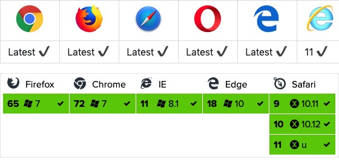

### GET

[示例](../Codes/3.1.1_get.html)查看

### POST

[示例](../Codes/3.1.2_post.js)查看

### axios API

请求方式：

1. this.$axios.get(url,options)
2. this.$axios.post(url,data,options)
3. 配置项

   ```json
   options: {
     params: { id: 1 },  //查询字符串
     headers: { 'content-type': 'xxxxx' },
     baseURL: ''
   }
   ```

全局默认设置：Axios.defaults.baseURL = 'xxxxx';

#### 别名

为方便使用，官方为所有支持的请求方法提供了别名，可以直接使用别名来发起请求：

```js
axios.request(config)
axios.get(url[, config])
axios.delete(url[, config])
axios.head(url[, config])
axios.post(url[, data[, config]])
axios.put(url[, data[, config]])
axios.patch(url[, data[, config]])
```

>注意：在使用别名方法时， url、method、data 这些属性都不必在配置中指定。

#### 并发

处理并发请求的助手函数

```js
axios.all(iterable)
axios.spread(callback)
```

#### 创建实例

可以使用自定义配置新建一个 axios 实例：

```js
axios.create([config])
const instance = axios.create({
  baseURL: 'https://some-domain.com/api/',
  timeout: 1000,
  headers: {'X-Custom-Header': 'foobar'}
});
```

#### 实例方法

以下是可用的实例方法。指定的配置将与实例的配置合并：

```js
axios#request(config)
axios#get(url[, config])
axios#delete(url[, config])
axios#head(url[, config])
axios#post(url[, data[, config]])
axios#put(url[, data[, config]])
axios#patch(url[, data[, config]])
```

#### 请求配置项

下面是创建请求时可用的配置选项，注意只有 url 是必需的。如果没有指定 method，请求将默认使用 get 方法。

```js
{
    // `url` 是用于请求的服务器 URL
    url: "/user",
  
    // `method` 是创建请求时使用的方法
    method: "get", // 默认是 get
  
    // `baseURL` 将自动加在 `url` 前面，除非 `url` 是一个绝对 URL。
    // 它可以通过设置一个 `baseURL` 便于为 axios 实例的方法传递相对 URL
    baseURL: "https://some-domain.com/api/",
  
    // `transformRequest` 允许在向服务器发送前，修改请求数据
    // 只能用在 "PUT", "POST" 和 "PATCH" 这几个请求方法
    // 后面数组中的函数必须返回一个字符串，或 ArrayBuffer，或 Stream
    transformRequest: [function (data) {
      // 对 data 进行任意转换处理
  
      return data;
    }],
  
    // `transformResponse` 在传递给 then/catch 前，允许修改响应数据
    transformResponse: [function (data) {
      // 对 data 进行任意转换处理
  
      return data;
    }],
  
    // `headers` 是即将被发送的自定义请求头
    headers: {"X-Requested-With": "XMLHttpRequest"},
  
    // `params` 是即将与请求一起发送的 URL 参数
    // 必须是一个无格式对象(plain object)或 URLSearchParams 对象
    params: {
      ID: 12345
    },
  
    // `paramsSerializer` 是一个负责 `params` 序列化的函数
    // (e.g. https://www.npmjs.com/package/qs, http://api.jquery.com/jquery.param/)
    paramsSerializer: function(params) {
      return Qs.stringify(params, {arrayFormat: "brackets"})
    },
  
    // `data` 是作为请求主体被发送的数据
    // 只适用于这些请求方法 "PUT", "POST", 和 "PATCH"
    // 在没有设置 `transformRequest` 时，必须是以下类型之一：
    // - string, plain object, ArrayBuffer, ArrayBufferView, URLSearchParams
    // - 浏览器专属：FormData, File, Blob
    // - Node 专属： Stream
    data: {
      firstName: "Fred"
    },
  
    // `timeout` 指定请求超时的毫秒数(0 表示无超时时间)
    // 如果请求话费了超过 `timeout` 的时间，请求将被中断
    timeout: 1000,
  
    // `withCredentials` 表示跨域请求时是否需要使用凭证
    withCredentials: false, // 默认的
  
    // `adapter` 允许自定义处理请求，以使测试更轻松
    // 返回一个 promise 并应用一个有效的响应 (查阅 [response docs](#response-api)).
    adapter: function (config) {
      /* ... */
    },
  
    // `auth` 表示应该使用 HTTP 基础验证，并提供凭据
    // 这将设置一个 `Authorization` 头，覆写掉现有的任意使用 `headers` 设置的自定义 `Authorization`头
    auth: {
      username: "janedoe",
      password: "s00pers3cret"
    },
  
    // `responseType` 表示服务器响应的数据类型，可以是 "arraybuffer", "blob", "document", "json", "text", "stream"
    responseType: "json", // 默认的
  
    // `xsrfCookieName` 是用作 xsrf token 的值的cookie的名称
    xsrfCookieName: "XSRF-TOKEN", // default
  
    // `xsrfHeaderName` 是承载 xsrf token 的值的 HTTP 头的名称
    xsrfHeaderName: "X-XSRF-TOKEN", // 默认的
  
    // `onUploadProgress` 允许为上传处理进度事件
    onUploadProgress: function (progressEvent) {
      // 对原生进度事件的处理
    },
  
    // `onDownloadProgress` 允许为下载处理进度事件
    onDownloadProgress: function (progressEvent) {
      // 对原生进度事件的处理
    },
  
    // `maxContentLength` 定义允许的响应内容的最大尺寸
    maxContentLength: 2000,
  
    // `validateStatus` 定义对于给定的HTTP 响应状态码是 resolve 或 reject  promise 。如果 `validateStatus` 返回 `true` (或者设置为 `null` 或 `undefined`)，promise 将被 resolve; 否则，promise 将被 rejecte
    validateStatus: function (status) {
      return status &gt;= 200 &amp;&amp; status &lt; 300; // 默认的
    },
  
    // `maxRedirects` 定义在 node.js 中 follow 的最大重定向数目
    // 如果设置为0，将不会 follow 任何重定向
    maxRedirects: 5, // 默认的
  
    // `httpAgent` 和 `httpsAgent` 分别在 node.js 中用于定义在执行 http 和 https 时使用的自定义代理。允许像这样配置选项：
    // `keepAlive` 默认没有启用
    httpAgent: new http.Agent({ keepAlive: true }),
    httpsAgent: new https.Agent({ keepAlive: true }),
  
    // "proxy" 定义代理服务器的主机名称和端口
    // `auth` 表示 HTTP 基础验证应当用于连接代理，并提供凭据
    // 这将会设置一个 `Proxy-Authorization` 头，覆写掉已有的通过使用 `header` 设置的自定义 `Proxy-Authorization` 头。
    proxy: {
      host: "127.0.0.1",
      port: 9000,
      auth: : {
        username: "mikeymike",
        password: "rapunz3l"
      }
    },
  
    // `cancelToken` 指定用于取消请求的 cancel token
    // （查看后面的 Cancellation 这节了解更多）
    cancelToken: new CancelToken(function (cancel) {
    })
  }
```

#### 响应结构

axios请求的响应包含以下信息：

```js
{
    // `data` 由服务器提供的响应
    data: {},
  
    // `status`  HTTP 状态码
    status: 200,
  
    // `statusText` 来自服务器响应的 HTTP 状态信息
    statusText: "OK",
  
    // `headers` 服务器响应的头
    headers: {},
  
    // `config` 是为请求提供的配置信息
    config: {}
  }
```

使用 then 时，会接收下面这样的响应：

```js
axios.get("/user/12345")
  .then(function(response) {
    console.log(response.data);
    console.log(response.status);
    console.log(response.statusText);
    console.log(response.headers);
    console.log(response.config);
  });
```

在使用 catch 时，或传递 rejection callback 作为 then 的第二个参数时，响应可以通过 error 对象被使用。

#### 配置的默认值

你可以指定将被用在各个请求的配置默认值。

全局的 axios 默认值：

```js
axios.defaults.baseURL = 'https://api.example.com';
axios.defaults.headers.common['Authorization'] = AUTH_TOKEN;
axios.defaults.headers.post['Content-Type'] = 'application/x-www-form-urlencoded';
```

自定义实例默认值：

```js
// 创建实例时设置配置的默认值
var instance = axios.create({
  baseURL: 'https://api.example.com'
});
  
// 在实例已创建后修改默认值
instance.defaults.headers.common['Authorization'] = AUTH_TOKEN;
```

#### 配置的优先顺序

配置会以一个优先顺序进行合并。这个顺序是：在 lib/defaults.js 找到的库的默认值，然后是实例的 defaults 属性，最后是请求的 config 参数。后者将优先于前者。这里是一个例子：

```js
// 使用由库提供的配置的默认值来创建实例
// 此时超时配置的默认值是 `0`
var instance = axios.create();

// 覆写库的超时默认值
// 现在，在超时前，所有请求都会等待 2.5 秒
instance.defaults.timeout = 2500;

// 为已知需要花费很长时间的请求覆写超时设置
instance.get('/longRequest', {
  timeout: 5000
});
```

#### 拦截器

在请求或响应被 then 或 catch 处理前拦截它们。

```js
// 添加请求拦截器
axios.interceptors.request.use(function (config) {
    // 在发送请求之前做些什么
    return config;
  }, function (error) {
    // 对请求错误做些什么
    return Promise.reject(error);
  });

// 添加响应拦截器
axios.interceptors.response.use(function (response) {
    // 对响应数据做点什么
    return response;
  }, function (error) {
    // 对响应错误做点什么
    return Promise.reject(error);
  });
```

如果你想在稍后移除拦截器，可以这样：

```js
var myInterceptor = axios.interceptors.request.use(function () {/*...*/});
axios.interceptors.request.eject(myInterceptor);
```

可以为自定义 axios 实例添加拦截器。

```js
var instance = axios.create();
instance.interceptors.request.use(function () {/*...*/});
```

#### 错误处理

```js
axios.get('/user/12345')
  .catch(function (error) {
    if (error.response) {
      // 请求已发出，但服务器响应的状态码不在 2xx 范围内
      console.log(error.response.data);
      console.log(error.response.status);
      console.log(error.response.headers);
    } else {
      // Something happened in setting up the request that triggered an Error
      console.log('Error', error.message);
    }
    console.log(error.config);
  });
```

可以使用 validateStatus 配置选项定义一个自定义 HTTP 状态码的错误范围。

```js
axios.get('/user/12345', {
    validateStatus: function (status) {
      return status < 500; // 状态码在大于或等于500时才会 reject
    }
  })
```

#### 取消

使用 cancel token 取消请求。Axios 的 cancel token API 基于cancelable promises proposal。可以使用 CancelToken.source 工厂方法创建 cancel token，像这样：

```js
var CancelToken = axios.CancelToken;
var source = CancelToken.source();

axios.get('/user/12345', {
  cancelToken: source.token
}).catch(function(thrown) {
  if (axios.isCancel(thrown)) {
    console.log('Request canceled', thrown.message);
  } else {
    // 处理错误
  }
});

// 取消请求（message 参数是可选的）
source.cancel('Operation canceled by the user.');
```

还可以通过传递一个 executor 函数到 CancelToken 的构造函数来创建 cancel token：

```js
var CancelToken = axios.CancelToken;
var cancel;

axios.get('/user/12345', {
  cancelToken: new CancelToken(function executor(c) {
    // executor 函数接收一个 cancel 函数作为参数
    cancel = c;
  })
});

// 取消请求
cancel();
```

>注意：可以使用同一个 cancel token 取消多个请求。

#### 请求时使用 application/x-www-form-urlencoded

axios 会默认序列化 JavaScript 对象为 JSON。 如果想使用 application/x-www-form-urlencoded 格式，你可以使用下面的配置。

**浏览器：**

在浏览器环境，你可以使用 URLSearchParams API

```js
const params = new URLSearchParams();
params.append('param1', 'value1');
params.append('param2', 'value2');
axios.post('/foo', params);
```

URLSearchParams 不是所有的浏览器均支持。

除此之外，你可以使用 qs 库来编码数据：

```js
const qs = require('qs');
axios.post('/foo', qs.stringify({ 'bar': 123 }));

// Or in another way (ES6),

import qs from 'qs';
const data = { 'bar': 123 };
const options = {
  method: 'POST',
  headers: { 'content-type': 'application/x-www-form-urlencoded' },
  data: qs.stringify(data),
  url,
};
axios(options);
```

**Node.js 环境：**

在 node.js里，可以使用 querystring 模块：

```js
const querystring = require('querystring');
axios.post('http://something.com/', querystring.stringify({ foo: 'bar' }));
```

当然，同浏览器一样，你还可以使用 qs 库。

**Promises：**

axios 依赖原生的 ES6 Promise 实现而被支持。

如果你的环境不支持 ES6 Promise，你可以使用 polyfill。

**TypeScript支持：**

axios 包含 TypeScript 的定义。

```js
import axios from "axios";
axios.get("/user?ID=12345");
```

### 项目中示例

```js
import axios from 'axios'
import qs from 'qs'
import router from '@/router'

let app = null
const getAppId = setInterval(() => {
  if (window.app.$notify) {
    clearInterval(getAppId)
    app = window.app
  }
}, 60)

axios.defaults.timeout = 60000 // 响应时间
axios.defaults.headers.post['Content-Type'] = 'application/x-www-form-urlencoded;charset=UTF-8' // 配置请求头
axios.defaults.headers['x-requested-with'] = 'XMLHttpRequest' // 让后台判断是否ajax请求
axios.defaults.baseURL = window.config.backUrl // 配置接口地址

// status < 500 不会抛错误
axios.defaults.validateStatus = status => {
  return status < 500
}

// 设置请求token
axios.interceptors.request.use(config => {
  if (sessionStorage.getItem('token')) {
    var token = sessionStorage.getItem('token')
    config.headers['Authorization'] = 'Bearer ' + token
  }
  // 在发送请求之前做某件事
  if (config.method === 'post') {
    config.data = qs.stringify(config.data)
  } else if (config.method === 'get') {
    // 加上时间戳，不使用缓存
    if (!config.params) {
      config.params = {}
    }
    config.params.time = new Date().getTime()
  }
  // console.log(config)
  return config
}, (error) => {
  console.log('错误的传参')
  return Promise.reject(error)
})

// 接口错误拦截
axios.interceptors.response.use(res => {
  if (res.status === 401) {
    if (document.getElementsByClassName('el-message').length === 0) {
      app.$message({
        type: 'warning',
        message: '登录身份过期，请重新登录。'
      })
    }
    sessionStorage.removeItem('token')
    sessionStorage.removeItem('user')
    router.push({ name: 'login' })
    return Promise.reject(new Error('身份过期'))
  } else if (res.status === 200) {
    const statusCode = res['data']['Code'] // 错误码
    const message = res['data']['Msg'] // 错误信息
    const data = res['data']['Data'] // 返回数据
    if (statusCode && statusCode !== 200 && message) { // 后台返回错误信息
      if (document.getElementsByClassName('el-message').length === 0) {
        app.$message({ type: 'error', message: message, duration: 3000 })
      }
      return Promise.reject(message)
    } else {
      return Promise.resolve(data)
    }
  } else {
    app.$notify.error({
      title: '接口异常!',
      message: `异常原因: [ ${res.config.url} ] ${res.status} ${res.statusText}`
    })
    return res.data
  }
}, err => {
  app.$notify.error({
    title: '服务错误',
    message: '服务器响应错误 ' + err.message
  })
  return Promise.reject(err)
})

// 返回一个Promise（发送post请求）
export function post (url, params) {
  return new Promise((resolve, reject) => {
    axios.post(url, params).then(response => {
      resolve(response)
    }, err => {
      reject(err)
    }).catch((error) => {
      reject(error)
    })
  })
}

// 返回一个Promise（发送get请求）
export function get (url, param) {
  return new Promise((resolve, reject) => {
    axios.get(url, { params: param }).then(response => {
      resolve(response)
    }, err => {
      reject(err)
    }).catch((error) => {
      reject(error)
    })
  })
}

export function getFile (url, param) {
  return new Promise((resolve, reject) => {
    axios({
      method: 'post',
      responseType: 'blob',
      url: url,
      params: param
    })// axios.get(url, { params: param }, { responseType: 'blob' })
      .then(response => {
        resolve(response)
        if (response != null) {
          let url = window.URL.createObjectURL(new Blob([response]))
          let link = document.createElement('a')
          link.style.display = 'none'
          link.href = url
          link.setAttribute('download', param.fileName || 'example.doc') // 自定义下载文件名（如exemple.txt）
          document.body.appendChild(link)
          link.click()
        }
      }, err => {
        reject(err)
      }).catch((error) => {
        reject(error)
      })
  })
}

export default {
  post,
  get,
  getFile
}
```

继续优化：

1. 优化axios封装，去掉之前的get和post
2. 断网情况处理
3. 更加模块化的api管理
4. 接口域名有多个的情况
5. api挂载到vue.prototype上省去引入的步骤

http.js中axios封装的优化，先直接贴代码：

```js
/**
  * axios封装
  * 请求拦截、响应拦截、错误统一处理
  */
import axios from 'axios';
import router from '../router';
import store from '../store/index';
import { Toast } from 'vant';

/**
  * 提示函数
  * 禁止点击蒙层、显示一秒后关闭
  */
const tip = msg => {
    Toast({
        message: msg,
        duration: 1000,
        forbidClick: true
    });
}

/**
  * 跳转登录页
  * 携带当前页面路由，以期在登录页面完成登录后返回当前页面
  */
const toLogin = () => {
    router.replace({
        path: '/login',
        query: {
            redirect: router.currentRoute.fullPath
        }
    });
}

/**
  * 请求失败后的错误统一处理
  * @param {Number} status 请求失败的状态码
  */
const errorHandle = (status, other) => {
    // 状态码判断
    switch (status) {
        // 401: 未登录状态，跳转登录页
        case 401:
            toLogin();
            break;
        // 403 token过期
        // 清除token并跳转登录页
        case 403:
            tip('登录过期，请重新登录');
            localStorage.removeItem('token');
            store.commit('loginSuccess', null);
            setTimeout(() => {
                toLogin();
            }, 1000);
            break;
        // 404请求不存在
        case 404:
            tip('请求的资源不存在');
            break;
        default:
            console.log(other);
        }}

// 创建axios实例
var instance = axios.create({    timeout: 1000 * 12});
// 设置post请求头
instance.defaults.headers.post['Content-Type'] = 'application/x-www-form-urlencoded';
/**
  * 请求拦截器
  * 每次请求前，如果存在token则在请求头中携带token
  */
instance.interceptors.request.use(
    config => {
        // 登录流程控制中，根据本地是否存在token判断用户的登录情况
        // 但是即使token存在，也有可能token是过期的，所以在每次的请求头中携带token
        // 后台根据携带的token判断用户的登录情况，并返回给我们对应的状态码
        // 而后我们可以在响应拦截器中，根据状态码进行一些统一的操作。
        const token = store.state.token;
        token && (config.headers.Authorization = token);
        return config;
    },
    error => Promise.error(error))

// 响应拦截器
instance.interceptors.response.use(
    // 请求成功
    res => res.status === 200 ? Promise.resolve(res) : Promise.reject(res),
    // 请求失败
    error => {
        const { response } = error;
        if (response) {
            // 请求已发出，但是不在2xx的范围
            errorHandle(response.status, response.data.message);
            return Promise.reject(response);
        } else {
            // 处理断网的情况
            // eg:请求超时或断网时，更新state的network状态
            // network状态在app.vue中控制着一个全局的断网提示组件的显示隐藏
            // 关于断网组件中的刷新重新获取数据，会在断网组件中说明
            store.commit('changeNetwork', false);
        }
    });

export default instance;
```

这个axios和之前的大同小异，做了如下几点改变：

1. 去掉了之前get和post方法的封装，通过创建一个axios实例然后export default方法导出，这样使用起来更灵活一些。
2. 去掉了通过环境变量控制baseUrl的值。考虑到接口会有多个不同域名的情况，所以准备通过js变量来控制接口域名。这点具体在api里会介绍。
3. 增加了请求超时，即断网状态的处理。说下思路，当断网时，通过更新vuex中network的状态来控制断网提示组件的显示隐藏。断网提示一般会有重新加载数据的操作，这步会在后面对应的地方介绍。
4. 公用函数进行抽出，简化代码，尽量保证单一职责原则。

下面说下api这块，考虑到一下需求：

1. 更加模块化
2. 更方便多人开发，有效减少解决命名冲突
3. 处理接口域名有多个情况

这里这里呢新建了一个api文件夹，里面有一个index.js和一个base.js，以及多个根据模块划分的接口js文件。index.js是一个api的出口，base.js管理接口域名，其他js则用来管理各个模块的接口。

先放index.js代码：

```js
/**
  * api接口的统一出口
  */
// 文章模块接口
import article from '@/api/article';
// 其他模块的接口……

// 导出接口
export default {
    article,
    // ……
}
```

index.js是一个api接口的出口，这样就可以把api接口根据功能划分为多个模块，利于多人协作开发，比如一个人只负责一个模块的开发等，还能方便每个模块中接口的命名哦。

base.js:

```js
/**
  * 接口域名的管理
  */
const base = {
    sq: 'https://xxxx111111.com/api/v1',
    bd: 'http://xxxxx22222.com/api'
}

export default base;
```

通过base.js来管理我们的接口域名，不管有多少个都可以通过这里进行接口的定义。即使修改起来，也是很方便的。

最后就是接口模块的说明，例如上面的article.js:

```js
/**
  * article模块接口列表
  */
import base from './base'; // 导入接口域名列表
import axios from '@/utils/http'; // 导入http中创建的axios实例
import qs from 'qs'; // 根据需求是否导入qs模块

const article = {
    // 新闻列表
    articleList () {
        return axios.get(`${base.sq}/topics`);
    },
    // 新闻详情,演示
    articleDetail (id, params) {
        return axios.get(`${base.sq}/topic/${id}`, {
            params: params
        });
    },
    // post提交
    login (params) {
        return axios.post(`${base.sq}/accesstoken`, qs.stringify(params));
    }
    // 其他接口…………
}

export default article;
```

1. 通过直接引入我们封装好的axios实例，然后定义接口、调用axios实例并返回，可以更灵活的使用axios，比如你可以对post请求时提交的数据进行一个qs序列化的处理等。
2. 请求的配置更灵活，你可以针对某个需求进行一个不同的配置。关于配置的优先级，axios文档说的很清楚，这个顺序是：在 lib/defaults.js 找到的库的默认值，然后是实例的 defaults 属性，最后是请求的 config 参数。后者将优先于前者。
3. restful风格的接口，也可以通过这种方式灵活的设置api接口地址。

最后，为了方便api的调用，我们需要将其挂载到vue的原型上。在main.js中：

```js
import Vue from 'vue'
import App from './App'
import router from './router' // 导入路由文件
import store from './store' // 导入vuex文件
import api from './api' // 导入api接口

Vue.prototype.$api = api; // 将api挂载到vue的原型上
```

然后我们可以在页面中这样调用接口，eg：

```js
methods: {
    onLoad(id) {
        this.$api.article.articleDetail(id, {
            api: 123
        }).then(res=> {
            // 执行某些操作
        })
    }
}
```

再提一下断网的处理，这里只做一个简单的示例：

```html
<template>
    <div id="app">
        <div v-if="!network">
            <h3>我没网了</h3>
            <div @click="onRefresh">刷新</div>
        </div>
        <router-view/>
    </div>
</template>

<script>
    import { mapState } from 'vuex';
    export default {
        name: 'App',
        computed: {
            ...mapState(['network'])
        },
        methods: {
            // 通过跳转一个空页面再返回的方式来实现刷新当前页面数据的目的
            onRefresh () {
                this.$router.replace('/refresh')
            }
        }
    }
</script>
```

这是app.vue，这里简单演示一下断网。在http.js中介绍了，我们会在断网的时候，来更新vue中network的状态，那么这里我们根据network的状态来判断是否需要加载这个断网组件。断网情况下，加载断网组件，不加载对应页面的组件。当点击刷新的时候，我们通过跳转refesh页面然后立即返回的方式来实现重新获取数据的操作。因此我们需要新建一个refresh.vue页面，并在其beforeRouteEnter钩子中再返回当前页面。

```js
// refresh.vue
beforeRouteEnter (to, from, next) {
    next(vm => {
        vm.$router.replace(from.fullPath)
    })
}
```

这是一种全局通用的断网提示，当然了，也可以根据自己的项目需求操作。具体操作就仁者见仁智者见智了。

如果更多的需求，或者说是不一样的需求，可以根据自己的需求进行一个改进。

## vue-router

Vue.js 路由允许我们通过不同的 URL 访问不同的内容，实现多视图的单页Web应用（single page web application，SPA）。

Vue.js 路由需要载入[vue-router](https://github.com/vuejs/vue-router)库，中文文档地址：[vue-router文档](https://github.com/vuejs/vue-router)。

npm 简单的路由[实例](https://github.com/chrisvfritz/vue-2.0-simple-routing-example)：

下载完后，解压该目录并进入该目录，执行以下命令：

```sh
# 安装依赖，使用淘宝资源命令 cnpm
cnpm install
# 启动应用，地址为 localhost:8080
cnpm run dev
```

如果你需要发布到正式环境可以执行以下命令：

```sh
cnpm run build
```

执行成功后，访问 `http://localhost:8080` 查看效果

**总结：**

- 有时候，同一个路径可以匹配多个路由，此时，匹配的优先级就按照路由的定义顺序：谁先定义的，谁的优先级就最高。
- url的param之前要加"#/"才能访问定义的路由（hash模式）
- vue-router的切换不同于传统的页面的切换。路由之间的切换，其实就是组件之间的切换，不是真正的页面切换。这也会导致一个问题，就是引用相同组件的时候，会导致该组件无法更新，也就是我们口中的页面无法更新的问题了。

  >解决方法：[https://blog.csdn.net/w390058785/article/details/82813032](https://blog.csdn.net/w390058785/article/details/82813032)

- 前端路由：核心就是锚点值的改变，根据不同的值，渲染指定DOM位置的不同数据
- ui-router：锚点值改变，如何获取模板？ajax？vue中，模板数据不是通过ajax请求来，而是调用函数获取到模板内容；核心：锚点值改变
- 使用方式：
  1. 下载 `npm i vue-router -S`
  2. 在main.js中引入 `import VueRouter from 'vue-router';`
  3. 安装插件 `Vue.use(VueRouter);`
  4. 创建路由对象并配置路由规则  
  
     ```js
     let router = new VueRouter({ routes:[ {path:'/home',component:Home} ]});
     ```

  5. 将其路由对象传递给Vue的实例，options中加入 `router:router`
  6. 在app.vue中留坑 `<router-view></router-view>`

- 在vue-router中，有两大对象被挂载到了实例this：`$route`（只读、具备信息的对象）、`$router`（具备功能函数）

- 查询字符串：

  1. 去哪里

     ```html
     <router-link :to="{name:'detail',query:{id:1}} ">xxx</router-link>
     <router-link :to="{name:'detail',params:{name:1}} ">xxx</router-link>
     ```

  2. 导航（查询字符串path不用改）

     ```html
     <router-link :to="{ name: 'detail', path: '/detail', 组件 }">xxx</router-link>
     <router-link :to="{ name: 'detail', path: '/detail/:name', 组件 }">xxx</router-link>
     ```

  3. 去了干嘛，获取路由参数（要注意是query还是params和对应id名）：`this.$route.query.id`，`this.$route.params.name`

  >使用`params`，参数不会拼接在路由后面，地址栏上看不到参数。由于动态路由也是传递params的，所以在 `this.$router.push()` 方法中 `path` 不能和 `params` 一起使用，否则 `params` 将无效，需要用 name 来指定页面及通过路由配置的 name 属性访问

- `this.$router.go` 根据浏览器记录 前进1 后退-1
- `this.$router.push`（直接跳转到某个页面显示）
  - push参数：字符串 /xxx
  - 对象：`{name:'xxx', query:{id:1}, params:{name:2}}`

- 前端路由原理：
  - `window.addEventListener('hashchange', fn);`
  - 根据你放 `<router-view></router-view><div id="xxx"></div>` 作为一个DOM上的标识
  - 最终当锚点值改变触发hashchange的回调函数，我们将指定的模板数据插入到DOM标识上

- 重定向和404

  - 进入后，默认就是 /
  - 重定向 `{path:'/', redirect:'/home'}` 或 `{path:'/',redirect:{name:'home'}}`
  - 404: 路由规则的最后一个，写一个很强大的匹配： `{path:'*',component:notFoundVue}`

- 多视图：

  - 以前可以一次放一个坑对应一个路由和显示一个组件
    - 一次行为 = 一个坑 + 一个路由 + 一个组件
    - 一次行为 = 多个坑 + 一个路由 + 多个组件
  - components 多视图 是一个对象 对象内多个key和value
    - key对应视图的name属性
    - value 就是要显示的组件对象
  - 多个视图`<router-view></router-view>` -> name就是default
  - `<router-view name='xxx'></router-view>` -> name就是xxx

- 嵌套路由：

  - 用单页去实现多页应用，复杂的嵌套路由
  - 开发中一般会需要使用
  - 视图包含视图
  - 路由父子级关系路由

  ```javascript
  //期组件内包含着第一层router-view
  {
    name:'music',path:'/music',component:Music,
    children:[//子路由的path，/就是绝对路径，不/就是相对父级路径
      {name:'music.oumei',path:'oumei',component:Oumei},
      {name:'music.guochan',path:'guochan',component:Guochan}
    ]
  }  
  ```

  - 由于路由的跳转会导致整个router-view重新渲染，其中如果有些部分从未发生改变，就没有必要重新渲染，由此嵌套路由就能解决该问题。

- 编程式导航

  - 模拟类似用户点击的行为，通过程序来发生锚点值改变，从而触发后续的行为
  - 借助浏览器history历史功能向前和向后的功能
  - 在vue-router安装插件以后，就多了两个属性
    - this.$route：具备路由信息只读的 req
    - this.$router：具备相关功能 res

  ```javascript
  //跳转会home页面
  this.$router.push({
    name: 'home',
    path: '/'
  });  
  //参数可以是字符串代表path，也可以给对象（命名路由）
  //后退
  this.$router.go(-1);
  //就是用程序操作历史记录及导航栏url
  ```

- 路由操作的基本步骤

  ```javascript
  // 引入对象
  import VueRouter from 'vue-router';
  // 安装插件
  Vue.use(VueRouter); // 挂载属性的行为
  // 创建路由对象
  let router = new VueRouter({
    routes:[{ name:'xxx', path:'/xxx', 组件 }]
  });
  // 将路由对象放入到options中new Vue()
  new Vue({ router })
  ```

- 路由钩子函数

  ```javascript
  beforeRouteEnter (to, from, next) {
    // 在渲染该组件的对应路由被 confirm 前调用
    // 不！能！获取组件实例 `this`
    // 因为当钩子执行前，组件实例还没被创建
  },
  beforeRouteUpdate (to, from, next) {
    // 在当前路由改变，但是该组件被复用时调用
    // 举例来说，对于一个带有动态参数的路径 /foo/:id，在 /foo/1 和 /foo/2 之间跳转的时候，由于会渲染同样的 Foo 组件，因此组件实例会被复用。而这个钩子就会在这个情况下被调用。
    // 可以访问组件实例 `this`
  },
  beforeRouteLeave (to, from, next) {
    // 导航离开该组件的对应路由时调用
    // 可以访问组件实例 `this`
  }
  ```

## i18n

- internationalization
- 国际化
- index.html -> 中国人
- index.html -> 美国人
- vue-i18n

## wappalyzer

获取到当前网站的使用的技术：[https://wappalyzer.com/download](https://wappalyzer.com/download)

## Vuex

**Vuex 是什么？**

Vuex 是一个专为 Vue.js 应用程序开发的状态管理模式。它采用集中式存储管理应用的所有组件的状态，并以相应的规则保证状态以一种可预测的方式发生变化。Vuex 也集成到 Vue 的官方调试工具 devtools extension，提供了诸如零配置的 time-travel 调试、状态快照导入导出等高级调试功能。

**什么是“状态管理模式”？**

让我们从一个简单的 Vue 计数应用开始：

```js
new Vue({
  // state
  data () {
    return {
      count: 0
    }
  },
  // view
  template: `
    <div>{{ count }}</div>
  `,
  // actions
  methods: {
    increment () {
      this.count++
    }
  }
})
```

这个状态自管理应用包含以下几个部分：

- state，驱动应用的数据源；
- view，以声明方式将 state 映射到视图；
- actions，响应在 view 上的用户输入导致的状态变化。

以下是一个表示“单向数据流”理念的极简示意：

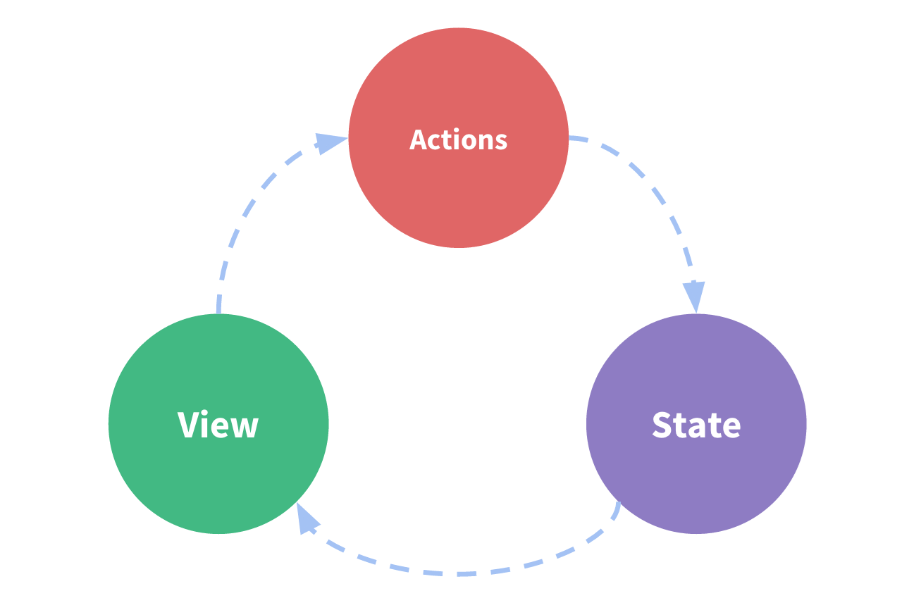

但是，当我们的应用遇到多个组件共享状态时，单向数据流的简洁性很容易被破坏：

- 多个视图依赖于同一状态。
- 来自不同视图的行为需要变更同一状态。

对于问题一，传参的方法对于多层嵌套的组件将会非常繁琐，并且对于兄弟组件间的状态传递无能为力。对于问题二，我们经常会采用父子组件直接引用或者通过事件来变更和同步状态的多份拷贝。以上的这些模式非常脆弱，通常会导致无法维护的代码。

因此，我们为什么不把组件的共享状态抽取出来，以一个全局单例模式管理呢？在这种模式下，我们的组件树构成了一个巨大的“视图”，不管在树的哪个位置，任何组件都能获取状态或者触发行为！

另外，通过定义和隔离状态管理中的各种概念并强制遵守一定的规则，我们的代码将会变得更结构化且易维护。

这就是 Vuex 背后的基本思想，借鉴了 [Flux](https://facebook.github.io/flux/docs/overview.html)、[Redux](http://redux.js.org/) 和 [The Elm Architecture](https://guide.elm-lang.org/architecture/)。与其他模式不同的是，Vuex 是专门为 Vue.js 设计的状态管理库，以利用 Vue.js 的细粒度数据响应机制来进行高效的状态更新。

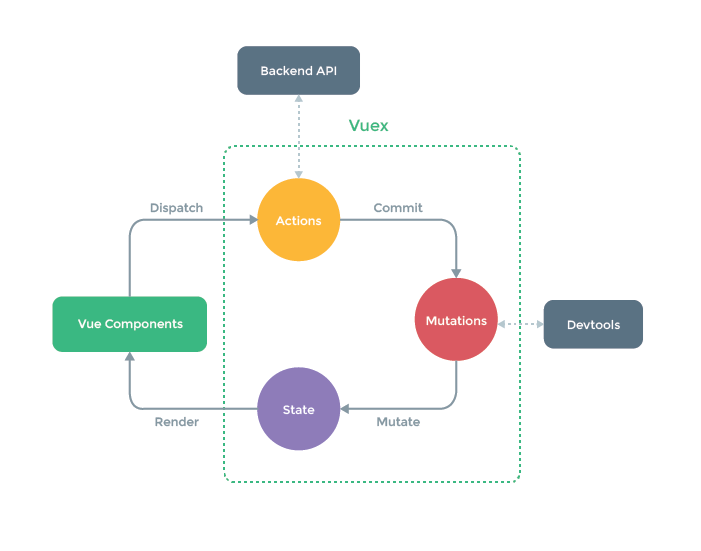

**什么情况下我应该使用 Vuex？**

虽然 Vuex 可以帮助我们管理共享状态，但也附带了更多的概念和框架。这需要对短期和长期效益进行权衡。

如果您不打算开发大型单页应用，使用 Vuex 可能是繁琐冗余的。确实是如此——如果您的应用够简单，您最好不要使用 Vuex。一个简单的 [store 模式](https://cn.vuejs.org/v2/guide/state-management.html#%E7%AE%80%E5%8D%95%E7%8A%B6%E6%80%81%E7%AE%A1%E7%90%86%E8%B5%B7%E6%AD%A5%E4%BD%BF%E7%94%A8)就足够您所需了。但是，如果您需要构建一个中大型单页应用，您很可能会考虑如何更好地在组件外部管理状态，Vuex 将会成为自然而然的选择。引用 Redux 的作者 Dan Abramov 的话说就是：

>Flux 架构就像眼镜：您自会知道什么时候需要它。

安装：

- 直接下载 / CDN 引用：[https://unpkg.com/vuex](https://unpkg.com/vuex)

  Unpkg.com 提供了基于 NPM 的 CDN 链接。以上的链接会一直指向 NPM 上发布的最新版本。您也可以通过 [https://unpkg.com/vuex@2.0.0](https://unpkg.com/vuex@2.0.0) 这样的方式指定特定的版本。

  在 Vue 之后引入 vuex 会进行自动安装：

  ```html
  <script src="/path/to/vue.js"></script>
  <script src="/path/to/vuex.js"></script>
  ```

- NPM

  ```sh
  npm install vuex --save
  ```

- Yarn

  ```sh
  yarn add vuex
  ```

  在一个模块化的打包系统中，您必须显式地通过 Vue.use() 来安装 Vuex：

  ```js
  import Vue from 'vue'
  import Vuex from 'vuex'

  Vue.use(Vuex)
  ```

  当使用全局 script 标签引用 Vuex 时，不需要以上安装过程。

- Promise

  Vuex 依赖 Promise。如果你支持的浏览器并没有实现 Promise (比如 IE)，那么你可以使用一个 polyfill 的库，例如 es6-promise。

  你可以通过 CDN 将其引入：

  ```html
  <script src="https://cdn.jsdelivr.net/npm/es6-promise@4/dist/es6-promise.auto.js"></script>
  ```

  然后 window.Promise 会自动可用。

  如果你喜欢使用诸如 npm 或 Yarn 等包管理器，可以按照下列方式执行安装：

  ```sh
  npm install es6-promise --save # npm
  yarn add es6-promise # Yarn
  ```

  或者更进一步，将下列代码添加到你使用 Vuex 之前的一个地方：

  ```js
  import 'es6-promise/auto'
  ```

- 自己构建

  如果需要使用 dev 分支下的最新版本，您可以直接从 GitHub 上克隆代码并自己构建。

  ```sh
  git clone https://github.com/vuejs/vuex.git node_modules/vuex
  cd node_modules/vuex
  npm install
  npm run build
  ```

### 开始

每一个 Vuex 应用的核心就是 store（仓库）。"store"基本上就是一个容器，它包含着你的应用中大部分的状态 (state)。Vuex 和单纯的全局对象有以下两点不同：

1. Vuex 的状态存储是响应式的。当 Vue 组件从 store 中读取状态的时候，若 store 中的状态发生变化，那么相应的组件也会相应地得到高效更新。

2. 你不能直接改变 store 中的状态。改变 store 中的状态的唯一途径就是显式地提交 (commit) mutation。这样使得我们可以方便地跟踪每一个状态的变化，从而让我们能够实现一些工具帮助我们更好地了解我们的应用。

**最简单的 Store：**

>提示： 我们将在后续的文档示例代码中使用 ES2015 语法。如果你还没能掌握 ES2015，你得抓紧了！安装 Vuex 之后，让我们来创建一个 store。创建过程直截了当——仅需要提供一个初始 state 对象和一些 mutation：

```js
// 如果在模块化构建系统中，请确保在开头调用了 Vue.use(Vuex)
const store = new Vuex.Store({
  state: {
    count: 0
  },
  mutations: {
    increment (state) {
      state.count++
    }
  }
})
```

现在，你可以通过 store.state 来获取状态对象，以及通过 store.commit 方法触发状态变更：

```js
store.commit('increment')
console.log(store.state.count) // -> 1
```

再次强调，我们通过提交 mutation 的方式，而非直接改变 store.state.count，是因为我们想要更明确地追踪到状态的变化。这个简单的约定能够让你的意图更加明显，这样你在阅读代码的时候能更容易地解读应用内部的状态改变。此外，这样也让我们有机会去实现一些能记录每次状态改变，保存状态快照的调试工具。有了它，我们甚至可以实现如时间穿梭般的调试体验。

由于 store 中的状态是响应式的，在组件中调用 store 中的状态简单到仅需要在计算属性中返回即可。触发变化也仅仅是在组件的 methods 中提交 mutation。

这是一个最基本的 Vuex 记数应用示例。接下来，我们将会更深入地探讨一些核心概念。让我们先从 State 概念开始。

### State

**单一状态树：**

Vuex 使用单一状态树——是的，用一个对象就包含了全部的应用层级状态。至此它便作为一个“唯一数据源 (SSOT)”而存在。这也意味着，每个应用将仅仅包含一个 store 实例。单一状态树让我们能够直接地定位任一特定的状态片段，在调试的过程中也能轻易地取得整个当前应用状态的快照。

单状态树和模块化并不冲突——在后面的章节里我们会讨论如何将状态和状态变更事件分布到各个子模块中。

**在 Vue 组件中获得 Vuex 状态：**

那么我们如何在 Vue 组件中展示状态呢？由于 Vuex 的状态存储是响应式的，从 store 实例中读取状态最简单的方法就是在计算属性中返回某个状态：

```js
// 创建一个 Counter 组件
const Counter = {
  template: `<div>{{ count }}</div>`,
  computed: {
    count () {
      return store.state.count
    }
  }
}
```

每当 store.state.count 变化的时候，都会重新求取计算属性，并且触发更新相关联的 DOM。然而，这种模式导致组件依赖全局状态单例。在模块化的构建系统中，在每个需要使用 state 的组件中需要频繁地导入，并且在测试组件时需要模拟状态。

Vuex 通过 store 选项，提供了一种机制将状态从根组件“注入”到每一个子组件中（需调用 Vue.use(Vuex)）：

```js
const app = new Vue({
  el: '#app',
  // 把 store 对象提供给 "store" 选项，这可以把 store 的实例注入所有的子组件
  store,
  components: { Counter },
  template: `
    <div class="app">
      <counter></counter>
    </div>
  `
})
```

通过在根实例中注册 store 选项，该 store 实例会注入到根组件下的所有子组件中，且子组件能通过 this.$store 访问到。让我们更新下 Counter 的实现：

```js
const Counter = {
  template: `<div>{{ count }}</div>`,
  computed: {
    count () {
      return this.$store.state.count
    }
  }
}
```

**mapState 辅助函数：**

当一个组件需要获取多个状态时候，将这些状态都声明为计算属性会有些重复和冗余。为了解决这个问题，我们可以使用 mapState 辅助函数帮助我们生成计算属性，让你少按几次键：

```js
// 在单独构建的版本中辅助函数为 Vuex.mapState
import { mapState } from 'vuex'
export default {
  // ...
  computed: mapState({
    // 箭头函数可使代码更简练
    count: state => state.count,
    // 传字符串参数 'count' 等同于 `state => state.count`
    countAlias: 'count',
    // 为了能够使用 `this` 获取局部状态，必须使用常规函数
    countPlusLocalState (state) {
      return state.count + this.localCount
    }
  })
}
```

当映射的计算属性的名称与 state 的子节点名称相同时，我们也可以给 mapState 传一个字符串数组。

```js
computed: mapState([
  // 映射 this.count 为 store.state.count
  'count'
])
```

**对象展开运算符：**

mapState 函数返回的是一个对象。我们如何将它与局部计算属性混合使用呢？通常，我们需要使用一个工具函数将多个对象合并为一个，以使我们可以将最终对象传给 computed 属性。但是自从有了对象展开运算符（现处于 ECMASCript 提案 stage-4 阶段），我们可以极大地简化写法：

```js
computed: {
  localComputed () { /* ... */ },
  // 使用对象展开运算符将此对象混入到外部对象中
  ...mapState({
    // ...
  })
}
```

**组件仍然保有局部状态：**

使用 Vuex 并不意味着你需要将所有的状态放入 Vuex。虽然将所有的状态放到 Vuex 会使状态变化更显式和易调试，但也会使代码变得冗长和不直观。如果有些状态严格属于单个组件，最好还是作为组件的局部状态。你应该根据你的应用开发需要进行权衡和确定。

## ElementUI插件

官方网站：[https://element.eleme.cn/#/zh-CN](https://element.eleme.cn/#/zh-CN)

### 表单验证

通过 form rule 实现。示例如下：

该示例实现的是密码输入框的输入字符验证

html：

```html
<el-form ref="myModel" :model="form" :rules="rules" size="small" label-width="100px">
  <el-form-item label="密码" prop="Password">
    <el-input v-model="form.Password" autocomplete="off" :maxlength="12" :minlength="6" style="width:300px" show-password>
    </el-input>
  </el-form-item>
</el-form>
```

js:

```js
export default {
  name: "demo",
  data: function() {
    return {
      form: {
        Password: ""
      },
      rules: {
        Password: [
          { required: true, message: "请输入密码", trigger: ["blur", "change"] },
          { min: 6, message: "最少输入6位密码", trigger: ["blur", "change"] },
          { validator: this.validatePwdRule, trigger: ["blur", "change"] }
        ]
      }
    }
  },
  methods: {
    validatePwdRule(rule, value, callback) {
      // const pattern = new RegExp("[`~!@#$^&*()=|{}':;',\\[\\].<>/?~！@#￥……&*（）——|{}【】‘；：”“'。，、？%]");
      const pattern = new RegExp(/[^\a-\z\A-\Z0-9_]/);
      const result = value.match(pattern);
      if (result) {
        callback(new Error("密码只能输入字母、数字和下划线"));
      } else {
        callback();
      }
    }
  }
}
```

在这个示例中，我们监听了"blur", "change"事件，如果输入字符不满足要求，会给出提示！

## mint-ui

饿了么出品，element-ui 在PC端使用，移动端版本 mint-ui：`https://mint-ui.github.io/#!/zh-cn`

>注意：如果是全部安装的方式
>
>1、在template中可以直接使用组件标签  
>2、在script中必须要声明，也就是引入组件对象（按需加载）

## 动画

本章节我们主要讨论 Vue.js 的过渡效果与动画效果。

### CSS 过渡

Vue 在插入、更新或者移除 DOM 时，提供多种不同方式的应用过渡效果。

Vue 提供了内置的过渡封装组件，该组件用于包裹要实现过渡效果的组件。

```html
<transition name = "nameoftransition">
  <div></div>
</transition>
```

我们可以通过以下实例来理解 Vue 的过渡是如何实现的：

```html
<style>
  /* 可以设置不同的进入和离开动画 */
  /* 设置持续时间和动画函数 */
  .fade-enter-active,
  .fade-leave-active {
    transition: opacity 2s
  }

  /* .fade-leave-active, 2.1.8 版本以下 */
  .fade-enter,
  .fade-leave-to {
    opacity: 0
  }
</style>
<div id="databinding">
  <button v-on:click="show = !show">点我</button>
  <transition name="fade">
    <p v-show="show" v-bind:style="styleobj">动画实例</p>
  </transition>
</div>
<script type="text/javascript">
var vm = new Vue({
  el: '#databinding',
  data: {
    show: true,
    styleobj: {
      fontSize: '30px',
      color: 'red'
    }
  },
  methods: {}
});
</script>
```

实例中通过点击 "点我" 按钮将变量 show 的值从 true 变为 false。如果为 true 显示子元素 p 标签的内容。

下面这段代码展示了 transition 标签包裹了 p 标签：

```html
<transition name = "fade">
  <p v-show = "show" v-bind:style = "styleobj">动画实例</p>
</transition>
```

过渡其实就是一个淡入淡出的效果。Vue在元素显示与隐藏的过渡中，提供了 6 个 class 来切换：

- v-enter：定义进入过渡的开始状态。在元素被插入之前生效，在元素被插入之后的下一帧移除。
- v-enter-active：定义进入过渡生效时的状态。在整个进入过渡的阶段中应用，在元素被插入之前生效，在过渡/动画完成之后移除。这个类可以被用来定义进入过渡的过程时间，延迟和曲线函数。
- v-enter-to: 2.1.8版及以上 定义进入过渡的结束状态。在元素被插入之后下一帧生效（与此同时 v-enter 被移除），在过渡/动画完成之后移除。
- v-leave: 定义离开过渡的开始状态。在离开过渡被触发时立刻生效，下一帧被移除。
- v-leave-active：定义离开过渡生效时的状态。在整个离开过渡的阶段中应用，在离开过渡被触发时立刻生效，在过渡/动画完成之后移除。这个类可以被用来定义离开过渡的过程时间，延迟和曲线函数。
- v-leave-to: 2.1.8版及以上 定义离开过渡的结束状态。在离开过渡被触发之后下一帧生效（与此同时 v-leave 被删除），在过渡/动画完成之后移除。

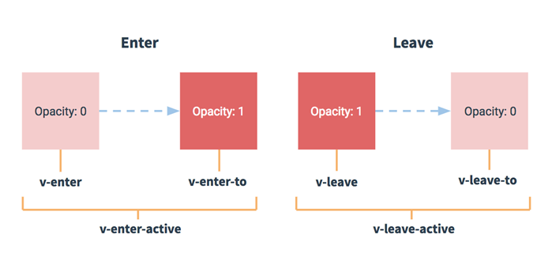

对于这些在过渡中切换的类名来说，如果你使用一个没有名字的 `<transition>`，则 v- 是这些类名的默认前缀。如果你使用了 `<transition name="my-transition">`，那么 v-enter 会替换为 my-transition-enter。

v-enter-active 和 v-leave-active 可以控制进入/离开过渡的不同的缓和曲线，在下面章节会有个示例说明。

### CSS 动画

CSS 动画用法类似 CSS 过渡，但是在动画中 v-enter 类名在节点插入 DOM 后不会立即删除，而是在 animationend 事件触发时删除。

```html
<style>
.bounce-enter-active {
  animation: bounce-in .5s;
}
.bounce-leave-active {
  animation: bounce-in .5s reverse;
}
@keyframes bounce-in {
  0% {
    transform: scale(0);
  }
  50% {
    transform: scale(1.5);
  }
  100% {
    transform: scale(1);
  }
}
</style>
<div id = "databinding">
  <button v-on:click = "show = !show">点我</button>
  <transition name="bounce">
    <p v-if="show">菜鸟教程 -- 学的不仅是技术，更是梦想！！！</p>
  </transition>
</div>
<script type = "text/javascript">
new Vue({
  el: '#databinding',
  data: {
    show: true
  }
})
</script>
```

我们可以通过以下特性来自定义过渡类名：

- enter-class
- enter-active-class
- enter-to-class (2.1.8+)
- leave-class
- leave-active-class
- leave-to-class (2.1.8+)

自定义过渡的类名优先级高于普通的类名，这样就能很好的与第三方（如：animate.css）的动画库结合使用。

```html
<script src="https://cdn.staticfile.org/vue/2.2.2/vue.min.js"></script>
<link href="https://cdn.jsdelivr.net/npm/animate.css@3.5.1" rel="stylesheet" type="text/css">
<div id = "databinding">
  <button v-on:click = "show = !show">点我</button>
  <transition
    name="custom-classes-transition"
    enter-active-class="animated tada"
    leave-active-class="animated bounceOutRight">
    <p v-if="show">菜鸟教程 -- 学的不仅是技术，更是梦想！！！</p>
  </transition>
</div>
<script type = "text/javascript">
new Vue({
  el: '#databinding',
  data: {
    show: true
  }
})
</script>
```

### 同时使用过渡和动画

Vue 为了知道过渡的完成，必须设置相应的事件监听器。它可以是 transitionend 或 animationend ，这取决于给元素应用的 CSS 规则。如果你使用其中任何一种，Vue 能自动识别类型并设置监听。

但是，在一些场景中，你需要给同一个元素同时设置两种过渡动效，比如 animation 很快的被触发并完成了，而 transition 效果还没结束。在这种情况中，你就需要使用 type 特性并设置 animation 或 transition 来明确声明你需要 Vue 监听的类型。

显性的过渡持续时间

在很多情况下，Vue 可以自动得出过渡效果的完成时机。默认情况下，Vue 会等待其在过渡效果的根元素的第一个 transitionend 或 animationend 事件。然而也可以不这样设定——比如，我们可以拥有一个精心编排的一系列过渡效果，其中一些嵌套的内部元素相比于过渡效果的根元素有延迟的或更长的过渡效果。

在这种情况下你可以用 `<transition>` 组件上的 duration 属性定制一个显性的过渡持续时间（以毫秒计）：

```html
<transition :duration="1000">...</transition>
```

你也可以定制进入和移出的持续时间：

```html
<transition :duration="{ enter: 500, leave: 800 }">...</transition>
```

### JavaScript钩子

HTML:

```html
<transition
  v-on:before-enter="beforeEnter"
  v-on:enter="enter"
  v-on:after-enter="afterEnter"
  v-on:enter-cancelled="enterCancelled"

  v-on:before-leave="beforeLeave"
  v-on:leave="leave"
  v-on:after-leave="afterLeave"
  v-on:leave-cancelled="leaveCancelled">
  <!-- ... -->
</transition>
```

Javascript:

```js
// ...
methods: {
    // --------
    // 进入中
    // --------

    beforeEnter: function (el) {
      // ...
    },
    // 此回调函数是可选项的设置
    // 与 CSS 结合时使用
    enter: function (el, done) {
      // ...
      done()
    },
    afterEnter: function (el) {
      // ...
    },
    enterCancelled: function (el) {
      // ...
    },

    // --------
    // 离开时
    // --------

    beforeLeave: function (el) {
      // ...
    },
    // 此回调函数是可选项的设置
    // 与 CSS 结合时使用
    leave: function (el, done) {
      // ...
      done()
    },
    afterLeave: function (el) {
      // ...
    },
    // leaveCancelled 只用于 v-show 中
    leaveCancelled: function (el) {
      // ...
    }
  }
```

这些钩子函数可以结合 CSS transitions/animations 使用，也可以单独使用。

当只用 JavaScript 过渡的时候，在 enter 和 leave 中必须使用 done 进行回调。否则，它们将被同步调用，过渡会立即完成。

推荐对于仅使用 JavaScript 过渡的元素添加 v-bind:css="false"，Vue 会跳过 CSS 的检测。这也可以避免过渡过程中 CSS 的影响。

一个使用 Velocity.js 的简单例子：

```html
<script src="https://cdn.staticfile.org/vue/2.2.2/vue.min.js"></script>
<script src="https://cdnjs.cloudflare.com/ajax/libs/velocity/1.2.3/velocity.min.js"></script>
<div id = "databinding">
  <button v-on:click = "show = !show">点我</button>
  <transition
    v-on:before-enter="beforeEnter"
    v-on:enter="enter"
    v-on:leave="leave"
    v-bind:css="false">
    <p v-if="show">菜鸟教程 -- 学的不仅是技术，更是梦想！！！</p>
  </transition>
</div>
<script type = "text/javascript">
new Vue({
  el: '#databinding',
  data: {
    show: false
  },
  methods: {
    beforeEnter: function (el) {
      el.style.opacity = 0
      el.style.transformOrigin = 'left'
    },
    enter: function (el, done) {
      Velocity(el, { opacity: 1, fontSize: '1.4em' }, { duration: 300 })
      Velocity(el, { fontSize: '1em' }, { complete: done })
    },
    leave: function (el, done) {
      Velocity(el, { translateX: '15px', rotateZ: '50deg' }, { duration: 600 })
      Velocity(el, { rotateZ: '100deg' }, { loop: 2 })
      Velocity(el, {
        rotateZ: '45deg',
        translateY: '30px',
        translateX: '30px',
        opacity: 0
      }, { complete: done })
    }
  }
})
</script>
```

### 初始渲染的过渡

可以通过 appear 特性设置节点在初始渲染的过渡

```html
<transition appear>
    <!-- ... -->
</transition>
```

这里默认和进入/离开过渡一样，同样也可以自定义 CSS 类名。

```html
<transition
  appear
  appear-class="custom-appear-class"
  appear-to-class="custom-appear-to-class" (2.1.8+)
  appear-active-class="custom-appear-active-class"
>
  <!-- ... -->
</transition>
```

自定义 JavaScript 钩子：

```html
<transition
  appear
  v-on:before-appear="customBeforeAppearHook"
  v-on:appear="customAppearHook"
  v-on:after-appear="customAfterAppearHook"
  v-on:appear-cancelled="customAppearCancelledHook"
>
  <!-- ... -->
</transition>
```

### 多个元素的过渡

我们可以设置多个元素的过渡，一般列表与描述：

需要注意的是当有相同标签名的元素切换时，需要通过 key 特性设置唯一的值来标记以让 Vue 区分它们，否则 Vue 为了效率只会替换相同标签内部的内容。

```html
<transition>
    <table v-if="items.length > 0">
      <!-- ... -->
    </table>
    <p v-else>抱歉，没有找到您查找的内容。</p>
</transition>
```

如下实例：

```html
<transition>
    <button v-if="isEditing" key="save">
      Save
    </button>
    <button v-else key="edit">
      Edit
    </button>
</transition>
```

在一些场景中，也可以通过给同一个元素的 key 特性设置不同的状态来代替 v-if 和 v-else，上面的例子可以重写为：

```html
<transition>
    <button v-bind:key="isEditing">
      {{ isEditing ? 'Save' : 'Edit' }}
    </button>
</transition>
```

使用多个 v-if 的多个元素的过渡可以重写为绑定了动态属性的单个元素过渡。例如：

```html
<transition>
    <button v-if="docState === 'saved'" key="saved">
      Edit
    </button>
    <button v-if="docState === 'edited'" key="edited">
      Save
    </button>
    <button v-if="docState === 'editing'" key="editing">
      Cancel
    </button>
</transition>
```

可以重写为：

```html
<transition>
  <button v-bind:key="docState">
    {{ buttonMessage }}
  </button>
</transition>
<script>  
// ...
new Vue ({
  computed: {
    buttonMessage: function () {
      switch (this.docState) {
        case 'saved': return 'Edit'
        case 'edited': return 'Save'
        case 'editing': return 'Cancel'
      }
    }
  }
})
</script>
```

## 混入

混入 (mixins)定义了一部分可复用的方法或者计算属性。混入对象可以包含任意组件选项。当组件使用混入对象时，所有混入对象的选项将被混入该组件本身的选项。来看一个简单的实例：

```html
<div id = "databinding"></div>
<script type = "text/javascript">
var vm = new Vue({
  el: '#databinding',
  data: {},
  methods : {},
});
// 定义一个混入对象
var myMixin = {
  created: function () {
    this.startmixin()
  },
  methods: {
    startmixin: function () {
      document.write("欢迎来到混入实例");
    }
  }
};
var Component = Vue.extend({
  mixins: [myMixin]
})
var component = new Component();
</script>
```

### 选项合并

当组件和混入对象含有同名选项时，这些选项将以恰当的方式混合。

比如，数据对象在内部会进行浅合并（一层属性深度），在和组件的数据发生冲突时以组件数据优先。

以下实例中，Vue 实例与混入对象包含了相同的方法。从输出结果可以看出两个选项合并了。

```js
var mixin = {
  created: function () {
    document.write('混入调用' + '<br>')
  }
}
new Vue({
  mixins: [mixin],
  created: function () {
    document.write('组件调用' + '<br>')
  }
});
```

输出结果为：

```sh
混入调用
组件调用
```

如果 methods 选项中有相同的函数名，则 Vue 实例优先级会较高。如下实例，Vue 实例与混入对象的 methods 选项都包含了相同的函数：

```html
<div id = "databinding"></div>
<script type = "text/javascript">
var mixin = {
  methods: {
    hellworld: function () {
      document.write('HelloWorld 方法' + '<br>');
    },
    samemethod: function () {
      document.write('Mixin：相同方法名' + '<br>');
    }
  }
};
var vm = new Vue({
  mixins: [mixin],
  methods: {
    start: function () {
      document.write('start 方法' + '<br>');
    },
    samemethod: function () {
      document.write('Main：相同方法名' + '<br>');
    }
  }
});
vm.hellworld();
vm.start();
vm.samemethod();
</script>
```

输出结果为：

```sh
HelloWorld 方法
start 方法
Main：相同方法名
```

从输出结果 methods 选项中如果碰到相同的函数名则 Vue 实例有更高的优先级会执行输出。

### 全局混入

也可以全局注册混入对象。注意使用！ 一旦使用全局混入对象，将会影响到所有之后创建的 Vue 实例。使用恰当时，可以为自定义对象注入处理逻辑。

```html
<script type = "text/javascript">
// 为自定义的选项 'myOption' 注入一个处理器。
Vue.mixin({
  created: function () {
    var myOption = this.$options.myOption
    if (myOption) {
      document.write(myOption)
    }
  }
})

new Vue({
  myOption: 'hello!'
})
// => "hello!"
</script>
```

谨慎使用全局混入对象，因为会影响到每个单独创建的 Vue 实例（包括第三方模板）。

## 案例

1. 导航菜单实例
2. 编辑文本实例
3. 订单列表实例
4. 搜索页面实例
5. 切换不同布局实例

### 获取DOM元素

- 救命稻草，前端框架就是为了减少DOM操作，但是特定情况下，也给你留了后门
- 在指定的元素上，添加 `ref="名称A"`
- 在获取的地方加入 `this.$refs.名称A`  
  - 如果ref放在了原生DOM元素上，获取的数据就是原生DOM对象，可以直接操作
  - 如果ref放在了组件对象上，获取的就是组件对象
  - 获取到DOM对象，通过`this.$refs.sub.$el`，进行操作
  - 对应的事件
    - created 完成了数据的初始化，此时还未生成DOM，无法操作DOM
    - mounted 数据已经装载到了DOM之上，可以操作DOM

## 参考

- [统一封装 Axios 接口与异常处理](https://blog.csdn.net/qq_40128367/article/details/82735310)

- 实例：
  - 在组件内（xxx.vue）中的this
  - new Vue()
  - 事件
    - this.$on(事件名,回调函数(参数))
    - this.$emit(事件名,数据)
    - this.$once(事件名,回调函数(参数)) 就触发一次
    - this.$off(事件名); 取消事件
  - 实例属性
    - $props,$parent,$children,$refs
- 全局函数
  - Vue.use(param) 安装插件 param需要实现install函数 接受一个Vue，可以在Vue的原型上挂载属性，后期组件内通过this.就可以拿到该数据，在所有组件中使用
  - 单文件 Vue.component(名称,组件对象)
  - 引包 Vue.component(名称,options)
  - Vue.filter(过滤器名,function(value){ return value; } )
- 生僻指令
  - :key 当DOM列表中删除某一个元素 ，更优化的方案是直接删除这一个DOM元素
  - Vue就需要辨识你删除的数组中的元素与DOM中那个元素的对应关系
    - 如果不指定key，vue也会去计算，把对象计算出一个唯一标识，相对损耗性能
    - 我们来通过key告知vue，这个元素的标识就是 obj.id index，可以很好的提升性能
  - v-on:事件  @事件=
  - v-bind:属性 :属性=
- 全局
  - Vue.component('组件名',组件对象)  在哪里都可以使用
- 组件传值
  - 父传子: 属性作为参数
  - 常量 title="xxx"   子组件声明接收参数 props:['xxx']
  - 变量 :title="num"  子组件声明接收参数 props:['xxx']
  - 子传父: vuebus（只能是同一辆车）
  - 先停车到父组件，On一下
  - 再开车到子组件，如果需要的话，emit一下，触发上述时间的回调函数
  - 父子组件之间通信规则不太清楚  
  - 父向子 -> 自定义指令给属性传值  <my-div xxx="{{name}}"
  - 子向父 -> 通过事件触发 -> 只能是同一个对象的事件监听和触发 $emit
  - vue bus 同一辆车在不同的地方使用($on/$emit)
- render: c => c(App)这是啥，babel->语法转换器，转换ES6/7、react  
- options: {presets: ['es2015'], plugins: ['transform-runtime'] }  
- 路由使用
  - 使用步骤
    1. 下载
    2. 引入对象
    3. 安装插件
    4. 创建路由对象配置路由规则
    5. 配置进vue实例对象的options中
    6. 留坑 `<router-view></router-view>`
       1. 去哪里 `<router-link :to="{name:'xxx'}"></router-link>`
       2. 导航 `{name:'xxx', path:'/xxx', component:Home}`
       3. 去了以后干什么
    - 在created函数中，发请求
    - 获取路由参数`this.$route.params|query.xxx;`
  - 套路
    1. 去哪里 `<router-link :to="{name:'bj'}"></router-link>`
    2. 导航（配置路由规则）`{name:'bj',path:'/beijing',组件A}`
    3. 去了干嘛（在组件A内干什么）
       - 在created事件函数中，获取路由参数
       - 发起请求，把数据挂载上去
    4. 参数
       - 查询字符串（#/beijing?id=1&age=2）
          1. 去哪里 `<router-link :to="{name:'bj',query:{id:1,age:2}}"></router-link>`
          2. 导航（配置路由规则） `{name:'bj',path:'/beijing',组件A}`
          3. 去了干嘛（在组件A内干什么）  
       `this.$route.query.id||age`
       - path(#/beijing/1/2)
         1. 去哪里 `<router-link :to="{name:'bj',params:{id:1,age:2}}"></router-link>`
         2. 导航（配置路由规则） `{name:'bj',path:'/beijing/:id/:age',组件A}`
         3. 去了干嘛（在组件A内干什么）`this.$route.params.id||age`
    5. 编程导航
       - 一个获取信息的只读对象($route)
       - 一个具备功能函数的对象($router)
       - 根据浏览器历史记录前进和后台 `this.$router.go(1|-1);`
       - 跳转到指定路由 `this.$router.push({name:'bj'});`
    6. 嵌套路由
       - 让变化的视图(router-view)产生包含关系(router-view)
       - 让路由与router-view关联，并且也产生父子关系
    7. 多视图
       - 让视图更为灵活，以前一个一放，现在可以放多个，通过配置可以去修改
- axios:
  - 开始:
    - 跨域 + 默认的头是因为你的数据是对象，所以content-type:application/json
    - 有OPTIONS预检请求（浏览器自动发起）
  - 最终:
    - 当我们调整为字符串数据，引起content-type变为了www键值对
    - 没有那个OPTIONS预检请求
  - 总结：跨域 + application/json 会引起OPTIONS预检请求，并且自定义一个头（提示服务器，这次的content-type较为特殊），content-type的值
  - 服务器认为这个是一次请求，而没有允许content-type的头，
  - 浏览器就认为服务器不一定能处理掉这个特殊的头的数据
  - 抛出异常
  - 在node服务器`response.setHeader("Access-Control-Allow-Headers","content-type,多个");`
  - formdata的样子: key=value&key=value
  - axios属性关系
    - options: headers、baseURL、params
    - 默认全局设置（大家都是这么用）`Axios.defaults-> options对象`
    - 针对个别请求来附加options
    - axios.get(url,options)
    - axios.post(url,data,options)
  - 独立构建：引包的方式
  - 运行时构建：单文件方式
  - 单文件方式引入bootstrap

    ```javascript
    new webpack.ProvidePlugin({
      $: 'jquery',
      jQuery: 'jquery',
      'window.jQuery': 'jquery',
      'window.$': 'jquery',
    }),
    ```

    以上方式是将jquery声明成全局变量。供bootstrap使用

  - 使用代理跨域

    ```javascript
    devServer: {
      proxy: {
        '/v2/*': {
          target: 'https://api.douban.com/',
          changeOrigin: true,
        }
      }
    ```

  - 合并请求
    - axios.all([请求1,请求2])
    - 分发响应  axios.spread(fn)
    - fn:对应参数(res)和请求的顺序一致
    - 应用场景：必须保证两次请求都成功，比如，分头获取省、市的数据
    - 执行特点：只要有一次失败就算失败，否则成功
  - 拦截器
    - 过滤，在每一次请求与响应中、添油加醋
    - axios.interceptors.request.use(fn)  在请求之前
    - function(config){ config.headers = { xxx }}   config 相当于options对象
    - 默认设置 defaults 范围广、权利小
    - 单个请求的设置options get(url,options)  范围小、权利中
    - 拦截器 范围广、权利大
  - token（扩展）
    - cookie 和session的机制，cookie自动带一个字符串
    - cookie只在浏览器
    - 移动端原生应用，也可以使用http协议，1:可以加自定义的头、原生应用没有cookie
    - 对于三端来讲，token可以作为类似cookie的使用，并且可以通用
    - 拦截器可以用在添加token上
  - 拦截器操作loadding
    - 在请求发起前open，在响应回来后close

- 视口

  ```html
  <meta name="viewport" content="width=device-width, user-scalable=no, initial-scale=1.0, maximum-scale=1.0, minimum-scale=1.0">
  ```

- 相关环境总结

  - webpack.config.js -> 入口和出口，解决文件的解析loader
  - index.html -> SPA
  - main 程序入口
  - app.vue 主体组件文件
  - components -> 各种功能页面的组件
  - static
    - 全局css
    - img图片
    - vender -> mui

- npm命令

  - npm i(install) 包名 -S(--save)-D(--save-dev) 安装包
  - 全部或者生产恢复包: npm i(install) --production(只恢复生产依赖dependencies)

- yarn命令

  - yarn add||remove 包名 -S(--save)-D(--save-dev) 安装包
  - 全部或者生产恢复包: yarn i(install) --production(只恢复生产依赖dependencies)

- 相关命令

  ```bat
  npm i mint-ui vue-preview axios vue-router monent vue - S;
  npm i webpack html - webpack - plugin css - loader style - loader less less - loader autoprefixer - loader babel - loader babel - core babel - preset - es2015 babel - plugin - transform - runtime url - loader file - loader vue - loader vue - template - compiler webpack-dev-server - D
  ```

## 部署

(1) 绝对路径改成相对路径

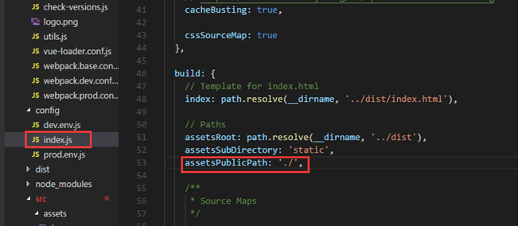

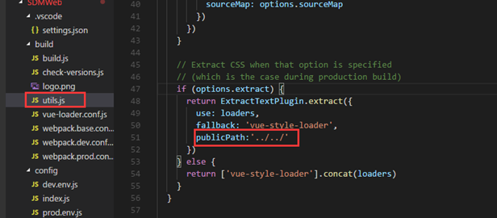

(2) npm run build

## 多页面

1、创建文件

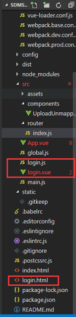

2、添加多入口

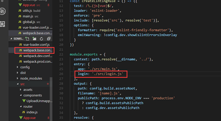

3、开发环境修改

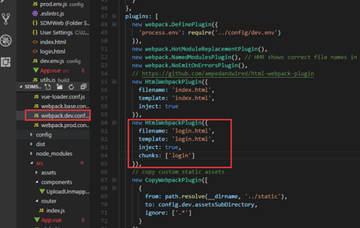

对编译环境进行配置：

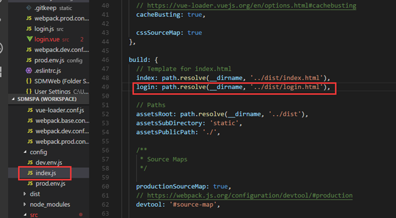

配置生产环境，每个页面都要配置一个chunks，不然会加载所有页面的资源。

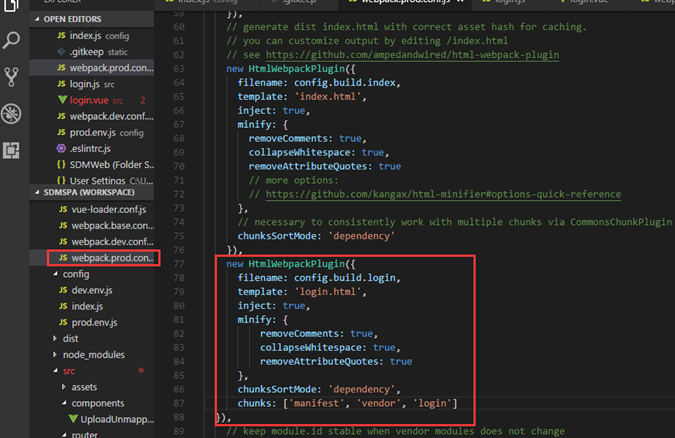

## iview组件表格render函数的使用

如果要在标签中加入属性，例如img中src属性，a标签中href属性。此时要用attrs来加入而不是props。

## 浅谈$mount()

Vue 的 `$mount()` 为手动挂载，在项目中可用于延时挂载（例如在挂载之前要进行一些其他操作、判断等），之后要手动挂载上。new Vue时，el 和 `$mount` 并没有本质上的不同。

顺便附上vue渲染机制流程图：

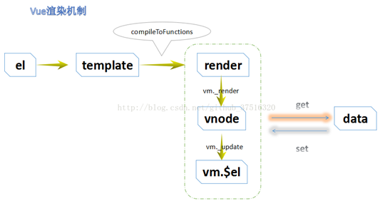

## 生成条形码和二维码

### 条形码

1. 命令：`npm install jsbarcode --save`
2. 引入：

   ```html
   <script src="https://www.jq22.com/jquery/vue.min.js"></script>
   <script src='js/JsBarcode.all.min.js'></script>）
   ```
  
   （安装了依赖可不引入）

3. 声明：

   ```js
   var JsBarcode = require('jsbarcode')
   ```

4. 简单例子：

```html
<svg id="barcode"></svg>

<!-- 在HTML元素中定义值和选项 -->
<svg class="barcode"
     jsbarcode-format="CODE128"
     :jsbarcode-value= obj.id
     jsbarcode-textmargin="0"
     jsbarcode-fontoptions="bold">
</svg>

<script>
JsBarcode("#barcode", "Hi world!");

// 配置
JsBarcode("#barcode", "1234", {
　format: "pharmacode",
　lineColor: "#0aa",
　width: 4,
　height: 40,
　displayValue: false
});

// 在HTML元素中定义值和选项
JsBarcode(".barcode").init();

// 高级
JsBarcode("#barcode")
  .options({font: "OCR-B"}) // 会影响所有条形码
  .EAN13("1234567890128", {fontSize: 18, textMargin: 0})
  .blank(20) // 在条形码之间创建空间
  .EAN5("12345", {height: 85, textPosition: "top", fontSize: 16, marginTop: 15})
  .render();
</script>
```

支持的条形码：

- CODE128
  - CODE128（自动模式切换）
  - CODE128 A / B / C（强制模式）
- EAN
  - EAN-13
  - EAN-8
  - EAN-5
  - EAN-2
  - UPC（A）
  - UPC（E）
- CODE39
- ITF-14
- MSI
  - MSI10
  - MSI11
  - MSI1010
  - MSI1110
- Pharmacode
- Codabar

## 组件重新加载

1. 利用v-if控制router-view，在根组件APP.vue中实现一个刷新方法，这种方法可以实现任意组件的刷新。

    ```html
    <template>
      <router-view v-if="isRouterAlive"/>
    </template>
    <script>
      export default {
        data () {
          return {
            isRouterAlive: true
          }
        },
        methods: {
          reload () {
            this.isRouterAlive = false
            this.$nextTick(() => (this.isRouterAlive = true))
          }
        }
      }

      // 然后其它任何想刷新自己的路由页面，都可以这样：
      this.reload()
    </script>
    ```

2. 路由替换

   ```js
   // replace another route (with different component or a dead route) at first
   // 先进入一个空路由
   vm.$router.replace({
     path: '/_empty',
   })
   // then replace your route (with same component)
   vm.$router.replace({
     path: '/student/report',
     query: {
       'paperId':paperId
    }
   })
   ```

## 问题

- 错误：<i style="color:red">无法加载文件 C:\Users\gxf\AppData\Roaming\npm\nodemon.ps1，因为在此系统上禁止运行脚本。</i>

  原因：笔记本禁止运行脚本

  解决方法：

  ```sh
  1.管理员身份打开powerShell
  2.输入 set-ExecutionPolicy RemoteSigned
  3.选择 Y 或者 A，就好了
  ```

- 错误：<i style="color:red">Vue项目启动出现 Error:Cannot find module 'array-includes'</i>

  解决方法：

  ```sh
  1. 删掉项目中的node_modules文件夹，
  2 .执行 npm cache clean 或者  cnpm cache clean 命令清除掉cache缓存，
  3.然后cnpm install 和npm run dev就可以在这台电脑运行你的项目
  ```

FormValidatoe使用时，Prop和Model要同名，只能更改Model属性，不能为了省力将Model对象设置为{}对象，Prop会判断错误！
