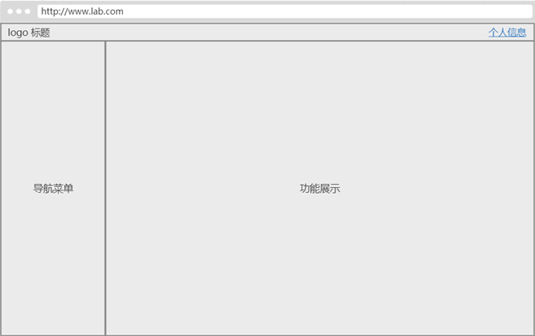

# css常用样式

## 目录

1. 布局
   - [居中](#居中)
   - [固定](#固定)
   - [整页加载](#整页加载)
2. 内容
   - [文字效果](#文字效果)
   - [图形效果](#图形效果)
   - [背景透明](#背景透明)
3. 解说
   - [overflow:hidden详细解释](#overflow:hidden详细解释)

## 布局

现代管理系统的页面一般如下图所示：左侧展示菜单，右侧是功能区，功能区字段一页无法展示时，增加滚动条，整体页面不动，只滚动右侧区域



查看[示例页面](../Codes/6.2.1_layout.html)，关键是通过css样式 `position: fixed` 实现。

## 居中

1、如何让图片左右居中？

把图片放在div中，设置 `div:margin:0 auto;`，这样div左右居中，包含在里面的图片也会随之居中。

2、div嵌套div如何上下左右居中？

常用方法：**定位**

[示例](../Codes/6.2.3_center.html)

## 文字效果

超出隐藏（一行）：[示例页面](../Codes/6.2.1_layout.html)，主要通过以下样式实现：

```css
/* 只显示4个字符，超出部分用"..."表示 */
ul>li>span {
    display: block; /* 块元素中才有效果 */
    overflow: hidden; /* 超出部分隐藏，不显示滚动条 */
    white-space: nowrap; /* 不换行 */
    text-overflow: ellipsis; /* 超出部分用"..."表示 */
    width: 5em; /* 因为默认显示4个字符，再加上最后1个字符"..."，所以总共是5个字符 */
}
```

超出隐藏（多行）：[示例页面](../Codes/6.2.1_layout.html)，主要通过以下样式实现：

第1种样式：

```css
/* 只显示两行 */
.news {
    text-overflow: -o-ellipsis-lastline;
    overflow: hidden;
    text-overflow: ellipsis;
    display: -webkit-box;
    -webkit-line-clamp: 2;
    line-clamp: 2;
    -webkit-box-orient: vertical;
}
```

> 适用范围：因使用了WebKit的CSS扩展属性，该方法适用于WebKit浏览器及移动端；
>
> 注：-webkit-line-clamp用来限制在一个块元素显示的文本的行数。为了实现该效果，它需要组合其他的WebKit属性。
>
> 常见结合属性：  
> display: -webkit-box; 必须结合的属性 ，将对象作为弹性伸缩盒子模型显示。  
> -webkit-box-orient 必须结合的属性 ，设置或检索伸缩盒对象的子元素的排列方式。  

第2种样式

```css
.news {
    position: relative;
    line-height: 20px; /* 每行的高度 */
    max-height: 40px; /* 容器的高度，2行 */
    overflow: hidden;
}

.news::after {
    content: "..."; /* 多余字符标识 */
    position: absolute;
    bottom: 0;
    right: 0;
    padding-left: 40px; /* "..."与前文距离 */
    background: -webkit-linear-gradient(left, transparent, chartreuse 55%);
    background: -o-linear-gradient(right, transparent, chartreuse 55%);
    background: -moz-linear-gradient(right, transparent, chartreuse 55%);
    background: linear-gradient(to right, transparent, chartreuse 55%);
}
```

> 适用范围：该方法适用范围广，但文字未超出行的情况下也会出现省略号，可结合js优化该方法（查看示例）。
>
> 注：将height设置为line-height的整数倍，防止超出的文字露出。给p::after添加渐变背景可避免文字只显示一半。  
> 由于ie6-7不显示content内容，所以要添加标签兼容ie6-7（如：`<span>…</span>`）；兼容ie8需要将::after替换成:after。

## 图形效果

[示例文件](../Codes/6.2.2_shape.html)

## 背景透明

```css
/* 背景图 */
body {
  background: url(../img/bg.jpg) no-repeat fixed top;
}

/* 元素透明（自身） */
.right_col .row .x_panel {
    background-color: rgba(254,254,254,0.7); /* IE9、标准浏览器、IE6和部分IE7内核的浏览器(如QQ浏览器)会读懂 */
    color: black;
}
@media \0screen\,screen\9 { /* 只支持IE6、7、8 */
    .row .x_panel {
        background-color: #000000;
        filter: Alpha(opacity=70);
        position: static; /* IE6、7、8只能设置position:static(默认属性) ，否则会导致子元素继承Alpha值 */
        *zoom: 1; /* 激活IE6、7的haslayout属性，让它读懂Alpha */
    }

        .row .x_panel label {
            position: relative; /* 设置子元素为相对定位，可让子元素不继承Alpha值 */
        }
}

/* 去掉 div 的 width、height，就可以被内部元素自动撑开 */
```

## 固定

css三种方法实现：上面固定，左侧固定，右侧内容可滚动
  
html:

```html
<body>
    <div class="header"></div>
    <div class="main">
        <div class="sidebar">sidebar</div>
        <div class="content">
            世间有一种相互的情愿、一种情感的眷恋、一种情怀的着落，一种甜情密意的爱。 爱情在彼此之间、难得珍贵。需要包容和蔼，需要俩情相续。人生没有任何情感能抵得上爱情来的强烈。真爱从心底滋生，滋润着的爱；能让岁月变得丰满幸福。 爱情经历过静默欢喜的心跳，心潮澎湃的悸动，小心翼翼的呵护。挚爱灵魂的降临，柔情蜜意的体会，爱情的情愫引诱着彼此之间的情怀。爱情就像一团火焰，热情奔放在彼此之间燃烧；爱就像颜丽的山花，烂漫开放在彼此之间芬芳的岁月里。 爱情在彼此之间是愉悦、是幸福的向往，有一种渴念，一种欲望。一个人如果没有了爱情的支撑，剩下的只有精神空虚，孤独寂寞。无论多么痛苦，爱情只是人生的一个部分。在现实面前，只有理顺思路，忘掉不愉，打点精神生活，才能继续愉悦自己的人生。 当然爱情很美好，但有时也会不如意。人生本来就在旅途中，有阳光与暗淡的一面，难免会经历过低谷，不必过于焦虑不安。如果一方有离去的企图，千万不得挽留，留下的人也留不住心。人走了茶也就凉了，再温了也没了芳香。在拥有时好好地珍惜，爱情本来就需要真情来相待。 做人要懂得思考，一个愚痴的人，一旦跳进了失恋的漩涡、难以挣脱。忧忧寂寞、郁郁寡欢、心劳意攘不可自拔。一个明智的人，通情达理，一切顺其自然，不会执着于曾经的美好。既然她执意要走，爱情就已经失去了光泽。那么，何必再度留念她的光彩。 情感确实曼妙。有时机遇恰巧会眷顾了爱情。在擦肩而过的人群中谁能与你并肩同行；谁能理会同你一道上船、驶往爱的彼岸。在滚滚红尘中，只有俩厢情愿，情投意合，才能算是一见钟情，顺理成章。 在这世界上有一种爱情叫着缘分。在谈笑中相遇、在不经意中发生。爱情在几度转角处相识，最终还是选择初恋的那个好。这不要说偶尔、也不能说凑巧，他们在冥冥之间自然的形成。那是一种力量的无形缠绕，在偶遇中滋生存在着相遇的机会与可能。 树靠营养吸收生长，开花结果。人也需要吸收养分，也需要茁壮成长。特别在爱恋之间那微妙的时刻，得像春花一样灿烂，滋润着培育成绚丽多姿让人羡慕，让人欣赏。人靠衣装马靠鞍，一个人的内涵显示在品位上，整洁大方是对对方的尊重。 情窦初开的年华，一朵鲜花，谁采不是采，谁献不是献。也可以说、谁先采来谁先戴。但是、爱情还存有它诸多的要素与情感的诠释。 人到成熟自然而然就会寻求恋爱。恋爱会造就情侣的幸福与美满。爱情与年龄无关；有共同语言，相似情怀，类似的经历坦诚自然的交流，毫不做作的表现。只有深入了解，才有爱情的起因。爱情用真情来实现相互交流的过程。爱情是向往，是打造婚姻的基础。 爱情自由，婚姻自主。从古至今，在世俗面前往往是种摆设。门当户对，门第观念。才会有爱情悲剧故事的上演：《牛郎织女》《梁山伯与祝英台》《罗密欧与朱丽叶》等等。全面再现了封建世俗末世人性世态，揭示了弱势与强势的种种悲剧与无法调和的社会矛盾。 爱情的行为是柔，慢条斯理，不是急于求成。爱情是双方感情的因果，一个人的行为不叫爱情。爱情是有针对性的，千万别搞错，有的只是友情层面上对你好，那不是爱情。一个人来维持痴情那是很痛苦的一件事。没有物质的爱情是可悲的，他保证不了爱情的延续性。 真正的爱情，不论贫富，不论远近。千般情怀，万般眷恋。红尘陌上，心系悠长。约言迢迢千里，只因情怀而来；邈路遥遥朝暮，只因眷恋而去。 世间有一种相互的情愿、一种情感的眷恋、一种情怀的着落，一种甜情密意的爱。 爱情在彼此之间、难得珍贵。需要包容和蔼，需要俩情相续。人生没有任何情感能抵得上爱情来的强烈。真爱从心底滋生，滋润着的爱；能让岁月变得丰满幸福。 爱情经历过静默欢喜的心跳，心潮澎湃的悸动，小心翼翼的呵护。挚爱灵魂的降临，柔情蜜意的体会，爱情的情愫引诱着彼此之间的情怀。爱情就像一团火焰，热情奔放在彼此之间燃烧；爱就像颜丽的山花，烂漫开放在彼此之间芬芳的岁月里。 爱情在彼此之间是愉悦、是幸福的向往，有一种渴念，一种欲望。一个人如果没有了爱情的支撑，剩下的只有精神空虚，孤独寂寞。无论多么痛苦，爱情只是人生的一个部分。在现实面前，只有理顺思路，忘掉不愉，打点精神生活，才能继续愉悦自己的人生。 当然爱情很美好，但有时也会不如意。人生本来就在旅途中，有阳光与暗淡的一面，难免会经历过低谷，不必过于焦虑不安。如果一方有离去的企图，千万不得挽留，留下的人也留不住心。人走了茶也就凉了，再温了也没了芳香。在拥有时好好地珍惜，爱情本来就需要真情来相待。 做人要懂得思考，一个愚痴的人，一旦跳进了失恋的漩涡、难以挣脱。忧忧寂寞、郁郁寡欢、心劳意攘不可自拔。一个明智的人，通情达理，一切顺其自然，不会执着于曾经的美好。既然她执意要走，爱情就已经失去了光泽。那么，何必再度留念她的光彩。 情感确实曼妙。有时机遇恰巧会眷顾了爱情。在擦肩而过的人群中谁能与你并肩同行；谁能理会同你一道上船、驶往爱的彼岸。在滚滚红尘中，只有俩厢情愿，情投意合，才能算是一见钟情，顺理成章。 在这世界上有一种爱情叫着缘分。在谈笑中相遇、在不经意中发生。爱情在几度转角处相识，最终还是选择初恋的那个好。这不要说偶尔、也不能说凑巧，他们在冥冥之间自然的形成。那是一种力量的无形缠绕，在偶遇中滋生存在着相遇的机会与可能。 树靠营养吸收生长，开花结果。人也需要吸收养分，也需要茁壮成长。特别在爱恋之间那微妙的时刻，得像春花一样灿烂，滋润着培育成绚丽多姿让人羡慕，让人欣赏。人靠衣装马靠鞍，一个人的内涵显示在品位上，整洁大方是对对方的尊重。 情窦初开的年华，一朵鲜花，谁采不是采，谁献不是献。也可以说、谁先采来谁先戴。但是、爱情还存有它诸多的要素与情感的诠释。 人到成熟自然而然就会寻求恋爱。恋爱会造就情侣的幸福与美满。爱情与年龄无关；有共同语言，相似情怀，类似的经历坦诚自然的交流，毫不做作的表现。只有深入了解，才有爱情的起因。爱情用真情来实现相互交流的过程。爱情是向往，是打造婚姻的基础。 爱情自由，婚姻自主。从古至今，在世俗面前往往是种摆设。门当户对，门第观念。才会有爱情悲剧故事的上演：《牛郎织女》《梁山伯与祝英台》《罗密欧与朱丽叶》等等。全面再现了封建世俗末世人性世态，揭示了弱势与强势的种种悲剧与无法调和的社会矛盾。 爱情的行为是柔，慢条斯理，不是急于求成。爱情是双方感情的因果，一个人的行为不叫爱情。爱情是有针对性的，千万别搞错，有的只是友情层面上对你好，那不是爱情。一个人来维持痴情那是很痛苦的一件事。没有物质的爱情是可悲的，他保证不了爱情的延续性。 真正的爱情，不论贫富，不论远近。千般情怀，万般眷恋。红尘陌上，心系悠长。约言迢迢千里，只因情怀而来；邈路遥遥朝暮，只因眷恋而去。 世间有一种相互的情愿、一种情感的眷恋、一种情怀的着落，一种甜情密意的爱。 爱情在彼此之间、难得珍贵。需要包容和蔼，需要俩情相续。人生没有任何情感能抵得上爱情来的强烈。真爱从心底滋生，滋润着的爱；能让岁月变得丰满幸福。 爱情经历过静默欢喜的心跳，心潮澎湃的悸动，小心翼翼的呵护。挚爱灵魂的降临，柔情蜜意的体会，爱情的情愫引诱着彼此之间的情怀。爱情就像一团火焰，热情奔放在彼此之间燃烧；爱就像颜丽的山花，烂漫开放在彼此之间芬芳的岁月里。 爱情在彼此之间是愉悦、是幸福的向往，有一种渴念，一种欲望。一个人如果没有了爱情的支撑，剩下的只有精神空虚，孤独寂寞。无论多么痛苦，爱情只是人生的一个部分。在现实面前，只有理顺思路，忘掉不愉，打点精神生活，才能继续愉悦自己的人生。 当然爱情很美好，但有时也会不如意。人生本来就在旅途中，有阳光与暗淡的一面，难免会经历过低谷，不必过于焦虑不安。如果一方有离去的企图，千万不得挽留，留下的人也留不住心。人走了茶也就凉了，再温了也没了芳香。在拥有时好好地珍惜，爱情本来就需要真情来相待。 做人要懂得思考，一个愚痴的人，一旦跳进了失恋的漩涡、难以挣脱。忧忧寂寞、郁郁寡欢、心劳意攘不可自拔。一个明智的人，通情达理，一切顺其自然，不会执着于曾经的美好。既然她执意要走，爱情就已经失去了光泽。那么，何必再度留念她的光彩。 情感确实曼妙。有时机遇恰巧会眷顾了爱情。在擦肩而过的人群中谁能与你并肩同行；谁能理会同你一道上船、驶往爱的彼岸。在滚滚红尘中，只有俩厢情愿，情投意合，才能算是一见钟情，顺理成章。 在这世界上有一种爱情叫着缘分。在谈笑中相遇、在不经意中发生。爱情在几度转角处相识，最终还是选择初恋的那个好。这不要说偶尔、也不能说凑巧，他们在冥冥之间自然的形成。那是一种力量的无形缠绕，在偶遇中滋生存在着相遇的机会与可能。 树靠营养吸收生长，开花结果。人也需要吸收养分，也需要茁壮成长。特别在爱恋之间那微妙的时刻，得像春花一样灿烂，滋润着培育成绚丽多姿让人羡慕，让人欣赏。人靠衣装马靠鞍，一个人的内涵显示在品位上，整洁大方是对对方的尊重。 情窦初开的年华，一朵鲜花，谁采不是采，谁献不是献。也可以说、谁先采来谁先戴。但是、爱情还存有它诸多的要素与情感的诠释。 人到成熟自然而然就会寻求恋爱。恋爱会造就情侣的幸福与美满。爱情与年龄无关；有共同语言，相似情怀，类似的经历坦诚自然的交流，毫不做作的表现。只有深入了解，才有爱情的起因。爱情用真情来实现相互交流的过程。爱情是向往，是打造婚姻的基础。 爱情自由，婚姻自主。从古至今，在世俗面前往往是种摆设。门当户对，门第观念。才会有爱情悲剧故事的上演：《牛郎织女》《梁山伯与祝英台》《罗密欧与朱丽叶》等等。全面再现了封建世俗末世人性世态，揭示了弱势与强势的种种悲剧与无法调和的社会矛盾。 爱情的行为是柔，慢条斯理，不是急于求成。爱情是双方感情的因果，一个人的行为不叫爱情。爱情是有针对性的，千万别搞错，有的只是友情层面上对你好，那不是爱情。一个人来维持痴情那是很痛苦的一件事。没有物质的爱情是可悲的，他保证不了爱情的延续性。 真正的爱情，不论贫富，不论远近。千般情怀，万般眷恋。红尘陌上，心系悠长。约言迢迢千里，只因情怀而来；邈路遥遥朝暮，只因眷恋而去。 世间有一种相互的情愿、一种情感的眷恋、一种情怀的着落，一种甜情密意的爱。 爱情在彼此之间、难得珍贵。需要包容和蔼，需要俩情相续。人生没有任何情感能抵得上爱情来的强烈。真爱从心底滋生，滋润着的爱；能让岁月变得丰满幸福。 爱情经历过静默欢喜的心跳，心潮澎湃的悸动，小心翼翼的呵护。挚爱灵魂的降临，柔情蜜意的体会，爱情的情愫引诱着彼此之间的情怀。爱情就像一团火焰，热情奔放在彼此之间燃烧；爱就像颜丽的山花，烂漫开放在彼此之间芬芳的岁月里。 爱情在彼此之间是愉悦、是幸福的向往，有一种渴念，一种欲望。一个人如果没有了爱情的支撑，剩下的只有精神空虚，孤独寂寞。无论多么痛苦，爱情只是人生的一个部分。在现实面前，只有理顺思路，忘掉不愉，打点精神生活，才能继续愉悦自己的人生。 当然爱情很美好，但有时也会不如意。人生本来就在旅途中，有阳光与暗淡的一面，难免会经历过低谷，不必过于焦虑不安。如果一方有离去的企图，千万不得挽留，留下的人也留不住心。人走了茶也就凉了，再温了也没了芳香。在拥有时好好地珍惜，爱情本来就需要真情来相待。 做人要懂得思考，一个愚痴的人，一旦跳进了失恋的漩涡、难以挣脱。忧忧寂寞、郁郁寡欢、心劳意攘不可自拔。一个明智的人，通情达理，一切顺其自然，不会执着于曾经的美好。既然她执意要走，爱情就已经失去了光泽。那么，何必再度留念她的光彩。 情感确实曼妙。有时机遇恰巧会眷顾了爱情。在擦肩而过的人群中谁能与你并肩同行；谁能理会同你一道上船、驶往爱的彼岸。在滚滚红尘中，只有俩厢情愿，情投意合，才能算是一见钟情，顺理成章。 在这世界上有一种爱情叫着缘分。在谈笑中相遇、在不经意中发生。爱情在几度转角处相识，最终还是选择初恋的那个好。这不要说偶尔、也不能说凑巧，他们在冥冥之间自然的形成。那是一种力量的无形缠绕，在偶遇中滋生存在着相遇的机会与可能。 树靠营养吸收生长，开花结果。人也需要吸收养分，也需要茁壮成长。特别在爱恋之间那微妙的时刻，得像春花一样灿烂，滋润着培育成绚丽多姿让人羡慕，让人欣赏。人靠衣装马靠鞍，一个人的内涵显示在品位上，整洁大方是对对方的尊重。 情窦初开的年华，一朵鲜花，谁采不是采，谁献不是献。也可以说、谁先采来谁先戴。但是、爱情还存有它诸多的要素与情感的诠释。 人到成熟自然而然就会寻求恋爱。恋爱会造就情侣的幸福与美满。爱情与年龄无关；有共同语言，相似情怀，类似的经历坦诚自然的交流，毫不做作的表现。只有深入了解，才有爱情的起因。爱情用真情来实现相互交流的过程。爱情是向往，是打造婚姻的基础。 爱情自由，婚姻自主。从古至今，在世俗面前往往是种摆设。门当户对，门第观念。才会有爱情悲剧故事的上演：《牛郎织女》《梁山伯与祝英台》《罗密欧与朱丽叶》等等。全面再现了封建世俗末世人性世态，揭示了弱势与强势的种种悲剧与无法调和的社会矛盾。 爱情的行为是柔，慢条斯理，不是急于求成。爱情是双方感情的因果，一个人的行为不叫爱情。爱情是有针对性的，千万别搞错，有的只是友情层面上对你好，那不是爱情。一个人来维持痴情那是很痛苦的一件事。没有物质的爱情是可悲的，他保证不了爱情的延续性。 真正的爱情，不论贫富，不论远近。千般情怀，万般眷恋。红尘陌上，心系悠长。约言迢迢千里，只因情怀而来；邈路遥遥朝暮，只因眷恋而去。
        </div>
    </div>
</body>
```

css方法实现一：均使用fixed.

```css
body {
    margin: 0;
}
.header {
    width: 100%;
    height: 54px;
    position: fixed;
    border-bottom: 1px solid #e4e6e9;
    background: #ccc;
}
.sidebar {
    position: fixed;
    top: 54px;
    bottom: 0;
    left: 0;
    width: 300px;
    border-right: 1px solid #e4e6e9;
    background-color: #fff;
}
.content {
    position: fixed;
    top: 54px;
    right: 0;
    bottom: 0;
    left: 301px;
    overflow-y: auto;
    background-color: #fff;
}
```

  css方法实现二：利用calc

  ```css
  body {
     margin: 0;
     height: 100%;
  }
  .header {
     top: 0;
     width: 100%;
     height: 54px;
     position: fixed;
     border-bottom: 1px solid #e4e6e9;
     background: #ccc;
  }
  .main {
     margin-top: 54px;
     height: calc(100% - 54px);
  }
  .sidebar {
     position: fixed;
     top: 54px;
     bottom: 0;
     left: 0;
     width: 300px;
     border-right: 1px solid #e4e6e9;
     background: grey;
     background-color: #fff;
  }
  .content {
     padding-left: 301px;
     overflow-y: auto;
     background-color: #fff;
  }
  ```

  css方法实现三：relative,fixed,absolute定位

  ```css
  body {
     margin: 0;
  }
  .header {
     position: relative;
     z-index: 1;
     height: 54px;
     border-bottom: 1px solid #e4e6e9;
     background: #ccc;
  }
  .sidebar {
     position: fixed;
     top: 54px;
     bottom: 0;
     left: 0;
     width: 320px;
     border-right: 1px solid #e4e6e9;
     background-color: #fff;
  }
  .content {
     position: absolute;
     top: 54px;
     right: 0;
     bottom: 0;
     left: 321px;
     overflow-y: auto;
     background-color: #fff;
  }
  ```

  总结：position:absolute是相对于最近的祖先定位为relative、absolute、fixed中的任何一个进行定位，若没有这样的祖先则相对于body进行定位。position:absolute和position:fixed均脱离了标准流。

## 整页加载

自己写的一个通用示例，由css实现

html:

```html
<div id="loading">
  <div>
    
  </div>
</div>
```

image:


css:

```css
/* 元素透明（自身） */
#loading {
  display:none;
  position: fixed;
  z-index: 400;
  width: 100%;
  height: 100%;
  top: 0;
  left: 0%;
  text-align: center;
  font-size: 0.9rem;
  color: #595758;
  background-color: rgba(120,120,120,0.7); /* IE9、标准浏览器、IE6和部分IE7内核的浏览器(如QQ浏览器)会读懂 */
}
@media \0screen\,screen\9 { /* 只支持IE6、7、8 */
  #loading {
      background-color: #000000;
      filter: Alpha(opacity=70);
      position: static; /* IE6、7、8只能设置position:static(默认属性) ，否则会导致子元素继承Alpha值 */
      *zoom: 1; /* 激活IE6、7的haslayout属性，让它读懂Alpha */
  }
}

#loading div {
  width: 100%;
  height: 100%;
  position: relative
}

#loading div img {
  position:absolute;
  margin:auto;
  top:0;
  bottom:0;
  left:0;
  right:0
}
```

js:

```js
// 调用任务前显示
$('#loading').show();
// ...
// 结束任务后隐藏
$('#loading').hide();
```

## overflow:hidden详细解释

overflow:hidden这个CSS样式是大家常用到的CSS样式，但是大多数人对这个样式的理解仅仅局限于隐藏溢出，而对于清除浮动这个含义不是很了解。一提到清除浮动，我们就会想到另外一个CSS样式：clear:both，我相信对于这个属性的理解大家都不成问题的。但是对于“浮动”这个词到底包含什么样的含义呢？我们下面来详细的阐述一下。

这是一个常用的div写法，下面我们来书写样式。

```css
#box {
  width:500px;
  background:#000;
  height:500px;
}
#content {
  float:left;
  width:600px;
  height:600px;
  background:red;
}
```

我们知道 overflow:hidden 这个属性的作用是隐藏溢出，给box加上这个属性后，我们的 content 的宽高自动的被隐藏掉了。

另外，我们再做一个试验，将box这个div的高度值删除后，我们发现，box的高度自动的被content这个div的高度给撑开了。说到这里，我们再来理解一下“浮动”这个词的含义。

我们原先的理解是，在一个平面上的浮动，但是通过这个试验，我们发现，这不仅仅是一个平面上的浮动，而是一个立体的浮动！也就是说，当content这个div加上浮动这个属性的时候，在显示器的侧面，它已经脱离了box这个div，也就是说，此时content的宽高是多少，对于已经脱离了的box来说，都是不起作用的。

当我们全面的理解了浮动这个词的含义的时候，我们就理解 overflow:hidden 这个属性清除浮动是什么意思了。也就是说，当我们给box这个div加上 overflow:hidden 这个属性的时候，其中的content 等等带浮动属性的div的在这个立体的浮动已经被清除了。这就是overflow:hidden这个属性清除浮动的准确含义。

当我们没有给box这个div设置高度的时候，content这个div的高度，就会撑开box这个div，而在另一个方面，我们要注意到的是，当我们给box这个div加上一个高度值，那么无论content这个div的高度是多少，box这个高度都是我们设定的值。而当content的高度超过box的高度的时候，超出的部分就会被隐藏。这就是隐藏溢出的含义！

IE8/9使用 text-overflow:ellipsis 做块元素超长内容变省略号的问题。IE8支持 text-overflow: ellipsis; 不过都是有条件的

首先用的时候要配合：

```css
overflow: hidden;
white-space: nowrap;
```

这两个属性让溢出隐藏和不换行，然后IE8用的时候不要加

```css
word-berak:break-all;
word-wrap:break-word;
```

这样断开了，在IE8里面是不会变成省略号的（但是在IE6/7/FF/Chrome都没有问题），其实都单行省略了，本来也没有必要断词。

所以一般标准组合就是：

```css
overflow: hidden;
white-space: nowrap;
-o-text-overflow: ellipsis; /* for Opera */
text-overflow: ellipsis; /* for IE */
```

基本通杀所有浏览器。

像`<a>`这类默认非块的元素，要加上 display:block 才有效果。

别忘了设置width或者max-width
