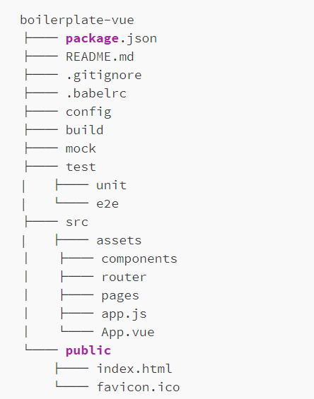
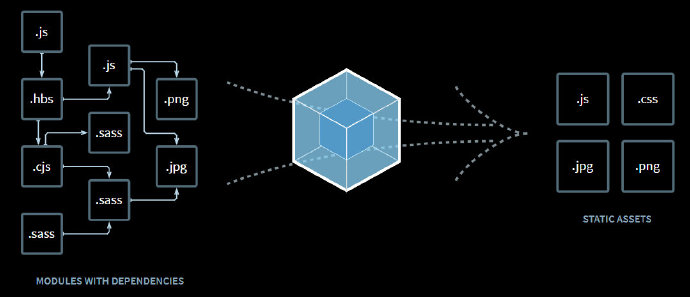
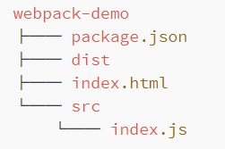
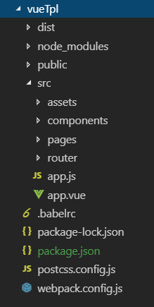

# webpack

## 目录

1. [简介](#简介)
   - [模板功能设计](#模板功能设计)
   - [webpack介绍](#webpack介绍)
     - [Webpack的特点](#Webpack的特点)
     - [Webpack构建流程](#Webpack构建流程)
     - [核心概念](#核心概念)
       - [入口](#入口)
       - [输出](#输出)
       - [loader](#loader)
       - [plugin](#plugin)
     - [如何使用Webpack](#如何使用Webpack)
       - [安装](#安装)
       - [第一次构建](#第一次构建)
       - [使用配置文件](#使用配置文件)
       - [使用插件](#使用插件)
       - [使用loader处理css文件](#使用loader处理css文件)
   - [搭建项目模板框架](#搭建项目模板框架)
     - [项目初始化](#项目初始化)
     - [安装Webpack](#安装Webpack)
     - [安装Vue](#安装Vue)
     - [单文件组件](#单文件组件)
     - [使用单文件组件](#使用单文件组件)
     - [使用HTML模板](#使用HTML模板)
     - [处理CSS的对应loader](#处理CSS的对应loader)
     - [CSS预处理器](#CSS预处理器)
     - [使用PostCSS](#使用PostCSS)
     - [处理资源路径](#处理资源路径)
     - [安装vue-router](#安装vue-router)
     - [安装Babel](#安装Babel)
   - [前端模块化解决方案](#前端模块化解决方案)
   - [搭建本地开发环境](#搭建本地开发环境)
   - [搭建本地Mock服务](#搭建本地Mock服务)
   - [引入代码检查工具](#引入代码检查工具)
   - [自动生成雪碧图](#自动生成雪碧图)
   - [根据浏览器构建](#根据浏览器构建)
   - [根据环境构建](#根据环境构建)
2. [总结](#总结)
   - [Invalid&nbsp;Host/Origin&nbsp;header问题](#Invalid&nbsp;Host/Origin&nbsp;header问题)

## 简介

依稀记得六七年前去面试，遇到面试题大概是这种风格：“如何实现水平垂直居中”，“js 事件委托的原理是什么”，“常见的 css hack 方式有什么？”，“\$(function(){})与 window.onload 有什么区别？”

今天面试遇到的面试题大概是这种风格：“能讲下 Vue 实现双向数据绑定的原理吗？”，“Webpack 中如何配置 Babel？”，“promise 和 await/async 的区别是什么？”

如果想进入大公司工作，前端工程化更是需要具备的基本素质。

## 模板功能设计

### 项目模板

我们的项目框架都是基于项目模板生成的。

通过项目模板，我们可以事先将项目所需要的功能点定义好，使用的时候只需要像实例化一个对象一样，简单地 new 一下就搞定了。大大地减少重复劳动，屏蔽项目配置的复杂度。

在动手搭建之前，有必要对我们的项目模板进行一个整体规划。

### 支持哪些功能

#### 代码检查

**为什么使用 ESLint？**

- ESLint 的所有规则都是可拔插的。
- 每条规则可以自由地开关。

至于 CSS 的检查，这里我们使用 `stylelint` 来处理。stylelint 功能非常强大，可以支持 scss、sass、less 以及 sugarss 的语法检查。此外，stylelint 和 ESlint 类似，也是提供了插件机制，开发者可以自己来定义规则，根据自己的团队定制一套统一的规范，避免样式错误。

#### 本地开发环境

我们在模板中使用 webpack-dev-server 作为 一个简单的 Web 服务器，由于 webpack-dev-server 内置了模块热替换（Hot Module Replacement 或 HMR），页面被修改后自动重新加载。

```json
// package.json
"scripts": {
    "dev": "webpack-dev-server --open"
}
```

#### mock server

前后端分离后，双方有清晰的边界，后端负责业务逻辑的编写，前端负责视图逻辑的开发，双方的数据传输通过 API 实现。前后端共同约定一份接口文档，接口文档中规定了接口名称、入参、出参以及数据结构等。

但仅仅有一份静态的接口文档还远远不够，我们需要的是在开发的阶段就能像在线上一样去调用服务端接口获取数据。

所以，Mock 是前后端分离模式下一项必备的功能。

我们采取的做法是在项目模板中实现一个 mock server，来响应本地请求。同时假数据通过 mockjs 来生成。

由于我们的本地开发环境与 mock server 运行在不同的端口上，因此我们还需要在 Webpack 中提供的 proxy 功能将我们的请求转发到 mock server 上去。


#### 构建

现在的前端开发基本上都是采用了模块化的开发方式，而且在代码中使用了大量的 es6+ 语言特性。但宿主浏览器中对新特性的支持不一。我们的代码无法直接运行在浏览器中，所以需要对代码进行构建打包，将代码编译成浏览器都可运行的代码。

```js
// webpack.config.js
...
output: {
      path: path.join(__dirname, './build'),
      publicPath: opt.publicPath,
      // 给线上环境的资源添加hash
      filename: 'js/[name]' + hash(needHash, 'chunk') + '.js',
      chunkFilename: 'js/[name]' + hash(needHash, 'chunk') + '.js',
}
...
plugins: [
    ...
      new webpack.optimize.UglifyJsPlugin({
        compress: {
        // 删除console和警告
            drop_console: true,
            warnings: false
        }
      })
      ...
]
```

由于目标代码的应用场景不同，我们需要针对不同的环境来进行构建。比如，针对测试环境运行的代码，由于需要不断进行调试，我们一般不清除代码中的注释和 console。由于代码部署无需考虑备份，不给构建出的文件添加 hash。线上环境构建的时候，我们需要尽可能减小文件的体积，同时需要考虑部署后不覆盖线上资源，所以需要在构建时剔除代码中的注释和调试语句，对代码进行混淆压缩，给文件添加 hash。

现在绝大多数现代浏览器都已经支持了原生的 ES2015，编译后的包通常都比原生的 ES2015+ 代码会更冗长，运行更慢。所以因为要支持更老的浏览器而为它们交付笨重的代码是一种浪费。我们在模板中可以针对现代浏览器打出体积更小的包。

- 现代版的包在被支持的浏览器中通过 `<script type="module">` 进行加载，使用 `<link rel="modulepreload">` 进行预加载。
- 旧版本的包会通过 `<script nomodule>` 加载，支持 ES modules 的浏览器会忽略该引用。

#### 部署

构建完成后，最后一步就是把前端资源发布到服务器了。假定我们的前端项目都是完全的前后端分离的，这意味着前端的资源需要和服务端分开部署。

比如，我们专门准备一个 OSS 服务器用来部署入口文件，准备另一个 OSS 服务器部署 js、css 和图片等资源。

```json
// package.json
"scripts": {
    // 假定我们的部署逻辑在deploy.js中
    "deploy": "node deploy.js"
}
```

部署我们会用到两个 npm 包，一个是 vinyl-ftp，专门用以登录我们的 OSS 服务器，另一个包是 vinyl-fs，用来将本地的资源发布到远程服务器。最后我们在 package.json 文件中配置 deploy 命令。部署操作只需要执行 `npm run deploy` 即可。

#### Qdebug

一个辅助测试小工具，为他们分析 bug 产生的原因，准确指派 bug 提供事实依据。

```html
<script>
  // 初始化
  var debug = new QDebug();
</script>
```

Qdebug 基于 vconsole 进行扩展，可以将接口请求中的详细接口数据打印出来，同时会生成一个当前前端代码的版本号。测试同学通过版本号就可以知道前端的资源是不是已经更新，通过查看详细的接口数据就可以准确判断 bug 的归属。

#### 自动化测试

自动化测试在 Web 工程中扮演重要的角色。自动化测试还可以与持续集成进行结合，通过机器来保证工程的质量，提升团队整体的效能。因此在前端工程化的建设过程中，自动化测试也是很重要的一环。

自动化测试根据粒度的不同，基本可以分为：单元测试、接口测试、端到端测试（也叫功能测试）。在前端工程中得到应用的主要是接口测试和端到端测试。

单元测试，是站在开发人员的视角，把代码划分成一个个的代码单元逐个进行测试，看返回的结果是否符合预期。

我们通过 Karma+Mocha+Chai 来实现单元测试功能。执行单元测试很简单也是通过 npm script 来调用，例如：

```sh
npm run test:unit
```

端到端测试是站在用户的视角，把 Web 应用当成一个黑盒，模拟用户的真实使用场景，比如在页面中输入文字，点击搜索。看测试结果是不是符合预期。端到端测试框架有不少，比如 Nightwatch、TestCafe、CasperJS。在本模板中，我们选用 Nightwatch 来实现端到端测试，主要是因为使用 Nigthwatch 编写的代码非常简洁。

执行端到端测试很简单通过 npm script 来调用，例如：

```sh
npm run test:e2e
```

### 目录结构

说完了模板要实现的主要功能后，我们来看一下项目模板的整体目录结构：



主要的一些目录和文件功能如下：

- src 中存放业务代码。其中 src/app.js 是项目构建的入口文件，src/App.vue是视图层的入口文件，src/pages 中放置不同的页面，src/components 中放置 Vue 组件，src/router 中放置 router 相关的文件，src/assets 中放置静态资源如图片、字体等。
- mock 存放 Mock 的假数据。
- test 用于放置测试相关的文件。
- build 用于放置构建相关的文件。
- config 用于放置配置相关的文件。
- public 用于放置公用的静态资源，如 HTML 入口模板文件、站点的小图标。
- package.json npm 模块的配置文件。
- .babelrc babel 的配置文件。
- .gitignore 用于指定哪些文件不提交到 Git 仓库。
- README.md 项目的介绍和使用文档。

## webpack介绍

### Webpack的特点



在 Webpack 中**一切皆模块**。Webpack 从一个入口文件开始递归地分析模块的依赖关系，根据依赖关系将这些模块打包成一个或多个文件。

- **支持所有的模块化**：ES6 模块、commonjs 模块、AMD 模块等
- **code splitting**：可以将代码打成多个 chunk，按需加载，意味着我们的站点无需等待整个 js 资源下载完成之后才能交互，可以大大提升速度。
- **强大灵活的插件系统**：提供了很多内置的插件，包括其自身也是架构在插件系统上
- **loader**：借助 loader 预处理非 js 资源，Webpack 可以打包所有的静态资源。

### Webpack构建流程

Webpack 的构建流程是一种事件流机制。整个构建流程可以看成是一个流水线，每个环节负责单一的任务，处理完将进入下一个环节。Webpack 会在每个环节上发布事件，供内置的和自定义的插件有机会干预 Webpack 的构建过程，控制 Webpack 的构建结果。Webpack 的基本的构建流程图如下：


- **初始化** 读取 Webpack 配置文件和 shell 脚本中的参数，将参数合并后初始化 Webpack ，生成 Compiler 对象。
- **开始编译** 执行 Compiler 的 run 方法开始执行编译。
- **编译完成** 从入口文件开始，调用配置中的 loader 对模块进行编译，并梳理出模块间的- 依赖关系，直至所有的模块编译完成。
- **资源输出** 根据入口与模块间的依赖关系，将上一步编译完成的内容组装成一个个的 chunk （代码块），然后把 chunk 加入到等待输出的资源列表中。
- **完成** 确定好输出资源后，根据指定的输出路径和文件名配置，将资源写入到磁盘的文件系统中，完成整个构建过程。

### 核心概念

#### 入口

```js
// webpack.config.js
// 单入口
module.exports = {
  entry: './src/app.js'
};

// webpack.config.js
// 多入口
module.exports = {
  entry: {
    pageOne: './src/pageOne/app.js',
    pageTwo: './src/pageTwo/app.js'
  }
};
```

#### 输出

```js
// webpack.config.js
module.exports = {
  output: {
    filename: 'bundle.js',
    path: './dist'
  }
};
```

#### loader

Webpack 本身是不能处理非 JS 资源的，但我们却可以在 Webpack 中引入 css、图片、字体等非 js 文件。

loader 有三种使用方式：

- **配置** 在 webpack.config.js 文件中指定
- **内联** 在每个 import 语句中线上指定
- **CLI** 在 shell 命令中指定。

我们通过一个简单的例子来看一下 loader 的使用：

```js
// webpack.config.js
module.exports = {
 module: {
    rules: [
      { test: /\.css$/, use: 'css-loader' }
    ]
  }
};
```

我们需要告诉 Webpack 当遇到 css 文件的时候，使用 css-loader 进行预处理。这里由于 css-loader 是单独的 npm 模块，使用前我们需要先进行安装：

```sh
npm install --save-dev css-loader
```

下面对一些常用的 loader 进行简要的说明：

- babel-loader 将 ES2015+ 代码转译为 ES5。
- ts-loader 将 TypeScript 代码转译为 ES5。
- css-loader 解析 @import 和 url()，并对引用的依赖进行解析。
- style-loader 在 HTML 中注入 `<style>` 标签将 css 添加到 DOM 中。通常与 css-loader 结合使用。
- sass-loader 加载 sass/scss 文件并编译成 css。
- postcss-loader 使用 PostCSS 加载和转译 css 文件。
- html-loader 将 HTML 导出为字符串。
- vue-loader 加载和转译 Vue 组件。
- url-loader 和 file-loader 一样，但如果文件小于配置的限制值，可以返回 data URL。
- file-loader 将文件提取到输出目录，并返回相对路径。

#### plugin

插件是 Webpack 的非常重要的功能，Webpack 本身也是建立在插件系统之上的。插件机制极大增强了 Webpack 的功能，为 Webpack 增加了足够的灵活性。通过插件，我们可以在 Webpack 的构建过程中，引入自己的操作，干预构建结果。

我们通过一个示例来看一下插件的使用：

```js
// webpack.config.js
const HtmlWebpackPlugin = require('html-webpack -plugin');
const webpack = require('webpack');

const config = {
  plugins: [
    new webpack.optimize.UglifyJsPlugin(),
    new HtmlWebpackPlugin({template: './src/index.html'})
  ]
};

module.exports = config;
```

示例中，我们用到了两个插件，一个是内置的 UglifyJsPlugin 插件，该插件对 js 进行压缩，减小文件的体积。一个是外部插件 HtmlWebpackPlugin，用来自动生成入口文件，并将最新的资源注入到 HTML 中。

**常用的插件：**

- HtmlWebpackPlugin 自动生成入口文件，并将最新的资源注入到 HTML 中。
- CommonsChunkPlugin 用以创建独立文件，常用来提取多个模块中的公共模块。
- DefinePlugin 用以定义在编译时使用的全局常量。
- DllPlugin 拆分 bundle 减少不必要的构建。
- ExtractTextWebpackPlugin 将文本从 bundle 中提取到单独的文件中。常见的场景是从 bundle 中将 CSS 提取到独立的 css 文件中。
- HotModuleReplacementPlugin 在运行过程中替换、添加或删除模块，而无需重新加载整个页面。
- UglifyjsWebpackPlugin 对 js 进行压缩，减小文件的体积。
- CopyWebpackPlugin 将单个文件或整个目录复制到构建目录。一个常用的场景是将项目中的静态图片不经构建直接复制到构建后的目录。

### 如何使用Webpack

我们通过一个简单的例子来看一下 Webpack 的使用。

#### 安装

创建 webpack-demo 目录，初始化 npm，并且在 webpack-demo 目录中安装 Webpack 和 webpack-cli：

```sh
mkdir webpack-demo && cd webpack-demo
npm init -y
npm install webpack  webpack-cli --save-dev
```

>webpack-cli 用来在命令行中运行 Webpack 。这里建议本地安装 Webpack 和 webpack-cli，因为全局安装的话，Webpack 的升级会影响到所有的项目。

接下来我们先在项目中新增一些目录和文件：



具体内容请查看示例项目

#### 第一次构建

在命令行运行：`./node_modules/.bin/webpack`

可以发现，我们并没有在配置文件中指定打包的入口和输出的出口，也没有在命令行中指定配置参数，但可以看到在 ./dist 目录下新增了一个 main.js。这是因为 Webpack 配置中 entry 的默认值为 ./src，出口的默认目录是 ./dist。

我们现在将 index.html 中的脚本引用修改为构建后的文件 ./dist/main.js，在浏览器预览，如果一切正常应该可以看到页面上会输出文本 hello world。

#### 使用配置文件

我们在项目根目录下新增 webpack.config.js 文件，同时为了调用简单，我们在 package.json 文件中设置快捷命令来调用 `./node_modules/.bin/Webpack`。

再次执行构建命令：`npm run build`，将 index.html 中的 script 引用链接修改为 ./dist/bundle.js，在浏览器中预览页面，不出意外的话会输出文本 hello world。

#### 使用插件

我们发现在构建的过程中，如果构建后的资源名称发生了变化，index.html 中对资源的引用会被动地跟着修改，非常不方便，我们引入 HtmlWebpackPlugin 来帮助我们自动生成入口文件，自动将生成的资源文件注入 index.html 中，原目录中的 index.html 文件现在可以删除。

安装：`npm install --save-dev html-webpack-plugin`，修改[配置](../Codes/webpack-demo/webpack.config.js)

再次执行构建命令查看结果！

#### 使用loader处理css文件

为了使 Webpack 可以处理 import 进来的 css 文件，我们需要安装并配置 style-loader 和 css-loader。

```sh
npm install --save-dev style-loader css-loader
```

然后修改 Webpack 的[配置文件](../Codes/webpack-demo/webpack.config.js)。

如此一来，当 Webpack 匹配到后缀为 .css 的文件都会使用 css-loader 和 style-loader 进行处理。

接下来我们在 ./src 目录下新增一个样式文件 [main.css](../Codes/webpack-demo/src/main.css)。

紧接着我们在 [index.js](../Codes/webpack-demo/src/index.js) 中引用 main.css，执行构建命令，查看结果！

不出意外，打开浏览器调试工具，可以看到在 `<head>` 标签里插入了一个 `<style>` 标签。

通过以上完整的示例，我们演示了 Webpack 的核心的几个配置的使用方式，我们对 Webpack 的使用应该有了一个基本的认识。

Webpack 中还有很多其他有用的配置项，大家可以查阅 [官方文档](https://www.webpackjs.com/configuration/) 自行配置和练习。

**总结：**

本节我们对 Webpack 进行了总体的介绍。借助 loader、Webpack 可以处理一切资源，JS 的、非 JS 的，都可以。

通过插件，我们可以在 Webpack 的构建过程中的每个事件节点加入自己的行为，来影响 Webpack 的构建。对 Webpack 的使用有了认识后，接下来我们要以之为基础搭建起项目的基本框架。

## 搭建项目模板框架

### 项目初始化

创建项目目录，并执行 npm 初始化：

```sh
mkdir vueTpl & npm init -y
```

创建了项目模板目录 vueTpl，在目录下有一个 npm 的配置文件 package.json，其内容如下：

```json
{
  "name": "vueTpl",
  "version": "1.0.0",
  "description": "",
  "main": "index.js",
  "scripts": {
    "test": "echo \"Error: no test specified\" && exit 1"
  },
  "keywords": [],
  "author": "",
  "license": "ISC"
}
```

### 安装Webpack

执行以下命令，本地安装 Webpack 和 webpack-cli。

```sh
npm install --save-dev webpack webpack-cli
```

安装完后，在根目录下创建 webpack.config.js 等待在后面的步骤中使用。

### 安装Vue

由于我们需要与 Webpack 模块打包器配合使用，所以推荐使用 npm 安装：

```sh
npm install vue
```

npm 会自动在我们的 package.json 中添加了依赖项：

```json
"dependencies": {
    "vue": "^2.6.10"
}
```

细心的同学可能会发现，我们的目录中多了一个 package-lock.json 的文件。

```json
// package-lock.json
"dependencies": {
    "vue": "2.6.10"
}
```

在执行 npm install 的时候会自动生成 package-lock.json。package-lock 的主要功能是锁定当前依赖包的版本，确保用户的环境和依赖的包是一致的，保证项目的稳定性。

### 单文件组件

.vue 文件是一个自定义的文件类型，用类 HTML 语法描述一个 Vue 组件。每个 .vue 文件包含三种类型的顶级语言块 `<template>`、`<script>` 和 `<style>`。

如果我们的应用非常简单，不想引入 Webpack 等构建工具，可能只需要一个 HTML 文件，引入 Vue 的框架文件，编写简单的 JS 业务逻辑，就可以运行了。

但开发大型的单页应用，通常使用单文件组件来降低复杂度，提升效率。单文件组件的写法可以参看如下代码：

```html
// Hello.vue
<template>
  <div class="example">{{ msg }}</div>
</template>

<script>
export default {
  data () {
    return {
      msg: 'Hello world!'
    }
  }
}
</script>

<style>
.example {
  color: red;
}
</style>
```

我们在单文件模板中将 HTML、JS、CSS 代码作为一个完整的功能单元放在了一个文件中进行管理。

如果在项目中使用单文件组件的话，需要安装 vue-loader 和 vue-template-compiler：

```sh
npm install -D vue-loader vue-template-compiler
```

vue-loader 会解析 .vue 文件，提取每个语言块，如有必要会通过其它 loader 处理，最后将他们组装成一个 ES Module，它默认导出一个 Vue.js 组件选项的对象。

vue-template-compiler 会接解析 template 标签中的内容，预处理为 JS 渲染函数，并最终注入到从 `<script>` 导出的组件中。

**更新 Webpack 配置：**

安装完成后，我们还需要在 Webpack 的配置文件中进行配置，以便 Webpack 在打包前对 .vue 文件进行预处理。

```js
// webpack.config.js
const VueLoaderPlugin = require('vue-loader/lib/plugin')

module.exports = {
  module: {
    rules: [
      {
        test: /\.vue$/,
        loader: 'vue-loader'
      }
    ]
  },
  plugins: [
    // 请确保引入这个插件！
    new VueLoaderPlugin()
  ]
}
```

除了配置 loader 之外，大家可能注意到我们还配置了一个插件VueLoaderPlugin，它的作用是将其它规则复制并应用到 .vue 文件里相应语言的块中。例如，如果我们有一条匹配 /.js\$/ 的规则，那么它会应用到 .vue 文件里的 `<script>` 块。

### 使用单文件组件

Vue 安装好后，我们采取单文件组件的形式来完善我们的项目结构。

**src/app.vue：**

```html
<template>
  <div id="app">
    <h2>欢迎使用项目模板！</h2>
  </div>
</template>

<script>
export default {
  name: "App"
};
</script>
```

app.vue 是项目的根组件

**src/app.js：**

```js
import Vue from "vue";
import App from "./app.vue";

new Vue({
  el: "#app",
  render: h => h(App)
});
```

app.js 是应用的入口，它会把 app.vue 作为模板进行渲染。同时 webpack 会将 app.js 作为入口进行打包。

**配置入口和输出：**

```js
const path = require('path');
const VueLoaderPlugin = require("vue-loader/lib/plugin");
module.exports = {
  entry: { app: './src/app.js' },
  output: {
    // 以 entry 中 key 的 name 作为打包后的文件名
    filename: '[name].js',
    path: path.resolve(__dirname, 'dist')
  },
  module: {
    rules: [
      {
        test: /\.vue$/,
        loader: 'vue-loader'
      }
    ]
  },
  plugins: [
    new VueLoaderPlugin()
  ]
};
```

### 使用HTML模板

为了避免每次构建后，资源名称发生改变引起的手动修改 index.html 的引用，我们使用 HtmlWebpackPlugin 来自动生成 index.html，自动进行资源注入。

**public/index.html：**

```html
<!DOCTYPE html>
<html>
  <head>
    <meta charset="utf-8">
    <meta name="viewport" content="width=device-width,initial-scale=1.0">
    <title><%= htmlWebpackPlugin.options.title %></title>
  </head>
  <body>
    <div id="app"></div>
    <!-- built files will be auto injected -->
  </body>
</html>
```

页面中通过 `<%= htmlWebpackPlugin.options.title %>` 可以引用在插件中定义的参数。

安装插件：`npm install --save-dev html-webpack-plugin`

更新 webpack.congfig.js。HtmlWebpackPlugin 插件中 template 字段用来指定模板文件，title 可以定义页面的标题。

```js
const path = require("path");
const VueLoaderPlugin = require("vue-loader/lib/plugin");
const HtmlWebpackPlugin = require("html-webpack-plugin");

module.exports = {
  entry: { app: "./src/app.js" },
  output: {
    filename: "[name].js",
    path: path.resolve(__dirname, "dist")
  },
  module: {
    rules: [
      {
        test: /\.vue$/,
        loader: "vue-loader"
      }
    ]
  },
  plugins: [
    new VueLoaderPlugin(),
    new HtmlWebpackPlugin({
      template: "./public/index.html",
      title: "项目模板"
    })
  ]
};
```

在 package.json 中定义 npm 命令：

```json
"scripts": {
  "build": "webpack"
}
```

在命令行中运行 `npm run build`，查看结果！

### 处理CSS的对应loader

大家可能注意到了，我们的 app.vue 文件中，并没有添加 CSS 样式，如果我们在底部增加如下 CSS 代码：

```css
h2 {color: red}
```

这时候，执行 `npm run build` 的话，命令行中会提示以下错误：

```sh
Module parse failed: Unexpected token (14:3)
You may need an appropriate loader to handle this file type.
|
|
> h2 {
|   color: rgb(88, 63, 63);
| }
```

主要是因为单文件中的出现的 CSS 依赖于对应的 loader 来处理，这里我们需要用到两个 loader。css-loader 和 style-loader。它们负责帮我们处理文件中的 CSS。

安装：`npm install --save-dev css-loader style-loader`

配置：

```js
module.exports = {
  // ....省略其他配置
  module: {
    rules: [
      {
        test: /\.vue$/,
        loader: "vue-loader"
      },
      {
        test: /\.css$/,
        use: ["style-loader", "css-loader"]
      }
    ]
  }
  // ....省略其他配置
};
```

当 Webpack 检查到 CSS 代码时，依次使用 css-loader、style-loader 对 CSS 进行处理。数组中的 loader 是从右往左依次调用，大家注意下不要搞反了。

再次执行 npm run build，可以发现构建成功了。

### CSS预处理器

在实际的开发中，我们可能会使用 sass/scss/less/stylus 等各种预处理器，这些预处理器对 CSS 语法进行了扩展，例如，定义变量、支持嵌套、支持混入等，可以大大提高开发效率。

在我们的项目模板中，我们拿 Sass 作为我们的预处理器，因此我们需要进行对应 loader 的安装和配置。

安装：`npm install -D sass-loader node-sass`

配置：

```js
module.exports = {
  // ....省略其他配置
  module: {
    rules: [
      {
        test: /\.vue$/,
        loader: "vue-loader"
      },
      {
        test: /\.scss$/,
        use: ["style-loader", "css-loader", "sass-loader"]
      }
    ]
  }
  // ....省略其他配置
};
```

这里我们采用 SCSS 的语法风格来编写 CSS，所以我们将 test 的正则调整为 /.scss\$/，同时需要 loader 数组的末尾添加 sass-loader。

在 app.vue 中添加一些 SCSS 语法：

```html
<style lang="scss">
$black: black;
$yellow: yellow;
h2 {
  color: $black;
  background: $yellow;
}
</style>
```

我们首先给 style 加了一个 lang 属性，它的值设为 scss，告诉 loader 使用对应的 sass-loader 解析，另外，我们定义了两个颜色变量 $black 和 $yellow，颜色变量以 $ 符号开头。

再次执行 `npm run build`

>注意：npm 安装 node-sass 依赖时，会从 github.com 上下载 .node 文件。由于国内网络的原因，下载时间可能会很长，甚至导致超时失败。这是大家可能都会遇到的的问题。解决方案就是使用其他源，或者使用工具下载，然后将安装源指定到本地。另外，如果安装失败，再执行安装的话就不再触发下载了，这里建议先执行 `npm uninstall node-sass` 之后再重新安装。

### 使用PostCSS

我们在日常开发中，会经常用到一些 CSS3 及以上未来的 CSS 新属性。但这些新属性还没有在浏览器中得到正式实现前，我们可能需要添加一些浏览器特定的前缀才能使用。比如在 Chrome 浏览器下使用尚未标准化的新属性需要添加 -webkit 前缀，在火狐浏览器下需要添加 -moz 前缀，在 IE 浏览器下需要添加 -ms 前缀。如果为每个属性都添加一遍的话，非常繁琐，效率很低。

postcss 通过插件系统，提供了很多强大的功能，比如可以通过 autoprefixer 自动添加浏览器前缀，通过 postcss-preset-env 插件，我们可以使用尚未支持的 CSS 特性，插件会帮助我们将未来的 CSS 特性转换成现有的 CSS，类似于 Babel 将 ES6+ 的语法转换成 ES5 的语法。

安装：`npm install -D postcss-loader postcss-preset-env`

配置 postcss 有多种方式。我们可以在 Webpack 中进行配置，如下所示：

```js
// webpack.config.js
// ...省略其他配置
module: {
    rules: [
      {
        test: /\.scss$/,
        use: [
          "style-loader",
          "css-loader",
          {
            loader: "postcss-loader",
            options: {
              plugins: [require("postcss-preset-env")()]
            }
          },
          "sass-loader"
        ]
      }
    ]
  }
```

我们也可以在根目录下创建 postcss 的配置文件 postcss.config.js 来配置，如下所示：

```js
// postcss.config.js
module.exports = {
  plugins: {
    "postcss-preset-env": {}
  }
};
```

>postcss-preset-env 插件已经包含了 autoprefixer 插件的功能，因此如果配置了 postcss-preset-env 的话，无需单独再安装 autoprefixer。

postcss-preset-env 是否自动给 css 添加前缀以及添加什么前缀，依赖于要支持的浏览器列表。浏览器列表有以下几种配置方式：

1. package.json 中的 browserslist 字段中配置，也是官方推荐的方式。
2. 在 .browserslistrc 或者 browserslist 配置文件中配置
3. 在 BROWSERSLIST 环境变量中配置

如果没有找到有效的浏览器列表，postcss-preset-env 会使用默认值：`> 0.5%, last 2 versions, Firefox ESR, not dead`。表示的浏览器范围是：

1. 市场份额大于 0.5% 的浏览器；
2. 各个厂商最新两个版本的浏览器；
3. Firefox ESR 浏览器；
4. 剔除以上所有的浏览器中 2 年内未更新的浏览器。

在 package.json 中添加 browserslist 字段:

```json
"browserslist": [
    "> 0.5%",
    "last 2 versions"
  ]
```

我们指定的浏览器范围中有一部分浏览器对 transform 属性的支持需要添加浏览器厂商前缀，我们可以在构建后访问页面进行验证。

接下来，我们更新一下我们的 app.vue，在里面添加一条 CSS3 的代码：

```html
<style lang="scss">
$black: black;
$yellow: yellow;
h2 {
  color: $black;
  background: $yellow;
  transform: rotate(20deg);
}
</style>
```

运行 `npm run build` 在浏览器中打开我们的 index.html 页面，打开浏览器的调试工具，可以看到 transform 上已经添加了对应的浏览器前缀的代码

### 处理资源路径

我们如果在文件中使用图片、字体、视频等文件资源的时候，需要配置对应的 loader 来解析，这里我们用到的 loader 是 url-loader 和 file-loader。

安装：`npm install url-loader --save-dev`

更新 Webpack 配置：

```js
// ...省略其他配置
module: {
    rules: [
      // ...省略其他规则
      {
        test: /\.(png|jpe?g|gif|svg)(\?.*)?$/,
        use: [
          {
            loader: "url-loader",
            options: {
              limit: 8092,
              name: "img/[hash:7].[ext]"
            }
          }
        ]
      },
      {
        test: /\.(mp4|webm|ogg|mp3|wav|flac|aac)(\?.*)?$/,
        use: [
          {
            loader: "url-loader",
            options: {
              limit: 8092,
              name: "media/[hash:7].[ext]"
            }
          }
        ]
      },
      {
        test: /\.(woff2?|eot|ttf|otf)(\?.*)?$/,
        use: [
          {
            loader: "url-loader",
            options: {
              limit: 8092,
              name: "font/[hash:7].[ext]"
            }
          }
        ]
      }
    ]
  }
  // ...省略其他配置
```

url-loader 可以设置文件的尺寸限制，低于设定尺寸的文件会转成 base64 编码的 URI。超出限制的文件会调用 file-loader 进行处理。同时我们可以通过 name 属性来指定文件导出时的目录和名称。

我们将一个 logo.png 图片放到 src/assets 下，然后在 app.vue 中引用，执行构建命令，如果图片尺寸大于了我们设置的 limit，dist/img 目录下会有我们的图片。 在浏览器中打开页面预览，正常可以看到一个 Vue 的 logo。

### 安装vue-router

对于单页应用我们需要管理路由跳转逻辑，这里我们借助 vue 官方的路由管理器 vue-router 来实现 。

安装：`npm install vue-router`

配置：vue-router 的使用比较简单，我们要做的是将组件映射到路由，然后告诉 vue-router 在哪儿渲染。

首先，我们创建 pages 目录，用来存放页面级的组件。以下是两个页面组件的内容：

pages/Hello.vue

```html
<template>
  <h2>欢迎使用项目模板！</h2>
</template>
```

pages/About.vue

```html
<template>
  <h2>我是介绍页面</h2>
</template>
```

调整 app.vue 的页面内容，在里面添加 `<router-view>` 用来插入路由。

```html
<template>
  <div id="app">
    
    <router-view/>
  </div>
</template>
<style lang="scss">
$black: black;
$yellow: yellow;
h2 {
  color: $black;
  background: $yellow;
}
</style>
```

新建 router 目录，在目录中创建 index.js。我们在 index.js 中引入页面组件映射到路由中。当页面地址匹配到 / 时，加载 Hello 组件，当匹配到 /about 的时候，加载 About 组件。

router/index.js

```js
import Vue from "vue";
import Router from "vue-router";
import Hello from "../pages/Hello.vue";
import About from "../pages/About.vue";
Vue.use(Router);
export default new Router({
  routes: [
    {
      path: "/",
      component: Hello
    },
    {
      path: "/about",
      component: About
    }
  ]
});
```

更新 app.js 的内容，将 router 实例注入到 Vue 实例中。

```js
import Vue from "vue";
import App from "./app.vue";
import router from "../src/router";
new Vue({
  el: "#app",
  router,
  render: h => h(App)
});
```

执行构建命令，在浏览器中打开页面，切换页面地址，可以看到页面的切换。

这里有一点需要注意，vue-router 默认的路由模式是 hash 模式，我们访问 about 页面的时候需要这样访问 `index.html#/about`。

### 安装Babel

Babel 是一个转码器，负责将 ES2015+ 代码转为 ES5 代码。有了转码器我们可以在开发中使用 ES2015+ 代码，无需担心浏览器是否已经实现。

首先先安装一些依赖：

```sh
npm install --save-dev @babel/core @babel/preset-env babel-loader
npm install --save @babel/polyfill
```

Babel6.0 以后拆分了几个独立的包，并以插件的机制来构筑。@babel/core 是 Babel 的核心功能包，必须安装。

@babel/preset-env 能根据当前的运行环境，自动确定需要的 plugins 和 polyfills。主要负责将代码转成 ES5 语法规则。

babel-polyfill。Babel 编译时只编译语法，并不会编译 API 和实例方法，如：async/await、Promise 等，babel-polyfill 会把这些没有的 API 全部挂载到全局对象，也就是所谓的“垫片”。

babel-loader 是 Webpack 用来转译 JS 代码的加载器。

更新 webpack.config.js：

```js
// ...省略其他配置
module: {
    rules: [
      {
        test: /\.js$/,
        exclude: /node_modules/,
        loader: "babel-loader"
      }
    ]
  }
  //...省略其他配置
```

.babelrc 配置：

>注意！corejs 版本需与安装的 core-js 版本一致！

在配置过程中，可能遇到 .babelrc 中的 corejs 版本与实际安装的 core-js 版本不一致的情况。大家可以通过 npm ls core-js 查看使用的 core-js 的版本，并将 corejs 的值设置为实际的版本号。

```js
{
  "presets": [
    [
      "@babel/preset-env",
      {
        "modules": false,
        "targets": {
          "browsers": ["> 1%", "last 2 versions", "not ie <= 8"]
        },
        // corejs的值需与安装的core-js的版本一致
        // 可以通过 npm ls core-js 查看core-js的版本号
        "corejs": "2.6.9",
        "useBuiltIns": "usage"
      }
    ]
  ]
}
```

Webpack 中配置完 babel-loader 后，我们在根目录下新建 .babelrc，该文件是 Babel 官方推荐的配置方式。我们在该文件中需要将我们的 @babel/preset-env 引入，并指定了我们需要兼容到的浏览器。

通过 useBuiltIns 指定为 usage，@babel/preset-env 可以按需引入对应的 polyfill，减小文件大小。有一个需要注意的点，corejs 与 package.json 中依赖的 core-js 的版本需要一致，否则可能会构建失败。

另外通过 targets，我们可以指定代码需要兼容到的浏览器。具体的用法可以查看[文档](https://github.com/browserslist/browserslist)。这里不展开讲了。

更新一下 app.js 的代码：

```js
// ... 省略其他代码
let p = new Promise(function(resolve, reject) {
  setTimeout(() => {
    resolve("done");
  }, 1000);
});
p.then(res => {
  console.log(res);
});
// ... 省略其他代码
```

执行构建命令，在 IE9 中验证一下，可以发现没有报语法错误（IE9 不支持 promise），说明我们的 Babel 这块的配置生效了。

现在的项目目录结构如下图：



**总结：**

通过以上的步骤，我们的项目模板基本成型了。我们可以使用单文件组件的形式进行开发，在开发中可以使用 ES2015+ 代码，使用 Sass/SCSS 编写 CSS，通过 router 来开发单页应用。

### 属性配置

```javascript
const path = require('path')
module.exports = {
  entry:{ //main是默认入口,也可以是多入口
    main:'./src/main.js'
  },
  //出口
  output:{
    filename:'./build.js', 指定js文件
    path: path.join(__dirname,'..','dist',)
    //最好是绝对路径，代表当前目录的上一级的dist
  },
  module:{
    //一样的功能rules: webpack2.x之后新加的
    loaders:[require('./a.css||./a.js') {
      test:/\.css$/,
      loader:'style-loader!css-loader', //顺序是反过来的2!1
    }, {
      test:/\.(jpg|svg)$/,
      loader:'url-loader?limit=4096&name=[name].[ext]',
      //顺序是反过来的2!1
      //[name].[ext]内置提供的，因为本身是先读这个文件
      options:{
        limit:4096,
        name:'[name].[ext]'
      }
    }]
  },
  plugins:[
    //插件的执行顺序是依次执行的
    new htmlWebpackPlugin({
      template:'./src/index.html',
    })
    //将src下的template属性描述的文件根据当前配置的output.path，将文件移动到该目录
  ]
}
```

## 前端模块化解决方案

主流的模块化规范：

- CommonJS
  - 每个文件就是一个模块，每个模块中定义的变量，函数，类等都是私有的，对外不可见。
  - 通过 require 方法来加载依赖的模块，通过 exports 或者 module.exports 来导出模块。
  - [学习示例](../Codes/webpack-demo/study/CommonJS/main.js)
  - 适用场景：比较适合服务端，不太适合浏览器端
     >CommonJS 规范中模块的加载采取**同步**加载的方式，比较适用于 Node.js 端。因为服务端的文件都是存在本地的，加载起来很快。
     >
     >浏览器环境下，所有的资源都需要从服务器下载后才能使用。同步加载会阻塞 JS 的运行。所以 CommonJS 在浏览器端不太适合。

- AMD
  - AMD通过**异步**的方式加载依赖的模块，依赖的模块需要通过一个数组指明，模块以异步的方式并行加载。
  - AMD 模块的定义通过 `define` 这个全局包裹函数来实现。模块的引用通过全局方法 `require` 来加载。
  - [学习示例](../Codes/webpack-demo/study/AMD/main.js)：RequireJS 是 AMD 的实现。我们以 RequireJS 为例来看一下 AMD 模块的使用
  - 适合场景：适合在浏览器场景使用，当然其初心也是聚焦浏览器。
  
    >AMD 在浏览器环境中异步并行加载依赖模块，并且可以有效地管理文件依赖关系和加载顺序。  
    >但是 AMD 在书写上多了多余的包裹函数，在代码的阅读和书写上相对繁琐。

- CMD
  - 借鉴了 AMD 规范，也是异步加载依赖，主要应用在浏览器环境下
  - 与 AMD 规范相比，CMD 规范更简单清晰，并与 CommonJS 和 Node.js 的 Modules 规范保持了很大的兼容性
  - 由国内的开发者玉伯提出，并在 `SeaJS` 中实现。
  - [学习示例](../Codes/webpack-demo/study/CMD/main.js)
  - 适用场景：CMD 主要也是应用在浏览器端，相对于 AMD，CMD 里的 API 更简单纯粹。其主要特点是**依赖就近**，**延迟执行**。

- ES6 module
  - 每一个 ES6 模块都是一个独立的 JS 文件，文件中的所有声明都是只在模块的本地作用域中有效，如果需要提供给外部模块访问，需要 `export` 明确导出。
  - ES6 模块系统非常好的一点是**静态化的设计**。ES6 模块在编译阶段就可以确定模块之间的依赖关系，这样可以只导入实际使用到的代码。结合 Webpack 等打包工具，可以对 ES6 模块在编译时计算所有依赖，并将所有模块打包成一个文件，通过网络一次加载完成。（CommonJS 和 AMD 模块在运行时才能确定依赖关系）。
  - ES6 模块与 commonJS 有一个差异需要注意：在 CommonJS 模块输出的是值的拷贝，但在 ES6 模块中输出的是值的引用。
  - [学习示例](../Codes/webpack-demo/study/ES6_module/main.js)
  - 适用场景：ES6 提供的模块系统支持是语言层面的，所以 ES6 在服务端和浏览器端都可以使用，而且作为标准的语言功能，极力推荐使用 ES6 模块来替代 CommonJS 和 AMD 模块。

    >现阶段以 Chrome 为代表的很多现代浏览器已经对模块语法有了良好的支持，但为确保在其他浏览器上不出差错我们需要使用 `Babel` 等转译器来配合。

## 搭建本地开发环境

一些痛点：

- 手动执行构建
- 手动刷新浏览器
- 无法精确定位错误

### 自动构建

**观察模式：**

通过`--watch`选项

```json
"scripts": {
  "build": "webpack --watch"
}
```

执行 `npm run build`，Webpack 启动构建，构建完成后，并不退出命令行。因为 Webpack 在观察文件。

**浏览器自动刷新：**

通过`webpack-dev-server`

安装：

`npm install --save-dev webpack-dev-server`

在 Webpack 的配置文件中配置：

```js
module.exports = {
  // ...省略其他配置
  devServer: {
    contentBase: path.join(__dirname, "dist")
  }
  // ...省略其他配置
}
```

在 package.json 中定义 npm script。具体如下：

```json
"scripts": {
  "start": "webpack-dev-server --open"
}
```

**webpack-dev-server 主要选项：**

- **contentBase**: 告诉服务器从哪里提供静态文件。默认情况下，使用当前工作目录作为提供静态文件的目录。推荐使用绝对路径。
- **port**: 默认情况，dev-server 会将服务跑在 8080 端口，如果端口被占用或者希望自己定义的话，可以通过 port 指定。
- **proxy**: 如果希望在本地访问后端的某个服务器 api 或者访问前端自己在本地
搭建的 mock 服务，可以通过 proxy 来做代理。
- **hot**: 模块热替换(HMR)是 Webpack 提供的非常有用的功能之一，它可以在应用运行时添加、删除、更新模块，无需重新加载整个页面。HMR 可以显著提升我们的开发效率。
- **sourceMap**: 错误定位

  devtool|构建速度|重新构建速度|适用环境|精准度
  -|-|-|-|-
  none|+++|+++|生产环境|不生成 source map。
  source-map|--|--|生产环境|映射到原始源代码，source map 作为单独的文件保存。
  inline-source-map|--|--|开发环境|映射到原始源代码，source map 转换为 DataUrl 后添加到 bundle 中，会导致文件大小剧增。
  eval|+++|+++|开发环境|映射到转换后的代码，而不是源代码，行数映射不正确。
  eval-source-map|--|+|开发环境|映射到原始源代码，只映射到行。

  根据以上信息我们可以得出基本的结论：

  - 生产环境中不生成 sourcemap，或者如果需要拥有错误上报工具，选择 source-map。
  - 开发环境中，根据对代码映射精确度的要求，可以选择 eval， eval-source-map，inline-source-map。

  我们在开发环境中需要兼顾构建速度，同时需要能映射到源代码查找问题，一般情况能定位到行的话，对于开发者就足够了。所以我们在开发环境中选择使用 `eval-source-map`。

>有的选项只能在命令行中使用，例如 `webpack-dev-server --progress` 它用来将运行的进度输出到控制台。
>
>**问题**：不是说好的局部替换局部更新吗？为什么我<b style="color:red">自己写的模块</b>发生了变化的时候引却发了整个页面刷新呢？  
>**原因**：HMR 生效的前提是模块中实现了 HMR 接口。如果一个模块没有 HMR 处理函数，更新就会冒泡，一个单独的模块被更新，那么整组依赖模块都会被重新加载。
>
>我们在项目中使用到的 vue-loader、style-loader 模块内部已经实现了模块热替换的接口，因此你会发现我们在 vue 单文件组件中做的修改不会引起全局刷新。而我们自己实现的一个模块由于没有实现 HMR 接口，所以触发了全局刷新。
>
>自定义组件实现 HMR 接口的示例：

```js
// 增加对HMR的实现
if (module.hot) {
  module.hot.accept("./print.js", function() {
    console.log("接收更新后的模块");
    print();
  });
}
```

>我们的开发基本上以 Vue 单文件组件为主，`vue-loader` 已经帮我们实现了热替换的逻辑，因此在大部分场景下，我们是无需自己去写这部分代码的。只需要启用 webpack-dev-server 的 hot 选项就好了。

配置文件指定：

```js
// webpack.config.js
{
  content-base: '/path/to/dirname',
  port: 5000,
  proxy: {
    // 请求 /api/json 的话会代理到 http://localhost:3000/api/json
    "/api": "http://localhost:3000"
  },
  hot: true,
  devtool: 'eval-source-map'
}
```

命令行指定：

```sh
webpack-dev-server --content-base /path/to/dirname
webpack-dev-server --port 5000
webpack-dev-server --hot
```

**自定义本地开发环境：**

webpack-dev-server 背后是基于 webpack-dev-middleware 实现的。webpack-dev-middleware 可以把 Webpack 处理后的文件传递给一个服务器，我们可以将其作为一个单独的包进行使用实现更多个性化的需求。作为知识拓展，我们看一下**如何使用 webpack-dev-middleware 来实现 webpack-dev-server 实现的功能**。

首先，安装 Express 和 webpack-dev-middleware。

>webpack-dev-middleware 是一个 Express 风格的中间件，需要结合 Express 使用。

```sh
npm install --save-dev express webpack-dev-middleware
```

调整 webpack.config.js，删除 devserver 的相关配置：

```js
const path = require("path");
const VueLoaderPlugin = require("vue-loader/lib/plugin");
const HtmlWebpackPlugin = require("html-webpack-plugin");

module.exports = {
  entry: { app: "./src/app.js" },
  output: {
    filename: "[name].js",
    path: path.resolve(__dirname, "dist"),
    publicPath: '/'
  }
  // ... 省略其他配置
};
```

设置 publicPath 是因为我们的服务端代码中会用到，接下来我们在根目录下创建我们 server.js，自定义我们的 Express 服务：

```js
// ./server.js
const webpack = require("webpack");
const middleware = require("webpack-dev-middleware");
const config = require("./webpack.config");
const compiler = webpack(config);
const express = require("express");
const app = express();

app.use(
  middleware(compiler, {
    publicPath: config.output.publicPath
  })
);

app.listen(3000, () => console.log("Example app listening on port 3000!"));
```

更新 package.json 中的 npm 脚本命令，将 start 命令更新为：

```json
"scripts": {
  "start": "node server.js"
}
```

现在，在终端命令行里执行 `npm start`，正常的话我们可以看到有信息提示我们的服务已经成功启动了，并且运行在 3000 端口。

## 搭建本地Mock服务

前后端分离的协作模式下，前后端之间的数据传输都是基于 HTTP 接口实现。显然前端的开发是依赖后端接口实现的。在讲求快速迭代的互联网公司这种串行的等待肯定是不会出现的。前后端约定好接口的出参和入参之后，前端数据模拟（mock）就很有必要了。前端基于接口文档自己模拟一份假数据作为前端的数据源。后端按照约定的文档实现接口功能。待接口完全实现之后，前后端切换到真实的接口进行联调。显然，mock 对于开发效率的提升是非常重要的。

### mock的几种方式

1. 前端代码中写死数据
2. 代理工具拦截请求：利用 fiddler 和 Charles 拦截网络请求的能力，将请求拦截到后，将响应数据替换成我们的 mock 数据。
3. Mock Server

### 使用&nbsp;Mock&nbsp;Server

我们把 Mock Server 的实现分成 3 个部分：Node 服务、路由、数据模拟。在根目录下创建 mock 目录，我们把 Mock Server 有关的所有文件都存放在该目录下。

首先搭建本地 mock 服务器，我们使用的是 Express 来实现 [./mock/server.js](../Codes/webpack-demo/mock/server1.js)

如果接口很少，把路由、数据、服务的逻辑全放在一起是没有问题的。但从代码可维护性和复用性上考虑的话，我们最好是把这几个模块拆出来。

### 使用 Mock.js 造假数据

Mock.js 的语法规范包括两部分：

- 数据模板定义规范（Data Template Definition，DTD）
- 数据占位符定义规范（Data Placeholder Definition，DPD）

数据模板中的每个属性由 3 部分构成：属性名、生成规则、属性值。属性名 和 生成规则 之间用竖线 | 分隔。生成规则的含义需要依赖属性值的类型才能确定，生成规则是可选的。属性值中可以含有 @ 占位符。属性值还指定了最终值的初始值和类型。

数据模板语法格式如下：

```js
'name|rule': value
//  name 表示属性名
//  rule 表示生成规则
//  value 表示属性值
```

占位符只是在属性值字符串中占个位置，并不出现在最终的属性值中。Mock.js 中用 @ 来标识其后的字符串是占位符。占位符引用的是 `Mock.Random` 中的方法。通过 `Mock.Random.extend()` 来可以自定义占位符。

此外占位符可以引用数据模板中的属性。当占位符与 random 中的方法冲突时优先引用数据模板中的属性。

其基本用法如下：

```js
// @cname是其内置的一个生成随机中文名的方法
name: '@cname'
```

Mock.js 核心的方法有两个，是 mock 和 random 。mock 用来将数据模板输出为最终的数据，random 用来随机生成数据。有关 Mock.js 更为详细的使用可以参考其 [官
方文档](http://mockjs.com/examples.html)。

安装 Mock.js：`npm install -D mockjs`

使用 Mock.js 语法来定义数据模板，[示例](../Codes/webpack-demo/mock/data/getUserInfo.js)

更新 [./mock/server.js](../Codes/webpack-demo/mock/server.js)

本地的 mockserver 功能基本完成了，我们还需要配置一下 devserver 把请求代理到 mockserver。

```js
// ./webpack.config.js
// ...省略其他配置
devServer: {
  proxy: {
    "/api": "http://localhost:8081"
  }
}
// ...省略其他配置
```

通过以上配置请求到 /api/getUserInfo，现在会被代理到请求 `http://localhost:8081/api/getUserInfo`。除此之外 Proxy 还支持在某些情况下绕过代理，重写接口路径等。更多关于 Proxy 的介绍可以查看 官方文档。

配置完成之后，我们在代码中调用接口，这里我们使用 axios 作为异步请求工具。

安装 axios：`npm install axios` ，在 ./src/app.vue 中发起请求

```js
// ...省略其他代码
import axios from "axios";
import api from "../mock/api.js";
export default {
  async created() {
    let res = await axios.get(api.getUserInfo);
    console.log(res);
  }
};
// ...省略其他代码
```

因为在业务代码和 mock 中都使用到了接口路径，为了便于统一管理 API 接口，我们将接口放到了[./mock/api.js](../Codes/webpack-demo/mock/api.js) 中。

### 同时启动 Mock Server 和 devserver

到这里整个 Mock Server 和业务的调用已经完成了，最后一步就是配置 npm 命令：

```js
"start": "webpack-dev-server",
"mock": "node ./mock/server.js",
"dev": "npm run start & npm run mock"
```

测试发现单独执行 npm run mock 和 npm run start 都是没有问题的。但是运行 npm run dev，却总是只能执行一个命令，后面的命令永远也得不到执行，这是为什么呢？

大多数情况下，通过 & 将多个 npm 命令连接起来顺序执行是没有问题的，因为大多数的命令都属于相同的进程。而我们的 Mock Server 和 devserver 由于分属于两个进程，无法按照预想的顺序执行。因此 & 用于两个不在同一进程的命令上是失效的。

使用 concurrently 可以实现在同一个终端同时运行多个 npm 命令，不管是不是在相同进程上。

作为开发依赖安装 concurrently：`npm install -D concurrently`

在 npm 脚本中将两个命令同时调用：

```js
"dev": "concurrently \"npm run start\" \"npm run mock\""
```

执行 `npm run dev`，devserver 和 Mock Server 完美运行。

## 引入代码检查工具

### ESLint

安装：

```sh
npm install -D eslint eslint-loader eslint-plugin-vue babel-eslint eslint-friendly-formatter
```

配置 Webpack：

```js
// ...省略其他规则
{
  test: /\.(js|vue)$/,
  exclude: /node_modules/,
  enforce: "pre", // 确保 eslint 检查的是未经其他 loader 处理的源代码
  options: {
    formatter: require("eslint-friendly-formatter") // 美化报告
  }
  loader: "eslint-loader",
}
// ...省略其他规则
```

ESLint 支持多种格式的配置文件：

- JavaScript - 使用 .eslintrc.js 然后输出一个配置对象。
- YAML - 使用 .eslintrc.yaml 或 .eslintrc.yml 去定义配置的结构。
- JSON - 使用 .eslintrc.json 去定义配置的结构，ESLint 的 JSON 文件允许 JavaScript 风格的注释。
- package.json - 在 package.json 里创建一个 eslintConfig 属性，在那里定义你的配置。

这里我们采用 .eslintrc.js 的格式。在根目录下新建 [.eslintrc.js](../Codes/webpack-demo/.eslintrc.js)

我们在上面的配置中使用了 ESLint 推荐的规则。默认情况下，所有的规则都是开启的。但有的情况下我们需要关闭某条规则，对代码不使用对应的规则进行校验。如果想在整个文件中禁止规则的使用，可以将 `/* eslint-disable */` 注释块放在文件顶部。

ESLint 的每一条规则都是可以自定义的，这个对于定制一套符合自己团队代码风格的规则是非常友好的。我们可以扩展一个流行的风格（比如，eslint-config-standard）也可以完全自己定制规则集。

在根目录下创建一个配置规则文件 [eslint-config-kuaigou.js](../Codes/webpack-demo/eslint-config-kuaigou.js)

我们可以将自定义的规则作为单独的模块发布到 npm 上，作为公共的模块供团队及其他人下载使用。

更多关于 ESLint 的规则可以在 [官网](http://eslint.cn/docs/rules/) 中查阅。

### stylelint

stylelint 是一款强大、现代的 CSS 代码检查工具，有助于开发者推行统一的代码规范，避免样式错误。stylelint 可以识别最新的 CSS 语法，能够解析 SCSS，Sass，Less 等类 CSS 语法，同时 stylelint 支持开发者自定义规则，很灵活。

安装：

```sh
npm install -D stylelint stylelint-webpack-plugin
```

stylelint-webpack-plugin 是 stylelint 的 Webpack 的插件，用来在编译之前对源代码中的 css 代码进行检查。

安装完成之后，更新 Webpack 的配置文件：

```js
const path = require("path");
const VueLoaderPlugin = require("vue-loader/lib/plugin");
const HtmlWebpackPlugin = require("html-webpack-plugin");
// 在webpack.config.js 顶部引入 stylelint-webpack-plugin
const StyleLintPlugin = require("stylelint-webpack-plugin");

module.exports = {
  // ...省略其他配置
  plugins: [
    new VueLoaderPlugin(),
    new HtmlWebpackPlugin({
      template: "./public/index.html",
      title: "项目模板"
    }),
    new StyleLintPlugin({
      files: ["src/**/*.{vue,css,scss,sass}"]
    })
  ]
};
```

首先将 stylelint-webpack-plugin 引入，然后将其添加到 plugins 中。StyleLintPlugin 接收一个配置对象作为参数，files 属性使用 glob 规则匹配 stylelint 需要进行检查的文件。这里我们检查 src 目录下的所有以 Vue、CSS、SCSS、Sass 结尾的文件。

与 ESLint 一样，stylelint 所有的规则默认都是关闭的。我们需要在 stylelint 的配置文件中启用希望使用的规则。

在根目录创建.stylelintrc.js 文件，添加如下内容：

```js
module.exports = {
  rules: {
    "color-no-invalid-hex": true,
    "color-hex-case": "lower",
    "unit-whitelist": ["em", "rem", "%", "s", "px"]
  }
};
```

我们定义了 3 条规则。不允许使用非法的十六进制颜色值，不允许颜色值大写，允许使用的度量单位是 em、rem、%、s、px。

跟 ESLint 类似的，我们可以通过 stylelint-disable 注释来局部禁用某一项规则。

```html
<style lang="scss">
/* stylelint-disable unit-whitelist*/
$black: black;
$yellow: yellow;

h2 {
  font-size: 40pt;
  color: $black;
  background: $yellow;
  text-align: center;
}
</style>
```

除了禁用某条规则外，还可以禁用所有的规则：

```html
<style lang="scss">
/* stylelint-disable*/
</style>
```

与 ESLint 类似，stylelint 中也可以自定义符合自己团队风格的规则集。在根目录创建 style-config-kuaigou.js，并添加如下内容：

```js
module.exports = {
  rules: {
    "color-no-invalid-hex": true,
    "color-hex-case": "lower",
    "unit-whitelist": ["em", "rem", "%", "s", "px"]
  }
};
```

除了从零定义自己的规则外，我们还可以在已有的规则上进行扩展：

```js
module.exports = {
  extends: "stylelint-config-standard"
  rules: {
    "color-no-invalid-hex": true,
    "color-hex-case": "lower",
    "unit-whitelist": ["em", "rem", "%", "s", "px"]
  }
};
```

我们在 stylelint 推荐的规则 [stylelint-config-standard](https://github.com/stylelint/stylelint-config-standard) 基础上进行扩展，我们需要确保 stylelint-config-standard 已经安装。

```sh
npm install stylelint-config-standard --save-dev
```

更新 .stylelintrc.js：

```js
module.exports = {
  extends: ["./stylelint-config-kuaigou.js"],
  rules: {}
};
```

我们还可以把自定义的规则发布到 npm 上，作为公共的模块供团队及其他人下载使用。stylelint 的所有的规则可以在 [官网](https://stylelint.io/user-guide/rules/) 上找到，大家可以自行查阅。好了，到这里我们的项目模板中代码检查功能已经完成了。

静态代码检查是保证代码质量的第一道坎。ESLint 和 stylelint 可以在开发过程中实时提醒开发者违反代码规范的行为，避免一些低级的语法错误。

## 自动生成雪碧图

在开发过程中，可能存在大量的小图片和小图标，虽然每张图的尺寸不大，但每次都需要发起一次 HTTP 请求，从性能优化的角度来说是不合理的。常见的做法是我们将多个小图片拼成一张大图（前端界叫做雪碧图或 CSS Sprite），然后通过 CSS 的 background-position 来控制图片的展示，这样可以极大减少 HTTP 请求次数。我们可以手动拼装雪碧图，但这样效率实在太低。本节课程将介绍如何在项目中通过自动化的方式生成雪碧图。

### 雪碧图生成的方式

目前常用的自动化方式有两种。

一种是预处理的方式，通过 webpack-spritesmith 提前将图片合成雪碧图，并生成对应的样式文件。其优点是所有的样式数据已经帮开发者生成好，开发者只需要引入样式即可，使用起来非常方便。缺点是所有的图片都合并到一个大图中，页面间有耦合。

另一种是后处理的方式。通过 postcss-sprite 对 CSS 文件进行分析，将 CSS 中包含的图片收集后合并成雪碧图再替换 CSS 中的代码。其优点是 CSS 中有哪些图片就合并哪些，不会把没用到的图片也合并进去。一张 CSS 样式表对应一张雪碧图。缺点是开发者需要手动去测量每张小图的尺寸。

两种方式各有所长，下面将选用预处理的方式生成雪碧图。

### 预处理生成雪碧图

安装：

```sh
npm install -D webpack-spritesmith
```

安装完成后，更新 webpack.config.js：

```js
//...省略其他代码
const SpritesmithPlugin = require("webpack-spritesmith");
module.exports = {
  resolve: {
    modules: ["node_modules", "assets/generated"]
  },
  //...省略其他代码
  plugins: [
    //...省略其他代码
    new SpritesmithPlugin({
      src: {
        cwd: path.resolve(__dirname, "src/assets/sprites"),
        glob: "*.png"
      },
      target: {
        image: path.resolve(__dirname, "src/assets/generated/sprite.png"),
        css: path.resolve(__dirname, "src/assets/generated/sprite.scss"
      },
      apiOptions: {
        cssImageRef: "~sprite.png"
      }
    })
  ]
};
```

将 webpack-spritesmith 添加到 webpack 的 plugins 中。这里有几个参数做一下介绍。

- src 用来指定哪些图片需要合并成雪碧图。cwd 表示原始图片所在的目录，glob 是一个匹配规则，只有符合 glob 规则的图片才需要合并。
- target 用来指定文件的输出。image 指定将生成的雪碧图放在何处。css 指定生成的样式文件应该放在何处。
- apiOptions 中的 cssImageRef 是一个雪碧图的路径，CSS 文件中将使用该路径用作背景图。例如 `.ico{background-image: url(~sprite.png)}`。

大家可能注意到我们在 resolve.modules 中包含了 `["node_modules", "assets/generated"]`。另外，可能有的同学搞不清楚 `~sprite.png` 中的 `~` 表示什么意思。这里做一个说明。

resolve.modules 会告诉 Webpack 解析模块时应该搜索的目录。绝对路径和相对路径都能使用，但是它们之间有一点差异。

如果是相对路径，Webpack 解析模块的时候会采用类似 Node 查找 node_modules 的方式进行查找。查找顺序依次是 ./node_modules，../node_modules，../../node_modules，即查看当前目录以及祖先路径。

假如我们在 app.vue 中引用了一个模块，Webpack 会从 app.vue 所在的 src 目录依次查找 ./src/node_modules，./node_modules，./src/assets/generated，./assets/generated。

如果是使用绝对路径，将只在给定目录中搜索，不会向上查找。

那么 `~` 又代表什么意思呢？

`~` 是 Webpack 中约定俗成的一个符号，表示从 resolve.modules 中指定的路径。假如在 app.vue 中 `import img from '~sprite.png'`, 那么最终经过上面讲述的查找过程后，实际的路径是 `./src/assets/generated/sprite.png`。因此 `~` 与 resolve.modules 的配置有直接的关系。

**测试雪碧图生成过程：**

在 ./src/assets 目录中创建 sprites 目录，并添加 4 个小图片。


执行 `npm run dev`，可以看到在 src/assets/generated 目录下已经生成了 sprite.png 和 sprit.scss。接下来我们看一下如何在代码中使用。

对 sprite.scss 进行简要介绍：

```scss
// ...省略其他代码
$l1: (0px, 0px, 0px, 0px, 128px, 128px, 256px, 256px, '~sprite.png', 'l1', );
@mixin sprite-width($sprite) {
  width: nth($sprite, 5);
}

@mixin sprite-height($sprite) {
  height: nth($sprite, 6);
}

@mixin sprite-position($sprite) {
  $sprite-offset-x: nth($sprite, 3);
  $sprite-offset-y: nth($sprite, 4);
  background-position: $sprite-offset-x  $sprite-offset-y;
}

@mixin sprite-image($sprite) {
  $sprite-image: nth($sprite, 9);
  background-image: url(#{$sprite-image});
}

@mixin sprite($sprite) {
  @include sprite-image($sprite);
  @include sprite-position($sprite);
  @include sprite-width($sprite);
  @include sprite-height($sprite);
}
// ...省略其他代码
```

`@mixin sprite` 是整个 SCSS 的对外接口，该 mixin 接收一个参数 $sprite，该参数包含了雪碧图的所有信息，形如 `(0px, 0px, 0px, 0px, 128px, 128px, 256px, 256px, '~sprite.png', 'l1', );`。最终的结果是一段 CSS 代码块，类似下面：

```css
width: 128px;
height: 128px;
background-image: url(~sprite.png);
background-position: 0px 0px;
```

`@mixin sprite-image` 最终会产出这样的代码块 `background-image: url(~sprite.png);`

`@mixin sprite-position` 最终会产出这样的代码块 `background-position: 0px 0px`。

`@mixin sprite-width` 最终会产出这样的代码块 `width: 128px`。

`@mixin sprite-height` 最终会产出这样的代码块 `height: 128px`。

我们在 app.vue 中看一下如何使用：

```html
<template>
  <div id="app">
    
    <ul>
      <li class="ico-l1"></li>
      <li class="ico-l2"></li>
      <li class="ico-l3"></li>
      <li class="ico-l4">a</li>
    </ul>
    <router-view/>
  </div>
</template>
<script>
// ...省略js代码
</script>
<style lang="scss">
@import "~sprite.scss";
$black: black;
$yellow: yellow;

.ico-l1 {
  @include sprite($l1);
}

.ico-l2 {
  @include sprite($l2);
}

.ico-l3 {
  @include sprite($l3);
}

.ico-l4 {
  @include sprite($l4);
}

h2 {
  font-size: 40px;
  color: $black;
  background: $yellow;
  text-align: center;
}
</style>
```

在 app.vue 中添加以上代码，添加 4 个 li，并为每个 li 命名一个类。在 style 中我们首先使用 SCSS 语法将生成的 sprite.scss 引入，这样的话样式表中定义的变量和 mixin 在 app.vue 的 style 中就可以使用了。然后给每个类中引入导入对应的代码块。

此时，在浏览器中会看到报了很多错，仔细观察原来是 stylelint 对 sprite.scss 和 app.vue 中的样式违反了 stylelint 的规则导致的。

我们对 sprite.scss 和 app.vue中的报错区分对待。首先对于外部引入的样式表，尤其是第三方的样式表，我们可以不进行检查，因为这部分代码，很多是不受我们控制的。stylelint 提供了两种方式让用户指定需要检查的文件。

第一种方式是在 stylelint-webpack-plugin 中的 files 字段中，指定需要进行检查的文件。该字段接受一个 glob 格式的字符串或者字符串数组。需要注意的是，它不支持使用 `!` 排除文件。比如以下设置一下代码，将只检查 .vue 中的 css 样式:

```js
// webpack.config.js
// ...省略其他代码
plugins: [
    // ...省略其他代码
    new StyleLintPlugin({
      files: ["src/**/*.vue"]
    }),
    // ...省略其他代码
]
// ...省略其他代码
```

第二种方式是使用 `.stylelintignore` 来定义不需要 stylelint 进行代码检查的文件。.stylelintignore 遵循 .gitignore 的语法。非常适合排除部分 css 文件。例如，我们不对 generated 目录中的 scss 文件进行检查可以这么设置。

调整 stylelint-webpack-plugin 的配置，仍旧检查 src 目录下的所有的 .vue, .css, .scss, .sass 文件。

```js
// webpack.config.js
// ...省略其他代码
plugins: [
    // ...省略其他代码
    new StyleLintPlugin({
      files: ["src/**/*.{vue,scss,sass,css}"]
    }),
    // ...省略其他代码
]
// ...省略其他代码
```

在根目录新建 .stylelintignore，并添加如下代码：

```sh
#.stylelintignore
src/assets/generated/*.scss
```

对于 app.vue 中报的错，主要是由于 stylelint 中不能识别 mixin，include 等关键字。导致 stylelint 认为这违背了 `at-rule-no-unknown` 规则。我们可以在 stylelint 的配置文件中，将这些不支持的关键字添加到白名单中。

```js
// stylelint-config-kuaigou.js
module.exports = {
  extends: "stylelint-config-standard",
  rules: {
    "at-rule-no-unknown": [
      true,
      { ignoreAtRules: ["mixin", "extend", "content", "include"] }
    ]
  }
};
```

重新运行 `npm run dev`, 你会发现浏览器已经不报错啦。我们使用雪碧图添加的背景图片也正常显示出来了。

我们的项目模板更多的是应用在移动端，而移动端上为了更好的显示效果绝大多数场景都是使用的 2 倍图。webpack-spritesmith 默认模板生成的样式表是基于 1 倍图的。不过我们可以通过自定义样式生成模板来自己生成支持 2 倍图的样式表。

在 webpack.config.js 中添加如下函数：

```js
const templateFunction = function(data) {
  var shared = ".ico { background-image: url(I); background-size:Wpx Hpx;}"
    .replace("I", data.spritesheet.image)
    .replace("W", data.spritesheet.width / 2)
    .replace("H", data.spritesheet.height / 2);

  var perSprite = data.sprites
    .map(sprite => {
      return ".ico-N { width: Wpx; height: Hpx; background-position: Xpx Ypx; }"
        .replace("N", sprite.name)
        .replace("W", sprite.width / 2)
        .replace("H", sprite.height / 2)
        .replace("X", sprite.offset_x / 2)
        .replace("Y", sprite.offset_y / 2);
    })
    .join("\n");

  return shared + "\n" + perSprite;
};
```

templateFunction 返回一段 CSS 文本字符串。代码中我们需要 background-size 的值设置为将雪碧图原始尺寸的 1/2，此外需要将雪碧图中每一个小图所对应的元素的宽度和高度以及 background-position 也设置为原始尺寸的一半。该函数接收一个对象，该对象包含了雪碧图的所有数据，下面是一个数据示例：

```json
{
  sprites: [
    {
      x: 0,
      y: 0,
      width: 128,
      height: 128,
      name: "l1",
      image: "~sprite.png",
      offset_x: -0,
      offset_y: -0
      //...省略其他代码
    }
    //...省略其他代码
  ],
  spritesheet: {
    image: "~sprite.png",
    width: 256,
    height: 256,
    name: "spritesheet"
    //...省略其他代码
  }
}
```

修改 SpritesmithPlugin 的配置：

```js
// ...省略其他代码
plugins: [
  // ...省略其他代码
  new SpritesmithPlugin({
    src: {
      cwd: path.resolve(__dirname, "src/assets/sprites"),
      glob: "*.png"
    },
    customTemplates: {
      function_based_template: templateFunction
    },
    target: {
      image: path.resolve(__dirname, "src/assets/generated/sprite.png"),
      css: [
        [
          path.resolve(__dirname, "src/assets/generated/sprite2.scss"),
          {
            format: "function_based_template"
          }
        ],
        path.resolve(__dirname, "src/assets/generated/sprite.scss")
      ]
    },
    apiOptions: {
      cssImageRef: "~sprite.png"
    }
  })
]
```

在 customTemplates 中指定使用我们刚刚自定义的样式生成模板函数生成样式表。由于我们需要生成两个样式表，所以我们在 target.css 中改用数组的形式来指定。我们使用自定义模板生成的样式会存储在 sprite2.scss 中。

重新运行 npm run dev,可以看到在 generated 目录中新增了 sprite2.scss，内容如下：

```scss
.ico { background-image: url(~sprite.png); background-size:128px 128px;}
.ico-l1 { width: 64px; height: 64px; background-position: 0px 0px; }
.ico-l2 { width: 64px; height: 64px; background-position: -64px 0px; }
.ico-l3 { width: 64px; height: 64px; background-position: 0px -64px; }
.ico-l4 { width: 64px; height: 64px; background-position: -64px -64px; }
```

下一步我们更新 app.vue 的代码，检验一下效果：

```html
<template>
  <div id="app">
    
    <ul>
      <li class="ico ico-l1"></li>
      <li class="ico ico-l2"></li>
      <li class="ico ico-l3"></li>
      <li class="ico ico-l4">a</li>
    </ul>
    <router-view/>
  </div>
</template>
<script>
// ...省略js代码
</script>
<style lang="scss">
@import "~sprite2.scss";
$black: black;
$yellow: yellow;

h2 {
  font-size: 40px;
  color: $black;
  background: $yellow;
  text-align: center;
}
</style>
```

我们给每条 li 绑定了一个公共的类 ico 和各自的类 ico-*。由于我们所使用到的 CSS 类已经在 sprite2.scss 中定义好了，所以只需要在 style 中通过 `@import ~sprite2.scss` 将样式表引入。我们回到浏览器中可以看到，页面中显示的图标大小已经变成了原来的一半了。

至此，我们已经完成了雪碧图的自动化生成。最后给大家抛两个小问题，思考一下如何实现：

1. 如何在雪碧图中使用 rem？
2. 由于很多图片被拼在一张雪碧图中，那么如何避免元素的背景图片出现相邻图片的边缘？（提示：通过 webpack-spritesmith 的某个配置）

## 根据浏览器构建

在 Babel 等转译工具的帮助下，我们可以在项目中使用所有的 ES6+ 的语言特性，但是我们最终交付的代码仍旧需要转译成 ES5 代码以兼容旧浏览器。现在所有的现代浏览器都已经很好地支持了 ES6+ 的语言特性，为了那很小的一部分旧浏览器，我们却不得不强迫所有的现代浏览器运行转译后的冗长、执行效率低下的 ES5 代码。为了更好的用户体验，作为开发者我们有责任去解决这个问题。

### 特性检查

对于 JS 和 DOM 新的 API，我们在不确定浏览器是否支持的情况下，最常采取的方式是在代码运行的时候进行特性检查。例如：

```js
if(browserSupportsNewFeature){
  // 使用新特性
} else {
  // 使用替代方式或者引入Pollyfill
}
```

这种特性检测方式对于检测 JS 或 DOM 的新 API 比较有效，但是 JS 中的新语法的检查就很棘手了。JS 的解析器一旦不能识别某个语法，将直接抛出语法错误，所有的代码将没法儿执行。例如 let 声明，箭头函数。

虽然目前没有特别好的针对新语法的特性检查方式，不过目前有一种方式可以检查浏览器支持的 ES6 的语法。具体的的方式是：

```html
<script type="module">
```

大多数同学可能知道 `<script type="module">` 可以用来加载 ES6 的模块。其实除了这个功能之外，它还有更大的用途。那就是所有支持 `<script type="module">` 的浏览器同样支持绝大数 ES6+ 的特性。例如：

- 所有支持 `<script type="module">` 的浏览器也支持 async/await。
- 所有支持 `<script type="module">` 的浏览器也支持 Class。
- 所有支持 `<script type="module">` 的浏览器也支持箭头函数。
- 所有支持 `<script type="module">` 的浏览器也支持 fetch、Promise、Map、set 等。
- ...

通过 `<script type="module">` 我们解决了现代浏览器加载 ES6+ 代码的问题，剩下需要解决的是针对不支持 `<script type="module">` 的浏览器，提供一个降级方案。对于不支持的 `<script type="module">` 的浏览器我们运行 ES5 版本的代码，同样我们使用 `<script nomodule>` 来加载。这样我们就做到了现代浏览器加载 ES6+ 版本的代码，旧浏览器加载 ES5 版本的代码。

接下来看一下如何将该技术应用到我们的项目模板中。

### 动态生成配置文件

根据不同的浏览器生成不同的 JS 文件，我们需要针对不同的构建目标提供不同的 Webpack 配置文件，所以我们要对 Webpack 的配置方式和构建命令进行一个较大的调整。

#### webpack.config.base.js

在根目录下创建 build 目录，存放和构建相关的文件。并创建 [webpack.config.base.js](../Codes/webpack-demo/build/webpack.config.base.js)

webpack.config.base.js 是一个基础通用的配置文件，是我们在 webpack.config.js 的基础上修改而成。该文件主要做了以下两个改动：

- 在 module.rules 中去掉了 babel-loader 的配置。因为我们会在后面动态添加。
- 由于配置文件所在的目录变成了 /build，因此配置文件中的一些路径做了调整。比如output.path 变成了 `path.resolve(__dirname, "../dist")`。

#### build.js

我们在 [build.js](../Codes/webpack-demo/build/build.js) 中来实现我们的构建逻辑。

build 方法是整个构建的入口。当用户选择普通构建方式时，执行 `createCompiler(commonConf)()`，当用户选择 modern 模式构建时，则走 modern 构建，先后执行 `createCompiler(legacyConf)()` 和 `createCompiler(modernConf)()`。

createCompiler 是一个高阶函数，接收一个 Webpack 配置文件作为参数，根据接收的配置文件返回不同的编译函数。执行编译函数可以得到不同的构建后文件。

我们用到了三个配置文件来表示不同的编译目标。默认的配置文件 commonConf。针对现代浏览器的配置文件 modernConf，针对旧浏览器的配置文件 legacyConf。配置文件是在 baseConf 的基础上生成的。比如 legacyConf 中，我们需要给输出的 JS 文件名前都加上 legacy-，需要定义浏览器范围（用以表示哪些浏览器当做旧浏览器对待）。

我们使用 webpack-merge 将 baseConf 和各个配置文件特定的一些配置进行合并，生成一个最终的配置文件。webpack-merge 是专门针对 Webpack 的一个对象合并方法，能极大简化 Webpack 配置文件中对象和数组的合并处理。

不同的构建目标所用到的 babel-loader 配置有一些不同。我们抽离了 configureBabelLoader 根据不同的构建目标来配置 babel-loader。比如设置 `targets.browsers` 来区分现代浏览器和旧浏览器，设置 `babelrc: false` 禁止使用 babelrc 配置文件。

targets.browsers 可以指定一个数组表示圈定的浏览器范围，例如：

```js
browsers: [
  "last 2 Chrome versions",
  "not Chrome < 60",
  "last 2 Safari versions",
  "not Safari < 10.1",
  "last 2 iOS versions",
  "not iOS < 10.3",
  "last 2 Firefox versions",
  "not Firefox < 54",
  "last 2 Edge versions",
  "not Edge < 15"
]
```

以上表示的浏览器范围是：

- 版本号不小于 60 的最新两个版本的 Chrome 浏览器
- 版本号不小于 10.1 的最新两个版本的 Safari 浏览器
- iOS 系统版本不小于 10.3 的最新两个版本的 iOS 系统
- 最新的两个版本的 Firefox 浏览器并且版本不小于 54
- 最新的两个版本的 Edge 浏览器，并且 Edge 浏览器的版本不小于 15

更多有关 browserslist 的介绍可以查看 browserslist 的 [官方文档](https://github.com/browserslist/browserslist)。

代码中用到了两个插件：CleanWebpackPlugin 和 ModernBuildPlugin。前者的作用是在构建之前清除原来构建出来的旧文件，保持输出目录的简洁。

>clean-webpack-plugin 在 2.x 版本中模块的引用方式是 `const CleanWebpackPlugin = require('clean-webpack-plugin');` ，在 3.x 版本中引用方式变成了 `const { CleanWebpackPlugin } = require('clean-webpack-plugin');` 。读者请注意差异。

#### modernBuildPlugin.js

ModernBuildPlugin 是我们自定义的 Webpack 插件，这里重点介绍一下。大家知道 HtmlWebpackPlugin 可以自动将构建出来的 js 文件插入到 html 中。由于我们需要执行两次编译，两次编译是独立进行的，单纯依靠 HtmlWebpackPlugin 无法将两个独立构建的 js 一并插入到 html 中。所以我们自定义了 [ModernBuildPlugin](../Codes/webpack-demo/build/modernBuildPlugin.js) 来解决这个问题。

ModernBuildPlugin 借助一个临时文件先将 legacy 的构建数据记录到下来，再将 modern 的构建数据追加到临时文件中。最后临时文件中的内容通过 HtmlWebpackPlugin 写入到 html 中。

applyLegacy 方法主要负责创建临时文件，并在 htmlWebpackPluginAlterAssetTags 这个钩子函数中取得构建出来的 js，将 js 的信息写入到临时文件中，供下面使用。

applyModern 方法在 htmlWebpackPluginAlterAssetTags 钩子中读取 legacy 的构建内容，并给 legacy 的 js 添加 nomodule 属性。将 modern 构建的 js 添加 module 属性，同时我们添加了一段内联脚本来避免 Safari 10 重复加载 nomodule 脚本包（Safari10 的一个 bug）。 最后在 htmlWebpackPluginAfterHtmlProcessing 钩子中将两次构建的数据集中写入到 html 中。

我们需要根据用户执行的构建命令中是否指定了 modern 参数来决定采取什么样的构建过程。例如 `npm run build -- --modern` 或者 `npm run build -- --modern true`，意味着我们要使用现代模式构建。`npm run build` 或者 `npm run build -- --modern false` 意味着我们使用默认模式构建。

我们借助 minimist 来解析命令行中的参数，它将参数解析后返回一个 key-value 的对象。例如 `npm run build -- --modern` 解析的结果是 `{ _: [], modern: true }`。

更新一下 package.json 中的 build 命令：

```json
"build": "node ./build/build.js"
```

执行 `npm run build -- --modern` 验证，如果没有问题，可以看到在 dist 目录中会生成两个 js 文件：legacy-app.js 和 modern-app.js。同时，index.html 的内容如下所示：

```html
<!DOCTYPE html>
<html>
  <head>
    <meta charset="utf-8">
    <meta name="viewport" content="width=device-width,initial-scale=1,maximum-scale=1,minimum-scale=1,user-scalable=no">
    <title>项目模板</title>
  </head>
  <body>
    <div id="app"></div>
    <!-- built files will be auto injected -->
  <script type="module" src="modern-app.js"></script><script>!function(){var e=document,t=e.createElement("script");if(!("noModule"in t)&&"onbeforeload"in t){var n=!1;e.addEventListener("beforeload",function(e){if(e.target===t)n=!0;else if(!e.target.hasAttribute("nomodule")||!n)return;e.preventDefault()},!0),t.type="module",t.src=".",e.head.appendChild(t),t.remove()}}();</script><script type="text/javascript" src="legacy-app.js" nomodule></script></body>
</html>
```

在浏览器中打开 index.html 的话，会发现 console 中提报 CORS 的跨域错误。这是因为 `<script type="module">` 需要配合始终开启的 CORS 进行加载。因此服务器必须返回诸如 `Access-Control-Allow-Origin:*` 的有效的 CORS 头。

本节课程，我们实现了一个构建程序来为不同浏览器创建不同的构建包。有几个小的知识点稍作总结：

- 借助 browserslist 我们划分出不同的目标浏览器；
- 使用 modernBuildPlugin 插件实现将独立的构建结果输出到 html 中；
- 使用 webpack-merge 合并多个配置文件
- `<script type="module">` 需要开启 CORS 进行加载。

## 根据环境构建

开发环境和生产环境的构建目标差异很大。

在开发环境中，我们需要考虑更多的是开发和调试的便利性。比如开发环节我们需要一个本地服务器来承载我们的页面和资源，最好可以做到修改代码，实时看到页面刷新。当然如果有热加载的功能，代码改动页面局部刷新就更完美了。当我们调试代码的时候，我们希望调试器能方便地定位到源代码所在的行列号，而不是定位到已被压缩工具处理的面目全非的代码行列号。

生产环境中，我们考虑更多的是更小的代码体积，更优的缓存策略，更快的加载速度。因此代码的压缩是必不可少，长效的缓存策略也是推荐采用的。

截然不同的构建目的，决定了我们有必要根据环境来分离 Webpack 配置，构建不同的资源包。

## 总结

### Invalid&nbsp;Host/Origin&nbsp;header问题

ie浏览器的控制台一直报错 Invalid Host/Origin header，但是在谷歌上面却没有问题，这个原因是：新版的webpack-dev-server出于安全考虑，默认检查hostname，如果hostname不是配置内的，将中断访问。也给出了解决方案：disableHostCheck:true

在webpack.config.js文件内对devServer进行配置，这个解决方案是对的，但是如果项目用的是angular，里面没有这个文件，在angular.json文件里面有一个builder为@angular-devkit/build-angular:dev-server，外options里面添加"disableHostCheck":true就ok了
