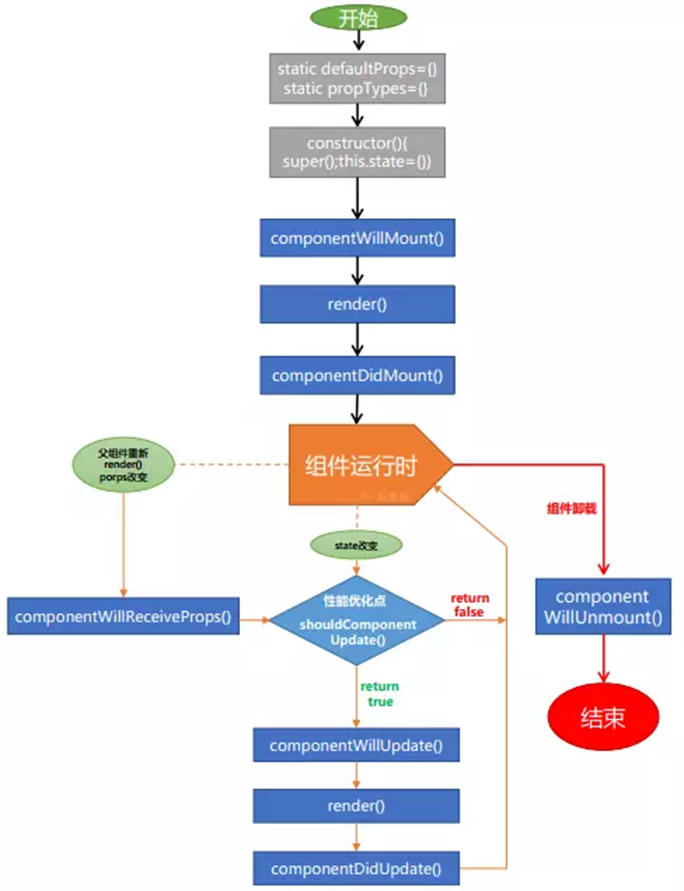

# React入门

React 是一个用于构建用户界面的 JAVASCRIPT 库。主要用于构建UI，很多人认为 React 是 MVC 中的 V（视图）。React 起源于 Facebook 的内部项目，用来架设 Instagram 的网站，并于 2013 年 5 月开源。React 拥有较高的性能，代码逻辑非常简单，越来越多的人已开始关注和使用它。

## 安装

- 如果你想学习React或者创建一个单页应用，请看创建React应用
- 如果你想用Node.js构建一个服务端网站，试试 Next.js
- 如果你想构建一个静态的内容网站，试试 Gatsby
- 如果你想构建一个组件库或者与现有代码库集成，请试试More Flexible Toolchains

### 创建React应用

```sh
# 环境：Node>=6，npm>=5.2
# 创建一个项目：
npx create-react-app my-app
cd my-app
npm start
# npx是一个npm 5.2以上版本自带的包运行工具
```

## 元素渲染

元素是构成 React 应用的最小单位，它用于描述屏幕上输出的内容。与浏览器的 DOM 元素不同，React 当中的元素事实上是普通的对象，React DOM 可以确保 浏览器 DOM 的数据内容与 React 元素保持一致。

首先我们在一个 HTML 页面中添加一个 id="example" 的 `<div>`：

```html
<div id="example"></div>
```

在此 div 中的所有内容都将由 React DOM 来管理，所以我们将其称为 "根" DOM 节点。

我们用 React 开发应用时一般只会定义一个根节点。但如果你是在一个已有的项目当中引入 React 的话，你可能会需要在不同的部分单独定义 React 根节点。

要将React元素渲染到根DOM节点中，我们通过把它们都传递给 `ReactDOM.render()` 的方法来将其渲染到页面上：

```js
const element = <h1>Hello, world!</h1>;
ReactDOM.render(
    element,
    document.getElementById('example')
);
```

<b style="color:red">React 元素都是不可变的。当元素被创建之后，你是无法改变其内容或属性的。</b>

目前更新界面的唯一办法是创建一个新的元素，然后将它传入 ReactDOM.render() 方法。React 只会更新必要的部分。值得注意的是 React DOM 首先会比较元素内容先后的不同，而在渲染过程中只会更新改变了的部分。

## JSX 简介

React 使用 JSX 来替代常规的 JavaScript。JSX 是一个看起来很像 XML 的 JavaScript 语法扩展。我们不需要一定使用 JSX，但它有以下优点：

- JSX 执行更快，因为它在编译为 JavaScript 代码后进行了优化。
- 它是类型安全的，在编译过程中就能发现错误。
- 使用 JSX 编写模板更加简单快速。

我们来观察一下声明的这个变量：

```jsx
const element = <h1>Hello, world!</h1>;
```

这种看起来可能有些奇怪的标签语法既不是字符串也不是 HTML。它被称为 JSX， 一种 JavaScript 的语法扩展。 我们推荐在 React 中使用 JSX 来描述用户界面。JSX 乍看起来可能比较像是模版语言，但事实上它完全是在 JavaScript 内部实现的。
  
>注意：由于 JSX 就是 JavaScript，一些标识符像 class 和 for 不建议作为 XML 属性名。作为替代，React DOM 使用 className 和 htmlFor 来做对应的属性。

我们书写 JSX 的时候一般都会带上换行和缩进，这样可以增强代码的可读性。与此同时，我们同样推荐在 JSX 代码的外面扩上一个小括号，这样可以防止分号自动插入的bug。

JSX 本身其实也是一种表达式，在编译之后呢，JSX 其实会被转化为普通的 JavaScript 对象。这也就意味着，你其实可以在 if 或者 for 语句里使用 JSX，将它赋值给变量，当作参数传入，作为返回值都可以。

**JSX 防注入攻击：**

你可以放心地在 JSX 当中使用用户输入：

```js
const title = response.potentiallyMaliciousInput;
// 直接使用是安全的：
const element = <h1>{title}</h1>;
```

React DOM 在渲染之前默认会 过滤 所有传入的值。它可以确保你的应用不会被注入攻击。所有的内容在渲染之前都被转换成了字符串。这样可以有效地防止 XSS(跨站脚本) 攻击。

**JSX 代表 Objects：**

Babel 转译器会把 JSX 转换成一个名为 React.createElement() 的方法调用。下面两种代码的作用是完全相同的：

```js
const element = (
  <h1 className="greeting">
    Hello, world!
  </h1>
);

const element = React.createElement(
  'h1',
  {className: 'greeting'},
  'Hello, world!'
);
```

React.createElement() 这个方法首先会进行一些避免bug的检查，之后会返回一个类似下面例子的对象：

```js
// 注意: 以下示例是简化过的（不代表在 React 源码中是这样）
const element = {
  type: 'h1',
  props: {
    className: 'greeting',
    children: 'Hello, world'
  }
};
```

这样的对象被称为 “React元素”。它代表所有你在屏幕上看到的东西。React 通过读取这些对象来构建 DOM 并保持数据内容一致。

## 组件 & Props

组件可以将UI切分成一些独立的、可复用的部件，这样你就只需专注于构建每一个单独的部件。组件从概念上看就像是函数，它可以接收任意的输入值（称之为"props"），并返回一个需要在页面上展示的React元素。

定义一个组件最简单的方式是使用JavaScript函数：

```js
function Welcome(props) {
  return <h1>Hello, {props.name}</h1>;
}
```

该函数是一个有效的React组件，它接收一个单一的"props"对象并返回了一个React元素。我们之所以称这种类型的组件为函数定义组件，是因为从字面上来看，它就是一个JavaScript函数。

你也可以使用 ES6 class 来定义一个组件：

```js
class Welcome extends React.Component {
  render() {
    return <h1>Hello, {this.props.name}</h1>;
  }
}
```

上面两个组件在React中是相同的。

### 组件渲染

在前面，我们遇到的React元素都只是DOM标签，然而，React元素也可以是用户自定义的组件。当React遇到的元素是用户自定义的组件，它会将JSX属性作为单个对象传递给该组件，这个对象称之为"props"。

例如，这段代码会在页面上渲染出"Hello, Sara"：

```js
function Welcome(props) {
  return <h1>Hello, {props.name}</h1>;
}
  
const element = <Welcome name="Sara" />;
ReactDOM.render(
  element,
  document.getElementById('root')
);
```

我们来回顾一下在这个例子中发生了什么：

1. 我们对`<Welcome name="Sara" />`元素调用了ReactDOM.render()方法。
2. React将 `{ name: 'Sara' }` 作为 props 传入并调用Welcome组件。
3. Welcome组件将`<h1>Hello, Sara</h1>`元素作为结果返回。
4. React DOM将DOM更新为`<h1>Hello, Sara</h1>`。

>警告：组件名称必须以大写字母开头。

### 组合组件

组件可以在它的输出中引用其它组件，这就可以让我们用同一组件来抽象出任意层次的细节。在React应用中，按钮、表单、对话框、整个屏幕的内容等，这些通常都被表示为组件。

例如，我们可以创建一个App组件，用来多次渲染Welcome组件：

```js
function Welcome(props) {
  return <h1>Hello, {props.name}</h1>;
}
  
function App() {
  return (
    <div>
      <Welcome name="Sara" />
      <Welcome name="Cahal" />
      <Welcome name="Edite" />
    </div>
  );
}
  
ReactDOM.render(
  <App />,
  document.getElementById('root')
);
```

通常，一个新的React应用程序的顶部是一个App组件。但是，如果要将React集成到现有应用程序中，则可以从下而上使用像Button这样的小组件作为开始，并逐渐运用到视图层的顶部。

>警告：组件的返回值只能有一个根元素。这也是我们要用一个`<div>`来包裹所有`<Welcome />`元素的原因。

### 提取组件

你可以将组件切分为更小的组件，这没什么好担心的。例如，来看看这个Comment组件：

```js
function Comment(props) {
  return (
    <div className="Comment">
      <div className="UserInfo">
        
        <div className="UserInfo-name">
          {props.author.name}
        </div>
      </div>
      <div className="Comment-text">
        {props.text}
      </div>
      <div className="Comment-date">
        {formatDate(props.date)}
      </div>
    </div>
  );
}
```

这个组件接收author（对象）、text（字符串）、以及date（Date对象）作为props，用来描述一个社交媒体网站上的评论。

这个组件由于嵌套，变得难以被修改，可复用的部分也难以被复用。所以让我们从这个组件中提取出一些小组件。

首先，我们来提取Avatar组件：

```js
function Avatar(props) {
  return (
    
  );
}
```

Avatar作为Comment的内部组件，不需要知道是否被渲染。因此我们将author改为一个更通用的名字user。

我们建议从组件自身的角度来命名props，而不是根据使用组件的上下文命名。现在我们可以对Comment组件做一些小小的调整：

```js
function Comment(props) {
  return (
    <div className="Comment">
      <div className="UserInfo">
        <Avatar user={props.author} />
        <div className="UserInfo-name">
          {props.author.name}
        </div>
      </div>
      <div className="Comment-text">
        {props.text}
      </div>
      <div className="Comment-date">
        {formatDate(props.date)}
      </div>
    </div>
  );
}
```

接下来，我们要提取一个UserInfo组件，用来渲染Avatar旁边的用户名：

```js
function UserInfo(props) {
  return (
    <div className="UserInfo">
      <Avatar user={props.user} />
      <div className="UserInfo-name">
        {props.user.name}
      </div>
    </div>
  );
}
```

这可以让我们进一步简化Comment组件：

```js
function Comment(props) {
  return (
    <div className="Comment">
      <UserInfo user={props.author} />
      <div className="Comment-text">
        {props.text}
      </div>
      <div className="Comment-date">
        {formatDate(props.date)}
      </div>
    </div>
  );
}
```

提取组件一开始看起来像是一项单调乏味的工作，但是在大型应用中，构建可复用的组件完全是值得的。当你的UI中有一部分重复使用了好几次（比如，Button、Panel、Avatar），或者其自身就足够复杂（比如，App、FeedStory、Comment），类似这些都是抽象成一个可复用组件的绝佳选择，这也是一个比较好的做法。

无论是使用函数或是类来声明一个组件，它决不能修改它自己的props。来看这个sum函数：

```js
function sum(a, b) {
  return a + b;
}
```

类似于上面的这种函数称为“纯函数”，它没有改变它自己的输入值，当传入的值相同时，总是会返回相同的结果。

与之相对的是非纯函数，它会改变它自身的输入值：

```js
function withdraw(account, amount) {
  account.total -= amount;
}
```

React是非常灵活的，但它也有一个严格的规则；所有的React组件必须像纯函数那样使用它们的props。

当然，应用的界面是随时间动态变化的，我们将在下面介绍一种称为"state"的新概念，State可以在不违反上述规则的情况下，根据用户操作、网络响应、或者其他状态变化，使组件动态的响应并改变组件的输出。

## State & 生命周期



到目前为止我们只学习了一种方法来更新UI。我们调用 ReactDOM.render() 方法来改变输出：

```js
function tick() {
  const element = (
    <div>
      <h1>Hello, world!</h1>
      <h2>It is {new Date().toLocaleTimeString()}.</h2>
    </div>
  );
  ReactDOM.render(
    element,
    document.getElementById('root')
  );
}  
setInterval(tick, 1000);
```

接下来，我们将学习如何使Clock组件真正可重用和封装。它将设置自己的计时器，并每秒钟更新一次。我们可以从封装时钟开始：

```js
function Clock(props) {
  return (
    <div>
      <h1>Hello, world!</h1>
      <h2>It is {props.date.toLocaleTimeString()}.</h2>
    </div>
  );
}
  
function tick() {
  ReactDOM.render(
    <Clock date={new Date()} />,
    document.getElementById('root')
  );
}
  
setInterval(tick, 1000);
```

然而，它错过了一个关键的要求：Clock设置一个定时器并且每秒更新UI应该是Clock的实现细节。理想情况下，我们写一次 Clock 然后它能更新自身：

```js
ReactDOM.render(
  <Clock />,
  document.getElementById('root')
);
```

为了实现这个需求，我们需要为Clock组件添加状态。状态与属性十分相似，但是状态是私有的，完全受控于当前组件。我们之前提到过，定义为类的组件有一些特性。局部状态就是如此：一个功能只适用于类。

将函数转换为类，你可以通过5个步骤将函数组件 Clock 转换为类

1. 创建一个名称扩展为 React.Component 的ES6 类
2. 创建一个叫做render()的空方法
3. 将函数体移动到 render() 方法中
4. 在 render() 方法中，使用 this.props 替换 props
5. 删除剩余的空函数声明

```jsx
class Clock extends React.Component {
  render() {
    return (
      <div>
        <h1>Hello, world!</h1>
        <h2>It is {this.props.date.toLocaleTimeString()}.</h2>
      </div>
    );
  }
}
```

Clock 现在被定义为一个类而不只是一个函数，使用类就允许我们使用其它特性，例如局部状态、生命周期钩子。

## 参考

- [官网](https://www.reactjscn.com/)
- [路由](https://reacttraining.com/react-router/web/guides/quick-start)
- [Create React App](https://github.com/facebook/create-react-app#create-react-app)
- [Fabric](https://github.com/OfficeDev/office-ui-fabric-react#using-fabric-react)：一款用于构建类似Office和Office 365风格的React组件库。
- [Grommet](https://v2.grommet.io/)：一款针对企业应用开发的最高端的UX框架库。
- [React-toolbox](https://github.com/react-toolbox/react-toolbox/)：你是否听说过CSS Modules？React-Toolbox就是基于这个的。它允许你只需要引入CSS，而不需要使用像Purify-CSS这样的工具。另外React-toolbox还是包括了30多个开箱即用组件的高质量可自定义的库。
- [react-bootstrap](https://github.com/react-bootstrap/react-bootstrap)：React-Bootstrap是一款基于ReactJS对Bootstrap进行封装的库
- [blueprint](https://github.com/palantir/blueprint)：一款针对桌面应用程序构建复杂、数据密集的Web界面进行了优化的UI组件库
- [Ant-design](https://github.com/ant-design/ant-design)：阿里巴巴团队出品的ReactUI组件库
- [Semantic-UI-React](https://github.com/Semantic-Org/Semantic-UI-React)：个人认为最优秀的ReactUI框架
- [React-Desktop](http://reactdesktop.js.org/)：一款面向MacOS Sierra和Windows10桌面风格的ReactUI组件库。
- [Material-UI](https://github.com/callemall/material-ui)：一款React组件库来实现Google的Material Design风格UI界面框架。也是首个React的UI工具集之一。
