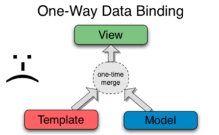
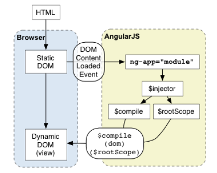
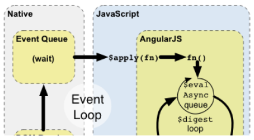
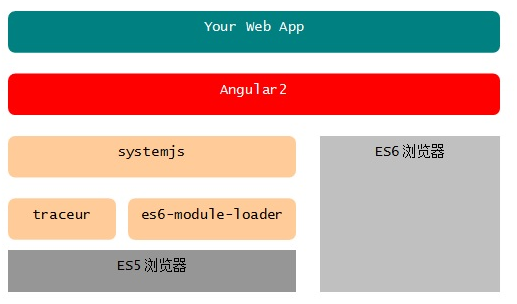
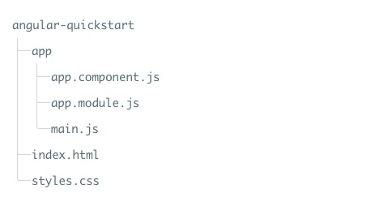
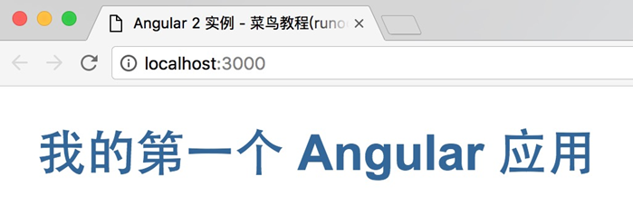
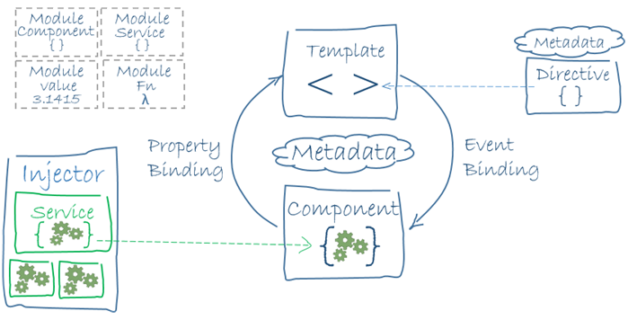
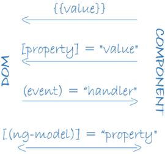
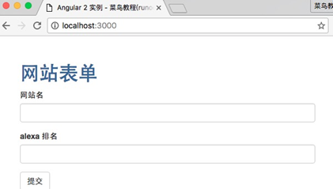
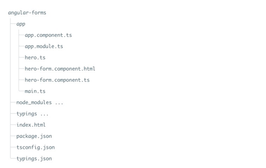

# Angular开发2

## 附加模块 ngResource

### 使用引入与整体概念

ngResource 这个是 ng 官方提供的一个附加模块。附加的意思就是，如果你打算用它，那么你需要引入一个单独的 js 文件，然后在声明“根模块”时注明依赖的 ngResource 模块，接着就可以使用它提供的 $resource 服务了。完整的过程形如：

```html
<!DOCTYPE html>
<html ng-app="Demo">
<head>
<meta charset="utf-8" />
<title>AngularJS</title>
<script type="text/javascript"
src="http://ajax.googleapis.com/ajax/libs/angularjs/1.0.3/angular.min.js">
</script>
<script type="text/javascript"
   src="http://ajax.googleapis.com/ajax/libs/angularjs/1.0.3/angular-resource.js">
</script>
</head>
<body>
  <div ng-controller="TestCtrl"></div>
<script type="text/javascript" charset="utf-8">
var app = angular.module('Demo', ['ngResource'], angular.noop);
app.controller('TestCtrl', function($scope, $resource){
      console.log($resource);
});
</script>
</body>
</html>
```

$resource 服务，整体上来说，比较像是使用类似 ORM 的方式来包装了 AJAX 调用。区别就是 ORM 是操作数据库，即拼出 SQL 语句之后，作 execute 方法调用。而 $resource 的方式是构造出 AJAX 请求，然后发出请求。同时，AJAX 请求是需要回调处理的，这方面， $resource 的机制可以使你在一些时候省掉回调处理，当然，是否作回调处理在于业务情形及容错需求了。

使用上 $resource 分成了“类”与“实例”这两个层面。一般地，类的方法调用就是直观的调用形式，通常会返回一个对象，这个对象即为“实例”。

“实例”贯穿整个服务的使用过程。“实例”的数据是填充方式，即因为异步关系，回调函数没有执行时，实例已经存在，只是可能它还没有相关数据，回调执行之后，相关数据被填充到实例对象当中。实例的方法一般就是在类方法名前加一个 $ ，调用上，根据定义，实例数据可能会做一些自动的参数填充，这点是区别实例与类的调用上的不同。

好吧，上面这些话可能需要在看了接下来的内容之后再回过来理解。

### 基本定义

就像使用 ORM 一般要先定义 Model 一样，使用 $resource 需要先定义“资源”，也就是先定义一些 HTTP 请求。

在业务场景上，我们假设为，我们需要操作“书”这个实体，包括创建create，获取详情read，修改update，删除delete，批量获取multi，共五个操作方法。实体属性有：唯一标识id，标题title，作者author。

我们把这些操作定义成 $resource 的资源：

```js
var app = angular.module('Demo', ['ngResource'], angular.noop);
app.controller('BookCtrl', function($scope, $resource){
  var actions = {
    create: {method: 'POST', params: {_method: 'create'}},
    read: {method: 'POST', params: {_method: 'read'}},
    update: {method: 'POST', params: {_method: 'update'}},
    delete: {method: 'POST', params: {_method: 'delete'}},
    multi: {method: 'POST', params: {_method: 'multi'}}
  }
  var Book = $resource('/book', {}, actions);
});
```

定义是使用使用 $resource 这个函数就可以了，它接受三个参数：

- url
- 默认的params（这里的 params 即是 GET 请求的参数，POST 的参数单独叫做"postData"）
- 方法映射

  方法映射是以方法名为 key ，以一个对象为 value ，这个 value 可以有三个成员：

  - method, 请求方法，'GET', 'POST', 'PUT', 'DELETE' 这些
  - params, 默认的 GET 参数
  - isArray, 返回的数据是不是一个列表

### 基本使用

在定义了资源之后，我们看如果使用这些资源，发出请求：

```js
var book = Book.read({id: '123'}, function(response){
  console.log(response);
});
```

这里我们进行 Book 的“类”方法调用。在方法的使用上，根据官方文档：

```md
HTTP GET "class" actions: Resource.action([parameters], [success], [error])
non-GET "class" actions: Resource.action([parameters], postData, [success], [error])
non-GET instance actions: instance.$action([parameters], [success], [error])
```

我们这里是第二种形式，即类方法的非 GET 请求。我们给的参数会作为 postData 传递。如果我们需要 GET 参数，并且还需要一个错误回调，那么：

```js
var book = Book.read({get: 'haha'}, {id: '123'},
  function(response){
    console.log(response);
  },
  function(error){
    console.log(error);
  }
);
```

调用之后，我们会立即得到的 book，它是 Book 类的一个实例。这里所谓的实例，实际上就是先把所有的 action 加一个 $ 前缀放到一个空对象里，然后把发出的参数填充进去。等请求返回了，把除 action 以外的成员删除掉，再把请求返回的数据填充到这个对象当中。所以，如果我们这样：

```js
var book = Book.read({id: '123'}, function(response){
  console.log(book);
});
console.log(book)
```

就能看到 book 实例的变化过程了。

现在我们得到一个真实的实例，看一下实例的调用过程：

```js
//响应的数据是 {result: 0, msg: '', obj: {id: 'xxx'}}
var book = Book.create({title: '测试标题', author: '测试作者'}, function(response){
  console.log(book);
});
```

可以看到，在请求回调之后， book 这个实例的成员已经被响应内容填充了。但是这里有一个问题，我们返回的数据，并不适合一个 book 实例。格式先不说，它把 title 和 author 这些信息都丢了（因为响应只返回了 id ）。

如果仅仅是格式问题，我们可以通过配置 $http 服务来解决（ AJAX 请求都要使用 $http 服务的）：

```js
$http.defaults.transformResponse = function(data){return angular.fromJson(data).obj};
```

当然，我们也可以自己来解决一下丢信息的问题：

```js
var p = {title: '测试标题', author: '测试作者'};
var book = Book.create(p, function(response){
  angular.extend(book, p);
  console.log(book);
});
```

不过，始终会有一些不方便了。比较正统的方式应该是调节服务器端的响应，让服务器端也具有和前端一样的实例概念，返回的是完整的实例信息。即使这样，你也还要考虑格式的事。

现在我们得到了一个真实的 book 实例了，带有 id 信息。我们尝试一下实例的方法调用，先回过去头看一下那三种调用形式，对于实例只有第三种形式：

```js
non-GET instance actions: instance.$action([parameters], [success], [error])
```

首先解决一个疑问，如果一个实例是进行一个 GET 的调用会怎么样？没有任何问题，这当然没有任何问题的，形式和上面一样。

如何实例是做 POST 请求的话，从形式上看，我们无法控制请求的 postData ？是的，所有的 POST 请求，其 postData 都会被实例数据自动填充，形式上我们只能控制 params 。

所以，如果是在做修改调用的话：

```js
book.$update({title: '新标题', author: '测试作者'}, function(response){
  console.log(book);
});
```

这样是没有意义的并且错误的。因为要修改的数据只是作为 GET 参数传递了，而 postData 传递的数据就是当前实例的数据，并没有任何修改。

正确的做法：

```js
book.title = '新标题'
book.$update(function(response){
  console.log(book);
});
```

显然，这种情况下，回调都可以省了：

```js
book.title = '新标题'
book.$update();
```

### 定义和使用时的占位量

两方面。一是在定义时，在其 URL 中可以使用变量引用的形式（类型于定义锚点路由时那样）。第二时定义默认 params ，即 GET 参数时，可以定义为引用 postData 中的某变量。比如我们这样改一下：

```js
var Book = $resource('/book/:id', {}, actions);
var book = Book.read({id: '123'}, {}, function(response){
  console.log(response);
});
```

在 URL 中有一个 :id ，表示对 params 中 id 这个变量的引用。因为 read 是一个 POST 请求，根据调用形式，第一个参数是 params ，第二个参数是 postData 。这样的调用结果就是，我们会发一个 POST 请求到如下地址， postData 为空：

```sh
/book/123?_method=read
```

再看默认的 params 中引用 postData 变量的形式：

```js
var Book = $resource('/book', {id: '@id'}, actions);
var book = Book.read({title: 'xx'}, {id: '123'}, function(response){
  console.log(response);
});
```

这样会出一个 POST 请求， postData 内容中有一个 id 数据，访问的 URL 是：

```sh
/book?_method=read&id=123&title=xx
```

这两个机制也可以联合使用：

```js
var Book = $resource('/book/:id', {id: '@id'}, actions);
var book = Book.read({title: 'xx'}, {id: '123'}, function(response){
  console.log(response);
});
```

结果就是出一个 POST 请求， postData 内容中有一个 id 数据，访问的 URL 是：

```sh
/book/123?_method=read&title=xx
```

### 实例

ngResource 要举一个实例是比较麻烦的事。因为它必须要一个后端来支持，这里如果我用 Python 写一个简单的后端，估计要让这个后端跑起来对很多人来说都是问题。所以，我在几套公共服务的 API 中纠结考察了一番，最后使用 www.rememberthemilk.com 的 API 来做了一个简单的，可用的例子。

例子见： http://zouyesheng.com/demo/ng-resource-demo.html (可以直接下载看源码)

先说一下 API 的情况。这里的请求调用全是跨域的，所以交互上全部是使用了 JSONP 的形式。 API 的使用有使用签名认证机制，嗯， js 中直接算 md5 是可行的，我用了一个现成的库（但是好像不能处理中文吧）。

这个例子中的 LoginCtrl 大家就不用太关心了，参见官方的文档，走完流程拿到 token 完事。与 ngResource 相关的是 MainCtrl 中的东西。

其实从这个例子中就可以看出，目前 ngResource 的机制对于服务端返回的数据的格式是严重依赖的，同时也可以反映出 $http 对一些场景根本无法应对的局限。所以，我现在的想法是理解 ngResource 的思想，真正需要的人自己使用 jQuery 重新实现一遍也许更好。这应该也花不了多少时间， ngResource 的代码本来不多。

我为什么说 $http 在一些场景中有局限呢。在这个例子当中，所有的请求都需要带一个签名，签名值是由请求中带的参数根据规则使用 md5 方法计算出的值。我找不到一个 hook 可以让我在请求出去之前修改这个请求（添加上签名）。所以在这个例子当中，我的做法是根据 ngResource 的请求最后会使用 $httpBackend 这个底层服务，在 module 定义时我自己复制官方的相关代码，重新定义 $httpBackend 服务，在需要的地方做我自己的修改：

```js
script.src = sign_url(url);
```

不错，我就改了这一句，但我不得不复制了 50 行官方源码到我的例子中。

另外一个需要说的是对返回数据的处理。因为 ngResource 会使用返回的数据直接填充实例，所以这个数据格式就很重要。

首先，我们可以使用 $http.defaults.transformResponse 来统一处理一下返回的数据，但是这并不能解决所有问题，可目前 ngResource 并不提供对每一个 action 的单独的后处理回调函数项。除非你的服务端是经过专门的适应性设计的，否则你用 ngResource 不可能爽。例子中，我为了获取当前列表的结果，我不得不自己去封装结果：

```js
var list_list = List.getList(function(){
  var res = list_list[1];
  while(list_list.length > 0){list_list.pop()};
  angular.forEach(res.list, function(v){
    list_list.push(new List({list: v}));
  });
  $scope.list_list = list_list;
  $scope.show_add = true;
  return;
});
```

## AngularJS与其它框架的混用(jQuery, Dojo)

这个问题似乎很多人都关心，但是事实是，如果了解了 ng 的工作方式，这本来就不是一个问题了。

在我自己使用 ng 的过程当中，一直是混用 jQuery 的，以前还要加上一个 Dojo 。只要了解每种框架的工作方式，在具体的代码中每个框架都做了什么事，那么整体上控制起来就不会有问题。

回到 ng 上来看，首先对于 jQuery 来说，最开始说提到过，在 DOM 操作部分， ng 与 jQuery 是兼容的，如果没有 jQuery ， ng 自己也实现了兼容的部分 API。

同时，最开始也提到过， ng 的使用最忌讳的一点就是修改 DOM 结构——你应该使用 ng 的模板机制进行数据绑定，以此来控制 DOM 结构，而不是直接操作。换句话来说，在不动 DOM 结构的这个前提之下，你的数据随便怎么改，随便使用哪个框架来控制都是没问题的，到时如有必要使用$scope.$digest() 来通知 ng 一下即可。

下面这个例子，我们使用了 jQuery 中的 Deferred ( $.ajax 就是返回一个 Deferred )，还使用了 ng 的 $timeout ，当然是在 ng 的结构之下：

```html
<!DOCTYPE html>
<html ng-app="Demo">
<head>
<meta charset="utf-8" />
<title>AngularJS</title>
</head>
<body>

<div ng-controller="TestCtrl">
  <span ng-click="go()">{{ a }}</span>
</div>

<script type="text/javascript"
  src="http://ajax.googleapis.com/ajax/libs/jquery/1.9.1/jquery.min.js">
</script>
<script type="text/javascript"
  src="http://ajax.googleapis.com/ajax/libs/angularjs/1.0.3/angular.min.js">
</script>

<script type="text/javascript">
var app = angular.module('Demo', [], angular.noop);
app.controller('TestCtrl', function($scope, $timeout){
  $scope.a = '点击我开始';

  var defer = $.Deferred();
  var f = function(){
    if($scope.a == ''){$scope.a = '已停止'; return}
    defer.done(function(){
      $scope.a.length < 10 ? $scope.a += '>' : $scope.a = '>';
      $timeout(f, 100);
    });
  }
  defer.done(function(){$scope.a = '>'; f()});

  $scope.go = function(){
    defer.resolve();
    $timeout(function(){$scope.a = ''}, 5000);
  }
});
</script>
</body>
</html>
```

再把 Dojo 加进来看与 DOM 结构相关的例子。之前说过，使用 ng 就最好不要手动修改 DOM 结构，但这里说两点：

- 对于整个页面，你可以只在局部使用 ng ，不使用 ng 的地方你可以随意控制 DOM。
- 如果 DOM 结构有变动，你可以在 DOM 结构定下来之后再初始化 ng。

下面这个例子使用了 AngularJS，jQuery，Dojo ：

```html
<!DOCTYPE html>
<html>
<head>
<meta charset="utf-8" />
<title>AngularJS</title>
<link rel="stylesheet"
  href="http://ajax.googleapis.com/ajax/libs/dojo/1.9.1/dijit/themes/claro/claro.css" media="screen" />
</head>
<body class="claro">

<div ng-controller="TestCtrl" id="test_ctrl">

  <p ng-show="!btn_disable">
    <button ng-click="change()">调用dojo修改按钮</button>
  </p>

  <p id="btn_wrapper">
    <button data-dojo-type="dijit/form/Button" type="button">{{ a }}</button>
  </p>

  <p>
    <input ng-model="dialog_text" ng-init="dialog_text='对话框内容'" />
    <button ng-click="dialog(dialog_text)">显示对话框</button>
  </p>

  <p ng-show="show_edit_text" style="display: none;">
    <span>需要编辑的内容:</span>
    <input ng-model="text" />
  </p>

  <div id="editor_wrapper">
    <div data-dojo-type="dijit/Editor" id="editor"></div>
  </div>

</div>


<script type="text/javascript"
  src="http://ajax.googleapis.com/ajax/libs/dojo/1.9.1/dojo/dojo.js">
</script>
<script type="text/javascript"
  src="http://ajax.googleapis.com/ajax/libs/jquery/1.9.1/jquery.min.js">
</script>
<script type="text/javascript"
  src="http://ajax.googleapis.com/ajax/libs/angularjs/1.0.3/angular.min.js">
</script>

<script type="text/javascript">

require(['dojo/parser', 'dijit/Editor'], function(parser){
  parser.parse($('#editor_wrapper')[0]).then(function(){
    var app = angular.module('Demo', [], angular.noop);

    app.controller('TestCtrl', function($scope, $timeout){
      $scope.a = '我是ng, 也是dojo';
      $scope.show_edit_text = true;

      $scope.change = function(){
        $scope.a = 'DOM结构已经改变(不建议这样做)';
        require(['dojo/parser', 'dijit/form/Button', 'dojo/domReady!'],
          function(parser){
            parser.parse($('#btn_wrapper')[0]);
            $scope.btn_disable = true;
          }
        );
      }

      $scope.dialog = function(text){
        require(["dijit/Dialog", "dojo/domReady!"], function(Dialog){
          var dialog = new Dialog({
              title: "对话框哦",
              content: text,
              style: "width: 300px"
          });
          dialog.show();
        });
      }

      require(['dijit/registry'], function(registry){
        var editor = registry.byId('editor');
        $scope.$watch('text', function(new_v){
          editor.setValue(new_v);
        });
      });

    });

    angular.bootstrap(document, ['Demo']);
  });

});

</script>
</body>
</html>
```

## 自定义过滤器

先来回顾一下 ng 中的一些概念：

- module ，代码的组织单元，其它东西都是在定义在具体的模块中的。
- app ，业务概念，可能会用到多个模块。
- service ，仅在数据层面实现特定业务功能的代码封装。
- controller ，与 DOM 结构相关联的东西，即是一种业务封装概念，又体现了项目组织的层级结构。
- filter ，改变输入数据的一种机制。
- directive ，与 DOM 结构相关联的，特定功能的封装形式。

上面的这几个概念基本上就是 ng 的全部。每一部分都可以自由定义，使用时通过各要素的相互配合来实现我们的业务需求。 
我们从最开始一致打交道的东西基本上都是 controller 层面的东西。在前面，也介绍了 module 和 service 的自定义。剩下的会介绍 filter 和 directive 的定义。基本上这几部分的定义形式都是一样的，原理上是通过 provider 来做注入形式的声明，在实际操作过程中，又有很多 shortcut 式的声明方式。 
过滤器的自定义是最简单的，就是一个函数，接受输入，然后返回结果。在考虑过滤器时，我觉得很重要的一点： 无状态 。 
具体来说，过滤器就是一个函数，函数的本质含义就是确定的输入一定得到确定的输出。虽然 filter 是定义在 module 当中的，而且 filter 又是在 controller 的 DOM 范围内使用的，但是，它和具体的 module ， controller ， scope 这些概念都没有关系（虽然在这里你可以使用 js 的闭包机制玩些花样），它仅仅是一个函数，而已。换句话说，它没有任何上下文关联的能力。 
过滤器基本的定义方式： 
var app = angular.module('Demo', [], angular.noop);
app.filter('map', function(){
  var filter = function(input){
    return input + '...';
  };
  return filter;
});
上面的代码定义了一个叫做 map 的过滤器。使用时： 
<p>示例数据: {{ a|map }}</p>
过滤器也可以带参数，多个参数之间使用 : 分割，看一个完整的例子： 
<div ng-controller="TestCtrl">
<p>示例数据: {{ a|map:map_value:'>>':'(no)' }}</p>
<p>示例数据: {{ b|map:map_value:'>>':'(no)' }}</p>
</div>
<script type="text/javascript">
var app = angular.module('Demo', [], angular.noop);
app.controller('TestCtrl', function($scope){
  $scope.map_value = {
    a: '一',
    b: '二',
    c: '三'
  }
  $scope.a = 'a';
});

app.filter('map', function(){
  var filter = function(input, map_value, append, default_value){
    var r = map_value[input];
    if(r === undefined){ return default_value + append }
    else { return r + append }
  };
  return filter;
});

angular.bootstrap(document, ['Demo']);
</script>
17、自定义指令directive
这是 ng 最强大的一部分，也是最复杂最让人头疼的部分。 
目前我们看到的所谓“模板”系统，只不过是官方实现的几个指令而已。这意味着，通过自定义各种指令，我们不但可以完全定义一套“模板”系统，更可以把 HTML 页面直接打造成为一种 DSL（领域特定语言）。 
17.1 指令的使用
使用指令时，它的名字可以有多种形式，把指令放在什么地方也有多种选择。 
通常，指令的定义名是形如 ngBind 这样的 "camel cased" 形式。在使用时，它的引用名可以是： 
	ng:bind 
	ng_bind 
	ng-bind 
	x-ng-bind 
	data-ng-bind 
你可以根据你自己是否有 "HTML validator" 洁癖来选择。 
指令可以放在多个地方，它们的作用相同： 
	<span my-dir="exp"></span> 作为标签的属性 
	<span class="my-dir: exp;"></span> 作为标签类属性的值 
	<my-dir></my-dir> 作为标签 
	<!-- directive: my-dir exp --> 作为注释 
这些方式可以使用指令定义中的 restrict 属性来控制。 
可以看出，指令即可以作为标签使用，也可以作为属性使用。仔细考虑一下，这在类 XML 的结构当中真算得上是一种神奇的机制。 
17.2 指令的执行过程
ng 中对指令的解析与执行过程是这样的： 
	浏览器得到 HTML 字符串内容，解析得到 DOM 结构。 
	ng 引入，把 DOM 结构扔给 $compile 函数处理： 
	找出 DOM 结构中有变量占位符 
	匹配找出 DOM 中包含的所有指令引用 
	把指令关联到 DOM 
	关联到 DOM 的多个指令按权重排列 
	执行指令中的 compile 函数（改变 DOM 结构，返回 link 函数） 
	得到的所有 link 函数组成一个列表作为 $compile 函数的返回 
	执行 link 函数（连接模板的 scope）。 
17.3 基本的自定义方法
自定义一个指令可以非常非常的复杂，但是其基本的调用形式，同自定义服务大概是相同的： 
<p show style="font-size: 12px;"></p>
<script type="text/javascript">
var app = angular.module('Demo', [], angular.noop);
app.directive('show', function(){
  var func = function($scope, $element, $attrs){
    console.log($scope);
    console.log($element);
    console.log($attrs);
  }    
  return func;
  //return {compile: function(){return func}}
});
angular.bootstrap(document, ['Demo']);
</script>
如果在 directive 中直接返回一个函数，则这个函数会作为 compile 的返回值，也即是作为 link 函数使用。这里说的 compile 和 link 都是一个指令的组成部分，一个完整的定义应该返回一个对象，这个对象包括了多个属性： 
	name 
	priority 
	terminal 
	scope 
	controller 
	require 
	restrict 
	template 
	templateUrl 
	replace 
	transclude 
	compile 
	link 
上面的每一个属性，都可以单独探讨的。 
下面是一个完整的基本的指令定义例子： 
<code lines>
//失去焦点使用 jQuery 的扩展支持冒泡
app.directive('ngBlur', function($parse){
  return function($scope, $element, $attr){
    var fn = $parse($attr['ngBlur']);
    $element.on('focusout', function(event){
      fn($scope, {$event: event});
    });
  }
});
</code>

<div code lines>
//失去焦点使用 jQuery 的扩展支持冒泡
app.directive('ngBlur', function($parse){
  return function($scope, $element, $attr){
    var fn = $parse($attr['ngBlur']);
    $element.on('focusout', function(event){
      fn($scope, {$event: event});
    });
  }
});
</div>
var app = angular.module('Demo', [], angular.noop);

app.directive('code', function(){
  var func = function($scope, $element, $attrs){

    var html = $element.text();
    var lines = html.split('\n');

    //处理首尾空白
    if(lines[0] == ''){lines = lines.slice(1, lines.length - 1)}
    if(lines[lines.length-1] == ''){lines = lines.slice(0, lines.length - 1)}

    $element.empty();

    //处理外框
    (function(){
      $element.css('clear', 'both');
      $element.css('display', 'block');
      $element.css('line-height', '20px');
      $element.css('height', '200px');
    })();

    //是否显示行号的选项
    if('lines' in $attrs){
      //处理行号
      (function(){
        var div = $('<div style="width: %spx; background-color: gray;' +
                    'float: left; text-align: right; padding-right: 5px;' +
                    'margin-right: 10px;"></div>'
                    .replace('%s', String(lines.length).length * 10));
        var s = '';
        angular.forEach(lines, function(_, i){
          s += '<pre style="margin: 0;">%s</pre>\n'.replace('%s', i + 1);
        });
        div.html(s);
        $element.append(div);
      })();
    }

    //处理内容
    (function(){
      var div = $('<div style="float: left;"></div>');
      var s = '';
      angular.forEach(lines, function(l){
        s += '<span style="margin: 0;">%s</span><br />\n'
             .replace('%s', l.replace(/\s/g, '<span>&nbsp;</span>'));
      });
      div.html(s);
      $element.append(div);
    })();
  }

  return {link: func,
          restrict: 'AE'}; //以元素或属性的形式使用命令
});

angular.bootstrap(document, ['Demo']);
上面这个自定义的指令，做的事情就是解析节点中的文本内容，然后修改它，再把生成的新内容填充到节点当中去。其间还涉及了节点属性值 lines 的处理。这算是指令中最简单的一种形式。因为它是“一次性使用”，中间没有变量的处理。比如如果节点原来的文本内容是一个变量引用，类似于 {{ code }} ，那上面的代码就不行了。这种情况麻烦得多。后面会讨论。 
17.4 属性值类型的自定义
官方代码中的 ng-show 等算是我说的这种类型。使用时主要是在节点加添加一个属性值以附加额外的功能。看一个简单的例子： 
<p color="red">有颜色的文本</p>
<color color="red">有颜色的文本</color>

<script type="text/javascript">

var app = angular.module('Demo', [], angular.noop);

app.directive('color', function(){
  var link = function($scope, $element, $attrs){
    $element.css('color', $attrs.color);
  }
  return {link: link,
          restrict: 'AE'};
});

angular.bootstrap(document, ['Demo']);
</script>
我们定义了一个叫 color 的指令，可以指定节点文本的颜色。但是这个例子还无法像 ng-show 那样工作的，这个例子只能渲染一次，然后就无法根据变量来重新改变显示了。要响应变化，我们需要手工使用 scope 的 $watch 来处理： 
<div ng-controller="TestCtrl">
  <p color="color">有颜色的文本</p>
  <p color="'blue'">有颜色的文本</p>
</div>

<script type="text/javascript">

var app = angular.module('Demo', [], angular.noop);

app.directive('color', function(){
  var link = function($scope, $element, $attrs){
    $scope.$watch($attrs.color, function(new_v){
      $element.css('color', new_v);
    });
  }
  return link;
});

app.controller('TestCtrl', function($scope){
  $scope.color = 'red';
});

angular.bootstrap(document, ['Demo']);
</script>
17.6 Compile的细节
指令的处理过程，是 ng 的 Compile 过程的一部分，它们也是紧密联系的。继续深入指令的定义方法，首先就要对 Compile 的过程做更细致的了解。 
前面说过， ng 对页面的处理过程： 
	浏览器把 HTML 字符串解析成 DOM 结构。 
	ng 把 DOM 结构给 $compile ，返回一个 link 函数。 
	传入具体的 scope 调用这个 link 函数。 
	得到处理后的 DOM ，这个 DOM 处理了指令，连接了数据。 
$compile 最基本的使用方式： 
var link = $compile('<p>{{ text }}</p>');
var node = link($scope);
console.log(node);
上面的 $compile 和 link 调用时都有额外参数来实现其它功能。先看 link 函数，它形如： 
function(scope[, cloneAttachFn]
第二个参数 cloneAttachFn 的作用是，表明是否复制原始节点，及对复制节点需要做的处理，下面这个例子说明了它的作用： 
<div ng-controller="TestCtrl"></div>
<div id="a">A {{ text }}</div>
<div id="b">B </div>
app.controller('TestCtrl', function($scope, $compile){
  var link = $compile($('#a'));

  //true参数表示新建一个完全隔离的scope,而不是继承的child scope
  var scope = $scope.$new(true);
  scope.text = '12345';

  //var node = link(scope, function(){});
  var node = link(scope);

  $('#b').append(node);
});
cloneAttachFn 对节点的处理是有限制的，你可以添加 class ，但是不能做与数据绑定有关的其它修改（修改了也无效）： 
app.controller('TestCtrl', function($scope, $compile){
  var link = $compile($('#a'));
  var scope = $scope.$new(true);
  scope.text = '12345';

  var node = link(scope, function(clone_element, scope){
    clone_element.text(clone_element.text() + ' ...'); //无效
    clone_element.text('{{ text2 }}'); //无效
    clone_element.addClass('new_class');
  });

  $('#b').append(node);
});
修改无效的原因是，像 {{ text }} 这种所谓的 Interpolate 在 $compile 中已经被处理过了，生成了相关函数（这里起作用的是 directive 中的一个 postLink 函数），后面执行 link 就是执行了 $compile 生成的这些函数。当然，如果你的文本没有数据变量的引用，那修改是会有效果的。 
前面在说自定义指令时说过， link 函数是由 compile 函数返回的，也就像前面说的，应该把改变 DOM 结构的逻辑放在 compile 函数中做。 
$compile 还有两个额外的参数： 
$compile(element, transclude, maxPriority);
maxPriority 是指令的权重限制，这个容易理解，后面再说。 
transclude 是一个函数，这个函数会传递给 compile 期间找到的 directive 的 compile 函数（编译节点的过程中找到了指令，指令的 compile 函数会接受编译时传递的 transclude 函数作为其参数）。 
但是在实际使用中，除我们手工在调用 $compile 之外，初始化时的根节点 compile 是不会传递这个参数的。 
在我们定义指令时，它的 compile 函数是这个样子的： 
function compile(tElement, tAttrs, transclude) { ... }
事实上， transclude 的值，就是 directive 所在的 原始 节点，把原始节点重新做了编译之后得到的 link 函数（需要 directive 定义时使用 transclude 选项），后面会专门演示这个过程。所以，官方文档上也把 transclude 函数描述成 link 函数的样子（如果自定义的指令只用在自己手动 $compile 的环境中，那这个函数的形式是可以随意的）： 
{function(angular.Scope[, cloneAttachFn]}
所以记住，定义指令时， compile 函数的第三个参数 transclude ，就是一个 link ，装入 scope 执行它你就得到了一个节点。 
17.6 transclude的细节
transclude 有两方面的东西，一个是使用 $compile 时传入的函数，另一个是定义指令的 compile 函数时接受的一个参数。虽然这里的一出一进本来是相互对应的，但是实际使用中，因为大部分时候不会手动调用 $compile ，所以，在“默认”情况下，指令接受的 transclude 又会是一个比较特殊的函数。 
看一个基本的例子： 
var app = angular.module('Demo', [], angular.noop);

app.directive('more', function(){
  var func = function(element, attrs, transclude){
    var sum = transclude(1, 2);
    console.log(sum);
    console.log(element);  
  }

  return {compile: func,
          restrict: 'E'};
});

app.controller('TestCtrl', function($scope, $compile, $element){
  var s = '<more>123</more>';
  var link = $compile(s, function(a, b){return a + b});
  var node = link($scope);
  $element.append(node);
});

angular.bootstrap(document, ['Demo']);
我们定义了一个 more 指令，它的 compile 函数的第三个参数，就是我们手工 $compile 时传入的。 
如果不是手工 $compile ，而是 ng 初始化时找出的指令，则 transclude 是一个 link 函数（指令定义需要设置 transclude 选项）： 
<div more>123</div>
app.directive('more', function($rootScope, $document){
  var func = function(element, attrs, link){
    var node = link($rootScope);
    node.removeAttr('more'); //不去掉就变死循环了
    $('body', $document).append(node);
  }

  return {compile: func,
          transclude: 'element', // element是节点没,其它值是节点的内容没
          restrict: 'A'};
});
17.7 把节点内容作为变量处理的类型
回顾最开始的那个代码显示的例子，那个例子只能处理一次节点内容。如果节点的内容是一个变量的话，需要用另外的思路来考虑。这里我们假设的例子是，定义一个指令 showLenght ，它的作用是在一段文本的开头显示出这段节点文本的长度，节点文本是一个变量。指令使用的形式是： 
<div ng-controller="TestCtrl">
  <div show-length>{{ text }}</div>
  <button ng-click="text='xx'">改变</button>
</div>
从上面的 HTML 代码中，大概清楚 ng 解析它的过程（只看 show-length 那一行）： 
	解析 div 时发现了一个 show-length 的指令。 
	如果 show-length 指令设置了 transclude 属性，则 div 的节点内容被重新编译，得到的 link 函数作为指令 compile 函数的参数传入。 
	如果 show-length 指令没有设置 transclude 属性，则继续处理它的子节点（ TextNode ）。 
	不管是上面的哪种情况，都会继续处理到 {{ text }} 这段文本。 
	发现 {{ text }} 是一个 Interpolate ，于是自动在此节点中添加了一个指令，这个指令的 link 函数就是为 scope 添加了一个 $watch ，实现的功能是是当 scope 作 $digest 的时候，就更新节点文本。 
	与处理 {{ text }} 时添加的指令相同，我们实现 showLength 的思路，也就是： 
	修改原来的 DOM 结构 
	为 scope 添加 $watch ，当 $digest 时修改指定节点的文本，其值为指定节点文本的长度。 
代码如下： 
app.directive('showLength', function($rootScope, $document){
  var func = function(element, attrs, link){

    return function(scope, ielement, iattrs, controller){
      var node = link(scope);
      ielement.append(node);
      var lnode = $('<span></span>');
      ielement.prepend(lnode);

      scope.$watch(function(scope){
        lnode.text(node.text().length);
      });
    };
  }

  return {compile: func,
          transclude: true, // element是节点没,其它值是节点的内容没
          restrict: 'A'};
});
上面代码中，因为设置了 transclude 属性，我们在 showLength 的 link 函数（就是 return 的那个函数）中，使用 func 的第三个函数来重塑了原来的文本节点，并放在我们需要的位置上。然后，我们添加自己的节点来显示长度值。最后给当前的 scope 添加 $watch ，以更新这个长度值。 
17.8 指令定义时的参数
指令定义时的参数如下： 
	name 
	priority 
	terminal 
	scope 
	controller 
	require 
	restrict 
	template 
	templateUrl 
	replace 
	transclude 
	compile 
	link 
现在我们开始一个一个地吃掉它们……，但是并不是按顺序讲的。 
priority
这个值设置指令的权重，默认是 0 。当一个节点中有多个指令存在时，就按着权限从大到小的顺序依次执行它们的 compile 函数。相同权重顺序不定。 
terminal
是否以当前指令的权重为结束界限。如果这值设置为 true ，则节点中权重小于当前指令的其它指令不会被执行。相同权重的会执行。 
restrict
指令可以以哪些方式被使用，可以同时定义多种方式。 
	E 元素方式 <my-directive></my-directive> 
	A 属性方式 <div my-directive="exp"> </div> 
	C 类方式 <div class="my-directive: exp;"></div> 
	M 注释方式 <!-- directive: my-directive exp --> 
transclude
前面已经讲过基本的用法了。可以是 'element' 或 true 两种值。 
compile
基本的定义函数。 function compile(tElement, tAttrs, transclude) { ... } 
link
前面介绍过了。大多数时候我们不需要单独定义它。只有 compile 未定义时 link 才会被尝试。 
function link(scope, iElement, iAttrs, controller) { ... } 
scope
scope 的形式。 false 节点的 scope ， true 继承创建一个新的 scope ， {} 不继承创建一个新的隔离 scope 。 {@attr: '引用节点属性', =attr: '把节点属性值引用成scope属性值', &attr: '把节点属性值包装成函数'} 
controller
为指令定义一个 controller ， 
function controller($scope, $element, $attrs, $transclude) { ... } 
name
指令的 controller 的名字，方便其它指令引用。 
require
要引用的其它指令 conroller 的名字， ?name 忽略不存在的错误， ^name 在父级查找。 
template
模板内容。 
templateUrl
从指定地址获取模板内容。 
replace
是否使用模板内容替换掉整个节点， true 替换整个节点， false 替换节点内容。 
<a b></a>
var app = angular.module('Demo', [], angular.noop);

app.directive('a', function(){
  var func = function(element, attrs, link){
    console.log('a');
  }

  return {compile: func,
          priority: 1,
          restrict: 'EA'};
});

app.directive('b', function(){
  var func = function(element, attrs, link){
    console.log('b');
  }

  return {compile: func,
          priority: 2,
          //terminal: true,
          restrict: 'A'};
});
上面几个参数值都是比较简单且容易理想的。 
再看 scope 这个参数： 
<div ng-controller="TestCtrl">
  <div a b></div>
</div>
var app = angular.module('Demo', [], angular.noop);

app.directive('a', function(){
  var func = function(element, attrs, link){
    return function(scope){
      console.log(scope);
    }
  }

  return {compile: func,
          scope: true,
          restrict: 'A'};
});

app.directive('b', function(){
  var func = function(element, attrs, link){
    return function(scope){
      console.log(scope);
    }
  }

  return {compile: func,
          restrict: 'A'};
});

app.controller('TestCtrl', function($scope){
  $scope.a = '123';
  console.log($scope);
});
对于 scope ： 
	默认为 false ， link 函数接受的 scope 为节点所在的 scope 。 
	为 true 时，则 link 函数中第一个参数（还有 controller 参数中的 $scope ）， scope 是节点所在的 scope 的 child scope ，并且如果节点中有多个指令，则只要其中一个指令是 true 的设置，其它所有指令都会受影响。 
这个参数还有其它取值。当其为 {} 时，则 link 接受一个完全隔离（isolate）的 scope ，于 true 的区别就是不会继承其它 scope 的属性。但是这时，这个 scope 的属性却可以有很灵活的定义方式： 
@attr 引用节点的属性。 
<div ng-controller="TestCtrl">
  <div a abc="here" xx="{{ a }}" c="ccc"></div>
</div>
var app = angular.module('Demo', [], angular.noop);

app.directive('a', function(){
  var func = function(element, attrs, link){
    return function(scope){
      console.log(scope);
    }
  }

  return {compile: func,
          scope: {a: '@abc', b: '@xx', c: '@'},
          restrict: 'A'};
});

app.controller('TestCtrl', function($scope){
  $scope.a = '123';
});
	@abc 引用 div 节点的 abc 属性。 
	@xx 引用 div 节点的 xx 属性，而 xx 属性又是一个变量绑定，于是 scope 中 b 属性值就和 TestCtrl 的 a 变量绑定在一起了。 
	@ 没有写 attr name ，则默认取自己的值，这里是取 div 的 c 属性。 
=attr 相似，只是它把节点的属性值当成节点 scope 的属性名来使用，作用相当于上面例子中的 @xx ： 
<div ng-controller="TestCtrl">
  <div a abc="here"></div>
</div>
var app = angular.module('Demo', [], angular.noop);

app.directive('a', function(){
  var func = function(element, attrs, link){
    return function(scope){
      console.log(scope);
    }
  }

  return {compile: func,
          scope: {a: '=abc'},
          restrict: 'A'};
});

app.controller('TestCtrl', function($scope){
  $scope.here = '123';
});
&attr 是包装一个函数出来，这个函数以节点所在的 scope 为上下文。来看一个很爽的例子： 
<div ng-controller="TestCtrl">
  <div a abc="here = here + 1" ng-click="show(here)">这里</div>
  <div>{{ here }}</div>
</div>
var app = angular.module('Demo', [], angular.noop);

app.directive('a', function(){
  var func = function(element, attrs, link){
    return function llink(scope){
      console.log(scope);
      scope.a();
      scope.b();

      scope.show = function(here){
        console.log('Inner, ' + here);
        scope.a({here: 5});
      }
    }
  }

  return {compile: func,
          scope: {a: '&abc', b: '&ngClick'},
          restrict: 'A'};
});

app.controller('TestCtrl', function($scope){
  $scope.here = 123;
  console.log($scope);

  $scope.show = function(here){
    console.log(here);
  }
});
scope.a 是 &abc ，即： scope.a = function(){here = here + 1}
只是其中的 here 是 TestCtrl 的。 
scope.b 是 &ngClick ，即： scope.b = function(){show(here)}
这里的 show() 和 here 都是 TestCtrl 的，于是上面的代码最开始会在终端输出一个 124 。 
当点击“这里”时，这时执行的 show(here) 就是 llink 中定义的那个函数了，与 TestCtrl 无关。但是，其间的 scope.a({here:5}) ，因为 a 执行时是 TestCtrl 的上下文，于是向 a 传递的一个对象，里面的所有属性 TestCtrl 就全收下了，接着执行 here=here+1 ，于是我们会在屏幕上看到 6 。 
这里是一个上下文交错的环境，通过 & 这种机制，让指令的 scope 与节点的 scope 发生了互动。真是鬼斧神工的设计。而实现它，只用了几行代码： 
case '&': {
  parentGet = $parse(attrs[attrName]);
  scope[scopeName] = function(locals) {
    return parentGet(parentScope, locals);
  }
  break;
}
再看 controller 这个参数。这个参数的作用是提供一个 controller 的构造函数，它会在 compile 函数之后， link 函数之前被执行。 
<a>haha</a>
var app = angular.module('Demo', [], angular.noop);

app.directive('a', function(){
  var func = function(){
    console.log('compile');
    return function(){
      console.log('link');
    }
  }

  var controller = function($scope, $element, $attrs, $transclude){
    console.log('controller');
    console.log($scope);

    var node = $transclude(function(clone_element, scope){
      console.log(clone_element);
      console.log('--');
      console.log(scope);
    });
    console.log(node);
  }

  return {compile: func,
          controller: controller,
          transclude: true,
          restrict: 'E'}
});
controller 的最后一个参数， $transclude ，是一个只接受 cloneAttachFn 作为参数的一个函数。 
按官方的说法，这个机制的设计目的是为了让各个指令之间可以互相通信。参考普通节点的处理方式，这里也是处理指令 scope 的合适位置。 
<a b>kk</a>
var app = angular.module('Demo', [], angular.noop);

app.directive('a', function(){
  var func = function(){
  }

  var controller = function($scope, $element, $attrs, $transclude){
    console.log('a');
    this.a = 'xx';
  }

  return {compile: func,
          name: 'not_a',
          controller: controller,
          restrict: 'E'}
});

app.directive('b', function(){
  var func = function(){
    return function($scope, $element, $attrs, $controller){
      console.log($controller);
    }
  }

  var controller = function($scope, $element, $attrs, $transclude){
    console.log('b');
  }

  return {compile: func,
          controller: controller,
          require: 'not_a',
          restrict: 'EA'}
});
name 参数在这里可以用以为 controller 重起一个名字，以方便在 require 参数中引用。 
require 参数可以带两种前缀（可以同时使用）： 
	? ，如果指定的 controller 不存在，则忽略错误。即： 
	require: '?not_b'
	如果名为 not_b 的 controller 不存在时，不会直接抛出错误， link 函数中对应的 $controller 为 undefined 。 
	^ ，同时在父级节点中寻找指定的 controller ，把上面的例子小改一下： 
	<a><b>kk</b></a>
把 a 的 require 改成（否则就找不到 not_a 这个 controller ）： 
require: '?^not_a'
还剩下几个模板参数： 
template 模板内容，这个内容会根据 replace 参数的设置替换节点或只替换节点内容。
templateUrl 模板内容，获取方式是异步请求。
replace 设置如何处理模板内容。为 true 时为替换掉指令节点，否则只替换到节点内容。
<div ng-controller="TestCtrl">
  <h1 a>原始内容</h1>
</div>
var app = angular.module('Demo', [], angular.noop);

app.directive('a', function(){
  var func = function(){
  }

  return {compile: func,
          template: '<p>标题 {{ name }} <button ng-click="name=\'hahaha\'">修改</button></p>',
          //replace: true,
          //controller: function($scope){$scope.name = 'xxx'},
          //scope: {},
          scope: true ,
          controller: function($scope){console.log($scope)},
          restrict: 'A'}
});

app.controller('TestCtrl', function($scope){
  $scope.name = '123';
  console.log($scope);
});
template 中可以包括变量引用的表达式，其 scope 遵寻 scope 参数的作用（可能受继承关系影响）。 
templateUrl 是异步请求模板内容，并且是获取到内容之后才开始执行指令的 compile 函数。 
最后说一个 compile 这个参数。它除了可以返回一个函数用为 link 函数之外，还可以返回一个对象，这个对象能包括两个成员，一个 pre ，一个 post 。实际上， link 函数是由两部分组成，所谓的 preLink 和 postLink 。区别在于执行顺序，特别是在指令层级嵌套的结构之下， postLink 是在所有的子级指令 link 完成之后才最后执行的。 compile 如果只返回一个函数，则这个函数被作为 postLink 使用： 
<a><b></b></a>
var app = angular.module('Demo', [], angular.noop);

app.directive('a', function(){
  var func = function(){
    console.log('a compile');
    return {
      pre: function(){console.log('a link pre')},
      post: function(){console.log('a link post')},
    }
  }

  return {compile: func,
          restrict: 'E'}
});

app.directive('b', function(){
  var func = function(){
    console.log('b compile');
    return {
      pre: function(){console.log('b link pre')},
      post: function(){console.log('b link post')},
    }
  }

  return {compile: func,
          restrict: 'E'}
});
17.9 Attributes的细节
节点属性被包装之后会传给 compile 和 link 函数。从这个操作中，我们可以得到节点的引用，可以操作节点属性，也可以为节点属性注册侦听事件。 
<test a="1" b c="xxx"></test>
var app = angular.module('Demo', [], angular.noop);

app.directive('test', function(){
  var func = function($element, $attrs){
    console.log($attrs);
  }

  return {compile: func,
          restrict: 'E'}
整个 Attributes 对象是比较简单的，它的成员包括了： 
$$element 属性所在的节点。
$attr 所有的属性值（类型是对象）。
$normalize 一个名字标准化的工具函数，可以把 ng-click 变成 ngClick 。
$observe 为属性注册侦听器的函数。
$set 设置对象属性，及节点属性的工具。
除了上面这些成员，对象的成员还包括所有属性的名字。 
先看 $observe 的使用，基本上相当于 $scope 中的 $watch ： 
<div ng-controller="TestCtrl">
  <test a="{{ a }}" b c="xxx"></test>
  <button ng-click="a=a+1">修改</button>
</div>
var app = angular.module('Demo', [], angular.noop);

app.directive('test', function(){
  var func = function($element, $attrs){
    console.log($attrs);

    $attrs.$observe('a', function(new_v){
      console.log(new_v);
    });
  }

  return {compile: func,
          restrict: 'E'}
});

app.controller('TestCtrl', function($scope){
  $scope.a = 123;
});
$set 方法的定义是： function(key, value, writeAttr, attrName) { ... } 。 
	key 对象的成员名。 
	value 需要设置的值。 
	writeAttr 是否同时修改 DOM 节点的属性（注意区别“节点”与“对象”），默认为 true 。 
	attrName 实际的属性名，与“标准化”之后的属性名有区别。 
<div ng-controller="TestCtrl">
  <test a="1" ys-a="123" ng-click="show(1)">这里</test>
</div>
var app = angular.module('Demo', [], angular.noop);

app.directive('test', function(){
  var func = function($element, $attrs){
    $attrs.$set('b', 'ooo');
    $attrs.$set('a-b', '11');
    $attrs.$set('c-d', '11', true, 'c_d');
    console.log($attrs);
  }

  return {compile: func,
          restrict: 'E'}
});

app.controller('TestCtrl', function($scope){
  $scope.show = function(v){console.log(v);}
});
从例子中可以看到，原始的节点属性值对，放到对象中之后，名字一定是“标准化”之后的。但是手动 $set 的新属性，不会自动做标准化处理。 
17.10 预定义的 NgModelController
在前面讲 conroller 参数的时候，提到过可以为指令定义一个 conroller 。官方的实现中，有很多已定义的指令，这些指令当中，有两个已定义的 conroller ，它们是 NgModelController 和 FormController ，对应 ng-model 和 form 这两个指令（可以参照前面的“表单控件”一章）。 
在使用中，除了可以通过 $scope 来取得它们的引用之外，也可以在自定义指令中通过 require 参数直接引用，这样就可以在 link 函数中使用 controller 去实现一些功能。 
先看 NgModelController 。这东西的作用有两个，一是控制 ViewValue 与 ModelValue 之间的转换关系（你可以实现看到的是一个值，但是存到变量里变成了另外一个值），二是与 FormController 配合做数据校验的相关逻辑。 
先看两个应该是最有用的属性： 
$formatters 是一个由函数组成的列表，串行执行，作用是把变量值变成显示的值。
$parsers 与上面的方向相反，把显示的值变成变量值。
假设我们在变量中要保存一个列表的类型，但是显示的东西只能是字符串，所以这两者之间需要一个转换： 
<div ng-controller="TestCtrl">
  <input type="text" ng-model="a" test />
  <button ng-click="show(a)">查看</button>
</div>
var app = angular.module('Demo', [], angular.noop);

app.directive('test', function(){
  var link = function($scope, $element, $attrs, $ctrl){

    $ctrl.$formatters.push(function(value){
      return value.join(',');
    });

    $ctrl.$parsers.push(function(value){
      return value.split(',');
    });
  }

  return {compile: function(){return link},
          require: 'ngModel',
          restrict: 'A'}
});

app.controller('TestCtrl', function($scope){
  $scope.a = [];
  //$scope.a = [1,2,3];
  $scope.show = function(v){
    console.log(v);
  }
});
上面在定义 test 这个指令， require 参数指定了 ngModel 。同时因为 DOM 结构， ng-model 是存在的。于是， link 函数中就可以获取到一个 NgModelController 的实例，即代码中的 $ctrl 。 
我们添加了需要的过滤函数： 
	从变量( ModelValue )到显示值( ViewValue )的过程， $formatters 属性，把一个列表变成一个字符串。 
	从显示值到变量的过程， $parsers 属性，把一个字符串变成一个列表。 
对于显示值和变量，还有其它的 API ，这里就不细说了。 
另一部分，是关于数据校验的，放到下一章同 FormController 一起讨论。 
17.11 预定义的 FormController
前面的“表单控制”那章，实际上讲的就是 FormController ，只是那里是从 scope 中获取到的引用。现在从指令定义的角度，来更清楚地了解 FormController 及 NgModelController 是如何配合工作的。 
先说一下， form 和 ngForm 是官方定义的两个指令，但是它们其实是同一个东西。前者只允许以标签形式使用，而后者允许 EAC 的形式。DOM 结构中， form 标签不能嵌套，但是 ng 的指令没有这个限制。不管是 form 还是 ngForm ，它们的 controller 都被命名成了 form 。 所以 require 这个参数不要写错了。 
FormController 的几个成员是很好理解的： 
$pristine 表单是否被动过
$dirty 表单是否没被动过
$valid 表单是否检验通过
$invalid 表单是否检验未通过
$error 表单中的错误
$setDirty() 直接设置 $dirty 及 $pristine 
<div ng-controller="TestCtrl">
  <div ng-form test>
    <input ng-model="a" type="email" />
    <button ng-click="do()">查看</button>
  </div>
</div>
var app = angular.module('Demo', [], angular.noop);

app.directive('test', function(){
  var link = function($scope, $element, $attrs, $ctrl){
    $scope.do = function(){
      //$ctrl.$setDirty();
      console.log($ctrl.$pristine); //form是否没被动过
      console.log($ctrl.$dirty); //form是否被动过
      console.log($ctrl.$valid); //form是否被检验通过
      console.log($ctrl.$invalid); //form是否有错误
      console.log($ctrl.$error); //form中有错误的字段
    }
  }

  return {compile: function(){return link},
          require: 'form',
          restrict: 'A'}
});

app.controller('TestCtrl', function($scope){
});
$error 这个属性，是一个对象， key 是错误名， value 部分是一个列表，其成员是对应的 NgModelController 的实例。 
FormController 可以自由增减它包含的那些，类似于 NgModelController 的实例。在 DOM 结构上，有 ng-model 的 input 节点的 NgMoelController 会被自动添加。 
	$addControl() 添加一个 conroller 
	$removeControl() 删除一个 controller 
这两个手动使用机会应该不会很多。被添加的实例也可以手动实现所有的 NgModelController 的方法 
<div ng-controller="TestCtrl">
  <bb />
  <div ng-form test>
    <input ng-model="a" type="email" />
    <button ng-click="add()">添加</button>
  </div>
</div>
var app = angular.module('Demo', [], angular.noop);

app.directive('test', function(){
  var link = function($scope, $element, $attrs, $ctrl){
    $scope.add = function(){
      $ctrl.$addControl($scope.bb);
      console.log($ctrl);
    }
  }

  return {compile: function(){return link},
          require: 'form',
          restrict: 'A'}
});

app.directive('bb', function(){
  var controller = function($scope, $element, $attrs, $transclude){
    $scope.bb = this;
    this.$name = 'bb';
  }

  return {compile: angular.noop,
          restrict: 'E',
          controller: controller}
});

app.controller('TestCtrl', function($scope){
});
整合 FormController 和 NgModelController 就很容易扩展各种类型的字段: 
<div ng-controller="TestCtrl">
  <form name="f">
    <input type="my" ng-model="a" />
    <button ng-click="show()">查看</button>
  </form>
</div>
var app = angular.module('Demo', [], angular.noop);

app.directive('input', function(){
  var link = function($scope, $element, $attrs, $ctrl){
    console.log($attrs.type);
    var validator = function(v){
      if(v == '123'){
        $ctrl.$setValidity('my', true);
        return v;
      } else {
        $ctrl.$setValidity('my', false);
        return undefined;
      }
    }

    $ctrl.$formatters.push(validator);
    $ctrl.$parsers.push(validator);
  }

  return {compile: function(){return link},
          require: 'ngModel',
          restrict: 'E'}
});

app.controller('TestCtrl', function($scope){
    $scope.show = function(){
      console.log($scope.f);
    }
});
虽然官方原来定义了几种 type ，但这不妨碍我们继续扩展新的类型。如果新的 type 参数值不在官方的定义列表里，那会按 text 类型先做处理，这其实什么影响都没有。剩下的，就是写我们自己的验证逻辑就行了。 
上面的代码是参见官方的做法，使用格式化的过程，同时在里面做有效性检查。 
17.12 示例：文本框
这个例子与官网上的那个例子相似。最终是要显示一个文本框，这个文本框由标题和内容两部分组成。而且标题和内容则是引用 controller 中的变量值。 
HTML 部分的代码： 
<div ng-controller="TestCtrl">
  <ys-block title="title" text="text"></ys-block>
  <p>标题: <input ng-model="title" /></p>
  <p>内容: <input ng-model="text" /></p>
  <ys-block title="title" text="text"></ys-block>
</div>
从这个期望实现效果的 HTML 代码中，我们可以考虑设计指令的实现方式： 
	这个指令的使用方式是“标签”， 即 restrict 这个参数应该设置为 E 。 
	节点的属性值是对 controller 变量的引用，那么我们应该在指令的 scope 中使用 = 的方式来指定成员值。 
	最终的效果显示需要进行 DOM 结构的重构，那直接使用 template 就好了。 
	自定义的标签在最终效果中是多余的，所有 replace 应该设置为 true 。 
JS 部分的代码： 
var app = angular.module('Demo', [], angular.noop);

app.directive('ysBlock', function(){
  return {compile: angular.noop,
          template: '<div style="width: 200px; border: 1px solid black;">' + 
                     '<h1 style="background-color: gray; color: white; font-size: 22px;">' + 
                     '{{ title }}' + '</h1><div>{{ text }}</div></div>',
          replace: true,
          scope: {title: '=title', text: '=text'},
          restrict: 'E'};
});

app.controller('TestCtrl', function($scope){
  $scope.title = '标题在这里';
  $scope.text = '内容在这里';
});

angular.bootstrap(document, ['Demo']);
可以看到，这种简单的组件式指令，只需要作 DOM 结构的变换即可实现，连 compile 函数都不需要写。 
17.13 示例：模板控制语句 for
这个示例尝试实现一个重复语句，功能同官方的 ngRepeat ，但是使用方式类似于我们通常编程语言中的 for 语句： 
<div ng-controller="TestCtrl" ng-init="obj_list=[1,2,3,4]; name='name'">
  <ul>
    <for o in obj_list>
      <li>{{ o }}, {{ name }}</li>
    </for>
  </ul>
  <button ng-click="obj_list=[1,2]; name='o?'">修改</button>
</div>
同样，我们从上面的使用方式去考虑这个指令的实现： 
	这是一个完全的控制指令，所以单个节点应该只有它一个指令起作用就好了，于是权重要比较高，并且“到此为止”—— priority 设置为 1000 ， terminal 设置为 true 。 
	使用时的语法问题。事实上浏览器会把 for 节点补充成一个正确的 HTML 结构，即里面的属性都会变成类似 o="" 这样。我们通过节点的 outerHTML 属性取到字符串并解析取得需要的信息。 
	我们把 for 节点之间的内容作为一个模板，并且通过循环多次渲染该模板之后把结果填充到合适的位置。 
	在处理上面的那个模板时，需要不断地创建新 scope 的，并且 o 这个成员需要单独赋值。 
	注意：这里只是简单实现功能。官方的那个 ngRepeat 比较复杂，是做了专门的算法优化的。当然，这里的实现也可以是简单把 DOM 结构变成使用 ngRepeat 的形式 :) 
JS 部分代码： 
var app = angular.module('Demo', [], angular.noop);

app.directive('for', function($compile){
  var compile = function($element, $attrs, $link){
    var match = $element[0].outerHTML.match('<for (.*?)=.*? in=.*? (.*?)=.*?>');
    if(!match || match.length != 3){throw Error('syntax: <for o in obj_list>')}
    var iter = match[1];
    var list = match[2];
    var tpl = $compile($.trim($element.html()));
    $element.empty();

    var link = function($scope, $ielement, $iattrs, $controller){

      var new_node = [];

      $scope.$watch(list, function(list){
        angular.forEach(new_node, function(n){n.remove()});
        var scp, inode;
        for(var i = 0, ii = list.length; i < ii; i++){
          scp = $scope.$new();
          scp[iter] = list[i];
          inode = tpl(scp, angular.noop);
          $ielement.before(inode);
          new_node.push(inode);
        }

      });
    }

    return link;
  }
  return {compile: compile,
          priority: 1000,
          terminal: true,
          restrict: 'E'};
});

app.controller('TestCtrl', angular.noop);
angular.bootstrap(document, ['Demo']);
17.14 示例：模板控制语句 if/else
这个示例是尝试实现： 
<div ng-controller="TestCtrl">
  <if true="a == 1">
      <p>判断为真, {{ name }}</p>
    <else>
      <p>判断为假, {{ name }}</p>
    </else>
  </if>

  <div>
    <p>a: <input ng-model="a" /></p>
    <p>name: <input ng-model="name" /></p>
  </div>
</div>
考虑实现的思路： 
	else 与 if 是两个指令，它们是父子关系。通过 scope 可以联系起来。至于 scope 是在 link 中处理还是 controller 中处理并不重要。 
	true 属性的条件判断通过 $parse 服务很容易实现。 
	如果最终效果要去掉 if 节点，我们可以使用注释节点来“占位”。 
JS 代码： 
var app = angular.module('Demo', [], angular.noop);

app.directive('if', function($parse, $compile){
  var compile = function($element, $attrs){
    var cond = $parse($attrs.true);
    
    var link = function($scope, $ielement, $iattrs, $controller){
      $scope.if_node = $compile($.trim($ielement.html()))($scope, angular.noop);
      $ielement.empty();
      var mark = $('<!-- IF/ELSE -->');
      $element.before(mark);
      $element.remove();

      $scope.$watch(function(scope){
        if(cond(scope)){
          mark.after($scope.if_node);
          $scope.else_node.detach();
        } else {
          if($scope.else_node !== undefined){
            mark.after($scope.else_node);
            $scope.if_node.detach();
          }
        }
      });
    }
    return link;
  }

  return {compile: compile,
          scope: true,
          restrict: 'E'}
});

app.directive('else', function($compile){
  var compile = function($element, $attrs){
    
    var link = function($scope, $ielement, $iattrs, $controller){
      $scope.else_node = $compile($.trim($ielement.html()))($scope, angular.noop);
      $element.remove();
    }
    return link;
  }

  return {compile: compile,
          restrict: 'E'}
});

app.controller('TestCtrl', function($scope){
  $scope.a = 1;
});

angular.bootstrap(document, ['Demo']);
代码中注意一点，就是 if_node 在得到之时，就已经是做了变量绑定的了。错误的思路是，在 $watch 中再去不断地得到新的 if_node 。 


https://www.zouyesheng.com/angular.html#toc1


AngularJS
HTML编译器
概览
AngularJS的HTML编译器能让浏览器识别新的HTML语法。它能让你将行为关联到HTML元素或者属性上，甚至能让你创造具有自定义行为的新元素。AngularJS称这种行为扩展为“指令”
HTML在编写静态页面时，有很多声明式的结构来控制格式。比如你要把某个内容居中，你不必告诉浏览器“去找到窗口的中点位置，然后跟内容的中间结合”。你只需要添加一个align="center"的属性给需要内容居中的元素就行了。这就是声明式语言的强大之处。
但是声明式语言也有力所不能及的地方，原因之一在于你不能用它来让浏览器识别新的语法。比如说，你不要内容居中，而是居左到1/3,这时它就做不到了。所以我们需要一个办法让浏览器能学会新的HTML语法。
AngularJS生来自带一些对创建APP非常有用的指令。我们也希望你能自己创造一些对你自己的应用有用的指令。这些扩展的指令就是你创建APP的“特定领域语言（Domain Specific Language）”。
编译的过程都会在浏览器端发生；服务器端不会参与到其中的任何步骤，也不会做预编译。
编译器(complier)
编译器是AngularJS提供的一项服务，它通过遍历DOM来查找和它相关的属性。整个编译的过程分为两个阶段。
	编译：遍历DOM并且收集所有的相关指令，生成一个链接函数。
	链接：给指令绑定一个作用域，生成一个动态的视图。作用域模型的任何改变都会反映到视图上，并且视图上的任何用户操作也都会反映到作用域模型。这使得作用域模型成为你的业务逻辑里唯一要关心的东西。
有一些指令，比如 ng-repeat 会为数据集合里的每一项DOM元素都克隆一次。
将整个编译过程分为编译和链接两个阶段的作法改善了整体的性能，因为克隆出来的模板总共只需要被编译一次，然后链接到各自的模型实例上就行了。
指令
指令指示的是“当关联的HTML结构进入编译阶段时应该执行的操作”。指令可以写在元素的名称里，属性里，css类名里，注释里。下面有几个功能相同的使用 ng-bind 指令的例子。
<span ng-bind="exp"></span>
<span class="ng-bind: exp;"></span>
<ng-bind></ng-bind>
<!-- directive: ng-bind exp -->
指令本质上只是一个当编译器编译到相关DOM时需要执行的函数。你可以在指令API文档中找到更详尽的关于指令的资料。
下面是一条能让元素变得可拖拽的指令。注意 <span> 元素里的那个 draggable 属性。
<!doctype html>
<html ng-app="drag">
  <head>
    <script src="http://code.angularjs.org/angular-1.1.0.min.js"></script>
    <script src="script.js"></script>
  </head>
  <body>
    <span draggable>Drag ME</span>
  </body>
</html>
script.js:
angular.module('drag', []).
directive('draggable', function($document) {
   var startX=0, startY=0, x = 0, y = 0;
   return function(scope, element, attr) {
     element.css({
      position: 'relative',
      border: '1px solid red',
      backgroundColor: 'lightgrey',
      cursor: 'pointer'
     });
     element.bind('mousedown', function(event) {
       startX = event.screenX - x;
       startY = event.screenY - y;
       $document.bind('mousemove', mousemove);
       $document.bind('mouseup', mouseup);
     });
     function mousemove(event) {
       y = event.screenY - startY;
       x = event.screenX - startX;
       element.css({
         top: y + 'px',
         left:  x + 'px'
       });
     }
     function mouseup() {
       $document.unbind('mousemove', mousemove);
       $document.unbind('mouseup', mouseup);
     }
   }
});
通过加入 draggable 属性可以让任何HTML元素都实现这个新的行为。我们这种改进的优美之处在于我们给了浏览器新能力。我们用了一种只要开发者熟悉HTML规则，就会举得很自然的方式扩展了浏览器理解新行为新语法的能力。
理解视图
网上有很多的模板系统。他们大多数都是“将静态的字符模板和数据绑定，生成新字符，然后通过innerHTML插入到页面元素中”。



这意味着数据上的任何改变，都会导致数据要重新和模板结合生成新字符，再插入到DOM里。这其中会出现的问题有：需要读取用户输入并和模型的数据结合，需要覆写用户的输入，需要手动管理整个更新过程，缺少丰富的表现形式。
AngularJS则不同，AngularJS编译器使用的是带指令的DOM，而不是字符串模板。它返回的是一个链接函数，这个函数和作用域模型结合就会生成一个动态视图。这个视图和模型的绑定过程是“透明的”。开发者不需要做任何关于更新视图的工作。并且应用没有用到innerHTML，所以我们也不用覆写用户的输入。更特别的是，Angular的指令不仅仅能使用字符串形式的绑定，还可以使用一些指示行为的结构体。


AngularJS的编译会生成一个“稳定的DOM”。这意味绑定了数据模型的DOM元素的实例不会在绑定的生命周期中发生改变。这也意味着代码中可以获取到DOM元素的实例引用并注册事件，不用担心DOM引用会在模板和数据的结合时丢失。
核心概览
概览
这篇文档描述了AngularJS的主要组成部分，以及它们如何协同工作。它们是：
启动(startup) - 展示“hello world!”
执行期(runtime) - AngularJS执行期概览
作用域(scope) - 视图和控制器的集合区
控制器(controller) - 应用的行为
模型(model) - 应用的数据
视图(view) - 用户能看到的
指令(directives) - 扩展HTML语法
过滤器(filters) - 数据本地化
注入器(injector) - 聚合你的应用
模块(module) - 配置注入器
$ - AngularJS的命名空间(namespace)
启动
下面解释了我们是如何把这一切运转起来的(用一张图和一个例子来解释)：




1.浏览器载入HTML，然后把它解析成DOM。
2.浏览器载入angular.js脚本。
3.AngularJS等到  DOMContentLoaded 事件触发。
4.AngularJS寻找  ng-app 指令，这个指令指示了应用的边界。
5.使用 ng-app 中指定的模块来配置注入器($injector)。
6.注入器($injector)是用来创建“编译服务($compile service)”和“根作用域($rootScope)”的。
7.编译服务($compile service)是用来编译DOM并把它链接到根作用域($rootScope)的。
8.ng-init 指令将“World”赋给作用域里的name这个变量。
9.通过 {{name}} 的替换，整个表达式变成了“Hello World”。
<!doctype html>
<html ng-app>
<head>
  <script src="http://code.angularjs.org/angular-1.1.0.min.js"></script>
</head>
<body>
  <p ng-init="name='World'">Hello {{name}}!</p>
</body>
</html>
执行期
下面的图和例子解释了AngularJS如何和浏览器的事件回路(event loop)交互。



1.浏览器的事件循环等待事件的触发。所谓事件包括用户的交互操作、定时事件、或者网络事件(服务器的响应)。
2.事件触发后，回调会被执行。此时会进入Javascript上下文。通常回调可以用来修改DOM结构。
3.一旦回调执行完毕，浏览器就会离开Javascript上下文，并且根据DOM的修改重新渲染视图。
AngularJS通过使用自己的事件处理循环，改变了传统的Javascript工作流。这使得Javascript的执行被分成原始部分和拥有AngularJS执行上下文的部分。只有在AngularJS执行上下文中运行的操作，才能享受到AngularJS提供的数据绑定，异常处理，资源管理等功能和服务。你可以使用$apply()来从普通Javascript上下文进入AngularJS执行上下文。记住，大部分情况下（如在控制器，服务中），$apply都已经被用来处理当前事件的相应指令执行过了。只有当你使用自定义的事件回调或者是使用第三方类库的回调时，才需要自己执行$apply 。
1.通过调用 scope.$apply(stimulusFn) 来进入AngularJS的执行上下文，这里的stimulusFn是你希望在AngularJS执行上下文中执行的函数。
2.AngularJS会执行stimulusFn() ，这个函数一般会改变应用的状态。
3.AngularJS进入$digest循环。这个循环是由两个小循环组成的，这两个小循环用来处理处理$evalAsync队列和$watch列表。这个$digest循环直到模型“稳定”前会一直迭代。这个稳定具体指的是$evalAsync列表为空，并且$watch列表中检测不到任何改变了。
4.这个$evalAsync队列是用来管理那些“视图渲染前需要在当前栈框架外执行的操作的”。这通常使用setTimeout(0) 来完成的。用setTimeout(0) 会有速度慢的问题。并且，因为浏览器是根据事件队列按顺序渲染视图的，还会造成视图的抖动。
5.$watch列表是一个表达式的集合，这些表达式可能是自上次迭代后发生了改变的。如果有检测到了有改
变，那么$watch函数就会被调用，它通常会把新的值更新到DOM中。
6.一旦AngularJS的$digest循环结束，整个执行就会离开AngularJS和Javascript的上下文。这些都是在浏览器为数据改变而进行重渲染之后进行的。
下面解释了"hellocworld"的例子是怎么样实现“将用户输入绑定到视图上”的效果。
1.在编译阶段：
A.input上的ng-model 指令给<input> 输入框绑定了keydown事件；
B.{{name}} 这个变量替换表单式建立了一个$watch来接受name变量改变的通知。
2.在执行期阶段：
A.按下任何一个键(以X键为例)，都会触发一个input输入框的keydown事件；
B.input上的指令捕捉到input里值得改变，然后调用$apply("name='X';")来更新处于AngularJS执行上下文中的模型；
C.AngularJS将name='X' 应用到模型上；
D.$digest循环开始；
E.$watch列表检测到了name值的变化，然后通知{{name}}变量替换的表达式，这个表达式负责将DOM进行更新；
F.AngularJS退出执行上下文，然后退出Javascript上下文中的keydown事件；
G.浏览器以更新的文本重渲染视图。

简介
Angular2 是一款开源JavaScript库，由Google维护，用来协助单一页面应用程序运行。
Angular2 是 Angular 1.x 的升级版本，性能上得到显著的提高，能很好的支持 Web 开发组件。
Angular2 发布于2016年9月份，它是基于ES6来开发的。
运行条件：




由于目前各种环境（浏览器或 Node）暂不支持ES6的代码，所以需要一些shim和polyfill（IE需要）让ES6写的代码能够转化为ES5形式并可以正常运行在浏览器中。
从上图可以看出在 ES5 浏览器下需要以下模块加载器：
    ● systemjs - 通用模块加载器，支持AMD、CommonJS、ES6等各种格式的JS模块加载。
    ● es6-module-loader - ES6模块加载器，systemjs会自动加载这个模块。
    ● traceur - ES6转码器，将ES6代码转换为当前浏览器支持的ES5代码，systemjs会自动加载这个模块。
AngularJS有着诸多特性，最为核心的是：MVVM、模块化、自动化双向数据绑定、语义化标签、依赖注入等等。
AngularJS的创新之处在于，通过数据绑定和依赖注入减少了大量代码，而这些都在浏览器端通过JavaScript实现，能够和任何服务器端技术完美结合。
使用场景
Angular通过给开发者呈现更高层次的抽象来简化应用的开发。和其他的抽象一样，它也以损失灵活性为代价。换句话说，Angular并不是适合任何应用的开发，Angular考虑的是构建CRUD应用。幸运的是，绝大多数WEB应用都是CRUD应用。为了理解Angular适用哪些场合，知道它不适合哪些场合是很有帮助的。
对于像游戏和有图形界面的编辑器之类的应用，会进行频繁且复杂的DOM操作，和CRUD应用不同。因此，可能不适合用Angular来构建。在这种场景下，使用更低抽象层次的类库可能会更好，例如：jQuery。
JavaScript环境配置
1、创建目录
目录结构如下所示：




mkdir angular-quickstart
cd angular-quickstart
2、载入需要的库
这里我们推荐使用 npm 来作为包的管理工具。创建 package.json 文件，代码如下所示：
{
  "name": "angular2-quickstart",
  "version": "1.0.0",
  "scripts": {
    "start": "npm run lite",
    "lite": "lite-server"
  },
  "license": "ISC",
  "dependencies": {
    "@angular/common": "2.0.0",
    "@angular/compiler": "2.0.0",
    "@angular/core": "2.0.0",
    "@angular/forms": "2.0.0",
    "@angular/http": "2.0.0",
    "@angular/platform-browser": "2.0.0",
    "@angular/platform-browser-dynamic": "2.0.0",
    "@angular/router": "3.0.0",
    "@angular/upgrade": "2.0.0",
 
    "core-js": "^2.4.1",
    "reflect-metadata": "^0.1.3",
    "rxjs": "5.0.0-beta.12",
    "zone.js": "^0.6.23",
 
    "angular2-in-memory-web-api": "0.0.20",
    "bootstrap": "^3.3.6"
  },
  "devDependencies": {
    "concurrently": "^2.0.0",
    "lite-server": "^2.2.0"
  }
}
由于 npm 官网镜像国内访问太慢，这里可以使用淘宝的npm镜像，安装方法如下：
npm install -g cnpm --registry=https://registry.npm.taobao.org
执行后就可以使用 cnpm 命令来安装模块：
cnpm install
执行成功后，angular-quickstart 目录下就会生成一个 node_modules 目录，这里包含了这个实例需要的模块。
3、创建 Angular 组件
组件（Component）是构成 Angular 应用的基础和核心，一个组件包装了一个特定的功能，并且组件之间协同工作以组装成一个完整的应用程序。
一般来说，一个组件就是一个用于控制视图模板的JavaScript类。
接下来我们在 angular-quickstart 创建一个 app 的目录：
mkdir app
cd app
并添加组件文件 app.component.js，内容如下：
(function(app) {
    app.AppComponent =
      ng.core.Component({
        selector: 'my-app',
        template: '<h1>我的第一个 Angular 应用</h1>'
      })
      .Class({
        constructor: function() {}
      });
  })(window.app || (window.app = {}));
接下来我们来分析下以上代码：
我们通过链式调用全局Angular core命名空间ng.core中的Component和Class方法创建了一个名为AppComponent的可视化组件。
Component方法接受一个包含两个属性的配置对象，Class方法是我们实现组件本身的地方，在Class方法中我们给组件添加属性和方法，它们会绑定到相应的视图和行为。
模块
Angular应用都是模块化的，ES5没有内置的模块化系统，可以使用第三方模块系统，然后我们为应用创建独立的命名空间 app，文件代码可以包裹在 IIFE（立即执行函数表达式）中：
(function(app) {
})(window.app || (window.app = {}));
我们将全局app命名空间对象传入IIFE中，如果不存在就用一个空对象初始化它。
大部分应用文件通过在app命名空间上添加东西来输出代码，我们在app.component.js文件中输出了AppComponent。
Class定义对象
本实例中AppComponent类只有一个空的构造函数:
.Class({
    constructor: function() {}
});
当我们要创建一个是有实际意义的应用时，我们可以使用属性和应用逻辑来扩展这个对象。
Component 定义对象
ng.core.Component()告诉Angular这个类定义对象是一个Angular组件。传递给ng.core.Component()的配置对象有两个字段：selector和template。
ng.core.Component({
    selector: 'my-app',
    template: '<h1>我的第一个 Angular 应用</h1>'
})
selector 为一个宿主HTML元素定义了一个简单的CSS选择器my-app。当Angular在宿主HTML中遇到一个my-app元素时它创建并显示一个AppComponent实例。
template 属性容纳着组件的模板。
4、添加 NgModule
Angular 应用由 Angular 模块组成，该模块包含了 Angular 应用所需要的组件及其他任何东西。
接下来我们创建 app/app.module.js 文件，内容如下：
(function(app) {
    app.AppModule =
      ng.core.NgModule({
        imports: [ ng.platformBrowser.BrowserModule ],
        declarations: [ app.AppComponent ],
        bootstrap: [ app.AppComponent ]
      })
      .Class({
        constructor: function() {}
      });
})(window.app || (window.app = {}));
5、启动应用
添加 app/main.js 文件：
(function(app) {
    document.addEventListener('DOMContentLoaded', function() {
      ng.platformBrowserDynamic
        .platformBrowserDynamic()
        .bootstrapModule(app.AppModule);
    });
  })(window.app || (window.app = {}));
我们需要两样东西来启动应用：
•	Angular 的 platformBrowserDynamic().bootstrapModule 函数。
•	上文中提到的应用根模块 AppModule。
接下来创建 index.html，代码如下所示：
<html>
 
  <head>
    <meta charset="utf-8">
    <title>Angular 2 实例 - 菜鸟教程(runoob.com)</title>
    <meta name="viewport" content="width=device-width, initial-scale=1">
    <link rel="stylesheet" href="styles.css">
 
    <!-- 1. 载入库 -->
    <!-- IE 需要 polyfill -->
    <script src="node_modules/core-js/client/shim.min.js"></script>
 
    <script src="node_modules/zone.js/dist/zone.js"></script>
    <script src="node_modules/reflect-metadata/Reflect.js"></script>
 
    <script src="node_modules/rxjs/bundles/Rx.js"></script>
    <script src="node_modules/@angular/core/bundles/core.umd.js"></script>
    <script src="node_modules/@angular/common/bundles/common.umd.js"></script>
    <script src="node_modules/@angular/compiler/bundles/compiler.umd.js"></script>
    <script src="node_modules/@angular/platform-browser/bundles/platform-browser.umd.js"></script>
    <script src="node_modules/@angular/platform-browser-dynamic/bundles/platform-browser-dynamic.umd.js"></script>
 
    <!-- 2. 载入 'modules' -->
    <script src='app/app.component.js'></script>
    <script src='app/app.module.js'></script>
    <script src='app/main.js'></script>
 
  </head>
 
  <!-- 3. 显示应用 -->
  <body>
    <my-app>Loading...</my-app>
  </body>
 
</html>
index.html 分析
•	1、载入我们需要的JavaScript库；
•	2、载入我们自己的JavaScript文件，注意顺序；
•	3、我们在<body>标签中添加<my-app>标签。
执行过程为：当 Angular 在 main.js 中调用 bootstrapModule 函数时，它读取 AppModule 的元数据，在启动组件中找到 AppComponent 并找到 my-app 选择器，定位到一个名字为 my-app 的元素，然后再这个标签之间的载入内容。
添加一些样式
styles.css 文件代码为：
h1 {
  color: #369;
  font-family: Arial, Helvetica, sans-serif;
  font-size: 250%;
}
body {
  margin: 2em;
}
打开终端，输入以下命令：npm start
访问 http://localhost:3000/，浏览器显示结果为：




这样我们的第一个 Angular2 的应用就算创建完成了。
TypeScript 环境配置
官方推荐使用 TypeScript 来创建 Angular 的应用
TypeScript 是一种由微软开发的自由和开源的编程语言，它是JavaScript的一个超集，扩展了JavaScript的语法。
1、创建与配置项目
mkdir angular-quickstart
cd angular-quickstart
Angular 项目需要以下几个配置文件：
•	package.json 标记本项目所需的 npm 依赖包。
•	tsconfig.json 定义了 TypeScript 编译器如何从项目源文件生成 JavaScript 代码。
•	typings.json为那些 TypeScript 编译器无法识别的库提供了额外的定义文件。
•	systemjs.config.js 为模块加载器提供了该到哪里查找应用模块的信息，并注册了所有必备的依赖包。 它还包括文档中后面的例子需要用到的包。
在 angular-quickstart 中创建以下几个文件，代码如下所示：
package.json 文件：
{
  "name": "angular-quickstart",
  "version": "1.0.0",
  "scripts": {
    "start": "tsc && concurrently \"npm run tsc:w\" \"npm run lite\" ",
    "lite": "lite-server",
    "postinstall": "typings install",
    "tsc": "tsc",
    "tsc:w": "tsc -w",
    "typings": "typings"
  },
  "license": "ISC",
  "dependencies": {
    "@angular/common": "2.0.0",
    "@angular/compiler": "2.0.0",
    "@angular/core": "2.0.0",
    "@angular/forms": "2.0.0",
    "@angular/http": "2.0.0",
    "@angular/platform-browser": "2.0.0",
    "@angular/platform-browser-dynamic": "2.0.0",
    "@angular/router": "3.0.0",
    "@angular/upgrade": "2.0.0",
    "core-js": "^2.4.1",
    "reflect-metadata": "^0.1.3",
    "rxjs": "5.0.0-beta.12",
    "systemjs": "0.19.27",
    "zone.js": "^0.6.23",
    "angular2-in-memory-web-api": "0.0.20",
    "bootstrap": "^3.3.6"
  },
  "devDependencies": {
    "concurrently": "^2.2.0",
    "lite-server": "^2.2.2",
    "typescript": "^2.3.4",
    "typings":"^1.3.2"
  }
}
tsconfig.json 文件：
{
  "compilerOptions": {
    "target": "es5",
    "module": "commonjs",
    "moduleResolution": "node",
    "sourceMap": true,
    "emitDecoratorMetadata": true,
    "experimentalDecorators": true,
    "removeComments": false,
    "noImplicitAny": false
  }
}
typings.json 文件：
{
  "globalDependencies": {
    "core-js": "registry:dt/core-js#0.0.0+20160725163759",
    "jasmine": "registry:dt/jasmine#2.2.0+20160621224255",
    "node": "registry:dt/node#6.0.0+20160909174046"
  }
}
systemjs.config.js 文件：
/**
 * System configuration for Angular samples
 * Adjust as necessary for your application needs.
 */
(function (global) {
    System.config({
      paths: {
        // paths serve as alias
        'npm:': 'node_modules/'
      },
      // map tells the System loader where to look for things
      map: {
        // our app is within the app folder
        app: 'app',
        // angular bundles
        '@angular/core': 'npm:@angular/core/bundles/core.umd.js',
        '@angular/common': 'npm:@angular/common/bundles/common.umd.js',
        '@angular/compiler': 'npm:@angular/compiler/bundles/compiler.umd.js',
        '@angular/platform-browser': 'npm:@angular/platform-browser/bundles/platform-browser.umd.js',
        '@angular/platform-browser-dynamic': 'npm:@angular/platform-browser-dynamic/bundles/platform-browser-dynamic.umd.js',
        '@angular/http': 'npm:@angular/http/bundles/http.umd.js',
        '@angular/router': 'npm:@angular/router/bundles/router.umd.js',
        '@angular/forms': 'npm:@angular/forms/bundles/forms.umd.js',
        // other libraries
        'rxjs':                       'npm:rxjs',
        'angular2-in-memory-web-api': 'npm:angular2-in-memory-web-api',
      },
      // packages tells the System loader how to load when no filename and/or no extension
      packages: {
        app: {
          main: './main.js',
          defaultExtension: 'js'
        },
        rxjs: {
          defaultExtension: 'js'
        },
        'angular2-in-memory-web-api': {
          main: './index.js',
          defaultExtension: 'js'
        }
      }
    });
  })(this);
接下来我们使用 cnpm 命令来安装依赖包：cnpm install
执行成功后，angular-quickstart 目录下就会生成一个 node_modules 目录，这里包含了我们这个实例需要的模块。
2、创建应用
我们用 NgModules 把 Angular 应用组织成了一些功能相关的代码块。
Angular 本身是被拆成一些独立的 Angular 模块，这样我们在应用中只需要导入需要的 Angular 部分。
每个 Angular 应用至少需要一个root module（根模块），实例中为 AppModule 。
接下来我们在 angular-quickstart 目录下创建 app 目录：
mkdir app
cd app
然后在 app 目录下创建 app.module.ts 文件，代码如下所示：
import { NgModule }      from '@angular/core';
import { BrowserModule } from '@angular/platform-browser';
 
@NgModule({
  imports:      [ BrowserModule ]
})
export class AppModule { }
由于 QuickStart 是一个运行在浏览器中的 Web 应用，所以根模块需要从 @angular/platform-browser 中导入 BrowserModule 并添加到 imports 数组中。
创建组件并添加到应用中
每个 Angular 应用都至少有一个根组件，实例中为 AppComponent，app.component.ts 文件代码如下：
import { Component } from '@angular/core';
@Component({
  selector: 'my-app',
  template: '<h1>我的第一个 Angular 应用</h1>'
})
export class AppComponent { }
代码解析：
•	以上代码从 angular2/core 引入了 Component 包。
•	@Component 是 Angular 2 的装饰器 ，它会把一份元数据关联到 AppComponent 组件类上。
•	my-app 是一个 CSS 选择器，可用在 HTML 标签中，作为一个组件使用。
•	@view 包含了一个 template ，告诉 Angular 如何渲染该组件的视图。
•	export 指定了组件可以在文件外使用。
接下来我们重新打开 app.module.ts 文件，导入新的 AppComponent ，并把它添加到 NgModule 装饰器的 declarations 和 bootstrap 字段中：
import { NgModule }      from '@angular/core';
import { BrowserModule } from '@angular/platform-browser';
import { AppComponent }   from './app.component';
@NgModule({
  imports:      [ BrowserModule ],
  declarations: [ AppComponent ],
  bootstrap:    [ AppComponent ]
})
export class AppModule { }
3、启动应用
接下来我们需要告诉 Angular 如何启动应用。
在 angular-quickstart/app 目录下创建 main.ts 文件，代码如下所示：
import { platformBrowserDynamic } from '@angular/platform-browser-dynamic';
import { AppModule } from './app.module';
 
const platform = platformBrowserDynamic();
platform.bootstrapModule(AppModule);
以上代码初始化了平台，让你的代码可以运行，然后在该平台上启动你的 AppModule。
定义该应用的宿主页面
在 angular-quickstart 目录下创建 index.html 文件，代码如下所示：
<html>
  <head>
    <title>Angular 2 实例 - 菜鸟教程(runoob.com)</title>
    <meta charset="UTF-8">
    <meta name="viewport" content="width=device-width, initial-scale=1">
    <link rel="stylesheet" href="styles.css">
    <!-- 1. 载入库 -->
    <!-- IE 需要 polyfill -->
    <script src="node_modules/core-js/client/shim.min.js"></script>
    <script src="node_modules/zone.js/dist/zone.js"></script>
    <script src="node_modules/reflect-metadata/Reflect.js"></script>
    <script src="node_modules/systemjs/dist/system.src.js"></script>
    <!-- 2. 配置 SystemJS -->
    <script src="systemjs.config.js"></script>
    <script>
      System.import('app').catch(function(err){ console.error(err); });
    </script>
  </head>
  <!-- 3. 显示应用 -->
  <body>
    <my-app>Loading...</my-app>
  </body>
</html>
这里值得注意的地方有：
•	JavaScript 库： core-js 是为老式浏览器提供的填充库， zone.js 和 reflect-metadata 库是 Angular 需要的，而 SystemJS 库是用来做模块加载的。
•	SystemJS 的配置文件和脚本，可以导入并运行了我们刚刚在 main 文件中写的 app 模块。
•	<my-app> 标签是应用载入的地方
添加一些样式
我们可以在 angular-quickstart 目录的 styles.css 文件中设置我们需要的样式：
/* Master Styles */
h1 {
  color: #369;
  font-family: Arial, Helvetica, sans-serif;
  font-size: 250%;
}
h2, h3 {
  color: #444;
  font-family: Arial, Helvetica, sans-serif;
  font-weight: lighter;
}
body {
  margin: 2em;
}
4、编译并运行应用程序
打开终端窗口，输入以下命令：npm start

Angular 2架构
Angular 2 应用程序应用主要由以下 8 个部分组成：
1、模块 (Modules)
2、组件 (Components)
3、模板 (Templates)
4、元数据 (Metadata)
5、数据绑定 (Data Binding)
6、指令 (Directives)
7、服务 (Services)
8、依赖注入 (Dependency Injection)
下图展示了每个部分是如何相互工作的：




图中的模板 (Templates)是由 Angular 扩展的 HTML 语法组成，组件 (Components)类用来管理这些模板，应用逻辑部分通过服务 (Services)来完成，然后在模块中打包服务与组件，最后通过引导根模块来启动应用。
接下来我们会对以上 8 个部分分开解析：
模块
模块由一块代码组成，可用于执行一个简单的任务。
Angular 应用是由模块化的，它有自己的模块系统：NgModules。
每个 Angular 应该至少要有一个模块（根模块），一般可以命名为：AppModule。
Angular 模块是一个带有 @NgModule 装饰器的类，它接收一个用来描述模块属性的元数据对象。
几个重要的属性如下：
•	declarations （声明） - 视图类属于这个模块。 Angular 有三种类型的视图类： 组件 、 指令 和 管道 。
•	exports - 声明(declaration)的子集，可用于其它模块中的组件模板 。
•	imports - 本模块组件模板中需要由其它导出类的模块。
•	providers - 服务的创建者。本模块把它们加入全局的服务表中，让它们在应用中的任何部分都可被访问到。
•	bootstrap - 应用的主视图，称为根组件，它是所有其它应用视图的宿主。只有根模块需要设置 bootstrap 属性中。
一个最简单的根模块：
app/app.module.ts 文件：
import { NgModule }      from '@angular/core';
import { BrowserModule } from '@angular/platform-browser';
@NgModule({
  imports:      [ BrowserModule ],
  providers:    [ Logger ],
  declarations: [ AppComponent ],
  exports:      [ AppComponent ],
  bootstrap:    [ AppComponent ]
})
export class AppModule { }
接下来我们通过引导根模块来启动应用，开发过程通常在 main.ts 文件中来引导 AppModule，代码如下：
app/main.ts 文件：
import { platformBrowserDynamic } from '@angular/platform-browser-dynamic';
import { AppModule } from './app.module';
 
platformBrowserDynamic().bootstrapModule(AppModule);
组件(Components)
组件是一个模板的控制类用于处理应用和逻辑页面的视图部分。
组件是构成 Angular 应用的基础和核心，可用于整个应用程序中。
组件知道如何渲染自己及配置依赖注入。
组件通过一些由属性和方法组成的 API 与视图交互。
创建 Angular 组件的方法有三步：
•	从 @angular/core 中引入 Component 修饰器
•	建立一个普通的类，并用 @Component 修饰它
•	在 @Component 中，设置 selector 自定义标签，以及 template 模板
________________________________________
模板(Templates)
Angular模板的默认语言就是HTML。
我们可以通过使用模板来定义组件的视图来告诉 Angular 如何显示组件。以下是一个简单是实例：
<div>
    网站地址 : {{site}}
</div>
在Angular中，默认使用的是双大括号作为插值语法，大括号中间的值通常是一个组件属性的变量名。
元数据(Metadata)
元数据告诉 Angular 如何处理一个类。
考虑以下情况我们有一个组件叫作 Component ，它是一个类，直到我们告诉 Angular 这是一个组件为止。
你可以把元数据附加到这个类上来告诉 Angular Component 是一个组件。
在 TypeScript 中，我们用 装饰器 (decorator) 来附加元数据。
实例
@Component({
  selector : 'mylist',
  template : '<h2>菜鸟教程</h2>'
  directives : [ComponentDetails]
})
export class ListComponent{...}
@Component 装饰器能接受一个配置对象，并把紧随其后的类标记成了组件类。
Angular 会基于这些信息创建和展示组件及其视图。
@Component 中的配置项说明：
•	selector - 一个 css 选择器，它告诉 Angular 在 父级 HTML 中寻找一个 <mylist> 标签，然后创建该组件，并插入此标签中。
•	templateUrl - 组件 HTML 模板的地址。
•	directives - 一个数组，包含 此 模板需要依赖的组件或指令。
•	providers - 一个数组，包含组件所依赖的服务所需要的依赖注入提供者。
数据绑定(Data binding)
数据绑定为应用程序提供了一种简单而一致的方法来显示数据以及数据交互，它是管理应用程序里面数值的一种机制。
通过这种机制，可以从HTML里面取值和赋值，使得数据的读写，数据的持久化操作变得更加简单快捷。
如图所示，数据绑定的语法有四种形式。每种形式都有一个方向——从 DOM 来、到 DOM 去、双向，就像图中的箭头所示意的。




插值 : 在 HTML 标签中显示组件值。
<h3>
    {{title}}
    
</h3>
属性绑定: 把元素的属性设置为组件中属性的值。

事件绑定: 在组件方法名被点击时触发。
<button (click)="onSave()">保存</button>
双向绑: 使用Angular里的NgModel指令可以更便捷的进行双向绑定。
<input [value]="currentUser.firstName"
       (input)="currentUser.firstName=$event.target.value">
指令
Angular模板是动态的。当 Angular 渲染它们时，它会根据指令对 DOM 进行修改。
指令是一个带有"指令元数据"的类。在 TypeScript 中，要通过 @Directive 装饰器把元数据附加到类上。
在Angular中包含以下三种类型的指令：
•	属性指令：以元素的属性形式来使用的指令。
•	结构指令：用来改变DOM树的结构
•	组件：作为指令的一个重要子类，组件本质上可以看作是一个带有模板的指令。
<li *ngFor="let site of sites"></li>
<site-detail *ngIf="selectedSite"></site-detail>
*ngFor 告诉 Angular 为 sites 列表中的每个项生成一个 <li> 标签。
*ngIf 表示只有在选择的项存在时，才会包含 SiteDetail 组件。
服务(Services)
Angular2中的服务是封装了某一特定功能，并且可以通过注入的方式供他人使用的独立模块。
服务分为很多种，包括：值、函数，以及应用所需的特性。
例如，多个组件中出现了重复代码时，把重复代码提取到服务中实现代码复用。
以下是几种常见的服务：
•	日志服务
•	数据服务
•	消息总线
•	税款计算器
•	应用程序配置
以下实例是一个日志服务，用于把日志记录到浏览器的控制台：
export class Logger {
  log(msg: any)   { console.log(msg); }
  error(msg: any) { console.error(msg); }
  warn(msg: any)  { console.warn(msg); }
}
依赖注入
控制反转（Inversion of Control，缩写为IoC），是面向对象编程中的一种设计原则，可以用来减低计算机代码之间的耦合度。其中最常见的方式叫做依赖注入（Dependency Injection，简称DI），还有一种方式叫"依赖查找"（Dependency Lookup）。
通过控制反转，对象在被创建的时候，由一个调控系统内所有对象的外界实体，将其所依赖的对象的引用传递给它。也可以说，依赖被注入到对象中。
在传统的开发模式中，调用者负责管理所有对象的依赖，循环依赖一直是梦魇，而在依赖注入模式中，这个管理权交给了注入器(Injector)，它在软件运行时负责依赖对象的替换，而不是在编译时。这种控制反转，运行注入的特点即是依赖注入的精华所在。
Angular 能通过查看构造函数的参数类型，来得知组件需要哪些服务。例如，SiteListComponent 组件的构造函数需要一个 SiteService:
constructor(private service: HeroService) { }
当 Angular 创建组件时，会首先为组件所需的服务找一个注入器(Injector)。
注入器是一个维护服务实例的容器，存放着以前创建的实例。
如果容器中还没有所请求的服务实例，注入器就会创建一个服务实例，并且添加到容器中，然后把这个服务返回给 Angular 。
当所有的服务都被解析完并返回时，Angular 会以这些服务为参数去调用组件的构造函数。这就是依赖注入 。
数据显示
将数据显示到用户界面上，可以使用以下三种方式：
•	通过插值表达式显示组件的属性
•	通过 NgFor 显示数组型属性
•	通过 NgIf 实现按条件显示
通过插值表达式显示组件的属性
要显示组件的属性，插值是最简单的方式，格式为：{{属性名}}。
以下代码基于 Angular 2 TypeScript 环境配置 来创建，你可以再该章节上下载源码，并修改以下提到的几个文件。
app/app.component.ts 文件：
import { Component } from '@angular/core';
@Component({
  selector: 'my-app',
  template: `
    <h1>{{title}}</h1>
    <h2>我喜欢的网站: {{mySite}}</h2>
    `
})
export class AppComponent {
  title = '站点列表';
  mySite = '菜鸟教程';
}
Angular 会自动从组件中提取 title 和 mySite 属性的值，并显示在浏览器中，显示信息如下：
 
注意：模板是包在反引号 (`) 中的一个多行字符串，而不是单引号 (')。
使用 ngFor 显示数组属性
我们也可以循环输出多个站点，修改以下文件：
app/app.component.ts 文件：
import { Component } from '@angular/core';
@Component({
  selector: 'my-app',
  template: `
    <h1>{{title}}</h1>
    <h2>我喜欢的网站: {{mySite}}</h2>
    <p>网站列表:</p>
    <ul>
      <li *ngFor="let site of sites">
        {{ site }}
      </li>
    </ul>
    `
})
 
export class AppComponent {
  title = '站点列表';
  sites = ['菜鸟教程', 'Google', 'Taobao', 'Facebook'];
  mySite = this.sites[0];
}
代码中我们在模板使用 Angular 的 ngFor 指令来显示 sites 列表中的每一个条目，不要忘记 *ngFor 中的前导星号 (*) 。
修改后，浏览器显示如下所示：
 
实例中 ngFor 循环了一个数组， 事实上 ngFor 可以迭代任何可迭代的对象。
接下来我们在 app 目录下创建 site.ts 的文件，代码如下：
app/site.ts 文件：
export class Site {
  constructor(
    public id: number,
    public name: string) { }
}
以上代码中定义了一个带有构造函数和两个属性：id 和 name 的类。
接着我们循环输出 Site 类的 name 属性：
app/app.component.ts 文件：
import { Component } from '@angular/core';
import { Site } from './site';
 
@Component({
  selector: 'my-app',
  template: `
    <h1>{{title}}</h1>
    <h2>我喜欢的网站: {{mySite.name}}</h2>
    <p>网站列表:</p>
    <ul>
      <li *ngFor="let site of sites">
        {{ site.name }}
      </li>
    </ul>
    `
})
 
export class AppComponent {
  title = '站点列表';
  sites = [
      new Site(1, '菜鸟教程'),
      new Site(2, 'Google'),
      new Site(3, 'Taobao'),
      new Site(4, 'Facebook')
      ];
  mySite = this.sites[0];
}
修改后，浏览器显示如下所示：
 
通过 NgIf 进行条件显示
我们可以使用 NgIf 来设置输出指定条件的数据。
以下实例中我们判断如果网站数 3 个以上，输出提示信息：修改以下 app.component.ts 文件，代码如下：
app/app.component.ts 文件：
import { Component } from '@angular/core';
import { Site } from './site';
 
@Component({
  selector: 'my-app',
  template: `
    <h1>{{title}}</h1>
    <h2>我喜欢的网站: {{mySite.name}}</h2>
    <p>网站列表:</p>
    <ul>
      <li *ngFor="let site of sites">
       {{ site.name }}
      </li>
    </ul>
    <p *ngIf="sites.length > 3">你有很多个喜欢的网站!</p>
    `
})
 
export class AppComponent {
  title = '站点列表';
  sites = [
      new Site(1, '菜鸟教程'),
      new Site(2, 'Google'),
      new Site(3, 'Taobao'),
      new Site(4, 'Facebook')
      ];
  mySite = this.sites[0];
}
修改后，浏览器显示如下所示，底部多了个提示信息：
 
用户输入
用户点击链接、按下按钮或者输入文字时，这些用户的交互行为都会触发 DOM 事件。
本章中，我们将学习如何使用 Angular 事件绑定语法来绑定这些事件。
绑定到用户输入事件
我们可以使用 Angular 事件绑定机制来响应任何 DOM 事件 。
以下实例将绑定了点击事件：
<button (click)="onClickMe()">点我!</button>
等号左边的 (click) 表示把该按钮的点击事件作为绑定目标。等号右边，引号中的文本是一个 模板语句
完整代码如下：
app/click-me.component.ts 文件：
import { Component } from '@angular/core';
 
@Component({
  selector: 'click-me',
  template: `
    <button (click)="onClickMe()">点我!</button>
    {{clickMessage}}`
})
export class ClickMeComponent {
  clickMessage = '';
 
  onClickMe() {
    this.clickMessage = '菜鸟教程!';
  }
}
通过 $event 对象取得用户输入
我们可以绑定到所有类型的事件。
让我们试试绑定到一个输入框的 keyup 事件，并且把用户输入的东西回显到屏幕上。
app/keyup.component.ts (v1) 文件：
@Component({
  selector: 'key-up1',
  template: `
    <input (keyup)="onKey($event)">
    <p>{{values}}</p>
  `
})
export class KeyUpComponent_v1 {
  values = '';
 
  /*
  // 非强类型
  onKey(event:any) {
    this.values += event.target.value + ' | ';
  }
  */
  // 强类型
  onKey(event: KeyboardEvent) {
    this.values += (<HTMLInputElement>event.target).value + ' | ';
  }
}
以上代码中我们监听了一个事件并捕获用户输入，Angular把事件对象存入 $event 变量中。
组件的 onKey() 方法是用来从事件对象中提取出用户输入的，再将输入的值累加到 values 的属性。
从一个模板引用变量中获得用户输入
你可以通过使用局部模板变量来显示用户数据，模板引用变量通过在标识符前加上井号 (#) 来实现。
下面的实例演示如何使用局部模板变量：
app/loop-back.component.ts 文件：
@Component({
  selector: 'loop-back',
  template: `
    <input #box (keyup)="0">
    <p>{{box.value}}</p>
  `
})
export class LoopbackComponent { }
我们在 <input> 元素上定义了一个名叫 box 的模板引用变量。 box 变量引用的就是 <input> 元素本身，这意味着我们可以获得 input 元素的 value值，并通过插值表达式把它显示在 <p> 标签中。
我们可以使用模板引用变量来修改以上 keyup 的实例：
app/keyup.components.ts (v2) 文件：
@Component({
  selector: 'key-up2',
  template: `
    <input #box (keyup)="onKey(box.value)">
    <p>{{values}}</p>
  `
})
export class KeyUpComponent_v2 {
  values = '';
  onKey(value: string) {
    this.values += value + ' | ';
  }
}
按键事件过滤（通过 key.enter）
我们可以只在用户按下回车 (enter) 键的时候才获取输入框的值。
(keyup) 事件处理语句会听到每一次按键，我们可以过滤按键，比如每一个 $event.keyCode，只有在按下回车键才更新 values 属性。
Angular 可以为我们过滤键盘事件，通过绑定到 Angular 的 keyup.enter 伪事件监听回车键的事件。
app/keyup.components.ts (v3)：
@Component({
  selector: 'key-up3',
  template: `
    <input #box (keyup.enter)="values=box.value">
    <p>{{values}}</p>
  `
})
export class KeyUpComponent_v3 {
  values = '';
}
blur（失去焦点）事件
接下来我们可以使用blur（失去焦点）事件，它可以在元素失去焦点后更新 values 属性。
以下实例同时监听输入回车键与输入框失去焦点的事件。
app/keyup.components.ts (v4)：
@Component({
  selector: 'key-up4',
  template: `
    <input #box
      (keyup.enter)="values=box.value"
      (blur)="values=box.value">
 
    <p>{{values}}</p>
  `
})
export class KeyUpComponent_v4 {
  values = '';
}
表单
本章节我们将为大家介绍如何使用组件和模板构建一个 Angular 表单。
利用 Angular 模板，我们可以创建各种类型表单，例如：登录表单，联系人表单，商品详情表单等，而且我们也为这些表单的字段添加数据校验。
接下来我们一步步来实现表单的功能。
创建项目
用angular-cli初始化项目。
创建 Site 模型
以下创建了一个简单的模型类 Site，包含了三个必需字段：id，name，url，一个可选字段：alexa。
在 angular-forms/app 目录下创建 site.ts 文件，代码如下：
app/site.ts 文件：
export class Site {
  constructor(
    public id: number,
    public name: string,
    public url: string,
    public alexa?: number
  ) {  }
}
以上代码中，标为 public 的为公有字段，alexa 后添加一个问号(?)表示可选字段。
创建一个表单组件
每个 Angular 表单分为两部分：一个基于 HTML 的模板，和一个基于代码的组件，它用来处理数据和用户交互。
在 angular-forms/app 目录下创建 site-form.component.ts 文件，代码如下：
app/site-form.component.ts 文件：
import { Component } from '@angular/core';
import { Site }    from './site';
 
@Component({
  moduleId: module.id,
  selector: 'site-form',
  templateUrl: 'site-form.component.html'
})
export class SiteFormComponent {
  urls = ['www.runoob.com', 'www.google.com',
            'www.taobao.com', 'www.facebook.com'];
  model = new Site(1, '菜鸟教程', this.urls[0], 10000);
  submitted = false;
  onSubmit() { this.submitted = true; }
  // TODO: 完成后移除
  get diagnostic() { return JSON.stringify(this.model); }
}
实例中导入了 Component 装饰器和 Site 模型。
@Component 选择器 "site-form" 表示我们可以通过一个 <site-form> 标签，把此表单扔进父模板中。
templateUrl 属性指向一个独立的HTML模板文件，名叫 site-form.component.html。
diagnostic 属性用于返回这个模型的JSON形式。
定义应用的根模块
修改 app.module.ts 来定义应用的根模块，模块可中指定了引用到的外部及声明属于本模块中的组件，比如 SiteFormComponent。
因为模板驱动的表单有它们自己的模块，所以我们得把 FormsModule 添加到本应用的 imports 数组中，这样我们才能使用表单。
app/app.module.ts 文件代码如下
import { NgModule }      from '@angular/core';
import { BrowserModule } from '@angular/platform-browser';
import { FormsModule }   from '@angular/forms';
import { AppComponent }  from './app.component';
import { SiteFormComponent } from './site-form.component';
 
@NgModule({
  imports: [
    BrowserModule,
    FormsModule
  ],
  declarations: [
    AppComponent,
    SiteFormComponent
  ],
  bootstrap: [ AppComponent ]
})
export class AppModule { }
创建根组件
修改根组件文件 app.component.ts，将 SiteFormComponent 将被放在其中。
import { Component } from '@angular/core';
 
@Component({
  selector: 'my-app',
  template: '<site-form></site-form>'
})
export class AppComponent { }
创建一个初始 HTML 表单模板
创建模板文件 site-form.component.html ，代码如下所示：
<div class="container">
    <h1>网站表单</h1>
    <form>
      <div class="form-group">
        <label for="name">网站名</label>
        <input type="text" class="form-control" id="name" required>
      </div>
      <div class="form-group">
        <label for="alterEgo">alexa 排名</label>
        <input type="text" class="form-control" id="alexa">
      </div>
      <button type="submit" class="btn btn-default">提交</button>
    </form>
</div>
required 属性设置的该字段为必需字段，如果没有设置则是可选。
在 angular-forms 目录下输入以下命令：
cnpm install bootstrap --save
打开 index.html 文件，把以下样式链接添加到 <head> 中：
<link rel="stylesheet" href="node_modules/bootstrap/dist/css/bootstrap.min.css">
执行 npm start 后，访问：http://localhost:3000/，输出效果如下：




使用 ngModel 进行双向数据绑定
接下来我们使用 ngModel 进行双向数据绑定，通过监听 DOM 事件，来实现更新组件的属性。
修改 app/site-form.component.html，使用 ngModel 把我们的表单绑定到模型。代码如下所示：
<div class="container">
    <h1>网站表单</h1>
    <form>
      {{diagnostic}}
      <div class="form-group">
        <label for="name">网站名</label>
       <input type="text" class="form-control" id="name"
         required
         [(ngModel)]="model.name" name="name">
      </div>
      <div class="form-group">
        <label for="alexa">alexa 排名</label>
         <input type="text"  class="form-control" id="alexa"
         [(ngModel)]="model.alexa" name="alexa">
      </div>
      <div class="form-group">
        <label for="url">网站 URL </label>
        <select class="form-control"  id="url"
                required
                [(ngModel)]="model.url" name="url">
          <option *ngFor="let p of urls" [value]="p">{{p}}</option>
        </select>
      </div>
      <button type="submit" class="btn btn-default">提交</button>
    </form>
</div>
•	每一个 input 元素都有一个 id 属性，它被 label 元素的 for 属性用来把标签匹配到对应的 input 。
•	每一个 input 元素都有一个 name 属性，Angular 的表单模块需要使用它为表单注册控制器。
运行以上实例输出结果如下：
 
{{diagnostic}} 只是用于测试时候输出数据使用。
我们还可以通过 ngModel 跟踪修改状态与有效性验证，它使用了三个 CSS 类来更新控件，以便反映当前状态。
状态	为 true 时的类	为 false 时的类
控件已经被访问过	ng-touched	ng-untouched
控件值已经变化	ng-dirty	ng-pristine
控件值是有效的	ng-valid	ng-invalid
这样我们就可以添加自定义 CSS 来反应表单的状态。
在 angular-forms 目录下创建 forms.css 文件，代码如下：
.ng-valid[required], .ng-valid.required  {
  border-left: 5px solid #42A948; /* green */
}
 
.ng-invalid:not(form)  {
  border-left: 5px solid #a94442; /* red */
}
打开 index.html 文件，把以下样式链接添加到 <head> 中：
<link rel="stylesheet" href="forms.css">
修改 app/site-form.component.html，代码如下所示：
<div class="container">
    <h1>网站表单</h1>
    <form>
      {{diagnostic}}
      <div class="form-group">
        <label for="name">网站名</label>
          <input type="text" class="form-control" id="name"
               required
               [(ngModel)]="model.name" name="name"
               #name="ngModel" >
        <div [hidden]="name.valid || name.pristine" 
             class="alert alert-danger">
          网站名是必需的
        </div>
      </div>
      <div class="form-group">
        <label for="alexa">alexa 排名</label>
         <input type="text"  class="form-control" id="alexa"
         [(ngModel)]="model.alexa" name="alexa">
      </div>
      <div class="form-group">
        <label for="url">网站 URL </label>
        <select class="form-control"  id="url"
                required
                [(ngModel)]="model.url" name="url">
          <option *ngFor="let p of urls" [value]="p">{{p}}</option>
        </select>
      </div>
      <button type="submit" class="btn btn-default">提交</button>
    </form>
</div>
模板中通过把 div 元素的 hidden 属性绑定到 name 控件的属性，我们就可以控制"name"字段错误信息的可见性了。
删除掉 name 字段的数据，显示结果如下所示：
 
添加一个网站
接下来我们创建一个用于添加网站的表单，在 app/site-form.component.html 添加一个按钮：
<button type="button" class="btn btn-default" (click)="newSite()">添加网站</button>
将以上按钮事件绑定到组件方法上：
app/site-form.component.ts 文件：
active = true;
 
newSite() {
  this.model = new Site(5, '', '');
  this.active = false;
  setTimeout(() => this.active = true, 0);
}
我们给组件添加一个 active 标记，把它初始化为 true。当我们添加一个新的网站时，它把 active 标记设置为 false，然后通过一个快速的 setTimeout 函数迅速把它设置回 true。
通过 ngSubmit 来提交表单
我们可以使用 Angular 的指令 NgSubmit 来提交表单，并且通过事件绑定机制把它绑定到 SiteFormComponent.submit() 方法上。
<form *ngIf="active" (ngSubmit)="onSubmit()" #siteForm="ngForm">
我们定义了一个模板引用变量 #siteForm，并且把它初始化为 "ngForm" 。
这个 siteForm 变量现在引用的是 NgForm 指令，它代表的是表单的整体。
site-form.component.ts 文件完整代码如下：
import { Component } from '@angular/core';
import { Site }    from './site';
 
@Component({
  moduleId: module.id,
  selector: 'site-form',
  templateUrl: 'site-form.component.html'
})
export class SiteFormComponent {
  urls = ['www.runoob.com', 'www.google.com',
            'www.taobao.com', 'www.facebook.com'];
  model = new Site(1, '菜鸟教程', this.urls[0], 10000);
  submitted = false;
  onSubmit() { this.submitted = true; }
  // TODO: 完成后移除
  get diagnostic() { return JSON.stringify(this.model); }
  active = true;
  newSite() {
    this.model = new Site(5, '', '');
    this.active = false;
    setTimeout(() => this.active = true, 0);
  }
}
app/site-form.component.html 完整代码如下：
<div class="container">
    <div  [hidden]="submitted">
      <h1>网站表单</h1>
       <form *ngIf="active" (ngSubmit)="onSubmit()" #siteForm="ngForm">
        {{diagnostic}}
        <div class="form-group">
          <label for="name">网站名</label>
          <input type="text" class="form-control" id="name"
                 required
                 [(ngModel)]="model.name" name="name"
                 #name="ngModel" >
          <div [hidden]="name.valid || name.pristine" 
               class="alert alert-danger">
            网站名是必需的
          </div>
        </div>
        <div class="form-group">
          <label for="alexa">alexa 排名</label>
           <input type="text"  class="form-control" id="alexa"
           [(ngModel)]="model.alexa" name="alexa">
        </div>
        <div class="form-group">
          <label for="url">网站 URL </label>
          <select class="form-control"  id="url"
                  required
                  [(ngModel)]="model.url" name="url">
            <option *ngFor="let p of urls" [value]="p">{{p}}</option>
          </select>
        </div>
        <button type="submit" class="btn btn-default" [disabled]="!siteForm.form.valid">提交</button>
        <button type="button" class="btn btn-default" (click)="newSite()">新增网站</button>
      </form>
  </div>
   <div [hidden]="!submitted">
      <h2>你提交的信息如下:</h2>
      <div class="row">
        <div class="col-xs-3">网站名</div>
        <div class="col-xs-9  pull-left">{{ model.name }}</div>
      </div>
      <div class="row">
        <div class="col-xs-3">网站 alexa 排名</div>
        <div class="col-xs-9 pull-left">{{ model.alexa }}</div>
      </div>
      <div class="row">
        <div class="col-xs-3">网站 URL </div>
        <div class="col-xs-9 pull-left">{{ model.url }}</div>
      </div>
      <br>
      <button class="btn btn-default" (click)="submitted=false">编辑</button>
    </div>
  </div>
模板中我们把 hidden 属性绑定到 SiteFormComponent.submitted 属性上。
主表单从一开始就是可见的，因为 submitted 属性是 false，当我们提交了这个表单则隐藏，submitted 属性是 true：
submitted = false;
 
onSubmit() { this.submitted = true; }
最终的目录结构为：




模板语法
前面几个章节我们已经接触了 Angular 的模板，本文我们将具体介绍 Angular 的语法使用。
模板扮演的是一个视图的角色，简单讲就是展示给用户看的部分。
•	HTML
•	插值表达式
•	模板表达式
•	模板语句
•	绑定语法
•	属性绑定
•	HTML 属性、 class 和 style 绑定
•	事件绑定
•	使用 NgModel 进行双向数据绑定
•	内置指令
•	* 与 <template>
•	模板引用变量
•	输入输出属性
•	模板表达式操作符
HTML
HTML 是 Angular 模板的“语言”，除了 <script> 元素是被禁用的外 ，其他 HTML 元素都是支持的，例如：
<h1>我的第一个 Angular 应用</h1>
插值表达式
插值表达式的语法格式为：{{ ... }}。
插值表达式可以把计算的字符串插入HTML中，也可以作为属性值来使用。
<h3>
    {{title}}
    
</h3>
模板表达式
{{ ... }} 里头其实就是一个模板表达式，Angular 会对其进行求值并转化为字符串输出。
以下实例是两个数相加：
<!-- "The sum of 1 + 1 is 2" -->
<p>The sum of 1 + 1 is {{1 + 1}}</p>
我们可以使用 getVal() 来获取这个表达式的值：
<div class="example">
    <div class="example_code">
    [mycode3 type="html"]
    <!-- "4" -->
    <p>{{1 + 1 + getVal()}}</p>
模板表达式类似 JavaScript 的语言，很多 JavaScript 表达式也是合法的模板表达式，但不是全部。
以下 JavaScript 表达式是禁止的：
•	赋值表达式（=，+=，-=...）
•	new操作符
•	带有;或者'的连接表达式
•	自增和自减操作（++和--） 其他与Javascript语法不同的值得注意的包括：
•	不支持位运算符（|和&）
•	模板表达式的操作符，如|和?.等，被赋予了新的含义
属性绑定
模板的属性绑定可以把视图元素的属性设置为模板表达式。
最常用的属性绑定是把元素的属性设置为组件中属性的值。 下面这个例子中， image 元素的 src 属性会被绑定到组件的 imageUrl 属性上：

当组件为 isUnchanged（未改变）时禁用一个按钮：
<button [disabled]="isUnchanged">按钮是禁用的</button>
设置指令的属性：
<div [ngClass]="classes">[ngClass]绑定到classes 属性</div>
设置一个自定义组件的属性（这是父子组件间通讯的重要途径）：
<user-detail [user]="currentUser"></user-detail>
HTML 属性(Attribute)、 class 和 style 绑定
模板语法为那些不太适合使用属性绑定的场景提供了专门的单向数据绑定形式。
属性(Attribute)、绑定
当元素没有属性可绑的时候，使用HTML标签属性(Attribute)绑定。
考虑 ARIA, SVG 和 table 中的 colspan/rowspan 等属性(Attribute) 。它们是纯粹的属性 。 它们没有对应的属性可供绑定。
以下实例会报错：
<tr><td colspan="{{1 + 1}}">Three-Four</td></tr>
我们会得到这个错误：
Template parse errors:
Can't bind to 'colspan' since it isn't a known native property

模板解析错误：不能绑定到'colspan'，因为它不是已知的原生属性
注意：插值表达式和属性绑定只能设置属性，并不能设置特性attribute。
Attribute就是DOM节点自带的属性，例如html中常用的id、class、title、align。
Property是这个DOM元素作为对象，其附加的内容，例如childNodes、firstChild。
常用的Attribute，例如id、class、title等，已经被作为Property附加到DOM对象上，可以和Property一样取值和赋值。但是自定义的Attribute，就不会有这样的特殊优待。因此，当元素没有属性可绑的时候，就必须使用attribute绑定。
attribute绑定的语法与属性绑定类似。但方括号中的部分不是元素的属性名，而是由attr前缀，一个点 (.) 和 attribute 的名字组成。 可以通过值为字符串的表达式来设置 attribute 的值。
attribute 绑定的主要用例之一是设置 ARIA attribute（译注：ARIA指可访问性，用于给残障人士访问互联网提供便利）
正如提示中所说，<td> 元素没有 colspan 属性。但是插值表达式和属性绑定只能设置属性，而不是 Attribute，所以需HTML标签 Attribute 绑定来创建和绑定类似的Attribute。
HTML标签特性绑定在语法上类似于属性绑定，但中括号中的部分不是一个元素的属性名，而是由一个attr.的前缀和HTML标签属性的名称组成，然后通过一个能求值为字符串的表达式来设置HTML标签属性的值。如：
<table border=1>
    <tr><td [attr.colspan]="1 + 1">One-Two</td></tr>
    <tr><td>Five</td><td>Six</td></tr>
</table>
css类绑定
借助 CSS 类绑定，我们可以从元素的 class 属性上添加和移除 CSS 类名。
CSS 类绑定在语法上类似于属性绑定。但方括号中的部分不是一个元素的属性名，而是包括一个 class 前缀，紧跟着一个点 (.) ，再跟着 CSS 类的名字组成。其中后两部分是可选的。例如：[class.class-name]。
下面的例子展示了如何通过css类绑定类添加和移除"special"类：
<!-- 标准HTML样式类设置 -->
<div class="bad curly special">Bad curly special</div>
<!-- 通过绑定重设或覆盖样式类  -->
<div class="bad curly special" [class]="badCurly">Bad curly</div>
<!-- 通过一个属性值来添加或移除special样式类 -->
<div [class.special]="isSpecial">这个样式比较特殊</div>
style样式绑定
通过样式绑定，可以设置内联样式。样式绑定语法上类似于属性绑定，但中括号里面的部分不是一个元素的属性名，样式绑定包括一个style.，紧跟着css样式的属性名，例如：[style.style-property]。
<button [style.color] = "isSpecial ? 'red': 'green'">红色</button>
<button [style.background-color]="canSave ? 'cyan': 'grey'" >保存</button>
 
<!-- 带有单位的样式绑定 -->
<button [style.font-size.em]="isSpecial ? 3 : 1" >大</button>
<button [style.font-size.%]="!isSpecial ? 150 : 50" >小</button>
样式属性可以是中线命名法（font-size），也可以是驼峰是命名法（fontSize）。
事件绑定
在事件绑定中，Angular通过监听用户动作，比如键盘事件、鼠标事件、触屏事件等来响应相对应的数据流向-从视图目标到数据源。
事件绑定的语法是由等号左侧小括号内的 目标事件 和右侧引号中的 模板声明 组成。
比如下面这个例子，是事件绑定监听按钮的点击事件。只要点击鼠标，都会调用组件的 onSave()方法。
<button (click)="onSave()">保存</button>
圆括号中的名称 ——比如 (click) ——标记出了目标事件。在下面这个例子中，目标是按钮的 click 事件。
<button (click)="onSave()">Save</button>
也可以使用on- 前缀的形式：
<button on-click="onSave()">On Save</button>
使用 NgModel 进行双向数据绑定
当开发数据输入表单时，期望的结果是既能将组件的数据显示到表单上，也能在用户修改时更新组件的数据。
以下是一个通过 [(NgModel)] 来实现双向绑定：
<input [(ngModel)]="currentUser.firstName">
[]实现了数据流从组件到模板，()实现了数据流从模板到组件，两者一结合[()]就实现了双向绑定。
使用前缀形式的语法：
<input bindon-ngModel="currentUser.firstName">
1、使用ngModel时需要FormsModule，使用之前要导入该模块。导入FormsModule代码示例：
import { NgModule } from '@angular/core';
import { BrowserModule }  from '@angular/platform-browser';
import { FormsModule } from '@angular/forms'; // <--- JavaScript import from Angular
/* Other imports */
@NgModule({
  imports: [
    BrowserModule,
    FormsModule  // <--- import into the NgModule
  ],
  /* Other module metadata */
})
export class AppModule { }
2、ngModel绑定优于绑定到该元素的原生属性
ngModuleChange可以监听修改后的值，$event用于用户获取修改后的值，也就是用户的修改触发ngModelChange
<div class="panel panel-primary">
    <div class="panel-heading">
        <div class="panel-title">NgModel 双向绑定示例1</div>
    </div>
    <div class="panel-body">
        <form>
            <div class="form-group">
                <label for="" class="content-label">
                    姓名:
                </label>
                <input type="text" class="form-control" name="Name" [(ngModel)]="hero.Name"
                    (ngModelChange)="setUpper($event)">
            </div>
            <div class="alert alert-success">
                {{hero|json}}
            </div>
        </form>
    </div>
</div>
内置指令
Angular 的内置指令有 NgClass、NgStyle、NgIf、NgFor、NgSwitch等。
If指令
示例：
<div *ngIf="isValid;else other_content">
    content here ...
</div>
<ng-template #other_content>other content here...</ng-template>
也可以使用以下方式使用else:
<div *ngIf="isValid;then content else other_content">here is ignored</div> 
<ng-template #content>content here...</ng-template> 
<ng-template #other_content>other content here...</ng-template>
或者下边的方式：
<div *ngIf="isValid;then content"></div>
<ng-template #content>content here...</ng-template>
Switch指令
当需要从一组可能的元素树中根据条件显示其中一个时，就需要NgSwitch了。Angular将只把选中的元素添加进DOM中。如：
<span [ngSwitch]="userName">
    <span *ngSwitchCase="'张三'">张三</span>
    <span *ngSwitchCase="'李四'">李四</span>
    <span *ngSwitchCase="'王五'">王五</span>
    <span *ngSwitchCase="'赵六'">赵六</span>
    <span *ngSwitchDefault>龙大</span>
</span>
把作为父指令的NgSwitch绑定到一个能返回开关值的表达式，例子中这个值是字符串，但它可以是任何类型的值。父指令NgSwitch控制一组<span>子元素。每个<span>或者挂在一个匹配值的表达式上，或者被标记为默认情况。任何时候，这些span中最多只有一个会出现在DOM中。如果这个span的匹配值和开关值相等，Angular2就把这个<span>添加DOM中。如果没有任何span匹配上，Angular2就会把默认的span添加到DOM中。Angular2会移除并销毁所有其他的span。
三个相互合作的指令：
•	ngSwitch：绑定到一个返回开关值的表达式
•	ngSwitchCase：绑定到一个返回匹配值的表达式
•	ngSwitchDefault：一个用于标记默认元素的属性 注意：不要再ngSwitch前使用*，而应该用属性绑定，但ngSwitchCase和ngSwitchDefault前面要放*。
For指令
当需要展示一个由多个条目组成的列表时就需要这个指令了。如下面这个例子，就是在一个HTML块上应用NgFor。
<div *ngFor="let user of users">{{user.fullName}}</div>
NgFor也可以应用在一个组件元素上，如：
<user-detail *ngFor="let user of users" [user]="user"></user-detail>
ngFor指令支持一个可选的index索引，在迭代过程中会从0增长到数组中的长度。
可以通过模板输入变量来捕获这个index，并应用在模板中。下面的例子就把index捕获到了一个名为i的变量中。
<div *ngFor="let user of users; let i=index">{{i + 1}} - {{user.fullName}}</div>
TrackBy指令
ngFor 指令有时候会性能较差，特别是在大型列表中。 对一个条目的一点小更改、移除或添加，都会导致级联的 DOM 操作。
比如，当通过重新从服务器来刷新通讯录，刷新后的列表可能包含很多（如果不是全部的话）以前显示过的联系人。但在Angular看来，它不知道哪些是以前就存在过的，只能清理旧列表、舍弃那些DOM元素，并用新的DOM元素来重建一个新列表。
解决这个问题，可以通过追踪函数来避免这种折腾。追踪函数会告诉Angular：我们知道两个具有相同user.id的对象是同一个联系人。如：
trackByUsers(index: number, user: User){return user.id}
然后，把NgForTrackBy指令设置为那个追踪函数：
<div *ngFor="let user of users; trackBy:trackByUsers">({{user.id}}) {{user.fullName}}</div>
追踪函数不会排除所有DOM更改。如果用来判断是否为同一个联系人的属性变化了，就会更新DOM元素，反之就会留下这个DOM元素。列表界面就会变得比较更加平滑，具有更好的响应效果。
属性型指令
Angular的属性绑定是单向数据绑定，因为值的流动是单向的，从组件的数据属性流动到目标元素的属性。 
对于属性绑定，你应该做到以下几点：
	不可以使用属性绑定来从目标元素拉取值
	不可以从绑定目标元素的属性来读取它
	不可以使用元素绑定来调用目标元素上的方法
	你只可以设置属性绑定
如果必须读取目标元素上的属性或调用它的某个方法，得用另一种技术。参见 API 参考手册中的 ViewChild 和 ContentChild。
属性型指令会监听和修改其他HTML元素或组件的行为、元素属性(Attribute)、DOM属性(Property)。他们通常会作为HTML属性的名称而应用在元素上。
属性绑定的方式
	使用[]进行绑定 
	使用bind-进行绑定
NgClass
1.CSS类绑定，添加或删除单个类的最佳途径
<div [class.alert]="isAlert" [class.alert-success]="isSuccess">
    这是alert信息展示
</div>
isAlert = true;
isSuccess = true;
2.NgClass同时添加或移除多个CSS类
<div [ngClass]="classList">
    ngClass指令使用
</div>
this.classList = {
  alert: this.isAlert,
  ["alert-success"]: this.isSuccess,
  ["fade in"]: this.isAlert
};
注意：
 changeOne() {
  //此处修改this.isAlert属性，不会级联修改 this.classList中的值
  this.isAlert = !this.isAlert;
  this.isSuccess = !this.isSuccess;
}
NgStyle
我们可以根据组件的状态动态设置内联样式。NgStyle 绑定可以同时设置多个内联样式。
1.样式绑定 是设置单一样式的简单方式
  <div class="tab-pane active" id="one">
    <p [style.color]="isSuccess?'green':'red'"
    [style.font-size]="isSuccess?'bold':'lighter'">这是标签one</p>
</div>
2.NgStyle 需要绑定到一个key:value控制对象。对象的每个key是样式名，value是样式的值。
<p [ngStyle]="styleList">
    这是标签two 
</p>
this.styleList={
  'font-weight':'bold',
  'font-size':'30px',
  color:'red'
}
模板引用变量
模板引用变量是模板中对 DOM 元素或指令的引用。
它能在原生 DOM 元素中使用，也能用于 Angular 组件——实际上，它可以和任何自定义 Web 组件协同工作。
我们可以在同一元素、兄弟元素或任何子元素中引用模板引用变量。
这里是关于创建和使用模板引用变量的两个例子：
<!-- phone 引用了 input 元素，并将 `value` 传递给事件句柄 -->
<input #phone placeholder="phone number">
<button (click)="callPhone(phone.value)">Call</button>
 
<!-- fax 引用了 input 元素，并将  `value` 传递给事件句柄  -->
<input ref-fax placeholder="fax number">
<button (click)="callFax(fax.value)">Fax</button>
"phone" 的 (#) 前缀意味着我们将要定义一个 phone 变量。

实践
angular-cli
Angular CLI是一个命令行界面工具，它可以创建项目、添加文件以及执行一大堆开发任务，比如测试、打包和发布。
在开始工作之前，你必须设置好开发环境。如果你的电脑里没有 Node.js和 npm，请安装它们。然后全局安装 Angular CLI。
npm install -g @angular/cli
HelloWorld
打开终端窗口。运行下列命令来生成一个新项目以及默认的应用代码：
ng new hello
Angular CLI 会安装必要的 NPM 包、创建项目文件，并在该项目中生成一个简单的默认应用。这可能要花一点时间。
进入项目目录，并启动服务器。
cd hello
ng serve --open
ng serve 命令会启动开发服务器，监听文件变化，并在修改这些文件时重新构建此应用。
使用 --open（或 -o）参数可以自动打开浏览器并访问 http://localhost:4200/。
ng命令列表如下：
 
ng g(generate)可以生成的文件如下：
 
创建一个组件
	创建组件命令：$ ng generate component hello-world
	一个基本的组件包括两部分：1、注解；2、类定义
import { Component } from '@angular/core';

@Component({
  selector: 'app-root',
  templateUrl: './app.component.html',
  styleUrls: ['./app.component.css']
})

export class AppComponent {
  title = 'app';
}
首先从@angular/core模块中导入需要依赖的Component, OnInit组件，{}使用了ES6的解构概念。
然后声明组件，selector声明一个新标签，templateUrl指示当前组件使用的模板的路径，也可以使用template直接定义模板html（`是ES6的新符号，允许字符串换行），styleUrls指示模板使用的样式文件，可以使用多个样式文件。
Angular2使用一种称为"style-encapsulation"的概念来给当前模块且只给当前模块定义样式。
	怎么加载自定义组件？在页面中使用新标签即可。
数组操作
	如下示例：ngFor指令重复它所在的标签。
<ul>
  <li *ngFor="let name of names">Hello {{ name }}</li>
</ul>
变量注入
	示例：
export class UserItemComponent implements OnInit {
  @Input() name: string; // 添加Input标注

  constructor() { }

  ngOnInit() {
  }
}
	调用页面
<ul>
  <!-- [name]代表需要注入到UserItemComponent的属性，右边的"name"是前面for循环中的变量 -->
  <app-user-item *ngFor="let name of names" [name]="name"></app-user-item>
</ul>
应用启动
	启动模块注解说明：
@NgModule({
  declarations: [ // 指示在该模块中定义的组件；你必须先声明组件，然后才能在你的模板中使用它们
    AppComponent,
    UserListComponent,
    UserItemComponent
  ],
  imports: [ // 描述这个模块依赖的组件，我们创建浏览器应用，所以导入BrowserModule
    BrowserModule
  ],
  providers: [],
  bootstrap: [AppComponent] // 当该模块用来启动应用时，我们要把AppComponent作为顶层组件加载
})
export class AppModule { }
绑定
<input name="title" #newtitle>

<button (click)="addArticle(newtitle)" class="ui positive right floated button">
    Submit link
</button>
newtitle表示当前的input DOM对象(HTMLInputElement)
addArticle(title: HTMLInputElement): boolean {
console.log(`Adding article title: ${title.value}`);
    return false;
}


ng-zorro框架
界面样式框架ng-zorro，主页：https://ng.ant.design/docs/introduce/zh

Errors
1、Angular 报错 Can't bind to 'formGroup' since it isn't a known property of 'form'
原因分析与解决方案：在使用form表单时，如果用到了form-group与formControlName，需要在app.module.ts中的import引入的不仅仅有FormsModule，还要引入ReactiveFormsModule。如果是懒加载，则按需在各自的module中引入。
2、Missing locale data for the locale "zh-cn"
DatePicker日期选择框报出的错误
解答：nz-date-picker 的部分 locale 来自于 Angular 自身的国际化支持，需要在 main.ts文件中 引入相应的 Angular 语言包
import { registerLocaleData } from '@angular/common';
import zh from '@angular/common/locales/zh';
registerLocaleData(zh);
3、绑定
•	Property binding i.e. [] required [] to evaluate values
•	Model binding i.e. [()] required nothing special
•	Interpolation i.e. {{}} could be used with general attributes
•	Event binding i.e. () worked great with functions
使用特殊符号绑定时，属性值不是单纯字符串，能够解析变量，如果要显示单纯字符串使用引号标注。
参考
AngularJS评价
先不说AngularJS优略，至少大部分前端工作者还是对AngularJS有着狂热的推崇的。因为它使开发变得简单。那么问题来了，为什么很多知名网站都没有用到Angular呢？ 下面我从几点说起：
1、最糟糕的SEO友好性
这一点无疑是非常致命的，这造成了很多年轻的创业公司都轻易不敢尝试的一个重要原因。搜索引擎爬虫和社交预览截图无法识别使用JavaScript渲染的页面，并且现有的解决方案非常复杂，非常慢。
事实上，通常一个页面的加载是由五部分组成的(拿java为例)：
1.	浏览器像服务器发送Http请求
2.	服务器针对这个请求进行处理得到结果数据，得到Jsp模板，将这些数据通过模板build成浏览器认识的html文本 并发送给浏览器
3.	浏览器解析HTML文本并将页面内容呈现出来
可以看出，最后一步当浏览器拿到html文本时，也就是这个流程结束的时候，我们需要的数据都会呈现出来了。而使用Angular的过程是这样的:
1.	浏览器像前端服务器发送Http请求
2.	前端服务器发送HTML模板到浏览器
3.	浏览器解析HTML并执行js脚本，向业务服务器发送Http请求
4.	服务器针对这个请求进行处理得到结果数据 将结果数据封装成Json格式并发送给浏览器
5.	浏览器解析Json并将数据呈现在页面中
这两种流程，一个是把页面build的操作放到了服务器中执行，一个是放到了浏览器中执行。这是最明显的差别，先不说多出来的交互次数，单单从搜索引擎眼里来看的话，它只能看到浏览器拿到的静态内容，它不会去执行你的js代码。	
前者搜索引擎看到的是一篇文章，后者搜索引擎看到的是一个个的花括号！这也是为什么Angular渲染的页面会被列入百度‘黑名单’的原因所在。那么如何解决呢？
引用一段话：
有两种方法让爬虫访问你的网站。你可以在你的服务器端运行一个浏览器实例，然后根据JavaScript执行后的DOM生成HTML页面。或者你另外建一套为搜索爬虫准备的HTML静态页面。 
前一种方案需要你安装WebKit(也有可能是Xvfb)，然后在页面加载完成以后生成页面（你也可以使用缓存，但这增加了更多的复杂性。）这样会增加你的页面加载时间，从而影响你的搜索引擎排名。 
后一种方案（制作另外一个服务器端网站），可以满足简单的网站，但是如果你的页面非常多样，这将是一个恶梦。而且如果你的备用网站跟你的主站完全不一致，Google会狠狠地惩罚你的，你的流量会直线下降。
2、最糟糕的用户体验
在使用AngularJS后，页面的呈现方式被拆分为了多个过程，这样如果我访问一个页面，而这个页面的内容有比较多的时候，我会明显的感觉到浏览器的渲染过程，我有太多的内容要加载，这个过程是非常糟糕的，尤其是将加载过程放到客户端的时候，它的延迟会非常大。
在富JavaScript应用中，页面转换通常是立即发生的，然后从服务器上加载不同的元素。在服务器端应用中，页面没有等客户端把全面数据下载完，就开始呈现数据。
听起来像是客户端的应用好一些，但实际这是个假像。 
想像一下，当用户点了一个链接，客户端的JS应用马上出现了一个加载动画，但这些数据需要加载５秒钟。应用只是第一眼看上去快了， 先不讨论有多少程序员想要在这一个页面上添加功能。你很难要求人家必须通过异步的方式很快的将内容呈现出来，其实页面下面的东西晚一点加载出来人家也是不会关心的。
在服务器端的应用中，如果一个API调用很慢，整个页面的加载就变慢了。你无法忽视服务端的慢，因为他会影响到每一个人。但是客户端的慢很容易被忽视。
你可以很轻松的解决掉服务端的慢，因为服务端是可控的，是在你配置的机器上运行的，你可以清楚的知道在这台机器上发生了什么。而且服务端大都是在一个内部的集群网络中，这使他们之间的信息传递非常的快，即使一个动作需要多次的信息传递也可以在瞬间完成。但是把这些传递放在客户端上的话会有诸多因素拖慢它的速度。 
我们不能严格控制用户使用什么浏览器、也不能控制用户机器的配置，但是我们可以控制自己服务器的一切。
3、最重要的太过鸡肋
鸡肋？有人会说，AngularJS的各种好处，比如‘易于维护’、‘编码方便’等等。但这是建立在牺牲性能和用户体验的前提下的。并且所谓的‘依赖注入’等后端的思想强行引到前端中来，这样做看起来高大上了，但似乎哪里不对？后端分架构、拆服务，以及使用各种框架等等，是为了更简单的开发，而web前端，本身体现在浏览器中的就是HTML文本而已，它本身就是个静态的、且不涉及业务的东西，我更认为他这么做没什么实质性的帮助。
从这些方便，或许不能说鸡肋，但是，在任何场景下，几乎都有一种方案可以完美的取代AngularJS，并且做的比它还要好。这。。。这就尴尬了！比如freemaker。
freemaker大家不会太陌生，它可以直接调用Java提供的freemakerApi函数，而不是通过ajax去执行http请求异步获取数据。同样，他的性能同样也玩爆AngularJS 或许和它比性能有点儿欺负人了，但是同样作为一款模板引擎而言，freemaker的确有资格在性能上碾压AngularJS。
在易用上，freemaker除了可以直接调用Java函数以外，依然也可以通过http来获取数据，但他会把获取出来的数据统一build成html文本后再交给浏览器去解析，最重要的是，他也支持依赖注入等相关特性，并且和后端程序完美结合，结合以上几点，不管是从扩展性、可维护性、整体性能、用户体验等方面来说，都是碾压了AngularJS。而唯一比不上AngularJS的，则是开发阶段了。freemaker开发相对于angular而言，更复杂一些，或者说angular相对而言，在开发过程中要简单得多，如果仅是因为开发变得愉快而大量的舍去诸多性能方面的因素的话，这是非常可怕的，一部分人在追求性能的机制去不停的优化，一部分人为了更简单的开发去优化，这不能说谁对谁错，但我更偏向前者。
抛开freemaker不谈，在nodejs中童同样有大量的可取代的解决方案同样有大量的mvc框架，这里就不多讲了。
我认为在浏览器中的js的作用更多的应该放到交互中去，而不是内容体现中，那不是正确的解决方式。
4、应用场景问题
AngularJS在前后端分离的场景中看起来是个不错的选择，但上面说了，在前后端分离时，AngularJS考虑的太过狭隘，我们分离后，除了开发变得方便了，但失去了原有的性能和体验，这无疑是失败的，结合这些原因，或许可以使用AngularJS的场景几乎非常少了，但似乎在后台（后端管理控制面板）、WEBApp这两个场景中可以使用。
那么问题来了，开发管理控制台页的确不需要对性能考虑太多，也不需要针对SEO做优化，但同样这个场景中的中点是在交互上，而不是内容展示上。AngularJS作为一个前端模板引擎，他失去了他的定位。他的作用发挥的微乎其微了，这很尴尬。
而在开发WebApp时，她或许不用考虑SEO，对性能而言，App框架可以对性能做优化，因为我可以严格的控制用户使用的客户端版本。我可以选择App框架 ，但既然可以自己选择App开发框架了，那么任何一种App框架几乎都有超越AngularJS的方案，无论是性能和易用性上。所以这似乎比开发管理控制台页面更糟糕。
综合这几点，我认为AngularJS的地位就很尴尬了。
而唯一没有冲突的场景，可能就是体现在开发企业内部应用的场景上了。
这或许就是为什么AngularJS看起来似乎很棒，却很少有企业去选择。追求性能是每个程序员都应具备的，尤其是从事后端开发工作的，他们考虑的会更多，不可能为了看起来开发方便而放弃体验。如果真的放弃了的话，还分什么初中高？哪里还来的架构师？一堆代码磋商就开搞罢了。
同样，这也造成了一些前端工程师面试时的尴尬：
问：会用AngularJs嘛？ 
答：会！呃。。但没怎么用过。。但我真的会。。呃