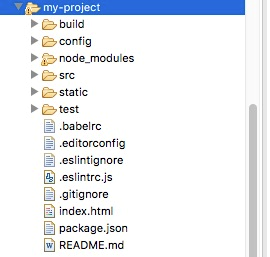
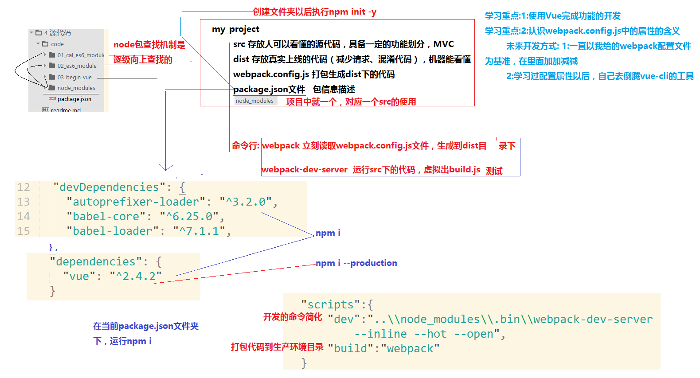
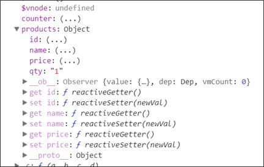

# vue

## 目录

1. 简介
   - [安装](#安装)
   - [目录结构](#目录结构)
2. 语法
   - [模板语法](#模板语法)
   - [指令](#指令)
   - [过滤器](#过滤器)
   - [计算属性](#计算属性)
   - [监视](#监视)
   - [动态操作根级响应式属性](#动态操作根级响应式属性)
   - [条件语句](#条件语句)

Vue.js的官方文档中是这样介绍它的：简单小巧的核心，渐进式技术栈，足以应付任何规模的应用。

>2014年诞生，2013年react，09年angularjs
>
>作者：尤雨溪
>
>核心概念：组件化，双向数据流（基于ES5中的defineProperty来实现的），IE9才支持
>
>angular核心：模块化，双向数据绑定（脏检测：一个数组($watch)
>
>建议学完vue再看[react](https://cn.vuejs.org/v2/guide/comparison.html#React)

**MVVM模式：**

与知名前端框架Angular、Ember等一样，Vue.js在设计上也使用MVVM(Model-View-ViewModel)模式。

MVVM模式是由经典的软件架构MVC衍生来的。当View（视图层）变化时，会自动更新到ViewModel（视图模型），反之亦然。View 和 ViewModel 之间通过双向绑定（data-binding）建立联系。

**与jQuery不同：**

jQuery让我们的视图代码和业务逻辑紧藕合在一起，随着功能不断增加，直接操作DOM会使得代码越来越难以维护。

而Vue.js 通过MVVM的模式拆分为视图与数据两部分，并将其分离。因此，你只需要关心你的数据即可，DOM的事情Vue会帮你自动搞定。

传统的前端开发模式：jQuery + RequireJS(SeaJS) + artTemplate(doT) + Gulp(Grunt)

## 安装

由于 npm 安装速度慢，建议使用淘宝定制的cnpm（gzip 压缩支持）命令行工具代替默认的 npm：

```sh
npm install -g cnpm --registry=https://registry.npm.taobao.org

# 最新稳定版
cnpm install vue
```

在用 Vue.js 构建大型应用时推荐使用 NPM 安装。Vue.js 提供一个官方命令行工具`vue-cli`，可用于快速搭建大型单页应用。

```sh
# 全局安装 vue-cli
cnpm install --global vue-cli
# 创建一个基于 webpack 模板的新项目
vue init webpack my-project
# 下面需要进行一些配置，默认回车即可
```

进入项目，安装并运行：

```sh
cd my-project
cnpm install
cnpm run dev
```

成功执行以上命令后访问 `http://localhost:xxxx/`

>注意：Vue.js 不支持 IE8 及其以下 IE 版本。

## 目录结构



目录/文件|说明
-|-
build|项目构建(webpack)相关代码
config|配置目录，包括端口号等。
node_modules|npm 加载的项目依赖模块
src|这里是我们要开发的目录，基本上要做的事情都在这个目录里。里面包含了几个目录及文件：<br>• assets：放置一些图片，如logo等。<br>• components：目录里面放了一个组件文件，可以不用。<br>• App.vue：项目入口文件，我们也可以直接将组件写这里，而不使用 components 目录。<br>• main.js：项目的核心文件。
static|静态资源目录，如图片、字体等。
test|初始测试目录，可删除
.xxxx文件|这些是一些配置文件，包括语法配置，git配置等。
index.html|首页入口文件，你可以添加一些 meta 信息或统计代码啥的。
package.json|项目配置文件。
README.md|项目的说明文档，markdown 格式



1. webpack通过插件来理解单文件代码
   - vue-loader, vue-template-compiler 代码中依赖vue
   - 启动命令：`..\\node_modules\\.bin\\webpack-dev-server --inline --hot --open`
2. template中只能有一个根节点 2.x
3. script中按照 `export default {配置}` 来写
4. style中可以设置`scoped`属性，让其只在template中生效

## 模板语法

**文本**：数据绑定最常见的形式就是使用 {{...}}（双大括号）的文本插值

**Html**：使用v-html指令用于输出html代码。

>这里要注意，如果将用户产生的内容使用v-html 输出后，有可能导致xss攻击，所以要在服务端对用户提交的内容进行处理，一般可将尖括号"<>"转义。

**属性**：HTML属性中的值应使用 `v-bind` 指令。给元素绑定 href 时可以也绑一个target，新窗口打开页面。

```html
<a v-bind:href="url" v-bind:target="target">
```

**表达式**：Vue提供了完全的 JavaScript 表达式支持。Vue只支持单个表达式，不支持语句和流控制。另外，在表达式中，不能使用用户自定义的全局变量，只能使用Vue白名单内的全局变量，例如 `Math` 和 `Date`。

>当我们给一个比如 `props` 中，或者 `data` 中被观测的对象添加一个新的属性的时候，不能直接添加，必须使用 `Vue.set` 方法。
>
>Vue.set 方法用来新增对象的属性。如果要增加属性的对象是响应式的，那该方法可以确保属性被创建后也是响应式的，同时触发视图更新。
>
>如果想显示 `{{}}` 标签，而不进行替换，使用 `v-pre` 即可跳过这个元素和它的子元素的编译过程。

## 指令

指令是带有 v- 前缀的特殊属性。用于在表达式的值改变时，将某些行为应用到DOM上。

- v-text 是元素的innerText只能在双标签中使用
- v-html 是元素的innerHTML，不能包含`<!--{{xxx}} -->`
- v-if 元素是否移除或者插入
- v-show 元素是否显示或隐藏
- v-for：循环（模板中可以使用）。v-for可以绑定数据到数组来渲染一个列表，可以通过一个对象的属性来迭代数据（第二个参数为键名，第三个参数为索引），也可以循环整数。
  
  >v-for默认行为试着不改变整体（替换元素）。如果要重新排序，需要提供一个key的特殊属性。

- v-cloak不需要表达式，它会在Vue实例结束编译时从绑定的HTML元素上移除，经常和css的`display:none`配合使用
- v-once也是一个不需要表达式的指令，作用是定义它的元素或组件只渲染一次，包括元素或组件的所有子节点。首次渲染后，不再随数据的变化重新渲染，将被视为静态内容。

- v-model 双向数据绑定，v-bind是单向数据绑定（内存js改变影响页面）
  
  >v-model 指令用来在 input、select、textarea、checkbox、radio 等表单控件元素上创建双向数据绑定，根据表单上的值，自动更新绑定的元素的值。

- 语法糖

  语法糖是指在不影响功能的情况下，添加某种方法实现同样的效果，从而方便程序开发。Vue.js为两个最为常用的指令提供了特别的缩写：

  - v-bind缩写：v-bind:xxx -> :xxx
  - v-on 缩写：v-on:evnetName -> @evnetName

## 过滤器

Vue允许你自定义过滤器，被用作一些常见的文本格式化。由“管道符”指示；过滤器函数接受表达式的值作为第一个参数。

```html
<div id="app">
  {{ message | capitalize }}
</div>
<script>
  new Vue({
    el: '#app',
    data: {
      message: 'runoob'
    },
    filters: {
      capitalize: function (value) {
        if (!value) return ''
        value = value.toString()
        return value.charAt(0).toUpperCase() + value.slice(1)
      }
    }
  })
</script>
```

过滤器可以串联：`{{ message | filterA | filterB }}`。过滤器是 JavaScript 函数，因此可以接受参数：`{{ message | filterA('arg1', arg2) }}`。这里，message 是第一个参数，字符串 'arg1' 将传给过滤器作为第二个参数，arg2 表达式的值将被求值然后传给过滤器作为第三个参数。

## 计算属性

模板内的表达式常用于简单的运算，当其过长或逻辑复杂时，会难以维护，计算属性就是用于解决该问题的。

计算属性关键词: `computed`。计算属性在处理一些复杂逻辑时是很有用的。

示例：反转字符串

```html
<div id="app">
  <p>原始字符串: {{ message }}</p>
  <p>计算后反转字符串: {{ reversedMessage }}</p>
  <p>使用方法后反转字符串: {{ reversedMessage2() }}</p>
</div>
<script>
var cnt=1;
var vm = new Vue({
  el: '#app',
  data: {
    message: 'Runoob!'
  },
  computed: {
    // 计算属性的 getter
    reversedMessage: function () {
      // `this` 指向 vm 实例
      cnt+=1;
      return cnt+this.message.split('').reverse().join('')
    }
  },
  methods: {
    reversedMessage2: function () {
      cnt+=1;
      return cnt+this.message.split('').reverse().join('')
    }
  }
})
</script>
```

声明一个计算属性reversedMessage。每一个计算属性都包含－个getter和setter，上面的示例是计算属性的默认用法，只是利用getter来读取。提供的函数将用作属性vm.reversedMessage的getter。vm.reversedMessage依赖于vm.message，在vm.message发生改变时，vm.reversedMessage也会更新。

**computed vs methods:**

我们可以使用 `methods` 来替代 `computed`，效果上两个都是一样的，但是 `computed` 是基于它的依赖缓存，只有相关依赖发生改变时才会重新取值。而使用 `methods`，在重新渲染的时候，函数总会重新调用执行。

可以说使用 `computed` 性能会更好，但是如果你不希望缓存，你可以使用 `methods` 属性。

上例中，cnt 是独立于 vm 对象的变量。在使用 reversedMessage 这个计算属性的时候，第一次会执行代码，得到一个值，以后再使用 reversedMessage 这个计算属性，因为 vm 对象没有发生改变，于是界面渲染就直接用这个值，不再重复执行代码。而 reversedMessage2 没有这个缓存，只要用一次，函数代码就执行一次，于是每次返回值都不一样。

**setter：**

```js
var vm = new Vue({
  el: '#app',
  data: {
    name: 'Google',
    url: 'http://www.google.com'
  },
  computed: {
    site: {
      // getter
      get: function () {
        return this.name + ' ' + this.url
      },
      // setter
      set: function (newValue) {
        var names = newValue.split(' ')
        this.name = names[0]
        this.url = names[names.length - 1]
      }
    }
  }
})
// 调用 setter， vm.name 和 vm.url 也会被对应更新
vm.site = '菜鸟教程 http://www.runoob.com';
document.write('name: ' + vm.name);
document.write('<br>');
document.write('url: ' + vm.url);
```

计算属性除了简单的文本插值外，还经常用于动态地设置元素的样式名称class和内联样式style。当使用组件时，计算属性也经常用来动态传递props。

计算属性还有两个很实用的小技巧容易被忽略：一是计算属性可以依赖其他计算属性；二是计算属性不仅可以依赖当前Vue实例的数据，还可以依赖其他实例的数据

## 监视

我们可以通过 `watch` 来响应数据的变化。以下实例通过使用 watch 实现计数器：

```html
<div id = "computed_props">
  千米 : <input type = "text" v-model = "kilometers">
  米 : <input type = "text" v-model = "meters">
</div>
<p id="info"></p>
<script type = "text/javascript">
  var vm = new Vue({
    el: '#computed_props',
    data: {
      kilometers : 0,
      meters:0
    },
    methods: {},
    computed: {},
    watch: {
      kilometers: function(val) {
        this.kilometers = val;
        this.meters = this.kilometers * 1000
      },
      meters: function (val) {
        this.kilometers = val/ 1000;
        this.meters = val;
      }
    }
  });
  // $watch 是一个实例方法
  vm.$watch('kilometers', function (newValue, oldValue) {
    // 这个回调将在 vm.kilometers 改变后调用
    document.getElementById ("info").innerHTML = "修改前值为: " + oldValue + "，修改后值为: " + newValue;
  })
</script>
```

watch 可以对（单个）变量进行监视，也可以深度监视；计算属性 computed 可以监视多个值，并且指定返回数据。

Vue 可以添加数据动态响应接口。例如以下实例，我们通过使用 $watch 属性来实现数据的监听，$watch 必须添加在 Vue 实例之外才能实现正确的响应。

实例中通过点击按钮计数器会加 1。setTimeout 设置 10 秒后计算器的值加上 20 。

```html
<div id = "app">
  <p style = "font-size:25px;">计数器: {{ counter }}</p>
  <button @click = "counter++" style = "font-size:25px;">点我</button>
</div>
<script type = "text/javascript">
var vm = new Vue({
  el: '#app',
  data: {
    counter: 1
  }
});
vm.$watch('counter', function(nval, oval) {
  alert('计数器值的变化 :' + oval + ' 变为 ' + nval + '!');
});
setTimeout(
  function(){
    vm.counter += 20;
  },10000
);
</script>
```

## 动态操作根级响应式属性

<b style="color:red">Vue 不允许在已经创建的实例上动态添加新的根级响应式属性。</b>

Vue 不能检测到对象属性的添加或删除，最好的方式就是在初始化实例前声明根级响应式属性，哪怕只是一个空值。

如果我们需要在运行过程中实现属性的添加或删除，则可以使用全局 Vue，`Vue.set` 和 `Vue.delete` 方法。

Vue.set 方法用于设置对象的属性，它可以解决 Vue 无法检测添加属性的限制，语法格式如下：

```js
Vue.set( target, key, value )
```

参数说明：

- target: 可以是对象或数组
- key: 可以是字符串或数字
- value: 可以是任何类型

```html
<div id = "app">
   <p style = "font-size:25px;">计数器: {{ products.id }}</p>
   <button @click = "products.id++" style = "font-size:25px;">点我</button>
</div>
<script type = "text/javascript">
var myproduct = {"id":1, name:"book", "price":"20.00"};
  var vm = new Vue({
  el: '#app',
  data: {
    counter: 1,
    products: myproduct
  }
});
vm.products.qty = "1";
console.log(vm);
vm.$watch('counter', function(nval, oval) {
  alert('计数器值的变化 :' + oval + ' 变为 ' + nval + '!');
});
</script>
```

在以上实例中，在开始时创建了一个变量 myproduct，该变量赋值给了 Vue 实例的 data 对象，如果我们想给 myproduct 数组添加一个或多个属性，我们可以在 Vue 实例创建后使用 `vm.products.qty = "1";` 代码。

查看控制台输出：



在产品中添加了数量属性 qty，但是 get/set 方法只可用于 id，name 和 price 属性，却不能在 qty 属性中使用。

我们不能通过添加 Vue 对象来实现响应。 Vue 主要在开始时创建所有属性。 如果我们要实现这个功能，可以通过 Vue.set 来实现：

```html
<div id = "app">
  <p style = "font-size:25px;">计数器: {{ products.id }}</p>
  <button @click = "products.id++" style = "font-size:25px;">点我</button>
</div>
<script type = "text/javascript">
var myproduct = {"id":1, name:"book", "price":"20.00"};
var vm = new Vue({
  el: '#app',
  data: {
    counter: 1,
    products: myproduct
  }
});
Vue.set(myproduct, 'qty', 1);
console.log(vm);
vm.$watch('counter', function(nval, oval) {
  alert('计数器值的变化 :' + oval + ' 变为 ' + nval + '!');
});
</script>
```

从控制台输出的结果可以看出 get/set 方法可用于qty 属性。

Vue.delete 用于删除动态添加的属性 语法格式：

```js
Vue.delete( target, key )
```

参数说明：

- target: 可以是对象或数组
- key: 可以是字符串或数字

```html
<div id = "app">
  <p style = "font-size:25px;">计数器: {{ products.id }}</p>
  <button @click = "products.id++" style = "font-size:25px;">点我</button>
</div>
<script type = "text/javascript">
var myproduct = {"id":1, name:"book", "price":"20.00"};
var vm = new Vue({
  el: '#app',
  data: {
    counter: 1,
    products: myproduct
  }
});
Vue.delete(myproduct, 'price');
console.log(vm);
vm.$watch('counter', function(nval, oval) {
  alert('计数器值的变化 :' + oval + ' 变为 ' + nval + '!');
});
</script>
```

以上实例中我们使用 Vue.delete 来删除 price 属性。

## 条件语句

### v-if

```html
<div id="app">
  <p v-if="seen">现在你看到我了</p>
  <template v-if="ok">
    <h1>菜鸟教程</h1>
    <p>学的不仅是技术，更是梦想！</p>
    <p>哈哈哈，打字辛苦啊！！！</p>
  </template>
</div>
<script>
new Vue({
  el: '#app',
  data: {
    seen: true,
    ok: true
  }
})
</script>
```

在字符串模板中，如 Handlebars ，我们得像这样写一个条件块：

```html
<!-- Handlebars 模板 -->
{{#if ok}}
  <h1>Yes</h1>
{{/if}}
```

### v-else-if & v-else

```html
<div id="app">
  <div v-if="type === 'A'">A</div>
  <div v-else-if="type === 'B'">B</div>
  <div v-else-if="type === 'C'">C</div>
  <div v-else>Not A/B/C</div>
</div>
```

### v-show

在切换 v-if 块时，Vue.js 有一个局部编译/卸载过程，因为 v-if 之中的模板也可能包括数据绑定或子组件。v-if是真实的条件渲染，因为它会确保条件块在切换当中合适地销毁与重建条件块内的事件监听器和子组件。

v-if 也是惰性的：如果在初始渲染时条件为假，则什么也不做——在条件第一次变为真时才开始局部编译（编译会被缓存起来）。

相比之下，v-show 简单得多——元素始终被编译并保留，只是简单地基于 CSS 切换。

v-if 是动态添加，当值为 false 时，是完全移除该元素，即 dom 树中不存在该元素。

v-show 仅是隐藏/显示，值为 false 时，该元素依旧存在于 dom 树中。若其原有样式设置了 display: none 则会导致其无法正常显示。

一般来说，v-if 有更高的切换消耗而 v-show 有更高的初始渲染消耗。因此，如果需要频繁切换 v-show 较好，如果在运行时条件不大可能改变 v-if 较好。

简单来说：

- v-if：判断是否加载，可以减轻服务器压力，在需要时加载
- v-show：调整css display属性，可以使客户端操作更加流畅
