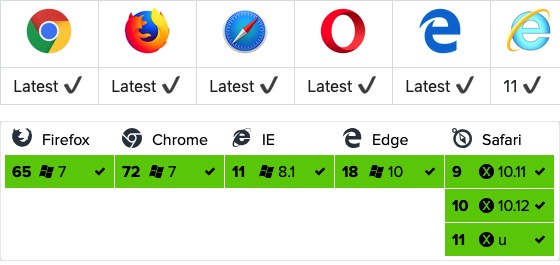

# vue开发库

## vue-resource

vue中的\$http服务，需要引入一个叫vue-resource.js的文件，因为vue.js中没有\$http服务。

静态文件引入：

```html
<script src="https://cdn.staticfile.org/vue-resource/1.5.1/vue-resource.min.js"></script>
```

安装vue-resource到项目中，找到当前项目：

```sh
cnpm install vue-resource --save
```

安装完毕后，在main.js中导入，如下所示：

```js
// The Vue build version to load with the `import` command
// (runtime-only or standalone) has been set in webpack.base.conf with an alias.
import Vue from 'vue'
import App from './App'
import router from './router'
import VueResource  from 'vue-resource'

Vue.config.productionTip = false
Vue.use(VueResource)

/* eslint-disable no-new */
new Vue({
  el: '#app',
  router,
  components: { App },
  template: '<App/>'
})
```

- 早期vue团队开发的插件，停止维护了，作者推荐使用axios
- options预检请求，是当浏览器发现跨域 + application/json的请求，就会自动发起，并且发起的时候携带了一个content-type的头

### get

```html
<script src="https://cdn.staticfile.org/vue/2.4.2/vue.min.js"></script>
<script src="https://cdn.staticfile.org/vue-resource/1.5.1/vue-resource.min.js"></script>
<div id="box">
  <input type="button" @click="get()" value="点我异步获取数据(Get)">
</div>
<script type = "text/javascript">
window.onload = function(){
  var vm = new Vue({
    el:'#box',
    data:{
      msg:'Hello World!',
    },
    methods:{
      get: function(){
        //发送get请求
        this.$http.get('/try/ajax/ajax_info.txt').then(function(res){
          document.write(res.body);    
        },function(){
          console.log('请求失败处理');
        });
      }
    }
  });
}
</script>
```

如果需要传递数据，可以使用 `this.$http.get('get.php', {params: jsonData})`格式，第二个参数 jsonData 就是传到后端的数据。

### post

post 发送数据到后端，需要第三个参数 `{ emulateJSON: true }`。

emulateJSON 的作用： 如果Web服务器无法处理编码为 application/json 的请求，你可以启用 emulateJSON 选项。

```html
<script src="https://cdn.staticfile.org/vue/2.4.2/vue.min.js"></script>
<script src="https://cdn.staticfile.org/vue-resource/1.5.1/vue-resource.min.js"></script>
<div id="box">
  <input type="button" @click="post()" value="点我异步获取数据(Post)">
</div>
<script type = "text/javascript">
window.onload = function(){
  var vm = new Vue({
    el:'#box',
    data:{
      msg:'Hello World!',
    },
    methods:{
      post:function(){
        //发送 post 请求
        this.$http.post('/try/ajax/demo_test_post.php',
          { 
            name:"菜鸟教程",
            url:"http://www.runoob.com"
          },
          { 
            emulateJSON: true 
          }).then(function(res){
            document.write(res.body);    
          }, function(res){
            console.log(res.status);
          });
      }
    }
  });
}
</script>
```

demo_test_post.php 代码如下：

```php
<?php
  $name = isset($_POST['name']) ? htmlspecialchars($_POST['name']) : '';
  $city = isset($_POST['url']) ? htmlspecialchars($_POST['url']) : '';
  echo '网站名: ' . $name;
  echo "\n";
  echo 'URL 地址: ' .$city;
?>
```

### 语法 & API

你可以使用全局对象方式 Vue.http 或者在一个 Vue 实例的内部使用 this.$http 来发起 HTTP 请求。

```js
// 基于全局Vue对象使用http
Vue.http.get('/someUrl', [options]).then(successCallback, errorCallback);
Vue.http.post('/someUrl', [body], [options]).then(successCallback, errorCallback);

// 在一个Vue实例内使用$http
this.$http.get('/someUrl', [options]).then(successCallback, errorCallback);
this.$http.post('/someUrl', [body], [options]).then(successCallback, errorCallback);
```

vue-resource 提供了 7 种请求 API(REST 风格)：

```js
get(url, [options])
head(url, [options])
delete(url, [options])
jsonp(url, [options])
post(url, [body], [options])
put(url, [body], [options])
patch(url, [body], [options])
```

除了 jsonp 以外，另外 6 种的 API 名称是标准的 HTTP 方法。

options 参数说明:

参数|类型|描述
-|-|-
url|string|请求的目标URL
body|Object, FormData, string|作为请求体发送的数据
headers|Object|作为请求头部发送的头部对象
params|Object|作为URL参数的参数对象
method|string|HTTP方法 (例如GET，POST，...)
timeout|number|请求超时（单位：毫秒）(0表示永不超时)
before|function(request)|在请求发送之前修改请求的回调函数
progress|function(event)|用于处理上传进度的回调函数 ProgressEvent
credentials|boolean|是否需要出示用于跨站点请求的凭据
emulateHTTP|boolean|是否需要通过设置X-HTTP-Method-Override头部并且以传统POST方式发送PUT，PATCH和DELETE请求。
emulateJSON|boolean|设置请求体的类型为application/x-www-form-urlencoded

通过如下属性和方法处理一个请求获取到的响应对象：

属性|类型|描述
-|-|-
url|string|响应的 URL 源
body|Object, Blob, string|响应体数据
headers|Header|请求头部对象
ok|boolean|当 HTTP 响应码为 200 到 299 之间的数值时该值为 true
status|number|HTTP 响应码
statusText|string|HTTP 响应状态

---

方法|类型|描述
-|-|-
text()|约定值|以字符串方式返回响应体
json()|约定值|以格式化后的 json 对象方式返回响应体
blob()|约定值|以二进制 Blob 对象方式返回响应体

## axios

Vue.js 2.0 版本推荐使用 axios 来完成 ajax 请求。

Axios 是一个基于 Promise 的 HTTP 库，可以用在浏览器和 node.js 中。

Github开源地址： https://github.com/axios/axios

### 安装方法

使用 cdn:

```html
<script src="https://unpkg.com/axios/dist/axios.min.js"></script>
```

或

```html
<script src="https://cdn.staticfile.org/axios/0.18.0/axios.min.js"></script>
```

使用 npm:

```sh
npm install axios
```

使用 bower:

```sh
bower install axios
```

使用 yarn:

```sh
yarn add axios
```

### 浏览器支持情况



### GET

```html
<script src="https://cdn.staticfile.org/vue/2.4.2/vue.min.js"></script>
<script src="https://cdn.staticfile.org/axios/0.18.0/axios.min.js"></script>
<div id="app">
  {{ info }}
</div>
<script type = "text/javascript">
new Vue({
  el: '#app',
  data () {
    return {
      info: null
    }
  },
  mounted () {
    axios
      .get('https://www.runoob.com/try/ajax/json_demo.json')
      .then(response => (this.info = response))
      .catch(function (error) { // 请求失败处理
        console.log(error);
      });
  }
})
</script>
```

GET 方法传递参数格式如下：

```js
// 直接在 URL 上添加参数 ID=12345
axios.get('/user?ID=12345')
  .then(function (response) {
    console.log(response);
  })
  .catch(function (error) {
    console.log(error);
  });
 
// 也可以通过 parmas 设置参数：
axios.get('/user', {
  params: {
    ID: 12345
  }
}).then(function (response) {
  console.log(response);
}).catch(function (error) {
  console.log(error);
});
```

### POST

post请求的时候，如果数据是字符串，默认头就是键值对，否则是对象就是application/json

```js
axios.post('/user', {
  firstName: 'Fred',        // 参数 firstName
  lastName: 'Flintstone'    // 参数 lastName
}).then(function (response) {
  console.log(response);
}).catch(function (error) {
  console.log(error);
});
```

### 执行多个并发请求

```javascript
axios.all([get1(), get2()])
  .then(axios.spread(function (res1, res2) {
    // 只有两个请求都完成才会成功，否则会被catch捕获
  }));
```

### axios API

请求方式：

1. this.$axios.get(url,options)
2. this.$axios.post(url,data,options)
3. 配置项

   ```json
   options: {
     params: { id: 1 },  //查询字符串
     headers: { 'content-type': 'xxxxx' }, 
     baseURL: '' 
   }
   ```

全局默认设置：Axios.defaults.baseURL = 'xxxxx';

#### 别名

为方便使用，官方为所有支持的请求方法提供了别名，可以直接使用别名来发起请求：

```js
axios.request(config)
axios.get(url[, config])
axios.delete(url[, config])
axios.head(url[, config])
axios.post(url[, data[, config]])
axios.put(url[, data[, config]])
axios.patch(url[, data[, config]])
```

>注意：在使用别名方法时， url、method、data 这些属性都不必在配置中指定。

#### 并发

处理并发请求的助手函数

```js
axios.all(iterable)
axios.spread(callback)
```

#### 创建实例

可以使用自定义配置新建一个 axios 实例：

```js
axios.create([config])
const instance = axios.create({
  baseURL: 'https://some-domain.com/api/',
  timeout: 1000,
  headers: {'X-Custom-Header': 'foobar'}
});
```

#### 实例方法

以下是可用的实例方法。指定的配置将与实例的配置合并：

```js
axios#request(config)
axios#get(url[, config])
axios#delete(url[, config])
axios#head(url[, config])
axios#post(url[, data[, config]])
axios#put(url[, data[, config]])
axios#patch(url[, data[, config]])
```

#### 请求配置项

下面是创建请求时可用的配置选项，注意只有 url 是必需的。如果没有指定 method，请求将默认使用 get 方法。

```js
{
    // `url` 是用于请求的服务器 URL
    url: "/user",
  
    // `method` 是创建请求时使用的方法
    method: "get", // 默认是 get
  
    // `baseURL` 将自动加在 `url` 前面，除非 `url` 是一个绝对 URL。
    // 它可以通过设置一个 `baseURL` 便于为 axios 实例的方法传递相对 URL
    baseURL: "https://some-domain.com/api/",
  
    // `transformRequest` 允许在向服务器发送前，修改请求数据
    // 只能用在 "PUT", "POST" 和 "PATCH" 这几个请求方法
    // 后面数组中的函数必须返回一个字符串，或 ArrayBuffer，或 Stream
    transformRequest: [function (data) {
      // 对 data 进行任意转换处理
  
      return data;
    }],
  
    // `transformResponse` 在传递给 then/catch 前，允许修改响应数据
    transformResponse: [function (data) {
      // 对 data 进行任意转换处理
  
      return data;
    }],
  
    // `headers` 是即将被发送的自定义请求头
    headers: {"X-Requested-With": "XMLHttpRequest"},
  
    // `params` 是即将与请求一起发送的 URL 参数
    // 必须是一个无格式对象(plain object)或 URLSearchParams 对象
    params: {
      ID: 12345
    },
  
    // `paramsSerializer` 是一个负责 `params` 序列化的函数
    // (e.g. https://www.npmjs.com/package/qs, http://api.jquery.com/jquery.param/)
    paramsSerializer: function(params) {
      return Qs.stringify(params, {arrayFormat: "brackets"})
    },
  
    // `data` 是作为请求主体被发送的数据
    // 只适用于这些请求方法 "PUT", "POST", 和 "PATCH"
    // 在没有设置 `transformRequest` 时，必须是以下类型之一：
    // - string, plain object, ArrayBuffer, ArrayBufferView, URLSearchParams
    // - 浏览器专属：FormData, File, Blob
    // - Node 专属： Stream
    data: {
      firstName: "Fred"
    },
  
    // `timeout` 指定请求超时的毫秒数(0 表示无超时时间)
    // 如果请求话费了超过 `timeout` 的时间，请求将被中断
    timeout: 1000,
  
    // `withCredentials` 表示跨域请求时是否需要使用凭证
    withCredentials: false, // 默认的
  
    // `adapter` 允许自定义处理请求，以使测试更轻松
    // 返回一个 promise 并应用一个有效的响应 (查阅 [response docs](#response-api)).
    adapter: function (config) {
      /* ... */
    },
  
    // `auth` 表示应该使用 HTTP 基础验证，并提供凭据
    // 这将设置一个 `Authorization` 头，覆写掉现有的任意使用 `headers` 设置的自定义 `Authorization`头
    auth: {
      username: "janedoe",
      password: "s00pers3cret"
    },
  
    // `responseType` 表示服务器响应的数据类型，可以是 "arraybuffer", "blob", "document", "json", "text", "stream"
    responseType: "json", // 默认的
  
    // `xsrfCookieName` 是用作 xsrf token 的值的cookie的名称
    xsrfCookieName: "XSRF-TOKEN", // default
  
    // `xsrfHeaderName` 是承载 xsrf token 的值的 HTTP 头的名称
    xsrfHeaderName: "X-XSRF-TOKEN", // 默认的
  
    // `onUploadProgress` 允许为上传处理进度事件
    onUploadProgress: function (progressEvent) {
      // 对原生进度事件的处理
    },
  
    // `onDownloadProgress` 允许为下载处理进度事件
    onDownloadProgress: function (progressEvent) {
      // 对原生进度事件的处理
    },
  
    // `maxContentLength` 定义允许的响应内容的最大尺寸
    maxContentLength: 2000,
  
    // `validateStatus` 定义对于给定的HTTP 响应状态码是 resolve 或 reject  promise 。如果 `validateStatus` 返回 `true` (或者设置为 `null` 或 `undefined`)，promise 将被 resolve; 否则，promise 将被 rejecte
    validateStatus: function (status) {
      return status &gt;= 200 &amp;&amp; status &lt; 300; // 默认的
    },
  
    // `maxRedirects` 定义在 node.js 中 follow 的最大重定向数目
    // 如果设置为0，将不会 follow 任何重定向
    maxRedirects: 5, // 默认的
  
    // `httpAgent` 和 `httpsAgent` 分别在 node.js 中用于定义在执行 http 和 https 时使用的自定义代理。允许像这样配置选项：
    // `keepAlive` 默认没有启用
    httpAgent: new http.Agent({ keepAlive: true }),
    httpsAgent: new https.Agent({ keepAlive: true }),
  
    // "proxy" 定义代理服务器的主机名称和端口
    // `auth` 表示 HTTP 基础验证应当用于连接代理，并提供凭据
    // 这将会设置一个 `Proxy-Authorization` 头，覆写掉已有的通过使用 `header` 设置的自定义 `Proxy-Authorization` 头。
    proxy: {
      host: "127.0.0.1",
      port: 9000,
      auth: : {
        username: "mikeymike",
        password: "rapunz3l"
      }
    },
  
    // `cancelToken` 指定用于取消请求的 cancel token
    // （查看后面的 Cancellation 这节了解更多）
    cancelToken: new CancelToken(function (cancel) {
    })
  }
```

#### 响应结构

axios请求的响应包含以下信息：

```js
{
    // `data` 由服务器提供的响应
    data: {},
  
    // `status`  HTTP 状态码
    status: 200,
  
    // `statusText` 来自服务器响应的 HTTP 状态信息
    statusText: "OK",
  
    // `headers` 服务器响应的头
    headers: {},
  
    // `config` 是为请求提供的配置信息
    config: {}
  }
```

使用 then 时，会接收下面这样的响应：

```js
axios.get("/user/12345")
  .then(function(response) {
    console.log(response.data);
    console.log(response.status);
    console.log(response.statusText);
    console.log(response.headers);
    console.log(response.config);
  });
```

在使用 catch 时，或传递 rejection callback 作为 then 的第二个参数时，响应可以通过 error 对象被使用。

#### 配置的默认值

你可以指定将被用在各个请求的配置默认值。

全局的 axios 默认值：

```js
axios.defaults.baseURL = 'https://api.example.com';
axios.defaults.headers.common['Authorization'] = AUTH_TOKEN;
axios.defaults.headers.post['Content-Type'] = 'application/x-www-form-urlencoded';
```

自定义实例默认值：

```js
// 创建实例时设置配置的默认值
var instance = axios.create({
  baseURL: 'https://api.example.com'
});
  
// 在实例已创建后修改默认值
instance.defaults.headers.common['Authorization'] = AUTH_TOKEN;
```

#### 配置的优先顺序

配置会以一个优先顺序进行合并。这个顺序是：在 lib/defaults.js 找到的库的默认值，然后是实例的 defaults 属性，最后是请求的 config 参数。后者将优先于前者。这里是一个例子：

```js
// 使用由库提供的配置的默认值来创建实例
// 此时超时配置的默认值是 `0`
var instance = axios.create();

// 覆写库的超时默认值
// 现在，在超时前，所有请求都会等待 2.5 秒
instance.defaults.timeout = 2500;

// 为已知需要花费很长时间的请求覆写超时设置
instance.get('/longRequest', {
  timeout: 5000
});
```

#### 拦截器

在请求或响应被 then 或 catch 处理前拦截它们。

```js
// 添加请求拦截器
axios.interceptors.request.use(function (config) {
    // 在发送请求之前做些什么
    return config;
  }, function (error) {
    // 对请求错误做些什么
    return Promise.reject(error);
  });

// 添加响应拦截器
axios.interceptors.response.use(function (response) {
    // 对响应数据做点什么
    return response;
  }, function (error) {
    // 对响应错误做点什么
    return Promise.reject(error);
  });
```

如果你想在稍后移除拦截器，可以这样：

```js
var myInterceptor = axios.interceptors.request.use(function () {/*...*/});
axios.interceptors.request.eject(myInterceptor);
```

可以为自定义 axios 实例添加拦截器。

```js
var instance = axios.create();
instance.interceptors.request.use(function () {/*...*/});
```

#### 错误处理：

```js
axios.get('/user/12345')
  .catch(function (error) {
    if (error.response) {
      // 请求已发出，但服务器响应的状态码不在 2xx 范围内
      console.log(error.response.data);
      console.log(error.response.status);
      console.log(error.response.headers);
    } else {
      // Something happened in setting up the request that triggered an Error
      console.log('Error', error.message);
    }
    console.log(error.config);
  });
```

可以使用 validateStatus 配置选项定义一个自定义 HTTP 状态码的错误范围。

```js
axios.get('/user/12345', {
    validateStatus: function (status) {
      return status < 500; // 状态码在大于或等于500时才会 reject
    }
  })
```

#### 取消

使用 cancel token 取消请求。Axios 的 cancel token API 基于cancelable promises proposal。可以使用 CancelToken.source 工厂方法创建 cancel token，像这样：

```js
var CancelToken = axios.CancelToken;
var source = CancelToken.source();

axios.get('/user/12345', {
  cancelToken: source.token
}).catch(function(thrown) {
  if (axios.isCancel(thrown)) {
    console.log('Request canceled', thrown.message);
  } else {
    // 处理错误
  }
});

// 取消请求（message 参数是可选的）
source.cancel('Operation canceled by the user.');
```

还可以通过传递一个 executor 函数到 CancelToken 的构造函数来创建 cancel token：

```js
var CancelToken = axios.CancelToken;
var cancel;

axios.get('/user/12345', {
  cancelToken: new CancelToken(function executor(c) {
    // executor 函数接收一个 cancel 函数作为参数
    cancel = c;
  })
});

// 取消请求
cancel();
```

>注意：可以使用同一个 cancel token 取消多个请求。

#### 请求时使用 application/x-www-form-urlencoded

axios 会默认序列化 JavaScript 对象为 JSON。 如果想使用 application/x-www-form-urlencoded 格式，你可以使用下面的配置。

**浏览器**

在浏览器环境，你可以使用 URLSearchParams API

```js
const params = new URLSearchParams();
params.append('param1', 'value1');
params.append('param2', 'value2');
axios.post('/foo', params);
```

URLSearchParams 不是所有的浏览器均支持。

除此之外，你可以使用 qs 库来编码数据：

```js
const qs = require('qs');
axios.post('/foo', qs.stringify({ 'bar': 123 }));

// Or in another way (ES6),

import qs from 'qs';
const data = { 'bar': 123 };
const options = {
  method: 'POST',
  headers: { 'content-type': 'application/x-www-form-urlencoded' },
  data: qs.stringify(data),
  url,
};
axios(options);
```

**Node.js 环境**

在 node.js里，可以使用 querystring 模块：

```js
const querystring = require('querystring');
axios.post('http://something.com/', querystring.stringify({ foo: 'bar' }));
```

当然，同浏览器一样，你还可以使用 qs 库。

**Promises**

axios 依赖原生的 ES6 Promise 实现而被支持。

如果你的环境不支持 ES6 Promise，你可以使用 polyfill。

**TypeScript支持**

axios 包含 TypeScript 的定义。

```js
import axios from "axios";
axios.get("/user?ID=12345");
```

### 项目中示例

```js
import axios from 'axios'
import qs from 'qs'
import router from '@/router'

let app = null
const getAppId = setInterval(() => {
  if (window.app.$notify) {
    clearInterval(getAppId)
    app = window.app
  }
}, 60)

axios.defaults.timeout = 60000 // 响应时间
axios.defaults.headers.post['Content-Type'] = 'application/x-www-form-urlencoded;charset=UTF-8' // 配置请求头
axios.defaults.headers['x-requested-with'] = 'XMLHttpRequest' // 让后台判断是否ajax请求
axios.defaults.baseURL = window.config.backUrl // 配置接口地址

// status < 500 不会抛错误
axios.defaults.validateStatus = status => {
  return status < 500
}

// 设置请求token
axios.interceptors.request.use(config => {
  if (sessionStorage.getItem('token')) {
    var token = sessionStorage.getItem('token')
    config.headers['Authorization'] = 'Bearer ' + token
  }
  // 在发送请求之前做某件事
  if (config.method === 'post') {
    config.data = qs.stringify(config.data)
  } else if (config.method === 'get') {
    // 加上时间戳，不使用缓存
    if (!config.params) {
      config.params = {}
    }
    config.params.time = new Date().getTime()
  }
  // console.log(config)
  return config
}, (error) => {
  console.log('错误的传参')
  return Promise.reject(error)
})

// 接口错误拦截
axios.interceptors.response.use(res => {
  if (res.status === 401) {
    if (document.getElementsByClassName('el-message').length === 0) {
      app.$message({
        type: 'warning',
        message: '登录身份过期，请重新登录。'
      })
    }
    sessionStorage.removeItem('token')
    sessionStorage.removeItem('user')
    router.push({ name: 'login' })
    return Promise.reject(new Error('身份过期'))
  } else if (res.status === 200) {
    const statusCode = res['data']['Code'] // 错误码
    const message = res['data']['Msg'] // 错误信息
    const data = res['data']['Data'] // 返回数据
    if (statusCode && statusCode !== 200 && message) { // 后台返回错误信息
      if (document.getElementsByClassName('el-message').length === 0) {
        app.$message({ type: 'error', message: message, duration: 3000 })
      }
      return Promise.reject(message)
    } else {
      return Promise.resolve(data)
    }
  } else {
    app.$notify.error({
      title: '接口异常!',
      message: `异常原因: [ ${res.config.url} ] ${res.status} ${res.statusText}`
    })
    return res.data
  }
}, err => {
  app.$notify.error({
    title: '服务错误',
    message: '服务器响应错误 ' + err.message
  })
  return Promise.reject(err)
})

// 返回一个Promise（发送post请求）
export function post (url, params) {
  return new Promise((resolve, reject) => {
    axios.post(url, params).then(response => {
      resolve(response)
    }, err => {
      reject(err)
    }).catch((error) => {
      reject(error)
    })
  })
}

// 返回一个Promise（发送get请求）
export function get (url, param) {
  return new Promise((resolve, reject) => {
    axios.get(url, { params: param }).then(response => {
      resolve(response)
    }, err => {
      reject(err)
    }).catch((error) => {
      reject(error)
    })
  })
}

export function getFile (url, param) {
  return new Promise((resolve, reject) => {
    axios({
      method: 'post',
      responseType: 'blob',
      url: url,
      params: param
    })// axios.get(url, { params: param }, { responseType: 'blob' })
      .then(response => {
        resolve(response)
        if (response != null) {
          let url = window.URL.createObjectURL(new Blob([response]))
          let link = document.createElement('a')
          link.style.display = 'none'
          link.href = url
          link.setAttribute('download', param.fileName || 'example.doc') // 自定义下载文件名（如exemple.txt）
          document.body.appendChild(link)
          link.click()
        }
      }, err => {
        reject(err)
      }).catch((error) => {
        reject(error)
      })
  })
}

export default {
  post,
  get,
  getFile
}
```

继续优化：

1. 优化axios封装，去掉之前的get和post
2. 断网情况处理
3. 更加模块化的api管理
4. 接口域名有多个的情况
5. api挂载到vue.prototype上省去引入的步骤

http.js中axios封装的优化，先直接贴代码：

```js
/**
  * axios封装
  * 请求拦截、响应拦截、错误统一处理
  */
import axios from 'axios';
import router from '../router';
import store from '../store/index';
import { Toast } from 'vant';

/**
  * 提示函数
  * 禁止点击蒙层、显示一秒后关闭
  */
const tip = msg => {
    Toast({
        message: msg,
        duration: 1000,
        forbidClick: true
    });
}

/**
  * 跳转登录页
  * 携带当前页面路由，以期在登录页面完成登录后返回当前页面
  */
const toLogin = () => {
    router.replace({
        path: '/login',
        query: {
            redirect: router.currentRoute.fullPath
        }
    });
}

/**
  * 请求失败后的错误统一处理
  * @param {Number} status 请求失败的状态码
  */
const errorHandle = (status, other) => {
    // 状态码判断
    switch (status) {
        // 401: 未登录状态，跳转登录页
        case 401:
            toLogin();
            break;
        // 403 token过期
        // 清除token并跳转登录页
        case 403:
            tip('登录过期，请重新登录');
            localStorage.removeItem('token');
            store.commit('loginSuccess', null);
            setTimeout(() => {
                toLogin();
            }, 1000);
            break;
        // 404请求不存在
        case 404:
            tip('请求的资源不存在');
            break;
        default:
            console.log(other);
        }}

// 创建axios实例
var instance = axios.create({    timeout: 1000 * 12});
// 设置post请求头
instance.defaults.headers.post['Content-Type'] = 'application/x-www-form-urlencoded';
/**
  * 请求拦截器
  * 每次请求前，如果存在token则在请求头中携带token
  */
instance.interceptors.request.use(
    config => {
        // 登录流程控制中，根据本地是否存在token判断用户的登录情况
        // 但是即使token存在，也有可能token是过期的，所以在每次的请求头中携带token
        // 后台根据携带的token判断用户的登录情况，并返回给我们对应的状态码
        // 而后我们可以在响应拦截器中，根据状态码进行一些统一的操作。
        const token = store.state.token;
        token && (config.headers.Authorization = token);
        return config;
    },
    error => Promise.error(error))

// 响应拦截器
instance.interceptors.response.use(
    // 请求成功
    res => res.status === 200 ? Promise.resolve(res) : Promise.reject(res),
    // 请求失败
    error => {
        const { response } = error;
        if (response) {
            // 请求已发出，但是不在2xx的范围
            errorHandle(response.status, response.data.message);
            return Promise.reject(response);
        } else {
            // 处理断网的情况
            // eg:请求超时或断网时，更新state的network状态
            // network状态在app.vue中控制着一个全局的断网提示组件的显示隐藏
            // 关于断网组件中的刷新重新获取数据，会在断网组件中说明
            store.commit('changeNetwork', false);
        }
    });

export default instance;
```

这个axios和之前的大同小异，做了如下几点改变：

1. 去掉了之前get和post方法的封装，通过创建一个axios实例然后export default方法导出，这样使用起来更灵活一些。
2. 去掉了通过环境变量控制baseUrl的值。考虑到接口会有多个不同域名的情况，所以准备通过js变量来控制接口域名。这点具体在api里会介绍。
3. 增加了请求超时，即断网状态的处理。说下思路，当断网时，通过更新vuex中network的状态来控制断网提示组件的显示隐藏。断网提示一般会有重新加载数据的操作，这步会在后面对应的地方介绍。
4. 公用函数进行抽出，简化代码，尽量保证单一职责原则。

下面说下api这块，考虑到一下需求：

1. 更加模块化
2. 更方便多人开发，有效减少解决命名冲突
3. 处理接口域名有多个情况

这里这里呢新建了一个api文件夹，里面有一个index.js和一个base.js，以及多个根据模块划分的接口js文件。index.js是一个api的出口，base.js管理接口域名，其他js则用来管理各个模块的接口。

先放index.js代码：

```js
/**
  * api接口的统一出口
  */
// 文章模块接口
import article from '@/api/article';
// 其他模块的接口……

// 导出接口
export default {
    article,
    // ……
}
```

index.js是一个api接口的出口，这样就可以把api接口根据功能划分为多个模块，利于多人协作开发，比如一个人只负责一个模块的开发等，还能方便每个模块中接口的命名哦。

base.js:

```js
/**
  * 接口域名的管理
  */
const base = {
    sq: 'https://xxxx111111.com/api/v1',
    bd: 'http://xxxxx22222.com/api'
}

export default base;
```

通过base.js来管理我们的接口域名，不管有多少个都可以通过这里进行接口的定义。即使修改起来，也是很方便的。

最后就是接口模块的说明，例如上面的article.js:

```js
/**
  * article模块接口列表
  */
import base from './base'; // 导入接口域名列表
import axios from '@/utils/http'; // 导入http中创建的axios实例
import qs from 'qs'; // 根据需求是否导入qs模块

const article = {
    // 新闻列表
    articleList () {
        return axios.get(`${base.sq}/topics`);
    },
    // 新闻详情,演示
    articleDetail (id, params) {
        return axios.get(`${base.sq}/topic/${id}`, {
            params: params
        });
    },
    // post提交
    login (params) {
        return axios.post(`${base.sq}/accesstoken`, qs.stringify(params));
    }
    // 其他接口…………
}

export default article;
```

1. 通过直接引入我们封装好的axios实例，然后定义接口、调用axios实例并返回，可以更灵活的使用axios，比如你可以对post请求时提交的数据进行一个qs序列化的处理等。
2. 请求的配置更灵活，你可以针对某个需求进行一个不同的配置。关于配置的优先级，axios文档说的很清楚，这个顺序是：在 lib/defaults.js 找到的库的默认值，然后是实例的 defaults 属性，最后是请求的 config 参数。后者将优先于前者。
3. restful风格的接口，也可以通过这种方式灵活的设置api接口地址。

最后，为了方便api的调用，我们需要将其挂载到vue的原型上。在main.js中：

```js
import Vue from 'vue'
import App from './App'
import router from './router' // 导入路由文件
import store from './store' // 导入vuex文件
import api from './api' // 导入api接口

Vue.prototype.$api = api; // 将api挂载到vue的原型上
```

然后我们可以在页面中这样调用接口，eg：

```js
methods: {
    onLoad(id) {
        this.$api.article.articleDetail(id, {
            api: 123
        }).then(res=> {
            // 执行某些操作
        })
    }
}
```

再提一下断网的处理，这里只做一个简单的示例：

```html
<template>
    <div id="app">
        <div v-if="!network">
            <h3>我没网了</h3>
            <div @click="onRefresh">刷新</div>
        </div>
        <router-view/>
    </div>
</template>

<script>
    import { mapState } from 'vuex';
    export default {
        name: 'App',
        computed: {
            ...mapState(['network'])
        },
        methods: {
            // 通过跳转一个空页面再返回的方式来实现刷新当前页面数据的目的
            onRefresh () {
                this.$router.replace('/refresh')
            }
        }
    }
</script>
```

这是app.vue，这里简单演示一下断网。在http.js中介绍了，我们会在断网的时候，来更新vue中network的状态，那么这里我们根据network的状态来判断是否需要加载这个断网组件。断网情况下，加载断网组件，不加载对应页面的组件。当点击刷新的时候，我们通过跳转refesh页面然后立即返回的方式来实现重新获取数据的操作。因此我们需要新建一个refresh.vue页面，并在其beforeRouteEnter钩子中再返回当前页面。

```js
// refresh.vue
beforeRouteEnter (to, from, next) {
    next(vm => {
        vm.$router.replace(from.fullPath)
    })
}
```

这是一种全局通用的断网提示，当然了，也可以根据自己的项目需求操作。具体操作就仁者见仁智者见智了。

如果更多的需求，或者说是不一样的需求，可以根据自己的需求进行一个改进。
