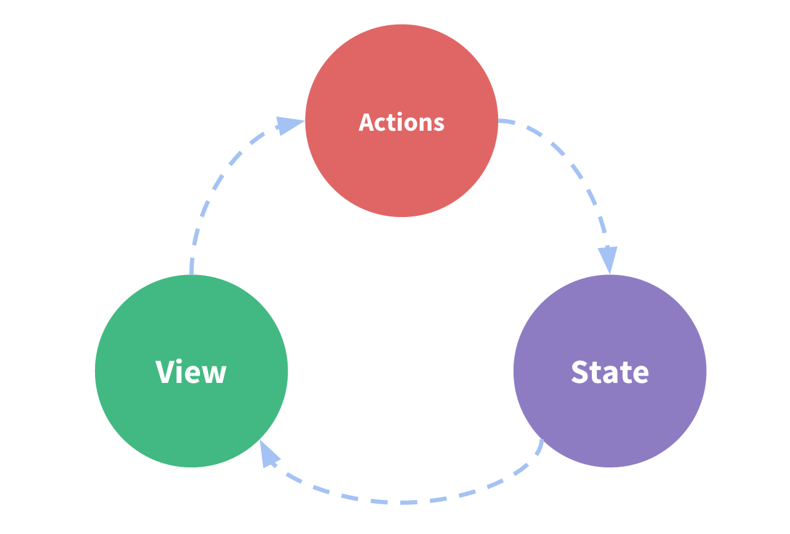
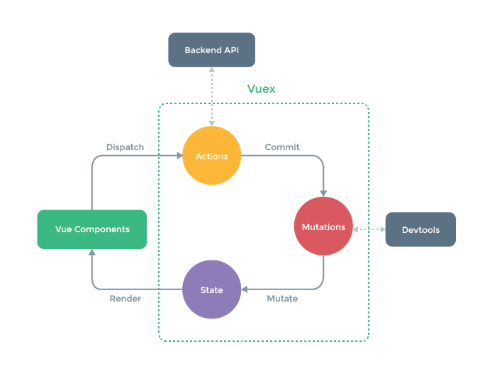

# vue其它基本插件

## vue-router

Vue.js 路由允许我们通过不同的 URL 访问不同的内容，实现多视图的单页Web应用（single page web application，SPA）。

Vue.js 路由需要载入[vue-router](https://github.com/vuejs/vue-router)库，中文文档地址：[vue-router文档](https://github.com/vuejs/vue-router)。

npm 简单的路由[实例](https://github.com/chrisvfritz/vue-2.0-simple-routing-example)：

下载完后，解压该目录并进入该目录，执行以下命令：

```sh
# 安装依赖，使用淘宝资源命令 cnpm
cnpm install
# 启动应用，地址为 localhost:8080
cnpm run dev
```

如果你需要发布到正式环境可以执行以下命令：

```sh
cnpm run build
```

执行成功后，访问 `http://localhost:8080` 查看效果

**总结：**

- 有时候，同一个路径可以匹配多个路由，此时，匹配的优先级就按照路由的定义顺序：谁先定义的，谁的优先级就最高。
- url的param之前要加"#/"才能访问定义的路由（hash模式）
- vue-router的切换不同于传统的页面的切换。路由之间的切换，其实就是组件之间的切换，不是真正的页面切换。这也会导致一个问题，就是引用相同组件的时候，会导致该组件无法更新，也就是我们口中的页面无法更新的问题了。

  >解决方法：[https://blog.csdn.net/w390058785/article/details/82813032](https://blog.csdn.net/w390058785/article/details/82813032)

- 前端路由：核心就是锚点值的改变，根据不同的值，渲染指定DOM位置的不同数据
- ui-router：锚点值改变，如何获取模板？ajax？vue中，模板数据不是通过ajax请求来，而是调用函数获取到模板内容；核心：锚点值改变
- 使用方式：
  1. 下载 `npm i vue-router -S`
  2. 在main.js中引入 `import VueRouter from 'vue-router';`
  3. 安装插件 `Vue.use(VueRouter);`
  4. 创建路由对象并配置路由规则  
  
     ```js
     let router = new VueRouter({ routes:[ {path:'/home',component:Home} ]});
     ```

  5. 将其路由对象传递给Vue的实例，options中加入 `router:router`
  6. 在app.vue中留坑 `<router-view></router-view>`

- 在vue-router中，有两大对象被挂载到了实例this：`$route`（只读、具备信息的对象）、`$router`（具备功能函数）

- 查询字符串：

  1. 去哪里

     ```html
     <router-link :to="{name:'detail',query:{id:1}} ">xxx</router-link>
     <router-link :to="{name:'detail',params:{name:1}} ">xxx</router-link>
     ```

  2. 导航（查询字符串path不用改）

     ```html
     <router-link :to="{ name: 'detail', path: '/detail', 组件 }">xxx</router-link>
     <router-link :to="{ name: 'detail', path: '/detail/:name', 组件 }">xxx</router-link>
     ```

  3. 去了干嘛，获取路由参数（要注意是query还是params和对应id名）：`this.$route.query.id`，`this.$route.params.name`

  >使用`params`，参数不会拼接在路由后面，地址栏上看不到参数。由于动态路由也是传递params的，所以在 `this.$router.push()` 方法中 `path` 不能和 `params` 一起使用，否则 `params` 将无效，需要用 name 来指定页面及通过路由配置的 name 属性访问

- `this.$router.go` 根据浏览器记录 前进1 后退-1
- `this.$router.push`（直接跳转到某个页面显示）
  - push参数：字符串 /xxx
  - 对象：`{name:'xxx', query:{id:1}, params:{name:2}}`

- 前端路由原理：
  - `window.addEventListener('hashchange', fn);`
  - 根据你放 `<router-view></router-view><div id="xxx"></div>` 作为一个DOM上的标识
  - 最终当锚点值改变触发hashchange的回调函数，我们将指定的模板数据插入到DOM标识上

- 重定向和404

  - 进入后，默认就是 /
  - 重定向 `{path:'/', redirect:'/home'}` 或 `{path:'/',redirect:{name:'home'}}`
  - 404: 路由规则的最后一个，写一个很强大的匹配： `{path:'*',component:notFoundVue}`

- 多视图：

  - 以前可以一次放一个坑对应一个路由和显示一个组件
    - 一次行为 = 一个坑 + 一个路由 + 一个组件
    - 一次行为 = 多个坑 + 一个路由 + 多个组件
  - components 多视图 是一个对象 对象内多个key和value
    - key对应视图的name属性
    - value 就是要显示的组件对象
  - 多个视图`<router-view></router-view>` -> name就是default
  - `<router-view name='xxx'></router-view>` -> name就是xxx

- 嵌套路由：

  - 用单页去实现多页应用，复杂的嵌套路由
  - 开发中一般会需要使用
  - 视图包含视图
  - 路由父子级关系路由

  ```javascript
  //期组件内包含着第一层router-view
  {
    name:'music',path:'/music',component:Music,
    children:[//子路由的path，/就是绝对路径，不/就是相对父级路径
      {name:'music.oumei',path:'oumei',component:Oumei},
      {name:'music.guochan',path:'guochan',component:Guochan}
    ]
  }  
  ```

  - 由于路由的跳转会导致整个router-view重新渲染，其中如果有些部分从未发生改变，就没有必要重新渲染，由此嵌套路由就能解决该问题。

- 编程式导航

  - 模拟类似用户点击的行为，通过程序来发生锚点值改变，从而触发后续的行为
  - 借助浏览器history历史功能向前和向后的功能
  - 在vue-router安装插件以后，就多了两个属性
    - this.$route：具备路由信息只读的 req
    - this.$router：具备相关功能 res

  ```javascript
  //跳转会home页面
  this.$router.push({
    name: 'home',
    path: '/'
  });  
  //参数可以是字符串代表path，也可以给对象（命名路由）
  //后退
  this.$router.go(-1);
  //就是用程序操作历史记录及导航栏url
  ```

- 路由操作的基本步骤

  ```javascript
  // 引入对象
  import VueRouter from 'vue-router';
  // 安装插件
  Vue.use(VueRouter); // 挂载属性的行为
  // 创建路由对象
  let router = new VueRouter({
    routes:[{ name:'xxx', path:'/xxx', 组件 }]
  });
  // 将路由对象放入到options中new Vue()
  new Vue({ router })
  ```

- 路由钩子函数

  ```javascript
  beforeRouteEnter (to, from, next) {
    // 在渲染该组件的对应路由被 confirm 前调用
    // 不！能！获取组件实例 `this`
    // 因为当钩子执行前，组件实例还没被创建
  },
  beforeRouteUpdate (to, from, next) {
    // 在当前路由改变，但是该组件被复用时调用
    // 举例来说，对于一个带有动态参数的路径 /foo/:id，在 /foo/1 和 /foo/2 之间跳转的时候，由于会渲染同样的 Foo 组件，因此组件实例会被复用。而这个钩子就会在这个情况下被调用。
    // 可以访问组件实例 `this`
  },
  beforeRouteLeave (to, from, next) {
    // 导航离开该组件的对应路由时调用
    // 可以访问组件实例 `this`
  }
  ```

## i18n

- internationalization
- 国际化
- index.html -> 中国人
- index.html -> 美国人
- vue-i18n

## wappalyzer

获取到当前网站的使用的技术：https://wappalyzer.com/download

## Vuex

**Vuex 是什么？**

Vuex 是一个专为 Vue.js 应用程序开发的状态管理模式。它采用集中式存储管理应用的所有组件的状态，并以相应的规则保证状态以一种可预测的方式发生变化。Vuex 也集成到 Vue 的官方调试工具 devtools extension，提供了诸如零配置的 time-travel 调试、状态快照导入导出等高级调试功能。

**什么是“状态管理模式”？**

让我们从一个简单的 Vue 计数应用开始：

```js
new Vue({
  // state
  data () {
    return {
      count: 0
    }
  },
  // view
  template: `
    <div>{{ count }}</div>
  `,
  // actions
  methods: {
    increment () {
      this.count++
    }
  }
})
```

这个状态自管理应用包含以下几个部分：

- state，驱动应用的数据源；
- view，以声明方式将 state 映射到视图；
- actions，响应在 view 上的用户输入导致的状态变化。

以下是一个表示“单向数据流”理念的极简示意：



但是，当我们的应用遇到多个组件共享状态时，单向数据流的简洁性很容易被破坏：

- 多个视图依赖于同一状态。
- 来自不同视图的行为需要变更同一状态。

对于问题一，传参的方法对于多层嵌套的组件将会非常繁琐，并且对于兄弟组件间的状态传递无能为力。对于问题二，我们经常会采用父子组件直接引用或者通过事件来变更和同步状态的多份拷贝。以上的这些模式非常脆弱，通常会导致无法维护的代码。

因此，我们为什么不把组件的共享状态抽取出来，以一个全局单例模式管理呢？在这种模式下，我们的组件树构成了一个巨大的“视图”，不管在树的哪个位置，任何组件都能获取状态或者触发行为！

另外，通过定义和隔离状态管理中的各种概念并强制遵守一定的规则，我们的代码将会变得更结构化且易维护。

这就是 Vuex 背后的基本思想，借鉴了 [Flux](https://facebook.github.io/flux/docs/overview.html)、[Redux](http://redux.js.org/) 和 [The Elm Architecture](https://guide.elm-lang.org/architecture/)。与其他模式不同的是，Vuex 是专门为 Vue.js 设计的状态管理库，以利用 Vue.js 的细粒度数据响应机制来进行高效的状态更新。



**什么情况下我应该使用 Vuex？**

虽然 Vuex 可以帮助我们管理共享状态，但也附带了更多的概念和框架。这需要对短期和长期效益进行权衡。

如果您不打算开发大型单页应用，使用 Vuex 可能是繁琐冗余的。确实是如此——如果您的应用够简单，您最好不要使用 Vuex。一个简单的 [store 模式](https://cn.vuejs.org/v2/guide/state-management.html#%E7%AE%80%E5%8D%95%E7%8A%B6%E6%80%81%E7%AE%A1%E7%90%86%E8%B5%B7%E6%AD%A5%E4%BD%BF%E7%94%A8)就足够您所需了。但是，如果您需要构建一个中大型单页应用，您很可能会考虑如何更好地在组件外部管理状态，Vuex 将会成为自然而然的选择。引用 Redux 的作者 Dan Abramov 的话说就是：

>Flux 架构就像眼镜：您自会知道什么时候需要它。

### 安装

- 直接下载 / CDN 引用：https://unpkg.com/vuex

  Unpkg.com 提供了基于 NPM 的 CDN 链接。以上的链接会一直指向 NPM 上发布的最新版本。您也可以通过 https://unpkg.com/vuex@2.0.0 这样的方式指定特定的版本。

  在 Vue 之后引入 vuex 会进行自动安装：

  ```html
  <script src="/path/to/vue.js"></script>
  <script src="/path/to/vuex.js"></script>
  ```

- NPM

  ```sh
  npm install vuex --save
  ```

- Yarn

  ```sh
  yarn add vuex
  ```

  在一个模块化的打包系统中，您必须显式地通过 Vue.use() 来安装 Vuex：

  ```js
  import Vue from 'vue'
  import Vuex from 'vuex'

  Vue.use(Vuex)
  ```

  当使用全局 script 标签引用 Vuex 时，不需要以上安装过程。

- Promise

  Vuex 依赖 Promise。如果你支持的浏览器并没有实现 Promise (比如 IE)，那么你可以使用一个 polyfill 的库，例如 es6-promise。

  你可以通过 CDN 将其引入：

  ```html
  <script src="https://cdn.jsdelivr.net/npm/es6-promise@4/dist/es6-promise.auto.js"></script>
  ```

  然后 window.Promise 会自动可用。

  如果你喜欢使用诸如 npm 或 Yarn 等包管理器，可以按照下列方式执行安装：

  ```sh
  npm install es6-promise --save # npm
  yarn add es6-promise # Yarn
  ```

  或者更进一步，将下列代码添加到你使用 Vuex 之前的一个地方：

  ```js
  import 'es6-promise/auto'
  ```

- 自己构建

  如果需要使用 dev 分支下的最新版本，您可以直接从 GitHub 上克隆代码并自己构建。

  ```sh
  git clone https://github.com/vuejs/vuex.git node_modules/vuex
  cd node_modules/vuex
  npm install
  npm run build
  ```

### 开始

每一个 Vuex 应用的核心就是 store（仓库）。"store"基本上就是一个容器，它包含着你的应用中大部分的状态 (state)。Vuex 和单纯的全局对象有以下两点不同：

1.	Vuex 的状态存储是响应式的。当 Vue 组件从 store 中读取状态的时候，若 store 中的状态发生变化，那么相应的组件也会相应地得到高效更新。

2.	你不能直接改变 store 中的状态。改变 store 中的状态的唯一途径就是显式地提交 (commit) mutation。这样使得我们可以方便地跟踪每一个状态的变化，从而让我们能够实现一些工具帮助我们更好地了解我们的应用。

**最简单的 Store**

>提示： 我们将在后续的文档示例代码中使用 ES2015 语法。如果你还没能掌握 ES2015，你得抓紧了！安装 Vuex 之后，让我们来创建一个 store。创建过程直截了当——仅需要提供一个初始 state 对象和一些 mutation：

```js
// 如果在模块化构建系统中，请确保在开头调用了 Vue.use(Vuex)
const store = new Vuex.Store({
  state: {
    count: 0
  },
  mutations: {
    increment (state) {
      state.count++
    }
  }
})
```

现在，你可以通过 store.state 来获取状态对象，以及通过 store.commit 方法触发状态变更：

```js
store.commit('increment')
console.log(store.state.count) // -> 1
```

再次强调，我们通过提交 mutation 的方式，而非直接改变 store.state.count，是因为我们想要更明确地追踪到状态的变化。这个简单的约定能够让你的意图更加明显，这样你在阅读代码的时候能更容易地解读应用内部的状态改变。此外，这样也让我们有机会去实现一些能记录每次状态改变，保存状态快照的调试工具。有了它，我们甚至可以实现如时间穿梭般的调试体验。

由于 store 中的状态是响应式的，在组件中调用 store 中的状态简单到仅需要在计算属性中返回即可。触发变化也仅仅是在组件的 methods 中提交 mutation。

这是一个最基本的 Vuex 记数应用示例。接下来，我们将会更深入地探讨一些核心概念。让我们先从 State 概念开始。

### State

**单一状态树**

Vuex 使用单一状态树——是的，用一个对象就包含了全部的应用层级状态。至此它便作为一个“唯一数据源 (SSOT)”而存在。这也意味着，每个应用将仅仅包含一个 store 实例。单一状态树让我们能够直接地定位任一特定的状态片段，在调试的过程中也能轻易地取得整个当前应用状态的快照。

单状态树和模块化并不冲突——在后面的章节里我们会讨论如何将状态和状态变更事件分布到各个子模块中。

**在 Vue 组件中获得 Vuex 状态**

那么我们如何在 Vue 组件中展示状态呢？由于 Vuex 的状态存储是响应式的，从 store 实例中读取状态最简单的方法就是在计算属性中返回某个状态：

```js
// 创建一个 Counter 组件
const Counter = {
  template: `<div>{{ count }}</div>`,
  computed: {
    count () {
      return store.state.count
    }
  }
}
```

每当 store.state.count 变化的时候，都会重新求取计算属性，并且触发更新相关联的 DOM。然而，这种模式导致组件依赖全局状态单例。在模块化的构建系统中，在每个需要使用 state 的组件中需要频繁地导入，并且在测试组件时需要模拟状态。

Vuex 通过 store 选项，提供了一种机制将状态从根组件“注入”到每一个子组件中（需调用 Vue.use(Vuex)）：

```js
const app = new Vue({
  el: '#app',
  // 把 store 对象提供给 "store" 选项，这可以把 store 的实例注入所有的子组件
  store,
  components: { Counter },
  template: `
    <div class="app">
      <counter></counter>
    </div>
  `
})
```

通过在根实例中注册 store 选项，该 store 实例会注入到根组件下的所有子组件中，且子组件能通过 this.$store 访问到。让我们更新下 Counter 的实现：

```js
const Counter = {
  template: `<div>{{ count }}</div>`,
  computed: {
    count () {
      return this.$store.state.count
    }
  }
}
```

**mapState 辅助函数**

当一个组件需要获取多个状态时候，将这些状态都声明为计算属性会有些重复和冗余。为了解决这个问题，我们可以使用 mapState 辅助函数帮助我们生成计算属性，让你少按几次键：

```js
// 在单独构建的版本中辅助函数为 Vuex.mapState
import { mapState } from 'vuex'
export default {
  // ...
  computed: mapState({
    // 箭头函数可使代码更简练
    count: state => state.count,
    // 传字符串参数 'count' 等同于 `state => state.count`
    countAlias: 'count',
    // 为了能够使用 `this` 获取局部状态，必须使用常规函数
    countPlusLocalState (state) {
      return state.count + this.localCount
    }
  })
}
```

当映射的计算属性的名称与 state 的子节点名称相同时，我们也可以给 mapState 传一个字符串数组。

```js
computed: mapState([
  // 映射 this.count 为 store.state.count
  'count'
])
```

**对象展开运算符**

mapState 函数返回的是一个对象。我们如何将它与局部计算属性混合使用呢？通常，我们需要使用一个工具函数将多个对象合并为一个，以使我们可以将最终对象传给 computed 属性。但是自从有了对象展开运算符（现处于 ECMASCript 提案 stage-4 阶段），我们可以极大地简化写法：

```js
computed: {
  localComputed () { /* ... */ },
  // 使用对象展开运算符将此对象混入到外部对象中
  ...mapState({
    // ...
  })
}
```

**组件仍然保有局部状态**

使用 Vuex 并不意味着你需要将所有的状态放入 Vuex。虽然将所有的状态放到 Vuex 会使状态变化更显式和易调试，但也会使代码变得冗长和不直观。如果有些状态严格属于单个组件，最好还是作为组件的局部状态。你应该根据你的应用开发需要进行权衡和确定。
