# Angular

## 目录

1. 简介
   - [禅道理念](#禅道理念)
   - [运行条件](#运行条件)
   - [Angular架构](#Angular架构)
   - [核心概念模型](#核心概念模型)
   - [浏览器兼容性](#浏览器兼容性)
2. [创建项目示例](#创建项目示例)
   - [一些常见的坑](#一些常见的坑)
   - [模块](#模块)
   - [组件](#组件)
   - [把CSS预编译器改成SASS](#把CSS预编译器改成SASS)
   - [模板](#模板)
     - 轻逻辑 / 八字胡 / 绑定 / 指令 / 管道
   - [组件通讯](#组件通讯)
     - 直接调用 / @Input和@Output / Service单例
3. 项目总结与参考
   - [爬坑](#爬坑)

Angular 是 Google 开源出来的一套 js 工具，简称为 ng。

老版本使用 AngularJS 指代，所有新版本都叫做 Angular。原因很好理解，因为老版本是用 JS 开发的，所以带一个 JS 后缀，而新版本是基于 TypeScript 的，带 JS 后缀不合适。

## 禅道理念

Angular信奉的是，当`组建视图(UI)`同时又要写`软件逻辑`时，`声明式`的代码会比`命令式`的代码好得多，尽管命令式的代码非常适合用来表述业务逻辑。

- 将DOM操作和应用逻辑解耦是一种非常好的思路，它能大大改善代码的可调性；
- 将测试和开发同等看待是一种非常非常好的思路，测试的难度在很大程度上取决于代码的结构；
- 将客户端和服务器端解耦是一种特别好的做法，它能使两边并行开发，并且使两边代码都能实现重用；
- 如果框架能够在整个开发流程里都引导着开发者：从设计UI，到编写业务逻辑，再到测试，那对开发者将是极大的帮助；
- “化繁为简，化简为零”总是好的。

## 运行条件

由于目前各种环境（浏览器或 Node）暂不支持ES6的代码，所以需要一些shim和polyfill（IE需要）让ES6写的代码能够转化为ES5形式并可以正常运行在浏览器中。

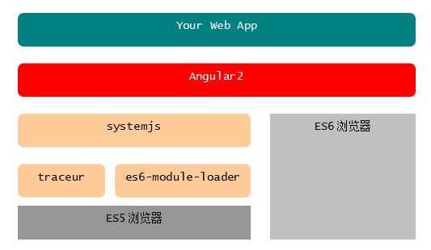

从上图可以看出在 Es5 浏览器下需要以下模块加载器：

- systemjs - 通用模块加载器，支持AMD、CommonJS、ES6等各种格式的JS模块加载。
- es6-module-loader - ES6模块加载器，systemjs会自动加载这个模块。
- traceur - ES6转码器，将ES6代码转换为当前浏览器支持的ES5代码，systemjs会自动加载 这个模块。

如果你用过其他前端框架的话，就知道手动配置这些东西有多痛苦了，那一坨配置文件没有半天功夫是搞不定的。Angular 项目组从一开始就注意到了这个问题，因此有了 @angular/cli 这个神器

```sh
npm i -g cnpm --registry=https://registry.npm.taobao.org
cnpm i -g @angular/cli
```

cnpm 是淘宝发布的一款工具，会自动把 npm 上面的所有包定时同步到国内的服务器上来（目前大约 10 分钟全量同步一次），cnpm 本身也是一款 Node.js 模块。由于 cnpm 的服务器在国内，因而中文开发者用它装东西比较快。除了定时同步 npm 模块之外，cnpm 还做了一些其他的事情，比如把某些包预先编译好了缓存在服务器上，这样就不用拉源码到你本地进行编译了。有人抱怨使用 cnpm 安装的目录结构和 npm 不同，包括还有其他一些小坑，如果你非常在意这些，可以使用 `nrm` 来管理多个 registry。nrm 本身也是一个 Node.js 模块，你可以这样安装：

```sh
npm i -g nrm
```

然后你就可以用 nrm 来随时切换 registry 了，比如：

```sh
nrm use cnpm
```

@angular/cli 安装成功之后你的终端里面将会多出一个名叫 ng 的命令

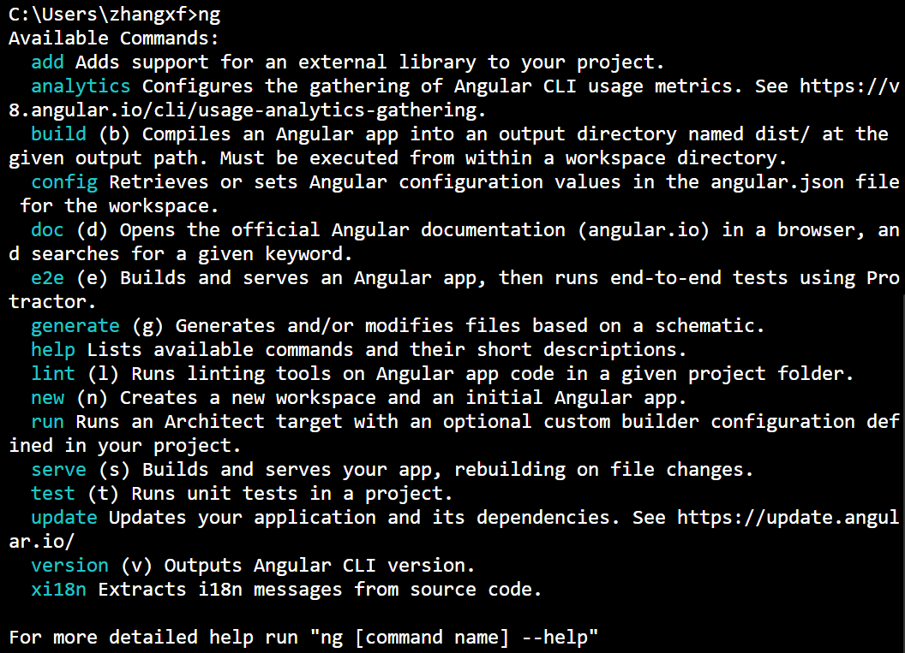

6.0 的时候 @angular/cli 新增了一个命令 ng add。

```sh
ng add @angular/material
```

**Schematics 代码生成器：**

@angular/cli 内部用来自动生成代码的工具叫做 Schematics ：当我们使用 `ng g c \<组件名>` 的时候，它实际上调用了底层的 Schematics 来生成组件对应的 4 个文件。

Schematics 是框架无关的，它可以脱离 Angular 环境使用，因此你也可以把它单独拿出来，用来自动生成其他框架的代码。为了演示自定义 Schematic 的方法，请看运行效果：

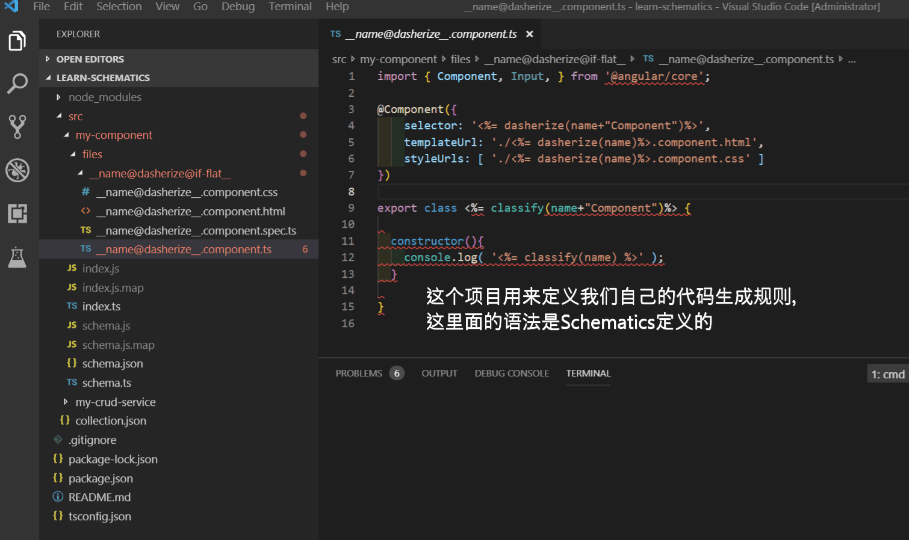

**请特别注意：由于 @angular/schematics 是 cli 工具的组成部分，它的版本号与 cli 之间有对应关系。因此，如果你不确定对应关系是什么，请不要修改示例项目中的 package.json！**

你可以利用 Schematics 来创建自己的代码生成器，可以参考以下步骤：

- npm i -g @angular-devkit/schematics-cli
- 用 schematics 命令创建一个新项目 schematics blank --name=learn-schematics
- 创建 schema.json 和 schema.ts 接口，修改 collection.json，指向自己创建的 shema.json 配置文件
- 修改 index.ts ，加一些生成代码的逻辑，可以参考 @angluar/cli 内部的代码
- 创建 files 目录和模板文件，目录名和文件名本身也可以参数化
- 构建项目：npm run build
- 链接到全局，方便本地调试：npm link
- 准备测试 schema ，用 @angular/cli 创建一个全新的项目 test-learn-schematics 并装好依赖。cd 到新项目 test-learn-schematics，链接 npm link learn-schematics，然后尝试用我们自定义的规则来生成一个组件 ng g my-component My --service --name="damo" --collection learn-schematics --force

**Workspace与多项目支持：**

从 6.0 开始，@angular/cli 支持 workspace 特性，之所以能支持 workspace，也是因为背后有 Schematics 这个底层的工具。

有了 workspace 这个机制之后，可以在一个项目里面配置多个子项目，cli 会根据里面的配置进行依赖管理、校验、编译等等操作。

## Angular架构

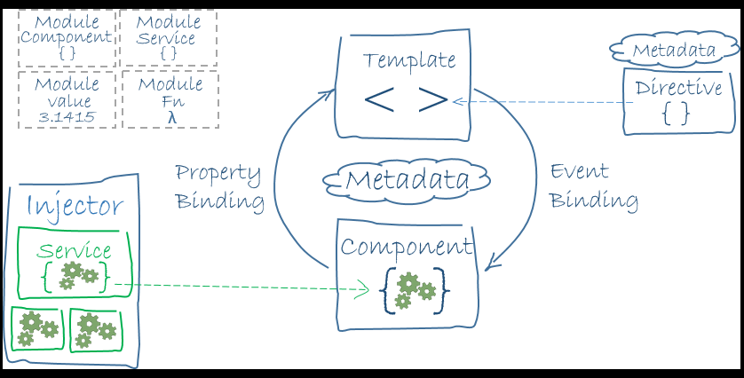

## 核心概念模型

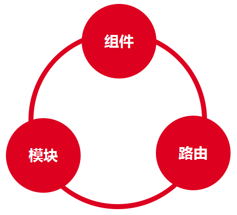

- Component（组件）是整个框架的核心，也是终极目标。“组件化”的意义有 2 个：第一是分治，因为有了组件之后，我们可以把各种逻辑封装在组件内部，避免混在一起；第二是复用，封装成组件之后不仅可以在项目内部复用，而且可以沉淀下来跨项目复用。
- NgModule（模块）是组织业务代码的利器，按照你自己的业务场景，把组件、服务、路由打包到模块里面，形成一个个的积木块，然后再用这些积木块来搭建出高楼大厦。
- Router（路由）的角色也非常重要，它有 3 个重要的作用：第一是封装浏览器的 History 操作；第二是负责异步模块的加载；第三是管理组件的生命周期。

## 浏览器兼容性

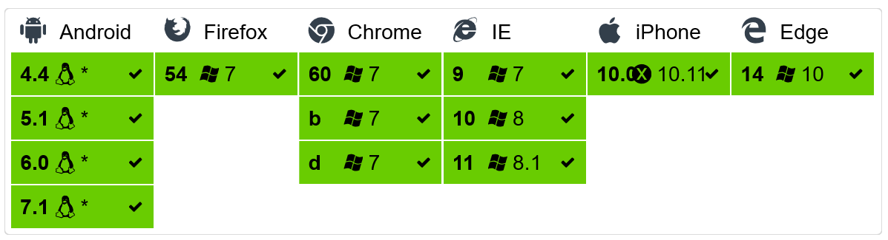

- 第一个事实是：天猫已经于 2016 年 4 月宣布放弃支持 IE6、7、8。而根据百度流量研究院的统计，截止到 2019 年 5 月，IE8 以下的浏览器在国内也只有 5.69% 的份额了

  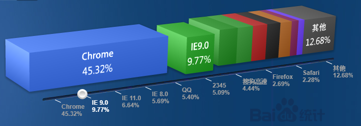

  [数据来源](http://tongji.baidu.com/data/browser)，不值得为了这么少的市场份额付出那么多的研发和维护成本。

- 第二个事实是：截至 2019 年 5 月底，Chrome 的全球市场份额已经高达 61.06%，加上 Safari 、Firefox 的份额，所有这些能完美支持 Web 标准的浏览器加起来，份额已经远远超过 80%。

  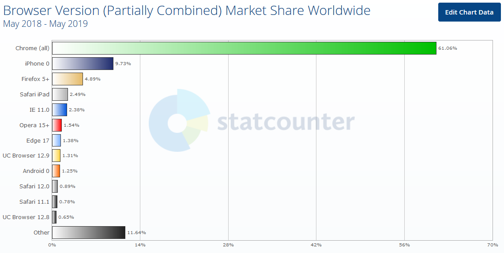

  [数据来源](http://gs.statcounter.com/browser-market-share)

- 第三个事实是：微软 2018 年底宣布，后续新的浏览器会采用 Chromium 内核，并且已经与 2019 年初给出了预览版。如果有兴趣，[可以到微软的官方网站来下载](https://www.microsoftedgeinsider.com/en-us/)。这就意味着，到 2019 年底的时候，基于 Chrome 内核的浏览器全球市场份额将会达到 85% 左右。因此，请不要再花那么多钱和时间来解决“浏览器兼容性问题”了，后面根本就不存在这个问题！

  

## 创建项目示例

创建项目 beauty（真美），请在你的终端里面运行：

```sh
ng new beauty
```

>**注意**：@angular/cli 在自动生成好项目骨架之后，会立即自动使用 npm 来安装所依赖的 Node 模块，因此这里我们要 Ctrl+C 终止掉，然后自己进入项目的根目录，使用 cnpm 来进行安装。

安装完成之后，使用 `ng serve` 命令启动项目

**请注意以下几点：**

- 如果你需要修改端口号，可以用 `ng serve --port ****` 来进行指定。
- `ng serve --open` 可以自动打开你默认的浏览器。
- 如果你想让编译的包更小一些，可以使用 `ng serve --prod`，@angular/cli 会启用 TreeShaking 特性，加了参数之后编译的过程也会慢很多。因此，在正常的开发过程里面请不要加 --prod 参数。
- `ng serve` 是在内存里面生成项目，如果你想看到项目编译之后的产物，请运行 `ng build`。构建最终产品版本可以加参数，`ng build --prod`。

ng 提供了很多非常好用的工具，除了可以利用 ng new 来自动创建项目骨架之外，它还可以帮助我们创建 Angular 里面所涉及到的很多模块，最常用的几个如下。

- 自动创建组件：`ng generate component MyComponent`，可以简写成 `ng g c MyComponent`。创建组件的时候也可以带路径，如 `ng generate component mydir/MyComponent`
- 自动创建指令：`ng g d MyDirective`
- 自动创建服务：`ng g s MyService`
- 构建项目：`ng build`，如果你想构建最终的产品版本，可以用 `ng build --prod`

更多的命令和参数请在终端里面敲 `ng g --help` 仔细查看，尽快熟悉这些工具可以非常显著地提升你的编码效率。

### 一些常见的坑

@angular/cli 这种“全家桶”式的设计带来了很大的方便，同时也有一些人不太喜欢，因为很多底层的东西被屏蔽掉了，开发者不能天马行空地自由发挥。比如，@angular/cli 把底层 webpack 的配置文件屏蔽掉了，很多喜欢自己手动配 webpack 的开发者就感到很不爽。

对于国内的开发者来说，上面这些其实不是最重要的，国内开发者碰到的坑主要是由两点引起的：

- 第一点是网络问题，比如 node-sass 这个模块你很有可能就安装不上，原因你懂的；
- 第二点是开发环境导致的问题，国内使用 Windows 平台的开发者比例依然巨大，而 @angular/cli 在 Windows 平台上有一些非常恶心的依赖，比如它需要依赖 Python 环境、Visual Studio 环境，这是因为某些 Node.js 的模块需要下载到你的本地进行源码编译。

因此，如果你的开发平台是 Windows，请特别注意：

- 如果你知道如何给 npm 配置代理，也知道如何翻墙，请首选 npm 来安装@angular/cli 。
- 否则，请使用 cnpm 来安装 @angular/cli，原因有三：（1）cnpm 的缓存服务器在国内，你装东西的速度会快很多；（2）用 cnpm 可以帮你避开某些模块装不上的问题，因为它在服务器上面做了缓存；（3）cnpm 还把一些包都预编译好了缓存在服务端，比如 node-sass。使用 cnpm 不需要在你本地进行源码编译，因此你的机器上可以没有那一大堆麻烦的环境。
- 推荐装一个 nrm 来自动切换 registry：npm i -g nrm。
- 如果 cli 安装失败，请手动把 node_modules 目录删掉重试一遍，全局的 @angular/cli 也需要删掉重装，cnpm uninstall -g @angular/cli。
- 如果 node_modules 删不掉，爆出路径过长之类的错误，请尝试用一些文件粉碎机之类的工具强行删除。这是 npm 的锅，与 Angular 无关。
- 最新版本的 @angular/cli 经常会有 bug，尤其是在 Windows 平台上面，因此请不要追新版本追太紧。如果你发现了莫名其妙的问题，请尝试降低一个主版本试试。这一点非常重要，很多初学者会非常困惑，代码什么都没改，就升级了一下环境，然后就各种编译报错。如果你愿意，去官方提 issue 是个很不错的办法。
- 对于 MAC 用户或者 *nix 用户，请特别注意权限问题，命令前面最好加上 sudo，保证有 root 权限。
- 无论你用什么开发环境，安装的过程中请仔细看 log。很多朋友没有看 log 的习惯，报错的时候直接懵掉，根本不知道发生了什么。

### 模块

模块：`NgModules`；根模块：`AppModule`。

几个重要的属性如下：

- declarations （声明） - 视图类属于这个模块。 Angular 有三种类型的视图类： 组件、指令 和 管道。
- exports - 声明 的子集，可用于其它模块中的组件模板。
- imports - 本模块组件模板中需要由其它导出类的模块。
- providers - 服务的创建者。本模块把它们加入全局的服务表中，让它们在应用中的任何部分都可被访问到。
- bootstrap - 应用的主视图，称为根组件，它是所有其它应用视图的宿主。只有根模块需要设置 bootstrap 属性中。

### 组件

```js
import { Component } from '@angular/core';

/**
 * @Component 是一个 Decorator（装饰器），其作用类似于 Java 里面的 Annotation（注解）。
 * selector：组件的标签名，外部使用者可以这样来使用以上组件：<app-root>。默认情况下，ng 命令生成出来的组件都会带上一个 app 前缀，如果你不喜欢，可以在 angular-cli.json 里面修改 prefix 配置项，设置为空字符串将会不带任何前缀。
 * templateUrl：引用外部 HTML 模板。如果你想直接编写内联模板，可以使用 template，支持 ES6 引入的“模板字符串”写法。
 * styleUrls：引用外部 CSS 样式文件，这是一个数组，也就意味着可以引用多份 CSS 文件
 */
@Component({
  selector: 'app-root',
  templateUrl: './app.component.html',
  styleUrls: ['./app.component.css']
})
export class AppComponent { // 这是 ES6 里面引入的模块和 class 定义方式
  title = 'beauty';
}
```

- 组件是一个模板的控制类用于处理应用和逻辑页面的视图部分。
- 组件是构成 Angular 应用的基础和核心，可用于整个应用程序中。
- 组件知道如何渲染自己及配置依赖注入。
- 组件通过一些由属性和方法组成的 API 与视图交互。

创建 Angular 组件的方法有三步：

1. 从 @angular/core 中引入 Component 修饰器
2. 建立一个普通的类，并用 @Component 修饰它
3. 在 @Component 中，设置 selector 自定义标签，以及 template 模板

### 把CSS预编译器改成SASS

SASS 是一款非常好用的 CSS 预编译器，Bootstrap 官方从 4.0 开始已经切换到了 SASS。

- 创建项目的时候指定
- 手动修改

  1. angular-cli.json 里面的 styleExt 改成 scss
  2. angular-cli.json 里面的 styles.css 后缀改成 .scss
  3. src 下面 style.css 改成 style.scss
  4. app.component.scss，app.component.ts 里面对应修改

SASS 只是一个预编译器，它支持所有 CSS 原生语法。利用 SASS 可以提升你的 CSS 编码效率，增强 CSS 代码的可维护性，但是千万不要幻想从此就可以不用学习 CSS 基础知识了。

### 模板

模板是编写 Angular 组件最重要的一环，你必须深入理解以下知识点才能玩转 Angular 模板：

- 对比各种 JS 模板引擎的设计思路
- Mustache（八字胡）语法
- 模板内的局部变量
- 属性绑定、事件绑定、双向绑定
- 在模板里面使用结构型指令 *ngIf、*ngFor、ngSwitch
- 在模板里面使用属性型指令 NgClass、NgStyle、NgModel
- 在模板里面使用管道格式化数据
- 一些小 feature：安全导航、非空断言

**“深入理解”的含义是：你需要很自如地运用这些 API，写代码的时候不翻阅 API 文档。因为很多新手之所以编码效率不高，其中一个主要的原因就是在编码过程中不停翻文档、查资料。**

#### 对比各种 JS 模板引擎的设计思路

几乎每一款前端框架都会提供自己的模板语法：

- 在 jQuery 如日中天的时代，有 Handlebars 那种功能超强的模板
- React 推崇 JSX 模板语法
- 当然还有 Angular 提供的那种与“指令”紧密结合的模板语法

综合来说，无论是哪一种前端模板，大家都比较推崇“轻逻辑”（logic-less）的设计思路。

**何为“轻逻辑”？**

简而言之，所谓“轻逻辑”就是说，你不能在模板里面编写非常复杂的 JavaScript 表达式。比如，Angular 的模板语法就有规定：

- 你不能在模板里面 new 对象
- 不能使用 =、+=、-= 这类的表达式
- 不能用 ++、-- 运算符
- 不能使用位运算符

**为什么要“轻逻辑”？**

**最重要的原因是怕影响运行性能，因为模板可能会被执行很多次。**

比如你编写了以下 Angular 模板：

```html
<ul>
    <li *ngFor="let race of races">
        {{race.name}}
    </li>
</ul>
```

很明显，浏览器不认识 *ngFor 和 {{...}} 这种语法，因此必须在浏览器里面进行“编译”，获得对应的模板函数，然后再把数据传递给模板函数，最终结合起来获得一堆 HTML 标签，然后才能把这一堆标签插入到 DOM 树里面去。

如果启用了 AOT，处理的步骤有一些变化，@angular/cli 会对模板进行“静态编译”，避免在浏览器里面动态编译的过程。

而 Handlebars 这种模板引擎完全是运行时编译模板字符串的，你可以编写以下代码：

```js
//定义模板字符串
var source=`
<ul>
    {{#each races}}
        <li>{{name}}</li>
    {{/each}}
</ul>
`;

//在运行时把模板字符串编译成 JS 函数
var templateFn=Handlebars.compile(source);

//把数据传给模板函数，获得最终的 HTML
var html=templateFn([
    {name:'人族'},
    {name:'神族'},
    {name:'虫族'}
]);
```

注意到 Handlebars.compile 这个调用了吧？这个地方的本质是在运行时把模板字符串“编译”成了一个 JS 函数。

鉴于 JS 解释执行的特性，你可能会担忧这里会有性能问题。这种担忧是合理的，但是 Handlebars 是一款非常优秀的模板引擎，它在内部做了各种优化和缓存处理。模板字符串一般只会在第一次被调用的时候编译一次，Handlebars 会把编译好的函数缓存起来，后面再次调用的时候会从缓存里面获取，而不会多次进行“编译”。

上面我们多次提到了“编译”这个词，因此很显然这里有一个东西是无法避免的，那就是我们必须提供一个 JS 版的“编译器”，让这个“编译器”运行在浏览器里面，这样才能在运行时把用户编写的模板字符串“编译”成模板函数。

有一些模板引擎会真的去用 JS 编写一款“编译器”出来，比如 Angular 和 Handlebars，它们都真的编写了一款 JS（TS）版的编译器。而有一些简单的模板引擎，例如 Underscore 里面的模板函数，只是用正则表达式做了字符串替换而已，显得特别简陋。这种简陋的模板引擎对模板的写法有非常多的限制，因为它不是真正的编译器，能支持的语法特性非常有限。

因此，评估一款模板引擎的强弱，最核心的东西就是评估它的“编译器”做得怎么样。但是不管怎么说，毕竟是 JS 版的“编译器”，我们不可能把它做得像 G++ 那么强大，也没有必要做得那么强大，因为这个 JS 版的编译器需要在浏览器里面运行，搞得太复杂浏览器拖不动！

以上就是为什么大多数模板引擎都要强调“轻逻辑”的最根本原因。

对于 Angular 来说，强调“轻逻辑”还有另一个原因：在组件的整个生命周期里面，模板函数会被执行很多次。你可以想象，Angular 每次要刷新组件外观的时候，都需要去调用一下模板函数，如果你在模板里面编写了非常复杂的代码，一定会增加渲染时间，用户一定会感到界面有“卡顿”。

人眼的视觉延迟大约是 100ms 到 400ms 之间，如果整个页面的渲染时间超过 400ms，界面基本上就卡得没法用了。有一些做游戏的开发者会追求 60fps 刷新率的细腻感觉，60 分之 1 秒约等于 16.7ms，如果 UI 整体的渲染时间超过了 16.7ms，就没法达到这个要求了。

轻逻辑（logic-less）带来了效率的提升，也带来了一些不方便，比如很多模板引擎都实现了 if 语句，但是没有实现 else，因此开发者们在编写复杂业务逻辑的时候模板代码会显得非常啰嗦。

目前来说，并没有完美的方案能同时兼顾运行效率和语法表现能力，这里只能取一个平衡。

#### Mustache 语法

Mustache 语法也就是你们说的双花括号语法 {{...}}，老外觉得它像八字胡子，很奇怪啊，难道老外喜欢侧着头看东西？

好消息是，很多模板引擎都接受了 Mustache 语法，这样一来学习量又降低了不少，开心吧？

关于 Mustache 语法，你需要掌握 3 点：

- 它可以获取到组件里面定义的属性值
- 它可以自动计算简单的数学表达式，如加减乘除、取模
- 它可以获得方法的返回值

#### 模板内的局部变量

```html
<input #heroInput>
<p>{{heroInput.value}}</p>
```

有一些朋友会追问，如果我在模板里面定义的局部变量和组件内部的属性重名会怎么样呢？

如果真的出现了重名，Angular 会按照以下优先级来进行处理：

**模板局部变量 > 指令中的同名变量 > 组件中的同名属性。**

#### 值绑定

方括号

```html

```

```js
public imgSrc:string="./assets/imgs/1.jpg";
```

很明显，这种绑定是单向的。

#### 事件绑定

圆括号

```html
<button class="btn btn-success" (click)="btnClick($event)">测试事件</button>
```

```js
public btnClick(event):void{
    alert("测试事件绑定！");
}
```

#### 双向绑定

方括号里面套一个圆括号

```html
<font-resizer [(size)]="fontSizePx"></font-resizer>
```

```js
public fontSizePx:number=14;
```

AngularJS 是第一个把“双向数据绑定”这个特性带到前端来的框架，这也是 AngularJS 当年最受开发者追捧的特性，之一。

根据 AngularJS 团队当年讲的故事，“双向数据绑定”这个特性可以大幅度压缩前端代码的规模。大家可以回想一下 jQuery 时代的做法，如果要实现类似的效果，是不是要自己去编写大量的代码？尤其是那种大规模的表单，一大堆的赋值和取值操作，都是非常丑陋的“面条”代码，而有了“双向数据绑定”特性之后，一个绑定表达式就搞定。

目前，主流的几款前端框架都已经接受了“双向数据绑定”这个特性。

当然，也有一些人不喜欢“双向数据绑定”，还有人专门写了文章来进行批判，也算是前端一景。

#### 在模板里面使用结构型指令

Angular 有 3 个内置的结构型指令：*ngIf、*ngFor、ngSwitch。ngSwitch 的语法比较啰嗦，使用频率小一些。

*ngIf 代码实例：

```html
<p *ngIf="isShow" style="background-color:#ff3300">显示还是不显示？</p>
<button class="btn btn-success" (click)="toggleShow()">控制显示隐藏</button>
```

```js
public isShow:boolean=true;

public toggleShow():void{
    this.isShow=!this.isShow;
}
```

*ngFor 代码实例：

```html
<li *ngFor="let race of races;let i=index;">
    {{i+1}}-{{race.name}}
</li>
```

```js
public races:Array=[
    {name:"人族"},
    {name:"虫族"},
    {name:"神族"}
];
```

*ngSwitch 代码实例：

```html
<div [ngSwitch]="mapStatus">
    <p *ngSwitchCase="0">下载中...</p>
    <p *ngSwitchCase="1">正在读取...</p>
    <p *ngSwitchDefault>系统繁忙...</p>
</div>
```

```js
public mapStatus:number=1;
```

**特别注意：一个 HTML 标签上只能同时使用一个结构型的指令。**

因为“结构型”指令会修改 DOM 结构，如果在一个标签上使用多个结构型指令，大家都一起去修改 DOM 结构，到时候到底谁说了算？

那么需要在同一个 HTML 上使用多个结构型指令应该怎么办呢？有两个办法：

- 加一层空的 div 标签
- 加一层 `<ng-container>`

#### 在模板里面使用属性型指令

使用频率比较高的 3 个内置指令是：NgClass、NgStyle、NgModel。

NgClass 使用案例代码：

```html
<div [ngClass]="currentClasses">同时批量设置多个样式</div>
<button class="btn btn-success" (click)="setCurrentClasses()">设置</button>
```

```js
public currentClasses: {};

public canSave: boolean = true;
public isUnchanged: boolean = true;
public isSpecial: boolean = true;

setCurrentClasses() {
    this.currentClasses = {
        'saveable': this.canSave,
        'modified': this.isUnchanged,
        'special': this.isSpecial
    };
}
```

```css
.saveable{
    font-size: 18px;
}
.modified {
    font-weight: bold;
}
.special{
    background-color: #ff3300;
}
```

NgStyle 使用案例代码：

```html
<div [ngStyle]="currentStyles">
    用NgStyle批量修改内联样式！
</div>
<button class="btn btn-success" (click)="setCurrentStyles()">设置</button>
```

```js
public currentStyles: {}
public canSave:boolean=false;
public isUnchanged:boolean=false;
public isSpecial:boolean=false;

setCurrentStyles() {
    this.currentStyles = {
        'font-style':  this.canSave      ? 'italic' : 'normal',
        'font-weight': !this.isUnchanged ? 'bold'   : 'normal',
        'font-size':   this.isSpecial    ? '36px'   : '12px'
    };
}
```

ngStyle 这种方式相当于在代码里面写 CSS 样式，比较丑陋，违反了注意点分离的原则，而且将来不太好修改，非常不建议这样写。

NgModel 使用案例代码：

```html
<p class="text-danger">ngModel只能用在表单类的元素上面</p>
    <input [(ngModel)]="currentRace.name">
<p>{{currentRace.name}}</p>
```

```js
public currentRace:any={name:"随机种族"};
```

**请注意，如果你需要使用 NgModel 来进行双向数据绑定，必须要在对应的模块里面 import FormsModule。**

#### 管道

管道的一个典型作用是用来格式化数据，来一个最简单的例子：

```html
{{currentTime | date:'yyyy-MM-dd HH:mm:ss'}}
```

```js
public currentTime: Date = new Date();
```

Angular 里面一共内置了 17 个指令（有一些已经过时了）：

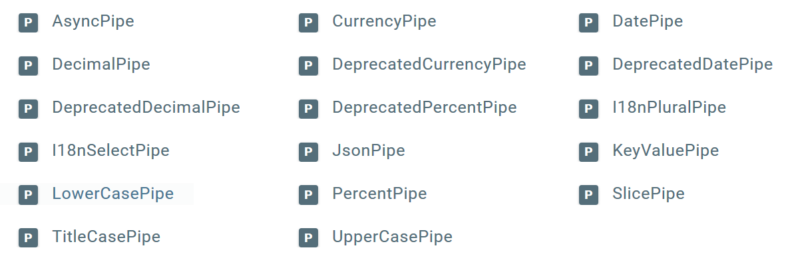

在复杂的业务场景里面，17 个指令肯定不够用，如果需要自定义指令，请查看这里的例子：[https://angular.io/guide/pipes](https://angular.io/guide/pipes)。

管道还有另一个典型的作用，就是用来做国际化，后面有一个独立的小节专门演示 Angular 的国际化写法。

### 组件通讯

组件就像零散的积木，我们需要把这些积木按照一定的规则拼装起来，而且要让它们互相之间能进行通讯，这样才能构成一个有机的完整系统。

在真实的应用中，组件最终会构成树形结构，就像人类社会中的家族树一样：

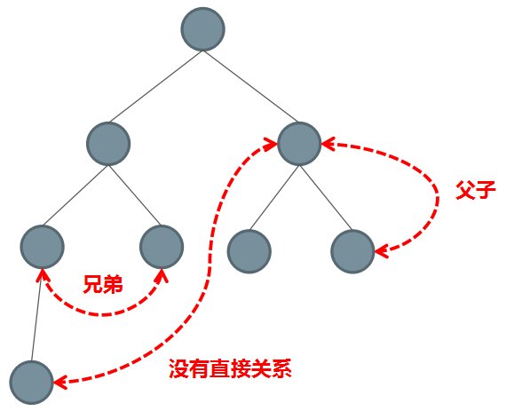

在树形结构里面，组件之间有几种典型的关系：父子关系、兄弟关系、没有直接关系。

相应地，组件之间有以下几种典型的通讯方案：

- 直接的父子关系：父组件直接访问子组件的 public 属性和方法
- 直接的父子关系：借助于 @Input 和 @Output 进行通讯
- 没有直接关系：借助于 Service 单例进行通讯
- 利用 cookie 和 localstorage 进行通讯
- 利用 session 进行通讯

无论你使用什么前端框架，组件之间的通讯都离开不以上几种方案，这些方案与具体框架无关。

#### 直接调用

对于有直接父子关系的组件，父组件可以直接访问子组件里面 public 型的属性和方法，示例代码片段如下：

```html
<child #child></child>
<button (click)="child.childFn()" class="btn btn-success">调用子组件方法</button>
```

显然，子组件里面必须暴露一个 public 型的 childFn 方法，就像这样：

```ts
public childFn():void{
    console.log("子组件的名字是>"+this.panelTitle);
}
```

以上是通过在模板里面定义局部变量的方式来直接调用子组件里面的 public 型方法。在父组件的内部也可以访问到子组件的实例，需要利用到 `@ViewChild` 装饰器，示例如下：

```ts
@ViewChild(ChildComponent)
private childComponent: ChildComponent;
```

关于 @ViewChild 在后面的内容里面会有更详细的解释。

很明显，如果父组件直接访问子组件，那么两个组件之间的关系就被固定死了。父子两个组件紧密依赖，谁也离不开谁，也就都不能单独使用了。所以，除非你知道自己在做什么，最好不要直接在父组件里面直接访问子组件上的属性和方法，以免未来一改一大片。

#### @Input 和 @Output

我们可以利用 @Input 装饰器，让父组件直接给子组件传递参数，子组件上这样写：

```ts
@Input()
public panelTitle:string;
```

父组件上可以这样设置 panelTitle 这个参数：

```html
<child panelTitle="一个新的标题"></child>
```

@Output 的本质是事件机制，我们可以利用它来监听子组件上派发的事件，子组件上这样写：

```ts
@Output()
public follow=new EventEmitter<string>();
```

触发 follow 事件的方式如下：

```ts
this.follow.emit("follow");
```

父组件上可以这样监听 follow 事件：

```html
<child (follow)="doSomething()"></child>
```

我们可以利用 @Output 来自定义事件，监听自定义事件的方式也是通过小圆括号，与监听 HTML 原生事件的方式一模一样。

#### 利用 Service 单例进行通讯

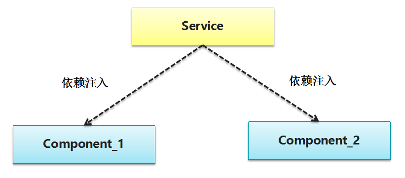

如果你在根模块（一般是 app.module.ts）的 providers 里面注册一个 Service，那么这个 Service 就是全局单例的，这样一来我们就可以利用这个单例的 Service 在不同的组件之间进行通讯了。

- 比较粗暴的方式：我们可以在 Service 里面定义 public 型的共享变量，然后让不同的组件都来访问这块变量，从而达到共享数据的目的。
- 优雅一点的方式：利用 RxJS，在 Service 里面定义一个 public 型的 Subject（主题），然后让所有组件都来 subscribe（订阅）这个主题，类似于一种“事件总线”的效果。

实例代码片段：

```ts
import { Injectable } from '@angular/core';
import { Observable } from 'rxjs/Observable';
import { Subject } from 'rxjs/Subject';

/**
 * 用来充当事件总线的 Service
 */
@Injectable()
export class EventBusService {
  public eventBus:Subject<string> = new Subject<string>();

  constructor() { }

}
```

```ts
import { Component, OnInit } from '@angular/core';
import { EventBusService } from '../service/event-bus.service';

@Component({
  selector: 'child-1',
  templateUrl: './child-1.component.html',
  styleUrls: ['./child-1.component.css']
})
export class Child1Component implements OnInit {

  constructor(public eventBusService:EventBusService) { }

  ngOnInit() {
  }

  public triggerEventBus():void{
    this.eventBusService.eventBus.next("第一个组件触发的事件");
  }
}
```

```ts
import { Component, OnInit } from '@angular/core';
import { EventBusService } from '../service/event-bus.service';

@Component({
  selector: 'child-2',
  templateUrl: './child-2.component.html',
  styleUrls: ['./child-2.component.css']
})
export class Child2Component implements OnInit {
  public events:Array<any>=[];

  constructor(public eventBusService:EventBusService) {

  }

  ngOnInit() {
    this.eventBusService.eventBus.subscribe((value)=>{
      this.events.push(value+"-"+new Date());
    });
  }
}
```

#### 利用 cookie 或者 localstorage 进行通讯

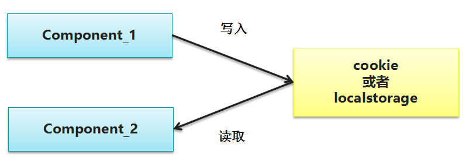

```ts
public writeData():void{
    window.localStorage.setItem("json",JSON.stringify({name:'大漠穷秋',age:18}));
}
```

```ts
var json=window.localStorage.getItem("json");
// window.localStorage.removeItem("json");
var obj=JSON.parse(json);
console.log(obj.name);
console.log(obj.age);
```

#### 利用 session 进行通讯

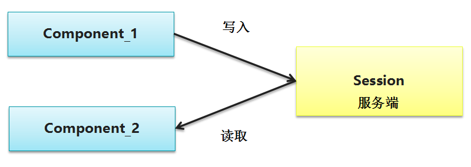

#### 小结

组件间的通讯方案是通用的，无论你使用什么样的前端框架，都会面临这个问题，而解决的方案无外乎本文所列出的几种。

## 元数据(Metadata)

元数据告诉 Angular 如何处理一个类。

考虑以下情况我们有一个组件叫作 Component ，它是一个类，直到我们告诉 Angular 这是一个组件为止。

你可以把元数据附加到这个类上来告诉 Angular Component 是一个组件。

在 TypeScript 中，我们用 装饰器 (decorator) 来附加元数据。

示例：

```ts
@Component({
   selector : 'mylist',
   template : '<h2>菜鸟教程</h2>'
   directives : [ComponentDetails]
})
export class ListComponent{...}
```

@Component 装饰器能接受一个配置对象，并把紧随其后的类标记成了组件类。Angular 会基于这些信息创建和展示组件及其视图。

@Component 中的配置项说明：

- selector - 一个 css 选择器，它告诉 Angular 在 父级 HTML 中寻找一个 `<mylist>` 标签，然后创建该组件，并插入此标签中。
- templateUrl - 组件 HTML 模板的地址。
- directives - 一个数组，包含 此 模板需要依赖的组件或指令。
- providers - 一个数组，包含组件所依赖的服务所需要的依赖注入提供者。

## 数据绑定(Data binding)

数据绑定为应用程序提供了一种简单而一致的方法来显示数据以及数据交互，它是管理应用程序里面数值的一种机制。通过这种机制，可以从HTML里面取值和赋值，使得数据的读写，数据的持久化操作变得更加简单快捷。

如图所示，数据绑定的语法有四种形式。每种形式都有一个方向——从 DOM 来、到 DOM 去、双向，就像图中的箭头所示意的。

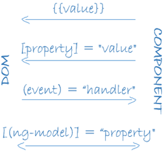

- **插值**：在 HTML 标签中显示组件值。

  ```html
  <h3>
    {{title}}
  </h3>
  ```

- **属性绑定**：把元素的属性设置为组件中属性的值。

  ```html
  
  ```

- **事件绑定**：在组件方法名被点击时触发。

  ```html
  <button (click)="onSave()">保存</button>
  ```

- **双向绑**：使用Angular里的NgModel指令可以更便捷的进行双向绑定。

  ```html
  <input [value]="currentUser.firstName"
         (input)="currentUser.firstName=$event.target.value" >
  ```

## 指令（Directives）

Angular模板是动态的 。当 Angular 渲染它们时，它会根据指令对 DOM 进行修改。指令是一个带有"指令元数据"的类。在 TypeScript 中，要通过 @Directive 装饰器把元数据附加到类上。

在Angular中包含以下三种类型的指令：

- 属性指令：以元素的属性形式来使用的指令。
- 结构指令：用来改变DOM树的结构
- 组件：作为指令的一个重要子类，组件本质上可以看作是一个带有模板的指令。

```html
<li *ngFor="let site of sites"></li>
<site-detail *ngIf="selectedSite"></site-detail>
```

- *ngFor 告诉 Angular 为 sites 列表中的每个项生成一个 `<li>` 标签。
- *ngIf 表示只有在选择的项存在时，才会包含 SiteDetail 组件。

## 服务(Services)

Angular2中的服务是封装了某一特定功能，并且可以通过注入的方式供他人使用的独立模块。服务分为很多种，包括：值、函数，以及应用所需的特性。例如，多个组件中出现了重复代码时，把重复代码提取到服务中实现代码复用。

以下是几种常见的服务：

- 日志服务
- 数据服务
- 消息总线
- 税款计算器
- 应用程序配置

以下实例是一个日志服务，用于把日志记录到浏览器的控制台：

```ts
export class Logger {
  log(msg: any)   { console.log(msg); }
  error(msg: any) { console.error(msg); }
  warn(msg: any)  { console.warn(msg); }
}
```

## 依赖注入

>控制反转（Inversion of Control，缩写为IoC），是面向对象编程中的一种设计原则，可以用来减低计算机代码之间的耦合度。其中最常见的方式叫做依赖注入（Dependency Injection，简称DI），还有一种方式叫"依赖查找"（Dependency Lookup）。
>
>通过控制反转，对象在被创建的时候，由一个调控系统内所有对象的外界实体，将其所依赖的对象的引用传递给它。也可以说，依赖被注入到对象中。
>
>在传统的开发模式中，调用者负责管理所有对象的依赖，循环依赖一直是梦魇，而在依赖注入模式中，这个管理权交给了注入器(Injector)，它在软件运行时负责依赖对象的替换，而不是在编译时。这种控制反转，运行注入的特点即是依赖注入的精华所在。

Angular 能通过查看构造函数的参数类型，来得知组件需要哪些服务。 例如， SiteListComponent 组件的构造函数需要一个 SiteService:

```ts
constructor(private service: SiteService) { }
```

当 Angular 创建组件时，会首先为组件所需的服务找一个注入器(Injector)。注入器是一个维护服务实例的容器，存放着以前创建的实例。如果容器中还没有所请求的服务实例，注入器就会创建一个服务实例，并且添加到容器中，然后把这个服务返回给 Angular。当所有的服务都被解析完并返回时，Angular 会以这些服务为参数去调用组件的构造函数。这就是依赖注入。

## 爬坑

- 很多开发者到我这里来抱怨说，在 Windows 平台上安装 @angular/cli 会报很多 error，那是因为 @angular/cli 在 Windows 平台上面依赖 Python 和 Visual Studio 环境，而很多开发者的机器上并没有安装这些东西。为什么要依赖这些环境？因为某些 npm 包需要在你本地进行源码编译。
- node-sass 模块被墙的问题，强烈推荐使用 cnpm 进行[安装](http://npm.taobao.org/)，可以非常有效地避免撞墙。
- 一些开发者来抱怨说 @angular/cli 在打包的时候加上 --prod 参数会报错，无法编译。这是一个很常见的问题，因为 @angular/cli 最新的版本经常会有 bug，只要在项目的 package.json 里面降低一个小版本号就 OK 了。另外，加 --prod 参数之后，编译器会进行更加严格的检查，如果存在无用的组件或者配置错误，编译过不去。
- @angular/cli 默认生成的 karma.conf.js 配置文件里面采用了一个有 bug 的 html 报告生成器，导致 ng test 运行报错，我们需要把这个 reporter 改成 mocha（摩卡），具体的配置和实例请参考“前端自动化测试”中的讲解。
- 有一些朋友说，本地开发的时候运行得很好，上线之后所有请求 404。这也是一个常见的坑，因为你需要给 Web 容器配置一下处理 HTTP 请求的规则，把前端路由扔回去交给 Angular 处理，请参考[这里](https://github.com/angular-ui/ui-router/wiki/Frequently-Asked-Questions)。

## 参考

- [Angular 官网](https://angular.io/)
- [Angular 官方文档](https://angular.io/docs/ts/latest/quickstart.html)
- [Angular 中文文档](https://angular.cn/docs)
- [Angular Github](https://github.com/angular/angular)
- [ngx-admin](https://github.com/akveo/ngx-admin)：基于 Angular 8+ 和 [Nebular](https://github.com/akveo/nebular) 的管理模板
- [angular2-rxjs-chat](https://github.com/ng-book/angular2-rxjs-chat)：基于 Angular 2 的聊天小程序（网页版）
- [Angular 基础教程](https://gitbook.cn/m/mazi/comp/column?columnId=5bebdaf22c33167c317cc285&utm_source=dmsd001)
- [Schematics 的用法文档，请点击这里查看](https://www.npmjs.com/package/@angular-devkit/schematics)
- [@angular/cli 官方的 wiki 文档，请点击这里查看](https://github.com/angular/angular-cli/wiki)
- [workspace 多项目配置，请点击这里查看](https://angular.io/guide/workspace-config)
- [Angular 官方 blog 里面关于 Schematics 的解释，请点击这里查看](https://blog.angular.io/schematics-an-introduction-dc1dfbc2a2b2)
- [SASS 的 API 请参考官方网站](http://sass-lang.com/)
