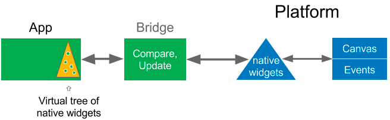
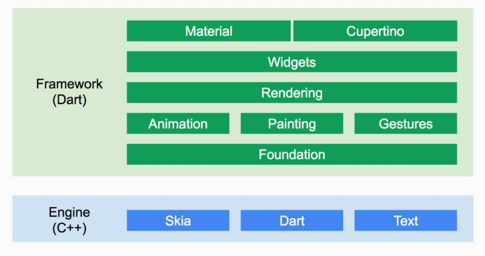
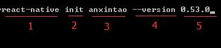
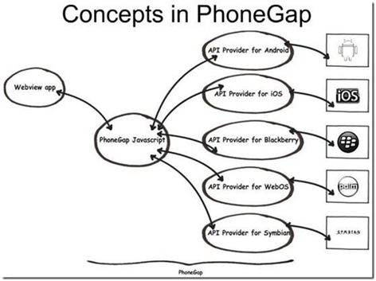

# 跨平台框架

## 目录

1. [技术选型](#技术选型)
2. [PhoneGap](#PhoneGap)
3. [Flutter](#Flutter)
   - [Flutter环境搭建](#Flutter环境搭建)
4. [React Native](#React&nbsp;Native)
   - [搭建开发环境](#搭建开发环境)
   - [Props](#Props)
   - [State](#State)
   - [样式](#样式)
   - [高度与宽度](#高度与宽度)
   - [使用Flexbox布局](#使用Flexbox布局)
   - [处理文本输入](#处理文本输入)
   - [处理触摸事件](#处理触摸事件)
   - [使用滚动视图](#使用滚动视图)
   - [使用长列表](#使用长列表)
   - [网络](#网络)
   - [集成到现有原生应用](#集成到现有原生应用)
5. [Electron](#Electron)
6. [参考](#参考)

## 技术选型

**React Native** (RN) 的开发者是 Facebook，Facebook 本身也在尝试使用 RN 技术开发自己的 App。

RN 使用 JS 更新虚拟 DOM，通过一个桥接器将需要更新的结果通知到 UI 层，让 Native 执行 UI 的改变。



**Weex** 核心思想上，与 RN 其实并没有什么区别，Weex 也可以算是站在 RN 的肩膀上起步的，目前活跃度不高，大多数是在观望中。Weex 使用 Vue，熟悉 Vue 的开发者可能会更熟悉。

**Flutter**是谷歌的移动UI框架，可以快速在iOS和Android上构建高质量的原生用户界面。Flutter可以与现有的代码一起工作。在全世界，Flutter正在被越来越多的开发者和组织使用，并且Flutter是完全免费、开源的。

Flutter中文社区：[https://flutterchina.club/](https://flutterchina.club/)

技术|性能|开发效率|渲染方式|学习成本|可扩展性
-|-|-|-|-|-
Flutter|高，接近原生体验|高|Skia 高性能自绘引擎|低，Widget 组件化|高，采用插件化的库进行扩展
RN/Weex/小程序|有延迟，一般|一般，复杂、效率低|Js驱动原生渲染|高，复杂|一般
原生应用|高|一般|原生渲染|高，需要学习 Android 和 iOS 原生 API|高

Flutter 不使用系统提供的组件，自己实现了一套渲染机制，所以在性能优化、跨平台方面表现优秀。实际体验上，性能比 RN 要高不少。



Flutter 内置了对 Material Design 的支持，给开发者提供了丰富的 UI 控件库选择，同时所有的组件都有扩展，保持了很高的灵活性。

RN 通过 React 也做到了组件式开发，跟 Flutter 相比，多了一个桥接器的转换，性能上肯定不如 Flutter。

Flutter 使用 Dart 实现，Dart 号称要完全取代 JS，不过目前离这个目标还非常远，初期上手还是有一些难度的。

RN 使用 JS 开发，做过前端的都非常熟悉，上手很容易。

**Electron**是一个基于 V8 引擎和 Node.js 的开发框架，允许用 JavaScript 开发跨平台（Windows、Mac OS X 和 Linux）桌面应用。

目前有相当多的桌面应用是使用 Electron 开发的，例如，著名的 Visual Studio Code（微软推出的一个跨平台源代码编辑器）就是用 Electron 开发的；还有蚂蚁小程序（在支付宝中运行的小程序）的开发工具也是用 Electron 来开发的；以小米、华为为主的众多手机厂商推出的快应用（类似于微信小程序）的 IDE 也是用 Electron 开发的。

从 Electron 的主要用户来看，很多都是大厂，如蚂蚁金服、小米、华为、GitHub（Electron 就是 GitHub 推出的）、微软等，由于现在 GitHub 被微软收购了，因而目前 Electron 的后台是微软。

Node.js 和 Electron 堪称 JavaScript 的左右护法，前者让 JavaScript 可以轻而易举地跨越不同类型应用的界限，后者让 JavaScript 可以进入服务端和桌面应用领域。有了这两个护法，JavaScript 可以真正成为唯一的全栈开发语言，从 Web 到移动，再到服务端，再到桌面应用，甚至是终端程序，无所不能。

## Web App, Native APP, Hybird App

1、Web App

主要 HTML, JavaScript, CSS 等 web 技术开发。无需下载，通过不同平台的浏览器访问来实现跨平台，同时可以通过浏览器支持充分使用 HTML5 特性，缺点是这些基于浏览器的应用无法调用系统API来实现一些高级功能，也不适合高性能要求的场合。

2、Native APP

原生应用，用平台特定的开发语言所开发的应用。使用它们的优点是可以完全利用系统的 API 和平台特性，在性能上也最好。缺点是由于开发技术不同，如果你要覆盖多个平台，则要针对每个平台独立开发，无跨平台特性。

3、Hybird App

为了弥补如上两者开发模式的缺陷的产物，分别继承双方的优势：

- 首先它让为数众多的 web 开发人员可以几乎零成本的转型成移动应用开发者；
- 其次，相同的代码只需针对不同平台进行编译就能实现在多平台的分发，大大提高了多平台开发的效率；
- 相较于 web App，开发者可以通过包装好的接口，调用大部分常用的系统API。

## Flutter

- [DartPad](https://dartpad.dartlang.org/)：网上练习Dart代码
- [官方下载地址](https://flutter.dev/docs/development/tools/sdk/releases#windows)
- [示例-豆瓣](https://github.com/kaina404/FlutterDouBan)

### Flutter环境搭建

**环境变量：**

- 变量名：PUB_HOSTED_URL，变量值：`https://pub.flutter-io.cn`
- 变量名：FLUTTER_STORAGE_BASE_URL，变量值：`https://storage.flutter-io.cn`
- 将 Flutter 的 bin 目录加入Path环境变量
- 安装 android studio
- 在 android studio 编辑 -> 设置，搜索 Dart 和 Flutter 插件
- 检查：`flutter doctor`

**创建项目：**

- Ctrl+Shif+P 打开命令面板，找到 Flutter：New Project
- 自动生成项目目录结构

  >Android 相关的修改和配置在 android 目录下，结构和 Android 应用项目结构一样；iOS 相关修改和配置在 ios 目录下，结构和 iOS 应用项目结构一样。最重要的 flutter 代码文件是在 lib 目录下，类文件以 .dart 结尾，语法结构为 Dart 语法结构。

- 创建[bat文件](../../Codes/wind_eim/runAndroid.bat)，便于启动Android模拟器
- 运行项目：`flutter run`

**主要建议：**

- 使用稳定版或者开发版 Flutter SDK，推荐使用稳定版。
- 如果遇到下载 SDK 慢或者无法下载情况，请按照课程内设置国内下载镜像地址。
- 配置好环境变量后，用 `flutter doctor` 检查环境。
- 尝试新建一个项目运行到手机或模拟器上，看配置是否有问题。
- 开发工具可以使用 Visual Studio Code 或 Android Studio 等。

## React&nbsp;Native

示例项目：[https://gitee.com/cuo9958/react-native-demo](https://gitee.com/cuo9958/react-native-demo)

创建项目的前提条件：

- nodejs
- react-native-cli：`cnpm install -g react-native-cli`
- Python
- JDK 1.8
- Android Studio
- Git
- Xcode（仅 iOS 项目中）
- Watchman（仅 Mac 系统用到）
- VSCode

### 搭建开发环境

创建项目：

```sh
react-native init minioaapp --version 0.55.4
```



- 图中1代表之前安装的 react-native-cli 的命令。
- 图中2代表初始化命令。
- 图中3代表项目的名称，这里是anxintao。
- 图中4代表指定 RN 的版本号，这个参数不传默认使用最新版。
- 图中5代表 RN 具体使用的版本号。

运行项目：

```sh
react-native run-ios
react-native run-android
```

添加路由：react-native-navigation 或 [react-navigation](https://reactnavigation.org/)

```sh
npm install --save react-navigation
```

### Props

大多数组件在创建时就可以使用各种参数来进行定制。用于定制的这些参数就称为 `props`（属性）。

### State

`props` 是在父组件中指定，而且一经指定，在被指定的组件的生命周期中则不再改变。对于需要改变的数据，需要使用 `state`。

每次调用 `setState` 时，对应组件都会重新执行 `render` 方法重新渲染。

初学者应该牢记的要点：

- 一切界面变化都是状态 `state` 变化
- `state` 的修改必须通过 `setState()` 方法
  - `this.state.likes = 100; // 这样的直接赋值修改无效！`
  - `setState` 是一个 merge 合并操作，只修改指定属性，不影响其他属性
  - `setState` 是异步操作，修改不会马上生效

### 样式

`style` 属性可以是一个普通的 JavaScript 对象，还可以传入一个数组——在数组中位置居后的样式对象比居前的优先级更高。

实际开发中组件的样式会越来越复杂，建议使用 `StyleSheet.create` 来集中定义组件的样式。

>注：样式名基本上是遵循了 web 上的 CSS 的命名，只是按照 JS 的语法要求使用了驼峰命名法，例如将 background-color 改为 backgroundColor。

### 高度与宽度

**指定宽高：**

最简单的给组件设定尺寸的方式就是在样式中指定固定的 `width` 和 `height`。React Native 中的尺寸都是无单位的，表示的是与设备像素密度无关的逻辑像素点。

**弹性（Flex）宽高：**

在组件样式中使用 flex 可以使其在可利用的空间中动态地扩张或收缩。一般而言我们会使用 `flex:1` 来指定某个组件扩张以撑满所有剩余的空间。如果有多个并列的子组件使用了 `flex:1`，则这些子组件会平分父容器中剩余的空间。如果这些并列的子组件的 flex 值不一样，则谁的值更大，谁占据剩余空间的比例就更大（即占据剩余空间的比等于并列组件间 flex 值的比）。

>组件能够撑满剩余空间的前提是其父容器的尺寸不为零。如果父容器既没有固定的 width 和 height，也没有设定 flex，则父容器的尺寸为零。其子组件如果使用了 flex，也是无法显示的。

### 使用Flexbox布局

我们在 React Native 中使用 flexbox 规则来指定某个组件的子元素的布局。Flexbox 可以在不同屏幕尺寸上提供一致的布局结构。

一般来说，使用flexDirection、alignItems和 justifyContent三个样式属性就已经能满足大多数布局需求。

在组件的style中指定flexDirection可以决定布局的主轴。子元素是应该沿着水平轴(row)方向排列，还是沿着竖直轴(column)方向排列呢？默认值是 **竖直轴**(column) 方向。

在组件的 style 中指定alignItems可以决定其子元素沿着次轴（与主轴垂直的轴，比如若主轴方向为row，则次轴方向为column）的排列方式。子元素是应该靠近次轴的起始端还是末尾段分布呢？亦或应该均匀分布？对应的这些可选项有：flex-start、center、flex-end以及stretch。

>注意：要使stretch选项生效的话，子元素在次轴方向上不能有固定的尺寸。以下面的代码为例：只有将子元素样式中的width: 50去掉之后，alignItems: 'stretch'才能生效。

```jsx
import React, { Component } from 'react';
import { View } from 'react-native';

export default class AlignItemsBasics extends Component {
  render() {
    return (
      // 尝试把`alignItems`改为`flex-start`看看
      // 尝试把`justifyContent`改为`flex-end`看看
      // 尝试把`flexDirection`改为`row`看看
      <View style={{
        flex: 1,
        flexDirection: 'column',
        justifyContent: 'center',
        alignItems: 'stretch',
      }}>
        <View style={{width: 50, height: 50, backgroundColor: 'powderblue'}} />
        <View style={{height: 50, backgroundColor: 'skyblue'}} />
        <View style={{height: 100, backgroundColor: 'steelblue'}} />
      </View>
    );
  }
};
```

要运用好布局，我们还需要很多其他的样式。对于布局有影响的完整样式列表记录在[这篇文档中](https://reactnative.cn/docs/layout-props)。

### 处理文本输入

TextInput是一个允许用户输入文本的基础组件。它有一个名为onChangeText的属性，此属性接受一个函数，而此函数会在文本变化时被调用。另外还有一个名为onSubmitEditing的属性，会在文本被提交后（用户按下软键盘上的提交键）调用。

假如我们要实现当用户输入时，实时将其以单词为单位翻译为另一种文字。我们假设这另一种文字来自某个吃货星球，只有一个单词： 🍕。所以"Hello there Bob"将会被翻译为"🍕🍕🍕"。

```jsx
import React, { Component } from 'react';
import { Text, TextInput, View } from 'react-native';

export default class PizzaTranslator extends Component {
  state = {
    text: ''
  }

  render() {
    return (
      <View style={{padding: 10}}>
        <TextInput
          style={{height: 40}}
          placeholder="Type here to translate!"
          onChangeText={(text) => this.setState({text})}
          value={this.state.text}
        />
        <Text style={{padding: 10, fontSize: 42}}>
          {this.state.text.split(' ').map((word) => word && '🍕').join(' ')}
        </Text>
      </View>
    );
  }
}
```

在上面的例子里，我们把text保存到 state 中，因为它会随着时间变化。

文本输入方面还有很多其他的东西要处理。比如你可能想要在用户输入的时候进行验证，[在React 中的受限组件](https://doc.react-china.org/docs/forms.html#%E5%8F%97%E6%8E%A7%E7%BB%84%E4%BB%B6)一节中有一些详细的示例（注意 react 中的 onChange 对应的是 rn 中的 onChangeText）。此外你还需要看看[TextInput 的文档](https://reactnative.cn/docs/textinput)。

### 处理触摸事件

React Native 提供了可以处理常见触摸手势（例如点击或滑动）的组件， 以及可用于识别更复杂的手势的完整的[手势响应系统](https://reactnative.cn/docs/gesture-responder-system)。

**Touchable 系列组件：**

这个组件的样式是固定的。所以如果它的外观并不怎么搭配你的设计，那就需要使用TouchableOpacity或是TouchableNativeFeedback组件来定制自己所需要的按钮，视频教程[如何制作一个按钮](http://v.youku.com/v_show/id_XMTQ5OTE3MjkzNg==.html?f=26822355&from=y1.7-1.3)讲述了完整的过程。或者你也可以在 github.com 网站上搜索 'react native button' 来看看社区其他人的作品。

具体使用哪种组件，取决于你希望给用户什么样的视觉反馈：

- 一般来说，你可以使用[TouchableHighlight](https://reactnative.cn/docs/touchablehighlight)来制作按钮或者链接。注意此组件的背景会在用户手指按下时变暗。

- 在 Android 上还可以使用[TouchableNativeFeedback](https://reactnative.cn/docs/touchablenativefeedback)，它会在用户手指按下时形成类似墨水涟漪的视觉效果。

- [TouchableOpacity](https://reactnative.cn/docs/touchableopacity)会在用户手指按下时降低按钮的透明度，而不会改变背景的颜色。

- 如果你想在处理点击事件的同时不显示任何视觉反馈，则需要使用[TouchableWithoutFeedback](https://reactnative.cn/docs/touchablewithoutfeedback)。

某些场景中你可能需要检测用户是否进行了长按操作。可以在上面列出的任意组件中使用onLongPress属性来实现。

### 使用滚动视图

[ScrollView](https://reactnative.cn/docs/scrollview)是一个通用的可滚动的容器，你可以在其中放入多个组件和视图，而且这些组件并不需要是同类型的。ScrollView 不仅可以垂直滚动，还能水平滚动（通过horizontal属性来设置）。

ScrollView适合用来显示数量不多的滚动元素。放置在ScrollView中的所有组件都会被渲染，哪怕有些组件因为内容太长被挤出了屏幕外。如果你需要显示较长的滚动列表，那么应该使用功能差不多但性能更好的FlatList组件。

### 使用长列表

React Native 提供了几个适用于展示长列表数据的组件，一般而言我们会选用[FlatList](https://reactnative.cn/docs/flatlist)或是[SectionList](https://reactnative.cn/docs/sectionlist)。

FlatList组件用于显示一个垂直的滚动列表，其中的元素之间结构近似而仅数据不同。

FlatList更适于长列表数据，且元素个数可以增删。和ScrollView不同的是，FlatList并不立即渲染所有元素，而是优先渲染屏幕上可见的元素。

FlatList组件必须的两个属性是data和renderItem。data是列表的数据源，而renderItem则从数据源中逐个解析数据，然后返回一个设定好格式的组件来渲染。

如果要渲染的是一组需要分组的数据，也许还带有分组标签，那么SectionList将是个不错的选择

### 网络

[简短的视频教程](http://v.youku.com/v_show/id_XMTUyNTEwMTA5Ng==.html)

React Native 提供了和 web 标准一致的[Fetch API](https://developer.mozilla.org/en-US/docs/Web/API/Fetch_API)，用于满足开发者访问网络的需求。如果你之前使用过XMLHttpRequest(即俗称的 ajax)或是其他的网络 API，那么 Fetch 用起来将会相当容易上手。

**发起请求：**

```js
fetch('https://mywebsite.com/mydata.json');
// json形式
fetch('https://mywebsite.com/endpoint/', {
  method: 'POST',
  headers: {
    Accept: 'application/json',
    'Content-Type': 'application/json',
  },
  body: JSON.stringify({
    firstParam: 'yourValue',
    secondParam: 'yourOtherValue',
  }),
});
// 表单形式
fetch('https://mywebsite.com/endpoint/', {
  method: 'POST',
  headers: {
    'Content-Type': 'application/x-www-form-urlencoded',
  },
  body: 'key1=value1&key2=value2',
});
```

可以参考 [Fetch请求文档](https://developer.mozilla.org/en-US/docs/Web/API/Request) 来查看所有可用的参数。

>注意：使用 Chrome 调试目前无法观测到 React Native 中的网络请求，你可以使用第三方的 [react-native-debugger](https://github.com/jhen0409/react-native-debugger) 来进行观测。

**处理服务器的响应数据：**

网络请求天然是一种异步操作（译注：同样的还有[asyncstorage](https://reactnative.cn/docs/network/asyncstorage.html)，请不要再问怎样把异步变成同步！无论在语法层面怎么折腾，它们的异步本质是无法变更的。异步的意思是你应该趁这个时间去做点别的事情，比如显示 loading，而不是让界面卡住傻等）。Fetch 方法会返回一个[Promise](https://developer.mozilla.org/en-US/docs/Web/JavaScript/Reference/Global_Objects/Promise)，这种模式可以简化异步风格的代码

```jsx
function getMoviesFromApiAsync() {
  return fetch('https://facebook.github.io/react-native/movies.json')
    .then((response) => response.json())
    .then((responseJson) => {
      return responseJson.movies;
    })
    .catch((error) => {
      console.error(error);
    });
}
```

你也可以在 React Native 应用中使用 ES2017 标准中的async/await 语法：

```jsx
// 注意这个方法前面有async关键字
async function getMoviesFromApi() {
  try {
    // 注意这里的await语句，其所在的函数必须有async关键字声明
    let response = await fetch(
      'https://facebook.github.io/react-native/movies.json',
    );
    let responseJson = await response.json();
    return responseJson.movies;
  } catch (error) {
    console.error(error);
  }
}
```

别忘了 catch 住fetch可能抛出的异常，否则出错时你可能看不到任何提示。

>默认情况下，iOS 会阻止所有 http 的请求，以督促开发者使用 https。如果你仍然需要使用 http 协议，那么首先需要添加一个 App Transport Security 的例外，详细可参考[这篇帖子](https://segmentfault.com/a/1190000002933776)。
>
>从 Android9 开始，也会默认阻止 http 请求，请参考[相关配置](https://blog.csdn.net/qq_40347548/article/details/86766932)

**使用其他的网络库：**

React Native 中已经内置了[XMLHttpRequest](https://developer.mozilla.org/en-US/docs/Web/API/XMLHttpRequest) API（也就是俗称的 ajax）。一些基于 XMLHttpRequest 封装的第三方库也可以使用，例如 [frisbee](https://github.com/niftylettuce/frisbee) 或是 [axios](https://github.com/mzabriskie/axios) 等。但注意不能使用 jQuery，因为 jQuery 中还使用了很多浏览器中才有而 RN 中没有的东西（所以也不是所有 web 中的 ajax 库都可以直接使用）。

```jsx
const request = new XMLHttpRequest();
request.onreadystatechange = (e) => {
  if (request.readyState !== 4) {
    return;
  }

  if (request.status === 200) {
    console.log('success', request.responseText);
  } else {
    console.warn('error');
  }
};

request.open('GET', 'https://mywebsite.com/endpoint/');
request.send();
```

>需要注意的是，安全机制与网页环境有所不同：在应用中你可以访问任何网站，没有[跨域](http://en.wikipedia.org/wiki/Cross-origin_resource_sharing)的限制。

**WebSocket 支持：**

React Native 还支持 [WebSocket](https://developer.mozilla.org/en-US/docs/Web/API/WebSocket)，这种协议可以在单个 TCP 连接上提供全双工的通信信道。

```jsx
const ws = new WebSocket('ws://host.com/path');

ws.onopen = () => {
  // connection opened
  ws.send('something'); // send a message
};

ws.onmessage = (e) => {
  // a message was received
  console.log(e.data);
};

ws.onerror = (e) => {
  // an error occurred
  console.log(e.message);
};

ws.onclose = (e) => {
  // connection closed
  console.log(e.code, e.reason);
};
```

### 集成到现有原生应用

#### Android

把 React Native 组件集成到 Android 应用中有如下几个主要步骤：

1. 配置好 React Native 依赖和项目结构。
2. 创建 js 文件，编写 React Native 组件的 js 代码。
3. 在应用中添加一个RCTRootView。这个RCTRootView正是用来承载你的 React Native 组件的容器。
4. 启动 React Native 的 Packager 服务，运行应用。
5. 验证这部分组件是否正常工作。

在你的 app 中 build.gradle 文件中添加 React Native 依赖：

React-native打包遇到问题:Could not get BatchedBridge：（已过期）

```sh
react-native bundle --platform android --dev false --entry-file index.js --bundle-output android/app/src/main/assets/index.android.bundle --sourcemap-output android/app/src/main/assets/index.android.map --assets-dest android/app/src/main/res/
```

## Electron

- 安装：`cnpm install electron -g`
- 查看版本：`electron -v`
- 删除：`npm uninstall electron`
- 升级：`npm update electron -g`
- 运行应用：`electron .`

对于 Electron 应用来说，事件分为如下两类：

- 原生事件
- Web 事件

打开对话框：

```js
dialog.showOpenDialog([browserWindow, ]options[, callback])
```

其中 browserWindow 和 callback 都是可选的，browserWindow 参数允许该对话框将自身附加到父窗口，作为父窗口的模态对话框。callback 是回调函数，用于返回打开文件或目录后的返回值（文件或目录的绝对路径），如果步指定 callback 参数，通过 showOpenDialog 方法返回打开的文件或目录的绝对路径。

options 是必选参数，该参数是一个对象，包含了一些用于设置打开对话框的属性，主要属性的功能及含义如下表所示。

属性|数据类型|功能|可选 / 必选
-|-|-|-
title|String|对话框标题|可选
defaultPath|String|默认路径|可选
buttonLabel|String|按钮文本，当为空时，使用默认按钮文本|可选
filters|Array|过滤器，用于过滤指定类型的文件|可选
properties|Array|包含对话框的功能，如打开文件、打开目录、多选等|必选
message|String|将标题显示在打开对话框顶端|可选

Electron 桌面应用支持三种菜单：应用菜单、上下文菜单及托盘菜单。

由于 Electron 是跨平台的，所以选择打包工具时应尽量选择支持多个操作系统平台的，如 [electron-packager](https://github.com/electron-userland/electron-packager)

```sh
npm install electron-packager -g
```

打包：

```sh
electron-packager . firstmenu --electron-version=3.0.0
```

在 Electron 中，可以直接使用组件的 id 引用组件中的属性和方法。

**编译 sqlite 3 模块：**

在 Windows 下 C/C++ 开发环境通常使用 Visual Studio，目前最新的是 Visual Studio 2017，读者可以安装免费的 Visual Studio 2017 社区版，不过社区版安装程序的尺寸很大，安装比较费事，可以单独安装 Windows 的建立[工具](https://github.com/felixrieseberg/windows-build-tools)。

在编译的过程中，需要使用 node-gyp 工具，来为 Node.js 编译本地模块，不过这个工具是用 Python 写的，而且是 Python 2.7，在安装 node-gyp 之前，需要确认一下。如果读者使用的是 Mac OS X 和大多数 Linux 发行版，默认带 Python 2.7，如果读者使用的 Windows，就需要安装 Python 2.7；如果读者的机器上已经安装了多个 Python 版本，建议安装 Anaconda 环境，可以很容易在 Python 2.7 和 Python 3.x 之间切换。

安装完 Python 2.7 后，使用下面的命令安装 node-gyp。

```sh
npm install -g node-gyp
```

node-gyp 的官方地址详见[这里](https://github.com/nodejs/node-gyp)。

一切就绪后，就可以开始编译 sqlite 3 模块了。

现在进入 Electron 工程根目录，使用下面的 3 个命令从零开始安装和编译 sqlite 3 模块。其中 7.1.1 是依赖的 Electron 版本，一般与当前使用的 Electron 版本相同。

```sh
npm install --save sqlite3
npm install --save electron-rebuild
# Linux or Mac
./node_modules/.bin/electron-rebuild -v 7.1.1
# Windows
.\node_modules\.bin\electron-rebuild.cmd -v 7.1.1
```

>注意：如果编译成功，可以直接将 node_modules 目录中的 sqlite 3 子目录备份，以后换到新机器上，直接将 sqlite 3 目录作为 node_modules 目录的子目录即可，这样就不需要再编译 sqlite 3 模块了。

## 打包发布：**

以下任意一种都行

1、electron-packager

[官网](https://github.com/electron-userland/electron-packager)

```sh
npm install electron-packager --save-dev
# 或者 全局安装
npm install electron-packager -g
```

现在准备一个 Electron 工程（假设是 release/Test），首先使用 `electron .` 命令运行工程，接下来在终端进入 release/Test 目录，然后输入下面的命令打包 Test 应用：

```sh
electron-packager . --electron-version=7.1.1
```

其中 electron-packager 命令后面的点（.）表示要打包当前目录的工程，后面的 --electron-version 命令行参数表示要打包的 Electron 版本号，注意，这个版本号不是本地安装的 electron 版本号，而是打包到安装包中的 electron 版本，但建议打包的 Electron 版本尽量与开发中使用的 Electron 版本相同，否则容易出现代码不兼容的问题。在打包的过程中，electron-packager 会下载指定的 Electron 安装包

<b style="color:red">问题</b>：图像目录没在工程目录中

方法1：亡羊补牢（复制图像目录到包目录）

方法2：直接在包目录中修改图像路径

>electron-packager 命令在打包时，会将 Electron 应用的源代码也放到包目录中，因此可以直接修改包目录中的源代码，将图像或其他资源的路径指向正确的文件。

方法3：在开始时将资源放到工程目录中

方法4：使用 Web 资源

修改可执行文件的名称：

```sh
# 执行命令，将可执行程序的名字改为 new。
electron-packager . --executable-name new --electron-version=7.1.1
```

>如果包目录已经存在，可以使用 --overwrite 命令行参数覆盖包目录。

修改应用程序名：

```sh
electron-packager . hello  --electron-version=7.1.1
```

修改应用程序图标：为了方便生成 10 个不同size 的 png 图像，可以利用 sips 命令。因此我们可以编写一个 buildicns.sh 脚本文件，代码如下：

```sh
mkdir me.iconset
sips -z 16 16     icon1024.png --out me.iconset/icon_16x16.png
sips -z 32 32     icon1024.png --out me.iconset/icon_16x16@2x.png
sips -z 32 32     icon1024.png --out me.iconset/icon_32x32.png
sips -z 64 64     icon1024.png --out me.iconset/icon_32x32@2x.png
sips -z 128 128   icon1024.png --out me.iconset/icon_128x128.png
sips -z 256 256   icon1024.png --out me.iconset/icon_128x128@2x.png
sips -z 256 256   icon1024.png --out me.iconset/icon_256x256.png
sips -z 512 512   icon1024.png --out me.iconset/icon_256x256@2x.png
sips -z 512 512   icon1024.png --out me.iconset/icon_512x512.png
cp icon1024.png me.iconset/icon_512x512@2x.png
iconutil --convert icns --output me.icns me.iconset
rm -R me.iconset
```

在上面的代码中，首先会创建一个名为 me.iconset 的目录（该目录必须以 iconset 作为扩展名），然后使用 sips 命令将 1024 × 1024 尺寸的图像压缩成相应尺寸的图像，并将这些图像放到 me.iconset 目录中，然后使用 iconutil 命令生成 me.icns 文件，最后删除 me.iconset 目录。

接下来使用 `sh buildicns.sh` 命令生成 me.icns 文件

将 me.icns 文件改成 electron.icns，也可以修改图标，不过这里使用 --icon 命令行参数修改图标，命令如下：

```sh
electron-packager .  me  --icon=/Users/lining/Desktop/icns/me.icns  --electron-version=7.1.1
```

在 Windows 下修改应用程序图标相对简单，只需要找一个 ico 文件，并使用下面的命令打包即可：

```sh
electron-packager .  me  --icon=D:\MyStudio\resources\electron\images\folder.ico  --electron-version=7.1.1
```

操作系统平台：

一个在 Mac OS X 平台下模拟 Windows 运行环境的工具：

```sh
brew install wine
```

如果指定 --platform 命令行参数为 all，那么 electron-packager 命令就会为所有的平台打包：

```sh
electron-packager .  me  --platform=all --electron-version=7.1.1
```

--platform 命令函数参数除了 all 外，还支持如下 4 个值。

- darwin：Mac OS X 系统
- Linux：Linux 系统
- mas：与 darwin 相同，也是 Mac OS X 系统
- win32：Windows 系统

如果不想生成所有平台的包目录，可以使用上面 4 个值，多个值之间用逗号分隔。

**打包源代码：**

默认情况下，electron-packager 会将源代码直接放到包目录中（app 目录中），不过使用 --asar 命令行参数可以将 Electron 应用中的源代码打包成 asar 文件（app.asar）

```sh
electron-packager .  me  --asar --platform=all  --electron-version=7.1.1
```

不过 asar 文件并不保险，因为可以直接用这个命令解开：`asar extract app.asar app`

如果读者的机器上没有 asar 命令，可以使用下面的命令安装：`npm install asar -g`

**嵌入元信息：**

```sh
electron-packager .  me  --asar --win32metadata.CompanyName="欧瑞科技"  --win32metadata.ProductName="我的Electron应用"  --win32metadata.FileDescription="这是一个测试程序" --win32metadata.OriginalFilename="abcd.exe"  --electron-version=3.0.2
```

命令行参数的描述如下：

- --win32metadata.CompanyName，公司名称
- --win32metadata.ProductName，产品名称
- --win32metadata.FileDescription，文件描述
- --win32metadata.OriginalFilename，原始文件名

2、electron-packager-interactive

使用 electron-packager 工具打包需要指定多个命令行参数，比较麻烦，为了方便，可以使用 electron-packager 交互工具 electron-packager-interactive，这个程序也是一个命令行工具，执行 electron-packager-interactive 后，会在控制台一步一步提示该如何去做。

```sh
npm install  electron-packager-interactive -g
```

**参考：**

- [官网](https://electronjs.org/)
- [electron_gitchat_src](https://github.com/geekori/electron_gitchat_src)

## PhoneGap

<b style="color:red">已过时的技术</b>

1、PhoneGap 是什么

PhoneGap 是一个用基于 HTML，CSS 和 JavaScript 的，创建移动跨平台移动应用程序的快速开发框架。

它使开发者能够利用 iPhone, Android, Palm, Symbian, WP7, Bada 和 Blackberry 智能手机的核心功能——包括地理定位，加速器，联系人，声音和振动等，此外 PhoneGap 拥有丰富的插件，可以以此扩展无限的功能。

PhoneGap 是免费的，但是它需要特定平台提供的附加软件，例如 iPhone 的iPhone SDK，Android 的 Android SDK 等，也可以和 DW5.5 配套开发。

使用 PhoneGap 只比为每个平台分别建立应用程序好一点点，因为虽然基本代码是一样的，但是你仍然需要为每个平台分别编译应用程序。

PhoneGap 针对不同平台的 WebView 做了扩展和封装，使 WebView 这个组件变成可访问设备本地API的强大浏览器，所以开发人员在 PhoneGap 框架下可通过 JavaScript 访问设备本地API。

WebView 组件实质是移动设备的内置浏览器。WebView 这个内置浏览器特性是Web能被打包成本地客户端的基础，可方便的用 HTML5、CSS3 页面布局，这是移动Web技术的优势相对于原生开发）



2、PhoneGap 的优势

- 可跨平台
- 易用性，基于标准的Web开发技术（html + css + js）
- 提供硬件访问控制api
- 可利用成熟 javascript 框架（JqueryMobile SenchaTouch）
- 方便的安装和使用

3、PhoneGap 的不足

- PhoneGap 应用程序的运行是寄托于移动设备上各平台的内置浏览器 webkit 的，受到 webkit 处理速度影响，以及各个平台的硬件与软件的性能制约，其程序运行的速度会比原生的程序稍微慢点，但是笔者认为，这些问题在1-2年内都会解决，因为现在的硬件的发展速度太快了。
- 还有一些底层的功能需要插件来实现比如（推送功能）
- 平台差异化不同，PhoneGap 应用程序在所有平台上运行界面看起来都一样。即使这个应用程序与原生应用很相像，但对于习惯了 iOS 与 Android 平台的用户来说，会觉得不习惯，他们还是会很快看出差异。

通过综合比较 PhoneGap 的优点与不足，我们认为，如果你想快速实现一般的移动 WebApp 或者普通的2D游戏，那么可以采用 PhoneGap 技术。如果你想要实现需要大量CPU计算的应用或者3D游戏，或者对用户体验及界面有极致的追求，考虑目前的硬件条件和开发成本，使用原生开发来实现比较适合。

4、PhoneGap 前景

2011年10月4日，Adobe 宣布收购了创建了 HTML5 移动应用框架 PhoneGap 和 PhoneGap Build 的新创公司Nitobi Software。这使得 phonegap 有了坚强的后盾，phonegap 的发展前景也是一片光明。与此同时，PhoneGap 的开源框架已经被累积下载 60 万次，借助 PhoneGap 平台，已有数千应用程序建立在 iOS，android 以及其它操作系统之上。

## 参考

- [React Native中文网](https://reactnative.cn/)
