# js总结

## 目录

1. Dom结构
   - [伪元素](#伪元素)
2. 函数
   - [call及apply](#call及apply)
   - [document.execCommand](#document.execCommand)
3. 功能
   - [剪切板](#剪切板)
4. 前端编程法
   - [流式编程](#流式编程)
     - 概念
       - [流式应用](#流式应用)
       - [瀑布流](#瀑布流)
       - [实时计算](#实时计算)
       - [流处理](#流处理)
     - 来源和结论
       - [页面结构](#页面结构)
       - [接口请求](#接口请求)
       - [优化顺序](#优化顺序)
     - 实例分析
       - [单接口情况](#单接口情况)
       - [多接口](#多接口)
       - [实时+触发](#实时+触发)
       - [复杂页面](#复杂页面)

## 剪切板

IE浏览器支持直接读写剪切板内容：

```js
window.clipboardData.clearData();  
window.clipboardData.setData('Text', 'abcd');
```

chrome/Firefox

```js
// 覆盖浏览器粘贴事件
document.addEventListener('paste', function (e) {
    var clipboardData = e.clipboardData;
    if (!(clipboardData && clipboardData.items)) {//是否有粘贴内容
        return;
    }
    for (var i = 0, len = clipboardData.items.length; i < len; i++) {
        var item = clipboardData.items[i];
        if (item.kind === "string" && item.type == "text/plain") {
            item.getAsString(function (str) {
                // str 是获取到的字符串,创建文本框
                //处理粘贴的文字内容
            })
        } else if (item.kind === "file") {//file 一般是各种截图base64数据
            var pasteFile = item.getAsFile();
            // pasteFile就是获取到的文件
            var reader = new FileReader();
            reader.onload = function (event) {
                var base64Img = event.target.result;
            }; // data url  
            reader.readAsDataURL(pasteFile);
        }
        var copy_content = e.clipboardData.getData('text/plain');
    }
})

// 写入系统剪切板，实测无效
e.clipboardData.setData('text/plain', defaultText);

// 1) 监听copy事件，触发copy命令
document.addEventListener("paste", function (e) {
    console.log(e.clipboardData.getData("text"));
});
document.onkeydown = function (e) {
    if (e.ctrlKey && e.keyCode == 67) {//ctrl+C
        function handler(event) {
            event.clipboardData.setData('text/plain', "自定义复制内容");
            document.removeEventListener('copy', handler, true);
            event.preventDefault();
        }
        document.addEventListener('copy', handler, true);
        document.execCommand('copy');
    }
}

// 2）通过将需要复制的内容赋值到文本中，将文本框内容选中，执行copy命令
// 复制  
document.onkeydown = function (e) {
    if (e.ctrlKey && e.keyCode == 86) {//ctrl+V
        var cloneActiveElement = "需要复制的内容";
        var copyText = document.getElementById("copy_text");
        copyText.innerHTML = cloneActiveElement;
        copyText.readOnly = false;
        copyText.select();
        copyText.setSelectionRange(0, copyText.value.length);
        document.execCommand("copy");
        copyText.readOnly = true;
    }
}

// 事件触发
if ("createEvent" in document) {
    var evt = document.createEvent("HTMLEvents");
    evt.initEvent("paste", false, true);
    element.dispatchEvent(evt);
} else {
    element.fireEvent("onchange");
}
```

## 伪元素

虽然标题里写的是伪元素,不过这篇文章主要是说::before和::after，其余几个伪元素（::first-letter、::first-line、::selection等)由于没有content属性，所以本文一笔带过，其实方法是一样的。

伪元素的重点在于一个**伪**，虽然它们可以被浏览器渲染引擎识别并正确渲染，然而<b style="color:red">伪元素本身并不是DOM元素</b>,所以无法被js直接操作——因此任何基于JS直接选取DOM元素的CSS更改方法对伪元素都不起作用。（JQ看似万能，这个问题上是直接就栽了。因为JQ的选择符都是基于DOM元素）关于JS和JQ选择器，可以参考这两篇文档：[Selectors API Level 1](http://www.w3.org/TR/selectors-api/)、[jQuery Selectors](http://api.jquery.com/category/selectors/)

### 获取伪元素的属性值

- `window.getComputedStyle`

  ```js
  var div=document.querySelector('div');
  var fontSize=window.getComputedStyle(div,'::before').getPropertyValue('font-size');//获取before伪元素的字号大小
  ```

  关于这个方法，详解可以参考这篇文章：[获取元素CSS值之getComputedStyle方法熟悉](http://www.zhangxinxu.com/wordpress/2012/05/getcomputedstyle-js-getpropertyvalue-currentstyle/)

### 更改伪元素的属性值

1. js更改data-*属性值来更改伪元素的content值
2. 创建多个class，通过切换class来达到改变样式的目的
3. 利用CSSStyleSheet的insertRule方法来添加样式
4. 利用内部css样式的高优先级来覆盖外部css
  
以上实现思路的推荐程度***依次递减***

data-*是HTML5新增的DOM元素属性，作用大致可以理解为标记。具体用法可以参考MDN的这篇文章.而伪元素的content属性值除了常规赋值外，还有一种特殊的attr()方法来获取。

html:

```html
<div class="test" data-text="TEXT" data-color="red"></div>
```

css:

```css
.test::before{
    content: attr(data-text);
}
```

结果：

```sh
TEXT
```

另外content其实可以多个attr连写，而且attr()内的可以是DOM元素的任意属性（比如class等，甚至非W3C标准属性也支持，不过不推荐这么做)所以很方便凑一些模版文字。像下面这种写法也是完全没问题的。***注意用空格连接，不要用"+"号***。

```css
.test::before {
  content: '我的类是' attr(class) '想要变成' attr(data-color);
}
```

虽然W3C给attr()赋予了[无限可能性](http://www.w3.org/TR/css3-values/#attr-notation)，包括color,width等属性在未来都有希望用这个方法更改，然而**目前只有`content`支持该方法**，其余的都还是草稿状态，尚未有浏览器支持。之所以把这个方法放在第一位只是因为相比别的实现手法来说，这个方法真的太简单太优雅。

### 更改class来实现伪元素样式的更改

class切换大法，不适合多状态的场景（比如实时改变伪元素文字大小等）

### 利用CSSStyleSheet的insertRule方法来添加样式

CSSStyleSheet是浏览器存放页面内所有css样式表的对象方法（不包括行内样式)，每个link和style标签都代表一个CSSStyleSheet对象，获取他们可以用document.styleSheets方法。(需要注意的是虽然styleSheets方法返回的结果把link标签引进的外部样式也算进去了，但是非IE浏览器没办法获取到他们的cssRules属性，只有内嵌的style标签内的元素可以被获取到)

```js
document.styleSheets[0].insertRule('.test::before{color:green}',0)//chrome,firefox等非IE浏览器使用
document.styleSheets[0].addRule('.test::before{color:green}',0)//IE系列浏览器使用
/* 虽然部分浏览器也可以通过id来指定,'document.styleSheets.id.insertRule()'这种写法在chrome和IE下都行得通，但是firefox会返回'undefined',所以建议还是使用index值来获取stylesheet */
```

.insertRule的语法是stylesheet.insertRule(rule, index),另一个参数是index，意思是在对应的styleSheets里的cssRules样式表中的位置，这个值越大则样式优先级越高，但是值不能超过当前样式表规则（cssRules）长度（CSS中先定义的样式总是会被后定义的覆盖就是这个缘故。），当值小于cssRules长度时，添加的样式规则会插入到index值定义的位置，之前其余的规则依次顺延。

>addrule和insertRule方法本质上没区别，只是后者不被IE浏览器识别，所以前者作为浏览器兼容方法存在。

上面的代码看似简单一行，然而却不是每次都有效的。原因有以下几点：

1. document.styleSheets虽然按照style和link的顺序返回对应的StyleSheetList，然而第一个如果是link而不是style,前面讲过此时无法获取对应的cssRules，则document.styleSheets[0].cssRules为null，insertRule方法不起作用。（此情况只针对非IE浏览器，IE浏览器正常，但是定义的早往往意味着被后面的样式覆盖，所以意义不大）
2. 同上，如果页面内没有内嵌样式的style标签，则insertRule方法也无法发挥作用。
3. index值不够大的话很有可能会早于css文件开始的定义位置，导致被覆盖。因此有个折衷办法就是给添加的样式增加!important，虽然我个人比较反感这么做。

由此可见此方法的局限性，但是这种方法的优雅之处在于避免了直接写内嵌样式，而是通过css api来做更改。相比下面的方法来说，稍微好点。

### HEAD中添加style标签强制覆盖初始属性

这个方法是利用内部css样式的高优先级来覆盖外部css，好处是简单易理解，实现简单。坏处就是吃相太难看，过于粗暴。

```js
var style=document.createElement('style');
style.innerHTML=".test::before{color:green}";//添加样式内容的话也可以用上面提到过的`insertRule`,相对例子里的硬编码会更优雅点。
document.head.appendChild(style);
```

看到这里可能有些人反应过来了，其实加style标签这种方法可以是insertRule实现方法的大前提——因为不是所有页面一开始都有内嵌的style样式的。这种方法虽然不是很好，但是有时候却又确确实实是必须的——比如“拖动滑块改变伪元素内文字大小”这个需求。

### 练习

功能需求：

1. 拖动滑块改变伪元素内的文字大小
2. 且伪元素内随时显示当前字号
3. 通过一个按钮可以改变伪元素内文字颜色

这个需求可以将本文前面提到的四种改变伪元素样式的方法都塞进去。具体实现参照[DEMO](http://codepen.io/chitanda/pen/OVBJEw/)，不再做具体分析。

## call及apply

call 和 apply 都是为了改变某个函数运行时的 context 即上下文而存在的，换句话说，就是为了改变函数体内部 this 的指向。因为 JavaScript 的函数存在 `定义时上下文` 和 `运行时上下文` 以及 `上下文是可以改变的` 这样的概念。

二者的作用完全一样，只是接受参数的方式不太一样。例如，有一个函数 func1 定义如下：

```js
var func1 = function(arg1, arg2) {};
```

就可以通过 `func1.call(this, arg1, arg2);` 或者 `func1.apply(this, [arg1, arg2]);` 来调用。其中 this 是你想指定的上下文，他可以任何一个 JavaScript 对象（JavaScript 中一切皆对象），call 需要把参数按顺序传递进去，而 apply 则是把参数放在数组里。

JavaScript 中，某个函数的参数数量是不固定的，因此要说适用条件的话，当你的参数是明确知道数量时，用 call；而不确定的时候，用 apply，然后把参数 push 进数组传递进去。当参数数量不确定时，函数内部也可以通过 arguments 这个数组来遍历所有的参数。

要先明白存在call和apply的原因，才能记得牢一点：

在javascript OOP中，我们经常会这样定义：

```js
function cat(){
}
cat.prototype={
  food:"fish",
  say: function(){
    alert("I love "+this.food);
  }
}
var blackCat = new cat;
blackCat.say();
```

但是如果我们有一个对象`whiteDog = {food:"bone"}`，我们不想对它重新定义 say 方法，那么我们可以通过 call 或 apply 用 blackCat 的 say 方法：`blackCat.say.call(whiteDog);`

所以，可以看出call和apply是为了动态改变 `this` 而出现的，当一个object没有某个方法，但是其他的有，我们可以借助call或apply用其它对象的方法来操作。

用的比较多的，通过 `document.getElementsByTagName` 选择的 dom 节点是一种类似 array 的 array。它不能应用 Array 下的 `push`, `pop` 等方法。我们可以通过：

```js
var domNodes = Array.prototype.slice.call(document.getElementsByTagName("*"));

```

这样domNodes就可以应用Array下的所有方法了。

如果没有提供 thisObj 参数，那么 Global 对象被用作 thisObj

Global: 全局属性和函数可用于所有内建的 JavaScript 对象。

你需要明白 IIFE 的原理，我简单说一下：

```js
// 这是定义，Declaration；定义只是让解释器知道其存在，但是不会运行。
function foo() {...}
// 这是语句，Statement；解释器遇到语句是会运行它的。
foo();
```

IIFE 并非必须，那么为什么要 IIFE？

1. 传统的方法啰嗦，定义和执行分开写；
2. 传统的方法直接污染全局命名空间（浏览器里的 global 对象，如 window）

于是，开发者们想找一个可以解决以上问题的写法。那么像下面这么写行不行呢？

```js
function foo(...){}();
```

当然是不能，但是为什么呢？因为 `function foo(...){}` 这个部分只是一个声明，对于解释器来说，就好像你写了一个字符串 "function foo(...){}"，它需要使用解析函数，比如 eval() 来执行它才可以。所以把 () 直接放在声明后面是不会执行，这是错误的语法。

如何把它变得正确？说起来也简单，只要把 `声明` 变成 `表达式(Expression)` 就可以了。

实际上转变表达式的办法还是很多的，最常见的办法是把函数声明用一对 () 包裹起来，于是就变成了：

```js
(function foo() {...})();
```

这就等价于：

```js
var foo = function () {...}; // 这就不是定义，而是表达式了。
foo();
```

但是之前我们说不行的那个写法，其实也可以直接用括号包起来，这也是一种等价的表达式：

```js
(function foo(){...}());
```

所以你问有没有区别？很简单：木有～另外，刚才说过转变表达式的方式很多，的确还有很多别的写法，比如：

```js
!function foo() {...}();
```

或者

```
+function foo() {...}();
```

这些都可以。我个人挺偏爱用 void 来转变表达式，因为此关键字不会有返回值。不过这一点真的没有什么要紧的……

```js
void function () {
  // 这里是真正需要的代码
}();
```

OK，所谓不去污染全局命名空间，是因为 IIFE 创建了一个新的`函数作用域`，你真正的业务代码被封装在其中，自然就不会触碰到全局对象了。如果你需要全局对象，那就 pass 给 IIFE：

```js
void function (global) {
  // 在这里，global 就是全局对象了
}(this) // 在浏览器里，this 就是 window 对象
```

## document.execCommand

document.execCommand()方法处理Html数据时常用语法格式如下:

```js
document.execCommand(sCommand [, 交互方式, 动态参数])
```

其中：sCommand为指令参数（如下例中的”2D-Position”），交互方式参数如果是true的话将显示对话框，如果为false的话，则不显示对话框（下例中的”false”即表示不显示对话框），动态参数一般为一可用值或属性值（如下例中的”true”）。

document.execCommand(”2D-Position”,”false”,”true”);

调用execCommand()可以实现浏览器菜单的很多功能. 如保存文件,打开新文件,撤消、重做操作…等等. 有了这个方法,就可以很容易的实现网页中的文本编辑器.

如果灵活运用,可以很好的辅助我们完成各种项目.

使用的例子如下:

1、〖全选〗命令的实现
[格式]:document.execCommand(”selectAll”)
[说明]将选种网页中的全部内容！
[举例]在之间加入：
全选

2、〖打开〗命令的实现
[格式]:document.execCommand(”open”)
[说明]这跟VB等编程设计中的webbrowser控件中的命令有些相似，大家也可依此琢磨琢磨。
[举例]在之间加入：
打开

3、〖另存为〗命令的实现
[格式]:document.execCommand(”saveAs”)
[说明]将该网页保存到本地盘的其它目录！
[举例]在之间加入：
另存为

4、〖打印〗命令的实现
[格式]:document.execCommand(”print”)
[说明]当然，你必须装了打印机！
[举例]在之间加入：
打印

Js代码 下面列出的是指令参数及意义

//相当于单击文件中的打开按钮
document.execCommand(”Open”);

//将当前页面另存为
document.execCommand(”SaveAs”);

//剪贴选中的文字到剪贴板;
document.execCommand(”Cut”,”false”,null);

//删除选中的文字;
document.execCommand(”Delete”,”false”,null);

//改变选中区域的字体;
document.execCommand(”FontName”,”false”,sFontName);

//改变选中区域的字体大小;
document.execCommand(”FontSize”,”false”,sSize|iSize);

//设置前景颜色;
document.execCommand(”ForeColor”,”false”,sColor);

//使绝对定位的对象可直接拖动;
document.execCommand(”2D-Position”,”false”,”true”);

//使对象定位变成绝对定位;
document.execCommand(”AbsolutePosition”,”false”,”true”);

//设置背景颜色;
document.execCommand(”BackColor”,”false”,sColor);

//使选中区域的文字加粗;
document.execCommand(”Bold”,”false”,null);

//复制选中的文字到剪贴板;
document.execCommand(”Copy”,”false”,null);

//设置指定锚点为书签;
document.execCommand(”CreateBookmark”,”false”,sAnchorName);

//将选中文本变成超连接,若第二个参数为true,会出现参数设置对话框;
document.execCommand(”CreateLink”,”false”,sLinkURL);

//设置当前块的标签名;
document.execCommand(”FormatBlock”,”false”,sTagName);

//相当于单击文件中的打开按钮
document.execCommand(”Open”);

//将当前页面另存为
document.execCommand(”SaveAs”);

//剪贴选中的文字到剪贴板;
document.execCommand(”Cut”,”false”,null);

//删除选中的文字;
document.execCommand(”Delete”,”false”,null);

//改变选中区域的字体;
document.execCommand(”FontName”,”false”,sFontName);

//改变选中区域的字体大小;
document.execCommand(”FontSize”,”false”,sSize|iSize);

//设置前景颜色;
document.execCommand(”ForeColor”,”false”,sColor);

//使绝对定位的对象可直接拖动;
document.execCommand(”2D-Position”,”false”,”true”);

//使对象定位变成绝对定位;
document.execCommand(”AbsolutePosition”,”false”,”true”);

//设置背景颜色;
document.execCommand(”BackColor”,”false”,sColor);

//使选中区域的文字加粗;
document.execCommand(”Bold”,”false”,null);

//复制选中的文字到剪贴板;
document.execCommand(”Copy”,”false”,null);

//设置指定锚点为书签;
document.execCommand(”CreateBookmark”,”false”,sAnchorName);

//将选中文本变成超连接,若第二个参数为true,会出现参数设置对话框;
document.execCommand(”CreateLink”,”false”,sLinkURL);

//设置当前块的标签名;
document.execCommand(”FormatBlock”,”false”,sTagName);

document对象execCommand通常在IE中在线处理Html数据时非常有用，它可以让你轻而易举实现文字的加粗、加颜色、加字体等一系列的命令。

D-Position 允许通过拖曳移动绝对定位的对象。
AbsolutePosition 设定元素的 position 属性为“absolute”(绝对)。
BackColor 设置或获取当前选中区的背景颜色。
BlockDirLTR 目前尚未支持。
BlockDirRTL 目前尚未支持。
Bold 切换当前选中区的粗体显示与否。
BrowseMode 目前尚未支持。
Copy 将当前选中区复制到剪贴板。
CreateBookmark 创建一个书签锚或获取当前选中区或插入点的书签锚的名称。
CreateLink 在当前选中区上插入超级链接，或显示一个对话框允许用户指定要为当前选中区插入的超级链接的 URL。
Cut 将当前选中区复制到剪贴板并删除之。
Delete 删除当前选中区。
DirLTR 目前尚未支持。
DirRTL 目前尚未支持。
EditMode 目前尚未支持。
FontName 设置或获取当前选中区的字体。
FontSize 设置或获取当前选中区的字体大小。
ForeColor 设置或获取当前选中区的前景(文本)颜色。
FormatBlock 设置当前块格式化标签。
Indent 增加选中文本的缩进。
InlineDirLTR 目前尚未支持。
InlineDirRTL 目前尚未支持。
InsertButton 用按钮控件覆盖当前选中区。
InsertFieldset 用方框覆盖当前选中区。
InsertHorizontalRule 用水平线覆盖当前选中区。
InsertIFrame 用内嵌框架覆盖当前选中区。
InsertImage 用图像覆盖当前选中区。
InsertInputButton 用按钮控件覆盖当前选中区。
InsertInputCheckbox 用复选框控件覆盖当前选中区。
InsertInputFileUpload 用文件上载控件覆盖当前选中区。
InsertInputHidden 插入隐藏控件覆盖当前选中区。
InsertInputImage 用图像控件覆盖当前选中区。
InsertInputPassword 用密码控件覆盖当前选中区。
InsertInputRadio 用单选钮控件覆盖当前选中区。
InsertInputReset 用重置控件覆盖当前选中区。
InsertInputSubmit 用提交控件覆盖当前选中区。
InsertInputText 用文本控件覆盖当前选中区。
InsertMarquee 用空字幕覆盖当前选中区。
InsertOrderedList 切换当前选中区是编号列表还是常规格式化块。
InsertParagraph 用换行覆盖当前选中区。
InsertSelectDropdown 用下拉框控件覆盖当前选中区。
InsertSelectListbox 用列表框控件覆盖当前选中区。
InsertTextArea 用多行文本输入控件覆盖当前选中区。
InsertUnorderedList 切换当前选中区是项目符号列表还是常规格式化块。
Italic 切换当前选中区斜体显示与否。
JustifyCenter 将当前选中区在所在格式化块置中。
JustifyFull 目前尚未支持。
JustifyLeft 将当前选中区所在格式化块左对齐。
JustifyNone 目前尚未支持。
JustifyRight 将当前选中区所在格式化块右对齐。
LiveResize 迫使 MSHTML 编辑器在缩放或移动过程中持续更新元素外观，而不是只在移动或缩放完成后更新。
MultipleSelection 允许当用户按住 Shift 或 Ctrl 键时一次选中多于一个站点可选元素。
Open 目前尚未支持。
Outdent 减少选中区所在格式化块的缩进。
OverWrite 切换文本状态的插入和覆盖。
Paste 用剪贴板内容覆盖当前选中区。
PlayImage 目前尚未支持。
Print 打开打印对话框以便用户可以打印当前页。
Redo 目前尚未支持。
Refresh 刷新当前文档。
RemoveFormat 从当前选中区中删除格式化标签。
RemoveParaFormat 目前尚未支持。
SaveAs 将当前 Web 页面保存为文件。
SelectAll 选中整个文档。
SizeToControl 目前尚未支持。
SizeToControlHeight 目前尚未支持。
SizeToControlWidth 目前尚未支持。
Stop 目前尚未支持。
StopImage 目前尚未支持。
StrikeThrough 目前尚未支持。
Subscript 目前尚未支持。
Superscript 目前尚未支持。
UnBookmark 从当前选中区中删除全部书签。
Underline 切换当前选中区的下划线显示与否。
Undo 目前尚未支持。
Unlink 从当前选中区中删除全部超级链接。
Unselect 清除当前选中区的选中状态。

关于document.execCommand：
要执行编辑命令，可调用 document.execCommand，并传递对应于命令 ID 的字符串。另外还有可选的第二个参数，该参数指定如果可以应用的话是否显示此命令的用户界面。传递整数 1 将显示用户界面，整数 0 将跳过它。这个参数通常不用于编辑命令。因为默认值为 0，所以假如您没有使用第三个参数（在这种情况下，还必须为第二个参数传递值），一般可以不管它。第三个参数也是可选的，在可应用的情况下，使用它来将任何所需参数传递给该命令。

Pixy方法受到IE的cache bug影响会闪烁。其实并没有说清楚这个问题，但其实该bug是有条件的，即IE的cache设置为Every visit to the page，而不是默认的Automatically。基本上，只有开发者才会把cache设置为每次访问检查更新，所以这个bug其实不会影响真正的用户（根据在winxpsp2的ie6下测试，虽然可能仍然调用了一次网络存取的api，但是并没有发生实际的请求，症状就是鼠标有极短时间的抖动，但是图像不会闪烁）。此外有人发现了一个未公开的方法来让IE对背景图进行缓存：
document.execCommand(”BackgroundImageCache”,false,true)

用这种方法甚至避免了api调用，貌似是直接缓存在IE内存中。

IE6下设置背景图片是不会被真正cache住的，就算服务器做了cache，如果想cache住只能~~~

做过UI设计和开发的人一定知道，IE(不包括IE7)会经常从服务器端重新载入背景图片，好端端的UI界面在IE(不包括IE7)中就这样被折腾着……

Erik发现了一个简单的解决办法（针对IE7以下的IE有效，其实在IE7中已经修复了这个Bug）
程序代码 程序代码

document.execCommand(”BackgroundImageCache”, false, true);


今天阅读Ext的源码时发现Jack Slocum已经考虑到了这一点，在Ext.js中给出了他的实现，在其它Ajax框架中应该还没有这种类似的代码，从这一个细节上就能看出Ext的全面～
程序代码 程序代码

var isIE = ua.indexOf(”msie”) > -1, isIE7 = ua.indexOf(”msie 7″) > -1;
// remove css image flicker
if(isIE && !isIE7){
try{
document.execCommand(”BackgroundImageCache”, false, true);
}catch(e){}
}


今天阅读幻宇的dreamplayer播放器源码时发现幻宇也针对IE的背景缓存进行了修复，只是他并没考虑到IE7中已经不存在这个现象了，这是 evml.js中的一段相关代码～(顺便嘀咕两句：这家伙，写JS从来不加分号的，以前是这样，现在还是这样，这样的话怎么进行压缩呀，汗～下面的代码按照我的习惯都已加上分号，哪怕只有两三句而已～)
程序代码 程序代码

windows.isIE=navigator.appName.indexOf("Microsoft")==0;
if(isIE){
document.documentElement.addBehavior("#default#userdata");
document.execCommand("BackgroundImageCache",false,true);


1．让文字不停地滚动 

　　＜MARQUEE＞滚动文字＜/MARQUEE＞ 

2．记录并显示网页的最后修改时间 

　　＜script language=Javascript＞ 
　　document.write("最后更新时间: " + document.lastModified + "") 
　　＜/script＞ 

3．关闭当前窗口 

　　＜a href="/"onClick="javascript:window.close();return false;"＞关闭窗口＜/a＞ 

4．5秒后关闭当前页 

　　＜script language="Javascript"＞ 
　　＜!-- 
　　setTimeout('window.close();',5000); 
　　--＞ 
　　＜/script＞ 

5．2秒后载入指定网页 

　　＜head＞ 
　　＜meta http-equiv="refresh" content="2;URL=http://你的网址"＞ 
　　＜/head＞ 

6．添加到收藏夹 

　　＜script Language="Javascript"＞ 
　　function bookmarkit() 
　　{ 
　　window.external.addFavorite('http://你的网址','你的网站名称') 
　　} 
　　if (document.all)document.write('＜a href="#" onClick="bookmarkit()"＞加入收藏夹＜/a＞') 
　　＜/script＞ 

7．让超链接不显示下划线 

　　＜style type="text/css"＞ 
　　＜!- 
　　a:link{text-decoration:none} 
　　a:hover{text-decoration:none} 
　　a:visited{text-decoration:none} 
　　-＞ 
　　＜/style＞ 

8．禁止鼠标右键的动作 

　　＜script Language = "Javascript"＞ 
　　function click() { if (event.button==2||event.button==3) 
　　{ 
　　alert('禁止鼠标右键'); 
　　} 
　　document.onmousedown=click // --＞ 
　　＜/script＞ 

9．设置该页为首页 

　　＜body bgcolor="#FFFFFF" text="#000000"＞ 
　　＜!-- 网址：http://你的网址--＞ 
　　＜a class="chlnk" style="cursor:hand" HREF 
　　onClick="this.style.behavior='url(#default#homepage)'; 
　　this.setHomePage('你的网站名称);"＞＜font color="000000" size="2" face="宋体"＞设为首页＜/font＞＜/a＞
　　＜/body＞ 

10．节日倒计时 

　　＜script Language="Javascript"＞ 
　　var timedate= new Date("December 25,2003"); 
　　var times="圣诞节"; 
　　var now = new Date(); 
　　var date = timedate.getTime() - now.getTime(); 
　　var time = Math.floor(date / (1000 * 60 * 60 * 24)); 
　　if (time ＞= 0) 
　　document.write("现在离"+times+"还有: "+time +"天")＜/script＞ 

11．单击按钮打印出当前页 

　　＜script Language="Javascript"＞ 
　　＜!-- Begin 
　　if (window.print) { 
　　document.write('＜form＞' 
　　+ '＜input type=button name=print value="打印本页" ' 
　　+ 'onClick="javascript:window.print()"＞＜/form＞'); 
　　} 
　　// End --＞ 
　　＜/script＞ 

12．单击按钮‘另存为’当前页 

　　＜input type="button" name="Button" value="保存本页" 
　　onClick="document.all.button.ExecWB(4,1)"＞ 
　　＜object id="button" 
　　width=0 
　　height=0 
　　classid="CLSID:8856F961-340A-11D0-A96B-00C04FD705A2"＞ 
　　＜embed width="0" height="0"＞＜/embed＞ 
　　＜/object＞ 

13．显示系统当前日期 

　　＜script language=Javascript＞ 
　　today=new Date(); 
　　function date(){ 
　　this.length=date.arguments.length 
　　for(var i=0;i＜this.length;i++) 
　　this[i+1]=date.arguments } 
　　var d=new date("星期日","星期一","星期二","星期三","星期四","星期五","星期六"); 
　　document.write( 
　　"＜font color=##000000 style='font-size:9pt;font-family: 宋体'＞ ", 
　　today.getYear(),"年",today.getMonth()+1,"月",today.getDate(),"日", 
　　d[today.getDay()+1],"＜/font＞" ); 
　　＜/script＞ 

14．不同时间段显示不同问候语 

　　＜script Language="Javascript"＞ 
　　＜!-- 
　　var text=""; day = new Date( ); time = day.getHours( ); 
　　if (( time＞=0) && (time ＜ 7 )) 
　　　　text="夜猫子，要注意身体哦！ " 
　　if (( time ＞= 7 ) && (time ＜ 12)) 
　　　　text="今天天气……哈哈哈，不去玩吗？" 
　　if (( time ＞= 12) && (time ＜ 14)) 
　　　　text="午休时间哦，朋友一定是不习惯午睡的吧？！" 
　　if (( time ＞=14) && (time ＜ 18)) 
　　　　text="下午茶的时间到了，休息一下吧！ " 
　　if ((time ＞= 18) && (time ＜= 22)) 
　　　　text="您又来了，可别和MM聊太久哦！" 
　　if ((time ＞= 22) && (time ＜ 24)) 
　　　　text="很晚了哦，注意休息呀！" 
　　document.write(text) 
　　//---＞ 
　　＜/script＞ 

15．水中倒影效果 

　　＜img id="reflect" src="你自己的图片文件名" width="175" height="59"＞ 
　　＜script language="Javascript"＞ 
　　function f1() 
　　{ 
　　　　setInterval("mdiv.filters.wave.phase+=10",100); 
　　} 
　　if (document.all) 
　　{ 
　　　　document.write('＜img id=mdiv src="'+document.all.reflect.src+'" 
　　　　style="filter:wave(strength=3,freq=3,phase=0,lightstrength=30) blur() flipv()"＞') 
　　　　window.onload=f1 
　　} 
　　＜/script＞ 

16．慢慢变大的窗口 

　　＜script Language="Javascript"＞ 
　　＜!-- 
　　var Windowsheight=100 
　　var Windowswidth=100 
　　var numx=5 
　　function openwindow(thelocation){ 
　　temploc=thelocation 
　　if 
　　(!(window.resizeTo&&document.all)&&!(window.resizeTo&&document.getElementById)) 
　　{ 
　　　　window.open(thelocation) 
　　　　return 
　　} 
　　windowsize=window.open("","","scrollbars") 
　　windowsize.moveTo(0,0) 
　　windowsize.resizeTo(100,100) 
　　tenumxt() 
　　} 
　　function tenumxt(){ 
　　if (Windowsheight＞=screen.availHeight-3) 
　　　　numx=0 
　　windowsize.resizeBy(5,numx) 
　　Windowsheight+=5 
　　Windowswidth+=5 
　　if (Windowswidth＞=screen.width-5) 
　　{ 
　　　　windowsize.location=temploc 
　　　　Windowsheight=100 
　　　　Windowswidth=100 
　　　　numx=5 
　　　　return 
　　} 
　　setTimeout("tenumxt()",50) 
　　} 
　　//--＞ 
　　＜/script＞ 
　　＜p＞＜a href="javascript:openwindow(http://www.3ydesign.com)"＞进入＜/a＞ 

17．改变IE地址栏的IE图标 

　　我们要先做一个16*16的icon（图标文件），保存为index.ico。把这个图标文件上传到根目录下并在首页＜head＞＜/head＞之间加上如下代码： 

　　＜link REL = "Shortcut Icon" href="index.ico"＞


判断IE版本的HTML语句详解
	我们常常会在网页的HTML里面看到形如[if lte IE 9]……[endif]的代码，表示的是限定某些浏览器版本才能执行的语句，那么这些判断语句的规则是什么呢？请看下文：
	<!--[if !IE]><!--> 除IE外都可识别 <!--<![endif]-->
	<!--[if IE]> 所有的IE可识别 <![endif]-->
	<!--[if IE 6]> 仅IE6可识别 <![endif]-->
	<!--[if lt IE 6]> IE6以及IE6以下版本可识别 <![endif]-->
	<!--[if gte IE 6]> IE6以及IE6以上版本可识别 <![endif]-->
	<!--[if IE 7]> 仅IE7可识别 <![endif]-->
	<!--[if lt IE 7]> IE7以及IE7以下版本可识别 <![endif]-->
	<!--[if gte IE 7]> IE7以及IE7以上版本可识别 <![endif]-->
	<!--[if IE 8]> 仅IE8可识别 <![endif]-->
	<!--[if IE 9]> 仅IE9可识别 <![endif]-->
项目	范例	说明
!	[if !IE]	The NOT operator. This is placed immediately in front of the feature, operator, or subexpression to reverse the Boolean meaning of the expression.
lt	[if lt IE 5.5]	The less-than operator. Returns true if the first argument is less than the second argument.
lte	[if lte IE 6]	The less-than or equal operator. Returns true if the first argument is less than or equal to the second argument.
gt	[if gt IE 5]	The greater-than operator. Returns true if the first argument is greater than the second argument.
gte	[if gte IE 7]	The greater-than or equal operator. Returns true if the first argument is greater than or equal to the second argument.
( )	[if !(IE 7)]	Subexpression operators. Used in conjunction with boolean operators to create more complex expressions.
&	[if (gt IE 5)&(lt IE 7)]	The AND operator. Returns true if all subexpressions evaluate to true.
|	[if (IE 6)|(IE 7)]	The OR operator. Returns true if any of the subexpressions evaluates to true.
	<!--[if lt IE 9]>
		加载CSS1
	<!--[else]>
		加载CSS2
	<![endif]-->
	这样有效是有效，但是用HTML VALIDATOR，报错。因为这个不符合XHTML 1.1的规范。如果把ELSE语句去掉，则正确。
	加载CSS2
	<!--[if lt IE 9]>
		加载CSS1(可以把要重写的写在这里).
	<![endif]-->
用法：可使用如下代码检测当前IE浏览器的版本（注意：在非IE浏览器中是看不到效果的） 
	<!––[if IE]>
		<h1>您正在使用IE浏览器</h1>        
		<!––[if IE 5]>
           <h2>版本 5</h2>        
		<![endif]––>
       <!––[if IE 5.0]>
           <h2>版本 5.0</h2>        
		<![endif]––>
       <!––[if IE 5.5]>
           <h2>版本 5.5</h2>        
		<![endif]––>
       <!––[if IE 6]>
           <h2>版本 6</h2>        
		<![endif]––>
       <!––[if IE 7]>
           <h2>版本 7</h2>        
		<![endif]––>
	<![endif]––>	
	那如果当前的浏览器是IE，但版本比IE5还低，该怎么办呢，可以使用<!–[if ls IE 5]>，当然，根据条件注释只能在IE5+的环境之下，所以<!–[if ls IE 5]>根本不会被执行。 lte：就是Less than or equal to的简写，也就是小于或等于的意思。 lt ：就是Less than的简写，也就是小于的意思。 gte：就是Greater than or equal to的简写，也就是大于或等于的意思。 gt ：就是Greater than的简写，也就是大于的意思。 ! ： 就是不等于的意思，跟javascript里的不等于判断符相同

让IE6/IE7/IE8支持CSS3属性的8种方法介绍
	我们都知道，IE浏览器暂不支持CSS3的一些属性。国外的工程师们，不安于此现状，他们总是尽量使用一些手段使IE浏览器也能支持CSS3属性，我觉得这些都是很有意义，很有价值的工作，可以推动整个技术领域的进步的。到目前为止，有不少可以让IE支持部分CSS3属性的工具。例如： 
	1. Dean Edwards的IE7.js (以及 IE8.js, IE9.js) 
	这个玩意估计是试图让IE支持CSS3属性的鼻祖，还算蛮强大，就是性能开销较大，要解析很多文件脚本，给DOM添加大量的元素以及ClassName。 
	2. Aaron Gustafson的 eCSStender 
	此方法支持@font-face, CSS3 选择器, 以及 CSS3 Backgrounds 和 Borders。 
	3. Drew Diller的 DD_roundies 
	这是一个基于IE VML实现一些CSS3效果的。 
	4. Remiz Rahnas的border-radius.htc 
	此方法使用htc文件，配合VML实现，缺点在于不能自动适应目标元素的位置和大小，所以不能适用于动态脚本环境。 
	5. Nick Fetchak的 ie-css3.htc 
	关于此方法，我在前面的“让IE6/IE7/IE8浏览器支持CSS3属性”这篇文章中已经做过介绍。我是建议您看看这篇文章，倒不是ie-css3.htc这个玩意多么好，而是文中对htc文件以及VML预言做了些介绍，对于您了解IE下实现类似CSS3效果原理有所了解。 
	6. Keith Clark的ie-css3.js 
	这是个与IE7.js类似的项目，其选择器可借助其他JavaScript库，所以其本身较小。 
	7. zoltandulac的cssSandpaper 
	这是一个使用IE滤镜实现一些CSS3属性的方法。 
	8. css3pie的css3 PIE.htc 
	支持：border-radius圆角 、 box-shadow 盒阴影 、 gradient渐变 、 multiple background images多背景 。 
	下面对第8第方法的做一下简单介绍： 
	官方网站：http://css3pie.com/ 
	使用方法： 
	第一步：下载css3 PIE.htc 文件 
	第二步：将PIE.htc文件上传到你的网站目录中，上传到目录哪里都可以，只要你记住这个目录。 
	第三步：创建html文件，写一段css3代码，并引入PIE.htc，如下面这段： 
#id { 
border: 1px solid #999; 
-webkit-border-radius: 10px; 
-moz-border-radius: 10px; 
border-radius: 10px; 
behavior: url(path/to/PIE.htc); 
} 
	注意：.htc 文件路径是相对于html文件的路径，而不是相对于css文件。已知的一些问题：此方法并不是万能的，也有一些局限性和需要注意的地方。 
	1. z-index相关问题 
	IE下这些CSS3效果实现是借助于VML，由VML绘制圆角或是投影效果的容器元素，然后这个容器元素作为目标元素的后兄弟节点插入，如果目标元素position:absolute 或是 position:relative，则这个css3-container元素将会设置与之一样的z-index值，在DOM tree中，同级的元素总是后面的覆盖前面的，所以这样就实现了覆盖，又避免了可能有其他元素正好插入其中。 
	所以，问题来了，如果目前元素的position属性为static，也就是默认属性，则z-index属性是没有用的，无覆盖可言，所以此时IE浏览器下CSS3的渲染是不会成功的。要解决也很简单，设置目标元素position:relative或是设置祖先元素position:relative并赋予一个z-index值（不可为-1）。 
	2. 相当路径的问题 
	IE浏览器的behavior 属性是相对于HTML文档而言的，与CSS其他的属性不一样，不是相对于CSS文档而言的。这使得使用pie.htc文件不怎么方便。如果绝对路径于根目录，则CSS文件不方便移动；如果相对路径与HTML文档，则pie.htc文件在不同HTML页面见的重用性大大降低。同时，诸如border-image后面的URL属性路径也不好处理。 
	3. 缩写的问题 
	使用PIE实现IE下的CSS3渲染（其他方法也是一样），只能使用缩写的形式，例如圆角效果，我们可以设置border-top-left-radius表示左上圆角，但是PIE确实不支持这种写法的，只能是老老实实的缩写。 
	4. 提供正确的Content-Type 
	要想让IE浏览器支持htc文件，需要一个有着"text/x-component" 字样的content-type 头部，否则，会忽视behavior。绝大数web服务器提供了正确的content-type，但是还有一部分则有问题。 
	如果您发现在您的机子上PIE方法无效，也就是htc文件这里指pie.htc文件无效，检查您的服务器配置，可能其需要更新到最新的content-type。例如对于Apache，您可以在.htaccess文件中做如下处理： 
AddType text/x-component .htc 
	但是，由于某种原因，您无法修改服务器配置（例如公用主机，或是空间服务商提供的服务器），您可以用一个PHP文件来间接调用htc文件。我只要给你看下这个PHP文件的代码您就知道什么意思了，如下： 
<?php 
header( 'Content-type: text/x-component' ); 
include( 'pie.htc' ); 
?> 
	通过PHP文件来增加一个含有"text/x-component"字样的Content-type头，同时调用pie.htc文件。 
	关于上面所示的php文件，您可以直接新建一个php文件，把上面的两行代码复制进去。
	如果您使用上述php文件，您需要将pie.php和pie.htc放在同一个文件夹目录下，同时CSS中的behavior写法应该是： 
behavior: url(pie.php); 
	以上为一些常见的主要的问题，当然，在复杂的页面情况下，还会有其他意想不到的情况，这里，祝您好运了！

object
wbbrowser
今天用到了wbbrowser控件做页面打印，感觉非常强大。索性收集了html object标签的一些知识，整理于此供需要时查阅。
   首先将这个强大web页面打印例子(pintTest.html)贴上来。
<!DOCTYPE HTML PUBLIC "-//W3C//DTD HTML 4.0 Transitional//EN">
<HTML>
<HEAD>
	<style media=print>
		.Noprint{
			display:none;
		}
		.PageNext{
			page-break-after: always;
		}
	</style>
</HEAD>
<BODY>
	<OBJECT id="WebBrowser" classid="CLSID:8856F961-340A-11D0-A96B-00C04FD705A2" 
		height=0 width=0 VIEWASTEXT></OBJECT>
	<a class="NOPRINT" href="#" style="cursor:hand" title="打印" 
		onclick="document.all.WebBrowser.ExecWB(6,6);">打印表一</a>
	<br/><br/>
	<table BORDER="1">
		<tr><td>1</td></tr>
		<tr><td>我将被打印啦！</td></tr>
	</table>
	<br/>
	<table class="NOPRINT" BORDER="1">
		<tr><td>2</td></tr>
		<tr><td>因为我的class='NOPRINT'所以我将不被打印</td></tr>
	</table>
</BODY>
</HTML>
接下来我将收集到的html object控件标签罗列在此，具体应用的例子后续有时间补上。
 	WebBrowser控件 
<OBJECT id="WebBrowser" classid="CLSID:8856F961-340A-11D0-A96B-00C04FD705A2" 
	height="0" width="0" VIEWASTEXT></OBJECT>
<input type="button" value="打开" onclick="document.all.WebBrowser.ExecWB(1,1)">
<input type="button" value="另存为"  onclick="document.all.WebBrowser.ExecWB(4,1)">
<input type="button" value="全选"  onclick="document.all.WebBrowser.ExecWB(17,1)">
<input type="button" value="属性"  onclick="document.all.WebBrowser.ExecWB(10,1)">
<input type="button" value="关闭窗口"  onclick="document.all.WebBrowser.ExecWB(45,1)">
<input type="button" value="打印"  onclick="document.all.WebBrowser.ExecWB(6,1)">
<input type="button" value="直接打印"  onclick="document.all.WebBrowser.ExecWB(6,6)">
<input type="button" value="页面设置" onclick="document.all.WebBrowser.ExecWB(8,1)">
<input type="button" value="打印预览"  onclick="document.all.WebBrowser.ExecWB(7,1)">
<OBJECT id="min" type="application/x-oleobject" 
	classid="clsid:adb880a6-d8ff-11cf-9377-00aa003b7a11" VIEWASTEXT>
	<PARAM name="Command" value="Minimize">
</OBJECT>
<input type="button" value="Min" onclick="min.Click()">
<OBJECT id="max" type="application/x-oleobject" 
	classid="clsid:adb880a6-d8ff-11cf-9377-00aa003b7a11" VIEWASTEXT>
	<PARAM name="Command" value="Maximize">
</OBJECT>
<input type="button" value="Max/Restore" onclick="max.Click()" id="button1" name="button1">
realplayer
<OBJECT id="RVOCX1" height="240" width="320"
	classid="clsid:CFCDAA03-8BE4-11cf-B84B-0020AFBBCCFA" name="player1">
	<PARAM NAME="_ExtentX" VALUE="8467">
	<PARAM NAME="_ExtentY" VALUE="6350">
	<PARAM NAME="AUTOSTART" VALUE="-1">
	<PARAM NAME="SHUFFLE" VALUE="0">
	<PARAM NAME="PREFETCH" VALUE="0">
	<PARAM NAME="NOLABELS" VALUE="0">
	<PARAM NAME="SRC" VALUE="rtsp://11.20.49.27/7/film/fallinnewyorkB.rm">
	<PARAM NAME="CONTROLS" VALUE="ImageWindow">
	<PARAM NAME="CONSOLE" VALUE="Clip1">
	<PARAM NAME="LOOP" VALUE="0">
	<PARAM NAME="NUMLOOP" VALUE="0">
	<PARAM NAME="CENTER" VALUE="0">
	<PARAM NAME="MAINTAINASPECT" VALUE="0">
	<PARAM NAME="BACKGROUNDCOLOR" VALUE="#ffffff">
</OBJECT>
<BR/> 
<OBJECT id="RVOCX1" height="20" width="320"
	classid="clsid:CFCDAA03-8BE4-11cf-B84B-0020AFBBCCFA" name="control">
	<PARAM NAME="_ExtentX" VALUE="8467">
	<PARAM NAME="_ExtentY" VALUE="529">
	<PARAM NAME="AUTOSTART" VALUE="-1">
	<PARAM NAME="SHUFFLE" VALUE="0">
	<PARAM NAME="PREFETCH" VALUE="0">
	<PARAM NAME="NOLABELS" VALUE="0">
	<PARAM NAME="SRC" VALUE="rtsp://11.20.49.27/7/film/fallinnewyorkB.rm">
	<PARAM NAME="CONTROLS" VALUE="ControlPanel">
	<PARAM NAME="CONSOLE" VALUE="Clip1">
	<PARAM NAME="LOOP" VALUE="0">
	<PARAM NAME="NUMLOOP" VALUE="0">
	<PARAM NAME="CENTER" VALUE="0">
	<PARAM NAME="MAINTAINASPECT" VALUE="0">
	<PARAM NAME="BACKGROUNDCOLOR" VALUE="#000000">
</OBJECT>
Time
找到一个了时间的，绝对经典，没有重复吧！
<OBJECT classid="clsid:20DD1B9E-87C4-11D1-8BE3-0000F8754DA1" 
	name="fccrq" width="145" height="22" updown="0">
	<param name="CalendarTrailingForeColor" value="11184810">
	<param name="CalendarTitleForeColor" value="15658734">
	<param name="CalendarTitleBackColor" value="11141120">
	<param name="CalendarForeColor" value="0">
	<param name="CalendarBackColor" value="16777215">
	<param name="format" value="0">
	<param name="CurrentDate" value="2002/11/11">
</OBJECT>
flash
<OBJECT classid="clsid:3A2B370C-BA0A-11D1-B137-0000F8753F5D" 
	id="mschart1" style="HEIGHT: 326px; WIDTH: 651px" CODEBASE="mschart.cab"></OBJECT>
<OBJECT classid="clsid:D27CDB6E-AE6D-11cf-96B8-444553540000"></OBJECT>
其它
<!-- 最小化 -->
<object id="min" classid="clsid:ADB880A6-D8FF-11CF-9377-00AA003B7A11">
	<param name="Command" value="Minimize">
</object>
<!-- 最大化 -->
<object id="max" classid="clsid:ADB880A6-D8FF-11CF-9377-00AA003B7A11">
	<param name="Command" value="Maximize">
</object>
<!-- 强制关闭 -->
<OBJECT id="cle" classid="clsid:adb880a6-d8ff-11cf-9377-00aa003b7a11">
	<PARAM NAME="Command" VALUE="Close">
</OBJECT>
<!-- 光驱 -->
<object id=oWMP classid="clsid:6BF52A52-394A-11d3-B153-00C04F79FAA6"></object>
<SCRIPT language=VBScript>
<!--
	'Set oWMP = CreateObject("WMPlayer.OCX.7" )
	Set colCDROMs = oWMP.cdromCollection
	if colCDROMs.Count >= 1 then
		For i = 0 to colCDROMs.Count - 1
			colCDROMs.Item(i).Eject
		Next ' cdrom
	End If
-->
</SCRIPT>
地理位置
通过获取地理位置信息在地围上显示当前位置
//返回一个新创建的元素，该元素用于在获取到地理位置信息后，显示一张Google地图，
//该地图上显示了当前的位置。要注意的是，此函数的调用者必须要将返回的元素
//插入到文档中，以使它可见
//如果当前浏览器不支持地理位置API，则抛出一个错误
function getmap(){
  //检查是否支持地理位置API
  if (!navigator.geolocation)  throw "Geolocation not supported"; 
  //创建一个新的元素，并开始请求地理位置信息，
  //img元素显示包含当前位置的地图，然后再将返回该图片
  var image = document.createElement("img"); 
  navigator.geolocation.getCurrentPosition(setMapURL); 
  return image;
  //当(如果)成功获取到地理位置信息后，会在返回image对象后调用此方站
  function  setMapURL(pos)  { 
    //从参数对象 (pos) 中获取位置信息
    var latitude = pos.coords.latitude;  //经度
    var longitude = pos.coords.longitude; //纬度
    var accuracy = pos.coords.accuracy;  //米
    //构造一个URL，用于请求一张显示当前位置的静态Google地图
    var url = "http://maps.google.com/maps/api/staticmap" + 
            "?center=" + latitude + "," + longitude + "&size=640x640&sensor=true"; 
    //设置一个大致的缩放级别
    var zoomlevel=20;  //以各种方式开始缩放
    if (accuracy > 80)  //在低精度情况下进行放大
      zoomlevel -= Math.round(Math.log(accuracy/50)/Math.LN2); 
    url += "&zoom=" + zoomlevel;  //将缩放级别添加到URL中
    //现在在image对象中显示该地图。感谢Google
    image.src = url;
  }
}
展示如何使用所有地理位置特性
//异步的获取我的位置，并在指定的元素中展示出来
function whereami(elt) { 
  //将此对象作为第三个参数传递给getCurrentPosition()方法
  var options = { 
    //设置为true，表示如果可以的话
    //获取高精度的位置信息(例如，通过GPS获取)
    //但是，要注意的是，这会影响电池寿命
    enableHighAccuracy: false,  //可以近似：这是默认值
    //如果获取缓存过的位置信息就足够的话，可以设置此属性
    //默认值为0，表示强制检查新的位置信息
    maximumAge: 300000,  // 5分钟左后
    //愿意等待多长时间来获取位置信息?
    //默认值为无限长，getCurrentPosition()方法永不超时
    timeout: 15000  //不要超过15秒
  }; 
  if (navigator.geolocation)  //如果支持的话，就获取位置信息
    navigator.geolocation.getCurrentPosition(success, error, options); 
  else 
    elt.innerHTMl = "Geolocation not supported in this browser"; 
  //当获取位置信息失败的时候，会调用此函数
  function error(e) { 
    // error对象包含一些数字编码和文本消息，如下所示：
    // 1: 用户不允许分享他/她的位置信息
    // 2: 浏览器无法确定位置
    // 3: 发生超时
    elt.innerHTML = "Geolocation error " + e.code + ": " + e.message;
  }
  //当获取位置信息成功的时候，会调用此函数
  function success(pos) { 
    //总是可以获取如下这些字段
    //但是要注意的是时间戳信息在outer对象中，而不在inner、coords对象中
    var msg = "At " + 
        new Date(pos.timestamp).toLocaleString() + " you were within " + 
        pos.coords.accuracy + " meters of latitude " + 
        pos.coords.latitude + " longitude " + 
        pos.coords.longitude + "."; 
    //如果设备还返回了海拔信息，则将其添加进去
    if (pos.coords.altitude) { 
      msg += " You are " + pos.coords.altitude + " 士 " + 
          pos.coords.altitudeAccuracy + "meters above sea level."; 
    }
    //如果设备还返回了速度和航向信息，也将它们添加进去
    if (pos.coords.speed) { 
      msg += " You are travelling at " + 
          pos.coords.speed + "m/s on heading " + 
          pos.coords.heading + ".";
    } 
    elt.innerHTML = msg;  //显示所有的位置信息
  }
}
历史记录管理
使用pushState()方法进行历史记录管理
<!DOCTYPE html> 
<html>
  <head>
    <title>I'm thinking of a number...</title> 
    <script> 
      window.onload = newgame; //页面载入的时候就开始一个新的游戏
      window.onpopstate = popState; //处理历史记录相关事件
      var state, ui;  //全局变量，在newgame()方法中会对其初始化
      function newgame(playagain) {  //开始一个新的猜数字游戏
        //初始化一个包含需要的文档元素的对象
        ui = { 
          heading: null, //文档最上面的<h1>元素
          prompt: null, //要求用户输入一个猜测数字
          input: null, //用户输入猜测数字的地方
          low: null, //可视化的三个表格单元格
          mid: null, //猜测的数字范围
          high: null
        }; 
        //查询这些元素中每个元素的id
        for(var id in ui)  ui[id] = document.getElementById(id); 
        //给input字段定义一个事件处理程序函数
        ui.input.onchange = handleGuess; 
        //生成一个随机的数字并初始化游戏状态
        state = { 
          n: Math.floor(99 * Math.random()) + 1, //整数: 0 < n < 100
          low: 0,  //可猜测数字范围的下限
          high: 100, //可猜测数字范围的上限
          guessnum: 0,  //猜测的次数
          guess: undefined  //最后一次猜测
        };
        //修改文档内容来显示该初始状态
        display(state);
        //此函数会作为onload事件处理程序调用，
        //同时当单击显示在游戏最后的"再玩一次"按钮时候，也会调用它
        //在第二种调用情况下，playagain参数值为true
        //如果playagain为true，则保存新的游戏状态
        //但是如果是作为onload事件处理程序调用的情况下，则不保存状态
        //这是因为，当通过浏览器历史记录从其他文档状态回退到当前的游戏状态时，
        //也会触发load事件。如果这种情况下，也保存状态的话，
        //会将真正的游戏历史状态记录覆盖掉
        //在支持pushState()方法的浏览器中，load事件之后总是有一个popstate事件
        //因此，这里的处理方式是，等待popstate事件而不是直接进行状态保存
        //如果该事件提供一个状态对象，则直接使用该对象即可
        //如果该事件没有状态对象，就表示这实际上是一个新的游戏，
        //则使用replaceState来保存最新的游戏状态
        if (playagain === true)  save(state);
      }
      //如果支持的话，就使用pushState()方法将游戏状态保存到浏览器历史记录中
      function save(state) { 
        if (!history.pushState)  return;  //如果pushState()方法没有定义的话，则什么也不做
        //这里会将一个保存的状态和URL关联起来
        //该URL显示猜测的数字，但是不对游戏状态进行编码，
        //因此，这对于书签是没有用的
        //不能简单地将游戏状态写到URL中，因为这会将游戏一些机密数字暴露在地址栏中
        var url = "#guess" + state.guessnum; 
        //保存状态对象和URL
        history.pushState(state,  //要保存的状态对象
                          ""      //状态标题：当前浏览器会忽略它
                          url);   //状态URL：对书签是没有用的
      } 
      //这是onpopstate的事件处理程序，用于恢复历史状态
      function popState(event} { 
        if (event.state) { //如果事件有一个状态对象，则恢复该状态
          //要注意的是，event.state是对己保存状态对象的一个深拷贝
          //因此无须改变保存的值就可以修改该对象
          state = event.state;  //恢复历史状态
          display(state};  //显示恢复的状态
        } 
        else { 
          //当第一次载入页面时，会触发一个没有状态的popstate事件
          //用真实的状态将null状态替换掉：参见newgame()方法中的注释
          //这里不需要调用display()方法
          history.replaceState(state, "", "#guess" + state.guessnum); 
        }
      } 
      //每次用户猜测一个数字的时候，都会调用此事件处理程序
      //此处理程序用于更新游戏的状态、保存游戏状态并显示游戏状态
      function handleGuess() { 
        // 从input字段中获取用户猜测的数字
        var g = parseInt(this.value); 
        //如果该值是限定范围中的一个数字
        if ((g > state.low) && (g < state.high)) { 
          //对应地更新状态对象
          if (g < state.n)  state.low = g; 
          else if (g > state.n)  state.high = g; 
          state.guess = g; 
          state.guessnum++; 
          //在浏览器历史记录中保存新的状态
          save(state); 
          //根据用户猜测情况来修改文档
          display(state); 
        } 
        else { //无效的猜测：不保存状态
          alert("Please enter a number greater than " + state.low +
                " and less than " + state.high);
        }
      } 
      // 修改文档来显示游戏当前状态
      function display(state) { 
        // 显示文档的导航和标题
        ui.heading.innerHTML = document.title = 
            "I'm thinking of a number between " + 
            state.low + " and " + state.high + "."; 
        // 使用一个表格来显示数字的取值范围
        ui.low.style.width = state.low + "%";
        ui.mid.style.width = (state.high-state.low) + "%";
        ui.high.style.width = (100-state.high) + "%";
        // 确保input字段是可见的、空的并且是聚焦的
        ui.input.style.visibility = "visible"; 
        ui.input.value = ""; 
        ui.input.focus(); 
        // 根据用户最近的猜测，设置提示
        if (state.guess === undefined) 
          ui.prompt.innerHTML = "Type your guess and hit Enter: ";
        else if (state.guess < state.n)
          ui.prompt.innerHTML = state.guess + " is too low. Guess again: ";
        else if (state.guess > state.n) 
          ui.prompt.innerHTML = state.guess + " is too high. Guess again: "; 
        else { 
          // 当猜对了的时候，就隐藏input字段并显示"再玩一次"按钮
          ui.input.style.visibility = "hidden";  // 不需要再猜了
          ui.heading.innerHTML = document.title = state.guess + " is correct! "; 
          ui.prompt.innerHTML = "You Win! <button onclick='newgame(true)'>Play Again</button>"; 
        }
      }
    </script> 
    <style>  /* 通过CSS样式美化游戏界面 */
      #prompt { font-size: 16pt; } 
      table { width: 90%; margin:10px; margin-left:5%; } 
      #low, #high { background-color: lightgray; height: 1em; } 
      #mid { background-color: green; }
    </style> 
  </head> 
  <body><!--下面的HTML元素是游戏的UI --> 
    <!--游戏标题和数字猜测范围的文本表示-->
    <h1 id="heading">I'm thinking of a number...</h1> 
    <!--用于确保猜测的数字在有效范围内-->
    <table>
      <tr>
        <td id="low"></td>
        <td id="mid"></td>
        <td id="high"></td>
      </tr>
    </table> 
    <!-- 用户输入猜测数字的地方-->
    <label id="prompt"></label><input id="input" type="text"> 
  </body>
</html> 
跨域消息传递
Twitter搜索gadget，由postMessage()来控制
<!DOCTYPE html> 
<!--
  这是一个Twitter搜索gadget，将它通过iframe的形式内嵌在任何Web页面中，
  通过postMessage()方法将查询字符串传递给它来搜索tweet。由于它是内嵌在
  <iframe>中而不是<script>中，因此它无法对内嵌它的页面造成破坏
-->
<html> 
<head> 
<style>body { font: 9pt sans-serif; }</style> 
<!--使用jQuery的jQuery.getJSON()工具函数-->
<script src="http://code.jquery.com/jquery-1.4.4.min.js"/></script> 
<script> 
//原本只要能够使用window.onmessage就可以了，但是考虑到早期的浏览器(比如: Firefox 3)不支持它，因此，采用如下兼容方式实现
if (window.addEventListener) 
  window.addEventListener("message", handleMessage, false); 
else 
  window.attachEvent("onmessage", handleMessage);  //  For IE8 
function handleMessage(e) { 
  // 不在意消息来源：愿意接受任何来源的Twitter搜索请求
  // 但是，希望消息源自内嵌gadget的窗口
  if (e.source !== window.parent) return; 
  var searchterm = e.data;  // 获取搜索内容
  // 使用jQuery Ajax工具函数以及Twitter的搜索API来查找匹配消息的tweet
  jQuery.getJSON("http://search.twitter.com/search.json?callback=?",
                { q: searchterm }, 
                function(data) {  // 使用请求结果调用
                  var tweets = data.results; 
                  // 构造一个HTML文档来显示搜索结果
                  var escaped = searchterm.replace("<", "&lt;"); 
                  var html = "<h2>" + escaped + "</h2>"; 
                  if (tweets.length == 0) { 
                    html += "No tweets found"; 
                  } 
                  else { 
                    html += "<dl>"; //以<dl>列表形式呈现结果
                    for(var i = 0; i < tweets.length; i++) { 
                      var tweet = tweets[i]; 
                      var text = tweet.text; 
                      var from = tweet.from_user;
                      var tweeturl = "http://twitter.com/#!/" + 
                          from + "/status/" + tweet.id_str; 
                      html += "<dt><a target='_blank' href='" + 
                          tweeturl + "'>" + tweet.from_user + 
                          "</a></dt><dd>" + tweet.text + "</dd>"; 
                    } 
                    html += "</dl>";
                  } 
                  // 设置<iframe>文档
                  document.body.innerHTML = html; 
                }); 
}
$(function() { 
  // 通知内嵌gadget的页面
  // 我们 (gadget) 已经准备就绪
  // 容器在没有收到这条消息前，它不能发送任何消息
  // 因为我们还没有准备好接收消息
  // 通常，容器只需要等待onload事件的触发，以此来得知所有的<iframe>都已载入完毕
  // 我们发送消息告诉容器已经准备就绪，甚至有可能在容器获得onload事件之前
  // 我们并不知道容器的源，所以采用"*"来让浏览器把消息发送给任何窗口
  window.parent.postMessage("Twitter Search v0.1", "*"); 
}); 
</script> 
</head> 
<body> 
</body> 
</html> 
通过postMessage()来使用Twitter搜索gadget
//如下JS代码实现将Twitter搜索gadget添加到文档中
//然后为文档中所有的链接都添加一个事件处理程序
//实现当鼠标指针划过一个链接的时候，就会调用postMessage()方法
//让gadget去搜索链接上的URL指定的内容。这可以允许用户要发一条包含网站内容的tweet时
//在未访问该站点前就能够先看到网站内容
window.addEventListener("load", function() { //在IE9以下的版本无效
  var origin = "http://davidflanagan.com";  // gadget源
  var gadget = "/demos/TwitterSearch.html";  // gadget路径
  var iframe = document.createElement("iframe");  //创建iframe
  iframe.src = origin + gadget;  //设置它的URL
  iframe.width = "250";  // 250个像素宽
  iframe.height = "100%"; //整个文档高度
  iframe.style.cssFloat = "right";  //右浮动
  //将该iframe插入到文档的最开始
  document.body.insertBefore(iframe, document.body.firstChild); 
  //查找所有的链接，并把它们绑定到gadget上
  var links = document.getElementsByTagName("a"); 
  for(var i = 0; i < links.length; i++) { 
    // addEventListener在IE8及其早期版本无效
    links[i].addEventListener("mouseover", function() { 
      //作为查询内容传递url
      //只当iframe仍然显示来自davidflanagan.com文档的时候传递它
      iframe.contentWindow.postMessage(this.href, origin);
    }, false);
  } 
}, false); 
Web Worker

DOM 操作成本到底高在哪儿？
作者：palmerye
segmentfault.com/a/1190000014070240
从我接触前端到现在，一直听到的一句话：操作DOM的成本很高，不要轻易去操作DOM。尤其是React、vue等MV*框架的出现，数据驱动视图的模式越发深入人心，jQuery时代提供的强大便利地操作DOM的API在前端工程里用的越来越少。刨根问底，这里说的成本，到底高在哪儿呢？
什么是DOM
Document Object Model 文档对象模型
什么是DOM？可能很多人第一反应就是div、p、span等html标签（至少我是），但要知道，DOM是Model，是Object Model，对象模型，是为HTML（and XML）提供的API。HTML(Hyper Text Markup Language)是一种标记语言，HTML在DOM的模型标准中被视为对象，DOM只提供编程接口，却无法实际操作HTML里面的内容。但在浏览器端，前端们可以用脚本语言（JavaScript）通过DOM去操作HTML内容。
那么问题来了，只有JavaScript才能调用DOM这个API吗？
答案是NO。
Python也可以访问DOM。所以DOM不是提供给Javascript的API，也不是Javascript里的API。
PS: 实质上还存在CSSOM：CSS Object Model，浏览器将CSS代码解析成树形的数据结构，与DOM是两个独立的数据结构。
浏览器渲染过程
讨论DOM操作成本，肯定要先了解该成本的来源，那么就离不开浏览器渲染。
这里暂只讨论浏览器拿到HTML之后开始解析、渲染。（怎么拿到HTML资源的可能后续另开篇总结吧，什么握握握手啊挥挥挥挥手啊，万恶的flag...）
1.	解析HTML，构建DOM树（这里遇到外链，此时会发起请求）
2.	解析CSS，生成CSS规则树
3.	合并DOM树和CSS规则，生成render树
4.	布局render树（Layout/reflow），负责各元素尺寸、位置的计算
5.	绘制render树（paint），绘制页面像素信息
6.	浏览器会将各层的信息发送给GPU，GPU将各层合成（composite），显示在屏幕上
1.构建DOM树
1.	<html>
2.	  <head>
3.	    <meta name="viewport" content="width=device-width,initial-scale=1">
4.	    <link href="style.css" rel="stylesheet">
5.	    <title>Critical Path</title>
6.	  </head>
7.	  <body>
8.	    <p>Hello <span>web performance</span> students!</p>
9.	    <div></div>
10.	</body>
11.	</html>
无论是DOM还是CSSOM，都是要经过 Bytes→characters→tokens→nodes→objectmodel这个过程。

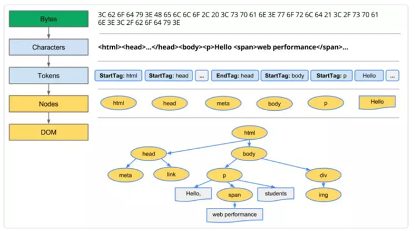

DOM树构建过程：当前节点的所有子节点都构建好后才会去构建当前节点的下一个兄弟节点。
2.构建CSSOM树
上述也提到了CSSOM的构建过程，也是树的结构，在最终计算各个节点的样式时，浏览器都会先从该节点的普遍属性（比如body里设置的全局样式）开始，再去应用该节点的具体属性。还有要注意的是，每个浏览器都有自己默认的样式表，因此很多时候这棵CSSOM树只是对这张默认样式表的部分替换。
3.生成render树
DOM树和CSSOM树合并生成render树

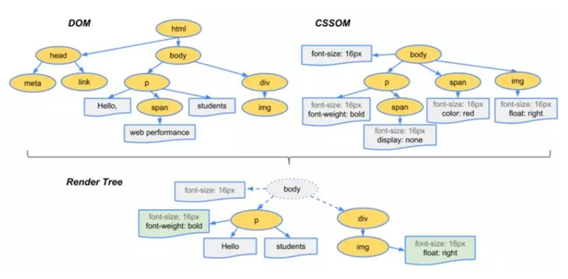


简单描述这个过程：
DOM树从根节点开始遍历可见节点，这里之所以强调了“可见”，是因为如果遇到设置了类似 display:none;的不可见节点，在render过程中是会被跳过的（但 visibility:hidden;opacity:0这种仍旧占据空间的节点不会被跳过render），保存各个节点的样式信息及其余节点的从属关系。
4.Layout 布局
有了各个节点的样式信息和属性，但不知道各个节点的确切位置和大小，所以要通过布局将样式信息和属性转换为实际可视窗口的相对大小和位置。
5.Paint 绘制
万事俱备，最后只要将确定好位置大小的各节点，通过GPU渲染到屏幕的实际像素。
Tips
	在上述渲染过程中，前3点可能要多次执行，比如js脚本去操作dom、更改css样式时，浏览器又要重新构建DOM、CSSOM树，重新render，重新layout、paint；
	Layout在Paint之前，因此每次Layout重新布局（reflow 回流）后都要重新触发Paint渲染，这时又要去消耗GPU；
	Paint不一定会触发Layout，比如改个颜色改个背景；（repaint 重绘）
	图片下载完也会重新触发Layout和Paint；

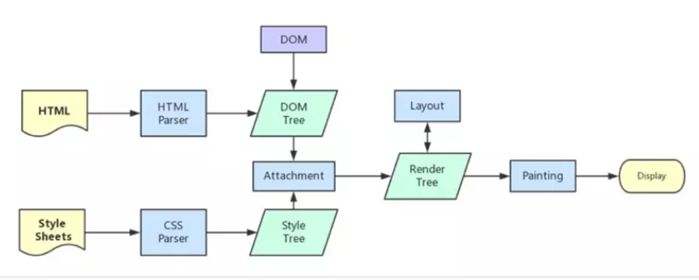


何时触发reflow和repaint
reflow(回流): 根据Render Tree布局(几何属性)，意味着元素的内容、结构、位置或尺寸发生了变化，需要重新计算样式和渲染树；
repaint(重绘): 意味着元素发生的改变只影响了节点的一些样式（背景色，边框颜色，文字颜色等），只需要应用新样式绘制这个元素就可以了；
reflow回流的成本开销要高于repaint重绘，一个节点的回流往往会导致子节点以及同级节点的回流；
GoogleChromeLabs 里面有一个csstriggers，列出了各个CSS属性对浏览器执行Layout、Paint、Composite的影响。
引起reflow回流
现代浏览器会对回流做优化，它会等到足够数量的变化发生，再做一次批处理回流。
1.	页面第一次渲染（初始化）
2.	DOM树变化（如：增删节点）
3.	Render树变化（如：padding改变）
4.	浏览器窗口resize
5.	获取元素的某些属性：
浏览器为了获得正确的值也会提前触发回流，这样就使得浏览器的优化失效了，这些属性包括offsetLeft、offsetTop、offsetWidth、offsetHeight、scrollTop/Left/Width/Height、clientTop/Left/Width/Height、调用了getComputedStyle()或者IE的currentStyle
引起repaint重绘
1.	reflow回流必定引起repaint重绘，重绘可以单独触发
2.	背景色、颜色、字体改变（注意：字体大小发生变化时，会触发回流）
优化reflow、repaint触发次数
	避免逐个修改节点样式，尽量一次性修改
	使用DocumentFragment将需要多次修改的DOM元素缓存，最后一次性append到真实DOM中渲染
	可以将需要多次修改的DOM元素设置 display:none，操作完再显示。（因为隐藏元素不在render树内，因此修改隐藏元素不会触发回流重绘）
	避免多次读取某些属性（见上）
	将复杂的节点元素脱离文档流，降低回流成本
为什么一再强调将css放在头部，将js文件放在尾部
DOMContentLoaded 和 load
	DOMContentLoaded 事件触发时，仅当DOM加载完成，不包括样式表，图片...
	load 事件触发时，页面上所有的DOM，样式表，脚本，图片都已加载完成
CSS 资源阻塞渲染
构建Render树需要DOM和CSSOM，所以HTML和CSS都会阻塞渲染。所以需要让CSS尽早加载（如：放在头部），以缩短首次渲染的时间。
JS 资源
阻塞浏览器的解析，也就是说发现一个外链脚本时，需等待脚本下载完成并执行后才会继续解析HTML。
这和之前文章提到的浏览器线程有关，浏览器中js引擎线程和渲染线程是互斥的，详见《从setTimeout-setInterval看JS线程》
普通的脚本会阻塞浏览器解析，加上defer或async属性，脚本就变成异步，可等到解析完毕再执行。
	async异步执行，异步下载完毕后就会执行，不确保执行顺序，一定在onload前，但不确定在DOMContentLoaded事件的前后
	defer延迟执行，相对于放在body最后（理论上在DOMContentLoaded事件前）
举个栗子
1.	<html>
2.	  <head>
3.	    <meta name="viewport" content="width=device-width,initial-scale=1">
4.	    <link href="style.css" rel="stylesheet">
5.	  </head>
6.	  <body>
7.	    <p>Hello <span>web performance</span> students!</p>
8.	    <div></div>
9.	    <script src="app.js"></script>
10.	  </body>
11.	</html>

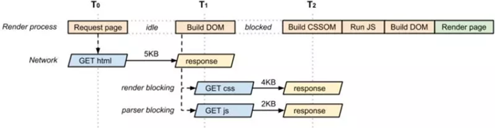


	浏览器拿到HTML后，从上到下顺序解析文档
	此时遇到css、js外链，则同时发起请求
	开始构建DOM树
	这里要特别注意，由于有CSS资源，CSSOM还未构建前，会阻塞js（如果有的话）
	无论JavaScript是内联还是外链，只要浏览器遇到 script 标记，唤醒 JavaScript解析器，就会进行暂停 blocked 浏览器解析HTML，并等到 CSSOM 构建完毕，才执行js脚本
	渲染首屏（DOMContentLoaded 触发，其实不一定是首屏，可能在js脚本执行前DOM树和CSSOM已经构建完render树，已经paint）
首屏优化Tips
说了这么多，其实可以总结几点浏览器首屏渲染优化的方向：
	减少资源请求数量（内联亦或是延迟动态加载）
	使CSS样式表尽早加载，减少@import的使用，因为需要解析完样式表中所有import的资源才会算CSS资源下载完
	异步js：阻塞解析器的 JavaScript 会强制浏览器等待 CSSOM 并暂停 DOM 的构建，导致首次渲染的时间延迟
	so on...
知道操作DOM成本多高了吗?
其实写了这么多，感觉偏题了，大量的资料参考的是chrome开发者文档。感觉js脚本资源那块还是有点乱，包括和DOMContentLoaded的关系，希望大家能多多指点，多多批评，谢谢大佬们。
操作DOM具体的成本，说到底是造成浏览器回流reflow和重绘reflow，从而消耗GPU资源。
参考文献
	https://developers.google.com/web/fundamentals/performance/critical-rendering-path/
已同步至个人博客-软硬皆施
Github 欢迎star :)
推荐阅读
（点击标题可跳转阅读）
你真的了解回流和重绘吗?
你不知道的 Virtual DOM（一）：Virtual Dom 介绍
React Fire：React DOM 的改造计划，使其更现代化

## 流式编程

>有时候也可以成为函数式编程。它的主要目的是在数据拉取的过程中渲染页面，即边处理数据边渲染页面。

类似概念：

- 流式应用：Rxjs
- 流式列表
- 流式处理：大数据、实时计算
- 文件处理、字节流、加密、网络

### 流式应用

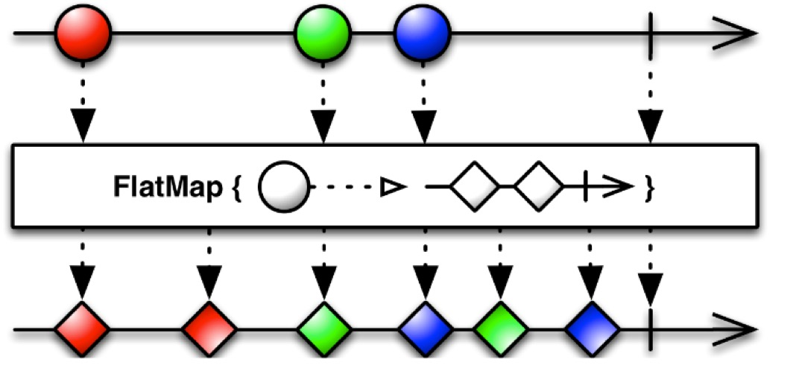

RxJS本身一直试图将数据、dom等前端元素看做流处理。它的思想其实就是流式编程思想的一种。如果你使用过RxJS，你会非常快速的理解流式编程的核心理念。

但是RxJS更多的是将操作，包括http请求、dom操作等看做流的形式，在普通请求、操作的基础上封装出了一个流的上层对象。它只能算做流式编程思想的其中一部分。流式编程更加的靠前，它包含了页面结构设计、请求顺序等一些列的东西。

### 瀑布流

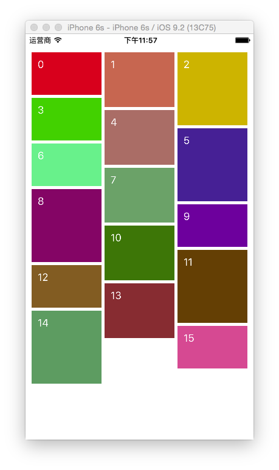

开发前端的同学或多或少都会遇到瀑布流页面，哪怕没开发过也见过、研究过。

瀑布流完全是将页面（一部分）看过了一个流式页面，如果页面向下流动，页面能够自然达到的顺序就是瀑布流希望/想要达到的效果。

流式编程思想更多的是提出页面整体上的流式，而不仅仅是页面的某一部分。假如你做的瀑布流页面是完全靠`position`绝对定位实现的。很抱歉，这样的页面仅仅是实现了瀑布流，但它不属于流式编程。流式编程提倡使用正常的文档流去开发。让页面渲染能够一泻而下，通畅而不阻塞。不需要重新绘制dom树才是流式编程在页面开发上的核心要点。

### 实时计算

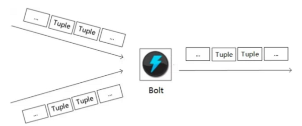

这里拿出实时计算就是为了让开发者能够从不同的方面去理解流式编程的思想。

不管是页面还是请求、甚至是各种操作等，将它们看做一个流，顺着网络请求的顺序，页面渲染逻辑的顺序向一点去前进。这个点就是流式编程。所有的东西都通过流式编程思想去处理，将它们混杂在一起，然后处理成一个一个单独块。这个块包含当时情况下最应该做的操作（dom、http、click等），然后打包出现在页面上。这个就是流式编程的核心思想。

### 流处理

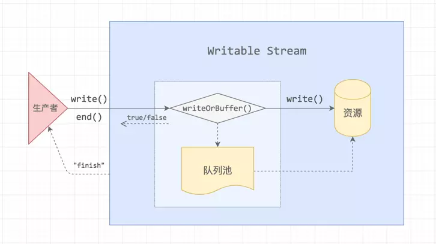

这里使用了流去举例是因为流的读写操作从概念上是非常贴合流式编程思想的。

从文件上开一个通道去获取数据，然后拿到的同时就做相应的处理，同时在处理完就将它们放出来。这个过程也就是流式编程思想在构思页面结构的时候想要做的。

### 页面结构

原始页面是嵌套的，但是去掉嵌套来看，整个页面是一个从上到下的渲染过程。在渲染的过程中如果触发页面重绘，或者是出现脱离文档流的样式，整个页面的性能就会下降。由此可见，前端结构是需要尽量流式的展示的。

从这个点出发就是流式编程中的dom结构流式编程。


从页面结构设计上考虑，首屏渲染的时间把握其实就是在考验开发者的流式编程思想。让页面尽可能早的呈现第一屏的dom结构，同时尽量早的加载完成第一屏的图片等资源文件。其他会对页面渲染阻塞都要往后排。

如果使用流式编程思想重新设计页面结构，单从结构上来说，一个首屏的渲染了不起20ms就到顶了，再加上各种资源加载，这些综合下来首页的加载速度一般可以提到500ms以内。这个时间才是首页渲染应该有的时间。如果是手机上，不考虑网络差的情况甚至可以做到300ms内打开页面。

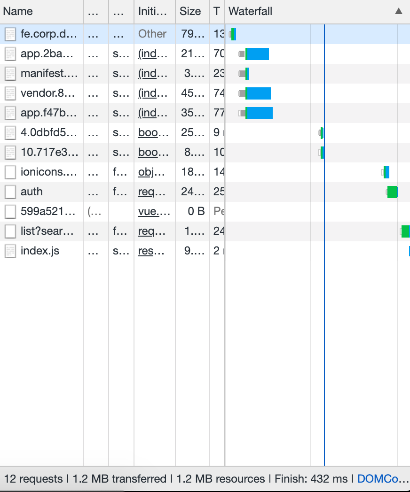

从图中可以看到，一部分请求在蓝色线左边，也就是页面必须使用到的。后面的4个请求是页面加载之后用到的，这几个请求是可以后加载的。其中1个是接口，然后几个是渲染页面用到的js文件。他们的顺序就是先渲染页面框架，然后再填充下面的内容。

真正的让页面飞起来，从页面结构上开始考虑。

### 接口请求

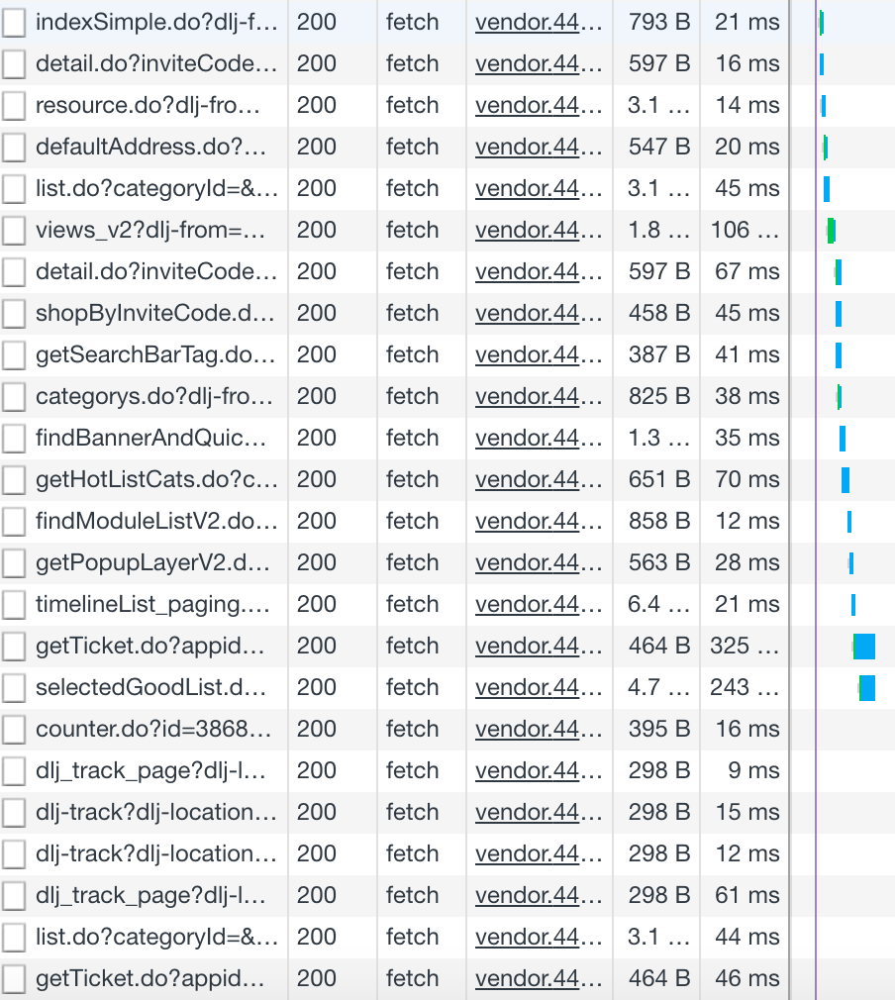

打开页面甚至在页面什么也没有展示的时候，接口就会请求数据。从上面的截图可以看到一个页面首次打开可以请求多少接口，甚至截图中的接口请求个数都不是非常多的那种。

有的页面请求3、5个，有的请求10多个。从整体上看，大多数接口是一个顺序请求的过程。它受到页面结构的影响，过快的请求反而渲染的不是所需要的地方。

页面的请求顺序就可以看做是一个流式的过程。将需要同步渲染的接口放在一起，等待结果返回之后再展示页面。剩下的几个不需要优先渲染的往后推，通过事件触发等方式在页面渲染之后再继续执行。

>tips:有些接口可以同时异步执行，使用并行请求，将页面渲染分离，可以加速页面的呈现。tips:多次请求需要多次握手，使用http2.0可以加速这个时间。合并接口可以直接去掉多余时间。

### 优化顺序

通过上面的分析，我们可以对流式编程有一个大概的印象，一些想法思路可以总结下来：

1. 按照页面渲染顺序做开发。没必要呈现的后渲染，可以加速页面展示。避免在页面加载过程中不断重绘。
2. 多余接口后请求，优先渲染第一屏。接口请求往往意味着后面有一些逻辑需要执行，将不需要第一时间请求的接口往后放可以节省很多加载时间，就像分页加载一样加载页面，页面可以更快打开。
3. 从结构上优化。先加载的先请求，先呈现的先计算，后加载的排队来，后呈现的叠加计算。这里的排队可以类比分页加载来思考怎么实现。叠加计算更多的是在当前状态上更新新的页面。

### 单接口情况

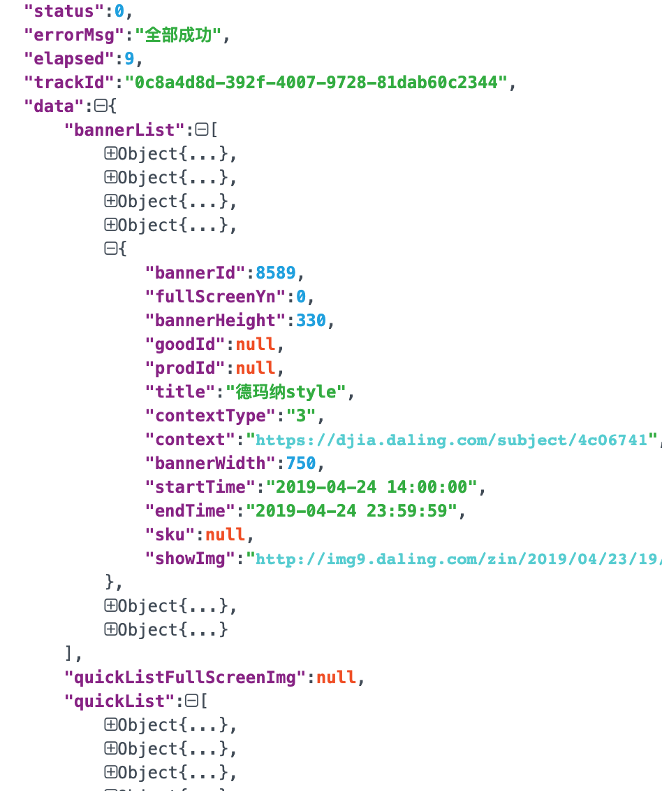

单接口的时候会遇到数据量大，结构复杂。页面结构也会相应的增长复杂度。面对这种一次性接收大量数据的情况下，最优先考虑是优化数据结构。将大的复杂的结构分化成合适的小的结构，这样分解之后再使用会减少很多开发过程中的麻烦。把问题前置，预先处理复杂的数据，后面用到的时候才会更合适。同时，如果数据结构还有变化，也能够及时的调整应对。

应对这种情况，我们可以从几个方面入口去优化。

1. 加速接口返回速度。这个往往比较容易。

   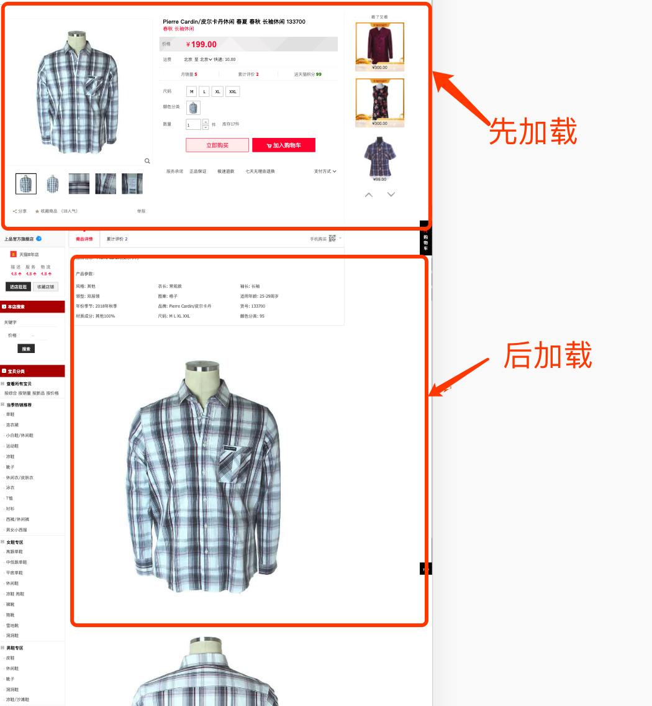

2. 分析页面结构，将页面分成不同侧重点的部分。比如商品详情这个页面，可以分成商品简略信息和详情2个部分。其中简略信息包含几个头图、价格、卖点等信息。详情包含规格、复杂的介绍内容。（如果有需要，价格也可以分开，将价格单独分成一个接口）

3. 数据适配。我们已经将页面分成了2个部分，这里就可以单独把第一个部分放在一个对象中做渲染。这里使用vue、react等框架会得到非常及时的渲染结果，省下了大量的dom操作时间。剩下的部分放在滑动事件中，滑动页面的时候再渲染。

   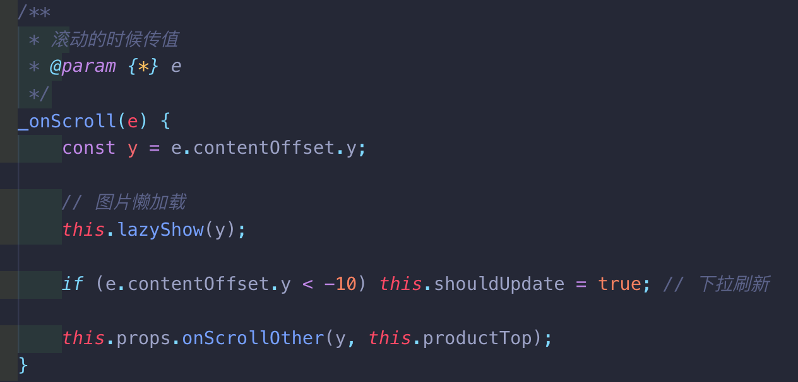

4. 异步加载。这里继续使用商品详情的例子。当用户点击或者下滑的时候需要展示商品的各种规格、宣传图等。我们可以先渲染容器，保证页面结构的统一化。然后再根据页面当前位置逐步加载需要显示的图片等资源。这里同时也会涉及到超长列表的优化。其实非常简单，就是保持容器不变，内部渲染内容在超出屏幕之后删除，保证页面上的dom数量不至于太多。

上面的几点初步展示了怎么样优化一个大数据块的页面。正在遇到这个问题的同学可以根据这个思路去思考解决方案了。

### 多接口

多接口的情况往往是需要并行的和需要并发的接口齐上阵，一不注意就造成接口阻塞。

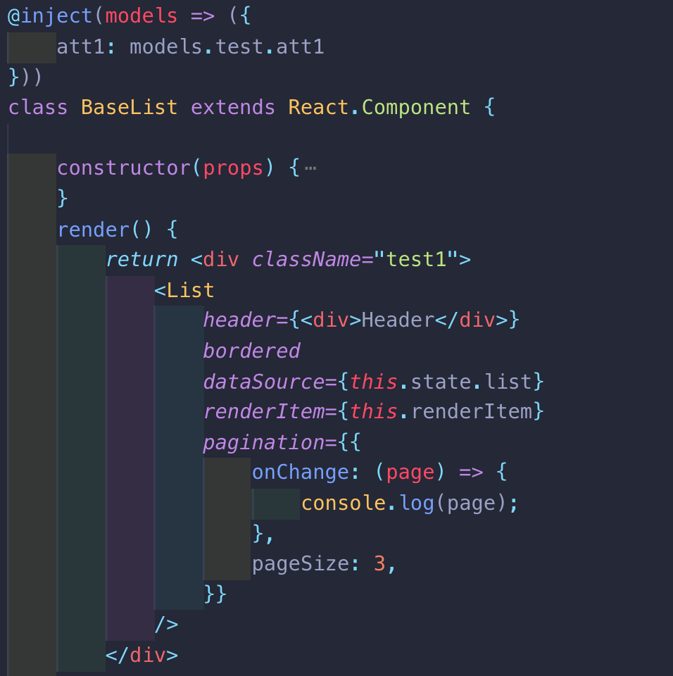

1. 首先分析出页面具有哪些不同的部分。这些不同的部分的结构要隔离开，方便做不同的逻辑处理。这里推荐组件化形式处理，可以更方便的隔离不同的逻辑结构。

   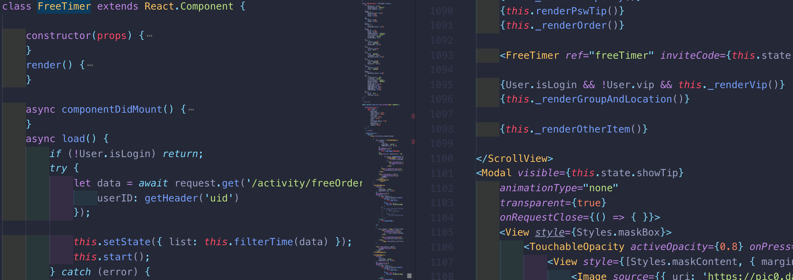

2. 接口处理。后端基于某些（不靠谱）考虑会出几种不同的接口。这个时候前端更多的是区分接口的优先级和功能域。相同功能依赖的接口同步等待。不同的功能域之间梳理加载顺序。如果发现功能域不是优先展示的，可以放在异步或者触发式功能域中。
3. 先返回的数据先渲染，后返回的数据后渲染。多种渲染使用组件分离。

>这里提到了一个功能域，这其实是一个领域的概念。一个功能域包含特定的页面结构、依赖的接口。这里可以看做一个组件，内部包含了页面结构接口请求。

### 实时+触发

这个场景更多的出现在交互比较频繁的地方。比如一个按钮可以无限次的点击，滚动的时候有一个出现隐藏的动画/结构等。

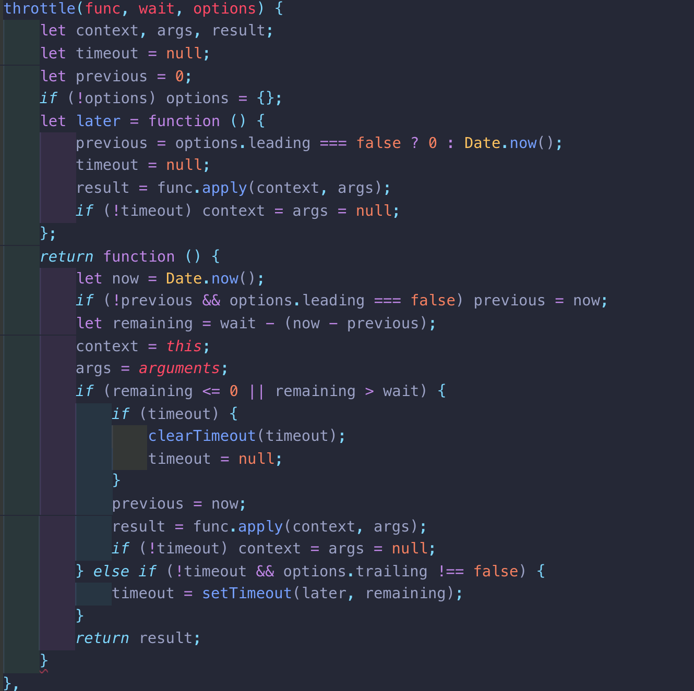

1. 如果一个操作多次触发，为了保持反馈/动画的稳定性，这里是一定要做控制的。典型的解决方式就是节流函数控制。或者也可以考虑从展示逻辑上处理，实现更简单。上滑的时候出现滑动小动画，如果不懂上滑其实只需要做一次动画即可。只有上一次动画做完才会执行下一个动画。这其实也是最简单的流式思想。

   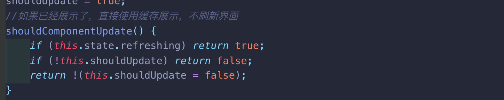

2. 如果一个页面可能会多次展示隐藏，同时内部的数据是异步获取的。这个场景下优先考虑缓存渲染结果，第一次的时候加载数据，后面在展示的时候其实一直在用一个缓存来渲染结果。从流程上看就简化为了data=>dom。

### 复杂页面

复杂的页面跟多的是上面几种的组合。只要能够识别到那些地方归属那种情况，再去优化就有一个清晰的目标了。

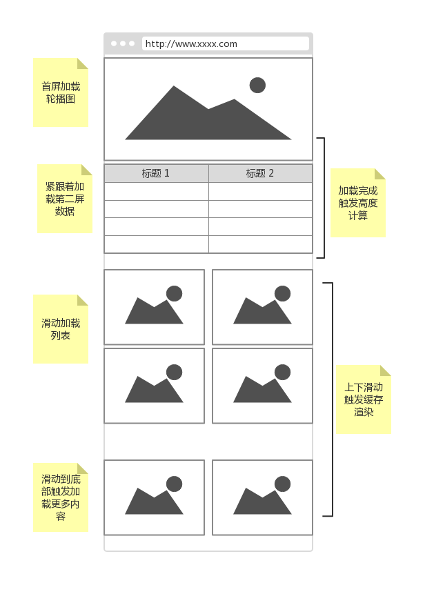

1. 产品级分析。看到原型或者UI的时候基本就能够知道页面未来会长什么样子了。这个时候也就是一个复杂的页面最应该开始构思结构的时候。分析页面功能点，区分哪些是先展示，哪些是触发之后展示。然后设计页面结构，隔离不同展示区域。
2. 不同的结构使用不同的接口，接口之间也是分属不同的功能域。如果一个接口内容特别多，可以从逻辑上将一个接口分成好几个部门处理。尤其是要渲染很多内容的时候，分开渲染速度更快。
3. 有些结构完全可以设计到触发之后再加载。比如第二屏展示的内容，点击之后才能看到的地方等。

## 总结

流式编程将页面结构看做数据，多个数据并行展示看做一个整体。通过这样宏观的抽象整理，将页面变成了一个流动的对象。从根本上改变了开发的形态。

在实际开发中使用流式编程思想可以很容易的开发出高性能的页面。页面渲染更快，展示更合理。同时反过来加速了代码结构的进化，促进开发者思考和成长。
