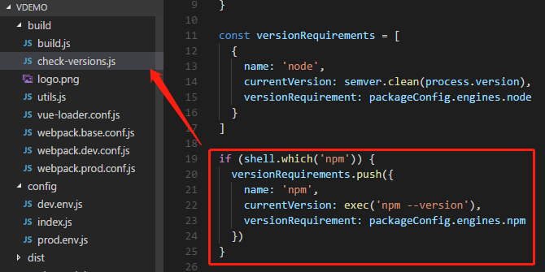
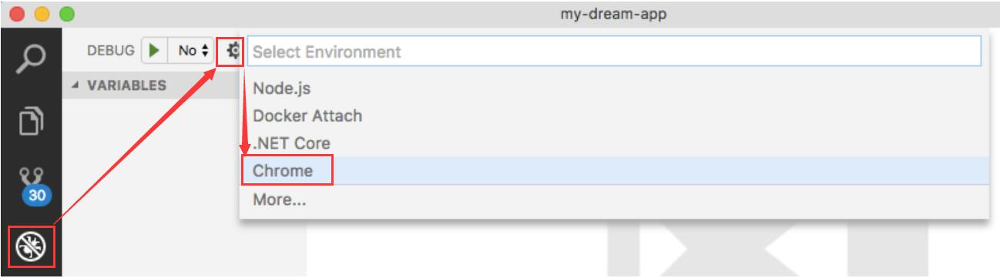

# 附录

## 目录

1. [浏览器问题](#浏览器问题)
2. [前端问题](#前端问题)
3. [参考](#参考)
   - [开发工具](#开发工具)

## 浏览器问题

1、谷歌浏览器出现“错误代码：ERR_UNSAFE_PORT”的解决办法

>出错原因：谷歌浏览器（FF浏览器也有）对一些特殊的端口进行了限制  
>解决方法：最简单的办法就是直接修改搭建项目的端口号，避开这些谷歌限制的端口号。

```sh
# 谷歌浏览器限制的一些端口号：
1：    // tcpmux
7：    // echo
9：    // discard
11：   // systat
13：   // daytime
15：   // netstat
17：   // qotd
19：   // chargen
20：   // ftp data
21：   // ftp access
22：   // ssh
23：   // telnet
25：   // smtp
37：   // time
42：   // name
43：   // nicname
53：   // domain
77：   // priv-rjs
79：   // finger
87：   // ttylink
95：   // supdup
101：  // hostriame
102：  // iso-tsap
103：  // gppitnp
104：  // acr-nema
109：  // pop2
110：  // pop3
111：  // sunrpc
113：  // auth
115：  // sftp
117：  // uucp-path
119：  // nntp
123：  // NTP
135：  // loc-srv /epmap
139：  // netbios
143：  // imap2
179：  // BGP
389：  // ldap
465：  // smtp+ssl
512：  // print / exec
513：  // login
514：  // shell
515：  // printer
526：  // tempo
530：  // courier
531：  // chat
532：  // netnews
540：  // uucp
556：  // remotefs
563：  // nntp+ssl
587：  // stmp?
601：  // ??
636：  // ldap+ssl
993：  // ldap+ssl
995：  // pop3+ssl
2049： // nfs
3659： // apple-sasl / PasswordServer
4045： // lockd
6000： // X11
6665： // Alternate IRC [Apple addition]
6666： // Alternate IRC [Apple addition]
6667： // Standard IRC [Apple addition]
6668： // Alternate IRC [Apple addition]
6669： // Alternate IRC [Apple addition]
```

2、谷歌浏览器无法拖拽离线安装CRX格式插件

>解决方法：  
>(1) 开启开发者模式（chrome的设置 -> 更多工具 -> 扩展程序）  
>(2) 修改参数：chrome://flags/#extensions-on-chrome-urls，Extensions on chrome://URLs 改成 Enabled  
>(3) 将插件的后缀名.crx改为.zip或者.rar，解压，然后在扩展程序页（已开启开发者模式）加载已解压的扩展程序

## 前端问题

1、npm run build 卡住

>解决方法：注释掉 build/check-versions.js 中检测代码



## 参考

1. [想旅游咯](https://www.cnblogs.com/zuobaiquan01/)
2. [洛城风起](http://www.195440.com/author/195440)

### 开发工具

如你所知，一直以来，前端开发领域并没有一款特别好用的开发和调试工具。

- WebStorm 很强大，但是吃资源很严重。
- Sublime Text 插件很多，可惜要收费，而国内的企业还没有养成花钱购买开发工具的习惯。
- Chrome 的开发者工具很好用，但是要直接调试 TypeScript 很麻烦。

因此，Visual Studio Code（简称 VS Code）才会呈现出爆炸性增长的趋势。它是微软开发的一款[前端编辑器](https://github.com/Microsoft/vscode)，完全开源免费。VS Code 底层是 Electron，界面本身是用 TypeScript 开发的。对于 Angular 开发者来说，当然要强烈推荐 VS Code。最值得一提的是，从 1.14 开始，可以直接在 VS Code 里面调试 TypeScript 代码。

<b>第一步：环境配置</b>

- 确保 Chrome 安装在默认位置。
- 确保 VS Code 里面安装了 Debugger for Chrome 这个插件。
- 把 @angular/cli 安装到全局空间 `npm install -g @angular/cli`，国内用户请使用 cnpm 进行安装。注意，你最好升级到最新版本的 @angular/cli，避免版本兼容问题。
- 用 @angular/cli 创建新项目 `ng new my-app`，本来就已经用 @angular/cli 创建的项目请忽略这一步，继续往下走，因为只要是 cli 创建的项目，后面的步骤都是有效的。
- 用 VS Code 打开项目，进入项目根目录。

<b>第二步：配置 launch.json</b>



请参照以上步骤打开 launch.json 配置文件。

请把你本地 launch.json 文件里面的内容改成这样：

```json
{
    "version": "0.2.0",
    "configurations": [
        {
            "type": "chrome",
            "request": "launch",
            "name": "Chrome",
            "url": "http://localhost:4200",
            "webRoot": "${workspaceRoot}"
        }
    ]
}
```

<b>第三步：开始 Debug</b>

在你的 app.component.ts 的构造函数里面打个断点；打开终端，进入项目根目录，运行 `ng serve` 启动项目，**然后从 VS Code 的 debug 界面启动 Chrome**

>注意，你可能需要 F5 刷新一下 Chrome 才能进入断点！

VSCode 的插件市场上有大量的插件可供选择，比如彩虹缩进、智能提示、自动补齐标签之类的功能，将会大幅度提升你的开发效率，这里列出了 10 款我自己日常使用的插件供你参考，详见[这里](http://www.ngfans.net/topic/195/post)。

***webpack-bundle-analyzer***

在真实的业务项目中，我们会用到大量的第三方开源组件，例如图形库 ECharts、组件库 PrimeNG 等。

有很多开发者在引入这些组件库之后，没有注意到体积问题，导致最终编译出来的包体积过大。

webpack-bundle-analyzer 的用法和详细文档详见[这里](https://github.com/webpack-contrib/webpack-bundle-analyzer)。
