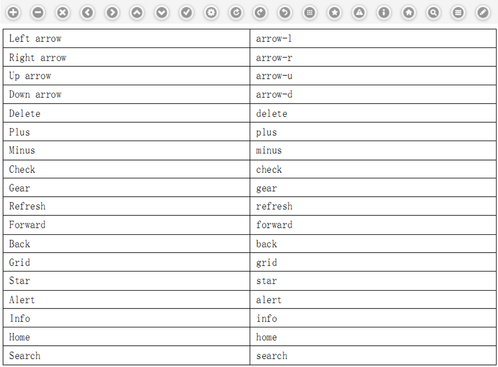

# jQMobile

jQuery Mobile是jQuery的移动版本，懂基本的jQuery知识，会简单的html + css就可以完成很多复杂的功能。
基本组成
1、<meta name="viewport" content="width=device-width" /> 
通常情况移动设备以900px的宽度显示页面，加上这句话，可以使页面的宽度与移动设备的屏幕宽度相同
2、页面基本组成

	
头部

	
内容

	
底部

第一个示例：
<!DOCTYPE html>
<html>
<head>
	<title>jQuery Mobile页面框架</title>
	<meta name="viewport" content="width=device-width"/>
	<meta charset="utf-8">
	<link type="text/css" rel="Stylesheet" href="Css/jquery.mobile-1.0.1.min.css"/>
	
	
</head>
<body>
	<section id="page1" data-role="page">
		<header data-role="header"><h1>标题</h1></header>
		

这是内容

		<footer data-role="footer"><h1>这是底部</h1></footer>
	</section>
</body>
</html>

HTML 4.01 / XHTML 1.0 
<body>
	
...

	
...

	
...

	
...

	
...

</body>
HTML5中
<body>
	<header>...</header>
	<nav>...</nav>
	
...

	<aside>...</aside>
	<footer>...</footer>
</body>
不同的页面可以写在一个文件中，通过id分隔。
页面跳转
1、第一种页面跳转
<a href="dialog/index.html" data-role="button" data-rel="back" data-theme="c">Cancel</a>
data-rel="back" 属性将忽视href属性
默认data-ajax="true"，jQuery Mobile是默认通过ajax切换页面的，可以设置data-ajax="false"，不通过ajax切换页面
2、第二种页面跳转
<a href="index2.htm">第 2 页</a>
页面事件：
Page Initialization - 页面创建前，创建时，初始化后
(pagebeforecreate, pagecreate, pageinit)
Page Load/UnLoad - 当外部页面加载时、卸载时或遭遇失败时
(pagebeforeload, pageload)
Page Transition - 在页面过渡之前或之后
(pagebeforeshow, pageshow, pagebefoehide, pagehide)
对话框
通过设置data-rel="dialog"，来打开一个对话框。
<a href="foo.html" data-rel="dialog">Open dialog</a>
对话框过渡效果
<a href="foo.html" data-rel="dialog" data-transition="pop">Open dialog</a>
属性可选值：pop(默认),fade,flip,turn,flow,slidefade,slide,slideup,slidedown,none
按钮
1、设置链接的data-role，使其变成按钮。
<a href="index.html" data-role="button">Link button</a>
2、html5中的button，普通button、提交button、重置button 
<form>
<button>Button</button>
<input value="Input" type="button">
<input value="Submit" type="submit">
<input value="Reset" type="reset">
</form>
3、设置data-inline="true"把button转换成内联的button
说明：默认情况下按钮是会占据整个网页一行的，如果想要按钮只占据本身的大小，则需要设置为内联，设置data-inline="true"即可。
<a href="#" data-role="button" data-inline="true">True</a>
<a href="#" data-role="button" data-inline="true">False</a>
4、data-theme="a"设置button的内置样式
<a href="#" data-role="button" data-theme="a" data-inline="true">A</a>
<a href="#" data-role="button" data-theme="b" data-inline="true">B</a>
<a href="#" data-role="button" data-theme="c" data-inline="true">C</a>
<a href="#" data-role="button" data-theme="d" data-inline="true">D</a>
<a href="#" data-role="button" data-theme="e" data-inline="true">E</a>
效果如下：

5、设置data-mini，使按钮变小。
注意data-mini和data-inline的区别
<a href="#" data-role="button" data-mini="true" data-inline="true">Cancel</a>
<a href="#" data-role="button" data-mini="true" data-inline="true" data-icon="check" data-theme="b">Place order</a>

带图标的按钮
1、常见的data-icon,data-icon="arrow-l"设置按钮图标

<a href="#" data-role="button" data-icon="plus" data-iconpos="notext" data-theme="c" data-inline="true">Plus</a>
<a href="#" data-role="button" data-icon="minus" data-iconpos="notext" data-theme="c" data-inline="true">Minus</a>
<a href="#" data-role="button" data-icon="delete" data-iconpos="notext" data-theme="c" data-inline="true">Delete</a>
<a href="#" data-role="button" data-icon="arrow-l" data-iconpos="notext" data-theme="c" data-inline="true">Arrow left</a>
<a href="#" data-role="button" data-icon="arrow-r" data-iconpos="notext" data-theme="c" data-inline="true">Arrow right</a>
<a href="#" data-role="button" data-icon="arrow-u" data-iconpos="notext" data-theme="c" data-inline="true">Arrow up</a>
<a href="#" data-role="button" data-icon="arrow-d" data-iconpos="notext" data-theme="c" data-inline="true">Arrow down</a>
<a href="#" data-role="button" data-icon="check" data-iconpos="notext" data-theme="c" data-inline="true">Check</a>
<a href="#" data-role="button" data-icon="gear" data-iconpos="notext" data-theme="c" data-inline="true">Gear</a>
<a href="#" data-role="button" data-icon="refresh" data-iconpos="notext" data-theme="c" data-inline="true">Refresh</a>
<a href="#" data-role="button" data-icon="forward" data-iconpos="notext" data-theme="c" data-inline="true">Forward</a>
<a href="#" data-role="button" data-icon="back" data-iconpos="notext" data-theme="c" data-inline="true">Back</a>
<a href="#" data-role="button" data-icon="grid" data-iconpos="notext" data-theme="c" data-inline="true">Grid</a>
<a href="#" data-role="button" data-icon="star" data-iconpos="notext" data-theme="c" data-inline="true">Star</a>
<a href="#" data-role="button" data-icon="alert" data-iconpos="notext" data-theme="c" data-inline="true">Alert</a>
<a href="#" data-role="button" data-icon="info" data-iconpos="notext" data-theme="c" data-inline="true">Info</a>
<a href="#" data-role="button" data-icon="home" data-iconpos="notext" data-theme="c" data-inline="true">Home</a>
<a href="#" data-role="button" data-icon="search" data-iconpos="notext" data-theme="c" data-inline="true">Search</a>
<a href="#" data-role="button" data-icon="bars" data-iconpos="notext" data-theme="c" data-inline="true">Bars</a>
<a href="#" data-role="button" data-icon="edit" data-iconpos="notext" data-theme="c" data-inline="true">Edit</a>

2、设置按钮的显示位置data-iconpos="left"

Left 左边按钮
Right 右边按钮
Top 上边按钮
Bottom 底部按钮
Notext  只显示按钮不显示文字
<a href="#" data-role="button" data-inline="true">Text only</a>
<a href="#" data-role="button" data-icon="arrow-l" data-iconpos="left" data-inline="true">Left</a>
<a href="#" data-role="button" data-icon="arrow-r" data-iconpos="right" data-inline="true">Right</a>
<a href="#" data-role="button" data-icon="arrow-u" data-iconpos="top" data-inline="true">Top</a>
<a href="#" data-role="button" data-icon="arrow-d" data-iconpos="bottom" data-inline="true">Bottom</a>
<a href="#" data-role="button" data-icon="delete" data-iconpos="notext" data-inline="true">Icon only</a>
按钮组
通过在多个按钮外添加一个DIV，并设置data-role="controlgroup"，这样就可以组成一个按钮组。默认按钮组是垂直显示的，如果要使其水平显示，需要设置DIV的data-type="horizontal"。
1、默认按钮组

<a href="#" data-role="button">Timeline</a>
<a href="#" data-role="button">Mentions</a>
<a href="#" data-role="button">Retweets</a>

2、水平按钮组

<a href="#" data-role="button">Yes</a>
<a href="#" data-role="button">No</a>
<a href="#" data-role="button">Maybe</a>

3、迷你按钮组

<a href="#" data-role="button" data-iconpos="notext" data-icon="plus" data-theme="b">Add</a>
<a href="#" data-role="button" data-iconpos="notext" data-icon="delete" data-theme="b">Del</a>
<a href="#" data-role="button" data-iconpos="notext" data-icon="grid" data-theme="b">More</a>

4、控制按钮样式（data-iconshadow属性）控制圆角（角），阴影（数据阴影），图标有阴影的亮点。
<a href="#" data-role="button" data-icon="gear" data-theme="b">Default</a>
<a href="#" data-role="button" data-icon="gear" data-corners="false" data-theme="b">No rounded corners</a>
<a href="#" data-role="button" data-icon="gear" data-shadow="false" data-theme="b">No button shadow</a>
<a href="#" data-role="button" data-icon="gear" data-iconshadow="false" data-theme="b">No icon disc shadow</a>
5、设置按钮disabled。
<a href="#" data-role="button" class="ui-disabled">Disabled anchor via class</a>
<form>
<button disabled="">Button with disabled attribute</button>
<input value="Input with disabled attribute" disabled="" type="button">
</form>
表单
1、单行输入框
(1)普通文本框：
<input type="text" name="name" id="basic" value=""/>
(2)只能输入数字的文本框 Number+[0-9]*pattern: 
<label for="number-pattern">Number+[0-9]*pattern:</label>
<input name="number" pattern="[0-9]*" id="number-pattern" value="" type="number">
(3)文件文本框
<label for="file">File:</label>
<input name="file" id="file" value="" type="file">
(4)密码文本框
<label for="password">Password:</label>
<input name="password" id="password" value="" autocomplete="off" type="password">
(5)鼠标点击内容消失的文本框
<label for="textinput-hide" class="ui-hidden-accessible">TextInput:</label>
<input name="textinput-hide" id="textinput-hide" placeholder="Text input" value="" type="text">
(6)禁用的文本框
<input disabled="disabled" name="textinput-disabled" id="textinput-disabled" placeholder="Text input" value="" type="text">
(7)data-role="fieldcontain" 将表单（form）元素一对一对的管理起来。

<label for="select-native-fc">Native select:</label>
<select name="select-native-fc" id="select-native-fc">
<option value="small">One</option>
<option value="medium">Two</option>
<option value="large">Three</option>
</select>

(8)data-role="none"属性普通的样式在移动设备上显示
<label for="foo">
<select name="foo" id="foo" data-role="none">
<option value="a">A</option>
<option value="b">B</option>
<option value="c">C</option>
</select>
(9)number 类型
<input name="number" id="number" value="0" type="number">
2、单行容器

<label for="name">TextInput:</label>
<input type="text" name="name" id="name" value=""/>

3、多行输入框

<label for="textarea">Textarea:</label>
<textarea name="textarea" id="textarea"></textarea>

4、搜索输入框

<label for="search-2">Search Input:</label>
<input type="search" name="search-2" id="search-2" value=""/>

5、滑块输入
(1)普通滑块

<label for="slider-2">Input slider:</label>
<input type="range" name="slider-2" id="slider-2" value="25" min="0" max="100"/>

(2)填充fill滑块
<input name="slider-fill" id="slider-fill" value="60" min="0" max="1000" step="50" data-highlight="true" type="range">
(3)填充迷你滑块
<input name="slider-fill-mini" id="slider-fill-mini" value="40" min="0" max="100" data-mini="true" data-highlight="true" data-theme="b" data-track-theme="d" type="range">
(4)组滑块
<form>

<label for="range-1a">Rangeslider:</label>
<input name="range-1a" id="range-1a" min="0" max="100" value="40" type="range">
<label for="range-1b">Rangeslider:</label>
<input name="range-1b" id="range-1b" min="0" max="100" value="80" type="range">

</form>
(5)迷你组滑块
<form>

<label for="range-2a">Mini rangeslider:</label>
<input name="range-2a" id="range-2a" min="0" max="100" value="40" type="range">
<label for="range-2b">Mini rangeslider:</label>
<input name="range-2b" id="range-2b" min="0" max="100" value="80" type="range">

</form>
6、翻转开关
(1)普通的反转开关
<label for="slider2">Flip switch:</label>
<select name="slider2" id="slider2" data-role="slider">
<option value="off">Off</option>
<option value="on">On</option>
</select>
(2)迷你型的反转开关
<label for="slider-flip-m">Mini flip switch:</label>
<select name="slider-flip-m" id="slider-flip-m" data-role="slider" data-mini="true">
<option value="off">No</option>
<option value="on" selected="">Yes</option>
</select>
7、复选框
<fieldset>标签将表单内容的一部分打包，生成一组相关表单的字段。
(1)普通复选框
<fieldset data-role="controlgroup">
<legend>Checkboxes, vertical controlgroup:</legend>
<input name="checkbox-1a" id="checkbox-1a" checked="" type="checkbox">
<label for="checkbox-1a">Cheetos</label>
<input name="checkbox-2a" id="checkbox-2a" type="checkbox">
<label for="checkbox-2a">Doritos</label>
<input name="checkbox-3a" id="checkbox-3a" type="checkbox">
<label for="checkbox-3a">Fritos</label>
<input name="checkbox-4a" id="checkbox-4a" type="checkbox">
<label for="checkbox-4a">Sun Chips</label>
</fieldset>
(2)小复选框
<fieldset data-role="controlgroup" data-type="horizontal" data-mini="true">
<legend>Checkboxes, mini, horizontal controlgroup:</legend>
<input name="checkbox-6" id="checkbox-6" type="checkbox">
<label for="checkbox-6">b</label>
<input name="checkbox-7" id="checkbox-7" checked="" type="checkbox">
<label for="checkbox-7"><em>i</em></label>
<input name="checkbox-8" id="checkbox-8" type="checkbox">
<label for="checkbox-8">u</label>
</fieldset>
8、单选按钮Radio buttons
(1)普通单选按钮
<fieldset data-role="controlgroup">
<legend>Radio buttons, vertical controlgroup:</legend>
<input name="radio-choice-1" id="radio-choice-1" value="choice-1" checked="checked" type="radio">
<label for="radio-choice-1">Cat</label>
<input name="radio-choice-1" id="radio-choice-2" value="choice-2" type="radio">
<label for="radio-choice-2">Dog</label>
<input name="radio-choice-1" id="radio-choice-3" value="choice-3" type="radio">
<label for="radio-choice-3">Hamster</label>
<input name="radio-choice-1" id="radio-choice-4" value="choice-4" type="radio">
<label for="radio-choice-4">Lizard</label>
</fieldset>
(2)迷你单选按钮
<fieldset data-role="controlgroup" data-type="horizontal" data-mini="true">
<legend>Radio buttons, mini, horizontal controlgroup:</legend>
<input name="radio-choice-b" id="radio-choice-c" value="list" checked="checked" type="radio">
<label for="radio-choice-c">List</label>
<input name="radio-choice-b" id="radio-choice-d" value="grid" type="radio">
<label for="radio-choice-d">Grid</label>
<input name="radio-choice-b" id="radio-choice-e" value="gallery" type="radio">
<label for="radio-choice-e">Gallery</label>
</fieldset>
9、下拉框
(1)普通下拉框
<label for="select-choice-1"class="select">Select,native menu</label>
<select name="select-choice-1" id="select-choice-1">
<option value="standard">Standard:7 day</option>
<option value="rush">Rush:3 days</option>
<option value="express">Express:next day</option>
<option value="overnight">Overnight</option>
</select>
(2)迷你下拉框
<label for="select-choice-mini"class="select">Mini select, inline</label>
<select name="select-choice-mini" id="select-choice-mini" data-mini="true" data-inline="true">
<option value="standard">Standard:7 day</option>
<option value="rush">Rush:3 days</option>
<option value="express">Express:next day</option>
<option value="overnight">Overnight</option>
</select>
(3)自定义弹出式选择菜单data-native-menu="false" 
<label for="select-choice-a"class="select">Custom selectmenu:</label>
<select name="select-choice-a" id="select-choice-a" data-native-menu="false">
<option>Custom menu example</option>
<option value="standard">Standard:7 day</option>
<option value="rush">Rush:3 days</option>
<option value="express">Express:next day</option>
<option value="overnight">Overnight</option>
</select>
(4)Multi-select with optgroups, custom icon and position: 
<label for="select-choice-8" class="select">Multi-select with optgroups, custom icon and position:</label>
<select name="select-choice-8" id="select-choice-8" multiple="multiple" data-native-menu="false" data-icon="grid" data-iconpos="left">
<option>Choose a few options:</option>
<optgroup label="USPS">
<option value="standard" selected="">Standard:7 day</option>
<option value="rush">Rush:3 days</option>
<option value="express">Express:next day</option>
<option value="overnight">Overnight</option>
</optgroup>
<optgroup label="FedEx">
<option value="firstOvernight">First Overnight</option>
<option value="expressSaver">Express Saver</option>
<option value="ground">Ground</option>
</optgroup>
</select>

列表
1、基础列表
<ul data-role="listview"data-theme="g">
<li><a href="acura.html">Acura</a></li>
<li><a href="audi.html">Audi</a></li>
<li><a href="bmw.html">BMW</a></li>
</ul>
2、带序号的列表
使用ol替换ul即可
3、带连接的ul
(1)	普通
<ul data-role="listview">
<li><a href="#">Acura</a></li>
<li><a href="#">Audi</a></li>
<li><a href="#">BMW</a></li>
<li><a href="#">Cadillac</a></li>
<li><a href="#">Ferrari</a></li>
</ul>
(2)	data-inset="true"属性
<ul data-role="listview"data-inset="true">
<li><a href="#">Acura</a></li>
<li><a href="#">Audi</a></li>
<li><a href="#">BMW</a></li>
<li><a href="#">Cadillac</a></li>
<li><a href="#">Ferrari</a></li>
</ul>
4、带图标的列表

(1)	 Icons: 16x16的小图标
<ul data-role="listview"data-inset="true">
<li>
<a href="#">
France
</a>
</li>
<li>
<a href="#">
Germany
</a>
</li>
<li>
<a href="#">
Great Britain
</a>
</li>
<li>
<a href="#">
Finland
</a>
</li>
<li>
<a href="#">
United States
</a>
</li>
</ul>

(1)	Thumbnails图文列表
<ul data-role="listview"data-inset="true">
<li>
<a href="#">

<h2>Broken Bells</h2>

Broken Bells

</a>
</li>
<li>
<a href="#">

<h2>Warning</h2>

Hot Chip

</a>
</li>
<li>
<a href="#">

<h2>Wolfgang Amadeus Phoenix</h2>

Phoenix

</a>
</li>
</ul>

5、带分隔的列表
<ul data-role="listview" data-split-icon="gear">
<ul data-role="listview"data-split-icon="gear"data-split-theme="d"data-inset="true">
<li>
<a href="#">

<h2>Broken Bells</h2>

Broken Bells

</a>
<a href="#purchase"data-rel="popup"data-position-to="window"data-transition="pop">Purchase album</a>
</li>
<li>
<a href="#">

<h2>Warning</h2>

Hot Chip

</a>
<a href="#purchase"data-rel="popup"data-position-to="window"data-transition="pop">Purchase album</a>
</li>
<li>
<a href="#">

<h2>Wolfgang Amadeus Phoenix</h2>

Phoenix

</a>
<a href="#purchase"data-rel="popup"data-position-to="window"data-transition="pop">Purchase album</a>
</li>
</ul>

<h3>Purchase Album?</h3>

Your download will begin immediately on your mobile device when you purchase.

<a href="index.html"data-role="button"data-rel="back"data-theme="b"data-icon="check"data-inline="true"data-mini="true">Buy: $10.99</a>
<a href="index.html"data-role="button"data-rel="back"data-inline="true"data-mini="true">Cancel</a>

6、分类列表
<li data-role="list-divider">A</li>
<ul data-role="listview"data-inset="true">
<li data-role="list-divider">
    Friday, October 8,20102
</li>
<li>
<a href="index.html">
<h2>Stephen Weber</h2>

<strong>You've been invited to a meeting at Filament Group in Boston, MA</strong>

Hey Stephen,if you're available at 10am tomorrow, we've got a meeting with the jQuery team.

<strong>6:24</strong>PM

</a>
</li>
<li>
<a href="index.html">
<h2>jQuery Team</h2>

<strong>Boston Conference Planning</strong>

In preparation for the upcoming conference in Boston, we need to start gathering a list of sponsors and speakers.

<strong>9:18</strong>AM

</a>
</li>
<li data-role="list-divider">
    Thursday, October 7,20101
</li>
<li>
<a href="index.html">
<h2>Avery Walker</h2>

<strong>Re: Dinner Tonight</strong>

Sure, let's plan on meeting at Highland Kitchen at 8:00 tonight. Can't wait!

<strong>4:48</strong>PM

</a>
</li>
</ul>

7、data-role="collapsible"
可折叠的listview

<h2>Choose a car model...</h2>
<ul data-role="listview"data-filter="true">
<li><a href="index.html">Acura</a></li>
<li><a href="index.html">Audi</a></li>
<li><a href="index.html">BMW</a></li>
<li><a href="index.html">Cadillac</a></li>
<li><a href="index.html">Chrysler</a></li>
<li><a href="index.html">Dodge</a></li>
<li><a href="index.html">Ferrari</a></li>
<li><a href="index.html">Ford</a></li>
<li><a href="index.html">GMC</a></li>
<li><a href="index.html">Honda</a></li>
</ul>

8、可折叠的组列表
(1) 可折叠ListViews分组

<h2>Filtered list</h2>
<ul data-role="listview"data-filter="true"data-filter-theme="c"data-divider-theme="d">
<li><a href="index.html">Adam Kinkaid</a></li>
<li><a href="index.html">Alex Wickerham</a></li>
<li><a href="index.html">Avery Johnson</a></li>
<li><a href="index.html">Bob Cabot</a></li>
<li><a href="index.html">Caleb Booth</a></li>
</ul>

<h2>Formatted text</h2>
<ul data-role="listview"data-theme="d"data-divider-theme="d">
<li data-role="list-divider">Friday, October 8,20102</li>
<li><a href="index.html"><h3>Stephen Weber</h3>
<strong>You've been invited to a meeting at Filament Group in Boston, MA</strong>

Hey Stephen, if you're available at 10am tomorrow, we've got a meeting with the jQuery team.

<strong>6:24</strong>PM
</a></li>
<li><a href="index.html"><h3>jQuery Team</h3>
<strong>Boston Conference Planning</strong>

In preparation for the upcoming conference in Boston, we need to start gathering a list of sponsors and speakers.

<strong>9:18</strong>AM
</a></li>
</ul>

<h2>Thumbnails and splitbutton</h2>
<ul data-role="listview"data-split-icon="gear"data-split-theme="d">
<li><a href="index.html"><h3>Broken Bells</h3>
Broken Bells
</a><a href="lists-split-purchase.html"data-rel="dialog"data-transition="slideup">Purchase album </a></li>
<li><a href="index.html"><h3>Warning</h3>
Hot Chip
</a><a href="lists-split-purchase.html"data-rel="dialog"data-transition="slideup">Purchase album </a></li>
<li><a href="index.html"><h3>Wolfgang Amadeus Phoenix</h3>
Phoenix
</a><a href="lists-split-purchase.html"data-rel="dialog"data-transition="slideup">Purchase album </a></li>
</ul>

(2)全幅折叠ListView 

<h2>Mailbox</h2>
<ul data-role="listview">
<li><a href="index.html">Inbox 12</a></li>
<li><a href="index.html">Outbox 0</a></li>
<li><a href="index.html">Drafts 4</a></li>
<li><a href="index.html">Sent 328</a></li>
<li><a href="index.html">Trash 62</a></li>
</ul>

<h2>Calendar</h2>
<ul data-role="listview"data-theme="d"data-divider-theme="d">
<li data-role="list-divider">Friday, October 8,20102</li>
<li><a href="index.html"><h3>Stephen Weber</h3>
<strong>You've been invited to a meeting at Filament Group in Boston, MA</strong>

Hey Stephen, if you're available at 10am tomorrow, we've got a meeting with the jQuery team.

<strong>6:24</strong>PM
</a></li>
<li><a href="index.html"><h3>jQuery Team</h3>
<strong>Boston Conference Planning</strong>

In preparation for the upcoming conference in Boston, we need to start gathering a list of sponsors and speakers.

<strong>9:18</strong>AM
</a></li>
<li data-role="list-divider">Thursday, October 7,20101</li>
<li><a href="index.html"><h3>Avery Walker</h3>
<strong>Re: Dinner Tonight</strong>

Sure, let's plan on meeting at Highland Kitchen at 8:00 tonight. Can't wait!

<strong>4:48</strong>PM
</a></li><li data-role="list-divider">Wednesday, October 6,20103</li>
<li><a href="index.html"><h3>Amazon.com</h3>
<strong>4-for-3 Books for Kids</strong>

As someone who has purchased children's books from our 4-for-3 Store, you may be interested in these featured books.

<strong>12:47</strong>PM
</a></li>
</ul>

<h2>Contacts</h2>
<ul data-role="listview"data-autodividers="true"data-theme="d"data-divider-theme="d">
<li><a href="index.html">Adam Kinkaid</a></li><li><a href="index.html">Alex Wickerham</a></li>
<li><a href="index.html">Avery Johnson</a></li><li><a href="index.html">Bob Cabot</a></li>
<li><a href="index.html">Caleb Booth</a></li><li><a href="index.html">Christopher Adams</a></li>
<li><a href="index.html">Culver James</a></li>
</ul>

9、父子列表，显示子列表数目。

<ul data-role="listview">
<li><a href="index.html">Inbox 12</a></li>
<li><a href="index.html">Outbox 0</a></li>
<li><a href="index.html">Drafts 4</a></li>
<li><a href="index.html">Sent 328</a></li>
<li><a href="index.html">Trash 62</a></li>
</ul>
10、简单的forms示例

<form>
<ul data-role="listview"data-inset="true">
<li data-role="fieldcontain">
<label for="name2">TextInput:</label>
<input name="name2"id="name2"value=""data-clear-btn="true"type="text">
</li>
<li data-role="fieldcontain">
<label for="textarea2">Textarea:</label>
<textarea cols="40" rows="8"name="textarea2"id="textarea2"></textarea>
</li>
<li data-role="fieldcontain">
<label for="flip2">Flip switch:</label>
<select name="flip2"id="flip2"data-role="slider">
<option value="off">Off</option>
<option value="on">On</option>
</select>
</li>
<li data-role="fieldcontain">
<label for="slider2">Slider:</label>
<input name="slider2"id="slider2"value="0"min="0"max="100"data-highlight="true"type="range">
</li>
<li data-role="fieldcontain">
<label for="select-choice-1"class="select">Choose shipping method:</label>
<select name="select-choice-1"id="select-choice-1">
<option value="standard">Standard:7 day</option>
<option value="rush">Rush:3 days</option>
<option value="express">Express:next day</option>
<option value="overnight">Overnight</option>
</select>
</li>
<li class="ui-body ui-body-b">
<fieldset class="ui-grid-a">

<button type="submit"data-theme="d">Cancel</button>

<button type="submit"data-theme="a">Submit</button>

</fieldset>
</li>
</ul>
</form>
Navbar
1. 简单的Navbar

<ul>
<li><ahref="#" class="ui-btn-active">One</a></li>
</ul>

<ul>
<li><ahref="#" class="ui-btn-active">One</a></li>
<li><ahref="#">Two</a></li>
</ul>

<ul>
<li><ahref="#" class="ui-btn-active">One</a></li>
<li><ahref="#">Two</a></li>
<li><ahref="#">Three</a></li>
<li><ahref="#">Four</a></li>
</ul>

2.导航栏上最多有5个项目，每个占1/5的浏览器窗口的宽度：

<ul>
<li><ahref="#" class="ui-btn-active">One</a></li>
<li><ahref="#">Two</a></li>
<li><ahref="#">Three</a></li>
<li><ahref="#">Four</a></li>
<li><ahref="#">Five</a></li>
</ul>

3. 当多于5行的时候

<ul>
<li><ahref="#" class="ui-btn-active">One</a></li>
<li><ahref="#">Two</a></li>
<li><ahref="#">Three</a></li>
<li><ahref="#">Four</a></li>
<li><ahref="#">Five</a></li>
<li><ahref="#">Six</a></li>
<li><ahref="#">Seven</a></li>
<li><ahref="#">Eight</a></li>
<li><ahref="#">Nine</a></li>
<li><ahref="#">Ten</a></li>
</ul>

Header toolbars
1.头部的Navbars

<h1>I'm a header</h1>
<ahref="#" data-icon="gear" class="ui-btn-right">Options</a>

<ul>
<li><ahref="#">One</a></li>
<li><ahref="#">Two</a></li>
<li><ahref="#">Three</a></li>
</ul>

<!-- /navbar -->

2.

<ahref="#" data-icon="delete">Cancel</a>
<h1>My App</h1>
<ahref="#" data-icon="check">Save</a>

3.自定义主题

<ahref="#" data-icon="delete">Cancel</a>
<h1>Edit Contact</h1>
<ahref="#" data-icon="check" data-theme="b">Save</a>

4.class="ui-btn-right" 

<h1>Page Title</h1>
<ahref="#" data-icon="gear" class="ui-btn-right">Options</a>

Footer toolbar
1.底部的Navbars

<h4style="text-align:center;">I'm the footer</h4>

<ul>
<li><ahref="#">One</a></li>
<li><ahref="#">Two</a></li>
<li><ahref="#">Three</a></li>
</ul>

2. 底部的Navbars 注意data-icondata-iconpos

<ul>
<li><ahref="#" data-icon="grid">Summary</a></li>
<li><ahref="#" data-icon="star" class="ui-btn-active">Favs</a></li>
<li><ahref="#" data-icon="gear">Setup</a></li>
</ul>

3.data-iconpos="left"

<ul>
<li><ahref="#" data-icon="grid">Summary</a></li>
<li><ahref="#" data-icon="star" class="ui-btn-active">Favs</a></li>
<li><ahref="#" data-icon="gear">Setup</a></li>
</ul>

<!-- /navbar -->

data-iconpos="right"

4.自定义样式

<ul>
<li><ahref="#" id="chat" data-icon="custom">Chat</a></li>
<li><ahref="#" id="email" data-icon="custom">Email</a></li>
<li><ahref="#" id="skull" data-icon="custom">Danger</a></li>
<li><ahref="#" id="beer" data-icon="custom">Beer</a></li>
<li><ahref="#" id="coffee" data-icon="custom">Coffee</a></li>
</ul>

5.

<ahref="#" data-icon="plus">Add</a>
<ahref="#" data-icon="arrow-u">Up</a>
<ahref="#" data-icon="arrow-d">Down</a>

Collapsibles
1. 简单的折叠

<h4>Heading</h4>

I'm the collapsible content. By default I'm closed, but you can click the header to open me.

2．带样式折叠

<h4>Heading</h4>

I'm the collapsible content with a themed content block set to "d".

3.data-collapsed="false" 让折叠块默认展开

<h4>Heading</h4>
<ul data-role="listview">
<li><ahref="#">List item 1</a></li>
<li><ahref="#">List item 2</a></li>
<li><ahref="#">List item 3</a></li>
</ul>

4.mini折叠块

<h4>Heading</h4>
<ul data-role="listview">
<li><ahref="#">List item 1</a></li>
<li><ahref="#">List item 2</a></li>
<li><ahref="#">List item 3</a></li>
</ul>

5.data-collapsed-icon="arrow-d"data-expanded-icon="arrow-u" 改变这点快的方向，可以设置data-iconpos="right"

<h4>Heading</h4>
<ul data-role="listview" data-inset="false">
<li>Read-only list item 1</li>
<li>Read-only list item 2</li>
<li>Read-only list item 3</li>
</ul>

6.form 折叠的示例
<form>
<fieldset data-role="collapsible" data-theme="a" data-content-theme="d">
<legend>Legend</legend>
<labelfor="textinput-f">Text Input:</label>
<inputname="textinput-f" id="textinput-f" placeholder="Text input" value="" type="text">

<inputname="checkbox-1-a" id="checkbox-1-a" type="checkbox">
<labelfor="checkbox-1-a">One</label>
<inputname="checkbox-2-a" id="checkbox-2-a" type="checkbox">
<labelfor="checkbox-2-a">Two</label>
<inputname="checkbox-3-a" id="checkbox-3-a" type="checkbox">
<labelfor="checkbox-3-a">Three</label>

</fieldset>
</form>

7.一个系列的collapsibles

<h3>Pets</h3>
<ul data-role="listview">
<li><ahref="#">Canary</a></li>
<li><ahref="#">Cat</a></li>
<li><ahref="#">Dog</a></li>
<li><ahref="#">Gerbil</a></li>
<li><ahref="#">Iguana</a></li>
<li><ahref="#">Mouse</a></li>
</ul>

<h3>Farm animals</h3>
<ul data-role="listview">
<li><ahref="#">Chicken</a></li>
<li><ahref="#">Cow</a></li>
<li><ahref="#">Duck</a></li>
<li><ahref="#">Horse</a></li>
<li><ahref="#">Pig</a></li>
<li><ahref="#">Sheep</a></li>
</ul>

<h3>Wild Animals</h3>
<ul data-role="listview">
<li><ahref="#">Aardvark</a></li>
<li><ahref="#">Alligator</a></li>
<li><ahref="#">Ant</a></li>
<li><ahref="#">Bear</a></li>
<li><ahref="#">Beaver</a></li>
<li><ahref="#">Cougar</a></li>
<li><ahref="#">Dingo</a></li>
</ul>

第六讲Jquery Mobile默认主题以及自定义主题
学习要点：
1. 默认主题
2. 修改默认主题
3. 自定义f主题
主题
1. jQuery Mobile除默认之外提供了五种主题，通过data-theme来进行设置。a，b，c，d，e 
a整体是黑色，是使用级别最高的主题
b整体是蓝色，仅次于a级主题
c整体是灰色，系统默认主题
d整体是白色，用于c级备用主题
e整体是黄色，用于强调突出性主题
针对按钮：<a href="index.html" data-icon="back" data-theme="c">返回</a>
针对页面，

针对工具栏，

针对表单：<input type="range" name="slider-2" id="slider-2" value="25" min="0" max="100" data-theme="b"/>
针对列表：<ul data-role="listview" data-inset="true" data-theme="a">
修改默认主题
用调试工具找到要修改的行，进行修改
自定义主题
.ui-btn-up-f {
border:1pxsolid#222;
background:#02BA19;
font-weight:bold;
color:#fff;
text-shadow:0-1px1px#000;
background-image: -moz-linear-gradient(top,#0E5D90,#02A3EF);
background-image: -webkit-gradient(linear,lefttop,leftbottom, color-stop(0,#0E5D90), color-stop(1,#02A3EF));
      -ms-filter:"progid:DXImageTransform.Microsoft.gradient(startColorStr='#0E5D90', EndColorStr='#02A3EF')";
}
.ui-btn-up-crush a.ui-link-inherit {
color:#fff;
}
.ui-btn-hover-f {
border:1pxsolid#000;
background:#444444;
font-weight:bold;
color:#000;
text-shadow:0-1px1px#fff;
background-image: -moz-linear-gradient(top,#FFFFFF,#778899);
background-image: -webkit-gradient(linear,lefttop,leftbottom, color-stop(0,#FFFFFF), color-stop(1,#778899));
      -ms-filter:"progid:DXImageTransform.Microsoft.gradient(startColorStr='#FFFFFF', EndColorStr='#778899')";
}
.ui-btn-hover-f a.ui-link-inherit {
color:#fff;
}
.ui-btn-down-f {
border:1pxsolid#000;
background:#02BA19;
font-weight:bold;
color:#fff;
text-shadow:0-1px1px#000;
background-image: -moz-linear-gradient(top,#778899,#FFFFFF);
background-image: -webkit-gradient(linear,lefttop,leftbottom, color-stop(0,#778899), color-stop(1,#FFFFFF));
      -ms-filter:"progid:DXImageTransform.Microsoft.gradient(startColorStr='#778899', EndColorStr='#FFFFFF')";
}
.ui-btn-down-f a.ui-link-inherit {
color:#000;
}
.ui-btn-up-f,.ui-btn-hover-f,.ui-btn-down-f {
font-family: CandelaBookItalic, Helvetica, Arial,sans-serif;
text-decoration:none;
}
事件

布局

固定布局，流式布局
1．什么是固定布局：
固定布局(Fixed Layout)使用固定宽度的包裹层(Wrapper), 内部的各个部分可以使用百分比或者固定的宽度来表示.这里最重要的是,外面的所谓包裹层(或称为容器)的宽度是固定不变的,所以不论访问者的浏览器是什么分辨率,他们看到的网页宽度都彼此相同.

2.什么是流式布局：
流式布局(Fluid Layout或Liquid Layout),主要使用百分比来设置各个部分的宽度,用来适应不同的分辨率.有时候,对于网页中的某一部分元素(比如边界值,侧边栏),可以使用固定宽度,但大部分元素是使用百分比来控制的.

网格布局
因为屏幕通常都比较窄，所以使用多栏布局的方法在移动设备上不是推荐的方法。但是总有时候你会想要把一些小的元素并排放置（比如按钮，或导航标签) 
Jquery Mobile框架提供了一种简单的方法构建基于css的分栏布局，叫做ui-grid 
Jquery Mobile提供了两种预设的配置布局：两列布局（class 含有 ui-grid-a）和三列布局（class 含有ui-grid-b）— 几乎可满足需要列布局的任何情况。网格是100%宽的，不可见（没有背景或边框），也没有 padding 和 margin，所以它们不会影响内部元素的样式
<divclass="ui-grid-a">
<divclass="ui-block-a">
<divclass="ui-bar ui-bar-e" style="height:60px">Block A

<divclass="ui-block-b">
<divclass="ui-bar ui-bar-e" style="height:60px">Block B

<fieldsetclass="ui-grid-a">
<divclass="ui-block-a"><button type="submit" data-theme="c">Cancel</button>

<divclass="ui-block-b"><button type="submit" data-theme="b">Submit</button>

</fieldset>

<divclass="ui-grid-b">
<divclass="ui-block-a">
<divclass="ui-bar ui-bar-e" style="height:60px">Block A

<divclass="ui-block-b">
<divclass="ui-bar ui-bar-e" style="height:60px">Block B

<divclass="ui-block-c">
<divclass="ui-bar ui-bar-e" style="height:60px">Block C

<fieldsetclass="ui-grid-b">
<divclass="ui-block-a">
<button type="submit" data-theme="c">Hmm</button>

<divclass="ui-block-b">
<button type="submit" data-theme="a">No</button>

<divclass="ui-block-c">
<button type="submit" data-theme="b">Yes</button>

</fieldset>

<divclass="ui-grid-c">
<divclass="ui-block-a">
<divclass="ui-bar ui-bar-e" style="height:60px">A

<divclass="ui-block-b">
<divclass="ui-bar ui-bar-e" style="height:60px">B

<divclass="ui-block-c">
<divclass="ui-bar ui-bar-e" style="height:60px">C

<divclass="ui-block-d">
<divclass="ui-bar ui-bar-e" style="height:60px">D

<divclass="ui-grid-d">
<divclass="ui-block-a">
<divclass="ui-bar ui-bar-e" style="height:60px">A

<divclass="ui-block-b">
<divclass="ui-bar ui-bar-e" style="height:60px">B

<divclass="ui-block-c">
<divclass="ui-bar ui-bar-e" style="height:60px">C

<divclass="ui-block-d">
<divclass="ui-bar ui-bar-e" style="height:60px">D

<divclass="ui-block-e">
<divclass="ui-bar ui-bar-e" style="height:60px">E

<divclass="ui-grid-b">
<divclass="ui-block-a">
<divclass="ui-bar ui-bar-e" style="height:60px">A

<divclass="ui-block-b">
<divclass="ui-bar ui-bar-e" style="height:60px">B

<divclass="ui-block-c">
<divclass="ui-bar ui-bar-e" style="height:60px">C

<divclass="ui-block-a">
<divclass="ui-bar ui-bar-e" style="height:60px">A

<divclass="ui-block-b">
<divclass="ui-bar ui-bar-e" style="height:60px">B

<divclass="ui-block-c">
<divclass="ui-bar ui-bar-e" style="height:60px">C

<divclass="ui-block-a">
<divclass="ui-bar ui-bar-e" style="height:60px">A

<divclass="ui-block-b">
<divclass="ui-bar ui-bar-e" style="height:60px">B

<divclass="ui-block-c">
<divclass="ui-bar ui-bar-e" style="height:60px">C

响应式布局
1．什么是响应式布局：
响应式布局是Ethan Marcotte在2010年5月份提出的一个概念，简而言之，就是一个网站能够兼容多个终端——而不是为每个终端做一个特定的版本。这个概念是为解决移动互联网浏览而诞生的。
http://www.phonegap100.com/article-73-1.html 
http://bbs.phonegap100.com/thread-111-1-1.html
(1)使用样式
在link中使用@media：
<linkrel="stylesheet" type="text/css" media="only screen and (max-width:480px),only screen and (max-device-width:480px)" href="link.css"/>
上面使用中only可省略，限定于计算机显示器，第一个条件max-width是指渲染界面最大宽度，第二个条件max-device-width是指设备最大宽度。
(2)使用媒体
@mediaall and (min-width:800px){
      #nav {
width:300px;
float:left;
margin-right:20px;
}
      #grid {
width:450px;
float:left;
}
}
@mediaall and (max-width:799px){
      #nav {
width:100%;
}
      #grid {
width:100%;
}
}
.ui-bar {
height:120px;
}
面板
1.面板具有灵活的设计，可以用于导航，注册登录，以及更多。
data-display="reveal"，默认值，将页面像幻灯片一样从屏幕划出，将面板显示出来
data-display="overlay"，面板出现在页面内容顶部上层。
data-display="push"，是同时“推动”的面板和页面。

面板显示的左测

<ahref="#" data-rel="close" data-role="button" data-mini="true" data-inline="true" data-icon="delete" data-iconpos="right">Close</a>

面板显示的右侧

<ahref="#" data-rel="close" data-role="button" data-mini="true" data-inline="true" data-icon="delete" data-iconpos="right">Close</a>

实例1：
<!DOCTYPE html>
<html>
<head>
<metacharset="utf-8">
<title>jQuery Mobile Web  应用程序</title>
<linkhref="css/jquery.mobile.structure-1.3.2.css" rel="stylesheet" type="text/css"/>
<linkhref="css/jquery.mobile-1.3.2.css" rel="stylesheet" type="text/css"/>
<scriptsrc="js/jquery.js" type="text/javascript"></script>
<scriptsrc="js/jquery.mobile-1.3.2.min.js" type="text/javascript"></script>
</head>
<body>

<h1>向左向右滑动</h1>
<ahref="#left-panel" data-theme="d" data-icon="arrow-r" data-iconpos="notext" data-shadow="false" 
        data-iconshadow="false" class="ui-icon-nodisc">Open left panel</a>
<ahref="#right-panel" data-theme="d" data-icon="arrow-l" data-iconpos="notext" data-shadow="false" 
        data-iconshadow="false" class="ui-icon-nodisc">Open right panel</a>

<!-- /header -->

点击上面的小圆点实现向左向右滑动

<!-- /content -->

面板显示的左测

<ahref="#" data-rel="close" data-role="button" data-mini="true" data-inline="true" data-icon="delete" 
        data-iconpos="right">Close</a>

<!-- /panel -->

面板显示的右侧

<ahref="#" data-rel="close" data-role="button" data-mini="true" data-inline="true" data-icon="delete" 
        data-iconpos="right">Close</a>

<!-- /panel -->

</body>
</html>
实例2：
<!DOCTYPE html>
<html>
<head>
<metacharset="utf-8">
<title>jQuery Mobile Web  应用程序</title>
<linkhref="css/jquery.mobile.structure-1.3.2.css" rel="stylesheet" type="text/css"/>
<linkhref="css/jquery.mobile-1.3.2.css" rel="stylesheet" type="text/css"/>
<scriptsrc="js/jquery.js" type="text/javascript"></script>
<scriptsrc="js/jquery.mobile-1.3.2.min.js" type="text/javascript"></script>

</head>
<body>

<h1>向左向右滑动</h1>
<a href="#left-panel" data-theme="d" data-icon="arrow-r" data-iconpos="notext" data-shadow="false"
        data-iconshadow="false" class="ui-icon-nodisc">Open left panel</a>
<a href="#right-panel" data-theme="d" data-icon="arrow-l" data-iconpos="notext" data-shadow="false"
        data-iconshadow="false" class="ui-icon-nodisc">Open right panel</a>

<!-- /header -->

点击上面的小圆点实现向左向右滑动

<!-- /content -->

<ul data-role="listview" data-theme="d" data-divider-theme="d" data-icon="false" data-global-nav="demos" class="jqm-list">
<li data-role="list-divider">jQuery Mobile Demos</li>
<li><a href="./">Home</a></li>
<li><a href="intro/">Introduction</a></li>
<li><a href="examples/">Demo Showcase</a></li>
<li><a href="faq/">Questions & Answers</a></li>
<li><a href="intro/rwd.html">Going Responsive</a></li>
<li data-role="list-divider">Widget reference</li>
<ul>
<a href="#" data-rel="close" data-role="button" data-mini="true" data-inline="true" data-icon="delete"
        data-iconpos="right">Close</a>

<!-- /panel -->

面板显示的右侧

<a href="#" data-rel="close" data-role="button" data-mini="true" data-inline="true" data-icon="delete"
        data-iconpos="right">Close</a>

<!-- /panel -->

</body>
</html>
