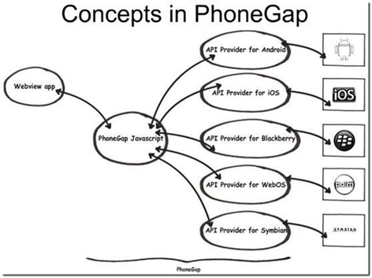

# PhoneGap

## html5介绍

HTML5是用于取代1999年所制定的HTML4.01和XHTML1.0标准的HTML标准版本，现在仍处于发展阶段，但大部分浏览器已经支持某些HTML5技术。HTML5有两大特点：首先，强化了Web网页的表现性能。其次，追加了本地数据库等Web应用的功能。广义论及HTML5时，实际指的是包括HTML、CSS和JavaScript在内的一套技术组合。它希望能够减少浏览器对于需要插件的丰富性网络应用服务(plug-in-basedrichinternetapplication，RIA)，如AdobeFlash、MicrosoftSilverlight与Oracle JavaFX的需求，并且提供更多能有效增强网络应用的标准集

开发中选择html5理由：

1. 兼容性，老版本的浏览器上也可以运行（不是很靠谱）
2. 实用性，简化了标签，细分了功能，增加了移动互联网元素
3. 革命性，HTML不再是简单的标签语言，增加了API、渲染等

html5有哪些特点：

1. 微数据与微格式等方面的支持，
2. 本地存储，离线应用
3. API调用，地图，位置，LBS等
4. 连接通讯，后台线程，
5. 多媒体
6. 三维、图形及特效，
7. CSS3

## PhoneGap介绍

1、PhoneGap是什么

PhoneGap是一个用基于HTML，CSS和JavaScript的，创建移动跨平台移动应用程序的快速开发框架。它使开发者能够利用iPhone，Android，Palm，Symbian,WP7,Bada和Blackberry智能手机的核心功能——包括地理定位，加速器，联系人，声音和振动等，此外PhoneGap拥有丰富的插件，可以以此扩展无限的功能。PhoneGap是免费的，但是它需要特定平台提供的附加软件，例如iPhone的iPhone SDK，Android的Android SDK等，也可以和DW5.5配套开发。使用PhoneGap只比为每个平台分别建立应用程序好一点点，因为虽然基本代码是一样的，但是你仍然需要为每个平台分别编译应用程序。

PhoneGap针对不同平台的WebView做了扩展和封装，使WebView这个组件变成可访问设备本地API的强大浏览器，所以开发人员在PhoneGap框架下可通过JavaScript访问设备本地API。

WebView组件实质是移动设备的内置浏览器。WebView这个内置浏览器特性是Web能被打包成本地客户端的基础，可方便的用HTML5、CSS3页面布局，这是移动Web技术的优势相对于原生开发）



2、PhoneGap的优势

(1) 可跨平台：PhoneGap 是唯一的一个支持 7 个平台的开源移动框架（PhoneGap 包括地理定位，加速器，联系人，声音和振动等，此外 PhoneGap 拥有丰富的插件，可以以此扩展无限的功能，几乎 Native App 能完成的功能他都能完成）。它的优势是无以伦比的：开发成本低——据估算，至多 Native App 的五分之一！

(2) 易用性，基于标准的Web开发技术(html + css + js)

(3) 提供硬件访问控制api

(4) 可利用成熟 javascript 框架(JqueryMobile SenchaTouch)

(5) 方便的安装和使用

3、PhoneGap的不足

(1) PhoneGap应用程序的运行是寄托于移动设备上各平台的内置浏览器 webkit的，受到webkit处理速度影响，以及各个平台的硬件与软件的性能制约，其程序运行的速度会比原生的程序稍微慢点，但是笔者认为，这些问题在1-2年内都会解决，因为现在的硬件的发展速度太快了。

(2) 还有一些底层的功能需要插件来实现比如（推送功能）

(3) 平台差异化不同，PhoneGap应用程序在所有平台上运行界面看起来都一样。即使这个应用程序与原生应用很相像，但对于习惯了iOS与Android平台的用户来说，会觉得不习惯，他们还是会很快看出差异。

通过综合比较PhoneGap的优点与不足，我们认为，如果你想快速实现一般的移动WebApp或者普通的2D游戏，那么可以采用PhoneGap技术。如果你想要实现需要大量CPU计算的应用或者3D游戏，或者对用户体验及界面有极致的追求，考虑目前的硬件条件和开发成本，使用原生开发来实现比较适合。

4、PhoneGap前景

2011年10月4日，Adobe宣布收购了创建了HTML5移动应用框架PhoneGap和PhoneGap Build的新创公司Nitobi Software。这使得phonegap有了坚强的后盾，phonegap的发展前景也是一片光明。与此同时， PhoneGap的开源框架已经被累积下载 60 万次，借助PhoneGap平台，已有数千应用程序建立在iOS，android以及其它操作系统之上。

## Web App,Native APP,Hybird App介绍

(1) Web App

这个主要是采用统一的标准的HTML,JavaScript,CSS等web技术开发。用户无需下载，通过不同平台的浏览器访问来实现跨平台，同时可以通过浏览器支持充分使用HTML5特性，缺点是这些基于浏览器的应用无法调用系统API来实现一些高级功能，也不适合高性能要求的场合。

(2) Native APP

就是所谓的原生应用，指的是用平台特定的开发语言所开发的应用。使用它们的优点是可以完全利用系统的 API和平台特性，在性能上也是最好的。缺点是由于开发技术不同，如果你要覆盖多个平台，则要针对每个平台独立开发，无跨平台特性。

(3) Hybird App

则是为了弥补如上两者开发模式的缺陷的产物，分别继承双方的优势。首先它让为数众多的web开发人员可以几乎零成本的转型成移动应用开发者；其次，相同的代码只需针对不同平台进行编译就能实现在多平台的分发，大大提高了多平台开发的效率；而相较于web App，开发者可以通过包装好的接口，调用大部分常用的系统 API。PhoneGap正是Hybird APP的代表开发框架

## 为么要学习PhoneGap

1、移动互联网软件开发现状

在多厂商的利益竞争下，当前的智能终端平台呈现出了“百家争鸣”的现象。当前的移动终端系统呈现出较为零散的割据状态，其中，Nokia主推的Symbian、Apple的iOS和Google的Android分别占据了较大的市场份额。然而，由于当前主流的移动平台之间互不兼容，针对不同的移动平台系统，当前并没有可以兼容的应用开发接口和语言；当前，使用C/C++的Symbian、使用Object-C的iOS和使用Java的Android应用开发技术，几乎是完全无法融合的。

2、移动互联网软件开发者的困扰

开发完Android应用，还得重新开发Ios应用，开发完Ios还得开发Windows Phone，一个应用不同平台重复开发

(1) 从应用开发的角度来说，同样的程序逻辑却不得不在多个平台上使用不同的语言和 API重复编码。

(2) 从代码维护的角度来说，针对同一个项目需要同时维护多份代码，一旦程序逻辑发生变化，将导致大规模的代码修改与回归测试。

(3) 从经济角度来说，要同时开发和维护多个平台的应用程序，将花费企业巨大的人力和时间成本。

3、phonegap的出现，为什么要学phonegap

为了解决上述问题，跨平台的移动应用开发技术逐渐地引起了开发者的关注。市面上也出现了很多跨平台框架，然而笔者认为比较好的还属于PhoneGap，也是开发人员最多的

## Html5移动应用软件开发框架JqueryMobile、SenchaTouch介绍

1、JqueryMobile介绍

jQuery Mobile是jQuery在手机上和平板设备上的版本。jQuery Mobile不仅会给主流移动平台带来 jQuery核心库，而且会发布一个完整统一的jQuery移动UI框架。支持全球主流的移动平台。此框架简单易用。页面开发主要使用标记，无需或仅需很少JavaScript。

2、SenchaTouch介绍

前不久基于JavaScript编写的Ajax框架ExtJS,将现有的ExtJS整合`JQTouch`、`Rapha` & `eumll`库，推出适用于最前沿Touch Web的Sencha Touch框架，该框架是世界上第一个基于HTML5的Mobile App框架。同时，ExtJS更名为Sencha，JQTouch的创始人David Kaneda，以及Rapha&euml;l的创始人也已加盟Sencha团队

3、JqueryMobile SenchaTouch对比大家可以看看这篇[文章](http://www.phonegap100.com/article-65-1.html)，上面有详细的说明

jQuery Mobile

- JM只是一个UI库，依赖于jQuery和jQuery UI的DOM操作、Ajax和其他库
- 为了创建UI部件，你只需要编写HTML即可，JM为了对这些HTML元素进行修饰
- 可方便的重用已有的HTML代码
- 一些简单的应用直接用HTML即可实现，无需JavaScript
- JM具有相对小的对象模型，可以快速轻松学习，特别是他是一个jQuery的插件
- JM对代码没有特定的要求，这可能是非常灵活的，但维护难度也加大
- 易于和其他框架进行集
- 比Sencha Touch支持更多的设备
- 不依赖某个特定的供应商

Sencha Touch

- 这是一个独立的库，包括 UI部件、DOM操作、Ajax以及其他
- 无需依赖其他库
- 采用以JavaScript为核心的方法，基本上不需要写HTML
- 提供大的对象模型，提供更多的功能，但是学习周期很长
- 统一的编程代码结构和要求，良好组织的代码易于维护
- 提供内置的服务器和本地存储的抽象层，可在关系数据基础上轻松执行CRUD操作。
- 提供内置的工具用于创建iOS和Android本地运行的程序
- 比jQuery Mobile支持的设备要少

## 简单示例

创建一个简单的示例，打包成跨平台的可安装的移动应用

1、环境搭建简单的示例

```html
<!DOCTYPEhtml>
<html>
<head>
<title>jQueryMobile应用程序</title>
<meta name="viewport"content="width=device-width"/>
<link href="Css/jquery.mobile-1.0.1.min.css" rel="Stylesheet"type="text/css"/>
<script src="Js/jquery-1.6.4.js" type="text/javascript"></script>
<script src="Js/jquery.mobile-1.0.1.js" type="text/javascript"></script>
</head>
<body>
<section id="page1"data-role="page">
<header data-role="header"><h1>jQuery Mobile</h1></header>
<div data-role="content"class="content">
<p>Hello World!</p>
</div>
<footer data-role="footer"><h1>PhoneGap中文网</h1></footer>
</section>
</body>
</html>
```

2、[打包成可安装的移动应用程序](https://build.phonegap.com)

开发中的测试浏览器介绍

1. PC机上移动设备浏览器OperaMobileEmulator，安装介绍，软件下载地址：

   - [http://www.opera.com/zh-cn/mobile](http://www.opera.com/zh-cn/mobile)
   - [http://www.opera.com/zh-cn/developer/mobile-emulator](http://www.opera.com/zh-cn/developer/mobile-emulator)

2. 其他浏览器
