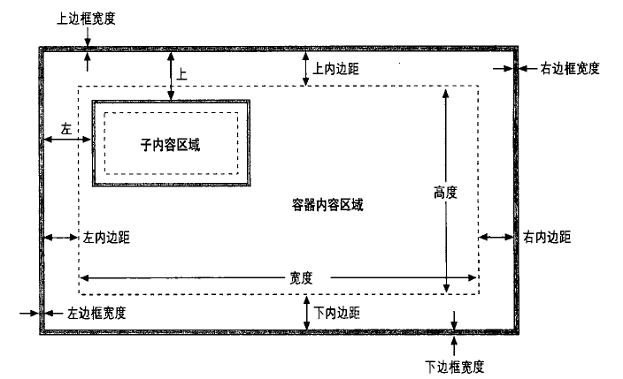
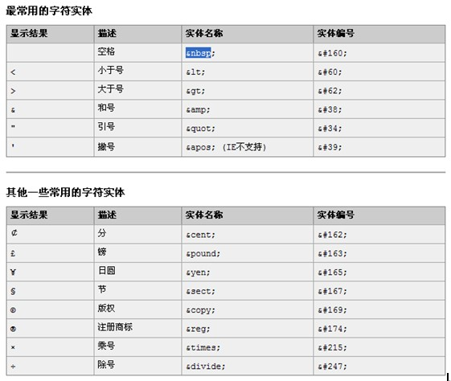
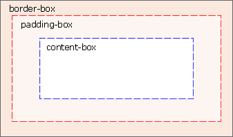

# CSS

## 目录

1. [简介](#简介)
   - [!important](#!important)
   - [非标准属性](#非标准属性)
   - [重要的CSS属性](#重要的CSS属性)
     - [position](#position)
     - [边框、外边距和内边距](#边框、外边距和内边距)
     - [元素显示和可见性](#元素显示和可见性)
     - [颜色、透明度和半透明度](#颜色、透明度和半透明度)
     - [部分可见：overflow和clip](#部分可见：overflow和clip)
   - [选择器](#选择器)
     - [父子选择器](#父子选择器)
   - [行内元素和块元素](#行内元素和块元素)
   - [标准流和非标准流](#标准流和非标准流)
   - [符号实体](#符号实体)
2. [CSS3.0](#CSS3.0)
   - [CSS3边框](#CSS3边框)
     - [圆角边框](#圆角边框)
   - [CSS3背景](#CSS3背景)
   - [CSS3文本效果](#CSS3文本效果)
   - [CSS3字体](#CSS3字体)
   - [CSS3&nbsp;2D转换](#CSS3&nbsp;2D转换)
   - [CSS3&nbsp;3D转换](#CSS3&nbsp;3D转换)
   - [CSS3&nbsp;过渡](#CSS3&nbsp;过渡)
   - [CSS3&nbsp;动画](#CSS3&nbsp;动画)
   - [CSS3多列](#CSS3多列)
   - [CSS3&nbsp;用户界面](#CSS3&nbsp;用户界面)

## 简介

参考网站：[http://www.css88.com/](http://www.css88.com/)

语法与规则 Rules and Syntax

名称|版本|描述
-|-|-
<span style="color:green">!important</span>|CSS1|提升指定样式条目的应用优先权。
<span style="color:green">/\*comment\*/</span>|CSS1|CSS中的注释 /* 这里是注释内容 */
<span style="color:#9900FF">@import</span>|CSS1/3|指定导入的外部样式表及目标媒体。该规则必须在样式表头部最先声明
<span style="color:green">@charset</span>|CSS2|在外部样式表文件内使用。指定该样式表使用的字符编码。
<span style="color:#9900FF">@media</span>|CSS2/3|指定样式表规则用于指定的媒体类型和条件。
<span style="color:orange">@font-face</span>|CSS3|设置嵌入HTML文档的OpenType字体。
<span style="color:green">@page</span>|CSS2|设置页面容器的版式，方向，边空等。
<span style="color:orange">@keyframes</span>|CSS3|指定动画名称和动画效果。
<span style="color:orange">@supports</span>|CSS3|检测是否支持某特性。

<b style="color:#9900FF">紫色</b>链接表示该属性在CSS3有修改或者增加了新的属性值；<b style="color:orange">橙色</b>链接表示该属性是CSS3新增属性

### !important

语法：Selector { sRule!important; }

说明： 提升指定样式规则的应用优先权。IE6及以下浏览器有个比较显式的支持问题存在，!important在同一条规则集里不生效。请看下述代码：

示例代码：

```html
div {
  color: #f00 !important;
  color: #000;
}
```

在上述代码中，IE6及以下浏览器div的文本颜色为#000，!important并没有覆盖后面的规则；其它浏览器下div的文本颜色为#f00

IE6及以下浏览器要使!important生效，可用以下代码：

示例代码：

```html
div {
  color: #f00 !important;
}
div {
  color: #000;
}
```

在上述代码中，IE6及以下浏览器中div的文本颜色表现与其它浏览器一致，都为#f00

### 非标准属性

当浏览器厂商实现非标准CSS属性时，它们用将属性名前加了一个厂商前缀。Firefox使用-moz-，Chrome使用-webkit-，而IE使用-ms-，它们甚至用这种方式来实现将来会标准化的属性。

### 重要的CSS属性

#### position

指定了应用到元素上的定位类型：

- static：默认属性。指定元素按照常规的文档内容流（对多数西方语言而言就是从左往右、从上到下）进行定位。静态定位的元素不能使用top、left和类似其他属性定位。欲对文档元素使用CSS定位技术，必先将其position属性设置为除此之外的其他3个属性值。
- absolute：该值指定元素是相对于它包含的元素进行定位。相对于所有其他的元素，绝对定位的元素是独立定位的，它不是静态定位的元素中文档流的一部分。它的定位要么是相对于最近的定位祖先元素，要么是相对于文档本身。
- fixed：该值指定元素是相对于浏览器窗口进行定位的。固定定位的元素总是显示在那里，不会随着文档其他部分而滚动。类似绝对定位的元素，固定定位的元素和所有其他元素是独立的，它不是文档流的一部分。
- relative：元素按照常规的文档流进行布局，它的定位相对于它文档流中的位置进行调整。系统保留着元素在正常文档流中的空间，不会因为要填充空间而将其各边合拢，也不会将元素从新的位置“推开”。

一旦设置了元素的position属性为除了static以外的值，就可以通过元素的left、top、right和bottom属性的一些组合指定元素的位置。最常用的定位技术是使用left和top属性指定元素的左边缘到容器（通常是文档本身）左边缘的距离，元素的上边缘到容器上边缘的距离。

如果元素使用绝对定位，它的top和left属性应该解释为它是相对于其position属性设置为除static值以外的祖先元素。如果绝对定位的元素没有定位过的祖先，则它的top和left属性使用文档坐标进行度量——就是相对于文档左上角的偏移量。如果你想相对于一个属于常规文档流中的容器绝对定位一个元素，则将容器的position指定为relative，top和left指定为0px。这就让容器变成了动态定位，但它仍留在文档流中原来的位置。任何绝对定位元素的子元素都相对于容器进行定位。

虽然使用left和top指定元素的左上角位置是最常见的定位方法，但也可以使用bottom和right指定元素相对于容器的下和右边缘进行定位。

定位一个元素让其右、上边缘相对于窗口右、上边缘各10像素，并且不随文档的滚动而滚动，可以使用如下样式："position:fixed; right: 10px; top: 10px"

除了定位元素以外，css允许指定它们的尺寸。这通常通过指定width和height样式属性的值完成。

另外一种指定元素的宽度的方越是同时指定left和right属性。同样，通过指定top和bottom属性来指定元素的高度。但是，如果同时指定left、right和width，那么width属性将覆盖right属性；如果元素的高度重复限定，height属性优先于bottom属性。

请牢记，没必要给每一个动态元素指定尺寸，某些元素（如图片）具有固有尺寸。而且，对包含文本或其他流式内容的动态元素通常指定想要的宽度就足够了，让元素内容布局来自动决定它的高度。

CSS指定位置和大小属性是有单位的。在上面的例子中，定位和尺寸属性值以"px"结尾，代表像素。也可以使用英寸("in")、厘米("cm")、点("pt")和字体行高（"em"，一种当前字体行高的度量）。

相对于使用上面的单位来指定绝对定位和尺寸，CSS也允许指定元素的位置和尺寸为其容器元素的百分比。

1、第三个维度: z-index

left、top、right和bottom属性是在容器元素中的二维坐标中指定X和Y坐标。z-index属性定义了第三个维度：它允许指定元素的堆叠次序，并指示两个或多个重叠元素中的哪一个应该绘制在其他的上面。z-index默认为0，可以是正或负的整数。当两个或多个元素重叠在一起时，它们是按照从低到高的z-index顺序绘制的。如果重叠元素的z-index值一样，它们按照在文档中出现的顺序绘制，也即最后一个重叠的元素显示在最上面。

注意，z-index只对兄弟元素（例如，同一个容器的子元素）应用堆叠效果。如果两个元素不是兄弟元素之间的重叠，那么设置它们的z-index属性无法决定哪一个显示在最上面。相反，“必须”设置这两个重叠元素的兄弟容器的z-index属性来达到目的。

非定位元素（例如，默认使用position:static定位）总是以防止重叠的方式进行布局，因此z-index属性不会应用到它们上面。尽管如此，它们默认的z-index值为0，这意味着z-index为正值的定位元素显示在常规文档流的上面，而z-index为负值的定位元素显示在常规文档流的下面。

2、CSS定位示例：文本阴影

CSS3规范包含一个text-shadow属性以在文本下产生阴影效果。许多现在的浏览器都支持该效果，但是可以用CSS定位属性实现类似的效果，只要重复输出这段文本并重新定义以下样式：

```html
<!-- text-shadow属性自动产生阴影效果 -->
<span style="text-shadow: 3px 3px 1px #888">Shadowed</span>
<!--这里我们利用定位可以产生相同的效果-->
<span style="position:relative;">
  Shadowed <!--这里是投射阴影的文本-->
  <span style="position:absolute; tOP:3px; left:3px; z-index:-1; color: #888">
    Shadowed <!--这里是阴影-->
  </span>
</span>
```

需要投射阴影的文本包裹在相对定位的<span>标签中，不用设置其他定位属性，所以文本显示在其正常的位置上。阴影位于一个绝对定位的<span>中，它包含在上面那个相对定位的<span>中，这样z-index属性确保阴影在其文本的下面。

#### 边框、外边距和内边距

CSS允许指定元素周围的边框、外边距和内边距。元素的边框是一个围绕（或部分围绕）元素绘制的矩形（或者CSS3 中的圆角矩形）。属性还允许指定边框的样式、颜色和厚度。

在CSS3 中，可以通过border-radius属性指定圆滑边框的所有角，也可以用更明确的属性名设置单独的圆角。

margin和padding属性都指定元素周围的空白空间。主要的区别在于，margin指定边框外面一一边框和相邻元素之间的空间，而padding指定边框之内一一边框和元素内容之间的空间。外边距提供了常规文档流中（可能有边框的）元素和它的“邻居”之间的视觉空间。内边距保持元素内容和它的边框在视觉上分离。如果元素内没有边框，内边距往往也是没有必要的。如果元素是动态定位的，而不是常规文档流的一部分，它的外边距就无关要旨了。

或者可以用margin和padding属性直接为元素所有的4条边指定外边距和内边距。首先指定上边的值，然后按照顺时针方式设置：上、右、下和左边的值。

#### 盒模型和定位细节

下图显示了一个绝对定位的元素嵌套在一个定位的容器元素中。容器和包含的元素都有边框和内边距，图例说明了指定容器元素每条边的内边距和边框宽度的CSS属性。注意外边距属性并没有图示：外边距与绝对定位的元素无关。

下图也包含了其他重要的信息。首先，width和height只指定了元素内容区域的尺寸，它不包含元素的内边距或边框（或外边距）所需的任何额外空间。为了确定有边框元素在屏幕上的全尺寸，必须把元素的宽度加上左右两边的内边距和左右两个边框宽度，把元素的高度加上上下两边的内边距和上下两个边框宽度。

其次，left和top属性指定了从容器边框内侧到定位元素边框外侧的距离。这些属性不是从容器内容区域的左上角开始度量的，而是从容器内边距的左上角（内边距在这里无用）开始的。同样，right和bottom属性是从容器内边距的右下角开始度量的。



***边框盒模型和box-sizing属性***

标准CSS盒模型规定width和height样式属性给定内容区域的尺寸，并且不包含内边距和边框。可以称此盒模型为“内容盒模型”。在老版的IE里和新版的CSS中都有一些例外，在IE 6之前和当IE 6-8在“怪异模式”下显示一个页面时（页面中缺少<!DOCTYPE>或有一个不够严格的doctype时），width和height属性确是包含内边距和边框宽度的。

IE的行为是一个bug，但是IE的非标准盒模型通常也很有用。认识到这一点，CSS3引进了box-sizing属性，默认值是content-box，它指定了上面描述的标准的盒模型。如果替换为box-sizing:border-box，浏览器将会为那个元素应用IE的盒模型，即width和height属性将包含边框和内边距。当想以百分比形式为元素设置总体尺寸，又想以像素单位指定边框和内边距时，边框盒模型特别有用：

```html
<div style="box-sizing:border-box; width: 50%; padding: 10px; border: solid black 2px;">
```

box-sizing属性在当今所有的浏览器中都支持，但是还没有不带前缀通用地实现。在Chrome和Safari 中，使用-webkit-box-sizing。在Firefox 中，使用-moz-box-sizing。在Opera和IE 8及其更高版本中，可以使用不带前缀的box-sizing。

边框盒模型在未来CSS3 中的一个可选方案是使用盒子尺寸的计算值：

```html
<div style="width: calc(50%-12px); padding: 10px; border: solid black 2px;">
```

在IE 9中支持使用calc()计算CSS的值，在Firefox 4为-moz-calc()。

#### 元素显示和可见性

两个CSS属性影响了文档元素的可见性：visibility和display。visibility属性很简单：当其值设置为hidden时，该元素不显示；当其值设置为visible时，该元素显示。

display属性更加通用，它用来为接收它的容器指定元素的显示类型。它指定元素是否是块状元素、内联元素、列表项等。但是，如果display设置为none，受影响的元素将不显示，甚至根本没有布局。

visibility和display属性之间的差别可以从它们对使用静态或相对定位的元素的影响中看到。对于一个常规布局流中的元素，设置visibility属性为hidden使得元素不可见，但是在文档布局中仍保留了它的空间。类似的元素可以重复隐藏和显示而不改变文档布局。但是，如果元素的display属性设置为none，在文档布局中不再给它分配空间，它各边的元素会合拢，就当它从来不存在。例如，在创建展开和折叠轮廓的效果时display属性很有用。

visibility和display属性对绝对和固定定位的元素的影响是等价的，因为这些元素都不是文档布局的一部分。然而，在隐藏和显示定位元素时一般首选visibility属性。

注意，用visibility和display属性使得元素不可见没什么意义，除非使用JavaScript动态设置这些属性让元素在某一刻可见！

##### 颜色、透明度和半透明度

可以通过CSS 的color属性指定文档元素包含的文本的颜色，并可以用background-color属性指定任何元素的背景颜色。早些时候，我们看到可以用border-color或border复合属性指定元素边框的颜色。

CSS支持若干英文颜色名字，但是在CSS中更一般的指定颜色的语法是使用十六进制数分别指定组成颜色的红、绿和蓝色分量，每个分量可以使用一位或两位数字。

除了background-color属性，也可以为元素指定背景图像。background-image属性指定使用的图像， background-attachment、background-position和background-repeat属性指定如何绘制该图像的一些高级细节。复合属性background允许一起指定这些属性值。利用这些背景图像属性可以创建有趣的视觉效果。

如果没有为元素指定背景颜色或图像，它的背景通常透明，理解这点非常重要。尽管如此，默认情况下不是所有的元素都是透明的。用background-color属性可以覆盖默认颜色，如果强烈要求可以将其显式设置为"transparent"。

指定元素（内容的前景和背景）为半透明也是可能的。用CSS3的opacity属性来处理，该属性值是0-1之间的数字，1代表100% 不透明（默认值），而0代表0%不透明（或100% 透明）。opacity属性在当今所有浏览器中都支持，除了IE。IE提供类似的可选方式：IE特有的filter属性。

示例：让元素75%不透明，可以使用以下CSS样式：

```css
opacity: .75; /*透明度，CSS3标准属性*/
filter: alpha(opacity=75); /*IE透明度，注意没有小数点*/
```

#### 部分可见：overflow和clip

overflow和clip属性允许只显示元素的一部分。overflow属性指定内容超出元素的大小（例如，用width和height样式属性指定）时该如何显示。该属性允许的值和含义如下所示：

- visible：默认值。如果需要，内容可以溢出并绘制在元素的边框的外面。
- hidden：裁剪掉和隐藏溢出的内容，即在元素尺寸和定位属性值定义的区域外不会绘制内容。
- scroll：元素一直显示水平和垂直滚动条。如果内容超出元素尺寸，允许用户通过滚动来查看额外的内容。此属性值负责文档在计算机屏幕中的显示，例如，打印纸质文档时滚动条是没有意义的。
- auto：滚动条只在内容超出元素尺寸时显示，而非一直显示。

overflow属性允许指定当内容超出元素边框时该如何显示，而clip属性确切地指定了应该显示元素的哪个部分，它不管元素是否溢出。在创建元素渐进显示的脚本效果时候该属性特别有用。

clip属性的值指定了元素的裁剪区域。在CSS2中，裁剪区域是矩形的，不过clip 属性的语法预留了开放的可能，该标准将来的版本将支持除了矩形以外其他形状的裁剪。clip属性的语法是：`rect(top right bottom left)`

相对于元素边框的左上角，top、right、bottom和left 4个值指定了裁剪矩形的边界。例如，要只显示元素的100 x 100像素大小部分，可以赋予该元素style属性：`style="clip: rect(0px 100px 100px 0px);"`

注意，圆括号中的4个值是长度，所以“必须”包含明确的单位，如px代表像素。不允许使用百分比。可以指定负值，让裁剪区域超出为元素指定的边框尺寸。也可以为任何4个值使用auto关键字来指定裁剪区域的边缘就是元素边框的对应边缘。

注意，值之间没有逗号，裁剪区域从上边缘开始顺时针设置。将clip设置为auto来停用裁剪功能。

#### 浮动

在div+css中浮动分为左浮动，右浮动，清除浮动

1. 右浮动

   所谓右浮动，指一个块元素向右移动，让出自己空间，向右移动直到碰到包含自己的父元素的最右边的边框.

2. 左浮动

   ```css
   .div1{
     width:150px;
     height:100px;
     border:1px solid blue;
     background: pink;
     margin-top:5px;
     float:left;/*左浮动*/
   }
   ```

   从这个案例我们可以看出，所谓左浮动就是指：某个块元素尽量向左边移动，这样就让出它右面的空间，让别的块元素显示

浮动的特别说明：如果浮动元素的高度不同，那么当它们向下移动时可能被其它浮动元素“卡住”：直到有足够空间

☞如果使用浮动属性：则该元素不管是不是块元素，都会按照 display:block来显示

小总结：你可以这么理解浮动：如果一个元素右/左浮动则：

- 它本身会尽可能向右/左移动，直到碰到边框或者别的浮动元素，特别强调浮动对块元素和行内元素都生效！
- 元素向右/左浮动，就相当于让出自己的左/右边，别的元素就会在它的左/右边排列。

### 选择器

**常用四种：**

1. 类选择器(class选择器)；基本使用：

   ```css
   .类选择器{
     属性名: 属性值;
     …
   }
   ```

2. id选择器；基本使用：

   ```css
   #id选择器{
     属性名: 属性值;
     …
   }
   ```
  
3. html元素选择器

   ```css
   某个html元素{
     属性名:属性值;
     …
   }
   ```

4. 通配符选择器

   ```css
   *{
     ...
   }
   ```

   该选择器可以用到所有的html元素，但是其优先权最低

**☞四个选取器优先权：**id选择器 > class选择器 > html选择器 > 通配符选则器

比如，我们希望所有的超链接：

1. 默认样式是黑色，24px，没有下划线
2. 当鼠标移动到超链接时，自动出现下划线
3. 点击后，超链接变成红色。这又该怎么实现呢？

```css
a:link{
  color:black;
  text-decoration:none;
  font-size:24px;
}
a:hover{
  text-decoration:underline;
  font-size:40px;
  color:green;
}
a:visited{
  color:red;
}
/*对同一种html元素分类*/
p.cls1{
  color:blue;
  font-size:30px;
}
p.cls2{
  color:red;
  font-size:20px;
}
```

#### 父子选择器

```css
/*父子选择器*/
#id1 span{
  color:red;
  font-style:italic;
}
```

☞上面选择器的含义是：在 id选择器为 id1 的子元素span的样式就是...

```html
<div id="id1">
  <span>xxxxx</span>
</div>
```

- 父子选择器可以有多级（但是在实际开发中不要过三层）
- 父子选择器有严格的层级关系
- 父子选择器不局限于什么类型选择器

1. 一个元素可以同时有id选择器和class选择器
2. 一个元素最多有一个id选择器，但是可以有多个类选择器

   <b style="color:red">特别注意：当两个类选择器发生冲突了，则以写在css文件中的后面的那个类选择器为准！</b>

3. 我们可以把某个css文件中的选择器共有的部分，独立出来写一份比如：

   ```css
    .ad_stu {
        width: 136px;
        height: 196px;
        background-color: #FC7E8C;
        margin: 5px 0 0 6px;
        float: left;
    }
    /*广告2*/
    .ad_2 {
        background: #7CF574;
        height: 196px;
        width: 457px;
        float: left;
        margin: 5px 0 0 6px;
    }
    /*房地产广告*/
    .ad_house {
        background: #7CF574;
        height: 196px;
        width: 152px;
        float: left;
        margin: 5px 0 0 6px;
    }
   ```

   //上面的css 可以写成:

   ```css
    /*招生广告*/
    .ad_stu {
        width: 136px;
        background-color: #FC7E8C;
    }
    /*广告2*/
    .ad_2 {
        background: #7CF574;
        width: 457px;
    }
    /*房地产广告*/
    .ad_house {
        background: #7CF574;
        width: 152px;
    }
    .ad_stu , .ad_2, .ad_house{
        height: 196px;
        float:left;
        margin: 5px 0 0 6px;
    }
   ```

4. 说明css文件本身也会被浏览器从服务器下载到本地，才能显示效果。

### 行内元素和块元素

行内元素它只占能显示自己内容的宽度，而且他不会占据整行

块元素它不管自己的内容有多少，会占据整行，而且会换行显示

常见的行内元素有`<a><span><input type="xxx">`

常见块元素有`<div><p>`

行内元素和块元素可以转换

- display: inline 表示使用行内元素方式显示
- display: block 表示使用块元素方式显示

### 标准流和非标准流

流: html元素在网页中显示的顺序

标准流: 在html文件中，写在前面的元素在前面显示，写在后面的html元素在后面显示

非标准流：在html 文件中，当某个元素脱离的标准流，那么它就处于非标准流

### 符号实体



## CSS3.0

CSS用于控制网页的样式和布局。CSS3是最新的CSS标准。先看一个简单的示例(Com.Charles.WebTest/CSS/1.简单示例)：

CSS3完全向后兼容，因此您不必改变现有的设计。浏览器通常支持 CSS2。

***CSS3模块***

CSS3被划分为模块。其中最重要的 CSS3 模块包括：

- 选择器
- 框模型
- 背景和边框
- 文本效果
- 2D/3D 转换
- 动画
- 多列布局
- 用户界面

***CSS3 标准***

W3C仍然在对CSS3规范进行开发。不过，现代浏览器已经实现了相当多的CSS3属性。

### CSS3边框

#### 圆角边框

```css
div
{
  border:2px solid #a1a1a1;
  border-radius:25px;
  -moz-border-radius:25px; /* 老的 Firefox */
}
```

#### 边框阴影

```css
div {
  -moz-box-shadow: 10px 10px 5px #888888; /* 老的 Firefox */
  box-shadow: 10px 10px 5px #888888;
}
```

#### 边框图片

平铺：

```css
#round {
  -moz-border-image: url(/Images/border.png) 30 30 round; /* Old Firefox */
  -webkit-border-image: url(/Images/border.png) 30 30 round; /* Safari and Chrome */
  -o-border-image: url(/Images/border.png) 30 30 round; /* Opera */
  border-image: url(/Images/border.png) 30 30 round;
}
```

拉伸：

```css
#stretch {
  -moz-border-image: url(/Images/border.png) 30 30 stretch; /* Old Firefox */
  -webkit-border-image: url(/Images/border.png) 30 30 stretch; /* Safari and Chrome */
  -o-border-image: url(/Images/border.png) 30 30 stretch; /* Opera */
  border-image: url(/Images/border.png) 30 30 stretch;
}
```

### CSS3背景

***背景图片尺寸***

background-size属性规定背景图片的尺寸。在CSS3之前，背景图片的尺寸是由图片的实际尺寸决定的。在 CSS3中，可以规定背景图片的尺寸，这就允许我们在不同的环境中重复使用背景图片。您能够以像素或百分比规定尺寸。如果以百分比规定尺寸，那么尺寸相对于父元素的宽度和高度。

```css
body {
  background: url(/Images/bg_flower.gif);
  background-size: 63px 100px;
  -moz-background-size: 63px 100px; /* 老版本的 Firefox */
  background-repeat: no-repeat;
}
```

***背景图片拉伸***

```css
div {
  background: url(/Images/bg_flower.gif);
  background-size: 35% 100%;
  -moz-background-size: 35% 100%; /* 老版本的 Firefox */
  background-repeat: no-repeat;
}
```

***背景图片定位***

background-origin属性规定背景图片的定位区域。背景图片可以放置于content-box、padding-box或border-box区域。一个box区域的模型如下所示：



在content-box中定位背景图片：

```css
div {
  border: 1px solid black;
  background-image: url('/Images/bg_flower.gif');
  background-repeat: no-repeat;
  background-position: left;
  background-origin: content-box;
}
```

***多重背景图片***

```css
body {
  background-image: url(/Images/bg_flower.gif),url(/Images/bg_flower_2.jpg);
}
```

### CSS3文本效果

***文本阴影***

在CSS3中，text-shadow可向文本应用阴影。您能够规定水平阴影、垂直阴影、模糊距离，以及阴影的颜色。

```css
h1 {
  text-shadow: 5px 5px 5px #FF0000;
}
```

***自动换行***

在CSS3中，word-wrap属性允许您允许文本强制文本进行换行 - 即使这意味着会对单词进行拆分。

```css
p.test {
  width: 11em;
  border: 1px solid #000000;
  word-wrap: break-word;
}
```

**新的文本属性：**

属性|描述|CSS
-|-|-
hanging-punctuation|规定标点字符是否位于线框之外。|3
punctuation-trim|规定是否对标点字符进行修剪。|3
text-align-last|设置如何对齐最后一行或紧挨着强制换行符之前的行。|3
text-emphasis|向元素的文本应用重点标记以及重点标记的前景色。|3
text-justify|规定当 text-align 设置为 "justify" 时所使用的对齐方法。|3
text-outline|规定文本的轮廓。|3
text-overflow|规定当文本溢出包含元素时发生的事情。|3
text-shadow|向文本添加阴影。|3
text-wrap|规定文本的换行规则。|3
word-break|规定非中日韩文本的换行规则。|3
word-wrap|允许对长的不可分割的单词进行分割并换行到下一行。|3

### CSS3字体

在CSS3之前，web设计师必须使用已在用户计算机上安装好的字体。通过CSS3，web设计师可以使用他们喜欢的任意字体。

当您找到或购买到希望使用的字体时，可将该字体文件存放到web服务器上，它会在需要时被自动下载到用户的计算机上。

您“自己的”的字体是在CSS3 @font-face规则中定义的。

在新的@font-face规则中，必须首先定义字体的名称(比如myFirstFont)，然后指向该字体文件。如需为HTML元素使用字体，请通过font-family属性来引用字体的名称(myFirstFont)：

```css
@font-face {
  font-family: myFirstFont;
  src: url('/Fonts/Sansation_Light.ttf'),url('/Fonts/Sansation_Light.eot'); /* IE9+ */
}
div {
  font-family: myFirstFont;
}
```

您必须为粗体文本添加另一个包含描述符的 @font-face：

```css
@font-face {
  font-family: myFirstFont;
  src: url('/Fonts/Sansation_Light.ttf'),url('/Fonts/Sansation_Light.eot'); /* IE9+ */
}
@font-face {
  font-family: myFirstFont;
  src: url('/Fonts/Sansation_Bold.ttf'),url('/Fonts/Sansation_Bold.eot'); /* IE9+ */
  font-weight: bold;
}
div {
  font-family: myFirstFont;
}
```

文件"Sansation_Bold.ttf"是另一个字体文件，它包含了Sansation字体的粗体字符。只要font-family为"myFirstFont"的文本需要显示为粗体，浏览器就会使用该字体。通过这种方式，我们可以为相同的字体设置许多@font-face规则。

下面的表格列出了能够在@font-face规则中定义的所有字体描述符：


### CSS3&nbsp;2D转换

通过CSS3转换，我们能够对元素进行移动、缩放、转动、拉长或拉伸。转换是使元素改变形状、尺寸和位置的一种效果。可以使用2D或3D转换来转换元素。

#### 元素移动

通过translate()方法，元素从其当前位置移动，根据给定的left(x坐标)和top(y坐标)位置参数

```css
div#div2 {
  transform: translate(50px,100px);
  -ms-transform: translate(50px,100px); /* IE 9 */
  -moz-transform: translate(50px,100px); /* Firefox */
  -webkit-transform: translate(50px,100px); /* Safari and Chrome */
  -o-transform: translate(50px,100px); /* Opera */
} /* 把元素从左侧移动50像素，从顶端移动100像素。*/
```

#### 元素旋转

通过rotate()方法，元素顺时针旋转给定的角度。允许负值，元素将逆时针旋转。

```css
div#div2 {
  transform: rotate(30deg);
  -ms-transform: rotate(30deg); /* IE 9 */
  -moz-transform: rotate(30deg); /* Firefox */
  -webkit-transform: rotate(30deg); /* Safari and Chrome */
  -o-transform: rotate(30deg); /* Opera */
} /* 元素顺时针旋转30度 */
```

#### 元素伸缩

通过scale()方法，元素的尺寸会增加或减少，根据给定的宽度(X轴)和高度(Y轴)参数：

```css
div#div2 {
  transform: scale(2,4);
  -ms-transform: scale(2,4); /* IE 9 */
  -moz-transform: scale(2,4); /* Firefox */
  -webkit-transform: scale(2,4); /* Safari and Chrome */
  -o-transform: scale(2,4); /* Opera */
} /* 宽度转换为原始尺寸的2倍，高度转换为原始高度的4倍 */
```

#### 元素翻转

通过skew()方法，元素翻转给定的角度，根据给定的水平线(X轴)和垂直线(Y轴)参数

```css
div#div2 {
  transform: skew(30deg,20deg);
  -ms-transform: skew(30deg,20deg); /* IE 9 */
  -moz-transform: skew(30deg,20deg); /* Firefox */
  -webkit-transform: skew(30deg,20deg); /* Safari and Chrome */
  -o-transform: skew(30deg,20deg); /* Opera */
} /* 围绕 X 轴把元素翻转 30 度，围绕 Y 轴翻转 20 度 */
```

#### matrix

matrix()方法把所有 2D 转换方法组合在一起。matrix()方法需要六个参数，包含数学函数，允许您：旋转、缩放、移动以及倾斜元素。

```css
div#div2 {
  transform: matrix(0.866,0.5,-0.5,0.866,0,0);
  -ms-transform: matrix(0.866,0.5,-0.5,0.866,0,0); /* IE 9 */
  -moz-transform: matrix(0.866,0.5,-0.5,0.866,0,0); /* Firefox */
  -webkit-transform: matrix(0.866,0.5,-0.5,0.866,0,0); /* Safari and Chrome */
  -o-transform: matrix(0.866,0.5,-0.5,0.866,0,0); /* Opera */
} /* 将 div 元素旋转 30 度 */
```

#### 2D&nbsp;Transform方法

函数|描述
-|-
matrix(n,n,n,n,n,n)|定义 2D 转换，使用六个值的矩阵。
translate(x,y)|定义 2D 转换，沿着 X 和 Y 轴移动元素。
translateX(n)|定义 2D 转换，沿着 X 轴移动元素。
translateY(n)|定义 2D 转换，沿着 Y 轴移动元素。
scale(x,y)|定义 2D 缩放转换，改变元素的宽度和高度。
scaleX(n)|定义 2D 缩放转换，改变元素的宽度。
scaleY(n)|定义 2D 缩放转换，改变元素的高度。
rotate(angle)|定义 2D 旋转，在参数中规定角度。
skew(x-angle,y-angle)|定义 2D 倾斜转换，沿着 X 和 Y 轴。
skewX(angle)|定义 2D 倾斜转换，沿着 X 轴。
skewY(angle)|定义 2D 倾斜转换，沿着 Y 轴。

### CSS3&nbsp;3D转换

CSS3允许您使用 3D 转换来对元素进行格式化。

#### 元素3D旋转

- 通过 rotateX() 方法，元素围绕其 X 轴以给定的度数进行旋转。
- 通过 rotateY() 方法，元素围绕其 Y 轴以给定的度数进行旋转。

```css
div#div2 {
    transform: rotateX(120deg);
    -webkit-transform: rotateX(120deg); /* Safari and Chrome */
    -moz-transform: rotateX(120deg); /* Firefox */
} /* 元素围绕其 X 轴以给定的度数进行旋转 */
div#div3 {
    transform: rotateY(130deg);
    -webkit-transform: rotateY(130deg); /* Safari and Chrome */
    -moz-transform: rotateY(130deg); /* Firefox */
} /* 元素围绕其 Y 轴以给定的度数进行旋转 */
```

#### 3D&nbsp;Transform方法

函数|描述
-|-
matrix3d(n,n,n,n,n,n,n,n,n,n,n,n,n,n,n,n)|定义 3D 转换，使用 16 个值的 4x4 矩阵。
translate3d(x,y,z)|定义 3D 转化。
translateX(x)|定义 3D 转化，仅使用用于 X 轴的值。
translateY(y)|定义 3D 转化，仅使用用于 Y 轴的值。
translateZ(z)|定义 3D 转化，仅使用用于 Z 轴的值。
scale3d(x,y,z)|定义 3D 缩放转换。
scaleX(x)|定义 3D 缩放转换，通过给定一个 X 轴的值。
scaleY(y)|定义 3D 缩放转换，通过给定一个 Y 轴的值。
scaleZ(z)|定义 3D 缩放转换，通过给定一个 Z 轴的值。
rotate3d(x,y,z,angle)|定义 3D 旋转。
rotateX(angle)|定义沿 X 轴的 3D 旋转。
rotateY(angle)|定义沿 Y 轴的 3D 旋转。
rotateZ(angle)|定义沿 Z 轴的 3D 旋转。
perspective(n)|定义 3D 转换元素的透视视图。

#### 新的转换属性

属性|描述|CSS
-|-|-
transform|向元素应用 2D 或 3D 转换。|3
transform-origin|允许你改变被转换元素的位置。|3
transform-style|规定被嵌套元素如何在 3D 空间中显示。|3
perspective|规定 3D 元素的透视效果。|3
perspective-origin|规定 3D 元素的底部位置。|3
backface-visibility|定义元素在不面对屏幕时是否可见。|3

### CSS3&nbsp;过渡

通过CSS3，我们可以在不使用Flash动画或JavaScript的情况下，当元素从一种样式变换为另一种样式时为元素添加效果。

CSS3过渡是元素从一种样式逐渐改变为另一种的效果。要实现这一点，必须规定两项内容：规定您希望把效果添加到哪个CSS属性上；规定效果的时长。注释：如果时长未规定，则不会有过渡效果，因为默认值是 0。效果开始于指定的 CSS 属性改变值时。CSS 属性改变的典型时间是鼠标指针位于元素上时。

```css
div {
  width: 100px;
  height: 100px;
  background: yellow;
  transition: width 2s, height 2s;
  -moz-transition: width 2s, height 2s, -moz-transform 2s; /* Firefox 4 */
  -webkit-transition: width 2s, height 2s, -webkit-transform 2s; /* Safari and Chrome */
  -o-transition: width 2s, height 2s, -o-transform 2s; /* Opera */
} /* 向宽度、高度和转换添加过渡效果 */
  div:hover {
    width: 200px;
    height: 200px;
    transform: rotate(180deg);
    -moz-transform: rotate(180deg); /* Firefox 4 */
    -webkit-transform: rotate(180deg); /* Safari and Chrome */
    -o-transform: rotate(180deg); /* Opera */
  }
```

#### 过渡属性

下面的表格列出了所有的转换属性：

属性|描述|CSS
-|-|-
transition|简写属性，用于在一个属性中设置四个过渡属性。|3
transition-property|规定应用过渡的 CSS 属性的名称。|3
transition-duration|定义过渡效果花费的时间。默认是 0。|3
transition-timing-function|规定过渡效果的时间曲线。默认是 "ease"。|3
transition-delay|规定过渡效果何时开始。默认是 0。|3

在一个例子中使用所有过渡属性：

```css
div {
  width: 100px;
  height: 100px;
  background: yellow;
  transition-property: width;
  transition-duration: 1s;
  transition-timing-function: linear;
  transition-delay: 2s;
  /* Firefox 4 */
  -moz-transition-property: width;
  -moz-transition-duration: 1s;
  -moz-transition-timing-function: linear;
  -moz-transition-delay: 2s;
  /* Safari and Chrome */
  -webkit-transition-property: width;
  -webkit-transition-duration: 1s;
  -webkit-transition-timing-function: linear;
  -webkit-transition-delay: 2s;
  /* Opera */
  -o-transition-property: width;
  -o-transition-duration: 1s;
  -o-transition-timing-function: linear;
  -o-transition-delay: 2s;
}
  div:hover {
    width: 200px;
  }
```

与上面的例子相同的过渡效果，但是使用了简写的transition属性：

```css
div {
  width: 100px;
  height: 100px;
  background: yellow;
  transition-property: width 1s linear 2s;
  /* Firefox 4 */
  -moz-transition: width 1s linear 2s;
  /* Safari and Chrome */
  -webkit-transition: width 1s linear 2s;
  /* Opera */
  -o-transition: width 1s linear 2s;
}
  div:hover {
    width: 200px;
  }
```

### CSS3&nbsp;动画

通过 CSS3，我们能够创建动画，这可以在许多网页中取代动画图片、Flash 动画以及 JavaScript。

如需在 CSS3 中创建动画，您需要学习 @keyframes 规则。@keyframes 规则用于创建动画。在 @keyframes 中规定某项 CSS 样式，就能创建由当前样式逐渐改为新样式的动画效果。

当您在 @keyframes 中创建动画时，请把它捆绑到某个选择器，否则不会产生动画效果。通过规定至少以下两项 CSS3 动画属性，即可将动画绑定到选择器：规定动画的名称；规定动画的时长。

注释：您必须定义动画的名称和时长。如果忽略时长，则动画不会允许，因为默认值是 0。

```css
div {
  width: 100px;
  height: 100px;
  background: red;
  animation: myfirst 5s;
  -moz-animation: myfirst 5s; /* Firefox */
  -webkit-animation: myfirst 5s; /* Safari and Chrome */
  -o-animation: myfirst 5s; /* Opera */
} /* 把 "myfirst" 动画捆绑到 div 元素，时长：5 秒 */
@keyframes myfirst {
  from {
    background: red;
  }
  to {
    background: yellow;
  }
}
@-moz-keyframes myfirst /* Firefox */
{
  from {
    background: red;
  }
  to {
    background: yellow;
  }
}
@-webkit-keyframes myfirst /* Safari and Chrome */
{
  from {
    background: red;
  }
  to {
    background: yellow;
  }
}
@-o-keyframes myfirst /* Opera */
{
  from {
    background: red;
  }
  to {
    background: yellow;
  }
}
```

动画是使元素从一种样式逐渐变化为另一种样式的效果。您可以改变任意多的样式任意多的次数。请用百分比来规定变化发生的时间，或用关键词 "from" 和 "to"，等同于 0% 和 100%。0% 是动画的开始，100% 是动画的完成。

为了得到最佳的浏览器支持，您应该始终定义 0% 和 100% 选择器。

```css
div
{
  width: 100px;
  height: 100px;
  background: red;
  position: relative;
  animation: myfirst 5s;
  -moz-animation: myfirst 5s; /* Firefox */
  -webkit-animation: myfirst 5s; /* Safari and Chrome */
  -o-animation: myfirst 5s; /* Opera */
} /* 改变背景色和位置 */
@keyframes myfirst
{
  0% { background: red; left: 0px; top: 0px; }
  25% { background: yellow; left: 200px; top: 0px; }
  50% { background: blue; left: 200px; top: 200px; }
  75% { background: green; left: 0px; top: 200px; }
  100% { background: red; left: 0px; top: 0px; }
}
@-moz-keyframes myfirst /* Firefox */
{
  0% { background: red; left: 0px; top: 0px; }
  25% { background: yellow; left: 200px; top: 0px; }
  50% { background: blue; left: 200px; top: 200px; }
  75% { background: green; left: 0px; top: 200px; }
  100% { background: red; left: 0px; top: 0px; }
}
@-webkit-keyframes myfirst /* Safari and Chrome */
{
  0% { background: red; left: 0px; top: 0px; }
  25% { background: yellow; left: 200px; top: 0px; }
  50% { background: blue; left: 200px; top: 200px; }
  75% { background: green; left: 0px; top: 200px; }
  100% { background: red; left: 0px; top: 0px; }
}
@-o-keyframes myfirst /* Opera */
{
  0% { background: red; left: 0px; top: 0px; }
  25% { background: yellow; left: 200px; top: 0px; }
  50% { background: blue; left: 200px; top: 200px; }
  75% { background: green; left: 0px; top: 200px; }
  100% { background: red; left: 0px; top: 0px; }
}
```

下面的表格列出了 @keyframes 规则和所有动画属性：

属性|描述|CSS
-|-|-
@keyframes|规定动画。|3
animation|所有动画属性的简写属性，除了 animation-play-state 属性。|3
animation-name|规定 @keyframes 动画的名称。|3
animation-duration|规定动画完成一个周期所花费的秒或毫秒。默认是 0。|3
animation-timing-function|规定动画的速度曲线。默认是 "ease"。|3
animation-delay|规定动画何时开始。默认是 0。|3
animation-iteration-count|规定动画被播放的次数。默认是 1。|3
animation-direction|规定动画是否在下一周期逆向地播放。默认是 "normal"。|3
animation-play-state|规定动画是否正在运行或暂停。默认是 "running"。|3
animation-fill-mode|规定对象动画时间之外的状态。|3

运行名为 myfirst 的动画，其中设置了所有动画属性。

与上面的动画相同，但是使用了简写的动画 animation 属性：

示例代码：Com.Charles.WebTest/CSS/25.CSS3所有动画属性（简写）.html

#### CSS3多列

通过 CSS3，您能够创建多个列来对文本进行布局 —— 就像报纸那样！

column-count 属性规定元素应该被分隔的列数；column-gap 属性规定列之间的间隔；column-rule 属性设置列之间的宽度、样式和颜色规则。

```css
.newspaper {
  -moz-column-count: 3; /* Firefox */
  -webkit-column-count: 3; /* Safari and Chrome */
  column-count: 3;
  -moz-column-gap: 30px; /* Firefox */
  -webkit-column-gap: 30px; /* Safari and Chrome */
  column-gap: 30px;
  -moz-column-rule: 4px outset #ff0000; /* Firefox */
  -webkit-column-rule: 4px outset #ff0000; /* Safari and Chrome */
  column-rule: 4px outset #ff0000;
}
```

下面的表格列出了所有的转换属性：

属性|描述|CSS
-|-|-
column-count|规定元素应该被分隔的列数。|3
column-fill|规定如何填充列。|3
column-gap|规定列之间的间隔。|3
column-rule|设置所有 column-rule-* 属性的简写属性。|3
column-rule-color|规定列之间规则的颜色。|3
column-rule-style|规定列之间规则的样式。|3
column-rule-width|规定列之间规则的宽度。|3
column-span|规定元素应该横跨的列数。|3
column-width|规定列的宽度。|3
columns|规定设置 column-width 和 column-count 的简写属性。|3

### CSS3&nbsp;用户界面

在 CSS3 中，新的用户界面特性包括重设元素尺寸、盒尺寸以及轮廓等。

在 CSS3，resize 属性规定是否可由用户调整元素尺寸。box-sizing 属性允许您以确切的方式定义适应某个区域的具体内容。outline-offset 属性对轮廓进行偏移，并在超出边框边缘的位置绘制轮廓。轮廓与边框有两点不同：轮廓不占用空间；轮廓可能是非矩形

```css
div.resize {
    border: 2px solid;
    padding: 10px 40px;
    width: 300px;
    resize: both;
    overflow: auto;
} /* 规定 div 元素可由用户调整大小 */
div.container {
    width: 30em;
    border: 1em solid;
}
div.box {
    box-sizing: border-box;
    -moz-box-sizing: border-box; /* Firefox */
    -webkit-box-sizing: border-box; /* Safari */
    width: 50%;
    border: 1em solid red;
    float: left;
} /* 规定两个并排的带边框方框 */
div.offset {
    margin: 20px;
    width: 150px;
    padding: 10px;
    height: 70px;
     border: 2px solid black;
     outline: 2px solid red;
     outline-offset: 15px;
} /* 规定边框边缘之外 15 像素处的轮廓 */
```

下面的表格列出了所有的转换属性：

属性|描述|CSS
-|-|-
appearance|允许您将元素设置为标准用户界面元素的外观|3
box-sizing|允许您以确切的方式定义适应某个区域的具体内容。|3
icon|为创作者提供使用图标化等价物来设置元素样式的能力。|3
nav-down|规定在使用 arrow-down 导航键时向何处导航。|3
nav-index|设置元素的 tab 键控制次序。|3
nav-left|规定在使用 arrow-left 导航键时向何处导航。|3
nav-right|规定在使用 arrow-right 导航键时向何处导航。|3
nav-up|规定在使用 arrow-up 导航键时向何处导航。|3
outline-offset|对轮廓进行偏移，并在超出边框边缘的位置绘制轮廓。|3
resize|规定是否可由用户对元素的尺寸进行调整。|3
