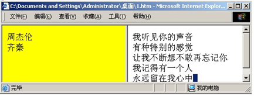
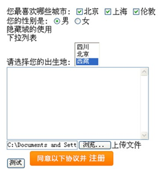

# html

## 目录

1. [基础](#基础)
   - [标题](#标题)
   - [段落](#段落)
   - [样式](#样式)
   - [格式化](#格式化)
   - [注释](#注释)
   - [超连接](#超连接)
   - [图像](#图像)
   - [表格](#表格)
   - [列表](#列表)
   - [线包字](#线包字)
   - [块](#块)
   - [类](#类)
   - [布局](#布局)
   - [响应式&nbsp;Web&nbsp;设计](#响应式&nbsp;Web&nbsp;设计)
   - [框架](#框架)
   - [内联框架](#内联框架)
   - [背景](#背景)
   - [脚本](#脚本)
   - [头部元素](#头部元素)
   - [字符实体](#字符实体)
   - [URL](#URL)
   - [URL编码](#URL编码)
   - [颜色](#颜色)
   - [文档类型](#文档类型)
   - [XHTML](#XHTML)
   - [表单](#表单)
   - [表单元素](#表单元素)
   - [表单示例](#表单示例)
   - [标准流和非标准流](#标准流和非标准流)
2. [HTML5](#HTML5)
3. [图形](#图形)
   - [Canvas](#Canvas)
   - [SVG](#SVG)
   - [Canvas&nbsp;vs&nbsp;SVG](#Canvas&nbsp;vs&nbsp;SVG)
   - [VML](#VML)
     - [Shape](#Shape)
     - [Line,Polyline(线)对象](#Line,Polyline(线)对象)
     - [Oval(圆)对象](#Oval(圆)对象)
     - [Group容器](#Group容器)
     - [ShapeType给VML制作模版](#ShapeType给VML制作模版)
     - [脚本动态生成VML](#脚本动态生成VML)
     - [给VML增加事件](#给VML增加事件)
     - [数据图表](#数据图表)
     - [矢量地图](#矢量地图)
     - [文本修改留痕](#文本修改留痕)
4. [媒体](#媒体)
   - [Object元素](#Object元素)
   - [音频](#音频)
   - [视频](#视频)
5. [总结](#总结)

蒂姆•伯纳斯-李与罗伯特•卡里奥（Robert Cailliau）共同发明了Web，也发明了HTML：超文本标记语言

## 基础

### 标题

`<h1> - <h6>`

`<h1>`最大，`<h6>`最小

默认情况下，HTML会自动在块级元素前后添加一个额外的空行，比如段落、标题元素前后。

请确保将 HTML heading 标签只用于标题。不要仅仅是为了产生粗体或大号的文本而使用标题。

搜索引擎使用标题为您的网页的结构和内容编制索引。

`<hr />`标签在HTML页面中创建水平线。hr元素可用于分隔内容。

使用水平线（`<hr>`标签）来分隔文章中的小节是一个办法（但并不是唯一的办法）。

注释：`<!-- This is a comment -->`

### 段落

通过`<p>`标签定义。

使用空段落标记`<p></p>`去插入一个空行是坏习惯。用`<br/>`标签代替！但是不要用`<br/>`标签去创建列表。

`<br/>` 元素是一个空的HTML元素。由于关闭标签没有任何意义，因此它没有结束标签。

您无法通过在HTML代码中添加额外的空格或换行来改变输出的效果。

当显示页面时，浏览器会移除源代码中多余的空格和空行。所有连续的空格或空行都会被算作一个空格。

### 样式

style 属性的作用：提供了一种改变所有 HTML 元素的样式的通用方法。
样式是 HTML 4 引入的，它是一种新的首选的改变 HTML 元素样式的方式。通过 HTML 样式，能够通过使用 style 属性直接将样式添加到 HTML 元素，或者间接地在独立的样式表中（CSS 文件）进行定义。

### 格式化

**文本格式化标签：**

| 标签       | 描述                                |
| ---------- | ----------------------------------- |
| `<b>`      | 定义粗体文本。                      |
| `<big>`    | 定义大号字。                        |
| `<em>`     | 定义着重文字。                      |
| `<i>`      | 定义斜体字。                        |
| `<small>`  | 定义小号字。                        |
| `<strong>` | 定义加重语气。                      |
| `<sub>`    | 定义下标字。                        |
| `<sup>`    | 定义上标字。                        |
| `<ins>`    | 定义插入字。                        |
| `<del>`    | 定义删除字。                        |
| `<s>`      | 不赞成使用。使用 `<del>` 代替。     |
| `<strike>` | 不赞成使用。使用 `<del>` 代替。     |
| `<u>`      | 不赞成使用。使用样式（style）代替。 |

**“计算机输出”标签：**

| 标签          | 描述                            |
| ------------- | ------------------------------- |
| `<code>`      | 定义计算机代码。                |
| `<kbd>`       | 定义键盘码。                    |
| `<samp>`      | 定义计算机代码样本。            |
| `<tt>`        | 定义打字机代码。                |
| `<var>`       | 定义变量。                      |
| `<pre>`       | 定义预格式文本。                |
| `<listing>`   | 不赞成使用。使用 `<pre>` 代替。 |
| `<plaintext>` | 不赞成使用。使用 `<pre>` 代替。 |
| `<xmp>`       | 不赞成使用。使用 `<pre>` 代替。 |

**引用、引用和术语定义：**

| 标签           | 描述               |
| -------------- | ------------------ |
| `<abbr>`       | 定义缩写。         |
| `<acronym>`    | 定义首字母缩写。   |
| `<address>`    | 定义地址。         |
| `<bdo>`        | 定义文字方向。     |
| `<blockquote>` | 定义长的引用。     |
| `<q>`          | 定义短的引用语。   |
| `<cite>`       | 定义引用、引证。   |
| `<dfn>`        | 定义一个定义项目。 |

`<q>` 元素定义短的引用。浏览器通常会为 `<q>` 元素包围引号

`<blockquote>` 元素定义被引用的节。浏览器通常会对 `<blockquote>` 元素进行缩进处理。

`<abbr>` 元素定义缩写或首字母缩略语。对缩写进行标记能够为浏览器、翻译系统以及搜索引擎提供有用的信息。

`<dfn>` 元素定义项目或缩写的定义。

`<address>` 元素定义文档或文章的联系信息（作者/拥有者）。此元素通常以斜体显示。大多数浏览器会在此元素前后添加折行。

`<cite>` 元素定义著作的标题。浏览器通常会以斜体显示 `<cite>` 元素。

`<bdo>` 元素定义双流向覆盖（bi-directional override）。用于覆盖当前文本方向

### 注释

`<!-- 在此处写注释 -->`

条件注释

```html
<!--[if IE 8]>
  .... some HTML here ....
<![endif]-->
```

### 超连接

通过`<a>`标签进行定义，有两种使用 `<a>` 标签的方式：

- 通过使用 href 属性 - 创建指向另一个文档的链接
- 通过使用 name 属性 - 创建文档内的书签，锚（anchor）。

```html
<a name="tips">基本的注意事项 - 有用的提示</a>
<a href="#tips">有用的提示</a>
```

超链接分类

- 内部连接：在同一网站文档之间的连接
- 外部连接：不同网站文档之间的连接
- E-mail连接：电子邮件的连接
- 锚点连接：同一网页或不同网页的指定位置的连接
- 图形热点连接：指在一张图片上实现多个局部区域指向不同的网页链接

连接目标的target属性

- _blank 在新建窗口中打开超连接
- _parent 在父窗口中打开超连接，常在有框架结构的网页中应用
- _self 在本窗口或本框架中打开超连接
- _top 在整个浏览器窗口中打开超连接，并删除所有框架结构

请始终将正斜杠添加到子文件夹。假如这样书写链接：`href="http://www.w3school.com.cn/html"`，就会向服务器产生两次 HTTP 请求。这是因为服务器会添加正斜杠到这个地址，然后创建一个新的请求，就像这样：`href="http://www.w3school.com.cn/html/"`。

### 图像

通过``标签定义。``是空标签，意思是说，它只包含属性，并且没有闭合标签。要在页面上显示图像，你需要使用源属性(src)。src指"source"。源属性的值是图像的URL地址。

URL指存储图像的位置。如果名为"boat.gif"的图像位于 www.w3school.com.cn的images目录中，那么其 URL为 `http://www.w3school.com.cn/images/boat.gif`。

alt属性用来为图像定义一串预备的可替换的文本。替换文本属性的值是用户定义的。

假如某个HTML文件包含10个图像，那么为了正确显示这个页面，需要加载11个文件。加载图片是需要时间的，所以我们的建议是：慎用图片。

map定义一个客户端图像映射。图像映射（image-map）指带有可点击区域的一幅图像。area 元素永远嵌套在 map 元素内部。area 元素可定义图像映射中的区域。``中的 usemap 属性可引用 `<map>` 中的 id 或 name 属性（取决于浏览器），所以我们应同时向 `<map>` 添加 id 和 name 属性。

### 表格

在以前对网页布局要求不高的情况下，使用table布局(既使用表格来显示数据，同时又用于布局)。

表格由`<table>`标签定义。每个表格均有若干行(由`<tr>`标签定义)，每行被分割为若干单元格(由`<td>`标签定义)。字母td指表格数据(table data)，即数据单元格的内容。数据单元格可以包含文本、图片、列表、段落、表单、水平线、表格等等。

表格的表头使用`<th>`标签进行定义。大多数浏览器会把表头显示为粗体居中的文本。

在一些浏览器中，没有内容的表格单元显示得不太好。如果某个单元格是空的(没有内容)，浏览器可能无法显示出这个单元格的边框。为了避免这种情况，在空单元格中添加一个空格占位符，就可以将边框显示出来。

caption 元素定义表格标题。caption 标签必须紧随 table 标签之后。您只能对每个表格定义一个标题。通常这个标题会被居中于表格之上。

`<colgroup>` 标签用于对表格中的列进行组合，以便对其进行格式化。如需对全部列应用样式，`<colgroup>` 标签很有用，这样就不需要对各个单元和各行重复应用样式了。`<colgroup>` 标签只能在 table 元素中使用。请为 `<colgroup>` 标签添加 class 属性。这样就可以使用 CSS 来负责对齐方式、宽度和颜色等等。

### 列表

***无序列表***

无序列表始于`<ul>`标签。每个列表项始于`<li>`。列表项内部可以使用段落、换行符、图片、链接以及其他列表等等。

☞ type可以取 disc、circle、square

***有序列表***

有序列表始于`<ol>`标签。每个列表项始于`<li>`。列表项内部可以使用段落、换行符、图片、链接以及其他列表等等。

☞type用于指定用什么来显示, start表示从第几开始计算.

***自定义列表***

自定义列表以`<dl>`标签开始。每个自定义列表项以`<dt>`开始。每个自定义列表项的定义以`<dd>`开始。定义列表的列表项内部可以使用段落、换行符、图片、链接以及其他列表等等。

### 线包字


代码：

```html
<html>
<body>
  <fieldset style="width: 300px">
    <legend><font color="blue">★审核状态</font></legend>
    <form>
      <input type="radio" name="state">已经审核
      <input type="radio" name="state">没有审核
      <input type="radio" name="state">全部
    </form>
  </fieldset>
</body>
</html>
```

### 块

大多数HTML元素被定义为块级元素或内联元素。编者注：“块级元素”译为block level element，“内联元素”译为inline element。块级元素在浏览器显示时，通常会以新行来开始(和结束)。例子：`<h1>, <p>, <ul>, <table>`

内联元素在显示时通常不会以新行开始。例子：`<b>, <td>, <a>, `

`<div>`元素是块级元素，它是可用于组合其他HTML元素的容器。

`<div>`元素没有特定的含义。除此之外，由于它属于块级元素，浏览器会在其前后显示折行。如果与CSS一同使用，`<div>`元素可用于对大的内容块设置样式属性。`<div>`元素的另一个常见的用途是文档布局。它取代了使用表格定义布局的老式方法。使用`<table>`元素进行文档布局不是表格的正确用法。`<table>`元素的作用是显示表格化的数据。

`<span>`元素是内联元素，可用作文本的容器。`<span>`元素也没有特定的含义。当与CSS一同使用时，`<span>` 元素可用于为部分文本设置样式属性。

- 行内元素只占能显示自己内容的宽度，而且他不会占据整行
- 块元素不管自己的内容有多少，会占据整行，而且会换行显示

行内元素和块元素可以转换，使用

- display: inline 表示使用行内元素方式显示
- display: block 表示使用块元素方式显示

css文件之间的相互引用指令 `@import url('xxx.css')`

### 类

对 HTML 进行分类（设置类），使我们能够为元素的类定义 CSS 样式。为相同的类设置相同的样式，或者为不同的类设置不同的样式。

HTML `<div>` 元素是块级元素。它能够用作其他 HTML 元素的容器。设置 `<div>` 元素的类，使我们能够为相同的 `<div>` 元素设置相同的类：

HTML `<span>` 元素是行内元素，能够用作文本的容器。设置 `<span>` 元素的类，能够为相同的 `<span>` 元素设置相同的样式。

### 布局

`<div>` 元素常用作布局工具，因为能够轻松地通过 CSS 对其进行定位。
| HTML5   | 语义元素                       |
| ------- | ------------------------------ |
| header  | 定义文档或节的页眉             |
| nav     | 定义导航链接的容器             |
| section | 定义文档中的节                 |
| article | 定义独立的自包含文章           |
| aside   | 定义内容之外的内容（比如侧栏） |
| footer  | 定义文档或节的页脚             |
| details | 定义额外的细节                 |
| summary | 定义 details 元素的标题        |

`<table>` 元素不是作为布局工具而设计的。`<table>` 元素的作用是显示表格化的数据。使用 `<table>` 元素能够取得布局效果，因为能够通过 CSS 设置表格元素的样式

### 响应式&nbsp;Web&nbsp;设计

- RWD 指的是响应式 Web 设计（Responsive Web Design）
- RWD 能够以可变尺寸传递网页
- RWD 对于平板和移动设备是必需的

另一个创建响应式设计的方法，是使用现成的 CSS 框架。

Bootstrap 是最流行的开发响应式 web 的 HTML, CSS, 和 JS 框架。Bootstrap 帮助您开发在任何尺寸都外观出众的站点：显示器、笔记本电脑、平板电脑或手机：

### 框架

通过使用框架，你可以在同一个浏览器窗口中显示不止一个页面。每份HTML文档称为一个框架，并且每个框架都独立于其他的框架。

使用框架的坏处：

- 开发人员必须同时跟踪更多的HTML文档
- 很难打印整张页面

框架结构标签（`<frameset>`）

- 框架结构标签（`<frameset>`）定义如何将窗口分割为框架
- 每个 frameset 定义了一系列行或列
- rows/columns 的值规定了每行或每列占据屏幕的面积

编者注：frameset 标签也被某些文章和书籍译为框架集。

框架标签（Frame）

Frame 标签定义了放置在每个框架中的 HTML 文档。

假如一个框架有可见边框，用户可以拖动边框来改变它的大小。为了避免这种情况发生，可以在`<frame>`标签中加入：noresize="noresize"。

为不支持框架的浏览器添加`<noframes>`标签。

重要提示：不能将`<body></body>`标签与`<frameset></frameset>`标签同时使用！不过，假如你添加包含一段文本的`<noframes>`标签，就必须将这段文字嵌套于`<body></body>`标签内。



代码：a.html页面用于保护其它页面

```html
<frameset cols="30%,*">
  <frame name="frame1" src="b.html" noresize frameborder="0"/>
  <frame name="frame2" src="c.html" frameborder="0"/>
</frameset>
```

☞ 该页面不能有body

b.html

```html
<body bgcolor="pink">
  <!--target表示我们点击后，目标指向谁-->
  <a href="zjl.html" target="frame2">周杰伦</a><br/>
  <a href="qq.html" target="frame2">齐秦</a><br/>
</body>
```

☞ target 属性值有四个

- _blank : 表示打开一个全新的页面
- _self: 替换本页面
- _top:
- _parent:
- 还有一个就是在target值中直接写对应的那个frame的名字。

c.html:

```html
<body bgcolor="silver">
  歌词大全
</body>
```

### 内联框架

iframe 用于在网页内显示网页。

`<iframe src="URL"></iframe>`

URL 指向隔离页面的位置。

height 和 width 属性用于规定 iframe 的高度和宽度。属性值的默认单位是像素，但也可以用百分比来设定（比如 "80%"）。

frameborder 属性规定是否显示 iframe 周围的边框。设置属性值为 "0" 就可以移除边框。

iframe 可用作链接的目标（target）。链接的 target 属性必须引用 iframe 的 name 属性。

### 背景

好的背景使站点看上去特别棒。

`<body>` 拥有两个配置背景的标签。背景可以是颜色或者图像。

背景颜色（Bgcolor）

背景颜色属性将背景设置为某种颜色。属性值可以是十六进制数、RGB 值或颜色名。

背景（Background）

背景属性将背景设置为图像。属性值为图像的URL。如果图像尺寸小于浏览器窗口，那么图像将在整个浏览器窗口进行复制。

`<body>` 标签中的背景颜色（bgcolor）、背景（background）和文本（text）属性在最新的 HTML 标准（HTML4 和 XHTML）中已被废弃。W3C 在他们的推荐标准中已删除这些属性。

应该使用层叠样式表（CSS）来定义 HTML 元素的布局和显示属性。

### 脚本

JavaScript 使 HTML 页面具有更强的动态和交互性。。

`<script>` 标签用于定义客户端脚本，比如 JavaScript。script 元素既可包含脚本语句，也可通过 src 属性指向外部脚本文件。必需的 type 属性规定脚本的 MIME 类型。JavaScript 最常用于图片操作、表单验证以及内容动态更新。

`<noscript>` 标签提供无法使用脚本时的替代内容，比方在浏览器禁用脚本时，或浏览器不支持客户端脚本时。noscript 元素可包含普通 HTML 页面的 body 元素中能够找到的所有元素。只有在浏览器不支持脚本或者禁用脚本时，才会显示 noscript 元素中的内容：

如果浏览器压根没法识别 `<script>` 标签，那么 `<script>` 标签所包含的内容将以文本方式显示在页面上。为了避免这种情况发生，你应该将脚本隐藏在注释标签当中。那些老的浏览器（无法识别 `<script>` 标签的浏览器）将忽略这些注释，所以不会将标签的内容显示到页面上。而那些新的浏览器将读懂这些脚本并执行它们，即使代码被嵌套在注释标签内。

### 头部元素

`<head>` 元素是所有头部元素的容器。`<head>` 内的元素可包含脚本，指示浏览器在何处可以找到样式表，提供元信息，等等。

以下标签都可以添加到 head 部分：`<title>、<base>、<link>、<meta>、<script>` 以及 `<style>`。

`<title>` 标签定义文档的标题。

title 元素在所有 HTML/XHTML 文档中都是必需的。

title 元素能够：

- 定义浏览器工具栏中的标题
- 提供页面被添加到收藏夹时显示的标题
- 显示在搜索引擎结果中的页面标题

`<base>` 标签为页面上的所有链接规定默认地址或默认目标（target）

`<link>` 标签定义文档与外部资源之间的关系。`<link>` 标签最常用于连接样式表

`<style>` 标签用于为 HTML 文档定义样式信息。您可以在 style 元素内规定 HTML 元素在浏览器中呈现的样式

元数据（metadata）是关于数据的信息。`<meta>` 标签提供关于 HTML 文档的元数据。元数据不会显示在页面上，但是对于机器是可读的。典型的情况是，meta 元素被用于规定页面的描述、关键词、文档的作者、最后修改时间以及其他元数据。`<meta>` 标签始终位于 head 元素中。元数据可用于浏览器（如何显示内容或重新加载页面），搜索引擎（关键词），或其他 web 服务。

一些搜索引擎会利用 meta 元素的 name 和 content 属性来索引您的页面。

`<script>` 标签用于定义客户端脚本，比如 JavaScript。

### 字符实体

HTML 中有用的字符实体

注释：实体名称对大小写敏感！

| 显示结果 | 描述              | 实体名称   | 实体编号            |
| -------- | ----------------- | ---------- | ------------------- |
| ''       | 空格              | `&nbsp;`   | `&#160;`            |
| <        | 小于号            | `&lt;`     | `&#60;`             |
| >        | 大于号            | `&gt;`     | `&#62;`             |
| &        | 和号              | `&amp;`    | `&#38;`             |
| "        | 引号              | `&quot;`   | `&#34;`             |
| '        | 撇号              | `&apos;`   | （IE不支持）`&#39;` |
| ￠        | 分（cent）        | `&cent;`   | `&#162;`            |
| £        | 镑（pound）       | `&pound;`  | `&#163;`            |
| ¥        | 元（yen）         | `&yen;`    | `&#165;`            |
| €        | 欧元（euro）      | `&euro;`   | `&#8364;`           |
| §        | 小节              | `&sect;`   | `&#167;`            |
| ©        | 版权（copyright） | `&copy;`   | `&#169;`            |
| ®        | 注册商标          | `&reg;`    | `&#174;`            |
| ™        | 商标              | `&trade;`  | `&#8482;`           |
| ×        | 乘号              | `&times;`  | `&#215;`            |
| ÷        | 除号              | `&divide;` | `&#247;`            |

### URL

URL 也被称为网址。

URL 可以由单词组成，比如 `w3school.com.cn`，或者是因特网协议（IP）地址：192.168.1.253。大多数人在网上冲浪时，会键入网址的域名，因为名称比数字容易记忆。

URL - Uniform Resource Locator

当您点击 HTML 页面中的某个链接时，对应的 `<a>` 标签指向万维网上的一个地址。统一资源定位器（URL）用于定位万维网上的文档（或其他数据）。

网址，比如 `http://www.w3school.com.cn/html/index.asp`，遵守以下的语法规则：

scheme://host.domain:port/path/filename

解释：

- scheme - 定义因特网服务的类型。最常见的类型是 http
- host - 定义域主机（http 的默认主机是 www）
- domain - 定义因特网域名，比如 w3school.com.cn
- :port - 定义主机上的端口号（http 的默认端口号是 80）
- path - 定义服务器上的路径（如果省略，则文档必须位于网站的根目录中）。
- filename - 定义文档/资源的名称

编者注：URL 的英文全称是 Uniform Resource Locator，中文也译为“统一资源定位符”。

以下是其中一些最流行的 scheme：

| Scheme | 访问               | 用于...                               |
| ------ | ------------------ | ------------------------------------- |
| http   | 超文本传输协议     | 以 `http://` 开头的普通网页。不加密。 |
| https  | 安全超文本传输协议 | 安全网页。加密所有信息交换。          |
| ftp    | 文件传输协议       | 用于将文件下载或上传至网站。          |
| file   |                    | 您计算机上的文件。                    |

### URL编码

URL 只能使用 ASCII 字符集来通过因特网进行发送。

由于 URL 常常会包含 ASCII 集合之外的字符，URL 必须转换为有效的 ASCII 格式。

URL 编码使用 "%" 其后跟随两位的十六进制数来替换非 ASCII 字符。

URL 不能包含空格。URL 编码通常使用 + 来替换空格。

Web Server

如果希望向世界发布您的网站，那么您必须把它存放在 web 服务器上。

### 颜色

颜色由红色、绿色、蓝色混合而成。

颜色值

颜色由一个十六进制符号来定义，这个符号由红色、绿色和蓝色的值组成（RGB）。

每种颜色的最小值是0（十六进制：#00）。最大值是255（十六进制：#FF）。

颜色名

仅有 16 种颜色名被 W3C 的 HTML 4.0 标准支持，它们是：aqua、black、blue、fuchsia、gray、green、lime、maroon、navy、olive、purple、red、silver、teal、white、yellow。

如果使用其它颜色的话，就应该使用十六进制的颜色值。

### 文档类型

<!DOCTYPE> 声明帮助浏览器正确地显示网页。

Web 世界中存在许多不同的文档。只有了解文档的类型，浏览器才能正确地显示文档。

HTML 也有多个不同的版本，只有完全明白页面中使用的确切 HTML 版本，浏览器才能完全正确地显示出 HTML 页面。这就是 <!DOCTYPE> 的用处。

<!DOCTYPE> 不是 HTML 标签。它为浏览器提供一项信息（声明），即 HTML 是用什么版本编写的。

常用的声明

- HTML5

  `<!DOCTYPE html>`

- HTML 4.01

  `<!DOCTYPE HTML PUBLIC "-//W3C//DTD HTML 4.01 Transitional//EN" "http://www.w3.org/TR/html4/loose.dtd">`

- XHTML 1.0

  `<!DOCTYPE html PUBLIC "-//W3C//DTD XHTML 1.0 Transitional//EN" "http://www.w3.org/TR/xhtml1/DTD/xhtml1-transitional.dtd">`

### XHTML

XHTML 是以 XML 格式编写的 HTML。

什么是 XHTML？

- XHTML 指的是可扩展超文本标记语言
- XHTML 与 HTML 4.01 几乎是相同的
- XHTML 是更严格更纯净的 HTML 版本
- XHTML 是以 XML 应用的方式定义的 HTML
- XHTML 是 2001 年 1 月发布的 W3C 推荐标准
- XHTML 得到所有主流浏览器的支持

为什么使用 XHTML？

因特网上的很多页面包含了“糟糕”的 HTML。

XML 是一种必须正确标记且格式良好的标记语言。

今日的科技界存在一些不同的浏览器技术。其中一些在计算机上运行，而另一些可能在移动电话或其他小型设备上运行。小型设备往往缺乏解释“糟糕”的标记语言的资源和能力。

所以 - 通过结合 XML 和 HTML 的长处，开发出了 XHTML。XHTML 是作为 XML 被重新设计的 HTML。

与 HTML 相比最重要的区别：

文档结构

- XHTML DOCTYPE 是强制性的
- `<html>` 中的 XML namespace 属性是强制性的
- `<html>、<head>、<title>` 以及 `<body>` 也是强制性的

元素语法

- XHTML 元素必须正确嵌套
- XHTML 元素必须始终关闭
- XHTML 元素必须小写
- XHTML 文档必须有一个根元素

属性语法

- XHTML 属性必须使用小写
- XHTML 属性值必须用引号包围
- XHTML 属性最小化也是禁止的

XHTML 文档必须进行 XHTML 文档类型声明（XHTML DOCTYPE declaration）。

`<html>、<head>、<title>` 以及 `<body>` 元素也必须存在，并且必须使用 `<html>` 中的 xmlns 属性为文档规定 xml 命名空间。

### 表单

HTML 表单用于搜集不同类型的用户输入。

表单元素指的是不同类型的 input 元素、复选框、单选按钮、提交按钮等等。

`<input>` 元素是最重要的表单元素。

`<input>` 元素有很多形态，根据不同的 type 属性。

| 类型   | 描述                                               |
| ------ | -------------------------------------------------- |
| text   | 定义常规文本（单行）输入。                         |
| radio  | 定义单选按钮输入（选择多个选择之一，name属性分组） |
| submit | 定义提交按钮（提交表单）                           |

表单处理程序在表单的 action 属性中指定

如果省略 action 属性，则 action 会被设置为当前页面

method 属性规定在提交表单时所用的 HTTP 方法（GET 或 POST）

如果要正确地被提交，每个输入字段必须设置一个 name 属性

下面是 `<form>` 属性的列表：

| 属性           | 描述                                                       |
| -------------- | ---------------------------------------------------------- |
| accept-charset | 规定在被提交表单中使用的字符集（默认：页面字符集）。       |
| action         | 规定向何处提交表单的地址（URL）（提交页面）。              |
| autocomplet    | 规定浏览器应该自动完成表单（默认：开启）。                 |
| enctype        | 规定被提交数据的编码（默认：url-encoded）。                |
| method         | 规定在提交表单时所用的 HTTP 方法（默认：GET）。            |
| name           | 规定识别表单的名称（对于 DOM 使用：document.forms.name）。 |
| novalidate     | 规定浏览器不验证表单。                                     |
| target         | 规定 action 属性中地址的目标（默认：_self）。              |

### 表单元素

`<input>` 元素

最重要的表单元素是 `<input>` 元素。

`<input>` 元素根据不同的 type 属性，可以变化为多种形态。

`<select>` 元素（下拉列表）

`<select>` 元素定义下拉列表

`<option>` 元素定义待选择的选项。

列表通常会把首个选项显示为被选选项。

您能够通过添加 selected 属性来定义预定义选项。

`<textarea>` 元素

`<textarea>` 元素定义多行输入字段（文本域）

`<button>` 元素

`<button>` 元素定义可点击的按钮

HTML5 表单元素

HTML5 增加了如下表单元素：

- `<datalist>`
- `<keygen>`
- `<output>`

注释：默认地，浏览器不会显示未知元素。新元素不会破坏您的页面。

HTML5 `<datalist>` 元素

`<datalist>` 元素为 `<input>` 元素规定预定义选项列表。

用户会在他们输入数据时看到预定义选项的下拉列表。

`<input>` 元素的 list 属性必须引用 `<datalist>` 元素的 id 属性。

输入类型

输入类型：text

`<input type="text">` 定义供文本输入的单行输入字段

输入类型：password

`<input type="password">` 定义密码字段

password 字段中的字符会被做掩码处理（显示为星号或实心圆）。

输入类型：submit

`<input type="submit">` 定义提交表单数据至表单处理程序的按钮。

表单处理程序（form-handler）通常是包含处理输入数据的脚本的服务器页面。

在表单的 action 属性中规定表单处理程序（form-handler）

如果您省略了提交按钮的 value 属性，那么该按钮将获得默认文本

Input Type: radio

`<input type="radio">` 定义单选按钮。

Radio buttons let a user select ONLY ONE of a limited number of choices

Input Type: checkbox

`<input type="checkbox">` 定义复选框。

复选框允许用户在有限数量的选项中选择零个或多个选项。

Input Type: button

`<input type="button>` 定义按钮。

HTML5 输入类型

HTML5 增加了多个新的输入类型：

- color
- date
- datetime
- datetime-local
- email
- month
- number
- range
- search
- tel
- time
- url
- week

注释：老式 web 浏览器不支持的输入类型，会被视为输入类型 text。

输入类型：number
`<input type="number">` 用于应该包含数字值的输入字段。

您能够对数字做出限制。根据浏览器支持，限制可应用到输入字段。

这里列出了一些常用的输入限制（其中一些是 HTML5 中新增的）：

| 属性      | 描述                               |
| --------- | ---------------------------------- |
| disabled  | 规定输入字段应该被禁用。           |
| max       | 规定输入字段的最大值。             |
| maxlength | 规定输入字段的最大字符数。         |
| min       | 规定输入字段的最小值。             |
| pattern   | 规定通过其检查输入值的正则表达式。 |
| readonly  | 规定输入字段为只读（无法修改）。   |
| required  | 规定输入字段是必需的（必需填写）。 |
| size      | 规定输入字段的宽度（以字符计）。   |
| step      | 规定输入字段的合法数字间隔。       |
| value     | 规定输入字段的默认值。             |

输入类型：date

`<input type="date">` 用于应该包含日期的输入字段。根据浏览器支持，日期选择器会出现输入字段中。

输入类型：color

`<input type="color">` 用于应该包含颜色的输入字段。根据浏览器支持，颜色选择器会出现输入字段中。

输入类型：range

`<input type="range">` 用于应该包含一定范围内的值的输入字段。根据浏览器支持，输入字段能够显示为滑块控件。

输入类型：month

`<input type="month">` 允许用户选择月份和年份。根据浏览器支持，日期选择器会出现输入字段中。

输入类型：week

`<input type="week">` 允许用户选择周和年。根据浏览器支持，日期选择器会出现输入字段中。

输入类型：time

`<input type="time">` 允许用户选择时间（无时区）。根据浏览器支持，时间选择器会出现输入字段中。

输入类型：datetime

`<input type="datetime">` 允许用户选择日期和时间（有时区）。根据浏览器支持，日期选择器会出现输入字段中。

输入类型：datetime-local

`<input type="datetime-local">` 允许用户选择日期和时间（无时区）。根据浏览器支持，日期选择器会出现输入字段中。

输入类型：email

`<input type="email">` 用于应该包含电子邮件地址的输入字段。根据浏览器支持，能够在被提交时自动对电子邮件地址进行验证。某些智能手机会识别 email 类型，并在键盘增加 ".com" 以匹配电子邮件输入。

输入类型：search
`<input type="search">` 用于搜索字段（搜索字段的表现类似常规文本字段）。

输入类型：tel

`<input type="tel">` 用于应该包含电话号码的输入字段。目前只有 Safari 8 支持 tel 类型。

输入类型：url

`<input type="url">` 用于应该包含 URL 地址的输入字段。根据浏览器支持，在提交时能够自动验证 url 字段。某些智能手机识别 url 类型，并向键盘添加 ".com" 以匹配 url 输入。

输入属性

value 属性

value 属性规定输入字段的初始值

readonly 属性

readonly 属性规定输入字段为只读（不能修改）。readonly 属性不需要值。它等同于 readonly="readonly"。

disabled 属性

disabled 属性规定输入字段是禁用的。被禁用的元素是不可用和不可点击的。被禁用的元素不会被提交。

size 属性

size 属性规定输入字段的尺寸（以字符计）

maxlength 属性

maxlength 属性规定输入字段允许的最大长度。如设置 maxlength 属性，则输入控件不会接受超过所允许数的字符。

该属性不会提供任何反馈。如果需要提醒用户，则必须编写 JavaScript 代码。

注释：输入限制并非万无一失。JavaScript 提供了很多方法来增加非法输入。如需安全地限制输入，则接受者（服务器）必须同时对限制进行检查。

HTML5 属性

HTML5 为 `<input>` 增加了如下属性：

- autocomplete
- autofocus
- form
- formaction
- formenctype
- formmethod
- formnovalidate
- formtarget
- height 和 width
- list
- min 和 max
- multiple
- pattern (regexp)
- placeholder
- required
- step

并为 `<form>` 增加如需属性：

- autocomplete
- novalidate

autocomplete 属性

autocomplete 属性规定表单或输入字段是否应该自动完成。

当自动完成开启，浏览器会基于用户之前的输入值自动填写值。

提示：您可以把表单的 autocomplete 设置为 on，同时把特定的输入字段设置为 off，反之亦然。

autocomplete 属性适用于 `<form>` 以及如下 `<input>` 类型：text、search、url、tel、email、password、datepickers、range 以及 color。

在某些浏览器中，您也许需要手动启用自动完成功能。

novalidate 属性

novalidate 属性属于 `<form>` 属性。如果设置，则 novalidate 规定在提交表单时不对表单数据进行验证。

autofocus 属性

autofocus 属性是布尔属性。如果设置，则规定当页面加载时 `<input>` 元素应该自动获得焦点。

form 属性

form 属性规定 `<input>` 元素所属的一个或多个表单。

提示：如需引用一个以上的表单，请使用空格分隔的表单 id 列表。

formaction 属性

formaction 属性规定当提交表单时处理该输入控件的文件的 URL。

formaction 属性覆盖 `<form>` 元素的 action 属性。

formaction 属性适用于 type="submit" 以及 type="image"。

formenctype 属性

formenctype 属性规定当把表单数据（form-data）提交至服务器时如何对其进行编码（仅针对 method="post" 的表单）。

formenctype 属性覆盖 `<form>` 元素的 enctype 属性。

formenctype 属性适用于 type="submit" 以及 type="image"。

formmethod 属性

formmethod 属性定义用以向 action URL 发送表单数据（form-data）的 HTTP 方法。

formmethod 属性覆盖 `<form>` 元素的 method 属性。

formmethod 属性适用于 type="submit" 以及 type="image"。

formnovalidate 属性

novalidate 属性是布尔属性。

如果设置，则规定在提交表单时不对 `<input>` 元素进行验证。

formnovalidate 属性覆盖 `<form>` 元素的 novalidate 属性。

formnovalidate 属性可用于 type="submit"。

formtarget 属性

formtarget 属性规定的名称或关键词指示提交表单后在何处显示接收到的响应。

formtarget 属性会覆盖 `<form>` 元素的 target 属性。

formtarget 属性可与 type="submit" 和 type="image" 使用。

height 和 width 属性

height 和 width 属性规定 `<input>` 元素的高度和宽度。

height 和 width 属性仅用于 `<input type="image">`。

注释：请始终规定图像的尺寸。如果浏览器不清楚图像尺寸，则页面会在图像加载时闪烁。

list 属性

list 属性引用的 `<datalist>` 元素中包含了 `<input>` 元素的预定义选项。

min 和 max 属性

min 和 max 属性规定 `<input>` 元素的最小值和最大值。

min 和 max 属性适用于如需输入类型：number、range、date、datetime、datetime-local、month、time 以及 week。

multiple 属性

multiple 属性是布尔属性。

如果设置，则规定允许用户在 `<input>` 元素中输入一个以上的值。

multiple 属性适用于以下输入类型：email 和 file。

pattern 属性

pattern 属性规定用于检查 `<input>` 元素值的正则表达式。

pattern 属性适用于以下输入类型：text、search、url、tel、email、and password。

提示：请使用全局的 title 属性对模式进行描述以帮助用户。

placeholder 属性

placeholder 属性规定用以描述输入字段预期值的提示（样本值或有关格式的简短描述）。

该提示会在用户输入值之前显示在输入字段中。

placeholder 属性适用于以下输入类型：text、search、url、tel、email 以及 password。

required 属性

required 属性是布尔属性。

如果设置，则规定在提交表单之前必须填写输入字段。

required 属性适用于以下输入类型：text、search、url、tel、email、password、date pickers、number、checkbox、radio、and file.

step 属性

step 属性规定 `<input>` 元素的合法数字间隔。

示例：如果 step="3"，则合法数字应该是 -3、0、3、6、等等。

提示：step 属性可与 max 以及 min 属性一同使用，来创建合法值的范围。

step 属性适用于以下输入类型：number、range、date、datetime、datetime-local、month、time 以及 week。

### 表单示例



案例代码：

```html
<html>
<head>
  <title>表单元素</title>
</head>
<body>
  <form action="ok.html" method="get">
    您最喜欢哪些城市:
    <input type="checkbox" name="cities" value="beijing">北京
    <input type="checkbox" name="cities" value="shanghai">上海
    <input type="checkbox" name="cities" value="伦敦">伦敦
    <br/>
    您的性别是:
    <input type="radio" name="sex" value="man">男
    <input type="radio" name="sex" value="woman">女<br/>
    隐藏域的使用
    <input type="hidden" name="data" value="ok"/><br/>
    下拉列表<br/>
    请选择您的出生地:
    <select name="address" size="3multiple">
      <option value="sichuan">四川</option>
      <option value="beijing">北京</option>
      <option value="xizang">西藏</option>
    </select>
    <br/>
    <!--文本域,-->
    <textarea name="mytextarea" cols="40" rows="10"></textarea>
    <br/>
    <!--文件上传的控件-->
    <input type="file" name="myfile">上传文件<br/>
    <input type="submit" value="测试"/>
    <!--这是一个图片按钮-->
    <input type="image" src="image1.png"/>
  </form>
</body>
</html>
```

### 标准流和非标准流

流：html元素在网页中显示的顺序.

标准流：在html文件中，写在前面的元素在前面显示，写在后面的html元素在后面显示.

非标准流：在html文件中，当某个元素脱离的标准流，那么它就处于非标准流

## HTML5

### 什么是HTML5

- HTML5 是最新的 HTML 标准。
- HTML5 是专门为承载丰富的 web 内容而设计的，并且无需额外插件。
- HTML5 拥有新的语义、图形以及多媒体元素。
- HTML5 提供的新元素和新的 API 简化了 web 应用程序的搭建。
- HTML5 是跨平台的，被设计为在不同类型的硬件（PC、平板、手机、电视机等等）之上运行。

### HTML5中的新内容

- HTML5 的新的文档类型（DOCTYPE）声明非常简单：`<!DOCTYPE html>`
- HTML5 中默认的字符编码是 UTF-8：`<meta charset="UTF-8">`

### 新的属性语法

HTML5 标准允许 4 种不同的属性语法。

| 类型          | 示例                                            |
| ------------- | ----------------------------------------------- |
| Empty         | `<input type="text" value="John Doe" disabled>` |
| Unquoted      | `<input type="text" value=John Doe>`            |
| Double-quoted | `<input type="text" value="John Doe">`          |
| Single-quoted | `<input type="text" value='John Doe'>`          |

### 新特性

HTML5 的一些最有趣的新特性：

- 新的语义元素，比如 `<header>`, `<footer>`, `<article>`, and `<section>`。
- 新的表单控件，比如数字、日期、时间、日历和滑块。
- 强大的图像支持（借由 `<canvas>` 和 `<svg>`）
- 强大的多媒体支持（借由 `<video>` 和 `<audio>`）
- 强大的新 API，比如用本地存储取代 cookie。

### 被删元素

以下 HTML 4.01 元素已从 HTML5 中删除：

- `<acronym>`
- `<applet>`
- `<basefont>`
- `<big>`
- `<center>`
- `<dir>`
- `<font>`
- `<frame>`
- `<frameset>`
- `<noframes>`
- `<strike>`
- `<tt>`

### 浏览器支持

所有现代浏览器都支持 HTML5。此外，所有浏览器，不论新旧，都会自动把未识别元素当做行内元素来处理。正因如此，您可以帮助老式浏览器处理“未知的”HTML 元素。

***把 HTML5 元素定义为块级元素***

HTML5 定义了八个新的语义 HTML 元素。所有都是块级元素。

您可以把 CSS display 属性设置为 block，以确保老式浏览器中正确的行为：

```css
header, section, footer, aside, nav, main, article, figure {
  display: block;
}
```

***向 HTML 添加新元素***

您可以通过浏览器 trick 向 HTML 添加任何新元素：

```html
<!DOCTYPE html>
<html>
<head>
  <title>Creating an HTML Element</title>
  <script>document.createElement("myHero")</script>
  <style>
  myHero {
    display: block;
    background-color: #ddd;
    padding: 50px;
    font-size: 30px;
  }
  </style>
</head>
<body>
  <h1>My First Heading</h1>
  <p>My first paragraph.</p>
  <myHero>My First Hero</myHero>
</body>
</html>
```

已添加的 JavaScript 语句 document.createElement("myHero")，仅适用于 IE。

Internet Explorer 的问题

上述方案可用于所有新的 HTML5 元素，但是：

注意：Internet Explorer 8 以及更早的版本，不允许对未知元素添加样式。
幸运的是，Sjoerd Visscher 创造了 "HTML5 Enabling JavaScript", "the shiv"：

```html
<!--[if lt IE 9]>
  <script src="http://html5shiv.googlecode.com/svn/trunk/html5.js"></script>
<![endif]-->
```

以上代码是一段注释，但是 IE9 的早期版本会读取它（并理解它）。

***为何使用 HTML5 元素？***

允许跨应用程序、企业和团体对数据进行分享和重用。

### 新元素

新的语义/结构元素

语义学（源自古希腊）可定义为对语言意义的研究。

语义元素是拥有语义的元素。

**什么是语义元素？**

语义元素清楚地向浏览器和开发者描述其意义。

非语义元素的例子：`<div>` 和 `<span>` - 无法提供关于其内容的信息。

语义元素的例子：`<form>`、`<table>` 以及 `` - 清晰地定义其内容。

| 标签           | 描述                                                 | 示例                                                                                                                                                                                                                                                                                               |
| -------------- | ---------------------------------------------------- | -------------------------------------------------------------------------------------------------------------------------------------------------------------------------------------------------------------------------------------------------------------------------------------------------- |
| `<article>`    | 定义文档内的文章。                                   | 独立的自包含内容。文档有其自身的意义，并且可以独立于网站其他内容进行阅读：`<article><h1>What Does WWF Do?</h1><p>WWF's mission is to stop the degradation of our planet's natural environment, and build a future in which humans live in harmony with nature.</p></article>`                      |
| `<aside>`      | 定义页面内容之外的内容（比如侧栏）。                 | aside 内容应该与周围内容相关。`<p>My family and I visited The Epcot center this summer.</p><aside><h4>Epcot Center</h4><p>The Epcot Center is a theme park in Disney World, Florida.</p></aside>`                                                                                                  |
| `<bdi>`        | 定义与其他文本不同的文本方向。                       |
| `<details>`    | 定义用户可查看或隐藏的额外细节。                     |
| `<dialog>`     | 定义对话框或窗口。                                   |
| `<figcaption>` | 定义 `<figure>` 元素的标题。                         |
| `<figure>`     | 定义自包含内容，比如图示、图表、照片、代码清单等等。 | 在书籍和报纸中，与图片搭配的标题很常见。标题（caption）的作用是为图片添加可见的解释。通过 HTML5，图片和标题能够被组合在 `<figure>` 元素中。`<figure><figcaption>Fig1. - The Pulpit Pock, Norway.</figcaption></figure>` |
| `<footer>`     | 定义文档或节的页脚。                                 | 页脚通常包含文档的作者、版权信息、使用条款链接、联系信息等等：`<footer><p>Posted by: Hege Refsnes</p><p>Contact information: <a href="mailto:someone@example.com">someone@example.com</a>.</p></footer>`                                                                                           |
| `<header>`     | 定义文档或节的页眉。                                 | 一个文档中可以有多个 `<header>` 元素。`<article><header><h1>What Does WWF Do?</h1><p>WWF's mission:</p></header><p>WWF's mission is to stop the degradation of our planet's natural environment,and build a future in which humans live in harmony with nature.</p></article>`                     |
| `<main>`       | 定义文档的主内容。                                   |
| `<mark>`       | 定义重要或强调的内容。                               |
| `<menuitem>`   | 定义用户能够从弹出菜单调用的命令/菜单项目。          |
| `<meter>`      | 定义已知范围（尺度）内的标量测量。                   |
| `<nav>`        | 定义文档内的导航链接。                               | 旨在定义大型的导航链接块。不过，并非文档中所有链接都应该位于 `<nav>` 元素中！`<nav><a href="/html/">HTML</a> | <a href="/css/">CSS</a> | <a href="/js/">JavaScript</a> | <a href="/jquery/">jQuery</a></nav>`                                                                                      |
| `<progress>`   | 定义任务进度。                                       |
| `<rp>`         | 定义在不支持 ruby 注释的浏览器中显示什么。           |
| `<rt>`         | 定义关于字符的解释/发音（用于东亚字体）。            |
| `<ruby>`       | 定义 ruby 注释（用于东亚字体）。                     |
| `<section>`    | 定义文档中的节。                                     | 节（section）是有主题的内容组，通常具有标题。`<section><h1>WWF</h1><p>The World Wide Fund for Nature (WWF) is....</p></section>`                                                                                                                                                                   |
| `<summary>`    | 定义 `<details>` 元素的可见标题。                    |
| `<time>`       | 定义日期/时间。                                      |
| `<wbr>`        | 定义可能的折行（line-break）。                       |

***新的输入类型***

- color
- date
- datetime
- datetime-local
- email
- month
- number
- range
- search
- tel
- time
- url
- week

***新的输入属性***

- autocomplete
- autofocus
- form
- formaction
- formenctype
- formmethod
- formnovalidate
- formtarget
- height 和 width
- list
- min 和 max
- multiple
- pattern (regexp)
- placeholder
- required
- step

***迁移***

主要是HTML新元素CSS样式的调整，例如：

```css
div#header,div#footer,div#content,div#post {
    border:1px solid grey;margin:5px;margin-bottom:15px;padding:8px;background-color:white;
}
div#header,div#footer {
    color:white;background-color:#444;margin-bottom:5px;
}
div#content {
    background-color:#ddd;
}
div#menu ul {
    margin:0;padding:0;
}
div#menu ul li {
    display:inline; margin:5px;
}

/* Duplicate with equal CSS styles for HTML5 semantic elements: */

header,footer,section,article {
    border:1px solid grey;margin:5px;margin-bottom:15px;padding:8px;background-color:white;
}
header,footer {
    color:white;background-color:#444;margin-bottom:5px;
}
section {
    background-color:#ddd;
}
nav ul  {
    margin:0;padding:0;
}
nav ul li {
    display:inline; margin:5px;
}
```

可以删除 `<head>` 标签。HTML5 中不再需要它们

#### 新的表单元素

| 标签         | 描述                             |
| ------------ | -------------------------------- |
| `<datalist>` | 定义输入控件的预定义选项。       |
| `<keygen>`   | 定义键对生成器字段（用于表单）。 |
| `<output>`   | 定义计算结果。                   |

### 代码约定

智能且有未来保证

对样式的合乎逻辑的使用，可以令其他人更容易理解和使用您的 HTML。

在未来，诸如 XML 阅读器之类的程序，也许需要阅读您的 HTML。

使用格式良好的“近似 XHTML 的”语法，能够更智能。

注释：请始终保持您的样式智能、整洁、纯净、格式良好。

- 请使用正确的文档类型：`<!doctype html>`
- 请使用小写元素名：HTML5 允许在元素名中使用混合大小写字母。
- 关闭所有 HTML 元素：在 HTML5 中，您不必关闭所有元素（例如 `<p>` 元素）。
- 关闭空的 HTML 元素：在 HTML5 中，关闭空元素是可选的。
- 使用小写属性名：HTML5 允许大小写混合的属性名。
- 属性值加引号：HTML5 允许不加引号的属性值。
- 必需的属性

  - 请始终对图像使用 alt 属性。当图像无法显示时该属性很重要。
  - 请始终定义图像尺寸。这样做会减少闪烁，因为浏览器会在图像加载之前为图像预留空间。

- 空格和等号：等号两边的空格是合法的，But space-less is easier to read, and groups entities better together
- 避免长代码行：当使用 HTML 编辑器时，通过左右滚动来阅读 HTML 代码很不方便。请尽量避免代码行超过 80 个字符。
- 空行和缩进：请勿毫无理由地增加空行。
  
  为了提高可读性，请增加空行来分隔大型或逻辑代码块。
  
  为了提高可读性，请增加两个空格的缩进。
  
  请勿使用 TAB。
  
  请勿使用没有必要的空行和缩进。
  
  没有必要在短的和相关项目之间使用空行，也没有必要缩进每个元素

- 不推荐省略 `<html>` 和 `<body>` 标签：
  
  在 HTML5 标准中，能够省略 `<html>` 标签和 `<body>` 标签。
  
  `<html>` 元素是文本的根元素。它是规定页面语言的理想位置。
  
  `<html lang="en-US">`对于可访问应用程序（屏幕阅读器）和搜索引擎，声明语言很重要。
  
  省略 `<html>` 或 `<body>` 可令 DOM 和 XML 软件崩溃。省略 `<body>` 会在老式浏览器（IE9）中产生错误。

- 省略 `<head>`：在 HTML5 标准中，`<head>` 标签也能够被省略。
  
  默认地，浏览器会把 `<body>` 之前的所有元素添加到默认的 `<head>` 元素。通过省略 `<head>` 标签，您能够降低 HTML 的复杂性

- 元数据：`<title>` 元素在 HTML5 中是必需的。请尽可能制作有意义的标题。
  
  为了确保恰当的解释，以及正确的搜索引擎索引，在文档中对语言和字符编码的定义越早越好

  ```html
  <!DOCTYPE html>
  <html lang="en-US">
  <head>
    <meta charset="UTF-8">
    <title>HTML5 Syntax and Coding Style</title>
  </head>
  ```

- 注释

  短注释应该在单行中书写，并在 <!-- 之后增加一个空格，在 --> 之前增加一个空格

  长注释，跨越多行，应该通过 <!-- 和 --> 在独立的行中书写

- 样式表

  请使用简单的语法来链接样式表（type 属性不是必需的）`<link rel="stylesheet" href="styles.css">`

  短规则可以压缩为一行，就像这样：`p.into {font-family:"Verdana"; font-size:16em;}`

  长规则应该分为多行：

  ```css
  body {
    background-color: lightgrey;
    font-family: "Arial Black", Helvetica, sans-serif;
    font-size: 16em;
    color: black;
  }
  ```

  - 开括号与选择器位于同一行
  - 在开括号之前用一个空格
  - 使用两个字符的缩进
  - 在每个属性与其值之间使用冒号加一个空格
  - 在每个逗号或分号之后使用空格
  - 在每个属性值对（包括最后一个）之后使用分号
  - 只在值包含空格时使用引号来包围值
  - 把闭括号放在新的一行，之前不用空格
  - 避免每行超过 80 个字符

  注释：在逗号或分号之后添加空格，是所有书写类型的通用规则。

- 在 HTML 中加载 JavaScript

  请使用简单的语法来加载外部脚本（type 属性不是必需的）：`<script src="myscript.js">`

- 通过 JavaScript 访问 HTML 元素

  请在 HTML 中使用（与 JavaScript）相同的命名约定。

- 使用小写文件名

  大多数 web 服务器（Apache、Unix）对文件名的大小写敏感：不能以 london.jpg 访问 London.jpg。

  其他 web 服务器（微软，IIS）对大小写不敏感：能够以 london.jpg 或 London.jpg 访问 London.jpg。

  如果使用混合大小写，那么您必须保持高度的一致性。

  如果您从对大小写不敏感的服务器转到一台对大小写敏感的服务器上，这些小错误将破坏您的网站。

  为了避免这些问题，请始终使用小写文件名（如果可以的话）。

- 文件扩展名

  HTML 文件名应该使用扩展名 .html（而不是 .htm）。
  
  CSS 文件应该使用扩展名 .css。
  
  JavaScript 文件应该使用扩展名 .js。

### 图形

| 标签       | 描述                             |
| ---------- | -------------------------------- |
| `<canvas>` | 定义使用 JavaScript 的图像绘制。 |
| `<svg>`    | 定义使用 SVG 的图像绘制。        |

#### Canvas

canvas 元素用于在网页上绘制图形。

[\<canvas\>](https://developer.mozilla.org/zh-CN/docs/Web/HTML/Element/canvas) 是 [HTML5](https://developer.mozilla.org/zh-CN/docs/HTML/HTML5) 新增的元素，可用于通过使用 [JavaScript](https://developer.mozilla.org/zh-CN/docs/JavaScript) 中的脚本来绘制图形。例如，它可以用于绘制图形，制作照片，创建动画，甚至可以进行实时视频处理或渲染。[WebGL](https://developer.mozilla.org/zh-CN/docs/WebGL) 也使用`<canvas>`元素在网页上绘制硬件加速的3D图形。

***什么是 Canvas？***

HTML5 的 canvas 元素使用 JavaScript 在网页上绘制图像。

画布是一个矩形区域，您可以控制其每一像素。

canvas 拥有多种绘制路径、矩形、圆形、字符以及添加图像的方法。

***创建 Canvas 元素***

向 HTML5 页面添加 canvas 元素。规定元素的 id、宽度和高度：

`<canvas id="myCanvas" width="200" height="100"></canvas>`

***通过 JavaScript 来绘制***

canvas 元素本身是没有绘图能力的。所有的绘制工作必须在 JavaScript 内部完成（这只是一个使用 `CanvasRenderingContext2D.fillRect()` 方法简单的代码片段）：

```js
<script type="text/javascript">
var c=document.getElementById("myCanvas");
var cxt=c.getContext("2d");
cxt.fillStyle="#FF0000";
cxt.fillRect(0,0,150,75);
</script>
```

`getContext("2d")` 对象是内建的 HTML5 对象，拥有多种绘制路径、矩形、圆形、字符以及添加图像的方法。

fillStyle 方法将其染成红色，fillRect 方法规定了形状、位置和尺寸。

***理解坐标***

上面的 fillRect 方法拥有参数 (0,0,150,75)。意思是：在画布上绘制 150x75 的矩形，从左上角开始 (0,0)。画布的 X 和 Y 坐标用于在画布上对绘画进行定位。

一个查看坐标值的示例：

```js
<!DOCTYPE HTML>
<html>
<head>
<style type="text/css">
  body {
    font-size:70%;
    font-family:verdana,helvetica,arial,sans-serif;
  }
</style>
<script type="text/javascript">
  function cnvs_getCoordinates(e) {
    x=e.clientX;
    y=e.clientY;
    document.getElementById("xycoordinates").innerHTML="Coordinates: (" + x + "," + y + ")";
  }
  function cnvs_clearCoordinates() {
    document.getElementById("xycoordinates").innerHTML="";
  }
</script>
</head>
<body style="margin:0px;">
<p>把鼠标悬停在下面的矩形上可以看到坐标：</p>
<div id="coordiv" style="float:left;width:199px;height:99px;border:1px solid #c3c3c3" onmousemove="cnvs_getCoordinates(event)" onmouseout="cnvs_clearCoordinates()"></div>
<br />
<br />
<br />
<div id="xycoordinates"></div>
</body>
</html>
```

`<canvas>` 看起来和 `` 元素很相像，唯一的不同就是它并没有 src 和 alt 属性。实际上，`<canvas>` 标签只有两个属性—— width和height。这些都是可选的，并且同样利用 [DOMproperties](https://developer.mozilla.org/zh-CN/docs/Web/API/HTMLCanvasElement) 来设置。当没有设置宽度和高度的时候，canvas会初始化宽度为300像素和高度为150像素。该元素可以使用CSS来定义大小，但在绘制时图像会伸缩以适应它的框架尺寸：如果CSS的尺寸与初始画布的比例不一致，它会出现扭曲。

注意: 如果你绘制出来的图像是扭曲的, 尝试用width和height属性为`<canvas>`明确规定宽高，而不是使用CSS。

id属性并不是`<canvas>`元素所特有的，而是每一个HTML元素（比如class元素）都默认具有的属性。给每个标签都加上一个id属性是个好主意，因为这样你就能在我们的脚本中很容易的找到它。

`<canvas>`元素可以像任何一个普通的图像一样（有margin，border，background等等属性）被设计。然而，这些样式不会影响在canvas中的实际图像。当开始时没有为canvas规定样式规则，其将会完全透明。

***替换内容***

`<canvas>`元素不同于在其中的``标签，就像`<video>`，`<audio>` 或者 `<picture>` 元素一样，很容易定义一些替代内容。由于某些较老的浏览器（尤其是IE9之前的IE浏览器）或者文本浏览器不支持HTML元素"canvas"，在这些浏览器上你应该总是能展示替代内容。

这非常简单：我们只是在`<canvas>`标签中提供了替换内容。不支持`<canvas>`的浏览器将会忽略容器并在其中渲染后备内容。而支持`<canvas>`的浏览器将会忽略在容器中包含的内容，并且只是正常渲染canvas。

举个例子，我们可以提供对canvas内容的文字描述或者是提供动态生成内容相对应的静态图片，如下所示：

```html
<canvas id="stockGraph" width="150" height="150">
  current stock price: $3.15 +0.15
</canvas>
<canvas id="clock" width="150" height="150">
  
</canvas>
```

***`</canvas>`标签不可省***

与 `` 元素不同，`<canvas>` 元素需要结束标签(`</canvas>`)。如果结束标签不存在，则文档的其余部分会被认为是替代内容，将不会显示出来。

如果不需要替代内容，一个简单的 `<canvas id="foo" ...></canvas>` 在所有支持canvas的浏览器中都是完全兼容的。

***渲染上下文（The rendering context）***

`<canvas>` 元素创造了一个固定大小的画布，它公开了一个或多个渲染上下文，其可以用来绘制和处理要展示的内容。我们将会将注意力放在2D渲染上下文中。其他种类的上下文也许提供了不同种类的渲染方式；比如， WebGL 使用了基于OpenGL ES的3D上下文 ("experimental-webgl") 。

canvas起初是空白的。为了展示，首先脚本需要找到渲染上下文，然后在它的上面绘制。`<canvas>` 元素有一个叫做 `getContext()` 的方法，这个方法是用来获得渲染上下文和它的绘画功能。`getContext()`只有一个参数，上下文的格式。对于2D图像而言，如本教程，你可以使用 `CanvasRenderingContext2D`。

```js
var canvas = document.getElementById('tutorial');
var ctx = canvas.getContext('2d');
```

代码的第一行通过使用 `document.getElementById()` 方法来为 `<canvas>` 元素得到DOM对象。一旦有了元素对象，你可以通过使用它的 `getContext()` 方法来访问绘画上下文。

***检查支持性***

替换内容是用于在不支持 `<canvas>` 标签的浏览器中展示的。通过简单的测试 `getContext()` 方法的存在，脚本可以检查编程支持性。上面的代码片段现在变成了这个样子：

```js
var canvas = document.getElementById('tutorial');

if (canvas.getContext){
  var ctx = canvas.getContext('2d');
  // drawing code here
} else {
  // canvas-unsupported code here
}
```

***一个模板骨架***

这里的是一个最简单的模板，我们之后就可以把它作为之后的例子的起点。

```html
<html>
  <head>
    <title>Canvas tutorial</title>
    <script type="text/javascript">
      function draw(){
        var canvas = document.getElementById('tutorial');
        if (canvas.getContext){
          var ctx = canvas.getContext('2d');
        }
      }
    </script>
    <style type="text/css">
      canvas { border: 1px solid black; }
    </style>
  </head>
  <body onload="draw();">
    <canvas id="tutorial" width="150" height="150"></canvas>
  </body>
</html>
```

上面的脚本中包含一个叫做 `draw()` 的函数，当页面加载结束的时候就会执行这个函数。通过使用在文档上加载事件来完成。只要页面加载结束，这个函数，或者像是这个的，同样可以使用 `window.setTimeout()`， `window.setInterval()`，或者其他任何事件处理程序来调用。模板最初是空白的。

***一个简单例子***

一开始，让我们来看个简单的例子，我们绘制了两个有趣的长方形，其中的一个有着alpha透明度。我们将在接下来的例子里深入探索一下这是如何工作的。

```html
<html>
<head>
  <script type="application/javascript">
    function draw() {
      var canvas = document.getElementById("canvas");
      if (canvas.getContext) {
        var ctx = canvas.getContext("2d");

        ctx.fillStyle = "rgb(200,0,0)";
        ctx.fillRect (10, 10, 55, 50);

        ctx.fillStyle = "rgba(0, 0, 200, 0.5)";
        ctx.fillRect (30, 30, 55, 50);
      }
    }
  </script>
 </head>
 <body onload="draw();">
   <canvas id="canvas" width="150" height="150"></canvas>
 </body>
</html>
```

#### SVG

HTML5 支持内联 SVG。

***什么是SVG？***

- SVG 指可伸缩矢量图形 (Scalable Vector Graphics)
- SVG 用于定义用于网络的基于矢量的图形
- SVG 使用 XML 格式定义图形
- SVG 图像在放大或改变尺寸的情况下其图形质量不会有损失
- SVG 是万维网联盟的标准

***SVG 的优势***

与其他图像格式相比（比如 JPEG 和 GIF），使用 SVG 的优势在于：

- SVG 图像可通过文本编辑器来创建和修改
- SVG 图像可被搜索、索引、脚本化或压缩
- SVG 是可伸缩的
- SVG 图像可在任何的分辨率下被高质量地打印
- SVG 可在图像质量不下降的情况下被放大

***实例***

```js
<!DOCTYPE html>
<html>
<body>
<svg xmlns="http://www.w3.org/2000/svg" version="1.1" height="190">
  <polygon points="100,10 40,180 190,60 10,60 160,180"
  style="fill:lime;stroke:purple;stroke-width:5;fill-rule:evenodd;" />
</svg>
</body>
</html>
```

### Canvas&nbsp;vs&nbsp;SVG

Canvas 和 SVG 都允许您在浏览器中创建图形，但是它们在根本上是不同的。

***SVG***

SVG 是一种使用 XML 描述 2D 图形的语言。

SVG 基于 XML，这意味着 SVG DOM 中的每个元素都是可用的。您可以为某个元素附加 JavaScript 事件处理器。

在 SVG 中，每个被绘制的图形均被视为对象。如果 SVG 对象的属性发生变化，那么浏览器能够自动重现图形。

***Canvas***

Canvas 通过 JavaScript 来绘制 2D 图形。

Canvas 是逐像素进行渲染的。

在 canvas 中，一旦图形被绘制完成，它就不会继续得到浏览器的关注。如果其位置发生变化，那么整个场景也需要重新绘制，包括任何或许已被图形覆盖的对象。

***Canvas 与 SVG 的比较***

下表列出了 canvas 与 SVG 之间的一些不同之处。

Canvas

- 依赖分辨率
- 不支持事件处理器
- 弱的文本渲染能力
- 能够以 .png 或 .jpg 格式保存结果图像
- 最适合图像密集型的游戏，其中的许多对象会被频繁重绘

SVG

- 不依赖分辨率
- 支持事件处理器
- 最适合带有大型渲染区域的应用程序（比如谷歌地图）
- 复杂度高会减慢渲染速度（任何过度使用 DOM 的应用都不快）
- 不适合游戏应用

### VML

VML的全称是Vector Markup Language(矢量可标记语言)，矢量的图形，意味着图形可以任意放大缩小而不损失图形的质量，这在制作地图上有很大用途。

在VML里面，标记使用的是XML扩张，需要一个namespace(命名空间)，你可以使用惯用的“v”作为命名空间，使用IE5.0到IE6.0通用的定义如下:

```html
<html xmlns:v="urn:schemas-microsoft-com:vml">
<STYLE>
  v\:* { Behavior: url(#default#VML) }
</STYLE>
```

xmlns全称就是XML NameSpace也就是命名空间。Behavior(行为)也是IE5.0新推出的东西，它的功能非常强大，结合样式表，可以给任何HTML对象增加行为(新的属性、方法、事件)，而在这里，它的用处是把命名空间“v”和系统预定义的行为VML连接。这样定义以后，你就可以使用下面的标记了，和普通的HTML标记有所区别，每个标记都增加了一个命名空间: `<v:shape></v:shape>`

和其他HTML元素一样，VML标记里面可以定义DHTML大部分属性和事件，比如说id,name,title,onmouseover等等。在写法上VML比较灵活，很多属性既可以写在标记里面，又可以独立出一个新的标记来表示:

```html
<v:shape id=shape1 name=shape1 onmouseover="alert(this.id)" StrokeColor=red Path="m 0,01 10,10 x e"></v:shape>
```

等同于下面的写法:

```html
<v:shape id=shape1 name=shape1 onmouseover="alert(this.id)">
<v:Stroke StrokeColor=red/>
<v:Path v="m 0,0 l 10,10 x e"/>
</v:shape>
```

当然不是所有的属性都可以写成独立的标记，常用的比如说上面的 Stroke(按我的理解可以翻译成线性)，Path，Shadow，Fill(填充)等，VML这样的方式可以理解为 shape 的属性分类，使属性更直观。

Shape 对象派生出来的一些对象，更加直接的图象，比如说 Rect(矩形)，RoundRect(圆边的矩形)，Oval(圆)，Line(线)，PolyLine(不规则折线)，Image(图形文件)等等，以后将对这些对象细细描述。

#### Shape

Shape是VML最基本的对象，利用它可以画出所有你想要的图形。在VML中，使用的坐标并不是Document的坐标，它有自己的坐标系，这样一来，动态改变它的坐标，就可以实现放大、缩小、旋转等功能了。shape的 CoordSize 属性就是用来定义坐标的，它有两个参数，<v:shape CoordSize="2800,2800" />， 这里的2800,2800 是横纵坐标被分成了2800个点，并不是HTML里面默认像素。如果没有设置圆点，VML默认是 0,0 (左上角)，当然你也可以使用 CoordOrig 属性设置VML的圆点坐标。

```html
<v:shape CoordOrig="-1400,-1400" CoordSize="2800,2800" style="width:500;height:500" />
```

注意:定义的坐标只是相对的，真正显示的图形大小还需要 style="width:500;height:500" 来定义！

上面的定义后，你可用的坐标是 x(-1400到1400) y(-1400到1400) ，这样的坐标就像数学里面的坐标了，把画版分成了四个块。

在解决实际问题的时候，我发现，IE会自动把可见的VML图象放在相对的(0,0)位置，意思是说，上面两张图如果没有增加两个辅助的坐标，在IE上显示出来是并列的两个正方形。

shape中最主要的属性是Path，它是个功能强大的画笔，语法很简单，由几个字母组成，下面详细讲述：

- m x,y: MoveTo把画笔移动到 (x,y)；
- l x,y: LineTo从当前点到(x,y)画一条线；可以给连续的几个点，VML会连续画出来直到遇到 x 命令。
- x: Close结束一条线；
- e: End结束画图

shape的其他常用属性:

- FillColor: 填充颜色，使用HTML中规定的颜色；例如:fillcolor=red
- Filled: 是否要填充图形，如果图形不是封闭的，也会自动封闭图形进行填充。当Filled="true"(默认),fillcolor才有效果；
- StrokeColor: 线的颜色；
- StrokeWeight: 线的宽度；
- Title: 当鼠标移动到该图形上的时候，显示的文字，和HTML里面的alt、tilte一样；
- Type: 指定该图形属于那个ShapeType，ShapeType可以为VML制定模版，将在以后加以描述；

前面的这些属性，FillColor、Filled可以在`<v:Fill />`中使用，StrokeColor、StrokeWeight可以在`<v:Stroke />`中使用。也可以在 Shape 或者 继承Shape的对象中使用它。

在下面几节，将详细介绍 Shape 延伸出来的一些具体对象，诸如 Rect、RoundRect、Oval、Line等对象。

#### Line,Polyline(线)对象

Line是做图中最常用的，它有两个特殊的属性 from 和 to，就是起始点和终止点坐标。

```html
<v:line from="0,0" to="100,50" style="position:relative;"/>
```

如果要改变线的样式，LineStyle (Stroke)属性可以做到: Single(默认)，ThinThin，ThinThick，ThickBetweenThin

如果要改变线的类型，可以用 DashStyle(Stroke)属性:

```html
<v:line style="position:relative" from="0,0" to="100,0" >
  <v:stroke dashstyle="Dot"/>
</v:line>
```

- Solid(默认):见上图
- ShortDash:
- ShortDot:
- ShortDashDot:
- ShortDashDotDot:
- Dot:
- Dash:
- LongDash:
- DashDot:
- LongDashDot:
- LongDashDotDot:

在画坐标的时候，需要箭头，VML已经定义好了箭头，在Stroke体现: EndArrow 和 StartArrow 属性，一个是线开始的时候有箭头，另一个是线结束的时候有箭头。箭头的样式也有不少：

```html
<v:line style="position:relative" from="0,0" to="100,0" >
  <v:stroke EndArrow="Classic"/>
</v:line>
```

- EndArrow="Block":
- EndArrow="Classic":(这个看起来还比较舒服)
- EndArrow="Diamond":
- StartArrow="Oval":
- StartArrow="Open":

PolyLine是 Line 的变形，是不规则的连续的线。它有个特殊的属性 Points ,用来设置每个点的坐标。例如：

```html
<v:PolyLine filled="false" Points="0,0 0,100 20,150 200,100"style="position:relative"/>
```

一样可以设置它的线的样式和类型以及箭头 ( IE5.0中，PolyLine不支持 Arrow )

```html
<v:PolyLine filled="false" Points="0,0 0,100 20,150 200,100"style="position:relative"/>
  <v:stroke StartArrow="Oval" EndArrow="Classic" dashstyle="Dot" />
</v:PolyLine>
```

#### Oval(圆)对象

用VML画圆(Oval)是非常简单的，只要设置圆的高和宽就可以了。当然定位也是常用的：

```html
<v:oval style="position:relative;left:5;top:5;width:100;height:80"/>
```

还要注意的是，top和left是圆的左上角坐标，width 和 height 是圆的宽和高，不是圆的半径。其圆心坐标是(left-width/2,top-height/2)。

说到圆，不得不想到弧(arc) VML已经定义了弧对象，它有除了圆的基本性质外，两个特殊的属性startangle 和 endangle，就是起始角度和结束角度，单位是度，而不是弧度：

```html
<v:arc filled=false style="position:relative;width:100;height:100" StartAngle="0" EndAngle="270" />
```

注意到没有，0角度是从平常的90度开始的。

#### Image(图像)对象

Image对象从外部调用一个图形文件，只要IE能够显示的格式都可以。需要注意的是，VML只用来显示这张图片，并没有将这图片矢量化，如果以后放大缩小，画质会改变的。

```html
<v:image src="big.GIF" style="position:relative;top:0;left:0;width:165;height:157" />
```

刚刚查询 MSDN 关于VML资料的时候，左边的相关菜单已经 Unavailable 了，这是否意味着 VML 将被 Microsoft 抛弃？因为有取VML和Flash之长处的 SVG 的崛起，VML 黯然失色，曾经问一个开发过VML软件的老外，他都强烈建议我使用SVG。但我觉得 SVG固然强大，但它和Flash一样，有自己的菜单，有自己固定的区域，和别的网页元素结合的不太好(个人观点)，VML还是有其生存意义的。不过可以肯定，在IE以后的版本，对VML都是支持的。如果你要查询一些VML的原始资料，可以访问下面的地址：[https://msdn.microsoft.com/zh-cn/ee384217](https://msdn.microsoft.com/zh-cn/ee384217)

#### Group容器

Group的使用很简单，但功能很强大。它能让一系列的VML对象使用共同的坐标系，它很常用的，基本上如果使用了超过一个VML对象的页面都使用Group。使用Group还有个好处，就是可以动态改变CoordSize值放大或缩小整个 Group 里面的VML。

```html
<v:group ID="group1" style="position:relative;WIDTH:200px;HEIGHT:200px;" coordsize = "2000,2000">
<v:rect style="WIDTH:2000px;HEIGHT:2000px" fillcolor="#99cccc">
    <v:shadow on="t" type="single" color="silver" offset="5pt,5pt">
</v:rect>
<v:oval style="position:relative;top:100;left:100;width:1000;height:1000;z-index:7;" fillcolor="red" strokeColor="red"/>
<v:rect style="position:relative;top:500;left:300;width:1000;height:1000;z-index:8;" fillcolor="blue" strokeColor="blue"/>
<v:line from="200,200" to="1000,1700" style="z-index:9" fillcolor="yellow" strokeColor="yellow" strokeWeight=2pt/>
</v:group>
```

相信如果你看懂了上面的代码，对 Group 一定理解了。上面使用了一个和Group一样大小的 Rect 作为 Group的边框，然后加上阴影渲染。用MSDN的一个很有意思的例子再看看 Group 的重要用法：(改变滚动条的值，右边的图片会相应的旋转)

该例子中，那张图片完全是用VML画出来的，动态改变 Group 的 Rotation 属性就可以实现整个 Group 里面的对象旋转。

#### ShapeType给VML制作模版

VML的这个功能很有用，模版，顾名思义，它可以减少书写代码的量，又使的代码可读性提高。在理解VML模版的时候，可以 和 HTML 的 CSS 一样理解，它是定义好的一种形状，下次使用的时候直接声明 type 属性就可以了。看看下面的例子：

```html
<v:shapetype id="arrowUP" coordsize="6 6"> <!--三角形 向上-->
    <v:path v="m 3,0 l 0,6,6,6,3,0 x e" />
</v:shapetype>
<v:shapetype id="arrowDown" coordsize="6 6"> <!--三角形 向下-->
    <v:path v="m 0,0 l 3,6,6,0,0,0 x e" />
</v:shapetype>
```

定义好上面的模版后，以后就可以直接调用了：

```html
<v:shape type="#arrowUP" style="position:relative;width:50;height:50"/>
<v:shape type="#arrowDown" style="position:relative;width:50;height:50"/>
<v:shape fillcolor=blue type="#arrowDown" style="position:relative;width:80;height:80" />
```

不知道大家有没有注意到，VML里面对“,”使用不强制的，你可以使用 coordsize="6,6" 也可以使用 coordsize="6 6" ，效果是一样的。

#### 脚本动态生成VML

我们编写 VML 很重要的就是要和 数据库结合，如果和数据库结合了，读数据和把数据转换成 VML 变成了两部分。如果直接使用 ASP 生成 包含很多 VML 的页面， 一旦数据量多了，整个页面就变得很庞大，下载速度慢了，IE解释代码的速度也慢了，所以用脚本动态生成 VML 变得非常重要了。

用 VML 画一个示意图，可以更明确上面的意义：

```html
<html>
<head>
  <title>Untitled</title>
</head>
  <script language="JavaScript">
    function createPoint(x,y,value) {
      ...
    }
  </script>
<body>
</body>
</html>
```

Iframe

主页面带有脚本，可以实现诸如增加 VML 元素的功能。

子页面是个ASP程序，从数据库中读取数据，生成相应的脚本，比如:

```html
<script>
  self.parent.createPoint(10,10,"第一点");
  self.parent.createPoint(1055,1330,"第二点");
  self.parent.createPoint(2330,1230,"第三点");
</script>
```

这样，读数据和初始法脚本就同时进行了。

前面的图文简单的说就是：使用一个 Iframe 做后台，前台用脚本生成。也许担心，后台已经完成了，但前台还没有初始化的情况，你可以放心，因为读数据的过程肯定相对要慢，如果担心数据量少，只要你把脚本放在 Body 前面，Iframe 放在 Body 的最后面，就不会产生同步错误的问题了。

现在来具体讲讲如何用脚本动态产生 VML 。其实这和用脚本动态产生 HTML 是一样的过程。

```html
<html xmlns:v="urn:schemas-microsoft-com:vml">
<head>
  <title>动态创建VML</title>
  <style>
    v\:* { BEHAVIOR: url(#default#VML) }
  </style>
  <script language="JavaScript">
    function createPoint(x,y,v) {
      var strElement="<v:rect title='"+v+"' style='top:"+x+";left:"+y+"width:100;height:100'></v:rect>";
      var newPoint = document.createElement(strElemnt);
      group1.insertBefore(newPoint);
    }
  </script>
</head>
<body>
  <v:group ID="group1" style="WIDTH:200px;HEIGHT:200px;" coordsize = "200,200"></v:group>
  <iframe src="readData.asp" name="data" style="display:none"></iframe>
</body>
</html>
```

相应的在 readData.asp 里面:

```html
<script>
<%
'数据库连接部分
'读数据部分
Do Until rs.EOF
%>
  parent.createPoint(<%=x%>,<%=y%>,<%=value%>);
<%
Loop
'数据库关闭部分
%>
</script>
```

上面的颜色采用 HomeSite 4.5.2风格

看完上面的，是否对这种模式有所理解呢？下面谈谈动态生成 VML 所要注意的一些问题，先说说 document 的 createElement 方法。IE版本不同， createElement 的使用也有所区别，在早期版本的IE， createElement 只能 创建 Select 里面 OPTION ，比如说 var newOption=document.createElement("OPTION"); 但在 IE5.0 以后，createElement 可以创建所有的对象，使用的方式是 var newElement=document.createElement(`<div id='oDIV'></div>`); 注意到没有， 这里的参数必须是个完成的 HTML 标记，而不是 DIV，用这个方法的好处就是，可以用一个语句把新创建的对象描述清楚。insertBefore 方法很好用，它把新创建的对象插入到 最后。

我们一开始就有了 Group1 ，所有以后动态生成的 VML 直接插入到 Group1 的后面就可以了。曾经做了三个实验，第一个是普通的，用ASP生成 VML 代码；第二个是不用Iframe，在同一个页面生成脚本；第三个就是上面的例子，使用Iframe 产生脚本。结果 在大数据量的条件下，效率最高的是第三个，其次是第二个，第一个有明显的慢的感觉。

接下来的一节，将讲述VML最激动人心的功能，放大缩小！

#### 给VML增加事件

VML 和 HTML 的紧密结合，使的给 VML　增加事件变得很容易．所有的 HTML 里面的事件都可以应用到 VML 中间来！下面的例子是演示：当鼠标移动到圆的时候，圆就跟着鼠标移动了，当鼠标点击后，圆停止移动。

```html
<v:oval id="circle" style="position:relative;width:100;height:80;" onmouseover="move()"fillcolor=red />
<script>
  var canmove=false;
  function move() {
    circle.style.position="absolute";
    canmove=true;
    document.onmousemove=new Function("if(canmove){circle.style.posLeft=event.x;circle.style.posTop=event.y;}");
  }
  document.onclick=new Function("canmove=false");
</script>
```

不知道你有没有注意，VML的事件区域是严格按照本身的形状的，并不是像图片那样，都是矩形。顺便介绍一下 Function 对象，使用Function 对象，如果函数的内容比较少，而且调用就一次，就可以使用 Function 对象了，使用方法就是用 new 创建一个 Function 对象,参数就是 函数的内容。控制事件的比较好的办法是使用一个全局变量，一个事件的执行依赖一个全局变量，而另一个事件可以设置这个全局变量， 这样一来，就可以让事件来控制事件了。

#### 数据图表

现在我们来看看VML的一些应用。数据图表可以说是VML的拿手好菜。绘制图表，最重要的步骤是把数据转换成坐标。由于VML是矢量的， 给数据的取值范围有很大的自由度，因为你可以用带小数的坐标值，也可以是非常大的数据做为坐标值。

在做图表之前，必须明确一些事情，要把图表看成一个整体，这意味着使用 Group 将 VML 包容起来；x,y 轴是在第四像限里面的；VML的大小由 width,height 决定，而不是由coordsize决定。接下来，让我们看看几个经典的图表。

曲线图(走势图)：看起来是曲线，其实细分起来就是一段段小折线组成的。所以我们可以选择PolyLine来做。首先我们来画坐标轴：

```html
<v:group ID="group1" style="WIDTH:500pt;HEIGHT:300pt" coordsize="5000,3000">
  <v:line from="200,100" to="200,2800" style="Z-INDEX:8;POSITION:absolute" strokeweight="1pt">
    <v:stroke StartArrow="classic"/>
  </v:line>
  <v:line from="200,2800" to="4800,2800" style="Z-INDEX:8;POSITION:absolute" strokeweight="1pt">
    <v:stroke EndArrow="classic"/>
  </v:line>
  <v:rect style="WIDTH:4900px;HEIGHT:3000px" coordsize="21600,21600" fillcolor="white" strokecolor="black" />
</group>
```

也许你希望显示坐标轴上的刻度，这也很容易实现，我们可以用一个绝对定位的P来做坐标，在Group里面，使用绝对实际上是相对Group的相对定位的。坐标值需要你自己调整了。因为我们画分横坐标使用的是 px=200+73*i;(其中200是距离左边的距离) 纵坐标是 py=2800-73*i; (因为总共的高度是2800,所以要用减去)现在，把数据转换成坐标变得很容易了。 当然这里的 i 是 0,1,2..7 ，也可以是你具体的数据，换算的时候，只需要按照比例得到坐标值，比如说你的纵坐标的价值是从 100，200，300，..700 相应的反应到坐标上就是 px=200+73*i*1/100 (其中,i为数据值,1/100是坐标值和数据的比例)

画图表的准备工作已经全部做好了，现在就差数据了。有了数据，把数据灌输到 PolyLine 里面，曲线就显示出来了。现在我们使用一些假数据，看看上面的效果如何！

#### 矢量地图

在国外很多网站上都有VML制作地图的应用，他们把这个应用叫做GIS (Geographic Information Systems) 翻译过来就是地理信息系统。在以前，如果要在网页上实现，必须编写 ActiveX 控件，或者使用 Java, 现在，使用VML就可以做到了。可以看看下面的地址：

- [http://perso.wanadoo.fr/prosper/carto/demo.htm](#http://perso.wanadoo.fr/prosper/carto/demo.htm)
- [http://www.vmlsource.com/vmlcanada.htm](#http://www.vmlsource.com/vmlcanada.htm)
- 一个国外的VML地图(因为它初始页面限制只能使用IE 5.0 IE6 都不让看，我把框架拷贝了一份,去掉左边的 Railways 复选框效果会好些)

本人因为参与一个和气象有关系的项目，也做了一个矢量地图（这次有机会整理一下VML，也是因为做了这个项目）。其实画出地图并不难，关键是数据的收集，数据的转换。一般来说地图的数据是经度和纬度，不考虑地球是球形的话，可以把经度和纬度看成是平行的坐标轴，那样数据就好处理多了。储存数据的时候也需要讲究一下，因为地图上可能并不都是连续的， 有岛屿什么的，所以，在两个不连续的数据中要用个特殊的数据标记一下，以便读出来的时候知道要从新开始画了。

在画这个地图的前，地图的经纬度信息都知道了，接下来做的事情就是画坐标。然后转换数据。然后就可以生成地图了。

看上去应该和显示中的地图差不多吧！不过你还可以对这个地图无止境的放大缩小，这就是 VML 强大之处。

如果你对VML地图有兴趣，请查看 Iframe 中的源代码。下面一节，也是个比较实用的，介绍如何使用 VML 在文本上留痕。

#### 文本修改留痕

在办公自动化，公文审核的时候，就需要用到 留痕操作了，就是把修改的东西直接在文本上显示，而不直接改动它。在以前，我没有用VML去做，很勉强的用 TextRange 改变文本的颜色，然后增加一个层显示更改信息。第一次修改还可以实现， 但不能做到再次修改，因为，第二次修改的时候，那些原来创建的对象都消失了，而这些对象都是通过 Select 操作得到的，用户不选择，脚本就没有办法创建那些对象。

不久前，我想到了 VML ，开始还觉得是不可能的事情，但我发现了 TextRange 对象一个很强大的方法 getClientRects(),这个方法可以返回 TextRange 对象包含的每一行的矩形信息。意思是说，如果你用鼠表选择一段文本，文本会自动高亮显示， 这样看上去就是一块块矩形组成的不规则图形。getClientRects 方法就可以得到这些矩形的坐标和高宽，这样一来，就可以在选择的文本外套一层 VML 画的矩形，Oh my god...真是酷呆了。当我第一次看到它的时候，兴奋的抱着小白(猫)满屋子乱跳。     接下来，讲讲 TextRange 对象以及 getClientRects 和 VML 结合画痕迹：

TextRange 对象，顾名思义，文本区域，就是网页上的一部分区域，可以是文本也可以是图像和别的段落格式。所有能用鼠标选择的都可以变成 TextRange 对象。IE4 的时候就出现了。TextRange 有个强大的方法就是 execCommand()，它可以执行很多命令，动态更改网页中内容、样式。 创建 TextRange 对象一般有两种途径，一种是用户选择了一段文本，可以使用 var oTextRange=document.selection.createRange(); 还有种就是直接把document 创建成 TextRange :var oTextRange=document.createTextRane() 。不知道有没有注意，两个方式使用的函数不一样，第一个因为本省就是文字了，所有使用 createRange(), 第二个不能确定是否都是文字，所有，必须用 createTextRange()。

使用 getClientRects 返回的是一个 TextRectangle 对象，它是一个集合，没个子集拥有四个属性 bottom,top,left,right ，就是两个角的坐标，这个坐标值是相对于页面的，所以可以直接应用到 VML 中来。

```js
function createRect(num) {
  var newMark=document.createElement("<div id='mark"+num+"'></div>");
  edit.insertBefore(newMark);
  var oRcts = oTempRange.getClientRects();//oTempRange是一个 TextRange 对象
  for(var i=0;i<oRcts.length;i++) {
    var t=oRcts[i].top;
    var l=oRcts[i].left;
    var r=oRcts[i].right;
    var b=oRcts[i].bottom;
    var newRect=document.createElement("<v:roundRect oncontextmenu='popID="+num+";popUp();' id='Rect"+num+"no"+i+"' style='position:absolute;visibility:hidden' filled=f strokeColor=red strokeWeight=1.5pt></v:roundRect>");
    newMark.insertBefore(newRect);
    newRect.style.posTop=t+document.body.scrollTop-3;
    newRect.style.posLeft=l-2;
    newRect.style.width=r-l;
    newRect.style.height=b-t;
    newRect.style.visibility="";
  }
}
```

其他的代码就不再说了，我想说说整个脚本执行的过程。首先用户用鼠标选择一段文字，然后脚本马上把选择的文字创建成临时 TextRange 对象，并且通过 execCommand 把这段文字的背景颜色改掉，以做对比。当用户点右键的时候， 脚本检查到用户的事件源，如果临时 TextRange 对象存在，菜单上将显示 “标记选择中的”这项，如果事件源是已经标记过的文本，菜单上将显示“取消标记”这项。当用户意见选择“标记选中的”的时候，脚本弹出 对话框，提示用户意见输入对选择的这段文字的 处理。

脚本得到用户的选择，就执行上面的代码，用 VML 把选择的文字框起来，然后生成一个层，上面记录的是修改的内容。当用户选择的“取消标记”，本身已经标记过的文字在点右键的事件上就有个 popID=XX 的表达式，popID是个全局变量， 通过这个popID 到 Document 中去寻找相应的 VML 标记和层，然后使他们的 outerHTML 为空，就起到了取消标记的目的！

可以访问下面的页面，可以实现过程的：[文本修改留痕]( http://www.g168.net/txt/vml/test.html)

到目前为止，关于VML的介绍已经全部写完了。当然我想这里面错误还是有的，理解上也有很不足，表达上还有欠缺的地方。由于 VML 应用的还不太普遍，但功能强大，我觉得有必要让大家都了解一下VML技术，至少让大家知道，很多东西其实都可以用VML完成的。大家一起研究吧！

## 媒体

Web 上的多媒体指的是音效、音乐、视频和动画。现代网络浏览器已支持很多多媒体格式。

***什么是多媒体？***

多媒体来自多种不同的格式。它可以是您听到或看到的任何内容，文字、图片、音乐、音效、录音、电影、动画等等。

在因特网上，您会经常发现嵌入网页中的多媒体元素，现代浏览器已支持多种多媒体格式。

在本教程中，您将了解到不同的多媒体格式，以及如何在您的网页中使用它们。

### 多媒体格式

多媒体元素（比如视频和音频）存储于媒体文件中。

确定媒体类型的最常用的方法是查看文件扩展名。当浏览器得到文件扩展名 .htm 或 .html 时，它会假定该文件是 HTML 页面。.xml 扩展名指示 XML 文件，而 .css 扩展名指示样式表。图片格式则通过 .gif 或 .jpg 来识别。

多媒体元素元素也拥有带有不同扩展名的文件格式，比如 .swf、.wmv、.mp3 以及 .mp4。

***视频格式***

MP4 格式是一种新的即将普及的因特网视频格式。HTML5 、Flash 播放器以及优酷等视频网站均支持它。

| 格式      | 文件        | 描述                                                                                                                                                                                                                                     |
| --------- | ----------- | ---------------------------------------------------------------------------------------------------------------------------------------------------------------------------------------------------------------------------------------- |
| AVI       | .avi        | AVI (Audio Video Interleave) 格式是由微软开发的。所有运行 Windows 的计算机都支持 AVI 格式。它是因特网上很常见的格式，但非 Windows 计算机并不总是能够播放。                                                                               |
| WMV       | .wmv        | Windows Media 格式是由微软开发的。Windows Media 在因特网上很常见，但是如果未安装额外的（免费）组件，就无法播放 Windows Media 电影。一些后期的 Windows Media 电影在所有非 Windows 计算机上都无法播放，因为没有合适的播放器。              |
| MPEG      | .mpg, .mpeg | MPEG (Moving Pictures Expert Group) 格式是因特网上最流行的格式。它是跨平台的，得到了所有最流行的浏览器的支持。                                                                                                                           |
| QuickTime | .mov        | QuickTime 格式是由苹果公司开发的。QuickTime 是因特网上常见的格式，但是 QuickTime 电影不能在没有安装额外的（免费）组件的 Windows 计算机上播放。                                                                                           |
| RealVideo | .rm         | .ram RealVideo 格式是由 Real Media 针对因特网开发的。该格式允许低带宽条件下（在线视频、网络电视）的视频流。由于是低带宽优先的，质量常会降低。                                                                                            |
| Flash     | .swf, .flv  | Flash (Shockwave) 格式是由 Macromedia 开发的。Shockwave 格式需要额外的组件来播放。但是该组件会预装到 Firefox 或 IE 之类的浏览器上。                                                                                                      |
| Mpeg-4    | .mp4        | Mpeg-4 (with H.264 video compression) 是一种针对因特网的新格式。事实上，YouTube 推荐使用 MP4。YouTube 接收多种格式，然后全部转换为 .flv 或 .mp4 以供分发。越来越多的视频发布者转到 MP4，将其作为 Flash 播放器和 HTML5 的因特网共享格式。 |

***声音格式***

| 格式      | 文件        | 描述                                                                                                                                                                                                                                                                                                |
| --------- | ----------- | --------------------------------------------------------------------------------------------------------------------------------------------------------------------------------------------------------------------------------------------------------------------------------------------------- |
| MIDI      | .mid, .midi | MIDI (Musical Instrument Digital Interface) 是一种针对电子音乐设备（比如合成器和声卡）的格式。MIDI 文件不含有声音，但包含可被电子产品（比如声卡）播放的数字音乐指令。因为 MIDI 格式仅包含指令，所以 MIDI 文件极其小巧。MIDI 得到了广泛的平台上的大量软件的支持。大多数流行的网络浏览器都支持 MIDI。 |
| RealAudio | .rm, .ram   | RealAudio 格式是由 Real Media 针对因特网开发的。该格式也支持视频。该格式允许低带宽条件下的音频流（在线音乐、网络音乐）。由于是低带宽优先的，质量常会降低。                                                                                                                                          |
| Wave      | .wav        | Wave (waveform) 格式是由 IBM 和微软开发的。所有运行 Windows 的计算机和所有网络浏览器（除了 Google Chrome）都支持它。                                                                                                                                                                                |
| WMA       | .wma        | WMA 格式 (Windows Media Audio)，质量优于 MP3，兼容大多数播放器，除了 iPod。WMA 文件可作为连续的数据流来传输，这使它对于网络电台或在线音乐很实用。                                                                                                                                                   |
| MP3       | .mp3, .mpga | MP3 文件实际上是 MPEG 文件的声音部分。MPEG 格式最初是由运动图像专家组开发的。MP3 是其中最受欢迎的针对音乐的声音格式。期待未来的软件系统都支持它。                                                                                                                                                   |

***使用哪种格式？***

WAVE 是因特网上最受欢迎的无压缩声音格式，所有流行的浏览器都支持它。如果您需要未经压缩的声音（音乐或演讲），那么您应该使用 WAVE 格式。

MP3 是最新的压缩录制音乐格式。MP3 这个术语已经成为数字音乐的代名词。如果您的网址从事录制音乐，那么 MP3 是一个选项。

***新的媒介元素***

| 标签       | 描述                                 |
| ---------- | ------------------------------------ |
| `<audio>`  | 定义声音或音乐内容。                 |
| `<embed>`  | 定义外部应用程序的容器（比如插件）。 |
| `<source>` | 定义 `<video>` 和 `<audio>` 的来源。 |
| `<track>`  | 定义 `<video>` 和 `<audio>` 的轨道。 |
| `<video>`  | 定义视频或影片内容。                 |

### Object元素

`<object>` 的作用是支持 HTML 助手（插件）。

HTML 助手（插件）

辅助应用程序（helper application）是可由浏览器启动的程序。辅助应用程序也称为插件。

辅助程序可用于播放音频和视频（以及其他）。辅助程序是使用 `<object>` 标签来加载的。

使用辅助程序播放视频和音频的一个优势是，您能够允许用户来控制部分或全部播放设置。

大多数辅助应用程序允许对音量设置和播放功能（比如后退、暂停、停止和播放）的手工（或程序的）控制。

使用 QuickTime 来播放 Wave 音频

```html
<object width="420" height="360"
        classid="clsid:02BF25D5-8C17-4B23-BC80-D3488ABDDC6B"
        codebase="http://www.apple.com/qtactivex/qtplugin.cab">
  <param name="src" value="bird.wav" />
  <param name="controller" value="true" />
</object>
```

使用 QuickTime 来播放 MP4 视频

```html
<object width="420" height="360"
        classid="clsid:02BF25D5-8C17-4B23-BC80-D3488ABDDC6B"
        codebase="http://www.apple.com/qtactivex/qtplugin.cab">
  <param name="src" value="movie.mp4" />
  <param name="controller" value="true" />
</object>
```

使用 Flash 来播放 SWF 视频

```html
<object width="400" height="40"
        classid="clsid:d27cdb6e-ae6d-11cf-96b8-444553540000"
        codebase="http://fpdownload.macromedia.com/pub/shockwave/cabs/flash/swflash.cab#version=8,0,0,0">
  <param name="SRC" value="bookmark.swf">
  <embed src="bookmark.swf" width="400" height="40"></embed>
</object>
```

使用 Windows Media Player 来播放 WMV 影片

```html
<object width="100%" height="100%"
        type="video/x-ms-asf" url="3d.wmv" data="3d.wmv"
        classid="CLSID:6BF52A52-394A-11d3-B153-00C04F79FAA6">
  <param name="url" value="3d.wmv">
  <param name="filename" value="3d.wmv">
  <param name="autostart" value="1">
  <param name="uiMode" value="full" />
  <param name="autosize" value="1">
  <param name="playcount" value="1">
  <embed type="application/x-mplayer2" src="3d.wmv" width="100%"
         height="100%" autostart="true" showcontrols="true"
         pluginspage="http://www.microsoft.com/Windows/MediaPlayer/"></embed>
</object>
```

### 音频

在 HTML 中播放声音的方法有很多种。

问题，问题，以及解决方法

在 HTML 中播放音频并不容易！

您需要谙熟大量技巧，以确保您的音频文件在所有浏览器中（Internet Explorer, Chrome, Firefox, Safari, Opera）和所有硬件上（PC, Mac , iPad, iPhone）都能够播放。

使用插件

浏览器插件是一种扩展浏览器标准功能的小型计算机程序。

插件有很多用途：播放音乐、显示地图、验证银行账号，控制输入等等。

可使用 `<object>` 或 `<embed>` 标签来将插件添加到 HTML 页面。

这些标签定义资源（通常非 HTML 资源）的容器，根据类型，它们即会由浏览器显示，也会由外部插件显示。

使用 `<embed>` 元素

`<embed>` 标签定义外部（非 HTML）内容的容器。（这是一个 HTML5 标签，在 HTML4 中是非法的，但是所有浏览器中都有效）。

下面的代码片段能够显示嵌入网页中的 MP3 文件：

```html
<embed height="100" width="100" src="song.mp3" />
```

问题：

- `<embed>` 标签在 HTML 4 中是无效的。页面无法通过 HTML 4 验证。
- 不同的浏览器对音频格式的支持也不同。
- 如果浏览器不支持该文件格式，没有插件的话就无法播放该音频。
- 如果用户的计算机未安装插件，无法播放音频。
- 如果把该文件转换为其他格式，仍然无法在所有浏览器中播放。

注释：使用 `<!DOCTYPE html>` (HTML5) 解决验证问题。

使用 `<object>` 元素

`<object tag>` 标签也可以定义外部（非 HTML）内容的容器。

下面的代码片段能够显示嵌入网页中的 MP3 文件：

```html
<object height="100" width="100" data="song.mp3"></object>
```

问题：

- 不同的浏览器对音频格式的支持也不同。
- 如果浏览器不支持该文件格式，没有插件的话就无法播放该音频。
- 如果用户的计算机未安装插件，无法播放音频。
- 如果把该文件转换为其他格式，仍然无法在所有浏览器中播放。

使用 HTML5 `<audio>` 元素

`<audio>` 元素是一个 HTML5 元素，在 HTML 4 中是非法的，但在所有浏览器中都有效。

```html
<audio controls="controls">
  <source src="song.mp3" type="audio/mp3" />
  <source src="song.ogg" type="audio/ogg" />
  Your browser does not support this audio format.
</audio>
```

上面的例子使用了一个 mp3 文件，这样它在 Internet Explorer、Chrome 以及 Safari 中是有效的。

为了使这段音频在 Firefox 和 Opera 中同样有效，添加了一个 ogg 类型的文件。如果失败，会显示错误消息。
问题：

- `<audio>` 标签在 HTML 4 中是无效的。您的页面无法通过 HTML 4 验证。
- 您必须把音频文件转换为不同的格式。
- `<audio>` 元素在老式浏览器中不起作用。

最好的 HTML 解决方法

```html
<audio controls="controls" height="100" width="100">
  <source src="song.mp3" type="audio/mp3" />
  <source src="song.ogg" type="audio/ogg" />
  <embed height="100" width="100" src="song.mp3" />
</audio>
```

上面的例子使用了两个不同的音频格式。HTML5 `<audio>` 元素会尝试以 mp3 或 ogg 来播放音频。如果失败，代码将回退尝试 `<embed>` 元素。

问题：

- 您必须把音频转换为不同的格式。
- `<audio>` 元素无法通过 HTML 4 和 XHTML 验证。
- `<embed>` 元素无法通过 HTML 4 和 XHTML 验证。
- `<embed>` 元素无法回退来显示错误消息。

注释：使用 `<!DOCTYPE html>` (HTML5) 解决验证问题。

向网站添加音频的最简单方法

向网页添加音频的最简单的方法是什么？

雅虎的媒体播放器绝对算其中之一。

使用雅虎媒体播放器是一个不同的途径。您只需简单地让雅虎来完成歌曲播放的工作就好了。

它能播放 mp3 以及一系列其他格式。通过一行简单的代码，您就可以把它添加到网页中，轻松地将 HTML 页面转变为专业的
播放列表。

```html
<a href="song.mp3">Play Sound</a>
<script type="text/javascript" src="http://mediaplayer.yahoo.com/js">
</script>
```

使用雅虎播放器是免费的。

使用超链接

如果网页包含指向媒体文件的超链接，大多数浏览器会使用“辅助应用程序”来播放文件。

以下代码片段显示指向 mp3 文件的链接。如果用户点击该链接，浏览器会启动“辅助应用程序”来播放该文件：

```html
<a href="song.mp3">Play the sound</a>
```

内联的声音

当您在网页中包含声音，或者作为网页的组成部分时，它被称为内联声音。

如果您打算在 web 应用程序中使用内联声音，您需要意识到很多人都觉得内联声音令人恼火。同时请注意，用户可能已经关闭了浏览器中的内联声音选项。

我们最好的建议是只在用户希望听到内联声音的地方包含它们。一个正面的例子是，在用户需要听到录音并点击某个链接时，会打开页面然后播放录音。

### 视频

使用 `<embed>` 标签

`<embed>` 标签的作用是在 HTML 页面中嵌入多媒体元素。

下面的 HTML 代码显示嵌入网页的 Flash 视频：

```html
<embed src="movie.swf" height="200" width="200"/>
```

问题

- HTML4 无法识别 `<embed>` 标签。您的页面无法通过验证。
- 如果浏览器不支持 Flash，那么视频将无法播放
- iPad 和 iPhone 不能显示 Flash 视频。
- 如果您将视频转换为其他格式，那么它仍然不能在所有浏览器中播放。

使用 `<object>` 标签

`<object>` 标签的作用是在 HTML 页面中嵌入多媒体元素。

下面的 HTML 片段显示嵌入网页的一段 Flash 视频：

```html
<object data="movie.swf" height="200" width="200"/>
```

问题

- 如果浏览器不支持 Flash，将无法播放视频。
- iPad 和 iPhone 不能显示 Flash 视频。
- 如果您将视频转换为其他格式，那么它仍然不能在所有浏览器中播放。

使用 `<video>` 标签

`<video>` 是 HTML 5 中的新标签。

`<video>` 标签的作用是在 HTML 页面中嵌入视频元素。

以下 HTML 片段会显示一段嵌入网页的 ogg、mp4 或 webm 格式的视频：

```html
<video width="320" height="240" controls="controls">
  <source src="movie.mp4" type="video/mp4" />
  <source src="movie.ogg" type="video/ogg" />
  <source src="movie.webm" type="video/webm" />
  Your browser does not support the video tag.
</video>
```

问题

- 您必须把视频转换为很多不同的格式。
- `<video>` 元素在老式浏览器中无效。
- `<video>` 元素无法通过 HTML 4 和 XHTML 验证。

最好的 HTML 解决方法

HTML 5 + `<object>` + `<embed>`

```html
<video width="320" height="240" controls="controls">
  <source src="movie.mp4" type="video/mp4" />
  <source src="movie.ogg" type="video/ogg" />
  <source src="movie.webm" type="video/webm" />
  <object data="movie.mp4" width="320" height="240">
    <embed src="movie.swf" width="320" height="240" />
  </object>
</video>
```

上例中使用了 4 中不同的视频格式。HTML 5 `<video>` 元素会尝试播放以 mp4、ogg 或 webm 格式中的一种来播放视频。如果均失败，则回退到 `<embed>` 元素。

问题

- 您必须把视频转换为很多不同的格式
- `<video>` 元素无法通过 HTML 4 和 XHTML 验证。
- `<embed>` 元素无法通过 HTML 4 和 XHTML 验证。

注释：使用 `<!DOCTYPE html>` (HTML5) 解决验证问题。

优酷解决方案

在 HTML 中显示视频的最简单的方法是使用优酷等视频网站。

如果您希望在网页中播放视频，那么您可以把视频上传到优酷等视频网站，然后在您的网页中插入 HTML 代码即可播放视频：

```html
<embed src="http://player.youku.com/player.php/sid/XMzI2NTc4NTMy/v.swf"
       width="480" height="400"
       type="application/x-shockwave-flash">
</embed>
```

使用超链接

如果网页包含指向媒体文件的超链接，大多数浏览器会使用“辅助应用程序”来播放文件。

以下代码片段显示指向 AVI 文件的链接。如果用户点击该链接，浏览器会启动“辅助应用程序”，比如 Windows Media Player 来播放这个 AVI 文件：

```html
<a href="movie.swf">Play a video file</a>
```

关于内联视频的一段注释

当视频被包含在网页中时，它被称为内联视频。

如果您打算在 web 应用程序中使用内联视频，您需要意识到很多人都觉得内联视频令人恼火。

同时请注意，用户可能已经关闭了浏览器中的内联视频选项。

我们最好的建议是只在用户希望看到内联视频的地方包含它们。一个正面的例子是，在用户需要看到视频并点击某个链接时，会打开页面然后播放视频。

## 总结

### 解决input自动填充的问题

原因：浏览器记住密码
解决：

```html
用户名：<input type='text' autocomplete='off'>
密  码：<input type='password' autocomplete='new-password'>
```
