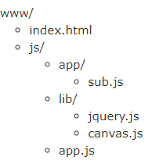
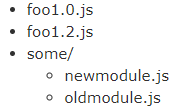

# require.js

## 目录

1. [为什么要用require.js](#为什么要用require.js)
2. [require.js的加载](#require.js的加载)
3. [主模块的写法](#主模块的写法)
4. [模块的加载](#模块的加载)
5. [AMD模块的写法](#AMD模块的写法)
6. [加载非规范的模块](#加载非规范的模块)
7. [无主的与有主的模块](#无主的与有主的模块)
8. [require.js插件](#require.js插件)
9. [总结](#总结)
    - [使用](#使用)
      - [加载JavaScript文件](#加载JavaScript文件)
      - [data-main入口点](#data-main入口点)
      - [定义模块](#定义模块)
    - [机制](#机制)
    - [配置选配](#配置选配)
    - [高级使用](#高级使用)
      - [从包中加载模块](#从包中加载模块)
      - [多版本支持](#多版本支持)
      - [在页面加载之后加载代码](#在页面加载之后加载代码)
      - [Web&nbsp;Worker支持](#Web&nbsp;Worker支持)
      - [Rhino支持](#Rhino支持)
      - [处理错误](#处理错误)
    - [加载插件](#加载插件)
      - [页面加载事件及DOM Ready](#页面加载事件及DOM&nbsp;Ready)

## 为什么要用require.js

最早的时候，所有Javascript代码都写在一个文件里面，只要加载这一个文件就够了。后来，代码越来越多，一个文件不够了，必须分成多个文件，依次加载。下面的网页代码，相信很多人都见过。

```html
<script src="1.js"></script>
<script src="2.js"></script>
<script src="3.js"></script>
<script src="4.js"></script>
<script src="5.js"></script>
<script src="6.js"></script>
```

这段代码依次加载多个js文件。

这样的写法有很大的缺点。首先，加载的时候，浏览器会停止网页渲染，加载文件越多，网页失去响应的时间就会越长；其次，由于js文件之间存在依赖关系，因此必须严格保证加载顺序（比如上例的1.js要在2.js的前面），依赖性最大的模块一定要放到最后加载，当依赖关系很复杂的时候，代码的编写和维护都会变得困难。

require.js的诞生，就是为了解决这两个问题：


（1）实现js文件的异步加载，避免网页失去响应；  
（2）管理模块之间的依赖性，便于代码的编写和维护。

## require.js的加载

使用require.js的第一步，是先去官方网站[下载](http://requirejs.org/docs/download.html)最新版本。

下载后，假定把它放在js子目录下面，就可以加载了。

```html
<script src="js/require.js"></script>
```

有人可能会想到，加载这个文件，也可能造成网页失去响应。解决办法有两个，一个是把它放在网页底部加载，另一个是写成下面这样：

```html
<script src="js/require.js" defer async="true" ></script>
```

async属性表明这个文件需要异步加载，避免网页失去响应。IE不支持这个属性，只支持defer，所以把defer也写上。

加载require.js以后，下一步就要加载我们自己的代码了。假定我们自己的代码文件是main.js，也放在js目录下面。那么，只需要写成下面这样就行了：

```html
<script src="js/require.js" data-main="js/main"></script>
```

data-main属性的作用是，指定网页程序的主模块。在上例中，就是js目录下面的main.js，这个文件会第一个被require.js加载。由于require.js默认的文件后缀名是js，所以可以把main.js简写成main。

## 主模块的写法

上一节的main.js，我把它称为"主模块"，意思是整个网页的入口代码。它有点像C语言的main()函数，所有代码都从这儿开始运行。

下面就来看，怎么写main.js。

如果我们的代码不依赖任何其他模块，那么可以直接写入javascript代码。

```js
// main.js
alert("加载成功！");
```

但这样的话，就没必要使用require.js了。真正常见的情况是，主模块依赖于其他模块，这时就要使用AMD规范定义的的require()函数。

```js
// main.js
require(['moduleA', 'moduleB', 'moduleC'], function (moduleA, moduleB, moduleC){
    // some code here
});
```

require()函数接受两个参数。第一个参数是一个数组，表示所依赖的模块，上例就是['moduleA', 'moduleB', 'moduleC']，即主模块依赖这三个模块；第二个参数是一个回调函数，当前面指定的模块都加载成功后，它将被调用。加载的模块会以参数形式传入该函数，从而在回调函数内部就可以使用这些模块。

require()异步加载moduleA，moduleB和moduleC，浏览器不会失去响应；它指定的回调函数，只有前面的模块都加载成功后，才会运行，解决了依赖性的问题。

下面，我们看一个实际的例子。

假定主模块依赖jquery、underscore和backbone这三个模块，main.js就可以这样写：

```js
require(['jquery', 'underscore', 'backbone'], function ($, _, Backbone){
   // some code here
});
```

require.js会先加载jQuery、underscore和backbone，然后再运行回调函数。主模块的代码就写在回调函数中。

## 模块的加载

上一节最后的示例中，主模块的依赖模块是['jquery', 'underscore', 'backbone']。默认情况下，require.js假定这三个模块与main.js在同一个目录，文件名分别为jquery.js，underscore.js和backbone.js，然后自动加载。

使用require.config()方法，我们可以对模块的加载行为进行自定义。require.config()就写在主模块（main.js）的头部。参数就是一个对象，这个对象的paths属性指定各个模块的加载路径。

```js
require.config({
  paths: {
    "jquery": "jquery.min",
　  "underscore": "underscore.min",
　  "backbone": "backbone.min"
  }
});
```

上面的代码给出了三个模块的文件名，路径默认与main.js在同一个目录（js子目录）。如果这些模块在其他目录，比如js/lib目录，则有两种写法。一种是逐一指定路径。

```js
require.config({
  paths: {
　　"jquery": "lib/jquery.min",
　　"underscore": "lib/underscore.min",
　　"backbone": "lib/backbone.min"
　}
});
```

另一种则是直接改变基目录（baseUrl）。

```js
require.config({
　baseUrl: "js/lib",
　paths: {
　　"jquery": "jquery.min",
　　"underscore": "underscore.min",
　　"backbone": "backbone.min"
　}
});
```

如果某个模块在另一台主机上，也可以直接指定它的网址，比如：

```js
require.config({
　paths: {
　　"jquery": "https://ajax.googleapis.com/ajax/libs/jquery/1.7.2/jquery.min"
  }
});
```

require.js要求，每个模块是一个单独的js文件。这样的话，如果加载多个模块，就会发出多次HTTP请求，会影响网页的加载速度。因此，require.js提供了一个[优化工具](http://requirejs.org/docs/optimization.html)，当模块部署完毕以后，可以用这个工具将多个模块合并在一个文件中，减少HTTP请求数。

## AMD模块的写法

require.js加载的模块，采用AMD规范。也就是说，模块必须按照AMD的规定来写。

具体来说，就是模块必须采用特定的define()函数来定义。如果一个模块不依赖其他模块，那么可以直接定义在define()函数之中。

假定现在有一个math.js文件，它定义了一个math模块。那么，math.js就要这样写：

```js
// math.js
define(function (){
　var add = function (x,y){
　  return x+y;
  };

  return {
　  add: add
  };
});
```

加载方法如下：

```js
// main.js
require(['math'], function (math){
　alert(math.add(1,1));
});
```

如果这个模块还依赖其他模块，那么define()函数的第一个参数，必须是一个数组，指明该模块的依赖性。

```js
define(['myLib'], function(myLib){
  function foo(){
　　myLib.doSomething();
　}
　return {
　　foo : foo
  };
});
```

当require()函数加载上面这个模块的时候，就会先加载myLib.js文件。

## 加载非规范的模块

理论上，require.js加载的模块，必须是按照AMD规范、用define()函数定义的模块。但是实际上，虽然已经有一部分流行的函数库（比如jQuery）符合AMD规范，更多的库并不符合。那么，require.js是否能够加载非规范的模块呢？

回答是可以的。

这样的模块在用require()加载之前，要先用require.config()方法，定义它们的一些特征。

举例来说，underscore和backbone这两个库，都没有采用AMD规范编写。如果要加载它们的话，必须先定义它们的特征。

```js
require.config({
  shim: {
　　'underscore':{
　　　　exports: '_'
　　},

　　'backbone': {
　　　　deps: ['underscore', 'jquery'],
　　　　exports: 'Backbone'
　　}
  }
});
```

require.config()接受一个配置对象，这个对象除了有前面说过的paths属性之外，还有一个shim属性，专门用来配置不兼容的模块。具体来说，每个模块要定义（1）exports值（输出的变量名），表明这个模块外部调用时的名称；（2）deps数组，表明该模块的依赖性。

比如，jQuery的插件可以这样定义：

```js
shim: {
　'jquery.scroll': {
　　deps: ['jquery'],
　  exports: 'jQuery.fn.scroll'
　}
}
```

***示例过程***

hello.js:

```js
function hello() {
  alert("hello, world~");
}
```

它就按最普通的方式定义了一个函数，我们能在requirejs里使用它吗？

先看下面不能正确工作的代码：

```js
requirejs.config({
  baseUrl: '/public/js',
  paths: {
    hello: 'hello'
  }
});

requirejs(['hello'], function(hello) {
  hello();
});
```

这段代码会报错，提示：`Uncaught TypeError: undefined is not a function`

原因是最后调用 hello() 的时候，这个 hello 是个 undefined . 这说明，虽然我们依赖了一个js库（它会被载入），但requirejs无法从中拿到代表它的对象注入进来供我们使用。

在这种情况下，我们要使用 shim ，将某个依赖中的某个全局变量暴露给requirejs，当作这个模块本身的引用。

```js
requirejs.config({
  baseUrl: '/public/js',
  paths: {
    hello: 'hello'
  },
  shim: {
    hello: { exports: 'hello' }
  }
});

requirejs(['hello'], function(hello) {
  hello();
});
```

再运行就正常了。

上面代码 exports: 'hello' 中的 hello ，是我们在 hello.js 中定义的hello 函数。当我们使用 function hello() {} 的方式定义一个函数的时候，它就是全局可用的。如果我们选择了把它 export 给requirejs，那当我们的代码依赖于hello 模块的时候，就可以拿到这个 hello 函数的引用了。

所以： exports 可以把某个非requirejs方式的代码中的某一个全局变量暴露出去，当作该模块以引用。

***暴露多个变量：init***

但如果我要同时暴露多个全局变量呢？比如， hello.js 的定义其实是这样的：

```js
function hello() {
  alert("hello, world~");
}

function hello2() {
  alert("hello, world, again~");
}
```

它定义了两个函数，而我两个都想要。

这时就不能再用 exports 了，必须换成 init 函数：

```js
requirejs.config({
  baseUrl: '/public/js',
  paths: {
    hello: 'hello'
  },
  shim: {
    hello: {
      init: function() {
        return {
          hello: hello,
          hello2: hello2
        }
      }
    }
  }
});

requirejs(['hello'], function(hello) {
  hello.hello1();
  hello.hello2();
});
```

当 exports 与 init 同时存在的时候， exports 将被忽略。

## 无主的与有主的模块

为什么只能使用 jquery 来依赖jquery, 而不能用其它的名字？

```js
requirejs.config({
  baseUrl: '/public/js',
  paths: {
    myjquery: 'lib/jquery/jquery'
  }
});

requirejs(['myjquery'], function(jq) {
  alert(jq);
});
```

会提示：`jq is undefined`

仅仅改个名字：

```js
requirejs.config({
  baseUrl: '/public/js',
  paths: {
    jquery: 'lib/jquery/jquery'
  }
});

requirejs(['jquery'], function(jq) {
  alert(jq);
});
```

就一切正常了，为什么？

原来在jquery中已经定义了：

```js
define('jquery', [], function() { ... });
```

它这里的 define 多了第一个参数'jquery' ，表示给当前这个模块起了名字 jquery ，它已经是有主的了，只能属于jquery。

去引用这个库的时候，它会发现，在 jquery.js 里声明的模块名 jquery 与己使用的模块名 myjquery 不匹配，便不会把它赋给 myjquery ，所以 myjquery 的值是 undefined 。

所以我们在使用一个第三方的时候，一定要注意它是否声明了一个确定的模块名。

无主的模块可以使用任意一个模块名来引用它！

***为什么有的有主，有的无主***

可以看到，无主的模块使用起来非常自由，为什么某些库（jquery, underscore）要把自己声明为有主的呢？

按某些说法，这么做是出于性能的考虑。因为像 jquery , underscore 这样的基础库，经常被其它的库依赖。如果声明为无主的，那么其它的库很可能起不同的模块名，这样当我们使用它们时，就可能会多次载入jquery/underscore。

而把它们声明为有主的，那么所有的模块只能使用同一个名字引用它们，这样系统就只会载入它们一次。

***如何完全不让jquery污染全局的$***

jquery-private.js

```js
define(['jquery'], function(jq) {
  return jQuery.noConflict(true);
});
```

引入 map 配置

```js
requirejs.config({
  baseUrl: '/public/js',
  paths: {
    jquery: 'lib/jquery/jquery',
    'jquery-private': 'jquery-private'
  },
  map: {
    '*': { 'jquery': 'jquery-private' },
    'jquery-private': { 'jquery': 'jquery'}
  }
});

requirejs(['jquery'], function(jq) {
  alert($);
});
```

这样做，就解决了问题：在除了jquery-private之外的任何依赖中，还可以直接使用 jqurey 这个模块名，并且总是被替换为对 jquery-private 的依赖，使得它最先被执行。

## require.js插件

require.js还提供一系列插件，实现一些特定的功能。

domready插件，可以让回调函数在页面DOM结构加载完成后再运行。

```js
require(['domready!'], function (doc){
　// called once the DOM is ready
});
```

text和image插件，则是允许require.js加载文本和图片文件。

```js
define(['text!review.txt','image!cat.jpg'], function(review,cat){
　console.log(review);
　document.body.appendChild(cat);
});
```

类似的插件还有json和mdown，用于加载json文件和markdown文件。

## 总结

### 使用

#### 加载JavaScript文件

RequireJS的目标是鼓励代码的模块化，它使用了不同于传统`<script>`标签的脚本加载步骤。可以用它来加速、优化代码，但其主要目的还是为了代码的模块化。

RequireJS以一个相对于baseUrl的地址来加载所有的代码。 页面顶层`<script>`标签含有一个特殊的属性data-main，require.js使用它来启动脚本加载过程，而baseUrl一般设置到与该属性相一致的目录。

baseUrl亦可通过RequireJS config手动设置。如果没有显式指定config及data-main，则默认的baseUrl为包含RequireJS的那个HTML页面的所属目录。

RequireJS默认假定所有的依赖资源都是js脚本，因此无需在module ID上再加".js"后缀，RequireJS在进行module ID到path的解析时会自动补上后缀。你可以通过paths config设置一组脚本，这些有助于我们在使用脚本时码更少的字。

有时候你想避开"baseUrl + paths"的解析过程，而是直接指定加载某一个目录下的脚本。此时可以这样做：如果一个module ID符合下述规则之一，其ID解析会避开常规的"baseUrl + paths"配置，而是直接将其加载为一个相对于当前HTML文档的脚本：

- 以 ".js" 结束.
- 以 "/" 开始.
- 包含 URL 协议, 如 "http:" or "https:".

一般来说，最好还是使用baseUrl及"paths" config去设置module ID。它会给你带来额外的灵活性，如便于脚本的重命名、重定位等。 同时，为了避免凌乱的配置，最好不要使用多级嵌套的目录层次来组织代码，而是要么将所有的脚本都放置到baseUrl中，要么分置为项目库/第三方库的一个扁平结构，如下：



index.html:

```html
<script data-main="js/app.js" src="js/require.js"></script>
```

app.js:

```js
requirejs.config({
  //By default load any module IDs from js/lib
  baseUrl: 'js/lib',
  //except, if the module ID starts with "app",
  //load it from the js/app directory. paths
  //config is relative to the baseUrl, and
  //never includes a ".js" extension since
  //the paths config could be for a directory.
  paths: {
    app: '../app'
  }
});

//Start the main app logic.
requirejs(['jquery', 'canvas', 'app/sub'],
function ($, canvas, sub) {
  //jQuery, canvas and the app/sub module are all
  //loaded and can be used here now.
});
```

注意在示例中，第三方库如jQuery没有将版本号包含在他们的文件名中。我们建议将版本信息放置在单独的文件中来进行跟踪。使用诸如volo这类的工具，可以将package.json打上版本信息，并在磁盘上保持文件名为"jquery.js"。这有助于你保持配置的最小化，避免为每个库版本设置一条path。例如，将"jquery"配置为"jquery-1.7.2"。

理想状况下，每个加载的脚本都是通过define()来定义的一个模块；但有些"浏览器全局变量注入"型的传统/遗留库并没有使用define()来定义它们的依赖关系，你必须为此使用shim config来指明它们的依赖关系。 如果你没有指明依赖关系，加载可能报错。这是因为基于速度的原因，RequireJS会异步地以无序的形式加载这些库。

#### data-main入口点

require.js 在加载的时候会检察data-main 属性：

```html
<script data-main="scripts/main" src="scripts/require.js"></script>
```

你可以在data-main指向的脚本中设置模板加载 选项，然后加载第一个应用模块。

注意：你在main.js中所设置的脚本是异步加载的。所以如果你在页面中配置了其它JS加载，则不能保证它们所依赖的JS已经加载成功。例如：

```html
<script data-main="scripts/main" src="scripts/require.js"></script>
<script src="scripts/other.js"></script>
```

```js
// contents of main.js:
require.config({
  paths: {
    foo: 'libs/foo-1.1.3'
  }
});

// contents of other.js:
// This code might be called before the require.config() in main.js has executed.
// When that happens, require.js will attempt to load 'scripts/foo.js' instead of 'scripts/libs/foo-1.1.3.js'
require( ['foo'], function( foo ) {

});
```

#### 定义模块

模块不同于传统的脚本文件，它良好地定义了一个作用域来避免全局名称空间污染。它可以显式地列出其依赖关系，并以函数（定义此模块的那个函数）参数的形式将这些依赖进行注入，而无需引用全局变量。RequireJS的模块是模块模式的一个扩展，其好处是无需全局地引用其他模块。

RequireJS的模块语法允许它尽快地加载多个模块，虽然加载的顺序不定，但依赖的顺序最终是正确的。同时因为无需创建全局变量，甚至可以做到在同一个页面上同时加载同一模块的不同版本。

一个磁盘文件应该只定义 1 个模块。多个模块可以使用内置优化工具将其组织打包。

***简单的值对***

如果一个模块仅含值对，没有任何依赖，则在define()中定义这些值对就好了：

```js
//Inside file my/shirt.js:
define({
  color: "black",
  size: "unisize"
});
```

***函数式定义***

如果一个模块没有任何依赖，但需要一个做setup工作的函数，则在define()中定义该函数，并将其传给define()：

```js
//my/shirt.js now does setup work
//before returning its module definition.
define(function () {
  //Do setup work here
  return {
    color: "black",
    size: "unisize"
  }
});
```

***存在依赖的函数式定义***

如果模块存在依赖：则第一个参数是依赖的名称数组；第二个参数是函数，在模块的所有依赖加载完毕后，该函数会被调用来定义该模块，因此该模块应该返回一个定义了本模块的object。依赖关系会以参数的形式注入到该函数上，参数列表与依赖名称列表一一对应。

```js
//my/shirt.js now has some dependencies, a cart and inventory module in the same directory as shirt.js
define(["./cart", "./inventory"], function(cart, inventory) {
  //return an object to define the "my/shirt" module.
  return {
    color: "blue",
    size: "large",
    addToCart: function() {
      inventory.decrement(this);
      cart.add(this);
    }
  }
});
```

本示例创建了一个my/shirt模块，它依赖于my/cart及my/inventory。磁盘上各文件分布如下：

- my/cart.js
- my/inventory.js
- my/shirt.js

模块函数以参数"cart"及"inventory"使用这两个以"./cart"及"./inventory"名称指定的模块。在这两个模块加载完毕之前，模块函数不会被调用。

严重不鼓励模块定义全局变量。遵循此处的定义模式，可以使得同一模块的不同版本并存于同一个页面上(参见 高级用法 )。另外，函参的顺序应与依赖顺序保存一致。

返回的object定义了"my/shirt"模块。这种定义模式下，"my/shirt"不作为一个全局变量而存在。

***将模块定义为一个函数***

对模块的返回值类型并没有强制为一定是个object，任何函数的返回值都是允许的。此处是一个返回了函数的模块定义：

```js
//A module definition inside foo/title.js. It uses my/cart and my/inventory modules from before,
//but since foo/title.js is in a different directory than the "my" modules, it uses the "my" in the module dependency name to find them.
//The "my" part of the name can be mapped to any directory, but by default, it is assumed to be a sibling to the "foo" directory.
define(["my/cart", "my/inventory"], function(cart, inventory) {
  //return a function to define "foo/title".
  //It gets or sets the window title.
  return function(title) {
    return title ? (window.title = title) :
      inventory.storeName + ' ' + cart.name;
  }
});
```

***简单包装CommonJS来定义模块***

如果你现有一些以CommonJS模块格式编写的代码，而这些代码难于使用上述依赖名称数组参数的形式来重构，你可以考虑直接将这些依赖对应到一些本地变量中进行使用。你可以使用一个CommonJS的简单包装来实现：

```js
define(function(require, exports, module) {
  var a = require('a'),
      b = require('b');

  //Return the module value
  return function () {};
});
```

该包装方法依靠Function.prototype.toString()将函数内容赋予一个有意义的字串值，但在一些设备如PS3及一些老的Opera手机浏览器中不起作用。考虑在这些设备上使用优化器将依赖导出为数组形式。

***定义一个命名模块***

你可能会看到一些define()中包含了一个模块名称作为首个参数：

```js
//Explicitly defines the "foo/title" module:
define("foo/title", ["my/cart", "my/inventory"], function(cart, inventory) {
  //Define foo/title object in here.
});
```

这些常由优化工具生成。你也可以自己显式指定模块名称，但这使模块更不具备移植性——就是说若你将文件移动到其他目录下，你就得重命名。一般最好避免对模块硬编码，而是交给优化工具去生成。优化工具需要生成模块名以将多个模块打成一个包，加快到浏览器的载人速度。

***其他注意事项***

一个文件一个模块：每个Javascript文件应该只定义一个模块，这是模块名-至-文件名查找机制的自然要求。多个模块会被优化工具组织优化，但你在使用优化工具时应将多个模块放置到一个文件中。

define()中的相对模块名：为了可以在define()内部使用诸如require("./relative/name")的调用以正确解析相对名称，记得将"require"本身作为一个依赖注入到模块中：

```js
define(["require", "./relative/name"], function(require) {
  var mod = require("./relative/name");
});
```

或者更好地，使用下述为转换CommonJS模块所设的更短的语法：

```js
define(function(require) {
  var mod = require("./relative/name");
});
```

相对路径在一些场景下格外有用，例如：为了以便于将代码共享给其他人或项目，你在某个目录下创建了一些模块。你可以访问模块的相邻模块，无需知道该目录的名称。

生成相对于模块的URL地址：你可能需要生成一个相对于模块的URL地址。你可以将"require"作为一个依赖注入进来，然后调用require.toUrl()以生成该URL：

```js
define(["require"], function(require) {
  var cssUrl = require.toUrl("./style.css");
});
```

控制台调试：如果你需要处理一个已通过require(["module/name"], function(){})调用加载了的模块，可以使用模块名作为字符串参数的require()调用来获取它：

```js
require("module/name").callSomeFunction()
```

注意这种形式仅在"module/name"已经由其异步形式的require(["module/name"])加载了后才有效。只能在define内部使用形如"./module/name"的相对路径。

***循环依赖***

如果你定义了一个循环依赖（a依赖b，b同时依赖a），则在这种情形下当b的模块函数被调用的时候，它会得到一个undefined的a。b可以在模块已经定义好后用require()方法再获取（记得将require作为依赖注入进来）：

```js
//Inside b.js:
define(["require", "a"],
  function(require, a) {
    //"a" in this case will be null if a also asked for b,
    //a circular dependency.
    return function(title) {
      return require("a").doSomething();
    }
  }
);
```

一般说来你无需使用require()去获取一个模块，而是应当使用注入到模块函数参数中的依赖。循环依赖比较罕见，它也是一个重构代码重新设计的警示灯。但不管怎样，有时候还是要用到循环依赖，这种情形下就使用上述的require()方式来解决。

如果你熟悉CommonJS，你可以考虑使用exports为模块建立一个空object，该object可以立即被其他模块引用。在循环依赖的两头都如此操作之后，你就可以安全地持有其他模块了。这种方法仅在每个模块都是输出object作为模块值的时候有效，换成函数无效。

```js
//Inside b.js:
define(function(require, exports, module) {
  //If "a" has used exports, then we have a real object reference here.
  //However, we cannot useany of a's properties until after b returns a value.
  var a = require("a");
  exports.foo = function () {
    return a.bar();
  };
});
```

或者，如果你使用依赖注入数组的步骤，则可用注入特殊的"exports"来解决：

```js
//Inside b.js:
define(['a', 'exports'], function(a, exports) {
  //If "a" has used exports, then we have a real object reference here.
  //However, we cannot useany of a's properties until after b returns a value.
  exports.foo = function () {
    return a.bar();
  };
});
```

***JSONP服务依赖***

JSONP是在javascript中服务调用的一种方式。它仅需简单地通过一个script标签发起HTTP GET请求，是实现跨域服务调用一种公认手段。

为了在RequireJS中使用JSON服务，须要将callback参数的值指定为"define"。这意味着你可将获取到的JSONP URL的值看成是一个模块定义。

下面是一个调用JSONP API端点的示例。该示例中，JSONP的callback参数为"callback"，因此"callback=define"告诉API将JSON响应包裹到一个"define()"中：

```js
require(["http://example.com/api/data.json?callback=define"],
  function (data) {
    //The data object will be the API response for theJSONP data call.
    console.log(data);
  }
);
```

仅支持返回值类型为JSON object的JSONP服务，其他返回类型如数组、字串、数字等都不能支持。

### 机制

RequireJS使用 `head.appendChild()` 将每一个依赖加载为一个script标签。

RequireJS等待所有的依赖加载完毕，计算出模块定义函数正确调用顺序，然后依次调用它们。

在同步加载的服务端JavaScript环境中，可简单地重定义 `require.load()` 来使用RequireJS。build系统就是这么做的。该环境中的 `require.load` 实现可在 build/jslib/requirePatch.js 中找到。

未来可能将该部分代码置入require/目录下作为一个可选模块，这样你可以在你的宿主环境中使用它来获得正确的加载顺序。

### 配置选配

当在顶层HTML页面（或不作为一个模块定义的顶层脚本文件）中，可将配置作为首项放入：

```html
<script src="scripts/require.js"></script>
<script>
  require.config({
    baseUrl: "/another/path",
    paths: {
        "some": "some/v1.0"
    },
    waitSeconds: 15
  });
  require( ["some/module", "my/module", "a.js", "b.js"],
    function(someModule,    myModule) {
      //This function will be called when all the dependencies
      //listed above are loaded. Note that this function could
      //be called before the page is loaded.
      //This callback is optional.
    }
  );
</script>

<script>
  var require = {
    deps: ["some/module1", "my/module2", "a.js", "b.js"],
    callback: function(module1, module2) {
      //This function will be called when all the dependencies
      //listed above in deps are loaded. Note that this
      //function could be called before the page is loaded.
      //This callback is optional.
    }
  };
</script>
<script src="scripts/require.js"></script>
```

或者，你将配置作为全局变量 "require" 在 require.js 加载之前进行定义，它会被自动应用。下面的示例定义的依赖会在 require.js 一旦定义了 require() 之后即被加载：

```js
requirejs.config({
  bundles: {
    'primary': ['main', 'util', 'text', 'text!template.html'],
    'secondary': ['text!secondary.html']
  }
});

require(['util', 'text'], function(util, text) {
  //The script for module ID 'primary' was loaded,
  //and that script included the define()'d
  //modules for 'util' and 'text'
});
```

注意: 最好使用 var require = {} 的形式而不是 window.require = {}的形式。后者在IE中运行不正常。

支持的配置项：

- baseUrl：所有模块的查找根路径。所以上面的示例中，"my/module" 的标签src值是 "/another/path/my/module.js"。当加载纯.js文件（依赖字串以/开头，或者以.js结尾，或者含有协议），不会使用baseUrl。因此 a.js 及 b.js 都在包含上述代码段的 HTML 页面的同目录下加载。

  如未显式设置baseUrl，则默认值是加载 require.js 的HTML所处的位置。如果用了data-main属性，则该路径就变成baseUrl。

- paths：path映射那些不直接放置于baseUrl下的模块名。设置path时起始位置是相对于baseUrl的，除非该path设置以"/"开头或含有URL协议（如http:）。在上述的配置下，"some/module"的script标签src值是"/another/path/some/v1.0/module.js"。

  用于模块名的path不应含有.js后缀，因为一个path有可能映射到一个目录。路径解析机制会自动在映射模块名到path时添加上.js后缀。在文本模版之类的场景中使用require.toUrl()时它也会添加合适的后缀。

  在浏览器中运行时，可指定路径的备选(fallbacks)，以实现诸如首先指定了从CDN中加载，一旦CDN加载失败则从本地位置中加载这类的机制。

- shim：为那些没有使用define()来声明依赖关系、设置模块的"浏览器全局变量注入"型脚本做依赖和导出配置。

  下面有个示例，它需要 RequireJS 2.1.0+，并且假定backbone.js、underscore.js、jquery.js都装于baseUrl目录下。如果没有，则你可能需要为它们设置paths config：

  ```js
  requirejs.config({
  //Remember: only use shim config for non-AMD scripts,scripts that do not already call define().
  //The shimconfig will not work correctly if used on AMD scripts,
  //in particular, the exports and init config will notbe triggered, and the deps config will be confusing for those cases.
  shim: {
    'backbone': {
      //These script dependencies should be loaded before loadingbackbone.js|译|在加载backbone.js之前应先加载它的依赖函数underscore.js和jquery.js
      deps: ['underscore', 'jquery'],
      //Once loaded, use the global 'Backbone' as themodule value.|译|加载完毕后该模块使用的引用名
      exports: 'Backbone'
    },
    'underscore': {
      exports: '_'
    },
    'foo': {
      deps: ['bar'],
      exports: 'Foo',
      init: function (bar) {
        //Using a function allows you to call noConflict forlibraries that support it, and do other cleanup.
        //However, plugins for those libraries may still want a global.
        //"this" for the function will be the global object.
        //The dependencies will be passed in as function arguments.
        //If this function returns a value,then that value is used as the module export valueinstead of the object found via the 'exports' string.
        //Note: jQuery registers as an AMD module via define(),so this will not work for jQuery.
        //See notes sectionbelow for an approach for jQuery.
        return this.Foo.noConflict();
      }
    }
  }
  });

  //Then, later in a separate file, call it 'MyModel.js', a module is defined,specifting 'backbone' as a dependency.
  //RequireJS will use the shim config to properly load 'backbone' and give a local reference to this module.
  //The global Backbone will still exist on the page too.
  define(['backbone'], function (Backbone) {
    return Backbone.Model.extend({});
  });
  ```

  RequireJS 2.0.*中，shim配置中的"exports"属性可以是一个函数而不是字串。这种情况下它就起到上述示例中的"init"属性的功能。 RequireJS 2.1.0+中加入了"init"承接库加载后的初始工作，以使exports作为字串值被enforceDefine所使用。

  那些仅作为jQuery或Backbone的插件存在而不导出任何模块变量的"模块"们，shim配置可简单设置为依赖数组：

  ```js
  requirejs.config({
  shim: {
    'jquery.colorize': ['jquery'],
    'jquery.scroll': ['jquery'],
    'backbone.layoutmanager': ['backbone']
  }
  });
  ```

  但请注意，若你想在IE中使用404加载检测以启用path备选(fallbacks)或备错(errbacks)，则需要给定一个字串值的exports以使loader能够检查出脚本是否实际加载了（init中的返回值不会用于enforceDefine检查中）：

  ```js
  requirejs.config({
  shim: {
    'jquery.colorize': {
      deps: ['jquery'],
      exports: 'jQuery.fn.colorize'
    },
    'jquery.scroll': {
      deps: ['jquery'],
      exports: 'jQuery.fn.scroll'
    },
    'backbone.layoutmanager': {
      deps: ['backbone']
          exports: 'Backbone.LayoutManager'
    }
  }
  });
  ```

  "shim"配置的重要注意事项：

  - shim配置仅设置了代码的依赖关系，想要实际加载shim指定的或涉及的模块，仍然需要一个常规的require/define调用。设置shim本身不会触发代码的加载。
  - 请仅使用其他"shim"模块作为shim脚本的依赖，或那些没有依赖关系，并且在调用define()之前定义了全局变量(如jQuery或lodash)的AMD库。否则，如果你使用了一个AMD模块作为一个shim配置模块的依赖，在build之后，AMD模块可能在shim托管代码执行之前都不会被执行，这会导致错误。终极的解决方案是将所有shim托管代码都升级为含有可选的AMD define()调用。（这一块不明白~~！！！）

  "shim"配置的优化器重要注意事项：

  - 您应当使用 mainConfigFile build配置项来指定含有shim配置的文件位置，否则优化器不会知晓shim配置。另一个手段是将shim配置复制到build profile中。（这一块不明白~~！！！）
  - 不要在一个build中混用CDN加载和shim配置。示例场景，如：你从CDN加载jQuery的同时使用shim配置加载依赖于jQuery的原版Backbone。不要这么做。您应该在build中将jQuery内联而不是从CDN加载，否则build中内联的Backbone会在CDN加载jQuery之前运行。这是因为shim配置仅延时加载到所有的依赖已加载，而不会做任何define的自动装裹(auto-wrapping)。在build之后，所有依赖都已内联，shim配置不能延时执行非define()的代码。define()的模块可以在build之后与CDN加载代码一并工作，因为它们已将自己的代码合理地用define装裹了，在所有的依赖都已加载之前不会执行。因此记住：shim配置仅是个处理非模块(non-modular)代码、遗留代码的将就手段，如可以应尽量使用define()的模块。
  - 对于本地的多文件build，上述的CDN加载建议仍然适用。任何shim过的脚本，它们的依赖必须加载于该脚本执行之前。这意味着要么直接在含有shim脚本的build层build它的依赖，要么先使用require([], function (){})调用来加载它的依赖，然后对含有shim脚本的build层发出一个嵌套的require([])调用。
  - 如果您使用了uglifyjs来压缩代码，不要将uglify的toplevel选项置为true，或在命令行中不要使用 -mt。 该选项会破坏shim用于找到exports的全局名称。

- map: 对于给定的模块前缀，使用一个不同的模块ID来加载该模块。

  该手段对于某些大型项目很重要：如有两类模块需要使用不同版本的"foo"，但它们之间仍需要一定的协同。在那些基于上下文的多版本实现中很难做到这一点。而且，paths配置仅用于为模块ID设置root paths，而不是为了将一个模块ID映射到另一个。map示例：

  ```js
  requirejs.config({
  map: {
    'some/newmodule': {
      'foo': 'foo1.2'
    },
    'some/oldmodule': {
      'foo': 'foo1.0'
    }
  }
  });
  ```

  如果各模块在磁盘上分布如下：

  

  当 "some/newmodule" 调用了 "require('foo')"，它将获取到foo1.2.js文件；而当 "some/oldmodule" 调用 "require('foo')" 时它将获取到foo1.0.js。

  该特性仅适用于那些调用了define()并将其注册为匿名模块的真正AMD模块脚本。并且，请在map配置中仅使用绝对模块ID，"../some/thing" 之类的相对ID不能工作。

  另外在map中支持"\*"，意思是“对于所有的模块加载，使用本map配置”。如果还有更细化的map配置，会优先于"*"配置。示例：

  ```js
  requirejs.config({
  map: {
    '*': {
      'foo': 'foo1.2'
    },
    'some/oldmodule': {
      'foo': 'foo1.0'
    }
  }
  });
  ```

  意思是除了 "some/oldmodule: 外的所有模块，当要用 "foo" 时，使用 "foo1.2" 来替代。对于"some/oldmodule"自己，则使用"foo1.0"。

- config：常常需要将配置信息传给一个模块。这些配置往往是application级别的信息，需要一个手段将它们向下传递给模块。在RequireJS中，基于requirejs.config()的config配置项来实现。要获取这些信息的模块可以加载特殊的依赖“module”，并调用module.config()。示例：

  ```js
  requirejs.config({
    config: {
      'bar': {
        size: 'large'
      },
      'baz': {
        color: 'blue'
      }
    }
  });

  //bar.js, which uses simplified CJS wrapping:
  //http://requirejs.org/docs/whyamd.html#sugar
  define(function (require, exports, module) {
    //Will be the value 'large'
    var size = module.config().size;
  });

  //baz.js which uses a dependency array,
  //it asks for the special module ID, 'module':
  //https://github.com/jrburke/requirejs/wiki/Differences-between-the-simplified-CommonJS-wrapper-and-standard-AMD-define#wiki-magic
  define(['module'], function (module) {
    //Will be the value 'blue'
    var color = module.config().color;
  });
  ```

  若要将config传给包，将目标设置为包的主模块而不是包ID:

  ```js
  requirejs.config({
    //Pass an API key for use in the pixie package'smain module.
    config: {
      'pixie/index': {
        apiKey: 'XJKDLNS'
      }
    },
    //Set up config for the "pixie" package, whose mainmodule is the index.js file in the pixie folder.
    packages: [
      {
        name: 'pixie',
        main: 'index'
      }
    ]
  });
  ```

- packages: 从CommonJS包(package)中加载模块。
- nodeIdCompat: 在放弃加载一个脚本之前等待的秒数。设为0禁用等待超时。默认为7秒。
- waitSeconds: 命名一个加载上下文。这允许require.js在同一页面上加载模块的多个版本，如果每个顶层require调用都指定了一个唯一的上下文字符串。
- deps: 指定要加载的一个依赖数组。当将require设置为一个config object在加载require.js之前使用时很有用。一旦require.js被定义，这些依赖就已加载。使用deps就像调用require([])，但它在loader处理配置完毕之后就立即生效。它并不阻塞其他的require()调用，它仅是指定某些模块作为config块的一部分而异步加载的手段而已。
- callback: 在deps加载完毕后执行的函数。当将require设置为一个config object在加载require.js之前使用时很有用，其作为配置的deps数组加载完毕后为require指定的函数。
- enforceDefine: 如果设置为true，则当一个脚本不是通过define()定义且不具备可供检查的shim导出字串值时，就会抛出错误。
- xhtml: 如果设置为true，则使用document.createElementNS()去创建script元素。
- urlArgs: RequireJS获取资源时附加在URL后面的额外的query参数。作为浏览器或服务器未正确配置时的“cache bust”手段很有用。使用cache bust配置的一个示例：

  ```js
  urlArgs: "bust=" +  (new Date()).getTime()
  ```

  在开发中这很有用，但请记得在部署到生成环境之前移除它。

- scriptType: 指定RequireJS将script标签插入document时所用的type=""值。默认为“text/javascript”。想要启用Firefox的JavaScript 1.8特性，可使用值“text/javascript;version=1.8”。

### 高级使用

#### 从包中加载模块

RequireJS支持从CommonJS包结构中加载模块，但需要一些额外的配置。具体地，支持如下的CommonJS包特性：

- 一个包可以关联一个模块名/前缀。
- package config可为特定的包指定下述属性：
  - name: 包名（用于模块名/前缀映射）
  - location: 磁盘上的位置。位置是相对于配置中的baseUrl值，除非它们包含协议或以“/”开头
  - main: 当以“包名”发起require调用后，所应用的一个包内的模块。默认为“main”，除非在此处做了另外设定。该值是相对于包目录的。

***重要事项***

虽然包可以有CommonJS的目录结构，但模块本身应为RequireJS可理解的模块格式。例外是：如果你在用r.js Node适配器，模块可以是传统的CommonJS模块格式。你可以使用CommonJS转换工具来将传统的CommonJS模块转换为RequireJS所用的异步模块格式。

一个项目上下文中仅能使用包的一个版本。你可以使用RequireJS的多版本支持来加载两个不同的模块上下文；但若你想在同一个上下文中使用依赖了不同版本的包C的包A和B，就会有问题。未来可能会解决此问题。

如果你使用了类似于入门指导中的项目布局，你的web项目应大致以如下的布局开始（基于Node/Rhino的项目也是类似的，只不过使用scripts目录中的内容作为项目的顶层目录）:

```uml
project-directory/
  project.html
  scripts/
    require.js
```

而下面的示例中使用了两个包，cart及store：

```uml
project-directory/
  project.html
  scripts/
    cart/
      main.js
    store/
      main.js
      util.js
    main.js
    require.js
```

project.html 会有如下的一个script标签：

```html
<script data-main="scripts/main" src="scripts/require.js"></script>
```

对“cart”的依赖请求会从scripts/cart/main.js中加载，因为“main”是RequireJS默认的包主模块。对“store/util”的依赖请求会从scripts/store/util.js加载。

如果“store”包不采用“main.js”约定，如下面的结构：

```uml
project-directory/
  project.html
  scripts/
    cart/
      main.js
    store/
      store.js
      util.js
    main.js
    package.json
    require.js
```

则RequireJS的配置应如下：

```js
require.config({
  packages: [
    "cart",
    {
      name: "store",
      main: "store"
    }
  ]
});
```

减少麻烦期间，强烈建议包结构遵从“main.js”约定。

#### 多版本支持

 如配置项一节中所述，可以在同一页面上以不同的“上下文”配置项加载同一模块的不同版本。require.config()返回了一个使用该上下文配置的require函数。下面是一个加载不同版本（alpha及beta）模块的示例（取自test文件中）：

 ```html
<script src="../require.js"></script>
<script>
  var reqOne = require.config({
    context: "version1",
    baseUrl: "version1"
  });

  reqOne(["require", "alpha", "beta",],
    function (require, alpha, beta) {
      log("alpha version is: " + alpha.version); //prints 1
      log("beta version is: " + beta.version); //prints 1

      setTimeout(function () {
        require(["omega"],
          function (omega) {
            log("version1 omega loaded with version: " +
              omega.version); //prints 1
          }
        );
      }, 100);
    });

  var reqTwo = require.config({
    context: "version2",
    baseUrl: "version2"
  });

  reqTwo(["require", "alpha", "beta"],
    function (require, alpha, beta) {
      log("alpha version is: " + alpha.version); //prints 2
      log("beta version is: " + beta.version); //prints 2

      setTimeout(function () {
        require(["omega"],
          function (omega) {
            log("version2 omega loaded with version: " +
              omega.version); //prints 2
          }
        );
      }, 100);
    });
</script>
 ```

注意“require”被指定为模块的一个依赖，这就允许传递给函数回调的require()使用正确的上下文来加载多版本的模块。如果“require”没有指定为一个依赖，则很可能会出现错误。

#### 在页面加载之后加载代码

上述多版本示例中也展示了如何在嵌套的require()中迟后加载代码。

#### Web&nbsp;Worker支持

从版本0.12开始，RequireJS可在Web Worker中运行。可以通过在web worker中调用importScripts()来加载require.js（或包含require()定义的JS文件），然后调用require就好了。

你可能需要设置baseUrl配置项来确保require()可找到待加载脚本。

你可以在unit test使用的一个文件中找到一个例子。

#### Rhino支持

RequireJS可通过r.js适配器用在Rhino中。

#### 处理错误

通常的错误都是404（未找到）错误，网络超时或加载的脚本含有错误。RequireJS有些工具来处理它们：require特定的错误回调（errback），一个“paths”数组配置，以及一个全局的requirejs.onError事件。

传入errback及requirejs.onError中的error object通常包含两个定制的属性：

- requireType: 含有类别信息的字串值，如“timeout”，“nodefine”， “scripterror”
- requireModules: 超时的模块名/URL数组。

  如果你得到了requireModules错，可能意味着依赖于requireModules数组中的模块的其他模块未定义。

***在IE中捕获加载错***

Internet Explorer有一系列问题导致检测errbacks/paths fallbacks中的加载错 比较困难：

- IE 6-8中的script.onerror无效。没有办法判断是否加载一个脚本会导致404错；更甚地，在404中依然会触发state为complete的onreadystatechange事件。
- IE 9+中script.onerror有效，但有一个bug：在执行脚本之后它并不触发script.onload事件句柄。因此它无法支持匿名AMD模块的标准方法。所以script.onreadystatechange事件仍被使用。但是，state为complete的onreadystatechange事件会在script.onerror函数触发之前触发。

因此IE环境下很难两全其美：匿名AMD（AMD模块机制的核心优势）和可靠的错误检测。

但如果你的项目里使用了define()来定义所有模块，或者为其他非define()的脚本使用shim配置指定了导出字串，则如果你将enforceDefine配置项设为true，loader就可以通过检查define()调用或shim全局导出值来确认脚本的加载无误。

因此如果你打算支持Internet Explorer，捕获加载错，并使用了define()或shim，则记得将enforceDefine设置为true。参见下节的示例。

注意: 如果你设置了enforceDefine: true，而且你使用data-main=""来加载你的主JS模块，则该主JS模块必须调用define()而不是require()来加载其所需的代码。主JS模块仍然可调用require/requirejs来设置config值，但对于模块加载必须使用define()。

***require([]) errbacks***

当与requirejs.undef()一同使用errback时，允许你检测模块的一个加载错，然后undefine该模块，并重置配置到另一个地址来进行重试。

一个常见的应用场景是先用库的一个CDN版本，如果其加载出错，则切换到本地版本：

```js
requirejs.config({
  enforceDefine: true,
  paths: {
    jquery: 'http://ajax.googleapis.com/ajax/libs/jquery/1.4.4/jquery.min'
  }
});

//Later
require(['jquery'], function ($) {
  //Do something with $ here
}, function (err) {
  //The errback, error callback
  //The error has a list of modules that failed
  var failedId = err.requireModules && err.requireModules[0];
  if (failedId === 'jquery') {
    //undef is function only on the global requirejs object.
    //Use it to clear internal knowledge of jQuery.
    //Any modules that were dependent on jQuery and in the middle of loading will not be loaded yet,
    //they will wait until a valid jQuerydoes load.
    requirejs.undef(failedId);

    //Set the path to jQuery to local path
    requirejs.config({
      paths: {
        jquery: 'local/jquery'
      }
    });

    //Try again. Note that the above require callback
    //with the "Do something with $ here" comment will
    //be called if this new attempt to load jQuery succeeds.
    require(['jquery'], function () { });
  } else {
    //Some other error. Maybe show message to the user.
  }
});
```

使用“requirejs.undef()”，如果你配置到不同的位置并重新尝试加载同一模块，则loader会将依赖于该模块的那些模块记录下来并在该模块重新加载成功后去加载它们。

注意: errback仅适用于回调风格的require调用，而不是define()调用。define()仅用于声明模块。

***paths备错配置***

上述模式（检错，undef()模块，修改paths，重加载）是一个常见的需求，因此有一个快捷设置方式。paths配置项允许数组值：

```js
requirejs.config({
  //To get timely, correct error triggers in IE, force a define/shim exports check.
  enforceDefine: true,
  paths: {
    jquery: [
      'http://ajax.googleapis.com/ajax/libs/jquery/1.4.4/jquery.min',
      //If the CDN location fails, load from this location
      'lib/jquery'
    ]
  }
});

//Later
require(['jquery'], function ($) {
});
```

上述代码先尝试加载CDN版本，如果出错，则退回到本地的lib/jquery.js。

注意: paths备错仅在模块ID精确匹配时工作。这不同于常规的paths配置，常规配置可匹配模块ID的任意前缀部分。备错主要用于非常的错误恢复，而不是常规的path查找解析，因为那在浏览器中是低效的。

***全局 requirejs.onError***

为了捕获在局域的errback中未捕获的异常，你可以重载requirejs.onError()：

```js
requirejs.onError = function (err) {
  console.log(err.requireType);
  if (err.requireType === 'timeout') {
    console.log('modules: ' + err.requireModules);
  }

  throw err;
};
```

### 加载插件

RequireJS支持加载器插件。使用它们能够加载一些对于脚本正常工作很重要的非JS文件。RequireJS的wiki有一个插件的列表。本节讨论一些由RequireJS一并维护的特定插件：

#### 指定文本文件依赖

如果都能用HTML标签而不是基于脚本操作DOM来构建HTML，是很不错的。但没有好的办法在JavaScript文件中嵌入HTML。所能做的仅是在js中使用HTML字串，但这一般很难维护，特别是多行HTML的情况下。

RequireJS有个text.js插件可以帮助解决这个问题。如果一个依赖使用了text!前缀，它就会被自动加载。参见text.js的README文件。

#### 页面加载事件及DOM&nbsp;Ready

RequireJS加载模块速度很快，很有可能在页面DOM Ready之前脚本已经加载完毕。需要与DOM交互的工作应等待DOM Ready。现代的浏览器通过DOMContentLoaded事件来知会。

但是，不是所有的浏览器都支持DOMContentLoaded。domReady模块实现了一个跨浏览器的方法来判定何时DOM已经ready。下载并在你的项目中如此用它：

```js
require(['domReady'], function (domReady) {
  domReady(function () {
    //This function is called once the DOM is ready.
    //It will be safe to query the DOM and manipulateDOM nodes in this function.
  });
});
```

基于DOM Ready是个常规需求，像上述API中的嵌套调用方式，理想情况下应避免。domReady模块也实现了Loader Plugin API，因此你可以使用loader plugin语法（注意domReady依赖的!前缀）来强制require()回调函数在执行之前等待DOM Ready。当用作loader plugin时，domReady会返回当前的document：

```js
require(['domReady!'], function (doc) {
  //This function is called once the DOM is ready,
  //notice the value for 'domReady!' is the currentdocument.
});
```

注意: 如果document需要一段时间来加载（也许是因为页面较大，或加载了较大的js脚本阻塞了DOM计算），使用domReady作为loader plugin可能会导致RequireJS“超时”错。如果这是个问题，则考虑增加waitSeconds配置项的值，或在require()使用domReady()调用（将其当做是一个模块）。
