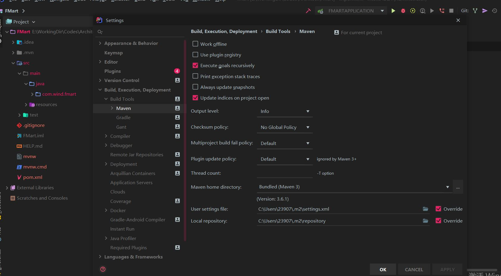

# 目录

1. 开发工具
   - [JetBrain](#JetBrain)
     - [快捷键](#JetBrain快捷键)
     - [激活](#JetBrain激活)
     - [修改Maven镜像](#修改Maven镜像)

## 开发工具

### JetBrain

#### JetBrain快捷键

```txt
查找/代替：
ctrl+F 文件内查找
ctrl+shift+F 指定目录内查找
F3 查找下一个
shift+F3 查找上一个
ctrl+R 查找替换
ctrl+shift+R 指定目录查找替换
ctrl+shift+N 通过文件名快速查找文件
ctrl+shift+alt+N 通过字符快速查找位置
ctrl+shift+A 查找并使用编辑器所有功能
shift+shift 查找所有地方

界面操作：
alt+[0-9] 拆合功能界面模块
双击界面tab 最大或最小化目标界面
alt+←/→ 切换选项卡

编辑：
ctrl+C 复制
ctrl+shift+C 复制路径
ctrl+V 粘贴
ctrl+shift+V 多选粘贴
ctrl+X 剪切
ctrl+Z 退回
ctrl+shift+Z 重做
ctrl+D 复制当前行
ctrl+W 切换选中单词
ctrl+←/→ 以单词为边界跳光标位置
ctrl+alt+L 格式化代码
tab 扩大缩进（这是放在句首起作用。有时候代码输了一部分后按tab可以自动补全代码）
shift+tab 减小缩进
ctrl+Y 删除一行
shift+enter 重新开始新一行
ctrl+shift+enter 完成语句
ctrl+shift+up 切换大小写
ctrl+ -/+ 展开或闭合代码块
ctrl+shift+ -/+ 全部展开或闭合代码块
ctrl+backspace 按单词删除
ctrl+J 查看一些模板快捷方式
alt+shift+C 最近的修改
ctrl+shift+space 自动补全
ctrl+space 提示
ctrl+/ 注释
ctrl+shift+/ 取消注释

导航：
esc 进入编辑区
home 到行首
end 到行尾
ctrl+home 到文件首
ctrl+end 到文件尾
ctrl+]/[ 光标到块的前面或后面
alt+↑/↓ 上一个/下一个方法
ctrl+alt+←/→ 上一个/下一个光标位置
ctrl+鼠标左键 跳到详细
ctrl+Q 显示注释文档
alt+F1 查找代码所在位置
ctrl+E 最近编辑的文件
ctrl+tab 上一个窗口
ctrl+shift+tab 下一个窗口
[shift] + F2 错误或警告定位
ctrl + F12 文件内快速定位

调试：
shift+F9 调试
shift+F10 运行
F8 步过
F7 步入
alt+F9 运行至光标处
ctrl+F2 停止

重构：
ctrl+alt+shift+T 弹出重构菜单
```

怎么找快捷键？在快捷键设置里面，在菜单上有提示，`ctrl+shift+A` 查找快捷键。

#### JetBrain激活

补丁下载地址：[点击这里](https://pan.baidu.com/s/1h0I_hBW86g4M6EA-zWrcHA)

提取码: mekx

- 下载补丁后，找到安装目录，将文件复制到 bin 文件夹。
- 在安装目录的 \bin 目录下有两个文件 xxx.exe.vmoptions 和 xxx64.exe.vmoptions
- （打开文件，最后面加入：`-javaagent:文件路径`）
  2019.02 版本必须在 idea 配置中添加才可以（也就是用户 config 选项下的 idea 配置）
- 保存退出，**重启**，首次打开会提示激活，选择 Activation code，移除以前的license（remove license，没有就跳过）输入code，点击 OK，即可激活成功。

1、第1个code

```txt
A82DEE284F-eyJsaWNlbnNlSWQiOiJBODJERUUyODRGIiwibGljZW5zZWVOYW1lIjoiaHR0cHM6Ly96aGlsZS5pbyIsImFzc2lnbmVlTmFtZSI6IiIsImFzc2lnbmVlRW1haWwiOiIiLCJsaWNlbnNlUmVzdHJpY3Rpb24iOiJVbmxpbWl0ZWQgbGljZW5zZSB0aWxsIGVuZCBvZiB0aGUgY2VudHVyeS4iLCJjaGVja0NvbmN1cnJlbnRVc2UiOmZhbHNlLCJwcm9kdWN0cyI6W3siY29kZSI6IklJIiwicGFpZFVwVG8iOiIyMDg5LTA3LTA3In0seyJjb2RlIjoiUlMwIiwicGFpZFVwVG8iOiIyMDg5LTA3LTA3In0seyJjb2RlIjoiV1MiLCJwYWlkVXBUbyI6IjIwODktMDctMDcifSx7ImNvZGUiOiJSRCIsInBhaWRVcFRvIjoiMjA4OS0wNy0wNyJ9LHsiY29kZSI6IlJDIiwicGFpZFVwVG8iOiIyMDg5LTA3LTA3In0seyJjb2RlIjoiREMiLCJwYWlkVXBUbyI6IjIwODktMDctMDcifSx7ImNvZGUiOiJEQiIsInBhaWRVcFRvIjoiMjA4OS0wNy0wNyJ9LHsiY29kZSI6IlJNIiwicGFpZFVwVG8iOiIyMDg5LTA3LTA3In0seyJjb2RlIjoiRE0iLCJwYWlkVXBUbyI6IjIwODktMDctMDcifSx7ImNvZGUiOiJBQyIsInBhaWRVcFRvIjoiMjA4OS0wNy0wNyJ9LHsiY29kZSI6IkRQTiIsInBhaWRVcFRvIjoiMjA4OS0wNy0wNyJ9LHsiY29kZSI6IkdPIiwicGFpZFVwVG8iOiIyMDg5LTA3LTA3In0seyJjb2RlIjoiUFMiLCJwYWlkVXBUbyI6IjIwODktMDctMDcifSx7ImNvZGUiOiJDTCIsInBhaWRVcFRvIjoiMjA4OS0wNy0wNyJ9LHsiY29kZSI6IlBDIiwicGFpZFVwVG8iOiIyMDg5LTA3LTA3In0seyJjb2RlIjoiUlNVIiwicGFpZFVwVG8iOiIyMDg5LTA3LTA3In1dLCJoYXNoIjoiODkwNzA3MC8wIiwiZ3JhY2VQZXJpb2REYXlzIjowLCJhdXRvUHJvbG9uZ2F0ZWQiOmZhbHNlLCJpc0F1dG9Qcm9sb25nYXRlZCI6ZmFsc2V9-5epo90Xs7KIIBb8ckoxnB/AZQ8Ev7rFrNqwFhBAsQYsQyhvqf1FcYdmlecFWJBHSWZU9b41kvsN4bwAHT5PiznOTmfvGv1MuOzMO0VOXZlc+edepemgpt+t3GUHvfGtzWFYeKeyCk+CLA9BqUzHRTgl2uBoIMNqh5izlDmejIwUHLl39QOyzHiTYNehnVN7GW5+QUeimTr/koVUgK8xofu59Tv8rcdiwIXwTo71LcU2z2P+T3R81fwKkt34evy7kRch4NIQUQUno//Pl3V0rInm3B2oFq9YBygPUdBUbdH/KHROyohZRD8SaZJO6kUT0BNvtDPKF4mCT1saWM38jkw==-MIIElTCCAn2gAwIBAgIBCTANBgkqhkiG9w0BAQsFADAYMRYwFAYDVQQDDA1KZXRQcm9maWxlIENBMB4XDTE4MTEwMTEyMjk0NloXDTIwMTEwMjEyMjk0NlowaDELMAkGA1UEBhMCQ1oxDjAMBgNVBAgMBU51c2xlMQ8wDQYDVQQHDAZQcmFndWUxGTAXBgNVBAoMEEpldEJyYWlucyBzLnIuby4xHTAbBgNVBAMMFHByb2QzeS1mcm9tLTIwMTgxMTAxMIIBIjANBgkqhkiG9w0BAQEFAAOCAQ8AMIIBCgKCAQEA5ndaik1GD0nyTdqkZgURQZGW+RGxCdBITPXIwpjhhaD0SXGa4XSZBEBoiPdY6XV6pOfUJeyfi9dXsY4MmT0D+sKoST3rSw96xaf9FXPvOjn4prMTdj3Ji3CyQrGWeQU2nzYqFrp1QYNLAbaViHRKuJrYHI6GCvqCbJe0LQ8qqUiVMA9wG/PQwScpNmTF9Kp2Iej+Z5OUxF33zzm+vg/nYV31HLF7fJUAplI/1nM+ZG8K+AXWgYKChtknl3sW9PCQa3a3imPL9GVToUNxc0wcuTil8mqveWcSQCHYxsIaUajWLpFzoO2AhK4mfYBSStAqEjoXRTuj17mo8Q6M2SHOcwIDAQABo4GZMIGWMAkGA1UdEwQCMAAwHQYDVR0OBBYEFGEpG9oZGcfLMGNBkY7SgHiMGgTcMEgGA1UdIwRBMD+AFKOetkhnQhI2Qb1t4Lm0oFKLl/GzoRykGjAYMRYwFAYDVQQDDA1KZXRQcm9maWxlIENBggkA0myxg7KDeeEwEwYDVR0lBAwwCgYIKwYBBQUHAwEwCwYDVR0PBAQDAgWgMA0GCSqGSIb3DQEBCwUAA4ICAQBonMu8oa3vmNAa4RQP8gPGlX3SQaA3WCRUAj6Zrlk8AesKV1YSkh5D2l+yUk6njysgzfr1bIR5xF8eup5xXc4/G7NtVYRSMvrd6rfQcHOyK5UFJLm+8utmyMIDrZOzLQuTsT8NxFpbCVCfV5wNRu4rChrCuArYVGaKbmp9ymkw1PU6+HoO5i2wU3ikTmRv8IRjrlSStyNzXpnPTwt7bja19ousk56r40SmlmC04GdDHErr0ei2UbjUua5kw71Qn9g02tL9fERI2sSRjQrvPbn9INwRWl5+k05mlKekbtbu2ev2woJFZK4WEXAd/GaAdeZZdumv8T2idDFL7cAirJwcrbfpawPeXr52oKTPnXfi0l5+g9Gnt/wfiXCrPElX6ycTR6iL3GC2VR4jTz6YatT4Ntz59/THOT7NJQhr6AyLkhhJCdkzE2cob/KouVp4ivV7Q3Fc6HX7eepHAAF/DpxwgOrg9smX6coXLgfp0b1RU2u/tUNID04rpNxTMueTtrT8WSskqvaJd3RH8r7cnRj6Y2hltkja82HlpDURDxDTRvv+krbwMr26SB/40BjpMUrDRCeKuiBahC0DCoU/4+ze1l94wVUhdkCfL0GpJrMSCDEK+XEurU18Hb7WT+ThXbkdl6VpFdHsRvqAnhR2g4b+Qzgidmuky5NUZVfEaZqV/g==
```

2、第2个code

```txt
3AGXEJXFK9-eyJsaWNlbnNlSWQiOiIzQUdYRUpYRks5IiwibGljZW5zZWVOYW1lIjoiaHR0cHM6Ly96aGlsZS5pbyIsImFzc2lnbmVlTmFtZSI6IiIsImFzc2lnbmVlRW1haWwiOiIiLCJsaWNlbnNlUmVzdHJpY3Rpb24iOiIiLCJjaGVja0NvbmN1cnJlbnRVc2UiOmZhbHNlLCJwcm9kdWN0cyI6W3siY29kZSI6IklJIiwiZmFsbGJhY2tEYXRlIjoiMjA4OS0wNy0wNyIsInBhaWRVcFRvIjoiMjA4OS0wNy0wNyJ9LHsiY29kZSI6IkFDIiwiZmFsbGJhY2tEYXRlIjoiMjA4OS0wNy0wNyIsInBhaWRVcFRvIjoiMjA4OS0wNy0wNyJ9LHsiY29kZSI6IkRQTiIsImZhbGxiYWNrRGF0ZSI6IjIwODktMDctMDciLCJwYWlkVXBUbyI6IjIwODktMDctMDcifSx7ImNvZGUiOiJQUyIsImZhbGxiYWNrRGF0ZSI6IjIwODktMDctMDciLCJwYWlkVXBUbyI6IjIwODktMDctMDcifSx7ImNvZGUiOiJHTyIsImZhbGxiYWNrRGF0ZSI6IjIwODktMDctMDciLCJwYWlkVXBUbyI6IjIwODktMDctMDcifSx7ImNvZGUiOiJETSIsImZhbGxiYWNrRGF0ZSI6IjIwODktMDctMDciLCJwYWlkVXBUbyI6IjIwODktMDctMDcifSx7ImNvZGUiOiJDTCIsImZhbGxiYWNrRGF0ZSI6IjIwODktMDctMDciLCJwYWlkVXBUbyI6IjIwODktMDctMDcifSx7ImNvZGUiOiJSUzAiLCJmYWxsYmFja0RhdGUiOiIyMDg5LTA3LTA3IiwicGFpZFVwVG8iOiIyMDg5LTA3LTA3In0seyJjb2RlIjoiUkMiLCJmYWxsYmFja0RhdGUiOiIyMDg5LTA3LTA3IiwicGFpZFVwVG8iOiIyMDg5LTA3LTA3In0seyJjb2RlIjoiUkQiLCJmYWxsYmFja0RhdGUiOiIyMDg5LTA3LTA3IiwicGFpZFVwVG8iOiIyMDg5LTA3LTA3In0seyJjb2RlIjoiUEMiLCJmYWxsYmFja0RhdGUiOiIyMDg5LTA3LTA3IiwicGFpZFVwVG8iOiIyMDg5LTA3LTA3In0seyJjb2RlIjoiUk0iLCJmYWxsYmFja0RhdGUiOiIyMDg5LTA3LTA3IiwicGFpZFVwVG8iOiIyMDg5LTA3LTA3In0seyJjb2RlIjoiV1MiLCJmYWxsYmFja0RhdGUiOiIyMDg5LTA3LTA3IiwicGFpZFVwVG8iOiIyMDg5LTA3LTA3In0seyJjb2RlIjoiREIiLCJmYWxsYmFja0RhdGUiOiIyMDg5LTA3LTA3IiwicGFpZFVwVG8iOiIyMDg5LTA3LTA3In0seyJjb2RlIjoiREMiLCJmYWxsYmFja0RhdGUiOiIyMDg5LTA3LTA3IiwicGFpZFVwVG8iOiIyMDg5LTA3LTA3In0seyJjb2RlIjoiUlNVIiwiZmFsbGJhY2tEYXRlIjoiMjA4OS0wNy0wNyIsInBhaWRVcFRvIjoiMjA4OS0wNy0wNyJ9XSwiaGFzaCI6IjEyNzk2ODc3LzAiLCJncmFjZVBlcmlvZERheXMiOjcsImF1dG9Qcm9sb25nYXRlZCI6ZmFsc2UsImlzQXV0b1Byb2xvbmdhdGVkIjpmYWxzZX0=-WGTHs6XpDhr+uumvbwQPOdlxWnQwgnGaL4eRnlpGKApEEkJyYvNEuPWBSrQkPmVpim/8Sab6HV04Dw3IzkJT0yTc29sPEXBf69+7y6Jv718FaJu4MWfsAk/ZGtNIUOczUQ0iGKKnSSsfQ/3UoMv0q/yJcfvj+me5Zd/gfaisCCMUaGjB/lWIPpEPzblDtVJbRexB1MALrLCEoDv3ujcPAZ7xWb54DiZwjYhQvQ+CvpNNF2jeTku7lbm5v+BoDsdeRq7YBt9ANLUKPr2DahcaZ4gctpHZXhG96IyKx232jYq9jQrFDbQMtVr3E+GsCekMEWSD//dLT+HuZdc1sAIYrw==-MIIElTCCAn2gAwIBAgIBCTANBgkqhkiG9w0BAQsFADAYMRYwFAYDVQQDDA1KZXRQcm9maWxlIENBMB4XDTE4MTEwMTEyMjk0NloXDTIwMTEwMjEyMjk0NlowaDELMAkGA1UEBhMCQ1oxDjAMBgNVBAgMBU51c2xlMQ8wDQYDVQQHDAZQcmFndWUxGTAXBgNVBAoMEEpldEJyYWlucyBzLnIuby4xHTAbBgNVBAMMFHByb2QzeS1mcm9tLTIwMTgxMTAxMIIBIjANBgkqhkiG9w0BAQEFAAOCAQ8AMIIBCgKCAQEA5ndaik1GD0nyTdqkZgURQZGW+RGxCdBITPXIwpjhhaD0SXGa4XSZBEBoiPdY6XV6pOfUJeyfi9dXsY4MmT0D+sKoST3rSw96xaf9FXPvOjn4prMTdj3Ji3CyQrGWeQU2nzYqFrp1QYNLAbaViHRKuJrYHI6GCvqCbJe0LQ8qqUiVMA9wG/PQwScpNmTF9Kp2Iej+Z5OUxF33zzm+vg/nYV31HLF7fJUAplI/1nM+ZG8K+AXWgYKChtknl3sW9PCQa3a3imPL9GVToUNxc0wcuTil8mqveWcSQCHYxsIaUajWLpFzoO2AhK4mfYBSStAqEjoXRTuj17mo8Q6M2SHOcwIDAQABo4GZMIGWMAkGA1UdEwQCMAAwHQYDVR0OBBYEFGEpG9oZGcfLMGNBkY7SgHiMGgTcMEgGA1UdIwRBMD+AFKOetkhnQhI2Qb1t4Lm0oFKLl/GzoRykGjAYMRYwFAYDVQQDDA1KZXRQcm9maWxlIENBggkA0myxg7KDeeEwEwYDVR0lBAwwCgYIKwYBBQUHAwEwCwYDVR0PBAQDAgWgMA0GCSqGSIb3DQEBCwUAA4ICAQBonMu8oa3vmNAa4RQP8gPGlX3SQaA3WCRUAj6Zrlk8AesKV1YSkh5D2l+yUk6njysgzfr1bIR5xF8eup5xXc4/G7NtVYRSMvrd6rfQcHOyK5UFJLm+8utmyMIDrZOzLQuTsT8NxFpbCVCfV5wNRu4rChrCuArYVGaKbmp9ymkw1PU6+HoO5i2wU3ikTmRv8IRjrlSStyNzXpnPTwt7bja19ousk56r40SmlmC04GdDHErr0ei2UbjUua5kw71Qn9g02tL9fERI2sSRjQrvPbn9INwRWl5+k05mlKekbtbu2ev2woJFZK4WEXAd/GaAdeZZdumv8T2idDFL7cAirJwcrbfpawPeXr52oKTPnXfi0l5+g9Gnt/wfiXCrPElX6ycTR6iL3GC2VR4jTz6YatT4Ntz59/THOT7NJQhr6AyLkhhJCdkzE2cob/KouVp4ivV7Q3Fc6HX7eepHAAF/DpxwgOrg9smX6coXLgfp0b1RU2u/tUNID04rpNxTMueTtrT8WSskqvaJd3RH8r7cnRj6Y2hltkja82HlpDURDxDTRvv+krbwMr26SB/40BjpMUrDRCeKuiBahC0DCoU/4+ze1l94wVUhdkCfL0GpJrMSCDEK+XEurU18Hb7WT+ThXbkdl6VpFdHsRvqAnhR2g4b+Qzgidmuky5NUZVfEaZqV/g==
```

3、第3个code

```txt
KNBB2QUUR1-eyJsaWNlbnNlSWQiOiJLTkJCMlFVVVIxIiwibGljZW5zZWVOYW1lIjoiZ2hib2tlIiwiYXNzaWduZWVOYW1lIjoiIiwiYXNzaWduZWVFbWFpbCI6IiIsImxpY2Vuc2VSZXN0cmljdGlvbiI6IiIsImNoZWNrQ29uY3VycmVudFVzZSI6ZmFsc2UsInByb2R1Y3RzIjpbeyJjb2RlIjoiSUkiLCJmYWxsYmFja0RhdGUiOiIyMDg5LTA3LTA3IiwicGFpZFVwVG8iOiIyMDg5LTA3LTA3In0seyJjb2RlIjoiQUMiLCJmYWxsYmFja0RhdGUiOiIyMDg5LTA3LTA3IiwicGFpZFVwVG8iOiIyMDg5LTA3LTA3In0seyJjb2RlIjoiRFBOIiwiZmFsbGJhY2tEYXRlIjoiMjA4OS0wNy0wNyIsInBhaWRVcFRvIjoiMjA4OS0wNy0wNyJ9LHsiY29kZSI6IlBTIiwiZmFsbGJhY2tEYXRlIjoiMjA4OS0wNy0wNyIsInBhaWRVcFRvIjoiMjA4OS0wNy0wNyJ9LHsiY29kZSI6IkdPIiwiZmFsbGJhY2tEYXRlIjoiMjA4OS0wNy0wNyIsInBhaWRVcFRvIjoiMjA4OS0wNy0wNyJ9LHsiY29kZSI6IkRNIiwiZmFsbGJhY2tEYXRlIjoiMjA4OS0wNy0wNyIsInBhaWRVcFRvIjoiMjA4OS0wNy0wNyJ9LHsiY29kZSI6IkNMIiwiZmFsbGJhY2tEYXRlIjoiMjA4OS0wNy0wNyIsInBhaWRVcFRvIjoiMjA4OS0wNy0wNyJ9LHsiY29kZSI6IlJTMCIsImZhbGxiYWNrRGF0ZSI6IjIwODktMDctMDciLCJwYWlkVXBUbyI6IjIwODktMDctMDcifSx7ImNvZGUiOiJSQyIsImZhbGxiYWNrRGF0ZSI6IjIwODktMDctMDciLCJwYWlkVXBUbyI6IjIwODktMDctMDcifSx7ImNvZGUiOiJSRCIsImZhbGxiYWNrRGF0ZSI6IjIwODktMDctMDciLCJwYWlkVXBUbyI6IjIwODktMDctMDcifSx7ImNvZGUiOiJQQyIsImZhbGxiYWNrRGF0ZSI6IjIwODktMDctMDciLCJwYWlkVXBUbyI6IjIwODktMDctMDcifSx7ImNvZGUiOiJSTSIsImZhbGxiYWNrRGF0ZSI6IjIwODktMDctMDciLCJwYWlkVXBUbyI6IjIwODktMDctMDcifSx7ImNvZGUiOiJXUyIsImZhbGxiYWNrRGF0ZSI6IjIwODktMDctMDciLCJwYWlkVXBUbyI6IjIwODktMDctMDcifSx7ImNvZGUiOiJEQiIsImZhbGxiYWNrRGF0ZSI6IjIwODktMDctMDciLCJwYWlkVXBUbyI6IjIwODktMDctMDcifSx7ImNvZGUiOiJEQyIsImZhbGxiYWNrRGF0ZSI6IjIwODktMDctMDciLCJwYWlkVXBUbyI6IjIwODktMDctMDcifSx7ImNvZGUiOiJSU1UiLCJmYWxsYmFja0RhdGUiOiIyMDg5LTA3LTA3IiwicGFpZFVwVG8iOiIyMDg5LTA3LTA3In1dLCJoYXNoIjoiMTI3OTY4NzcvMCIsImdyYWNlUGVyaW9kRGF5cyI6NywiYXV0b1Byb2xvbmdhdGVkIjpmYWxzZSwiaXNBdXRvUHJvbG9uZ2F0ZWQiOmZhbHNlfQ==-1iV7BA/baNqv0Q5yUnAphUmh66QhkDRX+qPL09ICuEicBqiPOBxmVLLCVUpkxhrNyfmOtat2LcHwcX/NHkYXdoW+6aS0S388xe1PV2oodiPBhFlEaOac42UQLgP4EidfGQSvKwC9tR1zL5b2CJPQKZ7iiHh/iKBQxP6OBMUP1T7j3Fe1rlxfYPc92HRZf6cO+C0+buJP5ERZkyIn5ZrVM4TEnWrRHbpL8SVNq4yqfc+NwoRzRSNC++81VDS3AXv9c91YeZJz6JXO7AokIk54wltr42FLNuKbozvB/HCxV9PA5vIiM+kZY1K0w5ytgxEYKqA87adA7R5xL/crpaMxHQ==-MIIElTCCAn2gAwIBAgIBCTANBgkqhkiG9w0BAQsFADAYMRYwFAYDVQQDDA1KZXRQcm9maWxlIENBMB4XDTE4MTEwMTEyMjk0NloXDTIwMTEwMjEyMjk0NlowaDELMAkGA1UEBhMCQ1oxDjAMBgNVBAgMBU51c2xlMQ8wDQYDVQQHDAZQcmFndWUxGTAXBgNVBAoMEEpldEJyYWlucyBzLnIuby4xHTAbBgNVBAMMFHByb2QzeS1mcm9tLTIwMTgxMTAxMIIBIjANBgkqhkiG9w0BAQEFAAOCAQ8AMIIBCgKCAQEA5ndaik1GD0nyTdqkZgURQZGW+RGxCdBITPXIwpjhhaD0SXGa4XSZBEBoiPdY6XV6pOfUJeyfi9dXsY4MmT0D+sKoST3rSw96xaf9FXPvOjn4prMTdj3Ji3CyQrGWeQU2nzYqFrp1QYNLAbaViHRKuJrYHI6GCvqCbJe0LQ8qqUiVMA9wG/PQwScpNmTF9Kp2Iej+Z5OUxF33zzm+vg/nYV31HLF7fJUAplI/1nM+ZG8K+AXWgYKChtknl3sW9PCQa3a3imPL9GVToUNxc0wcuTil8mqveWcSQCHYxsIaUajWLpFzoO2AhK4mfYBSStAqEjoXRTuj17mo8Q6M2SHOcwIDAQABo4GZMIGWMAkGA1UdEwQCMAAwHQYDVR0OBBYEFGEpG9oZGcfLMGNBkY7SgHiMGgTcMEgGA1UdIwRBMD+AFKOetkhnQhI2Qb1t4Lm0oFKLl/GzoRykGjAYMRYwFAYDVQQDDA1KZXRQcm9maWxlIENBggkA0myxg7KDeeEwEwYDVR0lBAwwCgYIKwYBBQUHAwEwCwYDVR0PBAQDAgWgMA0GCSqGSIb3DQEBCwUAA4ICAQBonMu8oa3vmNAa4RQP8gPGlX3SQaA3WCRUAj6Zrlk8AesKV1YSkh5D2l+yUk6njysgzfr1bIR5xF8eup5xXc4/G7NtVYRSMvrd6rfQcHOyK5UFJLm+8utmyMIDrZOzLQuTsT8NxFpbCVCfV5wNRu4rChrCuArYVGaKbmp9ymkw1PU6+HoO5i2wU3ikTmRv8IRjrlSStyNzXpnPTwt7bja19ousk56r40SmlmC04GdDHErr0ei2UbjUua5kw71Qn9g02tL9fERI2sSRjQrvPbn9INwRWl5+k05mlKekbtbu2ev2woJFZK4WEXAd/GaAdeZZdumv8T2idDFL7cAirJwcrbfpawPeXr52oKTPnXfi0l5+g9Gnt/wfiXCrPElX6ycTR6iL3GC2VR4jTz6YatT4Ntz59/THOT7NJQhr6AyLkhhJCdkzE2cob/KouVp4ivV7Q3Fc6HX7eepHAAF/DpxwgOrg9smX6coXLgfp0b1RU2u/tUNID04rpNxTMueTtrT8WSskqvaJd3RH8r7cnRj6Y2hltkja82HlpDURDxDTRvv+krbwMr26SB/40BjpMUrDRCeKuiBahC0DCoU/4+ze1l94wVUhdkCfL0GpJrMSCDEK+XEurU18Hb7WT+ThXbkdl6VpFdHsRvqAnhR2g4b+Qzgidmuky5NUZVfEaZqV/g==
```

使用任何一个code都行！

#### 修改Maven镜像

C:\Users\23907\.m2\settings.xml

```xml
<settings
    xmlns="http://maven.apache.org/SETTINGS/1.0.0"
    xmlns:xsi="http://www.w3.org/2001/XMLSchema-instance"
    xsi:schemaLocation="http://maven.apache.org/SETTINGS/1.0.0
                        https://maven.apache.org/xsd/settings-1.0.0.xsd">
  <mirrors>
    <mirror>
      <id>alimaven</id>
      <name>aliyun maven</name>
      <url>http://maven.aliyun.com/nexus/content/groups/public/</url>  
      <mirrorOf>central</mirrorOf>
    </mirror>  
  </mirrors>
</settings>
```



注意：右下角的“覆盖”选项！

## Sunny-Ngrok

内网穿透工具，让公网可以访问本机！

隧道管理：https://www.ngrok.cc/user.html

申请一个免费隧道，然后下载客户端工具，打开，输入隧道Id即可！

## shadowsocks

Shadowsocks是一个轻量级socks5代理，最初用 Python 编写。

### 服务端设置

登录到ssh界面，切换到root用户。运行命令：

```sh
wget —no-check-certificatehttps://raw.githubusercontent.com/teddysun/shadowsocks_install/master/shadowsocks.sh
```

耐心等待运行结束，运行命令：

```sh
chmod +x shadowsocks.sh
```

耐心等待运行结束，运行命令：

```sh
./shadowsocks.sh 2>&1 | tee shadowsocks.log
```

中间会提示你输入你的SS SERVER的密码，和端口，加密模式。不输入就是默认。跑完命令后会出来你的SS客户端的信息。

特别注意，由于iphone端的的wingy目前只支持到cfb，所以我们选择aes-256-cfb，即7
请立即copy下来加以保存。

上面的命令全部回车执行后，如果没有报错，即为执行成功，出现确认提示的时候，输入 y 后，回车即可。

安装完成后，脚本提示如下：

```sh
Congratulations, shadowsocks install completed!
Your Server IP:45.76.197.221
Your Server Port:9666
Your Password:Cxf5609757
Your Local IP:127.0.0.1
Your Local Port:1080
Your Encryption Method:aes-256-cfb
```

记录保存好你的上述信息：Server IP、Server Port、Password、Encryption Method这时你的专属ss已经搭好了，开始使用吧。

**多用户多端口配置文件**

配置文件路径及代码：

```sh
vi /etcconfig.json
```

或者

```sh
cd /etc/shadowsocks/
vi config.json
```

复制代码

按i编辑，esc退出编辑，然后按Shift+Q编辑状态输入wq保存

```json
{
    "port_password": {
      "8989": "password0",
      "9001": "password1",
      "9002": "password2",
      "9003": "password3",
      "9004": "password4"
    },
    "method": "aes-256-cfb",
    "timeout": 600
}
```

### Shadowsocks使用命令

- 启动：/etc/init.d/shadowsocks start
- 停止：/etc/init.d/shadowsocks stop
- 重启：/etc/init.d/shadowsocks restart
- 查看状态：/etc/init.d/shadowsocks status
- 卸载：./shadowsocks.sh uninstall

### 客户端设置

1. iphone下载wingy（免费的），app store里搜wingy（中国app store已经下架，可以换到美国账户下载）

   https://itunes.apple.com/us/app/wingy-proxy-for-http-s-socks5/id1178584911?mt=8

   点击选择线路—新增线路—shadowsocks—依次填入刚才记录的信息就好—保存—点击连接就可以了

   这样就成功了

2. windows下载

   windows客户端更新（170925）：https://github.com/shadowsocks/shadowsocks-windows/releases

   下载Shadowsocks-4.0.6.zip

3. android

   建议android参考下面这篇文章：https://www.dou-bi.co/androidkxsw/


### 参考

- http://www.525.life/article?id=1510739742371

Vagrant
官网：https://www.vagrantup.com
Vagrant是一种在单个工作流程中构建和管理虚拟机环境的工具。通过易于使用的工作流程并专注于自动化，Vagrant降低了开发环境的设置时间，提高了生产效率，并使“在我的机器上能工作”成为过去式。
为什么选择Vagrant
Vagrant提供易于配置，可重复和便携的工作环境，基于行业标准技术构建，并由单一一致的工作流程控制，以帮助您和您的团队最大限度地提高生产力和灵活性。
为了实现其魔力，Vagrant站在巨人的肩膀上。在VirtualBox，VMware，AWS或任何其他提供商之上配置计算机。然后，行业标准 配置工具 （如shell脚本，Chef或Puppet）可以在虚拟机上自动安装和配置软件。
对于开发人员
如果您是开发人员，Vagrant将在一个一致的，一致的环境中隔离依赖关系及其配置，而不会牺牲您习惯使用的任何工具（编辑器，浏览器，调试器等）。一旦您或其他人创建了单个 Vagrant文件，您只需要vagrant up安装并配置所有内容即可使用。团队的其他成员使用相同的配置创建他们的开发环境，因此无论您是在Linux，Mac OS X还是Windows上工作，您的所有团队成员都在同一环境中运行代码，针对相同的依赖项，所有组件都配置相同办法。告别“在我的机器上工作”的错误。
对于运营商
如果您是运营工程师或DevOps工程师，Vagrant为您提供一次性环境和一致的工作流程，用于开发和测试基础架构管理脚本。您可以使用VirtualBox或VMware等本地虚拟化快速测试shell脚本，Chef cookbook，Puppet模块等内容。然后，使用相同的配置，您可以使用相同的工作流在远程云（如AWS或RackSpace）上测试这些脚本。抛弃自定义脚本以回收EC2实例，停止将SSH提示交给各种机器，并开始使用Vagrant为您的生活带来理智。
对于设计师
如果您是设计师，Vagrant会自动设置该Web应用程序所需的所有内容，以便您专注于做您最擅长的事情：设计。一旦开发人员配置了Vagrant，您就不必担心如何让该应用程序再次运行。不再困扰其他开发人员来帮助您修复环境，以便您可以测试设计。只需查看代码 vagrant up，然后开始设计。
适合所有人
    Vagrant是为每个人设计的，是创建虚拟化环境的最简单，最快捷的方式！
Vagrant与其它软件
    Vagrant不是管理虚拟机和开发环境的唯一工具。本节将Vagrant与其他软件选择进行比较。
Vagrant vs CLI工具
VirtualBox和VMware等虚拟化软件带有命令行实用程序，用于管理其平台上机器的生命周期。许多人利用这些实用程序编写自己的自动化。Vagrant实际上在内部使用了许多这些实用程序。
这些CLI工具与Vagrant之间的区别在于Vagrant以多种方式构建在这些实用程序之上，同时仍提供一致的工作流程。Vagrant支持多个同步文件夹类型，多个配置程序来设置机器，自动SSH设置，在您的开发环境中创建HTTP隧道等等。所有这些都可以使用一个简单的配置文件进行配置。
即使您忽略了Vagrant提供的所有更高级功能，Vagrant仍然会对手动脚本进行一些改进。虚拟化软件提供的命令行实用程序通常会更改每个版本或具有解决方法的细微错误。Vagrant会自动检测版本，使用正确的标志，并可以解决已知问题。因此，如果您使用的是一个版本的VirtualBox，并且同事正在使用不同的版本，那么Vagrant仍然可以保持一致。
    对于不经常更改的高度特定的工作流，维护自定义脚本仍然是有益的。Vagrant的目标是构建开发环境，但一些高级用户仍然使用下面的CLI工具来执行其他手动操作。
Vagrant vs Docker
Vagrant是一个专注于跨多个操作系统提供一致的开发环境工作流的工具。Docker是一种容器管理，只要存在容器化系统，就可以始终如一地运行软件。
容器通常比虚拟机更轻，因此启动和停止容器非常快。Docker在macOS，Linux和Windows上使用本机容器化功能。
目前，Docker缺乏对某些操作系统（如BSD）的支持。如果您的目标部署是这些操作系统之一，Docker将不会提供与Vagrant之类的工具相同的生产奇偶校验。Vagrant还允许您在Mac或Linux上运行Windows开发环境。
对于微服务繁重的环境，Docker可能很有吸引力，因为您可以轻松启动单个Docker VM并快速启动多个容器。这是Docker的一个很好的用例。Vagrant也可以使用Docker提供程序执行此操作。Vagrant的主要好处是一致的工作流程，但在很多情况下，纯Docker工作流程确实有意义。
    Vagrant和Docker都拥有庞大的社区贡献"images"或"boxes"库供您选择。
Vagrant vs Terraform
Vagrant和Terraform都是HashiCorp的项目。Vagrant是一个专注于管理开发环境的工具，Terraform是一个用于构建基础架构的工具。
Terraform可以描述本地或远程存在的复杂基础设施集。它专注于随着时间的推移建立和改变基础设施。虚拟机生命周期的最小方面可以在Terraform中重现，有时会导致与Vagrant的混淆。
Vagrant提供了许多Terraform没有的更高级功能。同步文件夹，自动网络，HTTP隧道等是Vagrant提供的功能，可以简化开发环境的使用。由于Terraform专注于基础架构管理而非开发环境，因此这些功能超出了该项目的范围。
Terraform的主要用途是用于管理云提供商（如AWS）中的远程资源。Terraform旨在管理跨越多个云提供商的超大型基础架构。Vagrant主要设计用于最多只使用少量虚拟机的本地开发环境。
    Vagrant适用于开发环境。Terraform用于更一般的基础架构管理。
入门
Vagrant入门指南将引导您完成第一个Vagrant项目，并展示Vagrant提供的主要功能的基础知识。
入门指南将使用Vagrant和VirtualBox，因为它是免费的，可在每个主要平台上使用，并内置于Vagrant。阅读本指南后，不要忘记Vagrant可以与许多其他提供商合作。
    在深入了解您的第一个项目之前，请安装最新版本的Vagrant。因为我们将使用VirtualBox作为入门指南的提供者，所以也请安装它。
启动并运行
    $ vagrant init hashicorp/precise64
    $ vagrant up
运行上述两个命令后，您将在运行Ubuntu 12.04 LTS 64位的VirtualBox中拥有一个完全运行的虚拟机。您可以使用SSH连接到此计算机vagrant ssh，当您完成游戏时，可以终止虚拟机vagrant destroy。
现在想象一下你曾经做过的每个项目都能这么容易地设置！使用Vagrant，只要vagrant up命令就能让您处理任何项目，包括安装项目所需的每个依赖项，以及设置任何网络或同步文件夹，这样您就可以在像在自己的机器上一样工作。
本指南的其余部分将引导您完成一个更完整的项目，涵盖Vagrant的更多功能。
安装Vagrant
    必须首先在要运行它的计算机上安装Vagrant。为了简化安装，Vagrant作为 所有支持的平台和体系结构的二进制包进行分发。本页面不会介绍如何从源代码编译Vagrant，因为README中对此进行了介绍， 仅建议高级用户使用。
    要安装Vagrant，请先找到适合您系统的软件包并下载。Vagrant被打包为特定于操作的包。运行系统的安装程序。安装程序将自动添加 vagrant到您的系统路径，以便在终端中可用。如果找不到，请尝试注销并重新登录到您的系统（对于Windows，这有时尤为必要）。
    安装Vagrant后，通过打开新的命令提示符或控制台并检查vagrant是否可用来验证安装是否有效：
$ vagrant
Usage: vagrant [options] <command> [<args>]

-v, --version                    Print the version and exit.
-h, --help                       Print this help.

# ...
    小心系统包管理器！某些操作系统发行版在其上游包repos中包含一个vagrant包。请不要以这种方式安装Vagrant。通常，这些包缺少依赖项或包含非常过时的Vagrant版本。如果您通过系统的软件包管理器进行安装，则很可能会遇到问题。请使用下载页面上的官方安装程序。
项目设置
配置任何Vagrant项目的第一步是创建Vagrant 文件。Vagrantfile的目的有两个：
1、标记项目的根目录。Vagrant中的许多配置选项都与此根目录相关。
2、描述运行项目所需的机器和资源类型，以及要安装的软件和访问方式。
Vagrant有一个内置命令，用于初始化目录以供Vagrant使用：vagrant init。出于本入门指南的目的，请在您的终端中进行操作：
$ mkdir vagrant_getting_started
$ cd vagrant_getting_started
$ vagrant init hashicorp/precise64
这将在您当前的目录中放置一个Vagrantfile。如果需要，您可以查看Vagrantfile，它充满了注释和示例。它看起来有点吓人，不要害怕，我们会尽快修改它。
您还可以在预先存在的目录中运行vagrant init，为现有项目设置Vagrant。
如果您使用版本控制，Vagrantfile将用于您的项目的版本控制。这样，每个使用该项目的人都可以从没有任何前期工作的Vagrant中受益。
Boxes
    Vagrant使用基本映像快速克隆虚拟机，而不是从头开始构建虚拟机（这将是一个缓慢而乏味的过程）。这些基本映像在Vagrant中称为"boxes"，指定用于Vagrant环境的box始终是创建新Vagrantfile后的第一步。
安装box
    如果您在入门概述页面上运行了命令，那么之前您已经安装了一个box，并且您不需要再次运行下面的命令。但是，仍然值得阅读本节以了解有关如何管理box的更多信息。
    box被添加到Vagrant中vagrant box add。这会将该box存储在特定名称下，以便多个Vagrant环境可以重复使用它。如果您尚未添加box，则可以立即执行此操作：
    $ vagrant box add hashicorp/precise64
    这将从HashiCorp的Vagrant Cloud Boxes目录下载名为"hashicorp / precise64"的盒子，在这里您可以找到并托管box。虽然最容易从HashiCorp的Vagrant Cloud下载box，但您也可以从本地文件，自定义URL等添加box。
    为当前用户全局存储box。每个项目都使用一个box作为初始image进行克隆，并且永远不会修改实际的基本image。这意味着如果您有两个项目都使用hashicorp/precise64 我们刚刚添加的box，则在一台客户机中添加文件将对另一台机器没有影响。
    在上面的命令中，您会注意到box是命名空间。box被分为两部分 - 用户名和box名称 - 用斜杠分隔。在上面的示例中，用户名是"hashicorp"，box是"precise64"。您还可以通过URL或本地文件路径指定box，但入门指南中不会介绍这些box。
    命名空间不保证规范的盒子！一个常见的误解是像"ubuntu"这样的命名空间代表了Ubuntu盒子的规范空间。这是不真实的。例如，Vagrant Cloud上的命名空间与GitHub上的命名空间的行为非常相似。正如GitHub的支持团队无法协助某人的存储库中的问题一样，HashiCorp的支持团队无法协助第三方发布的box。
使用box
    现在该box已添加到Vagrant，我们需要配置我们的项目以将其用作基础。打开Vagrantfile并将内容更改为以下内容：
Vagrant.configure("2") do |config|
  config.vm.box = "hashicorp/precise64"
end
    在这种情况下，"hashicorp / precise64"必须与您用于添加上面框的名称相匹配。这就是Vagrant知道使用什么box的方式。如果之前未添加该box，Vagrant将自动下载并在运行时添加该box。
    您可以通过指定config.vm.box_version 示例来指定box的显式版本：
Vagrant.configure("2") do |config|
  config.vm.box = "hashicorp/precise64"
  config.vm.box_version = "1.1.0"
end
    您还可以使用config.vm.box_url以下命令直接指定box的URL ：
Vagrant.configure("2") do |config|
  config.vm.box = "hashicorp/precise64"
  config.vm.box_url = "https://vagrantcloud.com/hashicorp/precise64"
end
寻找更多Box
    对于本入门指南的其余部分，我们将仅使用之前添加的"hashicorp/precise64"框。但是在完成这个入门指南后不久，你可能会遇到的第一个问题是“我在哪里可以找到更多的盒子？”
    找到更多盒子的最佳位置是HashiCorp的Vagrant Cloud box目录。HashiCorp的Vagrant Cloud有一个提供免费的可以运行各种平台和技术的box的公共目录。HashiCorp的Vagrant Cloud还有一个很棒的搜索功能，可以让你找到你关心的box。
    除了寻找免费box外，如果您打算为自己的组织创建box，HashiCorp的Vagrant Cloud可让您托管自己的box以及私人box。

# 汇总

## XMind

xmind pro 8是目前互联网上最优秀最专业的思维导图软件，该软件可以将脑中的源源不断涌现的想法完美的展现出来，其思维导图与其他导图图表等更是简单易用，吸引着人们的眼球。

新版本新增了很多方便用户使用的功能，例如新增“资源管理器”，通过它用户可以统一整理XMind资源库，甚至自定义，包括管理剪贴画、图标、风格、样式、模板。还新增了基于幻灯片的演示slide-by-slidepresentation，使用XMind基于幻灯片的演示文稿，创建、展示和共享演示文稿变得比以往任何时候都更容易。全新的xmind8将给用户带来更好的体验，更酷的功能，更漂亮的可视化效果，以及更大的生产力提升。

xmind pro 8破解安装方法如下

1. 下载解压缩，双击exe文件依提安装；
2. 接受条款，勾选“i accept the agreement”点击next；
3. 自行定义xmind8软件安装目录，小编按默认路径；
4. 创建桌面图标，创建快速启动栏；
5. 最后依提示安装即可；
6. ps：此版本为官方测试授权版，自动激活，安装后请使用 Windows 防火墙屏蔽主程序联网。

## Markdown

### 编写

Markdown是一个好用的编辑器，它是一种纯文本格式的标记语言。通过简单的标记语法，可以使普通文本内容具有一定的格式。下面就是一些编写格式：

1. 标题

   标题其实和HTML中的h系列很像，想要设置为标题的文字前面加#来表示

   一个#是一级标题，二个#是二级标题，以此类推。支持六级标题。

   注：标准语法一般在#后跟个空格再写文字，

   示例：

   ```md
   # 这是一级标题
   ## 这是二级标题
   ### 这是三级标题
   #### 这是四级标题
   ##### 这是五级标题
   ###### 这是六级标题
   ```

2. 字体

   - 加粗
    
     要加粗的文字左右分别用两个*号包起来

   - 斜体
    
     要倾斜的文字左右分别用一个*号或者用_包起来

   - 斜体加粗
    
     要倾斜和加粗的文字左右分别用三个*号包起来

   - 删除线
    
     要加删除线的文字左右分别用两个~~号包起来

   示例：

   ```md
   **这是加粗的文字**
   *这是倾斜的文字*
   ***这是斜体加粗的文字***
   ~~这是加删除线的文字~~
   ```

3. 引用

   - 在引用的文字前加>即可。引用也可以嵌套，如加两个>>三个>>> n个...

   示例：

   ```md
   >这是引用的内容
   >>这是引用的内容
   >>>这是引用的内容
   ```

4. 分割线

   - 三个或者三个以上的 - 或者 * 都可以。
   - 示例：

   ```md
   ---
   ***
   ```

5. 图片

   - 语法：``

     图片alt就是显示在图片下面的文字，相当于对图片内容的解释。

     图片title是图片的标题，当鼠标移到图片上时显示的内容。title可加可不加

     **上传本地图片直接拖进去

6. 超链接

   - 语法：`[超链接名](超链接地址 "超链接title")`

     title可加可不加

   示例：`[百度](http://baidu.com)`

7. 列表

   - 无序列表

     语法：无序列表用 - + * 任何一种都可以

     ```md
     - 列表内容
     + 列表内容
     * 列表内容
     ```

     注意：- + * 跟内容之间都要有一个空格

   - 有序列表

     语法：数字加点

     ```md
     1.列表内容
     2.列表内容
     3.列表内容
     ```

   注意：序号跟内容之间要有空格；上一级和下一级之间敲三个空格即可

8. 表格

   语法：

   ```md
   | 表头 | 表头  | 表头 |
   | ---- | :---: | ---: |
   | 内容 | 内容  | 内容 |
   | 内容 | 内容  | 内容 |
   ```

   第二行分割表头和内容。

   `-` 有一个就行，为了对齐，多加了几个

   文字默认居左

   -两边加：表示文字居中

   -右边加：表示文字居右

   注：原生的语法两边都要用 | 包起来。此处省略

   示例：

   ```md
   | 表头   | 表头   | 表头   |
   | ------ | ------ | ------ |
   | 第一行 | 第一行 | 第一行 |
   | 第二行 | 第二行 | 第二行 |
   | 第三行 | 第三行 | 第三行 |
   ```

9. 代码

   语法：

   - 单行代码：代码之间分别用一个反引号包起来

     \`代码内容\`

   - 代码块：代码之间分别用三个反引号包起来，且两边的反引号单独占一行

     \`\`\`md  
     代码内容  
     \`\`\`

   以上就是常用的格式，很简单，大家试着写一写；很快就能上手。

### 附录

为了在浏览器中能正确显示上述公式，我们可以采取如下方式

在chrome的扩展程序中，打开chrome网上应用店，然后搜索MathJax Plugin for Github，下载该插件，并且启用，就可以让上述公式正常显示。


# 测试工具

## 目录

1. 压力测试工具
   - [JMeter](#JMeter)
     - [JMeter脚本编写](#JMeter脚本编写)
     - [执行性能测试](#执行性能测试)
     - [分析测试报告](#分析测试报告)
     - [Badboy](#Badboy)

## JMeter

官网下载地址：[http://jmeter.apache.org/download_jmeter.cgi](http://jmeter.apache.org/download_jmeter.cgi)

解压zip包，双击JMeter解压路径bin下面的jmeter.bat即可启动JMeter。

### JMeter脚本编写

1、添加线程组


线程组参数详解：

1. 线程数：虚拟用户数。一个虚拟用户占用一个进程或线程。设置多少虚拟用户数在这里也就是设置多少个线程数。
2. Ramp-Up Period(in seconds)准备时长：设置的虚拟用户数需要多长时间全部启动。如果线程数为10，准备时长为2，那么需要2秒钟启动10个线程，也就是每秒钟启动5个线程。
3. 循环次数：每个线程发送请求的次数。如果线程数为10，循环次数为100，那么每个线程发送100次请求。总请求数为10*100=1000 。如果勾选了“永远”，那么所有线程会一直发送请求，一到选择停止运行脚本。
4. Delay Thread creation until needed：直到需要时延迟线程的创建。
5. 调度器：设置线程组启动的开始时间和结束时间（配置调度器时，需要勾选循环次数为永远）

- 持续时间（秒）：测试持续时间，会覆盖结束时间
- 启动延迟（秒）：测试延迟启动时间，会覆盖启动时间
- 启动时间：测试启动时间，启动延迟会覆盖它。当启动时间已过，手动只需测试时当前时间也会覆盖它。
- 结束时间：测试结束时间，持续时间会覆盖它。

2、添加HTTP请求


Http请求主要参数详解：

1. Web服务器

   - 协议：向目标服务器发送HTTP请求协议，可以是HTTP或HTTPS，默认为HTTP
   - 服务器名称或IP ：HTTP请求发送的目标服务器名称或IP
   - 端口号：目标服务器的端口号，默认值为80

2. Http请求

   - 方法：发送HTTP请求的方法，可用方法包括GET、POST、HEAD、PUT、OPTIONS、TRACE、DELETE等。
   - 路径：目标URL路径（URL中去掉服务器地址、端口及参数后剩余部分）
   Content encoding ：编码方式，默认为ISO-8859-1编码，这里配置为utf-8

3. 同请求一起发送参数

   在请求中发送的URL参数，用户可以将URL中所有参数设置在本表中，表中每行为一个参数（对应URL中的 name=value），注意参数传入中文时需要勾选“编码”

3、添加察看结果树


4、添加用户自定义变量


5、添加断言


6、添加断言结果


7、添加聚合报告


### 执行性能测试


### 分析测试报告

性能测试执行完成后，打开聚合报告可以看到：


聚合报告参数详解：

1. Label：每个 JMeter 的 element（例如 HTTP Request）都有一个 Name 属性，这里显示的就是 Name 属性的值
2. #Samples：请求数——表示这次测试中一共发出了多少个请求，如果模拟10个用户，每个用户迭代10次，那么这里显示100
3. Average：平均响应时间——默认情况下是单个 Request 的平均响应时间，当使用了 Transaction Controller 时，以Transaction 为单位显示平均响应时间
4. Median：中位数，也就是 50％ 用户的响应时间
5. 90% Line：90％ 用户的响应时间
6. Min：最小响应时间
7. Max：最大响应时间
8. Error%：错误率——错误请求数/请求总数
9. Throughput：吞吐量——默认情况下表示每秒完成的请求数（Request per Second），当使用了 Transaction Controller 时，也可以表示类似 LoadRunner 的 Transaction per Second 数
10. KB/Sec：每秒从服务器端接收到的数据量，相当于LoadRunner中的Throughput/Sec

一般而言，性能测试中我们需要重点关注的数据有： #Samples 请求数，Average 平均响应时间，Min 最小响应时间，Max 最大响应时间，Error% 错误率及Throughput 吞吐量。

### Badboy

Badboy作用很多，但是大部分是作为脚本录制工具来使用。

**为什么使用badboy录制？**

在使用jmeter自动录制脚本时会产生很多无用的请求，所以推荐使用badboy录制脚本之后保存为jmx文件，在jmeter中打开使用。


1、启动

开Badboy，页面如下，录制按钮默认为开启，此时把badboy当做浏览器，进行的各种操作都会被badboy记录下载。


2、记录

举个栗子，我在导航栏输入`www.baidu.com`，点击右侧箭头进入百度，在百度搜索栏搜索badboy后，得到如下图的记录，可以看到操作步骤被记录了下来。


3、重现

记录完成后点击方块停止，然后点击播放，就可以重现刚才的操作，并且可以看到每步下操作下传递的数据。


点击“播放”是执行一个步骤，可能需要多次点击才能完成所有操作。完成一轮操作后，需要点“上一曲”来回到最开始才能再执行。

4、保存

记录完成后，我们需要保存，一般选择两种形式，一种是badboy自身的格式，如果需要导入Jmeter进行自动化测试，我们就用下面的Export to Jmeter。


# 在线工具

## 在线编码

- [Codepen](http://codepen.io/gaearon/pen/rrpgNB?editors=0010)
- [Codepan](https://codepan.net/boilerplate/react)

## 参考

- [详细介绍 BSD 开源协议](https://www.oschina.net/question/12_2825)
- [u盘工具箱](http://u.dafanqie.net/)