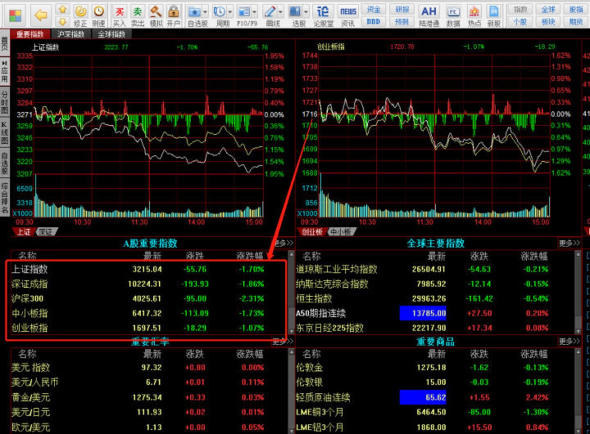
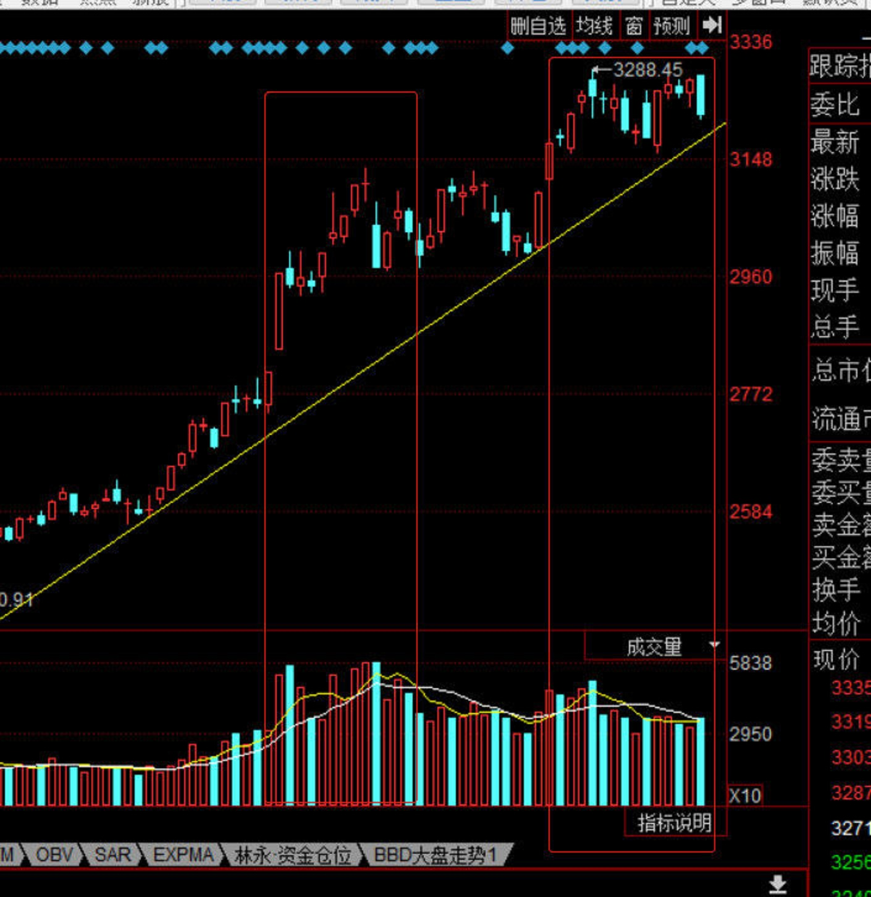
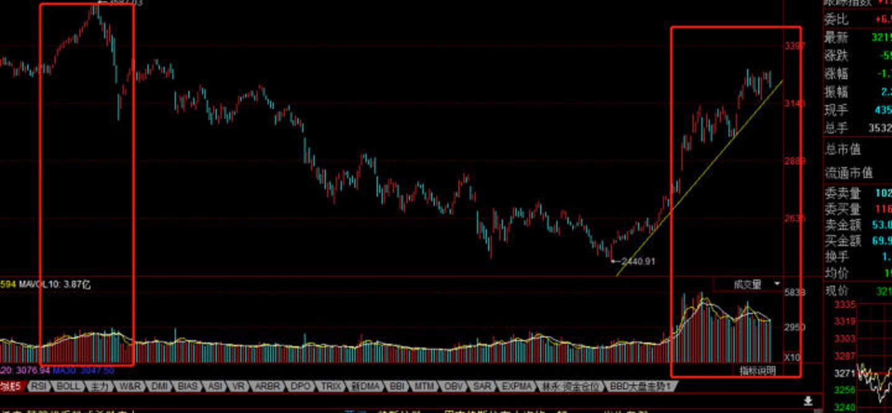
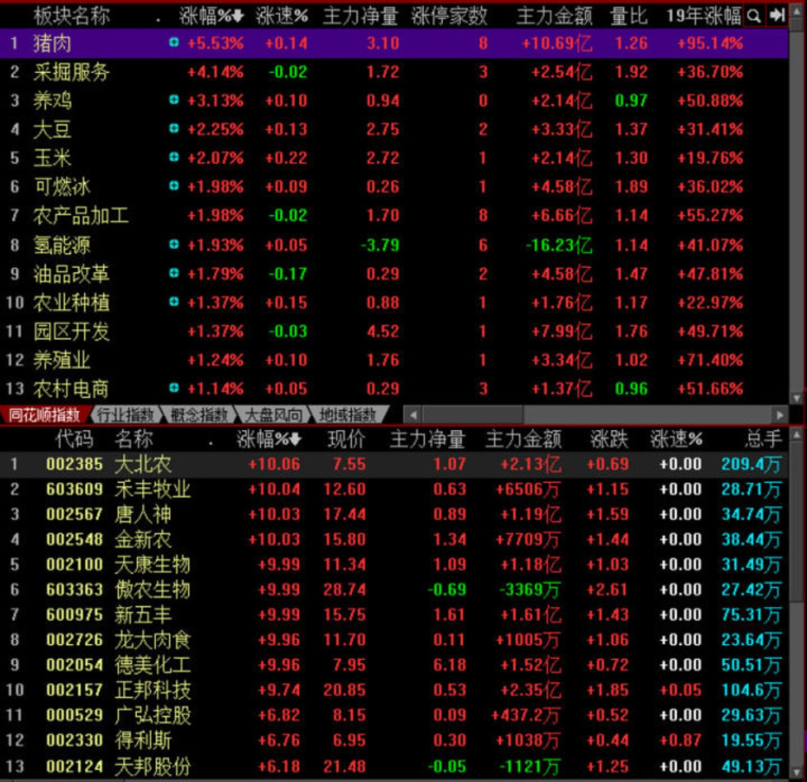
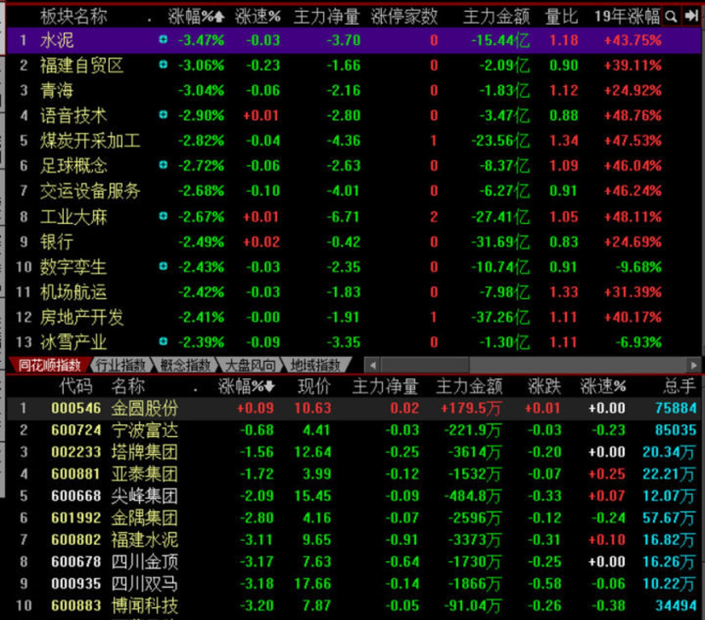
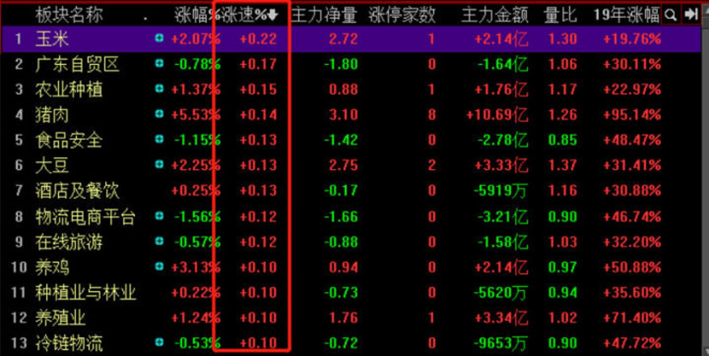

# 复盘

## 目录

1. 理论

   - **[复盘的原因](#1、复盘的原因)**
   - [复盘对象](#2、复盘对象)

2. 实战

3. [总结](#总结)

4. 升华

   

## 理论

### 1、复盘的原因

> 投资和比赛一样，容易冲动，容易受限，做出错误的选择！你必须常常停下来，再想一想，看一看才能看清楚，才能在以后做出更好的选择！懂了复盘，不仅利于投资，也利于人生！

**X：提高快速反应的选择力（盘感）**

### 2、复盘对象

1. 市场

   - 指数

     - 指数处于什么状态：牛市、熊市、猴市（震荡市）？

       > 指数是投资者的信心和气氛的表现，指数涨跌虽然≠个股的涨跌，但是影响幅度。比如说一个股票是涨的，但是大盘处于熊市，那么肯定会涨幅弱于牛市阶段；指数无法左右公司的经营，但是可以影响资金的情绪，你不需要先看指数再选个股，你要先选股票再看指数。

   - 板块

     - 各个板块的表现

       > 资金流动怎么样，资金的运作怎么样，然后就是板块的整体估值。
       >
       > 做长线肯定要在整体低估的时候买，做短线就无所谓，做短线只需要板块热的时候买。
       >
       > 短线玩的是情绪和资金流动，长线玩的就是估值和时间复利，所以你在选板块之前肯定要先确定该板块处于什么阶段。
       >
       > 当然肯定是选择朝阳行业，夕阳行业估值本来就低所以不容易估值修复，估值弹性太低；然后是资金层面的考虑，朝阳行业更容易让资金沸腾，所以不管是长线还是短线，朝阳行业是肯定的。  

   - 个股

     - 自选股的复盘

       > 你需要有一批你很了解的股票，然后每天去跟踪这些股票的表现。
       >
       > 投资者看似靠股市行情赚钱，说到底还是靠个股。靠股市行情主要是做短线的投资者，这种投资者能赚钱的大部分是职业投资者，99%的投资者不是职业投资者，所以不适合做短线，虽然大部分投资者总是盲目自信觉得自己可以做短线，这是大部分人对自己定位的错误。大部分投资者最适合做长线，因为没有时间去看太多，也没有时间去学太多，也没有太多实战经验，所以大部分人不适合靠股市行情赚钱，而是要赚企业的钱。
       >
       > 就比如说，我是一个白领，平时要工作，也不是很懂投资，那我最好的选择就是了解几家优质公司，然后不断的深入了解他们，慢慢来定投，加仓，制定详细的投资计划，这是最适合大部分投资者的。
       >
       > 所以对个股的复盘主要是针对长线投资者，是让你去不断的了解一家企业，让你不断的去更新你对这家企业方方面面的认知，不仅仅是股价走势，更多的是企业方面的了解，经营情况的了解，产业链的了解，产品的了解。

2. 投资者

   - 选股决定：为什么？

     > 有没有认真的选股？是不是真的已经完全了解清楚了一家公司的方方面面才选的？
     >
     > 自己的投资态度非常重要：一个合格的投资者必须非常了解一家企业以后才投资。
     >
     > 比如一家企业有很多合资项目，合作计划，什么时候开始的，什么时候产生利润，什么时候出成品，产品怎么样？这些你都有提前知道，会影响你的交易机会。
     >
     > 比如有很多需要资产减值的东西，有需要计提的，存货还是应收账款，账龄到什么时候了，还有很多在建工程都进行到什么程度了，负债偿还情况，公司产品销售情况怎么样，上下游原材料成本怎么样，渠道布局怎么样，新品推出的情况和拳头产品的情况，市场占有率的变化。
     >
     > 还有太多了，所以不要说踩雷不踩雷，很多东西都是可以避免的，自己要去了解清楚再投资，股市就是风险很大的，就是很多东西需要了解的  你在投资之前都需要了解清楚了再制定投资计划。

   - 交易计划：怎么入场？持有多久？何时出场？

   - 盈利 or 亏损：为什么？成功（失败）心理

   > 这是对自己的重要复盘，自己到底有没有认真，自己才知道，下了多少功夫，有没有认真的研究企业，到底有没有去了解方方面面的情况？必须不断的通过复盘，去让自己更加严谨的选择股票，更加认真的对待投资，情绪更加的稳定，经验就是这样总结起来的，不是说炒股多少年就厉害，交易多少次就厉害，总结多少，思考多少才是关键

**X：记录心路里程，由内而外的提高！**

确定了要投资的股票，然后制定交易计划，每个股票都有最适合自己的交易计划，怎么加仓，怎么补仓，一开始买多少，怎么减仓，怎么卖出，中途出现问题怎么处理，该公司可能有哪些问题，公司的特点在不同行情的情况下会怎么样表现  这些都是你事先要想好才能投资的    

高效系统的复盘流程

复盘就像考试前要系统地复习一样，复盘就是为了第二天更好地操作而做的复习工作，很多优秀的操盘手每天要花3个小时甚至更长时间来复盘。

复盘是训练良好盘感的重要手段，私募训练操盘手的方法就包括每日系统复盘并写出复盘日记。

具体流程如下：

第一、市场环境分析

大盘体现80%的个股方向，也就是我们常说的看大做小。观察指数的趋势方向，判断当下市场环境好坏，只要大盘没有系统性的风险，短线就有赚钱的机会。

1、 看指数情况

看上证指数、深成指、沪深300、中小板指、创业板指，主要了解市场的重心在哪里，是大票还是小票，是一起涨一起跌还是有明显分化。还需要关注一下成交量，是放量还是缩量状态。

2、赚钱效应

行情有长有短，赚钱效应强弱很重要。最近谁在持续上涨，最高波段涨幅是多少，这些持续上涨有什么特点，顺着这个思路就是赚钱效应所在。

第二、热点题材分析

对于聚焦龙头股的选手来说，要重点看热点题材，其实在看盘中就应该做到了然于胸，复盘只不过是把详细情况再做一个梳理的过程。

热点的判断是复盘中比较关键的一环，主要是关注哪些板块在涨，哪些板块在跌，同时哪些板块在持续涨，哪些板块上涨之后在回调，板块所处整体位置如何等等。这个地方就是要梳理出主线，今天一共几条活跃线，风口和助攻是什么情况，龙头都是谁。

找出热门板块中，值得关注的票做接力，注意低吸也是接力的一种，接力不是单纯的打板。

不同板块也都有不同的运行规律，次新炒作就是炒作交易情绪，一般低价、低估值、叠加高送转或者是其他题材的是次新操作的首选。但次新炒作也有缺点，即资金流动性强，容易发生流动性枯竭，一旦大幅低开就容易出现恐慌性杀盘至跌停。所以，也要去做观察板块的规律，顺势交易。

第三、龙头个股分析

龙头个股强势最猛，涨幅最大，机会最多。炒热点就要炒作龙头，做主升浪，可以做跟风股的套利。

由于A股特殊的涨停板制度，涨停板个股代表了市场上最活跃的那一批票，需要逐一去分析原因，为什么涨停，怎么涨停的。是板块性质的涨停，还是独立性的涨停。板块性的涨停处于什么位置，是龙头还是后排。独立性质的涨停，是什么原因，公告还是复牌，或者是消息刺激等等。

新股，主要涉及次新股，要关注IPO核发情况，次新股的整体情绪，盘子，股价，涨停板个数，板块龙头高度等等，还有一个关键的一项，题材属性。

第四、战法选择

梳理完上述的板块与龙头个股，要提炼出龙头的走势特征，如主升浪以长阳连板的形式上涨，换手连板后出现缩量板加速，反包走出持续性，有没有二次反包等等。这对明日的交易计划有重大影响，因为龙头股的走势代表了赚钱效应，就是当下的盈利模式。

第五、近期活跃龙头股复盘

每天把当前强势的龙头，以及后期有可能反复的票放在一起，建立一个股票池。目的是方便寻找龙回头，龙头反包，N字板的票。

第六、龙虎榜复盘

龙虎榜的数据非常有用，它可以解释一些股票涨跌的背后因素，能够看到机构和游资的作战情况：

1、主流资金在哪里玩。

2、机构资金在哪里玩。

3、热点票是什么风格的资金买的。

4、买方资金是合力，还是独食。

5、昨日主买是锁仓还是砸盘。

6、有没有庄股席位上榜。

第七、消息

包括宏观财经消息以及个股公告，还有融资融券、大宗交易、IPO信息等等。宏观消息在财经网站、股票APP就有，个股公告以官媒巨潮资讯为主。

外盘走势，A股受外盘影响主要是美国股市对我们的影响，美股指数的大涨或大跌会影响A股的高开或低开，目前来看主要是美股的下跌对A股有低开的影响。

第八、复盘你自己

复盘你自己是最重要的，复盘时：

1、要高度关注自己的交易模式是否还适合当下的市场；

2、要高度留意一些股票符合自己的买点时自己是否买了；

3、特别是要审问自己是否严格执行盘前的交易计划；

4、自己的手是否犯贱买了计划外的股票；

5、是否内心经常患得患失，是否冲动鲁莽，是否心血来潮。

第九、做出交易计划

1、 对明天指数有个预判，什么情况下会考虑出手。

2、如果出手，买哪些票，这些票的买点是什么，至少有3只票做备选。

作者：凌乐
链接：https://www.zhihu.com/question/35129611/answer/660769857
来源：知乎
著作权归作者所有。商业转载请联系作者获得授权，非商业转载请注明出处。

举实例来说明，如何有效的进行股市复盘。一共5步，缺一不可，文章较长，都是干货，请耐心看下去吧～

自股市走强以来，我明显感觉到股民们看盘的时间越来越长，从早上9：15到收盘15：00一直有人在询问我市场状况，就收盘之后，询问的人就更多了。很多文章和书籍都在教各位如何进行技术分析、价值分析，却没有讲一些操作方法，使得各位看盘的时候仍旧很迷茫。

本期，我们详细解读复盘的相关知识点，用实际案例帮助各位了解如何复盘。让你也能成为复盘高手。

复盘可以回顾当天股市的走势，详细了解盘面的每一个变化点，寻找到投资机会，并且为明天的走势产生预期，复盘可以说是非常关键的，每一位成功的操盘手一定都经历过一段复盘的时光，如果没有坚持过长时间的复盘，对市场的理解一定是有限的。

一直忘了问各位，一般炒股是用什么工具，是电脑还是手机？虽然现在手机看盘很方便，但在股票数据分析，选股，查看个股资料这些方面，手机永远无法替代电脑，学会使用电脑软件，是各位投入股市必须要学习的技能，这也是区分投资者与韭菜的基础门槛。

**复盘步骤**

**第一步：分析A股重要指数**

打开股票软件（这里以同花顺为例），会看到下面这个界面，我们复盘也是从这个界面开始的。下文以昨天（2019年4月22日）的收盘信息举例。首先，将注意力放在A股重要指数这里，沪深300指数是沪深两市的大盘股，基本都是权重蓝筹，中小板和创业板就是中小盘股和超小盘股

从4.22的盘面可以看出，当日下跌主要是受大盘股引导，银行等蓝筹板块跌幅较大，中小盘股市受害者，跌幅相对较小。

分析完A股指数后，再看一眼右边的全球重要指数，开盘的时候看美股，收盘的时候看亚太恒生、日经指数，可以看到，当日日下跌跟外盘没有什么关系，当然，也可能是外盘休市。

**第二步：分析上证指数**

指数对比之后，打开上证指数，分析上证指数主要采用技术分析和新闻资讯分析法，结合凌乐知识星球里面的画线知识，会看到当前上证指数并没有跌破上升趋势线，仍处于上升趋势之中，虽然看起来好像要跌破了，但我们**在图形改变之前默认趋势的力量，不要随意预测**，此处长期趋势仍然看多，并且近期极有可能触底继续上涨

在分析趋势的同时也需要分析成交量，从上图可以看出，**第二轮上涨的成交量低于第一轮**，一般来说，这样的指标是看空的指标，认为第二浪没有成交量的支撑，必然会回落。

此处就可以看到技术分析的矛盾性，不同的分析方法会出现截然不同的结论和预测，**任何一种方法都能自圆其说，且没有完全标准的答案**，只有等后期回顾的时候才知道哪一种方法是正确的。

但这明显不是我们要追求的东西，我们股票学习要求预测性和统一性，不允许自己出现矛盾的观点，不允许得不到明确的操作方向。

当我们短期分析陷入矛盾之时，就可以拉长分析周期，看的更长远，比如拉长到2018年初的K线，会发现指数差不多的情况下，现在的成交量远高于2018年初，**说明现在的成交量是可以支撑指数**，完全无需忧心会跌回2800点附近，所以，此处我们应该相信趋势，默认后市会继续上涨。

**第三步：分析板块**

板块是复盘最重要的一步，我们每天复盘时需要看涨幅排行榜和跌幅排行榜，**理解每一个板块为什么上涨，又为什么下跌，板块中哪些个股是龙头，预测后期持续力量如何？**

以4.22为例，涨幅居前的有猪肉、采掘服务、养鸡、可燃冰等等，猪肉和养鸡涨幅居前的原因是农产品价格上涨，3月PMI指数高于预期，而且这两个板块持续上涨多日，后市是具备继续上涨潜力的，猪肉板块龙头是傲农生物、唐人神和天康生物，后期如果要入手猪肉板块，首选这三支。

采掘服务和可燃冰涨幅居前的原因是原油价格上涨，采掘服务的龙头是恒泰艾普，当前板块积淀尚有不足，持续力量可能较弱，但原油呈持续上涨的趋势，而且原油有夜盘，提前一夜就知道第二天股市的走势，是可以继续关注的，但龙头个股极有可能变化，现在此板块还有明显的投资机会。

分析完前面几个板块之后，咱们还需要看一下后面的一些涨幅较高的板块，大概记忆一下新出现的大板块，比如**证券、保险、银行等金融板块，白酒、食品、零售等消费板块，化工、医药、钢铁水泥**等等，这些板块因为盘面较大，**在市场中一直都有引领作用**，任何一个板块出现在TOP20中就需要密切关注。

从4.22的涨幅榜来看，前30基本都是农业、原油概念板块，没有什么新鲜板块出现，说明当前市场还是缺乏做多热情，资金没有大幅涌入，后面除了关注这两个板块之外没有新的投资机会，可以相对谨慎。

看完涨幅榜之后再看跌幅榜，一般**新手关注涨幅榜，老手更关注跌幅榜**，在盘整行情中，跌幅榜经常会出现投资机会。

看板块需要达到两点要求，**第一是明白为什么此板块涨跌幅靠前，是前期涨幅过大，还是政策因素；第二就是要预测此板块后期走势**。

以4.22为例，跌幅第一的水泥板块下跌的原因我认为有两个，首先是水泥板块前期涨幅较大；第二是因为6家水泥厂商被约谈违反垄断法。根据这两点原因，我认为前期涨幅大是因为供给侧改革带来超额利润，是健康上涨，且后期可以持续，被监管约谈主要是因为水泥价格上涨过快，监管机构不希望价格持续上涨，但实际上是供给侧改革仍在持续，水泥的价格还将大幅度上涨，利润空间还会进一步释放，从这个角度来看，水泥板块下跌属于短期黄金坑，后市值得密切关注。

跌幅榜第二位是福建自贸区，不知道各位能不能张口就说出福建自贸区下跌的原因？此板块上周因为郭台铭参与2020年选举而大涨，但因为是短期概念，现在回调幅度较大，但这也给后市一个投资机会，如果你有**投资备忘录**，就可以在2020年选举前3个月左右布局福建自贸区概念，到时候肯定会获得超额收益，不管选举成功与否。如果此时你**错过了这条信息，就是错过了未来的一个投资机会。凌乐每个月推荐的选股逻辑，就是建立在长期追踪板块走势的基础上完成的，我在不断记录曾今和未来的投资机会**。

4.22跌幅居前的还有煤炭、足球、工业大麻、银行、机场航运、房地产开发等等，都是些十分重要的板块，每一个板块都能说上一大堆对市场的影响和价值。

以煤炭为例，本来今天原油价格上涨，煤炭估计也应当同步上扬，因为煤炭和原油属于替代品，原油价格上涨会让市场更偏好使用煤炭，但股价走势说明今天煤炭主要跟随水泥，它们都属于传统工业，因为供给侧改革的原因如今利润大增，今天市场其实是在杀跌供给侧改革概念，那钢铁板块的跌幅一定也比较大，我查看了一下，钢铁板块下跌1.86%，比这两个板块好一些。

今天机场航运板块下跌时因为原油价格上涨，他们的航空成本增大，我记得原油价格每涨10%，他们的营业成本好像就要增加1亿，当然这是我很久之前看到的数字了，多半不准，但也能揭示原油对航空板块的影响，所以在油价上涨区间，千万别投资航空板块。

分析完涨跌幅排行之后，你还可以**分析一下涨速排行榜，这代表了尾盘资金涌入最积极的板块，这些板块明天大概率是开盘就会涨**，比如第二天猪肉玉米多半又是上涨的一天，郭台铭和福建还会下跌。

再次强调一下，分析板块是复盘中最重要的事，我上诉内容虽然能继续展开1万字，但在分析的时候可能就几秒钟的事，根本不复杂，板块涨跌幅榜中所包含的内容非常丰富，你只要坚持分析，早晚会有本质的改变。

**第四步：分析个股**

很多朋友的复盘就只有这一步，这会限制我们的分析范围和分析能力。很多朋友的自选股就那么几支股票，看来看去也是一样的信息，盯盘的主要注意力也是放在股价波动上，这非常不利于我们投资，就像一句话，你越在意某个东西，恰好就会失去它，我们**太专注于短线波动，永远只能成为股价的奴隶，永远都在追涨杀跌之中**。我们要尝试摆脱它，掌控它，漠视它。掌控它的最好的方法是，不要让自己无事可做，不要对它充满挂念。

在复盘的时候，我们在个股上所花费的精力应该是有限的，因为**我们最大的精力是在选股之时，而不是在买入之后**，选股之时我们已经详细考察过基本面、技术面、财务、风险等等一切事项，复盘的重心就应该放在每日变化之上，今天有没有出新的公告、市场有没有新的分析报告、企业有没有什么新动态，如果现状与买入之时没有太大的改变，坚持持有。

当进行上述所有的分析之后，我们就能得出一段复盘结论了。

4.22大盘高开低走，全天单边下跌，盘中出现多次放量下跌的情况，主要系大盘蓝筹股杀跌影响，大盘向上趋势不变，短期在支撑线附近震荡，近期或有买点，板块方面，涨幅居前的是猪肉、采掘和可燃冰等板块，猪肉等农产品因价格持续上涨，市场预期较强，后期大概率持续上涨，采掘和可燃冰板块受益原油价格上涨，值得持续追踪，全天热点较为缺乏，市场人气略显不足。

**希望你也能掌握复盘的方法。**

## 实战

## 总结

## 升华

