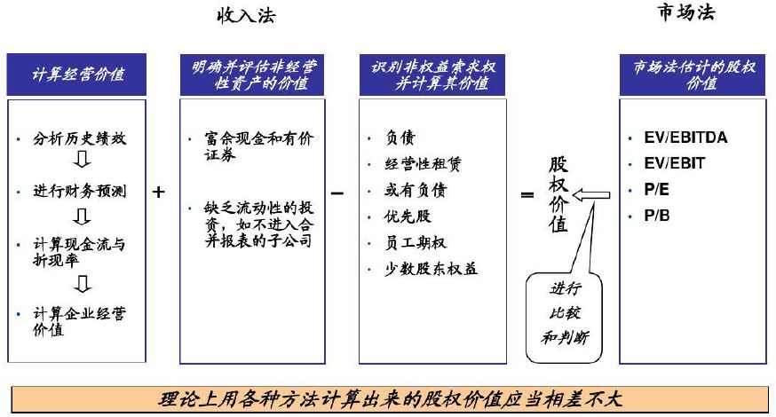
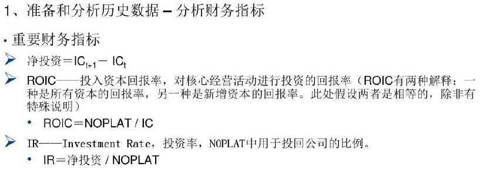
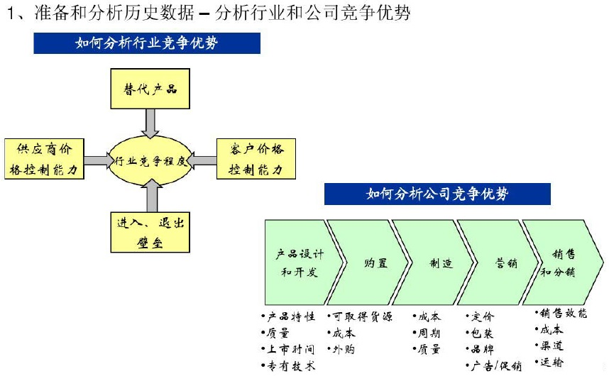
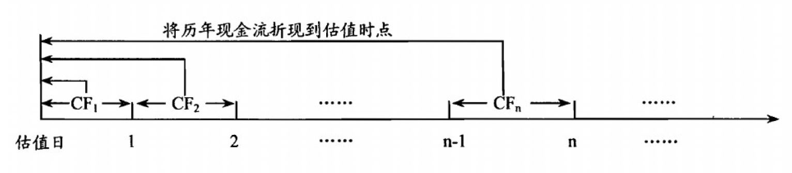

# 企业估值

1. 理解企业估值的[基本原理](#企业估值基本原理)：为什么要估值？
2. 掌握企业估值的[基本流程](#企业估值基本流程)：先做什么，后做什么？
3. 掌握[财务预测](#财务预测编制)的编制及评估其合理性：如何编制财务预测？编制的财务预测合理吗？
4. 掌握企业估值的基本方法：如何估值？
5. 理解企业价值的主要驱动因素：是什么驱动企业价值增加？

## 企业估值基本原理

随着市场经济的不断发展和企业所有权的不断增加的商品化，**企业价值的评估也越来越受到关注，正在成为企业成功与否和整体质量的最全面准确的指标。**

除了传统企业和已经成熟发展的公司在涉及到投融资及并购等领域的交易时需要估值，新兴企业和初创企业更需要对未来经营能力准确预判的企业价值评估。

对于处于不同的成长阶段的企业以及不同的企业性质，也要**因地制宜地使用不同的估值方法。比如传统行业的成熟型企业，可以使用DCF现金流折现方法或PE乘数；初创阶段高增速技术企业或没有任何利润的公司，可以使用P / S（价格/销售额法），甚至是电子商务企业的GMW等指标。**

适用于不同企业情况的估值方法不仅有很多种，而且对于同一家企业，不同的假设和分析得出的估值结果也大相径庭。无论**是对于投资者、买方或卖方等涉及相关交易的各方人士，不同的估值结果对企业所要进行的交易都起到决定性的影响作用，客观准确的价值评估基础上所进行的交易，对企业未来的良性发展至关重要。**

历史上有很多超级并购案例，因为过高地估计了协同效应与企业价值，却在日后经营中并未达到预期，盲目性乐观的并购导致了巨额的亏损和难以摆脱的累赘。因此，**估值是一门艺术，在掌握正确估值方法的同时，还需要丰富的经验和智慧的判断。**

### 为什么要估值？

> 估值对于技资的意义在于通过将企业内在价值与其当前股价相比较，确定投资的**”安全边际”**

**前提假设**：价格围绕价值上下波动， 即在长期情况下不会偏离价值。

**什么是企业价值**？企业的价值取决于未来的现金流入，而非历史己经取得的绩效，更非成本计价的公司资产。
$$
企业价值+富余现金+非经营性资产价值=负债+权益价值
$$

**企业价值的分类：**

- 经营价值：持续经营假设下的企业价值，是企业价值创造的实质来源
- 清算价值：破产清算假设下的企业价值，是企业各项资产的现值之和
- 并购价值：被收购假设下的企业价值，由于收购者的协同效应，一般会较被收购企业内在价值有一定溢价

## 企业估值的基本流程

## 财务预测的编制

**编制步骤：**

**确定预测的期间和详细程度：**

**企业价值评估方法体系：**

企业价值评估是一项综合性的资产、权益评估，是对特定目的下企业整体价值、股东全部权益价值或部分权益价值进行分析、估算的过程。目前国际上通行的评估方法主要分为收益法、成本法和市场法三大类。

收益法通过将被评估企业预期收益资本化或折现至某特定日期以确定评估对象价值。其理论基础是经济学原理中的
贴现理论，即一项资产的价值是利用它所能获取的未来收益的现值，其折现率反映了投资该项资产并获得收益的风
险的回报率。收益法的主要方法包括贴现现金流量法（DCF）、内部收益率法（IRR） 、CAPM 模型和 EVA 估价法等。

成本法是在目标企业资产负债表的基础上，通过合理评估企业各项资产价值和负债从而确定评估对象价值。理论基
础在于任何一个理性人对某项资产的支付价格将不会高于重置或者购买相同用途替代品的价格。主要方法为重置成
本（成本加和）法。

市场法是将评估对象与可参考企业或者在市场上已有交易案例的企业、股东权益、证券等权益性资产进行对比以确
定评估对象价值。其应用前提是假设在一个完全市场上相似的资产一定会有相似的价格。市场法中常用的方法是参
考企业比较法、并购案例比较法和市盈率法。

收益法和成本法着眼于企业自身发展状况。不同的是收益法关注企业的盈利潜力，考虑未来收入的时间价值，是立
足现在、放眼未来的方法，因此对于处于成长期或成熟期并具有稳定持久收益的企业较适合采用收益法。成本法则
是切实考虑企业现有资产负债，是对企业目前价值的真实评估，所以在涉及一个仅进行投资或仅拥有不动产的控股
企业，以及所评估的企业的评估前提为非持续经营时，适宜用成本法进行评估。

市场法区别于收益法和成本法，将评估重点从企业本身转移至行业，完成了评估方法由内及外的转变。市场法较之
其他两种方法更为简便和易于理解。其本质在于寻求合适标杆进行横向比较，在目标企业属于发展潜力型同时未来
收益又无法确定的情况下，市场法的应用优势凸显。

**企业价值评估核心方法：**

**1. 注重货币时间价值的贴现现金流量法(DCF)**

企业资产创造的现金流量也称自由现金流，它们是在一段时期内由以资产为基础的营业活动或投资活动创造的。但
是未来时期的现金流是具有时间价值的，在考虑远期现金流入和流出的时候，需要将其潜在的时间价值剔除，因此
要采用适当的贴现率进行折现。

DCF 方法的关键在于未来现金流和贴现率的确定。所以该方法的应用前提是企业的持续经营和未来现金流的可预测性。DCF 法的局限性在于只能估算已经公开的投资机会和现有业务未来的增长所能产生的现金流的价值，没有考虑在不确定性环境下的各种投资机会，而这种投资机会会在很大程度上决定和影响企业的价值。

**2. 假定收益为零的内部收益率法(IRR)**

内部收益率就是使企业投资净现值为零的那个贴现率。它具有 DCF 法的一部分特征，实务中经常被用来代替
DCF 法。它的基本原理是试图找出一个数值概括出企业投资的特性。内部收益率本身不受资本市场利息率的影响，完全取决于企业的现金流量，反映了企业内部所固有的特性。

但是内部收益率法只能告诉投资者被评估企业值不值得投资，却并不知道值得多少钱投资。而且内部收益率法在面
对投资型企业和融资型企业时其判定法则正好相反：对于投资型企业，当内部收益率大于贴现率时，企业适合投资；当内部收益率小于贴现率时，企业不值得投资；融资型企业则不然。

一般而言，对于企业的投资或者并购，投资方不仅想知道目标企业值不值得投资，更希望了解目标企业的整体价值。而内部收益率法对于后者却无法满足，因此，该方法更多的应用于单个项目投资。

**3. 完全市场下风险资产价值评估的 CAPM 模型**

资本资产定价模型(CAPM)最初的目的是为了对风险费产（如股票）进行估价。但股票的价值在很大程度上取决于购进股票后获得收益的风险程度。其性质类似于风险投资，二者都是将未来收益按照风险报酬率进行折现。因此 CAPM 模型在对股票估价的同时也可以用来决定风险投资项目的贴现率。

在一般经济均衡的框架下，假定所有投资者都以收益和风险为自变量的效用函数来决策，可以推导出 CAPM 模型的具体形式：

看似复杂的公式背后其实蕴藏的是很简单的道理。资产的期望收益率取决于无风险收益率、市场组合收益率还有相
关系数的大小。其中无风险收益率讲的是投资于最安全资产比如存款或者购买国债时的收益率；市场组合收益率是
市场上所有证券品种加权后的平均收益率，代表的是市场的平均收益水平；相关系数表示的是投资者所购买的资产
跟市场整体水平之间的关联性大小。所以，该方法的本质在于研究单项资产跟市场整体之间的相关性。

CAPM 模型的推导和应用是有严格的前提的，对市场和投资者等都有苛刻的规定。在中国证券市场有待继续完善的前提下，CAPM 模型的应用受到一定的限制，但是其核心思想却值得借鉴和推广。

**4. 加入资本机会成本的 EVA 评估法**

EVA (Economic Value Added) 是近年来在国外比较流行的用于评价企业经营管理状况和管理绩效的重要指标，将
EVA 的核心思想引入价值评估领域，可以用于评估企业价值。

在基于EVA 的企业价值评估方法中，企业价值等于投资资本加上未来年份 EVA 的现值，即：企业价值 = 投资资本 + 预期 EVA 的现值。

根据斯特的解释，EVA 是指企业资本收益与资本机会成本之间的差额。即：EVA = 税后营业净利润 - 资本总成本 = 投资资本 x（投资资本回报率 - 加权平均资本成本率）。EVA 评估法不仅考虑到企业的资本盈利能力，同时深入洞察企业资本应用的机会成本。通过将机会成本纳入该体系而考察企业管理者从优选择项目的能力。但是，对企业机会成本的把握成为该方法的重点和难点。

**5. 符合"1+1 =2"规律的重置成本法**

重置成本法将被评估企业视为各种生产要素的组合体，在对各项资产清查核实的基础上，逐一对各项可确定资产进行评估，并确认企业是否存在商誉或经济性损耗，将各单项可确认资产评估值加总后再加上企业的商誉或减去经济
性损耗，就可以得到企业价值的评估值。即：$企业整体资产价值=\sum单项可确定资产评估值+商誉（-经济性损耗）$。

**估值的哲学知识**：

- **神话1：估值是客观地寻找“真实”价值**

  真相：所有估值都是有偏差的，唯一的问题是误差的大小和方向

  真相：估值误差的方向和大小有时与背后的利益倾向有关

- **神话2：一个好的估值模型提供了价值的精确计算**

  真相：模型只是现实的缩影，不存在精确估价，只能无限接近

  真相：估值最不精确的时候，估值的报酬最高

- **神话3：模型越数量化，估价越准确**

  真相：股指模型所需要的输入值越少，对其理解就越好

  真相：有时简单估值模型比复杂模型要更好（先把书读厚，再把书读薄）

- **神话4：存在客观的、一成不变的价值**

  真相：只有在完全确定的条件下，才存在客观价值

  真相：在不确定的环境下，估值都依赖预期。预期改变，估值改变

**建模的作用：**建模只是一种手段，而非目的

- **实现定量化分析**

  整个分析过程定量化，整个估值工作因此清晰深入，对企业多角度立体化理解，对重要变量比较敏感（重要因素变动，会有量化的计算）

- **实现系统化分析**

  企业一个科目的变动往往“牵一发而动全身”，建模可以将所有因素和指标变化都放在一个统一的体系内考虑

- **提供严谨的分析框架**

  尽管估值结果因建模者对参数、判断有所不同，但是估值的流程框架是一致的，它不仅反映了企业的财务状况、还从企业模式、公司战略和行业发展状况等角度揭示出影响企业价值的各项要素，这是建模的核心

**构建完美模型的条件：**隐藏在公式和数字背后的经济意义和估值思想最重要

- **基础知识**

  会计基础、EXCEL技术、估值方法

- **掌握企业、行业的商业模式**

- **全面理解企业的运营模式和价值驱动因素**

**建模前的准备：**

- **建模的目的**：为投资提供指导
- **建模的对象**：子公司？母公司？
- **目标公司的业务模式**：把企业从头到尾的业务过程进行梳理
- **未来的假设**
  - 公司战略
  - 重大投融资决策
  - 外部环境
  - 商业模式

- **数据来源**
  - 公司报告
  - 研究报告
  - 专业数据库
  - 行业统计及宏观经济数据
  - 企业调研
  - 个人积累

**建模的过程：**

- 历史分析

  通过横向和纵向的比较，了解企业的各种收入、费用、资产、负债等会计要素的组成情况以及随时间的变化规律

  推断影响历史业绩的各种因素及其影响方式和影响程度等

- 合理假设

  综合考虑企业的发展规划、特定战略、外界环境变化等因素，对企业未来的业绩水平做出假设

  - 成本结构
  - 价值趋势
  - 资本支出
  - 市场规模

- 财务预测

  - 盈利预测
  - 现金流预测

- 价值评估

  根据财务预测的结果，计算企业的自由现金流，估算企业的各类参数，选择适当的估值方法进行评估

  分析参数、假设变化时对估值结果的影响（敏感性分析）

**会计报表勾稽关系**

- 资产负债表：时点报表，科目都是存量
- 利润表、现金流量表：时期报表，科目都是流量

| 留存收益                                                     | 固定资产                                                     |
| ------------------------------------------------------------ | ------------------------------------------------------------ |
| 期初留存收益              （资产负债表） + 净利润                      （利润表） -  红利                          （所有者权益变动表） | 期初固定资产净额        （资产负债表） + 固定资产构建            （现金流量表） -  固定资产折旧            （利润表） -  固定资产减值准备    （利润表） |
| **期末留存收益**              （资产负债表）                 | **期末固定资产净额**       （资产负债表）                    |
| **无形资产**                                                 | **货币资金**                                                 |
| 期初无形资产净额        （资产负债表） + 无形资产构建            （现金流量表） -  无形资产摊销            （利润表） -  无形资产减值准备    （利润表） | 期初货币资金               （资产负债表） + 现金及等价物            （现金流量表） |
| **期末无形资产净额**       （资产负债表）                    | **期末货币资金**               （资产负债表）                |

**报表重构：**

- 折旧、摊销从成本和费用中剥离这些科目不影响现金流
- 计算EBITDA和EBIT，为了估值计算方便

优选股票：一张报表预测

核心股票：三张报表预测

**关键科目**

- 主营业务收入
  - 产品构成
  - 销量增长
  - 产品价格

- 主营业务成本
  - 原料价格
  - 人工成本
  - 能源价格

- 固定资产投资
  - 每年的构建金额
  - 折旧
    - 原有折旧
    - 新增折旧

- 货币资金：三张报表都涉及到循环计算，是难点

**财务模型的结构**

- 表间结构
  - 核心三张报表
  - 辅助表：为核心报表服务，重要科目的预测
  - 分析表
- 表内结构
  - 表头信息
  - 假设（历史部分和预测假设）
  - 重要科目的预测（主体）

- 核心报表与辅助报表：

**财务预测的流程：**

- 从营业收入出发，预测成本和费用，完成利润表的预测
- 预测资产负债表，除了预留的配平科目（货币资金和融资缺口）外，完成其它科目的预测
- 用间接法编制现金流量表，在此基础上计算货币资金和融资缺口
- 在资产负债表中补齐空缺的货币资金和融资缺口，配平资产负债表

**财务预测的流程：**

**财务模型的结构：**

1. 财务预测
   - 收入预测表                Revenues
   - 固定资产表                PP&E
   - 融资计划表                Financing
   - 中间计算表                Cais
   - 利润表                        IS
   - 资产负债表                BS
   - 现金流量表                CFS
2. 估值模型
   - 比率表                       Ratios
   - 折线现金流模型        DCF
   - 可比公司法                Comps

**利润表预测：**

- 收入预测：分产品线、业务和区域

- 成本预测：毛利率法和成本拆分法

- 营业税收及附加：与营业收入有关

- 销售费用：与营业收入有关

- 管理费用

- EBITDA、折旧、摊销、EBIT

  EBITDA = 营业收入 - 营业成本 - 主营税金 - 销售费用 - 管理费用

  EBIT = EBITDA - 折旧 - 摊销

- 财务费用：财务费用 = 利息支出 - 利息收入（暂空）

- 非经济性收益：资产减值损失、公允价值变动、投资收益、营业外收支

- 利润总额：利润总额 = EBIT - 财务费用 - 非经常性收益

- 所得税费用

  所得税费用 = 当期所得税 + 递延所得税费用

  当期所得税 = 利润总额 * 适用税率

  递延所得税费用 = 递延资产减少 + 递延负债增加

- 净利润

**资产负债表预测：**

- 报表重构

  增加了融资缺口科目：资金需求和货币资金的差额，循环贷款，配平项，最后完成

  非核心资产和负债调整：交易性金融资产、可供出售的金融资产、长期股权投资、投资性房地产、交易性金融负债

  简化科目：省略、合并

- 固定资产预测

  涉及资产负债表、利润表、现金流量表

  折旧

  - 原有固定资产折旧（根据比例计算）
  - 新增固定资产折旧（折算表）：年折旧率、新增固定资产转置、计算

- 折旧合计，利润表中的折旧项同时完成

- 无形资产

- 营运资金

  不包括现金，包括应收账款、存货、预付账款、应付账款、预收帐款

  经营性流动资产 - 经营性流动负债

- 非核心资产（一般情况直接假设）

- 非核心负债（一般情况直接假设）

- 付息债务和财务费用预测

  预测债务金额

  预测利率

- 股东权益预测

  股本及资本公积

  留存利润：去年净利润 - 红利

  少数股东权益

**现金流量表预测：**

- 经营产生的净现金流（间接法）
- 投资产生的净现金流
- 融资产生的净现金流

计算当前的净现金流，和所需资金进行比较，计算融资缺口

**配平的原理：**

- 现金~0~ + 非现金项资产~0~ = 融资缺口~0~ + 非融资缺口项负债和权益~0~

- 净现金流量~1~ = （非现金项资产~0~ - 非现金项资产~1~）+（非融资缺口项负债和权益~1~ - 非融资缺口项负债和权益~0~）- 融资缺口~0~
- 现金~1~ = 现金~0~ + 净现金流量~1~ + 融资缺口~1~
- 现金~1~ = 现金~0~ +（非现金项资产~0~ - 非现金项资产~1~）+（非融资缺口项负债和权益~1~ - 非融资缺口项负债和权益~0~）- 融资缺口~0~ + 融资缺口~1~
- 现金~1~ + 非现金项资产~1~ -（融资缺口~1~ + 非融资缺口项负债和权益~1~）= 现金~0~ + 非现金项资产~0~ -（融资缺口~0~ + 非融资缺口项负债和权益~0~） = 0
- 现金~1~ + 非现金项资产~1~ = （融资缺口~1~ + 非融资缺口项负债和权益~1~）

根据著名投资银行摩根斯坦利的统计数据，成熟市场上证券分析师最常使用的估值方法是**乘数估值法**（超过50%使用率），**剩余收入估值法(EVA)**使用的概率为30%多一点，而教科书上最常推荐的**贴现现金流量法(DCF)**只有不到20%的使用率。

目前成熟市场上分行业最常用的估值乘数——估值乘数已形成相对完善的体系

| 行业             | 子行业             | 最常使用的乘数                                 |
| ---------------- | ------------------ | ---------------------------------------------- |
| 汽车             | 制造               | P/S                                            |
|                  | 零部件             | P/CE的相对指标，P/S                            |
| 金融             | 银行               | P/BV                                           |
|                  | 保险               | P/AV                                           |
| 基本原材料       | 造纸               | P/BV                                           |
|                  | 化学制品           | EV/EBITDA，EV/S，P/CE                          |
|                  | 金属和矿物         | P/LFCF，EV/EBITDA                              |
| 食品、饮料和烟草 | 食品生产           | EV/EBITDA，EV/CE                               |
|                  | 啤酒生产和酒吧     | ROCE，(P/S)/GROWTH，P/S的相对指标              |
|                  | 酒精饮料           | EV/EBITDA                                      |
|                  | 烟草               | ROCE                                           |
| 休闲             |                    | EV/EBITDA                                      |
| 传媒             |                    | P/S的相对指标，EV/EBITDA                       |
| 能源             | 石油天然气         | P/S，EV/CV                                     |
| 房地产           |                    | P/FAD，EV/EBITDA，P/NAV                        |
| 零售和消费品     | 服装               | 与市场和部门比较的P/S，EV/EBITDA               |
|                  | 食品               | P/S的相对指标                                  |
|                  | 奢侈品             | P/S，(P/S)/GROWTH，EV/S，(EV/E)/EBITDA的增长率 |
| 技术             | 软件、设备和半导体 | P/S，P/S的相对指标                             |
| 电讯             |                    | (EV/E)/EBITDA的增长率，EV/S，P/CUSTOMER        |
| 交通             | 航空               | EV/EBITDA                                      |
|                  | 公路客运           | P/S                                            |
| 公用事业         |                    | P/S，P/CE                                      |
|                  |                    |                                                |

估值方式最大的作用在于说服力——分工作阶段的估值方法选用

| 项目阶段          | 选用方法                                     | 目的                                                         |
| ----------------- | -------------------------------------------- | ------------------------------------------------------------ |
| 接触器            | PE、PEG、PB、PS等快速方法                    | 在初期最有效力的说服自己                                     |
| 深入期PRE-IPO阶段 | DCF、DDM、RNAV                               | 进一步加强自身信心，同时说服企业及外部投资方接受对目标企业EV的认定 |
| 后期IPO阶段       | 国内基本是市场询价过程，估值方法实际意义不大 |                                                              |

寻找最合适的相对估值法，辅以其它相对估值法配合使用，必须多家同类公司比较使用某一相对估值法。

**基本指标：**

- 股利折线模型（DDM）
- 商业地产RNAV估值 = 评估值 - 总负债
- BV（企业资本帐面值）
- 净资产值（NAV）
- 价格/现金盈余乘数（P/CE）= 市值/折旧分摊前的净收入

**现金流的确定和计算：**
$$
FCFE = 净收益 + 折旧 - 资本性支出 - 营运资本增加额 - 债务本金偿还 + 新发行债务
$$

$$
FCFF = 股权自由现金流（FCFE）+ 利息费用 ×（1 - 税率）+ 本金归还 - 发行的新债 + 优先股股利
$$

$$
FCFF = EBIT ×（1 - 税率）+ 折旧 - 资本性支出  - 追加营运资本
$$

$$
FCFF = 上年销售收入 ×（1 + 销售增长率）× 销售利润率 ×（1 - 税率）-（当前销售收入 - 上年销售收入）×（固定资本增长率 + 营运资本增长率）= 上年现金税后净流量 - 本年度增加现金净需求量（拉巴波特模型）
$$

### 相对估值

#### 股票价格倍数法

**PE**：适用周期性较弱企业

对于大公司，买入低预期 P/E 的股票表现更好；而对于中小公司，买入低历史 P/E 的股票表现更好。

优点：

1. 以每股收益来衡量盈利能力，是较为常见决定投资价值的因素； 
2. [市盈率指标](https://www.zcaijing.com/cgjq/283452.html)在投资领域被广泛使用； 
3. 实证研究显示市盈率差异与长期平均股票回报差异具有显著关联关系 

缺点：

1. 每股收益可以为负数，将使得市盈率失去意义； 
2. 净利润波动较为剧烈，且受多种因素影响，导致市盈率指标不稳定； 
3. 净利润容易被管理层操纵 

**PB**：周期性较强行业

优点：

1. 净资产为累计数值且通常为正，因此当市盈率指标失效时往往[市净率指标](https://www.zcaijing.com/gupiaorumen/240229.html)仍可使用； 
2. 每股净资产比每股收益更加稳定，因此当每股收益剧烈波动时市净率指标往往更加有用； 
3. 实证研究显示市净率对于解释长期股票回报差异时具有帮助 

缺点：

1. 当公司具有显著规模差异时市净率可能具有误导性； 
2. 会计政策差异可能导致股东运用市净率对于公司真实投资价值的判断错误； 
3. 通货膨胀和技术变革可能导致资产的账面价值与市场价值之间差异显著

#### 企业价值倍数法

**EV/EBIT**

**EV/EBITDA**：净利润亏损，但毛利、营业利益并不亏损的公司

优点：

1. 企业价值比率指标对于计算财务杠杆差异较大的公司具有帮助；
2. 企业价值比率指标对于评估重资产高折旧的公司具有帮助；
3. 息税折旧摊销前利润通常为正

缺点：

1. 如果运营资本持续增加，息税折旧摊销前利润将高估经营性现金流量； 
2. 公司自由现金流[量比](https://www.zcaijing.com/liangbi/)息税折旧摊销前利润在估值理论上更加相关

**EV/某运营指标**

#### 其它

**A/H价差**

**NAV**：净资产值

优点：

1. 通过净资产值的计算能够把在未来现金流通过现金流折现方式体现出来
2. 考虑了预期价格的变化、开发速度和投资回报率等因素，比市盈率更加准确

缺点：

1. 度量的是企业当前有形资产的价值而不考虑品牌、管理能力和经营模式的差异；
2. 前提假设条件严格，导致计算结果出现偏差
3. 公司信息披露不充分，计算上难度较大。

**PEG**：适用IT等高成长型企业

**PS**：营收不受公司折旧、存货、非经营性收支的影响，不易操控，如商业企业

优点：

1. 市销率对于经营亏损的公司依旧适用；
2. 与每股收益和账面价值不同，销售收入往往难以被操纵或扭曲；
3. 市销率不像市盈率那样波动剧烈； 
4. 实证研究显示市销率的差异与长期平均股票回报差异显著相关

缺点：

1. 高额的销售收入并不一定意味着高额的营业利润； 
2. 市销率未反应不同公司之间的成本 结构差异；
3. 尽管不像利润那样容易被扭曲，但销售收入的确认方式仍可能扭曲销售预测

**PCF**

优点：

1. 现金流较利润更难被管理层操纵；
2. 市现率比市盈率更加稳定；
3. 对于盈利质量而言，现金流比利润更加值得依赖； 
4. 实证研究显示市现率的差异与长期平均股票回报差异显著相关 

缺点：

1. 市现率计算现金流量的方法是净利润加折旧摊销等非现金费用，并未考虑其他影响经营性现金流量的因素； 
2. 权益自由现金流量被认为是更好的指标，但较经营性现金流量波动也更为剧烈

**现金市值比**

现金本身对于企业的意义是相同的，不同企业之间并不存在差异性。并且，现金审计较为严格，审计师必须通过现场盘点和银行对账进行审核，企业伪造空间小，可靠性高。

现金市值比，反映的是，投资一家公司，每投入一元钱，可以拥有多少账面现金。

### 绝对估值

#### 红利折现模型

#### 现金流折现模型

**影响最大因素**

1. 未来现金流量预测（行业周期、产品周期、资本开支、产能增长、资本结构）
2. 折现率（利率环境、业务风险、债务风险、汇率风险、国家风险）

**优点**

- 依据实际情况作出推算
- 对应付各种情况都有足够灵活性
- 通常应用于管理层决策，因此与估值过程完全配合
- 较能反映公司未来增长的预期
- 能就不同的假设作出敏感度分析

**缺点**

- 预测长期现金流有实际困难，每年净现金流增长速度也难以预测
- 对资本成本敏感度高的行业，该成本亦难确定
- 需要非常多的数据，而估值结果的获取过程较难理解
- 管理层需做大量的长期性计划和提供假设

事实上，对于具有盈利前景的增长型企业，现金流折线法是最科学的方法，但仍存在一定问题：

1. DCF估值对于周期性企业的不准确性

2. 制造业企业DCF估值时的折现时点重新确定

   对于年度FCF的折现取时点定为年中，即6月30日较为公允

3. 高存货率企业采用DCF估值对企业价值的影响

   预期目标企业在估算第二年销售收入大幅增长，而企业由于行业特征是属于低销售周转率企业，第二年突增的存货将大幅度增加企业经营性现金的需求，消弱企业当前自由现金流的流入，由于折现年限仅为一年，从而产生企业价值的低估。
   
   

4. 中国中小企业 DCF 估值中永续价值的准确性

   由于 DCF 在进行一定年度（通常为5-7年）的 FCF 预测后，都会设定一个既定的企业永续价值进行企业价值的简单估算。

   由于进行估值的都是较好的企业，分析师的乐观情绪会阻止他们充分地下调预测，因此对于 g 的取值往往过高，在对增长型企业的估中，可能产生高达60%的估值溢价，因此永续价值的准确性值得怀疑。

   永续价值的选择：

   1. 清算价值（估值可能降低）
   2. 帐面价值（GAAP下的帐面值，可能过保守）
   3. 有保证市盈率（$EPS×合理PE$，通用等企业方可使用）
   4. 无增长永续价值（$FCF/wacc$）
   5. 有增长永续价值（$FCF/(wacc-g)$）

   $$
   g=社会平均经济增长率+预期通胀率
   $$

   因此我们在部分案例中采用延长 FCF 预测年限的方法来弱化永续价值对企业估值的影响， 通过进行 30 年的 DCF 折现从而忽略永续价值。

   我们谨慎认为，永续价值在国外更多体现的是企业的内在价值，包括品牌等附加因素，在中国创业型企业估值过程中，应尽可能多预计现金流年限，降低永续价值估值的影响。

整体而言，DCF 方法中含有更多的预测人主观因素，在实际估值过程中，研究人员往往不自觉的由自己对企业的主观预期，来修正企业的初期 DCF 假设，使 DCF 的估值结果更接近研究员个人的预期值，因此：**DCF 估值的方法论意义大于数量结果**。

估值的目的：争取最佳的价格和最优的条款

投资者对公平价值毫无兴趣，他们要的就是不公平的价值。根本没有价值这回事，只有价格！

**运用前提：**

现金流量折现法是建立在完全市场基础之上的，它应用的前提条件是：企业的经营是有规律的、并且是可以预测的，包括：

1. 资本市场是有效率的，资产的价格反映资产的价值。企业能够按照资本市场的利率，筹集足够数量的资金，资本市场可以按照股东所承担的市场系统风险提供资金报酬。
2. 企业所面临的经营环境是稳定的，只要人们按照科学程序进行预测，得出的结论会接近企业的实际，即科学的预测模型可以有效防止经营环境的不确定因素，从而使预测变得更加科学。
3. 企业的经营是不可逆的，企业投资、融资决策具有不可更改性，一旦做出决策，便无法更改。同时企业满足持续经营假设，没有特殊情况，企业将无限期地经营下去。
4. 投资者的估计是无偏差的，投资者往往都是理性的投资者，可以利用一切可以得到的企业信息进行投资决策，对于同一企业，不同的投资者得出的结论往往是相同的。

**局限性：**

由于目前的现金流量折现方法存在种种假设前提，而现实的资本市场和投资者素质往往无法达到其要求的条件，因此在利用现金流量折现方法进行评估时会出现各种问题，主要表现在：

1. 没有反映现金流量的动态变化

   由于企业的现金流量时刻处干变化之中，而且现金流量是时间、销售收入等参数的变化函数，必然导致依赖于现金流量的企业价值也处于动态变化之中。

   但是在前面的评估模型中忽视了现金流量的动态变化，单单依靠线性关系来确定现金流量，使评估结果更多地表现为静态结论。

2. 不能反映企业财务杠杆的动态变化

   由于企业在经营中会根据环境的变化而改变企业的举债数额和负债比率，引起财务杠杆的波动，从而使企业的风险发生波动。

   一般情况下，这种风险的变化要在现金流量或者折现率中得到反映。但是目前的评估模型只是从静止的观点进行价值评估，忽视了这种财务杠杆和财务风险的变化。

3. 现金流量的预测问题

   目前的现金流量预测是将现金流量与销售收入和净利润的增长联系起来，虽然从表面上看两者具有相关性，但是在实际中，净利润与现金流量是相关的，这其中主要是企业对会计政策的调整以及避税等手段的运用，出现净利润、销售收人与现金流量不配比的现象。

   现金流量的波动与企业的经营活动、战略投资计划和筹资活动中，影响现金流量的是付现销售收入和付现销售成本，因此，在具体预测现金流量时，应该以付现的收入和成本为基础，而不应该以销售收入为基础。

4. 折现率的确定问题

   目前的评估方法，对折现率的选取一般是在企业资金成本的基础上，考虑财务风险因素选取的。

   在具体评估企业价值时，一般会以静止的方法确定折算率，以目前资本结构下的折现率进行企业价值评估，即折现率是固定的。

   但是在实际中，由于企业经营活动发生变化，企业的资本结构必然处干变化之中，导致企业风险出现变化，进而影响到资本结构中各项资金来源的权重，导致折现率的波动，从而引起企业价值评估结果出现变化。

为了克服上述缺陷，必然要对现有的现金流量折现评估模型进行分析、改进。对现金流量的预测要考虑其动态波动性，要分析财务风险变化对企业价值评估的影响，由于预测数据直接影响评估结果是否客观和准确，影响到评估价值的高低，因此必须慎重。

**现金流量折现法下的企业估价分析**

企业估值就是对持续经营中的企业的经济价值进行的计量，其目的是帮助投资者和管理当局制定和改善决策。企业估值是现代金融学的重要组成部分，自 20 世纪 80 年代以来，随着经济金融化的不断发展和深入， 企业价值理论已成为西方企业管理的核心内容。

对企业进行估值是企业一切金融政策的前提和依据， 对于企业管理者而言， 在进行投资与融资决策之前， 要对企业价值进行评估， 采纳可使企业价值达到最大化的财务决策；对于投资者而言， 做出是否投资于某企业的依据是对该企业的估值。

Pabfo（2001）把企业估值的用途归纳为以下方面：确定企业首次发行（IPO）的价格； 设计价值创造基础上的激励项目；确定主要的价值创造来源；为企业持续经营中的并购行为提供决策参考，帮助制定阶段性计划；用于企业的买卖动作，并为行业整合提供价值基础；对上市公司估值，以确定是否持有股票，寻找被市场低估的企业进行套利投资。

公司价值一词有两个涵义： 一是公司的股权价值， 即对公司普通股股东而言公司的价值； 二是包括普通股、优先股、债权等公司的整体价值， 即对公司普通股股东、优先股股东和债权人这些公司的利益相关者而言的公司价值。公司价值的涵义不同使得模型中的折现率和现金流也不同。

一是**企业估价模型**。企业价值是通过对企业的预计现金流以加权资本成本进行折现来计算的。企业预计的现金流是满足了所有运营费用和税收、资本支出，但在债务支付之前的剩余现金流。它将用于满足所有投资者分配的需要， 包括支付债券人利息和本金，支付给股东股利及股票回购等。
$$
EV=\sum_{t=1}^N\frac{CF_t}{(1+r)^t}
$$

- N：资产年限
- CF~t~：t 年的现金流量
- r：包含了预计现金流量风险的折现率

二是**股权估价模型**。股权价值的取得是通过对股权的预期现金流以股权的成本即公司股权投资所要求的回报率进行的折现。根据资产索偿权的次序， 股东只能对债权人履行债权后的剩余资产进行分配，是索偿权的最后一个分配环节，现金流量首先在满足企业所有费用、资本支出、税务义务、本金以后才能属于股权持有人，$股权现金流量=企业现金流量-债权人现金流量$。为了和股权现金流相匹配，折现率选择股权资本成本。

- SCF：股权现金流量
- CEP：权益资本成本

以上两个模型在使用中应特别注意现金流和折现率的匹配使用，如果股权现金流以加权平均资本成本折现将导致对股权价值的高估（因为债务成本小于权益成本，所以加权成本小于权益成本），而如果以股权成本对公司现金流进行折现将导致对公司价值的低估偏差。

**折现率**

在预测未来现金流的时候往往根据企业预算的财务报表进行计算，而预算报表是以销售预算为起点的，根据前几年的销售情况来确定未来的销售增长率。考虑到加权资本成本，本文从股权成本、债权成本、资本结构三个方面来估算折现率。

1. 股权成本

   股权成本是投资者向一个公司投资所要求的回报率， 股利增长模型、风险和回报模型是估计股权成本的两种方法，如资本资产定价模型。

2. 加权平均资本成本

   $加权平均资本成本=负债额占总资本的比重×税前债务资本成本×(1-所得税税率)+股票额占总资本比重×股权成本$

   税前债务资本成本取决于未来债务的利率、税率、发行溢价，如果没有进一步的数据，债务成本经常以目前的负债情况来进行计算。

**未来现金流量的预测**

企业现金流量是指一定时期内产生的潜在地可供股东和债权人分配的现金流量，其中包括可以支付给投资者的现金股利或股票回购现金；可以支付给债权人的利息或本金。

现金流量是企业在满足经营生产需要支付了各种税费（不包括支付利息和本金），经营资产投入，资本投资后剩
余的现金流量，可以供股东和债权人使用，但是这并不意味着这些自由现金流量会在满足债权人需要后，就能够以股利的形式发放给股东，为了满足不时之需，多数公司实际支付的股利金额都低于他们能够支付的金额，管理层偏向于持有流动储备以便于灵活管理。

企业现金流量是债权人尚未分配的现金，因此在计算中不应扣减利息费用，所以选择息税后利润；权责发生制下收入费用的计量与实际收付现金在时间上的不一致，造成息税后利润中扣减了没有实付的费用，如折旧与摊销，在计算现金流量时应将这些不需支付的费用加回，同时企业以往的应收应付款、为了扩大生产能力而进行的资本支出并不在利润中反映，因此自由现金流的计算应考虑营运资本增加和资本支出的影响。
$$
企业现金流量=息前税后利润+折旧与摊销-营运资本增加-资本支出
$$
股权现金流是指在一定时期内产生的潜在的可供股东分配的现金流量，其金额等于`企业自由现金流量`减去`债权人自由现金流量`，即企业自由现金流量在债权人进行分配后的余额。严格意义上看，对于公众公司的股权投资的投资者所能获得的唯一现金流是这一股票将支付的股利。但事实上的股利是由公司的经理层决定的，比可以支付的股利要低的多，当事实上的股利比可以支付的股利少时，使用股利作为变量将低估公司股权的真实价值。
$$
股权现金流=息前税后利润+折旧与摊销-营运资本增加-资本支出-债务人现金流
$$

$$
债权人现金流=利息支出+偿还债务本金-新借债务
$$

- SCF：股权现金流量
- CEP：为权益资本成本
- CEC：股权资本成本
- PGR：永续增长率

评估企业稳定期前的年份，即公式中的n，需要根据行业发展趋势、全球经济背景以及公司竞争优势来作出判断。70 年代后期，人们对基于现金流量折现法的企业估值思想的批评越来越多，认为这一方法在很多情况下会导致对企业价值的低估，忽视了管理者根据环境变化调整项目的弹性，当环境变化时取消项目或扩张项目的情况没有予以考虑。

在现实情况下，管理者可以根据具体的市场环境作出灵活决策，而现金流量不能反映这种灵活性的价值，在高度不确定性的环境下不能对企业进行正确的估值。因此，许多学者提出用期权方法对企业进行估值，特别是对于高度不确定性的企业和项目，如研究开发项目、创业企业、高科技企业等，这一方法也为我们从另一角度来探讨企业估值提供了有益的思路。

**现金流量折现法在企业中的运用**

所谓价值评估，指买卖双方对标的做出的价值判断。在企业并购活动中，对目标企业的估价是决定交易是否成交的价值基础。目标企业估价主要取决于并购企业对其未来收益的大小和时间的预期。其本质上是一种主观判断，但并不是可以随意估价，而是有一定的科学方法可依据的。

企业一般可以使用多种方法对目标企业估值。现金流量折现法是一种理论性较强的方法，它是以现金流量预测为基础，充分考虑了目标企业未来创造现金流量能力对其价值的影响，在崇尚“现金至尊”的现代理财环境中，对企业并购决策具有现实的指导意义。

现金流量折现法中，沃斯顿（weston）模型估价法是最具代表性的一种估价方法，目前在欧美国家企业并购活动中已得到广泛采用。

用现金流量法折现评估目标企业价值，同一般资本预算分析相似：估计兼并后增加的现金流量和用于计算这些现金流量现值的折现率，然后计算出这些增加的现金流量的现值，这就是兼并方所能支付的最高价格。如果实际成交价格高于这个价格，兼并不但没有给兼并企业带来好处，反而引起亏损。

**现金净流量**
$$
NCF=X×(1-T)-I
$$

- NCF：现金净流量
- X：营业净收入（NOI）或税前息前盈余（EBIT）
- T：所得税率
- I：投资

**DCF折现原理：**

**无杠杆自由现金流折现模型：**
$$
EV=\sum_{t=1}^N\frac{UFCF_t}{(1+WACC)^t}+\frac{UFCF_n×(1+g)}{(WACC-g)×(1+WACC)^n}
$$

- UFCF~t~：第 t 年的无杠杆自由现金流
- WACC：加权平均资本成本
- g：稳定的永续增长

$$
WACC=\frac{D}{D+E}×k_d×(1-t)+\frac{E}{D+E}×k_e
$$

- D：付息债务的市场价值
- E：权益的市场价值
- k~d~：税前债务成本
- t：法定税率
- k~e~：权益资本成本

**资本资产定价模型CAPM**
$$
k_e=r_e=r_f+\beta×(r_m-r_f)
$$

- r~e~：股票预期收益率

- r~f~：无风险收益率，一般选择国库券或国内一年期央票利率

- r~m~：市场组合的平均收益率

- $r_m-r_f$：市场风险溢价

- $\beta$：表示该股票相对于市场风险溢价的倍数

  该模型的关键是 β 的确定。估计 β 的过程是根据历史资料将股票回报（r~e~）对市场回报（r~m~）做回归，求出β。

  以历史数据来估计投资者对该股票风险的厌恶程度即 β 值时，需要假设投资者长期以来以系统风险的方式保
  持风险的厌恶程度没有变，股票指数（风险组合）的风险性在测算期或将来没有改变。另外，还应该对 β 值进行分解，β 值是企业超过市场风险的倍数，β 越大说明投资者认为企业的风险也越高。

  从经营风险上看，如果一个公司的成本结构中固定成本的比率越高，其经营风险越高，该公司的 β 就越高；从财务风险看，公司采用的负债越多，公司的财务风险也就越大，公司的 β 值也越高。通过分析来调整 β，使其更接近真实值。根据取得的 β 值，预测未来的每期或长期的无风险报酬率和市场报酬率，带入资本资产定价模型，即可求出每期或长期的股权成本。

#### 经济增加值折现法

#### 调整现值法

#### 期权定价法

#### 贴现回收期法(Discounted Payback Period)

回收期法：一个项目需要多长时间才能够收回初识投资？

假设：投资200开一家火锅店，第一年盈利50，第二年100，第三年150

那么，现金流出 = -200 + 50 + 100 = -50

回收期 > 预期回收期，拒绝这个项目；回收期 < 预期回收期，接受这个项目

缺点：

1. 忽略了资金的时间价值
2. 没有考虑回收期之后的现金流
3. 容易拒绝一个长期项目
4. 判断的依据非常主观

贴现回收期：在考虑了资金时间价值的情况下，需要多长时间才能够收回初识投资？

由于贴现回收期考虑了资金的时间价值，因此一般情况下，贴现回收期总是大于回收期。该策略解决了第一个缺点。

#### 盈利回收期法(Profitability Index)

$$
盈利指数 = NPV / 初识投资额
$$

盈利指数经济含义：每投资一元钱能够净赚多少钱？**资金使用效益的度量指标**

### 其它估值

#### 账面价值

#### 清算价值

#### 重置成本

