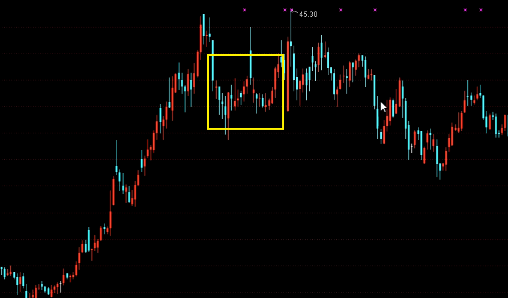

# 短线必杀技

- [跟庄技术](#跟庄技术)

- [K线技术](#K线技术)

- [分时线技术](#分时线技术)

- [追涨停](#追涨停)

- [短线实战](#短线实战)
- [跟庄实战](#跟庄实战)
- [涨停复制擒牛](#涨停复制擒牛)
- [中线主力高控盘](#中线主力高控盘)
- [资金复利解套](#资金复利解套)
- [个人总结](#个人总结)

## 追涨停

**操盘术：**

1. 大盘下跌末期开始关注。消息面刺激的个股 + 板块联动，追第一个涨停的。

2. 基本技术：

   - 一阴洗牌大于3%、两阴洗牌加起来大于5%
   - 量能小于前几天均量的两倍
   - 分时图拉起来到封停的时间小于一个小时
   - 涨停时间在两点半以前

   行情开始一直到大盘破位杀跌都可以做。不是热点的话超短线就好，是热点的话明显的卖点在卖。

**跟星技术：**

1. 何为底部放量、涨停收星

   涨停（接近涨停）当前的成交量比前几天的平均量能的两倍还大，之后收星，成交量没有明显萎缩。

2. 为什么要做这种形态？

   量能代表着活跃度，涨停是牛股必备的特征

3. 买点把握：

   - 情形：
     1. 下跌末期。下跌一个月或者更久，成交量萎缩到600亿以下
     2. 上涨初期：热点出现
     3. 上涨后期：热点龙头不再涨停
     4. 破位杀跌：跌破30日线

   - 涨停后的1-3天没有大幅上冲，收星包括小阴小阳，回踩5日线买进

   - 涨停后大幅上攻又进入整理形态，回踩涨停当天最高点买

   - 跟星买进：一般涨停后1~3天就要买

     1. 第一天追进

        一般都能买到，但是风险比较大，因为热点出现当天大盘可能还没反转，如果封不住就说明行情还没来，第二天只有割肉；而且龙头是第一个涨停的，看不到板块集体冲涨停。

     2. 第二天追进

        开盘立即买，涨停前买或者尾盘买

     3. 中继形态

        3~4个涨停以后，出现一个短暂的中继形态。低吸更好，也可以追涨停。之后的涨幅和前一段差不多。

     4. 热点的其它个股

        热点的其它个股会比龙头涨幅小一些，但是启动时间晚一点，好把握，而且涨幅可观。

4. 卖点把握：
   - 拉到接近涨停没有封住，热点龙头不卖、其它个股卖出
   - 热点龙头的卖点是横而不涨或者集体放量
   - 尾盘投机，包括两点半以后涨停或者相对于两点半的价位涨幅大于5%
   - 泰山压顶

**高送转：**

填权很容易出牛股，而且利润比较确定，天生概念。时间点把握：熊市不能做，除权之后做。

1. 10送5最好把握，一般是下跌后进行箱体震荡，在箱体下沿买进就好，填权就卖。
2. 10送10或者10送8的，必须要有其它的概念才能参与。买点是除权之后大幅放量，卖点可以等出货再卖，最起码能填权。

**其它个股：**

1. 重组 + 概念

   不是说某只票有重组的潜力或者传闻就可以买进，而是ST股摘帽后，再加上该股有炒作的概念，这类个股可以吃进。

**市场规律：**

1. 期货时代单边市时间很少，绝大多数时间是震荡市。期货主力的获利手段是做空，做多是为了拉开下跌空间。下跌趋势时间比上涨趋势长。
2. 上涨的目的是为了拉开下跌空间，速度往往比较快，只有部分强势股的涨幅大。
3. 下跌趋势中，个股分化比较明显，短线强势股很多。

**纪律：**

1. 上升趋势做超短线

   大盘处于上升趋势时，追涨停进去的票大部分是应该持股的，只赚5%没有意义，会因此错过很多牛股。

2. 下跌趋势不按纪律来

   大盘处于下跌趋势时，肯定要以超短线为主。大多数个股第二天是会冲的，能赚钱；出现问题的票只要三天之内走，大部分能保本、少数亏损也很小。如果三天不走，大部分的票会遭遇深套。

3. 下跌趋势不操作

   第二条导致的恶果，不按纪律来，一只票被深套，心态就坏了，然后今后的下跌趋势都不操作。其实大盘处于下跌趋势时，超短线机会很多，大部分票会冲。少数票会出现问题，不可避免。但是这些出现问题的票里面大部分可以保本走，少数只是小亏3%以内。股指期货时代下跌趋势比上升趋势长得多。一段时间下来，超短线的总体盈利是可观的。而且一直在操作，大盘的上升趋势来了也能够及时反应，不操作的话可能在行情初期没感觉，行情末期进去站岗，形成恶性循环。

**如何捕捉连续涨停的个股？**

1. 开盘涨停：开盘立即挂上去。10点钟没买到就撤单。这种票连续涨停的可能性很大，只要稍微打开或者放量就能买到。这个涨停不要是针对个股的利好刺激，而是针对整个板块的利好。

   这种票出现在大盘处于上升趋势时或者下跌趋势末期安全性是最高的。如果当天出现问题，三天之内保本走。

2. 热点龙头的阴线洗牌

3. 10点以前的涨停。必须是近期第一个涨停，第一波拉到接近涨停、然后调整，第二次涨停之前是平滑波、封停也在十点以前。

4. 涨停（或者当天涨幅大于9%，没封住）——两阴洗牌大于5%——涨停

5. 尖底反转：之前持续下跌一个月以上，至少有三根超过5%的大阴线，然后出现涨停反转。最常见的是跌停、收星（代表止跌）、涨停（或者阴线洗牌的涨停）。

6. 打点涨停第二天出现的不打点涨停。

实质：买**正在启动**的热点龙头股！

1. 追涨停的好处在于能够买到最强的票，这些票才有操作价值。

2. 追涨停的关键在于买的票要是热点龙头股。

   > 重大板块利好信息，板块内个股多家涨停！

3. 追涨停的买点把握需要灵活一些，适度抢跑。

   1. 常规：当天第二次冲击涨停，最后一个卖单

      > 涨停一般阶段：1.拉升（接近涨停2%） 2.调整你打 3.拉升至涨停（此时若出现V型，一般是庄家洗牌让散户出局，后续再涨停概率很大）

   >第二次冲击涨停肯定是主力行为，行为是洗牌后。第一次不一定，可能是市场很强，人气带动。
   >
   >有实力的庄家、不投机的涨停都是敢拉敢放，缓慢封停。所以***等到第二次封停之前只剩一个卖单的时候去买就好***

   2. 连续下跌、成交量持续萎缩的票，第一次冲涨停，涨幅超过9%就买。

      > 这是因为前期洗牌非常彻底，庄家在底部也吃不到多少货，这种票的上冲动能非常足。

   3. 上午最好，尾盘半小时的涨停不做。

   4. 选股：

      - 除了之前连续下跌、成交量缩成地量的，否则直接封停的不做
      - 成交量只能温和放大，看VOL-TDX
      - 一般追阶段性底部第一个涨停 

## 个人总结

交易系统：

1. 短线(<10)，只追涨不低吸，**强者恒强、弱者恒弱**
2. 中线(<90)，长期趋势向上，箱体突破
3. 长线(>90)，抓住回调低吸，价值投资

成长：

1. 吸取大牛精华，精进自身能力！
2. 买股靠胆量、卖股靠心态
3. 有所必为、有所不为：短线操作追求成功率，心不贪，利润靠多次操作积累，不是一只股就要翻倍（除非极有把握）！

修炼：

1. 韬光养晦：没有猎物时空仓，空仓是赚钱第一要件
2. 每日复盘：
3. 投资计划：

**选股**

重视个股历史，历史上的大牛股往往被反复炒作，因为牛股必有强庄，强庄对个股的筛选很严格。

技术核心：

1. k线：阶段性底部

   找阶段性底部启动：长期下跌或者横盘，成交量缩成地量（抛压很轻，便于拉升），这种股可以不看大盘。如果是单纯追高，要考虑大盘！

   洗牌幅度达到10%以上的个股。

   后浪推前浪的票，第二浪涨幅一般和第一浪差不多。

2. 成交量：不超过前几天均量的两倍

3. 分时线：不是尾盘涨停

**买股**

策略：追当天会涨停的票。

操作：早上10点，打开分时线，查看上冲动能足（拉升5%）的票是否满足选股条件

1. 龙头股或者板块利好：立即买入
2. 普通股：智能成交单，突破试盘价或箱体时买入

**持股**

策略：

1. 强庄：**大阳线试盘**（5%）——洗盘调整（1天3%，两天5%）——突破时追入

   > 熊市中洗盘调整（1天4%，两天6%）

2. 热点：**板块利好**

短线的持股时间是1~5天，一般不超过10天。安全的做法是第二天冲高就卖。强势一天5%，弱势一天3%。一般卖出时间在上午，开盘一小时内最安全。追涨停进去的票只要不投机、不放量，三天内一般都有小利出局的机会。

重点把握可以持股3~4天的情况，争取利润20%~30%。牛股出货是一个过程、不是一天两天，只要没出现必卖的情况，涨完之后会横盘震荡，可以从容卖出。

股价从月线看处于相对低位（和牛市最高点比，二分之一以下），阶段性底部的第一个涨停要敢于持股，短线飙了几天获利30%出来，没飙就做中线。

追涨停实际上是最稳健的买股方式。持股是需要胆量的，也是有风险的，胆小的就做超短线！

**卖股**

策略：

1. 第二天涨停：成交放天量或尾盘投机就卖，否则持有。

   如果已经连续涨了三天以上，只要再涨就不卖。

   第二天的十字星要卖，第三天是十字星不跌不卖。

2. 围绕黄线震荡，不跌破开盘价不用卖。

   > 一般开盘半小时不动
   >
   > 其实涨停的票第二天低开，然后快速拉起，这种形态最好；最不好的是高开，直接杀跌。、

3. 跌停洗牌的票，持股三天！

卖点：

1. 涨停射箭
2. 尾盘投机
3. 打点之后放天量（庄家90%在出货）
4. 不是连续涨停的第三个缺口
5. 高位长上影

庄家出货：

**跟庄：**

1. 阶段性底部 —— 庄家进场 —— 底仓

2. 是不是强庄 —— 中线庄还是短线庄

3. 洗盘 —— 试盘 —— 拉升

4. 出货 —— 出货与洗牌区别 —— 把握稳健卖点

**追龙：**

1. 打板毕竟是短线，最讲究效率。涨停封板前的一瞬间，跟随封板量买入，次日高开后，除非继续涨停，否则坚决出货，找下一个标的。

> 1、赚得稳，长线；赚得快，短线！
>
> 股市有句老话，叫“一赚二平七亏损”，股市可以发家，但是需要高超的技术。
>
> 炒股赚钱个人总结需要遵守以下几点；
>
> 1、长线买的是**公司**，中线买的是**趋势**，短线买的是**主力**；  
>
> 2、炒股不仅要重视嬴利，更要防止亏损；
>
> 3、最大的利好是跌过头，最大的利空是涨过头；
>
> 4、炒股最难的是等待，而最需要的恰恰也是等待，只有善于等待，才能把握住最佳的机会；
>
> 5、成功的投资都用80%的时间学习、研究，用20%的时间实盘操作。
>
> 6、短线投资的要领：快。打得嬴要走，不嬴也要走，快进快出，长线投资的要领：慢。打得嬴不一定要走，不嬴更不要走，慢进慢出；
>
> 7、常赚比大赚更重要，常赚不仅可以使投资者的资金不断积累，而且可以令投资者保持一个良好的心态；
>
> 8、最佳的仓位管理方案是：不绝对空仓，也不绝对满仓；股市上涨要有股票可抛，股市下跌要有资金可买；
>
> 9、行情在绝望中诞生，在犹豫中发展，在乐观中结束。

**股市中的成长一般要经历过三个阶段：山是山，山不是山，山还是山**

第一阶段：山是山。刚进股市，一股初生牛犊不怕虎的劲儿，踌躇满志，读了几本书，画了几幅画，就认为股市尽在掌握，股市如金山银山，等你来取。追涨杀跌，忙得不亦乐乎！如刚好碰到牛市，感觉股市赚钱竟然这么轻松，不觉自己感觉自己伟大起来！

第二阶段：山不是山。此阶段股市在其眼中已变得模糊混沌，好象所学的技术总与他作对，抛了就涨，买了就跌，各类股市书籍已看了不少，理论讲起来也可头头是道，可操作起来总感觉不那么回事。经历了熊市，牛市中赚的钱早已还出，有的已被套深重。不由感慨道：真是骗人的股市！看到某些好象为民请愿的股评，好象恍然大悟：原来错的不是我，是市场错了！

第三阶段：山还是山。一般经历过二次市场的牛熊轮回，加上自己的悟性，有的投资者就可以达到此地步，有的还在重复着原来的痕迹。此时，市场在其眼中变得越来越清楚，有种山外看山的感觉，思路更清晰，心态也更平和，可以说到了荣辱不惊的地步。不在意短期的涨与跌，也不可以追求短线的暴利，趋势二字才是他的铭记。逐步对市场有种莫名的感觉，好象听到市场的跳动，好象市场也会说话。但他还是如履薄冰的心态来参与这个市场，明白市场是变幻的，市场也是风险的。明白市场是伟大的，个人是渺小的，胆大心细才能屹立于市场之中。

经历了此三个阶段的成长，也不能说：“会当凌绝顶，一览众山小”。因为“山外还有高山”，市场如行舟，不进则退！子在川上曰：逝者如斯夫！

**永远不要与市场作对，在市场大势下，只能顺市而动，决不可逆势而动。**

认真分析市场，正确判断市场的主趋势，在主趋势明显确立之初买进或卖出，而在这个主趋势结束时，则果断平仓了结。

1）正确研究市场的主趋势，并在此基础上，准备开始行动。这是投资的重要步骤，必须集中精力全力以赴，不间断地对市场进行跟踪研究，多做少说。

2）顺从市场的主趋势建立新仓。需要密切地关注市场，付出几周或是更长的时间，逐步完成新仓的建立。

3）随着市场主趋势的延续，逐步减少建仓量，这点尤其重要，许多交易者之所以失败，是由于在主趋势延续时，逐步地加大交易量，其结果，在主趋势逆转时，必定会导致亏损。因为投资者大部分资金被投在顶部（或底部）附近的区域。

4）在主趋势结束时坚决清仓。

唯一有效的是必须在主趋势形成时介入，在主趋势翻转时出局。如果你在买入时主趋势反转，不要与主趋势作对，处理好手中的持仓，离开市场，重新思考新的交易方案。只有摸准市场的脉搏，顺从市场的主趋势操作才能有所收益。

市场中没有专家，只有赢家和输家。大的亏损都是源于侥幸心理，都是在基于亏损的畸形心态下，以赌徒的心理做出的侥幸决定。感觉与现实往往存在较大的差别。把损失放在心头，利润就会照看好自己。任何交易都应设置止损。止损设置于入市之前。大多数巨额亏损都是因为入市前未设置止损造成的。以人为本，设置止损。止损的设置要根据每个账户的不同承受能力和资金状况，区别对待

## 实战能力

1. 大跌以后做一波
2. 其它时间空仓（定投热门行业基金）

### 短线实战

#### 跟庄实战

**买点的把握：**

1. 下跌10%，见到地量，股价稳定一周（价稳量缩才是底）
2. 出现明显热点
3. 有几只个股已经涨了30%（游资先知先觉）

**跟进时间：**

1. 沪市成交量再次放大
2. 持续三天，单日涨停到达20只

> 市场重新走强的初期介入。每次大跌之后一般持续上涨2~3个月，震荡市的特点是急跌缓涨（下跌时间只占1/3以下）。

**买点把握：**

1. 阶段性底部
   - 股价连续下跌一周以上，成交量萎缩到地量
2. 庄家建仓
   - 横盘时期，判断庄家实力：
     1. 有没有涨停
     2. 建仓期大于1个月，洗牌幅度大于10%，中线庄，强

3. 庄家洗牌
4. 再次放量突破就是买点（连续3天成交量突破5，20，60日均线）

**卖点把握：**

1. 如果大盘猛涨，用缺口理论把握。

   > 第1个缺口是突破，第2个中继，第3个衰竭（卖点）。

2. 如果大盘缓涨，通过个股卖点把握。

   1. 典型：天量十字星，连红见绿，连续打点涨停放量，大涨后横盘
   2. 60分钟分析图：跌破8小时平均线，MACD变绿。
   3. 7日平均线：跌破7日平均线，第2天也站不上。

**选股：**核心分析工具——价量关系（决定大盘和个股走势）

1. 底部喷射
   - 阶段性底部，下跌至地量（5，20，60均量线下）
   - 形态：w型底部
   - 突破（5，20，60均量线）时，追涨买入
2. 抓龙头
   - 集体放量上攻就是热点
   - 最先涨的就是龙头（分时线）
   - 龙头和跟风股的区别

### 跟庄技术

**牛市怎么来？**

1. 宽松的货币政策
2. 价值重估（股改）

#### 如何识别强庄股?

**错误理念：**

1. 死捂股票（股票是妖精，只恋爱不结婚）
2. 比银行收益高就行（目标太小） 
3. 价值投资（理念不错，买入卖出时机要重点把握）

**何为强庄股：**拉升很快，两周左右拉升幅度达到50%以上。

**强庄股的特点：**

1. 底仓适中
2. 敢于洗盘（K线，分时图）
3. 操作从容稳健
4. 逆势（也会跟随大盘，但是很快就会独立）

> 大买单、吃货很多的庄家不一定是强庄

**强庄的操盘手法：**

1. 庄前运作（军事化）

   1）入场前战略战术部署

   2）多个账户高度提调，军事化指挥

   3）对市场风险有充分考虑

2. 庄家的底仓（中线、短线）

   1）底仓如何界定

   2）庄家成本

   3）拉升高度的估算

3. 洗牌（幅度、时间）

   1）上影线好，下影下不好

   2）洗牌幅度

   3）洗牌时间

4. 拉升（快速，连续）

   1）抛压测试

   2）主升段

5. 出货（阴跌）

   1）出货分三段

   2）卖点把握

**把握庄股：**

1. 出现时间：大盘一段调整之后

2. 环境：震荡市

3. 操作：至少一半的时间空仓

   1）大盘大跌（300点） 

   2）强庄股（连续小阳线后出现没有上影线的阳线）

   3）做几天卖掉（连红见绿，绿十字星除外）

   4）循环...

4. 示例：临钢股份、宝钢股份

### K线技术

#### 小T

为什么关注：短线中最容易连续大涨，上升动能最足，但是投机性很强！

怎么形成的：开盘在6%以上，封停时间在10点半以前，成交量相对于前几天没有明显放大

适用对象：短线作手

如何操作：

1. 大盘上升趋势（更安全）
2. 第2天10点半前涨停，继续持有，否则立即卖出；出现跌势，立即卖出
3. 前期出现3个跳空缺口，不可再追

**缺口理论**

第1个是攻击型缺口（现在一般都不攻击），第2个是中继型缺口，第3个是衰竭型缺口（现在一般还是衰竭）。

### 分时线技术

#### 尖角波

庄家瞬间大买单形成，没有紧跟的大买单（断档），所以形成尖角（必须是尖角）。庄家隐秘吃货时，会出现一段一段的尖角波

适用对象：短线作手

如何操作：

1. 阶段性底部
2. 没有大幅拉升（可以有小涨幅），底部箱体震荡（2~6个月）
3. 成交量地量，会有不规则的放大，分时线呈尖角波，此为庄家隐秘吃货
4. 买点：突破箱体震荡的大阳线（第1天），第2天立即跟涨买入
5. 箱体震荡时，下轨不断抬高，说明市场抛压减小，庄家显得比较“心急”，控盘程度增强，K线出现大阴大阳（强力洗盘），成交量不规则放大（分时线有对应的尖角波），后期上涨概率更大

#### 长波

为什么关注：攻击性最强，投机性最强！

怎么形成的：一波拉升超过5%

适用对象：短线作手

如何操作：

1. 两点半以后的长波，见即卖
2. 跌停后拉起的长波，见即卖
3. 阶段性底部后的第1个长波，见即买
4. 其它情形下出现长波，当日收盘前稳得住（振幅2%以内），可以买

> 点评：没有及时预警的系统，即使时刻盯盘，也不一定遇的上，重要的是耐心。中长线作手，可以在自己关注的几只股票收盘前看一下当天形态，有的话可以尝试操作。

### 短线艺术

1. 下跌一个月以上，明显的下跌趋势，成交量明显萎缩，形成阶段性底部

   > 两阳夹一阴（3%的阴线，洗牌要够），高于底部一倍则时机已过。

2. 价、量、分时图三维思考

   - 价：位置、洗牌、突破
   - 量：底部放量；买进当天温和放量或是缩量；天量卖出（庄家跑路）
   - 分时：不投机

#### 追突破

1. 实体饱满的大阳线突破，并且抛压不大（出现天量，一般是庄家准备出货），不是尾部拉升（尾盘半小时封涨停或拉升5%，往往是诱散户接盘）！

#### 两阴洗牌

1. 股价处于低位
2. 本来就是大热点或者有明显的板块联动
3. 当天冲在板块的第一位
4. 一般个股要求业绩上升（预计业绩下降至上升视为上升），两阴洗牌之前是涨停的票对业绩不做要求。
5. 分时图好，拉到5%以上，到涨停的时间不超过半小时。
6. 次新股不追。
7. 涨到9%就买，买进后一半的票应该持股。

#### 单阴洗牌

1. 阴线大于3.5%
2. 阴线之前是涨停
3. 热点龙头股

#### 追第二个涨停

1. 第一个涨停分时图不好（涨停后打开半小时以上或涨停后打开3次）
2. 第二个涨停是10点前
3. 确认板块是大热点
4. 第二个涨停抢跑追进（涨到8%就买）

#### 10点以前的长波

涨停越早越强，10点以前最好，两点半以后不能追。涨停股里，**长波**最强。长波是指涨停前的一波拉升超过5%。

1. 股价处于低位、业绩上升
2. 阶段性底部的第一个涨停
3. 有重大板块利好或有明显板块联动
4. 冲在板块第一位
5. 涨到8%抢跑追进

#### 连续多个一字板之后

1. 确认这只票是大热点的龙头股

2. 连续出现3个一字板，之前没有非一字板涨停

3. 连续一字板只是将股价拉离底部，而不是主升浪。

   > 主力为了提高股价，但是没有量支撑，所以真正的涨幅在主升浪时期（一字板结束后）。

4. 一字板之后就是买点，买进之后要持股。

#### 新疆板块

龙头股：天山股份

1. 消息面具备重大板块利好
2. 龙头股前3个涨停都可以直接买进，买进后持股
3. 跟风股第一个涨停分时图好可以追涨停买进：长波（幅度5%）、折叠波、时间半小时内、9%时买进

#### 多个涨停之后回补缺口

1. 之前至少出现3个涨停，至少两个向上跳空缺口
2. 通过3个涨停判断出是热点龙头股
3. 之后回补到1个缺口就是买点

#### 一字板涨停之后的非一字板涨停

1. 第一个涨停是一字板涨停，中途不能打开
2. 通过第一个涨停判断出是热点龙头股
3. 第二个涨停是非一字板涨停，封板时间在10点以前
4. 第二个涨停追进（8%），买进后持股
5. 之前可以是连续的两个一字板涨停，第三个非一字板涨停，10点以前封板，可以追进

#### 次新股技术要点

1. IPO短期内放缓
2. 板块具备稀缺性特点
3. 个股开板前涨幅不大，容易成为龙头股
4. 跟风股是第一个涨停，分时图好可以追进

#### 尖底+长波涨停

1. 之前要跌一波，至少要有3根大于5%的阴线
2. 然后长波涨停
3. 这个涨停代表快速反转
4. 涨到8%追进，买进后要持股

#### 热点龙头股的卖点

1. 连(4)红见绿卖
2. 横(4)而不涨卖
3. 高位跌停打开就跑

####  关于仓位

1. 指数处于下跌趋势或者指数在横盘震荡、单日非一字板涨停数量少于20只（连续三天），空仓；
2. 指数在横盘震荡或者处于上升趋势，单日非一字板涨停数量是20多只，半仓；
3. 指数处于上升趋势，单日非一字板涨停数量超过30只，满仓；
4. 不是牛市，满仓操作的时间不要多，空仓的时间不能少。

 

#### 追击突破涨停

1. 震荡期间出现三个涨停；
2. 具备重大板块利好；
3. 突破震荡箱体上轨的涨停应该追进；
4. 突破上轨是指突破K线实体，不算上影线；
5. 涨到8%就买，买进后要持股。

 

#### 军工股

个股：湖南天雁  长春一东 北化股份

1. 军工股的利好之前已经知道；
2. 几只龙头股的启动时间不同；
3. 追击10点以前的涨停；
4. 是第一或者第二个涨停都可以。

 

#### 接近龙头的跟风股

1. 板块里面冲第一的龙头股已经涨停；
2. 知道板块具备重大利好；
3. 同板块的跟风股要选择股性活跃的；
4. 在龙头股涨停的时候，立即买进跟风股。

 

#### 关于股性

1. 股性活跃的票经常被反复炒作；
2. 这种票只要跌到低位就应该关注着；
3. 这类个股经常反复充当一个板块的龙头股，或者换个概念继续炒作。
4. 消息面具备重大板块利好 + 股价处于低位，就可以买进。

 

#### 券商股

1. 只要大盘（上证指数）走强，券商股肯定是热点；
2. 如果是二八逼空行情，要重仓持有券商股；
3. 券商股的龙头关键是要新；
4. 今年新股的发行速度比较快，券商股的龙头是最新上市的票。

个股：第一创业  中原证券  中国银河 

 

#### 热点龙头股启动第三天

1. 热点龙头股启动第一天可能会比较突然，当天一般都能确认热点（具备重大板块利好、板块个股涨停三只）；
2. 第二天是一字板，中途不打开；
3. 第三天开盘就买，如果开盘是涨停，挂涨停价排队买进；
4. 之后连红见绿卖。

个股：苏大维格  辉隆股份

#### 人工智能概念分析

利好：人工智能首次写入政府工作报告

个股：科大智能  赛为智能  远大智能

1. 知道利好消息，这是操作的前提；

2. 启动第一天，开盘一字板涨停的票，9点20就挂涨停价买，一直挂到收盘；

3. 第二天涨停被打开或者拉到接近涨停不封只是短线卖点（卖了要买回、或者不卖）；

4. 短线回调到第一个涨停附近是买点；

5. 连红见绿是波段卖点；

6. 后起之秀：

   1）10点以前涨停，分时图好；

   2）是阶段性底部第一个涨停；

   3）追进后，涨停持股、不涨停就卖。

 

#### 泰山压顶之后的涨停

1. 泰山压顶是指高开低走的中大阴线，不带上影线，开盘价就是最高价。一波上涨之后出现泰山压顶形态，之后一般都会持续下跌；
2. 本公式把泰山压顶形态简化一下：高开低走的阴线，不带上影线；
3. 热点龙头股在泰山压顶形态次日出现涨停可以追进；
4. 追进后涨停持股，不涨停卖出。

个股：上海凤凰  四川双马

 

#### 关于连红见绿卖

1. 连红见绿卖出用在热点龙头股身上很合适；
2. 连红见绿，绿色之前要有四连红。只看颜色，不管涨跌；
3. 如果涨幅已经比较大，第一次连红见绿就是卖点。如果涨停不大，第二次连红见绿才是卖点；
4. 涨幅大不大要和之前的高点对比，相对于前高至少拉出两个涨停才算涨幅大。

个股：煌上煌  隆平高科

 

#### 新开板的次新股

1. 概述：
   - 如果没有其他原因（比如次新银行股具备稀缺性特点），新开板的次新股机会和风险都比较大；
   - 在其他热点比较低迷的时候，有一部分游资专门炒作新开板的次新股；
   - 这类个股只建议激进的学员参与； 

2. 技术要点：
   - 定义开板：开盘没有涨停，或者开盘涨停、盘中被砸开都算开板；
   - 开板当天要是涨停收盘才行；
   - 开板次日是10点以前涨停可以追进；
   - 追进后涨停持股，不涨停就卖。

 个股：来伊份  白银有色

#### 再谈仓位

1. 不会空仓等于不会炒股；
2. 熊市天天满仓肯定亏；
3. 除了牛市，空仓的时间估计要达到一半；
4. 连续三天单日非一字板涨停数量少于20只，空仓；单日非一字板涨停数量维持在20多只，半仓；单日非一字板涨停数量维持在30只以上，满仓。

 

 

 

 

 

 

 

 

 

 

 

你买入一只股票，亏损50%，一定非常难受，我想在这下跌的过程中，你已经补过过仓了吧。那么现在跌幅过半，还有必要补仓摊薄成本吗？

我可以毫不犹豫的告诉你，短期内意义不大！

为什么这么说呢？

股价跌幅50%，这已经是走势非常虚弱的股票了。即便后期会有反弹，也需要一个漫长的筑底过程，当然，如果遇到题材成为妖股，那么就另说了，但是成为妖股的毕竟是极少数，而且不一定是你这一只。人们在这种情况下，总是抱有幻想，但是股市中，最怕的就是抱有幻想。这个筑底过程，是非常漫长的。而且，后期还不一定会有多大反弹，也许经过一段时间的横盘震荡，还会继续下跌。

上面这图，股价从97跌到50元附近，跌幅也50%了，但是这个时候你买入补仓吗？买入就会继续买套，直到目前跌到了12元！

大家也可以看到，期间的反弹并不多，幅度也不够高。把精力放在这样的反弹上，你不仅不好把握买卖点，还容易造成高买低卖，进一步增大亏损面。

一直跌幅50%的个股，就如同一个病人，一个重病的病人，你能指望他像一个普通的感冒患者一样，生活自理吗？你能指望他过上三五天就恢复如常吗？不可能啊，对不对，大家都知道，所以这样的股票，很难出现马上上涨的走势，一定要有一个恢复过程，而且还不能保证病情不会恶化，后面可能还有更严重的问题在等着你。

股票为什么会涨？因为他正在涨，涨升的原因是因为有人买，第二个会涨的原因是因为没有人卖，有人买会出现量大，没有人卖会出现量缩，所以，大量上涨，量价配合是常态，筹码锁定，量缩价涨，你也要接受，因为股价在涨。

操作只有两种，一是趋势，一是转折。能在趋势之外，又抓到转折，天下第一美。如果抓不到转折，那就顺势而为，也不会太差。如果不尊重趋势，老试想抓转折，那就要常念ㄚ弥陀佛。没有趋势又没有转折呢？等着现金跟你说掰掰。

贪，贪均线上的高点，怕卖不到高点。惧，怕买不到均线下的低点。均线只能让你吃到鱼肚，鱼肚之外还想要头尾通吃，太难。

操作就是简单的事，重复的做。除非盘中有不得不处理的理由，通常以收盘价决定。

在市场上要赢，不是在短进短出中得到胜率，因为短线上的胜率，只是心理上的满足，最好的操作法是，做好资金控管，逮到一个好机会，重仓操作，让你的资金快速膨胀起来。

量价不同调的背离走法，就不是可以重仓操作的时机了。

很多投资人会开户玩交易是因为现股输了改融资，融资输了，想到交易市场来以小博大，想要翻本，其实这完全是错误的心态。交易的保证金很低，看似可以快速获利，但是你也要知道，他也会让你快速输光所有。

所谓的重仓，当然就是下重注的意思，但是重注并不是一把就下下去了。而是也有试盘，趋势对了，顺势加码，再加码。操作方式有逢低布局和转强买进两种。

股市要赢，确实需要一点命，但是，命运是掌握在自己手上的，不是吗？只要控制风险、利润自然会跑出来。靠山山会倒，靠人人会老，靠自己最好。

股市不是运气好就能有收获，你必须认真的学观念和技术，以及操作技巧，学习的方式包括阅读书本、报章、杂志，甚至是付费学习，或者透过和高手的对谈，从这里面，你一定可以学到很多看盘和操作的技巧。但是，请想想，你是否只是如伯牙一样“只掌握了各种演奏技巧，单纯地把音符奏出来而已”，你能否像伯牙面对空无一人的大海，体会那“大自然的风光”，然后，创造出属于自己的《水仙操》？

跟着量、价、均线走而已，因为量、价、均线是大盘的母亲。有量有价，跟着钱潮走就对了。一切跟随趋势，该怎么做就怎么做。

大盘是各股涨升的背景，看懂大盘，操作各股一样可以轻松自在。方法会了，观念通了，任何商品都是一样的。如果一种方法，一种观念只适用于单一商品，那肯定会效用有限。

股市最大的动能是资金，没有资金就没法推动股价。

股价会往阻力最小的方向走。只要照顾好亏损的部位，获利的部位会自己照顾自己。

低买高卖是股票赢家的真理，但是何处为高？何处为低？高之后还有更高，低点之下还有更低，为了这个高低，还真伤透多少脑筋。买卖，不求买在最低，不求卖在最高。

很多人都希望把股市的东西量化、数值化，我也试过很久，很多东西是没办法做到这种要求的，为什么呢？人者心之器，心之作用大矣哉，人只是心的工具、心的作用。股票市场是一个人心堆积的市场，不是指针堆积的市场。

股市是会说话的，只要你懂得他的语言。舞池里的舞步有一定的规则，随着音乐起舞，自然不会乱了方寸，熟悉舞步，才能踏着轻盈的步伐，愉快的跳舞，股市的节奏也是如此，不是吗？资金控管在这里见真章，持股比例低的，比较耐得住震荡，高持股比例的，恐怕会受不了。

停损是一根k停损法，该走的不会留，该留的不会走，一切依法而行。中多、长多的格局，短线的下跌，只能看是回档，回档就是等买点。

你得不到，所以痛苦；得到了，却不过如此，也会觉得痛苦；轻易地放弃了，后来却发现，原来它在你生命中是那么重要，所以觉得痛苦。既然，得不到、得到了、放弃时都会痛苦，何不把人生的得失看轻一些，保持一颗平常心，痛苦不就会随之而减轻吗？以一颗平常心看待得失，人生完全可不苦。

