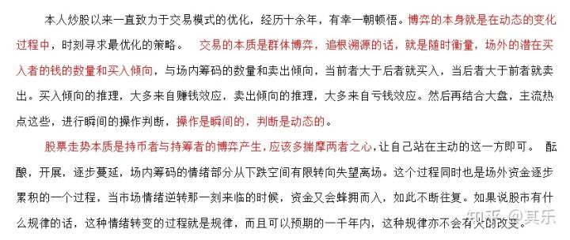
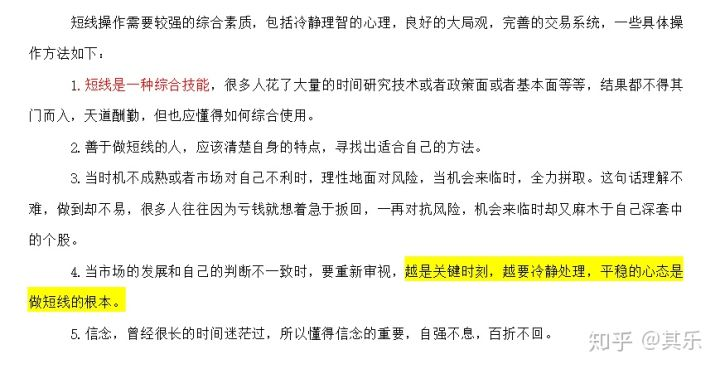

# 股票

## 目录

1. 交易策略
2. 顶级游资成长史
   - [赵老哥](#赵老哥)
   - [炒股养家](#炒股养家)
   - [乔帮主](#乔帮主)
   - [作手新一](#作手新一)
   - [著名刺客](#著名刺客)
   - [邱宝裕（asking、A神）](#邱宝裕（asking、A神）)
   - [小鳄鱼](#小鳄鱼)
   - [涅盘重升](#涅盘重升)

## 交易策略

> 吸取大牛精华，精进本身策略！

## 顶级游资成长史

### 赵老哥

1. 二板定龙头，一板能看出来个毛。从资金面讲，没有新题材，老热点就继续。短期交易，不讲价值，不讲技术，只讲故事。如果一定要捏造技术的话，就是看“人气”，一口气上不来就要去见马克思。有故事，有大量资金活跃的票，就有肉吃，吃完撤退，慢的买单。人生难得几回搏，热点来了全力以赴，热点退潮果断卖出。热点就是印钞机。

2. 有新题材，坚决抛弃旧题材。只有新题材，才有凝聚市场里最敏锐，最犀利的那股资金。这股资金，以亿为单位。所到之处，只有涨停。只要能跟上这股资金，想不赚钱都难。对别人赚钱的模式，不关注，不关心。没有关注，就没有伤害。

3. 市场差不怕，成交额少也不怕，就怕题材多。题材多势必切换快。龙头战法的核心：第一时间发现市场的精神领袖。第一时间上了她，一直持有，直到发现市场新的精神领袖，果断切换，没爆量的都不能说是龙头，既然是领袖，必须爆量，接受群众的检验，先预测，后跟随。

4. 大龙头都是多点共振的结果。题材派，龙头派，技术派都认同。筹码供不应求。越走越轻。加速。不少纯打板战法，过分看重分时板的质量，打的是分时板，而不是日线板。

5. 模式不同的人，尽量少交流。交流多了，容易受影响。想法越少越好，模式越简单越好。跟着合力，有吃有喝。

6. 开盘不接力，技术面看，分时走稳，换手够了再说，市场大局看，是不是当天的G点，确定性，远比利润的多少重要。非G点不看，不研究。不研究，因此也就不会买。

7. 只做龙头，只做主升，只做惯性。不做反抽，不做波动，屌丝才爱逆袭。没有主升的龙头，就守候。有，就一击。（防守与进攻）坚持龙头主升战法，必有回报。这个是执行力。是不是真龙头，这个考验的是理解力。

8. 跟风B，不看，不买，不研究。好的习惯，才能保证稳定赚钱。心猿意马，赚不到钱。喜欢操跟风逼的一定会被市场淘汰，这是定律。

9. 交易一定要纯粹。做加法容易，做减法难。

10. 选股，必须新题材龙头。但买卖点，要注意节奏。亏钱都是没有坚持自己的模式。

11. 对龙头一定要有一颗尊重的心，必有厚报。忍一步海阔天空。错误的交易，第二个集合割，效果最好。忘掉他，马上进入一个新的交易状态。

12. 每个热点，高潮过后的消退期，都会留一个活口。只有活口，才有交易机会。

### 炒股养家

### 乔帮主

- 受教于独股一箭（天涯）。
- 短线的优势：天天实战总结，快速迭代，复利进步。
- 每个生命都有可能改变这世界，相信自己你也可以，别放弃，别半途而废！

### 作手新一

1. 做打板更有效率，更有确定性。

   > 要反复围绕着主线做多研究龙头，多研究封板。

2. 技术面只看K线和量能。

   > 判断人气转折才更为关键，多在题材和节奏上下功夫。

3. 超短交易重要的不是预判消息，而是在消息出来之后的应变能力。

4. 游资是从你争我夺的收割中获益的，利润是来自于对人性的发现和纠错。

5. 小资金要控制回撤，难在空仓。

   > 无论何种模式，不懂空仓回撤必然大，所以小资建议在行情好时要赚到饱，以攻代守。行情走弱后要一直空仓，直到情绪再次起爆。养家老师说的好，要敢于在最高点满仓，在最低点空仓。

6. 大资金为什么不直接把票打到封板呢？那是因为大资金比你更讲究时机，也更讲究确定性。

   > 底下要不够筹码，封板筹码能要够，但又要顾及明天的承接。主线和分支的关系要照，顾既要围绕主流，又要做好切换，要维护自己的江湖地位，也要在局部战役中全身而退。这些矛盾全是小资金无需考虑的。

判断之路。山高水长，游资精神薪火相传，莫欺少年穷。

### 著名刺客

- 只做龙头，只在最高价打板。不板不买
- 理解龙王周期和情绪转折
- 其实，天下模式，万法同宗。就是情绪弱转强，主流题材强者恒强，这才是核心。

1. 他经常说小资金要做大，跟随主流是我们的唯一出路。不管你的技术有多牛，你的KDJ研究的有多透彻，你的均线研究的多深刻，你的数浪技术多高超，你的缠论多缠绵。脱离主流只有死路一条。

2. 还在担心主力出货的那批人都需要进步，市场最大的阻力其实是散户得散户者得天下，主力也要顺势而为，长线研究行业趋势，短线要研究市场合力。

3. 时间是我们最大的敌人，做超短千万不要长期持有，要让资金流动起来，跟随最热的主流，骑上最强的标的，趁着牛市的东风才能迅速做大！

### 邱宝裕（asking、A神）

> 很多时候男人都是疼的要死，但是谁都不会讲，跌倒了也是爬起来才会哭。

1. 要借大势

   出击时必须把握大盘走红的转折点。这个点，极为重要，必须借大盘的势。

   相同走势个股有些两三百万就能封住，而且第二天还能冲高，有时上千万也封不住。所以成功的关键在于对大盘情绪的理解，这是核心，其他的都是次要。借力打力，四两才能拨千斤。

2. 龙头股需要一轮完整的下跌后才会出现

   只有适应大盘连续上涨，便能够带动关联个股上涨，才是龙头。龙头需要技术吗？不需要！需要的是临阵的果敢和勇气。你今天买大他就让你赚钱，明天你继续买他，他仍然上涨。

3. 有量就能来钱

   超短行情的好坏判断只有一个标准，那就是（大盘）量能，有量个股就活跃，就能满仓出击主流板块龙头，直到地量弱势就空仓休息防守。也就是说攻在量中，退在量后。

4. 小资金要做大到一定要做超短，只有超短才能做到一年十多倍，才让你快速赚到第一桶金。

> 都说超短之路难如登天，但那又怎样？只有不走寻常路，方为大丈夫！

### 小鳄鱼

如果说六零后的游资代表是章建平，七零后是孙国栋，八零后是赵老哥，那么九零后没有谁比小鳄鱼更有资格。

2011还本科在读大四的小鳄鱼携几万元入市交易，前期也是巨亏。后来接触了 **打板和龙头交易** 之后，他在2013年就将账户做到了两千多万。

到了2015年，趁着牛市的东风，直接进入了亿万游资俱乐部。

小鳄鱼的三点语录值得我们细细体会：

1. 赚钱的根本还是对主流热点的判断理解，对大盘走势，个股分时，k线量能的判断，其他的都不用看。

2. 游资战法超短的核心是要有大局观，看指数，看主流，看龙头，看重磅消息，顺情绪而为。保持节奏感，保持主动性，保持交易心态的舒适感。

3. 关于交易只有四个字，简单纯粹。简单，可以避免陷阱；纯粹，可以减少错误，只做自己的模式，简化交易。放弃才能拥有，控制回撤方是王道！

### 涅盘重升

敢死队总舵主 **徐翔** 27岁时资产方才过亿；八年一万倍，**赵老哥** 二十五岁时资金才到三千万；新生代游资 **作手新一** 差不多到30岁，资金体量才过亿；而大器晚成的 **炒股养家** 更是三十五岁，资金还未到千万。

很多人都说他是个天才，但你有没有想过他为什么给自己取名涅槃重升呢？

> 经历痛苦，承受压力！

那么这个二十五岁的年轻人为什么能做到这样的业绩？

> 果断放弃，坚定信念！

1. 回撤控制的好，不求大赢，但求稳定复利。

   涅盘重生。2016年实盘以来，月度收益率只有八次负增长，两次大回撤，最大回撤不过百分之-26%，其他都是小回撤。

2. 站在了游资大佬们的肩膀上，尤其是情绪心法大师养家大神。

   涅盘重生说过，投机做的到底是什么，其实是赚钱效应，也就是情绪的延续对资金的吸引，赚钱资金就来，亏钱资金就走，跟着情绪走，千万不要自以为是。对于这一点，其实每一个短线交易者都感受颇深。

   其实我们做的每一笔钱都是情绪的钱，也就是他人犯错的钱，在大家绝望割肉的时候我们接盘，在大家迟疑的时候我们打板，在大家第二日最高的时候我们卖出。

> 超短之路，逆反人性，山高水长，但滴水石穿，终有一日我们都将涅槃！

### 龙飞虎

1. 第一句，换手决定高度

   很多游资票都是靠板板换手前进的，起来的时候有充分换手的，后面才有可能走的远。人气也足，操作中只要量能不缩且持续上涨，一般都可以看成趋势继续。一只妖股里面的资金从来不是从头吃到尾的，都是接力换手上去的。

   很多一字板个股要么买不到买到就是死期，在板块上攻的后期，容易出现一大批一字板品种，成本出现断层，接力盘缺失，极易出现衰竭。这样的一字板跌下来，连反抽都难做，常常一路阴跌。而换手，充分的妖股跌下来，反抽机会多多，多观察几只这样的妖股就能体会到。

2. 第二句，一个游资题材板块就像一颗种子，天时地利人和就能开花结果。

   政策是阳光，资金是雨水，基本面业绩是土壤和养料，三者凑齐就能形成板块行情，自然就是花开果熟，你轻轻顺手摘下，也就成了你的利润所在。

3. 第三句，决定你收益的是你是否不断精进，你的交易手法是你是否具有大局观。

   你的盘面阅读能力是否足够强大，强大到无限接近主流资金。太多的人喜欢“术”的庄严，而放弃了“道”的修炼。

4. 第四句，他对所有的超短交易者说，少年梦想在上，孤独在下，你的心只能追梦，赢了就和我一起策马狂奔，输了也没什么了不起。大不了再来一局！

看过了这些，你会发现每个游资大佬在成功之前都是普通人，也都经历过 **挫折和失败**，没人生下来就是交易天才，都是需要 **经过市场的洗礼才能成长**。有些人快一些，有些人慢一些，只是要 **方向对**，**稳定盈利只是时间问题**，终点都是一样的。

这些游资大佬各有各的特点，每个人的交易习惯并不相同，他们的 **心法可以研究，但不能按部就班**，可以 **吸取其中的精华，慢慢感悟，然后填充到自己的交易体系里，最终自成一派**，交易是活的，知识也要活学活用！
