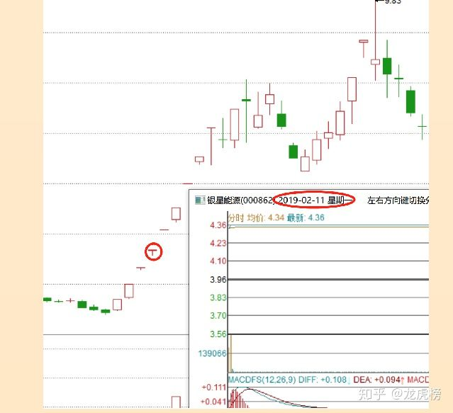
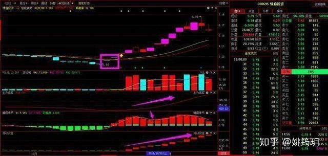

# 股票

## 目录

1. 顶级游资成长史
   - [赵老哥](#赵老哥)
   - [炒股养家](#炒股养家)
   - [乔帮主](#乔帮主)
   - [作手新一](#作手新一)
   - [著名刺客](#著名刺客)
   - [邱宝裕（asking、A神）](#邱宝裕（asking、A神）)
   - [小鳄鱼](#小鳄鱼)
   - [涅盘重升](#涅盘重升)
   
2. 交易艺术

   - [跟庄技术](#跟庄技术)

   - [追涨停](#追涨停)
     - [龙头战法](#龙头战法)

   - [龙头和妖股是如何产生的](#龙头和妖股是如何产生的)

   - 
     - [龙头战法的起源](#龙头战法的起源)
     - [龙头战法背后的原理](#龙头战法背后的原理)
     - [龙头股的分类](#龙头股的分类)
     - [龙头股的特性](#龙头股的特性)
     - [龙头股战法运动逻辑](#龙头股战法运动逻辑)
     - [龙头股的买卖点](#龙头股的买卖点)
   - [龙头战法是天堂还是地狱？](#龙头战法是天堂还是地狱？)
   - [龙头战法五步杀](#龙头战法五步杀)
     - [一、龙头战法原理](#一、龙头战法原理)
     - [二、龙头战法会失效吗？](#二、龙头战法会失效吗？)
     - [三、操作龙头战法的五大步骤](#三、操作龙头战法的五大步骤)
     - [四、龙头股战法的最佳出场技巧](#四、龙头股战法的最佳出场技巧)
     - [五、龙头战法的风险防范](#五、龙头战法的风险防范)

3. [实战能力](#实战能力)
- 龙头战法
     - [双龙短线](#双龙短线)
     - [涨停复制擒牛](#涨停复制擒牛)
     - [中线主力高控盘](#中线主力高控盘)
     - [资金复利解套](#资金复利解套)
   
4. [个人总结](#个人总结)

   - [我的纪律](#我的纪律)

   - [我的交易策略](#我的交易策略)

## 顶级游资成长史

### 赵老哥

1. 二板定龙头，一板能看出来个毛。从资金面讲，没有新题材，老热点就继续。短期交易，不讲价值，不讲技术，只讲故事。如果一定要捏造技术的话，就是看“人气”，一口气上不来就要去见马克思。有故事，有大量资金活跃的票，就有肉吃，吃完撤退，慢的买单。人生难得几回搏，热点来了全力以赴，热点退潮果断卖出。热点就是印钞机。

   > 个人理解：A股就是资金推动的市场，我就是个短线投机者，对于价值、业绩、技术面，哪有那么多时间去研究

2. 有新题材，坚决抛弃旧题材。只有新题材，才有凝聚市场里最敏锐，最犀利的那股资金。这股资金，以亿为单位。所到之处，只有涨停。只要能跟上这股资金，想不赚钱都难。对别人赚钱的模式，不关注，不关心。没有关注，就没有伤害。

   > 个人理解：能凝聚资金的热点都是好题材，能凝聚资金的股票被很多人反复研究过了，我们找到它就行，不需要研究太详细

3. 市场差不怕，成交额少也不怕，就怕题材多。题材多势必切换快。龙头战法的核心：第一时间发现市场的精神领袖。第一时间上了她，一直持有，直到发现市场新的精神领袖，果断切换，没爆量的都不能说是龙头，既然是领袖，必须爆量，接受群众的检验，先预测，后跟随。

   > 个人理解：市场的精神领袖最为重要，近一年的不断出现的大牛股都是这样，贵州燃气、超频三、必创科技等，高潮消退期还容易起第二波行情

4. 大龙头都是多点共振的结果。题材派，龙头派，技术派都认同。筹码供不应求。越走越轻。加速。不少纯打板战法，过分看重分时板的质量，打的是分时板，而不是日线板。

   > 个人理解：过分看重分时板的质量，上的并不一定都是牛股，封的早会造成换手率不够，少数人吃肉的行情很难走出来牛股，一定要找那种有足够换手率的人气票才是最安全的，有的席位喜欢吃独食，吃独食往往吃相很难看的，不容易聚集人气

5. 模式不同的人，尽量少交流。交流多了，容易受影响。想法越少越好，模式越简单越好。跟着合力，有吃有喝。

   > 个人理解：炒股最怕的是和各种模式的人去交流，看似学的很多，其实很难形成自己的模式，市场中充满各种变数，要有以不变应万变的心态去对待它

6. 开盘不接力，技术面看，分时走稳，换手够了再说，市场大局看，是不是当天的G点，确定性，远比利润的多少重要。非G点不看，不研究。不研究，因此也就不会买。

   > 个人理解：买入股票盈利的确定性远比利润空间多少重要，这就是为何小资金要打板才能快速成长的道理，市场不好，打半路板容易追高大面的道理

7. 只做龙头，只做主升，只做惯性。不做反抽，不做波动，屌丝才爱逆袭。没有主升的龙头，就守候。有，就一击。（防守与进攻）坚持龙头主升战法，必有回报。这个是执行力。是不是真龙头，这个考验的是理解力。

   > 个人理解：坚持龙头战法，龙头股票回落后不一定都有二波，不去做反抽，更不去做波动，尤其股价回落的时候，做反抽做差价不光是浪费时间还容易亏钱，确定性比利润更重要；

8. 跟风B，不看，不买，不研究。好的习惯，才能保证稳定赚钱。心猿意马，赚不到钱。喜欢操跟风逼的一定会被市场淘汰，这是定律。

   > 个人理解：坚持自己的模式，养成好的习惯，东一榔头西一棒槌不可能赚到钱，不管你炒股多少年；

9. 交易一定要纯粹。做加法容易，做减法难。

   > 个人理解：心无杂念，坚持模式内操作，没机会就休息

10. 选股，必须新题材龙头。但买卖点，要注意节奏。亏钱都是没有坚持自己的模式。

    > 个人理解：龙头是需要市场检验的，结果出来以后按照自己的模式及时上车，市场差有换手就打板介入，市场好，可以分批，第一批半路板上，上板回封加仓，这个时候市场的确定性非常高

11. 对龙头一定要有一颗尊重的心，必有厚报。忍一步海阔天空。错误的交易，第二个集合割，效果最好。忘掉他，马上进入一个新的交易状态。

    > 个人理解：错误的买入，不要抱有任何幻想，第二天集合竞价割，手握现金，反思后进入新的交易状态，记住盈亏同源的道理

12. 每个热点，高潮过后的消退期，都会留一个活口。只有活口，才有交易机会。

    > 个人理解：龙头高潮过后，上方大资金要想完全撤退，必须留一个活口来吸引人气，不然很难出货，这就是大资金经常采取的围魏救赵的技术策略

经典的龙头战法后期再总结，大师的交易习惯印在脑子里面，反复验证，形成一套自己完整的交易体系，坚持下去必有回报。

如果你也是技术控，也在潜心研究股市里的技术操作，不妨关注公众号（林皓轩） ,你会有更多的收获！

### 炒股养家

### 乔帮主

- 受教于独股一箭（天涯）。
- 短线的优势：天天实战总结，快速迭代，复利进步。
- 每个生命都有可能改变这世界，相信自己你也可以，别放弃，别半途而废！

### 作手新一

1. 做打板更有效率，更有确定性。

   > 要反复围绕着主线做多研究龙头，多研究封板。

2. 技术面只看K线和量能。

   > 判断人气转折才更为关键，多在题材和节奏上下功夫。

3. 超短交易重要的不是预判消息，而是在消息出来之后的应变能力。

4. 游资是从你争我夺的收割中获益的，利润是来自于对人性的发现和纠错。

5. 小资金要控制回撤，难在空仓。

   > 无论何种模式，不懂空仓回撤必然大，所以小资建议在行情好时要赚到饱，以攻代守。行情走弱后要一直空仓，直到情绪再次起爆。养家老师说的好，要敢于在最高点满仓，在最低点空仓。

6. 大资金为什么不直接把票打到封板呢？那是因为大资金比你更讲究时机，也更讲究确定性。

   > 底下要不够筹码，封板筹码能要够，但又要顾及明天的承接。主线和分支的关系要照，顾既要围绕主流，又要做好切换，要维护自己的江湖地位，也要在局部战役中全身而退。这些矛盾全是小资金无需考虑的。

判断之路。山高水长，游资精神薪火相传，莫欺少年穷。

### 著名刺客

- 只做龙头，只在最高价打板。不板不买
- 理解龙王周期和情绪转折
- 其实，天下模式，万法同宗。就是情绪弱转强，主流题材强者恒强，这才是核心。

1. 他经常说小资金要做大，跟随主流是我们的唯一出路。不管你的技术有多牛，你的KDJ研究的有多透彻，你的均线研究的多深刻，你的数浪技术多高超，你的缠论多缠绵。脱离主流只有死路一条。

2. 还在担心主力出货的那批人都需要进步，市场最大的阻力其实是散户得散户者得天下，主力也要顺势而为，长线研究行业趋势，短线要研究市场合力。

3. 时间是我们最大的敌人，做超短千万不要长期持有，要让资金流动起来，跟随最热的主流，骑上最强的标的，趁着牛市的东风才能迅速做大！

### 邱宝裕（asking、A神）

> 很多时候男人都是疼的要死，但是谁都不会讲，跌倒了也是爬起来才会哭。

1. 要借大势

   出击时必须把握大盘走红的转折点。这个点，极为重要，必须借大盘的势。

   相同走势个股有些两三百万就能封住，而且第二天还能冲高，有时上千万也封不住。所以成功的关键在于对大盘情绪的理解，这是核心，其他的都是次要。借力打力，四两才能拨千斤。

2. 龙头股需要一轮完整的下跌后才会出现

   只有适应大盘连续上涨，便能够带动关联个股上涨，才是龙头。龙头需要技术吗？不需要！需要的是临阵的果敢和勇气。你今天买他他就让你赚钱，明天你继续买他，他仍然上涨。

3. 有量就能来钱

   超短行情的好坏判断只有一个标准，那就是（大盘）量能，有量个股就活跃，就能满仓出击主流板块龙头，直到地量弱势就空仓休息防守。也就是说攻在量中，退在量后。

4. 小资金要做大到一定要做超短，只有超短才能做到一年十多倍，才让你快速赚到第一桶金。

> 都说超短之路难如登天，但那又怎样？只有不走寻常路，方为大丈夫！

### 小鳄鱼

如果说六零后的游资代表是章建平，七零后是孙国栋，八零后是赵老哥，那么九零后没有谁比小鳄鱼更有资格。

2011还本科在读大四的小鳄鱼携几万元入市交易，前期也是巨亏。后来接触了 **打板和龙头交易** 之后，他在2013年就将账户做到了两千多万。

到了2015年，趁着牛市的东风，直接进入了亿万游资俱乐部。

小鳄鱼的三点语录值得我们细细体会：

1. 赚钱的根本还是对主流热点的判断理解，对大盘走势，个股分时，k线量能的判断，其他的都不用看。

2. 游资战法超短的核心是要有大局观，看指数，看主流，看龙头，看重磅消息，顺情绪而为。保持节奏感，保持主动性，保持交易心态的舒适感。

3. 关于交易只有四个字，简单纯粹。简单，可以避免陷阱；纯粹，可以减少错误，只做自己的模式，简化交易。放弃才能拥有，控制回撤方是王道！

### 涅盘重升

敢死队总舵主 **徐翔** 27岁时资产方才过亿；八年一万倍，**赵老哥** 二十五岁时资金才到三千万；新生代游资 **作手新一** 差不多到30岁，资金体量才过亿；而大器晚成的 **炒股养家** 更是三十五岁，资金还未到千万。

很多人都说他是个天才，但你有没有想过他为什么给自己取名涅槃重升呢？

> 经历痛苦，承受压力！

那么这个二十五岁的年轻人为什么能做到这样的业绩？

> 果断放弃，坚定信念！

1. 回撤控制的好，不求大赢，但求稳定复利。

   涅盘重生。2016年实盘以来，月度收益率只有八次负增长，两次大回撤，最大回撤不过百分之-26%，其他都是小回撤。

2. 站在了游资大佬们的肩膀上，尤其是情绪心法大师养家大神。

   涅盘重生说过，投机做的到底是什么，其实是赚钱效应，也就是情绪的延续对资金的吸引，赚钱资金就来，亏钱资金就走，跟着情绪走，千万不要自以为是。对于这一点，其实每一个短线交易者都感受颇深。

   其实我们做的每一笔钱都是情绪的钱，也就是他人犯错的钱，在大家绝望割肉的时候我们接盘，在大家迟疑的时候我们打板，在大家第二日最高的时候我们卖出。

> 超短之路，逆反人性，山高水长，但滴水石穿，终有一日我们都将涅槃！

### 龙飞虎

1. 第一句，换手决定高度

   很多游资票都是靠板板换手前进的，起来的时候有充分换手的，后面才有可能走的远。人气也足，操作中只要量能不缩且持续上涨，一般都可以看成趋势继续。一只妖股里面的资金从来不是从头吃到尾的，都是接力换手上去的。

   很多一字板个股要么买不到买到就是死期，在板块上攻的后期，容易出现一大批一字板品种，成本出现断层，接力盘缺失，极易出现衰竭。这样的一字板跌下来，连反抽都难做，常常一路阴跌。而换手，充分的妖股跌下来，反抽机会多多，多观察几只这样的妖股就能体会到。

2. 第二句，一个游资题材板块就像一颗种子，天时地利人和就能开花结果。

   政策是阳光，资金是雨水，基本面业绩是土壤和养料，三者凑齐就能形成板块行情，自然就是花开果熟，你轻轻顺手摘下，也就成了你的利润所在。

3. 第三句，决定你收益的是你是否不断精进，你的交易手法是你是否具有大局观。

   你的盘面阅读能力是否足够强大，强大到无限接近主流资金。太多的人喜欢“术”的庄严，而放弃了“道”的修炼。

4. 第四句，他对所有的超短交易者说，少年梦想在上，孤独在下，你的心只能追梦，赢了就和我一起策马狂奔，输了也没什么了不起。大不了再来一局！

看过了这些，你会发现每个游资大佬在成功之前都是普通人，也都经历过 **挫折和失败**，没人生下来就是交易天才，都是需要 **经过市场的洗礼才能成长**。有些人快一些，有些人慢一些，只是要 **方向对**，**稳定盈利只是时间问题**，终点都是一样的。

这些游资大佬各有各的特点，每个人的交易习惯并不相同，他们的 **心法可以研究，但不能按部就班**，可以 **吸取其中的精华，慢慢感悟，然后填充到自己的交易体系里，最终自成一派**，交易是活的，知识也要活学活用！

> 真正的会龙头战法，都是万里挑一的人？

是的。数据显示，1万人中出一个学会龙头战法的，已经算是高的了。最近有很多在tgb学了点皮毛，在股市输的连底裤都不剩的大有人在。

其实99%的人都不适合龙头战法，希望谨学慎用。

从失败走向成功，这期间经历的一切，既与自己不服输的性格有关，也离不开亲人朋友的鼓励，更来自于不断学习后的进化。

巨亏或破产虽不是什么好事，但在某种程度上也不算是坏事，至少这次巨亏的经历让我们重新审视了自己，磨练了心态和意志，痛下决心学到了很多人一辈子可能也学不完的技术。正因为有了这段痛苦的经历，才深知广大股民在股市中生存不易。

市场中的赚钱模式非常多，有做强势股追涨打涨停的，也有做低吸回踩的，还有基于基本面做主题的。但从时间拉长来看，赚钱的人还是少数。

这是为什么？

不要忽略了 这些交易模式的本质，我们买入后的溢价，取决于后面有没有人接力，你所赚的钱是别人看好，并存在溢价的一种可能性，这本身就有随机性。

简单来说，模式本身不是关键，而在于你对市场的理解。理解了，就不存在过分纠结，那里买入的问题，而是那里买入的价值。

大家都有不同的风险偏好和交易习惯，对于股价也有不同的理解，以上仅针对上周的问题给出思考。

讲这个的原因是：上周三有朋友说打板了市北高新，安信信托，陕国投A导致这几天巨大的回撤。我今天讲讲，你们再重新思考下自己的买点。

这个市场和咱们地球一样是有食物链条的，就短线交易而言，你肉眼看到的都是滞后层级的。 你要在其中赚钱，要博弈的对象，就是后面更滞后的层级资金。

龙头股本身就有随机性，能完整吃完利润的，交易毕竟少，中间也有一定的运气成分。

你们需要思考的是结合自身的情况，在博弈中理解，哪些利润是有条件拿到的，从而学会放弃不确定性的机会。

给你们举个例子：这几天市北高新每天十几亿的成交，是开会前情绪好，几个亿就能守得住盘口。

会开完后，预期已经给满了，进入纯粹的筹码和情绪博弈，只要盘口出来数笔整单子，就很容易把情绪带下去的。

面对确定性，要学会舍弃。你买入的获利条件，就是场内资金不会砸，不能把自己的盈亏，交到别人手上。

安信信托没什么好说的，去买的时候已经不是最强的，又遇到大队伍减持，情绪减弱，全部加在一块。

安信上上周没有买的话，对我来说就没有买点了，这周大金融都热了，大家都知道好的时候，基本不考虑去接力明牌标的。

舍弃的问题能思考好，对你们交易稳定性是最关键的一部分。所以龙头战法，本身没有问题。一旦脱离了有效的博弈思维，更像是接盘战法，不要为了打涨停而打涨停。

无论你是入市多年的老韭菜，还是刚入市的新韭菜，要想在这个股市中长久生存，并且持续盈利，必须拥有一套适合自己的战法，否则亏损就是迟早的事，不要心存侥幸，成功没有捷径可走，唯有努力，股市也是如此。赵老哥有句话说的很好：“不要做你不熟悉的模式，否则就是送钱”，希望大家都能找到适合自己的战法。

想财富自由，学中式价值投资，股市就是你的提款机。

从主力思维入手，简单有效，重复稳定获利。

欢迎大家加我微信与我交流。

注：以上提及个股只是个人思路推演，分享个人对股市的看法，没有任何推荐股票的意思。不构成买卖依据，大家不要跟风买入，否则后果自负。

与大家分享一些我的心得：

1、在不确定的市场中，寻找确定性的盈利，就是一件不确定性的事情，因此要强调概率。所谓的方法、独门秘诀和各种战法等等，都是一种搏概率的方式。如果投资类似赌博押大小，那么孤注一掷的成功概率比长期坐下来一赌到底要高得多。

在投资的长跑运动中，出发点不是赚多少钱，而是努力别亏钱或者小亏钱，再寻找赚大钱的机会。保持定力，才能在不确定的市场中逐渐穿越，若自己定力不稳，在波动的市场中，很容易乱掉节奏，出现追涨杀跌持续套牢的窘境。

2、长期从事短线趋势交易，能持久获益，我觉得大多数人是做不到的。短线可能有方法，长线必须靠价值，长短线能完美结合是大佬了。

投资的方法确实千人千面，长短线或者其他各种风格我就不举例了，涨停跌停模式都无所谓，合规情况之下，能盈利就是赢家，能持续盈利就是大家。

我见过最奇葩的一位老兄，迷信一位莫名其妙的大师，大师告诉他不能沾6，手机号码没有6，不住6楼等等。当然也是不买带有6字的股票，这就是意味着他至少是从不买上海交易所的股票，我一直觉得他是脑残，但这些年他一直能盈利，他重仓的是五粮液，000958。这些年炒股赚钱，他最感谢的是大师，他送供养物资都是用皮卡拉走……他是信仰，根本没什么道理好讲。

还有一位喜欢钓鱼的老大哥，中线操作，移仓都是一天完成，一年四次移仓，保持全年全仓梭哈状态，也连续盈利两年多了。

3、我觉得海钓与炒股有很多道理是相通的。钓鱼和炒股一样，首先是安全第一，我去钓鱼，不是大鱼钓我，必须确保的是我本人（本金）安全。其次，能否要上鱼有技术原因，也有运气原因，大海茫茫，天气不可知，潮水不可知，船不可知，鱼也不可知，变量是如此之多，只能得出一个大概出鱼的概率，这跟资本市场一样，一切都是不可确定。最后，在承认不确定的情况下，我们还是要保持伸竿垂钓，保持100%的战斗工作状态，寻找可能的渔获，这才是海钓的真正乐趣。

你要清晰的了解自己，看你的性格和资金体量适合什么操盘思路，这个很重要，**一条合适自己的道路，才是正确的，事半功倍的**。。

1、短线操作基本是买票靠抢，卖票不贪心，情况不对必须玩**跑得快**。

短线标的就是流通市值小于20亿的次新叠加各种概念，无恶意减持等各种雷（重组除外比如亚夏汽车）

近期的热点板块里面的次新+各种热点题材的龙头票。短线其实就是炒作，长线可以选择价值投资，

2、短线操盘手法：多观察、少交易、空仓、人气龙头，下手稳准狠

只买确定的最强龙头，最强的买不到，那么你就要空仓，像选老婆一样，永远不要凑合。

3、耐得住寂寞，不贪心、不要妄想抓住任何一个涨停板，能吃到中间那段最肥美的肉就是胜利，。

确定才能买在先手、买在分歧、重仓买一个股。千万不要分仓买，尤其是第一天小仓位买赚钱了，第二天加仓一下子拉高成本，如果正好加在高点。那就是重仓被套，对于持续性不强的小题材，坚决不碰，更不要半路追板，错一次就是稳稳的一碗面。

4、思想决定行动。

不要侥幸自己会买到低位龙头，等你满仓时真龙现身，你只能看着，买不到又去买假货，你乱买的都低开，恶性循环，整个心态就不好了。

5、买不到龙头，那你也要买到龙二助攻标的

当一个新题材新板块出来的当天，龙头一字板或者是龙头涨得太快很难抓到机会，此时你要迅速选择跟风最近的龙二，也仅限于龙二。等龙头有机会买的时候，一定要把跟风的卖掉，买回龙一。很重要，龙头都是最后倒下的，

6、龙头也是一棒棒接力下来的，轮动的，错过了这只那就等下一只就好了。

春夏秋冬，周而复始，同样市场也是流动的。

7、要灵活多变，随机应变。

尊重市场的走势，股市能活下来的都是老油条，人精子。紧盯市场，嗅觉灵敏，瞄准当日最新、最强龙头，第一时间上车。老不如新，物竞天择适者生存，同样股市也是一个不断去弱留强的市场。

8、买卖股票更多的是考验临盘的反应。这是最难的，是一个股民综合能力的体现。

你必须盘中快速反应出，资金选择的是谁，用婴儿的眼光，透彻透明的、无任何私心杂念的眼光客观地观察市场，观察市场资金的选择。这是最简单，最直接，最有效，最正确的方法，简单直接。市场永远不会错。

那么如何第一时间选择连续涨停的龙头股？

有几个核心：

核心一

大家都知道，火车要想跑起来，全靠火车车头带！大盘要想涨起来，全靠板块带，板块要想涨起来，全靠龙头带。

那么，判断一个板块能否成为主流，也是通过板块龙头的短期涨幅来判断。（短期涨幅：一般一个月之内）

1、短期龙头涨幅超过50%，该板块可以成为周线级别的主流板块。该板块可以有切换一次龙头的机会，新的龙头涨幅可以有30%左右。

2、短期龙头涨幅超过100%，该板块可以成为月线级别的主流板块。该板块可以有切换一次龙头的机会，新的龙头涨幅可以有50%左右。

3、短期龙头涨幅超过200%，同时该板块股票容量够大（个股数目多、板块总市值体量大）能够带动指数上涨、推断指数上涨，该板块可以成为季度线级别的主流板块。如果有此板块产生，往往都是推动指数有大级别的行情甚至是牛市的产生。

该板块至少可以切换到2次或3次的龙头，而且每只龙头涨幅都可以超过

核心二

经过历史经验总结，做主流板块、龙头，获利最丰厚、风险最小而且主流板块能够反复活跃、切换龙头，可持续性好、可操作性佳，多数股民朋友可以在操作主流板块的过程中获利。往往股民朋友对主流板块的投资机会，对主流板块的炒作级别与龙头个股的涨幅把握不准，错失好的投资机会。

通过上述简单的对龙头的阐述，多数朋友可以通过龙头个股做到对主流板块炒作脉络的把握。

核心三

主流板块产生的催化剂：

1、政策的强力刺激（类似于2013年上海自贸区的建设）

2、行业业绩的拐点与业绩爆发期。例如：2005.06 年的钢铁、煤炭、券商的行情。再例如 2015 年 6 月份的锂电池、充电桩、整车的行情都是大级别的主流板块来推动的指数的上涨。

3、市场合力引导的阶段性的主题投资机会（例如每年炒作的高送转行情以及次新股阶段性的行情）。

龙头战法尤其是对牛市的主流板块效果俱佳，往往可以捕捉长线上涨达数十倍的牛股（如类似于2005 年的中信证券、宝钢股份，2014 年一带一路的中国中车、互联网+ 的东方财富）。

**龙头股操盘心法：**

1、仔细的复盘。

复盘不是只看涨幅是谁，你要去看昨天涨的票第二天怎样走的：那一只股票继续上涨，为什么涨。跌了，为什么跌，后市又如何了。这是练就盘感的重要途径。

2、收盘后复盘的重点和目的就一个：总结资金去了哪里资金怎么走向的，龙虎榜和资金流向很重要。

看清楚资金从不同板块流入流出的状态。每一个板块在目前纵向状态是滞涨、高潮、分化、反包还是上涨末期，这些直接决定你第二天参与那只票的利润程度，而龙头总是最后倒下的，赚钱的永远是龙头。

3、认真的看盘。

把每个板块的龙头股都要观察，发现机会要果断，买在第一时间，溢价才会有。

4、第一时间选择题材龙头股。没有持续性的板块不玩。

题材盘口出现涨停潮，交易机会一定是当天，你必须在盘口确认谁是龙头当天试错买进。当天新热点人气领涨股首个涨停板前必须无脑尽早买进。如果发现晚了必须追高甚至涨停板打板买。如果龙头没买上，必须当天立即跟进买龙二，赚那些手慢人的钱。这根不不是盘前靠脑子想能判断出来的。

三、龙头股具备哪些龙性特征？

1、第一个涨

2、只涨不跌+只赚不赔

3、龙头要做日K，每个涨停板都是首板

4、最后一个倒下

短线操作，首先要考虑明天的会怎样，龙头买的是预期，不是今天的三五个点，高位龙头，板块如果没有三两只助攻的时候千万不要无脑追高。二板定龙头，三板成妖，最好别买四板股，停牌的话不确定性太大。这些需要你灵活机动的选择，如果假龙头被请喝茶，出来大多会很悲惨！

曾经这个市场人人信仰龙头，买到龙头或翻倍，或大肉，而现在的龙头的战法已经演化为大面战法，此面一日二十点。

（更多内容请关注公众号：潮股堂）

最近的高位妖股为什么很难走出“东方通信”的走势，一个是东方通信的高位空间压制，另外一个原因是高位人气股的杀跌情绪近来非常严重，例如“人民网”“中国软件”“复旦复华”之类高位个股情绪的已经破坏，所以到高位游资就容易砸盘。

不过确实此前的“复旦复华”到今天的“顺灏股份”，都是龙头变猪头，日面十几个点。水无常形，兵无常势。市场永远再变，改变风格顺应市场就是了。

> “高手买入龙头，超级高手卖出龙头”！

今天尾盘一批高位股又开始杀跌，大佬割大佬的韭菜，我等小散看的也是欢，不过最近的盘面很明显高位股的杀跌情绪比较严重，尤其高位人气股。所以最近操作还是尽量规避高位人气股，当然了技术派大佬完全可以忽略这条。

另外近期尽量不要杀跌，尤其是手中持有白马和蓝筹的朋友，不要轻易割肉，大方向依然是没有问题的。行情好还是要多捂股，尤其低位股最好不要杀跌，等市场真的走坏再出也不迟。

盘面情况：继续万亿成交量。涨停家数115家，跌停6家，破板率35.71%，连板个股45家（加ST），市场进攻强度依然很强。板块依然是区块链领涨。

操作指南（仅供参考）：

1、近期题材转换并不是很明显，只要规避高位热门股还有问题股，都可以耐心持股待涨。

2、超短线依然可以关注“区块链”低位补涨股，做套利。

3、最近高位人气股市暴雷密集区，所以尽量可以关注人气不高的强势股。

### 龙头战法是天堂还是地狱？

随着行情的好转及监管的放松，游资为主导的连板股票层出不穷。那些连年亏损，苦于尽快翻身的投资者接触到“龙头战法”之后，如获至宝！觉得自己从此开始了投资的新篇章，一年几倍甚至几十倍的收益好像都不是什么难以企及的事情。

但是，事实又如何呢？大部分参与“龙头战法”操作的投资者，不但没有盈利，而且亏损速度反而增加了！

很多打板高手号称快速积累财富的盈利秘籍，却让很多跟随者陷入了更大的亏损旋涡，故而，很多人把“龙头战法”视为一个骗局！

看上去很美的“龙头战法”为什么成为了大多数跟随者的噩梦呢？我们从专业角度具体分析简单一下：

从操作技术角度来分析，“龙头战法”不适合大部分投资者：

1、任何一个所谓的战法都具有局限性，获胜的基础也离不开概率。“龙头战法”由于其特殊性，获胜的概率更是要低一些。我们不否认，确实有一些人利用“龙头战法”取得了骄人的战绩，但那只是凤毛麟角！大家只记得拳王泰森，倒在拳击台上的万万千千无人在意！

2、“龙头战法”是由游资主导、市场各类打板资金参与的市场行为，散兵游勇式的作战，不确定性太大；

3、依据“龙头战法”炒作的股票，不但不确定性大，而且，变化多、多空转换快。这需要参与者有很高的预判、计划、执行、应变能力，尤其是铁一般的止损纪律，这是绝大部分投资者不具备的；

4、“龙头战法”具有高收益、高风险的特征，需要参与者有很高的交易心态及极强的心理素质；

5、“龙头战法”是一款小众产品，它需要高超的技术、完备的计划、丰富的实战经验、铁血的纪律，不是谁都可以参与的。

6、任何一种固定的操作模式，都不可能在市场长期盈利，反而会成为被割韭菜的工具。

综上，“龙头战法”，如果操作的好是一个短线获利的技术，只是大部分人因为种种原因不适合。

股市本来就是10%人获利的市场，“龙头战法”能保持稳定获利的人就少之更少。更多的人因“龙头战法”而快速的亏损！

试想一下。如果你本来的参加业余拳击比赛的的，为了挣大钱，你参加职业拳击比赛。职业拳击比赛没有头盔做保护，拳击手套更小、打击力度更大。不具备相适应的水平，你可能会付出生命的代价！

“龙头战法”对极少部分人来讲可能是天堂，但对大部分投资者来说如地狱般煎熬！

我无意否定“龙头战法”，而且，我要说了：龙头战法运用的好会带来超额收益。我强调的重点是：大部分投资者不适合！

在目前市场环境下，我觉得多讲些如何洞见风险比较合时宜。以后的讲解，我会结合A股市场整体情况以及热点板块的形成、拉升和消亡阶段，适时给大家提示机会。对于和我们的逻辑思维、分析方法没有在一个频道的朋友，可以关注我圈子里的方法教学，以提高自身基础知识和思维方式的综合功力。

> 作者：低吸的魅力  
> 链接：[https://www.zhihu.com/question/370734611/answer/1219179021](https://www.zhihu.com/question/370734611/answer/1219179021)

## 个人总结

### 我的纪律

1. 每日复盘

2. 制定投资计划

3. 通过“智能单”交易

## 我的交易策略

**吸取大牛精华，精进自身能力！**

### 一、股市谚语

### 二、龙头战法策略

1. 打板毕竟是短线，最讲究效率。涨停封板前的一瞬间，跟随封板量买入，次日高开后，除非继续涨停，否则坚决出货，找下一个标的。

> 
>
> 1、赚得稳，长线；赚得快，短线！
>
> 股市有句老话，叫“一赚二平七亏损”，股市可以发家，但是需要高超的技术。
>
> 炒股赚钱个人总结需要遵守以下几点；
>
> 1、长线买的是**公司**，中线买的是**趋势**，短线买的是**主力**；  
>
> 2、炒股不仅要重视嬴利，更要防止亏损；
>
> 3、最大的利好是跌过头，最大的利空是涨过头；
>
> 4、炒股最难的是等待，而最需要的恰恰也是等待，只有善于等待，才能把握住最佳的机会；
>
> 5、成功的投资都用80%的时间学习、研究，用20%的时间实盘操作。
>
> 6、短线投资的要领：快。打得嬴要走，不嬴也要走，快进快出，长线投资的要领：慢。打得嬴不一定要走，不嬴更不要走，慢进慢出；
>
> 7、常赚比大赚更重要，常赚不仅可以使投资者的资金不断积累，而且可以令投资者保持一个良好的心态；
>
> 8、最佳的仓位管理方案是：不绝对空仓，也不绝对满仓；股市上涨要有股票可抛，股市下跌要有资金可买；
>
> 9、行情在绝望中诞生，在犹豫中发展，在乐观中结束。

**股市中的成长一般要经历过三个阶段：山是山，山不是山，山还是山**

第一阶段：山是山。刚进股市，一股初生牛犊不怕虎的劲儿，踌躇满志，读了几本书，画了几幅画，就认为股市尽在掌握，股市如金山银山，等你来取。追涨杀跌，忙得不亦乐乎！如刚好碰到牛市，感觉股市赚钱竟然这么轻松，不觉自己感觉自己伟大起来！

第二阶段：山不是山。此阶段股市在其眼中已变得模糊混沌，好象所学的技术总与他作对，抛了就涨，买了就跌，各类股市书籍已看了不少，理论讲起来也可头头是道，可操作起来总感觉不那么回事。经历了熊市，牛市中赚的钱早已还出，有的已被套深重。不由感慨道：真是骗人的股市！看到某些好象为民请愿的股评，好象恍然大悟：原来错的不是我，是市场错了！

第三阶段：山还是山。一般经历过二次市场的牛熊轮回，加上自己的悟性，有的投资者就可以达到此地步，有的还在重复着原来的痕迹。此时，市场在其眼中变得越来越清楚，有种山外看山的感觉，思路更清晰，心态也更平和，可以说到了荣辱不惊的地步。不在意短期的涨与跌，也不可以追求短线的暴利，趋势二字才是他的铭记。逐步对市场有种莫名的感觉，好象听到市场的跳动，好象市场也会说话。但他还是如履薄冰的心态来参与这个市场，明白市场是变幻的，市场也是风险的。明白市场是伟大的，个人是渺小的，胆大心细才能屹立于市场之中。

经历了此三个阶段的成长，也不能说：“会当凌绝顶，一览众山小”。因为“山外还有高山”，市场如行舟，不进则退！子在川上曰：逝者如斯夫！

**永远不要与市场作对，在市场大势下，只能顺市而动，决不可逆势而动。**

认真分析市场，正确判断市场的主趋势，在主趋势明显确立之初买进或卖出，而在这个主趋势结束时，则果断平仓了结。

1）正确研究市场的主趋势，并在此基础上，准备开始行动。这是投资的重要步骤，必须集中精力全力以赴，不间断地对市场进行跟踪研究，多做少说。

2）顺从市场的主趋势建立新仓。需要密切地关注市场，付出几周或是更长的时间，逐步完成新仓的建立。

3）随着市场主趋势的延续，逐步减少建仓量，这点尤其重要，许多交易者之所以失败，是由于在主趋势延续时，逐步地加大交易量，其结果，在主趋势逆转时，必定会导致亏损。因为投资者大部分资金被投在顶部（或底部）附近的区域。

4）在主趋势结束时坚决清仓。

唯一有效的是必须在主趋势形成时介入，在主趋势翻转时出局。如果你在买入时主趋势反转，不要与主趋势作对，处理好手中的持仓，离开市场，重新思考新的交易方案。只有摸准市场的脉搏，顺从市场的主趋势操作才能有所收益。

市场中没有专家，只有赢家和输家。大的亏损都是源于侥幸心理，都是在基于亏损的畸形心态下，以赌徒的心理做出的侥幸决定。感觉与现实往往存在较大的差别。把损失放在心头，利润就会照看好自己。任何交易都应设置止损。止损设置于入市之前。大多数巨额亏损都是因为入市前未设置止损造成的。以人为本，设置止损。止损的设置要根据每个账户的不同承受能力和资金状况，区别对待

投资大众及他们对未来的看法是影响股价的惟一力量。不要太固执己见，不要对自己的分析抱太大信心。

认真观察股市，不对时就认错。否则，你 在这行生存的机会是不大的。

龙头理论：资金涌入最多的板块/个股成为龙头。

热点板块和龙头股票之所以其涨幅能远远超过大盘，是因为有超级主力资金提前进驻了这些股票。

这些板块和股票的共同特点是先于大盘见底，主力资金先于大盘投入，而且个股主流资金的投入力度远远强于大盘资金。

先于市场（平均股价）上涨，它的不断冲高导致市场走强，是先走出调整，市场随后才跟着调整。上涨也都带动着它所在行业股票的上涨，当它的走势结束后，整个行业的走势也走不起来了，这就是“龙头不死，行情不止”。

（属于深证主板市场）疯狂上涨的时候，创业板指并没有什么表现。走势结束后，创业板行情开始走强。因此龙头已死，是否意味着行情终止呢？不一定，当一个行业的龙头死掉后，资金可能会切换到另外的行业上，出现新龙头、新行情。

准确抓住龙头股主力机构在选择建仓品种前，一般均要对所处行业进行考察。该股所处行业是否处于上升经济周期.分析该行业内上市公司近几年的每股平均盈利能力、资产状况、流动性、活跃度等。以及未来的成长性预期，然后选出行业的龙头。这些行业龙头股往往就是股市中的领头羊。

根据成交量和筹码锁定性选强势股。股价某一天放量大涨，而后又受大盘拖累下跌，经过一段时间的低位休整。股价第二次上涨时用小于前期的量（当然越小更好）超越前期股价的位置，表明该股筹码锁定十分良好，这种股中线就有上升潜力。放量随大盘创出新高，经过2个月的整理，6月份没有放出大量又轻松突破前面高点，创出新高，表明该股筹码锁定十分良好。

如何找寻“龙一”呢？我们不妨从以下4个角度入手捕捉强势股：

在竞争中能够持续盈利并壮大的公司同时在技术上一定具有领先性，那么这样的公司就是行业龙头。非垄断行业都有竞争者，而竞争反而能都促进行业发展。龙头公司市值是需要不断的膨胀的，

就如很多年前苹果、英特尔都是从小公司发展起来，如今已经成为行业巨人。

各类消息面的利好都可能成为刺激股价短线飙升的导火索。把握利好消息关键是对于利好消息反应最及时、最有力度的往往是龙头股，我们在第一时间与主力资金同步入场。

低位宽幅震荡的股票投资者要特别留意，一旦出现主升浪，其中往往容易产生龙头股。从技术层面来看，一般来讲采取拉高建仓的主力很少。而大多数主力往往采取低位震荡的方法，通过大阳线上攻接着阴线下跌来完成震荡吸货目的。宽幅震荡使得散户就失去股票方向感，从而将筹码乖乖地送让给主力机构。而主力机构通过低位反复震荡拿足筹码后便会开始拉升股价。所以说，低位宽幅震荡的股票投资者要特别留意，一旦出现主升浪，其中往往容易产生龙头股。

龙头股主要识别特征：龙头个股的识别以及热点龙头股怎么选，要求具备丰富的实盘经验，实践中我们总结出用三个特征识别龙头个股。

从热点切换中变别龙头个股。通常大盘经过一轮急跌，会切换出新的热点。用放量性质识别龙头个股。个股的放量有攻击性放量和补仓性放量两种。如果个股出现连续三日以上放量，称为攻击性放量。如果个股只有单日放量，称为补仓性放量，龙头个股必须具备攻击性放量特征。曾经是龙头的个股经过充分调整后也可以卷土重来。我们不妨事先做做功课，多熟悉历史上有名的龙头股，便于在盘中及时捕捉热点

理论上在某个特定时期是行得通的，但难度很高。想要长期稳定靠这个办法赚钱，一般人很难做到。

先表个态，我做不到，身边朋友也没有人做到过。

对于我个人来说，放弃龙头战法，可能才是我的解脱

龙头战法，刚开始进入股市做短线的人都会知道的东西，谁都知道买龙头，做龙头，龙头不容易死，龙头即使死了也会有龙回头。龙头才有性价比，不买不研究杂毛。

所以我的很多想法，很多操作，都会变成怎么想出一个办法，能在大局观切换的时间点，或者新妖股发动的时机发现他，跟随他，让自己能第一时间进入这个主流行情中，无论是对账户还是对操作的胜利感都是很大的感官刺激。

于是我做了很多复盘工作，可是我的思路从一开始就错了，错的离谱，（当然或许可能只是我的积累不够）。因为我想在行情当中提取一个框架，一个用在大部分时间都有效的框架，那么我可以根据这个框架判断出行情走到那个阶段，明天盘面应该按哪个框架走，哪只股票必然会承担这个角色。那么我就只需要按照这个框架买，市场出现他上板了，我就必须打的操作和想法。我想直接一步得出结论，而不是其中总结几种常见的且最有效的因数，根据这个来跟随盘面。导致形而上的炒股。

仅此，我就忽略了这个股票之所以能承担这个角色的其他原因，比如低位套利资金的提振，比如新消息的刺激，比如龙虎榜上某个游资的主导，等等各种情况就被我割裂开，我转而想去寻求那种万全之策，类似教科书般的指导手册，最终导致我这个例子用不到那个例子上，那个例子的结论跟这个例子又不一样，导致自己心态爆炸，困苦，为什么同时一个想法，这里又行不通，那里又行得通？为什么别人总是能在这是做到这个龙头，为什么别人就能在这个时候确认市场崩溃，这个股票能承担妖股的作用，而前一天的那个股票又不是？自己的这个操作永远做的都是错的，到底这个圣杯是怎样的？

我这时候开始怀疑的不是自己根基想法的对错，而变成究问市场的对错，转而去寻找表面问题的对错。一错了，想不通了，就开始纠结恐慌，恐慌的是不敢否定自己思考了这么久的问题竟是方向的错误，最终面对盘面，自己最终长期陷入纠结，没有一点作为。

我想我是根基错了，也许龙头战法是对的，但是我没有理解到他的真谛，或许真谛根本不是大多数人想的那样，不然为什么那么多人做龙头，时而赚钱，时而亏钱，绝大部分还是亏钱？我想是底层逻辑错了，试图抓住龙头就是一种错误。从头吃到尾就是一种错误。我要放弃龙头战法了。或许这个才是我的解脱。

想要从一开始就能观察出整个大局的演变就是个错误。

思考难改变认知，但是行动的结果可以很好的改变认知。

我想应该要开始寻求做股票的策略，这个策略不是万全之策，只需要40%~50%的正确率，但是这个小技巧，小策略是可以被我增加一些条件去决定是否参与，从而达到小赚小亏的程度。

比如：做短线大局观下小弟龙高度的突破（就单纯做突破的参与点），比如有龙头高位分歧的情况下，而做低位卡位出来的补涨股，比如龙头突破标致新高度，就当日参与进去，或者买近端表现过的，跟这个领涨股相近的品种做套利。也许这种小胜利才是自己走向理解市场，接近市场的关键。放弃把握市场大局，转而寻求这中股市盘面中漂浮的小策略可能才是我需要的。大水来了，我想要这才能达到我的这片小舟才能水涨船高。

这样的做法就会脱离我前面第一时间要发现龙头，做到龙头的想法，导致我只能通过这种策略在这个阶段吃到一点利润，而不是大部分，而且很可能面临无法总是做对的情况。

我想我要放弃找龙头，做龙头的想法了，我的底层逻辑错了，龙头不是龙头，是套利，是基于某个目的激发的套利，龙头不是让我大赚的东西，而是某一个套利的标准而已。

我只能做到其中的一小段，无法参与一大段，我可能无法把握整个市场，无法像其他高手一样骑龙捉妖，无法像其他高手一样总是抓住市场的G点，也许我就只是适合做非主流品种，也许我就只适合做这个小策略。

但无论如何，我思考得不出我这个想法的对错，大概只有行动才能改变认知。首先我要行动起来，行之有效，认知才能脱离以前的想法。

我放弃龙头战法，转而求其他的策略。

龙头战法：大资金都懂，但不愿意说的短线核心逻辑（进阶篇）

适用于进阶或者待突破瓶颈的短线选手，非新手资料。（有疑问可私信，尽量做答。）

1做短线就是做龙头，而且是做全市场最强的龙头。这样的个股有且仅有一只。

2涨停板越多的龙头，人气越强，股性越好，安全性越高。是的，你没有听错，涨停板越多的股票越安全。

3所有的小弟都是为龙头服务的，都是要看龙头的脸色。既如此，肯定是只买龙头。

4龙头是一段时间内涨幅最高的股票，跟基本面、业绩，没有半毛钱关系。

5永远不要买龙二，再牛的丞相，也要看皇帝的脸色。

6三板以内无龙头，五板以内无妖股。龙头的接力从4板开始（有的时候是三板，活学活用。）

7跟风股，一定要快进快出，绝不留恋。

8做短线，只有涨停板才是正确的，如果你入的股票，第二天没有涨停，那你这笔操作就是错误的，所以，只要不涨停，一定要出局。

9做短线，一定要严格的执行交易体系和交易纪律。

10没涨停的股票，不管你是赚钱，还是亏钱，不管你是从赚到亏，还是从小亏到大亏，只要不涨停都要出局。只有最强龙头在某些时候可以列外。其他所有个股都不例外。

11真正的龙头，在走主升浪的时候，任何价位都是买点，只要你相信今天会涨停，你在任何价位买入都是正确的。

12大多数的顶级龙头，都有龙回头，做双顶。只有极少数龙头没有回头，做尖顶。

13顶级龙头，不要太在意分时波动，不要轻易下车，不要频繁做T，尾盘不涨停或封不住的时候再出局。

14做短线，关注的重点是市场氛围，赚钱效应，板块结构，龙头高度。而不是大盘如何。

15做短线，一定要压缩持股时间，只要不涨停就出局，持股周期越短，风险越小，持股周期长，不确定性越大，风险越大。

16做短线，先学割肉，后面才可能吃肉。

17高买低卖是短线交易的精髓之一。真正悟道的短线资金，都会经常高买低卖。

18做短线，只做看得懂的股票，只做确定性大的股票。

19跟风股，有赚就出，没赚也要出，亏钱更要出。

20对龙头要有信仰。

21看技术形态做短线的人，都是还没入门的最初级最初级的韭菜。

22龙头，全仓靠野心，买入靠胆气，持股靠信仰。做龙头，只要你有野心、胆气、信仰就够了，你只需要这6个字。

23生于龙头，死于龙头。宁可吃龙头的跌停面，也不要吃跟风的涨停肉。只有这样才能抓到一只又一只龙头。

24如果你做跟风亏多赚少，那为何不去做龙头。既然都是亏，还不如亏在龙头上，而实际上，真正的龙头只会让你赚多亏少。

25短线交易中，只有两种股票，一种是龙头股，一种是垃圾股。如果你不做龙头，那就不要做短线，因为你手里的其它短线股都是垃圾。

26做短线实现财富自由的人里面，90%的都是打板为主。靠短线低吸赚大钱的人是极少的。已知的只有乔帮主，但后来乔帮主也在转型打板。

27做短线，一定要改掉随意性交易的坏习惯。买不到你想买的股票，也不能随便买一只，对我来说，买不到龙头就等明天继续买。

28如果你在市场最强的股票上面做空了，那你今天就不要再买跟它相关的股票了。

29主升浪行情中，真正的大肉来自于加速阶段，这是最安全，也是最暴利的一段。

30做短线一定要先预判，后跟随。一定要做复盘和推演。

### 龙头战法五步杀

#### 一、龙头战法原理

我们经常看到这样的现象，一个行业，第一的公司，一般占据着50%的市场，甚至80%。使用谷歌时，98%的人只会点击前三个搜索结果。你的搜索结果排行在前三页之外，别说肉，连汤都很难喝上了。再比如一个组织里的老大，往往占据着80%的资源。从美国总tong和副总tong的分工就能看出一把手和二把手之间的差距。美国总tong是陆海空三jun总司ling，行政首nao。而副总更多的是一个陪衬，其差别略小于过去皇帝和首辅大臣的区别。在体育运动中冠军和亚军差别也是非常大，从他们广告代言费的差距便知道这一点。比如我们大部分人都知道中国羽毛球界的第一名是林丹，但又有少人知道第二名是谁呢？

放在股市中，这个道理同样适用。龙头大幅超过非龙头所获得的资源我们称之为龙头溢价，反映的是八二法则，赢家通吃的规律。这种现象普遍存在在社会的各个地方。甚至在动物界都是如此。猴王可以自由的与所有的母猴子交配，其它的公猴子只能冒着生命危险与母猴子偷情，被猴王发现后，一般下场是极其悲惨的。

回过头来我们就很容易理解股市中这样的现象了：

在板块运动中，经常是龙头股上涨50%，龙2上涨30%，龙三上涨15%等。在2019年2月22日启动的券商股板块行情中，券商板块整体涨幅为30%，龙头中信建投涨108.3%，龙二天风证券涨59.77%多，而中信证券只涨了31.24%。在化工板块行情中，龙头浙江龙盛涨幅超过110%，闰土股份也涨了接近58.87%，而非龙头股山东海化，沪天化涨幅30%都不到。再比如：在工业大麻第一波行情中，龙头顺灏股份涨幅超过90%，而龙二只有30%都不到。

这样的赢家通吃的规律，同样蕴藏着对我们人生极为有用的方法论： 我们要把80%的时间放在对我们最有用的事情和人身上。反映在股市上，我们不需要研究大部分股票，我们只需盯住每个阶段表现最强的前十只，前五只，前三只。反映在兵法上，就是集中兵力，反映在心法上就是专注。龙头战法的逻辑就是普遍存在人类社会和自然社会的80比20法则。

#### 二、龙头战法会失效吗？

龙头战法这么暴利，现在又有这么多人去学习，你一定会问：它会不会失效？要回答好这个问题，我们就有必要回顾一下龙头战法的前世今生了。

最早论述并使用龙头战法的人，目前我们可以追溯到100年前的利弗莫尔。这位上个世纪最伟大的投机天王，以其四起四落的传奇人生激励警醒着一代又一代华尔街的基金经理们和全球的操盘手。当然最为让我们惊叹的是，利弗莫尔用14年的时间让自己的资产从500股的信用额度到1个亿美金，这样的战绩前无古人。而让利弗莫第四次东山再起的关键一战呢，使用的恰恰是他最擅长的龙头战法。而这关键的一战，也让龙头战法开启其百年壮丽的旅程。

下面我就给你介绍下利弗莫尔的这场生命之战。

首先我们来聊聊当时利弗莫尔的情况。事情发生在1914年末，当年的7月到11月呢，因为第一次世界大战，美国政府关闭了股市。而在这之前破产的利弗莫尔经历了四年毫无作为的岁月，因为这四年市场极为萧条，毫无赚钱效应可言。这个时候的利弗莫尔背负着巨额债务，度日如年。他急需赚钱来改变自己的窘迫境况，而这一年他已经38岁了，一事无成。在其走投无路的情况下，借着之前的人缘，终于争取到了500股的信用交易额度。什么意思呢？相当于有一个券商愿意给他一定的交易权限。但只有一次机会。

为了把握好这次机会，利弗莫用尽心思。在确保整体市场向上的趋势已经确立的情况下，他开始挑选股票。按照他要做就做最强的领头羊的原则，他挑选了当时受益于第一次世界大战的钢铁股板块中的伯利恒钢铁。将其作为操作对象，利弗莫尔的理由只有一个，走势在钢铁股中最为强势，钢铁股在市场中表现最强。仔细研究还能找出两条原因：伯利恒1912-1914净利润的增速达到了400%，而且盘子远比当时的钢铁行业的标杆企业美国钢铁小。但按照利弗莫尔的选股原则的话，这不是他考虑的要素。

股票选好了，重要的就是介入时机了。为了这个时机，利弗莫尔足足等了六个星期。在这六个星期里，他没有做任何动作。任由伯利恒钢铁从50涨到70，又由70涨到90，直到由90涨到98的时候，他开始激动了，因为他要的关键点要到了。他的系统告诉他，突破100，后面将会有加速的走势。

于是他在98-99的价格分批介入一共500股，在上涨到116的时候，扩大信用再次买入500股，在第三天涨到150的时候卖出。在随后的7个月，伯利恒的股价最高涨到了591元。这场战役让利弗莫尔盈利接近5万美金，从此开启了他的梦幻之旅，14年后，他的财富高达1亿美金，相当于当时美国政府财政收入的20分之一。

这场命运之战，给我很多启示：

1、龙头股战法已经有近100年的历史了，其效果超过一切战法，具有最灿烂的生命力。

2、强如利弗莫尔在一个大龙头股上也只吃到一小块肉，卖出不好是非常正常的事情。我们不必纠结卖不好。

3、表现出来的耐心和自律也是他成功的关键，为了一个短线机会，等六个星期。你有没有这么强大的耐心和自律呢？

4、关键点买入，分批进场，值得我们效法。

5、同等情况下，小盘股有着永恒的优势。

过了近100年，在中国股市一位被游资称为总舵主的人，在2007年完成了他人生的经典之战---杭萧钢构。杭萧钢构无疑是2007年最妖最牛的领头羊，不到3个月的时间，涨幅高达800%。而2015年，87年出生的新生代游资高手赵强，通过市场龙头股中国中车，完成了他人生最绚烂的一战。最终完成了8年一万倍的超级传奇。

不论是一百年前的利弗莫尔还是100年后的总舵主，都是龙头战法的精通者，并且是成就他们别样人生的独特战法。可惜两人都因股票之外的执念所困，最终还是没有成就人生的大自在大解脱，不得不说一件非常遗憾的事。

我当初下定决心做这个分享系列时，其中有一个愿望就是我的读者中不要重复这样的遗憾。更让我激动的梦想是通过这个分享，希望能让你实现自己的的梦想，成为自己真正的传奇。

通过以上的例子，我们知道龙头战法历经百年而不改其强大的本色，可谓是史上最具生命力的投资方法。

#### 三、操作龙头战法的五大步骤

如果用一句话来概况龙头战法的精华，我会用这句：**龙头的背后是板块，板块的背后是题材，题材的背后是资金，资金的背后是人心**。

这句话是做好龙头战法的基础。龙头战法经过百年的发展其做领头羊的核心原则没变，但如果不了解板块运动的规律，不了解题材的基本常识，是不可能做好龙头战法的。建议你看完这节分享再去复习我前期发送的题材和板块这两节分享。（查看我的专栏就可以复习，专栏里有我以往文章的历史记录）

需要复习的重要知识点有：

1、板块运动的三种模式：倒金字塔，金字塔，存量博弈型。

2、四种题材的操作总结和主流题材的把握。

3、关于龙头的定义和板块效应的定义。

经典龙头战法的操作流程：龙头战法五步杀。

**第一步：等待板块效应发生**

这里的复盘重点看有无板块效应，即有无板块出现批量涨停，这是非常重要的一环，任何题材，无论多么牛X，有前景，吹的天花乱坠，没有形成板块效应，都不足我们多看一眼。如果有多个板块出现了板块效应，我们就找出最强的两个。一旦一个板块出现了5-6个涨停，就值得我们重点关注了。

**第二步：根据分析热点题材大新强原则，找出主流题材对应的板块**

横向比较选出两个具有板块效应的热点，我们需要分析哪个板块更具持续性。这就用到了，前面判断主流题材的三个原则了：强、大、新。

**第三步：确定热点板块开始了多久，是否错过了最佳进场时机**

这个板块启动是第一天呢还是第三天呢，需要我们对其板块运行的阶段，进行判断，否则买到了最高点，回撤巨大。如何判断？这就利用上了我们在板块运动规律一节分享中讲到的，板块运行的三种模式。

**第四步：锁定龙头**

确定了主流板块后，就要锁定这个板块的龙头个股了。

一般来说能带动板块其他股上涨的股票，称为龙头，多是率先涨停的那只。这就用到了，我们前面所讲的龙头股的定义了。

**第五步：制定计划，盘中确认**

1、大盘当时的氛围，主要是打板的赚钱效应和涨跌比两个主要指标和一个连板个股数量作为辅助指标。

2、板块的强度持续性，跟风盘的判断，主要是带动多少相关股票上攻，其次是赚钱效应和强度，通过开盘判断，该板块前一日涨停的个股中是否有大幅低开的个股，如果有应该保持谨慎。

3、是否有新的题材出现板块效应，如果有，不能强于原有的板块。确认大盘和板块强度无问题后，以打板的方式进场或追涨一般都是可以的。

#### 四、龙头股战法的最佳出场技巧

符合以下条件之一的都应减仓或离场：

1、利好兑现。比如：减税兑现，经济数据兑现，金融开放兑现（如：允许外资控股券商）。

2、跟风盘弱，大盘弱。

3、短期涨幅超过惯例。这个惯例的威力很大，就是前面的板块龙头，如果是3板或6板都是个坎。这个需要动态判断。而在牛市中连续拉十几个板都有可能。

4、有新的板块或题材成为新的主流。这个属于板块挤压效应，在熊市中，资金有限，多线作战，必然导致资金分流，后继无力。

5、交易所打压，“朕册”的打压在熊市中非常有用，基本都是阶段性的顶部区域。

6、表现弱于预期，该强不强。本来有一个利好，表现却非常一般，这个时候，出场就是较好的时机。还有就是发现错误，止损出场。

7、可以根据5日均线来出场。

#### 五、龙头战法的风险防范

1、追高

追高可以说是龙头股战法最大的风险之一，但如何定义追高，是一个很辩证的问题。有时第六板都可以买，有时第二板都很危险。这个主要可以通过板块的跟风力量来防止。即使是第六板，但是跟风个股还是很多，且赚钱效应保持良好，也没有出现出场的条件。

2、板块效应持续性中断

板块效应的持续性中断，买在最高点，比如买在第二板就开始大幅杀跌，这个主要需要对题材的有很好的理解和市场氛围的把握。比如：小题材或旧题材就要小心，在市场总体氛围不好的情况，假如昨天涨停的股票超过一半亏损，市场的涨跌比小于1：1，二连板的个股很少或即使有赚钱效应也不好。

3、未能及时出场导致利润回吐过大

未能及时出场，参考龙头股的出场条件，请你反复揣摩。对照案例学习领悟。

股海茫茫，让我们携手，持续用知识武装自己！

### 龙头和妖股是如何产生的

**龙头战法：**是A股最暴力最赚钱的战法，同时具有普遍性，妖股难出，但是龙头常有，不过龙头又分为市场总龙头，板块龙头，分支龙头。龙头战法是目前股市的常态化和普通化的战法，也是最好赚钱的战法。

**很多人不清楚，龙头股和妖股有什么区别？**

妖股的特性是在极弱市场下诞生的产物，他具有独立性和单一性，不能形成板块的联动。

龙头的特性是在市场赚钱周期里的产物，它的特性是领涨，同时能领涨市场或板块。

龙头股的并不一定是连板股，龙头股是具有领涨性质的个股，对于板块和市场整体的氛围有带动作用才是龙头个股。龙头的带动效应就是龙头不倒，那么市场的赚钱效应就会持续，我们经常能看到龙头一倒，跟风股纷纷崩盘，因为标的在，市场资金就会有标杆，高度板存在，低位板的套利就会持续！

市场的总龙头是由板块龙头竞争出来的，是在各个板块中竞争出来胜利者，尤其是在赚钱效应中，会出现多个板块竞争龙头，龙头和妖股一样，从来不是天选，全部都是竞争出来的。

这里大家要明白一个问题，龙头从来不是设计出来的，没有人能预判龙头，我一直在讲合力这个概念，就是龙头是竞争出来的，是情绪和资金合力的产物！

龙头股的诞生产生于两类周期：

第一种：产生于市场否极泰来，亏钱周期末期，赚钱周期初期，市场永远是在赚钱效应和亏钱效应中轮回，亏钱周期中市场氛围极差，连板股不能形成赚钱效应，这种周期下是不适合龙头战法的，只适合做试错！

第二种：赚钱效应的初始阶段，龙头股这个时候是属于点火，为什么龙头股经常先于赚钱周期就是这个道理，其实赚钱周期不是因为龙头而起，而是因为市场的资金和情绪达到了最弱的点，那么龙头股是市场先手资金最先参与也是最值得参与的个股。

大家要先明白一个概念，就是什么个股能够成为龙头，其实龙头个股基本上都是由市场中的游资和超短资金缔造出来的，它跟庄股有着本质的区别，庄股会有连续涨停，但是都是庄股自说自话，不可能得到市场的认可，原因在筹码的问题。龙头个股的筹码一定是分散的，存在于大多数人的手中。

那么龙头战法有一个先决条件，根基就是个股，什么样的个股更容易成为龙头！那大家就要把自己想象成游资，以游资的眼光来选个股！

一：就是避开机构和基金重仓个股，我们经常可以看到有些个股的题材概念非常正宗，但是涨幅不如人意，我给大家举个例子，天堂硅谷！科创板刚出来时候一个很正宗的标的！A股的概念公司有两个，民丰特纸和钱江水利，钱江水利持股28%是天堂硅谷的第二大股东，而民丰特纸只有5%。但是后来的走势我们都能看出来，那么原因在哪里呢？

**第一个就是因为筹码结构，第二就是因为基金重仓！**

因为基金重仓就代表筹码锁定，游资是这个市场最敏锐也是最聪明的资金，所以我们不会给别人白白抬轿！

第二个要重视价格，市值，筹码结构！

我们更喜欢拉动低市值，低价格的个股，因为较低的价格就会更容易吸引跟风资金和聚集人气，但是市值这个问题，也不是越小就越好，这取决于市场的认可程度和题材的强度，这里后面会讲！

筹码结构和形态的问题，这个是最直观的感受，这个不单单是因为游资的认可问题，同时涉及到散户心态的问题，如果前方有套牢盘，那么对于资金的接力和跟风都是考验，资金更喜欢沿着**阻力最小**的方向，发起进攻！

第三个就是前排的问题

这是一个很重要的问题，我们可以看所有的龙头个股，涨停时间都是在上午，前排就是板块涨停排在前列的个股，龙头个股多在早盘涨停，我们能看到同板块通常有十几只个股，但是午后涨停，后排个股大多数都属于跟风股，这类股走出来的龙头的概念很低，风险更大，溢价更少！

参与一板的计划的两种方式：

一：消息突发式，比如创投和雄安概念，消息突发，以新题材为主。板块内一日出现多只涨停个股，这里比的就是对题材认识和个股研究的能力，能否认识题材的重要性和个股的关联属性。

二：持续发酵式，比如去年工业大嘛和氢能源，和今年的网红带货，医药概念。这类个股一板的数量不会太多，但是如果你能选择的正确，后面是有躺赢机会的，选择的标准上方已经详细说明了！

参与一板以后，如何能拿的住个股，如果一板没有参与，二板怎么上车？

二板如何参与？

二板就是能判断板块的持续性。

老赵有一句很经典的语言，二板定龙头，这句话要怎么理解，当板块内出现一板点火，板块内涨停众多的时候，最需要关注的就是二板，因为二板是龙头的种子股，那么二板的关注点在哪里呢？

首先就是第二天的集合竞价，这里的二板指的都是第一波启动的二板，这个概念大家要清楚，次日集合竞价的观察就非常重要。

**一、你必须观察市场还在不在预期里**

**二、你要观察板块是否在预期**

**三、要盯住板块内谁最先涨停**

如果两个条件都符合预期，那么最先出现的二板就是你的标的。谁最可能成为二板，在集合竞价就能看出端倪，第一就是高开情况，第二是封单情况，如果在9.25以后还处于高开情况，高开的幅度越大，涨停的几率也就越大！

现在的情况，二板的第一个涨停板是一字板的情况非常多，如果出现这种情况如何选择呢？我认为换手的二板质量要比一字的二板质量高，原因在于个股的赚钱机会永远是合力走出来的，我经常会讲确定性？什么是确定性，换手合力走出来的板就代表确定性！

一板是以试错为主，二板是确定龙头种子。

接下来继续说为什么要参与二板，二板的利与弊，如果分析这个二板是否有价值参与呢？

首先一板，不确定性很高，这个不确定性在于什么地方，很多资金不清楚这个股上板的原因和逻辑，而且板块的持续性不能判断，打前排如果后排没有跟风，第二天资金就会抢跑，如果你抱有侥幸心理，这时候你就会被坑，打后排的风险更不用说了，第二天溢价可能都没有。

二板的好处在于，晚上踏空资金就会找题材，逻辑，来演算这个二板的风险和收益，那么二板的上板会有逻辑性和认可性，所以我们经常能看到三板的加速。

三板龙头显相

打主流二板的原因在于，通过一板和二板的分歧转一致，确定龙头的标的，一个换手二板，就算三板不能连板，溢价的问题是不大的。那我们复盘重点的一个方向，就是研究二板股，

一个板块如果出现了三板个股，就说明整个板块已经被市场认可，已经有了持续性，已经有了成为热点题材的可能性，更有可能成为市场主流题材。三板会加强和聚集市场资金的吸引力。

所以二板就要开始研究，做好集合竞价上车的准备，如果你在二板的时候选择对了龙头，三板躺赢的几率就很大，如果一板二板已经是分歧上板，那么三板大概率就是加速板，这里大家要抛弃所谓的主力思维和庄股思维，一个龙头个股一定是市场合力走出来的，经过激烈的资金竞争。

**三板的最佳策略就是追龙头，第一个涨停的三板个股，因为通常个股走到了三板的位置，板块的龙头基本已经确认了，市场的氛围和消息面也会确立三板的龙头地位。**

三板这里要理解的是龙头个股的竞争性，这样才能真正的理解龙头，明白龙头的模式，从而参与模式。

一个题材的出现，经过一板的分歧点火，二板的发酵，三板通常会形成一致性的上涨或者加速，其实三板的真正意义在于，板块的持续性打开，已经有了成为市场主流热点可能，三板会进一步加强市场的人气和资金的吸引力，提升题材强度和关注度，第二是三板的出现代表高标股走出龙头板块，如果板块出现2-3三板股，他们将竞争板块龙头，三板之后，板块才真正的龙一，龙二，龙三。

四板是一个套利板的机会，同时也是短线高度的一个压力位，如果前三板你都没有参与，那么四板的参与我个人只有两种参与策略，第一是龙头套利，第二是卡位助攻套利，追龙头的话有两种方法，第一是分歧低吸，第二是一致打板确认，卡位助攻套利，首先要讲卡位板的意思，就是在龙头没上板之前，先于龙头上板的同板块个股，首板卡位小弟。助攻股就是在龙头上板后，紧跟的第二个上板个股。

卡位板的策略可以是首板卡位，和一进二卡位的溢价相对最好，原因在于龙头打开高度后，发酵期和高潮期的连接越来越顺畅，二板的位置就存在三板的高溢价，那么主力通常容易锁仓到三板的高潮期。

题材内二连板谁最强？一定是板块内第一个卡位的二连板，卡位就是前锋，是为了龙头的上涨挡刀，抵抗情绪，所以这个时候打二板就要打先锋。

如果没有卡位二板，那么卡位的首板，通常的溢价也要比首板的其他个股要高，个股敢于卡位，本身就是强势的体现。

那么如果龙头打出高度后，题材经过发酵，市场的赚钱效应提升，出现一致性的大涨，板块内出现十多只甚至更多的涨停个股，这个时候就要提防了。

**卖在一致：**

当市场热点板块出现一致性个股暴涨的时候，不可随意追涨打板，买在分歧，卖在一致的原因大家都知道了，所以当龙头打出高度后，板块题材出现联动大涨，这时候要卖股。不要买股。

**买在分歧：**

这里很重要，首先你要对板块有一个了解，是不是还是在发酵期，然后龙头不能倒，龙头板块出现第一个一致性后的次日是分歧日，这一天是比较好的买点。这天可以继续追龙头股的，原因在于如果在在分歧日龙头股换手充分 后能再封板，这个封板点就是追入点。分歧日充分换手，说明之前的获利盘已经兑现，如果第一次分歧换手后还能上去封板，说明龙头趋势不变，还被强化，后面仍具有溢价

不追中间股，而追首板卡位的原因：中间股就是题材内的三板以上的强势跟风股，跟风股上到三板之上，风险盈亏比是不划算的，所以不适宜再追高，除非有卡位老龙头要上位龙头的相。

所以，从资金对风险套利的敏感性讲，只要龙 头不倒，题材就存在套利的空间。资金就会不断的 挖掘这个题材里面的个股跟风。那么，分歧日首板 卡位龙头的个股，是一个盈亏比不错的套利选择，卡位板是当日最强的小弟，龙头不倒，首板卡位小弟次日溢价较高。

同时，对于跟风股套利的理解大家要有一个意识，就是期望不能太高。你不能像期望龙头股一样不断上涨，有一板套利就很好了，二板是超预期了。

**五板策略**

市场有句老话，有五就有七，有七能成妖。一个个股达到了5板的高度，就有了竞争市场总龙头的能力，五板的高度更像是龙门！只有跳过了这个槛，它才能上位和同期的市场龙头竞争。

在一个相对强势的市场里，五板将打开短线资金对上涨空间的想象，当一个个股走出五板高度后，我们需要对当时的市场情绪，题材，个股形态和成交量进行再判断，判断板块龙是否能邹城市场总龙头。

五板于很多个股都是一个门槛，很多题材个股的龙头走到这个程度也就到头了，资金会放量出货，但是一旦板块龙头跨过这个门槛，市场的预期会大幅度的改变。

所以，在五板出现后，我们一定要从上面的多 个维度去思考是否有走成市场总龙或妖的逻辑！

通过上面我们从第一板开始的分析，大家应该清楚，龙头战法是以追板块龙头为切入，最高目标 是能抓住市场总龙头或妖股。但是，市场不会每轮板块龙头都能走出成为七板、十板的市场总龙头。也没有谁在一开始就清楚那一个热点板块龙头能 成总龙，因为总龙需要一步步走出来！我们龙头股 战法的步伐也就需要一步一步的围绕板块龙头的 形成规律和市场总龙的形成规律去试错，去换股， 去追板，去加仓！先按板块龙头去玩！等市场走出 五板，再按市场总龙头或妖股的思维去思考！

在强势市场中，会出现多个板块龙头突破五板， 在一个总龙的带领下向上走，出现总龙一、二、三 的情况。更多的情况会出现多板块的同时轮动：主流板块龙头、次主流板块龙头、妖股和独狼股共同轮动的情况，我们在后面专门讲。

所以，五板之上的连板，可能走成市场总龙头 也可能走成与板块关联不大的妖股，也可能在五板熄火。

**第一，走成总龙还是妖股的区别。**

强势市场不会是一个热点题材在表现，通常 是多题材在同一天表现?所以，一天中会有多个题 材板块的个股涨停，不断有新题材冒出。

如果一个板块龙头在走出5板后，如果这个板 块仍是市场的主流板块那么它就有可能突破五板后，带领板块上位市场总龙。龙头与板块有很强的团体和关联关系。上位总龙后，市场就可能围绕它 做板块内的低位套利（追一板卡位或助攻涨停股）。

如果一个板块龙头走出5板后，这个题材板块不再是市场的主流板块，被新题材代替。那么这个 5板如何突破6板向上走，就可能脱离板块的影响， 走成独立特行的妖股。这时就不能再围绕妖股做原有题材的套利。而市场会围绕妖股做其它题材的低 位轮动挖掘套利。只要妖股不倒，资金就会不断的挖题材在市场中形成套利轮动，但是除了主流题材 外，多数会是一日游。因为市场合力聚焦在主流上， 其它题材的合力通常不会强。

**再一个就是在情绪上的分析。**

一个板块的点火启动到二板、三板的发酵，到 四板、五板的加速一致与分歧走势。其情绪必然出 现从分歧到一致，再分歧到一致，再分歧的变化。这个演义的过程就是资金在情绪上的变化。情绪的 东西有一个重要的特点，一是它是变化的；二是它 具有自我强化和弱化的特点。

变化的意思是指，它容易反复，所以会反复出 现分歧与一致的特点。

自我强化和弱化的特点是指，比如在分歧日， 如果在分歧后不能封板，情绪就会在分歧中走弱；但是如果在分歧之后，换手上去了，还能强势封板, 反而说明市场在走强，反而会自我强化情绪上的强势！

至于六板七板就已经完全是一个情绪板的合力变化了，这是一个很难量化的概念板，这里就不多做评述了，其实如果能把前五板完全的消化干净，那么你就会有一个先手的时机，无论最后能否走成龙，和妖。你都有一个筹码的优势，这是当时的市场资金无法比拟的优势！

## 实战能力

1. 大跌以后做一波
2. 其它时间空仓（定投热门行业基金）

### 跟庄实战

**买点的把握：**

1. 下跌10%，见到地量，股价稳定一周（价稳量缩才是底）
2. 出现明显热点
3. 有几只个股已经涨了30%（游资先知先觉）

**跟进时间：**

1. 沪市成交量再次放大
2. 持续三天，单日涨停到达20只

> 市场重新走强的初期介入。每次大跌之后一般持续上涨2~3个月，震荡市的特点是急跌缓涨（下跌时间只占1/3以下）。

**买点把握：**

1. 阶段性底部
   - 股价连续下跌一周以上，成交量萎缩到地量
2. 庄家建仓
   - 横盘时期，判断庄家实力：
     1. 有没有涨停
     2. 建仓期大于1个月，洗牌幅度大于10%，强

3. 庄家洗牌
4. 再次放量突破就是买点（连续3天成交量突破5，20，60日均线）

**卖点把握：**

1. 如果大盘猛涨，用缺口理论把握。

   > 第1个缺口是突破，第2个中继，第3个衰竭（卖点）。

2. 如果大盘缓涨，通过个股卖点把握。
   1. 典型：天量十字星，连红见绿，连续打点涨停放量，大涨后横盘
   2. 60分钟分析图：跌破8小时平均线，MACD变绿。
   3. 7日平均线：跌破7日平均线，第2天也站不上。

### 龙头战法

龙头股战法是A股众多战法当中最受瞩目，甚至是最璀璨的王冠。因为龙头股往往翻倍腰斩伴生，因而受到众多超短的喜爱。而随着价值投资的趋势股盛行，龙头股战法也是不断渗透，有行业地位的龙头股也是给出超出专业机构的估值，龙头股战法在价值股当中也找到了一席之地。于是A股盛传一句话“得龙头者得天下”！

而许多超短选手往往会遇到这样的问题：

- 龙头股战法为什么粉丝那么多？背后的大资金到底是谁？
- 龙头股战法如何实现量化捕捉？
- 龙头股的换手定位板、弱转强三板、共振指数情绪反转空间板、分歧、首阴如何分门别类做？
- 龙头股如何实现不卖飞？

这些问题的出现都是对龙头股战法缺乏系统分门别类的模式化训练，本节课就针对龙头股战法刨根问底式解决上述问题。

#### 龙头战法的起源

- **如同巴菲特是价值投资流派心目中的股神，而利弗莫尔就是我们短线客眼中的投机之神。**

  龙头战法的真正起源：利弗莫尔成名之战。

  > 1914年38岁的利弗莫尔经历了四年毫无作为的岁月之后，已经背负了巨额债务，他急需赚钱来改变自己的窘迫境况。在其走投无路的情况下，借着之前的人缘，终于争取到了500股的信用交易额度，有一个券商愿意给他一定的交易权限，但只有一次机会。
  >
  > 为了把握好这次机会，利弗莫尔用尽心思。在确保整体市场向上的趋势已经确立的情况下，他开始挑选股票。按照他要做就做最强的领头羊的原则，他挑选了当时收益于第一次世界大战的钢铁股板块中的伯利恒钢铁，将其作为操作对象，利弗莫尔的理由只有一个：**走势在钢铁股中最为强势，而钢铁股在市场中表现最强。**

- **股票选好了，重要的就是介入时机。为了这个时机，利弗莫尔足足等了六个星期。**

  > 在这六个星期里，他没有做任何动作。任由伯利恒钢铁从50涨到70，又由70涨到90。直到由90涨到98的时候，他开始激动了，因为他要的关键点就要到了。
  >
  > 他的系统告诉他：突破100，后面将会有加速的走势。于是他在98-99的价格分批介入一共500股，在上涨到116的时候，扩大信用再次买入500股，在第三天涨到150的时候卖出。在随后的7个月，伯利恒的股价最高涨到了591元。这张战役让利弗莫尔盈利接近5万美金，从此开启了他的梦幻之旅。

  自此，只做最强的股票，只买龙头，成为他的人生信条。经过14年后，他的财富高达1亿美金，相当于当时美国政府财政收入的20分之一。

#### 龙头战法背后的原理

A股也效仿利弗莫尔这套操作手法，在市场中持续展现龙头战法。比如这些耳熟能详的大游资：A神、赵老哥、欢乐海岸、孙哥、金田路等，他们都是龙头战法忠实的践行者，也是A股涨停板的最强制造者。

那么龙头战法背后的逻辑：

1. 试想如果你去一个地方旅游。现在有三家餐馆供你选择，有一家门庭若市，甚至排着长队，另外两家没有什么人去吃。你会选择哪家吃饭？

   > 为什么海底捞火锅永远都有人排队，而每个人又都想去吃呢？

2. 利用的都是这样的原理：**强者恒强**

   A股也符合这样的规律，越是强势的个股，越能吸引资金的关注以及广大股民的目光，人气是决定个股最终涨幅的核心。而龙头股正是市场选出的人气最强的个股，我们跟随这样的股票才能短期内获得超额的收益。

#### 龙头股的分类

1. 行业龙头

   在一个行业内市场份额最大的企业，公认的龙头企业。

   例如券商行业的龙头是中信证券，白酒行业的龙头是贵州茅台，银行业的龙头是工商银行等。

2. 题材炒作龙头

   在一轮题材炒作之中，领涨的个股。一般涨幅是整个板块中最大的。

#### 龙头股的特性

- 先于大盘企稳或共振大盘上涨，先于板块上涨，涨幅领先于板块内其它个股。
- 一般来讲龙头股在每一个涨停的时候换手都要充分，龙头要具有包容性，让参与的人都能赚到钱，都能从容离场。
- 龙头一般在板块见顶之后才会最后补跌，也就是我们常说的“龙头多条命”。

####  龙头股战法运动逻辑

**五步走：**

1. 等待板块效应发生

   这里的复盘重点看：**有无板块效应**。即：有无板块出现批量涨停。这是非常重要的一环，任何题材，无论多么有前景，吹的天花乱坠，没有形成板块效应，都不值得多看一眼。如果有多个板块出现板块效应，就找出最强的两个。一旦一个板块出现3个以上涨停，就值得我们重点关注了。

2. 找出主流题材对应的板块

   从几个维度上分析板块是否具有持续性，判断题材量级是否够大，是否值得我们参与其中。

3. 确定该热点板块已经运行了多久，是否已经错过最佳上车时机，当前位置参与性价比如何？

4. 锁定龙头

   确定了主流板块后，就要锁定这个板块的龙头个股了。一般来说，**能带动板块其它股上涨的股票**，称为龙头。一般多是率先涨停的那只。

5. 制定计划，盘中确认

   A. 大盘当时的氛围，赚钱效应是否良好，有没有系统性风险等

   B. 板块的强度持续性，跟风盘的判断，主要是带动多少相关股票上攻，该板块前一日涨停的个股是否已出现分化，即是否有个股出现坑人的情况。

   C. 是否有新的题材出现板块效应，如果有，不能强于原有的板块。

   确认大盘和板块强度无问题后，以打板方式进场。

#### 龙头股的买卖点

**一、银星能源案例**

**买点1：打换手二连板**（2019-01-31）

- 这一天两市唯一二连板最高是银星能源，当时业绩增长，属于市场指数连续调整超短在尝试风范股份冰点转势之后又一冰点
- 当日行情，基本没有热点，银星能源仅依靠业绩增长走出市场的最高唯一连板。
  

**买点2：弱转强三连板**

- 2019年2月1日这一天，作为市场的唯一高标，三板直接高开，快速上攻三连板，这一天也可以打板参与。

  因为市场唯一高位连板，三板的高度也不是特别高。且有上一次风范股份的冰点转势指数不配合但是走出来的先例是可以尝试的，但是比起二板来确实差一些。

  一般来说高位连板股一般会有溢价，银星能源上板时间较早，是个打板的好买点。当天业绩增长继续成为春节节前清淡市场的唯一热点。

  当然银星能源等提前布局节后行情的资金做了连板之后，也带动了光伏的利达光电二板、光伏的七个首版跟风。这是典型的龙头连板成为市场最高标补跟风。
  

**买点3：打共振指数情绪反转的空间板**

- 这是最重要的一个买点，也是龙头股进阶的必经之路，前面三个连续涨停踏空没有关系。这个时间节点就要用到我们上面提到的几大分析步骤了。
- 首先从大盘氛围来看，指数处于一段下跌的末期，有企稳的迹象，超短做冰点转势指数翻转的氛围较强。
- 其次风电光伏等清洁能源政策不断发布，此起彼伏消息有持续性。
- 第三，光伏、风电等清洁能源题材具有广泛的板块效应，有多家个股涨停。
- 最后，我们看到市场其它板块如5G初灵信息连板+佳力图秒板+东方通信高开的二波预期。市场开始在光伏、风电清洁能源题材之外继续挖掘双题材支撑指数反弹。这是比较好的一个时间点。
- 银星能源作为当时清洁能源内连板数量最多的股票，在上板的一瞬间正式进阶为市场的主线题材的龙头，也是市场唯一的四连板的个股，所以次日会享受指数反弹的溢价，这一买点是最合理的，也是大多数超短尤其是空间板爱好者的上车时间节点。
  
  

**买点5：龙头股的加速买点**

- 龙头股在经历的第一次分歧以后，后面会有一个一致加速的过程，原因是场内的资金惜售，场外的资金又争相想要进场，尤其是指数反弹的时候，于是就形成了缩量加速，这个买点在市场氛围极强的时候是可以参与的，但是不推荐这么做，因为胜率并不那么高，如果有资金优势能顶住涨停版的人可以尝试，但是小资金去抢这个买点是不明智的，作为了解即可。
  

以上是打板教学——龙头股战法内容中的一部分，接下来还有关于龙头股战法当中卖点的把握诀窍，有兴趣的朋友，可以下载短线王APP，在精品课程里有更多精彩内容奉上。

### 跟庄技术

**牛市怎么来？**

1. 宽松的货币政策
2. 价值重估（股改）

#### 如何识别强庄股?

**错误理念：**

1. 死捂股票（股票是妖精，只恋爱不结婚）
2. 比银行收益高就行（目标太小） 
3. 价值投资（理念不错，买入卖出时机要重点把握）

**何为强庄股：**拉升很快，两周左右拉升幅度达到50%以上。

**强庄股的特点：**

1. 底仓适中
2. 敢于洗盘（K线，分时图）
3. 操作从容稳健
4. 逆势（也会跟随大盘，但是很快就会独立）

> 大买单、吃货很多的庄家不一定是强庄

**强庄的操盘手法：**

1. 庄前运作（军事化）

   1）入场前战略战术部署

   2）多个账户高度提调，军事化指挥

   3）对市场风险有充分考虑

2. 庄家的底仓（中线、短线）

   1）底仓如何界定

   2）庄家成本

   3）拉升高度的估算

3. 洗牌（幅度、时间）

   1）上影线好，下影下不好

   2）洗牌幅度

   3）洗牌时间

4. 拉升（快速，连续）

   1）抛压测试

   2）主升段

5. 出货（阴跌）

   1）出货分三段

   2）卖点把握

**把握庄股：**

1. 出现时间：大盘一段调整之后

2. 环境：震荡市

3. 操作：至少一半的时间空仓

   1）大盘大跌（300点） 

   2）强庄股（连续小阳线后出现没有上影线的阳线）

   3）做几天卖掉（连红见绿，绿十字星除外）

   4）循环...

4. 示例：临钢股份、宝钢股份

### 追涨停

实质：买**正在启动**的热点龙头股！

1. 追涨停的好处在于能够买到最强的票，这些票才有操作价值。

2. 追涨停的关键在于买的票要是热点龙头股。

   > 重大板块利好信息，板块内个股多家涨停！

3. 追涨停的买点把握需要灵活一些，适度抢跑。

#### 两阴洗牌

1. 股价处于低位
2. 本来就是大热点或者有明显的板块联动
3. 当天冲在板块的第一位
4. 一般个股要求业绩上升（预计业绩下降至上升视为上升），两阴洗牌之前是涨停的票对业绩不做要求。
5. 分时图好，拉到5%以上，到涨停的时间不超过半小时。
6. 次新股不追。
7. 涨到9%就买，买进后一半的票应该持股。

#### 单阴洗牌

1. 阴线大于3.5%
2. 阴线之前是涨停
3. 热点龙头股

#### 追第二个涨停

1. 第一个涨停分时图不好（涨停后打开半小时以上或涨停后打开3次）
2. 第二个涨停是10点前
3. 确认板块是大热点
4. 第二个涨停抢跑追进（涨到8%就买）

#### 10点以前的长波

涨停越早越强，10点以前最好，两点半以后不能追。涨停股里，**长波**最强。长波是指涨停前的一波拉升超过5%。

1. 股价处于低位、业绩上升
2. 阶段性底部的第一个涨停
3. 有重大板块利好或有明显板块联动
4. 冲在板块第一位
5. 涨到8%抢跑追进

#### 连续多个一字板之后

1. 确认这只票是大热点的龙头股

2. 连续出现3个一字板，之前没有非一字板涨停

3. 连续一字板只是将股价拉离底部，而不是主升浪。

   > 主力为了提高股价，但是没有量支撑，所以真正的涨幅在主升浪时期（一字板结束后）。

4. 一字板之后就是买点，买进之后要持股。

#### 新疆板块

龙头股：天山股份

1. 消息面具备重大板块利好
2. 龙头股前3个涨停都可以直接买进，买进后持股
3. 跟风股第一个涨停分时图好可以追涨停买进：长波（幅度5%）、折叠波、时间半小时内、9%时买进

#### 多个涨停之后回补缺口

1. 之前至少出现3个涨停，至少两个向上跳空缺口
2. 通过3个涨停判断出是热点龙头股
3. 之后回补到1个缺口就是买点

#### 一字板涨停之后的非一字板涨停

1. 第一个涨停是一字板涨停，中途不能打开
2. 通过第一个涨停判断出是热点龙头股
3. 第二个涨停是非一字板涨停，封板时间在10点以前
4. 第二个涨停追进（8%），买进后持股
5. 之前可以是连续的两个一字板涨停，第三个非一字板涨停，10点以前封板，可以追进

#### 次新股技术要点

1. IPO短期内放缓
2. 板块具备稀缺性特点
3. 个股开板前涨幅不大，容易成为龙头股
4. 跟风股是第一个涨停，分时图好可以追进

#### 尖底+长波涨停

1. 之前要跌一波，至少要有3根大于5%的阴线
2. 然后长波涨停
3. 这个涨停代表快速反转
4. 涨到8%追进，买进后要持股

#### 热点龙头股的卖点

1. 连(4)红见绿卖
2. 横(4)而不涨卖
3. 高位跌停打开就跑

####  关于仓位

1. 指数处于下跌趋势或者指数在横盘震荡、单日非一字板涨停数量少于20只（连续三天），空仓；
2. 指数在横盘震荡或者处于上升趋势，单日非一字板涨停数量是20多只，半仓；
3. 指数处于上升趋势，单日非一字板涨停数量超过30只，满仓；
4. 不是牛市，满仓操作的时间不要多，空仓的时间不能少。

 

#### 追击突破涨停

1. 震荡期间出现三个涨停；
2. 具备重大板块利好；
3. 突破震荡箱体上轨的涨停应该追进；
4. 突破上轨是指突破K线实体，不算上影线；
5. 涨到8%就买，买进后要持股。

 

#### 军工股

个股：湖南天雁  长春一东 北化股份

1. 军工股的利好之前已经知道；
2. 几只龙头股的启动时间不同；
3. 追击10点以前的涨停；
4. 是第一或者第二个涨停都可以。

 

#### 接近龙头的跟风股

1. 板块里面冲第一的龙头股已经涨停；
2. 知道板块具备重大利好；
3. 同板块的跟风股要选择股性活跃的；
4. 在龙头股涨停的时候，立即买进跟风股。

 

#### 关于股性

1. 股性活跃的票经常被反复炒作；
2. 这种票只要跌到低位就应该关注着；
3. 这类个股经常反复充当一个板块的龙头股，或者换个概念继续炒作。
4. 消息面具备重大板块利好 + 股价处于低位，就可以买进。

 

#### 券商股

1. 只要大盘（上证指数）走强，券商股肯定是热点；
2. 如果是二八逼空行情，要重仓持有券商股；
3. 券商股的龙头关键是要新；
4. 今年新股的发行速度比较快，券商股的龙头是最新上市的票。

个股：第一创业  中原证券  中国银河 

 

#### 热点龙头股启动第三天

1. 热点龙头股启动第一天可能会比较突然，当天一般都能确认热点（具备重大板块利好、板块个股涨停三只）；
2. 第二天是一字板，中途不打开；
3. 第三天开盘就买，如果开盘是涨停，挂涨停价排队买进；
4. 之后连红见绿卖。

个股：苏大维格  辉隆股份

#### 人工智能概念分析

利好：人工智能首次写入政府工作报告

个股：科大智能  赛为智能  远大智能

1. 知道利好消息，这是操作的前提；

2. 启动第一天，开盘一字板涨停的票，9点20就挂涨停价买，一直挂到收盘；

3. 第二天涨停被打开或者拉到接近涨停不封只是短线卖点（卖了要买回、或者不卖）；

4. 短线回调到第一个涨停附近是买点；

5. 连红见绿是波段卖点；

6. 后起之秀：

   1）10点以前涨停，分时图好；

   2）是阶段性底部第一个涨停；

   3）追进后，涨停持股、不涨停就卖。

 

#### 泰山压顶之后的涨停

1. 泰山压顶是指高开低走的中大阴线，不带上影线，开盘价就是最高价。一波上涨之后出现泰山压顶形态，之后一般都会持续下跌；
2. 本公式把泰山压顶形态简化一下：高开低走的阴线，不带上影线；
3. 热点龙头股在泰山压顶形态次日出现涨停可以追进；
4. 追进后涨停持股，不涨停卖出。

个股：上海凤凰  四川双马

 

#### 关于连红见绿卖

1. 连红见绿卖出用在热点龙头股身上很合适；
2. 连红见绿，绿色之前要有四连红。只看颜色，不管涨跌；
3. 如果涨幅已经比较大，第一次连红见绿就是卖点。如果涨停不大，第二次连红见绿才是卖点；
4. 涨幅大不大要和之前的高点对比，相对于前高至少拉出两个涨停才算涨幅大。

个股：煌上煌  隆平高科

 

#### 新开板的次新股

1. 概述：
   - 如果没有其他原因（比如次新银行股具备稀缺性特点），新开板的次新股机会和风险都比较大；
   - 在其他热点比较低迷的时候，有一部分游资专门炒作新开板的次新股；
   - 这类个股只建议激进的学员参与； 

2. 技术要点：
   - 定义开板：开盘没有涨停，或者开盘涨停、盘中被砸开都算开板；
   - 开板当天要是涨停收盘才行；
   - 开板次日是10点以前涨停可以追进；
   - 追进后涨停持股，不涨停就卖。

 个股：来伊份  白银有色

#### 再谈仓位

1. 不会空仓等于不会炒股；
2. 熊市天天满仓肯定亏；
3. 除了牛市，空仓的时间估计要达到一半；
4. 连续三天单日非一字板涨停数量少于20只，空仓；单日非一字板涨停数量维持在20多只，半仓；单日非一字板涨停数量维持在30只以上，满仓。

 

 

 

 

 

 

 

 

 

 

 

你买入一只股票，亏损50%，一定非常难受，我想在这下跌的过程中，你已经补过过仓了吧。那么现在跌幅过半，还有必要补仓摊薄成本吗？

我可以毫不犹豫的告诉你，短期内意义不大！

为什么这么说呢？

股价跌幅50%，这已经是走势非常虚弱的股票了。即便后期会有反弹，也需要一个漫长的筑底过程，当然，如果遇到题材成为妖股，那么就另说了，但是成为妖股的毕竟是极少数，而且不一定是你这一只。人们在这种情况下，总是抱有幻想，但是股市中，最怕的就是抱有幻想。这个筑底过程，是非常漫长的。而且，后期还不一定会有多大反弹，也许经过一段时间的横盘震荡，还会继续下跌。

上面这图，股价从97跌到50元附近，跌幅也50%了，但是这个时候你买入补仓吗？买入就会继续买套，直到目前跌到了12元！

大家也可以看到，期间的反弹并不多，幅度也不够高。把精力放在这样的反弹上，你不仅不好把握买卖点，还容易造成高买低卖，进一步增大亏损面。

一直跌幅50%的个股，就如同一个病人，一个重病的病人，你能指望他像一个普通的感冒患者一样，生活自理吗？你能指望他过上三五天就恢复如常吗？不可能啊，对不对，大家都知道，所以这样的股票，很难出现马上上涨的走势，一定要有一个恢复过程，而且还不能保证病情不会恶化，后面可能还有更严重的问题在等着你。

股票为什么会涨？因为他正在涨，涨升的原因是因为有人买，第二个会涨的原因是因为没有人卖，有人买会出现量大，没有人卖会出现量缩，所以，大量上涨，量价配合是常态，筹码锁定，量缩价涨，你也要接受，因为股价在涨。

操作只有两种，一是趋势，一是转折。能在趋势之外，又抓到转折，天下第一美。如果抓不到转折，那就顺势而为，也不会太差。如果不尊重趋势，老试想抓转折，那就要常念ㄚ弥陀佛。没有趋势又没有转折呢？等着现金跟你说掰掰。

贪，贪均线上的高点，怕卖不到高点。惧，怕买不到均线下的低点。均线只能让你吃到鱼肚，鱼肚之外还想要头尾通吃，太难。

操作就是简单的事，重复的做。除非盘中有不得不处理的理由，通常以收盘价决定。

在市场上要赢，不是在短进短出中得到胜率，因为短线上的胜率，只是心理上的满足，最好的操作法是，做好资金控管，逮到一个好机会，重仓操作，让你的资金快速膨胀起来。

量价不同调的背离走法，就不是可以重仓操作的时机了。

很多投资人会开户玩交易是因为现股输了改融资，融资输了，想到交易市场来以小博大，想要翻本，其实这完全是错误的心态。交易的保证金很低，看似可以快速获利，但是你也要知道，他也会让你快速输光所有。

所谓的重仓，当然就是下重注的意思，但是重注并不是一把就下下去了。而是也有试盘，趋势对了，顺势加码，再加码。操作方式有逢低布局和转强买进两种。

股市要赢，确实需要一点命，但是，命运是掌握在自己手上的，不是吗？只要控制风险、利润自然会跑出来。靠山山会倒，靠人人会老，靠自己最好。

股市不是运气好就能有收获，你必须认真的学观念和技术，以及操作技巧，学习的方式包括阅读书本、报章、杂志，甚至是付费学习，或者透过和高手的对谈，从这里面，你一定可以学到很多看盘和操作的技巧。但是，请想想，你是否只是如伯牙一样“只掌握了各种演奏技巧，单纯地把音符奏出来而已”，你能否像伯牙面对空无一人的大海，体会那“大自然的风光”，然后，创造出属于自己的《水仙操》？

跟着量、价、均线走而已，因为量、价、均线是大盘的母亲。有量有价，跟着钱潮走就对了。一切跟随趋势，该怎么做就怎么做。

大盘是各股涨升的背景，看懂大盘，操作各股一样可以轻松自在。方法会了，观念通了，任何商品都是一样的。如果一种方法，一种观念只适用于单一商品，那肯定会效用有限。

股市最大的动能是资金，没有资金就没法推动股价。

股价会往阻力最小的方向走。只要照顾好亏损的部位，获利的部位会自己照顾自己。

低买高卖是股票赢家的真理，但是何处为高？何处为低？高之后还有更高，低点之下还有更低，为了这个高低，还真伤透多少脑筋。买卖，不求买在最低，不求卖在最高。

很多人都希望把股市的东西量化、数值化，我也试过很久，很多东西是没办法做到这种要求的，为什么呢？人者心之器，心之作用大矣哉，人只是心的工具、心的作用。股票市场是一个人心堆积的市场，不是指针堆积的市场。

股市是会说话的，只要你懂得他的语言。舞池里的舞步有一定的规则，随着音乐起舞，自然不会乱了方寸，熟悉舞步，才能踏着轻盈的步伐，愉快的跳舞，股市的节奏也是如此，不是吗？资金控管在这里见真章，持股比例低的，比较耐得住震荡，高持股比例的，恐怕会受不了。

停损是一根k停损法，该走的不会留，该留的不会走，一切依法而行。中多、长多的格局，短线的下跌，只能看是回档，回档就是等买点。

你得不到，所以痛苦；得到了，却不过如此，也会觉得痛苦；轻易地放弃了，后来却发现，原来它在你生命中是那么重要，所以觉得痛苦。既然，得不到、得到了、放弃时都会痛苦，何不把人生的得失看轻一些，保持一颗平常心，痛苦不就会随之而减轻吗？以一颗平常心看待得失，人生完全可不苦。

**双龙战法**

> 双龙战法源于核心方法之涨停复制的升级版。

双龙战法的首要条件，就是选取有连续两个涨停板的个股，进行后续方法的操作！因为A股市场是一个单边做多的市场，同时涨停是个股多头意愿最强的体现，双龙战法选取连续两个涨停板，核心因素就是，连续的两个涨停更加坚定了多头对该股做多的意愿，后期看多的信心更加坚定！

A股市场中，经常会出现个股涨停的走势，但是双龙战法选取的连续两个涨停的核心是因为，如果涨停连续过多，则会出现个股在短期涨幅过高，透支接下来短线的涨幅空间，同样的如果只是一个涨停，则会出现，个股只是偶尔因为消息刺激做多，并不是有明显的做多的意愿，所以我们选股的连续两个涨停是因为短期后市依然还有上涨空间，同时因为连续的涨停，所以做多的意愿也是比较强烈！这就是双龙战法的第一个条件，必须选择连续两个涨停板！在连续两个涨停板中，第二个涨停最好是有高开，有高开之后就有明显的缺口，而高开也是做多意愿强烈的一种体现，所以有缺口的双龙，会比没有缺口的双龙做多意愿更加强烈！

介绍了双龙的选择之后，我们来看下双龙战法的具体应用：如光洋股份，第一次的连续两个涨停板就是一个实体板，一个一字板，符合了双龙的基本选择，接下来我们在看，是不是出现了双龙等回调就可以买呢？其实出现了双龙之后，我们就可以按照我们熟悉的三把斧操作模式来进行操作，如图在光洋股份调整中，主力追踪显示的红色线持续向上，代表主力持续在吸筹该股，同时流动资金的红柱也显示，场外资金持续流入该股，所以后期当捕捞季节出现买点信号的时候，就是明显的操作该股的时候，随后该股的走势也是双龙的典型代表！需要注意的是，资金有一致性的做多，同时在第一次连续两个涨停的时候，是有机构席位参与了交易的！

同样的方法我们也在绿庭投资上得到了验证，绿庭投资在出现了连续两个一字板符合我们的双龙形态，之前就提到了一字板是做多的最强K线形态，所以绿庭投资在后期调整中我们也可以通过经传软件的指标明确观察到：在调整中代表主力的主力追踪红色线明显线上，代表主力是在洗盘吸筹，同样的流动资金的红色柱子也是持续在流进，所以在出现了金叉之后，就是操作双龙战法的最佳时机，可以看到的是当金叉到死叉的这段期间，绿庭投资运用双龙战法也是有很高的收益！所以双龙战法是在底部启动之后，最好的短线方法之一！

在看群兴玩具，也是同样的连续两个一字板，随后在调整中，主力持续流入，场外资金也持续流入，出现金叉就是最佳的操作时机！

