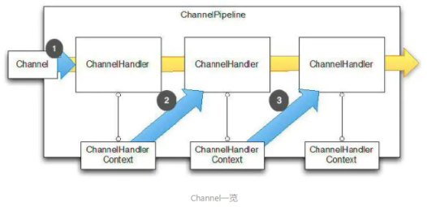
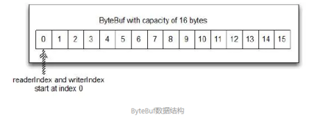
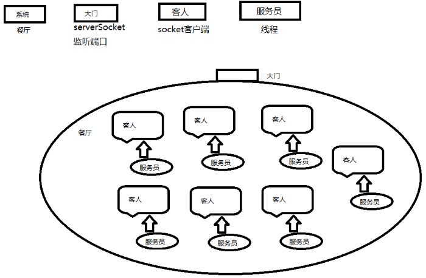
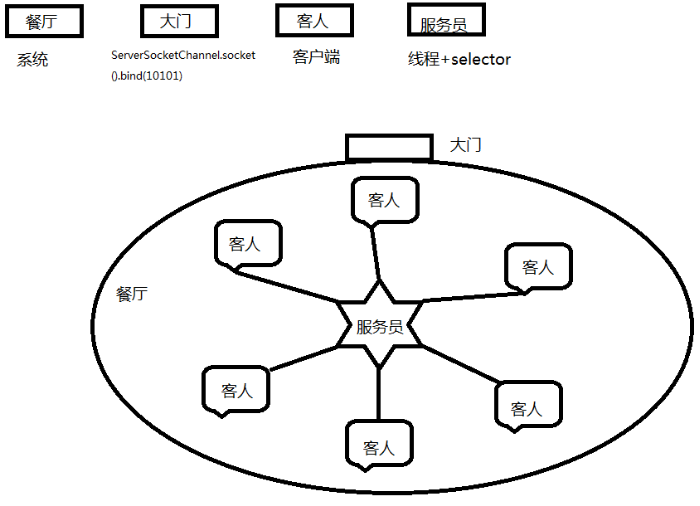
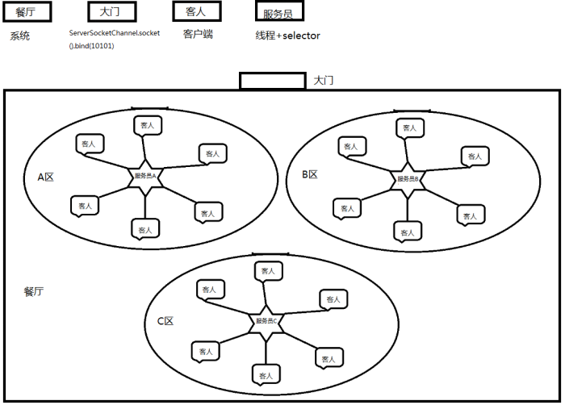
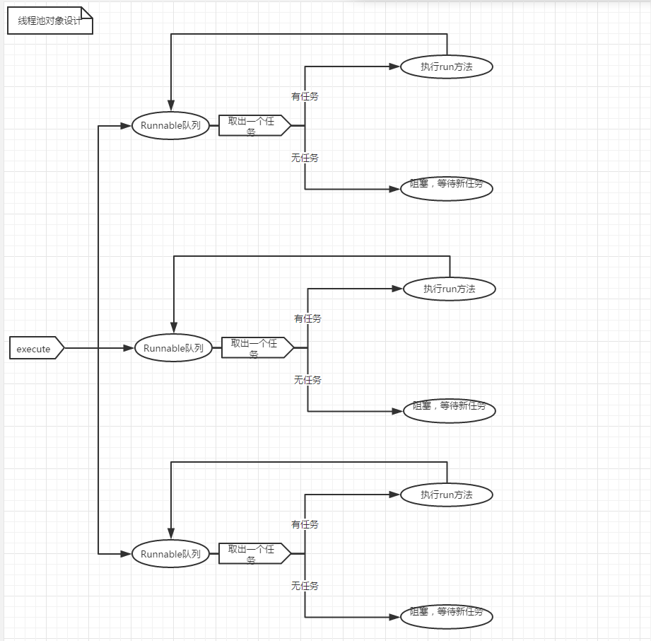
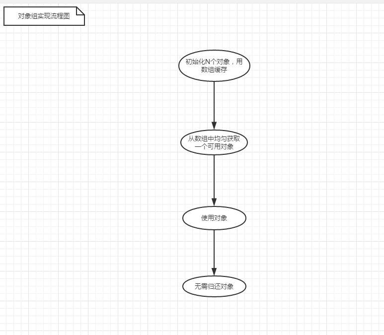
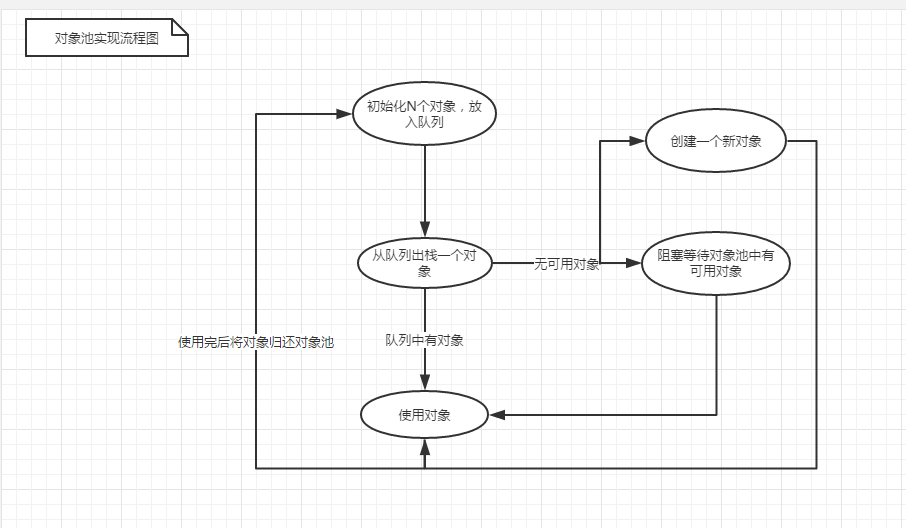
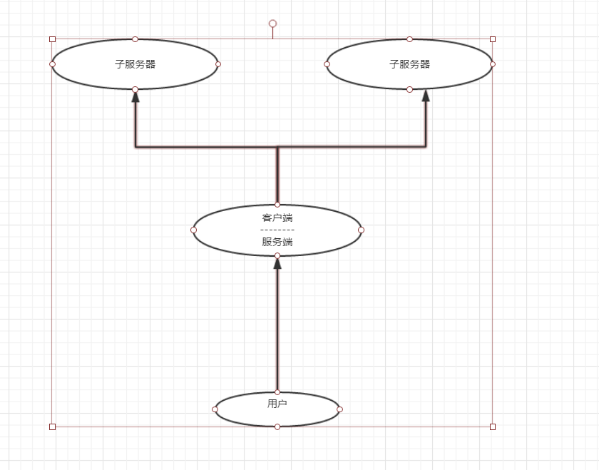

# Netty

1. [BIO/NIO/AIO](#BIO/NIO/AIO)
2. [Netty](#Netty)


## BIO/NIO/AIO

NIO的单线程能处理连接的数量比BIO要高出很多，而为什么单线程能处理更多的连接呢？原因就是**Selector**。

当一个连接建立之后，它有两个步骤要做：

1. 第一步是接收完客户端发过来的全部数据；
2. 第二步是服务端处理完请求业务之后返回response给客户端。

NIO和BIO的区别主要是在第一步：在BIO中，等待客户端发数据这个过程是阻塞的，这样就造成了一个线程只能处理一个请求的情况，而机器能支持的最大线程数是有限的，这就是为什么BIO不能支持高并发的原因。而NIO中，当一个Socket建立好之后，Thread并不会阻塞去接受这个Socket，而是将这个请求交给Selector，Selector会不断的去遍历所有的Socket，一旦有一个Socket建立完成，他会通知Thread，然后Thread处理完数据再返回给客户端——***这个过程是不阻塞的***，这样就能让一个Thread处理更多的请求了。

下面两张图是基于BIO的处理流程和NIO的处理流程，辅助你理解两种方式的差别：


除了BIO和NIO之外，还有一些其他的IO模型，下面这张图就表示了五种IO模型的处理流程：


- **BIO：**同步阻塞IO，阻塞整个步骤，如果连接少，它的延迟是最低的，因为一个线程只处理一个连接，适用于少连接且延迟低的场景，比如说数据库连接。

- **NIO：**同步非阻塞IO，阻塞业务处理但不阻塞数据接收，适用于高并发且处理简单的场景，比如聊天软件。

- **多路复用IO：**它的两个步骤处理是分开的，也就是说，一个连接可能他的数据接收是线程a完成的，数据处理是线程b完成的，他比BIO能处理更多请求。

- **信号驱动IO：**这种IO模型主要用在嵌入式开发，不参与讨论。

- **异步IO：**它的数据请求和数据处理都是异步的，数据请求一次返回一次，适用于长连接的业务场景。

以上摘自[Linux IO模式及 select、poll、epoll详解](https://links.jianshu.com/go?to=https%3A%2F%2Fsegmentfault.com%2Fa%2F1190000003063859)


## Netty

**Netty为什么传输快？**

Netty的传输快其实也是依赖了NIO的一个特性——**零拷贝**。

我们知道，Java的内存有堆内存、栈内存和字符串常量池等等，其中堆内存是占用内存空间最大的一块，也是Java对象存放的地方，一般我们的数据如果需要从IO读取到堆内存，中间需要经过Socket缓冲区，也就是说一个数据会被拷贝两次才能到达他的的终点，如果数据量大，就会造成不必要的资源浪费。

Netty针对这种情况，使用了NIO中的另一大特性——零拷贝，当他需要接收数据的时候，他会在堆内存之外开辟一块内存，数据就直接从IO读到了那块内存中去，在Netty里面通过**ByteBuf**可以对这些数据进行直接操作，从而加快了传输速度。

下两图就介绍了两种拷贝方式的区别，摘自[Linux 中的零拷贝技术，第 1 部分](https://links.jianshu.com/go?to=https%3A%2F%2Fwww.ibm.com%2Fdeveloperworks%2Fcn%2Flinux%2Fl-cn-zerocopy1%2Findex.html)


上文介绍的ByteBuf是Netty的一个重要概念，他是Netty数据处理的容器，也是Netty封装好的一个重要体现，将在下一部分做详细介绍。

**为什么说Netty封装好？**

要说Netty为什么封装好，这种用文字是说不清的，直接上代码：

阻塞I/O：

```java
public class PlainOioServer {
    public void serve(int port) throws IOException {
        final ServerSocket socket = new ServerSocket(port); //1
        try {
            for (;;) {
                final Socket clientSocket = socket.accept(); //2
                System.out.println("Accepted connection from " + clientSocket);
                new Thread(new Runnable() { //3
                    @Override
                    public void run() {
                        OutputStream out;
                        try {
                            out = clientSocket.getOutputStream();
                            out.write("Hi!\r\n".getBytes(Charset.forName("UTF-8"))); //4
                            out.flush();
                            clientSocket.close(); //5
                        } catch (IOException e) {
                            e.printStackTrace();
                            try {
                                clientSocket.close();
                            } catch (IOException ex) {
                                // ignore on close
                            }
                        }
                    }
                }).start(); //6
            }
        } catch (IOException e) {
            e.printStackTrace();
        }
    }
}
```

非阻塞IO：

```java
public class PlainNioServer {
    public void serve(int port) throws IOException {
        ServerSocketChannel serverChannel = ServerSocketChannel.open();
        serverChannel.configureBlocking(false);
        ServerSocket ss = serverChannel.socket();
        InetSocketAddress address = new InetSocketAddress(port);
        ss.bind(address); //1
        Selector selector = Selector.open(); //2
        serverChannel.register(selector, SelectionKey.OP_ACCEPT); //3
        final ByteBuffer msg = ByteBuffer.wrap("Hi!\r\n".getBytes());
        for (;;) {
            try {
                selector.select(); //4
            } catch (IOException ex) {
                ex.printStackTrace();
                // handle exception
                break;
            }
            Set<SelectionKey> readyKeys = selector.selectedKeys(); //5
            Iterator<SelectionKey> iterator = readyKeys.iterator();
            while (iterator.hasNext()) {
                SelectionKey key = iterator.next();
                iterator.remove();
                try {
                    if (key.isAcceptable()) { //6
                        ServerSocketChannel server =
                                (ServerSocketChannel)key.channel();
                        SocketChannel client = server.accept();
                        client.configureBlocking(false);
                        client.register(selector, SelectionKey.OP_WRITE |
                                SelectionKey.OP_READ, msg.duplicate()); //7
                        System.out.println(
                                "Accepted connection from " + client);
                    }
                    if (key.isWritable()) {  //8
                        SocketChannel client =
                                (SocketChannel)key.channel();
                        ByteBuffer buffer =
                                (ByteBuffer)key.attachment();
                        while (buffer.hasRemaining()) {
                            if (client.write(buffer) == 0) { //9
                                break;
                            }
                        }
                        client.close(); //10
                    }
                } catch (IOException ex) {
                    key.cancel();
                    try {
                        key.channel().close();
                    } catch (IOException cex) {
                        // 在关闭时忽略
                    }
                }
            }
        }
    }
}
```

Netty：

```java
public class NettyOioServer {
    public void server(int port) throws Exception {
        final ByteBuf buf = Unpooled.unreleasableBuffer(
                Unpooled.copiedBuffer("Hi!\r\n", Charset.forName("UTF-8")));
        EventLoopGroup group = new OioEventLoopGroup();
        try {
            ServerBootstrap b = new ServerBootstrap(); //1
            b.group(group) //2
             .channel(OioServerSocketChannel.class)
             .localAddress(new InetSocketAddress(port))
             .childHandler(new ChannelInitializer<SocketChannel>() { //3
                 @Override
                 public void initChannel(SocketChannel ch) 
                     throws Exception {
                     ch.pipeline().addLast(new ChannelInboundHandlerAdapter() { //4
                         @Override
                         public void channelActive(ChannelHandlerContext ctx) throws Exception {
                             ctx.writeAndFlush(buf.duplicate()).addListener(ChannelFutureListener.CLOSE); //5
                         }
                     });
                 }
             });
            ChannelFuture f = b.bind().sync(); //6
            f.channel().closeFuture().sync();
        } finally {
            group.shutdownGracefully().sync(); //7
        }
    }
}
```

从代码量上来看，Netty就已经秒杀传统Socket编程了，但是这一部分博大精深，仅仅贴几个代码岂能说明问题，在这里给大家介绍一下Netty的一些重要概念，让大家更理解Netty。

**Channel**

数据传输流，与channel相关的概念有以下四个，上一张图让你了解netty里面的Channel。



Channel，表示一个连接，可以理解为每一个请求，就是一个Channel。 

ChannelHandler，核心处理业务就在这里，用于处理业务请求。 

ChannelHandlerContext，用于传输业务数据。 

ChannelPipeline，用于保存处理过程需要用到的 ChannelHandler 和 ChannelHandlerContext。

**ByteBuf**

ByteBuf 是一个存储字节的容器，最大特点就是使用方便，它既有自己的读索引和写索引，方便你对整段字节缓存进行读写，也支持get/set，方便你对其中每一个字节进行读写，他的数据结构如下图所示：



它有三种使用模式：

1. Heap Buffer 堆缓冲区

   堆缓冲区是 ByteBuf 最常用的模式，他将数据存储在堆空间。

2. Direct Buffer 直接缓冲区

   直接缓冲区是 ByteBuf 的另外一种常用模式，他的内存分配都不发生在堆，jdk1.4 引入的 nio 的 ByteBuffer 类允许 jvm 通过本地方法调用分配内存，这样做有两个好处：

   - 通过免去中间交换的内存拷贝，提升 IO 处理速度；直接缓冲区的内容可以驻留在垃圾回收扫描的堆区以外。
   - DirectBuffer 在 -XX:MaxDirectMemorySize=xxM 大小限制下，使用 Heap 之外的内存，GC 对此“无能为力”，也就意味着规避了在高负载下频繁的 GC 过程对应用线程的中断影响。

3. Composite Buffer 复合缓冲区

   复合缓冲区相当于多个不同 ByteBuf 的视图，这是 netty 提供的，jdk 不提供这样的功能。

除此之外，它还提供一大堆 api 方便你使用，在这里我就不一一列出了，具体参见[ByteBuf字节缓存](https://links.jianshu.com/go?to=https%3A%2F%2Fwaylau.gitbooks.io%2Fessential-netty-in-action%2Fcontent%2FCORE%20FUNCTIONS%2FBuffers.html)。

**Codec**

Netty 中的编码/解码器，通过它你能完成字节与 pojo、pojo 与 pojo 的相互转换，从而达到自定义协议的目的。
在 Netty 里面最有名的就是 HttpRequestDecoder 和 HttpResponseEncoder 了。

**Netty工作原理源码分析**

1. 我们如何提高NIO的工作效率

2. 一个NIO是不是只能有一个selector？

   不是，一个系统可以有多个selector

3. selector是不是只能注册一个ServerSocketChannel？

   不是，可以注册多个

**SocketIO：**



**NIO：**



**NettyIO：**

****

**如何去看一个开源的系统框架？**

1. 断点
2. 打印
3. 看调用栈
4. 搜索

**Netty5案例**

线程池原理



一个thread + 队列 == 一个单线程线程池   =====> 线程安全的，任务是线性串行执行的

线程安全，不会产生阻塞效应 ，使用对象组



线程不安全，会产生阻塞效应， 使用对象池



服务器结构



**心跳**

1. 学习idleStateHandler

   用来检测会话状态

2. 心跳其实就是一个普通的请求，特点数据简单，业务也简单

   心跳对于服务端来说，定时清除闲置会话inactive(netty5) channelclose(netty3)

   心跳对客户端来说，用来检测会话是否断开，是否重连！用来检测网络延时！

**protocol buff**

1. protocol buff是一种协议，是谷歌推出的一种序列化协议

2. Java序列化协议也是一种协议

3. 两者的目的是，将对象序列化成字节数组，或者说是二进制数据

   [-84, -19, 0, 5, 115, 114, 0, 15, 99, 111, 109, 46, 106, 97, 118, 97, 46, 80, 108, 97, 121, 101, 114, -73, 43, 28, 39, -119, -86, -125, -3, 2, 0, 4, 73, 0, 3, 97, 103, 101, 74, 0, 8, 112, 108, 97, 121, 101, 114, 73, 100, 76, 0, 4, 110, 97, 109, 101, 116, 0, 18, 76, 106, 97, 118, 97, 47, 108, 97, 110, 103, 47, 83, 116, 114, 105, 110, 103, 59, 76, 0, 6, 115, 107, 105, 108, 108, 115, 116, 0, 16, 76, 106, 97, 118, 97, 47, 117, 116, 105, 108, 47, 76, 105, 115, 116, 59, 120, 112, 0, 0, 0, 20, 0, 0, 0, 0, 0, 0, 0, 101, 116, 0, 5, 112, 101, 116, 101, 114, 115, 114, 0, 19, 106, 97, 118, 97, 46, 117, 116, 105, 108, 46, 65, 114, 114, 97, 121, 76, 105, 115, 116, 120, -127, -46, 29, -103, -57, 97, -99, 3, 0, 1, 73, 0, 4, 115, 105, 122, 101, 120, 112, 0, 0, 0, 1, 119, 4, 0, 0, 0, 10, 115, 114, 0, 17, 106, 97, 118, 97, 46, 108, 97, 110, 103, 46, 73, 110, 116, 101, 103, 101, 114, 18, -30, -96, -92, -9, -127, -121, 56, 2, 0, 1, 73, 0, 5, 118, 97, 108, 117, 101, 120, 114, 0, 16, 106, 97, 118, 97, 46, 108, 97, 110, 103, 46, 78, 117, 109, 98, 101, 114, -122, -84, -107, 29, 11, -108, -32, -117, 2, 0, 0, 120, 112, 0, 0, 3, -23, 120]

   [8, 101, 16, 20, 26, 5, 112, 101, 116, 101, 114, 32, -23, 7]

   int 4字节   1~5字节

   long 8内存
   
   我们利用protobuf做了对象的序列化和反序列化对吧，但是我们还没有把protobuf和netty结合起来吧？
