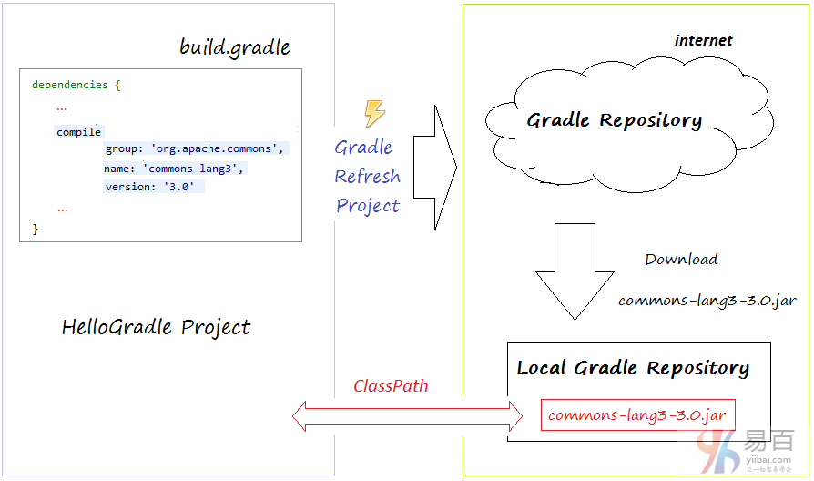

## Java

1. 简介
   - 诞生历史
   - 环境搭建
   - 基本语法
   - [开发工具](#开发工具)
   - [并发编程](#并发编程)
   - [数据结构](#数据结构)
2. 实战
- [构建工具](#构建工具)
3. 问题
4. 总结

   - [JDK历史版本](https://www.oracle.com/technetwork/java/javase/archive-139210.html)

   - [Eclipse历史版本](https://wiki.eclipse.org/Older_Versions_Of_Eclipse)


## 简介


### 诞生历史

- 1990 sun启动 绿色计划
- 1992 创建oak语言-->java
- 1994 Gosling（JAVA之父）参加硅谷大会演示java功能，震惊世界
- 1995 sun正式发布java第一个版本

### 环境搭建

**windows**

```sh
set JAVA_HOME=C:\jdk
set PATH=%JAVA_HOME%\bin;%JAVA_HOME%\jre\bin
set CLASSPATH=.;%JAVA_HOME%\lib;%JAVA_HOME%\lib\tools.jar;%JAVA_HOME%\jre\lib\rt.jar
```

**Linux**

```sh
export JAVA_HOME=/usr/local/jdk
export PATH=$JAVA_HOME/bin:$PATH
export CLASSPATH=.:$JAVA_HOME/jre/lib/rt.jar
```

检查：`java -version`

### 基本语法

**基本类型：**

- 整型
- 浮点
- 字符
- 布尔

| **类型** | **byte** | **位数** | **范围**                                      |
| -------- | -------- | -------- | --------------------------------------------- |
| byte     | 1b       | 8        | -128到127                                     |
| short    | 2b       | 16       | -2^15到2^15-1  (-32768~32767)                 |
| int      | 4b       | 32       | -2^31到2^31-1  (-2147483648~2147483647约21亿) |
| long     | 8b       | 64       | -2^63到2^63-1                                 |
| float    | 4b       | 32       | -3.403E38~3.403E38                            |
| double   | 8b       | 64       | -1.798E308~1.798E308                          |
| char     | 2b       | 16       | '\u0000' ~ '\uffff' 即 0 ~ 65535              |
| boolean  | 1b       | 1        | false/true                                    |

**值类型和引用类型**

引用类型是一个对象类型的，它的值是指向内存空间的引用，就是地址，所指向的内存中保存着变量所表示的一个值或一组值。

声明值类型变量的同时，系统给变量分配了数据空间；引用类型则不然，只给变量分配了引用空间，数据空间没有分配。

**定义变/常量和变量的初始化**

- 变量名必须在作用域中是唯一的，不同作用域中才允许相同名字的变量出现
- 只要在同一代码块没有同名的变量名，可以在程序中任何地方定义变量，一个代码块就是两个相对的 "{ }" 之间部分
- 在类开始处声明的变量是成员变量，作用范围在整个类；
- 在方法和块中声明的变量是局部变量，作用范围到它的 "}"；

强制类型转换：由低到高（反之为自动）

```java
int a = 9;
long b = 3;
int t = a + b; // b 被自动转换为 int 参与运算
long a1 = (long)a; // a 被强制转换为 long 赋值给 a1
```

变量与存储器有着直接关系，定义一个变量就是要编译器分配所需要的内存空间，分配多少空间，这就是根据我们所定义的变量类型所决定的。变量名实际上是代表所分配空间的内存首地址

常量：用final说明

```java
final int i = 1;
```

**运算符**

优先级由高到低排列：

| **分类**   | **运算符**                 |
| ---------- | -------------------------- |
| 一元运算符 | ++ -- + - ! ~ ()           |
| 算术运算符 | * / % + -                  |
| 位移运算符 | << >> >>>                  |
| 比较运算符 | < <= > >= instanceof == != |
| 按位运算符 | & ^                        |
| 短路运算符 | && \|\|                    |
| 条件运算符 | ?:                         |
| 赋值运算符 | = += -+ *= /=              |

**分支、循环语句**

```java
if (expr1) {

} else if (expr2) {

} else {

}

switch(expr) {
    case val1:
      break;
    case val2:
      break;
    default:
      break;
}

while(expr) {
    ...
    // break; 跳出循环
    // continue; 跳出本次循环，其后代码不执行
    ...
}

do { // 先执行一次，再判断是否要循环
    ...
} while(expr)

for (int i = 0; i < max; i++) {
    ...
    // break
    // continue
    ...
}
```

**字符串：String, StringBuffer, StringBuilder**

- String 字符串常量
- StringBuffer 字符串变量（线程安全）
- StringBuilder 字符串变量（非线程安全）

String 是不可变的对象, 因此在每次对 String 类型进行改变的时候其实都等同于生成了一个新的 String 对象，然后将指针指向新的 String 对象，所以经常改变内容的字符串最好不要用 String ，因为每次生成对象都会对系统性能产生影响，特别当内存中无引用对象多了以后， JVM 的 GC 就会开始工作，那速度是一定会相当慢的。

而如果是使用 StringBuffer 类则结果就不一样了，每次结果都会对 StringBuffer 对象本身进行操作，而不是生成新的对象，再改变对象引用。所以在一般情况下我们推荐使用 StringBuffer，特别是字符串对象经常改变的情况下。

而在某些特别情况下， String 对象的字符串拼接其实是被 JVM 解释成了 StringBuffer 对象的拼接，所以这些时候String 对象的速度并不会比 StringBuffer 对象慢，而特别是以下的字符串对象生成中，String 效率是远要比StringBuffer 快的：

```java
String S1 = "This is only a" + " simple" + " test";
StringBuffer Sb = new StringBuilder("This is only a").append(" simple").append(" test");
```

在 JVM 眼里，这个 `String S1 = "This is only a" + " simple" + "test";` 其实就是：`String S1 = "This is only a simple test";`

但要注意的是，如果字符串是来自另外的 String 对象，速度就没那么快了，JVM 会规规矩矩的按照原来的方式去做。

大部分情况下 StringBuilder > StringBuffer / String

**数组**

数组是有序数据的集合，数组中的每个元素具有相同的数组名，根据数组名和下标来唯一确定数组中的元素。

### 开发工具

- JetBrains
- Eclipse


### 并行基础

**什么是线程**

线程是进程内的执行单元

**线程内的基本操作**


**新建线程**

```java
Thread t1 = new Thread();
// 线程不会马上开启
t1.start();
// Thread.run()的实现target是Runnable接口
t1.run();

Thread t2 = new Thread() {
    @Override
    public void run() {
        System.out.println("Hello, I am t1");
    }
};
```

**终止线程**

```java
Thread.stop(); // 不推荐使用，会释放所有monitor
```

**中断线程**

```java
public void Thread.interrupt();  // 中断线程
public boolean Thread.isInterrupted(); // 判断是否被中断
public static boolean Thread.interrupted(); // 判断当前是否被中断，并清除当前中断状态
```

**挂起和恢复**

- `suspend()` 不会释放锁

- 如果加锁发生在 `resume()` 之前，则死锁发生

**等待线程结束和谦让**

```java
public final void join() throws InterrupedException;
public final synchronized void join(long millis) throws InterrupedException;
```

join的本质

```java
while (isAlive()) {
    wait(0);
}
// 线程执行完毕后，系统会调用notifyAll()
```

不要在 Thread 实例上使用 `wait()` 和 `notify()` 方法

**守护线程**

- 在后台默默完成一些系统性服务，比如垃圾回收、JIT
- 当一个java应用内只有守护线程时，java虚拟机会自然退出

```java
Thread t = new DaemonT();
t.setDaemon(true);
t.start();
```

**线程优先级**

```java
public final static int MIN_PRIORITY = 1;
public final static int NORM_PRIORITY = 5;
public final static int MAX_PRIORITY = 10;

Thread high = new HighPriority();
LowPriority low = new LowPriority();
high.setPriority(Thread.MAX_PRIORITY); // 高优先级的线程更容易在竞争中获胜
low.setPriority(Thread.MIN_PRIORITY);
low.start();
high.start();
```

**基本的线程同步操作**

- synchronized：锁定类、锁定实例
- `Object.wait()` ：当前线程必须拥有object监视器才可以等待，释放所有权，让其它线程获取所有权
- `Object.notify()`：当前线程必须拥有object监视器才可以通知，唤醒一个在object监视器上的线程（唤醒后该线程不是马上执行，必须等当前线程释放锁）
- `Object.notifyAll()`：唤醒所有线程，谁抢到object Monitor谁先执行。 


### 内存模型和线程安全

**原子性**

原子性是指一个操作是不可中断的。即使是在多个线程一起执行的时候，一个操作一旦开始，就不会被其它线程干扰。

i++是原子操作吗？

**有序性**

在并发时，程序的执行可能就会出现乱序！

一条指令的执行是可以分为很多步骤的：

- 取指 IF
- 译码和取寄存器操作数 ID
- 执行或者有效地址计算 EX
- 存储器访问 MEM
- 写回 WB

指令重排可以使流水线更加顺畅

**可见性**

可见性是指当一个线程修改了某一个共享变量的值，其他线程是否能够立即知道这个修改

- 编译器优化
- 硬件优化（如写吸收，批操作）

Java虚拟机层面的可见性：http://hushi55.github.io/2015/01/05/volatile-assembly

**Happen-Before**

- 程序顺序原则：一个线程内保证语义的串行性
- volatile规则：volatile变量的写，先发生于读，这保证了volatile变量的可见性
- 锁规则：解锁（unlock）必然发生在随后的加锁（lock）前
- 传递性：A先于B，B先于C，那么A必然先于C
- 线程的start()方法先于它的每一个动作
- 线程的所有操作先于线程的终结（Thread.join()）
- 线程的中断（interrupt()）先于被中断线程的代码
- 对象的构造函数执行结束先于finalize()方法


### 线程安全的概念

指某个函数、函数库在多线程环境中被调用时，能够正确地处理各个线程的局部变量，使程序功能正确完成。


## 无锁


### 无锁类的原理


### 无锁类的使用


### 无锁算法


### 数据结构

参考：[Java集合详解](https://blog.csdn.net/qq_33642117/article/details/52040345)

集合类存放于 `java.util` 包中。 

集合类存放的都是对象的引用，而非对象本身，出于表达上的便利，我们称集合中的对象就是指集合中对象的引用(reference)。 

集合类型主要有3种：set（集）、list（列表）和 map（映射）。

通俗的说，集合就是一个放数据的容器，准确的说是放数据对象引用的容器。


## List

 

`AbstarctCollection` 是 `Collection` 接口的部分实现

`List` 是一个有序的集合，和 set 不同的是，`List` 允许存储项的值为空，也允许存储相等值的存储项。

`List` 是继承于 `Collection` 接口，除了 `Collection` 通用的方法以外，扩展了部分只属于 `List` 的方法。

`AbstractList` 也只是实现了 `List` 接口部分的方法，和 `AbstractCollection` 是一个思路。

### ArraryList

`ArrayList` 是一个数组实现的列表，由于数据是存入数组中的，所以它的特点也和数组一样，查询很快，但是中间部分的插入和删除很慢。

### Vector

`Vector` 就是 `ArrayList` 的线程安全版，它的方法前都加了 **synchronized** 锁，其他实现逻辑都相同。如果对线程安全要求不高的话，可以选择 `ArrayList` ，毕竟 `synchronized` 也很耗性能。


### LinkedList

双向链表。`LinkedList` 继承于 `AbstractSequentialList`，和 `ArrayList` 一个套路。内部维护了3个成员变量，一个是当前链表的头节点，一个是尾部节点，还有链表长度。

通过上面对 `ArrayList` 和 `LinkedList` 的分析，可以理解 `List` 的3个特性

1. 是按顺序查找 
2. 允许存储项为空 
3. 允许多个存储项的值相等 

然后对比 `LinkedList` 和 `ArrayList` 的实现方式不同，可以在不同的场景下使用不同的 `List` 

1. `ArrayList` 是由数组实现的，方便查找，返回数组下标对应的值即可，适用于多查找的场景 

2. `LinkedList` 由链表实现，插入和删除方便，适用于多次数据替换的场景

### queue

**Queue**：基本上，一个队列就是一个先入先出**(FIFO)**的数据结构。

`Queue` 接口与 `List`、`Set` 同一级别，都是继承了 `Collection` 接口。`LinkedList` 实现了 `Deque` 接口。


**Queue** 的实现

**1、** **没有实现阻塞接口的：**

`LinkedList`：实现了 `java.util.Queue` 接口和 `java.util.AbstractQueue` 接口

内置的不阻塞队列：`PriorityQueue` 和 `ConcurrentLinkedQueue`

`PriorityQueue` 和 `ConcurrentLinkedQueue` 类在 Collection Framework 中加入两个具体集合实现。 

`PriorityQueue` 类实质上维护了一个有序列表。加入到 `Queue` 中的元素根据它们的天然排序（通过其 `java.util.Comparable` 实现）或者根据传递给构造函数的 `java.util.Comparator` 实现来定位。

`ConcurrentLinkedQueue`（无界线程安全，采用**CAS**机制（`compareAndSwapObject` 原子操作））是基于链接节点的、线程安全的队列。并发访问不需要同步。因为它在队列的尾部添加元素并从头部删除它们，所以只要不需要知道队列的大小，`ConcurrentLinkedQueue` 对公共集合的共享访问就可以工作得很好。收集关于队列大小的信息会很慢，需要遍历队列。

**2、** **实现阻塞接口的：**

`java.util.concurrent` 中加入了 `BlockingQueue` 接口和五个阻塞队列类（采用锁机制，使用 `ReentrantLock` 锁）。它实质上就是一种带有一点扭曲的 FIFO 数据结构。不是立即从队列中添加或者删除元素，线程执行操作阻塞，直到有空间或者元素可用。

五个队列所提供的各有不同：

- `ArrayBlockingQueue`：一个由数组支持的有界队列。
- `LinkedBlockingQueue`：一个由链接节点支持的可选有界队列。

  * `PriorityBlockingQueue`：一个由优先级堆支持的无界优先级队列。
  * `DelayQueue`：一个由优先级堆支持的、基于时间的调度队列。
  * `SynchronousQueue`：一个利用 `BlockingQueue` 接口的简单聚集(rendezvous)机制。

**关于 `ConcurrentLinkedQueue` 和 `LinkedBlockingQueue`**

1. `LinkedBlockingQueue` 是使用锁机制，`ConcurrentLinkedQueue` 是使用CAS算法，虽然`LinkedBlockingQueue` 的底层获取锁也是使用的CAS算法

2. 关于取元素，`ConcurrentLinkedQueue` 不支持阻塞去取元素，`LinkedBlockingQueue` 支持阻塞的 take() 方法，如若大家需要 `ConcurrentLinkedQueue` 的消费者产生阻塞效果，需要自行实现

3. 关于插入元素的性能，从字面上和代码简单的分析来看 `ConcurrentLinkedQueue` 肯定是最快的，但是这个也要看具体的测试场景。在实际的使用过程中，尤其在多cpu的服务器上，有锁和无锁的差距便体现出来了，`ConcurrentLinkedQueue` 会比 `LinkedBlockingQueue` 快很多。

下表显示了jdk1.5中的阻塞队列的操作：

| 方法名      | 功能                     | 描述                                               |
| ----------- | :----------------------- | -------------------------------------------------- |
| **add**     | 增加一个元索             | 如果队列已满，则抛出一个IIIegaISlabEepeplian异常   |
| **remove**  | 移除并返回队列头部的元素 | 如果队列为空，则抛出一个NoSuchElementException异常 |
| **element** | 返回队列头部的元素       | 如果队列为空，则抛出一个NoSuchElementException异常 |
| **offer**   | 添加一个元素并返回true   | 如果队列已满，则返回false                          |
| **poll**    | 移除并返问队列头部的元素 | 如果队列为空，则返回null                           |
| **peek**    | 返回队列头部的元素       | 如果队列为空，则返回null                           |
| **put**     | 添加一个元素             | 如果队列满，则阻塞                                 |
| **take**    | 移除并返回队列头部的元素 | 如果队列为空，则阻塞                               |

**remove**、**element**、**offer** 、**poll**、**peek** 其实是属于 `Queue` 接口。 

阻塞队列的操作可以根据它们的响应方式分为以下三类：add、remove 和 element 操作在你试图为一个已满的队列增加元素或从空队列取得元素时抛出异常。当然，在多线程程序中，队列在任何时间都可能变成满的或空的，所以你可能想使用 offer、poll、peek 方法。这些方法在无法完成任务时只是给出一个出错示而不会抛出异常。

注意：poll 和 peek 方法出错会返回 null。因此，向队列中插入 null 值是不合法的

最后，我们有阻塞操作 put 和 take。put 方法在队列满时阻塞，take 方法在队列空时阻塞。

**LinkedBlockingQueue** 的容量是没有上限的（说的不准确，在不指定时容量为 Integer.MAX_VALUE，不然的话在 put 时怎么会受阻呢），但是也可以选择指定其最大容量，它是基于链表的队列，此队列按 FIFO（先进先出）排序元素。

**ArrayBlockingQueue** 在构造时需要指定容量，并可以选择是否需要公平性，如果公平参数被设置true，等待时间最长的线程会优先得到处理（其实就是通过将 ReentrantLock 设置为 true 来达到这种公平性：即等待时间最长的线程会先操作）。通常，公平性会使你在性能上付出代价，只有在的确非常需要的时候再使用它。它是基于数组的阻塞循环队列，此队列按 FIFO（先进先出）原则对元素进行排序。

**PriorityBlockingQueue** 是一个带优先级的队列，而不是先进先出队列。元素按优先级顺序被移除，该队列也没有上限（看了一下源码，`PriorityBlockingQueue` 是对 `PriorityQueue` 的再次包装，是基于堆数据结构的，而 `PriorityQueue` 是没有容量限制的，与 `ArrayList` 一样，所以在优先阻塞队列上 put 时是不会受阻的。虽然此队列逻辑上是无界的，但是由于资源被耗尽，所以试图执行添加操作可能会导致 OutOfMemoryError），但是如果队列为空，那么取元素的操作take就会阻塞，所以它的检索操作 take 是受阻的。另外，加入该队列中的元素要具有比较能力。

**DelayQueue**（基于 `PriorityQueue` 来实现的）是一个存放 Delayed 元素的无界阻塞队列，只有在延迟期满时才能从中提取元素。该队列的头部是延迟期满后保存时间最长的 Delayed 元素。如果延迟都还没有期满，则队列没有头部，并且 poll 将返回 null。当一个元素的 getDelay(TimeUnit.NANOSECONDS) 方法返回一个小于或等于零的值时，则出现期满，poll 就以移除这个元素了。此队列不允许使用 null 元素。


## stack

栈是一种用于存储数据的简单数据结构，有点类似链表或者顺序表（统称线性表），栈与线性表的最大区别是数据的存取的操作，我们可以这样认为，栈(Stack)是一种特殊的线性表，其插入和删除操作只允许在线性表的一端进行，一般而言，把允许操作的一端称为栈顶(Top)，不可操作的一端称为栈底(Bottom)，同时把插入元素的操作称为入栈(Push)，删除元素的操作称为出栈(Pop)。若栈中没有任何元素，则称为空栈，栈的结构如下图： 


由图我们可看成栈只能从栈顶存取元素，同时先进入的元素反而是后出，而栈顶永远指向栈内最顶部的元素。到此可以给出栈的正式定义：栈(Stack)是一种有序特殊的线性表，只能在表的一端（称为栈顶，top，总是指向栈顶元素）执行插入和删除操作，最后插入的元素将第一个被删除，因此栈也称为后进先出(Last In First Out, LIFO)或先进后出(First In Last Out, FILO)的线性表。栈的基本操作创建栈，判空，入栈，出栈，获取栈顶元素等，注意**栈不支持对指定位置进行删除，插入**。

 JAVA中，栈是 `Vector` 的一个子类

**顺序栈**

顺序栈，顾名思义就是采用顺序表实现的的栈，顺序栈的内部以顺序表为基础，实现对元素的存取操作，当然我们还可以采用内部数组实现顺序栈，具体请看测试代码。

**链式栈**

所谓的链式栈(Linked Stack)，就是采用链式存储结构的栈，由于我们操作的是栈顶一端，因此这里采用单链表（不带头结点）作为基础，直接实现栈的添加，获取，删除等主要操作即可。具体请看测试代码。

最后我们来看看顺序栈与链式栈中各个操作的算法复杂度（时间和空间）对比，顺序栈复杂度如下：

| **操作**                      | **时间复杂度** |
| ----------------------------- | -------------- |
| SeqStack空间复杂度（N次push） | O(n)           |
| push()时间复杂度              | O(1)           |
| pop()时间复杂度               | O(1)           |
| peek()时间复杂度              | O(1)           |
| isEmpty()时间复杂度           | O(1)           |

  链式栈复杂度如下：

| **操作**                        | **时间复杂度** |
| ------------------------------- | -------------- |
| SeqStack空间复杂度(用于N次push) | O(n)           |
| push()时间复杂度                | O(1)           |
| pop()时间复杂度                 | O(1)           |
| peek()时间复杂度                | O(1)           |
| isEmpty()时间复杂度             | O(1)           |

由此可知栈的主要操作都可以在常数时间内完成，这主要是因为栈只对一端进行操作，而且操作的只是栈顶元素。

**栈的应用**

栈是一种很重要的数据结构，在计算机中有着很广泛的应用，如下一些操作都应用到了栈。

- 符号匹配

- 中缀表达式转换为后缀表达式

- 计算后缀表达式

- 实现函数的嵌套调用

- HTML和XML文件中的标签匹配

- 网页浏览器中已访问页面的历史记录

接下来我们分别对符合匹配，中缀表达式转换为后缀表达式进行简单的分析，以加深我们对栈的理解。

**符号匹配** 

在编写程序的过程中，我们经常会遇到诸如圆括号 "()" 与花括号 "{}"，这些符号都必须是左右匹配的，这就是我们所说的符合匹配类型，当然符合不仅需要个数相等，而且需要先左后右的依次出现，否则就不符合匹配规则，如 ")("，明显是错误的匹配，而 "()" 才是正确的匹配。有时候符合如括号还会嵌套出现，如 "9-(5+(5+1))" ，而嵌套的匹配原则是一个右括号与其前面最近的一个括号匹配，事实上编译器帮我检查语法错误是也是执行一样的匹配原理，而这一系列操作都需要借助栈来完成，接下来我们使用栈来实现括号 "()" 是否匹配的检测。 

判断原则如下 str="((5-3)*8-2)"：

1. 设置 str 是一个表达式字符串，从左到右依次对字符串 str 中的每个字符 char 进行语法检测，如果 char 是左括号则入栈，如果 char 是右括号则出栈（有一对匹配就可以去匹配一个左括号，因此可以出栈），若此时出栈的字符 char 为左括号，则说明这一对括号匹配正常，如果此时栈为空或者出栈字符不为左括号，则表示缺少与 char 匹配的左括号，即目前不完整。

2. 重复执行 a 操作，直到 str 检测结束，如果此时栈为空，则全部括号匹配，如果栈中还有左括号，是说明缺少右括号。

整个检测算法的执行流程如下图：


接着我们用栈作为存储容器通过代码来实现这个过程，代码比较简单，如下：

```java
package com.zejian.structures.Stack;

/**
 * Created by zejian on 2016/11/27.
 * Blog : http://blog.csdn.net/javazejian [原文地址,请尊重原创]
 * 表达式检测
 */
public class CheckExpression {
  public static String isValid(String expstr) {
    //创建栈
    LinkedStack<String> stack = new LinkedStack<>();
    int i = 0;
    while (i < expstr.length()) {
      char ch=expstr.charAt(i);
      i++;
      switch (ch) {
        case '(': stack.push(ch + ""); //左括号直接入栈
          break;
        case ')': if (stack.isEmpty() || !stack.pop().equals("(")) //遇见右括号左括号直接出栈
          return** "(";
      }
    }
    //最后检测是否为空,为空则检测通过
    if (stack.isEmpty())
      return "check pass!";
    else
      return "check exception!";
  }

  public static void main(String args[]) {
    String expstr="((5-3)*8-2)";
    System.out.println(expstr+" "+isValid(expstr));
  }
}
```

**中缀表达式转换为后缀表达式** 

我们先来了解一下什么是中缀表达式，平常所见到的计算表达式都算是中缀表达式，如以下的表达式：

//1+3*(9-2)+9 --->中缀表达式（跟日常见到的表达式没啥区别）

了解中缀表达式后来看看其定义：将运算符写在两个操作数中间的表达式称为中缀表达式。在中缀表达式中，运算符拥有不同的优先级，同时也可以使用圆括号改变运算次序，由于这两点的存在，使用的中缀表达式的运算规则比较复杂，求值的过程不能从左往右依次计算，当然这也是相对计算机而言罢了，毕竟我们日常生活的计算使用的还是中缀表达式。既然计算机感觉复杂，那么我们就需要把中缀表达式转化成计算机容易计算而且不复杂的表达式，这就是后缀表达式了，在后缀表达式中，运算符是没有优先级的，整个计算都是遵守从左往右的次序依次计算的，如下我们将中缀表达式转为后缀表达式：

//1+3*(9-2)+9     转化前的中缀表达式
//1 3 9 2 - * + 9 + 转化后的后缀表达式

中缀转后缀的转换过程需要用到栈，这里我们假设栈A用于协助转换，并使用数组B用于存放转化后的后缀表达式具体过程如下： 

1. 如果遇到操作数，我们就直接将其放入数组B中。 
2. 如果遇到运算符，则我们将其放入到栈A中，遇到左括号时我们也将其放入栈A中。 
3. 如果遇到一个右括号，则将栈元素弹出，将弹出的运算符输出并存入数组B中直到遇到左括号为止。注意，左括号只弹出并不存入数组。 
4. 如果遇到任何其他的操作符，如("+", "*", "(")等，从栈中弹出元素存入数组B直到遇到发现更低优先级的元素（或者栈为空）为止。弹出完这些元素后，才将遇到的操作符压入到栈中。有一点需要注意，只有在遇到")"的情况下我们才弹出"("，其他情况我们都不会弹出"("。 
5. 如果我们读到了输入的末尾，则将栈中所有元素依次弹出存入到数组B中。 
6. 到此中缀表达式转化为后缀表达式完成，数组存储的元素顺序就代表转化后的后缀表达式。 

执行图示过程如下： 


简单分析一下流程，当遇到操作数时（规则1），直接存入数组B中，当i=1（规则2）时，此时运算符为+，直接入栈，当i=3（规则2）再遇到运算符*，由于栈内的运算符+优先级比*低，因此直接入栈，当i=4时，遇到运算符'('，直接入栈，当i=6时，遇运算符-，直接入栈，当i=8时（规则3），遇')'，-和'('直接出栈，其中运算符-存入后缀数组B中，当i=9时（规则5），由于*优先级比+高，而+与+平级，因此和+出栈，存入数组B，而后面的+再入栈，当i=10（规则5），结束，+直接出栈存入数组B，此时数组B的元素顺序即为1 3 9 2 - * + 9 +，这就是中缀转后缀的过程。 

接着转成后缀后，我们来看看计算机如何利用后缀表达式进行结果运算，通过前面的分析可知，后缀表达式是没有括号的，而且计算过程是按照从左到右依次进行的，因此在后缀表达的求值过程中，当遇到运算符时，只需要取前两个操作数直接进行计算即可，而当遇到操作数时不能立即进行求值计算，此时必须先把操作数保存等待获取到运算符时再进行计算，如果存在多个操作数，其运算次序是后出现的操作数先进行运算，也就是后进先运算，因此后缀表达式的计算过程我们也需要借助栈来完成，该栈用于存放操作数，后缀表达式的计算过程及其图解如下： 


借助栈的程序计算过程：


简单分析说明一下： 

1. 如果ch是数字，先将其转换为整数再入栈 
2. 如果是运算符，将两个操作数出栈，计算结果再入栈 
3. 重复 1 和 2 直到后缀表达式结束，最终栈内的元素即为计算的结果。 

整体呈现实现如下：

```java
package com.zejian.structures.Stack;

/**
* Created by zejian on 2016/11/28.
* Blog : http://blog.csdn.net/javazejian [原文地址,请尊重原创]
* 中缀转后缀,然后计算后缀表达式的值
*/
public class CalculateExpression {

  /**
   * 中缀转后缀
   * @param expstr 中缀表达式字符串
   * @return
   */
  public static String toPostfix(String expstr)
  {
      //创建栈,用于存储运算符
      SeqStack<String> stack = new SeqStack<>(expstr.length());

      String postfix="";//存储后缀表达式的字符串
      int i=0;
      while (i<expstr.length())
      {
          char ch=expstr.charAt(i);
          switch (ch)
          {
              case '+':
              case '-':
                  //当栈不为空或者栈顶元素不是左括号时,直接出栈,因此此时只有可能是*/+-四种运算符(根据规则4),否则入栈
                  while (!stack.isEmpty() && !stack.peek().equals("(")) {
                      postfix += stack.pop();
                  }
                  //入栈
                  stack.push(ch+"");
                  i++;
                  break;
              case '*':
              case '/':
                  //遇到运算符*/
                  while (!stack.isEmpty() && (stack.peek().equals("*") || stack.peek().equals("/"))) {
                      postfix += stack.pop();
                  }
                  stack.push(ch+"");
                  i++;
                  break;
              case '(':
                  //左括号直接入栈
                  stack.push(ch+"");
                  i++;
                  break;
              case ')':
                  //遇到右括号(规则3)
                  String out = stack.pop();
                  while (out!=null && !out.equals("("))
                  {
                      postfix += out;
                      out = stack.pop();
                  }
                  i++;
                  break;
              default:
                  //操作数直接入栈
                  while (ch>='0' && ch<='9')
                  {
                      postfix += ch;
                      i++;
                      if (i<expstr.length())
                          ch=expstr.charAt(i);
                      else
                          ch='=';
                  }
                  //分隔符
                  postfix += " ";
                  break;
          }
      }
      //最后把所有运算符出栈(规则5)
      while (!stack.isEmpty())
          postfix += stack.pop();
      return postfix;
  }

  /**
   * 计算后缀表达式的值
   * @param postfix 传入后缀表达式
   * @return
   */
  public static int calculatePostfixValue(String postfix)
  {
      //栈用于存储操作数,协助运算
      LinkedStack<Integer> stack = new LinkedStack<>();
      int i=0, result=0;
      while (i<postfix.length())
      {
          char ch=postfix.charAt(i);
          if (ch>='0' && ch<='9')
          {
              result=0;
              while (ch!=' ')
              {
                  //将整数字符转为整数值ch=90
                  result = result*10 + Integer.parseInt(ch+"");
                  i++;
                  ch = postfix.charAt(i);
              }
              i++;
              stack.push(result);//操作数入栈
          }
          else
          {  //ch 是运算符,出栈栈顶的前两个元素
              int y= stack.pop();
              int x= stack.pop();
              switch (ch)
              {   //根据情况进行计算
                  case '+': result=x+y; break;
                  case '-': result=x-y; break;
                  case '*': result=x*y; break;
                  case '/': result=x/y; break;   //注意这里并没去判断除数是否为0的情况
              }
              //将运算结果入栈
              stack.push(result);
              i++;
          }
      }
      //将最后的结果出栈并返回
      return stack.pop();
  }
  //测试
  public static void main(String args[])
  {
      String expstr="1+3*(9-2)+90";
      String postfix = toPostfix(expstr);
      System.out.println("中缀表达式->expstr=  "+expstr);
      System.out.println("后缀表达式->postfix= "+postfix);
      System.out.println("计算结果->value= "+calculatePostfixValue(postfix));
  }

}
```

以上便是利用转实现中缀与后缀的转换过程并且通过后缀计算机能及其简单计算出后缀表达式的结果。

JAVA中，栈 `Stack` 是 **Vector** 的一个子类，内部使用数组保存数据，可以自动按需增长（不够时翻倍，最大`Integer.MAX_VALUE`），线程安全。

OK~，到此我们对栈的分析就结束了，本来还想聊聊函数调用的问题，但感觉这个问题放在递归算法更恰当。

## Set


Set和List一样，也继承于Collection，是集合的一种。和List不同的是，Set内部实现是基于Map的，所以Set取值时不保证数据和存入的时候顺序一致，并且不允许空值，不允许重复值。

Set的特点，主要由其内部的Map决定的，Set就是Map的一个马甲

HashSet主要由HashMap实现，TreeSet和HashMap的处理方式相似，区别的地方是，TreeSet内部的是一颗红黑树。

```txt
---| Itreable          接口，实现该接口可以使用增强for循环
---| Collection        描述所有集合共性的接口
    ---| List接口       可以有重复元素的集合
        ---| ArrayList   
        ---| LinkedList
    ---| Set接口        不可以有重复元素的集合
        ---| HashSet    线程不安全，存取速度快。底层是以哈希表实现的。
        ---| TreeSet    红-黑树的数据结构，默认对元素进行自然排序(String)。如果在比较的时候两个对象返回值为0，那么元素重复。
```

### 对象的相等性

引用到堆上同一个对象的两个引用是相等的。如果对两个引用调用hashCode方法，会得到相同的结果，如果对象所属的类没有覆盖Object的hashCode方法的话，hashCode会返回每个对象特有的序号（java是依据对象的内存地址计算出的此序号），所以两个不同的对象的hashCode值是不可能相等的。

如果想要让两个不同的Person对象视为相等的，就必须覆盖Object继承下来的hashCode方法和equals方法，因为Object hashCode方法返回的是该对象的内存地址，所以必须重写hashCode方法，才能保证两个不同的对象具有相同的hashCode，同时也需要两个不同对象比较equals方法会返回true。该集合中没有特有的方法，直接继承自Collection。

### HashSet

哈希表边存放的是哈希值。HashSet 存储元素的顺序并不是按照存入时的顺序（和 List 显然不同），是按照哈希值来存的。所以取数据也是按照哈希值取的。

HashSet 不存入重复元素的规则：使用 hashcode 和 equals

由于 Set 集合是不能存入重复元素的集合。那么 HashSet 也是具备这一特性的。HashSet 如何检查重复？

HashSet 会通过元素的 hashcode() 和 equals 方法进行判断元素是否重复。

当你试图把对象加入 HashSet 时，HashSet 会使用对象的 hashCode 来判断对象加入的位置。同时也会与其他已经加入的对象的 hashCode 进行比较，如果没有相等的hashCode，HashSet 就会假设对象没有重复出现。

简单一句话，如果对象的 hashCode 值是不同的，那么 HashSet 会认为对象是不可能相等的。因此我们自定义类的时候需要重写 hashCode，来确保相等对象具有相同的 hashCode 值。

如果元素（对象）的 hashCode 值相同，是不是就无法存入 HashSet 中了？当然不是，会继续使用 equals 进行比较。如果 equals 为 true 那么 HashSet 认为新加入的对象重复了，所以加入失败。如果 equals 为 false，那么HashSet 认为新加入的对象没有重复，新元素可以存入。

总结：

元素的哈希值是通过元素的 hashcode 方法来获取的，HashSet 首先判断两个元素的哈希值，如果哈希值一样，接着会比较 equals 方法。如果 equals 结果为 true，HashSet 就视为同一个元素。如果 equals 为 false 就不是同一个元素。

哈希值相同，equals 为 false 的元素是怎么存储呢，就是在同样的哈希值下顺延（可以认为哈希值相同的元素放在一个哈希桶中）。也就是哈希一样的存一列。


图1：hashCode值不相同的情况；图2：hashCode值相同，但equals不相同的情况。

HashSet：通过 hashCode 值来确定元素在内存中的位置。一个 hashCode 位置上可以存放多个元素。

HashSet 到底是如何判断两个元素重复？

通过 hashCode 方法和 equals 方法来保证元素的唯一性，add() 返回的是 boolean 类型。

HashSet 和 ArrayList 集合都有判断元素是否相同的方法，`boolean contains(Object o)`

HashSet 使用 `hashCode` 和 `equals` 方法，ArrayList 使用了 `equals` 方法

案例：

- 使用 HashSet 存储字符串，并尝试添加重复字符串；回顾 String 类的 equals()、hashCode() 两个方法。

问题：

- 现在有一批数据，要求不能重复存储元素，而且要排序。ArrayList、LinkedList不能去除重复数据。HashSet可以去除重复，但是是无序。所以这时候就要使用 TreeSet 了

### TreeSet

案例：使用TreeSet集合存储字符串元素，并遍历

红黑树是一种特定类型的二叉树


红黑树算法的规则: **左小右大**。

既然 TreeSet 可以自然排序，那么 TreeSet 必定是有排序规则的。

1、让存入的元素自定义比较规则。
2、给 TreeSet 指定排序规则。

方式一：元素自身具备比较性

元素自身具备比较性，需要元素实现 `Comparable` 接口，重写 `compareTo` 方法，也就是让元素自身具备比较性，这种方式叫做元素的自然排序也叫做默认排序。

示例：

方式二：容器具备比较性

当元素自身不具备比较性，或者自身具备的比较性不是所需要的。那么此时可以让容器自身具备。需要定义一个类实现接口 `Comparator`，重写 `compare` 方法，并将该接口的子类实例对象作为参数传递给 TreeMap 集合的构造方法。

示例：

注意：当 `Comparable` 比较方式和 `Comparator` 比较方式同时存在时，以 `Comparator` 的比较方式为主；在重写 `compareTo` 或者 `compare` 方法时，必须要明确：比较的主要条件相等时还要比较次要条件。（假设姓名和年龄一致的人为相同的人，如果想要对人按照年龄的大小来排序，如果年龄相同的人，需要如何处理？不能直接 `return 0` ，因为可能姓名不同（年龄相同姓名不同的人是不同的人）。此时就需要进行次要条件判断（需要判断姓名），只有姓名和年龄同时相等的才可以返回0），通过 `return 0` 来判断唯一性。

问题：为什么使用 TreeSet 存入字符串，字符串默认输出是按升序排列的？因为字符串实现了一个接口，叫做`Comparable`接口。字符串重写了该接口的 `compareTo` 方法，所以 String 对象具备了比较性，那么同样道理，我的自定义元素（例如Person类，Book类）想要存入 TreeSet 集合，就需要实现该接口，也就是要让自定义对象具备比较性。

存入 TreeSet 集合中的元素要具备比较性，比较性要实现 `Comparable` 接口，重写该接口的 `compareTo` 方法

TreeSet 属于 Set 集合，该集合的元素是不能重复的，TreeSet 如何保证元素的唯一性？通过 `compareTo` 或者 `compare` 方法来保证元素的唯一性。

添加的元素必须要实现 `Comparable` 接口。当 `compareTo()` 函数返回值为0时，说明两个对象相等，此时该对象不会添加进来。

比较器接口：

```txt
----| Comparable
       compareTo(Object o)              元素自身具备比较性
----| Comparator
       compare(Object o1, Object o2)    给容器传入比较器
```

### LinkedHashSet

会保存插入的顺序。

### 总结

- 看到 array，就要想到角标。
- 看到 link，就要想到first, last。
- 看到 hash，就要想到hashCode, equals。
- 看到 tree，就要想到两个接口：Comparable, Comparator。

## [Map](https://baike.xsoftlab.net/view/250.html)


Java 自带了各种 Map 类，这些 Map 类可归为三种类型：

- 通用Map：用于在应用程序中管理映射，通常在 java.util 程序包中实现：

  HashMap、Hashtable、Properties、LinkedHashMap、IdentityHashMap、TreeMap、WeakHashMap、ConcurrentHashMap

- 专用Map：通常我们不必亲自创建此类Map，而是通过某些其他类对其进行访问

  java.util.jar.Attributes、javax.print.attribute.standard.PrinterStateReasons、java.security.Provider、java.awt.RenderingHints、javax.swing.UIDefaults

- 自行实现Map：一个用于帮助我们实现自己的Map类的抽象类AbstractMap

**类型区别：**

- HashMap：最常用的Map，它根据键的 HashCode 值存储数据，根据键可以直接获取它的值，具有很快的访问速度。HashMap 最多只允许一条记录的键为Null（多条会覆盖）；允许多条记录的值为 Null。非同步的。

- TreeMap：能够把它保存的记录根据键(key)排序，默认是按升序排序，也可以指定排序的比较器，当用Iterator 遍历 TreeMap 时，得到的记录是排过序的。TreeMap 不允许 key 的值为 null。非同步的。

  分析 TreeMap 之前，首先先来了解下 NavigableMap 和 SortedMap 这个两个接口 

  SortedMap 从名字就可以看出，在 Map 的基础上增加了排序的功能。它要求 key 与 key 之间是可以相互比较的，从而达到排序的目的。怎么样才能比较呢？在之前的 Set 中提到了 comparator 实现了内部排序，这儿，就通过 comparator 来实现排序。

  而 NavigableMap 是继承于 SortedMap，目前只有 TreeMap 和 ConcurrentNavigableMap 两种实现方式。它本质上添加了搜索选项到接口，主要为红黑树服务。

  TreeMap 其实就是一颗红黑树。

- Hashtable：与 HashMap 类似，不同的是：key 和 value 的值均不允许为 null；它支持线程的同步，即任一时刻只有一个线程能写 Hashtable，因此也导致了 Hashtale 在写入时会比较慢。

- LinkedHashMap：从名字就可以看出 LinkedHashMap 继承于 HashMap，它相比于 HashMap 内部多维护了一个双向列表，目的就是保证输入顺序和输出顺序一致，带来的劣势也很明显，性能的消耗大大提升。在遍历的时候会比 HashMap 慢。key 和 value 均允许为空，非同步的。

参考：https://blog.csdn.net/wz249863091/article/details/77483948

**四种常用Map插入与读取性能比较**

测试代码，请看示例。

### 遍历

#### 增强for循环遍历

**使用keySet()遍历**

```java
for (String key : map.keySet()) {
    System.out.println(key + " ：" + map.get(key));
}
```

**使用entrySet()遍历**

```java
for (Map.Entry<String, String> entry : map.entrySet()) {
    System.out.println(entry.getKey() + " ：" + entry.getValue());
}
```

#### 迭代器遍历

**使用keySet()遍历**

```java
Iterator<String> iterator = map.keySet().iterator();
while (iterator.hasNext()) {
    String key = iterator.next();
    System.out.println(key + "　：" + map.get(key));
}
```

**使用entrySet()遍历**

```java
Iterator<Map.Entry<String, String>> iterator = map.entrySet().iterator();
while (iterator.hasNext()) {
    Map.Entry<String, String> entry = iterator.next();
    		System.out.println(entry.getKey() + "　：" + entry.getValue());
}
```

#### 性能比较

测试代码，请看示例。

- 增强 for 循环使用方便，但性能较差，不适合处理超大量级的数据。
- 迭代器的遍历速度要比增强 for 循环快很多，是增强 for 循环的2倍左右。
  使用 entrySet 遍历的速度要比 keySet 快很多，是 keySet 的1.5倍左右。

### 排序

**HashMap、Hashtable、LinkedHashMap 排序**：

通过 ArrayList 构造函数把 map.entrySet() 转换成 list，自定义比较器实现比较排序。测试代码

**TreeMap 排序**：

TreeMap 默认按 key 进行升序排序，如果想改变默认的顺序，可以使用比较器按 value 排序（通用），请看示例代码！

### 常用API

| **方法**                       | **描述**                                                     |
| ------------------------------ | ------------------------------------------------------------ |
| clear()                        | 从 Map 中删除所有映射                                        |
| remove(Object  key)            | 从 Map 中删除键和关联的值                                    |
| put(Object  key, Object value) | 将指定值与指定键相关联                                       |
| putAll(Map  t)                 | 将指定 Map 中的所有映射复制到此  map                         |
| entrySet()                     | 返回 Map 中所包含映射的  Set 视图。Set  中的每个元素都是一个  Map.Entry 对象，可以使用  getKey() 和  getValue() 方法（还有一个  setValue() 方法）访问后者的键元素和值元素 |
| keySet()                       | 返回 Map 中所包含键的  Set 视图。删除  Set 中的元素还将删除  Map 中相应的映射（键和值） |
| values()                       | 返回 map 中所包含值的  Collection 视图。删除  Collection 中的元素还将删除  Map 中相应的映射（键和值） |
| get(Object  key)               | 返回与指定键关联的值                                         |
| containsKey(Object  key)       | 如果 Map 包含指定键的映射，则返回  true                      |
| containsValue(Object  value)   | 如果此 Map 将一个或多个键映射到指定值，则返回  true          |
| isEmpty()                      | 如果 Map 不包含键-值映射，则返回  true                       |
| size()                         | 返回 Map 中的键-值映射的数目                                 |

解决哈希冲突的常见4种方法：

1. 开放地址，简单说就是如果当前当前坑被占了，就继续找下个坑 
2. 拉链法，也就是 JDK 中选择实现 HashMap 的方法，数组的每个项又是一个链表，如果哈希后发现当前地址有数据了，就挂在这个链表的最后 
3. 再哈希 选择多种哈希方法，一个不行再换下一个，直到有坑为止 
4. 建立公共溢出，就把所有溢出的数据都放在溢出表里 


## 面向对象

Oop：Object Oriented Programming（面向对象编程）

**类、对象和成员的定义**

- 类：对象的蓝图，生成对象的模板，是对一类事物的描述，是抽象的概念上的定义
- 对象：对象是实际存在的该类事物的每个个体，因而也称为实例
- 类之间的三种关系：依赖关系（uses-a）聚集关系（has-a）继承关系（is-a）

在java 中，类和对象的关系就像是动物和老虎的关系一样，老虎属于动物，老虎只是动物的一个实例。

在类中定义其实都称之为成员。成员有两种：

1.	成员变量：其实对应的就是事物的属性。
2.	成员函数：其实对应的就是事物的行为。

所以，其实定义类，就是在定义成员变量和成员函数。但是在定义前，必须先要对事物进行属性和行为的分析。才可以用代码来体现。

成员变量和局部变量的区别：

1.	成员变量直接定义在类中。局部变量定义在方法中，参数上，语句中。
2.	成员变量在这个类中有效。局部变量只在自己所属的大括号内有效，大括号结束，局部变量失去作用域。
3.	成员变量存在于堆内存中，随着对象的产生而存在，消失而消失。局部变量存在于栈内存中，随着所属区域的运行而存在，结束而释放。

访问权限：

| *****     | **同一个类中** | **同一个包中** | **不同包中的子类** | **不同包中的非子类** |
| --------- | -------------- | -------------- | ------------------ | -------------------- |
| private   | √              |                |                    |                      |
| protected | √              | √              | √                  |                      |
| public    | √              | √              | √                  | √                    |
| friendly  | √              | √              |                    |                      |


## 实战


### 构建工具

#### Maven

Maven 翻译为“专家”，“内行”，是 Apache 下的一个纯 Java 开发的开源项目，它是一个项目管理工具，使用 maven 对 java 项目进行构建、依赖管理。当前使用 Maven 的项目在持续增长。

项目构建是一个项目从编写源代码到编译、测试、运行、打包、部署、运行的过程。

Maven 将项目构建的过程进行标准化， 每个阶段使用一个命令完成：


部分阶段对应命令如下：

- 清理阶段对应 maven 的命令是 clean，清理输出的class文件
- 编译阶段对应 maven 的命令是 compile，将java代码编译成class文件。
- 打包阶段对应 maven 的命令是 package，java工程可以打成jar包，web包可以打成war包

运行一个maven 工程（web工程）需要一个命令：`tomcat:run`

maven 工程构建的优点：

- 一个命令完成构建、运行，方便快捷。
- maven 对每个构建阶段进行规范，非常有利于大型团队协作开发。

#### Gradle

简单的说，Gradle是一个构建工具，它是用来帮助我们构建app的，构建包括编译、打包等过程。

我们可以为Gradle指定构建规则，然后它就会根据我们的“命令”自动为我们构建app。Android Studio中默认就使用Gradle来完成应用的构建。

有些同学可能会有疑问：“我用AS不记得给Gradle指定过什么构建规则呀，最后不还是能搞出来个apk。”实际上，app的构建过程是大同小异的，有一些过程是“通用”的，也就是每个app的构建都要经历一些公共步骤。因此，在我们在创建工程时，Android Studio自动帮我们生成了一些通用构建规则，很多时候我们甚至完全不用修改这些规则就能完成我们app的构建。

有些时候，我们会有一些个性化的构建需求，比如我们引入了第三方库，或者我们想要在通用构建过程中做一些其他的事情，这时我们就要自己在系统默认构建规则上做一些修改。这时候我们就要自己向Gradle“下命令”了，这时候我们就需要用Gradle能听懂的话了，也就是Groovy。

Groovy是一种基于JVM的动态语言，关于它的具体介绍，感兴趣的同学可以文末参考“延伸阅读”部分给出的链接。
我们在开头处提到“Gradle是一种构建工具”。实际上，当我们想要更灵活的构建过程时，Gradle就成为了一个编程框架——我们可以通过编程让构建过程按我们的意愿进行。也就是说，当我们把Gradle作为构建工具使用时，我们只需要掌握它的配置脚本的基本写法就OK了；而当我们需要对构建流程进行高度定制时，就务必要掌握Groovy等相关知识了。

限于篇幅，本文只从构建工具使用者的角度来介绍Gradle的一些最佳实践，在文末“延伸阅读”部分给出了几篇高质量的深入介绍Gradle的文章，其中包含了Groovy等知识的介绍。

**Gradle工作的整个过程**



**在网络查看Gradle存储库**

问题：在哪里查找信息groupId，artifactId和版本呢？

可以去网站：http://mvnrepository.com，例如在我们上面示例使用的 common-lang3，可在网站中搜索找到打开URL：http://mvnrepository.com/artifact/org.apache.commons/commons-lang3

参考：

- [Edison Xu](http://edisonxu.com/)
- [直到世界尽头](http://www.525.life/)
- [Arch Linux](https://wiki.archlinux.org/index.php/Main_page_(%E7%AE%80%E4%BD%93%E4%B8%AD%E6%96%87))
- [Shadowsocks](https://wiki.archlinux.org/index.php/Shadowsocks_(%E7%AE%80%E4%BD%93%E4%B8%AD%E6%96%87))
- [Privoxy](https://wiki.archlinux.org/index.php/Privoxy_(%E7%AE%80%E4%BD%93%E4%B8%AD%E6%96%87))
