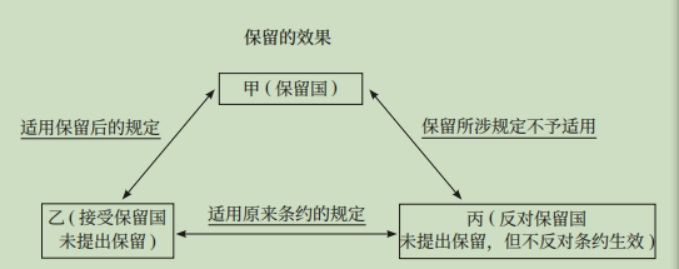
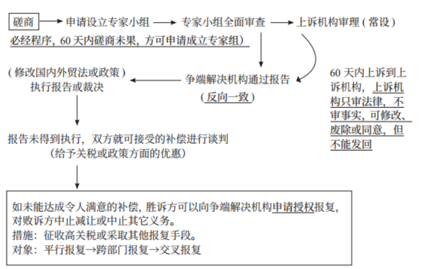

# 三国法

## 目录

1. [条约法](#条约法)
2. [国际法的主体和国际责任](#国际法的主体和国际责任)
3. [国际法上的空间划分](#国际法上的空间划分)
4. [国际法上的个人](#国际法上的个人)
5. [外交特权与豁免](#外交特权与豁免)

## 条约法

一、条约的缔结程序：

1. 签署
2. 批准。条约和重要协定，全人常批准，国家主席签；其他具有条约性质的文件，国务院定，总理或外长签
3. 加入，外长签，其余同 2。
4. 接受和赞同，国务院决定，外长签。

二、条约的登记：任何会员国缔结的一切已生效条约应尽速在联合国秘书处登记，并由秘书处公布；未经登记不得在联合国任何机关援引，但不影响条约本身的法律效力。

三、无须出具全权证书：五种人的正职——政府首脑、外交部长、使馆馆长、驻国际组织或国际会议的代表、以部门名义签订条约的政府部门首长。

四、条约的保留

五、条约的冲突：条约无有效规定，当事国完全相同，后约取代先约；当事国不完全相同，个案处理。

## 国际法的主体和国际责任

一、国家

1. 国家主权豁免：绝对豁免——国家行为不受他国法院管辖，除非国家放弃管辖豁免（自愿、特定、明确），默示放弃（国家诉行为）；相对豁免——非商业行为享有豁免，可放弃。两者在执行豁免上都主张绝对理论。
2. 国际法上的承认：单方行为，对新国家/新政府承认的区别——是否经历领土变更。对新国家的承认原则上不可逆转，对新政府的承认意味着对旧政府承认的撤销。
3. 国际法上的继承：条约继承——只继承领土划界等非人身性条约；债务继承——国家债务、地方化债务（注意不是地方债务）

二、政府间国际组织——联合国

1. 联合国大会：一般问题，简单多数；重要问题，2/3多数。
2. 安理会：程序性事项（表决国际法官人选）——9个同意票；实质性事项（采取行动、推荐秘书长、吸纳新会员、中止会员国义务或开除会籍）——9个同意票+大国一致（弃权/缺席不影响）。双重否决权（是否属于程序性事项、对实质性事项表决）

三、国际责任：国际赔偿责任（行为无违背，但造成他国损害）——国家责任制（外空探索）；双重责任制（核能利用）；营运人责任制（其他领域）。

 

## 国际法上的空间划分

一、领土的构成

1. 领陆：边界制度（界标出现任何问题要在双方代表在场情况下修复或重建）
2. 领水：① 河流。内河（完全主权）；界河（修建设施须经对方同意）；多国河流（归属流经国）；国际河流（归属流经国，对非军用船舶开放）；群岛水域（无害通过制）② 内海。完全主权，外国船舶非经许可不得进入；对港口内外籍船刑事管辖4种。③ 领海。基线以外≤12海里，完全主权；外国船舶有无害通过权。
3. 领空：《芝加哥公约》——领土主权原则；三个反劫机公约（东京、海牙、蒙特利尔）——或引渡或起诉原则。
4. 底土：内海和领海下覆底土。

二、非领土：（1）毗连区：≤24海里，海财移卫和国安（5种），可管制。（2）专属经济区：≤200海里，对自然资源勘探等相关方面有管辖权；拘留、通知、释放（有担保）、渔业不得监禁或体罚。（3）公海：船旗国管辖、普遍管辖（海盗、贩奴、贩毒、非法广播）；临检权和紧追权主体相同，区别在于临检权在公海上提起管辖，紧追权在其他海域提起延伸至公海，先警告再紧追，不能中断，进入他国领海时终止。（4）大陆架：200-350海里的海洋下覆底土部分。

三、无害通过制：船舶（除军用船舶）连续不停迅速通过，除非不可抗力、遇难救助；潜水艇须浮出水面并展示国旗。

 

## 国际法上的个人

一、中国的国籍制度

1. 取得：父母一方或双方为中国公民并定居在国外，本人在外国出生时就具有外国国籍；父母均为无国籍或国籍不明，且已经在中国定居，本人出生即具有中国国籍。
2. 丧失：定居外国+自愿加入或取得，自动丧失；定居外国/外国人近亲属/其他，申请+批准丧失；国家工作人员和现役军人不得退出。

二、出入境管理

1. 拒签：强制出境未过年限；有病；可能有害；签证材料有问题等。
2. 居留：住旅馆，旅馆登记；住其他地方，24小时内，本人或留宿人登记。
3. 非法工作：无工作许可和工作类居留证件；超出许可范围；违反勤工助学管理规定。
4. 限制出境：罪犯或被告人、犯罪嫌疑人；有未了结的民事案件；拖欠劳动报酬等。

三、引渡

1. 引渡基础：条约/互惠承诺
2. 应当拒绝引渡：国民双重政治犯，审完过期军事犯，程序酷刑缺席判。
3. 程序（我国）：引出——高院（最高法指定的）裁定，最高法核准；引入承诺——最高法量刑；最高检限制追诉；外交部联系。
4. 后果：罪名特定；非经引出国同意不得转引渡。

 

## 外交特权与豁免

一、馆舍不得侵犯：未经馆长许可不得进入使馆馆舍；未经馆长同意不得进入领馆工作区，遇紧急情况可推定领馆馆长同意，馆舍及财产确有必要时可征用，应补偿。

 二、外交人员特权与豁免（包括与外交人员同一户口的家属）

1. 人身不得侵犯：除非为防止或制止犯罪行为/正当防卫。
2. 管辖豁免：完全的刑事豁免；例外的民事和行政豁免（私人的不动产物权、继承、商业活动，主动起诉引起的反诉）；免除作证义务；派遣国明示放弃豁免。

三、领事官员的特权与豁免

1. 人身不得侵犯：犯有严重罪行时可逮捕或拘留。
2. 管辖豁免：领事官员执行职务行为，不受接受国司法和行政管辖（例外：未知身份订立契约、交通肇事、主动起诉引起反诉），也无作证义务。

 

（二）国际民商事法律适用

1、直接适用的法（一劳两反三安全）

2、民事主体权利能力与行为能力：①自然人：经常居所地→行为地法律，除了涉及婚姻家庭、继承  ②法人及其分支机构：登记地法→主营业地或登记地法

3、信托：意思自治→信托财产所在地法/信托关系发生地法

4、物权：（1）不动产物权：不动产所在地法

（2）动产物权：①一般动产：意思自治法律法律事实发生时动产所在地法

②运输中的动产：意思自治→运输目的地法  ③船舶所有权、抵押权：船旗国法；光船租赁以前或期间，设立抵押权的，适用原船舶登记国法。船舶优先权：法院地法   ④民用航空器：原则适用登记国法，优先权适用法院地法。

5、合同之债：意思自治原则→最密切联系原则（一般）

（1）消费者合同：意思自治（只能选择商品、服务提供地）→消费者经常居所地法（有经营）→商品、服务提供地法（无经营）

（2）劳动合同：劳动者工作地法/用人单位主营业地法（劳务派出地法）

6、侵权之债：意思自治→共同经常居所地法→侵权行为地法（一般）

例外：船舶碰撞的损害赔偿：侵权行为地法（一般）；法院地法（公海上）；船旗国法（同一国籍）。

7、票据债务人行为能力：一般本国法→例外：行为地法（以本国无或限，以行为地完全）。票据追索权行使：出票地法

8、婚姻关系：（1）结婚手续：婚姻缔结地法、一方当事人经常居所地、国籍国法（任一）  （2）结婚条件：共同经常居所地法→共同国籍国法→婚姻缔结地法（在一方经常居所地/国籍国缔结婚姻）  （3）协议离婚：意思自治（一方经常居所地/国籍国法）→共同经常居所地法→共同国籍国法→离婚机构所在地法

（4）夫妻财产关系：意思自治（一方经常居所地/国籍国法/主要财产所在地）→共同经常居所地法→共同国籍国法

9、收养：条件和手续——收养人和被收养人经常居所地法；效力——收养时收养人经常居所地法；解除——收养时被收养人经常居所地法/法院地法

 

7.30

（一）国际民商事争议解决

1、仲裁协议效力认定

（1）无效情形：超范围、无限人、胁迫

（2）适用法律：意思自治→仲裁机构所在地/仲裁地法（认定不同，确认有效的法）→中国法

2、申请撤销涉外仲裁裁决：收到裁决书之日起6个月内，向仲裁机构所在地中级法院提出；中国法院只能撤销本国裁决，对外国裁决只能拒绝承认和执行。

3、仲裁裁决的承认与执行：向被执行人住所地/财产所在地中级法院申请，2个月内裁定，6个月内执行。层报制度（层报高院、最高院审核）

4、涉外民事案件管辖权：平行诉讼（我国与外国都有管辖权）；不方便管辖（同时、可以）

5、最高人民法院国际商事法庭

（1）管辖案件：书面协议选择+人民币3亿元以上+第一审国际商事案件

（2）证据：域外证据，应当庭质证；英文材料经当事人同意可以不提供中文

6、国际司法协助

（1）域外送达（外向中）

①送达途径：条约、外交、使领馆途径。驻华使、领馆可直接送，但不得违反我国法律，不得采取强制措施。  

②海牙送达公约：外国法院--该国驻华使领馆--司法部--最高法--有关法院--受送达人（经最高院授权的高院可直接对外请求）

（2）中向外：除了公告只能作为兜底性送达途径，其他途径无先后顺序的限制，根据最先实现的送达作为送达日期。

7、域外取证：我国原则上不允许特派员取证、当事人/诉代自行取证。

8、外国判决的承认与执行：当事人/外国法院提出，依据国际条约/互惠原则审查（离婚判决例外，只承认解除夫妻身份关系的内容），只申请承认，仅裁定承认与否。

 

（二）国际货物买卖法

1、贸易术语

（1）国际贸易术语（2000年通则）

①FOB：船上交货；两个通知义务（买方安排运输后通知，卖方货交承运人通知）

②CFR：成本+运费；卖方货交承运人是通知买方

③CIF：成本+保险费+运费；（无特别要求）平安险。

（2）2010年通则新增术语：DAP：运到   DAT：运到+卸下

（3）2020年通则主要修改：①DTA改为DPU：目的地不限，但卖方必须确保其打算交货的地点能够卸货。  ②FCA：增加“可以约定买方指示其承运人在货物装船后向卖方签发已装船提单”。  ③CIF：一切险（无约定）  ④安保费用：谁负责运输谁承担

2、《国际货物销售合同公约》（1980年公约）

（1）适用范围：

①不适用公约的合同：家人拿票据参加拍卖飞电船

②公约不涉及：效力、所有权转移、人身伤亡责任

（2）买卖双方义务

①卖方：交货、交单、质量担保、权利担保【所有权、知识产权（地域限制：买方及时通知义务；免责：推定明知、购方定做）】

②买方：支付货款、接受检验货物（卖方违约：先接收再索赔）

 

 

7.31

（一）国际海上货物运输与保险法

1、提单：具有物权凭证的效力

（1）种类：①收货人不同：记名提单（不能转）、不记名提单（交付转）、指示提单（背书转）  ②倒签提单和预借提单（装船时间不真实，欺诈）

2、无正本提单交货

（1）承运人不赔偿：交给当局、拍卖变卖、（记名提单）改变运输、先单先得

（2）计算方式：成本（装船时的价值）+运费+保险

3、公约中承运人责任

（1）海牙规则：不完全的过失责任制；航行过失、（雇佣人、代理人）火灾过失+无过失免责；装到卸；最低限度义务（适航、管货）。

（2）汉堡规则：完全的过失责任制；无过失免责；接到交；实际承运人与承运人承担连带责任；善意保函在托运人和承运人间为有效。

4、基本险别

（1）平安险：海上风险造成的全部或部分损失，单纯自然灾害造成的单损除外。

（2）水渍险：平安险+自然灾害造成的部分损失

（3）除外责任：被保险人过错；迟延或者市价跌落；货物自有缺陷等

 

（二）国际贸易支付

1、信用证

（1）银行责任：表面审单；单证、单单相符。

（2）银行免责：单据实质、延误遗失、不可抗力、独立等

（3）保兑信用证：保兑行与开证行付款责任相当。

（4）可转让信用证：信用证上明确注明“可转让”，才可以转让。

（5）信用证欺诈的例外：止付令（有管辖权法院发出、有欺诈证据、可靠充分的担保、未善意承兑或付款），48小时作出裁定，实体审判判决终止支付。

总结：开证行对有效信用证可不付款：单证、单单表面不服；法院发出止付令。

 

8.1

（一）我国的贸易救济措施

1、反倾销

（1）反倾销实施条件：①倾销：出口价格<正常价值；  ②损害：实质损害、实际损害威胁或实质阻碍；③因果关系：不要求唯一性；

（2）调查程序：商务部发起（国内产业申请或商务部主动）→初步裁定（终止调查/反倾销临时措施）→终局裁定（取消临时措施，价格承诺/反倾销税）→行政复审（申请或主动）/司法审查（利害关系人向商务部提起行政诉讼）

总结：①原则上只对终局裁定公告后再进口的产品征收； ②实质损害或实质损害威胁且已采取临时措施，可以追溯至实施临时反倾销措施期间；③有倾销历史或进口商明知且短期大量进口，可以追溯至临时措施前90天。

2、反补贴：专项补贴，调查程序同反倾销，承诺主体是出口国政府或经营者。

3、保障措施（针对公平贸易行为）

（1）适用条件：①进口产品数量增加（绝对/相对增加）；②严重损害或严重损害威胁；③因果关系

（2）调查程序：无司法审查，初步裁定非必经程序。其余同反倾销。

（3）措施：初裁-临时保障措施（提高关税）；终裁-保障措施（提税/数量限制）

 

（二）世界贸易组织（	WTO）

1、最惠国待遇原则：普遍性、自动性、相互性、同一性；条款修改须全体成员同意；例外：边境贸易、普遍优惠制度、区域经济安排、反倾销/反补贴税等。

2、服务贸易总协定

（1）方式：跨境交付、境外消费、商业存在、自然人存在。

（2）特点：框架性协定；不适用于为履行政府职能而提供的服务。

3、争端解决的程序

