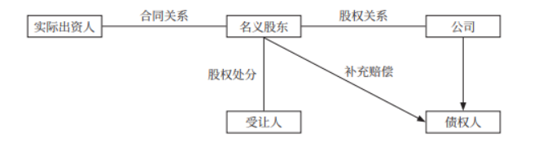

# 商经法

## 目录

1. [有限公司股东资格确认、代持股](#有限公司股东资格确认、代持股)
2. [公司法中的相关诉讼](#公司法中的相关诉讼)
3. [有限公司的股权转让（章程对股权的内外转让可另有规定）](#有限公司的股权转让（章程对股权的内外转让可另有规定）)
4. [公司的解散、清算](#公司的解散、清算)
5. [普通合伙企业的决议、执行、退伙](#普通合伙企业的决议、执行、退伙)
6. [普通合伙人VS有限合伙人](#普通合伙人VS有限合伙人)
7. [破产法中的债务人财产追回](#破产法中的债务人财产追回)
8. [破产取回权](#破产取回权)
9. [破产清算、重整、和解程序](#破产清算、重整、和解程序)
10. [票据的抗辩、背书、保证](#票据的抗辩、背书、保证)
11. [保险合同中的受益人](#保险合同中的受益人)
12. [人身保险合同](#人身保险合同)
13. [财产保险合同](#财产保险合同)
14. [典型不正当竞争行为](#典型不正当竞争行为)
15. [消费者法中的争议解决及产品责任](#消费者法中的争议解决及产品责任)
16. [商业银行](#商业银行)
17. [劳动合同的内容与解除](#劳动合同的内容与解除)
18. [工伤保险](#工伤保险)
19. [著作权](#著作权)
20. [专利权](#专利权)
21. [注册商标侵权行为](#注册商标侵权行为)

## 有限公司股东资格确认、代持股

一、股东资格确认规则：对外以公司登记为准；对内以股东名册为准。（出资证明书和公司章程因其自身缺陷，仅具有证据效力。）

> 【注意】公司章程约束公司、股东和董监高；修改章程的，需经代表2/3以上表决权的股东通过。章程变更后，董事会应向工商行政管理机关申请变更登记。

二、代持股

 

1. 合同关系：合同效力依合同法规则确定，公司法并不禁止。
2. 股权关系：名义股东具有股东资格；实际出资人想要成为公司股东的，一般应经其他股东过半数同意。
3. 股权处分：定性为有权处分，善意第三人可取得股权或股权质权。由此给实际出资人造成损失的，可请求名义股东承担违约赔偿责任。

> 【注意】冒名出资不适用上述规定，由冒名者担责，被冒名者并无权利义务。

 

## 公司法中的相关诉讼

一、股东代表诉讼

1. 诉因：董监高或他人害公司，给公司造成损失。

2. 当事人：原告为股东（有限公司：所有股东；股份公司：连续180日单独或合计持有公司1%以上股份的股东）；被告为害公司的董监高或他人；法院受理的，应通知公司作为第三人参加。

3. 前置程序

   书面交叉请求：对于董事、高管，股东书面请求监事（会）起诉；对于监事，书面请求董事会（执行董事）起诉；对于他人，书面请求董事会（执行董事）或监事（会）起诉。

   上述人员拒绝起诉或收到请求30日内未起诉，或情况紧急、不立即起诉会给公司造成难以弥补的损害，股东有权起诉。（胜诉利益归公司）

二、公司决议之诉

1. 决议类型（重点掌握可撤销和不成立的情形）
   - 无效：决议内容违反法律、行政法规；有效：内容和程序均合法合章。
   - 可撤销：召集程序、表决方式违反法律、行政法规或章程；决议内容违反章程。（但召集程序、表决方式仅有轻微瑕疵 + 不对决议产生实质影响，不予撤销）
   - 不成立：未开会、未表决、未达比例。

2. 公司决议之诉

   ① 原告：撤销之诉原告为股东；不成立、无效之诉原告为：股东、董事和监事。

   ​     被告：公司。第三人：决议涉及的其他利害关系人。

   ② 除斥期间：撤销之诉为决议作出60日内；其他类型不受限。

三、股东分红权之诉

1. 条件：存在有效的利润分配决议；股东请求分红被拒绝；公司关于无法执行决议的抗辩理由不成立。
2. 当事人：原告为股东，被告为公司。一审法庭辩论终结前，其他股东基于同一分配方案请求分红并申请参诉的，列为共同原告。
3. 分配时间：分配决议有规定的，依决议；决议未规定，以章程为准；决议和章程均未规定或有规定但时限超过1年的，应在1年内分配完毕。

 

 ## 有限公司的股权转让（章程对股权的内外转让可另有规定）

一、对内转：自由。无需通知其他股东或经其同意，无优先购买权。

二、对外转：通知 + 其他股东同意 + 优先购买权

1. 通知：书面或其他可确认收悉的合理方式。
2. 同意：应经其他股东过半数同意。接到通知30日内未答复的，视为同意；半数以上不同意的，应购买，不购买的视为同意转让。
3. 优购权：需注意同等条件的确定。多个股东主张优先购买的，协商确定比例；协商不成的，按转让时各自的出资比例行使。

三、强制执行（执行主体为法院）：通知 + 优先购买权

通知公司 + 全体股东；其他股东同等条件有优购权，但自法院通知之日起满20日不行使的视为放弃。

四、股权回购

1. 条件：5年连续盈利 + 5年不分红 + 符合法定分红条件；合并、分立或转让主要财产；章定的营业期限届满或出现其他解散事由，但股东会决议修改章程使公司存续。（符合其一即可）
2. 主体：投反对票的股东。
3. 期限：股东会决议通过之日起60日内，股东未与公司达成股权收购协议的，股东可自决议通过之日起90日内起诉。

 

## 公司的解散、清算

一、司法解散（判决解散）

1. 条件：公司僵局，经营管理发生严重困难，继续存续会严重损害股东利益，其他途径无法解决。
2. 当事人：
   - 原告为单独或合计持有全体股东表决权10%以上的股东。
   - 被告为公司。其他股东可作为共同原告或第三人参诉。

3. 解散与清算：股东既提起司法解散之诉，又申请法院对公司进行清算的，法院不予受理其清算申请。

二、清算

1. 强制性：公司未经清算，不得注销。但因合并、分立导致的解散无需清算。
2. 清算中公司：不得开展与清算无关的经营活动。与公司有关的民事诉讼，仍以公司名义进行，由清算组负责人代表公司参诉；未成立清算组的，仍由原法定代表人代表公司参诉。
3. 清偿债务：公司财产足够清偿债务的，，清算组应先拨付清算费用，然后按顺序清偿：职工工资、社保、法定补偿金 -> 所欠税款 -> 公司债务。

4. 清算终结：公司自行清算的，清算方案应报股东（大）会决议确认；法院组织清算的，清算方案应报法院确认。清算方案未经确认，清算组不得执行。

 

 ## 普通合伙企业的决议、执行、退伙

一、决议（合伙协议另有约定除外）

1. 一般事项：全体合伙人过半数通过（一人一票）。

2. 特别事项：需经全体合伙人一致同意。（简记：改三处二，担外协议）

   改变企业名称、经营范围、主要经营场所的地点；处分（转让）企业不动产、知识产权或其他财产权利；以企业名义为他人提供担保；聘任合伙人之外的人担任企业经营管理人员；修改、补充合伙协议；对外转让合伙份额等。

3. 决议效力：未按上述方式表决的决议无效，但不影响善意第三人的权利。

二、执行

1. 内部限制不对外，合伙企业仍需承担合伙人越权行为的后果。
2. 盈亏负担：顺序为合伙协议约定 -> 协商 -> 实缴出资比例 -> 平均分配。

三、退伙

1. 当然退伙（简记：死终没钱无限人）：自然人（宣告）死亡；个人丧失偿债能力；法人或其他组织终止；全部财产份额被法院强制执行；被认定为无、限制行为能力人，其他合伙人未能一致同意其转变为有限合伙人。退伙事由实际发生之日为退伙生效日。
2. 除名退伙（须经其他合伙人一致同意）：未履行出资义务；因故意或过失给合伙企业造成损失；执行合伙事务时有不正当行为。（简记：不给钱，干坏事）

 

## 普通合伙人VS有限合伙人

1. 行为能力。普合人须有完全民事行为能力；有合人无限制。

2. 对外责任。普合人无限连带；有合人以认缴的出资额为限担责。

3. 劳务出资。普合人允许劳务出资；有合人不允许。

4. 权益质押。普合人须经全体合伙人一致同意方可质押；有合人质押无限制。

5. 权益转让。普合人须经全体合伙人一致同意；有合人须按约定提前30天通知。

【注意】有限合伙与普通合伙的转换

1. 有合企业仅剩普合人，则须转为普合企业 + 变更登记。

2. 有合企业仅剩有合人，不再是合伙企业，应当解散。

3. 经全体合伙人一致同意，普合人、有合人可相互转换。

   有合人转为普合人的，对其作为有合人期间企业发生的债务承担无限连带责任；普合人转为有合人的，对其作为普合人期间企业发生的债务承担无限连带责任。

 

 ## 破产法中的债务人财产追回

一、可撤销行为（破产申请受理前1年内）

1. 无偿转让财产或放弃债权；
2. 明显不合理价格交易；
3. 无担保的债务提供财产担保；
4. 对未到期债务提前清偿（但该债权在破产申请受理前已到期除外）。

【重点】破产申请受理前6个月：债务人具备破产原因 + 个别清偿 -> 管理人可请求法院撤销，但该清偿使债务人财产受益的除外（为维持基本生产支付的水电费；劳动报酬、人身损害赔偿金；经诉讼、仲裁、执行程序对债权人的个别清偿）。

二、无效行为：为逃避债务隐匿、转移财产；虚构债务或承认不真实债务。

三、特别追回权：董监高利用职权从企业获取的非正常收入和侵占的企业财产。

 

## 破产取回权

一、一般取回权

在变价方案、和解协议或重整计划草案提交债权人会议表决前向管理人提出。超期行使的，要承担延迟取回所增加的费用。权利人行使取回权时，未依法向管理人支付加工费、保管费、托运费、委托费等，管理人可拒绝。

二、出卖人取回权

法院受理破产申请 + 出卖人已发运 + 债务人未收到且未付清全款 -> 出卖人可取回在途标的物。但管理人可支付全部价款，请求出卖人交付标的物。

三、所有权保留买卖中的取回权

1. 买方破产 + 合同解除 -> 卖方可取回标的物 + 应返还价款
2. 买方破产 + 合同继续履行 -> 买方不付款或不当处分，卖方可取回标的物，但买方已支付总价款75%以上或第三人已善意取得标的物所有权的除外。

 

## 破产清算、重整、和解程序

一、破产清偿顺序（需优先清偿破产费用和共益债务）

职工债权和划入个人账户的社保费 -> 前项之外的社保费和税款 -> 普通破产债权。

二、重整程序

1. 重整启动。初始重整申请：债权人或债务人可直接申请。

   后续重整申请：债权人申请破产清算，在债务人破产宣告前，债务人或出资额占债务人注册资本1/10以上的出资人可申请重整。

2. 营业保护：①担保权暂停行使+②新设担保+③取回权受限+④股东权受限

3. 重整计划表决：分组表决。

   ① 每一组内，出席会议的同一表决组的债权人过半数同意 + 所代表的债权额占该组债权总额的2/3以上，则该组通过。

   ② 每组都通过，则重整计划通过。

   ③ 表决通过后须经法院批准，表决未通过的法院可强行批准。

三、和解程序

1. 和解启动。只有债务人可申请和解，且应提出和解协议草案。
2. 和解协议表决。出席会议的有表决权的债权人过半数同意 + 所代表债权额占无担保债权总额2/3以上。法院认可后生效。

3. 宣告破产：和解协议未通过或未获法院认可；和解协议因债务人欺诈或其他违法行为被法院裁定无效；债务人不能执行或不执行和解协议。

 

## 票据的抗辩、背书、保证

一、票据的抗辩

1. 对物抗辩（简记为：事不全、人无权、票据坏、法院来）：欠缺法定必要记载事项；票据本身存在瑕疵（被伪造、变造）；背书不连续；法院的除权判决已生效；无、限制民事行为能力人的签章无效。
2. 对人抗辩（简记为：直接债务取得不当）：非法、恶意、重大过失取得票据；持票人与票据债务人有直接债权债务关系且不履行约定义务；明知票据债务人与出票人或与持票人的前手之间存在抗辩事由抗辩事由而取得票据。

二、汇票的背书

1. 附条件背书：背书不得附条件；附有条件的，该条件不具有汇票上的效力。
2. 回头背书：持票人为出票人，对其前手无追索权；持票人为背书人，对其后手无追索权。

三、保证

1. 关于被保证人的确定：前提为保证人未记载被保证人名称。

   已承兑的汇票，承兑人为被保证人。未承兑的，出票人为被保证人。

2. 附条件：保证不得附条件；附有条件的，不影响对汇票的保证责任。

3. 连带责任：保证人不享有先诉抗辩权；2名以上保证人之间承担连带责任。

 

## 保险合同中的受益人

一、范围：受益人无身份或行为能力限制。投保人、被保险人可成为受益人。（投保人为与其有劳动关系的劳动者投保人身险，不得指定被保险人及其近亲属以外的人为受益人。）

二、指定：受益人由被保险人指定，或经被保险人同意由投保人指定。

三、争议处理（另有约定除外）

1. 受益人约定为“法定”或“法定继承人”：以继承法规定的法定继承人为受益人。
2. 受益人仅约定为身份关系：投保人与被保险人为同一主体的，根据保险事故发生时与被保险人的身份关系确定受益人；非同一主体，根据保险合同成立时与被保险人的身份关系确定受益人。
3. 受益人约定包括姓名和身份关系，保险事故发生时身份关系发生变化的，认定为未指定受益人。

四、受益权丧失（简记为：杀死伤残）：受益人故意杀害被保险人未遂，或故意造成被保险人死亡、伤残、疾病。

五、受益权转让（简记为：前不转后转）：保险事故发生前，受益权不得转让；保险事故发生后，受益人可转让部分或全部保险金请求权。

 

 ## 人身保险合同

一、死亡险限制：（1）行为能力限制+（2）被保险人同意+（3）保单转让、质押

1. 投保人不得为无民事行为能力人投保死亡险，保险人也不得承保。但父母可为未成年子女投此类险。
2. 未经被保险人同意并认可保险金额，以死亡为给付保险金条件的合同无效（父母为未成年子女投保的除外）。
3. 未经被保险人书面同意，保单不得转让、质押。

> 【注意】父母之外的其他履行监护职责的人为未成年人订立死亡险合同的，该合同无效，但经未成年人父母同意的除外。

二、中止与复效（缴费日+宽限期=中止日，中止日+中止期2年=解除日）

1. 宽限期：合同约定；或保险人催告之日起30天；或缴费日起60天。

   宽限期内发生保险事故的，应给付保险金，但可扣减欠交的保费。

2. 中止期：最长2年。2年之后，保险人有权解除合同。

   投保人提出复效申请+同意补交保费，除被保险人的危险程度在中止期间显著增加外，保险人不得拒绝。

> 【注意】保险人收到复效申请+30日内未明确拒绝=同意复效。保险合同自投保人补交保费时恢复效力。

三、保险金给付

1. 给付顺序：受益人或其继承人--被保险热--被保险人的继承人。

2. 保险金继承：被保险人死亡后，有下列情形的，保险金作为被保险人遗产：

   ① 未指定受益人或指定不明；

   ② 受益人先于被保险人死亡，无其他受益人（受益人与被保险人在同一事件中死亡，且不能确定死亡先后顺序，推定受益人先死亡）；

   ③ 受益人丧失或放弃受益权，无其他受益人。

 

## 财产保险合同

一、代位求偿权（仅适用于财产保险）

三方关系：保险人与被保险人——保险金请求权；被保险人与第三人——民事赔偿请求权；保险金与第三人——代位求偿权

1. 被保险人选择权及其限制：可要求第三人或保险人赔偿。已从第三人取得损害赔偿的，保险人赔偿保险金时，可相应扣减。保险人行使代位求偿权，不影响被保险人就未赔偿部分向第三人请求赔偿。
2. 保险人代位求偿权及限制：只有在向被保险人支付了保险金后才可行使。

不得向被保险人的家庭成员或组成人员的非故意行为追偿。此处的“家庭成员”包括：保险事故发生时，与被保险人共同生活的配偶、父母、子女、兄弟姐妹、（外）祖父母、以及与被保险人有抚养、赡养、扶养关系的人。“组成人员”包括其工作人员、劳务派遣人员。

二、保险标的转让

1. 自动承继原则

   受让人承继被保险人的权利义务；保险标的已交付受让人，但未办理所有权变更登记，（承担保险标的毁损灭失风险的）受让人可主张行使保险人权利。

2. 通知义务

   被保险人或受让人应及时通知保险人，但货物运输保险合同和另有约定的除外。如未通知，因转让导致保险标的危险程度显著增加而发生的保险事故，保险人不赔偿保险金。

> 【注意】因保险标的转让导致危险程度显著增加的，保险人自收到通知之日起30日内，可依合同约定增加保费或解除合同。

 

## 典型不正当竞争行为

一、混淆行为。引人误认是他人商品或与他人存在特定联系，如擅自使用他人有一定影响的商品名称、包装、装潢、企业名称、社会组织名称、姓名等；擅自使用他人有一定影响的域名主体部分、网站名称、网页等。（一定影响+名称包装）

二、商业贿赂行为。采用财物或其他手段贿赂下列单位、个人，以谋取交易机会或竞争优势：交易相对方的工作人员；受交易相对方委托办理事务的单位、个人；利用职权或影响力影响交易的单位或个人。

三、虚假宣传。重点掌握自我虚假宣传：对其商品的功能、质量、销售状况、用户评价、曾获荣誉等作虚假或引人误解的商业宣传。（商品相关+引人误解）

四、侵犯商业秘密行为。

1. 商业秘密：不为公众知悉+有商业价值+权利人采取保密措施。
2. 侵犯行为：以盗窃、贿赂、欺诈、胁迫等非法手段获取商业秘密；披露、使用或允许他人使用以前项手段获取的商业秘密；第三人明知或应知商业秘密权利人的员工、前员工、其他单位、个人实施上述违法行为，仍获取、披露、使用或允许他人使用该商业秘密等。

五、互联网不正当竞争行为

1. 未经其他经营者同意，在其合法提供的网络产品或服务中，插入链接、强制进行目标跳转。
2. 误导、欺骗、强迫用户修改、关闭、卸载其他经营者合法提供的网络产品或服务。
3. 恶意对其他经营者合法提供的网络产品或服务实施不兼容。

 

## 消费者法中的争议解决及产品责任

一、争议解决途径和规则

1. 解决途径：和解、调解、投诉、仲裁、诉讼。
2. 公益诉讼：侵害众多消费者合法权益的，中国消费者协会和在省级消费者协会，以及法律规定或全国人大及其常委会授权的机关和社会组织，可以提起公益诉讼。
3. 使用他人营业执照：消费者可向违法经营者或执照持有人要求赔偿。
4. 展销会、租赁柜台：可向销售者或服务者要求赔偿。展销会结束或柜台租赁期满后，也可以向展销会的举办者、柜台的出租者要求赔偿。展销会的举办者、柜台的出租者赔偿后，有权向销售者或服务者追偿。
5. 举证责任：正常情况下，由消费者对瑕疵承担举证责任。但是，经营者提供的耐用商品或者装饰装修等服务，消费者自接受商品或者服务之日起6个月内发现瑕疵，发生争议的，由经营者承担有关瑕疵的举证责任。

二、产品责任（侵权责任）

1. 构成要件：产品存在缺陷；造成他人损害；缺陷与损害之间存在因果关系。

2. 归责原则：

   生产者——无过错责任。例外情形：① 未将产品投入流通的；② 产品投入流通时，引起损害的缺陷尚不存在的；③ 将产品投入流通时的科学技术水平尚不能发现缺陷的存在的。   

   销售者——过错责任。

3. 权利期间：因产品缺陷造成损害要求赔偿的请求权，在造成损害的缺陷产品交付最初消费者满10年丧失；但是，尚未超过明示的安全使用期的除外。

 

## 商业银行

一、商业银行（安全性、流动性、效益性）的业务

1. 业务范围：经营范围由商业银行章程规定，报国务院银行业监督管理机构（银监会）批准。不得从事信托投资和证券经营业务等营利性活动，但国家另有规定的除外。商业银行因行使抵押权、质权而取得的不动产或股权，应当自取得之日起2年内予以处分。
2. 存款业务：企业事业单位可以自主选择一家商业银行的营业场所开立一个办理日常转账结算和现金收付的基本账户，不得开立两个以上基本账户。
3. 同业拆借：禁止利用拆入资金发放固定资产贷款或用于投资。拆出资金限于交足存款准备金、留足备付金和归还中国人民银行到期贷款之后的闲置资金。拆入资金用于弥补票据结算、联行汇差头寸的不足和解决临时性周转资金需要。

二、组织和管理机制

1. 设立：银监会批准+注册资本（实缴资本）。法律规定了最低注册资本限额（银监会可调高）。6个月未开业或连续停业6个月，由银监会吊销经营许可证并公告。
2. 分支机构：① 不具有法人资格，在总行授权范围内依法开展业务，其民事责任由总行承担。② 设立分支机构必须经银监会审查批准。
3. 接管：商业银行已经或者可能发生信用危机，严重影响存款人的利益。由银监会决定接管，并组织实施（实务中和中国人民银行共同决定）。被接管的商业银行，正常营业，债权债务关系不变。但是，自接管开始之日起，由接管组织行使商业银行的经营管理权力。接管期限由银监会可以决定，可延期，但最长不得超过2年。

 

## 劳动合同的内容与解除

一、劳动合同的内容

1. 试用期

   非全日制用工、完成一定工作任务、劳动合同期限小于3个月，不得约定试用期；

   劳动合同期限为大于等于3个月、小于1年，试用期不超过1个月；

   劳动合同期限为大于等于1年、小于3年，试用期不超过2个月；

   合同期限大于等于3年或无固定期限合同，试用期不超过6个月。

   同一用人单位与同一劳动者只能约定一次试用期。试用期的工资不得低于本单位相同岗位最低档工资/劳动合同约定工资的80%，并不得低于用人单位所在地的最低工资标准。

2. 竞业限制（约定义务）：用人单位的高管、高级技术人员和其他负有保密义务的人员。最长为劳动合同解除或终止后2年。

二、劳动合同的解除

1. 劳动者单方解除

   ① 无条件的，提前30日书面通知（试用期内提前3天），无经济补偿；

   ② 单位过错的，通知解除或立即解除，有经济补偿。

2. 用人单位单方解除

   ① 劳动者在试用期不符合录用条件/劳动者过错，事先通知工会，无经济补偿；

   ② 客观原因，通知工会，提前30天书面通知劳动者或额外支付1个月工资，有经济补偿；

   ③ 经济性裁员，提前30天向工会或全体职工说明情况，并报劳动部门备案，有经济补偿。

3. 合同终止

   ① 合同期满，单位维持或提高条件续订合同，劳动者不同意的无经济补偿；

   ② 劳动者开始依法享受基本养老保险待遇或达到法定退休年龄；劳动者死亡，或被法院宣告死亡、失踪；

   ③ 单位被宣告破产、吊销营业执照、责令关闭、撤销或用人单位决定提前解散。

 

## 工伤保险

一、工伤认定。工作时间+工作场所+工作原因受到事故伤害，应认定为工伤。但故意犯罪、醉酒、吸毒、自残、自杀等，不认定为工伤。工伤或患职业病+工伤认定的，享受工伤保险待遇；经鉴定丧失劳动能力的，享受伤残待遇。

二、用人单位负担的费用：工伤治疗期间的工资福利；五、六级伤残津贴；终止或解除劳动合同时，应当享受的一次性伤残就业补助金。

三、工伤保险基金负担的费用：医疗费、康复费、交通食宿费（统筹地区以外就医）、伙食补助费、生活护理费、劳动能力鉴定费；一次性伤残补助金和一至四级伤残津贴；终止或解除劳动合同时，应当享受的一次性医疗补助金。

四、特殊情况

1. 单位未缴费，发生工伤事故的，由用人单位支付工伤保险待遇。用人单位不支付的，从工伤保险基金先行支付。
2. 第三人造成工伤：第三人不支付工伤医疗费或无法确定第三人的，由工伤保险基金先行支付（支付后可向第三人追偿）。

五、停止享受工伤待遇：丧失享受待遇的条件；拒不接受劳动能力鉴定；拒绝治疗。

 

## 著作权

一、著作权的内容

1. 著作人身权（一般不能继承、转让、强制执行，无期限限制）：发表权（公之于众）+署名权+修改权（自己改或授权他人改）+保护作品完整权。

2. 著作财产权（简记为：复发租展放演、两播两编翻摄）：复制权、发行权、出租权、展览权、表演权、放映权、广播权、信息网络传播权、摄制权、汇编权、改编权、翻译权。

   表演权：公开（现场）表演和机械表演。前者如诗歌戏剧、音乐舞蹈、曲艺杂技等，后者如酒店、影院、咖啡店等经营性单位未经许可播放背景音乐（侵犯作者的机械表演权）。

   信息网络传播权：侵权行为可分为两类：作品提供行为、网络服务提供行为。

   注意避风港原则：网络服务提供者不负担主动审查义务，但应通知+立即删除、反通知+立即恢复。

二、著作权的合理使用

1. 构成要件：已发表作品+法律明文规定+不必征得许可、不必支付费用+指明作者姓名、作品名称，且不得侵犯著作权人其他权利。
2. 常见情形：为个人学习研究或欣赏；为报道时事新闻，在报纸、期刊、广播电台、电视台等媒体中不可避免地再现或引用；为学校课堂教学或科学研究，翻译或少量复制已发表作品，供教学或科研人员使用；将已发表作品改为盲文出版；将中国公民、法人、其他组织已发表的以汉语言文字创造的作品翻译成少数民族语言文字作品在国内出版发行。图书馆、纪念馆、博物馆等为陈列或保存版本的需要，复制本馆收藏的作品。

 

 ## 专利权

一、专利申请

1. 国际优先权：发明或实用新型在外国第一次提出专利申请12个月内（外观设计为6个月），又在中国就相同主题提专利申请，可享有优先权。

2. 发明专利申请的审批：初审+早期公开+实质审查+授权公告

   初审：审查形式要求和有无明显的实质性缺陷。

   早期公开：初审符合要求+申请日起满18个月，即行公布。

   实质审查：是否符合专利权授予的实质要件+自申请日起3年内。

   授权公告：实质审查无驳回理由，决定授予发明专利权+登记公告。发明专利权自公告之日起生效。

二、专利权的限制

1. 滥用专利权，如不实施（专利权被授予满3年且提出专利申请满4年）+消除垄断。
2. 不视为侵犯专利权：现有技术抗辩；非商业使用（专为科学研究和实验而使用）；先用权（专利申请日前已制造相同产品+仅在原有范围继续制造、使用）；专利用尽；行政审批；临时过境（临时通过中国领陆、领水、领空+国际条约或互惠原则+为运输工具需要而使用专利）。

三、专利侵权行为（直接+间接）

直接侵权：未经许可为生产经营目的，实施他人专利。

间接侵权：帮助+教唆侵权。

善意侵权：为生产经营目的+使用、销售、许诺销售+不知道属于专利侵权产品+可证明产品合法来源→停止侵权，不承担赔偿责任。（已支付合理对价的善意使用者不必停止使用）

 

## 注册商标侵权行为

一、假冒（同种商品相同商标）、仿冒（同种商品近似商标、类似商品相同商标、类似商品近似商标）、反向假冒（未经同意更换他人注册商标后又投入商场）。

二、销售侵权：销售侵犯注册商标专用权的商品。

三、标识（伪造、擅自制造他人注册商标标识或销售前述标识）、商号（将他人注册商标相同或相近似的文字作为企业字号在相同或类似商品上突出使用+易使公众误认）、域名侵权（类似于商号的侵权行为）。

四、商品名称、装潢侵权（同一或类似商品+使用与他人注册商标相同或相近的标志+误导公众）

五、责任

1. 确定方法：实际损失——侵权获利——商标许可使用费的倍数

   > 【注意】上述方法仍难以确定的，由法院根据侵权情节判决给予500万以下赔偿。（当事人也可协议确定赔偿数额）

2. 不予赔偿：① 不知其所售商品侵犯注册商标专用权+可证明自己合法取得、可说明提供者。② 注册商标专用权人不能证明此前3年内实际使用过该商标+不能证明因侵权行为受到其他损失。

六、商标的合理使用：含有本商品通用名称、图形、型号，或直接表示商品质量、主要原料、功能、用途、数量等，无权禁止他人正当使用。

> 【注意】关于驰名商标的使用限制：生产者、经营者不得将“驰名商标”字样用于商品、商品包装或容器上，或用于广告宣传、展览等商业活动。

