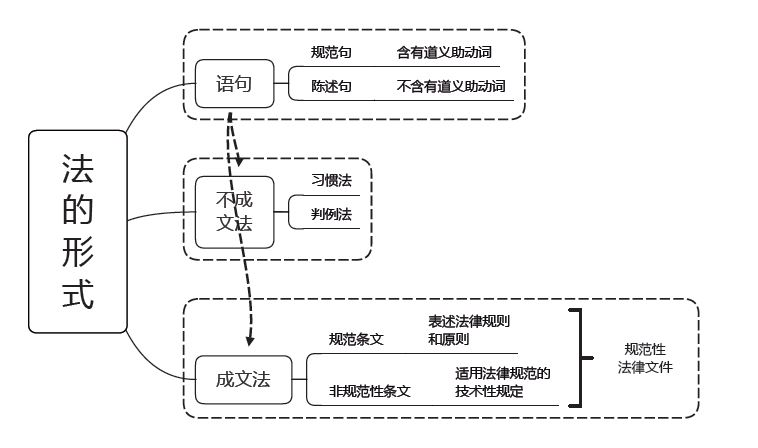

# 理论

## 目录

1. 法理学
   - 法的本体
     - [法律的概念及本质](#法律的概念及本质)
     - [法律的作用及特征](#法律的作用及特征)
     - [法律的价值及冲突解决](#法律的价值及冲突解决)
     - [法律规范（法律规则+法律原则）](#法律规范（法律规则+法律原则）)
     - [法律渊源](#法律渊源)
     - [法律的效力](#法律的效力)
     - [法律关系](#法律关系)
     - [法律责任](#法律责任)

   - 法的运行
     - [法的实施](#法的实施)
     - [法适用的一般原理](#法适用的一般原理)
     - [法律推理](#法律推理)
     - [法律解释](#法律解释)

   - [法律演进](#法律演进)

   - 法与社会
     - [法与道德](#法与道德)
     - [法与人权](#法与人权)

   - [立法法](#立法法)

2. 宪法

## 法律的概念及本质

- 道德必备非实证，实证主义没道德。**自然法学**看道德，不道德的不是法。**分析法学**看来源，出自国家才是法。**法社会学**看实效，有实效的都是法。**现实法学**重现实，真法只在判决中。何谓**道路第三条**？来源实效加道德。

  > 非实证主义法学：自然法学、第三条道路
  >
  > 实证主义法学：分析法学、法社会学、现实法学

- 马克思主义关于法的本质学说：统治工具阶级性；物质制约社会性。

  > 在阶级对立的社会中法律体现统治阶级的意志，但是并不是仅仅体现的统治意志。
  >
  > 法律体现统治阶级意志，但是这种意志是统治阶级的共同意志，并非是统治阶级内部各党派、集团及每个成员意志的相加。

- “国法”分四类：国家制定成文法；国家认可习惯法；法院创制判例法；其它职能类似法。

## 法律的作用及特征

**法的特征：**

1. 调整人的行为的一种社会规范

   > 两层含义：(1) 对象不特定；(2) 适用可反复。
   >
   > 法典属于规范性法律文件，因为法典针对的对象是不特定的，在同样的情况下是可以反复适用的。根据法律作出的判决书针对对象特定，且不能反复使用，属于非规范性法律文件。

2. 由公共权力机构制定或认可的具有特定形式的社会规范

   > 具体认可、抽象认可

3. 具有普遍性的社会规范

4. 以国家强制力保证其实施的社会规范

5. 具有严格、明确的程序的社会规范

6. 可诉的规范体系，具有可诉性

   > 可诉性要素有二：对公民可争讼；对法院可裁判。

**法的作用对象：**

1. 法律作用的对象只能是人的行为，而不规制人的思想。

2. 法律作用的行为是人与人之间的交互行为，人与人之间的交互行为构成了社会关系，故也可以说法律调整的对象是社会关系，经过法律调整的社会关系就是法律关系。

**法的规范作用：**指引自己，评价别人，预测后果，强制犯罪，教育大众

1. 指引作用的基本结构：① 针对本人；② 针对未发生之行动（将要发生的行动）
2. 评价作用的基本结构：① 针对他人；② 针对已发生之行动；③ 以法律为判断标准，因此判断结果为“合
   法/违法”，而不是“对/错”
3. 教育作用的基本结构：① 针对不特定的一般人（包括本人和他人）；② 针对已发生之行动（司法，执法
   或守法的具体事例）
4. 预测作用的基本结构：① 相互性：一般是处于法律关系当中的主体、相互针对对方进行预测；② 针对
   未发生之行动
5. 强制作用的基本结构：① 针对违法犯罪分子；② 针对已发生的违法犯罪行为

**法的社会作用：**

- 三个领域：社会经济生活、政治生活、思想文化生活
- 两个方向：政治职能（阶级统治）、社会职能：（社会公共事务）

> 规范作用是手段，社会作用是目的。

**法的作用的局限性**

## 法律的价值及冲突解决

**法的价值种类：**

1. 秩序
2. 自由
3. 正义
4. 人权

> 秩序基础但非最高。自由最高但要受限。一视同仁形式正义，保护弱者实质正义。

**法的价值冲突的解决原则：**

1. 价值位阶原则：价值位阶就是价值**排序**

   > 自由 > 正义 > 秩序，只要涉及了排序就是价值位阶；同一位阶的价值冲突，适用个案平衡原则

2. 个案中的比例原则

   > 区分比例原则与价值位阶原则：价值位阶 + 必要限度 = 比例原则

**事实判断与价值判断：**

1. 价值判断：特定价值立场（因人而异）
2. 事实判断：客观事实描述（不因人而异）

## 法律规范（法律规则+法律原则）

**法律规则逻辑结构：**

1. 假定条件
2. 行为模式
3. 法律后果

> 消极义务与积极义务的区分关键在于行为模式的不同，“应为”是消极，“勿为”是积极

**法律规则的分类（5星）：**

1. 内容规定不同：
   - 授权性规则
     - 职权性规则
     - 权利性规则
   - 义务性规则
     - 命令性规则
     - 禁止性规则
2. 内容确定性程度不同
   - 确定性规则
   - 委任性规则：委托
   - 准用性规则：指向
3. 限定范围和程度不同
   - 强行性规则
   - 任意性规则

4. 功能不同
   - 行为规则：指示行为人
   - 裁判规则：指示法官

**法律原则含义：**

- 原则指导规则，原则是规则的上位规范，规则应当符合原则。

**法律原则分类：**

1. 产生基础
   - 公理性原则
   - 政策性原则
2. 覆盖面（适用范围）
   - 基本原则
   - 具体原则
3. 内容（问题）不同
   - 实体性原则
   - 程序性原则

**法律规则和法律原则区别：**

1. 法律规则：”应该做”，“全有或者全无”，须优先考虑
2. 法律原则：“应该是”，弥补规则漏洞

**法律原则的适用方式：**

1. 穷尽规则，方得适用法律原则
2. 为了个案正义，才能舍规则用原则
3. 没有更强理由，不得径行适用法律原则

> 原则指导规则，优先适用规则，原则填补规则空白，克服规则僵硬性。

**法律概念的含义：**

- 任何具有法律意义的概念

**法律概念的功能：**

1. 表达功能
2. 认识功能
3. 改进提高法学功能

> 法律概念是解决法律问题的重要工具，但是法律概念不能单独适用

**法律概念的分类：**

1. 定义要素是否确定：
   - 确定性概念
   - 不确定的概念
2. 定义要素关系：
   - 分类概念
   - 类型概念
3. 功能：
   - 描述概念
   - 评价概念
   - 论断性概念

**公法、私法、社会法：**

1. 公法与私法：大陆法系的一项基本分类。古罗马法学家乌尔比安提出。现在公认的公法部门包括宪法和行政法等，私法包括民法和商法等。
2. 社会法：社会发展形成。介于公法和私法之间。

**法律规范的表达：**

> 所有的法律规范（包括法律规则和法律原则）都是通过法律语句的形式表现出来的。法律具有语言的依赖性，语言之外不存在法律

## 法律渊源

**正式解释：**在中国特指立法解释、司法解释和行政解释

**非正式渊源：**当代中国主要有判例、习惯、国家政策等

**法律权利：**国家通过法律规定对法律主体可以自主决定作出或者不作出某种行为的许可。因此，法律权利具备法律性（法定性），即应当由法律加以明确规定。

**总结：**

- 上、下法矛盾，适用上，但无权撤销下

- 设证推理是由果推因的逆向推理，主要的适用场合就是刑事侦查领域

- 《商标法实施条例》由国务院制定，属于行政法规；《关于审理商标民事纠纷案件适用法律若干问题的解释》由最高人民法院公布，属于司法解释。行政法规的效力要低于法律，因此《商标法实施条例》的效力要低于《商标法》；司法解释的对象是狭义的法律，并不包括对行政法规的解释，且母法和子法使用针对的对象是特定的，往往用来形容**宪法**和宪法之外其他普通法律的关系。
- 全国人大常委会和国务院之间属于监督关系，监督关系只能审查合法性，不能审查合理性，只能撤销，不能改变。

## 法律部门与法律体系

**法律部门：**

- 调整对象相同和调整方法相同的法律规范构成一个法律部门。

**法律体系：**

- 只包括现行有效的国内法和被本国承认的国际条约和国际惯例。

**总结：**

- 自治条例与单行条例是有民族自治地方的人民代表大会制定的规范性法律文件

- 行政法部门是指由所有调整行政管理关系的法律规范所组成的集合体，因此其范围比行政法规要大的多

  > 不仅包括后者，还包括涉及行政管理关系的法律、地方性法规、规章等内容

- 地方性法规具体应用，由省、自治区、直辖市人民政府**主管部门**进行解释

## 法律的效力

**法律效力的概念：**使用范围。狭义：规范性法律文件；广义：规范性、非规范性。

**法的对人效力范围的原则：**

- 属人原则：本国公民
- 属地原则：本国主权范围
- 保护主义原则：本国利益
- 折中主义原则：无缺陷

**法律的空间效力：**主权范围内的全部领域。包括领土、领海、领空和底土，以及作为领土延伸部分的驻外使馆、在外船舶及飞机。

**法的时间效力：**公布是法律生效的前提条件，未经公布的法律不发生效力。

1. 生效时间：A. 自颁布之日起生效；B. 由法律规定具体的生效的时间；C. 公布后符合一定的条件时生效
2. 效力终止：A. 明示废止 B. 默示废止（新法优于旧法）

**法的溯及力：**溯及从新不从旧，保障人权可从新。

## 法律关系

## 立法法

**谁有权创制法律？**

1. 国家立法权：中央国家权力机关
2. 地方立法权：地方国家权力机关
3. 行政立法权：国家行政机关（中央、地方）
4. 授权立法权：全国人大及其常委会授权给国务院、经济特区所在地的省、市的人大及其常委会行使

**全国人大的立法程序：**

1. 提案：两团、两委、两央、两高

   > 其中“两团”为主席团和一个代表团；“两委”为全国人大常委会和专门委员会；“两央”为中央人民政府（国务院）和中央军事委员会；两高为最高人民法院和最高人民检察院。

2. 审议议案：各代表团审议法律案时，提案人应当派人听取意见，回答询问。各代表团审议法律案时，根据代表团的要求，有关机关、组织应当派人介绍情况。
3. 表决：大会全体会议表决，全体代表过半数通过。
4. 公布：国家主席签署主席令予以公布

**全国人大常委会的立法程序：**

1. 提案：两央、两高、专门委员会 
2. 审议：
   - **7日**前将法律草案发给常委会组成人员
   - 有关的专门委员会审议法律案，**可以邀请**...
   - 宪法和法律委员会审议法律案，**应当邀请**...

3. 表决和通过：全体会议表决，常务委员会全体组成人员过半数通过。
4. 公布：国家主席签署主席令予以公布

**创制了哪些法律？**

1. 宪法：制宪权属于人民

2. 法律：全国人大制定修改**基本法律**；全国人大常委会制定修改**非基本法律**

   > 法律的绝对保留事项：罪、政、限、司，不能授权国务院，授权期限一般不超过5年，不得转授。

3. 行政法规：国务院制定

   > 行政法规可以规定的事项：执行法律 + 行政管理。

4. 地方性法规

5. 自治条例和单行条例

   > 批准才能生效的文件：省常批准市州县地方性法规和自治、单行条例；全常只批自治区自治、单行条例。
   >
   > 设区的市和自治州的法规和规整规定的事项有：城建+ 环保+ 历文等。

6. 特别行政区的法律

7. 行政规章

8. 国际条约和国际惯例

> 行政法规、地方性法规、自治条例和单行条例都可以被称为：条例、规定、办法；区别的关健在于看其名称，如果包含地方名称的则为地方性法规，否则为行政法规。

**规范性法律文件效力等级：**

