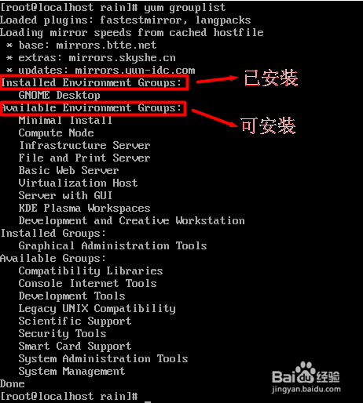

# Linux系统介绍

## 安装

**准备工具**

- Vmware WorkStation虚拟机软件（必需）
- RedHat Enterprise Linux [RHEL] 红帽操作系统（必需）
- Hash1.0.4 文件校验工具（推荐）

**网络配置**

编辑网络配置文件：vi /etc/sysconfig/network-scripts/ifcfg-ens33

>注意：是否有共享网络？共享网络是否连通？

**软件安装**

1. 如何上传安装包到服务器

   - 可以使用图形化工具，如：filezilla
   - 可以使用sftp工具：alt+p调出后，用put命令上传

   上传（如果不cd指定目录，则上传到当前用户的主目录）

   ```sh
   sftp> cd /home/
   sftp> put C:\Users\Administrator\Desktop\day02\soft\jdk-7u45-linux-x64.tar.gz
   ```

   下载（lcd指定下载到本地的目标路径）

   ```sh
   sftp> lcd d:/
   sftp> get /home/jdk-7u45-linux-x64.tar.gz
   ```

2. 安装jdk

   配置环境变量

   ```sh
   export JAVA_HOME=/root/apps/jdk1.7.0_45
   export PATH = $PATH:$JAVA_HOME/bin
   ```

   重新加载：source /etc/profile

### CentOS 7的图形界面安装（GNOME、KDE等）

1. 首先安装X(X Window System)，命令为yum groupinstall "X Window System" 回车（注意有引号）
2. 由于这个软件组比较大，安装过程会比较慢，安装完成会出现complete！
3. 检查一下我们已经安装的软件以及可以安装的软件，用命令yum grouplist 回车

   

4. 然后安装我们需要的图形界面软件，GNOME(GNOME Desktop)

   >这里需要特别注意！！！！
   >
   >一定要注意：名称必须对应，不同版本的centOS的软件名可能不同，其他Linux系统类似；否则会出现No packages in any requested group available to install or update 的错误。

5. 同样的，由于这个软件组比第一个要大很多（包含700个左右的软件），安装过程会很慢，请耐心等待。安装完成会出现complete！
6. 安装完成后我们可以通过命令 startx 进入图形界面，第一次进入会比较慢，请耐心等待。（可能需要重启，命令为reboot）
7. 如果安装完成后，虚拟机无法打开，我们需要调整虚拟机分配内存大小（注意不是磁盘大小），原来，小编的原来是800M现在分配了1600M。（1024M基本够用）
8. 如果安装完成后，虚拟机报错0x0000005c，请关闭虚拟机的3D加速功能（取消勾选）

关闭图形界面切换到命令行界面方法：

1. 手工切换：在图形界面中找一个可以输入命令的地方（RedHat9中默认是按alt+F2，或者从菜单：系统工具→终端打开）

   输入init 3 回车（注意init后面有一个空格），等一会就进入了命令界面，用init 5可以回到图形界面。

2. 如果想开机自动进纯文本模式，用文本编辑器打开文件/etc/inittab，找到其中的：id:5:initdefault:这行指示启动时的运行级是5，也就是图形模式，改成3就是文本模式了：id:3:initdefault:。再想进入X Windows用startx

   >注意：以上几种方法切换后，窗口模式完全关闭。如果窗口中有文件未保存，将丢失。

3. 还有一种“软”切换，按Ctrl+Alt+F1，进入一个同时运行的文本模式控制台，x窗口仍然在运行（占用内存），Ctrl+Alt+F7 切换回刚才的图形模式。其实Ctrl+Alt+F1、Ctrl+Alt+F2、Ctrl+Alt+F3、Ctrl+Alt+F4、Ctrl+Alt+F5、Ctrl+Alt+F6这6个都可以进入同时运行的不同文本模式控制台，没有窗口模式支持，也可以进行多任务同时处理。

卸载桌面：`yum remove gnome*`

### 使用KVM安装系统

KVM(Kernel Virtual Module)能够提供像Vmware一样的全虚拟化功能——让虚拟机用起来跟真实物理机一摸一样。安装KVM之前我们要检查真实物理机是否支持虚拟化功能:

```sh	
grep vmx /proc/cpuinfo
flags: fpu vme de pse tsc msr pae mce cx8 apic sep mtrr pge mca cmov pat pse36 clflush dts mmx fxsr sse sse2 ss syscall nx rdtscp lm constant_tsc arch_perfmon pebs bts nopl xtopology tsc_reliable nonstop_tsc aperfmperf pni pclmulqdq vmx ssse3 cx16 pcid sse4_1 sse4_2 x2apic popcnt aes xsave avx f16c rdrand hypervisor lahf_lm ida arat epb pln pts dtherm tpr_shadow vnmi ept vpid fsgsbase smep
```

如果执行该命令后没有输出vmx或svm值，但您的电脑是近几年买来的，那么很有可能只是在BIOS中默认关闭了，请去开启试试吧！

Inter处理器的虚拟技术标志为vmx。AMD处理器的虚拟技术标志为svm。

安装KVM以及相关的依赖软件包：

```sh
yum -y groupinstall "Virtualization Host"
Loaded plugins: langpacks, product-id, subscription-manager
………………省略部分安装过程………………
Complete! 

yum -y install virt-{install,viewer,manager}
Loaded plugins: langpacks, product-id, subscription-manager
………………省略部分安装过程………………   
Complete!
```

为了让KVM中虚拟机能够互相共享数据，还必需配置真实机的网络：

让系统支持ipv4的转发功能：

```sh
echo "net.ipv4.ip_forward = 1" > /etc/sysctl.d/99-ipforward.conf
```

让转发功能立即生效：

```sh
sysctl -p /etc/sysctl.d/99-ipforward.conf
net.ipv4.ip_forward = 1
```

新手读者们请注意，前方高能：将网卡配置文件中的IP地址、子网掩码等信息注释后追加参数BRIDGE=virbr0（设置网卡为桥接模式）：

```sh
vim /etc/sysconfig/network-scripts/ifcfg-eno16777736

DEVICE="eno16777736"
ONBOOT=yes
#IPADDR="192.168.10.10"
#NETMASK="255.255.255.0"
#GATEWAY="192.168.10.1"
HWADDR="网卡的MAC地址"
#DNS1="192.168.10.1"
BRIDGE=virbr0
```

创建用于桥接网卡的配置文件（与上面的配置文件很相似）：

```sh
vim /etc/sysconfig/network-scripts/ifcfg-virbr0

DEVICE="virbr0"
TYPE=BRIDGE
ONBOOT=yes
BOOTPROTO=static
IPADDR="192.168.10.10"
NETMASK="255.255.255.0"
GATEWAY="192.168.10.1"
DNS1="192.168.10.1"
```

当KVM安装完成并将网卡配置妥当后请重启(reboot)后再进行下面的检查操作：

检查kvm模块是否被加载以及能否正常的使用CPU虚拟化功能：

```sh
lsmod | grep kvm

kvm_intel 138567 0
kvm 441119 1 kvm_intel
```

检查桥接的网卡配置是否启用成功：

```sh
ip show virbr0

3: virbr0: <BROADCAST,MULTICAST,UP,LOWER_UP> mtu 1500 qdisc noqueue state UP
link/ether 00:0c:29:9c:63:73 brd ff:ff:ff:ff:ff:ff
inet 192.168.10.10/24 brd 192.168.10.255 scope global virbr0
valid_lft forever preferred_lft forever
inet6 fe80::20c:29ff:fe9c:6373/64 scope link
valid_lft forever preferred_lft forever
```

获取虚拟机列表（默认为空是正常的）：

```sh
virsh -c qemu:///system list
Id Name State
----------------------------------------------------
```

太棒了！现在来配置虚拟机参数吧：

```sh
virt-manager
```

- 第1步：填写虚拟机名称和设置安装模式。             
- 第2步：选中RHEL7镜像并设置系统类型。
- 第3步：设置内存量与CPU核数。      
- 第4步：定义硬盘容量。
- 第5步：检查配置后开启虚拟机。

### Yum软件仓库

Yum仓库则是为进一步简化RPM管理软件难度而设计的，Yum能够根据用户的要求分析出所需软件包及其相关依赖关系，自动从服务器下载软件包并安装到系统。
用户能够根据需求来指定Yum仓库与是否校验软件包，而这些只需几条关键词即可完成，现在来学习下配置的方法：所有Yum仓库的配置文件均需以.repo结尾并存放在/etc/yum.repos.d/目录中。

```ini
[rhel-media]：yum源的名称，可自定义。  
baseurl=file:///media/cdrom：提供方式包括FTP(ftp://..)、HTTP(http://..)、本地(file:///..)
enabled=1：设置此源是否可用，1为可用，0为禁用。  
gpgcheck=1：设置此源是否校验文件，1为校验，0为不校验。  
gpgkey=file:///media/cdrom/RPM-GPG-KEY-redhat-release：若为校验请指定公钥文件地址。
```

Yum仓库中的RPM软件包可以是由红帽官方发布的，也可以是第三方组织发布的，当然用户也可以编写的~

命令 | 作用
-|-
yum repolist all | 列出所有仓库
Debug | dbug | Gray | Black | 在开发过程中用于交互式调查的日志。 这些日志应主要包含对调试有用的信息，不具有长期价值。
Information | info | DarkGreen | Black | 跟踪应用程序的一般流程的日志。 这些日志应具有长期价值。
Warning | warn | Yellow | Black | 突出显示应用程序流中异常或意外事件的日志，但是否则不会导致应用程序执行停止。
Error | fail | Red | Black | 当当前执行流程由于失败而停止时，会突出显示的日志。这些应该指示当前活动中的故障，而不是应用程序范围的故障。
Critical | cril | White | Red | 描述不可恢复的应用程序或系统崩溃或灾难性的日志失败需要立即关注。
None |  |  |  | 不用于写日志消息。 指定记录类别不应写任何消息。
