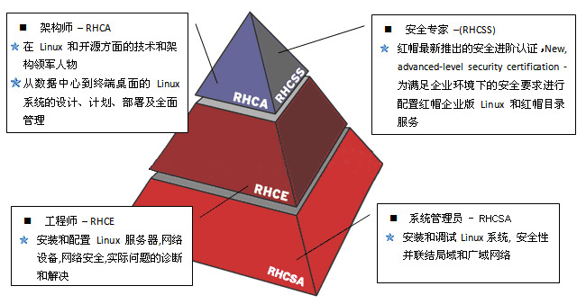
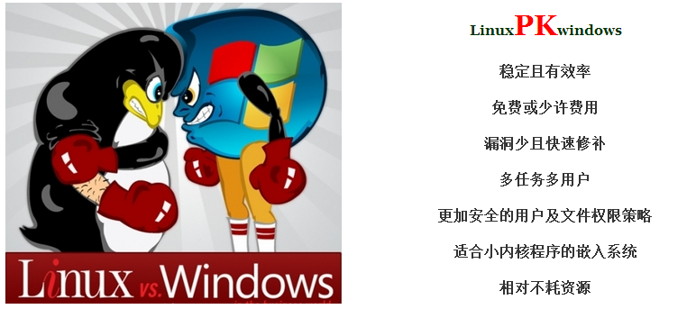

# Linux入门

## 目录

1. [最热门的六种开源许可证](#最热门的六种开源许可证)
2. [热门的开源系统](#热门的开源系统)
3. [红帽认证](#红帽认证)
4. [Linux vs Windows](#Linux&nbsp;vs&nbsp;Windows)
5. [远程Shell服务](#远程Shell服务)
   - [用户登录](#用户登录)
   - [修改口令](#修改口令)
   - [文件与目录操作](#文件与目录操作)
   - [关闭机器](#关闭机器)
   - [虚拟控制台](#虚拟控制台)
   - [CentOS 7的图形界面安装](#CentOS&nbsp;7的图形界面安装)
   - [使用KVM安装系统](#使用KVM安装系统)
   - [rpm管理软件](#rpm管理软件)
   - [Yum软件仓库](#Yum软件仓库)

## 最热门的六种开源许可证

开源软件的特性：“**使用自由**”，“**修改自由**”，“**重新发布自由**”，“**创建衍生品自由**”。


## 热门的开源系统


## 红帽认证

Linux系统有上百个不同的组织、公司、机构研发并发布出不同的版本，其中红帽公司作为一家成熟的操作系统厂商，提供可靠的Linux系统和完善的求援服务，红帽企业linux系统（RedHat Enterprise Linux, RHEL）的市场占有量极大，认可度也非常高。

红帽公司推出了阶梯式的认证体系也确实能够帮助读者检查自己的能力：



## Linux&nbsp;vs&nbsp;Windows



## 远程Shell服务

支持远程操作是Linux的一个非常重要的特点。利用此功能，用户从另一台计算机远程登录上来，进行Shell命令的操作。一般Linux系统已经安装了支持远程操作的安全Shell服务软件`OpenSSH`。

>提示：如果想用一台装有windows系统的电脑进行远程操作，要在这台电脑上安装ssh 客户端程序。可以使用SSHSecureShellClient、putty、**MobaXterm_Personal**（强烈推荐）等。

### 用户登录

Linux是一个真正意义上的多用户操作系统，用户要使用该系统，首先必须登录，使用完系统后，必须退出。用户登录系统时，为了使系统能够识别该用户，必须输入用户名和密码，经系统验证无误后才可以登录系统使用。

Linux下有两种用户：

1. root用户：超级权限者，系统的拥有者，在Linux系统中有且只有一个root用户，它可以在系统中任何操作。在系统安装时所设定的密码就是root用户的密码。

2. 普通用户：Linux系统可以创建许多普通用户，并为其指定相应的权限，使其有限地使用Linux系统。

用户登录分两步进行：

1. 输入用户的登录名，系统根据该登录名来识别用户；
2. 输入用户的口令，该口令是用户自己选择的一个字符串，对其他用户完全保密，是登录系统时识别用户的唯一根据，因此每一个用户都应该保护好自己的口令！

系统在建立之初，仅有root用户，其它的用户则是由root用户创建的。由于root用户的权限太大了，所以如果root用户误操作将可能造成很大的损失。所以建议系统管理员为自已新建一个用户，只有需要做系统维护、管理任务时才以root用户登录。

>我们发现在Password后面是空的，其实并不是不输入密码，而是在输入时，Linux系统不会把它显示出来，这样用来保护密码！

如果登录成功的话，我们将获得Shell（Shell是用来与用户交互的程序，它就象DOS中的COMMAND，不过在Linux下可以有多种Shell供选择，如bash、csh、ksh等）提示符，如果以root用户登录的话，那么获得的提示符是"#"，否则将是"$"。

>提示：如果当时在安装时设置为一启动就进入图形界面的话，那系统启动后，用户登录界面将是图形化的，有点像Windows，而且当你输入正确的用户名与密码，就会直接进入X Window。这个设置是可以修改的：在 `/etc` 目录下有一个 `inittab` 文件，其中有一行配置：`id:3:default` 其中，数字 3 就是代表一启动进入字符终端，如果改为 5 则代表一启动进入X Window。

不论你是 root 用户还是普通用户，只需简单地执行 `exit` 命令就可以退出登录。

### 修改口令

为了更好地保护用户帐号的安全，Linux允许用户在登录之后随时使用 `passwd` 命令修改自己的口令。修改口令需要经历：

1. 输入原来的口令，如果口令输错，将中止程序，无法修改口令；
2. 输入新的口令；
3. 提示重复一遍新的口令，如果两次输入的口令相吻合，则口令修改成功。

>需要注意的是，如果你输入的新口令过于简单，它将会拒绝修改。下面就是一个修改口令的实例：

### 文件与目录操作

与其它操作系统一样，在Linux系统下用户的数据和程序也是以文件的形式保存的。所以在使用Linux的过程中，是经常要对文件与目录进行操作 的。现在我们就以一个Window用户的立场来学习一下Linux下的文件与目录操作方法。

**文件名与文件类型：**

文件名是一个文件的标识。从这个角度来说，文件名的规则与 Windows 下的是基本上相同的。它同样是由字母、数字、下划线、圆点组成，最大的长度是255个字符。

与 Windows 一样，Linux 系统中也有 `普通文件` 和 `目录文件`，不过目录文件在 Window 中被简称为目录就是了。而在 Linux 系统中有一种特殊的文件，那就是 `设备文件`。在 Linux 系统中，把每一个 I/O 设置都映射成为一个文件，可以像普通文件一样处理，这就使得文件与设备的操作尽可能统一。从用户的用户来说，对 I/O 设备的使用和一般文件的使用几乎一样，这样就可以不必了解 I/O 设备的细节。

**目录结构：**

与 Windows 下一样，在 Linux 中也是通过目录来组织文件的。但不同的是，在 Linux 下只有一个根目录，而不像 Windows 那样一个分区一个根目录。如果有多个分区的话，就需要将其它分区 `mount` 到根目录上来用。

>Linux 根目录（"/"，这点与 Windows 相反，一个是 "\"，一个是 "/"，真是天生冤家）。其它的则可能是 /home、/usr。

安装完系统后，你会发现 /home、/usr 就是根目录下面的 home、usr 目录！对了，整个分区就用于该目录了。下面我们就说明一些重要的目录：

- `/bin`：存放着一百多个 Linux 下常用的命令、工具
- `/dev`：存放着 Linux 下所有的设备文件！
- `/home`：用户主目录，每建一个用户，就会在这里新建一个与用户同名的目录，给该用户一个自己的空间
- `/lost+found`：顾名思义，一些丢失的文件可能可以在这里找到
- `/mnt`：外部设备的挂接点，通常用 cdrom 与 floppy 两个子目录！它的存在简化了光盘与软盘的使用。你只需在塞入光盘后，运行：`mount /mnt/cdrom`，就可以将光盘上的内容 Mount 到 `/mnt/cdrom` 上，这样就可以访问了。不过你使用完成后，应该离开该目录，并执行 `umount /mnt/cdrom`。同样的，软盘就是 `mount /mnt/floppy` 和 `umount /mnt/floppy` 了。
- `/proc`：这其实是一个假的目录，通过这里你可以访问到内存里的内容。
- `/sbin`：这里存放着系统级的命令与工具
- `/usr`：通常用来安装各种软件的地方
  - `/usr/X11R6`：X Window目录
  - `/usr/bin` 与 `/usr/sbin`：一些后安装的命令与工具
  - `/usr/include`、`/usr/lib` 及 `/usr/share` 则是存放一些共享链接库
  - `/usr/local` 常用来安装新软件
  - `/usr/src`：Linux源程序
- `/boot`：Linux 就是从这里启动的
- `/etc`：这里存放 Linux 大部分的配置文件
- `/lib`：静态链接库
- `/root`：root用户的主目录，这就是特权之一！
- `/var`：通常用来存放一些变化中的东西！
  - `/var/log`：存放系统日志
  - `/var/spool`：存放一些邮件、新闻、打印队列等

另外，要说明的是，在Linux下 `当前目录`、`路径` 等概念与 Windows 下是一样的。

**显示文件内容：**

使用过 DOS 命令的人都应该知道，我们可以使用 type 命令来查看一个文件的内容。在 Linux 下有五个相关的命令，功能各有千秋，不过它们都像 type 命令一样，只能用来查看文本文件。

1. cat 命令

   `cat` 命令是最像 type 命令的，使用的方法很简单：`cat 文件名`。不过比 type 命令更强大的是，它可以同时查看多个文件：`cat 文件名一 文件名二`。

2. more 命令

   如果文本文件比较长，一屏无法显示完，那么使用 `cat` 命令就可能无法看清。这里我们可以简单地使用 `more` 来代替 `cat` 命令即可。其效果与 "`type 文件名 /p`" 类似。使用 `more` 命令将一次显示一屏文本，显示满后，停下来，并提示出已显示全部内容的百分比，按空格键就可以看到下一屏。

3. less 命令

   `less` 命令的功能几乎和 `more` 命令一样，也是按页显示。

### 关闭机器

在Linux系统中，普通用户是无权关闭系统的！只有root用户才能够关闭它。当然如果你是按关机按钮则别当别论。我们可以通过以下几种方法实现：

- 按下 `CTRL+ALT+DEL` 组合键，这样系统将重新启动！
- 执行 `reboot` 命令，这样系统也将重新启动！
- 执行 `shutdown -h now` 命令，这样系统将关闭计算机！
- 执行 `halt` 命令，可以关闭计算机。

>注意千万不要随意采用硬关机、重启动键等方式关闭系统，那样会导致Linux文件系统遭受破坏！

### 虚拟控制台

Linux是真正的多用户操作系统，可以同时接受多个用户的远程和本地登录，也允许同一个用户多次登录。

Linux为本地用户（也就是坐在计算机面前的用户）提供了虚拟控制台访问方式，允许用户在同一时间从不同的控制台进行多次登录。

虚拟控制台的选择可以通过按 `ALT` 键加上 `F1-F6` 六个功能键来实现。例如，用户登录后，按一下 `ALT+F2` 组合键，用户又可以看到 "login:" 提示符，这其实就是第二个虚拟控制台，而这时再按下 `ALT+F1` 组合键，用户则又可以回到第一个虚拟控制台。

大家可以通过使用虚拟控制台来感受Linux系统多用户的特性。例如用户可以在某一虚拟控制台上进行的工作尚未结束时，就可以切换到另一个虚拟控制台上开始另一项工作。例如在开发软件时，可以在一个控制台上编辑程序，在另一个控制台上进行编译，在第三个控制台上查阅信息。

### CentOS&nbsp;7的图形界面安装

GNOME、KDE等：

1. 首先安装X(X Window System)，命令为 `yum groupinstall "X Window System"` 回车（注意有引号）
2. 由于这个软件组比较大，安装过程会比较慢，安装完成会出现complete！
3. 检查一下我们已经安装的软件以及可以安装的软件，用命令 `yum grouplist` 回车

   

4. 然后安装我们需要的图形界面软件，GNOME(GNOME Desktop)

   >这里需要特别注意！！！！
   >
   >一定要注意：名称必须对应，不同版本的CentOS的软件名可能不同，其他Linux系统类似；否则会出现`No packages in any requested group available to install or update`的错误。

5. 同样的，由于这个软件组比第一个要大很多（包含700个左右的软件），安装过程会很慢，请耐心等待。安装完成会出现complete！
6. 安装完成后我们可以通过命令 `startx` 进入图形界面，第一次进入会比较慢，请耐心等待。（可能需要重启，命令为`reboot`）
7. 如果安装完成后，如果虚拟机无法打开，我们需要调整虚拟机分配内存大小（注意不是磁盘大小），1024M基本就够用了
8. 如果安装完成后，虚拟机报错0x0000005c，请关闭虚拟机的3D加速功能（取消勾选）

关闭图形界面切换到命令行界面方法：

1. 手工切换：在图形界面中找一个可以输入命令的地方（RedHat9中默认是按 `alt+F2`，或者从菜单：系统工具→终端打开）

   输入 `init 3` 回车（注意init后面有一个空格），等一会就进入了命令界面，用 `init 5` 可以回到图形界面。

2. 如果想开机自动进纯文本模式，用文本编辑器打开文件 `/etc/inittab`，找到其中的 `id:5:initdefault:` 这行指示启动时的运行级是 `5`，也就是图形模式，改成 `3` 就是文本模式了 `id:3:initdefault:`。再想进入 X Windows 用 `startx`

   >注意：以上几种方法切换后，窗口模式完全关闭。如果窗口中有文件未保存，将丢失。

3. 还有一种“软”切换，按 `Ctrl+Alt+F1`，进入一个同时运行的文本模式控制台，`x` 窗口仍然在运行（占用内存），`Ctrl+Alt+F7` 切换回刚才的图形模式。其实 `Ctrl+Alt+F1`、`Ctrl+Alt+F2`、`Ctrl+Alt+F3`、`Ctrl+Alt+F4`、`Ctrl+Alt+F5`、`Ctrl+Alt+F6` 这6个都可以进入同时运行的不同文本模式控制台，没有窗口模式支持，也可以进行多任务同时处理。

卸载桌面：`yum remove gnome*`

### 使用KVM安装系统

`KVM(Kernel Virtual Module)` 能够提供像 Vmware 一样的全虚拟化功能——让虚拟机用起来跟真实物理机一摸一样。安装 KVM 之前我们要检查真实物理机是否支持虚拟化功能:

```sh
grep vmx /proc/cpuinfo
---
flags: fpu vme de pse tsc msr pae mce cx8 apic sep mtrr pge mca cmov pat pse36 clflush dts mmx fxsr sse sse2 ss syscall nx rdtscp lm constant_tsc arch_perfmon pebs bts nopl xtopology tsc_reliable nonstop_tsc aperfmperf pni pclmulqdq vmx ssse3 cx16 pcid sse4_1 sse4_2 x2apic popcnt aes xsave avx f16c rdrand hypervisor lahf_lm ida arat epb pln pts dtherm tpr_shadow vnmi ept vpid fsgsbase smep
---
```

如果执行该命令后没有输出 vmx 或 svm 值，但您的电脑是近几年买来的，那么很有可能只是在 BIOS 中默认关闭了，请去开启试试吧！

Inter处理器的虚拟技术标志为 vmx。AMD处理器的虚拟技术标志为 svm。

安装 KVM 以及相关的依赖软件包：

```sh
yum -y groupinstall "Virtualization Host"
---
Loaded plugins: langpacks, product-id, subscription-manager
………………省略部分安装过程………………
Complete!

yum -y install virt-{install,viewer,manager}
---
Loaded plugins: langpacks, product-id, subscription-manager
………………省略部分安装过程………………
Complete!
```

为了让 KVM 中虚拟机能够互相共享数据，还必需配置真实机的网络，让系统支持 ipv4 的转发功能：

```sh
echo "net.ipv4.ip_forward = 1" > /etc/sysctl.d/99-ipforward.conf
```

让转发功能立即生效：

```sh
sysctl -p /etc/sysctl.d/99-ipforward.conf
net.ipv4.ip_forward = 1
```

新手读者们请注意，前方高能：将网卡配置文件中的IP地址、子网掩码等信息注释后追加参数 `BRIDGE=virbr0`（设置网卡为桥接模式）：

```sh
vim /etc/sysconfig/network-scripts/ifcfg-eno16777736
---
DEVICE="eno16777736"
ONBOOT=yes
#IPADDR="192.168.10.10"
#NETMASK="255.255.255.0"
#GATEWAY="192.168.10.1"
HWADDR="网卡的MAC地址"
#DNS1="192.168.10.1"
BRIDGE=virbr0
```

创建用于桥接网卡的配置文件（与上面的配置文件很相似）：

```sh
vim /etc/sysconfig/network-scripts/ifcfg-virbr0
---
DEVICE="virbr0"
TYPE=BRIDGE
ONBOOT=yes
BOOTPROTO=static
IPADDR="192.168.10.10"
NETMASK="255.255.255.0"
GATEWAY="192.168.10.1"
DNS1="192.168.10.1"
```

当 KVM 安装完成并将网卡配置妥当后请重启(`reboot`)后再进行下面的检查操作：

检查 kvm 模块是否被加载以及能否正常的使用CPU虚拟化功能：

```sh
lsmod | grep kvm

kvm_intel 138567 0
kvm 441119 1 kvm_intel
```

检查桥接的网卡配置是否启用成功：

```sh
ip show virbr0
---
3: virbr0: <BROADCAST,MULTICAST,UP,LOWER_UP> mtu 1500 qdisc noqueue state UP
link/ether 00:0c:29:9c:63:73 brd ff:ff:ff:ff:ff:ff
inet 192.168.10.10/24 brd 192.168.10.255 scope global virbr0
valid_lft forever preferred_lft forever
inet6 fe80::20c:29ff:fe9c:6373/64 scope link
valid_lft forever preferred_lft forever
```

获取虚拟机列表（默认为空是正常的）：

```sh
virsh -c qemu:///system list
Id Name State
----------------------------------------------------
```

太棒了！现在来配置虚拟机参数吧：

```sh
virt-manager
```

- 第1步：填写虚拟机名称和设置安装模式。
- 第2步：选中RHEL7镜像并设置系统类型。
- 第3步：设置内存量与CPU核数。
- 第4步：定义硬盘容量。
- 第5步：检查配置后开启虚拟机。

### rpm管理软件

命令|说明
-|-
`rpm -i example.rpm`|安装 example.rpm 包；
`rpm -iv example.rpm`|安装 example.rpm 包并在安装过程中显示正在安装的文件信息；
`rpm -ivh example.rpm`|安装 example.rpm 包并在安装过程中显示正在安装的文件信息及安装进度；
`rpm -qa | grep gitlab`|查看安装完成的软件
`rpm -e --nodeps`|要卸载的软件包

配置、编译、安装、卸载源码发布的软件包。

```sh
./configure
make
make install
make clean
make uninstall
```

RPM默认安装路径：

- /etc：一些设置文件放置的目录如/etc/crontab
- /usr/bin：一些可执行文件
- /usr/lib：一些程序使用的动态函数库
- /usr/share/doc：一些基本的软件使用手册与帮助文档
- /usr/share/man：一些man page文件

通用软件安装方法：

1、下载RPM安装文件

- RPM Find：[http://www.rpmfind.net/](http://www.rpmfind.net/)
- `wget <rpm_url>`
- wget命令不存在时：`yum install wget`

2、安装RPM文件

- `yum install <xxx.rpm>`

### Yum软件仓库

`Yum` 仓库则是为进一步简化 `RPM` 管理软件难度而设计的，`Yum` 能够根据用户的要求分析出所需软件包及其相关依赖关系，自动从服务器下载软件包并安装到系统。

用户能够根据需求来指定 `Yum` 仓库与是否校验软件包，而这些只需几条关键词即可完成，现在来学习下配置的方法：所有 `Yum` 仓库的配置文件均需以 `.repo` 结尾并存放在 `/etc/yum.repos.d/` 目录中。

```ini
[rhel-media]：yum源的名称，可自定义。  
baseurl=file:///media/cdrom：提供方式包括FTP(ftp://..)、HTTP(http://..)、本地(file:///..)
enabled=1：设置此源是否可用，1为可用，0为禁用。  
gpgcheck=1：设置此源是否校验文件，1为校验，0为不校验。  
gpgkey=file:///media/cdrom/RPM-GPG-KEY-redhat-release：若为校验请指定公钥文件地址。
```

`Yum` 仓库中的 `RPM` 软件包可以是由红帽官方发布的，也可以是第三方组织发布的，当然用户也可以编写的~

标识|简写|前景色|后景色|说明
-|-|-|-|-
Debug|dbug|Gray|Black|在开发过程中用于交互式调查的日志。这些日志应主要包含对调试有用的信息，不具有长期价值。
Information|info|DarkGreen|Black|跟踪应用程序的一般流程的日志。这些日志应具有长期价值。
Warning|warn|Yellow|Black|突出显示应用程序流中异常或意外事件的日志，但是否则不会导致应用程序执行停止。
Error|fail|Red|Black|当当前执行流程由于失败而停止时，会突出显示的日志。这些应该指示当前活动中的故障，而不是应用程序范围的故障。
Critical|cril|White|Red|描述不可恢复的应用程序或系统崩溃或灾难性的日志失败需要立即关注。
None |  |  |  | 不用于写日志消息。 指定记录类别不应写任何消息。

命令|作用
-|-
`yum repolist all`|列出所有仓库
`yum list all`|列出仓库中所有软件包
`yum info 软件包名称`|查看软件包信息
`yum install 软件包名称`|安装软件包
`yum reinstall 软件包名称`|重新安装软件包
`yum update 软件包名称`|升级软件包
`yum remove 软件包`|移除软件包
`yum clean alla`|清除所有仓库缓存
`yum check-update`|检查可更新的软件包
`yum grouplist`|查看系统中已经安装的软件包组
`yum groupinstall 软件包组`|安装指定的软件包组
`yum groupremove 软件包组`|移除指定的软件包组
`yum groupinfo 软件包组`|查询指定的软件包组信息
