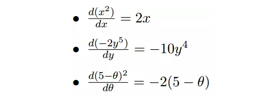
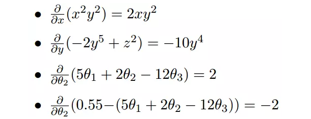
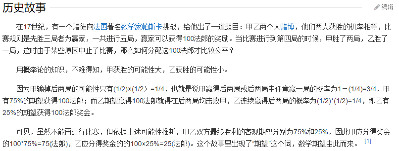
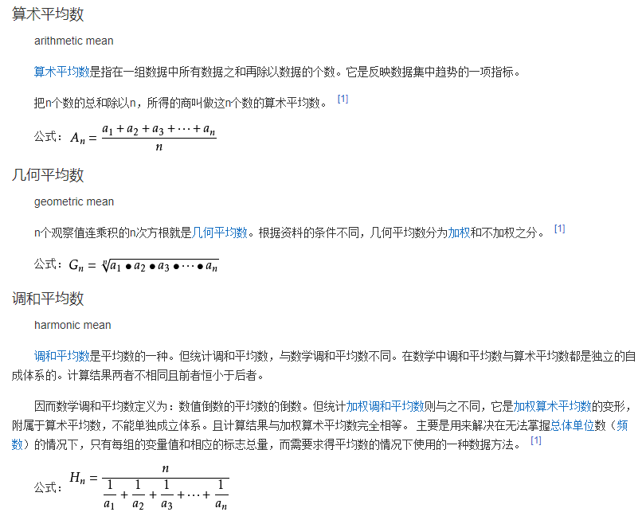
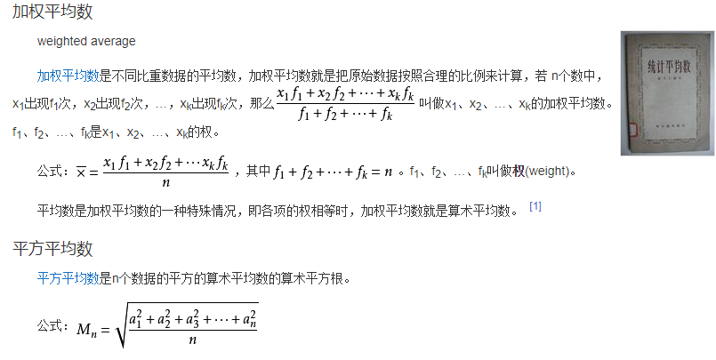
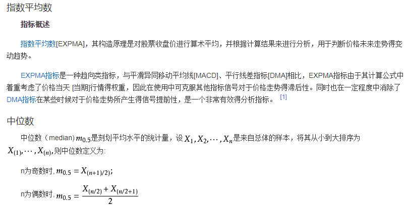
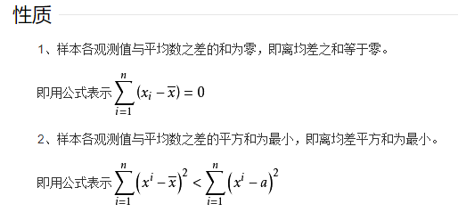
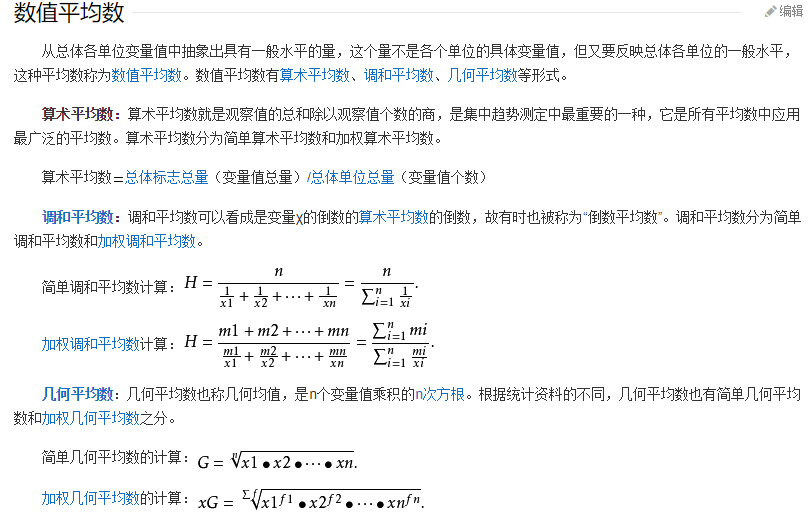
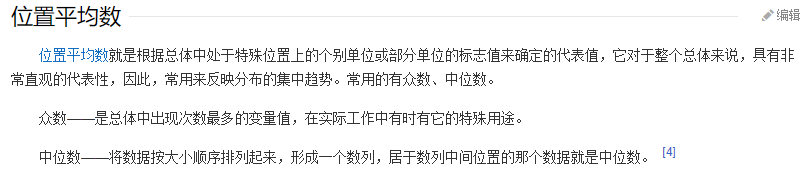

# 数学

## [梯度下降法及其实现](#梯度下降法及其实现)

### 场景假设

>梯度下降法的基本思想可以类比为一个下山的过程。假设这样一个场景：一个人被困在山上，需要从山上下来(i.e. 找到山的最低点，也就是山谷)。但此时山上的浓雾很大，导致可视度很低。因此，下山的路径就无法确定，他必须利用自己周围的信息去找到下山的路径。这个时候，他就可以利用梯度下降算法来帮助自己下山。具体来说就是，以他当前的所处的位置为基准，寻找这个位置最陡峭的地方，然后朝着山的高度下降的地方走，同理，如果我们的目标是上山，也就是爬到山顶，那么此时应该是朝着最陡峭的方向往上走。然后每走一段距离，都反复采用同一个方法，最后就能成功的抵达山谷。
>
>我们同时可以假设这座山最陡峭的地方是无法通过肉眼立马观察出来的，而是需要一个复杂的工具来测量，同时，这个人此时正好拥有测量出最陡峭方向的能力。所以，此人每走一段距离，都需要一段时间来测量所在位置最陡峭的方向，这是比较耗时的。那么为了在太阳下山之前到达山底，就要尽可能的减少测量方向的次数。这是一个两难的选择，如果测量的频繁，可以保证下山的方向是绝对正确的，但又非常耗时，如果测量的过少，又有偏离轨道的风险。所以需要找到一个合适的测量方向的频率，来确保下山的方向不错误，同时又不至于耗时太多！

### 梯度下降

首先，我们有一个可微分的函数。这个函数就代表着一座山。我们的目标就是找到这个函数的最小值，也就是山底。根据之前的场景假设，最快的下山的方式就是找到当前位置最陡峭的方向，然后沿着此方向向下走，对应到函数中，就是找到给定点的梯度 ，然后朝着梯度相反的方向，就能让函数值下降的最快！因为梯度的方向就是函数之变化最快的方向(在后面会详细解释)
所以，我们重复利用这个方法，反复求取梯度，最后就能到达局部的最小值，这就类似于我们下山的过程。而求取梯度就确定了最陡峭的方向，也就是场景中测量方向的手段。那么为什么梯度的方向就是最陡峭的方向呢？接下来，我们从微分开始讲起

### 微分

看待微分的意义，可以有不同的角度，最常用的两种是：

1. 函数图像中，某点的切线的斜率
2. 函数的变化率

几个微分的例子：

上面的例子都是单变量的微分，当一个函数有多个变量的时候，就有了多变量的微分，即分别对每个变量进行求微分

## [均方误差](https://baike.baidu.com/item/%E5%9D%87%E6%96%B9%E8%AF%AF%E5%B7%AE/9024810?fr=aladdin)

均方误差（mean-square error, MSE）是反映估计量与被估计量之间差异程度的一种度量。设t是根据子样确定的总体参数θ的一个估计量，$(θ-t)^2$的数学期望，称为估计量t的均方误差。它等于$σ^2+b^2$，其中σ2与b分别是t的方差与偏倚。

## 数学期望

在概率论和统计学中，数学期望(mean)（或均值，亦简称期望）是试验中每次可能结果的概率乘以其结果的总和，是最基本的数学特征之一。它反映随机变量平均取值的大小。

需要注意的是，期望值并不一定等同于常识中的“期望”——“期望值”也许与每一个结果都不相等。期望值是该变量输出值的平均数。期望值并不一定包含于变量的输出值集合里。

大数定律规定，随着重复次数接近无穷大，数值的算术平均值几乎肯定地收敛于期望值。

## [大数定律](https://baike.baidu.com/item/%E5%A4%A7%E6%95%B0%E5%AE%9A%E5%BE%8B/410082)

概率论历史上第一个极限定理属于伯努利，后人称之为“大数定律”。概率论中讨论随机变量序列的算术平均值向随机变量各数学期望的算术平均值收敛的定律。

在随机事件的大量重复出现中，往往呈现几乎必然的规律，这个规律就是大数定律。通俗地说，这个定理就是，在试验不变的条件下，重复试验多次，随机事件的频率近似于它的概率。偶然中包含着某种必然。

大数定律分为弱大数定律和强大数定律。

## [平均数](https://baike.baidu.com/item/%E5%B9%B3%E5%9D%87%E6%95%B0/11031224?fromtitle=%E5%9D%87%E5%80%BC&fromid=5922988)

平均数，统计学术语，是表示一组数据集中趋势的量数，是指在一组数据中所有数据之和再除以这组数据的个数。它是反映数据集中趋势的一项指标。解答平均数应用题的关键在于确定“总数量”以及和总数量对应的总份数。

在统计工作中，平均数（均值）和标准差是描述数据资料集中趋势和离散程度的两个最重要的测度值。

## 集中趋势

在统计学中，**集中趋势**（central tendency）或**中央趋势**，在口语上也经常被称为平均，表示一个机率分布的中间值。最常见的几种集中趋势包括算数平均数、中位数及众数。集中趋势可以由有限的数组（如一群样本）中或理论上的机率分配（如正态分布）中求得。有些人使用集中趋势（或**集中性**）这个词汇以表示“数量化的资料之中央值的趋势”。在这种意义下，我们可以利用资料的离散程度（例如标准偏差或四分差等相似的统计量）判别其集中趋势的程度。

取得集中趋势代表值的方法有两种：`数值平均数`和`位置平均数`。

