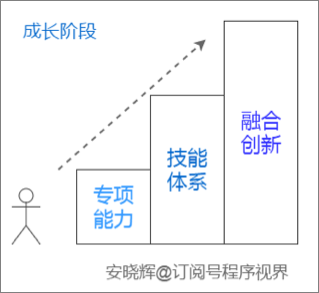
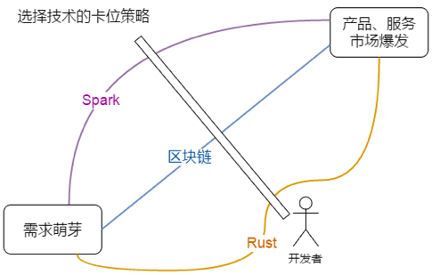

# 我的奋斗


爱因斯坦说过：只是学习他人的智慧并不足够，你需要自己想明白才行。花时间记录、通盘考虑和深入思考你学到的东西。

海伦·凯勒说过：知识使人进步，而智慧使人得道。

在重视“亘古不变”的语言基础上，力求更先进的开发技术。

## 目录

1. [学习路线](#学习路线)
2. [自由职业攻略](#自由职业攻略)
3. [事业发展](#事业发展)
4. [知识整理](#知识整理)

## 学习路线

长期以来，我发现有很多朋友的学习方式存在误区，比如，有一些人上来就去研究“变更检测”的原理，还有 RxJS 的原理，这种方式除了打击你自己的自信心之外并不能得到任何好处。因为你迟早会发现，在计算机领域，任何东西研究到最底层都和“算法”、“数据结构”、“设计模式”有关。而就我所知，很多朋友并不具备研究这些内容的基础知识，不过是白白浪费自己的时间而已。

另外，研究原理不得不去阅读各种源代码，但是很少有源代码会提供详细的文档。阅读这样的源代码肯定会迷路，就像这样：


因此，我推荐采用更加务实一点的方案，首先学会如何使用，等用熟了，有时间、有闲情的时候再去研究那些底层的原理。设计发动机很难，但是学会开车并不难，对吧？

学习内容非常看重“概念模型”（Mental Model）的构建。我发现，很多开发者已经做过非常多的项目，但是当你跟他聊的时候，你很快就会发现他并没有掌握这门框架的精髓。打几个比方：

- 当有人提到 Spring 的时候，你的大脑里面第一个想到的一定是 DI、IoC、AOP 这些核心概念；
- 当有人提到 Hibernate、MyBatis、JPA 的时候，你的大脑里面立即会浮现出 ORM 的概念；
- 当有人提到 React 的时候，你想到的应该是 VDOM、JSX；
- 当有人提到 jQuery 的时候，你首先想到的应该是 $，对吧？

任何一个成功的框架都有自己独创的“概念模型”，或者叫“核心价值”也可以，这是框架本身存在的价值，这些核心概念是你掌握这门框架应该紧扣的主线，而不是上来就陷入到茫茫多的技术细节里面去。

## 自由职业攻略

### Elance

Elance是全球最大的外包网站。给我的印象是门槛高，服务好，项目多，项目质量好。比起国内的猪八戒之类的网站好不知多少倍。如果你是程序员、翻译、设计师等，同时英文又好，那一定要到Elance上来接项目，这样才能充分体现你的优势嘛。因为Elance是个国际平台，上面的价格是国际价格，换算成人民币怎么都划算啊。

***注册***

Elance的注册是需要验证电话号码的。注册完了之后，Elance的机器人会打电话过来，叫你把网页上的数字用英文念出来。通过验证之后就算注册成功了。可以开始接项目了。PS. 因为Elance涉及到钱，所以对帐号保护比较严，一定要记得你的密保答案啊，因为下次你换个地方登陆，它就会让你输入答案了。。。

***包装自己***

新手要顺利接到项目比较难，因为没有历史项目经历和别人给的评分。所以要靠自己profile上的自我简介，profilio和skill tests等来打动客户了。其中比较特别的是skill tests。Elance使用了第三方测试平台来衡量测试者的各种技能。在Elance网站上选择想要测试的技能，比如PHP5 Code Test，然后会进入一个第三方测试网站。一般选择类题目是40题，时间是40分钟。PHP5 Code Test属于代码实践题，需要测试者根据题目提供一段PHP程序，然后后台执行这段程序看看是否正确。

测试的结果是按你在测试者中占的百分比来的，而且貌似只有top 1%,5%,10%,20%,30%（上次我做了个JS测试的top 2%，结果给我显示5%，冤屈啊。。。），其他的就用图形来显示你的测试成绩和平均测试成绩。免费会员可以选择5个测试成绩显示在自己的profile上。如果升级成付费会员则可以显示更多的成绩。如果某个测试你觉得不满意，没关系，14天之后可以再次做这个测试（题目大部分都一样的哦）。这些成绩是很有说服力的。比如你刚注册，但是在Javascript测试中获得了top 5%的成绩，那么你在投标的时候就可以说 “我刚来Elance，但是我在前端方面有 X年的经验，不信你去看我的profile，我在Javascript测试中排前5%哦。”。然后报价再稍微比别人低一点，获得项目的机会就会大很多。

***项目流程***

Elance的项目主要分为固定价格的项目和按小时计费的项目。先说说fixed price project。

首先在网站上搜索自己感兴趣又力所能及的项目。 然后就是投标了。

投一个$500以下的项目需要1个Connect（Elance上的一种点数吧），$500-$1000的项目需要2个Connect ... $2000以上的貌似都是5个Connect。而且这个点数是不退的，也就是说对方发个项目，你去投，然后对方没选中你，甚至对方把项目关了，你都会一样损失这些点数。免费会员每月是10个点。我是每月$10的付费会员，每月有20点。这种点数的规则就限制了像猪八戒上那些胡乱杀价的人，所以Elance上看到的基本上都是正儿八经的人报的合理价格。

然后投标内容一般用正式的英文书信格式，例如：

```md
Hi Alex,
I am very interested in your project. I ....
Regards,
Chunlong
```

而且内容一定要根据对方的项目需求来写。切记写一个模板到处去投标。比如对方想做个图片编辑器，你就应该说你以前做过类似的东西，然后把demo地址贴上去。这样对方会很感兴趣的。

这段时间有可能对方会跟你来回通信几次，一旦他确定给你做，就会把项目award给你，然后你在elance后台就会看到这个项目，里面有各种设置和功能。一般项目award给你之后，对方就会把项目款打到Elance，如果没打，你可以等对方打了钱再开始做。这种第三方担保类似支付宝，需要双方同意钱才能转移。此时，你就可以跟对方交流任何内容，比如Skype帐号（上面的人大部分都用Skype，因为必要时候可以视频通话）。

项目后台最常用的是message功能，可以收发消息，还可以带附件，每个消息还会forward到你的邮箱，甚至你可以用邮箱直接回复。另外还有一个是status reports，项目开始后记得用这个来向对方报告项目进度。Terms & Milestones是一个必须双方都同意的协议，里面涉及到项目的里程碑（可以在里程碑上协定支付部分项目款），项目截止日期，项目总价等。每个修改都需要双方同意之后才会生效。

当项目结束后，如果对方确认了你的成果。那么就可以把status reports里面设置为completed。并且提醒对方放款。

对于按小时付费的项目，大部分流程都是一样的。但是投标的时候的金额是每小时多少钱而不是项目总共多少钱。然后开始做之后，需要你下载一个Elance的Tracker软件（是一个Adobe AIR软件）。这个软件可以记录你的项目时间和屏幕截图。开始做项目的时候，进这个软件点击开始。然后就老老实实做这个项目，因为这个软件会不定期截屏上传的！万一被看到你在玩，那是有损声誉的事情啊。

项目做完了就是提款，具体可以看《从Elance提现到国内银行的完美方法》

***从Elance提现到国内银行的完美方法***

我开始做自由职业已经有一个月左右了。主要是在elance.com上接项目。

第一个项目做的是用jQuery做一个图片裁剪的功能，包括图片上传进度显示，两个比例的图片裁剪框。这个项目是100刀，elance扣了8.75刀的中介费，到手91.25刀。这个比例还是可以接受的。

第二个项目是用nodejs做一个gtalk聊天机器人、一个facebook chat聊天机器人、一个msn聊天机器人。每个机器人200刀。在5天内搞完另外给400刀的bonus。结果我顺利在规定时间搞完，拿了1000刀。哈哈哈。

钱到了Elance帐户上，怎么变成能够提现的人民币是个麻烦事情。我搜了网上很多文章，都说只有用moneybookers的服务最便宜。于是我又搞了个moneybookers帐户。那天突然发现如果成为elance的付费会员（最便宜的付费会员$10/月），就可以享受每月一次的免费电汇(wire transfer)，超出一次以后貌似每笔要给25刀5刀手续费。于是就搞了个付费会员玩玩，不仅可以享受免费电汇，还有更多的点数和其他东西可以享受。付费会员只是多了一些Connect。免费会员一样每月有一次免费电汇的机会。那天试探提了200刀到我的中国银行活期一本通上，用的swiftcode是BKCHCNBJ570。过了大概4天，发现卡上真的有200美元，一分中间行费用都没扣。太TM爽了，这绝对是最便宜的提现途径，虽然每月只有一次机会。

下一步就是去银行结汇，把美元转成人民币，这个步骤不知道要不要收手续费。

2012年10月更新:

大家最好还是用中国银行。因为中国银行现在收到美元之后是自动上账（不知道其他地方，反正成都貌似都是），而其他一些银行（尤其是工商银行）收到美元后，要人工审核再上到你的账户上。人工审核这个时间就说不清楚了，快的话当天，慢的话无底限...关键是工行还要求我本人带身份证到我卡的开户行去办理！别人给我汇款还要我亲自去开户行办理接收手续！

还是中国银行好。在Elance上点击withdraw之后，2-3天Elance就会提醒说汇款手续已经办理。一般这个时候钱已经在中国银行账号上了，直接在网银就可以办理结汇，当然汇率要低一些。

另外，Elance前段时间不知道搞什么飞机，直接提美元到美国以外的国家，每笔收25刀手续费。但是提其他币种就还是继续原来的价格（每月一次免费，超出5刀一次）。Elance解释说是提倡在Elance完成币种转换，然后直接汇当地货币给你。我觉得可能elance想通过汇率差价赚钱？操蛋的是提供选择的币种没有RMB！不过我随便选了个欧元，就可以了。

## 事业发展

```txt
你想一辈子做狗，还是想做一条自由驰骋的狼？
你想一辈子服从别人，还是发号施令运筹帷幄？
你想一辈子荒老在一地，还是征战天下看世界？
```

## 技术选型

### 技术成长的三阶段模型

努力只有在方向正确时才有价值。

开发者选择技术也是如此。假如你阴差阳错地选择了一门过时的技术或者普及度不高的技术，你在找工作时就会不断受挫，即便投入实际工作中后也会忧心自己的发展前景。

我们先设想如下的几个场景：

- 你刚进入软件开发领域时，急需选择适合自己和市场的技术才能更好地就业；
- 你做了一两年技术工作，开始构建自己的技能树（知识图谱），需要选择与你现有技术相互补充、1+1>2的技术来学习和提升；
- 你的技术能力慢慢在团队里凸显出来，成了先锋官，有新的项目、新的产品时，你总是被赋予探索技术方案的角色，可是一招不慎，你选择的技术就可能导致整个项目的失败；
- 你使用 C++ 语言做了5年开发工作，越来越觉得这门语言不适合自己，想要学习一种新技术作为自己以后的主要开发技术，很担心再选错——因为你做开发的黄金时间，加起来也不过三四个5年；
- 你成为技术负责人或者研发经理，需要决定团队的技术图谱，需要为团队承接的新项目选择技术方案，要考虑哪些因素呢？

所有上述问题，我们都会讨论分析，我们会找到选择技术方向时要考虑的各种因素，然后结合特定的场景，看看你在选择时具体需要做哪些考量。

希望每一位读者都能掌握选择技术方向的方法，这会让你具备更强的竞争力和更高的身价；作为团队的一员，你会知道在为某个项目选择技术时该如何综合考虑，在风险、成长、代价之间进行权衡。

为了更好地选择技术方向，我们先来介绍一个模型，我给它取了个名字叫“技术成长三阶段模型”，参照下图所示。



我们在一个专业领域内的成长，基本上都会经历三个阶段：

- 初级阶段：专项能力的提升
- 中级阶段：技能体系的构建
- 高级阶段：融合创新

<b>1．初级阶段：专项能力的提升</b>

专项能力提升阶段是初级阶段，针对某项具体任务你必须先具备某些基础能力，比如从事软件开发工作，你要学会某种语言、某个 IDE、某种技术框架……

如果你刚刚从学校毕业从事开发工作，或者刚刚从别的跑道转换到开发领域，那么你就处在这个阶段。这个阶段最重要的目标就是提升专项能力，让自己能够迅速搞定一些别人安排给你的事情，体现出你的价值。

这个阶段持续的时间长短因人而异，可能会是1~3年。如果超过3年还没有进入下一个阶段，那么你的成长速度就需要提升了。

<b>2．中级阶段：技能体系的构建</b>

当你拥有了一组技能，围绕某个方向构建了自己的知识图谱，能够用自己的方式来解决问题时，代表你已经进入了中级阶段。比如你使用 Java 语言做后台方面的开发，你的技能体系可能由 Java、MyBatis、Spring、SpringMVC、Netty、MySQL、Python、Linux 等组成。此时你在团队中，应该已经可以独立负责某个模块，能够完成模块的设计和开发工作，也能够指导初级阶段的同事进行开发。

你可能需要2~3年，经历2~3个项目才能慢慢构建起自己的技能树，然后还会在这个阶段再待上1~2年，不断练习你的技能体系中的各项技能。所以当你能够拥有一棵强大的技能树时，距离你刚从事开发工作可能有5~8年了。

假如你超过这个年限，用过的技术还是散乱的，东一榔头西一棒槌，不能有机组合在一起，那么你的开发经验和能力，肯定大大落后于你的工作年限。换句话说，你可能把一年工作经验学到的知识、技能机械地重复了几年，没有获得应有的成长。

<b>3．高级阶段：融合创新</b>

这是高手阶段，你拥有了丰富的实践经验，具备了 T 型知识结构，形成了自己的思维框架和解决问题的框架，能够融合不同领域的知识，组合各种资源，创造性地解决各种问题。

进入这个阶段非常重要的一个标志就是当你遇到问题时，不再从下而上去思考（即从技术实现细节来考虑问题好不好实现、拿技术去裁剪问题或重定义问题），而是从实现细节跳脱出来，站到更高的层面，自顶向下去思考、去分析，先运用框架、逻辑去分析真正的问题是什么、问题的目的、问题的现状、如何去解决。搞明白这些之后，你才会沉降到技术层面去考虑实现的选择，而且实现时，你也不会拘泥于某种技术，而是什么技术合适就用什么技术（你的目的不是“用 Java 或 Redis 解决问题”，而是“解决问题”）。简单说，就是你走出了被技术束缚和塑造的过程（前两个阶段），可以反过来回到问题本源来思考了。

在这三个阶段中，我们都会遇到选择技术方向的问题。比如在初级阶段，入门时要选择，发现某种技术不适合自己时要重新选择；在中级阶段，我们要选择某些技术来构造我们的技能树，或者要做技术转型，需要重新选择技术方向；再比如在高级阶段，我们往往会负责产品的技术方案探索与选型，免不了要选择技术方向，甚至在这个时候，我们个人也可能会在技术方向上转型，必须有所选择。

所以，我们根据技术成长的三阶段模型，挑选了下面几个可能需要选择技术方向的时机，分开来讲在这些时机下如何选择技术方向。

- 入行的技术选择
- 构建技能树的技术选择
- 技术转型的选择
- 方案选型的选择

最后，你可以思考一下现在自己处于技术成长的哪个阶段？你认为选择技术方向都需要考虑哪些因素？

### 选择技术方向要考虑哪些因素

1. 就业机会
2. 难易程度
3. 个人兴趣
4. 薪资水平（100 offer、拉勾网、互联网人才流动报告、开发者薪酬报告、互联网薪资调查）
5. 发展前景

   选择技术时存在两种考虑：一种是选择稳定的、经典的技术；一种是卡位将来的市场缺口，选择将来可能需要用到的技术。

   前者考虑的是林迪效应，即：对于不会自然消亡的事物，生命每增加一天，则可能意味着更长的预期寿命。

   卡位策略是指看到某种技术会在未来具有稀缺性，非常有价值，选择提前介入，让自己在未来具备竞争优势。运用卡位策略时，有两种方式。

   1、一种卡位方式是根据市场需求和未来预期

   

   2、还有一种卡位方式，是根据技术本身的发展程度来说看。采用[高德纳曲线](http://www.gartner.com/technology/research/methodologies/hype-cycle.jsp)
  
   

   >上图展示了机器学习相关的三种技术：OpenAI、TensorFlow、Watson。从曲线可以看出，OpenAI 处于成长期，TensorFlow 处于成熟期，而 Watson 的地位正在受到挑战。如果你现在要选择一种机器学习框架，TensorFlow、OpenAI 是比较好的选择。

6. 他人推荐
7. 相近原则
8. 互补原则
9. 团队技术图谱

做方案选型时，目标是得出现实可行、成本可接受的方案，需要综合考虑各种因素：

1. 某种技术适合解决某类问题
2. 新技术的成熟度
3. 生态
4. 团队的技术图谱
5. 技术引入的成本

   - 学习成本
   - 招聘成本
   - 时间成本
   - 机会成本

### 推荐工具

1、Stack Overflow

Stack Overflow 的开发者调查：[http://stackoverflow.com/insights/survey/2016](http://stackoverflow.com/insights/survey/2016)。更改最后的年份，比如将2016年修改为2015年，即可查看对应年份的调查结果。这个结果里有开发者最喜欢的语言、最想要学习的语言、开发者年龄分布、Stack Overflow 上的热门技术等，很有参考意义。

2、TIOBE 编程语言排行

TIOBE 编程语言排行：[https://www.tiobe.com/tiobe-index/](https://www.tiobe.com/tiobe-index/)。会有 TOP 20 编程语言及 TOP 10 的走势曲线。

3、技术热门度曲线

全球最大的 IT 咨询公司高德纳提出了一个“技术热门度曲线”模型，把一门技术的发展过程分为启动期、泡沫期、低谷期、爬升期和高原期5个阶段。[https://stateofdev.com/](https://stateofdev.com/) 这个网站根据高德纳的模型，做了各种开发技术的曲线

4、GitHub

GitHub 也有一些统计数据，说明各种语言、技术在 GitHub 上的活跃程度，可以登录这里查看：[https://octoverse.github.com/](https://octoverse.github.com/)。另外，你也可以自己在 GitHub 上按关键字（比如 Qt）来搜索，看某种技术是否有很多的项目，以此来判断技术的活跃度

5、招聘热度挖掘

像智联、51job、猎聘、拉勾、100offer、大街网等招聘网站，都是很好的技术需求数据来源，你可以用某个关键字（比如“Java开发工程师”）来搜索，看相应的招聘需求是否旺盛。

6、薪酬报告

以“互联网人才流动报告”“开发者薪酬报告”“互联网薪资调查”“程序员薪酬报告”“互联网薪酬报告”等为关键字在百度搜索，就可以搜到拉勾、智联等网站发布的互联网人才薪酬报告，可以根据这些内容了解某些岗位的薪资状况。

## 技术精进

开发者的迷茫分两个层面：

1. 方向上的迷茫，即自己到底是否适合做开发、是否要继续在开发的路上走下去。
2. 执行层的迷惑，即自己继续做开发，该怎么找目标、学点什么、学到什么程度、如何能持续精进。

### 开发or管理

有三种方法可以帮助你进行判断：

1. 工作的三种维度；
2. 成就感来源；
3. 未来的样子。

#### 工作的三种维度

根据交互对象不同，工作可分为三类：

1. 数据和信息处理；
2. 人际互动；
3. 事务型操作。

假如你发现自己更愿意围绕着人际交互来做事情，希望自己的工作中大部分时间都在和人打交道，那么你可能更适合做管理、销售、市场、客服、咨询师等方面的工作。

假如你发现自己更愿意做操作性的工作，比如修理电脑、组装电脑、搭建局域网、修理汽车等，那么软件开发工作可能不太适合你，运维或者网管也许和你更匹配。

假如你觉得信息很迷人，很享受与信息和数据之间这种确定性、一致性、可预期性较高的互动方式，也很享受通过组织、修改、整合、创造信息来解决问题这种工作方式，那么你现在正在做的开发工作，基本上和你的偏好是吻合的——因为开发者偏重于和数据、信息打交道，以信息和数据为输入，也以信息和数据为输出。

#### 成就感来源

2015年年底创业失败，我决定找一家单位上班。彼时我35岁，在很多人眼里这个年龄的程序员已经要被淘汰了。我面临的选择是：做开发还是做管理。

从2009年开始我就在做技术管理工作，这时比较传统的做法是，找一个研发经理的职位来做（当时有几个不错的机会），一来职业生涯有延续性，二来薪水也高。可是我后来选择了到全时云商务做开发工作，让很多朋友大跌眼镜。

我为什么这么选择？其中的关键点是：我觉得**亲力亲为解决问题更有成就感**。

回顾我多年的开发和管理经历，我发现在我写作《Qt Quick 核心编程》时，在我一周7天不休息，加班加点重构智能机顶盒播放器的时期，感觉最为充实，最有意义。而在我做管理工作时，带领团队完成了某项任务，自己也没什么特别的感觉，即便有一些兴奋感和成就感，也很快会被委派任务、一对一谈话等事情淹没。

所以我思来想去，决定做回开发工作，这样我更能感受到意义和价值，更有成就感。

每个人的成就感来源都不一样，假如你像我一样，成就感在于自己动手解决具体的技术问题，那么开发工作就更适合你；假如“领导和管理别人、通过别人完成工作、看到别人成长”让你更有成就感，那么管理工作适合你。

实际上这一点和前面介绍的“工作的三种分类”是类似的。你越倾向于做人际互动类的事情，就越适合做管理工作，你越倾向于和数据、信息交互，就越适合做开发工作。

可以遵循下面的步骤寻找成就感来源：

- 回顾你做过的事情，找出那些让你情感反应强烈的，记录下来。
- 分析你的情绪底色，是快乐、高兴、振奋、愉悦、充实等积极情绪，还是沮丧、灰心、挫败、失落、空虚、失望等消极情绪。
- 挑选出带给你强烈积极感受的事件，它们就是你的成就感事件。
- 分析成就感事件，看看它们用到了什么知识、技能、软能力，看看在这些事件中，你印象深刻的交互对象是什么（数据、人、事务）。

可能有的朋友会说，即便有这4个步骤，也判断不出自己的成就感来自哪里，不怕，我们会在后面“转型”的部分深入讲解。

#### 未来的定位

问自己两个问题：

1. 一直做开发，我会变成什么样子？
2. 如果转向管理，我会变成什么样子？

在你的身边找比你大5岁、8岁、10岁的开发者，看看他们的工作状态、生活状态、个人风貌，是不是你想要的，或者反过来，是不是你讨厌的。

假如看到他们你觉得看到了自己的未来，这个未来你无论如何无法接受，那么，很可能软件开发并不是你的长久之道，你可能要考虑技术管理岗位。

那就在你的身边找管理者，看看直接上级，看看其他部门的经理，看看其他公司的管理者，找5个以上的人出来，观察、了解、搜集他们的工作状态、生活状态、个人风貌等方面的信息，看看这样的人是不是你想成为的，或者反过来，是不是你讨厌的。

假如你也很讨厌你能接触到的这些技术管理者，那么，可能这条路也不是你的长久之道。

### 前进的动力

你之所以愿意做软件开发，一定是有原因和目标的。比如：

- 它可以带给你丰厚的薪水和优裕的生活；
- 它能让你成为自己想要的样子；
- 它可以不断给你挑战；
- 它让你觉得自己有价值。
- ……

请问一问自己为什么要做软件开发，找到几个理由，记录下来。

它们会帮助你渡过后面会遇到的倦怠期。

进入软件开发领域后，你从对什么都好奇、积极学习，慢慢变成机械地完成领导分配的任务，3~5年后就可能会感到无聊、困惑、迷茫，丧失前进的动力，进入倦怠期。

这个时候，你对工作的态度是“差不多就算了”，干什么都没心思，开始思考朝九晚五打卡上班有何意义，整个人陷入“有事不想做、没事又无聊”的倦怠之中，更谈不上什么技术精进了。

这是一种危险的状态，要让自己走出来，有两个方向：

1. 为你的工作重新赋予意义。
2. 为你的工作引入变化。

具体可以像下面这么做，想想你之前记录的做开发的理由，问自己几个问题：

- 这个理由是否还存在？
- 为什么这个理由还在但是无法激励我了？是不够量化，不够可视化，还是太遥远？
- 有哪些新的工作内容可以去尝试？
- 有哪些新的职位可以去尝试？
- 有哪些新的方法、工具可以提升开发效率？
- 当下，软件开发对我的意义在哪里？
- 三五年后，我会变成什么样子？
- 我希望自己变成什么样子？
- 该怎样才能变成我想要的样子？

做软件讲究迭代，讲究热更新，我们个人也是一样的，要不断自我探索和更新，找到技术在不同阶段对自己的不同意义，只有找到开发工作对个人的意义所在，你才可能有动力去精进。如果你觉得做不做开发、做好做坏无所谓，那么你铁定是无法持续精进的。

### 学习型心态

### 精进之道

#### 成长模型

#### 个人对标管理法

#### 借鉴优秀者

#### 技术成长阶段模型

#### 技术本身的层次

#### 项目指标

#### 拿来即用的提升策略

### 目标设定与执行

#### 适合性评估

#### 有效目标(SMART)

#### 下一步行动

### 四个习惯

#### 对标管理

#### 三个问题

#### 刻意练习

#### 复盘

### 习惯养成

#### 内在动力

#### 降低改变的难度

#### 让改变可视化

#### 奖励

#### 允许例外

### 技术之外

#### 应用流程

### 职业规划

#### 下一个台阶

#### 终极目标

#### 梦想彼岸

## 知识整理

断舍离

- A站、B站、P站
- [https://github.com/fyuanfen/note](#https://github.com/fyuanfen/note)
- [https://github.com/jiangxiayun/flow-editor-vue](#https://github.com/jiangxiayun/flow-editor-vue)
- [https://github.com/Decalogue/AlgorithmMap](#https://github.com/Decalogue/AlgorithmMap)
- [https://github.com/xiaoshuaishuai319/weixinxiaochengxu](https://github.com/xiaoshuaishuai319/weixinxiaochengxu)
- [https://github.com/nimoat/photo-edit](https://github.com/nimoat/photo-edit)
- [https://github.com/jones2000/HQChart](https://github.com/jones2000/HQChart)
- [https://github.com/ZFSNYJ/VFD](#https://github.com/ZFSNYJ/VFD)
- [https://github.com/qianguyihao/Web](https://github.com/qianguyihao/Web)
- [https://github.com/QianMo/Game-Programmer-Study-Notes](https://github.com/QianMo/Game-Programmer-Study-Notes)
- [https://github.com/xiaojiwei/strawberry](https://github.com/xiaojiwei/strawberry)
- [https://github.com/zklblackman/FlowDiagram](https://github.com/zklblackman/FlowDiagram)
- [https://github.com/jobbole/awesome-design-cn](https://github.com/jobbole/awesome-design-cn)
