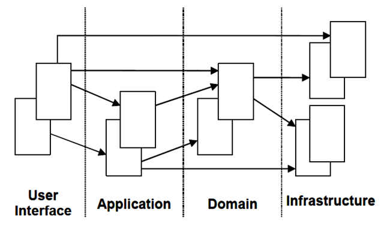
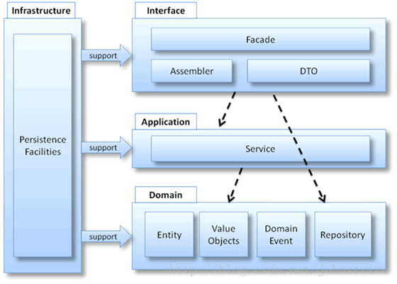
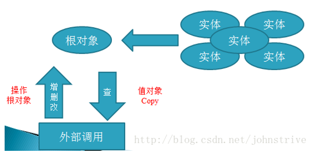
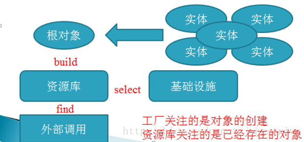

# 经典分层架构

## 目录

1. 经典分层
   - [Presentation用户界面/展现层](#Presentation用户界面/展现层)
   - [Distributed&nbsp;Service&nbsp;Layer分布式服务层](#Distributed&nbsp;Service&nbsp;Layer分布式服务层)
   - [Application应用层](#Application应用层)
   - [Domain领域层](#Domain领域层)
   - [Infrastructure基础设施层](#Infrastructure基础设施层)
2. [详细架构](#详细架构)
3. [思考总结](#思考总结)

## Presentation用户界面/展现层

负责向用户展现信息以及解释用户命令。更细的方面来讲就是：

1. 请求应用层以获取用户所需要展现的数据；
2. 发送命令给应用层要求其执行某个用户命令；

该层的主要职责是通过用户界面向用户展示必要的数据信息，同时接收用户的反馈。该层中的组件主要实现了与图形界面、用户操作捕获、数据转发等用户界面功能。建议根据项目的实际情况，选用相关的模式（比如MVC、MVP或者MVVM等）将这些组件细分到更小的层中。

## Distributed&nbsp;Service&nbsp;Layer分布式服务层

当应用程序以服务提供商(Service Provider)的方式向其它远程应用程序提供业务功能时，或者应用程序的客户端本身是被部署在另一个远程位置时，其业务逻辑就必须通过分布式服务层向外界发布。分布式服务层（通常被实现为Web Service）可以根据可配置的通信通道与数据消息格式，为应用程序提供远程访问的功能。需要注意的是，分布式服务层中不应该包含任何业务逻辑的实现。

## Application应用层

很薄的一层，定义软件要完成的所有任务。对外为展现层提供各种应用功能（包括查询或命令），对内调用领域层（领域对象或领域服务）完成各种业务逻辑，应用层不包含业务逻辑。

应用层用于协调领域模型与其它应用组件的工作，以完成一个特定的、明确的系统任务。这种协调可以包括：事务调度、UoW（Unit Of Work，PoEAA）的执行，以及调用一些系统必须的处理任务等。应用层同时还可以包括应用程序的优化、数据的转发和格式转换等工作，当然，我们将这些工作统称为“任务调度”，至于每个任务的核心部分，应用层都会将其转发到下层去处理。应用层通常会被看做是一种“业务层外观(Business Facade)”，但它却不仅仅是转发领域模型层的处理请求/反馈那么简单。它通常可以包含下面这些内容：

- 通过仓储契约(Repository Contract)来访问持久层机制，以读取或保存领域对象。注意这里访问的是仓储契约，而并非仓储的具体实现。仓储的具体实现是基础结构层的内容
- 对来自于不同领域对象的数据进行组织和整理，以便能够让分布式服务层更有效地传递这些数据。通常，我们会将数据整理在数据传输对象(Data Transfer Object, PoEAA)中，例如WCF的Data Contracts
- 管理和维护应用程序的状态（而不是领域模型中领域对象的状态）
- 协调领域对象之间、领域模型与基础结构层组件之间的协作关系。比如在银行转账系统中，资金从一个账户转移到另一个账户，首先需要通过仓储读取“账户”领域对象，然后在领域对象上进行转账操作（可以是“账户”本身的行为，也可以（按Evans的举例）使用领域服务(Domain Service)。或许在完成转账后，无论成功与否，都需要向外发送电子邮件，这就需要基础结构层的电子邮件组件协作完成
- 应用服务(Application Services)：首先需要注意，DDD中提到的服务与平时所说的Web Service等并不是一个概念，它可以存在于应用层、领域模型层甚至基础结构层。DDD中Service所表述的概念，其实是“无法归结到任何一个对象”的一系列操作的集合，因此，Service通常是在协调不同对象之间的工作。应用服务也是如此，它会对其它下层组件（比如领域模型层与基础结构层）进行协调
- 业务工作流(Business Workflow)：业务工作流并非必须的，对于某些由特定步骤组成的业务过程，引入业务工作流会使问题变得简单

## Domain领域层

负责表达业务概念，业务状态信息以及业务规则，领域模型处于这一层，是业务软件的核心。

该层的主要职责是展现业务/领域逻辑、业务处理状态，以及实现业务规则，它同时也包含了领域对象的状态信息。这一层是整个应用程序的核心部分，它可以包含下面这些概念和内容：

- 实体(Entities)
- 值对象(Value Objects)
- 领域服务(Domain Services)
- 仓储契约/接口(Repository Contracts/Interfaces)
- 聚合及其工厂(Aggregates and Factories)
- 聚合根(Aggregate Roots)
- 规约对象(Specifications)

## Infrastructure基础设施层

本层为其他层提供通用的技术能力；提供了层间的通信；为领域层实现持久化机制；总之，基础设施层可以通过架构和框架来支持其他层的技术需求；

1. 基础结构层（数据持久化部分）（Data Persistence Infrastructure Layer）：该层为应用程序的数据存取提供服务，它可以是应用程序本身的持久化机制，也可以是外部系统提供的数据访问的Web Service等。根据分层架构的设计原则，该层应该以“低耦合”的方式向上层提供数据持久化服务。因此，该层可以包含如下这些内容：
   - 仓储的具体实现：从概念上看，“仓储”意味着对一组相同类型对象的集中管理，就好像是存取同一类型对象的仓库。然而在实践中，仓储主要用来在特定的持久化机制/技术上执行对象的读取和保存操作。这些持久化机制/技术可以是Entity Framework、NHibernate或者是针对某一数据库引擎的ADO.NET组件。为了简单起见，我们将数据访问操作集中到仓储中，并针对不同的持久化机制/技术开发一个仓储的具体实现，这将会对应用程序的维护和部署带来便捷。在设计仓储时，通常的做法是，首先对领域模型划分聚合并区分聚合根，然后针对每一个聚合设计一个仓储，仓储通过聚合根对聚合进行管理。在领域模型层中，各组件是通过仓储契约（接口）来实现对仓储的访问的，这样做就使得领域模型层无需了解任何仓储的具体实现和持久化细节(Persistence Ignorance)，读者可以参考我前面写的《EntityFramework之领域驱动设计实践（八）》一文。此外，我们通常所讲的“数据访问对象(Data Access Object)”并不是仓储，首先，仓储通过聚合根，负责整个聚合的读取和存储，它是一个领域概念，而数据访问对象则是对单个对象（更确切地说应该是单个数据结构）直接进行数据库操作；其次，操作方式也不同，仓储会在提交前先对内存中的对象进行标记，最后的一次提交过程(Unit Of Work, PoEAA)则是在上层组件（比如在应用层）中完成的
   - 层超类型(Layer Supertype, PoEAA)：通常，在实现某层的特定功能时，我们会将一系列对象的公共逻辑提取出来，然后将这些逻辑置于一个抽象类型中，同时使得其它类型都继承于该抽象类型以避免逻辑重复。这样的抽象类型被称为层超类型。大多数数据访问任务可以使用层超类型以简化开发，减少代码维护成本。例如，在实现面向ADO.NET的数据库访问组件时，我们可以在层超类型中使用DbConnection、DbCommand等对象实现公用逻辑，然后在子类中继承这些逻辑并提供具体的SqlConnection、SqlCommand或者OleDbConnection、OleDbCommand实例
   - 数据模型(Data Model)：如果使用ORM来实现仓储，那么通常情况下ORM都会使用一个数据模型（比如Entity Framework）来实现需要的功能，这样的数据模型有点像实体模型，但它与数据传输对象一样，跟领域模型层的实体模型是完全不同的。数据模型甚至是一种可视化的图形描述，由专门的可视化设计工具负责维护
   - 远程/外部服务代理：当采用外部系统来实现数据持久化机制时，远程/外部服务代理负责连接外部系统并转发数据操作请求及响应信息
2. 基础结构层（Cross-Cutting）：该层提供了能被其它各层访问的通用技术框架，比如异常捕获与处理、日志、认证、授权、验证、跟踪、监视、缓存等等。这些操作通常会横向散布在应用程序的各个层面，我们平时讨论的面向方面编程(AOP)关注的就是如何在不影响对象本身处理逻辑的基础上来实现这些横切的却又必不可少的功能点。在实践中，通过使用一些流行的Interception框架（例如Microsoft Unity、Castle DynamicProxy等）可以帮助我们方便地实现AOP。

- 将领域模型相关的代码集中到一个层中，把它从用户界面、应用和基础设施代码中分隔开来
- 释放领域对象的显示自己、保存自己、管理应用任务等职责，让它专注于展现领域模型
- 复杂的程序切分成层
- 层中采用内聚的设计
- 层仅依赖于它底下的那层

## 详细架构

- 实体(Entity)：实体就是领域中需要唯一标识的领域概念。实体有生命周期，实体从被创建后可能会被持久化到数据库。
- 值对象(Value Object)：在领域中，并不是每一个事物都必须有一个唯一标识，也就是说我们不关心对象是哪个，而只关心对象是什么。
- 领域服务(Domain Service)：领域服务是以动词开头来命名的，需要强调的是领域服务是无状态的，它存在的意义就是协调领域对象共同完成某个操作，所有的状态还是都保存在相应的领域对象中。通过调用领域服务提供的简单易懂但意义明确的接口可以避免领域逻辑泄露到应用层。
- 模块
- 聚合：针对数据变化可以考虑成一个单元的一组相关的对象。控制所有权和边界

- 工厂(Factory)：DDD中的工厂也是一种体现封装思想的模式。DDD中引入工厂模式的原因是：有时创建一个领域对象是一件比较复杂的事情，不仅仅是简单的new操作。客户传递给工厂一些简单的参数，然后工厂可以在内部创建出一个复杂的领域对象然后返回给客户，简单的调用领域工厂创建出期望的对象。
- 资源库或仓储(Repository)：资源库目的是封装所有获取对象引用所需的逻辑。仓储分为仓储定义部分和仓储实现部分，在领域模型中定义仓储的接口，从某个类似集合的地方根据某个条件获取对象。

## 思考总结

领域建模不是面向技术的一种纯软件设计方法，它是一种思维方式，我们采用它来搭建领域模型。它体现了系统的核心价值，及能解决的问题及解决的程度。
