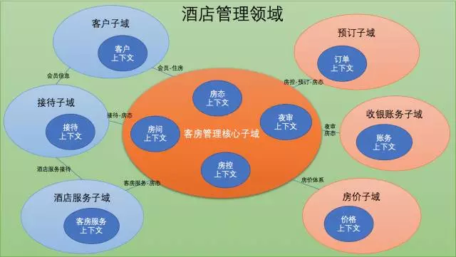
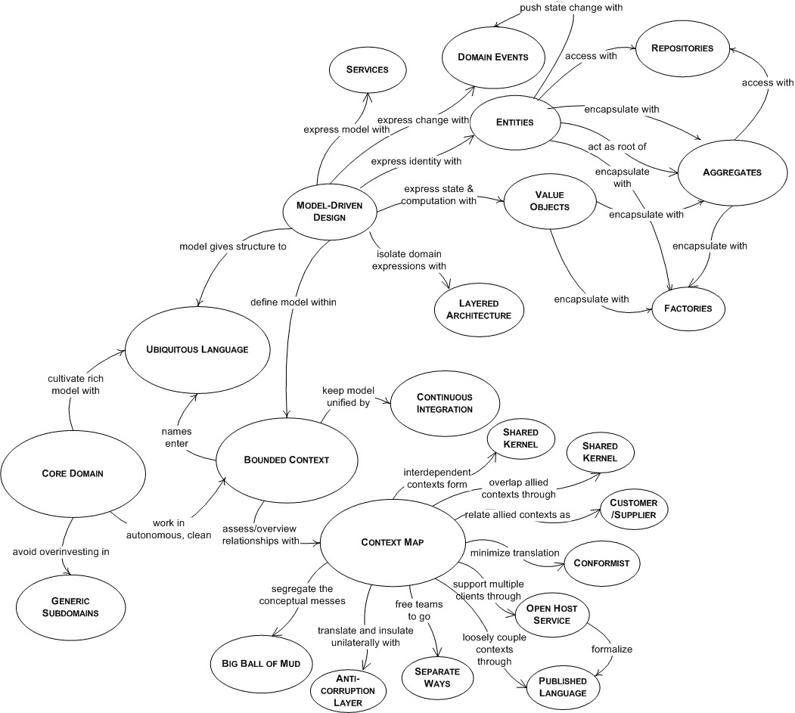
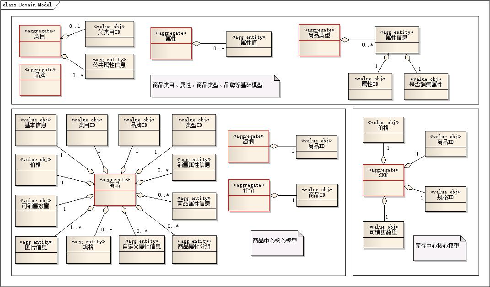
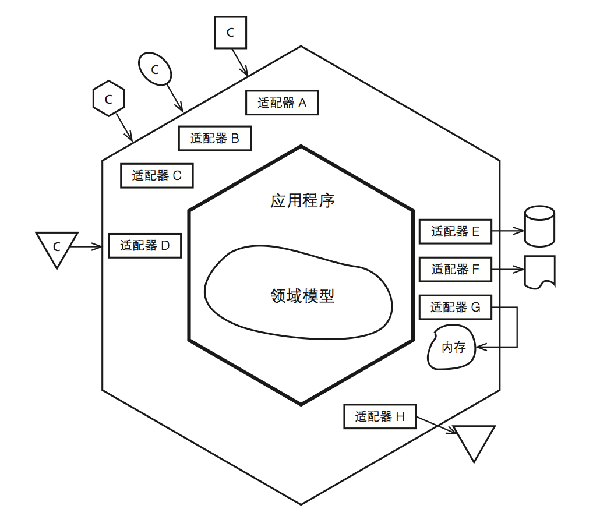
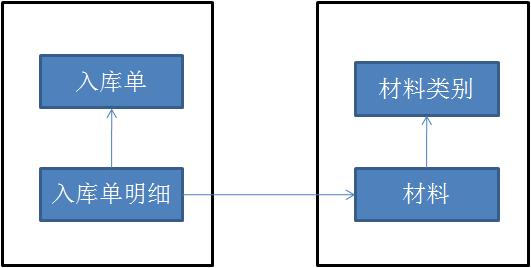
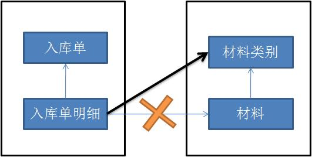

# 领域驱动设计总结

```txt
在黄昏里希冀皓月与繁星
在深夜希冀着黎明
在炎夏希冀良秋
在严冬又希冀新春
这不断的希冀啊，使我感触到世界的存在，带给我多量的生命的力。
这样，我才能跨过——这黎明黄昏，黄昏黎明，春夏秋冬，秋冬春夏的茫茫的时间的大海啊。
——艾青
```

## 目录

1. 理解领域驱动设计(DDD)
   - [DDD切入点1&nbsp;-&nbsp;理解概念](#DDD切入点1&nbsp;-&nbsp;理解概念)
   - [DDD切入点2&nbsp;-&nbsp;理解领域、拆分领域、细化领域](#DDD切入点2&nbsp;-&nbsp;理解领域、拆分领域、细化领域)
   - [DDD切入点3&nbsp;-&nbsp;领域模型设计](#DDD切入点3&nbsp;-&nbsp;领域模型设计)
     - [经典分层架构](#经典分层架构)
     - [使用的模式](#使用的模式)
     - [关联的设计](#关联的设计)
     - [实体(Entity)](#实体(Entity))
     - [值对象(Value&nbsp;Object)](#值对象(Value&nbsp;Object))
     - [领域服务(Domain&nbsp;Service)](#领域服务(Domain&nbsp;Service))
     - [聚合及聚合根(Aggregate，Aggregate&nbsp;Root)](#聚合及聚合根(Aggregate，Aggregate&nbsp;Root))
     - [工厂(Factory)](#工厂(Factory))
     - [仓储(Repository)](#仓储(Repository))
     - [领域建模的方法](#领域建模的方法)
     - [聚合根、实体、值对象的区别](#聚合根、实体、值对象的区别)
     - [聚合根、实体、值对象对象之间如何建立关联](#聚合根、实体、值对象对象之间如何建立关联)
     - [如何识别聚合与聚合根](#如何识别聚合与聚合根)
     - [值对象和实体的区别](#值对象和实体的区别)
2. [领域驱动设计(DDD)实现之路](#领域驱动设计(DDD)实现之路)
   - [DDD之战略设计](#DDD之战略设计)
     - [领域和子域(Domain/Subdomain)](#领域和子域(Domain/Subdomain))
     - [限界上下文(Bounded Context)](#限界上下文(Bounded&nbsp;Context))
     - [架构风格(Architecture)](#架构风格(Architecture))
   - [面向对象分析方法](#面向对象分析方法)
   - [案例分析：图书管理系统需求用例场景描述](#案例分析：图书管理系统需求用例场景描述)
   - [关于聚合设计的几个原则](#关于聚合设计的几个原则)
   - [从聚合和哲学的角度思考，为什么需要状态](#从聚合和哲学的角度思考，为什么需要状态)
   - [关于聚合的设计的一些思考](#关于聚合的设计的一些思考)
     - [关于DDD中一个领域对象是否是聚合根的考虑](#关于DDD中一个领域对象是否是聚合根的考虑)
     - [关于一个聚合内应该聚合哪些信息的思考](#关于一个聚合内应该聚合哪些信息的思考)
     - [关于如何更合理的设计聚合来封装各种业务规则的思考](#关于如何更合理的设计聚合来封装各种业务规则的思考)
   - [ENode框架对聚合设计和聚合之间交互的支持](#ENode框架对聚合设计和聚合之间交互的支持)
   - [四色原型的学习心得分享](#四色原型的学习心得分享)
   - [使用聚合(Aggregate)来设计类库](#使用聚合(Aggregate)来设计类库)

**从遇到问题开始：**

当人们要做一个软件系统时，一般总是因为遇到了什么问题，然后希望通过一个软件系统来解决。

比如，我是一家企业，然后我觉得我现在线下销售自己的产品还不够，我希望能够在线上也能销售自己的产品。所以，自然而然就想到要做一个普通电商系统，用于实现在线销售自己企业产品的目的。

再比如，我是一家互联网公司，公司有很多系统对外提供服务，面向很多客户端设备。但是最近由于各种原因，导致服务经常出故障。所以，我们希望通过各种措施提高服务的质量和稳定性。其中的一个措施就是希望能做一个灰度发布的平台，这个平台可以提供灰度发布的服务。然后，当某个业务系统做了一些修改并需要发布时，可以使用我们的灰度发布平台来非常方便的实现灰度发布的功能。比如在灰度发布平台上方便的定制允许哪些特定的客户端才会访问新服务，哪些客户端继续使用老服务。灰度发布平台可以提供各种灰度的策略。有了这样的灰度发布机制，那即便系统的新逻辑有什么问题，受影响的面也不会很大，在可控范围内。所以，如果公司里的所有对外提供服务的系统都接入了灰度平台，那这些系统的发布环节就可以更加有保障了。

总之，我们做任何一个软件系统，都是有原因的，否则就没必要做这个系统，而这个原因就是我们遇到的问题。所以，通过问题，我们就知道了我们需要一个什么样的系统，这个系统解决什么样的问题。最后，我们就很自然的得出了一个目标，即知道了自己要什么。比如我要做一个论坛、一个博客系统、一个电商平台、一个灰度发布系统、一个IDE、一个分布式消息队列、一个通信框架，等等。

## DDD切入点1&nbsp;-&nbsp;理解概念

DDD的全称为Domain-driven Design，即领域驱动设计。下面我从领域、问题域、领域模型、设计、驱动这几个词语的含义和联系的角度去阐述DDD是如何融入到我们平时的软件开发初期阶段的。要理解什么是领域驱动设计，首先要理解什么是领域，什么是设计，还有驱动是什么意思，什么驱动什么。

**什么是领域（Domain）？**

前面我们已经清楚的知道我们现在要做一个什么样的系统，这个系统需要解决什么问题。我认为任何一个系统都会属于某个特定的领域，比如论坛是一个领域，只要你想做一个论坛，那这个论坛的核心业务是确定的，比如都有用户发帖、回帖等核心基本功能。比如电商平台、普通电商系统，这种都属于网上电商领域，只要是这个领域的系统，那都有商品浏览、购物车、下单、减库存、付款交易等核心环节。所以，同一个领域的系统都具有相同的核心业务，因为他们要解决的问题的本质是类似的。

因此，我们可以推断出，一个领域本质上可以理解为就是一个问题域，只要是同一个领域，那问题域就相同。所以，只要我们确定了系统所属的领域，那这个系统的核心业务，即要解决的关键问题、问题的范围边界就基本确定了。通常我们说，要成为一个领域的专家，必须要在这个领域深入研究很多年才行。因为只有你研究了很多年，你才会遇到非常多的该领域的问题，同时你解决这个领域中的问题的经验也非常丰富。<b style="color:red">很多时候，领域专家比技术专家更加吃香</b>，比如金融领域的专家。

**什么是设计（Design）？**

DDD中的设计主要指领域模型的设计。为什么是领域模型的设计而不是架构设计或其他的什么设计呢？因为DDD是一种基于模型驱动开发的软件开发思想，强调领域模型是整个系统的核心，领域模型也是整个系统的核心价值所在。每一个领域，都有一个对应的领域模型，领域模型能够很好的帮我们解决复杂的业务问题。

从领域和代码实现的角度来理解，领域模型绑定了领域和代码实现，确保了最终的代码实现就一定是解决了领域中的核心问题的。因为：1）领域驱动领域模型设计；2）领域模型驱动代码实现。我们只要保证领域模型的设计是正确的，就能确定领域模型可以解决领域中的核心问题；同理，我们只要保证代码实现是严格按照领域模型的意图来落地的，那就能保证最后出来的代码能够解决领域的核心问题的。这个思路，和传统的分析、设计、编码这几个阶段被割裂（并且每个阶段的产物也不同）的软件开发方法学形成鲜明的对比。

**什么是驱动（Driven）？**

上面其实已经提到了，就是：1）领域驱动领域模型设计；2）领域模型驱动代码实现。

这个就和我们传统的**数据库驱动**开发的思路形成对比了。DDD中，我们总是以领域为边界，分析领域中的核心问题（核心关注点），然后设计对应的领域模型，再通过领域模型驱动代码实现。而像数据库设计、持久化技术等这些都不是DDD的核心，而是外围的东西。

领域驱动设计（DDD）告诉我们的最大价值我觉得是：<b style="color:green">当我们要开发一个系统时，应该尽量先把领域模型想清楚，然后再开始动手编码，这样的系统后期才会很好维护。</b>

但是，很多项目（尤其是互联网项目，为了赶工）都是一开始模型没想清楚，一上来就开始建表写代码，代码写的非常冗余，完全是过程式的思考方式，最后导致系统非常难以维护。

而且更糟糕的是，出来混总是要还的，前期的领域模型设计的不好，不够抽象，如果你的系统会长期需要维护和适应业务变化，那后面你一定会遇到各种问题维护上的困难，比如数据结构设计不合理，代码到处冗余，改BUG到处引入新的BUG，新人对这种代码上手困难等。

而此时如果你再想重构模型，那要付出的代价会比一开始重新开发还要大，因为你还要考虑兼容历史的数据，数据迁移，如何平滑发布等各种头疼的问题。所以，就导致我们最后天天加班。

虽然，我们都知道这个道理，但是我也明白，人的习惯很难改变的，大部分人都很难从面向过程式的想到哪里写到哪里的思想转变为基于系统化的模型驱动的思维。我想，这或许是DDD很难在中国或国外流行起来的原因吧。但是，我想这不应该成为我们放弃学习DDD的原因，对吧！

概念总结：

1. 领域就是问题域，有边界，领域中有很多问题；
2. 任何一个系统要解决的那个大问题都对应一个领域；
3. 通过建立领域模型来解决领域中的核心问题，模型驱动的思想；
4. 领域建模的目标针对我们在领域中所关心的问题，即只针对核心关注点，而不是整个领域中的所有问题；
5. 领域模型在设计时应考虑一定的抽象性、通用性，以及复用价值；
6. 通过领域模型驱动代码的实现，确保代码让领域模型落地，代码最终能解决问题；
7. 领域模型是系统的核心，是领域内的业务的直接沉淀，具有非常大的业务价值；
8. 技术架构设计或数据存储等是在领域模型的外围，帮助领域模型进行落地；

## DDD切入点2&nbsp;-&nbsp;理解领域、拆分领域、细化领域

**理解领域知识是基础：**

上面我们通过第一步，虽然我们明确了要做一个什么样的系统，该系统主要解决什么问题，但是就这样我们还无法开始进行实际的需求分析和模型设计，我们还必须将我们的问题进行拆分，需求进行细化。

有些时候，需求方，即提出问题的人，很可能自己不清楚具体想要什么。他只知道一个概念，一个大的目标。比如他只知道要做一个股票交易系统，一个灰度发布系统，一个电商平台，一个开发工具，等。但是他不清楚这些系统应该具体做成什么样子。

这个时候，我认为领域专家就非常重要了，DDD也非常强调领域专家的重要性。因为领域专家对这个领域非常了解，对领域内的各种业务场景和各种业务规则也非常清楚，总之，对这个领域内的一切业务相关的知识都非常了解。所以，他们自然就有能力表达出系统该做成什么样子。所以，要知道一个系统到底该做成什么样子，到底哪些是核心业务关注点，只能靠沉淀领域内的各种知识，别无他法。

因此，假设你现在打算做一个电商平台，但是你对这个领域没什么了解，那你一定得先去了解下该领域内主流的电商平台，比如淘宝、天猫、京东、亚马逊等。这个了解的过程就是你沉淀领域知识的过程。如果你不了解，就算你领域建模的能力再强，各种技术架构能力再强也是使不上力。

领域专家不是某个固定的角色，而是某一类人，这类人对这个领域非常了解。比如，一个开发人员也可以是一个领域专家。假设你在一个公司开发和维护一个系统已经好几年了，但是这个系统的产品经理（PD）可能已经换过好几任了，这种情况下，我相信这几任产品经理都没有比你更熟悉这个领域。

**拆分领域：**

上面我们明白了，领域建模的基础是要先理解领域，让自己成为领域专家。如果做到了这点，我们就打好了坚实的基础了。

但是，有时一个领域往往太复杂，涉及到的领域概念、业务规则、交互流程太多，导致我们没办法直接针对这个大的领域进行领域建模。所以，我们需要将领域进行拆分，本质上就是把大问题拆分为小问题，然后各个击破的思路。

然后既然把一个大的领域划分为了多个小的领域（子域），那最关键的就是要理清每个子域的边界；然后要搞清楚哪些子域是核心子域，哪些是非核心子域，哪些是公共支撑子域；然后，还要思考子域之间的联系是什么。

那么，我们该如何划分子域呢？我的个人看法是从业务相关性的角度去思考，也就是我们平时说的按业务功能为出发点进行划分。

通常来说，一个领域有且只有一个核心问题，我们称之为该领域的核心子域。在核心子域、通用子域、支撑子域梳理的同时，会定义出子域中的限界上下文及其关系，用它来阐述子域之间的关系。界限上下文可以简单理解成一个子系统或组件模块。

例如：下图是对酒店管理的子域和界限上下文的梳理：



我个人从来不相信什么子域划分的技巧什么的东西，因为我觉得这个工作没有任何诀窍可以使用。当我们不了解一个东西的时候，如何去拆解它？当我们对整个领域有一定的熟悉了，了解了领域内的相关业务的本质和关系，我们就自然而然的能划分出合理的子域了。

不过并不是所有的系统都需要划分子域的，有些系统只是解决一个小问题，这个问题不复杂，可能只有一两个核心概念。所以，这种系统完全不需要再划分子域。

但不是绝对的，当一个领域，我们的关注点越来越多，每个关注点我们关注的信息越来越多的时候，我们会不由自主的去进一步的划分子域。比如，也许我们一开始将商品和商品的库存都放在商品中心里，但是后来由于库存的维护越来越复杂，导致揉在一起对我们的系统维护带来一定的困难时，我们就会考虑将两者进行拆分，这个就是所谓的业务垂直分割。

**细化子域：**

通过上面的两步，我们了解了领域里的知识，也对领域进行了子域划分。但这样还不够，凭这些我们还无法进行后续的领域模型设计。我们还必须再进一步细化每个子域，进一步明确每个子域的核心关注点，即需求细化。我觉得我们需要细化的方面有以下几点：

1. 梳理领域概念：梳理出领域内我们关注的概念、概念的关系，并统一交流词汇，形成统一语言；
2. 梳理业务规则：梳理出领域内我们关注的各种业务规则，DDD中叫不变性(invariants)，比如唯一性规则，余额不能小于零等；
3. 梳理业务场景：梳理出领域内的核心业务场景，比如电商平台中的加入购物车、提交订单、发起付款等核心业务场景；
4. 梳理业务流程：梳理出领域内的关键业务流程，比如订单处理流程，退款流程等；

从上面这4个方面，我们从领域概念、业务规则、交互场景、业务流程等维度梳理了我们到底要什么，整理了整个系统应该具备的功能。

这个工作我觉得是一个非常具有创造性和有难度的工作。我们一方面会主观的定义我们想要什么；另一方面，我们还会思考我们要的东西的合理性。我认为这个就是产品经理的工作，产品经理必须要负起职责，把他的产品充分设计好，从各个方面去考虑，如何设计一个产品，才能更好的解决用户的核心诉求，即领域内的核心问题。如果对领域不够了解，如果想不清楚用户到底要什么，如果思考问题不够全面，谈何设计出一个合理的产品呢？

关于领域概念的梳理，我觉得可以采用**四色原型**分析法，这个分析法通过系统的方法，将概念划分为不同的种类，为不同种类的概念标注不同的颜色。然后将这些概念有机的组合起来，从而让我们可以清晰的分析出概念和概念之间的关系。有兴趣的同学可以在网上搜索下四色原型。

>注意：上面我说的这四点，重点是梳理出我们要什么功能，而不是思考如何实现这些功能，如何实现是软件设计人员的职责。

## DDD切入点3&nbsp;-&nbsp;领域模型设计

这部分内容，我想学习DDD的人都很熟悉了。DDD原著中提出了很多实用的建模工具：聚合、实体、值对象、工厂、仓储、领域服务、领域事件。我们可以使用这些工具，来设计每一个子域的领域模型。最终通过领域模型图将设计沉淀下来。

要使用这些工具，首先就要理解每个工具的含义和使用场景。不要以为很简单哦，比如聚合的划分就是一个非常具有艺术的活。同一个系统，不同的人设计出来的聚合是完全不同的。而且很有可能高手之间的最后设计出来的差别反而更大，实际上我认为是世界观的相互碰撞，呵呵。所以，要领域建模，我觉得每个人都应该去学学哲学知识，这有助于我们更好的认识世界，更好的理解事物的本质。

关于这些建模工具的概念和如何运用我就不多展开了，我博客里也有很多这方面的介绍。下面我再讲一下我认为比较重要的东西，比如到底该如何领域建模？步骤应该是怎么样的？

### 领域建模

领域驱动设计(Domain-Driven Design)分为两个阶段：

1. 以一种领域专家、设计人员、开发人员都能理解的通用语言作为相互交流的工具，在交流的过程中发现领域概念，然后将这些概念设计成一个领域模型；
2. 由领域模型驱动软件设计，用代码来实现该领域模型；

由此可见，领域驱动设计的核心是建立正确的领域模型。领域模型具有以下特点：

1. 对具有某个边界的领域的一个抽象，反映了领域内用户业务需求的本质。它属于解决问题空间。领域模型是有边界的，只反应了我们在领域内所关注的部分，包括实体概念（如：货物，书本，应聘记录，地址等），以及过程概念（如：资金转账等）；
2. 提高软件的可维护性，业务可理解性以及可重用性。领域模型确保了我们的软件的业务逻辑都在一个模型中，帮助开发人员相对平滑地将领域知识转化为软件构造；
3. 贯穿软件分析、设计、开发的整个过程。领域专家、设计人员、开发人员面向同一个模型进行交流，彼此共享知识与信息，所以可以防止需求走样，让软件开发人员做出来的软件真正满足需求；要建立正确的领域模型并不简单，需要领域专家、设计、开发人员积极沟通共同努力，然后才能使大家对领域的认识不断深入，从而不断细化和完善领域模型；
4. 为了让领域模型看的见，使用的常用表达领域模型的方式：图、代码或文字；
5. 重要性：领域模型是整个软件的核心，是软件中最有价值和最具竞争力的部分；设计足够精良且符合业务需求的领域模型能够更快速的响应需求变化；

### 领域通用语言

由软件专家和领域专家合作开发一个领域的模型是有必要的。

开发过程中，开发人员以类、算法、设计模式、架构等进行思考与交流。但领域专家对此一无所知，他们对技术上的术语没有太多概念，只了解特有的领域专业技能，例如：在空中交通监控样例中，领域专家知道飞机、路线、海拔、经度、纬度，他们有自己的术语来讨论这些事情。软件专家和领域专家交流过程中，需要做翻译才能让对方理解这些概念。

领域驱动设计的一个核心原则是使用一种基于模型的语言。使用模型作为语言的核心骨架，要求团队在进行所有的交流是都使用一致的语言，在代码中也是这样，这种语言被称为**通用语言**。

**建模思考的问题：用户需求！**

『用户需求』不能等同于『用户』，捕捉『用户心中的模型』也不能等同于『以用户为核心设计领域模型』。

<b style="color:red">设计领域模型时不能以用户为出发点去思考问题，不能老想着用户会对系统做什么；而应该从一个客观的角度，根据用户需求挖掘出领域内的相关事物，思考这些事物的本质关联及其变化规律作为出发点去思考问题。</b>

领域模型是排除了人之外的客观世界模型，包含了人所扮演的参与者角色。但是<b style="color:red">一般情况下不要让参与者角色在领域模型中占据主要位置</b>，否则各个系统的领域模型将变得没有差别，因为软件系统就是一个人机交互的系统，都是以人为主的活动记录或跟踪。例如：

- 论坛中如果以人为主导，那么领域模型就是：人发帖，人回帖，人结贴，等等；
- 货物托运系统中如果以人为主导，就变成了：托运人托运货物，收货人收货物，付款人付款，等等；

以一个货物运输系统为例子简单说明一下。在用户需求相对明朗之后，这样描述领域模型：

- 一个Cargo（货物）涉及多个Customer（客户，如托运人、收货人、付款人），每个Customer承担不同的角色；
- Cargo的运送目标已指定，即Cargo有一个运送目标；
- 由一系列满足Specification（规格）的Carrier Movement（运输动作）来完成运输目标；

以上描述没有从用户的角度去描述领域模型，而是以领域内的相关事物为出发点，考虑这些事物的本质关联及其变化规律的：

- 以货物为中心，把客户看成是货物在某个场景中可能会涉及到的关联角色，如货物会涉及到托运人、收货人、付款人；
- 货物有一个确定的目标，货物会经过一系列的运输动作到达目的地。

以用户为中心来思考领域模型的思维只是停留在需求的表面，而没有挖掘出真正的需求的本质。领域建模时需要努力挖掘用户需求的本质，这样才能真正实现用户需求。

### 经典分层架构

- 用户界面/展示层：1) 请求应用层获取用户所需的展示数据；2) 发送命令给应用层执行用户的命令
- 应用层：薄薄的一层，定义软件要完成的任务。对外为展示层提供各种应用功能，对内调用领域层（领域对象或领域服务）完成各种业务逻辑。应用层不包含业务逻辑
- 领域层：表达业务概念、业务状态信息及业务规则，是业务软件的核心
- 基础设施层：为其他层提供通用的技术能力，提供了层间通信；为领域层提供持久化机制。

### 使用的模式

总览图：



### 关联的设计

关联在领域建模的过程中非常重要，关联的设计可以遵循如下的一些原则：

- 关联尽量少。对象之间复杂的关联容易形成对象的关系网，对于理解和维护单个对象很不利，同时也很难划分对象与对象之间的边界；另外，减少关联有助于简化对象之间的遍历；
- 关联尽量保持单向的关联；
- 在建立关联时，需要挖掘是否存在关联的限制条件。如果存在，那么最好把限制条件加到关联上，往往这样的限制条件能将关联化繁为简，即将多对多简化为1对多，或将1对多简化为1对1；

### 实体(Entity)

实体就是领域中需要唯一标识的领域概念。因为我们有时需要区分是哪个实体：有两个实体，如果唯一标识不一样，那么即便实体的其他所有属性都一样，也认为他们是两个不同的实体。

不应该给实体定义太多的属性或行为，而应该寻找关联，将属性或行为转移到其他关联的实体或值对象上。

比如：Customer 实体，有一些地址信息，由于地址信息是一个完整的有业务含义的概念，所以我们可以定义一个 Address 对象，然后把 Customer 的地址相关的信息转移到 Address 对象上。如果没有 Address 对象，而把这些地址信息直接放在 Customer 对象上，然后对于一些其他的类似Address的信息也都直接放在Customer 上，会导致 Customer 对象很混乱，结构不清晰，最终导致它难以维护和理解。

### 值对象(Value&nbsp;Object)

并不是每一个事物都必须有一个唯一标识。就以上面的地址对象 Address 为例，如果两个 Customer 的地址信息是一样的，我们就会认为这两个 Customer 的地址是同一个。用程序的方式来表达就是：如果两个对象所有属性的值都相同，我们会认为它们是同一个对象，那么就可以把这种对象设计为值对象。

值对象的特征：

- 值对象没有唯一标识，这是它和实体的最大不同。值对象在判断是否是同一个对象时是通过它们的所有属性是否相同，如果相同则认为是同一个值对象。在区分是否是同一个实体时，只看实体的唯一标识是否相同，而不管实体的属性是否相同。
- 值对象是不可变的，即所有属性都是只读的，所以可以被安全的共享。

应该给值对象设计的尽量简单，不要让它引用很多其他的对象。值对象只是一个值，类似（int a = 3）中的『3』，只不过是用对象来表示。值对象虽然是只读的，是一个完整的不可分割的整体，但是可以被整个替换掉：类似（a = 4）把a的值由『3』替换为为『4』，当修改 Customer 的 Address 对象引用时，不是通过 Customer.Address.Street 这样的方式来修改属性，可以这样做：Customer.Address = new Address(…)

### 领域服务(Domain&nbsp;Service)

领域中的一些概念不太适合建模为对象（实体对象或值对象），因为它们本质上就是一些操作、动作，而不是事物。这些操作往往需要协调多个领域对象。如果强行将这些操作职责分配给任何一个对象，则被分配的对象就是承担一些不该承担的职责，从而会导致对象的职责不明确很混乱。

DDD认为领域服务模式是一个很自然的范式用来对应这种跨多个对象的操作。一般的领域对象都是有状态和行为的，而领域服务没有状态只有行为。

领域服务还有一个很重要的功能就是可以避免领域逻辑泄露到应用层。因为如果没有领域服务，那么应用层会直接调用领域对象完成本该是属于领域服务该做的操作，需要了解每个领域对象的业务功能，以及它可能会与哪些其他领域对象交互等一系列领域知识。这样一来，领域层可能会把一部分领域知识泄露到应用层。对于应用层来说，通过调用领域服务提供的简单易懂且意义明确的接口肯定也要比直接操纵领域对象容易的多。

说到领域服务，还需要提一下软件中一般有三种服务：应用层服务、领域服务、基础服务。从以下的例子中可以清晰的看出每种服务的职责：

**应用层服务：**

1. 获取输入（如一个XML请求）
2. 发送消息给领域层服务，要求其实现转帐的业务逻辑
3. 领域层服务处理成功，则调用基础层服务发送Email通知

**领域层服务：**

1. 获取源帐号和目标帐号，分别通知源帐号和目标帐号进行扣除金额和增加金额的操作
2. 提供返回结果给应用层

**基础层服务：**

1. 按照应用层的请求，发送Email通知

### 聚合及聚合根(Aggregate，Aggregate&nbsp;Root)

聚合定义了一组具有内聚关系的相关对象的集合，以及对象之间清晰的所属关系和边界，避免了错综复杂的难以维护的对象关系网的形成。我们把聚合看作是一个修改数据的单元。

**聚合有以下特点：**

1. 每个聚合有一个根和一个边界：根是聚合内的某个实体；边界定义了一个聚合内部有哪些实体或值对象；
2. 聚合根是外部可以保持对聚合引用的唯一元素，负责与外部其他对象打交道并维护自己内部的业务规则。聚合内部的对象之间可以相互引用，但是聚合外部如果要访问聚合内部的对象时，必须通过聚合根开始导航，绝对不能绕过聚合根直接访问聚合内的对象；
3. 聚合内除根以外的其他实体的唯一标识都是本地标识，也就是只要在聚合内部保持唯一即可，因为它们总是从属于这个聚合的；
4. 聚合内部的对象可以保持对其他聚合根的引用；
5. 删除一个聚合根时必须同时删除该聚合内的所有相关对象，因为他们都同属于一个聚合，是一个完整的概念；
6. 基于聚合的以上概念，我们可以推论出从数据库查询时的单元也是以聚合为一个单元，不能直接查询聚合内部的某个非根的对象；

**如何识别聚合：**

可以从业务的角度分析哪些对象它们的关系是内聚的，可看成一个整体来考虑的，然后这些对象可以放在一个聚合内。

关系内聚是指这些对象之间必须保持一个固定规则，固定规则是指在数据变化时必须保持不变的一致性规则。当修改一个聚合时，必须在事务级别确保整个聚合内的所有对象满足这个固定规则。

聚合尽量不要太大，否则可能带来一定的性能问题。通常在大部分领域模型中，有70%的聚合通常只有一个实体，即聚合根，该实体内部没有包含其他实体，只包含一些值对象；另外30%的聚合中，基本上也只包含两到三个实体。

**如何识别聚合根：**

如果一个聚合只有一个实体，那么这个实体就是聚合根；如果有多个实体，那么我们可以思考聚合内哪个对象有独立存在的意义并且可以和外部直接进行交互。

### 工厂(Factory)

DDD中的工厂也是一种体现封装思想的模式。DDD中引入工厂模式的原因是：有时创建一个领域对象是一件比较复杂的事情，不仅仅是简单的new操作。工厂是用来封装创建一个复杂对象尤其是聚合时所需的知识，将创建对象的细节（如何实例化对象，然后做哪些初始化操作）隐藏起来。

客户传递给工厂一些简单的参数，如果参数符合业务规则，则工厂可以在内部创建出一个相应的领域对象返回给客户；但是如果参数无效，应该抛出异常，以确保不会创建出一个错误的对象。当然也并不总是需要通过工厂来创建对象，事实上大部分情况下领域对象的创建都不会太复杂，只需要简单的使用构造函数就可以了。隐藏创建对象的好处：可以不让领域层的业务逻辑泄露到应用层，同时也减轻了应用层的负担，它只需要简单的调用领域工厂创建出期望的对象即可。

### 仓储(Repository)

仓储被设计出来的原因：领域模型中的对象自从创建后不会一直留在内存活动，当它不活动时会被持久化到DB中，当需要的时候会重建该对象。所以，重建对象是一个和DB打交道的过程，需要提供一种机制，提供类似集合的接口来帮助我们管理对象。

仓储里存放的对象一定是聚合，因为之前提到的领域模型是以聚合的概念来划分边界的。我们只对聚合设计仓储，把整个聚合看成一个整体，要么一起取出来，要么一起被删除，不会单独对某个聚合内的子对象进行单独查询和更新。仓储还有一个重要的特征就是分为仓储定义部分和仓储实现部分，在领域模型中定义仓储的接口，而在基础设施层实现具体的仓储。

**设计领域模型时一般步骤：**

1. 根据需求建立初步的领域模型，识别明显的领域概念和之间的关联（1:1, 1:n的关系），用文字精确没有歧义的描述出每个领域概念的含义；
2. 分析主要的软件功能，识别主要的应用层的类，这样有助于及早发现哪些是应用层的职责，哪些是领域层的职责；
3. 进一步分析领域模型，识别出实体、值对象、领域服务；
4. 分析关联，通过对业务的深入分析和软件设计原则及性能方面的权衡，明确关联的方向，去掉一些不需要的关联；
5. 找出聚合边界及聚合根，在分析过程中会出现难以清洗判断的选择问题，这就依赖平时分析经验的积累了；
6. 为聚合根配置仓储，一般情况下为一个聚合分配一个仓储，此时设计好仓储的接口即可；
7. 遍历所有场景，确定设计的领域模型能有效解决业务需求；
8. 考虑如何创建实体和值对象，是通过工厂还是构造函数；
9. 重构模型，寻找模型中有疑问或蹩脚的地方，比如思考：聚合的设计是否正确，模型的性能等等；

领域建模是一个不断重构，持续完善的过程，大家会在讨论中将变化的部分反映到模型中，从而模型不断细化并朝正确的方向走。

### 领域建模的方法

通过上面我介绍的细化子域的内容，现在再来谈该如何领域建模，我觉得就方便很多了。我的主要方法是：

1. 划分好边界上下文，通常每个子域(sub domain)对应一个边界上下文(bounded context)，同一个边界上下文中的概念是明确的，没有任何歧义；
2. 在每个边界上下文中设计领域模型，具体的领域模型设计方法有很多种，如以场景为出发点的四色原型分析法，或者早期的面向对象分析方法；这个步骤最核心的就是找出聚合根，并找出每个聚合根包含的信息；
3. 画出领域模型图，圈出每个模型中的聚合边界；
4. 设计领域模型时，要考虑该领域模型是否满足业务规则，同时还要综合考虑技术实现等问题，比如并发问题；领域模型不是概念模型，概念模型不关注技术实现，领域模型关心；所以领域模型才能直接指导编码实现；
5. 思考领域模型是如何在业务场景中发挥作用的，以及是如何参与到业务流程的每个环节的；
6. 场景走查，确认领域模型是否能满足领域中的业务场景和业务流程；
7. 模型持续重构、完善、精炼；

领域模型的核心作用：

1. 抽象了领域内的核心概念，并建立概念之间的关系；
2. 领域模型承担了领域内的状态的维护；
3. 领域模型维护了领域内的数据之间的业务规则，数据一致性；

下图是一个普通电商系统的商品中心的领域模型图，给大家参考：



领域模型设计只是软件设计中的一小部分

需要特别注意的是，领域模型设计只是整个软件设计中的很小一部分。除了领域模型设计之外，要落地一个系统，我们还有非常多的其他设计要做，比如：

- 容量规划
- 架构设计
- 数据库设计
- 缓存设计
- 框架选型
- 发布方案
- 数据迁移、同步方案
- 分库分表方案
- 回滚方案
- 高并发解决方案
- 一致性选型
- 性能压测方案
- 监控报警方案
- ...

上面这些都需要我们平时的大量学习和积累。作为一个合格的开发人员或架构师，我觉得除了要会DDD领域驱动设计，还要会上面这么多的技术能力，确实是非常不容易的。所以，千万不要以为会DDD了就以为自己很了不起，实际上你会的只是软件设计中的冰山一角而已。

**总结：**

概念：DDD 主要对传统软件开发流程（分析-设计-编码）中各阶段的割裂问题而提出，避免由于一开始分析不明或在软件开发过程中的信息流转不一致而造成软件无法交付（和需求方设想不一致）的问题。DDD 强调一切以领域(Domain)为中心，强调领域专家(Domain Expert)的作用，强调先定义好领域模型之后在进行开发，并且领域模型可以指导开发（所谓的驱动）。

过程：理解领域、拆分领域、细化领域，模型的准确性取决于模型的理解深度。

设计：DDD 中提出了建模工具，比如聚合、实体、值对象、工厂、仓储、领域服务、领域事件来帮助领域建模。

领域(Doamin)本质上就是问题域，比如一个电商系统，一个论坛系统等。

界限上下文(Bounded Context)：阐述子域之间的关系，可以简单理解成一个子系统或组件模块。

领域模型(Domain Model)：DDD的核心是建立（用通用描述语言、工具-领域通用语言）正确的领域模型；反应业务需求的本质，包括实体和过程；其贯穿软件分析、设计、开发的整个过程；常用表达领域模型的方式：图、代码或文字；

领域通用语言：领域专家、开发设计人员都能立即的语言或工具。

经典分层架构：用户界面/展示层、应用层、领域层、基础设施层，是四层架构模式。

使用的模式：

- 关联尽量少，尽量单项，尽量降低整体复杂度。
- 实体(Entity)：领域中的唯一标示，一个实体的属性尽量少，少则清晰。
- 值对象(Value Object)：没有唯一标识，且属性值不可变，小而简单的对象，比如Date。
- 领域服务(Domain Service)：协调多个领域对象，只有方法没有状态（不存数据）；可以分为应用层服务，领域层服务、基础层服务。
- 聚合及聚合根(Aggregate, Aggregate Root)：聚合定义了一组具有内聚关系的相关对象的集合；聚合根是对聚合引用的唯一元素；当修改一个聚合时，必须在事务级别；大部分领域模型中，有70%的聚合通常只有一个实体，30%只有2~3个实体；如果一个聚合只有一个实体，那么这个实体就是聚合根；如果有多个实体，那么我们可以思考聚合内哪个对象有独立存在的意义并且可以和外部直接进行交互；
- 工厂(Factory)：类似于设计模式中的工厂模式。
- 仓储(Repository)：持久化到DB，管理对象，且只对聚合设计仓储。

**参考：**

- [https://www.cnblogs.com/netfocus/p/5548025.html](https://www.cnblogs.com/netfocus/p/5548025.html)
- [https://www.cnblogs.com/butterfly100/p/7827870.html](https://www.cnblogs.com/butterfly100/p/7827870.html)
- Eric Evans的《领域驱动设计——软件核心复杂性应对之道》
- Vaughn Vernon的《实现领域驱动设计》

## 领域驱动设计(DDD)实现之路

2004年，当Eric Evans的那本《领域驱动设计——软件核心复杂性应对之道》（后文简称《领域驱动设计》）出版时，我还在念高中，接触到领域驱动设计(DDD)已经是8年后的事情了。那时，我正打算在软件开发之路上更进一步，经同事介绍，我开始接触DDD。

我想，多数有经验的程序开发者都应该听说过DDD，并且尝试过将其应用在自己的项目中。不知你是否遇到过这样的场景：你创建了一个资源库(Repository)，但一段时间之后发现这个资源库和传统的DAO越来越像了，你开始反思自己的实现方式是正确的吗？或者，你创建了一个聚合，然后发现这个聚合是如此的庞大，它为什么引用了如此多的对象，难道又是我做错了吗？

其实你并不孤单，我相信多数同仁都曾遇到过相似的问题。前不久，我一个同事给我展示了他在2007年买的那本已经被他韦编三绝过的《领域驱动设计》，他告诉我，读过好几遍后，他依然不知道如何将DDD付诸实践。Eric那本书固然是好，无可否认，但是我们程序员总希望看到一些实际的例子能够切实将DDD落地以指导我们的日常开发。

于是，在Eric的书出版将近10年之后，我们有了Vaughn Vernon的《实现领域驱动设计》，作为该书的译者，我有幸通读了本书，受益匪浅，得到的结论是：好的软件就应该是DDD的。

就像在微电子领域有知识产权核(Intellectual Property)一样，DDD将一个软件系统的核心业务功能集中在一个核心域里面，其中包含了实体、值对象、领域服务、资源库和聚合等概念。在此基础上，DDD提出了一套完整的支撑这样的核心领域的基础设施。此时，DDD已经不再是“面向对象进阶”那么简单了，而是演变成了一个系统工程。

所谓领域，即是一个组织的业务开展方式，业务价值便体现在其中。长久以来，我们程序员都是很好的技术型思考者，我们总是擅长从技术的角度来解决项目问题。但是，一个软件系统是否真正可用是通过它所提供的业务价值体现出来的。因此，与其每天钻在那些永远也学不完的技术中，何不将我们的关注点向软件系统所提供的业务价值方向思考思考，这也正是DDD所试图解决的问题。

在DDD中，代码就是设计本身，你不再需要那些繁文缛节的并且永远也无法得到实时更新的设计文档。编码者与领域专家再也不需要翻译才能理解对方所表达的意思。

DDD有战略设计和战术设计之分。战略设计主要从高层“俯视”我们的软件系统，帮助我们精准地划分领域以及处理各个领域之间的关系；而战术设计则从技术实现的层面教会我们如何具体地实施DDD。

### DDD之战略设计

需要指出的是，DDD绝非一套单纯的技术工具集，但是我所看到的很多程序员却的确是这么认为的，并且也是怀揣着这样的想法来使用DDD的。过于拘泥于技术上的实现将导致DDD-Lite。简单来讲，DDD-Lite将导致劣质的领域对象，因为我们忽略了DDD战略建模所带来的好处。

DDD的战略设计主要包括领域/子域、通用语言、限界上下文和架构风格等概念。

#### 领域和子域(Domain/Subdomain)

既然是领域驱动设计，那么我们主要的关注点理所当然应该放在如何设计领域模型上，以及对领域模型的划分。

领域并不是多么高深的概念，比如，一个保险公司的领域中包含了保险单、理赔和再保险等概念；一个电商网站的领域包含了产品名录、订单、发票、库存和物流的概念。这里，我主要讲讲对领域的划分，即将一个大的领域划分成若干个子域。

在日常开发中，我们通常会将一个大型的软件系统拆分成若干个子系统。这种划分有可能是基于架构方面的考虑，也有可能是基于基础设施的。但是在DDD中，我们对系统的划分是基于领域的，也即是基于业务的。

于是，问题也来了：首先，哪些概念应该建模在哪些子系统里面？我们可能会发现一个领域概念建模在子系统A中是可以的，而建模在子系统B中似乎也合乎情理。第二个问题是，各个子系统之间的应该如何集成？有人可能会说，这不简单得就像客户端调用服务端那么简单吗？问题在于，两个系统之间的集成涉及到基础设施和不同领域概念在两个系统之间的翻译，稍不注意，这些概念就会对我们精心创建好的领域模型造成污染。

如何解决？答案是：限界上下文和上下文映射图。

#### 限界上下文(Bounded&nbsp;Context)

在一个领域/子域中，我们会创建一个概念上的领域边界，在这个边界中，任何领域对象都只表示特定于该边界内部的确切含义。这样边界便称为限界上下文。限界上下文和领域具有一对一的关系。

举个例子，同样是一本书，在出版阶段和出售阶段所表达的概念是不同的，出版阶段我们主要关注的是出版日期，字数，出版社和印刷厂等概念，而在出售阶段我们则主要关心价格，物流和发票等概念。我们应该怎么办呢，将所有这些概念放在单个Book对象中吗？这不是DDD的做法，DDD有限界上下文将这两个不同的概念区分开来。

从物理上讲，一个限界上下文最终可以是一个DLL(.NET)文件或者JAR(Java)文件，甚至可以是一个命名空间（比如Java的package）中的所有对象。但是，技术本身并不应该用来界分限界上下文。

将一个限界上下文中的所有概念，包括名词、动词和形容词全部集中在一起，我们便为该限界上下文创建了一套通用语言。通用语言是一个团队所有成员交流时所使用的语言，业务分析人员、编码人员和测试人员都应该直接通过通用语言进行交流。

对于上文中提到的各个子域之间的集成问题，其实也是限界上下文之间的集成问题。在集成时，我们主要关心的是领域模型和集成手段之间的关系。

比如需要与一个REST资源集成，你需要提供基础设施（比如Spring中的RestTemplate），但是这些设施并不是你核心领域模型的一部分，你应该怎么办呢？

答案是防腐层，该层负责与外部服务提供方打交道，还负责将外部概念翻译成自己的核心领域能够理解的概念。当然，防腐层只是限界上下文之间众多集成方式的一种，另外还有共享内核、开放主机服务等，具体细节请参考《实现领域驱动设计》原书。限界上下文之间的集成关系也可以理解为是领域概念在不同上下文之间的映射关系，因此，限界上下文之间的集成也称为上下文映射图。

#### 架构风格(Architecture)

DDD并不要求采用特定的架构风格，因为它是对架构中立的。你可以采用传统的三层式架构，也可以采用REST架构和事件驱动架构等。但是在《实现领域驱动设计》中，作者比较推崇事件驱动架构和六边形(Hexagonal)架构。

当下，面向接口编程和依赖注入原则已经在颠覆着传统的分层架构，如果再进一步，我们便得到了六边形架构，也称为端口和适配器(Ports and Adapters)。在六边形架构中，已经不存在分层的概念，所有组件都是平等的。这主要得益于软件抽象的好处，即各个组件的之间的交互完全通过接口完成，而不是具体的实现细节。正如Robert C. Martin所说：

`抽象不应该依赖于细节，细节应该依赖于抽象。`

采用六边形架构的系统中存在着很多端口和适配器的组合。端口表示的是一个软件系统的输入和输出，而适配器则是对每一个端口的访问方式。比如，在一个Web应用程序中，HTTP协议可以作为一个端口，它向用户提供HTML页面并且接受用户的表单提交；而Servlet（对于Java而言）或者Spring中的Controller则是相对应于HTTP协议的适配器。再比如，要对数据进行持久化，此时的数据库系统则可看成是一个端口，而访问数据库的Driver则是相应于数据库的适配器。如果要为系统增加新的访问方式，你只需要为该访问方式添加一个相应的端口和适配器即可。

那么，我们的领域模型又如何与端口和适配器进行交互呢？

上文已经提到，软件系统的真正价值在于提供业务功能，我们会将所有的业务功能分解为若干个业务用例，每一次业务用例都表示对软件系统的一次原子操作。所以首先，软件系统中应该存在这样的组件，他们的作用即以业务用例为单位向外界暴露该系统的业务功能。在DDD中，这样的组件称为应用层(Application Layer)。



在有了应用层之后，软件系统和外界的交互便变成了适配器和应用层之间的交互，如上图所示。

从图中可以看出，领域模型位于应用程序的核心部分，外界与领域模型的交互都通过应用层完成，应用层是领域模型的直接客户。然而，应用层中不应该包含有业务逻辑，否则就造成了领域逻辑的泄漏，而应该是很薄的一层，主要起到协调的作用，它所做的只是将业务操作代理给我们的领域模型。同时，如果我们的业务操作有事务需求，那么对于事务的管理应该放在应用层上，因为事务也是以业务用例为单位的。

应用层虽然很薄，但却非常重要，因为软件系统的领域逻辑都是通过它暴露出去的，此时的应用层扮演了系统门面(Facade)的角色。

### 面向对象分析方法

1. 找出最关键的一些业务场景；一般通过动词来寻找。

   比如招聘系统中，一个应聘人投递一个职位就是一次应聘，应聘就是一个业务场景；一个学生参加某门课的考试，那么考试就是一个业务场景；一个学生去图书馆借书，那么借书就是一个业务场景；

2. 针对每个业务场景分析出有哪些场景参与者，哪些参与者以对象的形式参与，哪些参与者以服务的形式参与。

   为什么要区分对象还是服务是因为有时候我们不关心参与者是哪个，而只关心参与者是什么。一般服务在系统中我们只关心它是什么服务，并且在系统中服务一般也只有一个实例；而对象则不同，我们会关心对象是谁，即哪一个；

3. 分析每个场景参与者对象的基本状态特征。

   所谓的基本状态特征是指对象与生俱来的，对象从一开始被创建出来之后就具有的状态特征。

   最形象的例子就是人的身高体重，当人一出生便具有了身高和体重这两个状态特征。

   再比如一篇博文，它从被写好之时起就具有了内容这个状态特征，但是我们可以随便修改博文的内容。但是有些状态特征是不能修改的，比如博文的创建时间一旦博文被创建之后便不能再被修改。

   需要注意的是我们不要把和对象关联的一些关联信息也认为是对象的基本状态特征。比如某人有一本英语六级考试证书，那么人和证书之间的关系是拥有的关系，证书不是人固有的与生俱来的基本状态特征，而是人参与了某次考试这个场景后得来的；后面我会提到这种关联关系该如何去思考和理解！

4. 分析每个场景参与者对象分别扮演什么角色参与场景，整个场景的完整交互过程是怎样的，对象在参与场景的过程中执行了哪些交互行为。

   相信大家都明白这点非常重要，因为它涉及到对象之间如何交互，涉及到该如何分析哪个对象该具有哪个交互职责；从而最终决定了在代码级别哪个类该具有哪些方法的问题。

   关于这方面思考的例子我会在下面进行介绍，这里先说一下理论吧。我觉得要点是将整个业务场景中的每个交互行为通过四色原型的分析方法来理解。

   用一句话来概括四色原型就是：**一个什么什么样的人或组织或物品以某种角色在某个时刻或某段时间内参与某个活动**。

   另外一个技巧就是，我们经常可以问自己，这个交互行为是“谁通知谁做什么事情？”，行为的驱动者是谁？行为的执行者是谁？一般行为的驱动者就是通知方，行为的执行者就是被通知方，被通知方拥有“通知方要求做的事情”执行行为；

   另外，我觉得还需要说明的是，现实生活中的对象并不是说其扮演了某个角色后才具有角色所定义的行为的，而是本来就有的，只不过是在扮演角色后表现出了该行为；所以对于现实生活中的对象，执行角色所定义的行为和扮演角色是同时发生的，没有谁先谁后的说法；但是软件中的对象则不同，因为软件中的对象只是现实生活中的对象的某一个我们所关心的方面，所以它的能力也有限。

   另外从设计实现的角度职责单一的角度来说，我们也不会将软件中的对象设计的很复杂，包含很多职责，因为这样会导致对象难以维护，这样做虽不违背分析原则，但违背设计原则。软件中的对象我们往往是设计成当它扮演某个角色时，动态给对象注入角色所定义的交互行为，从而给对象赋予了参与场景交互的能力。因此简单的说，软件中的对象，平时只具有基本的状态特征和基本的非交互行为，而当它扮演某个角色时，则动态具有交互行为；

5. 分析交互过程结束后分别会对每个场景参与者对象产生哪些基本状态特征的改变

   这个很好理解，当一个对象参与了某个交互活动后，一些基本状态特征会发生改变，比如一个人参加一次100米跑步比赛后，心跳速度会加快；心跳速度就是人的基本体征；这个应该很好理解吧，不多举例了。

6. 分析如何记录和跟踪这一次交互行为，分析这次交互行为会产生哪些额外的信息；

   这点估计大家平时很少思考，而这点我想也正是我的面向对象分析思路最具特色的地方吧！大家一定知道，一次对象的交互活动会产生一些与该交互活动相关的交互信息。

   比如一次应聘活动会产生一些与该活动相关的信息，如是否录取，笔试成绩，面试成绩等；比如一次考试会产生考试成绩这个信息；一次借书会产生一个借阅信息（包含：借书人、被借的书、借书时间，我们可能还会设计一个还书时间）；并且，在很多情况下，这些交互信息会在后续的其他交互场景中再被更新。比如，一次应聘一开始状态可能是“新投递”，表示应聘人刚刚投了简历并选了某个职位，后来她去参加笔试或面试了，那么这次应聘的状态就变为了“已笔试”或“已面试”；在比如一个学生参加一次考试，刚开始还没有成绩，但后来老师批卷子后便有了考试成绩。再比如一次借书后，如果这本书还没被还，则还书时间为空，而一旦还书了之后，便有了还书时间；

   因此，我们从这些规律中可以发现，交互其实是一个过程，并且该过程一旦开始后就会产生一些相关的信息，如应聘的状态，考试的成绩，借阅信息的归还时间，等等。

   通常我们会把交互过程本身所涉及的一切信息以及交互过程所产生的所有附加信息作为一个整体来进行考虑。所以，我觉得我们有必要设计一个对象，用来表示某一次交互的结果，这个结果包含交互过程本身所涉及的一切信息以及交互过程所产生的所有附加信息；

   大家想想，看到“应聘”这个单词，你有时候会认为它是一个动词，有时候会认为它是一个名词。在认为是动词时，我们关注的是交互本身，活动本身，强调行为；而在认为是名词时，我们关注的是应聘行为所产生的一切信息；所以，看到这里，我想大家应该心里有个数了，就是在交互行为结束后，我们往往需要设计一个对象用来表示一次交互活动的相关信息；这些信息一方面体现了交互活动的参与者，（交互时间，交互地点，如果我们关心这些的话），另一方面体现了交互活动所产生的附加的信息，如成绩，应聘状态，借书还书时间，等等。

   最后，需要强调的是这些信息之所以设计为对象是因为这些信息不是历史，即不是不可改变的，相反，这些信息会在后续的其他交互活动中被更新；所以，看到这里，我想我们就不用在纠结对象在参加交互活动后所产生的一些与它关联的信息该如何存放这个问题了。

好了，上面就是我所掌握的面向对象分析思路。下面以图书借阅系统为例，按照上面的分析方法进行分析。

### 案例分析：图书管理系统需求用例场景描述

#### 图书信息入库场景

图书馆管理员扫描不同名称的书本。大家都知道每本具体的书都有一个ISBN，即International Standard Book Number，国际标注书号。图书馆是根据ISBN来管理书本的，同一个ISBN的书会有很多不同的副本，每一个副本就是一本实实在在的书。

所以，严格的说图书馆数据库中保存的是“书本的库存信息”。在图书入库的场景中，只要是ISBN相同，即书名相同的书只会被扫描一次，然后管理员会输入这种书总共有多少本，应该放在什么地方等库存信息。当然这只是我自己理解的业务场景，姑且不论对错，咱们就先当这个理解是正确的吧。

#### 借书场景

1. 借书人持图书卡去图书馆，先找到几本要借的书，然后跑到借书处借书；
2. 图书管理员扫描借书人的借书卡以及书本的条形码，条形码就是ISBN；
3. 借书人拿着书从图书馆离开；

#### 还书场景

1. 借书人吃图书卡去图书馆，到还书处还书；
2. 图书管理员扫描还书人的借书卡以及书本的条形码，如果有需要罚款的，也在此时会计算出来；
3. 还书人离开图书馆；

结合面向对象分析思路和需求用例场景进行分析

#### 图书入库场景的分析

**场景参与者：**

图书馆、书本；其中图书馆在整个图书借阅系统中只需要一个实例，我们也不关心是这个图书馆还是那个图书馆，所以我觉得可以把图书馆设计为一个服务。

**参与者基本状态特征：**

- 书本的基本状态特征：如书名、作者、出版社等信息；
- 图书馆的基本状态特征：没有，一般情况下服务是无状态的，服务只提供服务行为；

#### 场景交互过程分析

很容易理解，图书馆本身就具有图书入库的行为。图书入库时，图书馆服务会生成并保存一个书本的“库存信息”，该信息包含了某个名称的书本的数量、书架位置信息。该库存信息中的Count表示某个名称的书有几本。当在借书或还书的场景发生时，这个Count就会改变； 代码示例如下：

图书入库场景类的实现：

```java
public class StoreBookContext
{
    private ILibraryService library = null;
    private Book book = null;

    public StoreBookContext(ILibraryService library, Book book)
    {
        this.library = library;
        this.book = book;
    }
    public void Interaction(int count, string location)
    {
        library.StoreBook(book, count, location);
    }
}
```

图书馆图书入库的方法：

```jsva
public void StoreBook(Book book, int count, string location)
{
    // 图书入库时生成图书的库存信息
    var bookStoreInfo = new BookStoreInfo(book, count);
    bookStoreInfo.Location = location;
    bookStoreInfoRepository.Add(bookStoreInfo);
}
```

最后，交互之后，场景参与者的基本状态特征是否发生变化？都没有发生变化。

#### 借书场景分析

**场景参与者：**

图书馆注册帐号、图书馆、书本；图书馆是一个服务、书本也只是一本普通的书，它没有行为，它是被借的。需要着重分析的是图书馆注册帐号这个参与者。

先说一下我对软件使用者（即软件的用户）、注册帐号、图书卡、借书人这四个概念的理解。理解这些概念非常重要！

首先，软件使用者就是软件的用户，就是我们平时所说的用户，这点没什么问题。图书卡和注册帐号的关系是什么？我们都知道现实生活中，人持图书卡去借书；而软件中，人通过其注册帐号登录，然后以该注册帐号所代表的“人”做事情；因此，图书卡是用户用来借书的工具；同样注册帐号也是软件用户通过软件进行借书的工具；用户拥有图书卡，用户拥有注册帐号。

那么借书人如何理解呢？我们平时所说的借书人其实就是一种角色，即用户在通过借书卡参与借书的行为过程中，我们把正在执行该行为或已经执行了该行为的人叫做借书人。用更通用的表达方式就是，我们通常会给正在做某件事情或已经做了某件事情的参与者一个称谓，如凶手、借书人、还书人、应聘人，等等；所以，有了这些理解之后，我们就知道借书人只是一个角色，某个注册帐号扮演了借书人这个角色后可以行驶借书的行为；

**参与者基本状态特征：**

书本的基本状态特征：如书名、作者、出版社等信息；

图书馆的基本状态特征：没有，一般情况下服务是无状态的，服务只提供服务行为；

注册帐号的基本状态：图书馆注册帐号有基本的状态特征，比如：卡号，所有者姓名，是否锁定，等等；

**场景交互过程分析：**

某个软件的使用者，即软件用户通过某个已注册帐号登录软件系统，然后选择了几本想借的书之后点击“借书”按钮，然后该按钮触发一个借书的场景，该场景创建时包含了部分的场景参与者，在借书这个例子中就是帐号和书，然后借书场景知道帐号应该扮演借书者这个角色。所以帐号在扮演了借书者这个角色后对每一本书行驶借书的交互行为。扮演了借书者角色的注册帐号自动具有了借书的行为，在该行为的内部实现中，通知图书馆把书借出来。随后图书馆接到通知后，首先根据当前书本获取书本的库存信息，如果当前库存信息是0本，说明这本书没有库存，就抛出异常通知软件使用者这本书目前已经被借光了。如果还有库存，则先更新库存信息，比如图书的数量减1，然后根据当前借书人，书本，以及当前时间生成一个借书信息对象，该对象还会包含一个图书归还时间的附加信息。最后将该借书信息对象保存起来。代码示例如下：

借书场景类的实现：

```java
public class BorrowBooksContext
{
    private LibraryAccount account = null;
    private IEnumerable<Book> books = null;

    public BorrowBooksContext(LibraryAccount account, IEnumerable<Book> books)
    {
        this.account = account;
        this.books = books;
    }

    public void Interaction()
    {
        var borrower = account.ActAs<IBorrower>();
        foreach (var book in books)
        {
            borrower.BorrowBook(book);
        }
    }
}
```

借阅者的借书方法：

```java
public void BorrowBook(Book book)
{
    //通知图书馆把书借给我
    library.LendBook(book, this);
}
```

图书馆借出书的方法：

```java
public void LendBook(Book book, IBorrower borrower)
{
    //更新书本在图书馆的库存信息，如：数量信息、所在书架位置信息
    var bookStoreInfo = bookStoreInfoRepository.GetBookStoreInfo(book.Id);
    if (bookStoreInfo.Count == 0)
    {
        throw new Exception(string.Format("The count of book '{0}' in library is zero, so you cannot borrow it.", book.BookName));
    }
    bookStoreInfo.DecreaseCount(); //数量减1
    bookStoreInfo.Location = null; //位置清空

    //生成借书信息并保存到Repository中
    borrowInfoRepository.Add(new BorrowInfo(book, borrower, DateTime.Now));
}
```

最后，交互之后，场景参与者的基本状态特征是否发生变化？都没有发生变化。

#### 还书场景分析

有了借书场景的分析，那么还书场景也很容易分析了，主要的过程是：注册帐号扮演借阅者角色执行还书行为，执行过过程中通知图书馆接收某本要归还的书，图书馆接到通知后首先调出与该书本对应的那一次借书信息，然后更新其还书时间，最后更新图书的库存信息。另外的基本和借书类似了，相信大家一看代码都应该明白了，直接上代码吧！

还书场景类：

```java
public class ReturnBooksContext
{
    private LibraryAccount account = null;
    private IEnumerable<Book> books = null;

    public ReturnBooksContext(LibraryAccount account, IEnumerable<Book> books)
    {
        this.account = account;
        this.books = books;
    }

    public void Interaction()
    {
        var returnner = account.ActAs<IBorrower>();
        foreach (var book in books)
        {
            returnner.ReturnBook(book);
        }
    }
}
```

借书者的还书方法：

```java
public void ReturnBook(Book book)
{
    //通知图书馆接收我要归还的书
    library.ReceiveReturnedBook(book, this);
}
```

图书馆接收被还的书的方法：

```java
public void ReceiveReturnedBook(Book book, IBorrower borrower)
{
    //设置借书信息的还书时间
    var borrowedInfo = borrowInfoRepository.FindNotReturnedBorrowInfo(borrower.Id, book.Id);
    borrowedInfo.ReturnTime = DateTime.Now;

    //这里，真正的系统还会计算归还时间是否超期，计算罚款之类的逻辑，因为我这个是一个演示的例子，所以不做这个处理了

    //这里只更新书本的数量信息，因为还书时并不是马上把书本放回书架的，所以此时书本的书架位置信息还是保留为空
    //等到我们将这本书放到书架的某个位置时，才会更新其位置信息
    var bookStoreInfo = bookStoreInfoRepository.GetBookStoreInfo(book.Id);
    bookStoreInfo.IncreaseCount(); //数量加1
}
```

参考：[http://www.cnblogs.com/netfocus/archive/2011/09/18/2180656.html](http://www.cnblogs.com/netfocus/archive/2011/09/18/2180656.html)

### 关于聚合设计的几个原则

1. 聚合是用来封装真正的不变性，而不是简单的将对象组合在一起；

   这个原则，就是强调聚合的真正用途除了封装我们本身所关心的信息外，最主要的目的是为了封装业务规则，保证数据的一致性。

   在我看来，这一点是设计聚合时最重要和最需要考虑的点；当我们在设计聚合时，要多想想当前聚合封装了哪些业务规则，实现了哪些数据一致性。

   所谓的业务规则是指，比如一个银行账号的余额不能小于0，订单中的订单明细的个数不能为0，订单中不能出现两个明细对应的商品ID相同，订单明细中的商品信息必须合法，商品的名称不能为空，回复被创建时必须要传入被回复的帖子（因为没有帖子的回复不是一个合法的回复），等；

2. 聚合应尽量设计的小；

   这个原则，更多的是从技术的角度去考虑的。

   作者通过一个例子来说明，该例子中，一开始聚合设计的很大，包含了很多实体，但是后来发现因为该聚合包含的东西过多，导致多人操作时并发冲突严重，导致系统可用性变差；后来开发团队将原来的大聚合拆分为多个小聚合，当然，拆分为小聚合后，原来大聚合内维护的业务规则同样在多个小聚合上有所体现。所以实现了既能解决并发冲突的问题，也能保证让聚合来封装业务规则，实现模型级别的数据一致性；另外，聚合设计的小还有一个好处，就是：业务决定聚合，业务改变聚合。

   聚合设计的小除了可以降低并发冲突的可能性之外，同样减少了业务改变的时候，聚合的拆分个数，降低了聚合大幅重构（拆分）的可能性，从而能让我们的领域模型更能适应业务的变化。

3. 聚合之间的关联通过ID，而不是对象引用；

   这个原则，是考虑到，其实聚合之间无需通过对象引用的方式来关联；

   首先通过引用关联，会导致聚合的边界不够清晰，如果通过ID关联，由于ID是值对象，且值对象正好是用来表达状态的；所以，可以让聚合内只包含只属于自己的实体或值对象，那这样每个聚合的边界就很清晰；每个聚合，关心的是自己有什么信息，自己封装了什么业务规则，自己实现了哪些数据一致性；

   如果通过引用关联，那需要实现LazyLoad的效果，否则当我们加载一个聚合的时候，就会把其关联的其他聚合也一起加载，而实际上我们有时在加载一个聚合时，不需要用到关联的那些聚合，所以在这种时候，就给性能带来一定影响，不过幸好我们现在的ORM都支持LazyLoad，所以这点问题相对不是很大；

   你可能会问，聚合之间如果通过对象引用来关联，那聚合之间的交互就比较方便，因为我可以方便的直接拿到关联的聚合的引用；是的，这点是没错，但是如果聚合之间要交互，在经典DDD的架构下，一般可以通过两种方式解决：

   1）如果A聚合的某个方法需要依赖于B聚合对象，则我们可以将B聚合对象以参数的方式传递给A聚合，这样A对B没有属性上的关联，而只是参数上的依赖；一般当一个聚合需要直接访问另一个聚合的情况往往是在职责上表明A聚合需要通知B聚合做什么事情或者想从B聚合获取什么信息以便A聚合自己可以实现某种业务逻辑；

   2）如果两个聚合之间需要交互，但是这两个聚合本身只需要关注自己的那部分逻辑即可，典型的例子就是银行转账，在经典DDD下，我们一般会设计一个转账的领域服务，来协调源账号和目标账号之间的转入和转出，但源账号和目标账号本身只需要关注自己的转入或转出逻辑即可。这种情况下，源账号和目标账号两个聚合实例不需要相互关联引用，只需要引入领域服务来协调跨聚合的逻辑即可；

4. 如果一个聚合单单保存另外的聚合的ID还不够，那是否就需要引用另外的聚合了呢？也不必，此时我们可以将当前聚合所需要的外部聚合的信息封装为值对象，然后自己聚合该值对象即可。

   比如经典的订单的例子就是，订单聚合了一些订单明细，每个订单明细包含了商品ID、商品名称、商品价格这三个来自商品聚合的信息；此时我们可以设计一个ProductInfo的值对象来包含这些信息，然后订单明细持有该ProductInfo值对象即可；实际上，这里的ProductInfo所包含的商品信息是在订单生成时对商品信息的状态的冗余，订单生成后，即便商品的价格变了，那订单明细中包含的ProductInfo信息也不会变，因为这个信息已经完全是订单聚合内部的东西了，也就是说和商品聚合无关了。

   实际上通过ID关联，也是达到设计小聚合的目标的一种方式；

5. 聚合内强一致性，聚合之间最终一致性；

   这个原则主要的背景是：如果用 CQRS + Event Sourcing 的架构来实现DDD，那聚合之间因为通过Domain Event（领域事件）来实现交互了，所以同样也不需要聚合与聚合之间的对象引用，同时也不需要领域服务了，因为领域服务已经被Process（流程聚合根）和Process Manager（流程管理器，无状态）所替代。

   流程聚合根，负责封装流程的当前状态以及流程下一步该怎么走的逻辑，包括流程遇到异常时的回滚处理逻辑；

   流程管理器，无状态。负责协调流程中各个参与者聚合根之间的消息交互，它会接受聚合根产生的domain event，然后发送command。

   另外一方面，由于CQRS的引入，使得我们的domain只需要处理业务逻辑，而不需要应付查询相关的需求了，各种查询需求专门由各种查询服务实现；所以我们的domain就可以非常瘦身，仅仅只需要通过聚合根来封装必要的业务规则（保证聚合内数据的强一致性）即可，然后每个聚合根做了任何的状态变更后，会产生相应的领域事件，然后事件会被持久化到EventStore，EventStore用来持久化所有的事件，整个domain的状态要恢复，只需要通过Event Sourcing的方式还原即可；另外，当事件持久化完成后，框架会通过事件总线将事件发布出去，然后Process Manager就可以响应事件，然后发送新的command去通知相应的聚合根去做必要的处理；

   上面这个过程可以在任何一个CQRS的架构图（包括enode的架构图）中找到，我这里就不贴图了。enode中对经典的转账场景用这种思路实现了一下，有兴趣可以去下载enode源代码，然后看一下其中的BankTransferSample这个例子就清楚了。另外，因为事件的响应和Command的发送是异步的，所以，这种架构下，聚合根的交互是异步的；

   需要再次强调的一点是，聚合如果只需要关注如何实现业务规则而不需要考虑查询需求所带来的好处，那就是我们不需要在domain里维护各种统计信息了，而只要维护各种业务规则所潜在的必须依赖的状态信息即可；举个例子，假如一个论坛，有版块和帖子，以前，我们可能会在版块对象上有一个帖子总数的属性，当新增一个帖子时，会对这个属性加1；而在CQRS架构下，domain内的版块聚合根无需维护总帖子数这个统计信息了，总帖子数会在查询端的数据库独立维护；

### 从聚合和哲学的角度思考，为什么需要状态

**聚合的角度：**

首先，什么是状态？很简单，比如一个商品的库存信息，那么该库存信息有一个商品的数量这个属性，表示当前商品在库存中还有多少件；那么我们为什么需要记录该属性呢？也就是为什么需要记录这个状态呢？因为有业务规则的存在。

以这个例子为例，因为存在“商品的库存不能为负数”这样的一个业务规则，那这个规则如果要能保证，首先必须先记录商品的库存数量；因为商品的库存数量是会随着商品的卖出而减少的，而减少就是通过：`Product.Count = Product.Count - 1` 这样的逻辑运算来实现；这个逻辑运算要能运行的前提就是商品要有库存信息。

从这个例子我们不难理解，一个聚合根的很多状态，不是平白无辜设计上去的，而是某些业务规则潜在的要求，必须要设计这些状态才能实现相应的业务规则；这样的例子还有很多，比如银行账号的余额不能小于0，导致我们的银行账号必须要设计一个当前余额的属性；

另外一个原因是，看起来像是废话，呵呵。就是：因为我们关心这些信息，所以需要设计在当前聚合上；

比如，以一个论坛的帖子为例，作为一个帖子，我们通常都会关心帖子的标题、描述、发帖人、发帖时间、所属版块（如果论坛有版块这个概念的话）；所以，我们就会在帖子聚合根上设计出这些属性，以表达我们所关心的这些信息的状态；

**哲学的角度：**

下面在从偏哲学的角度表达一下对象的概念吧：

人类永远无法认识完整的事物，因为我们认识到的总是事物的某一方面。我们所说的对象实际上是客观事物在人头脑里的反应，而事物则是不因人的认识发生改变的客观存在。

同样一根铁棒，在钢材生产厂家看来，它是成品；在机械加工厂家看来，它是原料；在废品站看来，他是商品。成品、原料、商品，这三者拥有不同的属性，有本质的不同。为什么同一事物在不同人的眼里就截然不同了呢？这是因为我们总是取对我们有用的方面来认识事物。当这根铁棒作为商品时，它的原料属性依然存在，只是我们不关心了。

所以，总结出来就是，因为我们关心一个对象的某些方面，所以我们才会为他设计某些状态属性；

### 关于聚合的设计的一些思考

上面只是简单提到，聚合的设计应该多考虑它封装了哪些业务规则这个问题。下面我想再多讲一点我的一些想法：

关于GRASP九大模式中的最重要模式：信息专家模式

还是以论坛的帖子为例，创建一个帖子时，有一个业务规则，那就是帖子的发帖人、标题、描述、所属板块（如果论坛有板块这个概念的话）都不能为空或无效的值，因为这些信息只要有任何一个无效，那就意味着被创建出来的帖子是无效的，那就是没有保证业务规则，也就没办法谈领域模型的数据一致性了；

如果像以往的三层贫血架构，那帖子只是一个数据的载体，不包含任何业务规则，帖子会先被构造一个空的帖子对象出来，然后我们给这个空帖子对象的某些属性赋值，然后保存该帖子对象到数据库；这种设计，帖子对象只是一个数据的容器，它完全控制不了自己的状态，因为它的状态都是被别人（如service）去修改的；

这样的设计，相当于是没有把业务规则封装在业务对象内部，而是转移到了外部service中，虽然这样通常也没问题，事实上我们大部分人都一直在这么干，因为这样干写代码很随意，也很高效，呵呵。

GRASP九大模式中有一个面向对象的模式叫信息专家模式，不知道大家有了解过没有，该模式的描述是：将职责分配给拥有执行该职责所需信息的对象；这个模式告诉我们，如果一个对象负责维护一些信息，那它就有职责维护好这些信息。体现到对象的属性上，那就是这个对象的属性不能被外部随便更改，对象自己的属性必须自己负责维护修改。

构造函数和普通的方法都会改变对象的状态，所以，我们对构造函数和对象普通的公共方法，都要秉持这个原则；这点非常重要，否则，如果像贫血模型那样，那对象就不叫对象了，而只是一个普通的容纳数据的容器而已，和数据库里的一条记录也无本质差别了。

实际上，在我看来，这也是DDD中的聚合区别于贫血模型中的实体的最大的地方。聚合不仅有状态，还有严格维护好自己状态的各种方法，包括构造函数在内；而贫血模型，则只有状态，没有行为；

#### 关于DDD中一个领域对象是否是聚合根的考虑

这个问题，没有非常清晰的放之四海而皆准的确定方法，我的想法是：

1. 首先从我们对领域的最基本的常识方面的理解去思考，该对象是否有独立的生命周期，如果有，那基本上是聚合根了；
2. 如果领域内的一个对象，我们会在后台有一个独立的模块去管理它，那它基本上也是聚合根了；
3. 是否有独立的业务场景会去创建或修改一个对象；
4. 如果对象有全局唯一的标识，那它也是聚合根了；
5. 如果你不能确定一个对象是否是聚合根的的时候，就先放一下，就先假定它是聚合根也无妨，然后可以先分析一下你已经确定的那些聚合根应该具体聚合哪些信息；也许等你分析清楚其他的那些聚合的范围后，也推导出了你之前不确定是否是聚合根的那个对象是否应该是聚合根了呢。

#### 关于一个聚合内应该聚合哪些信息的思考

1. 把我们所需要关心的属性设计进去；
2. 分析该聚合要封装和实现哪些业务规则，从而像上面的例子（商品库存）那样推导出需要设计哪些属性状态到该聚合内；
3. 如果我们在创建或修改一个对象时，总是会级联创建或修改一些级联信息，比如在一个任务系统，当我们创建一个任务时，可能会上传一些附件，那这些附件的描述信息（如附件ID，附件名称，附件下载地址）就应该被聚合在任务聚合根上；
4. 聚合内只需要值对象和内部的实体即可，不需要引用其他的聚合根，引用其他的聚合根只会让当前聚合的边界模糊；

#### 关于如何更合理的设计聚合来封装各种业务规则的思考

这一点在最上面的几个原则中，实际上已经提到过一点，那就是尽量设计小聚合，这里的出发点主要是从技术的角度去思考，为了降低对公共对象（大聚合）的并发修改，从而减小并发冲突的可能性，从而提高系统的可用性（因为系统用户不会经常因为并发冲突而导致它的操作失败）；关于这一点，我还想再举几个例子，来说明，其实要实现各种业务规则，可以有多种聚合的设计方式，大聚合只是其中一种；

比如，帖子和回复，大家都知道一个帖子有多个回复，没有帖子，回复就没有意义；所以很多人就会认为帖子应该聚合回复；但实际上不需要这样，如果你这样做了，那对于一个论坛来说，同一个帖子被多个人同时回复的可能性是非常高的，那这样的话，多个人同时回复一个帖子，就会导致多个人同时修改同一个帖子对象，那就导致大家都回复不了，因为会有并发冲突或者数据库事务的等待超时，因为大家都在修改同一个帖子聚合根；实际上如果我们从业务规则的角度去思考一下，那可以发现，其实帖子和回复之间，只有一个简单的规则，那就是回复一旦被创建，那他所对应的帖子不能被修改即可；这样的话，要实现这个规则其实很简单，把回复作为聚合根，然后把帖子传入回复聚合根的构造函数，然后回复保存帖子ID，然后回复将帖子ID设置为不允许外部修改(private set;即可)，这样我们就实现了这个业务规则，同时还做到了多人同时推一个帖子回复时，不会对同一个帖子对象就并发修改，而是每个回复都是并行的往数据库插入一条回复记录即可；

所以，通过这个例子，我们发现，要实现领域模型内的各种业务规则，方法不止一种，我们除了要从业务角度考虑对象的内聚关系外，还要从技术角度考虑，但是不管从什么角度考虑，都是以实现所要求的业务规则为前提；

从这个例子，我们其实还发现了另外一件有意义的事情，那就是一个论坛中，发表帖子和发表回复是两个独立的业务场景；一个人发表了帖子，然后可能过了一段时间，另一个人对该帖子发表了回复；所以将帖子和回复都设计为独立的很容易理解；这里虽然帖子和回复是一对多，回复离开帖子确实也没意义，但是将回复设计在帖子内没任何好处，反而让系统的可用性降低；相反，像上面提到的关于创建任务时同时上传一些附件的例子，虽然一个任务也是对应多个附件信息，但是我们发现，人物的附件信息总是随着任务被创建或修改时，一起被修改的。也就是说，我们没有独立的业务场景需要独立修改任务的某个附件信息；所以，没有必要将任务的附件信息设计为独立聚合根；

### ENode框架对聚合设计和聚合之间交互的支持

enode提供了一个基于 DDD + CQRS + Event Sourcing + In Memory + EDA 这些技术的应用开发架构；

1. enode在框架层面就限制了一个command只能修改一个聚合根，这就杜绝了我们使用Unit of Work的模式来以事务的方式来一次性修改多个聚合根；
2. enode提供了可靠的原子操作和并发冲突检测机制，来保证对单个聚合的操作的强一致性；
3. enode提供了可靠的事件机制，来保证我们的domain中的聚合之间数据交互可以通过事件异步通信的方式来实现聚合之间的最终一致性；如果有些复杂业务场景是一个流程，那我们可以通过 Process + Process Manager 的思想来实现流程状态的跟踪和流程的流转；
4. enode因为基于domain event，所以，我们的聚合根不需要引用，每个聚合根只需要负责自己的状态更新，然后更新完后产生相应的domain event即可，这本质就是就是实现了：Don't Ask, Tell这个设计原则；
5. enode提供了可靠的事件发布机制，可以确保 command side 和 query side 的数据最终一定是一致的；
6. enode提供了in memory的设计，使得我们的domain可以非常高效的运行，持久化事件不需要事务，获取聚合根直接从in memory获取；
7. enode提供了很多设计，可以让我们最大化的对不同的聚合根实例做并行操作，从而提高整个系统的吞吐量；

使用enode，将会迫使你思考如何设计聚合，如何通过流程实现聚合之间的异步交互；迫使你思考如何定义domain event，将领域内的状态更改显式化；迫使你将外部对领域的各种操作显式化，即定义出各种command；迫使你将command side和query side的数据分离和架构分离，技术分离。减少的是，我们不必再设计unit of work，不必设计domain service，不必让聚合设计各种非第一手的冗余的统计信息；

### 四色原型的学习心得分享

在讨论四色原型之前，我想先狗胆讨论下什么是我所认识的“世界”？

我觉得世界由物质及其相互作用组成。“物质”是不以人的意识为转移的客观存在；而“相互作用”则是我们平时所理解的各种活动，比如人与人之间的交谈，打架，等等。

还有一点需要特别分析一下，那就是“何为客观”？我觉得客观是一个相对的概念，可以这样简单的理解：如果A没有修改B的权利，也就是说B不以A的意识为转移，则认为B是A的客观存在；反之，则认为B不是A的客观存在。

举个例子，一家软件公司为一家金融机构做一个金融领域的软件。该金融软件需要满足一些和金融领域相关的一些业务规则。那么业务规则相对于这家软件公司来说是否是一个客观存在呢？回答是肯定的。为什么，因为这家软件公司无法修改该业务规则，也就是说，金融行业的业务规则是不以软件公司的意识为转移的；那么金融行业的业务规则在任何情况下就一定是客观存在了吗？不是！因为金融行业的业务规则是由全人类想出来的，只要全人类说我们要修改这个业务规则，那它就可以被修改，也就是说金融行业的业务规则相对于全人类来说是主观的，而不是客观的。因为全人类可以修改该业务规则。

四色原型是什么？我觉得它是帮助我们分析物质世界中各种活动的一种科学的方法论。关于什么是物质世界我上面已经讨论过了，下面看看我所理解的四色原型是什么样子的：

1. 时刻-时间段原型（Moment-Interval Archetype）

   表示在某个时刻或某一段时间内发生的某个活动。使用粉红色表示，简写为MI。

2. 参与方-地点-物品原型（Part-Place-Thing Archetype）

   表示参与某个活动的人或物，地点则是活动的发生地。使用绿色表示。简写为PPT。

3. 描述原型（Description Archetype）

   表示对PPT的本质描述。它不是PPT的分类！Description是从PPT抽象出来的不变的共性的属性的集合。使用蓝色表示，简写为DESC。

   举个例子，有一个人叫张三，如果某个外星人问你张三是什么？你会怎么说？可能会说，张三是个人，但是外星人不知道“人”是什么。然后你会怎么办？你就会说：张三是个由一个头、两只手、两只脚，以及一个身体组成的客观存在。虽然这时外星人仍然不知道人是什么，但我已经可以借用这个例子向大家说明什么是“Description”了。

   在这个例子中，张三就是一个PPT，而“由一个头、两只手、两只脚，以及一个身体组成的客观存在”就是对张三的Description，头、手、脚、身体则是人的本质的不变的共性的属性的集合。但我们人类比较聪明，很会抽象总结和命名，已经把这个Description用一个字来代替了，那就是“人”。所以就有所谓的张三是人的说法。

4. 角色原型（Role Archetype）

   角色就是我们平时所理解的“身份”。使用黄色表示，简写为Role。为什么会有角色这个概念？因为有些活动，只允许具有特定角色（身份）的PPT（参与者）才能参与该活动。

   比如一个人只有具有教师的角色才能上课（一种活动）；一个人只有是一个合法公民才能参与选举和被选举；但是有些活动也是不需要角色的，比如一个人不需要具备任何角色就可以睡觉（一种活动）。

   当然，其实说人不需要角色就能睡觉也是错误的，错在哪里？因为我们可以这样理解：一个客观存在只要具有“人”的角色就能睡觉，其实这时候，我们已经把DESC当作角色来看待了。所以，其实角色这个概念是非常广的，不能用我们平时所理解的狭义的“身份”来理解，因为“教师”、“合法公民”、“人”都可以被作为角色来看待。因此，应该这样说：任何一个活动，都需要具有一定角色的参与者才能参与。

用一句话来概括四色原型就是：一个什么什么样的人或组织或物品以某种角色在某个时刻或某段时间内参与某个活动。其中“什么什么样的”就是DESC，“人或组织或物品”就是PPT，“角色”就是Role，而“某个时刻或某段时间内的某个活动"就是MI。

我觉得世界由很多的物质及其相互作用组成，而我们平时所说的软件则是一个由我们人类根据主观意识设计出来的对一个客观世界的一个虚拟映射。

比如我们在做一个图书管理系统时，会分析需求，需求来自于客观世界。我们会将需求分析的结果用代码来实现。所以，我觉得因为世界由物质及其相互作用（即活动）组成；那么需求就是由虚拟的物质（OO中的对象）和虚拟的物质之间的相互作用（OO中的对象之间的交互）组成。

所以可以引导出：当我们要设计一个软件时，主要的任务就是要弄清楚该软件由哪些对象组成，以及由哪些活动组成，并且重点应该是要分析出有哪些活动，一切设计的最原始需求都应该以为了完成某个活动为目标。那么该如何来理解和分析这些活动呢？

比如假设一个图书管理系统中有100个活动，只要实现了这100个活动，那这个系统就自然完成了。那么如何用科学的方法来分析这些活动呢？答案之一就是我们可以用上面提到的四色原型的分析方法来分析。即我们总是可以用这样的方法来分析每一个活动：一个什么什么样的人或组织或物品以某种角色在某个时刻或某段时间内参与某个活动。

当我学习了四色原型后，虽然我不能确定它一定是科学的正确的认识世界的方法论，但至少可以让我在分析软件需求时有一种可选择的方法可以参考。而这已经够了，因为之前我根本没有任何方法可以参考。

接下来我准备学习DCI架构，一旦学的差不多了之后，就会用这两个新的武器来分析和设计一个论坛。分析论坛的业务逻辑用四色原型来做，而设计则用DCI架构来做。相信这会是我近期的一个正确的并且有意义的目标。

以下是关于四色原型的一些学习资料，仅供大家参考：

- [http://www.jdon.com/mda/archetypes.html](http://www.jdon.com/mda/archetypes.html )
- [http://www.jdon.com/mda/archetypes2.html](http://www.jdon.com/mda/archetypes2.html)
- [http://www.cnblogs.com/ego/articles/1384212.html](http://www.cnblogs.com/ego/articles/1384212.html)
- [http://knol.google.com/k/object-modelling-in-colour#Class_Archetypes](http://knol.google.com/k/object-modelling-in-colour#Class_Archetypes)
- [http://product.china-pub.com/209160](http://product.china-pub.com/209160)

## 使用聚合(Aggregate)来设计类库

OpenExpressApp使用的是CSLA进行类库框架，进行类库设计时可以借鉴DDD的领域驱动设计概念，本篇介绍一下其中的聚合概念，理解这个概念后能够清晰的管理类库之间的关系网，可以降低复杂系统的复杂性并提高可维护性。

### 聚合

一个模型会包含众多的领域对象，不管在设计时做了多少考虑，我们都会看到许多对象会跟其他的对象发生关联，形成了一个复杂的关系网，如果设计不好时，这个对象网会带来不好的维护性和低性能。

聚合是一个用来定义对象所有权和边界的领域模式，它使用边界将内部和外部的对象划分开来，针对数据变化考虑的一系列相关的对象组合。聚合通过定义清晰的所有权和边界使模型变得更紧凑，避免出现盘根错节的对象（关系）网，它可以减少对象间不必要的联系，使关系密切的对象联系在一起，提高系统的管理。

聚合类对调用者隐藏了协作类的用法，可用来封装领域类中复杂的、有侵入性的、状态依赖的需求。

### 规则

1. 每个聚合有一个根对象，它是个实体
2. 外部对象只能访问根对象，如果要访问聚合子对象也必须通过根对象导航
3. 根对象和子对象可以保持对其它任意聚合根对象的引用
4. 当聚合的根建立时，所有聚合包含的对象将随之建立，所有的不变量得到了强化。

**保持数据一致性和强化不变量：**
  
1. 其他对象只能持有根对象的引用，而不能直接修改聚合子对象。如果要更改子对象，它们只能通过根对象来执行某些操作。
2. 根对象能够变更其他的对象，但这是聚合内包含的操作，并且它是可控的
3. 如果根从内存中被删除或者移除，聚合内的其他所有的对象也将被删除，因为再不会有其他的对象持有它们当中的任何一个了。当针对根对象的修改间接影响到聚合内的其他的对象，强化不变量变得简单了，因为根将做这件事情。如果外部对象能直接访问内部对象并且变更它们时，将变得很难管理这些对象的一致性和不变量性

**外部对象如何引用内部对象：**

1. 通过根对象导航
2. 临时使用时，根对象可以将内部的临时引用传递给外部对象，但作为限制，当操作完成后，外部对象不能再持有这个引用。一个简单的实现方式是向外部对象传递一个值对象的拷贝。在这个对象上发生了什么将不再重要，因为它不会以任何方式影响到聚合的一致性。

**可变根对象**：有时候一个对象在某个时刻是聚合根对象，在另一个时刻是另一个聚合子对象。一般这类情况会出现在资源类信息中，

1. 材料类别下面有很多材料，这时材料类别 + 材料为一个聚合，材料为子对象。
2. 入库单明细入库一个材料，这时入库单＋入库单明细为一个聚合，材料为外部引用的另一个聚合根对象。

上面例子表明了材料资源有时可以作为根对象，有时可以作为子对象来进行设计，在CSLA2008书中提到过一个可切换的根对象也就是处理这种情况。但是出现这种情况后，我总感觉有点别扭，写起代码来也总觉得不舒服。我的一个建议做法如下：



如果内部对象只是作为外部对象的一个只读参考引用，可以通过以下方式获取子对象，这样材料对象就只是一个聚合对象中的子对象，而不需要作为可切换根对象了。



### 聚合根、实体、值对象的区别

   ***从标识的角度：***

   聚合根具有全局的唯一标识，而实体只有在聚合内部有唯一的本地标识，值对象没有唯一标识，不存在这个值对象或那个值对象的说法；

   ***从是否只读的角度：***

   聚合根除了唯一标识外，其他所有状态信息都理论上可变；实体是可变的；值对象是只读的；

   ***从生命周期的角度：***

   聚合根有独立的生命周期，实体的生命周期从属于其所属的聚合，实体完全由其所属的聚合根负责管理维护；值对象无生命周期可言，因为只是一个值；

### 聚合根、实体、值对象对象之间如何建立关联

- 聚合根到聚合根：通过ID关联；
- 聚合根到其内部的实体，直接对象引用；
- 聚合根到值对象，直接对象引用；
- 实体对其他对象的引用规则：
  
  1）能引用其所属聚合内的聚合根、实体、值对象；

  2）能引用外部聚合根，但推荐以ID的方式关联，另外也可以关联某个外部聚合内的实体，但必须是ID关联，否则就出现同一个实体的引用被两个聚合根持有，这是不允许的，一个实体的引用只能被其所属的聚合根持有；

- 值对象对其他对象的引用规则：只需确保值对象是只读的即可，推荐值对象的所有属性都尽量是值对象；

### 如何识别聚合与聚合根

明确含义：一个Bounded Context（界定的上下文）可能包含多个聚合，每个聚合都有一个根实体，叫做聚合根；

识别顺序：先找出哪些实体可能是聚合根，再逐个分析每个聚合根的边界，即该聚合根应该聚合哪些实体或值对象；最后再划分Bounded Context；

聚合边界确定法则：根据不变性约束规则(Invariant)。不变性规则有两类：

1. 聚合边界内必须具有哪些信息，如果没有这些信息就不能称为一个有效的聚合；
2. 聚合内的某些对象的状态必须满足某个业务规则；

#### 例子分析1：订单模型

Order（一个订单）、OrderLineItem（一条订单明细）

Order必须有对应的客户信息，否则就不能称为一个有效的Order；同理，Order对OrderLineItem有不变性约束，Order也必须至少有一个OrderLineItem，否则就不能称为一个有效的Order；

另外，Order中的任何OrderLineItem的数量都不能为0，否则认为该OrderLineItem是无效的，同时可以推理出Order也可能是无效的。因为如果允许一个OrderLineItem的数量为0的话，就意味着可能会出现所有 OrderLineItem 的数量都为0，这就导致整个Order的总价为0，这是没有任何意义的，是不允许的，从而导致Order无效；所以，必须要求 Order 中所有的 OrderLineItem 的数量都不能为0；那么现在可以确定的是 Order 必须包含一些 OrderLineItem，那么应该是通过引用的方式还是ID关联的方式来表达这种包含关系呢？

这就需要引出另外一个问题，那就是先要分析出OrderLineItem是否是一个独立的聚合根。回答了这个问题，那么根据上面的规则就知道应该用对象引用还是用ID关联了。

那么OrderLineItem是否是一个独立的聚合根呢？因为聚合根意味着是某个聚合的根，而聚合有代表着某个上下文边界，而一个上下文边界又代表着某个独立的业务场景，这个业务场景操作的唯一对象总是该上下文边界内的聚合根。想到这里，我们就可以想想，有没有什么场景是会绕开订单直接对某个订单明细进行操作的——也就是，在这种情况下，我们是以OrderLineItem为主体，完全是在面向OrderLineItem在做业务操作。有这种业务场景吗？没有，我们对 OrderLineItem的所有的操作都是以Order为出发点，我们总是会面向整个Order在做业务操作，比如向Order中增加明细，修改 Order的某个明细对应的商品的购买数量，从Order中移除某个明细等等类似操作，我们从来不会从OrderlineItem为出发点去执行一些业务操作；另外，从生命周期的角度去理解，那么OrderLineItem离开Order没有任何存在的意义，也就是说OrderLineItem的生命周期是从属于Order的。所以，我们可以很确信的回答，OrderLineItem是一个实体。

#### 例子分析2：帖子与回复的模型，做个对比，以便更好地理解

不变性分析：帖子和回复之间有不变性规则吗？似乎我们只知道一点是肯定的，那就是帖子和回复之间的关系，1:N的关系；除了这个之外，我们看不到任何其他的不变性规则。那么这个1:N的对象关系是一种不变性规则吗？

不是！首先，一个帖子可以没有任何回复，帖子也不对它的回复有任何规则约束，它甚至都不知道自己有多少个回复；再次，发表了一个回复和帖子也没有任何关系；其次，发表回复对帖子没有任何改变；从业务场景的角度去分析，我们有发表帖子的场景，有发表回复的场景。当在发表回复的时候，是以回复为主体的，帖子只是这个回复里所包含的必要信息，用于说明这个回复是对哪个帖子的回复。这些都说明帖子和回复之间找不出任何不变性约束的规则；因为帖子和回复都有各自独立的业务场景的需要，所以可以很容易理解它们都是独立的聚合根；那也很容易知道该如何建立他们之间的关联了，但是我们要尽量减少关联，所以只保留回复对帖子的关联即可；帖子没有任何必要去保存一个回复的ID的列表；那么你可能会说，当我删除一个帖子后，回复应该是没有存在的意义的呀？不对，不是没有存在的意义，而是删除了帖子后导致了回复对帖子的关联信息的缺失，导致数据不一致。这是因为帖子和回复之间有一种必然的联系（1:N），回复一定会有一个对应的帖子；但是回复有其自己的生命周期，不应该随着帖子的删除而级联删除。这种情况下，如果你删除了帖子，就导致回复也成为了一条无效的数据；所以，我们绝对不允许删除任何聚合根，因为一旦你删除了聚合根，那就意味着与该聚合根相关的其他任何聚合根都会有外键引用缺失的问题，会导致整个领域模型数据的不一致；所以，永远都不要删除聚合根；

### 值对象和实体的区别

参考：[http://culttt.com/2014/04/30/difference-entities-value-objects/](#http://culttt.com/2014/04/30/difference-entities-value-objects/)

在常见的程序中，对象(Object)代表相关的属性和方法，例如，一个人可以成为一个对象，他有姓名，电子邮件地址和密码，以及其他的属性。在数据库中这个人是由一个ID代表，这意味着，我们可以改变他的姓名，电子邮件地址和密码，但是他仍然是同一个人，当一个对象可以改变他的属性，但仍然是同一个对象，那么我们叫它为一个“实体”，一个实体是可变的(mutable)，因为它可以改变他的属性同时不改变对象的身份。实体对象将维持身份，因为它有一个ID在数据库中。

试想一下，我们的应用程序中允许跟踪人们当前的位置。当人们能成功连接到互联网的时候，我们的应用程序会创建一个新的位置对象，此位置对象包含有经度和维度的属性。该位置的对象是一个“值对象”，因为我们不关心对象的特定实例，我们只关心它的位置。同时代表这个位置的对象的属性是不能变的，如果它的经度或维度哪怕变了一点，都不能代表这个位置了，如果用户的位置变更了，那么我们可以简单的重新创建一个位置对象。当一个对象的属性不能改变，他被称为“不可变的”(immutable)。

另外一个重要的区别是，值对象的平等不是基于身份。例如，当你创建一个位置对象，两个位置对象的经纬度是相同的，那么我们认为两个位置对象是相等的。但是实体就不一样了，因为不同ID的人，虽然有相同的名字，但是他们不会是同一个人。

到底什么时候使用实体以及什么时候使用值对象呢？那么真正决定的是应用程序的上下文环境。

试想一下，上面例子中，如果我们的应用不是常见的应用，而是一个对不同位置参观人数的统计的应用程序呢。这时，每个位置都应该有一个唯一的标识符，来作为一个实体存入数据库中，然而人则不是我们关心的实体了，我们关心的只是有人经过这个地方了，这时任何人对于系统来说就是不变的。

因此，无论对象是一个实体或值对象真的取决于你如何在应用程序的上下文中使用它。如位置，日期，数字或货币，一般来说都是值对象，而人，产品，文件几乎都是实体。

#### 三个问题思考实体和值对象

消息场景：用户 A 发送一个消息给用户 B，用户 B 回复一个消息给用户 A。。。

现有设计：消息设计为实体并为聚合根，发件人、收件人设计为值对象。

三个问题：

**1、实体最重要的特性是什么？**

《领域驱动设计》5.2 实体：

摘录一段：许多对象不是由它们的属性来定义，而是通过一系列的连续性(continuity)和标识(identity)来从根本上定义的。

归纳：标识(identity)、连续性(continuity)

标识在实体中的另一种体现就是唯一和不可变，其概念在很多资料中有说明，这也是实体最重要的特性。

我有一个双胞胎哥哥，我们俩出生的时候，长得一模一样，以至于我们的爸妈都分不清，不得已他们在我们脖子上系个项链来标记：谁是老大？谁是老二？其实这个“标记”就可以看作是实体的标识，只不过是用项链来标识的，就像我们在项目中使用 GUID 方式一样，目的就是用来体现标识，但不管用什么方式表示，这个标识必须在这个特定环境下唯一，也就是说，我和我双胞胎哥哥的项链不能完全一样，要不然我爸妈就不能区分我们俩了。

我和我那双胞胎哥哥就这样一天一天的长大，但出奇的是，我们哥俩越长越像，以至于我们互相看对方，都以为自己在“照镜子”一样，但唯一不变的是我们俩脖子上的项链，这也是区分我们哥俩的唯一方式。刚出生的我和现在的我，脖子上的项链是一样的，这也就是实体标识的不可变性，也就是说刚出生的我和现在的我是同一个人，项链只不过在我成长的过程中起到“标记”的作用（当然也可以是手带、脚环之类的信物），它会“陪伴”我的一生，这个“陪伴”的过程，可以理解为实体的另一种特性——连续性。

有一天，我们镇要统计双胞胎的分布情况，然后调查人员来到我们家，问我们爸妈：“你们家里有没有双胞胎？几对双胞胎？龙凤胎？还是。。。”，然后我爸妈就报上：“一对双胞胎——两个小子”，然后调查人员就做了笔记走了。在这个过程中，他们丝毫没有提及我脖子上的“项链”，虽然它在我爸妈眼里是那么重要（用来标记我们哥俩），但在调查人员眼里却什么都不是，他们只需要知道我和我双胞胎哥哥是什么样的双胞胎就行了，这也就是实体和值对象的根本区别：实体不仅需要知道它是什么？而且还需要知道它是哪个？而值对象只需要知道它是什么？

特定环境下，实体和值对象的区分例子有很多，比如《领域驱动设计》书中所说的“体育场座位例子”和“ Custorm-Address 例子”等等，但大部分都是强调实体的标识特性，却很少提及连续性，那什么是连续性？这部分内容，在《领域驱动设计》中5.2实体章节中最后部分有提及，但都是零碎的概念性文字，如果不注意的话，很容易会被忽略掉。

摘录一段：只要一个对象在生命周期中能够保持连续性，并且独立于它的属性（即使这些属性对系统用户非常重要），那它就是一个实体。

这个内容可以结合上面我和我双胞胎哥哥的例子进行理解，“项链”会陪伴的我一生，这段话可以拆分对应理解：项链——标识、一生——生命周期、陪伴——连续性。也就是说连续性不能理解为生命周期，它应该理解为：标识在实体生命周期内体现出连续性。

**2、Message实体是怎么得来的？**

结合上面实体特性的理解，Message 实体是怎么得来的，就很好理解了，消息场景毫无疑问聚合的是消息，消息实体是怎么得来的？可以换个角度理解：为什么把消息设计为实体？首先看下消息实体符不符合实体的两个特性。

标识(identity)：消息场景中消息的区分通过什么？标题？内容？这些都不行，为了保证消息的唯一性，必须使用标识进行区分，而且必须不可变。消息场景中，有可能会出现标题和内容一样的消息，但这却不是同一个消息，就像我和我那双胞胎哥哥，长的一样，却不是同一人，可以这样说：标识的作用就是为了区分，而消息也必须要区分，所以。。。

连续性(continuity)：一次我们家吃饭的时候，我一不小心把饭碗给打碎了，然后我妈就痛打了我一顿，她有个做笔记的习惯，记录我们哥俩的日常生活，比如这次需要记录一下：今天打了谁？但当时她打完我之后，却不记得是打了我？还是我哥？然后她就挨个看我们的屁股和项链，来确定今天打了谁？这就是标识在生命周期中连续性的部分体现。消息场景中，在某一阶段需要对消息进行处理，这个处理需要通过标识来明确处理的是哪条消息？这个对消息处理过程的体现就是连续性，有时候连续性需要在标识明确的情况下，但还有一种是其自身的生命周期连续性，比如从消息的创建，到管理，再到最后的销毁，这个过程就是消息实体的连续。

上面的分析说明消息实体符合实体的两个特性，也就是说消息可以设计为实体，至于怎么得来的？可以这样理解，消息场景首先考虑的是消息，就像我们家的双胞胎，首先考虑的是我和我那双胞胎哥哥。

**3、发件人、收件人为什么不是实体？**

在之前的一篇博文中，园友鼻涕成诗有这样的疑问：联系人作为值对象这一点有点不太理解，好处是什么？我当时是这样回复的：

联系人作为值对象，因为他不在消息系统中存储，是从外部获取的，而且它的存在要依附于消息，在消息系统这个业务场景中，如果脱离了消息，它就没有什么意义，对于消息而言，我只要知道这个联系人的内容是什么就行了，而不需要知道它具体是什么。是哪个人还是邮箱，这个它并不关心，不是说把联系人作为值对象有什么好处，而是在这个业务场景下，这样设计比较合理些。

回复内容现在看来有些牵强，先不讨论对与错，按照上面消息实体的分析模式，在消息场景下，看下发件人、收件人（可以统称为联系人，发件人和收件人有可能为同一联系人）是否具有实体的一些特性。

标识(identity)：联系人是否具有标识？也就是说联系人需不需要进行区分？答案当然是要进行区分，要不然收件箱、发件箱就没办法针对收件人、发件人进行标识，而且联系人有可能名称相同，但是是两个不同的联系人，也就是说在消息的整个应用场景中，联系人是必须要唯一标识的，不管它扮演的角色是发件人，还是收件人，这个“角色扮演”概念只是针对某一具体消息来说，联系人所存在的意义（在这个消息中，这个联系人是发件人，但在另外一个消息中，有可能是收件人），但相对于整个消息场景，这个联系人标识是唯一的，而且是不可变的。

连续性(continuity)：这个可能没有消息实体的连续性好理解，联系人的连续性其实是依附于消息实体而言，它如果独立出来，自身在消息场景中，是没有连续性概念的，就比如在创建消息的时候，我需要判断收件人是否存在，存在的话就创建收件人对象，并赋予创建消息的收件人属性，还有就是消息在被阅读的时候，需要判断阅读人是否有阅读权限等等，这一些操作，就体现出联系人的连续性依附于消息实体，但不可否认，联系人的创建、使用、舍弃等操作，都可以理解围绕某一具体消息的生命周期，也就是联系人的连续性，而且在这个过程中，联系人的标识都需要首先被明确。

在之前的理解中，联系人设计为值对象的想法是，把联系人看作是一个值，一个依附于消息实体的具体值，我只需要知道这个值就行了，具体体现就是 SenderID 或 RecipientID，其实这个就是联系人的标识，只是当时被两点所迷惑：

1. 联系人外部存储：在消息场景中，联系人的获取是从外部获得的，也就是说联系人不在消息场景中存储，也不进行管理，只是一个获取操作，这个和一般的实体场景不太一样，但仔细一想，不管它是从哪里获取的，这个不应该在消息场景中所关心，我应该专注于联系人在消息场景中的连续性。
2. 联系人依附于消息：这个是最重要的迷惑点，或者说是我根本不了解实体和值对象到底应该是什么？联系人独立于消息，在消息场景中，没有任何意义，但不能因为这一点，就把它设计为值对象，有很多实体是依附关系，只要它存在标识和连续性，那它就是实体。

把联系人设计为值对象当然也有“好处”，比如可以减少对联系人的管理，因为如果联系人设计为值对象，那它就是一个值，也就没有对象的概念，但出来混迟早是要还的，我要加一个用户禁言功能，这个在现有的设计中就不好进行实现。像这种依附性实体的场景也很多，比如购物车应用中的 Order 和 Custorm，Custorm 依附于 Order，这个首先需要明确的是购物车应用场景，如果是其他的场景下，那 Custorm 就不存在依附关系。

我和我双胞胎哥哥出生的时候，在我们的保温箱上，除了需要标明我们两个的“身份”之外，还需要标明我们爸妈的“身份”，具体标识可以用身份证号，这个就像消息实体中的 SenderID、RecipientID 一样，虽然它是一个“值”，但我还需要知道它具体标识的是哪个对象，因为我不仅需要它表示的值是多少，我还需要知道它所代表的对象是哪个，就比如我和我双胞胎哥哥要根据这个身份证号，找到我们的父母一样。

**4、发件人、收件人是值对象？还是实体？**

话不言多，总之一句话：发件人、收件人（联系人）需要设计为实体。消息场景实体和值对象：

Message 消息实体和 Contact 联系人实体。

值对象若干（如 MessageState、MessageType 等）。

聚合和聚合根是领域模型里面很重要的一个概念，其实我们在从真实世界对业务对象进行识别和概念建模的时候，关注的就是聚合根，这才是我们真正要管理的业务对象。一个对象可能有多个层次，也可能有多个子实体，但是这些子实体都不可能孤立存在，它们必须依附于一个聚合根存在，它们和根节点具有同样的生命周期。

如果一个客户消亡，客户联系方式，客户的多张银行账户信息将不再有任何意义。如果一张采购订单头消失，那么采购订单明细没有任何存在的意义。客户，采购订单，发票这些从真实业务中转化过来的业务对象才是真正的领域核心对象。这些对象可能在领域建模的时候会分解到多个Entity或Value Object，但是一定要意识到实际的聚合在哪里？我们真正关注的业务对象实体究竟有哪些？

为什么如此强调领域模型，强调聚合根的概念，因为我们在关注领域模型的时候将有助于我们打破原有的关系型数据库的思维模式，转化为对象和领域的思维模式。可以看到领域建模和聚合根的思路正是既适合于关系型数据库，也适合NoSql数据库的建模思路。因为在NoSQL持久化的时候，我们看到采购订单就是一个对象，其它明细和关联信息都是这个对象下的子实体信息，采购订单应该作为一个对象整体进行查询和存储，我们并不关心NoSQL会如何去存储这个对象。让我们正在关注领域对象，而不是去关心如何持久化。

聚合Aggregate就是一组相关对象的集合，我们把它作为数据修改和访问的单元。每个聚合都会有一个聚合根和聚合的边界Boundary，边界定义了在一个聚合里面内部应该有哪些实体，哪些子实体对象。定义边界的原因是我们期望对一个聚合的访问是通过聚合根进行的，聚合里面的子实体对外界是完全封闭的。对于外部对象不应该去访问一个聚合边界里面的子实体。

在一些场景下，对于一个聚合的访问，我们往往只需要查询到头信息，而不关心具体的子实体信息，这个有点类似于传统O/R Mapping里面的惰性加载。在这里也必须要考虑到。在实现和设计聚合的时候，需要考虑到这种场景，即根据需要来加载一个完整聚合中的实体和子实体，以满足性能的需要。如何对应关系型数据库，对一个聚合实际的新增变更处理则可能涉及到多个数据表的多次操作，而这已经是仓储接口和仓储实现需要考虑的问题。现在对一个聚合的一次操作一定应该在一个完整的事务里面，以保障实际的事务完整性要求。

按实际对象分析思路，在领域模型中的领域对象分析应该按照从顶向下的思路进行展开，如果这样的话首先识别到的就是聚合根对象，然后再考虑对聚合根对象进行展开，在聚合根对象的展开过程中进一步细化子实体之间的关联和依赖关系。

## 参考

“国外计算机科学教材系列”
