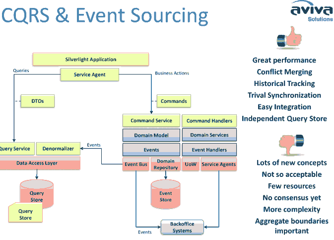

# CQRS架构

命令查询的责任分离Command Query Responsibility Segregation（简称CQRS）模式是一种架构体系模式，能够使改变模型状态的命令和模型状态的查询实现分离。这属于DDD应用领域的一个模式，主要解决DDD在数据库报表输出上的处理方式。

Greg Young在infoQ的采访中“State Transitions in Domain-Driven Design”谈到了CQRS，Greg 解释了把领域模型分为两种：状态校验，以及状态转换，维持当前状态的一个视图。

在客户端就将数据的新增修改删除等动作和查询进行分离，前者称为Command，走Command bus进入Domain对模型进行操作，而查询则从另外一条路径直接对数据进行操作，比如报表输出等。

当一个Command进来时，从仓储Repository加载一个聚合aggregate对象群，然后执行其方法和行为。这样，会激发聚合对象群产生一个事件，这个事件可以分发给仓储Repository，或者分发给Event Bus事件总线，比如JavaEE的消息总线等等。事件总线将再次激活所有监听本事件的处理者。当然一些处理者会执行其他聚合对象群的操作，包括数据库的更新。

因为领域对象操作和数据库保存持久这两个动作分离，因此，数据表结构可以和领域对象松耦合（JiveJdon源码可展示领域对象和数据表不再是一对一对应依赖，这也是使用Hibernate 等ORM框架容易造成的问题），你可以优化数据表结构专门用于查询。

再者，由于事件驱动了领域模型的状态改变，如果你记录这些事件audit，就可以将一些用户操作进行回放，从而找到重要状态改变的轨迹，而不是单纯只能依靠数据表字段显示当前状态，至于这些当前状态怎么来的，你无法得知。当你从数据库中获得聚合体时，可以将相关的事件也取出来，这些叫Event Sourcing，事件源虽然没有何时何地发生，但是可以清楚说明用户操作的意图。

虽然这种架构有些复杂，但是好处却很多，主要的是实现透明的分布式处理Transparent distributed processing，当使用事件作为状态改变的引擎时，你可以通过实现多任务并发处理，比如通过JVM并行计算或事件消息总线机制，事件能够很容易序列化，并在多个服务器之间传送，（EJB提倡贫血失血模型，实际就是为解决胖模型在多个服务器之间传送时序列化耗费性能，现在我们不序列化模型，而是改变模型数据的事件）。
